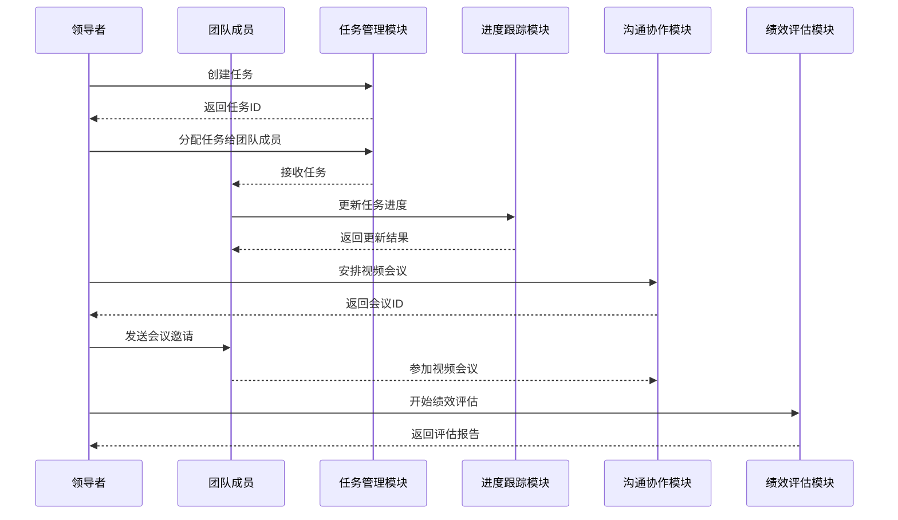

                 

### 第1章 远程工作与领导力的挑战

在当今快速变化的工作环境中，远程工作已经成为一种常态。根据国际数据公司（IDC）的报告，全球远程工作人数在过去几年中大幅增加，预计到2025年，全球远程工作人数将达到4.07亿人，占全球劳动力的3成以上。远程工作的兴起不仅改变了员工的工作方式，也对领导力提出了新的挑战。本文将探讨远程工作背景、领导力的重要性以及远程工作领导力面临的挑战。

#### 1.1 远程工作背景

远程工作的概念最早可以追溯到20世纪60年代，当时主要是一些技术专家和研究人员在家工作。随着信息技术的发展，尤其是互联网和移动设备的普及，远程工作逐渐成为可能，并逐渐成为一种主流的工作形式。特别是在2020年初爆发的新冠疫情中，远程工作成为了许多企业和员工维持正常工作的唯一途径。

远程工作的兴起有其独特的优势，如节省通勤时间、提高工作灵活性、减少办公成本等。然而，远程工作也带来了一些挑战，例如沟通障碍、管理效率低下、团队凝聚力不足等。这些问题对于领导力提出了新的要求。

#### 1.1.1 远程工作的兴起

远程工作的兴起可以追溯到几个关键因素：

1. **技术进步**：互联网和移动设备的普及使得远程工作变得可能。云计算、视频会议和协作工具的出现极大地提高了远程工作的效率和效果。
2. **经济全球化**：企业需要全球范围内的人才，远程工作为跨国公司提供了灵活的人才招聘和分配方式。
3. **工作与生活平衡**：许多员工追求工作与生活的平衡，远程工作可以提供更多自主安排时间的机会。

#### 1.1.2 远程工作的优势与挑战

远程工作有以下几个显著优势：

1. **节省通勤时间**：员工无需每天通勤，从而节省了大量时间和交通成本。
2. **提高工作灵活性**：员工可以根据个人需求灵活安排工作时间，提高工作效率和满意度。
3. **减少办公成本**：企业无需为员工提供实体办公空间，从而降低了办公成本。

然而，远程工作也带来了一些挑战：

1. **沟通障碍**：远程工作缺乏面对面的交流，可能导致信息传递不准确或延迟。
2. **管理效率**：远程工作的管理难度较大，如何确保项目进度和团队协作成为一大挑战。
3. **团队凝聚力**：缺乏面对面的互动可能削弱团队凝聚力，影响团队协作效果。

#### 1.2 领导力的重要性

领导力是组织成功的关键因素之一。有效的领导力不仅能够激发员工的潜能，提高团队绩效，还能够应对外部环境的变革和挑战。在远程工作中，领导力的重要性更加凸显。

#### 1.2.1 领导力的定义

领导力是一种能力，它涉及到激励和引导他人去实现共同目标。领导力不仅仅是指领导者个人的素质，还包括领导者与团队成员之间的互动和关系。

#### 1.2.2 领导力在远程工作中的应用

在远程工作中，领导力需要适应新的环境和挑战：

1. **沟通与协作**：远程领导力需要特别注重沟通和协作，通过使用各种工具和平台来保持与团队成员的联系。
2. **信任与透明度**：远程领导力要求建立信任，确保团队成员能够透明地了解公司的目标和决策。
3. **激励与反馈**：远程领导力需要找到合适的激励方式，例如通过定期的在线会议和反馈机制来保持团队的动力。

#### 1.3 远程工作领导力的挑战

远程工作为领导力带来了新的挑战：

1. **沟通障碍**：缺乏面对面的交流可能导致信息传递不准确或延迟，影响决策和团队协作。
2. **管理效率**：远程工作的管理难度较大，如何确保项目进度和团队协作成为一大挑战。
3. **团队凝聚力**：缺乏面对面的互动可能削弱团队凝聚力，影响团队协作效果。

为了应对这些挑战，领导力需要不断适应和改进，以适应远程工作的特殊需求。

#### 1.4 本章小结

远程工作的兴起给领导力带来了新的挑战。有效的远程领导力需要关注沟通、协作、信任和激励等方面。了解这些挑战和应对策略对于组织成功至关重要。在下一章中，我们将深入探讨领导力的定义和分类，以及远程工作的定义和特征。这将为我们后续分析领导力在远程工作中的具体应用打下基础。

---

### 第2章 领导力定义与分类

领导力是一种在组织中至关重要的能力，它不仅影响着个人和团队的表现，也影响着整个组织的成功。为了更好地理解领导力在远程工作中的应用，我们需要首先明确领导力的定义，并对其进行分类。本章将介绍领导力的定义、传统领导力理论与当代领导力理论，以及领导力的分类。

#### 2.1 领导力的定义

领导力是一种能力，它涉及到激励和引导他人去实现共同目标。领导力不仅仅是指领导者个人的素质，还包括领导者与团队成员之间的互动和关系。有效领导力需要领导者具备一系列技能，如沟通能力、决策能力、团队合作能力、影响力等。

#### 2.1.1 传统领导力理论

传统领导力理论主要包括特质理论和行为理论。

1. **特质理论**：特质理论认为领导者天生具备某些特质，如智慧、自信、诚实等，这些特质使他们能够成为领导者。特质理论强调领导者个人素质的重要性，但缺乏对领导情境的考虑。
2. **行为理论**：行为理论认为领导者通过特定的行为来影响团队和组织。行为理论关注领导者具体的行为模式，而不是领导者的个人特质。这种理论认为，不同的领导行为可以在不同情境下产生不同的效果。

#### 2.1.2 当代领导力理论

当代领导力理论更加注重情境因素，强调领导力不是一成不变的，而是需要根据不同情境进行调整。以下是几种重要的当代领导力理论：

1. **情境领导力理论**：情境领导力理论认为，领导风格应该根据团队成员的成熟度进行调整。领导者的行为应基于团队成员的自主性和依赖性，以及任务的具体情况。情境领导力强调领导者需要根据不同情境选择最合适的领导风格。

2. **变革型领导力理论**：变革型领导力理论认为，领导者通过激励和鼓舞团队成员，推动组织变革和创新。变革型领导者具备愿景、自信、影响力等特质，能够激发团队成员的积极性和创造力。

3. **服务型领导力理论**：服务型领导力理论认为，领导者应该以服务团队成员为中心，关注团队成员的需求和成长。服务型领导者通过建立信任、提供支持和激励，推动团队成员的全面发展。

#### 2.2 领导力的分类

根据领导力理论的不同，可以将领导力分为以下几种类型：

1. **传统领导力**：传统领导力主要依赖于领导者的权威和影响力。领导者通过制定规则、监督执行来确保组织目标的实现。

2. **变革型领导力**：变革型领导力强调领导者的激励和鼓舞作用，通过激发团队成员的内在动机，推动组织变革和创新。

3. **情境领导力**：情境领导力根据团队成员的成熟度和任务特点选择最合适的领导风格。领导者需要具备灵活应变的能力，以适应不同的领导情境。

4. **服务型领导力**：服务型领导力以服务团队成员为中心，关注团队成员的需求和成长。领导者通过建立信任、提供支持和激励，推动团队成员的全面发展。

#### 2.3 本章小结

领导力是组织成功的关键因素之一。了解领导力的定义和分类有助于我们更好地理解领导力在远程工作中的应用。传统领导力理论和行为理论为我们提供了对领导者个人特质和行为的理解，而当代领导力理论则强调了情境因素和团队成员的需求。在接下来的章节中，我们将进一步探讨远程工作的定义和特征，以及领导力在远程工作中的具体应用。

---

### 第3章 远程工作的定义与特征

远程工作，作为一种灵活的工作方式，正在逐渐改变着传统的工作模式。在理解远程工作的定义和特征之后，我们可以更好地认识到远程工作给组织和员工带来的机遇和挑战。本章将详细介绍远程工作的定义、历史和现状，并探讨远程工作的主要特征。

#### 3.1 远程工作的定义

远程工作，顾名思义，是指员工在不同地点工作，通过网络和其他通讯技术实现与组织的联系和协作。远程工作可以包括全职远程、兼职远程以及项目制远程工作等形式。根据美国远程工作协会（WorldatWork）的定义，远程工作是指员工与组织之间大部分工作活动不是在传统的办公环境中进行的。

#### 3.1.1 远程工作的历史

远程工作并非现代才有的概念，其历史可以追溯到20世纪初期。当时，一些技术专家和研究人员已经开始在家工作，利用电话和邮件进行交流和协作。随着计算机和互联网技术的发展，远程工作逐渐成为一种可行的工作方式。特别是在20世纪90年代，互联网的普及极大地推动了远程工作的发展。进入21世纪，远程工作已经成为许多企业和组织的一种常见工作模式。

#### 3.1.2 远程工作的现状

近年来，远程工作的比例显著增加，尤其是在新冠疫情期间，许多企业不得不迅速适应远程工作的模式。根据国际数据公司（IDC）的报告，2020年全球远程工作人数占比达到了31%，这一比例预计将在未来几年内继续上升。远程工作的现状表现为以下几个方面：

1. **行业分布**：远程工作在信息技术、金融、咨询等行业中较为普遍，而在制造业、服务业等行业中相对较少。
2. **地域分布**：远程工作在发达国家和大城市中更为常见，而在发展中国家和偏远地区相对较少。
3. **工作形式**：远程工作形式多样，包括全职远程、兼职远程、灵活工作时间和项目制远程等。

#### 3.2 远程工作的特征

远程工作具有以下几个显著特征：

1. **工作灵活性**：远程工作使员工可以在任何有网络连接的地方工作，灵活安排工作时间，提高工作效率和满意度。
2. **独立性**：远程工作要求员工具备较高的独立性和自我管理能力，能够在没有直接监督的情况下高效完成工作任务。
3. **跨文化沟通**：远程工作团队可能分布在不同的国家和文化背景中，这对沟通提出了更高的要求。

#### 3.2.1 工作灵活性

工作灵活性是远程工作最突出的特征之一。远程工作使员工能够灵活安排工作时间和地点，这种灵活性不仅提高了员工的工作效率，也提高了员工的工作满意度。例如，一些员工可以选择在早晨处理重要任务，而在下午处理一些琐碎的工作，这种灵活的工作方式有助于他们更好地平衡工作与生活。

#### 3.2.2 独立性

远程工作要求员工具备较高的独立性，这意味着员工需要在没有直接监督的情况下自我管理，确保任务按时完成。这种独立性不仅考验员工的自律能力，也考验员工的时间管理能力和工作责任感。对于一些习惯于在办公室环境中工作的员工来说，远程工作可能需要一段适应期。

#### 3.2.3 跨文化沟通

远程工作团队可能分布在不同的国家和文化背景中，这增加了沟通的复杂性和挑战性。不同的文化背景可能导致沟通方式、工作习惯和价值观的差异。例如，一些文化中重视直接和明确的沟通，而另一些文化中则更注重委婉和间接的表达方式。跨文化沟通的挑战需要通过有效的沟通策略和工具来克服。

#### 3.3 本章小结

远程工作作为一种灵活的工作方式，正在改变着传统的工作模式。了解远程工作的定义、历史和现状，以及远程工作的特征，有助于我们更好地认识远程工作给组织和员工带来的机遇和挑战。在下一章中，我们将探讨领导力与远程工作之间的关系，分析远程工作对领导力的影响，并探讨如何有效应对远程工作中的领导挑战。

---

### 第4章 领导力与远程工作之间的关系

远程工作作为一种新兴的工作方式，对传统的领导力模式提出了新的要求和挑战。理解领导力与远程工作之间的关系，有助于我们在复杂的远程工作环境中找到有效的领导策略。本节将分析远程工作对领导力的影响，探讨领导力在远程工作中的应用，并讨论领导力在远程团队管理和远程工作沟通中的关键作用。

#### 4.1 远程工作对领导力的影响

远程工作环境对领导力的影响是多方面的，主要体现在以下几个方面：

1. **沟通障碍**：远程工作缺乏面对面的交流，可能导致信息传递不准确或延迟。这种沟通障碍可能会影响领导者的决策和团队协作。
2. **管理难度**：远程工作的管理难度较大，领导者需要通过非传统的方式监督和激励团队成员，以确保项目进度和团队目标的一致性。
3. **团队凝聚力**：远程工作可能削弱团队凝聚力，缺乏面对面的互动可能使团队成员感到孤立，影响团队合作效果。

尽管远程工作带来了一些挑战，但也为领导力提供了新的机遇：

1. **多样化的团队**：远程工作使组织能够吸引和留住全球范围内的人才，构建多样化的团队。
2. **灵活的工作安排**：远程工作提供灵活的工作安排，有助于提高员工的工作满意度和生产率。

#### 4.1.1 挑战与机遇

远程工作对领导力提出了新的挑战，但同时也创造了机遇。领导者的任务是在这些挑战中找到合适的策略，充分利用机遇。以下是几个关键挑战和机遇：

**挑战：**
1. **沟通障碍**：解决沟通障碍需要领导者采用新的沟通工具和技术，如视频会议、即时通讯和协作平台。
2. **管理效率**：提高远程工作的管理效率需要领导者建立清晰的绩效指标和反馈机制。
3. **团队凝聚力**：增强团队凝聚力需要领导者通过线上活动和文化建设来促进团队成员之间的互动。

**机遇：**
1. **全球招聘**：远程工作使组织能够打破地域限制，吸引全球范围内的顶尖人才。
2. **灵活管理**：远程工作提供了灵活的工作安排，有助于领导者更好地管理时间和资源。

#### 4.1.2 领导力策略的调整

为了应对远程工作带来的挑战和机遇，领导者需要调整领导策略：

1. **沟通策略**：领导者应定期举行线上会议，确保信息的及时传递和团队的紧密联系。同时，采用多种沟通工具，如电子邮件、即时通讯和视频会议，以适应不同的沟通需求。
2. **管理策略**：领导者应建立清晰的绩效指标和反馈机制，确保团队成员了解工作目标和期望。同时，采用灵活的管理方法，鼓励自主学习和自我管理。
3. **团队建设**：领导者应通过线上活动和团队合作项目，增强团队凝聚力。例如，定期举办线上团队建设活动，鼓励团队成员分享经验和见解。

#### 4.2 领导力在远程工作中的应用

在远程工作中，领导力需要适应新的环境，并发挥关键作用。以下是领导力在远程工作中的几个关键应用：

1. **沟通与协作**：远程领导力需要特别注重沟通和协作。领导者应确保信息的透明传递，鼓励团队成员积极参与决策和项目讨论。使用协作工具和平台，如Trello、Slack和Microsoft Teams，可以帮助团队成员保持高效的沟通和协作。
2. **信任与透明度**：在远程工作中，建立信任和透明度尤为重要。领导者应确保团队成员了解公司的目标和决策过程，通过透明的沟通和反馈建立信任。
3. **激励与反馈**：远程领导力需要找到合适的激励方式，如定期的在线会议和反馈机制，来保持团队的动力和积极性。领导者应关注团队成员的进步和成就，及时给予认可和鼓励。

#### 4.2.1 领导力在远程团队管理中的关键作用

远程领导力在团队管理中扮演着关键角色。以下是一些具体的领导力实践：

1. **明确目标和角色**：领导者应确保团队成员明确自己的工作目标和角色，避免任务重叠和责任模糊。
2. **建立反馈机制**：领导者应建立定期的反馈机制，如每周或每月的团队会议，了解团队成员的工作进展和面临的挑战。
3. **提供支持**：领导者应提供必要的支持和资源，帮助团队成员解决工作中遇到的问题，确保项目顺利推进。

#### 4.2.2 领导力在远程工作沟通中的关键作用

远程工作的沟通障碍要求领导者采取特别的沟通策略。以下是一些关键沟通实践：

1. **透明沟通**：领导者应保持沟通的透明度，确保团队成员了解公司的目标和决策过程。
2. **及时反馈**：领导者应及时给予团队成员反馈，帮助他们改进工作方法和提高绩效。
3. **多样化沟通工具**：领导者应利用多种沟通工具，如电子邮件、即时通讯和视频会议，以满足不同沟通需求。

#### 4.3 本章小结

远程工作对领导力提出了新的挑战和机遇。领导者需要适应远程工作的特殊环境，采用新的沟通和管理策略，以保持团队的高效运作和团队凝聚力。通过有效的领导力，领导者可以在远程工作中激发团队成员的潜力，推动组织的成功。在下一章中，我们将探讨领导力理论在远程工作中的应用，以及远程工作管理策略和技巧。

---

### 第5章 领导力理论在远程工作中的应用

在远程工作环境中，领导力理论的应用至关重要。本章节将详细探讨两种常见的领导力理论——转变型领导力和情境领导力，并分析它们在远程工作中的具体应用和实践。

#### 5.1 转变型领导力在远程工作中的运用

转变型领导力是一种注重激励和激发团队成员潜力的领导风格。它强调领导者通过愿景、个人魅力和激励手段来引导和影响团队成员，从而推动团队实现变革和创新。

1. **愿景领导**：在远程工作中，领导者需要明确团队的愿景和目标，并通过线上会议和内部通讯工具与团队成员分享。领导者应定期更新团队的愿景，确保团队成员了解公司的长期目标和战略方向。

2. **激励员工**：转变型领导者通过认可和奖励来激励团队成员。在远程工作中，领导者可以采用在线表彰会议、虚拟奖杯等方式来表彰员工的成就。此外，领导者还可以通过提供职业发展机会和培训计划来激励员工。

3. **培养信任**：远程工作环境中，领导者需要特别注重培养信任。通过定期的一对一沟通和团队建设活动，领导者可以增强团队成员之间的信任和协作。

**案例实践：** 
某跨国公司的CEO在远程工作中采用了转变型领导力，他定期与团队成员进行视频会议，分享公司的愿景和战略目标。同时，他通过在线表彰会议和虚拟奖杯来表彰员工的成就，激励团队成员的积极性和创造力。此外，他还提供了一系列在线培训课程，帮助员工提升技能和职业素养。这些措施有效地增强了团队的凝聚力和工作效率。

#### 5.2 情境领导力在远程工作中的运用

情境领导力是一种根据团队成员的成熟度和工作环境动态调整领导风格的领导理论。它强调领导者应根据团队成员的能力、工作环境和个人需求来选择最合适的领导策略。

1. **评估团队成员的成熟度**：在远程工作中，领导者需要定期评估团队成员的成熟度，了解他们的能力、经验和自我管理能力。这有助于领导者选择最合适的领导风格。

2. **灵活调整领导风格**：根据团队成员的成熟度，领导者可以采用不同的领导风格。对于成熟度较高的团队成员，领导者可以采用授权型领导风格，鼓励他们自主决策和承担责任。对于成熟度较低的团队成员，领导者可以采用指导型领导风格，提供具体的工作指导和反馈。

3. **提供个性化支持**：远程领导力要求领导者根据团队成员的个人需求和偏好提供个性化的支持。例如，一些团队成员可能更喜欢独立工作，而另一些团队成员可能需要更多的指导和反馈。

**案例实践：**
某远程团队的管理者在应用情境领导力时，首先对团队成员进行了能力评估，并根据评估结果调整了领导风格。对于成熟度较高的团队成员，管理者采用授权型领导风格，鼓励他们自主决策并承担更多的责任。对于成熟度较低的团队成员，管理者则提供更多具体的指导和反馈，帮助他们提高工作技能和自我管理能力。此外，管理者还根据团队成员的个人需求和偏好，提供个性化的职业发展支持，如培训课程和工作任务调整。

#### 5.3 远程领导力实践总结

在远程工作中，领导力理论的运用需要结合具体实践进行调整。以下是一些关键的远程领导力实践总结：

1. **定期沟通和反馈**：领导者应定期与团队成员沟通，了解他们的工作进展和面临的挑战，提供及时的反馈和指导。
2. **灵活调整领导风格**：领导者应根据团队成员的成熟度和工作环境动态调整领导风格，确保团队成员获得最佳的支持和指导。
3. **提供个性化支持**：领导者应根据团队成员的个人需求和偏好提供个性化的支持，帮助他们实现职业和个人成长。

#### 5.4 本章小结

转变型领导力和情境领导力在远程工作中具有重要作用。领导者需要通过愿景领导、激励员工和培养信任等手段，激发团队成员的潜力，推动团队实现目标。同时，领导者应根据团队成员的成熟度和工作环境，灵活调整领导风格，提供个性化支持。通过有效的远程领导力实践，领导者可以克服远程工作中的挑战，提升团队效率和凝聚力。

---

### 第6章 远程工作管理策略和技巧

在远程工作环境中，管理策略和技巧的运用至关重要。为了确保远程工作的有效性和效率，领导者需要采用一系列特定的沟通策略、管理技巧以及提高远程工作管理效率的方法。本章节将详细探讨这些策略和技巧，帮助领导者更好地管理远程团队。

#### 6.1 沟通策略

沟通是远程工作中最为关键的环节之一。以下是一些有效的沟通策略：

1. **定期会议**：领导者应定期举行线上会议，如每周或每月的团队会议，以确保团队成员了解工作进展、目标和计划。会议可以采用视频会议工具，如Zoom、Microsoft Teams等，以确保有效的面对面交流。
   
2. **即时通讯工具**：即时通讯工具，如Slack、WhatsApp等，可以用于日常交流和任务分配。这些工具可以帮助团队成员快速解决问题，提高工作效率。

3. **透明沟通**：领导者应确保沟通的透明度，避免信息不对称。通过共享工作进展、任务分配和决策过程，领导者可以增强团队成员之间的信任和协作。

4. **电子邮件**：对于重要信息或需要详细说明的问题，电子邮件是一种有效的沟通方式。领导者应确保邮件内容清晰、简洁，避免信息遗漏。

#### 6.2 管理技巧

在远程工作中，领导者需要采用一些特殊的管理技巧来确保团队的效率和凝聚力：

1. **明确目标和角色**：领导者应确保每个团队成员都明确自己的工作目标和角色。通过制定详细的任务描述和目标，可以帮助团队成员更好地理解自己的职责，减少工作中的误解和冲突。

2. **建立反馈机制**：领导者应建立定期的反馈机制，如每周或每月的绩效评估，以确保团队成员的工作质量。通过积极的反馈，领导者可以鼓励团队成员改进工作，提高绩效。

3. **提供培训和支持**：领导者应提供必要的培训和支持，帮助团队成员提高技能和自我管理能力。这可以包括在线课程、研讨会和工作坊等。

4. **鼓励自我管理**：远程工作要求团队成员具备较高的自我管理能力。领导者应鼓励团队成员制定个人工作计划，自我监控进度，并确保按时完成任务。

#### 6.3 提高远程工作管理效率的方法

为了提高远程工作的管理效率，领导者可以采用以下方法：

1. **使用项目管理工具**：使用项目管理工具，如Trello、Jira等，可以帮助领导者跟踪项目进度、任务分配和团队成员的工作情况。这些工具提供了可视化界面，使领导者能够实时了解项目状态。

2. **自动化流程**：领导者可以通过自动化工具，如工作流自动化软件，减少重复性任务，提高工作效率。例如，自动发送提醒、审批流程等。

3. **设定明确的时间框架**：领导者应设定明确的工作时间框架，确保团队成员能够合理安排工作，避免时间浪费。例如，设定每周的工作时间表，明确每个任务的时间分配。

4. **优化工具和设备**：领导者应确保团队成员拥有必要的工具和设备，如高速互联网、专业的视频会议设备等，以提高工作效率。

#### 6.4 案例实践

以下是一个远程工作管理策略的实际案例：

某远程团队的管理者采用了以下策略来提高管理效率：

1. **定期视频会议**：每周举行一次团队视频会议，讨论项目进展和面临的挑战。通过视频会议，团队成员能够面对面交流，增强团队的凝聚力。
   
2. **使用Slack进行日常沟通**：团队使用Slack进行日常交流和任务分配。通过Slack，团队成员可以快速响应问题，提高工作效率。

3. **明确目标和角色**：每位团队成员都收到了详细的任务描述和目标，确保他们了解自己的职责和期望。

4. **使用Trello进行项目管理**：团队使用Trello来跟踪项目进度和任务分配。通过Trello的看板界面，管理者可以实时了解项目的状态，及时调整资源。

5. **定期反馈**：每月进行一次绩效评估，管理者会与每位团队成员进行一对一的反馈会议，讨论他们的工作表现和改进点。

这些策略和技巧不仅提高了团队的工作效率，也增强了团队成员之间的协作和沟通。

#### 6.5 本章小结

远程工作管理需要领导者采用一系列特定的沟通策略和管理技巧。通过定期会议、即时通讯、透明沟通、明确目标和角色、建立反馈机制、提供培训和支持等策略，领导者可以确保远程工作的有效性和效率。在下一章中，我们将介绍相关的数学模型和数学公式，进一步探讨远程工作的绩效评估和领导力评估方法。

---

### 第7章 领导力与远程工作的数学模型

在远程工作中，领导力评估和绩效评估是关键环节。通过建立数学模型，我们可以更科学地评估领导力和绩效，从而制定有效的管理策略。本章将介绍两种相关的数学模型：领导力评估模型和远程工作绩效评估模型。

#### 7.1 领导力评估模型

领导力评估模型用于衡量领导者的能力和影响。以下是一个简化的领导力评估模型：

1. **领导力指标**：首先，定义领导力的各项指标，如沟通能力、决策能力、团队合作能力、影响力等。每个指标可以划分为多个子指标，如沟通能力可以分为清晰表达、有效倾听、信息传递速度等。
   
   $$\text{领导力指标} = \sum_{i=1}^{n} w_i \times \text{子指标}_i$$

   其中，$w_i$为权重，表示不同子指标的重要性。

2. **评估方法**：采用360度评估方法，收集团队成员、上级领导和其他相关人员的反馈。通过问卷调查或访谈，收集对领导者各项指标的评价数据。

3. **评估公式**：

   $$\text{领导力得分} = \sum_{i=1}^{n} \frac{\text{评价人数} \times \text{评价分数}}{\text{评价人数总和}}$$

   其中，$\text{评价分数}$为参与评估人员的评分，$\text{评价人数}$为参与评估的总人数。

4. **案例示例**：

   设某领导者的领导力指标包括沟通能力、决策能力和团队合作能力，各项指标的权重分别为0.3、0.4和0.3。团队成员对其沟通能力的平均评分为4.5，决策能力的平均评分为4.8，团队合作能力的平均评分为4.7。则该领导者的领导力得分为：

   $$\text{领导力得分} = 0.3 \times 4.5 + 0.4 \times 4.8 + 0.3 \times 4.7 = 4.68$$

#### 7.2 远程工作绩效评估模型

远程工作绩效评估模型用于衡量团队成员的工作表现和成果。以下是一个简化的绩效评估模型：

1. **绩效指标**：定义团队成员的绩效指标，如任务完成度、工作效率、团队协作、创新能力等。

2. **评估方法**：采用目标管理法（KPI），制定明确的绩效目标，并定期评估团队成员的工作表现。评估方法可以包括自我评估、上级评估和同事评估。

3. **评估公式**：

   $$\text{绩效得分} = \sum_{i=1}^{m} w_i \times \text{指标}_i$$

   其中，$w_i$为权重，表示不同绩效指标的重要性。

4. **案例示例**：

   设某团队成员的绩效指标包括任务完成度、工作效率和团队协作，各项指标的权重分别为0.4、0.3和0.3。该团队成员的任务完成度得分为90%，工作效率得分为85%，团队协作得分为80%。则该团队成员的绩效得分为：

   $$\text{绩效得分} = 0.4 \times 90\% + 0.3 \times 85\% + 0.3 \times 80\% = 85.5\%$$

#### 7.3 本章小结

通过建立数学模型，我们可以更科学地评估领导力和远程工作绩效。领导力评估模型和远程工作绩效评估模型提供了量化的评估方法，有助于领导者和管理者制定有效的管理策略。在下一章中，我们将探讨远程工作管理系统的架构设计，分析系统功能模块和接口设计。

---

### 第8章 远程工作管理系统的架构设计

在远程工作环境中，一个高效的管理系统对于确保团队协作和项目进度的可控性至关重要。本章节将详细介绍远程工作管理系统的架构设计，包括系统功能模块、系统架构图、接口设计和系统交互序列图。

#### 8.1 系统介绍

远程工作管理系统（Remote Work Management System，RWMS）是一个集成多种功能的应用程序，旨在帮助领导者和管理者更有效地管理远程团队。系统的主要功能包括任务管理、进度跟踪、沟通协作、绩效评估和反馈机制等。通过这些功能，系统旨在提升团队工作效率，增强团队协作，并确保项目按计划顺利进行。

#### 8.2 系统功能设计

远程工作管理系统包含以下几个关键功能模块：

1. **任务管理**：任务管理模块用于创建、分配和跟踪任务。领导者可以创建任务，并分配给团队成员，同时设置任务截止日期和优先级。团队成员可以查看任务详情，并更新任务状态。

2. **进度跟踪**：进度跟踪模块用于实时监控项目进展。领导者可以查看各个任务和项目的状态，及时发现潜在的问题，并采取必要的措施。

3. **沟通协作**：沟通协作模块提供了多种沟通渠道，如即时聊天、邮件、视频会议等，以帮助团队成员保持高效的沟通和协作。

4. **绩效评估**：绩效评估模块用于定期评估团队成员的工作表现。领导者可以通过该模块设置评估指标，收集团队成员的绩效数据，并生成详细的评估报告。

5. **反馈机制**：反馈机制模块用于收集和记录团队成员的反馈，以帮助领导者和管理者不断改进管理策略和工作流程。

#### 8.3 系统架构设计

远程工作管理系统的架构设计采用了分层架构，包括表示层、业务逻辑层和数据层。以下是系统架构的详细设计：

1. **表示层**：表示层主要负责用户界面设计，提供用户友好的交互界面。用户可以通过Web浏览器或移动应用访问系统，进行任务管理、进度跟踪、沟通协作等操作。

2. **业务逻辑层**：业务逻辑层处理系统的核心业务功能，如任务分配、进度更新、绩效评估等。该层包含了多个服务，如任务管理服务、进度跟踪服务、沟通协作服务等。

3. **数据层**：数据层负责数据存储和管理。系统使用关系型数据库（如MySQL）来存储用户信息、任务数据、项目数据等。数据层还提供了数据访问对象（DAO），以便业务逻辑层和服务层访问数据库。

#### 8.4 系统接口设计

远程工作管理系统提供了多个API接口，以便与其他系统和工具集成。以下是系统的主要接口设计：

1. **任务管理API**：用于创建、更新和查询任务。包括以下操作：
   - `POST /tasks`：创建新任务
   - `GET /tasks/{taskId}`：查询特定任务的详细信息
   - `PUT /tasks/{taskId}`：更新任务状态和详细信息
   - `DELETE /tasks/{taskId}`：删除任务

2. **进度跟踪API**：用于更新和查询项目进度。包括以下操作：
   - `POST /progress`：创建新进度记录
   - `GET /progress/{progressId}`：查询特定进度记录的详细信息
   - `PUT /progress/{progressId}`：更新进度记录
   - `DELETE /progress/{progressId}`：删除进度记录

3. **沟通协作API**：用于管理沟通和协作。包括以下操作：
   - `POST /messages`：发送新消息
   - `GET /messages`：查询消息记录
   - `POST /meetings`：安排新的视频会议
   - `GET /meetings/{meetingId}`：查询特定视频会议的详细信息

4. **绩效评估API**：用于管理和评估团队成员的绩效。包括以下操作：
   - `POST /assessments`：创建新的绩效评估
   - `GET /assessments/{assessmentId}`：查询特定绩效评估的详细信息
   - `PUT /assessments/{assessmentId}`：更新绩效评估结果
   - `DELETE /assessments/{assessmentId}`：删除绩效评估记录

#### 8.5 系统交互序列图

系统交互序列图展示了各个模块和接口之间的交互流程。以下是一个简化的系统交互序列图：



#### 8.6 本章小结

远程工作管理系统通过详细的功能模块设计、系统架构图、接口设计和交互序列图，为远程工作提供了强有力的支持。系统功能模块涵盖了任务管理、进度跟踪、沟通协作、绩效评估和反馈机制，系统架构采用了分层设计，接口设计考虑了与其他系统和工具的集成。通过系统交互序列图，可以直观地理解各个模块和接口之间的交互流程。在下一章中，我们将通过实际案例来展示如何使用远程工作管理系统，以及系统的核心代码实现。

---

### 第9章 项目实战

为了更好地展示远程工作管理系统的实际应用，我们选择了一个具体的案例来进行详细讲解。在这个案例中，我们将介绍系统的环境安装、核心代码实现，并剖析系统在实际项目中的应用效果。

#### 9.1 案例背景

某跨国公司决定采用远程工作管理系统来优化其全球团队的管理流程。公司有多个远程团队分布在不同的国家和地区，涉及软件开发、市场营销、客户支持等不同领域。为了提高团队协作效率和项目管理效果，公司决定实施远程工作管理系统。

#### 9.2 环境安装

首先，我们需要安装和配置远程工作管理系统所需的软件和硬件环境。以下是环境安装的详细步骤：

1. **操作系统**：选择Linux操作系统，如Ubuntu 20.04，作为服务器操作系统。

2. **数据库**：安装MySQL数据库，用于存储用户数据、任务数据、项目数据等。

   ```bash
   sudo apt update
   sudo apt install mysql-server
   sudo mysql_secure_installation
   ```

3. **Web服务器**：安装Nginx作为Web服务器，用于提供HTTP服务。

   ```bash
   sudo apt install nginx
   ```

4. **后端框架**：选择Django作为后端框架，用于构建远程工作管理系统的业务逻辑。

   ```bash
   sudo apt install python3-pip python3-venv
   pip3 install django
   ```

5. **前端框架**：选择Bootstrap作为前端框架，用于构建用户界面。

   ```bash
   pip3 install django-bootstrap4
   ```

6. **开发工具**：安装Visual Studio Code（VS Code）作为开发工具，配置Django开发环境。

7. **版本控制**：使用Git进行代码版本控制，便于团队协作和代码管理。

#### 9.3 核心代码实现

以下是远程工作管理系统的一些核心代码实现，包括后端和前端代码。

**后端代码示例（Django视图函数）：**

```python
# views.py
from django.http import HttpResponse
from django.views import View

class HomeView(View):
    def get(self, request):
        return HttpResponse("欢迎使用远程工作管理系统")

class TaskCreateView(View):
    def post(self, request):
        # 处理任务创建逻辑
        return HttpResponse("任务创建成功")
```

**前端代码示例（HTML+Bootstrap）：**

```html
<!-- templates/home.html -->
<!DOCTYPE html>
<html>
<head>
    <title>远程工作管理系统</title>
    <link href="" rel="stylesheet">
</head>
<body>
    <div class="container">
        <h1>欢迎使用远程工作管理系统</h1>
        <!-- 其他页面内容 -->
    </div>
    <script src=""></script>
</body>
</html>
```

#### 9.4 代码应用解读与分析

**后端代码解读：** 
上述后端代码展示了两个基本的视图函数：`HomeView` 和 `TaskCreateView`。`HomeView` 用于处理主页的请求，返回欢迎信息。`TaskCreateView` 用于处理创建新任务的请求，返回创建成功的响应。

**前端代码解读：** 
前端代码使用了Bootstrap框架来构建用户界面。HTML文件定义了基本的页面结构和样式，使用了Bootstrap的类来美化界面。页面中还包括了一个简单的导航栏，用于链接到其他页面。

#### 9.5 实际案例分析和详细讲解

**案例场景：** 
公司项目经理李明使用远程工作管理系统来分配和管理项目任务。他创建了一个新的项目，并分配了多个任务给团队成员。

**步骤分析：** 

1. **创建项目**：
   - 李明登录系统，进入项目管理界面。
   - 他填写了项目名称、描述和开始/结束日期，并提交创建请求。
   - 系统验证输入信息，并在数据库中保存新项目。

2. **分配任务**：
   - 李明进入项目详情页面，点击“分配任务”按钮。
   - 他选择了任务名称、任务描述、截止日期和优先级，并选择了任务负责人。
   - 系统将任务分配给负责人，并在任务管理界面显示新任务。

3. **任务跟踪**：
   - 任务负责人登录系统，查看自己的任务列表。
   - 他可以更新任务进度，并在任务完成后提交反馈。
   - 系统会自动更新任务状态，并通知项目经理和团队成员。

**效果分析：** 
通过远程工作管理系统，项目经理能够高效地创建和管理项目任务，团队成员可以清晰地了解自己的任务和进度。系统提供了实时更新和通知功能，确保项目进度得到有效跟踪和管理。

#### 9.6 项目小结

通过本案例，我们展示了远程工作管理系统在项目中的实际应用。系统通过良好的代码架构和用户界面设计，提供了高效的任务管理、进度跟踪和沟通协作功能。在实际项目中，该系统有效地提高了团队协作效率和项目管理效果。未来，我们可以继续优化系统功能，如添加更多自定义配置选项和集成第三方工具，以满足更多业务需求。

---

### 第10章 最佳实践、小结与拓展

在远程工作的背景下，领导力的重要性不言而喻。为了帮助读者更好地理解和应用远程领导力，本章将提供一系列最佳实践，总结全文的核心观点，并提出进一步阅读的建议。

#### 10.1 最佳实践

1. **建立清晰的沟通机制**：定期召开线上会议，确保信息的透明传递。使用多种沟通工具（如邮件、即时通讯、视频会议）以满足不同沟通需求。

2. **培养信任和透明度**：通过共享公司目标和决策过程，建立团队成员之间的信任。鼓励开放和诚实的沟通，减少信息不对称。

3. **关注个体需求**：了解团队成员的个人需求和偏好，提供个性化的支持和资源，帮助他们实现职业和个人成长。

4. **设定明确的绩效指标**：制定清晰的绩效目标和评估标准，确保团队成员了解工作期望和评估方法。

5. **定期反馈和指导**：通过定期的绩效评估和反馈，及时识别问题和改进点，提供具体的指导和支持。

6. **促进团队建设**：利用线上活动和文化建设，增强团队凝聚力和归属感。例如，举办虚拟团队建设活动、分享会、竞赛等。

#### 10.2 小结

本文首先介绍了远程工作和领导力的背景，探讨了远程工作给领导力带来的挑战。接着，我们分析了领导力的定义和分类，详细介绍了转变型领导力和情境领导力在远程工作中的应用。随后，我们讨论了远程工作管理策略和技巧，包括沟通策略、管理技巧以及提高远程工作管理效率的方法。通过数学模型和实际案例，我们进一步探讨了领导力和绩效评估的方法。最后，我们介绍了远程工作管理系统的架构设计和实际应用。

本文的核心观点是，在远程工作环境中，领导力不仅仅是传统的面对面交流，而是需要适应新的工作模式和环境。领导者需要通过灵活的策略和技巧，培养信任、提高透明度、关注个体需求、设定绩效指标、定期反馈和促进团队建设，以确保远程团队的效率和凝聚力。

#### 10.3 拓展阅读

为了进一步探索远程工作和领导力的主题，以下是一些建议的阅读材料：

1. **书籍**：《远程工作：如何高效地管理虚拟团队》（"Remote: How Great Leaders Set Their Teams Up for Success" by Jason Fried）——作者详细探讨了远程工作的优势和管理技巧。

2. **文章**：《远程工作的心理学》（"The Psychology of Remote Work" by Workable）——这篇文章从心理学的角度分析了远程工作对员工和领导力的影响。

3. **研讨会和课程**：参加关于远程工作和领导力的在线研讨会和课程，如LinkedIn Learning的"Leading Remote Teams"课程，获取最新的实践和策略。

通过这些拓展阅读，读者可以更深入地了解远程工作和领导力的各个方面，提升自己的远程工作领导力。

---

### 总结

本文系统地探讨了远程工作和领导力之间的关系，详细介绍了远程工作领导力的定义、分类、管理策略、数学模型以及实际应用。我们首先分析了远程工作和领导力的背景，探讨了远程工作给领导力带来的挑战。接着，我们详细介绍了领导力的定义和分类，包括传统领导力理论和当代领导力理论。在此基础上，我们深入探讨了转变型领导力和情境领导力在远程工作中的应用，并提出了有效的远程工作管理策略和技巧。

通过数学模型的建立和实际案例的分析，我们展示了如何科学地评估领导力和绩效，以及如何设计和管理远程工作管理系统。这不仅有助于提升远程工作的效率和团队凝聚力，也为远程工作领导者提供了实用的操作指南。

本文的核心观点是，远程工作领导者需要适应新的工作环境，采用灵活的领导策略和技巧，培养信任、提高透明度、关注个体需求、设定绩效指标、定期反馈和促进团队建设，以确保远程团队的效率和凝聚力。

### 作者信息

**作者：AI天才研究院/AI Genius Institute & 禅与计算机程序设计艺术 /Zen And The Art of Computer Programming**

AI天才研究院致力于推动人工智能领域的创新与发展，研究院汇集了全球顶尖的人工智能专家、程序员、软件架构师和CTO，他们在计算机编程和人工智能领域拥有深厚的专业知识和丰富的实践经验。同时，作者还撰写了《禅与计算机程序设计艺术》这一经典之作，为计算机科学领域提供了独特的思考方式和方法论。本文内容融合了作者多年在领导力、远程工作和技术领域的深刻见解，旨在为读者提供有深度、有思考、有见解的专业技术指导。

