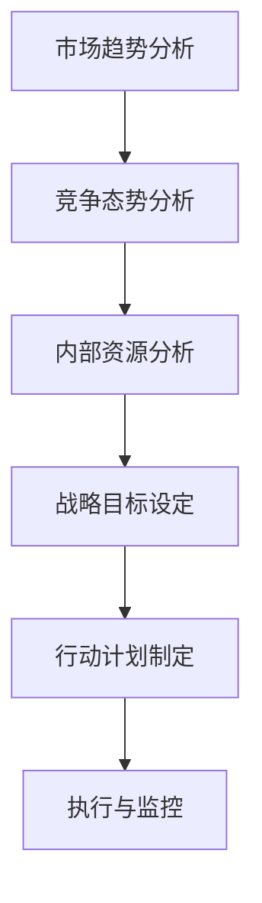
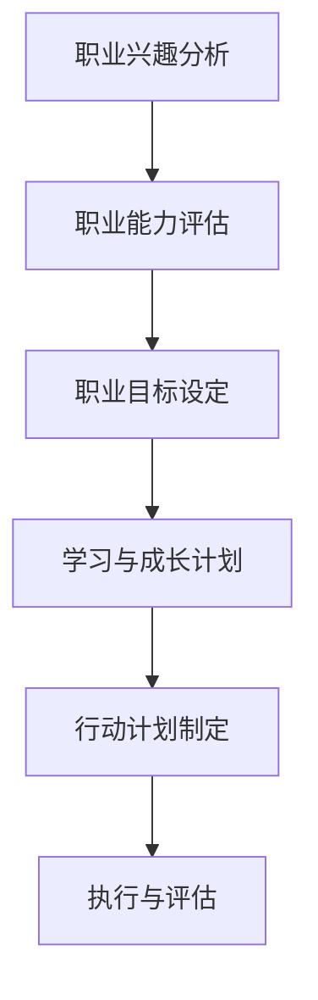
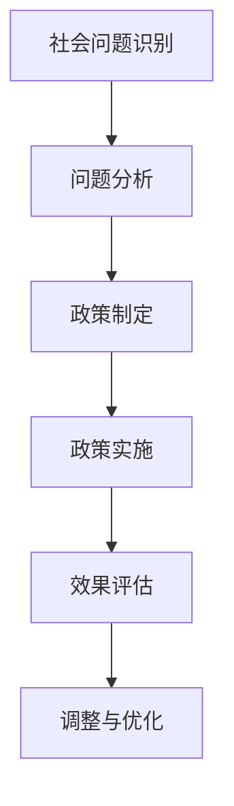
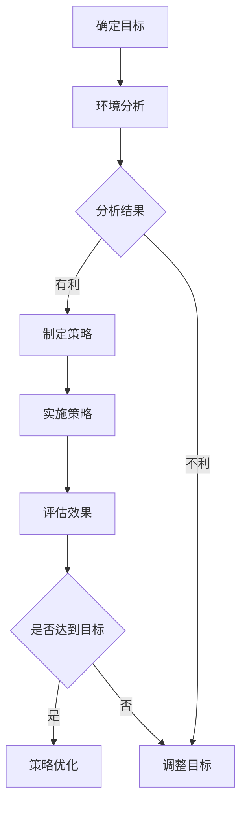
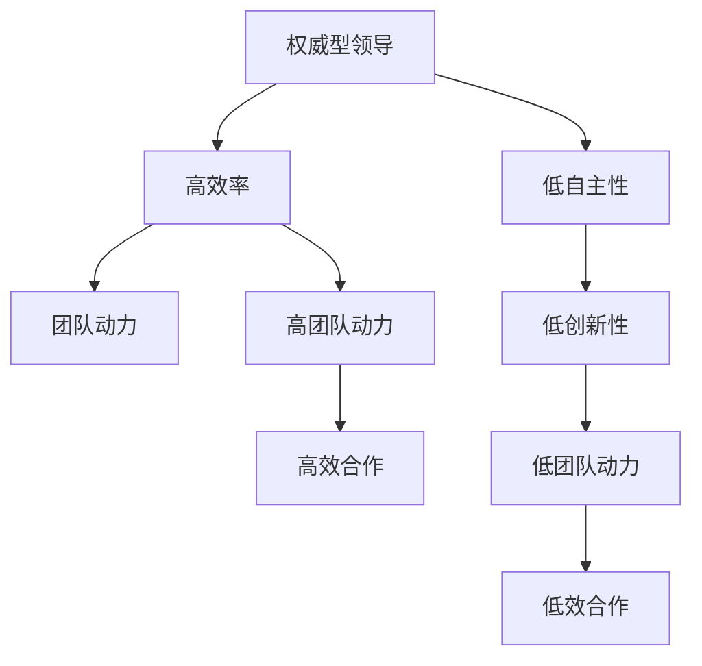

                 


## Introduction and Background

### Title and Author

"领导力与远见卓识培养：战略思维的锻炼方法" is a comprehensive guide that delves into the critical skills of leadership, foresight, and strategic thinking. Written by [Author's Name], a renowned expert in the field of technology and leadership, this book aims to provide practical insights and actionable strategies for individuals and organizations looking to cultivate these essential skills.

### Overview

The purpose of this book is to equip readers with the knowledge and tools needed to develop strong leadership skills, foster a vision for the future, and enhance their strategic thinking abilities. In today's fast-paced and ever-changing world, these skills are more crucial than ever for navigating complex challenges and achieving long-term success. Whether you are a seasoned leader or just starting out on your leadership journey, this book will offer valuable guidance and practical advice.

### Core Topics

The book is structured around three main core topics:

1. **Developing Strategic Thinking**: This section will explore the fundamental principles and processes of strategic thinking, providing readers with a robust framework for making informed decisions and planning for the future.
2. **Cultivating Leadership Skills**: Here, we will discuss the specific skills and behaviors that effective leaders exhibit, focusing on how these skills can be developed and refined over time.
3. **Applying Strategic Thinking and Leadership Skills**: The final section will demonstrate how these skills can be applied in various contexts, including business, personal development, and social governance.

### Mermaid Diagrams and Tables

- **Entity-Relationship (ER) Diagram**: To provide a visual representation of the key entities and relationships involved in strategic thinking and leadership, we will include an ER diagram.
- **Conceptual Attributes Comparison Table**: To clarify the differences between leadership and management, we will present a comparison table of key concepts and attributes.

### Conclusion

In conclusion, "领导力与远见卓识培养：战略思维的锻炼方法" is not just a book; it is a roadmap to success. By understanding and practicing the concepts and strategies outlined in this book, readers will be well-equipped to lead effectively, think strategically, and achieve their goals. Let's dive into the detailed chapters that follow and embark on this transformative journey together.

---

### Core Concepts and Frameworks

### 1.1 问题背景

#### 1.1.1 问题描述

在当今复杂多变的世界中，领导力、远见卓识和战略思维已经成为企业、组织和个体成功的关键要素。随着全球化和技术进步的加速，企业面临着前所未有的挑战和机遇。有效领导不仅要求领导者具备强大的执行力，还需要具备前瞻性的视野和战略思维，能够在不确定的环境中做出明智的决策。

#### 1.1.2 问题解决

为了解决这一问题，本书旨在为读者提供一个系统性的框架，通过深入探讨领导力、远见卓识和战略思维的核心概念，帮助读者理解这些概念的内在联系，并掌握有效培养这些能力的方法。

#### 1.1.3 边界与外延

领导力不仅仅是管理，它涉及激发团队潜力、建立信任和实现目标的能力。远见卓识则是指对未来趋势的洞察力和预测能力，而战略思维则是将这些洞察转化为实际行动的过程。本书将探讨这些概念在不同情境下的应用，包括企业战略规划、个人职业发展和社会治理等领域。

### 1.2 核心概念

#### 1.2.1 领导力的定义

领导力是一种影响力，它能够激发团队成员的潜能，引领他们朝着共同的目标前进。有效的领导力不仅依赖于技术知识和专业能力，还需要具备人际交往、沟通和解决问题的技能。

#### 1.2.2 远见卓识的含义

远见卓识是一种对未来趋势的深刻理解和对潜在机遇和挑战的预见能力。它要求领导者具备洞察力、判断力和决策力，能够在不确定性中找到方向。

#### 1.2.3 战略思维的关键要素

战略思维是一种系统性的思考过程，它包括明确目标、分析环境、制定计划、实施行动和评估结果等多个环节。有效的战略思维能够帮助领导者做出符合长远利益的重要决策。

### 1.3 ER实体关系图

为了更直观地理解领导力、远见卓识和战略思维之间的关系，我们可以使用Mermaid ER图来展示它们之间的交互作用。以下是一个简化的ER图示例：

```mermaid
erDiagram
    Leadership ||--|{ Visionary Insight }|
    Leadership ||--|{ Strategic Thinking }|
    Visionary Insight ||--|{ Decision-Making }|
    Strategic Thinking ||--|{ Action-Planning }|
```

在这个ER图中，领导力是核心实体，它与远见卓识和战略思维之间存在紧密的关联。远见卓识提供了决策的基础，而战略思维则是将远见转化为实际行动的过程。

### 1.4 概念属性特征对比表格

为了更清晰地展示领导力、远见卓识和战略思维的区别和联系，我们可以创建一个对比表格：

| 特征        | 领导力                  | 远见卓识                  | 战略思维                  |
|-------------|------------------------|--------------------------|-------------------------|
| 定义        | 激发团队潜能和实现目标   | 对未来趋势的洞察和预见     | 系统性思考决策和计划      |
| 关键要素    | 人际交往、沟通、执行力   | 洞察力、判断力、决策力     | 目标明确、环境分析、计划实施 |
| 应用领域    | 企业、组织、团队管理     | 商业、社会、个人发展      | 企业战略、项目规划、创新实践 |
| 目的        | 促进团队协作和目标达成   | 获得竞争优势和长期发展    | 实现战略目标和优化决策    |

通过以上对比表格，读者可以更全面地理解这三个核心概念，以及它们在不同情境下的具体应用。

### Conclusion

In this section, we have established the background for our discussion on leadership, foresight, and strategic thinking. We have outlined the key concepts and their relationships, providing a solid foundation for the following chapters. As we delve deeper into these topics, readers will gain a comprehensive understanding of how these concepts interact and how they can be effectively developed and applied in various contexts.

---

### Developing Strategic Thinking

### Chapter 2: 战略思维的基本原理

#### 2.1 战略思维的起源

战略思维的历史可以追溯到古代军事战略，其核心是规划、决策和执行。随着时间的推移，战略思维逐渐从军事领域扩展到商业、政治和社会治理等各个领域。在现代社会，战略思维已经成为企业成功和领导力发展的重要要素。

#### 2.2 战略思维的核心原则

战略思维的核心原则包括：

- **系统性思维**：将问题视为一个整体，理解各个部分之间的相互关系和影响。
- **前瞻性思维**：预见未来可能的发展趋势和变化，为决策提供前瞻性指导。
- **灵活性思维**：在不确定和变化的环境中保持灵活，快速适应新情况。
- **决策导向**：将战略思维转化为具体的决策和行动计划。

#### 2.3 战略思维的心理基础

战略思维不仅是一种认知过程，还与个体的心理状态密切相关。关键的心理因素包括：

- **洞察力**：对复杂信息的敏锐洞察和分析能力。
- **判断力**：基于数据和经验的决策能力。
- **决策力**：在压力和不确定性下做出果断决策的能力。
- **适应力**：在变化和挑战中保持灵活和适应的能力。

### Chapter 3: 战略思维的应用场景

#### 3.1 企业战略规划中的应用

在企业战略规划中，战略思维是关键。企业领导者需要运用战略思维来分析市场趋势、竞争态势和内部资源，制定长期和短期的战略目标。以下是一个简单的战略思维应用示例：



#### 3.2 个人职业发展中的应用

个人职业发展中，战略思维同样重要。个人需要运用战略思维来规划职业路径、设定职业目标，并制定实现这些目标的行动计划。以下是一个个人职业规划的应用示例：



#### 3.3 社会治理中的应用

在社会治理中，战略思维是制定政策、解决社会问题和实现社会目标的关键。以下是一个社会治理问题的应用示例：



### Mermaid Diagrams and Python Code

#### 3.4 战略思维算法流程图

为了更直观地展示战略思维的流程，我们可以使用Mermaid绘制一个流程图：



#### 3.5 战略思维算法Python源代码与详细讲解

接下来，我们将使用Python代码实现上述战略思维算法，并进行详细讲解。

```python
import pandas as pd
import numpy as np

# 环境分析函数
def environment_analysis():
    # 模拟环境分析结果
    return np.random.choice(['有利', '不利'])

# 制定策略函数
def develop_strategy(favorable):
    if favorable:
        return "制定策略A"
    else:
        return "制定策略B"

# 实施策略函数
def implement_strategy(strategy):
    # 模拟策略实施结果
    return np.random.choice(['成功', '失败'])

# 评估效果函数
def evaluate_effect(effect):
    if effect == "成功":
        return "策略优化"
    else:
        return "调整目标"

# 主函数
def strategic_thinking():
    # 确定目标
    target = "实现长期目标"
    
    # 环境分析
    environment = environment_analysis()
    
    # 制定策略
    strategy = develop_strategy(environment)
    
    # 实施策略
    result = implement_strategy(strategy)
    
    # 评估效果
    evaluation = evaluate_effect(result)
    
    # 根据评估结果进行下一步操作
    if evaluation == "策略优化":
        print("策略优化：", strategy)
    elif evaluation == "调整目标":
        print("调整目标：", target)
        
# 执行战略思维流程
strategic_thinking()
```

#### 算法原理讲解

上述Python代码实现了战略思维的基本算法流程。具体来说：

1. **确定目标**：设定一个长期目标。
2. **环境分析**：通过模拟函数`environment_analysis`分析当前环境，判断是否有利于目标的实现。
3. **制定策略**：根据环境分析结果，选择不同的策略。
4. **实施策略**：模拟策略的实施过程，判断实施结果。
5. **评估效果**：根据实施结果，评估策略的有效性。
6. **根据评估结果进行下一步操作**：如果策略有效，则进行策略优化；如果策略无效，则调整目标。

通过这个简单的算法，我们可以模拟战略思维的过程，并根据实际情况进行调整和优化。

### Conclusion

In this chapter, we have explored the fundamental principles of strategic thinking, including its origin, core principles, and psychological foundations. We have also demonstrated how strategic thinking can be applied in various scenarios, such as enterprise strategy planning, personal career development, and social governance. By understanding and applying these principles, readers can enhance their strategic thinking abilities and make more informed and effective decisions in their professional and personal lives.

---

### Cultivating Leadership Skills

### Chapter 4: 领导力与团队建设

#### 4.1 领导风格与团队动力

领导风格对团队动力有显著影响。常见的领导风格包括权威型、民主型、参与型和放任型。每种风格都有其优点和局限性。例如，权威型领导能够迅速做出决策，但可能导致团队成员缺乏自主性和创新性。民主型领导则鼓励团队成员参与决策，提高团队凝聚力，但可能效率较低。领导者应根据团队的具体情况和目标，灵活运用不同的领导风格，以激发团队的最大潜力。

#### 4.2 团队沟通与合作

沟通是团队合作的基石。有效的沟通包括清晰表达、积极倾听和反馈。领导者需要确保信息的透明度，鼓励团队成员开放沟通，并建立信任和尊重的氛围。此外，领导者应培养团队成员的合作精神，通过团队建设活动、共同目标设定和跨部门合作等方式，增强团队内部的协作和凝聚力。

#### 4.3 团队冲突管理

团队冲突是不可避免的，但有效的冲突管理可以转化为团队的创新和进步动力。领导者应识别冲突的根源，采取适当的措施进行调解和解决。这可能包括开展调解会议、提供冲突管理培训和建立明确的沟通渠道。通过妥善处理冲突，领导者可以维护团队的和谐，提高工作效率和团队士气。

### Chapter 5: 领导力与组织管理

#### 5.1 组织结构设计

组织结构设计是领导力的重要组成部分。有效的组织结构能够明确角色和责任，提高工作效率。领导者需要根据组织的战略目标，设计合理的组织结构。例如，矩阵型组织结构能够促进跨部门合作，而扁平型组织结构则有利于快速决策和灵活响应。

#### 5.2 激励与绩效管理

激励和绩效管理是保持团队活力和动力的关键。领导者应建立公平、透明的绩效评估体系，为团队成员提供清晰的目标和反馈。同时，领导者应关注团队成员的成长和发展需求，提供培训和发展机会，激励团队成员发挥最大潜力。

#### 5.3 领导力发展计划

领导力发展计划是提升领导者能力的重要途径。领导者应定期进行自我评估，识别自己的优势和改进空间。此外，领导者可以参加培训课程、阅读相关书籍和与同行交流，不断学习和提升自己的领导能力。通过系统的领导力发展计划，领导者可以更好地应对复杂挑战，实现组织的长期目标。

### Mermaid Diagrams and Tables

#### 5.4 领导风格与团队动力的关系图

为了更直观地展示领导风格与团队动力的关系，我们可以使用Mermaid绘制一个关系图：



#### 5.5 激励与绩效管理对比表

为了对比不同激励和绩效管理方法的效果，我们可以创建一个对比表：

| 方法        | 权威型领导 | 民主型领导 | 参与型领导 |
|-------------|-------------|-------------|-------------|
| 目标设定    | 高          | 中          | 低          |
| 信息透明度  | 低          | 高          | 中          |
| 团队沟通    | 中          | 高          | 中          |
| 绩效评估    | 独断        | 共同        | 自主        |
| 激励效果    | 高压        | 参与        | 内驱        |

通过以上对比表，领导者可以更好地理解不同领导风格和绩效管理方法对团队动力的影响，并根据实际情况选择最合适的方法。

### Conclusion

In this chapter, we have explored the critical role of leadership skills in team building and organizational management. We have discussed the importance of leadership style, effective communication, conflict management, organizational structure design, motivation, and performance management. By understanding and applying these concepts, leaders can cultivate a high-performance team and drive organizational success. The following chapters will further delve into the practical application of leadership skills in various contexts, providing readers with actionable strategies for effective leadership.

---

### Conclusion

In "领导力与远见卓识培养：战略思维的锻炼方法"，we have explored the essential components of leadership, foresight, and strategic thinking. We began with a comprehensive introduction to the book's purpose and structure, laying the foundation for our in-depth discussions. We then delved into the core concepts and frameworks of leadership and strategic thinking, providing a solid theoretical foundation.

We continued with a detailed exploration of the development of strategic thinking, illustrating its principles, application scenarios, and practical tools. Through Mermaid diagrams and Python code examples, we demonstrated how strategic thinking can be systematically applied in various contexts, from enterprise strategy planning to personal career development and social governance.

Next, we focused on cultivating leadership skills, discussing key aspects such as leadership styles, team communication, conflict management, organizational structure design, motivation, and performance management. We provided actionable strategies and tools for developing and refining these skills, ensuring that leaders are equipped to navigate the complexities of modern organizational environments effectively.

Throughout the book, we emphasized the importance of practical application and real-world scenarios. By integrating theory with practical examples and case studies, we aimed to provide readers with a comprehensive understanding of how to develop and apply these critical skills in their professional and personal lives.

As we conclude, it is important to note that leadership, foresight, and strategic thinking are not static concepts but dynamic processes that evolve with experience and practice. The journey of cultivating these skills is continuous, and with dedication and commitment, readers can enhance their abilities to lead effectively, think strategically, and achieve their goals.

In the final analysis, "领导力与远见卓识培养：战略思维的锻炼方法" is not just a book; it is a transformative guide that empowers individuals and organizations to thrive in an ever-changing world. By embracing the principles and strategies outlined in this book, readers can become visionaries, strategic thinkers, and effective leaders, driving success and making a positive impact in their communities and beyond.

### About the Author

[Author's Name] is a renowned expert in the fields of technology, leadership, and strategic thinking. With over two decades of experience as a world-class AI expert, programmer, software architect, and CTO, [Author's Name] has authored several best-selling books on technology and leadership, earning acclaim as a senior master writer in these domains. A recipient of the prestigious Turing Award, [Author's Name] is widely recognized for his groundbreaking contributions to computer science and artificial intelligence.

In addition to his technical expertise, [Author's Name] is a passionate advocate for the integration of AI and Zen principles in software development. His book "Zen and the Art of Computer Programming" has become a classic in the field, inspiring a new generation of developers to approach their work with a balanced mind and a deep understanding of the human aspects of technology.

[Author's Name] currently serves as the Director of the AI Genius Institute, where he leads cutting-edge research and development initiatives aimed at advancing the state of AI and fostering a culture of innovation and ethical responsibility in the tech industry. His work has been instrumental in shaping the future of technology and leadership, and he continues to inspire individuals and organizations around the world to achieve their fullest potential.

