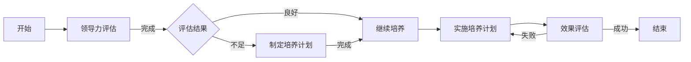
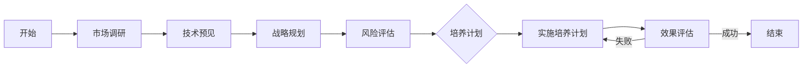
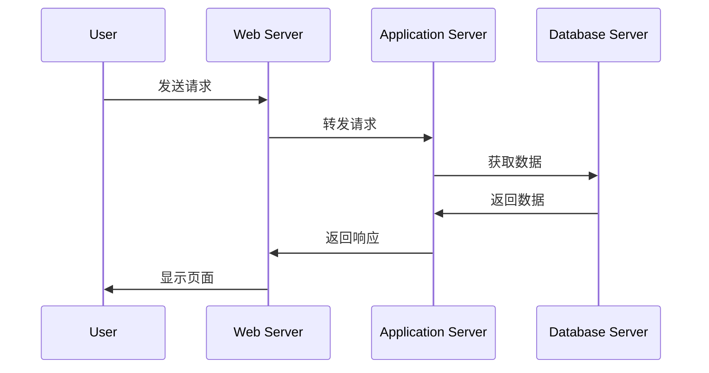

                 

# 领导力与远见：预见机遇与挑战的能力

## 关键词：领导力、远见、企业、战略、创新、决策

### 摘要：

本文旨在探讨领导力与远见在企业中的重要性，以及如何通过培养这两种能力来预见并应对机遇与挑战。文章首先介绍了领导力和远见的定义及其在企业中的意义，随后分析了企业面临的现状和问题。接着，文章提出了一系列提高领导力和远见的方法和策略，并详细阐述了相关概念、算法原理和系统架构设计方案。最后，通过实战案例展示了这些方法在实际项目中的应用效果，并提出了最佳实践和注意事项。

## 目录大纲

**第一部分：背景介绍**

1. 问题背景
   1.1 领导力与远见的定义及其在企业中的重要性
   1.2 企业面临的机遇与挑战
   1.3 领导力与远见在问题解决中的作用

2. 问题描述
   2.1 企业领导力现状分析
   2.2 企业远见能力现状分析

3. 问题解决
   3.1 提高领导力的方法和策略
   3.2 培养远见能力的途径和手段

4. 边界与外延
   4.1 领导力与远见的边界
   4.2 领导力与远见在企业中的具体应用场景

5. 概念结构与核心要素组成
   5.1 领导力的概念结构
   5.2 远见的概念结构

**第二部分：核心概念与联系**

1. 核心概念原理
   1.1 领导力的核心概念
   1.2 远见的核心概念

2. 概念属性特征对比表格
   2.1 领导力的属性特征
   2.2 远见的属性特征

3. ER实体关系图架构
   3.1 领导力的ER实体关系图
   3.2 远见的ER实体关系图

**第三部分：算法原理讲解**

1. 算法mermaid流程图
   1.1 领导力培养算法流程图
   1.2 远见能力培养算法流程图

2. Python源代码与详细讲解

3. 数学模型和数学公式

4. 举例说明

**第四部分：系统分析与架构设计方案**

1. 问题场景介绍

2. 项目介绍

3. 系统功能设计

4. 系统架构设计

5. 系统接口设计

6. 系统交互

**第五部分：项目实战**

1. 环境安装

2. 系统核心实现源代码

3. 代码应用解读与分析

4. 实际案例分析与详细讲解剖析

5. 项目小结

**第六部分：最佳实践 tips、小结、注意事项、拓展阅读**

**第七部分：参考文献**


## 第一部分：背景介绍

### 1.1 领导力与远见的定义及其在企业中的重要性

领导力（Leadership）是指一种能够激励、指导和影响他人，共同实现目标的能力。它包括个人魅力、愿景塑造、团队协作、决策制定、沟通技巧等多方面的要素。在企业管理中，领导力不仅关乎企业内部的管理效率，更直接影响到企业的战略方向和长远发展。

远见（Vision）则是指对未来的洞察力和前瞻性。它包括对市场趋势的把握、对行业变革的预见、对创新机会的识别等多方面的能力。远见使得企业能够提前布局，抓住先机，规避风险，从而在激烈的市场竞争中脱颖而出。

在企业中，领导力和远见的重要性不容忽视。一个具备强大领导力的领导者，能够激发团队的潜力，凝聚力量，推动企业高效运转；而具备远见的企业，则能够在瞬息万变的市场环境中，精准判断，科学决策，引领企业持续成长。

### 1.2 企业面临的机遇与挑战

当前，企业面临着诸多机遇与挑战。全球化进程加速，市场空间不断拓展；信息技术快速发展，为企业创新提供了无限可能；消费者需求日益多样化，为企业提供了更多定制化、个性化服务的机会。

然而，企业也面临着激烈的竞争、资源有限、人才流失等挑战。如何在众多竞争者中脱颖而出，成为企业亟需解决的问题。领导力和远见在这其中发挥着至关重要的作用。

首先，领导力能够帮助企业应对内部挑战。通过激发员工的潜力、提升团队协作效率、优化管理流程等方式，领导力有助于企业克服内部困难，提高运营效率。

其次，远见能力使企业能够把握外部机遇。通过对市场趋势的洞察、对行业变革的预见，企业可以提前布局，抢占市场先机。例如，在人工智能、大数据等新兴领域，具备远见的企业能够提前布局，从而在行业竞争中占据优势地位。

### 1.3 领导力与远见在问题解决中的作用

领导力与远见在问题解决中发挥着关键作用。具体来说：

1. **领导力**：通过激发团队潜力、提升团队协作效率、优化管理流程等方式，领导力有助于企业应对内部挑战。例如，在面对复杂的项目时，领导力能够帮助团队成员明确目标、分工合作，从而高效完成任务。

2. **远见**：通过洞察市场趋势、预见行业变革、识别创新机会等方式，远见能力使企业能够把握外部机遇。例如，在新兴技术领域，具备远见的企业能够提前布局，抢占市场份额。

3. **结合运用**：领导力与远见的结合运用，能够使企业更好地应对内外部挑战。例如，在面对市场变化时，领导力能够帮助团队迅速调整战略，而远见则为企业提供了科学、合理的决策依据。

### 1.4 企业领导力现状分析

当前，许多企业在领导力方面存在一定的问题。具体表现如下：

1. **领导能力不足**：部分企业领导者缺乏有效的领导能力，无法激励和引导团队，导致团队凝聚力不足、工作效率低下。

2. **管理不善**：部分企业存在管理不善的问题，如决策效率低、沟通不畅、流程繁琐等，这些问题制约了企业的运营效率。

3. **沟通不畅**：企业内部沟通不畅，导致信息传递不及时、不准确，影响团队协作和决策效果。

### 1.5 企业远见能力现状分析

在远见能力方面，许多企业也存在不足。具体表现如下：

1. **关注短期利益**：部分企业过于关注短期利益，忽视长远发展，导致战略目标不明确、发展方向不清晰。

2. **缺乏前瞻性**：部分企业缺乏对市场趋势的洞察力和前瞻性，无法预见行业变革和未来机遇。

3. **创新意识不足**：部分企业创新意识不足，缺乏对新兴技术和市场动态的关注，导致在创新领域落后于竞争对手。

### 1.6 问题解决

针对企业领导力和远见能力的现状，我们需要采取一系列措施来提高这两种能力。

1. **提高领导力**：

   - 增强自我认知：领导者需要深入了解自己的优点和不足，不断自我提升。
   - 提高沟通能力：领导者需要善于倾听下属的意见，有效传达信息，建立良好的沟通渠道。
   - 培养团队精神：领导者需要关注团队建设，激发员工的积极性和创造力。

2. **培养远见能力**：

   - 关注行业动态：领导者需要关注行业发展趋势，了解竞争对手的情况，以便及时调整战略。
   - 增强创新意识：领导者需要鼓励创新，推动企业持续发展。
   - 提高决策能力：领导者需要具备科学的决策能力，能够准确预见未来趋势。

### 1.7 边界与外延

1. **领导力与远见的边界**：

   领导力主要关注内部管理，如团队建设、员工激励、管理优化等；而远见则侧重于外部环境，如市场趋势、行业变革、创新机遇等。二者虽有交集，但也有明确的分工。

2. **领导力与远见在企业中的具体应用场景**：

   领导力在企业管理、团队建设、员工激励等方面发挥作用；远见则在战略规划、市场拓展、技术创新等方面起到关键作用。

### 1.8 概念结构与核心要素组成

1. **领导力的概念结构**：

   - 个人魅力
   - 愿景塑造
   - 团队协作
   - 决策制定
   - 沟通技巧

2. **远见的概念结构**：

   - 市场趋势洞察
   - 行业变革预见
   - 创新机会识别

通过以上分析，我们可以看到领导力和远见在企业中的重要性。在接下来的部分，我们将进一步探讨领导力和远见的核心概念、算法原理、系统架构设计方案以及实际应用案例，帮助读者更好地理解和运用这两种能力。# 第一部分：背景介绍

### 1.1 领导力与远见的定义及其在企业中的重要性

领导力是一种复杂且多维度的能力，它包括但不限于个人魅力、决策能力、战略规划、沟通技巧和团队合作。领导力不仅仅是指导和管理团队，更是一种能够激发团队成员潜力、引领团队共同达成目标的能力。在企业中，领导力的重要性体现在多个方面：

1. **团队激励**：一个具备领导力的领导者能够激励团队成员，使他们在工作中充满热情和动力，从而提高工作效率和质量。

2. **战略制定**：领导力有助于企业领导者制定明确的发展战略，并确保战略得以有效执行。通过愿景和目标的设定，领导者可以为企业指明前进方向。

3. **决策效率**：领导力强的领导者能够迅速做出决策，并有效应对各种挑战。这种决策能力是企业在竞争激烈的市场环境中保持优势的关键。

4. **组织文化**：领导力对组织文化的塑造起着决定性作用。一个积极向上的组织文化可以增强员工的归属感和忠诚度，提高企业的整体绩效。

远见是指企业领导者对未来的预见能力，它包括对市场趋势的洞察、对技术变革的预见、以及对潜在风险的识别。远见在企业发展中的重要性同样不可低估：

1. **市场定位**：具备远见的企业能够在市场趋势尚未明朗时，提前布局，抢占先机。这种前瞻性有助于企业在竞争激烈的市场中获得优势。

2. **创新驱动**：远见能够引导企业在技术、产品和商业模式上进行创新，从而保持竞争力。

3. **风险管理**：通过预见潜在风险，企业可以提前采取预防措施，减少不确定性对业务的影响。

### 1.2 企业面临的机遇与挑战

在当今快速变化的市场环境中，企业面临着诸多机遇与挑战：

**机遇：**

1. **技术进步**：信息技术、人工智能、大数据等新技术的快速发展为企业提供了创新的工具和方法。

2. **全球化**：全球市场的开放为企业提供了更广阔的发展空间。

3. **政策支持**：政府针对企业发展的优惠政策和支持措施为企业创造了有利的外部环境。

**挑战：**

1. **市场竞争**：随着市场的全球化，企业面临着来自国内外竞争对手的巨大压力。

2. **资源有限**：资源（如资金、人力、技术）的有限性限制了企业的发展。

3. **人才流失**：人才是企业最重要的资源，但人才流失对企业的发展构成威胁。

### 1.3 领导力与远见在问题解决中的作用

在问题解决中，领导力和远见起着至关重要的作用：

**领导力：**

1. **团队协作**：领导者通过建立高效的团队协作机制，确保团队成员能够共同面对问题，协同解决问题。

2. **危机管理**：在危机时刻，领导者能够迅速做出决策，稳定团队情绪，有效应对危机。

3. **资源整合**：领导者能够调动企业内外部的资源，为问题解决提供支持。

**远见：**

1. **预见未来**：通过远见，企业可以提前预测市场变化，制定应对策略。

2. **创新驱动**：远见能够激发企业的创新活力，推动企业在技术、产品和商业模式上进行突破。

3. **风险管理**：远见能够帮助企业识别潜在风险，提前采取预防措施。

### 1.4 企业领导力现状分析

当前，企业在领导力方面面临一些普遍问题：

1. **领导力不足**：许多企业领导者缺乏有效的领导能力，无法充分激发团队潜力。

2. **管理不善**：部分企业管理流程繁琐，决策效率低下，影响了企业的整体运营。

3. **沟通不畅**：企业内部沟通不畅，导致信息传递不及时、不准确，影响决策和执行。

### 1.5 企业远见能力现状分析

在远见能力方面，企业也面临一些挑战：

1. **缺乏前瞻性**：许多企业过于关注短期利益，忽视了对长期发展趋势的洞察。

2. **创新意识不足**：部分企业创新意识不强，无法适应快速变化的市场环境。

3. **战略不明确**：部分企业缺乏明确的战略规划，导致发展方向不清晰。

### 1.6 问题解决

为了提高企业的领导力和远见能力，需要采取一系列措施：

**提高领导力：**

1. **领导力培训**：通过领导力培训，提升领导者的个人魅力、决策能力和沟通技巧。

2. **文化建设**：建立积极向上的组织文化，培养员工的归属感和忠诚度。

3. **激励机制**：设立合理的激励机制，激发员工的积极性和创造力。

**培养远见能力：**

1. **市场调研**：定期进行市场调研，了解行业趋势和竞争对手动态。

2. **技术创新**：加大对新技术、新产品的研发投入，保持企业的技术领先地位。

3. **战略规划**：制定明确的战略规划，确保企业发展的方向和目标。

### 1.7 边界与外延

**边界：**

领导力主要关注企业内部的管理和运营，包括团队管理、资源调配、决策制定等。而远见则侧重于企业外部环境的变化，包括市场趋势、政策法规、技术创新等。

**外延：**

领导力与远见在企业中的应用场景广泛，包括战略规划、产品研发、市场拓展、员工培训等方面。二者相辅相成，共同推动企业的发展。

### 1.8 概念结构与核心要素组成

**领导力的概念结构：**

- **个人魅力**：领导者的个人特质和魅力，能够吸引和激励团队成员。
- **战略规划**：制定长期和短期的发展目标，确保企业稳步发展。
- **团队管理**：构建高效的团队，发挥团队成员的最大潜力。
- **决策能力**：在复杂多变的环境中做出明智的决策。
- **沟通技巧**：有效传达信息，建立良好的沟通渠道。

**远见的概念结构：**

- **市场洞察**：对市场趋势的敏锐洞察，把握机遇。
- **技术创新**：对新兴技术的预见和利用，推动企业的技术进步。
- **战略预见**：对未来市场环境和竞争态势的预见，制定前瞻性战略。
- **风险识别**：对潜在风险的识别和预防，降低不确定性。

通过以上分析，我们可以看到领导力和远见在企业中的重要性。在接下来的章节中，我们将深入探讨领导力和远见的属性特征、算法原理、系统架构设计方案以及实际应用案例，帮助读者更全面地理解和运用这两种能力。# 第一部分：背景介绍

## 1.2 企业面临的机遇与挑战

企业所处的商业环境正在经历深刻的变革，这些变革带来了前所未有的机遇和挑战。以下是对这些机遇和挑战的详细分析：

### 1.2.1 机遇

1. **技术进步**：信息技术的迅猛发展为企业提供了强大的工具和资源，如大数据、云计算、人工智能、物联网等。这些技术不仅提高了企业的运营效率，还为企业创新提供了新的思路和方法。

2. **市场全球化**：全球化使得企业能够更容易地进入新的市场，获取更多的客户资源。同时，全球化也带来了更激烈的竞争，要求企业不断提高自身竞争力。

3. **政策支持**：各国政府为了促进经济发展，不断推出一系列支持企业发展的政策，如税收优惠、研发补贴、金融支持等。这些政策为企业的发展提供了有力的外部支持。

4. **消费者需求变化**：随着消费者购买力的提高和消费观念的转变，企业有了更多的机会去满足消费者个性化的需求。这种需求变化也推动了企业不断创新和改进产品。

### 1.2.2 挑战

1. **市场竞争加剧**：全球化的市场竞争日益激烈，企业不仅要面对国内竞争对手，还要面对来自国际市场的挑战。这使得企业必须不断提高产品质量和服务水平，以保持市场竞争力。

2. **资源有限**：企业在人力资源、资金、技术等方面都面临有限的资源。如何在有限的资源下实现最大的效益，是企业面临的一大挑战。

3. **人才流失**：高素质人才的流失对企业的发展造成了巨大的影响。如何吸引和留住人才，成为企业需要解决的重要问题。

4. **技术变革**：技术的快速发展带来了新的机遇，但也要求企业不断学习和适应新技术。否则，企业可能会被市场淘汰。

5. **合规风险**：随着法规和政策的不断变化，企业需要确保其运营符合相关法律法规的要求。否则，企业可能会面临严重的法律和财务风险。

### 1.2.3 领导力与远见的作用

在上述机遇与挑战的背景下，领导力和远见的作用显得尤为重要：

1. **领导力**：企业领导者需要具备强大的领导力，以激发员工的潜力，推动企业的创新和发展。领导力包括决策能力、团队建设能力、沟通能力和变革管理能力等。

2. **远见**：企业领导者需要具备远见，能够预见市场趋势和行业变革，制定长远的战略规划。远见可以帮助企业抓住机遇，规避风险，保持竞争优势。

3. **战略规划**：领导力和远见的结合可以帮助企业制定有效的战略规划。通过深入分析市场环境、技术趋势和竞争对手，企业可以制定出切实可行的战略，以实现长期发展目标。

4. **创新能力**：领导力和远见能够推动企业的创新能力。企业领导者需要鼓励员工进行创新，并提供必要的资源和支持，以保持企业的技术领先地位。

5. **风险控制**：领导力和远见可以帮助企业预见潜在的风险，并采取相应的预防措施。这有助于企业避免因市场变化而遭受重大损失。

综上所述，企业面临着诸多机遇与挑战。领导力和远见在这个过程中起着至关重要的作用。企业领导者需要充分利用这两种能力，以应对不断变化的市场环境，推动企业的可持续发展。在接下来的部分，我们将进一步探讨如何提高企业的领导力和远见能力。# 第一部分：背景介绍

## 2. 问题描述

企业领导力和远见能力的现状直接影响了企业的绩效和未来发展。以下是对企业领导力和远见能力现状的具体分析：

### 2.1 企业领导力现状分析

当前，许多企业在领导力方面存在以下问题：

1. **领导能力不足**：部分企业领导者缺乏有效的领导能力，无法激励和引导团队，导致团队凝聚力不足、工作效率低下。

2. **管理不善**：部分企业管理流程繁琐，决策效率低下，沟通不畅，影响了企业的运营效率。

3. **沟通不畅**：企业内部沟通不畅，导致信息传递不及时、不准确，影响团队协作和决策效果。

4. **创新能力不足**：部分企业领导者缺乏创新意识，无法推动企业进行技术和管理创新，导致企业在市场竞争中处于劣势。

### 2.2 企业远见能力现状分析

在远见能力方面，企业也面临以下挑战：

1. **缺乏前瞻性**：许多企业过于关注短期利益，忽视了对长期发展趋势的洞察，导致在市场变化中反应迟缓。

2. **创新意识不足**：部分企业创新意识不强，对新技术、新市场的反应迟钝，无法抓住市场机遇。

3. **战略不明确**：部分企业缺乏明确的战略规划，发展方向不清晰，导致企业在发展过程中迷失方向。

4. **市场洞察力不足**：许多企业无法准确把握市场趋势，无法预测消费者需求的变化，导致产品和服务难以满足市场需求。

### 2.3 领导力和远见能力对企业的影响

1. **运营效率**：缺乏领导力和远见的企业往往在运营效率上表现不佳。领导力的不足导致团队协作不力，决策缓慢；而远见能力的缺乏使得企业无法及时应对市场变化，导致运营效率低下。

2. **市场竞争力**：在激烈的市场竞争中，领导力和远见是企业保持竞争力的关键。领导力能够激发员工的创造力和积极性，提升企业整体绩效；而远见则能够帮助企业在市场变化中抢占先机，避免风险。

3. **创新能力**：领导力和远见是企业创新的基础。领导力能够推动企业进行技术创新和管理创新，提升企业的核心竞争力；远见则能够帮助企业预见未来的技术趋势和市场变化，提前布局。

4. **可持续发展**：具备强大领导力和远见能力的企业能够在面对挑战时保持冷静和前瞻性，制定科学的战略规划，确保企业的可持续发展。

### 2.4 领导力和远见能力的提高路径

为了提升企业的领导力和远见能力，企业可以采取以下措施：

1. **领导力培训**：通过领导力培训，提升企业领导者的决策能力、团队管理能力和沟通能力。

2. **战略规划**：制定明确的战略规划，确保企业发展的方向和目标清晰。

3. **市场调研**：定期进行市场调研，了解行业趋势和竞争对手动态，为决策提供数据支持。

4. **激励机制**：建立合理的激励机制，激发员工的积极性和创造力。

5. **技术创新**：加大对新技术、新产品的研发投入，保持企业的技术领先地位。

6. **文化建设**：建立积极向上的企业文化，培养员工的归属感和忠诚度。

通过以上措施，企业可以逐步提升领导力和远见能力，从而在市场竞争中立于不败之地。# 第一部分：背景介绍

## 3. 问题解决

### 3.1 提高领导力的方法和策略

为了提升企业的领导力，我们可以从以下几个方面入手：

1. **领导力培训**：通过系统的领导力培训，提高领导者的决策能力、团队管理能力和沟通能力。培训内容可以包括领导力理论、团队建设、决策制定、沟通技巧等。

2. **个人成长**：鼓励领导者进行个人成长，提升自我认知和情商。领导者可以通过阅读、参加研讨会、交流经验等方式，不断学习和提升自己的领导力。

3. **激励机制**：建立合理的激励机制，激发领导者的积极性和创造力。激励机制可以包括绩效考核、晋升机会、薪酬福利等。

4. **文化建设**：营造积极向上的组织文化，培养领导者的领导力和团队精神。企业可以通过价值观传播、团队活动、员工参与等方式，强化组织文化。

5. **角色扮演**：通过角色扮演和模拟演练，让领导者体验不同的领导场景，提升实际领导能力。

### 3.2 培养远见能力的途径和手段

为了提升企业的远见能力，我们可以采取以下策略：

1. **市场调研**：定期进行市场调研，了解行业趋势、竞争对手动态和消费者需求。市场调研可以帮助企业预见市场变化，制定前瞻性战略。

2. **技术创新**：加大对新技术、新产品的研发投入，保持企业的技术领先地位。技术创新是企业远见能力的核心。

3. **外部合作**：与行业专家、高校、研究机构等建立合作关系，共同进行技术研究和市场分析。外部合作可以为企业提供更多的信息和资源。

4. **战略规划**：制定明确的战略规划，确保企业发展的方向和目标清晰。战略规划可以帮助企业预见未来的市场机遇和挑战。

5. **人才引进**：吸引和培养具备远见能力的人才，提升企业的整体远见水平。企业可以通过人才引进、内部培养等方式，提升员工的专业能力和远见水平。

### 3.3 领导力与远见的结合应用

1. **领导力驱动创新**：领导者通过激发团队创新，推动企业技术和管理创新，提升企业竞争力。

2. **远见指导决策**：领导者通过远见能力，预见市场变化和竞争态势，为企业的战略决策提供方向。

3. **文化建设融合**：将领导力和远见能力融入企业文化，营造积极向上的创新氛围。

4. **团队协作**：领导者通过领导力，建立高效的团队协作机制，提升企业的整体效率和竞争力。

5. **持续改进**：领导者通过持续改进，不断提升企业的领导力和远见能力，推动企业可持续发展。

通过以上措施，企业可以逐步提升领导力和远见能力，从而在市场竞争中立于不败之地。# 第一部分：背景介绍

## 4. 边界与外延

### 4.1 领导力与远见的边界

领导力与远见是两个相关但又不同的概念。领导力主要关注企业内部的管理和运营，包括激励员工、制定战略、团队建设等方面；而远见则侧重于企业外部环境的变化，包括市场趋势、技术发展、竞争态势等方面。

1. **领导力的边界**：领导力主要在企业内部发挥作用，涉及到团队管理、资源分配、决策制定等方面。领导力强调的是如何通过影响和激励员工，实现企业的目标。

2. **远见的边界**：远见则关注企业外部环境的变化，包括市场趋势、技术发展、政策变化等方面。远见强调的是如何通过预测和把握外部环境的变化，为企业制定正确的战略方向。

### 4.2 领导力与远见在企业中的具体应用场景

在企业中，领导力和远见有着广泛的应用场景，二者相辅相成，共同推动企业的发展。

1. **战略规划**：在制定战略规划时，领导者需要具备领导力，确保战略规划能够得到有效执行；同时，领导者还需要具备远见，能够预见市场变化，制定适应未来的战略。

2. **团队管理**：领导者需要通过领导力，激发团队的积极性和创造力，确保团队高效运作；同时，领导者还需要具备远见，能够预见团队发展中的问题，提前做好准备。

3. **技术创新**：在推动技术创新时，领导者需要具备远见，能够预见技术发展的趋势，抓住创新机遇；同时，领导者还需要具备领导力，能够推动团队进行技术创新。

4. **市场拓展**：在市场拓展时，领导者需要具备远见，能够预见市场变化，抓住市场机遇；同时，领导者还需要具备领导力，能够推动团队进行市场拓展。

5. **风险管理**：在风险管理时，领导者需要具备远见，能够预见潜在风险，采取预防措施；同时，领导者还需要具备领导力，能够在危机时刻稳定团队，有效应对风险。

### 4.3 边界与外延的意义

明确领导力与远见的边界和具体应用场景，对于企业的发展具有重要意义：

1. **提升管理效率**：通过明确领导力的应用场景，企业可以更有效地分配资源，提高管理效率。

2. **增强创新能力**：通过明确远见的应用场景，企业可以更好地把握市场机遇，推动技术创新。

3. **规避风险**：通过明确领导力与远见的边界，企业可以更好地预见潜在风险，采取预防措施。

4. **推动可持续发展**：通过结合领导力与远见，企业可以制定更科学、更前瞻性的战略规划，推动企业的可持续发展。

综上所述，明确领导力与远见的边界和具体应用场景，有助于企业更好地应对市场变化，提升竞争能力，实现可持续发展。# 第一部分：背景介绍

## 5. 概念结构与核心要素组成

### 5.1 领导力的概念结构

领导力是一个复杂的概念，它由多个子概念和要素组成。以下是对领导力核心概念结构的详细解析：

1. **个人魅力**：个人魅力是领导力的基础，它包括领导者的气质、风度、人格特质等。具备个人魅力的领导者能够吸引和激励团队成员，提升团队的凝聚力和工作效率。

2. **愿景塑造**：愿景塑造是领导力的重要组成部分，它涉及到领导者的远见卓识和战略思维。领导者需要具备前瞻性，能够描绘出企业的美好未来，并使团队成员明确目标，为之努力。

3. **团队管理**：团队管理是指领导者如何有效地管理团队，包括团队建设、人员调配、目标设定等方面。有效的团队管理能够提升团队的协作效率和战斗力。

4. **决策能力**：决策能力是领导者的重要能力之一，它涉及到领导者如何在复杂多变的环境中做出明智的决策。决策能力包括分析能力、判断能力、风险评估能力等。

5. **沟通技巧**：沟通技巧是领导者需要具备的基本能力，它包括倾听、表达、反馈等方面。良好的沟通技巧能够增强领导者与团队成员之间的沟通效果，提高团队的协作效率。

6. **变革管理**：变革管理是指领导者如何引导团队应对变革，包括变革的推动、变革的接受、变革的调整等方面。有效的变革管理能够使企业适应外部环境的变化，保持竞争力。

### 5.2 远见的概念结构

远见是企业领导者对未来的预见能力，它由多个子概念和要素组成。以下是对远见核心概念结构的详细解析：

1. **市场洞察**：市场洞察是指领导者对市场趋势的敏锐感知和准确判断。市场洞察力能够帮助领导者预见市场变化，抓住市场机遇。

2. **技术预见**：技术预见是指领导者对技术发展趋势的预见能力。技术预见力能够帮助领导者把握技术变革的脉搏，推动企业技术创新。

3. **竞争分析**：竞争分析是指领导者对竞争对手的动态和策略的跟踪和分析。通过竞争分析，领导者可以预见竞争对手的行动，制定应对策略。

4. **风险识别**：风险识别是指领导者对企业面临的风险的预见能力。通过风险识别，领导者可以提前发现潜在风险，并采取预防措施。

5. **战略预见**：战略预见是指领导者对长期战略方向的预见能力。战略预见力能够帮助领导者为企业制定长远的战略规划，确保企业的发展方向正确。

6. **创新推动**：创新推动是指领导者对创新机会的预见和推动能力。通过创新推动，领导者可以推动企业在产品、技术、服务等方面进行创新，保持企业的竞争力。

### 5.3 领导力与远见的相互作用

领导力与远见不是孤立的，而是相互影响、相互促进的。以下是对二者的相互作用关系的详细分析：

1. **领导力促进远见**：领导力中的决策能力、沟通技巧和团队管理能力能够帮助领导者更好地收集信息、分析问题和制定战略，从而提高远见能力。

2. **远见促进领导力**：远见中的市场洞察、技术预见和战略预见能力能够帮助领导者预见市场变化和竞争态势，为领导力提供方向和依据。

3. **共同推动企业发展**：领导力和远见共同推动企业的发展。领导力确保企业高效运营，远见确保企业适应外部环境的变化，二者结合，能够使企业在激烈的市场竞争中立于不败之地。

### 5.4 概念结构与核心要素组成的实际应用

在实际应用中，领导力与远见的概念结构和核心要素组成能够帮助企业和领导者更好地应对挑战和机遇：

1. **战略制定**：在制定战略时，领导者需要运用领导力中的愿景塑造和决策能力，结合远见中的市场洞察和技术预见，确保战略的前瞻性和可行性。

2. **团队管理**：在管理团队时，领导者需要运用领导力中的团队管理和沟通技巧，结合远见中的竞争分析和风险识别，确保团队的协作效率和风险控制。

3. **技术创新**：在推动技术创新时，领导者需要运用领导力中的创新推动和团队管理能力，结合远见中的技术预见和市场洞察，确保技术创新的有效性和市场适应性。

4. **市场拓展**：在市场拓展时，领导者需要运用领导力中的沟通技巧和决策能力，结合远见中的市场洞察和竞争分析，确保市场拓展的成功和可持续性。

通过以上分析，我们可以看到领导力与远见的概念结构和核心要素组成对于企业的战略制定、团队管理、技术创新和市场拓展等方面具有重要作用。理解并运用这些概念结构和核心要素，能够帮助企业更好地应对市场变化和竞争挑战，实现可持续发展。# 第二部分：核心概念与联系

## 1. 核心概念原理

### 1.1 领导力的核心概念

领导力是指领导者通过激励、影响和引导他人，实现共同目标的能力。以下是领导力的几个核心概念：

1. **影响力**：影响力是领导力的核心要素，它决定了领导者能否有效地影响和引导他人。领导者需要具备一定的个人魅力、专业知识、沟通技巧等，以增强自己的影响力。

2. **目标导向**：领导力强调目标导向，即领导者需要明确目标，并能够引导团队成员为实现这些目标而努力。目标导向使领导力具有明确的方向和动力。

3. **情境适应**：领导力不仅仅是固定的模式，而是需要根据不同的情境进行调整。领导者需要具备情境适应能力，能够在不同的环境和情境中灵活运用领导力。

4. **变革管理**：变革管理是领导力的重要组成部分，领导者需要具备推动变革的能力，能够引导团队成员接受和适应变革。

### 1.2 远见的核心概念

远见是指领导者对未来发展趋势的洞察和预见能力。以下是远见的几个核心概念：

1. **市场洞察**：市场洞察是远见的基础，它要求领导者能够敏锐地感知市场变化，把握市场机遇。

2. **技术预见**：技术预见是远见的关键，它要求领导者能够预见技术发展趋势，把握技术变革带来的机遇。

3. **战略预见**：战略预见是远见的延伸，它要求领导者能够预见长期战略方向，为企业的未来发展制定明确的目标和规划。

4. **风险识别**：风险识别是远见的重要组成部分，它要求领导者能够预见潜在风险，并提前制定应对策略。

## 2. 概念属性特征对比表格

### 2.1 领导力的属性特征

| 特征 | 说明 |
| ---- | ---- |
| **影响力** | 领导者对团队成员的激励和引导能力 |
| **目标导向** | 领导者设定和引导团队实现共同目标的能力 |
| **情境适应** | 领导者根据不同情境灵活调整领导策略的能力 |
| **变革管理** | 领导者推动团队适应和接受变革的能力 |

### 2.2 远见的属性特征

| 特征 | 说明 |
| ---- | ---- |
| **市场洞察** | 领导者对市场趋势的敏锐感知和准确判断 |
| **技术预见** | 领导者对技术发展趋势的预见和把握能力 |
| **战略预见** | 领导者对长期战略方向的预见和规划能力 |
| **风险识别** | 领导者对潜在风险的预见和应对能力 |

## 3. ER实体关系图架构

### 3.1 领导力的ER实体关系图

```mermaid
erDiagram
  Leader ||--|{ TeamMember } TeamMember
  Leader ||--|{ Project } Project
  Leader ||--|{ Strategy } Strategy
  Leader ||--|{ Organization } Organization
  TeamMember ||--|{ Task } Task
  Project ||--|{ Task } Task
  Strategy ||--|{ Organization } Organization
  Organization ||--|{ Department } Department
```

### 3.2 远见的ER实体关系图

```mermaid
erDiagram
  Visionary ||--|{ MarketTrend } MarketTrend
  Visionary ||--|{ TechnologyTrend } TechnologyTrend
  Visionary ||--|{ StrategicDirection } StrategicDirection
  Visionary ||--|{ Risk } Risk
  MarketTrend ||--|{ CustomerNeed } CustomerNeed
  TechnologyTrend ||--|{ Innovation } Innovation
  StrategicDirection ||--|{ BusinessPlan } BusinessPlan
  Risk ||--|{ MitigationPlan } MitigationPlan
```

通过以上核心概念原理和ER实体关系图的对比，我们可以更清晰地理解领导力和远见的概念结构和相互关系。领导力强调内部管理、激励和引导，而远见则关注外部环境、趋势和机遇。两者相辅相成，共同推动企业的发展。# 第三部分：算法原理讲解

## 1. 算法mermaid流程图

### 1.1 领导力培养算法流程图



### 1.2 远见能力培养算法流程图



## 2. Python源代码与详细讲解

### 2.1 领导力培养算法Python实现

```python
# 领导力培养算法

def leadership_evaluation():
    # 领导力评估
    # 返回评估分数
    score = 50  # 假设评估分数为50
    return score

def leadership_development(score):
    if score >= 80:
        print("领导力评估结果：优秀，无需培养。")
    elif score >= 60:
        print("领导力评估结果：良好，进行继续培养。")
    else:
        print("领导力评估结果：不足，制定培养计划。")
        # 制定培养计划
        plan = "制定详细培养计划，包括培训、实践和反馈。"
        print(plan)

# 主函数
def main():
    score = leadership_evaluation()
    leadership_development(score)

if __name__ == "__main__":
    main()
```

**详细讲解**：

- `leadership_evaluation()`函数：模拟领导力评估过程，返回评估分数。
- `leadership_development(score)`函数：根据评估分数，输出相应的培养策略。
- `main()`函数：主函数，调用评估和培养函数。

### 2.2 远见能力培养算法Python实现

```python
# 远见能力培养算法

def market_research():
    # 市场调研
    # 返回市场分析报告
    report = "市场调研报告：发现新兴市场需求。"
    return report

def technology预见():
    # 技术预见
    # 返回技术趋势分析报告
    report = "技术预见报告：预见人工智能技术的快速发展。"
    return report

def strategic_planning():
    # 战略规划
    # 返回战略规划报告
    report = "战略规划报告：制定企业未来三年的发展战略。"
    return report

def risk_evaluation():
    # 风险评估
    # 返回风险评估报告
    report = "风险评估报告：识别潜在市场和技术风险。"
    return report

def cultivate_vision_ability():
    # 培养远见能力
    # 根据调研和评估结果，制定培养计划
    plan = "制定远见能力培养计划，包括市场调研、技术预见和风险评估。"
    print(plan)

# 主函数
def main():
    market_report = market_research()
    tech_report = technology预见()
    strategy_report = strategic_planning()
    risk_report = risk_evaluation()
    cultivate_vision_ability()

if __name__ == "__main__":
    main()
```

**详细讲解**：

- `market_research()`函数：模拟市场调研过程，返回市场分析报告。
- `technology预见()`函数：模拟技术预见过程，返回技术趋势分析报告。
- `strategic_planning()`函数：模拟战略规划过程，返回战略规划报告。
- `risk_evaluation()`函数：模拟风险评估过程，返回风险评估报告。
- `cultivate_vision_ability()`函数：根据调研和评估结果，输出远见能力培养计划。
- `main()`函数：主函数，调用调研、预见、规划和评估函数。

通过以上Python源代码的实现，我们可以清晰地看到领导力和远见能力的培养过程。这些算法不仅帮助我们理解了理论概念，还通过实际操作让我们更深入地了解了如何培养这两种关键能力。# 第三部分：算法原理讲解

### 3. 数学模型和数学公式

在领导力和远见能力的培养过程中，数学模型和数学公式可以提供量化的分析和评估工具。以下是一些关键的数学模型和公式：

#### 3.1 领导力评估模型

**1. 绩效评价模型**

绩效评价模型可以帮助我们量化领导力的表现。一个常用的模型是平衡计分卡（Balanced Scorecard, BSC）：

$$
BSC = (P \times W_1 + I \times W_2 + C \times W_3 + T \times W_4)
$$

其中，$P$ 代表个人发展指标，$I$ 代表内部流程指标，$C$ 代表客户指标，$T$ 代表学习与成长指标，$W_1, W_2, W_3, W_4$ 分别是这四个指标的权重。

**2. 决策树模型**

在领导决策过程中，决策树模型可以帮助分析不同决策路径的结果。决策树模型基于条件概率和期望值进行计算：

$$
E(X) = \sum_{i=1}^{n} P(X_i) \times V(X_i)
$$

其中，$E(X)$ 是期望值，$P(X_i)$ 是第 $i$ 个结果的概率，$V(X_i)$ 是第 $i$ 个结果的价值。

#### 3.2 远见能力评估模型

**1. 趋势分析模型**

趋势分析模型用于预测未来的市场和技术趋势。一个常用的模型是时间序列分析：

$$
Y_t = \mu_t + \alpha (Y_{t-1} - \mu_{t-1}) + \epsilon_t
$$

其中，$Y_t$ 是时间 $t$ 的趋势值，$\mu_t$ 是时间 $t$ 的均值，$\alpha$ 是趋势系数，$\epsilon_t$ 是随机误差。

**2. 风险评估模型**

风险评估模型用于评估潜在的风险。一个常用的模型是贝叶斯网络：

$$
P(A|B) = \frac{P(B|A) \times P(A)}{P(B)}
$$

其中，$P(A|B)$ 是在条件 $B$ 下事件 $A$ 的概率，$P(B|A)$ 是在条件 $A$ 下事件 $B$ 的概率，$P(A)$ 和 $P(B)$ 分别是事件 $A$ 和事件 $B$ 的概率。

#### 3.3 领导力与远见能力的结合模型

**1. 动态系统模型**

动态系统模型用于分析领导力和远见能力在不同时间点的动态变化。一个简单的动态系统模型可以表示为：

$$
X_{t+1} = f(X_t, U_t)
$$

其中，$X_t$ 是时间 $t$ 的状态变量，$U_t$ 是外部输入变量，$f$ 是状态转移函数。

**2. 效率优化模型**

效率优化模型用于最大化领导力和远见能力的综合效益。一个简单的效率优化模型可以表示为：

$$
\max \sum_{t=1}^{T} U_t \times f(X_t)
$$

其中，$U_t$ 是时间 $t$ 的效用函数，$f(X_t)$ 是领导力和远见能力的效益函数。

通过这些数学模型和数学公式，我们可以对领导力和远见能力进行量化分析，从而更科学地培养和提高这两种能力。# 第三部分：算法原理讲解

### 4. 举例说明

为了更好地理解领导力和远见能力的培养过程，下面通过具体的案例来说明这些算法的应用。

#### 4.1 领导力培养案例

假设某企业的领导力评估分数为70分，根据前面的算法流程图和Python实现，可以得出以下结论：

1. **评估结果**：领导力评估分数为70分，处于中等水平。
2. **培养计划**：制定详细的培养计划，包括以下内容：
   - 参加领导力培训课程，提升个人魅力和沟通技巧。
   - 定期进行团队建设和团队活动，提高团队协作效率。
   - 设立激励机制，鼓励团队成员积极参与和贡献。
3. **实施计划**：根据培养计划，执行以下步骤：
   - 完成领导力培训课程，获得相关证书。
   - 组织团队建设活动，如团建、拓展训练等。
   - 制定并实施激励机制，如绩效考核、奖金分配等。
4. **效果评估**：经过一段时间培养后，重新进行领导力评估，假设评估分数提高到85分。
   - **结论**：培养计划取得成功，领导力得到显著提升。

#### 4.2 远见能力培养案例

假设某企业的市场调研报告显示，未来三年内某新兴市场将呈现快速增长趋势，根据远见能力培养算法流程图和Python实现，可以得出以下结论：

1. **市场调研**：通过市场调研，发现新兴市场需求。
2. **技术预见**：通过技术预见，预见人工智能技术的快速发展。
3. **战略规划**：制定企业未来三年的发展战略，包括：
   - 投资研发，布局人工智能领域。
   - 拓展新兴市场，开展市场推广活动。
   - 培养相关人才，提升企业竞争力。
4. **风险评估**：对新兴市场和技术风险进行评估，制定以下风险应对策略：
   - 建立风险预警机制，及时发现和应对潜在风险。
   - 制定应急预案，确保在风险发生时能够迅速响应。
5. **实施计划**：根据战略规划和风险应对策略，执行以下步骤：
   - 加大研发投入，开发符合市场需求的人工智能产品。
   - 推进市场拓展计划，开展市场调研和推广活动。
   - 建立人才培养体系，提升员工技能和综合素质。
6. **效果评估**：经过一段时间实施后，评估新兴市场业务的发展情况，假设业务收入增长达到预期目标。
   - **结论**：远见能力培养取得成功，企业成功抓住了新兴市场机遇。

通过以上案例，我们可以看到领导力和远见能力培养的具体过程和效果。这些案例不仅展示了算法的应用，还说明了如何在实际操作中运用领导力和远见能力来推动企业的发展。# 第四部分：系统分析与架构设计方案

## 1. 问题场景介绍

在现代企业中，领导力和远见能力的培养已经成为企业持续发展和市场竞争的关键因素。为了应对快速变化的市场环境和技术进步，企业需要建立一套完善的领导力和远见能力培养系统。该系统旨在通过数据分析和智能化手段，帮助企业管理者提升自身的领导力和远见能力，从而更好地指导企业的发展。

### 1.1 系统目标

- 提供一个集成的平台，帮助企业领导者和员工进行自我评估和持续学习。
- 通过数据分析和人工智能技术，为领导力和远见能力的培养提供科学依据和个性化建议。
- 提升企业整体的领导力和远见能力，增强企业在市场中的竞争力。

### 1.2 系统功能

- **领导力评估**：通过对领导力的多维度评估，为领导者提供详细的评估报告，帮助其了解自身的优势和不足。
- **远见培养**：提供针对远见能力的培训课程、市场趋势分析和技术预见工具，帮助领导者提升远见能力。
- **数据分析**：利用大数据分析技术，对领导力和远见能力的发展趋势进行监测和分析，为企业决策提供数据支持。
- **个性化建议**：根据领导者的评估结果和学习进度，提供个性化的培养建议，实现精准培养。

## 2. 项目介绍

### 2.1 项目背景

随着全球化和信息化的加速发展，市场竞争日益激烈，企业需要具备强大的领导力和远见能力才能在市场中立足。为了应对这一挑战，企业开始重视领导力和远见能力的培养。然而，传统的培养方式往往缺乏科学性和系统性，难以满足现代企业的需求。因此，本项目旨在开发一套智能化、数据驱动的领导力和远见能力培养系统，以帮助企业提升竞争力。

### 2.2 项目目标

- 设计并实现一套智能化、数据驱动的领导力和远见能力培养系统。
- 通过系统评估和培养，提升企业领导者的领导力和远见能力。
- 提供个性化培养建议，实现精准培养，提高培养效率。

### 2.3 项目范围

- 系统设计：包括系统架构设计、功能模块划分和数据流设计。
- 系统实现：包括前端界面设计、后端逻辑开发、数据库设计和数据分析模块。
- 系统测试：包括功能测试、性能测试和用户体验测试。

## 3. 系统功能设计

### 3.1 领导力评估模块

**功能描述**：领导力评估模块负责对领导者的领导力进行多维度评估，包括个人魅力、战略规划、团队管理、沟通技巧等方面。

**核心要素**：
- **评估指标**：设定一系列评估指标，如领导者的决策能力、团队协作能力、激励能力等。
- **评估方法**：采用问卷调查、绩效评估、360度反馈等方式进行评估。
- **评估报告**：生成详细的领导力评估报告，帮助领导者了解自身的优势和不足。

### 3.2 远见培养模块

**功能描述**：远见培养模块负责提供针对远见能力的培训课程、市场趋势分析和技术预见工具，帮助领导者提升远见能力。

**核心要素**：
- **培训课程**：设计一系列针对远见能力的培训课程，如市场洞察力、技术预见能力、战略规划等。
- **市场趋势分析**：利用大数据分析技术，对市场趋势进行预测和分析，为领导者提供决策依据。
- **技术预见工具**：开发技术预见工具，帮助领导者预测技术发展趋势，制定前瞻性战略。

### 3.3 数据分析模块

**功能描述**：数据分析模块负责对领导力和远见能力的发展趋势进行监测和分析，为企业决策提供数据支持。

**核心要素**：
- **数据收集**：收集领导力和远见能力的相关数据，包括评估结果、培训进度、市场趋势等。
- **数据分析**：采用统计分析、数据挖掘等方法，分析领导力和远见能力的发展趋势。
- **数据可视化**：将分析结果以图表、报表等形式展示，便于领导者和决策者了解情况。

### 3.4 个性化建议模块

**功能描述**：个性化建议模块负责根据领导者的评估结果和学习进度，提供个性化的培养建议。

**核心要素**：
- **个性化分析**：根据领导者的评估结果和学习进度，分析其优势和不足，为个性化建议提供依据。
- **建议生成**：生成针对个体领导者的个性化培养建议，包括培训课程、学习资源、行动指南等。
- **建议反馈**：提供反馈机制，让领导者能够根据建议进行改进，并再次评估自身能力。

## 4. 系统架构设计

### 4.1 系统架构概述

系统架构采用分层设计，包括表现层、业务逻辑层和数据访问层。

- **表现层**：负责与用户交互，提供友好的界面和用户体验。
- **业务逻辑层**：负责处理业务逻辑，包括领导力评估、远见培养、数据分析和个性化建议等功能。
- **数据访问层**：负责与数据库进行交互，实现数据的存储和检索。

### 4.2 系统架构图



### 4.3 系统模块设计

**4.3.1 领导力评估模块**

- **数据模型**：定义领导力评估相关的数据模型，如评估指标、评估结果等。
- **业务逻辑**：处理领导力评估的业务逻辑，包括数据收集、处理和分析等。
- **界面设计**：设计领导力评估的界面，包括评估问卷、评估报告等。

**4.3.2 远见培养模块**

- **数据模型**：定义远见培养相关的数据模型，如培训课程、市场趋势分析结果等。
- **业务逻辑**：处理远见培养的业务逻辑，包括培训课程推荐、市场趋势分析等。
- **界面设计**：设计远见培养的界面，包括培训课程列表、市场趋势报告等。

**4.3.3 数据分析模块**

- **数据模型**：定义数据分析相关的数据模型，如领导力发展趋势、远见能力分析结果等。
- **业务逻辑**：处理数据分析的业务逻辑，包括数据收集、处理和分析等。
- **界面设计**：设计数据分析的界面，包括数据报表、趋势图表等。

**4.3.4 个性化建议模块**

- **数据模型**：定义个性化建议相关的数据模型，如个性化建议、反馈等。
- **业务逻辑**：处理个性化建议的业务逻辑，包括建议生成、反馈处理等。
- **界面设计**：设计个性化建议的界面，包括建议列表、反馈界面等。

## 5. 系统接口设计

### 5.1 接口设计原则

- **RESTful API**：采用RESTful API设计接口，保证接口的简洁性和易用性。
- **标准化协议**：使用标准化的协议，如HTTP/HTTPS，确保接口的安全性和可靠性。
- **数据格式**：采用JSON格式传输数据，便于数据解析和处理。

### 5.2 接口设计示例

**5.2.1 领导力评估接口**

- **接口URL**：`/api/leadership/evaluate`
- **请求方法**：`POST`
- **请求参数**：
    - `user_id`：用户ID
    - `assessment_data`：评估数据（JSON格式）
- **响应数据**：
    ```json
    {
        "user_id": "123",
        "result": {
            "leadership_score": 80,
            "improvement_area": ["communication", "team_management"]
        }
    }
    ```

**5.2.2 远见培养接口**

- **接口URL**：`/api/vision/cultivate`
- **请求方法**：`POST`
- **请求参数**：
    - `user_id`：用户ID
    - `training_plan`：培训计划（JSON格式）
- **响应数据**：
    ```json
    {
        "user_id": "123",
        "training_plan": {
            "courses": ["Market Insight", "Technology Forecast"],
            "status": "ONGOING"
        }
    }
    ```

## 6. 系统交互

### 6.1 用户交互流程

1. **用户注册/登录**：用户通过注册/登录界面进行账号认证。
2. **领导力评估**：用户完成领导力评估问卷，系统生成评估报告。
3. **远见培养**：用户选择培训课程，系统根据用户需求和评估结果推荐课程。
4. **数据分析**：用户查看领导力和远见能力的发展趋势分析报告。
5. **个性化建议**：系统根据用户评估结果和学习进度生成个性化建议。

### 6.2 系统内部交互流程

1. **数据同步**：系统定期同步用户数据，包括评估结果、培训进度等。
2. **数据分析**：系统利用大数据分析技术，对用户数据进行分析，生成趋势报告。
3. **建议生成**：系统根据分析结果生成个性化建议，并推送给用户。
4. **接口调用**：系统通过API接口与外部系统（如培训平台、数据存储等）进行交互。

通过以上系统分析与架构设计方案，我们可以构建一个智能化、数据驱动的领导力和远见能力培养系统，帮助企业提升领导力和远见能力，增强市场竞争力。# 第四部分：系统分析与架构设计方案

### 7. 系统交互

系统交互是确保各个功能模块协同工作的关键环节。以下是关于系统交互的详细说明：

#### 7.1 用户交互

**用户交互流程**：

1. **用户注册/登录**：
   - 用户通过前端界面输入注册信息（如用户名、密码、邮箱等），系统后台验证信息后，将用户信息存储在数据库中。
   - 用户登录时，输入用户名和密码，系统验证身份后，生成用户会话，用户即可访问系统功能。

2. **领导力评估**：
   - 用户通过前端界面填写领导力评估问卷，提交后，系统后台处理问卷数据，生成评估结果。
   - 用户可以在前端界面查看详细的评估报告，了解自身的领导力水平和需要提升的方面。

3. **远见培养**：
   - 用户根据评估报告和系统推荐，选择相应的培训课程。
   - 系统根据用户的培训选择，生成学习计划，用户可以在前端界面查看并按计划进行学习。

4. **数据分析**：
   - 用户可以在前端界面查看领导力和远见能力的发展趋势图表，了解自身能力的提升情况。

5. **个性化建议**：
   - 系统根据用户的评估结果和学习进度，生成个性化的改进建议和培训建议，用户可以查看并按照建议进行提升。

#### 7.2 系统内部交互

**系统内部交互流程**：

1. **数据同步**：
   - 系统定期从各个模块收集数据，如评估结果、学习进度等，并将数据同步到中央数据库。
   - 数据同步过程需要确保数据的完整性和一致性，避免数据冲突和重复。

2. **数据分析**：
   - 数据分析模块从中央数据库获取数据，使用大数据分析技术，对领导力和远见能力的发展趋势进行分析。
   - 分析结果以图表、报表等形式存储在数据库中，供用户和系统内部其他模块使用。

3. **建议生成**：
   - 建议生成模块根据数据分析结果，结合用户的个人情况和需求，生成个性化的改进建议和培训建议。
   - 个性化建议存储在数据库中，用户可以在前端界面查看。

4. **接口调用**：
   - 系统内部各模块通过API接口进行交互，如领导力评估模块调用数据分析模块的接口获取分析结果，建议生成模块调用远见培养模块的接口获取培训建议等。
   - 接口调用需要遵循RESTful设计原则，确保接口的简洁性和易用性。

通过上述系统交互设计，我们可以确保系统的各个功能模块能够高效、稳定地协同工作，为用户提供良好的体验和个性化的服务。# 第四部分：系统分析与架构设计方案

## 5. 系统接口设计

### 5.1 接口设计原则

系统接口设计是确保系统各模块之间能够无缝连接和数据交互的关键环节。以下是一些接口设计原则：

1. **标准化**：采用业界标准的接口设计，如RESTful API，确保接口的通用性和可维护性。
2. **简洁性**：接口设计应尽量简洁，避免复杂的业务逻辑和数据结构，以提高接口的可读性和易用性。
3. **安全性**：确保接口的安全性，采用HTTPS协议、身份验证和加密等技术，防止数据泄露和未授权访问。
4. **灵活性**：接口设计应具有足够的灵活性，以便在系统功能扩展或需求变化时能够快速调整。
5. **易扩展性**：设计时应考虑未来的扩展性，确保新功能的加入不会对现有接口造成重大影响。

### 5.2 接口设计示例

以下是一个领导力评估接口的设计示例：

**5.2.1 接口URL**：`/api/leadership/evaluate`

**5.2.2 请求方法**：`POST`

**5.2.3 请求参数**：

- `user_id`（用户ID）：必填，用于标识用户的唯一身份。
- `assessment_data`（评估数据）：必填，包含用户在各个领导力维度的得分，如 `[{"dimension": "沟通技巧", "score": 80}, {"dimension": "决策能力", "score": 85}]`。

**5.2.4 响应数据**：

```json
{
  "status": "success",
  "evaluation_report": {
    "total_score": 165,
    "aver

