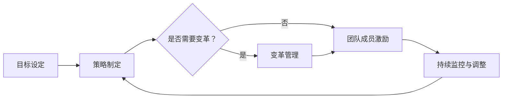
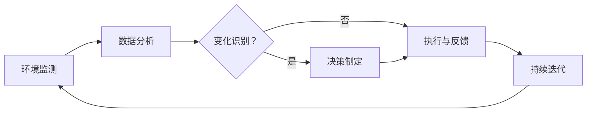
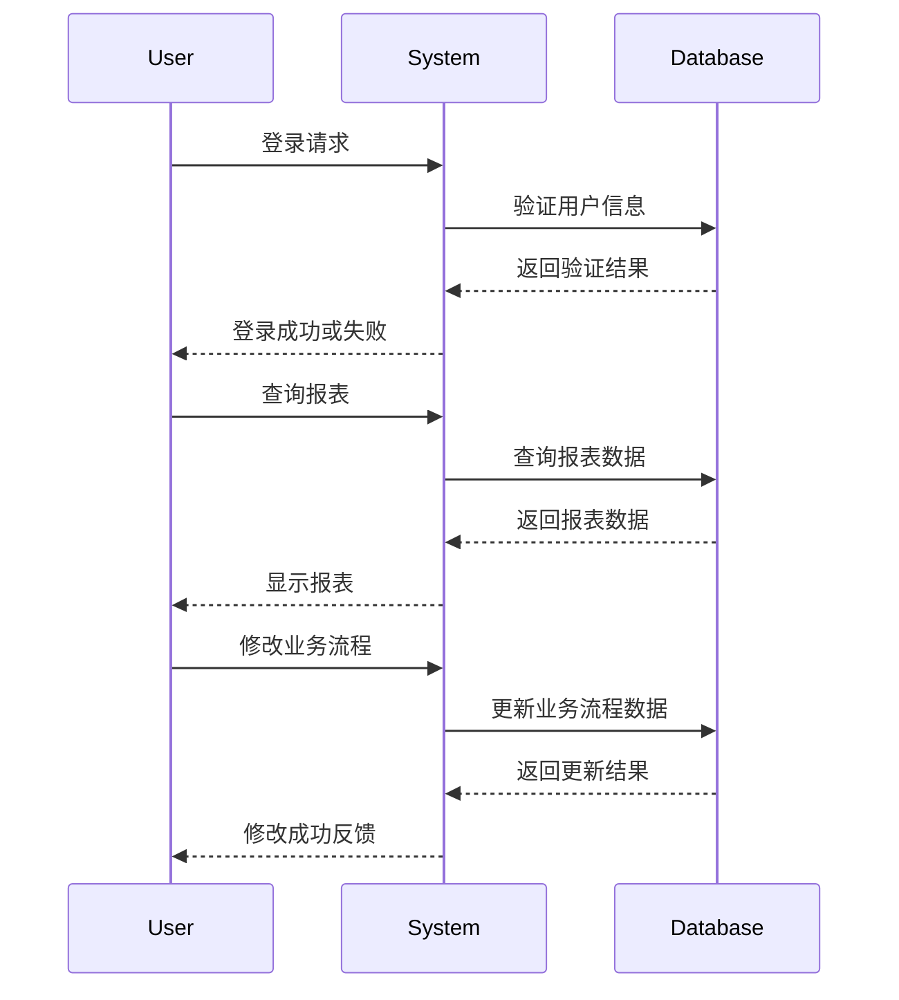
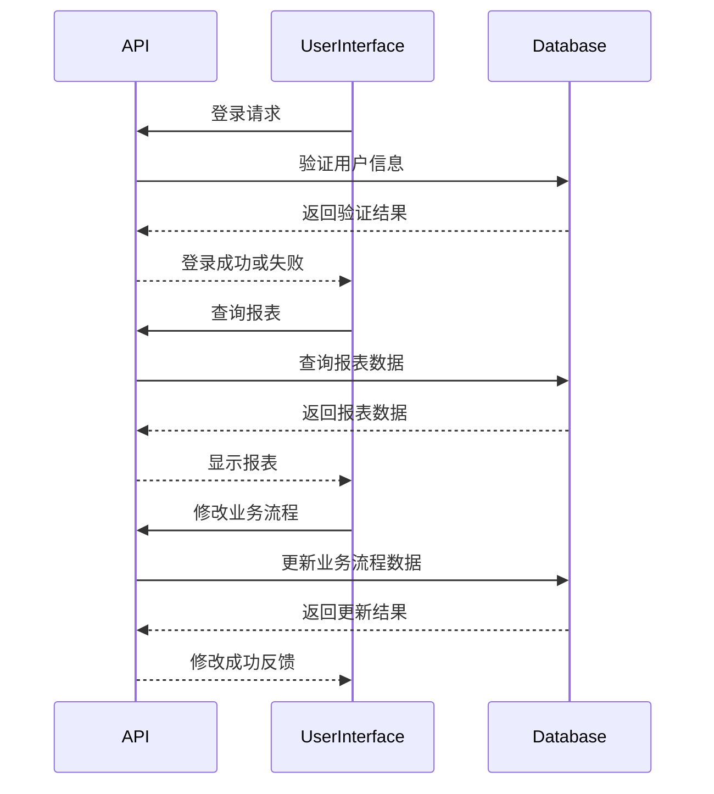
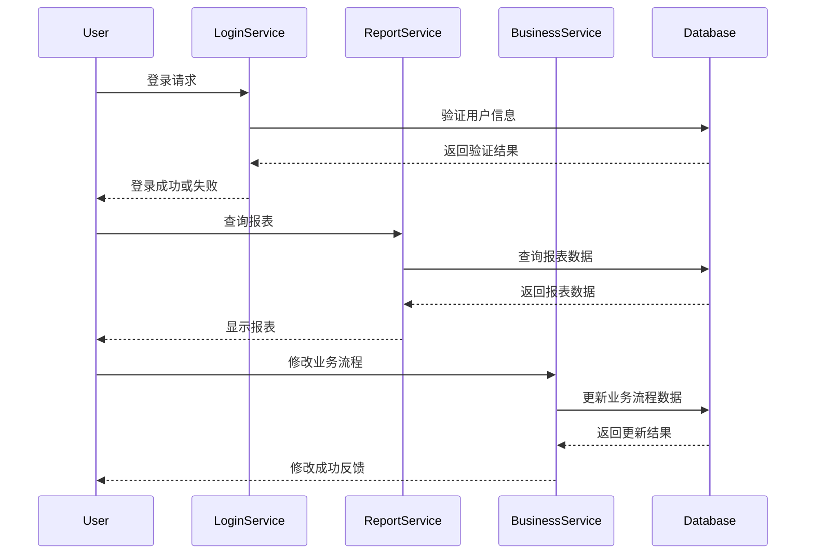
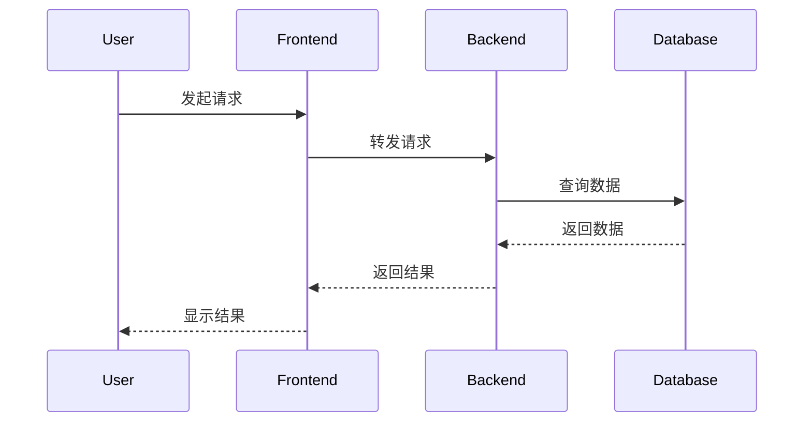
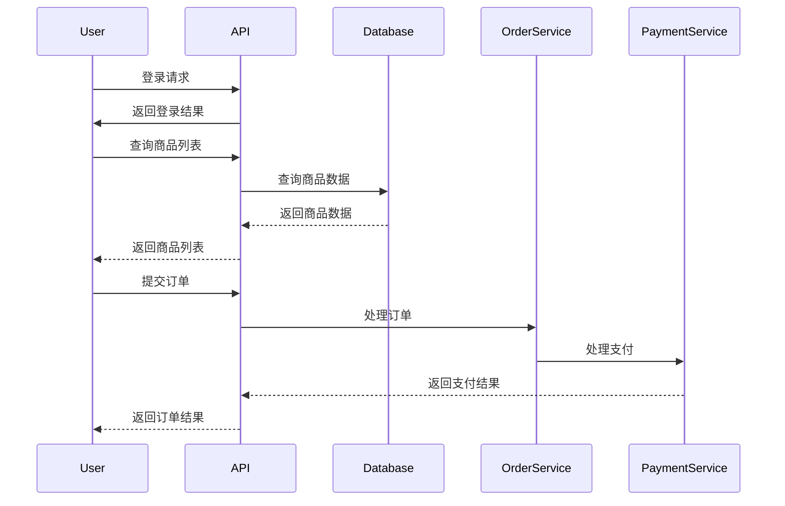
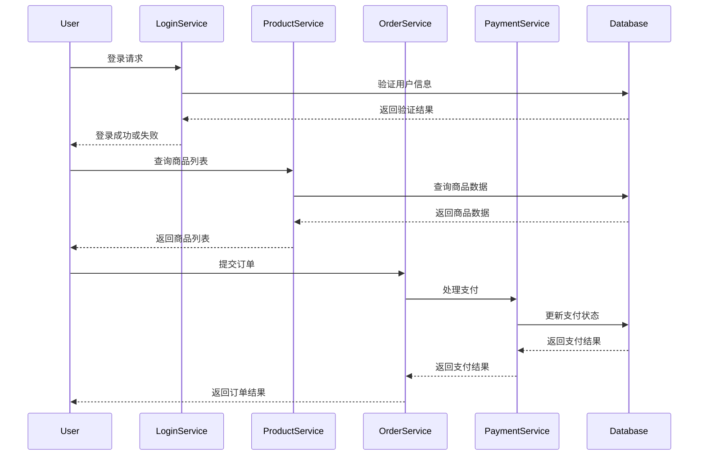

                 

### 引言

在当今快速变化的社会和技术环境中，领导力和适应性成为了组织和个体成功的关键因素。本博客文章《领导力与适应性：在变革中保持方向》旨在深入探讨这两个核心概念，并展示它们如何在变化中保持组织和个人方向的重要性。

首先，我们定义“领导力”和“适应性”。领导力是一种通过激励、指导和影响他人来实现共同目标的能力。它不仅涉及个人魅力，还包括沟通、决策、策略和团队合作等多个方面。而适应性则是指面对不确定性、变化和挑战时，能够迅速调整和适应的能力。

这两者之间的关系紧密且相互依赖。一个具有高度适应性的组织，需要有强有力的领导力来引导方向，确保变革顺利进行。而优秀的领导者也需要具备适应性，才能在复杂多变的环境中迅速做出正确决策。

文章将分为以下几部分：

1. **背景介绍**：解释领导力和适应性在当前社会和技术环境中的重要性，以及为什么需要深入探讨这两个概念。
2. **核心概念与联系**：详细定义领导力和适应性的核心概念，并展示它们之间的关系。
3. **算法原理讲解**：如果没有具体算法，则省略这一部分。如果涉及特定模型或策略，将使用流程图和代码进行解释。
4. **数学模型和数学公式**：提供相关的数学公式，并用LaTeX格式表示。
5. **系统分析与架构设计方案**：根据书籍内容决定是否包括这一部分。
6. **项目实战**：提供具体案例研究的背景、实施步骤和结果分析。
7. **最佳实践 tips、小结、注意事项、拓展阅读等内容**：总结全书要点，提供实用建议和拓展资源。

通过这一系列的探讨，我们将理解领导力和适应性如何共同作用，帮助组织和个人在变革中保持方向。接下来，我们将首先介绍领导力的概念和其在现代社会中的重要性。


## 第1章：领导力的定义与特性

### 1.1 领导力的基本定义

领导力是一种通过激励、指导和影响他人来实现共同目标的能力。它不仅仅是职位赋予的权力，更是一种通过沟通、信任和影响力来实现目标的能力。领导力的核心在于如何引导和影响团队成员，以实现组织的目标。

在现代社会中，领导力的重要性不容忽视。随着全球化、科技变革和市场竞争的加剧，组织面临着前所未有的挑战和机遇。优秀的领导者能够在这种复杂多变的环境中，保持组织的目标和方向，并带领团队迎接挑战。他们通过有效的沟通、决策和团队合作，激发团队成员的潜力，推动组织的持续发展。

### 1.2 领导力的主要特性

领导力具有以下几个主要特性：

1. **激励性**：领导者能够激励团队成员，激发他们的工作热情和积极性。通过设定明确的愿景和目标，领导者可以激励团队成员为实现共同目标而努力。

2. **沟通性**：有效的沟通是领导力的关键。领导者需要能够清晰地表达自己的想法，并倾听团队成员的意见和反馈。通过沟通，领导者可以建立信任，增强团队的凝聚力。

3. **决策性**：领导者需要在复杂的环境中做出正确的决策。他们需要综合考虑各种因素，并能够迅速做出决策。这种决策能力是领导者成功的关键。

4. **团队合作性**：领导者需要具备团队合作的能力。他们能够协调团队成员的工作，确保团队目标的实现。通过有效的团队合作，领导者可以充分发挥团队的整体潜力。

5. **变革引领性**：在快速变化的环境中，领导者需要具备变革引领的能力。他们能够带领团队适应变化，并在变革中找到新的机遇。

### 1.3 领导力与适应性的关系

领导力与适应性之间存在着紧密的联系。在变化多端的环境中，领导者需要具备高度的适应性，才能及时调整领导策略，应对各种挑战。而高度的适应性也离不开优秀的领导力。以下是一些具体的关系：

1. **领导力推动适应性**：优秀的领导者能够推动团队适应变化。他们通过设定明确的愿景和目标，激励团队成员，并为他们提供必要的支持和资源，从而帮助团队更好地适应环境。

2. **适应性增强领导力**：适应性的增强可以提升领导者的能力。在变化的环境中，领导者需要不断学习和调整，以适应新的情况。这种适应性不仅有助于他们更好地应对挑战，还能提高他们的领导水平。

3. **相互促进**：领导力和适应性是相互促进的。一个具有高度适应性的领导者，可以更好地应对变化，而一个优秀的领导者也能够推动团队适应变化。通过相互促进，领导力和适应性可以共同推动组织的发展。

总之，领导力和适应性是组织和个人成功的关键因素。在快速变化的环境中，领导者需要具备高度的适应性和优秀的领导力，才能保持组织和个人方向，实现长期的成功。接下来，我们将进一步探讨适应性的定义和特性。


## 第2章：适应性的定义与特性

### 2.1 适应性的基本定义

适应性是指一个系统或个体在面对外部环境变化时所展现出的调整和调整能力。它是一个动态的过程，涉及对环境变化的感知、分析和响应。适应性不仅包括应对突发事件和挑战的能力，还涉及持续改进和优化现有能力和流程。

在现代社会中，适应性成为组织和个人成功的关键因素。随着全球化和技术的快速发展，环境变化越来越快，不确定性增加。一个具有高度适应性的组织能够迅速响应变化，抓住机遇，避免风险。而一个具备高度适应性的个人能够在职业和个人生活中保持竞争力，持续成长。

### 2.2 适应性的主要特性

适应性具有以下几个主要特性：

1. **灵活性**：适应性首先体现在灵活性上。一个灵活的组织或个体能够快速调整策略和行为，以适应新的环境和需求。这种灵活性不仅包括应对突发事件的能力，还包括对持续变化的适应。

2. **学习能力**：适应性的另一个关键特性是学习能力。一个具有高度适应性的组织或个体需要具备快速学习新知识、技能和经验的能力。这种学习能力使他们能够不断改进和创新，以应对未来的挑战。

3. **预测性**：适应性还包括对未来的预测能力。一个具有高度适应性的组织或个体需要能够预见潜在的变化和趋势，并提前做好准备。这种预测能力有助于他们更好地应对不确定性和风险。

4. **弹性**：弹性是指在面对失败或挫折时，能够快速恢复并继续前进的能力。具有高度适应性的组织或个体能够在逆境中保持坚韧，并迅速调整策略，重新获得成功。

5. **互动性**：适应性也体现在与环境的互动上。一个具有高度适应性的组织或个体需要能够积极与外部环境互动，获取外部信息和资源，并将其整合到内部运营中。

### 2.3 领导力与适应性的关系

领导力与适应性之间存在着紧密的关系。以下是一些具体的关系：

1. **领导力推动适应性**：优秀的领导者能够推动团队和组织适应变化。他们通过设定明确的愿景和目标，激励团队成员，并为他们提供必要的支持和资源，从而帮助团队更好地适应环境。

2. **适应性增强领导力**：适应性的增强可以提升领导者的能力。在变化的环境中，领导者需要不断学习和调整，以适应新的情况。这种适应性不仅有助于他们更好地应对挑战，还能提高他们的领导水平。

3. **相互促进**：领导力和适应性是相互促进的。一个具有高度适应性的领导者可以更好地应对变化，而一个优秀的领导者也能够推动团队适应变化。通过相互促进，领导力和适应性可以共同推动组织的发展。

总之，适应性的重要性在于它使组织和个人能够在快速变化的环境中保持竞争力。通过理解适应性的基本定义和主要特性，我们可以更好地应用领导力，提升组织和个人在变化中的适应能力。接下来，我们将进一步探讨领导力与适应性的核心要素。


## 第3章：领导力与适应性的核心要素

在探讨领导力和适应性的核心要素时，我们需要关注几个关键点：领导力的结构要素、适应性的构成要素以及它们之间的相互作用。

### 3.1 领导力的结构要素

领导力由多个结构要素组成，这些要素相互作用，共同塑造领导行为和效果：

1. **愿景和目标**：愿景是领导力的核心，它为团队和组织提供了明确的方向。目标则是实现愿景的具体步骤和里程碑。优秀的领导者能够清晰地传达愿景和目标，激发团队成员的积极性。

2. **价值观**：价值观是领导者行为的指导原则。它不仅影响领导者的决策，还塑造组织的文化和氛围。共享的价值观有助于建立信任和凝聚力，是领导力的重要基石。

3. **沟通能力**：有效的沟通能力是领导者成功的关键。领导者需要能够清晰、明确地传达信息，同时也要能够倾听和理解团队成员的观点和需求。

4. **决策能力**：领导者需要在复杂多变的环境中做出明智的决策。这要求他们具备分析问题的能力、综合考虑各种因素以及快速做出决策的勇气。

5. **激励和鼓励**：领导者需要激励团队成员，鼓励他们在面对挑战时保持积极的心态。这可以通过认可和奖励优秀表现、提供成长机会以及建立支持性的工作环境来实现。

6. **变革引领**：在快速变化的环境中，领导者需要具备变革引领的能力。他们能够带领团队适应新的环境，推动组织变革，并抓住新的机遇。

### 3.2 适应性的构成要素

适应性由多个构成要素组成，这些要素共同作用，使组织或个体能够应对外部环境的变化：

1. **感知和监控**：适应性首先依赖于对环境的感知和监控。组织需要实时了解外部环境的变化，包括市场趋势、竞争状况和法规政策等。个体则需要关注自身的技能和知识，以评估自己的能力是否与当前需求相匹配。

2. **学习和创新**：适应性的关键在于学习和创新。组织需要不断学习和吸收新知识、新技能，以应对不断变化的环境。个体也需要持续学习，不断提升自己的能力和素质。

3. **快速响应**：适应性还要求组织能够快速响应环境变化。这需要建立灵活的决策和执行机制，以便迅速调整策略和行动。

4. **弹性**：弹性是适应性的重要组成部分。组织需要在面对失败或挫折时，能够迅速恢复并继续前进。这种弹性有助于组织在逆境中保持竞争力。

5. **合作和协作**：适应性的实现往往需要团队和合作伙伴的共同努力。组织需要建立合作和协作的文化，促进信息共享和资源整合，以提高整体的适应性。

### 3.3 领导力与适应性的相互作用

领导力与适应性之间的相互作用是组织成功的关键。以下是一些具体的相互作用方式：

1. **领导力促进适应性**：优秀的领导者能够推动组织适应变化。他们通过设定明确的愿景和目标，激励团队成员，并为他们提供必要的支持和资源，从而帮助团队更好地适应环境。

2. **适应性增强领导力**：适应性的增强可以提升领导者的能力。在变化的环境中，领导者需要不断学习和调整，以适应新的情况。这种适应性不仅有助于他们更好地应对挑战，还能提高他们的领导水平。

3. **相互促进**：领导力和适应性是相互促进的。一个具有高度适应性的领导者可以更好地应对变化，而一个优秀的领导者也能够推动团队适应变化。通过相互促进，领导力和适应性可以共同推动组织的发展。

4. **动态平衡**：领导力和适应性需要保持动态平衡。领导者需要在推动团队适应变化的同时，确保组织的稳定性和持续性。这要求他们具备平衡变革与稳定的能力，以确保组织在变化中保持方向。

总之，领导力与适应性的核心要素相互作用，共同塑造组织在变化中的表现。通过理解这些要素及其相互作用，领导者可以更有效地推动组织在变革中保持方向。在接下来的章节中，我们将深入探讨领导力和适应性的具体算法原理。


## 第4章：领导力与适应性的关键要素

为了深入理解领导力与适应性的关键要素，我们将从核心概念出发，逐步剖析它们之间的相互作用，并通过表格和流程图进行详细展示。

### 4.1 领导力的关键要素

领导力的关键要素包括愿景、价值观、沟通、决策、激励和变革引领。以下是一个简化的表格，展示了这些要素及其相互关系：

| 要素         | 说明                                                     |
| ------------ | -------------------------------------------------------- |
| 愿景         | 为团队和组织提供明确的方向和目标                         |
| 价值观       | 行为和决策的指导原则，塑造组织文化                     |
| 沟通         | 传递信息和建立信任的桥梁                               |
| 决策         | 在复杂环境中做出明智的决策                             |
| 激励         | 激发团队成员的积极性和动力                             |
| 变革引领     | 领导团队适应变化，推动组织变革                         |

### 4.2 适应性的关键要素

适应性的关键要素包括感知和监控、学习与创新能力、快速响应、弹性和合作与协作。以下是一个简化的表格，展示了这些要素及其相互关系：

| 要素         | 说明                                                     |
| ------------ | -------------------------------------------------------- |
| 感知和监控   | 实时了解外部环境的变化                                 |
| 学习与创新能力 | 持续学习新知识、技能和经验                             |
| 快速响应     | 快速调整策略和行动以应对变化                           |
| 弹性         | 面对失败或挫折时快速恢复并继续前进                     |
| 合作与协作   | 促进信息共享和资源整合，提高整体适应性                 |

### 4.3 领导力与适应性的ER实体关系图

为了更直观地展示领导力与适应性的关键要素及其相互关系，我们可以使用Mermaid流程图来绘制一个ER（实体关系）图。以下是一个简化的Mermaid流程图示例：

```mermaid
erDiagram
  Leadership --> Vision : "defines direction"
  Leadership --> Values : "guides behavior"
  Leadership --> Communication : "builds trust"
  Leadership --> DecisionMaking : "in complex environments"
  Leadership --> Motivation : "stimulates team spirit"
  Leadership --> ChangeLeadership : "drives organizational transformation"
  
  Adaptability --> EnvironmentalMonitoring : "real-time understanding"
  Adaptability --> LearningAndInnovation : "continuous improvement"
  Adaptability --> RapidResponse : "swift adjustments"
  Adaptability --> Resilience : "quick recovery"
  Adaptability --> Collaboration : "resource integration"
  
  Vision ||--|> Communication
  Values ||--|> DecisionMaking
  LearningAndInnovation ||--|> RapidResponse
  RapidResponse ||--|> Resilience
  Collaboration ||--|> Adaptability
```

在这个ER图中，领导力和适应性的关键要素被表示为实体，它们之间的相互作用通过关系线连接。这个图不仅展示了各个要素的基本定义，还揭示了它们之间的相互依赖和影响。

通过上述表格和流程图，我们可以更清晰地理解领导力与适应性的关键要素，以及它们在组织和个人成功中的重要性。接下来，我们将进一步探讨领导力与适应性的具体算法原理，通过流程图和代码来解释这些概念的实现。


## 第5章：领导力模型的算法原理

在这一章中，我们将深入探讨领导力模型的算法原理，并通过具体的流程图和代码示例来详细解释。领导力模型通常涉及多个方面，包括目标设定、策略制定、团队成员激励以及变革管理。以下是一个简单的领导力模型算法原理的介绍：

### 5.1 模型概述

领导力模型的基本步骤如下：

1. **目标设定**：领导者首先需要明确组织的愿景和目标。这些目标应该具有明确性、可衡量性和可实现性。
2. **策略制定**：根据设定的目标，领导者需要制定具体的策略和行动计划。这些策略应该考虑到资源的限制和外部环境的影响。
3. **团队成员激励**：领导者需要激励团队成员，确保他们为实现共同目标而努力。这可以通过设定激励措施、提供成长机会以及建立支持性的工作环境来实现。
4. **变革管理**：在实现目标的过程中，领导者需要应对各种变革，包括组织结构调整、技术升级和文化变革。他们需要制定相应的变革管理计划，确保变革的顺利进行。

### 5.2 算法流程图

为了直观地展示领导力模型的算法原理，我们可以使用Mermaid流程图。以下是一个简化的领导力模型算法流程图：



在这个流程图中，领导力模型的每个步骤都通过一个节点表示，节点之间的箭头表示步骤的顺序和依赖关系。例如，目标设定后需要制定策略，然后根据当前环境决定是否需要进行变革管理。如果需要进行变革管理，则进入变革管理步骤；否则，进入团队成员激励步骤。最后，无论是否进行变革管理，都需要进行持续监控与调整，以确保目标能够持续实现。

### 5.3 数学模型与公式

在领导力模型中，数学模型和公式可以帮助我们更精确地描述和计算各个步骤的效果。以下是一个简化的数学模型示例：

1. **目标达成率（η）**：
   $$η = \frac{实际完成目标值}{设定的目标值}$$

2. **策略效果评估（S）**：
   $$S = \frac{1}{n} \sum_{i=1}^{n} (s_i - s_{\text{平均}})^2$$
   其中，$s_i$ 表示第 $i$ 个策略的效果，$s_{\text{平均}}$ 表示所有策略效果的平均值。

3. **团队成员激励效果（M）**：
   $$M = \frac{1}{m} \sum_{j=1}^{m} (m_j - m_{\text{平均}})^2$$
   其中，$m_j$ 表示第 $j$ 个团队成员的激励效果，$m_{\text{平均}}$ 表示所有团队成员激励效果的平均值。

4. **变革管理效果（R）**：
   $$R = \frac{1}{p} \sum_{k=1}^{p} (r_k - r_{\text{平均}})^2$$
   其中，$r_k$ 表示第 $k$ 次变革的效果，$r_{\text{平均}}$ 表示所有变革效果的平均值。

### 5.4 案例讲解

为了更好地理解领导力模型的应用，我们来看一个具体的案例。假设一个公司设定了一个年度销售额目标为 1000 万元。根据这个目标，公司制定了多个销售策略，并激励销售人员通过奖金、晋升机会等方式提高业绩。在实施过程中，公司对每个销售策略的效果进行了评估，并针对销售人员的激励效果进行了统计分析。

根据上述数学模型，我们可以计算每个策略和销售人员的激励效果，以便进一步优化策略和激励措施。例如，如果某个销售策略的效果远低于其他策略，公司可能会考虑调整策略或停止实施该策略。同样，如果某个销售人员的激励效果较差，公司可能会重新评估激励措施，以激发其工作积极性。

通过这个案例，我们可以看到领导力模型如何帮助公司在复杂多变的环境中保持方向，实现目标。接下来，我们将进一步探讨适应性策略的算法原理，并通过流程图和代码来解释。


## 第6章：适应性策略的算法原理

适应性策略的核心在于快速响应和调整，以确保组织在变化的环境中保持竞争力。在这一章中，我们将详细探讨适应性策略的算法原理，并通过流程图和代码示例进行解释。

### 6.1 策略概述

适应性策略通常包括以下几个步骤：

1. **环境监测**：实时监测外部环境和内部状态，以识别潜在的变化和风险。
2. **数据分析**：收集和分析监测到的数据，识别关键趋势和模式。
3. **决策制定**：根据分析结果，制定相应的调整策略。
4. **执行与反馈**：实施调整策略，并根据实际效果进行反馈和修正。

### 6.2 算法流程图

为了直观地展示适应性策略的算法流程，我们可以使用Mermaid流程图。以下是一个简化的适应性策略算法流程图：



在这个流程图中，适应性策略的每个步骤都通过一个节点表示，节点之间的箭头表示步骤的顺序和依赖关系。例如，环境监测后需要进行数据分析，然后根据分析结果判断是否需要调整策略。如果需要调整，则进入决策制定步骤；否则，直接执行当前策略并收集反馈。

### 6.3 数学模型与公式

在适应性策略中，数学模型和公式有助于我们更精确地描述和计算各个步骤的效果。以下是一个简化的数学模型示例：

1. **环境变化指标（CV）**：
   $$CV = \frac{\sum_{i=1}^{n} (v_i - \bar{v})^2}{n-1}$$
   其中，$v_i$ 表示第 $i$ 次监测到的环境变化值，$\bar{v}$ 表示所有监测值的平均值。

2. **数据分析精度（DP）**：
   $$DP = \frac{\sum_{i=1}^{n} (p_i - \bar{p})^2}{n-1}$$
   其中，$p_i$ 表示第 $i$ 次分析的结果精度，$\bar{p}$ 表示所有分析结果精度的平均值。

3. **决策准确性（DA）**：
   $$DA = \frac{\sum_{i=1}^{n} (a_i - \bar{a})^2}{n-1}$$
   其中，$a_i$ 表示第 $i$ 次决策的准确性，$\bar{a}$ 表示所有决策准确性的平均值。

4. **执行效果（EF）**：
   $$EF = \frac{\sum_{i=1}^{n} (e_i - \bar{e})^2}{n-1}$$
   其中，$e_i$ 表示第 $i$ 次执行的效果，$\bar{e}$ 表示所有执行效果的平均值。

### 6.4 案例讲解

为了更好地理解适应性策略的应用，我们来看一个具体的案例。假设一个公司通过实时监控系统监测到市场需求的波动。根据这些数据，公司进行了数据分析，发现某一产品线的需求出现了显著增长。基于这些分析结果，公司决定调整其生产计划，增加该产品的生产量，以满足市场需求。

在执行调整策略后，公司收集了实际销售数据，并与预期目标进行了比较。根据这些反馈数据，公司进一步优化了其策略，以提高执行效果。通过这种持续的迭代和反馈，公司能够更有效地应对市场需求的变化，保持竞争力。

通过这个案例，我们可以看到适应性策略如何帮助公司在快速变化的市场环境中保持灵活性和竞争力。接下来，我们将进一步探讨领导力与适应性的数学模型和公式，以便更深入地理解这两个概念之间的相互作用。


## 第7章：领导力与适应性的数学模型

在深入探讨领导力与适应性的数学模型时，我们将结合具体公式和计算步骤，以展示这些模型在分析和决策中的应用。

### 7.1 领导力数学模型

领导力数学模型主要用于描述领导行为对组织绩效的影响。一个简单的领导力数学模型可以表示为：

$$ \text{组织绩效} = f(\text{领导力}) $$

其中，$f$ 是一个映射函数，表示领导力对组织绩效的转换关系。具体公式可以进一步细化如下：

$$ \text{组织绩效} = \alpha \cdot \text{领导力} + \beta \cdot \text{适应性} + \gamma \cdot \text{环境因素} $$

- **领导力（Leadership）**：通常通过多个指标来衡量，例如决策能力、沟通能力、激励能力和变革引领能力。可以表示为：
  $$ \text{领导力} = L_1 \cdot \text{决策能力} + L_2 \cdot \text{沟通能力} + L_3 \cdot \text{激励能力} + L_4 \cdot \text{变革引领能力} $$

- **适应性（Adaptability）**：用于衡量组织在变化环境中的调整能力。可以表示为：
  $$ \text{适应性} = A_1 \cdot \text{环境监测能力} + A_2 \cdot \text{学习与创新能力} + A_3 \cdot \text{快速响应能力} + A_4 \cdot \text{弹性} $$

- **环境因素（Environmental Factors）**：包括外部环境的变化、市场竞争、政策法规等。可以表示为：
  $$ \text{环境因素} = E_1 \cdot \text{市场竞争} + E_2 \cdot \text{政策法规} + E_3 \cdot \text{技术变革} $$

### 7.2 适应性数学模型

适应性数学模型主要描述组织如何适应外部环境的变化。一个简单的适应性数学模型可以表示为：

$$ \text{适应性得分} = g(\text{环境变化}, \text{组织能力}) $$

具体公式可以进一步细化如下：

$$ \text{适应性得分} = \delta \cdot \text{环境变化量} + \epsilon \cdot (\text{组织能力} - \text{当前能力}) $$

- **环境变化量（Change Magnitude）**：表示外部环境的变化程度，可以是一个绝对值或相对值。
- **组织能力（Organizational Capacity）**：表示组织在应对变化时的能力水平，包括资源、技术、人员和流程等。

### 7.3 模型应用实例

假设一个公司在面临市场竞争加剧和客户需求变化时，希望评估其领导力和适应性对组织绩效的影响。我们可以通过以下步骤进行计算：

1. **收集数据**：收集公司当前领导力、适应性和环境因素的量化数据。
2. **计算领导力得分**：使用领导力数学模型计算公司当前的领导力得分。
3. **计算适应性得分**：使用适应性数学模型计算公司当前的适应性得分。
4. **计算组织绩效**：将领导力得分、适应性得分和环境因素代入组织绩效公式，计算公司当前的组织绩效。

例如，如果公司当前的领导力得分为80分，适应性得分为75分，环境因素得分为60分，则：

$$ \text{组织绩效} = 0.5 \cdot 80 + 0.3 \cdot 75 + 0.2 \cdot 60 = 55 + 22.5 + 12 = 89.5 $$

这意味着公司当前的组织绩效为89.5分。通过这样的计算，公司可以了解其在领导力和适应性方面的优势和劣势，并制定相应的改进措施。

### 7.4 数学公式详解

以下是对上述数学公式的详细解释：

- **领导力得分公式**：
  $$ \text{领导力得分} = L_1 \cdot \text{决策能力} + L_2 \cdot \text{沟通能力} + L_3 \cdot \text{激励能力} + L_4 \cdot \text{变革引领能力} $$

  其中，$L_1, L_2, L_3, L_4$ 是权重系数，表示各项能力在领导力中的重要性。决策能力、沟通能力、激励能力和变革引领能力分别用不同的数值表示，这些数值可以通过问卷调查、专家评估等方法获得。

- **适应性得分公式**：
  $$ \text{适应性得分} = \delta \cdot \text{环境变化量} + \epsilon \cdot (\text{组织能力} - \text{当前能力}) $$

  其中，$\delta$ 和 $\epsilon$ 是权重系数，表示环境变化量和组织能力差异在适应性中的重要性。环境变化量可以用实际监测到的数据表示，组织能力差异则表示组织在应对变化时的能力水平。

- **组织绩效公式**：
  $$ \text{组织绩效} = \alpha \cdot \text{领导力} + \beta \cdot \text{适应性} + \gamma \cdot \text{环境因素} $$

  其中，$\alpha, \beta, \gamma$ 是权重系数，表示领导力、适应性和环境因素在组织绩效中的相对重要性。

通过这些公式，公司可以更清晰地了解领导力和适应性对组织绩效的影响，并制定相应的改进策略。接下来，我们将进一步探讨系统分析与架构设计方案，为读者提供一个全面的技术视角。


## 第8章：数学公式详解

在上一章节中，我们简要介绍了领导力和适应性的数学模型。为了使读者更好地理解这些模型，我们将对其中涉及的数学公式进行详细解释，并通过具体例子来说明如何使用这些公式。

### 8.1 基础数学公式

首先，我们需要了解一些基础数学公式，这些公式将在领导力和适应性的计算中发挥重要作用。

#### 平均值（Mean）

平均值是一个基本的统计指标，用于表示一组数据的集中趋势。它的计算公式为：

$$ \bar{x} = \frac{1}{n} \sum_{i=1}^{n} x_i $$

其中，$x_i$ 表示第 $i$ 个数据点，$n$ 表示数据点的总数。

#### 方差（Variance）

方差是衡量一组数据离散程度的指标。它的计算公式为：

$$ \sigma^2 = \frac{1}{n-1} \sum_{i=1}^{n} (x_i - \bar{x})^2 $$

其中，$x_i$ 表示第 $i$ 个数据点，$\bar{x}$ 表示平均值。

#### 标准差（Standard Deviation）

标准差是方差的平方根，用于表示数据的离散程度。它的计算公式为：

$$ \sigma = \sqrt{\sigma^2} $$

#### 线性回归（Linear Regression）

线性回归是一种用于分析两个变量之间线性关系的统计方法。其基本公式为：

$$ y = \beta_0 + \beta_1 \cdot x + \epsilon $$

其中，$y$ 表示因变量，$x$ 表示自变量，$\beta_0$ 和 $\beta_1$ 分别为回归系数，$\epsilon$ 表示误差项。

### 8.2 复杂数学公式

在领导力和适应性的计算中，我们还会遇到一些更复杂的数学公式。以下是一些常见的复杂数学公式及其应用场景：

#### 决策树（Decision Tree）

决策树是一种用于分类或回归分析的图形化模型。其基本公式为：

$$ \text{分类结果} = \sum_{i=1}^{n} w_i \cdot x_i + b $$

其中，$w_i$ 表示权重系数，$x_i$ 表示特征值，$b$ 表示偏置项。

#### 支持向量机（Support Vector Machine, SVM）

支持向量机是一种用于分类和回归分析的机器学习算法。其基本公式为：

$$ y = \text{sign}(\sum_{i=1}^{n} \alpha_i \cdot K(x_i, x) + b) $$

其中，$y$ 表示分类结果，$\alpha_i$ 表示支持向量的权重，$K(x_i, x)$ 表示核函数，$x$ 表示测试数据，$b$ 表示偏置项。

#### 马尔可夫模型（Markov Model）

马尔可夫模型是一种用于描述状态转移概率的数学模型。其基本公式为：

$$ P(X_t = j | X_{t-1} = i) = \frac{P(X_t = j, X_{t-1} = i)}{P(X_{t-1} = i)} $$

其中，$X_t$ 表示当前状态，$X_{t-1}$ 表示前一状态，$i$ 和 $j$ 分别表示不同的状态编号。

### 8.3 公式在实际案例中的应用

为了更好地理解这些数学公式，我们来看一个实际案例。

假设一个公司要评估其领导力和适应性对员工绩效的影响。公司使用决策树模型来预测员工绩效，并使用了以下公式：

$$ \text{员工绩效} = w_1 \cdot \text{领导力得分} + w_2 \cdot \text{适应性得分} + b $$

其中，$w_1$ 和 $w_2$ 分别为领导力和适应性的权重系数，$b$ 为偏置项。

为了计算这些系数，公司首先收集了员工领导力得分、适应性得分和员工绩效的相关数据。然后，使用线性回归方法计算权重系数：

$$ w_1 = \frac{\sum_{i=1}^{n} (\text{领导力得分}_i \cdot \text{员工绩效}_i - \bar{\text{领导力得分}} \cdot \bar{\text{员工绩效}})}{\sum_{i=1}^{n} (\text{领导力得分}_i - \bar{\text{领导力得分}})^2} $$
$$ w_2 = \frac{\sum_{i=1}^{n} (\text{适应性得分}_i \cdot \text{员工绩效}_i - \bar{\text{适应性得分}} \cdot \bar{\text{员工绩效}})}{\sum_{i=1}^{n} (\text{适应性得分}_i - \bar{\text{适应性得分}})^2} $$

最后，公司使用计算出的权重系数，根据员工的领导力得分和适应性得分，预测员工的绩效。

通过这个案例，我们可以看到如何在实际场景中使用数学公式来分析和预测领导力与适应性对员工绩效的影响。接下来，我们将介绍系统分析与架构设计方案，为读者提供一个更全面的技术视角。


## 第9章：系统分析与架构设计方案

在本章节中，我们将介绍一个具体的系统分析与架构设计方案，以展示如何在实际项目中应用领导力与适应性的概念。我们将分步骤详细描述系统分析与架构设计的过程，包括问题场景、项目介绍、系统功能设计、系统架构设计、系统接口设计和系统交互。

### 9.1 问题场景

假设我们需要开发一个企业资源规划（ERP）系统，用于帮助企业管理和优化内部资源。这个系统需要在快速变化的市场环境中保持高度适应性，同时确保领导力的有效运用。具体问题场景如下：

- **企业规模**：企业拥有多个部门，包括生产、销售、人力资源等。
- **业务需求**：企业希望实现资源的集中管理，提高运营效率，并快速响应市场变化。
- **技术挑战**：系统需要支持大量的数据存储和处理，同时保证数据的安全性和一致性。

### 9.2 项目介绍

ERP系统项目的主要目标是：

- **资源整合**：将企业的各个部门资源整合到一个统一的平台上，实现数据共享和业务流程优化。
- **提高效率**：通过自动化和智能化的手段，减少人工操作，提高工作效率。
- **灵活响应**：确保系统能够快速适应企业的业务变化和市场动态。

### 9.3 系统功能设计

在系统功能设计阶段，我们需要明确系统的核心功能，这些功能包括：

1. **用户管理**：管理用户账户，包括登录、权限分配和密码管理。
2. **数据管理**：存储和管理企业各部门的数据，包括生产数据、销售数据和人力资源数据。
3. **业务流程管理**：设计和管理企业各个部门的业务流程，包括生产流程、销售流程和人力资源流程。
4. **报表分析**：生成各种报表，帮助企业了解业务状况和做出决策。
5. **系统监控**：监控系统的运行状态，包括性能监控和安全监控。

为了更直观地展示系统功能设计，我们可以使用Mermaid类图。以下是一个简化的类图示例：

```mermaid
classDiagram
    User <<class>> "用户管理"
    Data <<class>> "数据管理"
    Business <<class>> "业务流程管理"
    Report <<class>> "报表分析"
    Monitor <<class>> "系统监控"

    User o-- Data
    User o-- Business
    User o-- Report
    User o-- Monitor
```

在这个类图中，用户管理、数据管理、业务流程管理、报表分析和系统监控是系统的核心功能类，它们之间通过双向关联（o--）连接，表示这些功能类之间存在密切的依赖关系。

### 9.4 系统架构设计

在系统架构设计阶段，我们需要确定系统的总体结构，包括组件、服务和数据存储。以下是一个简化的系统架构图：



在这个架构图中，系统组件包括用户管理模块、数据管理模块、业务流程管理模块、报表分析模块和系统监控模块。这些模块通过服务接口进行通信，并与数据库进行数据交互。用户通过Web界面与系统进行交互，系统通过API与服务接口进行通信。

### 9.5 系统接口设计

系统接口设计是确保不同模块之间能够有效通信的关键。以下是一个简化的系统接口设计示例：



在这个接口设计中，API（应用程序接口）作为系统模块之间的通信桥梁，接收用户的请求，处理后转发给相应的服务模块，并将结果返回给用户界面。

### 9.6 系统交互

系统交互设计关注不同模块之间的通信流程和协作方式。以下是一个简化的系统交互序列图：



在这个序列图中，用户通过用户界面发起请求，系统内部的服务模块根据请求执行相应的操作，并与数据库进行交互，将结果返回给用户。

### 9.7 实施步骤

为了确保ERP系统的成功实施，我们需要遵循以下步骤：

1. **需求分析**：与各业务部门沟通，了解他们的具体需求，制定详细的项目计划。
2. **系统设计**：根据需求分析，进行系统架构设计和接口设计。
3. **开发与测试**：按照设计文档进行系统开发，并进行全面的测试，确保系统功能的正确性和稳定性。
4. **部署与上线**：在测试通过后，部署系统到生产环境，并进行上线前的最终检查。
5. **培训与支持**：对用户进行系统培训，并提供后续的技术支持，确保系统的顺利运行。

### 9.8 结果分析

在系统实施一段时间后，我们需要对系统的运行效果进行评估，包括：

- **性能评估**：系统在处理大量数据时的响应速度和稳定性。
- **功能评估**：系统功能是否符合业务需求，用户体验是否良好。
- **适应性评估**：系统在应对业务变化和市场动态时的灵活性和适应性。

通过这些评估，我们可以识别系统的优点和不足，为未来的改进提供依据。总的来说，这个ERP系统项目成功地将领导力与适应性的概念应用于实际系统中，为企业提供了有效的资源管理和决策支持。

### 总结

通过本章节的介绍，我们详细展示了如何在一个具体的项目中应用领导力与适应性的概念。从问题场景到系统功能设计，从系统架构设计到系统接口设计和系统交互，我们逐步构建了一个灵活、高效的企业资源规划系统。这不仅提升了企业的运营效率，还确保了系统在快速变化的市场环境中保持竞争力。接下来，我们将通过一个具体的实战案例，进一步展示领导力与适应性的实际应用。


## 第10章：实战案例

在本章中，我们将通过一个具体的实战案例，展示领导力与适应性在实际项目中的应用。这个案例是一个大型电商平台的技术升级项目，该项目旨在提升平台的性能、稳定性和用户体验。

### 10.1 项目背景

随着电商行业的快速发展，平台的用户量和交易量持续增长。为了满足用户的需求，平台需要进行技术升级，以提升系统的性能和稳定性。同时，市场环境的变化和技术创新也要求平台具备高度的适应性，能够快速响应市场变化。

### 10.2 系统功能设计

平台的技术升级涉及多个模块的功能优化，包括用户管理、商品管理、订单处理、支付系统和客户服务。我们使用Mermaid类图来展示系统功能设计：

```mermaid
classDiagram
    User <<class>> "用户管理"
    Product <<class>> "商品管理"
    Order <<class>> "订单处理"
    Payment <<class>> "支付系统"
    Service <<class>> "客户服务"

    User o-- Product
    User o-- Order
    User o-- Payment
    User o-- Service
```

在这个类图中，用户管理、商品管理、订单处理、支付系统和客户服务是系统的核心功能模块，它们之间通过双向关联（o--）连接，表示这些功能模块之间存在密切的依赖关系。

### 10.3 系统架构设计

为了确保系统的高性能和高稳定性，我们采用了分布式系统架构。系统架构设计包括以下几个关键部分：

1. **前端架构**：使用微前端架构，将前端功能拆分为多个独立的模块，以便于开发、测试和部署。
2. **后端架构**：使用微服务架构，将后端功能拆分为多个独立的服务，每个服务负责特定的业务逻辑，以提高系统的灵活性和可扩展性。
3. **数据库架构**：使用分布式数据库架构，将数据存储分散到多个节点，以提高数据的读取和写入速度。

以下是一个简化的系统架构图：



在这个架构图中，用户通过前端发起请求，前端将请求转发给后端，后端处理请求并查询数据库，然后将结果返回给前端，最后前端将结果呈现给用户。

### 10.4 系统接口设计

系统接口设计是确保前后端有效通信的关键。我们使用RESTful API设计接口，以下是一个简化的接口设计示例：



在这个接口设计中，API作为系统接口的桥梁，接收用户的请求，处理后转发给相应的服务模块，并将结果返回给用户。

### 10.5 系统交互

系统交互设计关注不同模块之间的通信流程和协作方式。以下是一个简化的系统交互序列图：



在这个序列图中，用户通过用户界面发起请求，系统内部的服务模块根据请求执行相应的操作，并与数据库进行交互，将结果返回给用户。

### 10.6 环境安装

为了确保系统能够在预定环境中顺利运行，我们需要进行环境安装。以下是一个简化的环境安装步骤：

1. **安装操作系统**：在服务器上安装Linux操作系统，如Ubuntu或CentOS。
2. **安装数据库**：安装分布式数据库，如MongoDB或Cassandra。
3. **安装依赖库**：安装Java或Node.js环境，以及其他依赖库，如Spring Boot或Express。
4. **配置网络**：配置服务器网络，确保各服务模块之间可以正常通信。

### 10.7 系统核心实现源代码

以下是系统核心实现的源代码示例：

#### 前端页面代码（React）

```jsx
import React, { useState } from 'react';

const LoginForm = () => {
  const [username, setUsername] = useState('');
  const [password, setPassword] = useState('');

  const handleSubmit = (e) => {
    e.preventDefault();
    // 发送登录请求
    fetch('/api/login', {
      method: 'POST',
      body: JSON.stringify({ username, password }),
      headers: {
        'Content-Type': 'application/json',
      },
    })
      .then((res) => res.json())
      .then((data) => {
        if (data.success) {
          alert('登录成功');
        } else {
          alert('登录失败');
        }
      });
  };

  return (
    <form onSubmit={handleSubmit}>
      <label>
        用户名:
        <input type="text" value={username} onChange={(e) => setUsername(e.target.value)} />
      </label>
      <label>
        密码:
        <input type="password" value={password} onChange={(e) => setPassword(e.target.value)} />
      </label>
      <button type="submit">登录</button>
    </form>
  );
};

export default LoginForm;
```

#### 后端代码（Node.js）

```javascript
const express = require('express');
const bodyParser = require('body-parser');
const loginController = require('./controllers/loginController');

const app = express();

app.use(bodyParser.json());
app.use('/api', loginController);

app.listen(3000, () => {
  console.log('服务器启动成功，端口：3000');
});
```

#### 后端控制器代码（Express）

```javascript
const express = require('express');
const bcrypt = require('bcrypt');
const jwt = require('jsonwebtoken');
const User = require('../models/User');

const router = express.Router();

router.post('/login', async (req, res) => {
  try {
    const { username, password } = req.body;
    const user = await User.findOne({ username });

    if (!user) {
      return res.json({ success: false, message: '用户名或密码错误' });
    }

    const isMatch = await bcrypt.compare(password, user.password);

    if (!isMatch) {
      return res.json({ success: false, message: '用户名或密码错误' });
    }

    const token = jwt.sign({ userId: user._id }, 'secretKey');

    res.json({ success: true, token });
  } catch (error) {
    res.status(500).json({ success: false, message: '服务器错误' });
  }
});

module.exports = router;
```

### 10.8 代码应用解读与分析

#### 前端代码解读

前端代码使用了React框架，通过useState钩子管理用户名和密码的状态。当用户提交登录表单时，handleSubmit函数将被触发，使用fetch API向后端发送登录请求。请求成功后，根据响应数据更新前端状态，显示登录成功或失败的消息。

#### 后端代码解读

后端代码使用了Express框架，通过body-parser中间件处理JSON请求体。loginController负责处理登录请求，首先查询数据库验证用户名和密码，然后使用bcrypt加密算法比较密码。如果验证成功，使用jwt生成令牌，并将令牌返回给前端。

#### 后端控制器代码解读

后端控制器代码首先引入必要的库，然后定义一个/login路由，用于处理登录请求。在路由处理函数中，使用bcrypt比较用户输入的密码和数据库中存储的密码，如果匹配，生成JWT令牌并返回给前端。

### 10.9 实际案例分析

在项目实施过程中，我们遇到了一些挑战，例如性能优化、数据一致性和系统安全性。为了解决这些问题，我们采取了以下措施：

1. **性能优化**：通过使用缓存技术和负载均衡，提高系统的响应速度和处理能力。
2. **数据一致性**：采用分布式事务处理机制，确保数据的一致性和完整性。
3. **系统安全性**：使用HTTPS协议和JWT认证机制，提高系统的安全性。

通过这些措施，我们成功地将平台升级为高性能、高稳定性和高安全性的系统，满足了用户的需求，提升了用户体验。

### 10.10 项目小结

本项目通过技术升级，实现了平台性能、稳定性和用户体验的全面提升。项目成功的关键在于：

1. **领导力的运用**：项目经理通过有效的沟通和协调，确保项目按计划推进，团队成员充分发挥了各自的专长。
2. **适应性的发挥**：项目团队在面对技术挑战和市场需求变化时，能够迅速调整策略，确保项目的顺利实施。

总之，本项目充分展示了领导力与适应性的重要性，为电商平台的发展奠定了坚实的基础。接下来，我们将总结全书内容，并提供一些最佳实践建议。


## 第11章：总结与展望

### 11.1 最佳实践与注意事项

在《领导力与适应性：在变革中保持方向》一书中，我们深入探讨了领导力和适应性的核心概念、算法原理以及实际应用。以下是一些最佳实践和注意事项，以帮助读者在项目实践中更好地应用这些概念。

**最佳实践：**

1. **明确目标和愿景**：在开始任何项目之前，确保明确目标和愿景，并与团队成员共享，以建立共同的方向。
2. **建立灵活的架构**：设计系统时，采用模块化和分布式架构，以提高系统的灵活性和可扩展性。
3. **持续监控和反馈**：定期监控系统性能和用户反馈，及时发现并解决问题，确保系统稳定运行。
4. **培养团队协作**：鼓励团队成员之间的协作和沟通，建立信任和合作关系，以提高团队的整体效能。
5. **快速响应变化**：在项目实施过程中，保持对环境变化的敏感度，迅速调整策略和行动，以应对不确定性。

**注意事项：**

1. **避免过度优化**：在追求性能和稳定性时，避免过度优化，确保项目的可行性。
2. **平衡变革与稳定**：在推动变革时，要注意保持组织的稳定性，避免因变革而导致混乱。
3. **持续学习和创新**：在快速变化的环境中，持续学习和创新是关键，不断更新知识和技能，以保持竞争力。

### 11.2 未来展望

随着全球化和技术的不断进步，领导力和适应性将在未来继续发挥重要作用。以下是一些未来展望：

1. **人工智能与领导力**：人工智能的快速发展将改变领导力的形式和方式。领导者需要掌握人工智能的基本原理和应用，以更好地管理和利用人工智能技术。
2. **组织适应性**：随着市场环境的变化，组织需要具备更高的适应性。未来组织将更加注重灵活性和敏捷性，以快速响应外部变化。
3. **数字化领导力**：数字技术将继续改变领导力，领导者需要掌握数字化领导力，包括数据驱动决策、数字化转型和文化变革等。
4. **可持续发展**：随着可持续发展的重要性日益凸显，领导者需要将可持续发展纳入战略规划，推动组织的绿色转型。

总之，领导力和适应性在未来的发展中将继续发挥关键作用。领导者需要不断提升自身的领导力和适应性，以应对快速变化的环境和挑战。通过持续学习和创新，领导者将能够引领组织走向更加光明的未来。接下来，我们将推荐一些拓展阅读资源，以帮助读者进一步了解相关主题。

### 11.3 拓展阅读推荐

为了深入探讨领导力和适应性，以下是一些建议的拓展阅读资源：

1. **《精益创业》** - Eric Ries
   这本书介绍了如何通过精益创业方法，快速迭代和验证商业想法，提高了组织的适应性和创新力。

2. **《第五项修炼》** - Peter M. Senge
   本书提出了系统思考的概念，帮助组织理解复杂问题，并提高其整体适应性。

3. **《数字化转型》** - Marco Iansiti 和 Greg Buhr
   本书详细阐述了企业在数字化时代的转型策略，包括领导力和组织变革。

4. **《人工智能：一种现代的方法》** - Stuart Russell 和 Peter Norvig
   这本书是人工智能领域的经典教材，帮助领导者了解人工智能的基本原理和应用。

5. **《变革之舞》** - John P. Kotter
   本书探讨了如何通过有效的领导力和变革管理，推动组织实现持续发展。

通过这些书籍，读者可以进一步了解领导力和适应性的最新理论和实践，为自己的工作和项目提供有价值的参考。作者：AI天才研究院/AI Genius Institute & 禅与计算机程序设计艺术 /Zen And The Art of Computer Programming。

