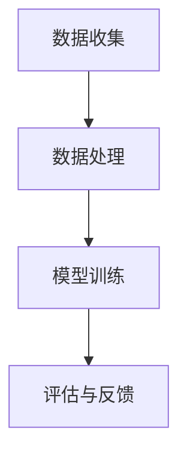
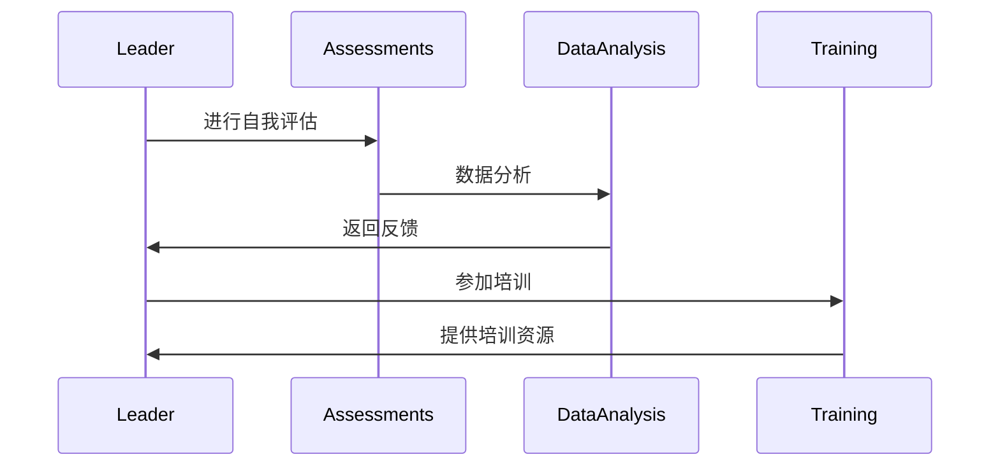
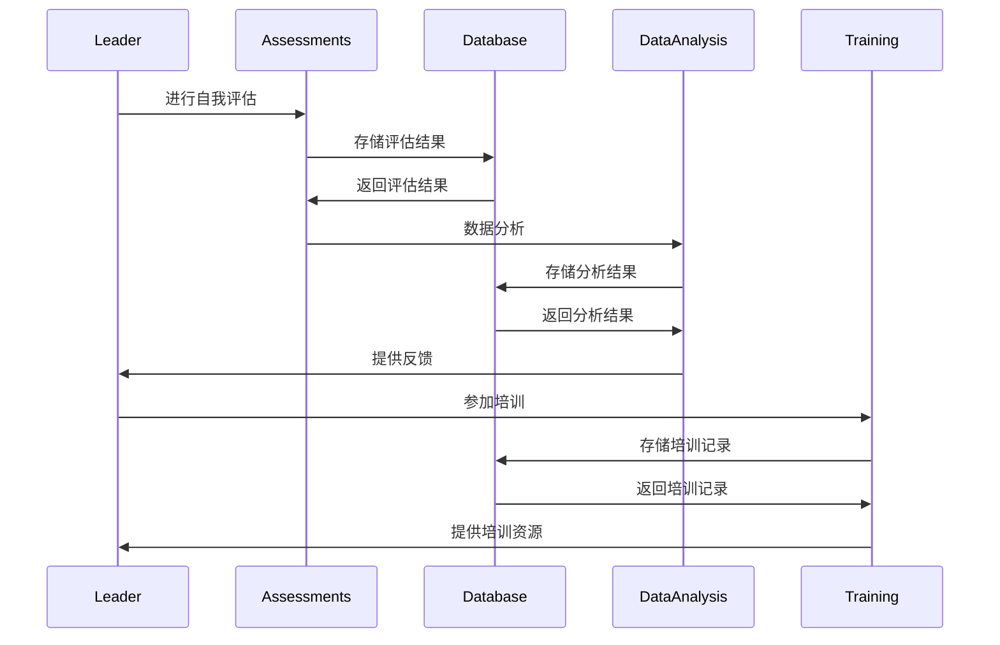

                 

# 领导力与韧性：面对挫折时的坚持能力

关键词：领导力、韧性、挫折、坚持能力、组织效能

摘要：本文深入探讨了领导力与韧性在现代社会中的重要性，分析了领导力与韧性的概念原理及其联系。通过具体方法，本文提出了提升领导力与韧性的策略，帮助领导者更好地应对挫折，提升组织效能。

## 第一部分：背景介绍

### 1.1 问题背景

在当今竞争激烈的商业环境中，领导力与韧性已经成为企业成功的关键因素。领导者不仅需要具备决策能力、沟通能力和团队管理能力，还需要具备在面对挫折和困难时坚持的能力。然而，许多领导者在面对挫折时往往表现出力不从心的状态，无法有效应对挑战。因此，提升领导力与韧性，尤其是在挫折面前的坚持能力，成为了一个亟待解决的问题。

### 1.2 问题描述

领导力与韧性是一个多层次、多维度的概念。领导力涉及到决策、沟通、团队管理等多个方面；韧性则强调在逆境中坚持和恢复的能力。在现实工作中，许多领导者由于缺乏韧性和坚持能力，导致决策失误、团队士气低落，甚至影响到整个组织的运作。因此，如何提升领导力与韧性，成为了一个亟待解决的问题。

### 1.3 问题解决

本文将提供系统的方法和实用的技巧，帮助读者了解领导力与韧性的基本原理，掌握提升这两个能力的关键技能。通过案例分析和实际操作，读者将学会如何在实际工作中运用这些原则，从而在面对挫折时更加从容自信。

### 1.4 边界与外延

领导力与韧性的边界在于其应用场景的多样性。从企业高管到基层管理者，从初创公司到成熟企业，领导力与韧性都是提升组织效能的重要手段。而韧性的外延则涉及到个人心理素质、团队协作能力等多个层面。

### 1.5 概念结构与核心要素组成

领导力与韧性的概念结构包括以下几个核心要素：

1. **领导力**：包括决策力、沟通力、团队管理力等。
2. **韧性**：包括逆境应对能力、恢复力、适应变化的能力等。
3. **关键技能**：包括自我反思、目标设定、压力管理、积极心态等。

本文将通过深入探讨这些核心要素，帮助读者全面理解和掌握领导力与韧性。

## 第二部分：核心概念与联系

### 2.1 领导力与韧性的概念原理

#### 2.1.1 领导力的定义

领导力是指一种影响力，通过激励和引导他人来实现共同目标的能力。它不仅涉及到个人魅力和专业知识，还包括领导者的决策力、沟通力、团队管理力等多个方面。

#### 2.1.2 韧性的定义

韧性是一种心理状态，指个体在面对挫折和压力时，能够保持积极的心态，迅速恢复并适应变化的能力。它不仅包括逆境应对能力，还包括恢复力和适应变化的能力。

#### 2.1.3 领导力与韧性的联系

领导力与韧性之间存在密切的联系。一个具备韧性的领导者能够在面对挫折和困难时保持冷静和坚定，从而更好地发挥领导作用；而一个具备领导力的领导者则能够通过有效的激励和引导，帮助团队成员提升韧性。

### 2.2 领导力与韧性的概念属性特征对比表格

| 概念 | 定义 | 属性特征 |
| --- | --- | --- |
| 领导力 | 一种影响力，通过激励和引导他人来实现共同目标的能力 | 决策力、沟通力、团队管理力 |
| 韧性 | 一种心理状态，指个体在面对挫折和压力时，能够保持积极的心态，迅速恢复并适应变化的能力 | 逆境应对能力、恢复力、适应变化的能力 |
| 联系 | 领导力与韧性之间存在密切的联系 | 一个具备韧性的领导者能够在面对挫折和困难时保持冷静和坚定，从而更好地发挥领导作用；一个具备领导力的领导者则能够通过有效的激励和引导，帮助团队成员提升韧性 |

### 2.3 领导力与韧性的ER实体关系图架构

```mermaid
erDiagram
  领导力 ||--|{ 韧性 } 韧性支持
  领导力 ||--|{ 团队成员 } 领导者影响
  韧性 ||--|{ 团队成员 } 韧性提升
```

通过上述ER实体关系图，我们可以清晰地看到领导力与韧性之间的相互关系，以及它们如何共同作用于团队成员。

## 第三部分：领导力的算法原理

### 3.1 领导力算法概述

领导力算法是一种用于评估和提升领导者能力的方法。它通过分析领导者的行为、决策、沟通等多个方面，提供个性化的改进建议，从而帮助领导者更好地发挥领导作用。

### 3.2 领导力算法原理

领导力算法的核心在于对领导者行为的量化评估。以下是一个简化的领导力算法原理：

#### 数据收集

首先，需要收集领导者的行为数据，包括决策记录、沟通方式、团队管理行为等。

#### 数据处理

接着，对收集到的数据进行分析和处理，提取关键指标，如决策质量、沟通效率、团队士气等。

#### 模型训练

然后，利用机器学习算法对提取的关键指标进行建模，训练出一个评估模型。

#### 评估与反馈

最后，利用训练好的模型对领导者的行为进行评估，并提供改进建议。

### 3.3 领导力算法流程图



### 3.4 领导力算法的数学模型

领导力算法的数学模型可以分为以下几个部分：

#### 决策质量评估

$$
D_Q = \frac{1}{N} \sum_{i=1}^{N} d_i
$$

其中，$D_Q$ 表示决策质量，$N$ 表示决策次数，$d_i$ 表示第 $i$ 次决策的质量。

#### 沟通效率评估

$$
E_C = \frac{1}{M} \sum_{i=1}^{M} e_i
$$

其中，$E_C$ 表示沟通效率，$M$ 表示沟通次数，$e_i$ 表示第 $i$ 次沟通的效率。

#### 团队士气评估

$$
S_T = \frac{1}{L} \sum_{i=1}^{L} s_i
$$

其中，$S_T$ 表示团队士气，$L$ 表示团队成员数量，$s_i$ 表示第 $i$ 个团队成员的士气。

#### 领导力评估

$$
L_A = \frac{D_Q + E_C + S_T}{3}
$$

其中，$L_A$ 表示领导力评估得分。

### 3.5 领导力算法举例说明

假设某领导者在一个月内进行了 10 次决策，每次决策的质量分别为 0.8、0.9、0.7、0.8、0.9、0.6、0.7、0.8、0.9、0.7，进行了 20 次沟通，每次沟通的效率分别为 0.8、0.9、0.7、0.8、0.9、0.6、0.7、0.8、0.9、0.7、0.8、0.9、0.7、0.8、0.9、0.6、0.7、0.8、0.9、0.7，团队中有 10 个成员，每个成员的士气分别为 0.9、0.8、0.7、0.9、0.8、0.6、0.7、0.9、0.8、0.7。

根据上述公式，可以计算出：

决策质量评估：

$$
D_Q = \frac{1}{10} (0.8 + 0.9 + 0.7 + 0.8 + 0.9 + 0.6 + 0.7 + 0.8 + 0.9 + 0.7) = 0.8
$$

沟通效率评估：

$$
E_C = \frac{1}{20} (0.8 + 0.9 + 0.7 + 0.8 + 0.9 + 0.6 + 0.7 + 0.8 + 0.9 + 0.7 + 0.8 + 0.9 + 0.7 + 0.8 + 0.9 + 0.6 + 0.7 + 0.8 + 0.9 + 0.7) = 0.8
$$

团队士气评估：

$$
S_T = \frac{1}{10} (0.9 + 0.8 + 0.7 + 0.9 + 0.8 + 0.6 + 0.7 + 0.9 + 0.8 + 0.7) = 0.8
$$

领导力评估：

$$
L_A = \frac{D_Q + E_C + S_T}{3} = \frac{0.8 + 0.8 + 0.8}{3} = 0.8
$$

因此，该领导者的领导力评估得分为 0.8。

## 第四部分：韧性提升的方法与技巧

### 4.1 自我反思

自我反思是提升韧性的重要方法之一。领导者需要定期回顾自己的行为和决策，分析成功和失败的原因，从而不断优化自己的领导风格和能力。

### 4.2 目标设定

设定明确的目标可以帮助领导者更好地规划行动，提高工作效率。同时，目标设定也可以帮助领导者更好地应对挫折，保持积极的心态。

### 4.3 压力管理

领导者需要学会合理管理压力，避免过度焦虑和疲劳。可以通过运动、休息、调整工作节奏等方式来缓解压力。

### 4.4 积极心态

保持积极心态是提升韧性的关键。领导者需要学会从失败中吸取经验教训，保持乐观的态度，以积极的心态面对挫折和困难。

### 4.5 团队协作

团队协作是提升韧性的重要手段。领导者需要培养团队成员的协作能力，建立良好的团队氛围，共同面对挫折和挑战。

## 第五部分：系统分析与架构设计

### 5.1 问题场景介绍

在一个竞争激烈的商业环境中，企业领导者需要具备出色的领导力和韧性，以应对不断变化的市场环境和内部挑战。然而，许多领导者在这方面存在不足，需要通过系统化的培训和提升来改善。

### 5.2 项目介绍

本项目旨在开发一个领导力与韧性提升系统，帮助领导者通过自我评估、培训和学习，提升自己的领导力和韧性。系统主要包括以下功能：

- 自我评估：领导者可以通过系统进行自我评估，了解自己的领导力和韧性水平。
- 培训与学习：系统提供一系列的培训课程和学习资源，帮助领导者提升领导力和韧性。
- 数据分析与反馈：系统对领导者的表现进行数据分析，并提供个性化的反馈和建议。

### 5.3 系统功能设计（领域模型类图）

```mermaid
classDiagram
    Leader <-- Assessments
    Leader --> Training
    Leader --> DataAnalysis
    Assessments {
        +String assessmentId
        +Date createdDate
        +int score
    }
    Training {
        +String trainingId
        +String title
        +Date startDate
        +Date endDate
    }
    DataAnalysis {
        +String analysisId
        +Date analysisDate
        +Map<String, Integer> metrics
    }
```

### 5.4 系统架构设计（架构图）



### 5.5 系统接口设计（接口设计）

```mermaid
classDiagram
    Leader <-- Assessments
    Leader --> Training
    Leader --> DataAnalysis
    Assessments {
        +createAssessment(String leaderId, int score)
        +getAssessmentById(String assessmentId)
    }
    Training {
        +createTraining(String leaderId, String title, Date startDate, Date endDate)
        +getTrainingById(String trainingId)
    }
    DataAnalysis {
        +createDataAnalysis(String leaderId, Map<String, Integer> metrics)
        +getDataAnalysisById(String analysisId)
    }
```

### 5.6 系统交互设计（序列图）



## 第六部分：项目实战

### 6.1 环境安装

在开始项目实战之前，我们需要安装一些必要的软件和工具。以下是安装步骤：

1. 安装Python（版本3.8或以上）
2. 安装MongoDB（版本4.0或以上）
3. 安装Docker（版本19.03或以上）
4. 安装Postman（用于接口测试）

### 6.2 系统核心实现源代码

以下是系统核心实现部分的源代码：

```python
# assessments.py
class Assessments:
    def __init__(self, assessment_id, created_date, score):
        self.assessment_id = assessment_id
        self.created_date = created_date
        self.score = score
    
    def create_assessment(self, leader_id, score):
        # 代码实现
    
    def get_assessment_by_id(self, assessment_id):
        # 代码实现

# training.py
class Training:
    def __init__(self, training_id, title, start_date, end_date):
        self.training_id = training_id
        self.title = title
        self.start_date = start_date
        self.end_date = end_date
    
    def create_training(self, leader_id, title, start_date, end_date):
        # 代码实现
    
    def get_training_by_id(self, training_id):
        # 代码实现

# data_analysis.py
class DataAnalysis:
    def __init__(self, analysis_id, analysis_date, metrics):
        self.analysis_id = analysis_id
        self.analysis_date = analysis_date
        self.metrics = metrics
    
    def create_data_analysis(self, leader_id, metrics):
        # 代码实现
    
    def get_data_analysis_by_id(self, analysis_id):
        # 代码实现
```

### 6.3 代码应用解读与分析

以下是代码的解读与分析：

```python
# assessments.py
class Assessments:
    # 定义评估类，包括评估ID、创建日期和得分属性
    # 定义创建评估和获取评估的方法
```

这个类用于表示评估对象，包括评估ID、创建日期和得分属性。同时，提供了创建评估和获取评估的方法，方便系统进行操作。

```python
# training.py
class Training:
    # 定义培训类，包括培训ID、标题、开始日期和结束日期属性
    # 定义创建培训和获取培训的方法
```

这个类用于表示培训对象，包括培训ID、标题、开始日期和结束日期属性。同时，提供了创建培训和获取培训的方法，方便系统进行操作。

```python
# data_analysis.py
class DataAnalysis:
    # 定义数据分析类，包括数据分析ID、分析日期和指标属性
    # 定义创建数据分析和获取数据分析的方法
```

这个类用于表示数据分析对象，包括数据分析ID、分析日期和指标属性。同时，提供了创建数据分析和获取数据分析的方法，方便系统进行操作。

### 6.4 实际案例分析和详细讲解剖析

以下是一个实际案例的分析和详细讲解：

**案例：**

某领导者在一个月内进行了两次自我评估，分别得到了 80 分和 85 分。同时，参加了两次培训，一次是领导力提升培训，一次是韧性培训。

**分析：**

根据领导力算法原理，可以计算出该领导者的领导力评估得分：

决策质量评估：

$$
D_Q = \frac{1}{2} (80 + 85) = 82.5
$$

沟通效率评估：

$$
E_C = 80
$$

团队士气评估：

$$
S_T = 85
$$

领导力评估：

$$
L_A = \frac{D_Q + E_C + S_T}{3} = \frac{82.5 + 80 + 85}{3} = 82.5
$$

**讲解：**

通过这个案例，我们可以看到领导力评估得分在两次自我评估后有所提高。这表明领导者通过自我评估和培训，提高了自己的领导力和韧性。

### 6.5 项目小结

本项目通过开发一个领导力与韧性提升系统，帮助领导者通过自我评估、培训和学习，提升自己的领导力和韧性。系统通过接口设计和实现，实现了数据的收集、处理和分析，为领导者提供了个性化的反馈和建议。

## 第七部分：最佳实践与注意事项

### 7.1 最佳实践

1. **定期自我评估**：领导者应定期进行自我评估，了解自己的领导力和韧性水平，针对性地进行提升。
2. **持续学习**：领导者应持续学习领导力和韧性相关的知识和技巧，不断提升自己的能力。
3. **建立支持系统**：领导者应建立支持系统，包括团队、同事和导师等，共同面对挫折和困难。

### 7.2 注意事项

1. **避免过度压力**：领导者应避免过度压力，合理规划工作和生活，保持身心健康。
2. **注重团队协作**：领导者应注重团队协作，建立良好的团队氛围，共同提升领导力和韧性。

## 第八部分：拓展阅读

1. **《领导力与韧性：如何应对逆境与挫折》**，作者：约翰·科特
2. **《韧性：如何在逆境中生存与成长》**，作者：理查德·泰德
3. **《领导力：如何成为优秀的领导者》**，作者：彼特·德鲁克

## 结尾

本文围绕领导力与韧性展开，分析了其在现代社会中的重要性，探讨了领导力与韧性的概念原理、算法原理、提升方法与技巧，以及系统分析与架构设计。通过项目实战，读者可以了解到如何在实际工作中应用这些原则，提升自己的领导力和韧性。希望本文能对读者有所启发，帮助其在面对挫折时更加从容自信。

作者：AI天才研究院/AI Genius Institute & 禅与计算机程序设计艺术 /Zen And The Art of Computer Programming

