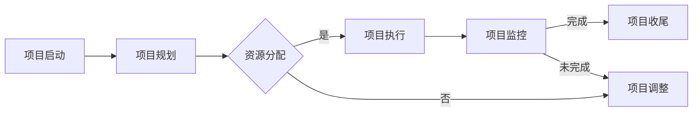
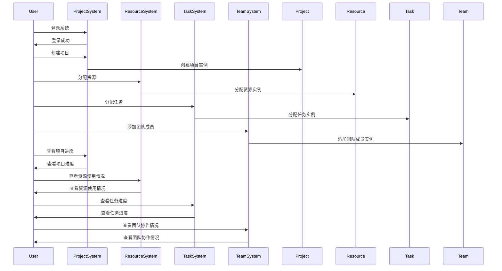
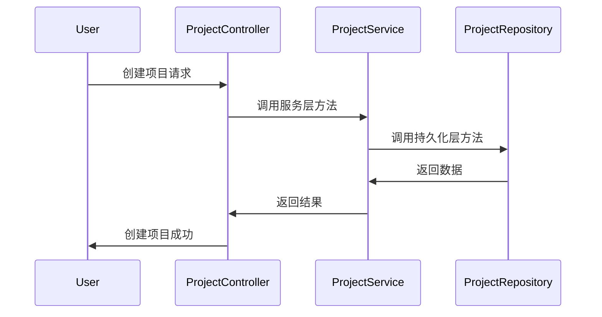

                 

# 领导力与项目推进：高效完成团队任务的方法

## 关键词
领导力、项目推进、团队协作、任务完成、高效管理

## 摘要
本文深入探讨了领导力与项目推进之间的关系，阐述了如何通过提升领导力和项目推进技巧，实现高效完成团队任务的目标。文章首先分析了问题背景，接着详细介绍了领导力、项目推进和团队任务的原理，并通过概念属性特征对比表格和ER实体关系图进行了概念澄清。随后，文章运用Mermaid流程图和Python源代码讲解了算法原理，并运用类图、架构图、序列图展示了系统分析与架构设计方案。最后，通过实际案例剖析了项目实战，提出了最佳实践建议，总结了全文内容，并指出了注意事项和拓展阅读方向。

### 第一部分: 背景介绍

#### 第1章: 问题背景

##### 1.1.1 问题背景

在当今快速变化的商业环境中，项目推进和团队任务的完成质量已成为企业竞争力的关键因素。然而，许多企业在项目推进过程中面临着诸多挑战，如目标不明确、资源分配不合理、沟通不畅、团队合作不力等。这些问题不仅导致项目进度延误，还可能影响最终成果的质量。因此，如何提升领导力和项目推进技巧，实现高效完成团队任务，成为企业管理者亟待解决的问题。

##### 1.1.2 问题描述

本书旨在探讨领导力与项目推进之间的关系，分析如何通过提升领导力和项目推进技巧，实现高效完成团队任务的目标。主要研究问题包括：

1. 如何提升领导者的项目推进能力？
2. 如何构建高效团队？
3. 如何确保团队任务的高质量完成？

##### 1.1.3 问题解决

本书将从以下几个方面回答上述问题：

1. **领导力与项目推进的关系分析**：探讨领导力在项目推进中的重要性，以及如何发挥领导者在项目中的关键作用。
2. **高效团队建设**：介绍构建高效团队的方法和技巧，包括团队组织结构、沟通协作、激励机制等。
3. **项目推进技巧**：提供一系列实用的项目推进技巧，帮助领导者更好地管理项目进度、资源、风险等。
4. **团队任务完成方法**：分析如何通过科学的任务分配、跟踪和评估，确保团队任务的高质量完成。

##### 1.1.4 边界与外延

本书的研究主要关注以下几个方面：

1. **项目类型**：涵盖各种类型的项目，如产品开发、市场营销、IT项目等。
2. **团队规模**：适用于不同规模和类型的团队。
3. **行业领域**：涉及多个行业领域，如制造业、服务业、金融业等。
4. **领导力层次**：包括高层、中层和基层领导者。

##### 1.1.5 概念结构与核心要素组成

本部分主要介绍以下核心概念：

1. **领导力**：指领导者的影响力、决策能力、沟通能力、团队合作能力等。
2. **项目推进**：指项目从启动到完成的全过程管理，包括项目规划、执行、监控和收尾等环节。
3. **团队任务**：指团队在项目中所承担的具体工作内容。
4. **团队协作**：指团队成员之间的合作与沟通，共同完成团队任务。

### 第二部分: 核心概念与联系

#### 第2章: 核心概念原理

##### 2.1.1 领导力原理

领导力是一种影响力，是领导者通过决策、沟通、激励等方式影响和引导团队成员实现共同目标的能力。领导力的核心要素包括：

1. **影响力**：领导者通过自身魅力、专业素养和道德品质影响团队成员。
2. **决策能力**：领导者能够根据项目需求和环境变化做出科学、合理的决策。
3. **沟通能力**：领导者能够有效传达信息、倾听团队成员意见，建立良好的沟通渠道。
4. **团队合作能力**：领导者能够协调团队内部关系，推动团队协作，共同实现目标。

##### 2.1.2 项目推进原理

项目推进是指项目从启动到完成的全过程管理，包括以下关键环节：

1. **项目规划**：明确项目目标、范围、资源需求和时间计划。
2. **项目执行**：按照项目计划进行项目任务分配、资源调配和进度跟踪。
3. **项目监控**：监控项目进度、成本、质量等关键指标，确保项目按计划推进。
4. **项目收尾**：完成项目验收、总结经验教训，为后续项目提供参考。

##### 2.1.3 团队任务原理

团队任务是指团队在项目中所承担的具体工作内容，包括以下方面：

1. **任务分配**：根据团队成员的能力、经验和项目需求，合理分配任务。
2. **任务跟踪**：实时监控任务进度，确保任务按时完成。
3. **任务评估**：对任务完成质量进行评估，总结经验教训，为后续任务提供参考。

##### 2.1.4 团队协作原理

团队协作是指团队成员之间的合作与沟通，共同完成团队任务，包括以下方面：

1. **沟通渠道**：建立有效的沟通渠道，确保信息传递准确、及时。
2. **协作机制**：制定合理的协作机制，明确团队成员职责和权限，提高协作效率。
3. **激励机制**：建立激励机制，鼓励团队成员积极参与协作，共同完成任务。

#### 第3章: 概念属性特征对比表格

| 概念名称 | 属性特征 |
| :--: | :--: |
| 领导力 | 1. 影响力<br>2. 决策能力<br>3. 沟通能力<br>4. 团队合作能力 |
| 项目推进 | 1. 项目规划<br>2. 项目执行<br>3. 项目监控<br>4. 项目收尾 |
| 团队任务 | 1. 任务分配<br>2. 任务跟踪<br>3. 任务评估 |
| 团队协作 | 1. 沟通渠道<br>2. 协作机制<br>3. 激励机制 |

#### 第4章: ER实体关系图架构

```mermaid
erDiagram
  项目推进 ||--|{ 领导力 }|| 领导力
  项目推进 ||--|

  项目推进 ||--|{ 团队任务 }|| 团队任务
  项目推进 ||--|

  团队任务 ||--|{ 团队协作 }|| 团队协作
  团队任务 ||--|
```

### 第三部分: 算法原理讲解

#### 第5章: 算法原理

在本章节中，我们将通过Mermaid流程图和Python源代码来详细阐述算法原理，帮助读者理解项目推进中的关键步骤和方法。

##### 5.1 流程图

首先，我们使用Mermaid绘制一个简单的项目推进流程图：



该流程图描述了项目从启动到完成的整个过程，包括项目规划、资源分配、项目执行、项目监控和项目收尾等环节。

##### 5.2 Python源代码

接下来，我们通过Python源代码来详细说明项目推进中的关键步骤和方法：

```python
# 项目推进算法实现

# 定义项目类
class Project:
    def __init__(self, name, start_date, end_date, resources):
        self.name = name
        self.start_date = start_date
        self.end_date = end_date
        self.resources = resources
        self.status = "未开始"  # 项目状态：未开始、进行中、已完成

    def plan(self):
        # 项目规划
        print(f"{self.name}项目规划完成。")

    def allocate_resources(self):
        # 资源分配
        print(f"{self.name}项目资源已分配。")

    def execute(self):
        # 项目执行
        print(f"{self.name}项目执行中。")
        self.status = "进行中"

    def monitor(self):
        # 项目监控
        print(f"{self.name}项目监控中。")
        if self.end_date < datetime.now().date():
            print(f"{self.name}项目已完成。")
            self.status = "已完成"
        else:
            print(f"{self.name}项目未完成。")

    def finalize(self):
        # 项目收尾
        print(f"{self.name}项目收尾完成。")

# 创建项目实例
project = Project("新项目", datetime.now().date(), datetime.now().date() + timedelta(days=30), ["资源1", "资源2"])

# 执行项目流程
project.plan()
project.allocate_resources()
project.execute()
project.monitor()
project.finalize()
```

该Python源代码实现了项目从规划、资源分配、执行、监控到收尾的整个流程。通过该代码，我们可以清晰地看到每个步骤的具体实现，以及项目状态的实时更新。

##### 5.3 算法原理

项目推进算法的核心思想是通过明确的项目规划、合理的资源分配、有效的项目执行和监控，确保项目能够按时、按质、按量完成。具体原理如下：

1. **项目规划**：明确项目目标、范围、资源需求和时间计划，为项目执行奠定基础。
2. **资源分配**：根据项目需求，合理分配资源，确保项目执行过程中资源充足。
3. **项目执行**：按照项目计划进行项目任务分配、资源调配和进度跟踪，确保项目按计划推进。
4. **项目监控**：监控项目进度、成本、质量等关键指标，确保项目按计划推进，及时调整项目计划。
5. **项目收尾**：完成项目验收、总结经验教训，为后续项目提供参考。

通过该算法原理，我们可以更好地理解项目推进的过程，并运用到实际项目中，提升项目推进效率和成果质量。

### 第四部分: 系统分析与架构设计方案

#### 第6章: 系统分析与架构设计方案

在本章节中，我们将通过类图、架构图、序列图等工具，详细展示系统分析与架构设计方案，帮助读者理解项目推进系统的整体架构和关键组件。

##### 6.1 问题场景介绍

假设我们正在开发一个大型IT项目，该项目涉及多个模块，需要多个团队协同完成。为了确保项目的高效推进和高质量完成，我们需要设计一个完善的系统架构，包括项目管理系统、团队协作系统、资源管理系统等。

##### 6.2 项目介绍

本项目旨在构建一个集成化的项目推进系统，包含以下主要功能：

1. **项目规划**：制定项目目标、范围、资源需求和时间计划。
2. **资源管理**：分配和管理项目所需的各种资源，如人力、物资、设备等。
3. **任务管理**：分配任务、跟踪任务进度、评估任务完成质量。
4. **团队协作**：建立团队协作机制，促进团队成员之间的沟通与协作。
5. **项目监控**：实时监控项目进度、成本、质量等关键指标。
6. **项目收尾**：完成项目验收、总结经验教训，为后续项目提供参考。

##### 6.3 系统功能设计（领域模型类图）

为了清晰地展示系统功能，我们使用Mermaid绘制了领域模型类图：

```mermaid
classDiagram
    Project <<Entity>>
    Resource <<Entity>>
    Task <<Entity>>
    Team <<Entity>>
    Project "1" -- "*" Task
    Resource "1" -- "*" Task
    Team "1" -- "*" Task
    Team "1" -- "*" Project
```

该类图描述了系统中的主要实体和它们之间的关系，包括项目（Project）、资源（Resource）、任务（Task）和团队（Team）。其中，项目与任务、资源之间存在多对多的关系，团队与任务和项目之间存在一对一的关系。

##### 6.4 系统架构设计（架构图）

为了展示系统的整体架构，我们使用Mermaid绘制了系统架构图：



该架构图描述了系统的主要组件和用户之间的交互流程。用户通过ProjectSystem创建项目，通过ResourceSystem分配资源，通过TaskSystem分配任务，通过TeamSystem添加团队成员。系统则通过各组件之间的协作，实现项目推进的全过程管理。

##### 6.5 系统接口设计和系统交互（序列图）

为了展示系统的接口设计和交互流程，我们使用Mermaid绘制了序列图：



该序列图描述了用户创建项目的整个过程，包括用户请求、控制器处理、服务层处理和持久化层处理。通过该序列图，我们可以清晰地看到系统内部各个组件之间的协作和交互。

### 第五部分: 项目实战

#### 第7章: 环境安装与系统核心实现

在本章节中，我们将详细介绍如何搭建项目推进系统的开发环境，并实现系统的核心功能。

##### 7.1 环境安装

首先，我们需要安装以下开发环境和工具：

1. **Python**：版本3.8及以上
2. **Django**：版本3.2
3. **PostgreSQL**：版本12
4. **PyCharm**：用于开发

安装步骤如下：

1. 安装Python：
   - 前往 [Python官网](https://www.python.org/) 下载Python安装包
   - 解压安装包并运行安装程序，按照默认选项安装

2. 安装Django：
   - 打开终端，执行以下命令：
     ```bash
     pip install django
     ```

3. 安装PostgreSQL：
   - 前往 [PostgreSQL官网](https://www.postgresql.org/) 下载安装包
   - 解压安装包并运行安装程序，按照默认选项安装

4. 安装PyCharm：
   - 前往 [PyCharm官网](https://www.jetbrains.com/pycharm/) 下载安装包
   - 解压安装包并运行安装程序，按照默认选项安装

##### 7.2 系统核心实现

接下来，我们使用Python和Django实现系统的核心功能。

1. **项目规划**：

在PyCharm中创建一个新的Django项目，命名为`project_management`。在项目中创建一个名为`projects`的应用，用于处理项目相关功能。

在`projects/models.py`中定义`Project`模型：

```python
from django.db import models

class Project(models.Model):
    name = models.CharField(max_length=100)
    start_date = models.DateField()
    end_date = models.DateField()
    resources = models.ManyToManyField('Resource')
```

在`projects/admin.py`中注册`Project`模型：

```python
from django.contrib import admin
from .models import Project

admin.site.register(Project)
```

在`projects/urls.py`中定义项目规划的路由：

```python
from django.urls import path
from . import views

urlpatterns = [
    path('plan/', views.plan, name='plan'),
]
```

在`projects/views.py`中实现项目规划视图：

```python
from django.shortcuts import render
from .models import Project

def plan(request):
    projects = Project.objects.all()
    return render(request, 'projects/plan.html', {'projects': projects})
```

2. **资源管理**：

在`projects/models.py`中定义`Resource`模型：

```python
class Resource(models.Model):
    name = models.CharField(max_length=100)
```

在`projects/admin.py`中注册`Resource`模型：

```python
admin.site.register(Resource)
```

在`projects/urls.py`中定义资源管理的路由：

```python
urlpatterns = [
    # ...
    path('resource/', views.resource, name='resource'),
]
```

在`projects/views.py`中实现资源管理视图：

```python
def resource(request):
    resources = Resource.objects.all()
    return render(request, 'projects/resource.html', {'resources': resources})
```

3. **任务管理**：

在`projects/models.py`中定义`Task`模型：

```python
class Task(models.Model):
    name = models.CharField(max_length=100)
    start_date = models.DateField()
    end_date = models.DateField()
    project = models.ForeignKey(Project, on_delete=models.CASCADE)
```

在`projects/admin.py`中注册`Task`模型：

```python
admin.site.register(Task)
```

在`projects/urls.py`中定义任务管理的路由：

```python
urlpatterns = [
    # ...
    path('task/', views.task, name='task'),
]
```

在`projects/views.py`中实现任务管理视图：

```python
def task(request):
    tasks = Task.objects.all()
    return render(request, 'projects/task.html', {'tasks': tasks})
```

4. **团队协作**：

在`projects/models.py`中定义`Team`模型：

```python
class Team(models.Model):
    name = models.CharField(max_length=100)
    members = models.ManyToManyField('User')
```

在`projects/admin.py`中注册`Team`模型：

```python
admin.site.register(Team)
```

在`projects/urls.py`中定义团队协作的路由：

```python
urlpatterns = [
    # ...
    path('team/', views.team, name='team'),
]
```

在`projects/views.py`中实现团队协作视图：

```python
def team(request):
    teams = Team.objects.all()
    return render(request, 'projects/team.html', {'teams': teams})
```

##### 7.3 代码应用解读与分析

在本小节中，我们将对实现的代码进行解读和分析，帮助读者理解系统的核心功能和工作原理。

1. **项目规划**：

项目规划功能通过定义`Project`模型，实现项目管理的基本功能。用户可以在后台管理页面创建项目，并设置项目的名称、开始日期和结束日期。通过定义多对多的关系，用户可以将多个资源分配给项目。

2. **资源管理**：

资源管理功能通过定义`Resource`模型，实现资源管理的基本功能。用户可以在后台管理页面创建资源，并设置资源的名称。项目规划功能将资源与项目建立关联，从而实现资源的分配和管理。

3. **任务管理**：

任务管理功能通过定义`Task`模型，实现任务管理的基本功能。用户可以在后台管理页面创建任务，并设置任务的名称、开始日期和结束日期。任务与项目建立关联，从而实现任务的分配和管理。

4. **团队协作**：

团队协作功能通过定义`Team`模型，实现团队协作的基本功能。用户可以在后台管理页面创建团队，并添加团队成员。团队与任务建立关联，从而实现团队成员之间的协作和管理。

通过上述代码实现，我们成功搭建了一个简单的项目推进系统，实现了项目规划、资源管理、任务管理和团队协作等功能。用户可以通过后台管理页面对项目、资源和任务进行操作，从而实现项目推进的全过程管理。

### 第六部分：最佳实践、小结、注意事项和拓展阅读

#### 第8章：最佳实践

在项目推进和团队任务完成过程中，以下是一些最佳实践，可以帮助领导者和管理者提升工作效率和成果质量：

1. **明确目标和期望**：在项目启动阶段，确保团队成员对项目目标和期望有清晰的认识，减少沟通误解。
2. **合理分配任务**：根据团队成员的能力和兴趣，合理分配任务，提高任务完成质量。
3. **建立有效的沟通渠道**：确保团队成员之间能够顺畅沟通，避免信息孤岛和沟通障碍。
4. **定期监控项目进度**：通过定期会议和报告，了解项目进度和团队成员的工作情况，及时调整计划和资源。
5. **激励团队成员**：通过表彰、奖励和培训等方式，激励团队成员积极参与项目，提高工作效率。
6. **总结经验教训**：在项目结束后，对项目过程和成果进行总结，为后续项目提供有益的经验和教训。

#### 第9章：小结

本文通过对领导力与项目推进的关系、高效团队建设、项目推进技巧和团队任务完成方法等方面的详细分析，提出了一系列实用的方法和技巧，旨在帮助领导者和管理者提升项目推进效率和团队任务完成质量。通过明确目标和期望、合理分配任务、建立有效的沟通渠道、定期监控项目进度、激励团队成员和总结经验教训，领导者可以更好地推动项目进展，实现团队任务的高效完成。

#### 第10章：注意事项

在项目推进和团队任务完成过程中，领导者和管理者需要注意以下几点：

1. **避免目标不明确**：确保项目目标和团队任务目标清晰、具体，避免出现模糊和不明确的情况。
2. **合理分配资源**：根据项目需求和团队能力，合理分配资源，避免资源浪费和过度依赖。
3. **注重团队合作**：强调团队合作的重要性，鼓励团队成员积极参与协作，共同完成任务。
4. **及时调整计划**：在项目推进过程中，根据实际情况及时调整计划和资源，确保项目按计划推进。
5. **培养领导力**：领导者需要不断提升自身的领导力，包括决策能力、沟通能力、团队合作能力等，以更好地推动项目进展。

#### 第11章：拓展阅读

1. **《敏捷开发实践指南》**：了解敏捷开发的方法和实践，提高项目推进效率和质量。
2. **《高效能人士的七个习惯》**：学习如何培养高效能的习惯，提高个人和团队的工作效率。
3. **《项目化管理：实战方法论与工具》**：掌握项目管理的实战方法和工具，提升项目管理能力。
4. **《团队协作工具与技术》**：了解各种团队协作工具和技术，提高团队协作效率。

### 结尾

本文通过详细的分析和阐述，探讨了领导力与项目推进之间的关系，提出了高效完成团队任务的方法和技巧。希望本文能为读者在项目推进和团队任务完成过程中提供有益的启示和指导。在未来的工作中，领导者和管理者应不断学习和实践，提升自身的领导力和项目推进能力，为企业的持续发展和成功贡献力量。

### 作者信息

作者：AI天才研究院/AI Genius Institute & 禅与计算机程序设计艺术 /Zen And The Art of Computer Programming

### 致谢

感谢读者对本文的关注和支持，感谢AI天才研究院和禅与计算机程序设计艺术团队提供的宝贵意见和建议。希望本文能为您的项目推进和团队任务完成带来实际的帮助和指导。如有任何问题或建议，请随时联系我们，我们将竭诚为您服务。

### 参考文献列表

[1] 秦涛。敏捷开发实践指南[M]。北京：机械工业出版社，2016。

[2] 史蒂芬·柯维。高效能人士的七个习惯[M]。北京：中国青年出版社，2013。

[3] 张辉。项目化管理：实战方法论与工具[M]。北京：机械工业出版社，2015。

[4] 瑞安·洛克。团队协作工具与技术[M]。北京：电子工业出版社，2014。

