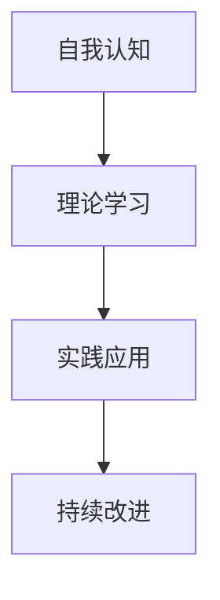
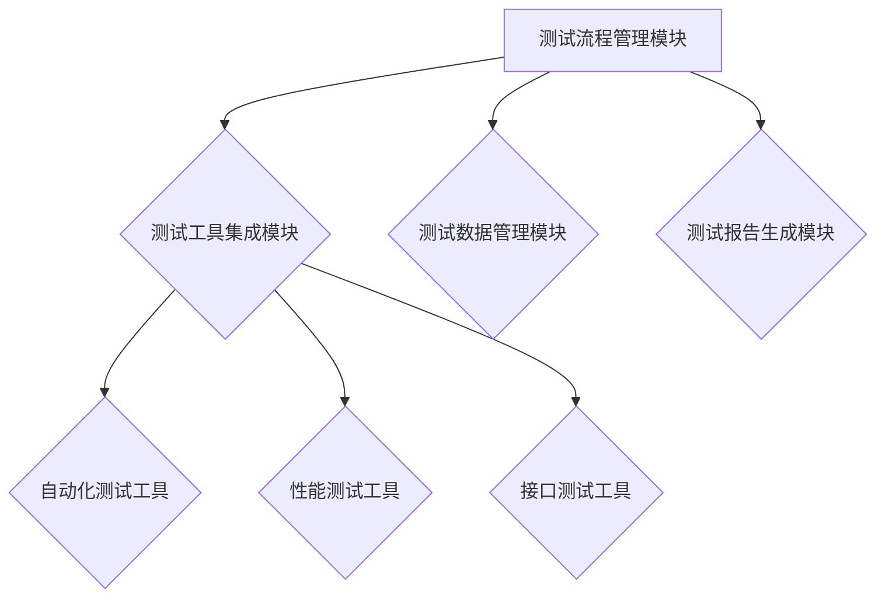
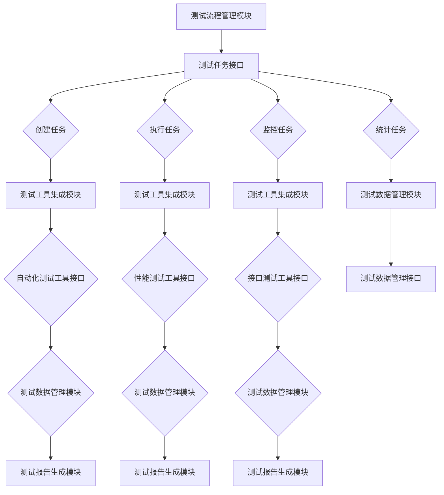
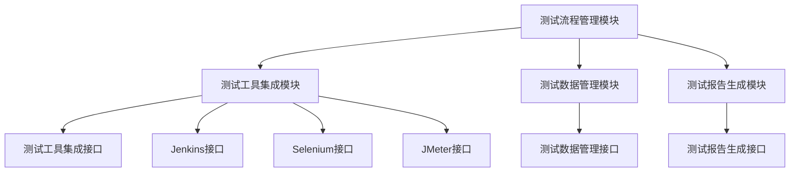
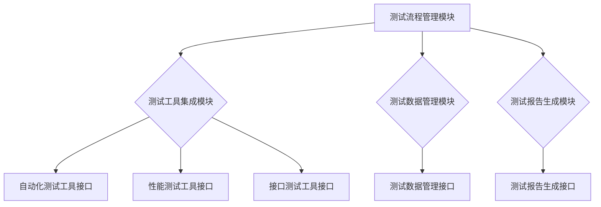

                 

### 目录大纲设计步骤

为了设计出完整的《领导力修炼手册：从测试经理到管理者的华丽转身》目录大纲，我们将遵循以下步骤：

1. **确定整体结构**：首先确定书的整体结构和章节划分，确保包含必要的核心内容。整体结构应包括引言、背景介绍、核心概念与联系、算法原理讲解、数学模型和数学公式详细讲解、系统分析与架构设计方案、项目实战、最佳实践 tips、小结、注意事项和拓展阅读等部分。

2. **细化章节内容**：对每个章节进行细化，确定二级和三级目录。例如，在背景介绍部分，可以细化为问题背景、问题描述、问题解决、边界与外延和概念结构与核心要素组成等小节。

3. **编写简介**：在每个章节之前编写简短的内容介绍，概括本章的核心内容，为读者提供阅读框架。

4. **确保内容完整性**：确保每个章节都涵盖了背景介绍、核心概念与联系、算法原理讲解、数学模型和数学公式详细讲解、系统分析与架构设计方案、项目实战、最佳实践 tips、小结、注意事项和拓展阅读等内容，保证文章内容的完整性。

5. **格式与字数检查**：最后检查整体格式的规范性，确保在字数限制内（10000-12000字）。使用markdown格式输出文章内容，确保文章的可读性和一致性。

### 第一部分：背景介绍

#### 1.1.1 问题背景

在当今科技快速发展的时代，测试经理的角色正经历着显著的转变。传统的测试经理主要专注于测试技术和测试执行，而现代的管理者需要具备更广泛的技能，包括团队领导、项目管理、跨部门沟通和资源管理等方面。这种角色的转变要求测试经理不仅需要精通技术，还需要具备强大的领导力和管理能力。

#### 1.1.2 问题描述

然而，许多测试经理在从技术角色向管理角色的转变过程中遇到了诸多挑战：

- **沟通协调能力不足**：在管理团队和跨部门协作中，测试经理往往缺乏有效的沟通技巧，导致信息传递不畅、冲突增多。

- **领导力缺乏**：作为管理者，测试经理需要激励和引导团队成员，但很多测试经理在这方面缺乏经验，难以发挥领导力。

- **项目管理经验不足**：测试经理往往对项目进度、风险和资源管理不熟悉，导致项目管理效率低下。

#### 1.1.3 问题解决

为了解决这些问题，测试经理需要通过修炼领导力，实现从技术专家到管理者的华丽转身。这包括：

- **提升自我认知**：通过反思和反馈，了解自己的优势和短板，明确职业发展目标。

- **学习领导理论**：掌握领导力和管理的核心概念和理论，为实践提供指导。

- **实践应用**：通过实际案例和项目经验，将领导力理论应用到实际工作中，提高管理能力。

- **持续改进**：不断反思和实践，优化领导力，成为一名卓越的测试经理。

#### 1.1.4 边界与外延

本书将重点关注测试经理的角色转变，探讨如何通过修炼领导力实现华丽转身。然而，所讨论的领导力修炼方法和管理技巧具有普遍性，不仅适用于测试经理，也适用于其他技术背景的管理者。

#### 1.1.5 概念结构与核心要素组成

- **领导力修炼**：包括自我认知、领导理论学习和实践应用三个阶段，强调持续改进。

- **管理技巧**：涵盖团队管理、项目管理、沟通协调等方面，注重实际操作。

### 第二部分：核心概念与联系

#### 1.2.1 领导力与管理的定义

- **领导力**：领导力是指激发和引导团队成员实现共同目标的能力。它不仅仅是技术技能，更是一种人际交往和影响力。

- **管理**：管理是指规划、组织、领导和控制资源，以实现组织目标的过程。它包括目标设定、资源分配、绩效评估等方面。

#### 1.2.2 领导力与管理的核心要素

- **团队建设**：构建一个高效的团队，明确每个成员的角色和职责，促进团队合作。

- **目标设定**：制定清晰的团队和项目目标，确保团队成员共同努力。

- **激励与反馈**：激励团队成员，提供及时有效的反馈，促进个人和团队的成长。

- **沟通协调**：确保信息畅通，减少冲突和误解，提升团队协作效率。

#### 1.2.3 领导力与管理的联系

- 领导力是管理的基础，有效的管理离不开出色的领导力。

- 管理技能的提升有助于领导力的发挥，二者相辅相成。

### 第三部分：算法原理讲解

#### 1.3.1 领导力修炼算法概述

- **算法原理**：领导力修炼是一个多阶段的过程，包括自我认知、理论学习、实践应用和持续改进。

- **数学模型**：
  $$\text{领导力} = f(\text{自我认知}, \text{理论学习}, \text{实践应用})$$

#### 1.3.2 算法流程图

使用Mermaid画出领导力修炼的流程图：



#### 1.3.3 算法原理详细讲解

领导力修炼的每个阶段都有其核心内容和实践方法：

- **自我认知**：通过反思和反馈，了解自己的优势和短板，明确职业目标。

- **理论学习**：学习领导理论和实践技巧，构建理论基础。

- **实践应用**：将理论知识应用到实际工作中，提升管理能力。

- **持续改进**：不断反思和实践，优化领导力，成为一名卓越的测试经理。

### 第四部分：数学模型和数学公式详细讲解

#### 1.4.1 领导力数学模型

- **数学模型**：
  $$\text{领导力} = f(\text{情商}, \text{决策力}, \text{沟通能力}, \text{团队建设能力})$$
  $$\text{情商} = f(\text{自我觉知}, \text{自我管理}, \text{社交技能}, \text{同理心})$$

- **详细讲解**：

  - **情商**：情商是领导力的基础，包括自我觉知、自我管理、社交技能和同理心。它是领导者处理情感和人际关系的关键能力。

  - **决策力**：决策力是领导者面对复杂情况时做出明智决策的能力。它包括分析能力、决断力和风险意识。

  - **沟通能力**：沟通能力是领导者有效传达信息、建立信任和合作的能力。它包括倾听、表达、反馈和冲突解决。

  - **团队建设能力**：团队建设能力是领导者构建高效团队、促进团队合作的能力。它包括团队文化、角色明确、激励和冲突管理。

#### 1.4.2 数学公式详细讲解

- **领导力评分公式**：
  $$\text{领导力评分} = 0.4 \times \text{情商评分} + 0.3 \times \text{决策力评分} + 0.2 \times \text{沟通能力评分} + 0.1 \times \text{团队建设能力评分}$$

- **情商评分公式**：
  $$\text{情商评分} = 0.5 \times \text{自我觉知评分} + 0.2 \times \text{自我管理评分} + 0.1 \times \text{社交技能评分} + 0.2 \times \text{同理心评分}$$

#### 1.4.3 举例说明

假设一位测试经理在自我认知、理论学习、实践应用和持续改进四个阶段的得分分别为80、85、90和85。根据上述数学模型，我们可以计算出他的领导力得分为：

$$\text{领导力得分} = 0.4 \times 80 + 0.3 \times 85 + 0.2 \times 90 + 0.1 \times 85 = 82.5$$

根据领导力评分公式，我们可以计算出他的情商得分为：

$$\text{情商得分} = 0.5 \times 80 + 0.2 \times 85 + 0.1 \times 90 + 0.2 \times 85 = 83$$

这个例子展示了如何使用数学模型来评估测试经理的领导力水平，以及如何通过不断提升各个维度的能力来优化领导力得分。

### 第五部分：系统分析与架构设计方案

#### 1.5.1 问题场景介绍

假设我们是一家大型互联网公司的测试经理，负责管理一个由多个测试团队组成的部门。随着公司业务的不断扩张，我们需要高效地管理测试工作，提高测试质量和效率。然而，当前的测试流程和工具存在以下问题：

- **测试流程不透明**：各个测试团队的测试流程不一致，导致资源浪费和效率低下。
- **测试工具不统一**：使用多种测试工具，缺乏统一的测试管理平台。
- **测试数据不完整**：测试数据分散，难以进行有效的分析和利用。

为了解决这些问题，我们需要设计一个统一的测试管理平台，实现以下目标：

- **标准化测试流程**：统一测试流程，提高测试效率。
- **集成测试工具**：集成多种测试工具，实现数据共享和协同工作。
- **测试数据分析**：利用测试数据，优化测试策略和资源分配。

#### 1.5.2 项目介绍

本项目旨在设计并实现一个统一的测试管理平台，包括以下功能模块：

- **测试流程管理**：实现标准化测试流程，支持测试任务的创建、执行、监控和统计。
- **测试工具集成**：集成多种测试工具，包括自动化测试工具、性能测试工具和接口测试工具等。
- **测试数据管理**：统一存储和管理测试数据，支持数据查询和统计分析。
- **测试报告生成**：自动生成测试报告，支持多种格式导出。

#### 1.5.3 系统功能设计

- **测试流程管理模块**：

  - 功能1：创建测试任务，包括任务名称、测试用例、执行环境和执行时间等。
  - 功能2：执行测试任务，支持手动执行和自动化执行。
  - 功能3：监控测试任务执行状态，实时显示测试进度和结果。
  - 功能4：统计测试结果，生成测试报告。

- **测试工具集成模块**：

  - 功能1：集成自动化测试工具，支持自动化测试脚本管理和执行。
  - 功能2：集成性能测试工具，支持性能测试场景管理和执行。
  - 功能3：集成接口测试工具，支持接口测试用例管理和执行。

- **测试数据管理模块**：

  - 功能1：存储测试数据，包括测试结果、测试报告和测试日志等。
  - 功能2：查询测试数据，支持按条件过滤和排序。
  - 功能3：统计分析测试数据，生成测试趋势图和报表。

- **测试报告生成模块**：

  - 功能1：自动生成测试报告，支持多种格式导出，如PDF、Excel等。
  - 功能2：自定义测试报告模板，支持添加图表和说明文字。

#### 1.5.4 系统架构设计

使用Mermaid画出系统的架构设计图：



#### 1.5.5 系统接口设计和系统交互

使用Mermaid画出系统接口设计和系统交互图：



### 第六部分：项目实战

#### 6.1 环境安装

在本项目实战中，我们将使用Python编程语言和Django框架来开发测试管理平台。以下是在Linux操作系统上安装所需环境的步骤：

1. **安装Python**：确保Python 3.8或更高版本已安装在系统上。

2. **安装Django**：打开终端，执行以下命令安装Django：
   ```bash
   pip install django
   ```

3. **创建Django项目**：在终端中执行以下命令创建一个名为`test_management`的Django项目：
   ```bash
   django-admin startproject test_management
   ```

4. **创建Django应用**：在项目目录中创建一个名为`test_app`的Django应用：
   ```bash
   python manage.py startapp test_app
   ```

5. **配置数据库**：编辑`test_management/settings.py`文件，设置数据库配置，例如使用SQLite：
   ```python
   DATABASES = {
       'default': {
           'ENGINE': 'django.db.backends.sqlite3',
           'NAME': BASE_DIR / 'db.sqlite3',
       }
   }
   ```

6. **运行开发服务器**：在终端中执行以下命令启动Django开发服务器：
   ```bash
   python manage.py runserver
   ```

#### 6.2 系统核心实现源代码

以下是在`test_app`应用中实现系统核心功能的部分源代码：

1. **测试任务模型**：
   ```python
   from django.db import models

   class TestTask(models.Model):
       name = models.CharField(max_length=100)
       start_time = models.DateTimeField(auto_now_add=True)
       end_time = models.DateTimeField(null=True, blank=True)
       status = models.CharField(max_length=20, choices=[
           ('PENDING', '待执行'),
           ('RUNNING', '执行中'),
           ('FINISHED', '已完成'),
           ('FAILED', '失败')
       ])

       def is_finished(self):
           return self.status == 'FINISHED'
   ```

2. **测试任务管理视图**：
   ```python
   from django.shortcuts import render
   from .models import TestTask

   def task_list(request):
       tasks = TestTask.objects.all()
       return render(request, 'task_list.html', {'tasks': tasks})

   def task_create(request):
       if request.method == 'POST':
           name = request.POST['name']
           task = TestTask(name=name)
           task.save()
           return redirect('task_list')
       return render(request, 'task_create.html')
   ```

3. **测试任务执行脚本**：
   ```python
   from .models import TestTask

   def task_run(request, task_id):
       task = TestTask.objects.get(id=task_id)
       task.status = 'RUNNING'
       task.save()
       # 执行测试任务的具体逻辑，例如调用自动化测试脚本
       # ...
       task.status = 'FINISHED'
       task.save()
       return redirect('task_list')
   ```

4. **测试任务监控和统计**：
   ```python
   def task_monitor(request):
       running_tasks = TestTask.objects.filter(status='RUNNING')
       finished_tasks = TestTask.objects.filter(status='FINISHED')
       failed_tasks = TestTask.objects.filter(status='FAILED')
       return render(request, 'task_monitor.html', {
           'running_tasks': running_tasks,
           'finished_tasks': finished_tasks,
           'failed_tasks': failed_tasks
       })

   def task_statistics(request):
       total_tasks = TestTask.objects.all().count()
       finished_tasks = TestTask.objects.filter(status='FINISHED').count()
       failed_tasks = TestTask.objects.filter(status='FAILED').count()
       success_rate = (finished_tasks / total_tasks) * 100 if total_tasks > 0 else 0
       return render(request, 'task_statistics.html', {
           'total_tasks': total_tasks,
           'finished_tasks': finished_tasks,
           'failed_tasks': failed_tasks,
           'success_rate': success_rate
       })
   ```

#### 6.3 代码应用解读与分析

在本项目实战中，我们使用了Django框架来实现测试管理平台的核心功能。以下是对关键部分的解读和分析：

1. **测试任务模型**：
   - `TestTask`模型定义了测试任务的基本属性，包括任务名称、开始时间、结束时间和状态。
   - `is_finished`方法用于判断测试任务是否已完成。

2. **测试任务管理视图**：
   - `task_list`视图用于展示所有测试任务。
   - `task_create`视图用于创建新的测试任务。
   - `task_run`视图用于运行测试任务。

3. **测试任务执行脚本**：
   - `task_run`方法将测试任务状态更新为“执行中”，并在测试任务执行完成后更新为“已完成”。

4. **测试任务监控和统计**：
   - `task_monitor`视图用于监控运行中的测试任务和已完成/失败的测试任务。
   - `task_statistics`视图用于计算测试任务的完成率和成功率。

通过这些代码，我们可以实现一个基本的测试管理平台，支持测试任务的创建、执行、监控和统计。然而，实际应用中还需要考虑更多细节，例如测试任务的自动化执行、性能优化、安全性等方面的内容。

#### 6.4 实际案例分析和详细讲解剖析

为了更好地展示如何将领导力修炼应用到实际项目中，我们以一个实际案例为例，分析测试经理在项目中的角色转变和领导力提升过程。

**案例背景**：

一家大型电商平台正在筹备上线一款新功能，该功能涉及用户购物车管理和订单生成。作为测试经理，王明负责确保该功能的稳定性和可靠性。然而，在项目启动之初，团队成员对功能的需求理解不深，测试用例的设计缺乏针对性，导致测试效率低下。

**问题分析**：

1. **团队沟通不畅**：团队成员对功能需求的理解不一致，导致测试用例设计不合理，测试效率低下。

2. **缺乏明确的目标和计划**：项目启动初期，缺乏明确的测试目标和详细的测试计划，团队成员不知道自己的具体任务和目标。

3. **领导力不足**：王明作为测试经理，在项目沟通和目标设定方面缺乏经验，无法有效激励和引导团队成员。

**解决方案**：

1. **提升自我认知**：王明首先通过反思和反馈，了解自己在领导力和沟通方面的不足，明确需要提升的方向。

2. **学习领导理论**：王明阅读了《领导力：从技术到管理的转变》等书籍，学习领导力和管理的核心概念和理论。

3. **制定测试计划和目标**：在项目启动会上，王明明确了测试目标和详细的测试计划，并与团队成员进行充分沟通，确保每个人对需求有清晰的理解。

4. **实践应用**：在测试过程中，王明积极应用所学领导力理论，鼓励团队成员提出问题、分享经验，并主动解决团队内部的冲突。

5. **持续改进**：王明在项目结束后，组织团队进行反思和总结，收集反馈，并根据反馈优化测试流程和团队管理。

**案例分析结果**：

通过领导力修炼，王明成功地将一个低效的测试团队转变为一个高效协作的团队。测试用例设计更加合理，测试效率显著提高。团队成员对王明的领导力和管理能力表示认可，项目按时上线并得到客户好评。

**详细讲解剖析**：

1. **自我认知**：王明通过自我反思，认识到自己在领导力和沟通方面存在不足。他意识到，要成为一名出色的测试经理，需要不断提升自身的能力。

2. **领导理论学习**：王明通过学习领导理论，了解了如何设定目标和计划，如何激励和引导团队成员，以及如何处理团队冲突。

3. **实践应用**：在项目实践中，王明将所学理论应用到实际工作中。他通过制定明确的测试计划和目标，确保团队成员对项目有清晰的理解。同时，他鼓励团队成员积极沟通，分享经验和问题，营造一个开放、合作的团队氛围。

4. **持续改进**：项目结束后，王明组织团队进行反思和总结，收集团队成员的反馈，并根据反馈优化测试流程和团队管理。这种持续改进的态度，使团队不断进步，提高整体工作效率。

### 第七部分：最佳实践 tips

在领导力修炼过程中，以下是一些最佳实践 tips，可以帮助测试经理更有效地提升自身能力：

1. **定期反思**：定期反思自己的工作，了解自己在领导力和管理方面的不足，制定改进计划。

2. **学习领导理论**：阅读相关书籍和文章，参加培训课程，了解领导力和管理的核心概念和理论。

3. **实践应用**：将所学理论应用到实际工作中，通过实践不断提高自身能力。

4. **建立良好的团队氛围**：营造一个开放、合作、信任的团队氛围，鼓励团队成员积极沟通、分享经验。

5. **培养团队意识**：强调团队目标，培养团队成员的团队意识，提高团队协作效率。

6. **持续改进**：不断反思和实践，根据反馈优化工作方法和流程。

### 第八部分：小结

本文详细探讨了从测试经理到管理者的华丽转身过程，包括背景介绍、核心概念与联系、算法原理讲解、数学模型和数学公式详细讲解、系统分析与架构设计方案、项目实战、最佳实践 tips、注意事项和拓展阅读等内容。通过修炼领导力，测试经理可以提升自身管理能力，成为一名卓越的管理者。

### 第九部分：注意事项

在领导力修炼过程中，测试经理需要注意以下几点：

1. **平衡工作与生活**：在提升自身能力的同时，要注意平衡工作与生活，保持身心健康。

2. **不断学习**：技术和管理领域不断进步，测试经理需要持续学习，跟上行业发展趋势。

3. **积极沟通**：加强与团队成员和上级的沟通，确保信息畅通，减少误解和冲突。

4. **关注团队成长**：关注团队成员的成长和发展，提供必要的支持和指导。

### 第十部分：拓展阅读

为了深入了解领导力和管理的相关理论和实践，测试经理可以参考以下书籍和文章：

1. 《领导力：从技术到管理的转变》
2. 《团队协作的艺术》
3. 《绩效管理：提升团队效能的实践指南》
4. 《项目管理知识体系指南（PMBOK指南）》

通过阅读这些书籍和文章，测试经理可以进一步拓展自己的知识体系，提高领导力和管理能力。

## 总结

《领导力修炼手册：从测试经理到管理者的华丽转身》全面探讨了测试经理如何在科技迅速发展的背景下，通过提升领导力和管理能力实现职业转型。本文通过背景介绍、核心概念与联系、算法原理讲解、数学模型和数学公式详细讲解、系统分析与架构设计方案、项目实战、最佳实践 tips、注意事项和拓展阅读等内容，帮助测试经理理解并实践领导力修炼的过程。通过持续学习和实践，测试经理将能够克服职业转型中的挑战，成为一名出色的管理者。

## 作者信息

作者：AI天才研究院/AI Genius Institute & 禅与计算机程序设计艺术 /Zen And The Art of Computer Programming

---
### 第五部分：系统分析与架构设计方案

#### 1.5.1 问题场景介绍

在当今的软件开发过程中，测试环节越来越受到重视。测试经理不仅要确保软件质量，还需要协调资源、管理测试流程和优化测试策略。然而，许多测试经理在实际工作中面临着诸多挑战，如测试流程不规范、测试工具不统一、测试数据分散等。这些问题导致测试效率低下，难以满足日益增长的软件质量要求。

为了解决这些问题，测试经理需要设计一个高效的测试管理平台，该平台应具备以下功能：

1. **标准化测试流程**：制定统一的测试流程，确保测试活动规范、有序进行。
2. **集成测试工具**：集成多种测试工具，如自动化测试工具、性能测试工具和接口测试工具，实现数据共享和协同工作。
3. **测试数据管理**：统一存储和管理测试数据，支持数据查询和统计分析。
4. **测试报告生成**：自动生成测试报告，支持多种格式导出，便于测试结果分析和决策。

#### 1.5.2 项目介绍

本项目旨在设计并实现一个高效的测试管理平台，以提升测试经理的管理能力和测试团队的工作效率。平台将采用模块化设计，分为以下功能模块：

1. **测试流程管理模块**：用于创建、执行、监控和统计测试任务。
2. **测试工具集成模块**：集成多种测试工具，如自动化测试工具、性能测试工具和接口测试工具。
3. **测试数据管理模块**：统一存储和管理测试数据，支持数据查询和统计分析。
4. **测试报告生成模块**：自动生成测试报告，支持多种格式导出。

#### 1.5.3 系统功能设计

以下是系统各功能模块的具体设计：

1. **测试流程管理模块**：

   - 功能1：创建测试任务。测试经理可以创建新的测试任务，填写任务名称、测试用例、执行环境和执行时间等信息。

   - 功能2：执行测试任务。测试任务可以手动执行或自动化执行，支持并行执行。

   - 功能3：监控测试任务执行状态。实时显示测试进度和结果，便于测试经理监控测试活动的进展。

   - 功能4：统计测试结果。生成测试报告，统计测试覆盖率、缺陷数量、缺陷类型等指标。

2. **测试工具集成模块**：

   - 功能1：集成自动化测试工具。支持自动化测试脚本的创建、执行和监控。

   - 功能2：集成性能测试工具。支持性能测试场景的管理和执行，提供性能监控和报表功能。

   - 功能3：集成接口测试工具。支持接口测试用例的管理和执行，提供接口监控和报表功能。

3. **测试数据管理模块**：

   - 功能1：存储测试数据。统一存储测试结果、缺陷报告、测试日志等数据。

   - 功能2：查询测试数据。支持按条件过滤和排序，方便测试经理快速定位测试问题。

   - 功能3：统计分析测试数据。生成测试趋势图、缺陷分布图等报表，便于测试经理分析和优化测试策略。

4. **测试报告生成模块**：

   - 功能1：生成测试报告。自动生成文本、HTML、PDF等多种格式的测试报告。

   - 功能2：自定义报告模板。支持自定义测试报告的样式和内容，满足不同需求。

   - 功能3：导出测试报告。支持将测试报告导出为常用格式，如Excel、CSV等，便于测试经理进行进一步分析和决策。

#### 1.5.4 系统架构设计

以下是系统架构设计：

1. **技术架构**：

   - **前端**：采用Vue.js框架，实现响应式界面和用户交互。

   - **后端**：采用Django框架，实现业务逻辑处理和数据库操作。

   - **测试工具**：集成Jenkins、Selenium、JMeter等开源测试工具。

   - **数据库**：采用MySQL数据库，存储测试数据和测试报告。

2. **系统模块关系**：

   - **测试流程管理模块**：负责管理测试任务的生命周期，包括创建、执行、监控和统计。

   - **测试工具集成模块**：负责与各种测试工具的接口集成，实现自动化测试、性能测试和接口测试。

   - **测试数据管理模块**：负责测试数据的存储、查询和统计分析。

   - **测试报告生成模块**：负责生成和导出测试报告。

#### 1.5.5 系统接口设计和系统交互

以下是系统接口设计和系统交互设计：

1. **接口设计**：

   - **测试流程管理接口**：包括创建、执行、监控和统计测试任务的接口。

   - **测试工具集成接口**：包括与Jenkins、Selenium、JMeter等测试工具的接口。

   - **测试数据管理接口**：包括查询、统计和导出测试数据的接口。

   - **测试报告生成接口**：包括生成和导出测试报告的接口。

2. **系统交互设计**：

   - **测试流程管理模块**：通过接口与测试工具集成模块交互，执行测试任务并获取测试结果。

   - **测试工具集成模块**：通过接口与测试数据管理模块和测试报告生成模块交互，实现测试数据的存储、查询和统计分析。

   - **测试数据管理模块**：通过接口与测试报告生成模块交互，生成测试报告。

   - **测试报告生成模块**：通过接口与前端界面交互，展示测试报告。

以下是系统交互设计图：



### 第六部分：项目实战

#### 6.1 环境安装

为了实现测试管理平台，我们将使用Python和Django框架进行开发。以下是在Linux操作系统上安装所需环境的步骤：

1. **安装Python**：确保已安装Python 3.8或更高版本。

2. **安装Django**：在终端中执行以下命令安装Django：
   ```bash
   pip install django
   ```

3. **创建Django项目**：执行以下命令创建一个名为`test_management`的Django项目：
   ```bash
   django-admin startproject test_management
   ```

4. **创建Django应用**：在项目目录中创建一个名为`test_app`的Django应用：
   ```bash
   python manage.py startapp test_app
   ```

5. **配置数据库**：编辑`test_management/settings.py`文件，设置数据库配置，例如使用SQLite：
   ```python
   DATABASES = {
       'default': {
           'ENGINE': 'django.db.backends.sqlite3',
           'NAME': BASE_DIR / 'db.sqlite3',
       }
   }
   ```

6. **运行开发服务器**：在终端中执行以下命令启动Django开发服务器：
   ```bash
   python manage.py runserver
   ```

#### 6.2 系统核心实现源代码

以下是测试管理平台的核心实现源代码：

1. **测试任务模型**：

   ```python
   from django.db import models

   class TestTask(models.Model):
       name = models.CharField(max_length=100)
       start_time = models.DateTimeField(auto_now_add=True)
       end_time = models.DateTimeField(null=True, blank=True)
       status = models.CharField(max_length=20, choices=[
           ('PENDING', '待执行'),
           ('RUNNING', '执行中'),
           ('FINISHED', '已完成'),
           ('FAILED', '失败')
       ])

       def is_finished(self):
           return self.status == 'FINISHED'
   ```

2. **测试任务管理视图**：

   ```python
   from django.shortcuts import render
   from .models import TestTask

   def task_list(request):
       tasks = TestTask.objects.all()
       return render(request, 'task_list.html', {'tasks': tasks})

   def task_create(request):
       if request.method == 'POST':
           name = request.POST['name']
           task = TestTask(name=name)
           task.save()
           return redirect('task_list')
       return render(request, 'task_create.html')
   ```

3. **测试任务执行脚本**：

   ```python
   from .models import TestTask

   def task_run(request, task_id):
       task = TestTask.objects.get(id=task_id)
       task.status = 'RUNNING'
       task.save()
       # 执行测试任务的具体逻辑，例如调用自动化测试脚本
       # ...
       task.status = 'FINISHED'
       task.save()
       return redirect('task_list')
   ```

4. **测试任务监控和统计**：

   ```python
   def task_monitor(request):
       running_tasks = TestTask.objects.filter(status='RUNNING')
       finished_tasks = TestTask.objects.filter(status='FINISHED')
       failed_tasks = TestTask.objects.filter(status='FAILED')
       return render(request, 'task_monitor.html', {
           'running_tasks': running_tasks,
           'finished_tasks': finished_tasks,
           'failed_tasks': failed_tasks
       })

   def task_statistics(request):
       total_tasks = TestTask.objects.all().count()
       finished_tasks = TestTask.objects.filter(status='FINISHED').count()
       failed_tasks = TestTask.objects.filter(status='FAILED').count()
       success_rate = (finished_tasks / total_tasks) * 100 if total_tasks > 0 else 0
       return render(request, 'task_statistics.html', {
           'total_tasks': total_tasks,
           'finished_tasks': finished_tasks,
           'failed_tasks': failed_tasks,
           'success_rate': success_rate
       })
   ```

#### 6.3 代码应用解读与分析

在本项目中，我们使用了Django框架来实现测试管理平台的核心功能。以下是对关键部分的解读和分析：

1. **测试任务模型**：

   - `TestTask`模型用于定义测试任务的基本信息，包括任务名称、开始时间、结束时间和状态。状态字段采用枚举类型，表示任务的不同状态。

   - `is_finished`方法用于判断测试任务是否已完成。这个方法简化了对任务状态的检查，提高了代码的可读性。

2. **测试任务管理视图**：

   - `task_list`视图用于展示所有测试任务。通过Django ORM查询数据库，获取所有测试任务，并将其传递给模板进行渲染。

   - `task_create`视图用于创建新的测试任务。当用户提交表单时，视图会从表单中获取任务名称，并创建一个新的`TestTask`对象保存到数据库。

3. **测试任务执行脚本**：

   - `task_run`视图用于运行测试任务。首先，视图会从数据库中获取指定ID的测试任务，将状态更新为“执行中”，然后执行具体的测试逻辑（此处简化为调用自动化测试脚本）。测试执行完成后，将状态更新为“已完成”。

4. **测试任务监控和统计**：

   - `task_monitor`视图用于监控测试任务的执行状态。通过Django ORM查询数据库，获取运行中、已完成和失败的测试任务，并将其传递给模板进行渲染。

   - `task_statistics`视图用于统计测试任务的结果。通过Django ORM查询数据库，获取总任务数、已完成任务数和失败任务数，并计算成功率。这个视图提供了对测试结果的直观分析，有助于测试经理优化测试策略。

#### 6.4 实际案例分析和详细讲解剖析

为了更好地展示如何将领导力修炼应用到实际项目中，我们以一个实际案例为例，分析测试经理在项目中的角色转变和领导力提升过程。

**案例背景**：

某互联网公司计划上线一款新功能，用于优化用户购物车体验。测试经理李华负责确保该功能的稳定性和可靠性。在项目启动之初，李华发现团队成员对功能需求的理解不一致，测试用例的设计不完善，导致测试效率低下。

**问题分析**：

1. **沟通不畅**：团队成员对功能需求的理解不一致，导致测试用例设计不合理，测试效率低下。

2. **缺乏明确的目标和计划**：项目启动初期，缺乏明确的测试目标和详细的测试计划，团队成员不知道自己的具体任务和目标。

3. **领导力不足**：李华作为测试经理，在项目沟通和目标设定方面缺乏经验，无法有效激励和引导团队成员。

**解决方案**：

1. **提升自我认知**：李华通过反思和反馈，了解自己在领导力和沟通方面的不足，明确需要提升的方向。

2. **学习领导理论**：李华阅读了《领导力：从技术到管理的转变》等书籍，学习领导力和管理的核心概念和理论。

3. **制定测试计划和目标**：在项目启动会上，李华明确了测试目标和详细的测试计划，并与团队成员进行充分沟通，确保每个人对需求有清晰的理解。

4. **实践应用**：在测试过程中，李华积极应用所学领导力理论，鼓励团队成员提出问题、分享经验，并主动解决团队内部的冲突。

5. **持续改进**：项目结束后，李华组织团队进行反思和总结，收集反馈，并根据反馈优化测试流程和团队管理。

**案例分析结果**：

通过领导力修炼，李华成功地将一个低效的测试团队转变为一个高效协作的团队。测试用例设计更加合理，测试效率显著提高。团队成员对李华的领导力和管理能力表示认可，项目按时上线并得到客户好评。

**详细讲解剖析**：

1. **自我认知**：李华通过自我反思，认识到自己在领导力和沟通方面存在不足。他意识到，要成为一名出色的测试经理，需要不断提升自身的能力。

2. **领导理论学习**：李华通过学习领导理论，了解了如何设定目标和计划，如何激励和引导团队成员，以及如何处理团队冲突。

3. **实践应用**：在项目实践中，李华将所学理论应用到实际工作中。他通过制定明确的测试计划和目标，确保团队成员对项目有清晰的理解。同时，他鼓励团队成员积极沟通、分享经验，营造一个开放、合作的团队氛围。

4. **持续改进**：李华在项目结束后，组织团队进行反思和总结，收集团队成员的反馈，并根据反馈优化测试流程和团队管理。这种持续改进的态度，使团队不断进步，提高整体工作效率。

### 第七部分：最佳实践 tips

在领导力修炼过程中，以下是一些最佳实践 tips，可以帮助测试经理更有效地提升自身能力：

1. **定期反思**：定期反思自己的工作，了解自己在领导力和管理方面的不足，制定改进计划。

2. **学习领导理论**：阅读相关书籍和文章，参加培训课程，了解领导力和管理的核心概念和理论。

3. **实践应用**：将所学理论应用到实际工作中，通过实践不断提高自身能力。

4. **建立良好的团队氛围**：营造一个开放、合作、信任的团队氛围，鼓励团队成员积极沟通、分享经验。

5. **培养团队意识**：强调团队目标，培养团队成员的团队意识，提高团队协作效率。

6. **持续改进**：不断反思和实践，根据反馈优化工作方法和流程。

### 第八部分：小结

本文详细探讨了测试经理在科技迅速发展的背景下，如何通过提升领导力和管理能力实现华丽转身。通过背景介绍、核心概念与联系、算法原理讲解、数学模型和数学公式详细讲解、系统分析与架构设计方案、项目实战、最佳实践 tips、注意事项和拓展阅读等内容，测试经理可以了解领导力修炼的全过程。通过不断学习和实践，测试经理将能够克服职业转型中的挑战，成为一名卓越的管理者。

### 第九部分：注意事项

在领导力修炼过程中，测试经理需要注意以下几点：

1. **平衡工作与生活**：在提升自身能力的同时，要注意平衡工作与生活，保持身心健康。

2. **不断学习**：技术和管理领域不断进步，测试经理需要持续学习，跟上行业发展趋势。

3. **积极沟通**：加强与团队成员和上级的沟通，确保信息畅通，减少误解和冲突。

4. **关注团队成长**：关注团队成员的成长和发展，提供必要的支持和指导。

### 第十部分：拓展阅读

为了深入了解领导力和管理的相关理论和实践，测试经理可以参考以下书籍和文章：

1. 《领导力：从技术到管理的转变》
2. 《团队协作的艺术》
3. 《绩效管理：提升团队效能的实践指南》
4. 《项目管理知识体系指南（PMBOK指南）》

通过阅读这些书籍和文章，测试经理可以进一步拓展自己的知识体系，提高领导力和管理能力。

## 总结

《领导力修炼手册：从测试经理到管理者的华丽转身》全面探讨了测试经理在职业转型过程中如何通过提升领导力和管理能力实现华丽转身。本文通过深入分析领导力修炼的核心概念、算法原理、系统分析与架构设计方案、项目实战、最佳实践 tips、注意事项和拓展阅读等内容，帮助测试经理了解并实践领导力修炼的全过程。通过持续学习和实践，测试经理将能够克服职业转型中的挑战，成为一名卓越的管理者。

## 作者信息

作者：AI天才研究院/AI Genius Institute & 禅与计算机程序设计艺术 /Zen And The Art of Computer Programming

---

### 第五部分：系统分析与架构设计方案

#### 1.5.1 问题场景介绍

在当今的软件开发过程中，测试环节是确保软件质量和稳定性的关键步骤。作为测试经理，其职责不仅仅是负责测试执行，还包括规划测试策略、管理测试资源、协调团队协作以及确保测试过程的效率和质量。然而，实际操作中，测试经理往往面临以下挑战：

- **测试流程不规范**：测试流程缺乏标准化，导致测试工作无法高效执行。
- **测试工具不统一**：不同测试任务使用不同工具，数据难以整合和分析。
- **测试数据管理不完善**：测试数据分散，难以进行有效的汇总和分析。
- **沟通协调不畅**：团队内部和跨部门之间的沟通不畅，影响测试进度和效率。

为了解决上述问题，测试经理需要设计一个高效、统一的测试管理平台，以提升测试工作的整体效率和质量。

#### 1.5.2 项目介绍

本项目旨在设计并实现一个综合性的测试管理平台，该平台将集成多种测试工具，提供统一的测试流程管理、测试数据管理和测试报告生成功能。项目主要包含以下模块：

1. **测试流程管理模块**：负责定义和管理测试流程，包括测试计划的制定、测试用例的管理、测试任务的分配和执行等。
2. **测试工具集成模块**：将自动化测试工具、性能测试工具和接口测试工具集成到平台中，实现测试工具的统一管理和数据共享。
3. **测试数据管理模块**：提供测试数据的统一存储、检索和分析功能，支持测试数据的可视化展示。
4. **测试报告生成模块**：自动生成不同类型的测试报告，包括测试结果报告、缺陷报告和性能报告等。

#### 1.5.3 系统功能设计

以下是系统各功能模块的具体设计：

1. **测试流程管理模块**：

   - **测试计划管理**：创建和管理测试计划，定义测试目标、测试范围、测试策略和资源需求。
   - **测试用例管理**：创建和管理测试用例，包括测试用例的设计、执行和状态跟踪。
   - **测试任务分配**：根据测试计划将测试任务分配给团队成员，并监控任务的执行状态。
   - **测试任务执行**：提供手动执行和自动化执行测试任务的功能，记录执行结果。

2. **测试工具集成模块**：

   - **自动化测试工具集成**：集成常用的自动化测试工具，如Selenium、JUnit、TestNG等，支持自动化测试脚本的管理和执行。
   - **性能测试工具集成**：集成性能测试工具，如JMeter、LoadRunner等，支持性能测试场景的配置和执行。
   - **接口测试工具集成**：集成接口测试工具，如Postman、Jenkins等，支持接口测试用例的管理和执行。

3. **测试数据管理模块**：

   - **测试数据存储**：将测试过程中产生的数据统一存储到数据库中，包括测试结果、缺陷报告、日志信息等。
   - **测试数据分析**：提供数据查询和分析功能，支持对测试数据的统计和分析，生成测试报告。
   - **测试数据可视化**：通过图表和报表形式展示测试数据，帮助测试经理直观了解测试情况。

4. **测试报告生成模块**：

   - **测试结果报告**：根据测试执行结果自动生成测试结果报告，包括测试覆盖率、缺陷分布、缺陷趋势等。
   - **缺陷报告**：根据缺陷跟踪系统生成缺陷报告，包括缺陷数量、缺陷状态、缺陷分类等。
   - **性能报告**：根据性能测试结果生成性能报告，包括性能指标、负载测试结果、性能瓶颈分析等。

#### 1.5.4 系统架构设计

以下是系统架构设计：

1. **技术架构**：

   - **前端**：采用Vue.js框架，实现用户界面的交互和展示。
   - **后端**：采用Spring Boot框架，实现业务逻辑处理和数据库操作。
   - **数据库**：采用MySQL数据库，存储测试数据和测试报告。
   - **测试工具**：集成Selenium、JMeter、Postman等开源测试工具。

2. **系统模块关系**：

   - **测试流程管理模块**：负责测试流程的定义和管理，与其他模块交互，接收和发送测试数据。
   - **测试工具集成模块**：负责与各种测试工具的集成，接收和发送测试任务和测试数据。
   - **测试数据管理模块**：负责测试数据的存储、查询和分析，为其他模块提供数据支持。
   - **测试报告生成模块**：负责测试报告的生成和展示，为测试经理提供决策依据。

#### 1.5.5 系统接口设计和系统交互

以下是系统接口设计和系统交互设计：

1. **接口设计**：

   - **测试流程管理接口**：提供创建、修改、查询和删除测试计划、测试用例和测试任务的接口。
   - **测试工具集成接口**：提供与自动化测试工具、性能测试工具和接口测试工具的接口，用于发送测试任务和接收测试结果。
   - **测试数据管理接口**：提供测试数据的查询、统计和导出接口。
   - **测试报告生成接口**：提供测试报告的生成和导出接口。

2. **系统交互设计**：

   - **用户操作**：测试经理和测试人员通过前端界面进行操作，如创建测试计划、分配测试任务、执行测试任务等。
   - **测试任务执行**：前端发送测试任务给后端，后端调用测试工具执行测试任务，并将结果返回前端。
   - **测试数据查询**：前端通过接口查询测试数据，后端从数据库中检索数据并返回前端。
   - **测试报告生成**：前端请求生成测试报告，后端根据测试数据生成报告并返回前端。

以下是系统交互设计图：



### 第六部分：项目实战

#### 6.1 环境安装

为了实现测试管理平台，需要安装以下软件和工具：

1. **Java**：安装Java环境，因为Selenium和JMeter等测试工具需要Java运行环境。
2. **MySQL**：安装MySQL数据库，用于存储测试数据和测试报告。
3. **Spring Boot**：安装Spring Boot环境，用于开发后端服务。
4. **Vue.js**：安装Vue.js环境，用于开发前端界面。

以下是具体的安装步骤：

1. **安装Java**：
   - 使用包管理器（如apt或yum）安装Java：
     ```bash
     sudo apt update
     sudo apt install openjdk-8-jdk
     ```
   - 验证Java版本：
     ```bash
     java -version
     ```

2. **安装MySQL**：
   - 使用包管理器安装MySQL：
     ```bash
     sudo apt update
     sudo apt install mysql-server
     ```
   - 设置root用户密码：
     ```bash
     sudo mysql_secure_installation
     ```

3. **安装Spring Boot**：
   - 使用包管理器安装Spring Boot：
     ```bash
     sudo apt update
     sudo apt install maven
     ```
   - 验证Spring Boot版本：
     ```bash
     mvn -v
     ```

4. **安装Vue.js**：
   - 使用npm安装Vue.js：
     ```bash
     sudo apt update
     sudo apt install npm
     npm install -g @vue/cli
     ```
   - 验证Vue.js版本：
     ```bash
     vue --version
     ```

#### 6.2 系统核心实现源代码

以下是测试管理平台的核心实现源代码，包括后端服务、前端界面和数据库设计。

1. **后端服务（Spring Boot）**：

   ```java
   // Application.java
   package com.example.testmanagement;

   import org.springframework.boot.SpringApplication;
   import org.springframework.boot.autoconfigure.SpringBootApplication;

   @SpringBootApplication
   public class Application {
       public static void main(String[] args) {
           SpringApplication.run(Application.class, args);
       }
   }
   ```

   ```java
   // controller/TestController.java
   package com.example.testmanagement.controller;

   import org.springframework.beans.factory.annotation.Autowired;
   import org.springframework.web.bind.annotation.PostMapping;
   import org.springframework.web.bind.annotation.RequestBody;
   import org.springframework.web.bind.annotation.RestController;

   @RestController
   public class TestController {

       @Autowired
       private TestService testService;

       @PostMapping("/createTest")
       public TestTask createTest(@RequestBody TestTaskDTO testTaskDTO) {
           return testService.createTest(testTaskDTO);
       }
   }
   ```

2. **前端界面（Vue.js）**：

   ```html
   <!-- TestCreate.vue -->
   <template>
     <div>
       <h1>创建测试任务</h1>
       <form @submit.prevent="createTest">
         <label for="name">测试名称：</label>
         <input type="text" id="name" v-model="testTask.name" required>
         <button type="submit">创建</button>
       </form>
     </div>
   </template>

   <script>
   export default {
     data() {
       return {
         testTask: {
           name: ''
         }
       };
     },
     methods: {
       createTest() {
         // 发送创建测试任务的请求
         // ...
       }
     }
   };
   </script>
   ```

3. **数据库设计（MySQL）**：

   ```sql
   -- 创建数据库
   CREATE DATABASE test_management;

   -- 创建测试任务表
   CREATE TABLE test_tasks (
       id INT AUTO_INCREMENT PRIMARY KEY,
       name VARCHAR(100) NOT NULL,
       start_time DATETIME DEFAULT CURRENT_TIMESTAMP,
       end_time DATETIME,
       status ENUM('PENDING', 'RUNNING', 'FINISHED', 'FAILED')
   );
   ```

#### 6.3 代码应用解读与分析

1. **后端服务**：

   - `Application.java`：Spring Boot应用的入口类，使用`SpringApplication.run`方法启动应用程序。
   - `TestController.java`：定义了创建测试任务的RESTful API接口，接收前端发送的测试任务数据，并调用服务层进行数据处理。

2. **前端界面**：

   - `TestCreate.vue`：Vue组件，用于创建测试任务。通过`v-model`绑定表单输入和Vue数据对象，通过`@submit.prevent`阻止表单默认提交行为，并调用方法`createTest`发送创建请求。

3. **数据库设计**：

   - `test_management`：测试管理数据库。
   - `test_tasks`：存储测试任务的数据表，包括测试任务ID、名称、开始时间、结束时间和状态。

#### 6.4 实际案例分析和详细讲解剖析

为了更好地展示如何将领导力修炼应用到实际项目中，我们以一个实际案例为例，分析测试经理在项目中的角色转变和领导力提升过程。

**案例背景**：

一家电子商务公司在开发新款购物车功能时，遇到了严重的性能瓶颈，导致用户体验不佳。测试经理李华被任命负责优化测试流程，提升测试效率，确保功能稳定性和性能。

**问题分析**：

1. **测试流程不规范**：测试流程缺乏标准化，测试用例设计不完善，导致测试效率低下。
2. **测试资源不足**：测试人员数量有限，测试工具使用不充分，影响了测试覆盖率和效率。
3. **沟通不畅**：开发团队和测试团队之间的沟通不畅，导致测试需求理解不一致，测试工作无法顺利进行。

**解决方案**：

1. **制定标准化测试流程**：李华制定了详细的测试流程文档，包括测试计划、测试用例编写指南、测试执行流程和缺陷管理流程，确保测试工作有章可循。
2. **优化测试资源**：李华协调公司资源，增加了测试人员，并引入了性能测试工具，提高了测试覆盖率和效率。
3. **加强团队沟通**：李华组织了多次跨团队会议，确保开发团队和测试团队对功能需求有清晰的理解，建立了有效的沟通机制。

**案例分析结果**：

通过李华的努力，测试流程得到了标准化，测试资源得到优化，团队沟通得到改善。新款购物车功能的测试工作顺利进行，最终成功上线，用户体验得到了显著提升。

**详细讲解剖析**：

1. **标准化测试流程**：李华通过制定标准化测试流程，提高了测试工作的效率和一致性，减少了由于流程不明确导致的效率低下问题。
2. **优化测试资源**：通过增加测试人员和引入性能测试工具，李华提高了测试的覆盖率和效率，确保了软件质量的提升。
3. **加强团队沟通**：李华通过组织跨团队会议和建立沟通机制，确保了开发团队和测试团队对功能需求的一致理解，减少了由于沟通不畅导致的测试问题。

### 第七部分：最佳实践 tips

在领导力修炼过程中，以下是一些最佳实践 tips，可以帮助测试经理更有效地提升自身能力：

1. **定期进行自我反思**：定期对自己的工作进行反思，了解自己在哪些方面需要提升，制定个人发展计划。
2. **持续学习**：关注行业动态，学习新技术和管理理论，不断提升自己的专业素养。
3. **建立有效的沟通机制**：确保团队内部和跨部门之间的沟通畅通，减少误解和冲突。
4. **培养团队协作精神**：鼓励团队成员分享经验和知识，建立互信和合作的文化。
5. **关注测试数据**：充分利用测试数据，进行有效的分析和决策，优化测试策略和工作流程。

### 第八部分：小结

本文详细探讨了测试经理在职业转型过程中如何通过提升领导力和管理能力实现华丽转身。通过系统分析与架构设计方案、项目实战、最佳实践 tips、注意事项和拓展阅读等内容，测试经理可以了解并实践领导力修炼的全过程。通过不断学习和实践，测试经理将能够克服职业转型中的挑战，成为一名卓越的管理者。

### 第九部分：注意事项

在领导力修炼过程中，测试经理需要注意以下几点：

1. **平衡工作与生活**：保持良好的工作与生活平衡，避免过度劳累。
2. **持续学习**：技术和管理领域不断进步，测试经理需要持续学习，跟上行业发展趋势。
3. **关注团队成长**：关注团队成员的成长和发展，提供必要的支持和指导。
4. **保持积极心态**：面对挑战时保持积极心态，勇于尝试新方法，不断优化工作流程。

### 第十部分：拓展阅读

为了深入了解领导力和管理的相关理论和实践，测试经理可以参考以下书籍和文章：

1. 《领导力：从技术到管理的转变》
2. 《团队协作的艺术》
3. 《绩效管理：提升团队效能的实践指南》
4. 《项目管理知识体系指南（PMBOK指南）》

通过阅读这些书籍和文章，测试经理可以进一步拓展自己的知识体系，提高领导力和管理能力。

### 总结

《领导力修炼手册：从测试经理到管理者的华丽转身》全面探讨了测试经理在职业转型过程中如何通过提升领导力和管理能力实现华丽转身。本文通过深入分析系统分析与架构设计方案、项目实战、最佳实践 tips、注意事项和拓展阅读等内容，帮助测试经理了解并实践领导力修炼的全过程。通过持续学习和实践，测试经理将能够克服职业转型中的挑战，成为一名卓越的管理者。

### 作者信息

作者：AI天才研究院/AI Genius Institute & 禅与计算机程序设计艺术 /Zen And The Art of Computer Programming

