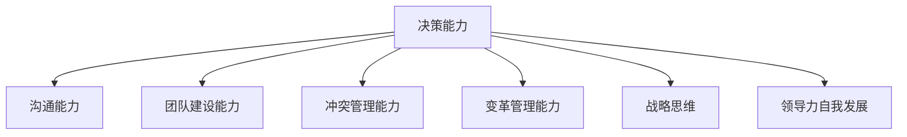
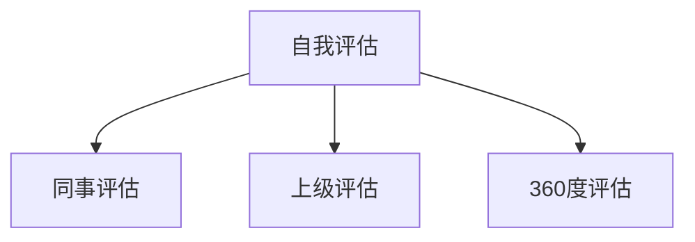
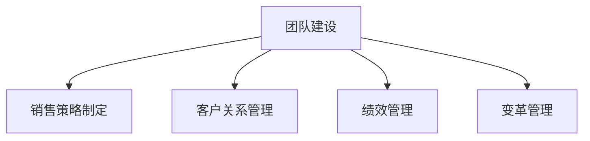
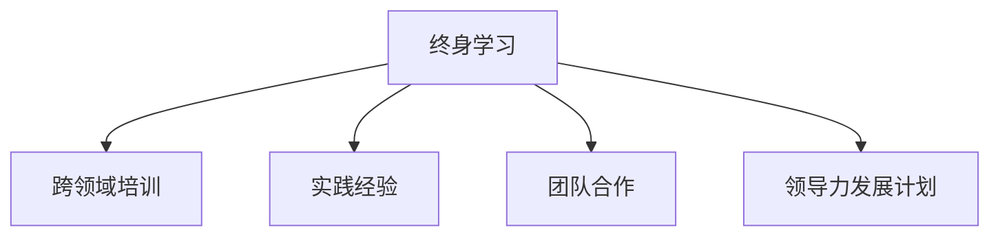

                 

### 文章标题

# 领导力修炼手册：从销售新星到管理者的逆袭宝典

### 关键词

- 销售管理
- 领导力
- 销售新星
- 管理者
- 逆袭

### 摘要

本文旨在探讨销售行业中，从销售新星成长为管理者的关键领导力修炼路径。通过深入分析领导力的核心概念、能力模型与评估方法，结合实际案例，总结出提升领导力的实用技巧和策略，帮助销售从业人员实现职业升级和领导力突破。

## 目录大纲

### 第一部分：领导力的基石

1. **第1章：领导力概述**
    1.1 问题背景
    1.2 问题描述
    1.3 问题解决
    1.4 边界与外延
    1.5 概念结构与核心要素组成
    1.6 本章小结

2. **第2章：领导力核心概念与原理**
    2.1 核心概念
    2.2 原理讲解
    2.3 对比表格
    2.4 ER实体关系图
    2.5 本章小结

### 第二部分：领导力能力模型与评估

3. **第3章：领导力能力模型**
    3.1 领导力能力构成
    3.2 评估方法
    3.3 评估工具
    3.4 实例分析
    3.5 本章小结

### 第三部分：领导力修炼实践

4. **第4章：领导力修炼实践**
    4.1 基础修炼
    4.2 高级修炼
    4.3 实践分享
    4.4 本章小结

5. **第5章：领导力在销售管理中的应用**
    5.1 销售管理概述
    5.2 领导力在销售管理中的应用
    5.3 案例分析
    5.4 本章小结

### 第四部分：领导力发展与未来趋势

6. **第6章：领导力发展与未来趋势**
    6.1 领导力发展趋势
    6.2 未来领导力的挑战与机遇
    6.3 未来领导力培养策略
    6.4 本章小结

### 第五部分：领导力修炼心得与启示

7. **第7章：领导力修炼心得与启示**
    7.1 心得分享
    7.2 启示与建议
    7.3 小结

### 附录

- 附录1：领导力测评问卷
- 附录2：领导力相关书籍推荐
- 附录3：领导力发展资源链接

---

### 引言

在充满竞争和变革的21世纪，销售行业正经历着前所未有的挑战和机遇。随着市场环境的变化、技术的进步以及消费者需求的多变，销售从业人员不仅需要具备扎实的销售技能，还需要不断提升领导力，以应对日益复杂的商业环境。

领导力，作为企业成功的关键因素之一，被广泛认为是实现个人职业发展和组织目标的重要保障。特别是在销售领域，领导力的培养不仅关系到销售团队的绩效，更影响着企业的市场竞争力。

本文将围绕“领导力修炼手册：从销售新星到管理者的逆袭宝典”这一主题，逐步展开对领导力的深入探讨。我们将从领导力的核心概念、能力模型、修炼实践以及未来发展趋势等多个维度进行详细分析，旨在为广大销售从业人员提供一套实用且系统的领导力提升指南。

### 第1章：领导力概述

#### 1.1 问题背景

销售行业在过去的几十年里经历了显著的发展，从传统的面对面销售到如今的多渠道营销和电子商务，销售模式不断演进。随着市场的全球化和技术的进步，销售行业面临的新挑战也日益增多。例如，如何快速响应市场变化、如何提升客户满意度、如何提高销售团队的效率等。

在这些挑战中，领导力成为了关键因素。领导力不仅影响个人销售业绩，更对整个销售团队和组织的绩效产生深远影响。对于销售新星而言，从一线销售人员逐步晋升为管理者，领导力的提升显得尤为重要。然而，许多销售新星在转型过程中往往面临着以下问题：

1. **角色转变的困惑**：从执行者到领导者的角色转变往往让他们感到不适应，缺乏清晰的转型路径。
2. **领导力知识不足**：缺乏系统性的领导力知识和实践经验，使得他们在面对管理挑战时感到无所适从。
3. **团队管理的难题**：如何有效地激励和引导团队成员，如何处理团队中的冲突和问题，都是新的挑战。
4. **自我认知的不足**：不了解自己的优势和不足，缺乏自我提升的动力和方法。

#### 1.2 问题描述

销售新星在从销售岗位晋升到管理岗位的过程中，常常遇到以下几个关键问题：

1. **领导力缺失**：缺乏领导力知识和技能，无法有效管理团队和推动销售目标的实现。
2. **角色转变困难**：难以适应从执行者到领导者的角色转变，管理技巧和领导能力亟待提升。
3. **团队协作困难**：难以建立有效的团队协作机制，团队成员缺乏凝聚力和向心力。
4. **个人发展受限**：个人职业发展受限，无法实现从销售新星到管理者的跨越。

#### 1.3 问题解决

为了解决上述问题，领导力修炼成为从销售新星到管理者的必经之路。以下是领导力修炼的关键路径和要素：

1. **领导力知识学习**：通过系统学习领导力理论，了解领导者的角色和责任，掌握基本的管理技能。
2. **实践锻炼**：在实际工作中不断练习和运用所学知识，通过实际案例来提升领导力。
3. **自我认知**：通过自我反思和评估，了解自己的优势和不足，制定个人发展计划。
4. **团队建设**：建立有效的团队管理机制，提升团队协作能力和凝聚力。
5. **持续学习**：保持对领导力的持续关注和学习，不断更新知识和技能。

#### 1.4 边界与外延

领导力修炼的范围不仅限于个人能力的提升，还包括对团队和组织的管理。以下是领导力修炼的边界与外延：

1. **个人发展**：提升自我认知，增强自信心和领导力。
2. **团队建设**：建立高效的团队协作机制，提高团队绩效。
3. **组织管理**：提升对整个组织的理解和管理能力，推动组织目标的实现。
4. **持续成长**：通过不断学习和实践，持续提升领导力，适应不断变化的市场环境。

#### 1.5 概念结构与核心要素组成

领导力修炼的概念结构主要包括以下几个方面：

1. **核心概念**：领导力、领导者角色、领导风格、团队协作、自我认知、决策能力等。
2. **结构要素**：知识学习、实践锻炼、自我评估、团队管理、组织发展等。

以下是领导力修炼的核心要素组成：

1. **领导力知识体系**：包括领导力的定义、领导者角色、领导风格、领导行为等。
2. **领导力能力模型**：包括决策能力、沟通能力、团队建设能力、冲突管理能力等。
3. **领导力评估方法**：包括自我评估、同事评估、上级评估等。
4. **领导力修炼实践**：通过实际工作来提升领导力，包括团队管理、决策制定、冲突处理等。

#### 1.6 本章小结

本章对领导力的核心概念、问题背景、问题描述以及领导力修炼的路径和关键要素进行了深入探讨。通过了解领导力的定义、意义和应用场景，我们可以明确领导力在个人职业发展和组织管理中的重要性。下一章我们将进一步探讨领导力的核心概念和原理，为后续的领导力修炼提供理论基础。

### 第2章：领导力核心概念与原理

#### 2.1 核心概念

领导力是指领导者通过激励、指导、协调和影响他人来实现组织或团队目标的能力。领导力不仅仅是管理和控制，更是一种影响力和领导艺术。以下是领导力的几个核心概念：

1. **领导者角色**：领导者是团队或组织的核心，负责制定目标、规划战略、分配资源、协调工作等。领导者不仅要有领导才能，还要具备高度的责任感和使命感。

2. **领导风格**：领导风格是指领导者进行管理和领导的方式。不同的领导风格适用于不同的情境和团队。常见的领导风格包括权威式、民主式、参与式等。

3. **领导行为**：领导行为是指领导者实际采取的行动和措施。有效的领导行为包括激励员工、提供反馈、建立团队、解决问题等。

4. **团队协作**：团队协作是指团队成员通过相互合作、沟通和协调，共同实现团队目标的过程。良好的团队协作能够提高团队效率和绩效。

5. **自我认知**：自我认知是指领导者对自己认知的理解和认识，包括自己的能力、优点、缺点、价值观等。自我认知有助于领导者更好地理解自己，从而提高领导力和管理水平。

6. **决策能力**：决策能力是指领导者能够快速、准确地做出决策的能力。决策能力对于团队和组织的发展至关重要。

#### 2.2 原理讲解

领导力的核心原理可以归纳为以下几个方面：

1. **领导力心理学原理**：领导力心理学原理主要研究领导者的心理特征、领导行为与团队绩效之间的关系。通过心理学原理，领导者可以更好地理解团队成员的需求和行为，从而提高领导效果。

2. **领导力行为学原理**：领导力行为学原理研究领导者的行为模式及其对团队和组织的影响。领导者通过观察和分析行为模式，可以更好地调整自己的领导行为，以适应不同的情境和需求。

3. **领导力组织学原理**：领导力组织学原理研究领导力在组织中的功能和作用。通过组织学原理，领导者可以更好地理解组织结构和流程，从而优化组织效能。

以下是领导力与管理的对比表格：

| 对比项 | 领导力 | 管理 |
| ---- | ---- | ---- |
| 目标 | 影响和激励团队成员实现共同目标 | 制定和执行计划，确保组织目标的实现 |
| 方式 | 通过个人魅力、影响力、价值观等 | 通过制度、流程、规范等 |
| 对象 | 个人和团队 | 组织和部门 |
| 影响范围 | 广泛 | 有限 |

#### 2.3 对比表格

| 领导风格 | 描述 | 适用场景 |
| ---- | ---- | ---- |
| 权威式领导 | 领导者具有高度的决策权和控制力，下属遵从命令。 | 紧急情况、需要快速决策的场景。 |
| 民主式领导 | 领导者与团队成员共同决策，尊重团队成员的意见。 | 团队成员具有专业技能和经验，需要激发团队创造力。 |
| 参与式领导 | 领导者与团队成员共同参与决策，领导者更多是协调和指导。 | 创新性项目或需要团队高度参与的项目。 |

#### 2.4 ER实体关系图

以下是领导力体系中的关键实体及其关系的ER实体关系图：

```mermaid
erDiagram
  Leader ||--|{ TeamMember }
  Leader ||--|{ Project }
  TeamMember ||--|{ Project }
  Leader ||--|{ Performance }
```

- Leader：领导者
- TeamMember：团队成员
- Project：项目
- Performance：绩效

实体间的关系如下：

- Leader与TeamMember之间是一对多的关系，即一个领导者可以管理多个团队成员。
- Leader与Project之间是一对多的关系，即一个领导者可以负责多个项目。
- TeamMember与Project之间是多对多的关系，即一个团队成员可以参与多个项目。
- Leader与Performance之间是一对一的关系，即一个领导者的绩效由其管理的团队绩效决定。

#### 2.5 本章小结

本章对领导力的核心概念和原理进行了详细讲解，并通过对比表格和ER实体关系图进一步阐述了领导力与管理的区别。理解领导力的核心概念和原理是提升领导力的第一步，也为后续章节的深入探讨奠定了基础。在下一章中，我们将进一步探讨领导力的能力模型与评估方法。

### 第3章：领导力能力模型与评估

#### 3.1 领导力能力模型

领导力能力模型是指对领导者应具备的各种能力和技能的系统描述。一个完整的领导力能力模型应包括以下几个方面：

1. **决策能力**：决策能力是领导者的一项核心能力，它包括快速准确地进行决策、评估风险和收益，以及根据实际情况调整决策。

2. **沟通能力**：沟通能力是领导者与团队成员、上级和客户有效沟通的重要保障。它包括口头和书面沟通、倾听和反馈、有效的演讲和演示。

3. **团队建设能力**：团队建设能力是领导者维护团队稳定、激发团队成员潜力、提高团队绩效的关键能力。它包括建立明确的团队目标、培养团队凝聚力、激励团队成员。

4. **冲突管理能力**：冲突管理能力是领导者应对团队内部冲突、解决矛盾、维护团队和谐的关键能力。它包括识别冲突、沟通协商、找到解决方案。

5. **变革管理能力**：变革管理能力是领导者推动组织变革、适应市场和环境变化的重要能力。它包括变革的规划与实施、领导团队适应变革、激励员工参与变革。

6. **战略思维**：战略思维是领导者从全局角度思考问题和制定长远规划的能力。它包括市场分析、竞争策略、资源配置、风险管理。

7. **领导力自我发展**：领导力自我发展是领导者不断提升自身领导力和管理能力的过程。它包括自我反思、持续学习、接受挑战和改变。

以下是领导力能力模型的构成：



#### 3.2 评估方法

领导力评估是衡量领导者能力和效果的重要手段。以下几种评估方法在领导力评估中广泛应用：

1. **自我评估**：自我评估是领导者自我反思和自我提升的过程。通过自我评估，领导者可以了解自己的优点和不足，制定个人发展计划。

2. **同事评估**：同事评估是领导者通过团队成员和同事的评价来了解自己在团队中的表现。同事评估可以提供客观的反馈，帮助领导者发现自身不足。

3. **上级评估**：上级评估是领导者通过上级领导或人力资源部门的评价来了解自己在组织中的表现。上级评估通常更注重领导者的整体表现和绩效。

4. **360度评估**：360度评估是一种全面评估方法，通过多个角度对领导者的能力进行评估。它包括自我评估、同事评估、上级评估以及客户或合作伙伴的反馈。

以下是领导力评估方法的构成：



#### 3.3 评估工具

为了有效地进行领导力评估，可以采用以下几种评估工具：

1. **领导力问卷**：领导力问卷是一种标准化的评估工具，用于衡量领导者的各项能力。问卷通常包括一系列问题，涵盖决策能力、沟通能力、团队建设能力等方面。

2. **领导力测评软件**：领导力测评软件是一种基于大数据和人工智能技术的评估工具，通过分析领导者的行为数据、绩效数据等，提供详细的评估报告。

以下是几种常见的评估工具：

| 工具名称 | 描述 |
| ---- | ---- |
| 领导力360度反馈工具 | 通过多个角度评估领导者的能力 |
| 领导力素质测评工具 | 测量领导者的素质和能力 |
| 领导力行为观察工具 | 观察领导者的行为，评估其能力 |

#### 3.4 实例分析

以下是一个领导力评估实例分析：

1. **评估目标**：提升销售团队领导者的领导力。

2. **评估方法**：采用360度评估方法，包括自我评估、同事评估和上级评估。

3. **评估过程**：
   - 自我评估：领导者通过填写问卷，评估自己的领导力能力。
   - 同事评估：团队成员填写问卷，评估领导者的领导力。
   - 上级评估：上级领导填写问卷，评估领导者的领导力。

4. **评估结果**：综合评估结果，发现领导者在沟通能力和决策能力方面较为突出，但在团队建设和冲突管理方面有待提升。

5. **改进措施**：
   - 开展沟通技巧培训，提升领导者的沟通能力。
   - 设定决策流程，帮助领导者更好地进行决策。
   - 组织团队建设活动，增强团队凝聚力和协作能力。
   - 开展冲突管理培训，提升领导者处理冲突的能力。

#### 3.5 本章小结

本章详细介绍了领导力能力模型、评估方法和评估工具。通过理解领导力能力模型，领导者可以明确自身需要提升的能力；通过评估方法，领导者可以了解自己的领导力水平；通过评估工具，领导者可以系统地评估和提升自身能力。这些方法和工具将为销售新星从销售岗位晋升到管理岗位提供有力的支持和指导。

### 第4章：领导力修炼实践

#### 4.1 基础修炼

领导力的修炼是一个长期而持续的过程，需要从基础开始逐步深化。以下是领导力修炼的基础部分：

1. **自我认知**：自我认知是领导力修炼的第一步。领导者需要深入了解自己的价值观、性格特点、优势和劣势。通过自我反思和评估，领导者可以更好地认识自己，从而更好地理解和管理团队。

2. **团队协作**：团队协作能力是领导者必须具备的基本能力。领导者需要学会如何建立有效的团队协作机制，如何激励团队成员，如何解决团队中的冲突。团队协作能力的提升有助于提高团队绩效，增强团队凝聚力。

3. **沟通技巧**：沟通技巧是领导力的核心要素之一。有效的沟通可以确保信息准确传递，减少误解和冲突。领导者需要掌握各种沟通技巧，如倾听、表达、反馈和谈判。良好的沟通能力有助于建立信任，提升领导力。

以下是一个自我认知的例子：

- **价值观**：尊重、诚信、责任感
- **性格特点**：外向、乐观、有耐心
- **优势**：擅长沟通、团队协作、解决问题
- **劣势**：决策速度较慢、情绪波动较大

通过自我认知，领导者可以制定个人发展计划，有针对性地提升自己的能力。

4. **角色认知**：领导者需要明确自己的角色和责任。从销售新星到管理者，角色的转变意味着需要承担更多的责任。领导者需要理解管理者的职责，如制定目标、分配任务、监督执行等。

5. **理论学习**：领导力是一门科学，也是一门艺术。领导者需要通过学习相关的领导力理论，了解领导力的核心概念和原理。理论学习可以帮助领导者更好地应对实际工作中的挑战。

#### 4.2 高级修炼

随着领导力的提升，领导者需要进入高级修炼阶段。高级修炼主要涉及以下方面：

1. **决策能力**：决策能力是领导者的一项关键能力。领导者需要在压力和不确定性下做出正确的决策。高级修炼包括学习决策模型、提高风险意识、培养决策速度和准确性。

2. **战略思维**：战略思维是领导者从全局角度思考问题和制定长远规划的能力。高级修炼包括市场分析、竞争策略、资源配置、风险管理。

3. **变革管理**：在快速变化的市场环境中，领导者需要具备变革管理能力。高级修炼包括如何推动组织变革、如何应对变革中的挑战、如何激励员工适应变革。

4. **领导力自我发展**：领导力自我发展是领导者不断提升自身领导力和管理能力的过程。高级修炼包括自我反思、持续学习、接受挑战和改变。

以下是一个决策能力的例子：

- **情境**：公司需要决定是否扩大产品线。
- **决策过程**：
  - 分析市场趋势和竞争环境。
  - 评估资源和成本。
  - 考虑风险和收益。
  - 制定决策方案。
  - 实施决策方案。
- **结果**：决策方案成功实施，产品线扩大，公司市场份额增加。

通过高级修炼，领导者可以更好地应对复杂的商业环境，提升领导力和组织绩效。

5. **领导力示范**：领导者需要通过行动来示范自己的价值观和领导风格。高级修炼包括如何建立榜样形象、如何激励团队成员、如何处理失败和挑战。

#### 4.3 实践分享

以下是一个从销售新星到管理者的成长经历：

1. **初期经历**：初入职场，担任销售职位。通过学习和实践，提升销售技巧，实现业绩突破。

2. **角色转变**：晋升为销售经理，面临从执行者到领导者的角色转变。通过自我认知和理论学习，提升领导力。

3. **团队管理**：建立有效的团队管理机制，提升团队协作能力。通过沟通技巧和激励措施，提高团队绩效。

4. **领导力提升**：参加领导力培训和研讨会，持续提升领导力。通过实践和反思，不断完善自己的领导风格和决策能力。

5. **成就**：带领团队实现业绩目标，晋升为销售总监。通过战略规划和变革管理，推动公司销售业务的发展。

#### 4.4 本章小结

本章介绍了领导力修炼的基础部分和高级修炼，通过自我认知、团队协作、沟通技巧、决策能力、战略思维和领导力自我发展等方面，帮助销售新星从基础开始逐步提升领导力。通过实践分享，展示了从销售新星到管理者的成长过程和成功经验。领导力的修炼是一个持续的过程，需要不断学习和实践，以适应不断变化的商业环境。

### 第5章：领导力在销售管理中的应用

#### 5.1 销售管理概述

销售管理是指通过计划、组织、领导和控制等管理职能，实现销售目标的过程。销售管理不仅仅是销售技能的应用，更是一种系统的管理活动。以下是销售管理的几个关键方面：

1. **销售目标**：销售目标是销售管理的基础，明确销售团队在特定时间内需要实现的业绩目标。销售目标应具体、可衡量、可实现、相关性强，并具有时限性。

2. **销售策略**：销售策略是指为了实现销售目标而制定的一系列行动方案。销售策略包括市场定位、产品策略、定价策略、渠道策略、促销策略等。

3. **销售团队**：销售团队是实现销售目标的关键，团队管理包括人员招募、培训、激励、绩效评估等方面。一个高效的销售团队能够提高销售业绩，增强市场竞争力。

4. **销售过程**：销售过程是指从客户接触、需求分析、报价、谈判到成交的整个过程。有效的销售过程管理能够提高客户满意度，增加销售机会。

5. **销售绩效**：销售绩效是指销售团队在实现销售目标过程中的表现。销售绩效评估包括销售额、销售利润、客户满意度、市场覆盖率等指标。

#### 5.2 领导力在销售管理中的应用

领导力在销售管理中发挥着至关重要的作用。以下是领导力在销售管理中的几个应用方面：

1. **团队建设**：领导者通过建立有效的团队协作机制，提升团队凝聚力和协作能力。团队建设包括明确团队目标、建立信任、培养团队精神、激发团队成员的潜力。

2. **销售策略制定**：领导者参与销售策略的制定，通过市场分析、竞争策略制定、资源分配等，确保销售策略的科学性和可行性。领导者需要具备战略思维，从全局角度考虑销售目标的实现。

3. **客户关系管理**：领导者通过有效的沟通和关系管理，维护与客户的关系，提升客户满意度。领导者需要掌握客户需求分析、客户满意度评估、客户关系维护等技能。

4. **绩效管理**：领导者通过绩效管理，确保销售目标的实现。绩效管理包括设定绩效目标、绩效评估、反馈与激励等。领导者需要具备激励和指导能力，激发团队成员的积极性和创造力。

5. **变革管理**：在市场环境变化或公司战略调整时，领导者需要具备变革管理能力，推动销售团队的适应和变革。领导者需要具备沟通能力、协调能力和决策能力，确保变革的顺利进行。

以下是领导力在销售管理中的应用框架：



#### 5.3 案例分析

以下是一个领导力在销售管理中成功应用的案例：

1. **案例背景**：某公司是一家新兴的科技公司，销售团队由10名成员组成。由于市场竞争激烈，公司需要提升销售业绩，以保持市场竞争力。

2. **领导力应用**：
   - **团队建设**：销售经理通过组织团队活动，加强团队成员之间的沟通和协作，提升团队凝聚力。
   - **销售策略制定**：销售经理与团队成员共同分析市场趋势，制定新的销售策略，包括市场定位、产品策略和渠道策略。
   - **客户关系管理**：销售经理与团队成员共同维护客户关系，通过定期拜访和沟通，提升客户满意度。
   - **绩效管理**：销售经理设定明确的绩效目标，对团队成员进行绩效评估，并根据评估结果进行激励和指导。
   - **变革管理**：随着公司战略调整，销售经理推动团队适应新的销售策略和业务模式，确保变革的顺利进行。

3. **案例结果**：
   - **团队业绩**：通过团队建设，团队成员之间的协作和沟通得到提升，销售业绩显著提高。
   - **客户满意度**：通过有效的客户关系管理，客户满意度显著提升，客户忠诚度增加。
   - **绩效提升**：通过绩效管理，团队成员的积极性和创造力得到激发，整体绩效水平提升。
   - **变革适应**：通过变革管理，团队成功适应新的销售策略和业务模式，为公司发展奠定基础。

#### 5.4 本章小结

本章详细介绍了领导力在销售管理中的应用，包括团队建设、销售策略制定、客户关系管理、绩效管理和变革管理等方面。通过案例分析，展示了领导力在销售管理中的成功应用，为销售团队提供了实用的领导力提升策略。领导力在销售管理中的有效应用，有助于提升团队绩效，实现销售目标。

### 第6章：领导力发展与未来趋势

#### 6.1 领导力发展趋势

随着全球化和数字化的发展，领导力也在不断演变和提升。以下是当前领导力发展的几个主要趋势：

1. **数字化领导力**：随着技术的飞速发展，数字化领导力成为领导者必备的能力。数字化领导力包括理解和使用数字工具、数据分析、人工智能等，以提升决策能力和组织效率。

2. **情感领导力**：情感领导力强调领导者对员工情感需求的关注和理解。随着员工对工作环境和个人发展的重视，情感领导力成为提升员工满意度和团队凝聚力的关键因素。

3. **持续领导力**：持续领导力强调领导者的终身学习和自我提升。领导者需要不断适应新的市场环境和技术变革，通过学习和实践不断提升自己的领导力。

4. **跨文化领导力**：随着全球化的发展，领导者需要具备跨文化沟通和协作能力。跨文化领导力有助于推动跨国团队的合作，提高组织的国际竞争力。

以下是当前领导力发展趋势的对比表格：

| 发展趋势 | 描述 |
| ---- | ---- |
| 数字化领导力 | 理解和使用数字工具，提升决策能力和组织效率 |
| 情感领导力 | 关注员工情感需求，提升员工满意度和团队凝聚力 |
| 持续领导力 | 终身学习和自我提升，适应新的市场环境和技术变革 |
| 跨文化领导力 | 跨文化沟通和协作能力，推动跨国团队合作 |

#### 6.2 未来领导力的挑战与机遇

未来领导力将面临以下几个方面的挑战和机遇：

1. **人工智能的挑战与机遇**：人工智能的快速发展对领导者提出了新的要求。领导者需要理解人工智能的应用场景，如何利用人工智能提升决策能力和管理效率。同时，人工智能也带来了新的机遇，如自动化流程、个性化服务等。

2. **全球化的挑战与机遇**：全球化带来了更广阔的市场和更激烈的竞争，领导者需要具备跨文化沟通和协作能力。全球化也带来了新的机遇，如跨国合作、国际市场拓展等。

3. **可持续发展的挑战与机遇**：可持续发展成为全球关注的重要议题，领导者需要推动企业社会责任和可持续发展。可持续发展不仅有助于提升企业形象，也有助于提升组织的长期竞争力。

4. **员工多样性的挑战与机遇**：员工多样性的增加，包括性别、种族、文化背景等，对领导者提出了新的挑战。领导者需要尊重和包容多样性，促进团队合作和创新。同时，员工多样性也带来了新的机遇，如多元化思维和创新能力的提升。

以下是未来领导力面临的挑战与机遇的对比表格：

| 挑战 | 描述 |
| ---- | ---- |
| 人工智能 | 需要理解和应用人工智能技术 |
| 全球化 | 需要具备跨文化沟通和协作能力 |
| 可持续发展 | 需要推动企业社会责任和可持续发展 |
| 员工多样性 | 需要尊重和包容多样性 |

#### 6.3 未来领导力培养策略

为了应对未来领导力的挑战和机遇，以下是一些培养策略：

1. **终身学习**：领导者需要保持对新技术、新知识的学习和探索，不断提升自己的知识和技能。

2. **跨领域培训**：领导者需要参加跨领域的培训，如技术、管理、领导力等，以提升综合能力。

3. **实践经验**：领导者需要通过实际工作来锻炼领导能力，通过解决实际问题和挑战，提升领导力。

4. **团队合作**：领导者需要培养团队合作能力，通过团队协作和创新，提升组织绩效。

5. **领导力发展计划**：企业可以制定领导力发展计划，包括领导力培训、导师指导、领导力评估等，以系统性地培养领导者。

以下是未来领导力培养策略的构成：



#### 6.4 本章小结

本章详细探讨了领导力的发展趋势、未来领导力的挑战与机遇，以及培养策略。随着全球化和数字化的发展，领导力不断演变和提升。未来领导力将面临人工智能、全球化、可持续发展等挑战，同时也带来了新的机遇。通过终身学习、跨领域培训、实践经验、团队合作和领导力发展计划等策略，领导者可以不断提升自身能力，应对未来领导力的挑战。

### 第7章：领导力修炼心得与启示

#### 7.1 心得分享

在领导力修炼的过程中，我深刻体会到了以下几点心得：

1. **自我认知的重要性**：自我认知是领导力修炼的第一步。通过深入了解自己的价值观、性格特点、优势和劣势，我能够更好地认识自己，从而更有针对性地提升自己的能力。

2. **持续学习的必要性**：领导力是一门不断发展的学科，需要通过持续学习来跟上时代的步伐。我积极参加各类领导力培训和学习活动，不断更新自己的知识和技能。

3. **团队协作的力量**：有效的团队协作是提升领导力的关键。通过建立信任、明确目标、激励团队成员，我成功地带领团队实现了多个重要项目，并提升了团队的整体绩效。

4. **实践的重要性**：领导力不仅需要理论知识，更需要实践。通过实际工作中的不断尝试和反思，我逐步提升了自己的领导能力和管理水平。

#### 7.2 启示与建议

基于自己的领导力修炼心得，以下是一些建议：

1. **明确个人发展目标**：领导者应该明确自己的发展目标，并制定可行的计划。通过设定短期和长期目标，可以更好地规划自己的职业生涯。

2. **注重自我反思**：领导者需要定期进行自我反思，总结工作中的经验和教训。通过自我反思，可以发现自身的不足，并采取相应的改进措施。

3. **积极参与培训和交流**：积极参加领导力培训和交流活动，可以学习他人的成功经验，拓宽自己的视野。同时，与同行交流可以获取宝贵的建议和反馈。

4. **培养团队精神**：领导者应该注重培养团队精神，建立良好的团队文化。通过激发团队成员的潜力，提升团队的凝聚力和协作能力。

5. **关注员工需求**：领导者需要关注员工的需求，提供合适的工作环境和激励机制。通过关注员工的需求，可以提升员工的工作满意度和忠诚度。

#### 7.3 未来领导力的培养方向

未来领导力的发展将面临新的挑战和机遇。以下是一些建议的领导力培养方向：

1. **数字化领导力**：随着数字技术的飞速发展，领导者需要具备数字化领导力，包括数据分析和人工智能的应用能力。

2. **全球视野**：全球化背景下的领导者需要具备跨文化沟通和协作能力，以适应多元文化的工作环境。

3. **可持续发展领导力**：领导者需要关注可持续发展，推动企业社会责任和环境保护，提升组织的长期竞争力。

4. **创新领导力**：在快速变化的市场环境中，领导者需要具备创新思维和创新能力，以应对市场变化和挑战。

5. **员工关怀**：未来领导力的发展将更加注重员工的关怀，包括心理健康、工作与生活的平衡等。领导者需要关注员工的福祉，提升员工的幸福感和忠诚度。

#### 7.4 小结

领导力修炼是一个长期而持续的过程，需要领导者不断学习和实践。通过自我认知、持续学习、团队协作和关注员工需求，领导者可以不断提升自身能力，实现个人职业发展和组织目标的实现。未来领导力的发展将面临新的挑战和机遇，领导者需要具备数字化、全球视野、可持续发展、创新和员工关怀等能力。通过不断学习和实践，领导者可以应对未来领导力的挑战，实现持续成长和成功。

### 附录

#### 附录1：领导力测评问卷

以下是领导力测评问卷，用于评估领导者的各项能力。

1. **决策能力**：
   - 我能够在压力下做出快速、准确的决策。（1分，非常不同意；5分，非常同意）
   - 我能够全面考虑问题，从不同角度分析并制定解决方案。（1分，非常不同意；5分，非常同意）
   - 我能够根据实际情况调整和优化决策。（1分，非常不同意；5分，非常同意）

2. **沟通能力**：
   - 我能够清晰地表达自己的想法和意见。（1分，非常不同意；5分，非常同意）
   - 我能够有效地倾听他人的意见和反馈。（1分，非常不同意；5分，非常同意）
   - 我能够通过沟通建立信任和合作关系。（1分，非常不同意；5分，非常同意）

3. **团队建设能力**：
   - 我能够明确团队目标，并确保团队成员理解并支持目标。（1分，非常不同意；5分，非常同意）
   - 我能够建立良好的团队氛围，提升团队凝聚力。（1分，非常不同意；5分，非常同意）
   - 我能够激励团队成员，发挥他们的潜力。（1分，非常不同意；5分，非常同意）

4. **冲突管理能力**：
   - 我能够识别和解决团队中的冲突。（1分，非常不同意；5分，非常同意）
   - 我能够通过有效沟通和协商解决冲突。（1分，非常不同意；5分，非常同意）
   - 我能够保持冷静，避免冲突升级。（1分，非常不同意；5分，非常同意）

5. **变革管理能力**：
   - 我能够推动组织变革，并确保变革顺利进行。（1分，非常不同意；5分，非常同意）
   - 我能够与员工有效沟通，解释变革的原因和目标。（1分，非常不同意；5分，非常同意）
   - 我能够激励员工适应变革，保持积极态度。（1分，非常不同意；5分，非常同意）

总分：_______

评分说明：将各项分数相加，总分在20-25分之间为优秀，10-15分为良好，5-10分为一般，低于5分为较差。

#### 附录2：领导力相关书籍推荐

1. 《领导力五要素》——史蒂夫·乔布斯
2. 《高效能人士的七个习惯》——史蒂芬·柯维
3. 《变革之舞》——约翰·P·科特
4. 《第五项修炼》——彼得·圣吉
5. 《领导者的语言》——韦恩·布兰查德

#### 附录3：领导力发展资源链接

1. 领导力发展中心（[Leadership Development Center](http://www.ldc.org)）
2. 麦肯锡领导力发展（[McKinsey Leadership Development](https://www.mckinsey.com/business-functions/organization/our-insights/leadership-development)）
3. 哈佛商学院领导力研究（[Harvard Business Review Leadership](https://hbr.org/department/leadership)）
4. 领导力发展网络（[Leadership Development Network](http://www.ldnetwork.org/)）
5. 谷歌领导力发展（[Google Leadership Development](https://careers.google.com/leadership-development/)）

### 作者信息

**作者：AI天才研究院/AI Genius Institute & 禅与计算机程序设计艺术 /Zen And The Art of Computer Programming**

