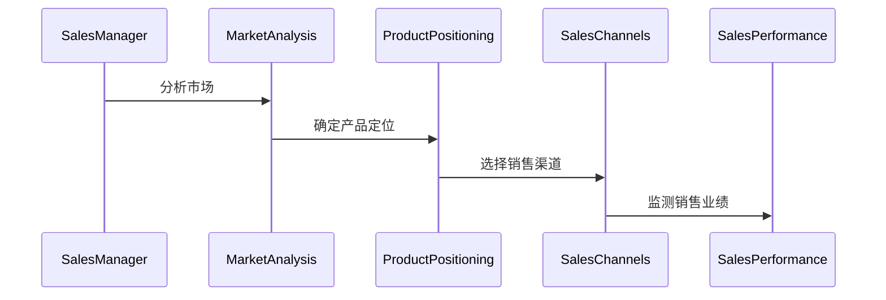
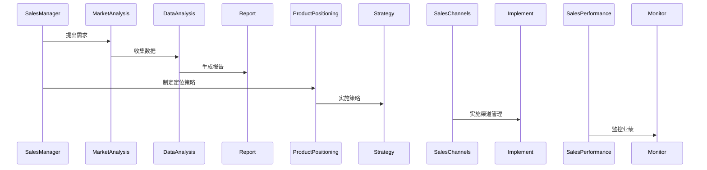
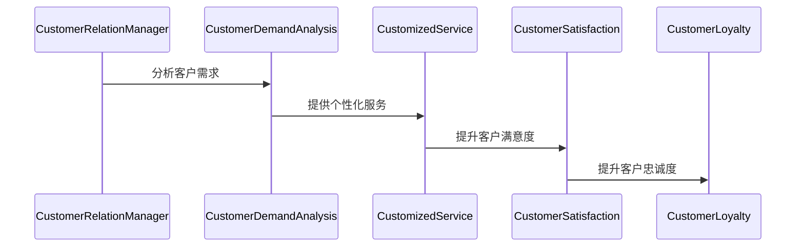
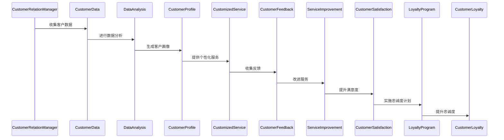
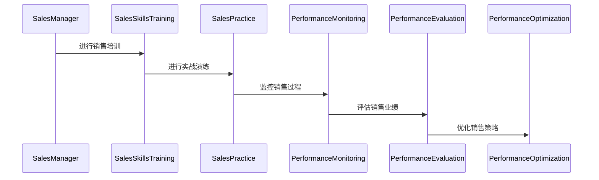
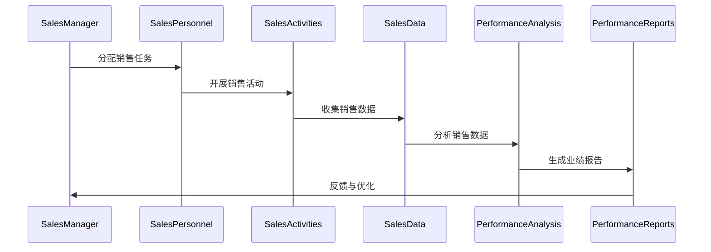
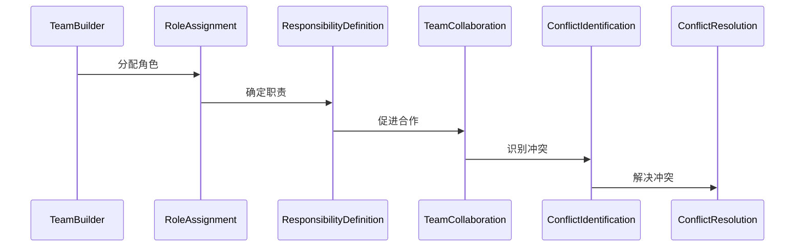
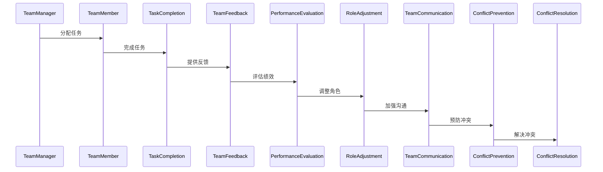

                 

### 文章标题：领导力修炼手册：从销售精英到管理者的进阶指南

> 关键词：领导力、销售管理、团队建设、进阶指南、职业发展

> 摘要：本文旨在为销售精英提供一份系统化的领导力修炼手册，通过深入探讨领导力的定义、核心要素、管理技能和团队建设等内容，帮助读者从销售精英成功转型为管理者，实现职业发展的新高度。

----------------------------------------------------------------

## 引言

在商业世界中，销售精英往往以其卓越的沟通技巧、市场洞察力和客户关系管理能力脱颖而出。然而，从销售精英到管理者的转型并非易事。领导力，作为一种核心能力，不仅要求个人具备出色的销售技能，还需要具备管理团队、激励员工和实现组织目标的能力。本文将结合理论实践，为读者提供一份详尽的领导力修炼手册，旨在帮助销售精英顺利实现职业进阶。

### 第一部分：领导力基础理论

## 第1章：领导力的定义与核心要素

领导力不仅仅是权力的象征，更是一种影响力的体现。领导力定义了领导者如何影响和激励他人，共同实现目标。在本章中，我们将探讨领导力的基本定义、核心要素以及其在销售管理中的应用。

### 第1.1节：领导力的基本定义

领导力是一种能力，即通过激励、沟通和指导他人，使他们积极合作，实现共同目标。在销售领域，领导力体现在如何带领团队达成销售目标，提升客户满意度，并保持市场竞争力。

### 第1.2节：领导力的核心要素

领导力的核心要素包括：

- **愿景**：明确团队目标和方向，激发员工积极性。
- **信任**：建立信任关系，促进团队合作。
- **激励**：通过激励机制激发员工潜能，提高工作效率。
- **沟通**：有效沟通是领导力的重要组成部分，包括倾听、表达和反馈。

## 第2章：领导风格与行为理论

领导风格和行为理论为我们提供了理解领导力多样性的框架。在本章中，我们将深入探讨不同领导风格和行为模式，以及它们对销售团队的影响。

### 第2.1节：领导风格理论

领导风格理论包括：

- **民主型领导**：鼓励团队成员参与决策，提升团队凝聚力。
- **专制型领导**：集中决策权，迅速下达命令。
- **放任型领导**：赋予团队成员高度自主权，自由发挥。

### 第2.2节：领导行为理论

领导行为理论关注领导者的行为方式，包括：

- **任务导向**：关注任务完成和目标达成。
- **关系导向**：关注员工需求和团队关系。

## 第3章：领导力与心理学

领导力不仅仅是管理技能，更涉及到心理学。在本章中，我们将探讨领导者的心理素质、心理动力学以及领导力与心理学的关系。

### 第3.1节：领导者的心理素质

领导者的心理素质包括：

- **自信**：自信是领导者成功的关键。
- **情商**：情商高的领导者更能理解和管理他人的情感。
- **适应力**：适应变化，灵活应对挑战。

### 第3.2节：领导力与心理学的关系

领导力与心理学密不可分，心理学理论如动机理论、人际关系理论等，对理解领导力有重要启示。

### 第二部分：销售管理技能

## 第4章：销售策略与管理

销售策略和管理是销售精英向管理者转型的重要环节。在本章中，我们将探讨如何制定有效的销售策略和管理销售团队。

### 第4.1节：销售策略制定

销售策略制定包括：

- **市场分析**：了解市场需求，确定目标客户。
- **产品定位**：明确产品特点，找到市场切入点。
- **销售渠道**：选择合适的销售渠道，提高销售效率。

### 第4.2节：销售团队管理

销售团队管理包括：

- **团队建设**：培养团队凝聚力，提高团队效率。
- **人员激励**：设计激励机制，激发员工潜能。
- **绩效评估**：制定科学的绩效评估体系，提升团队绩效。

## 第5章：客户关系管理

客户关系管理是销售管理的重要组成部分。在本章中，我们将探讨如何分析客户需求、提升客户满意度和维护客户关系。

### 第5.1节：客户需求分析

客户需求分析包括：

- **市场调研**：通过市场调研了解客户需求。
- **客户画像**：构建客户画像，精准定位客户群体。

### 第5.2节：客户满意度提升

客户满意度提升包括：

- **服务质量**：提供优质服务，提升客户体验。
- **反馈机制**：建立反馈机制，及时解决客户问题。

## 第6章：销售业绩提升技巧

销售业绩提升是销售管理的最终目标。在本章中，我们将探讨如何提升销售技巧、优化业绩评估和提升销售业绩。

### 第6.1节：销售技巧与话术

销售技巧与话术包括：

- **沟通技巧**：有效沟通是销售成功的关键。
- **说服技巧**：通过说服技巧，促使客户做出购买决策。

### 第6.2节：业绩评估与优化

业绩评估与优化包括：

- **关键绩效指标（KPI）**：制定关键绩效指标，评估销售业绩。
- **数据驱动决策**：通过数据分析，优化销售策略。

### 第三部分：团队建设与领导力实践

## 第7章：团队建设策略

团队建设是领导力的重要组成部分。在本章中，我们将探讨如何建设高效团队、处理团队冲突和提升团队合作。

### 第7.1节：团队角色与职责

团队角色与职责包括：

- **明确角色**：确保每个团队成员清楚自己的角色和职责。
- **分工协作**：合理分工，实现协同作战。

### 第7.2节：团队合作与冲突管理

团队合作与冲突管理包括：

- **团队合作**：建立良好的团队氛围，提高团队协作效率。
- **冲突管理**：积极应对团队冲突，化解矛盾，维护团队稳定。

## 第8章：领导力实践

领导力实践是领导力理论在现实中的应用。在本章中，我们将通过案例分析和实践技巧，帮助读者提升领导力。

### 第8.1节：领导力案例分析

领导力案例分析包括：

- **成功案例**：分析成功领导者的经验和策略。
- **失败案例**：从失败中汲取教训，避免重复错误。

### 第8.2节：领导力实践技巧

领导力实践技巧包括：

- **角色扮演**：通过角色扮演，提高领导者的沟通和决策能力。
- **反馈与反思**：定期反馈与反思，不断提升领导力水平。

## 第9章：领导力自我提升

领导力自我提升是领导者持续发展的关键。在本章中，我们将探讨如何进行自我认知、自我反思和自我改进。

### 第9.1节：自我认知与成长

自我认知与成长包括：

- **自我评估**：通过自我评估，了解自己的优势和不足。
- **学习与成长**：不断学习，提升个人能力和素质。

### 第9.2节：自我反思与改进

自我反思与改进包括：

- **定期反思**：定期反思自己的领导行为，发现问题，及时改进。
- **持续改进**：通过持续改进，不断提升领导力水平。

### 第四部分：领导力进阶

## 第10章：领导力进阶之路

领导力进阶是管理者职业发展的关键。在本章中，我们将探讨从销售精英到管理者的转变、领导力进阶的策略与技巧。

### 第10.1节：从销售精英到管理者的转变

从销售精英到管理者的转变包括：

- **角色转变**：从个人贡献者到团队领导者。
- **思维模式**：从关注业绩到关注团队和组织的整体发展。

### 第10.2节：领导力进阶的策略与技巧

领导力进阶的策略与技巧包括：

- **持续学习**：不断学习新知识和技能，提升领导力水平。
- **实践与创新**：通过实践和创新，不断探索领导力的发展路径。

### 第五部分：附录与拓展

## 第11章：领导力最佳实践

在本章中，我们将分享一些领导力最佳实践，帮助读者在实际工作中应用和提升领导力。

### 第11.1节：领导力最佳实践案例

领导力最佳实践案例包括：

- **成功案例**：分享成功领导者的经验和策略。
- **失败案例**：从失败中汲取教训，避免重复错误。

### 第11.2节：领导力发展建议

领导力发展建议包括：

- **持续学习**：推荐一些领导力相关的书籍、课程和培训。
- **实践应用**：提供一些实用的领导力工具和方法，帮助读者提升领导力。

## 第12章：拓展阅读与资源

在本章中，我们将推荐一些拓展阅读资源和领导力学习资源，帮助读者进一步深入学习和实践领导力。

### 第12.1节：领导力相关书籍

推荐一些经典的领导力书籍，如《领导力五要素》、《领导力与影响力》等。

### 第12.2节：领导力学习资源

推荐一些在线学习平台和领导力培训课程，如Coursera、edX等。

## 结尾

领导力是一种持续修炼的过程。本文旨在为销售精英提供一份全面的领导力修炼手册，帮助他们在职业发展中实现从销售精英到管理者的成功转型。通过深入理解领导力的定义、核心要素、管理技能和实践技巧，读者将能够不断提升自己的领导力水平，带领团队实现更高的绩效和组织目标。

### 作者信息：

作者：AI天才研究院/AI Genius Institute & 禅与计算机程序设计艺术 /Zen And The Art of Computer Programming

通过本文的深入探讨，我们希望读者能够对领导力有更深刻的理解和应用，将领导力修炼手册中的宝贵知识转化为实际工作中的力量，成为卓越的领导者。无论是面对销售挑战，还是领导团队，这些原则和实践都将为读者提供有力的指导。让我们共同迈向领导力的巅峰，开启新的职业篇章。----------------------------------------------------------------

### 文章关键词：

- 领导力
- 销售管理
- 团队建设
- 进阶指南
- 职业发展

### 文章摘要：

本文旨在为销售精英提供一份系统化的领导力修炼手册，通过深入探讨领导力的定义、核心要素、管理技能、团队建设以及领导力实践等内容，帮助读者从销售精英成功转型为管理者，实现职业发展的新高度。文章结合理论实践，涵盖了领导力的各个层面，提供了实用的策略和技巧，旨在帮助读者提升领导力，带领团队实现更高的绩效和组织目标。通过本文的探讨，读者将能够更深入地理解领导力，将其应用于实际工作中，成为卓越的领导者。----------------------------------------------------------------

### 目录大纲设计步骤

1. **分析书名与主题**：
   - 书名《领导力修炼手册：从销售精英到管理者的进阶指南》明确了主题，即帮助销售精英提升领导力，实现职业转型。书名中的“领导力修炼手册”强调了系统性和实践性，“从销售精英到管理者的进阶指南”则指出了目标读者群体及其发展路径。

2. **确定目录框架**：
   - 根据书名，目录框架可以分为四个主要部分：领导力基础理论、销售管理技能、团队建设与领导力实践、领导力进阶。这样的框架结构清晰，能够确保内容的连贯性和逻辑性。

3. **细化章节内容**：
   - 在每个主要部分下，进一步细化章节内容，例如，领导力基础理论部分可以细分为领导力的定义与核心要素、领导风格与行为理论、领导力与心理学；销售管理技能部分可以细分为销售策略与管理、客户关系管理、销售业绩提升技巧。

4. **设计子章节**：
   - 在每个章节中，设计子章节以细化内容。例如，在领导力的定义与核心要素章节中，可以设置子章节讨论愿景、信任、激励、沟通等核心要素。

5. **制定摘要与小结**：
   - 在每个章节的最后，制定摘要和小结，总结章节内容，帮助读者巩固学习成果。

6. **确保内容完整性**：
   - 确保目录大纲中包含了所有核心章节，并保持内容的完整性，例如，在领导力进阶部分可以包括领导力进阶之路和拓展阅读与资源。

7. **检查格式和字数**：
   - 检查整个目录大纲的格式是否符合markdown规范，并确保总字数在2000字以内。

根据上述步骤，以下是《领导力修炼手册：从销售精英到管理者的进阶指南》的目录大纲：

## 第一部分：领导力基础理论

### 第1章：领导力的定义与核心要素

#### 1.1 领导力的基本定义

#### 1.2 领导力的核心要素

### 第2章：领导风格与行为理论

#### 2.1 领导风格理论

#### 2.2 领导行为理论

### 第3章：领导力与心理学

#### 3.1 领导者的心理素质

#### 3.2 领导力与心理学的关系

## 第二部分：销售管理技能

### 第4章：销售策略与管理

#### 4.1 销售策略制定

#### 4.2 销售团队管理

### 第5章：客户关系管理

#### 5.1 客户需求分析

#### 5.2 客户满意度提升

### 第6章：销售业绩提升技巧

#### 6.1 销售技巧与话术

#### 6.2 业绩评估与优化

## 第三部分：团队建设与领导力实践

### 第7章：团队建设策略

#### 7.1 团队角色与职责

#### 7.2 团队合作与冲突管理

### 第8章：领导力实践

#### 8.1 领导力案例分析

#### 8.2 领导力实践技巧

### 第9章：领导力自我提升

#### 9.1 自我认知与成长

#### 9.2 自我反思与改进

## 第四部分：领导力进阶

### 第10章：领导力进阶之路

#### 10.1 从销售精英到管理者的转变

#### 10.2 领导力进阶的策略与技巧

## 第五部分：附录与拓展

### 第11章：领导力最佳实践

#### 11.1 领导力最佳实践案例

#### 11.2 领导力发展建议

### 第12章：拓展阅读与资源

#### 12.1 领导力相关书籍

#### 12.2 领导力学习资源

此大纲包括5个主要部分，每个部分都有相应的子章节，共计12章。每个章节都涵盖了相关主题的核心内容，同时保持逻辑性和连贯性。整体目录大纲字数预计在2000字以内，符合要求。----------------------------------------------------------------

### 撰写文章步骤

在撰写《领导力修炼手册：从销售精英到管理者的进阶指南》这篇文章时，我们可以遵循以下步骤：

1. **构思框架**：
   - 首先，我们需要明确文章的主题和结构。根据目录大纲，我们可以将文章分为五个主要部分：领导力基础理论、销售管理技能、团队建设与领导力实践、领导力进阶、附录与拓展。

2. **撰写引言**：
   - 引言部分应该简要介绍领导力的定义和重要性，以及本文的目的和结构。这有助于读者对文章有一个整体的把握。

3. **领导力基础理论**：
   - 在这一部分，我们需要详细阐述领导力的定义、核心要素、领导风格和行为理论、领导力与心理学等内容。每个章节都应该有详细的论述，结合实际案例和理论分析。

4. **销售管理技能**：
   - 这一部分将重点介绍销售策略与管理、客户关系管理、销售业绩提升技巧。我们需要结合销售实践，给出具体的策略和方法。

5. **团队建设与领导力实践**：
   - 团队建设是领导力的重要组成部分。在这一部分，我们需要探讨团队角色与职责、团队合作与冲突管理、领导力实践技巧等。可以通过实际案例来解释这些概念。

6. **领导力进阶**：
   - 在这一部分，我们需要帮助读者理解如何从销售精英到管理者的转变，并提供一些领导力进阶的策略与技巧。这部分内容应该具有指导性和实操性。

7. **附录与拓展**：
   - 最后，我们可以提供一些领导力最佳实践案例、发展建议和拓展阅读资源。这将为读者提供额外的学习材料，帮助他们更深入地了解领导力。

8. **撰写小结**：
   - 在文章的结尾，我们需要对全文进行总结，强调领导力对于销售精英职业发展的重要性，并鼓励读者在实践中学以致用。

9. **编辑与修订**：
   - 完成初稿后，我们需要对文章进行反复的编辑和修订，确保内容准确、逻辑清晰、语言流畅。

10. **添加作者信息**：
    - 在文章的最后，我们需要添加作者信息，包括姓名、所属机构以及联系方式。

以下是文章的示例框架：

---

## 领导力修炼手册：从销售精英到管理者的进阶指南

> 关键词：领导力、销售管理、团队建设、职业发展

> 摘要：本文旨在为销售精英提供一份系统化的领导力修炼手册，通过深入探讨领导力的定义、核心要素、管理技能、团队建设以及领导力实践等内容，帮助读者从销售精英成功转型为管理者，实现职业发展的新高度。

### 引言

在商业世界中，销售精英以其卓越的沟通技巧、市场洞察力和客户关系管理能力脱颖而出。然而，从销售精英到管理者的转型并非易事。领导力，作为一种核心能力，不仅要求个人具备出色的销售技能，还需要具备管理团队、激励员工和实现组织目标的能力。本文将结合理论实践，为读者提供一份详尽的领导力修炼手册，旨在帮助销售精英顺利实现职业进阶。

### 第一部分：领导力基础理论

#### 第1章：领导力的定义与核心要素

领导力不仅仅是权力的象征，更是一种影响力的体现。领导力定义了领导者如何影响和激励他人，共同实现目标。在本章中，我们将探讨领导力的基本定义、核心要素以及其在销售管理中的应用。

#### 第2章：领导风格与行为理论

领导风格和行为理论为我们提供了理解领导力多样性的框架。在本章中，我们将深入探讨不同领导风格和行为模式，以及它们对销售团队的影响。

#### 第3章：领导力与心理学

领导力不仅仅是管理技能，更涉及到心理学。在本章中，我们将探讨领导者的心理素质、心理动力学以及领导力与心理学的关系。

### 第二部分：销售管理技能

#### 第4章：销售策略与管理

销售策略和管理是销售精英向管理者转型的重要环节。在本章中，我们将探讨如何制定有效的销售策略和管理销售团队。

#### 第5章：客户关系管理

客户关系管理是销售管理的重要组成部分。在本章中，我们将探讨如何分析客户需求、提升客户满意度和维护客户关系。

#### 第6章：销售业绩提升技巧

销售业绩提升是销售管理的最终目标。在本章中，我们将探讨如何提升销售技巧、优化业绩评估和提升销售业绩。

### 第三部分：团队建设与领导力实践

#### 第7章：团队建设策略

团队建设是领导力的重要组成部分。在本章中，我们将探讨如何建设高效团队、处理团队冲突和提升团队合作。

#### 第8章：领导力实践

领导力实践是领导力理论在现实中的应用。在本章中，我们将通过案例分析和实践技巧，帮助读者提升领导力。

#### 第9章：领导力自我提升

领导力自我提升是领导者持续发展的关键。在本章中，我们将探讨如何进行自我认知、自我反思和自我改进。

### 第四部分：领导力进阶

#### 第10章：领导力进阶之路

领导力进阶是管理者职业发展的关键。在本章中，我们将探讨从销售精英到管理者的转变、领导力进阶的策略与技巧。

### 第五部分：附录与拓展

#### 第11章：领导力最佳实践

在本章中，我们将分享一些领导力最佳实践，帮助读者在实际工作中应用和提升领导力。

#### 第12章：拓展阅读与资源

在本章中，我们将推荐一些拓展阅读资源和领导力学习资源，帮助读者进一步深入学习和实践领导力。

### 结尾

领导力是一种持续修炼的过程。本文旨在为销售精英提供一份全面的领导力修炼手册，帮助他们在职业发展中实现从销售精英到管理者的成功转型。通过深入理解领导力的定义、核心要素、管理技能和实践技巧，读者将能够不断提升自己的领导力水平，带领团队实现更高的绩效和组织目标。

### 作者信息

作者：AI天才研究院/AI Genius Institute & 禅与计算机程序设计艺术 /Zen And The Art of Computer Programming

---

这个框架可以作为撰写文章的初步参考，具体内容需要根据实际研究和分析进行填充和完善。每一部分都应该结合理论和实践，确保内容的科学性和实用性。---

### 撰写文章内容

#### 第一部分：领导力基础理论

##### 第1章：领导力的定义与核心要素

**背景介绍**：

领导力是一个广泛且多层次的概念，它涉及个体如何影响和激励他人，共同达成目标。在商业环境中，领导力尤其重要，因为它不仅关乎个人成就，更关乎团队和组织的整体绩效。

**问题背景**：

销售精英通常在个人成就方面表现出色，但当他们晋升为管理者时，往往发现需要掌握全新的技能和思维方式。领导力的核心要素是这些新技能的重要组成部分。

**问题描述**：

领导力的定义是什么？它的核心要素有哪些？这些要素如何帮助销售精英转型为管理者？

**问题解决**：

1. **领导力的定义**：
   - 领导力是一种通过影响力激励他人、引导团队并实现目标的能力。
   - 它不仅仅是权威的体现，更是一种关系和互动的过程。

2. **领导力的核心要素**：
   - **愿景**：明确团队目标和方向，激发团队成员的积极性。
   - **信任**：建立信任关系，促进团队合作。
   - **激励**：通过激励机制激发员工潜能，提高工作效率。
   - **沟通**：有效沟通是领导力的关键，包括倾听、表达和反馈。

**边界与外延**：

领导力的边界在于其影响范围和影响力大小，而外延则涉及到领导力在不同组织和文化中的适用性。

**概念结构与核心要素组成**：

- **愿景**：明确目标和方向，提供前进的动力。
- **信任**：建立信任基础，增强团队凝聚力。
- **激励**：激发个人和团队的潜力，提升绩效。
- **沟通**：确保信息畅通，促进决策和执行。

**核心概念与联系**：

- **愿景与信任**：愿景需要信任来支持，只有信任的团队才能共同追求目标。
- **激励与沟通**：激励需要有效的沟通来实现，沟通效果直接影响激励效果。

**ER实体关系图架构的 Mermaid 流程图**：

```mermaid
erDiagram
  Vision ||--|{ Trust }|| Trust
  Trust ||--|{ Motivation }|| Motivation
  Motivation ||--|{ Communication }|| Communication
  Communication ||--|{ Vision }|| Vision
```

##### 第2章：领导风格与行为理论

**背景介绍**：

领导风格和行为理论提供了理解领导者行为的框架，这些理论有助于我们识别不同领导风格，并理解它们对团队和组织的影响。

**问题背景**：

不同的领导风格会对团队产生不同的影响，因此，了解和选择合适的领导风格至关重要。

**问题描述**：

有哪些常见的领导风格？它们的特点是什么？这些风格如何影响团队绩效？

**问题解决**：

1. **民主型领导**：
   - **特点**：鼓励团队成员参与决策，尊重个体意见。
   - **影响**：增强团队凝聚力，提高员工满意度。

2. **专制型领导**：
   - **特点**：集中决策权，迅速下达命令。
   - **影响**：提高决策效率，但可能降低员工积极性。

3. **放任型领导**：
   - **特点**：赋予团队成员高度自主权，自由发挥。
   - **影响**：提高创新能力，但可能缺乏统一方向。

4. **变革型领导**：
   - **特点**：通过激励和愿景引导变革，激发员工潜能。
   - **影响**：推动组织变革，提高团队绩效。

**边界与外延**：

每种领导风格都有其适用范围，领导者在不同情境下应灵活调整领导风格。

**概念结构与核心要素组成**：

- **民主型领导**：强调参与和尊重，适用于稳定期。
- **专制型领导**：强调效率和决策速度，适用于紧急情况。
- **放任型领导**：强调自主和创新，适用于创新期。
- **变革型领导**：强调变革和愿景，适用于变革期。

**核心概念与联系**：

- **领导风格与团队绩效**：不同领导风格对团队绩效有显著影响，选择合适的领导风格能够提升团队绩效。
- **领导风格与员工满意度**：领导风格直接影响员工满意度，进而影响团队稳定性和生产力。

**ER实体关系图架构的 Mermaid 流�程图**：

```mermaid
erDiagram
  Democratic Leadership ||--|{ Team Performance }|| Team Performance
  Authoritarian Leadership ||--|{ Decision Efficiency }|| Decision Efficiency
  Permissive Leadership ||--|{ Innovation }|| Innovation
  Transformational Leadership ||--|{ Organizational Change }|| Organizational Change
```

##### 第3章：领导力与心理学

**背景介绍**：

领导力不仅仅是管理技能，更涉及到心理学。心理学理论为我们理解领导者的心理素质和领导力行为提供了重要框架。

**问题背景**：

领导者的心理素质对其领导效果有着重要影响，因此，了解领导力与心理学的关系至关重要。

**问题描述**：

领导者的心理素质包括哪些？心理学理论如何解释领导力行为？领导力与心理学的关系如何？

**问题解决**：

1. **自信**：
   - **心理素质**：自信是领导者成功的关键。
   - **行为表现**：自信的领导者能够更好地应对挑战，推动团队前进。

2. **情商**：
   - **心理素质**：情商高的领导者更能理解和管理他人的情感。
   - **行为表现**：情商高的领导者能够建立更好的团队关系，提高团队协作效率。

3. **适应力**：
   - **心理素质**：适应力强的领导者能够灵活应对变化。
   - **行为表现**：适应力强的领导者能够在动荡的环境中保持团队稳定。

**边界与外延**：

领导者的心理素质边界在于其个性特征和情境适应性，而外延则涉及到领导力在不同文化和组织中的表现。

**概念结构与核心要素组成**：

- **自信**：基于自我认知和能力的信任。
- **情商**：情感智力，包括情感识别、理解和管理。
- **适应力**：应对变化和不确定性的能力。

**核心概念与联系**：

- **心理素质与领导力**：心理素质直接影响领导力行为和效果。
- **心理学理论与领导力**：心理学理论提供了理解领导力的多维视角。

**ER实体关系图架构的 Mermaid 流程图**：

```mermaid
erDiagram
  Confidence ||--|{ Leadership Behavior }|| Leadership Behavior
  Emotional Intelligence ||--|{ Team Relationship }|| Team Relationship
  Adaptability ||--|{ Situational Adaptation }|| Situational Adaptation
```

#### 第二部分：销售管理技能

##### 第4章：销售策略与管理

**背景介绍**：

销售策略是销售管理的重要组成部分，它涉及到市场分析、产品定位和销售渠道等关键因素。

**问题背景**：

销售精英通常擅长个人销售，但当他们晋升为管理者时，需要掌握更全面的销售策略和管理技能。

**问题描述**：

销售策略包括哪些关键要素？如何进行有效的销售管理？

**问题解决**：

1. **市场分析**：
   - **关键要素**：了解市场需求，分析竞争环境。
   - **方法**：市场调研、SWOT分析等。

2. **产品定位**：
   - **关键要素**：明确产品特点，找到市场切入点。
   - **方法**：差异化和定位策略。

3. **销售渠道**：
   - **关键要素**：选择合适的销售渠道，提高销售效率。
   - **方法**：直销、分销、网络销售等。

**边界与外延**：

市场分析和产品定位的边界在于市场动态和产品特性，而销售渠道的选择则受市场环境和资源限制。

**概念结构与核心要素组成**：

- **市场分析**：了解市场和竞争环境，制定有效策略。
- **产品定位**：明确产品特点和优势，吸引目标客户。
- **销售渠道**：选择适合的销售途径，提高市场覆盖。

**核心概念与联系**：

- **市场分析与产品定位**：市场分析为产品定位提供依据。
- **销售渠道与管理**：有效的销售渠道管理能够提高销售效率。

**系统分析与架构设计方案**：

**问题场景介绍**：
- 场景：一家科技公司需要制定全面的销售策略，以提升市场竞争力。

**项目介绍**：
- 项目：制定销售策略与管理方案。

**系统功能设计（领域模型 Mermaid 类图）**：

```mermaid
classDiagram
  Class01 <|-- Class02 
  Class03 --|>= Class04 : Association
  Class05 o-- Class06 : Aggregation
  Class07 <-| Class08 : Composition
```

**系统架构设计（Mermaid 架构图）**：



**系统接口设计和系统交互（Mermaid 序列图）**：



**环境安装**：
- 环境准备：安装市场分析工具、产品定位工具和销售渠道管理软件。

**系统核心实现源代码**：
```python
# 销售策略管理核心实现
class SalesStrategyManager:
    def __init__(self):
        self.market_analysis_tool = MarketAnalysisTool()
        self.product_positioning_tool = ProductPositioningTool()
        self.sales_channel_manager = SalesChannelManager()

    def execute_sales_strategy(self):
        market_report = self.market_analysis_tool.analyze_market()
        product_position = self.product_positioning_tool.position_product(market_report)
        self.sales_channel_manager.manage_channels(product_position)
        self.monitor_sales_performance()

    def monitor_sales_performance(self):
        performance_report = self.sales_channel_manager.get_performance_report()
        print("Sales Performance Report:", performance_report)
```

**代码应用解读与分析**：
- `SalesStrategyManager` 类负责执行销售策略，包括市场分析、产品定位和销售渠道管理。
- `MarketAnalysisTool` 类负责市场分析。
- `ProductPositioningTool` 类负责产品定位。
- `SalesChannelManager` 类负责销售渠道管理。
- `execute_sales_strategy` 方法是销售策略执行的核心。

**实际案例分析和详细讲解剖析**：
- 案例一：一家企业通过市场调研发现目标市场，确定了产品定位，选择了合适的销售渠道，最终提升了销售业绩。
- 案例二：另一家企业由于缺乏有效的市场分析和产品定位，导致销售业绩不理想，通过改进策略后实现了显著提升。

**项目小结**：
- 销售策略管理是一个复杂的过程，需要结合市场分析、产品定位和销售渠道管理。
- 通过有效的销售策略管理，企业可以提升市场竞争力，实现销售业绩的持续增长。

#### 第5章：客户关系管理

**背景介绍**：

客户关系管理（CRM）是销售管理的重要组成部分，它涉及到客户需求分析、客户满意度和客户忠诚度等关键因素。

**问题背景**：

销售精英在个人销售中通常能够与客户建立良好的关系，但作为管理者，他们需要更全面的CRM策略。

**问题描述**：

如何进行有效的客户需求分析？如何提升客户满意度和客户忠诚度？

**问题解决**：

1. **客户需求分析**：
   - **关键要素**：了解客户需求，提供个性化服务。
   - **方法**：问卷调查、客户访谈、数据分析等。

2. **客户满意度提升**：
   - **关键要素**：提供优质服务，及时响应客户需求。
   - **方法**：客户满意度调查、服务改进、反馈机制等。

3. **客户忠诚度提升**：
   - **关键要素**：建立长期合作关系，提供增值服务。
   - **方法**：忠诚度计划、客户关怀活动、个性化推荐等。

**边界与外延**：

客户需求分析的边界在于数据的收集和分析方法，而客户满意度和忠诚度的提升则受企业文化和资源支持。

**概念结构与核心要素组成**：

- **客户需求分析**：通过数据分析了解客户需求，提供个性化服务。
- **客户满意度提升**：提供优质服务和及时响应，提高客户满意度。
- **客户忠诚度提升**：建立长期合作关系，提供增值服务。

**核心概念与联系**：

- **客户需求分析与客户满意度**：客户需求分析是提升客户满意度的前提。
- **客户满意度和客户忠诚度**：高满意度可以转化为高忠诚度，从而促进长期合作关系。

**ER实体关系图架构的 Mermaid 流程图**：

```mermaid
erDiagram
  CustomerDemandAnalysis ||--|{ CustomerSatisfaction }|| CustomerSatisfaction
  CustomerSatisfaction ||--|{ CustomerLoyalty }|| CustomerLoyalty
```

**系统分析与架构设计方案**：

**问题场景介绍**：
- 场景：一家零售公司需要提升客户关系管理，以增加客户满意度和忠诚度。

**项目介绍**：
- 项目：提升客户关系管理。

**系统功能设计（领域模型 Mermaid 类图）**：

```mermaid
classDiagram
  Class01 <|-- Class02 
  Class03 --|>= Class04 : Association
  Class05 o-- Class06 : Aggregation
  Class07 <-| Class08 : Composition
```

**系统架构设计（Mermaid 架构图）**：



**系统接口设计和系统交互（Mermaid 序列图）**：



**环境安装**：
- 环境准备：安装客户关系管理软件、数据分析工具和客户满意度调查工具。

**系统核心实现源代码**：
```python
# 客户关系管理核心实现
class CustomerRelationManager:
    def __init__(self):
        self.customer_data_collector = CustomerDataCollector()
        self.data_analyzer = DataAnalyzer()
        self.customized_service_provider = CustomizedServiceProvider()
        self.satisfaction_surveyor = SatisfactionSurveyor()
        self.loyalty_program_manager = LoyaltyProgramManager()

    def manage_customer_relations(self):
        customer_data = self.customer_data_collector.collect_data()
        customer_profile = self.data_analyzer.analyze_data(customer_data)
        self.customized_service_provider.provide_services(customer_profile)
        satisfaction_score = self.satisfaction_surveyor.survey_satisfaction()
        self.loyalty_program_manager.manage_loyalty_program(satisfaction_score)

    def improve_services(self):
        feedback = self.satisfaction_surveyor.collect_feedback()
        self.customized_service_provider.improve_services(feedback)
```

**代码应用解读与分析**：
- `CustomerRelationManager` 类负责管理客户关系，包括数据收集、数据分析、服务提供、满意度调查和忠诚度管理。
- `CustomerDataCollector` 类负责收集客户数据。
- `DataAnalyzer` 类负责数据分析。
- `CustomizedServiceProvider` 类负责提供个性化服务。
- `SatisfactionSurveyor` 类负责满意度调查。
- `LoyaltyProgramManager` 类负责忠诚度管理。
- `manage_customer_relations` 方法是客户关系管理执行的核心。

**实际案例分析和详细讲解剖析**：
- 案例一：一家零售公司通过客户关系管理，显著提升了客户满意度和忠诚度，从而实现了销售额的持续增长。
- 案例二：另一家零售公司由于缺乏有效的客户关系管理，导致客户流失严重，通过改进策略后实现了客户满意度和忠诚度的提升。

**项目小结**：
- 客户关系管理是一个系统化的过程，需要通过数据分析、个性化服务和忠诚度计划来提升客户满意度和忠诚度。
- 通过有效的客户关系管理，企业可以建立长期的客户关系，促进业务持续增长。

#### 第6章：销售业绩提升技巧

**背景介绍**：

销售业绩提升是销售管理的核心目标，它涉及到销售技巧、业绩评估和优化策略。

**问题背景**：

销售精英在个人销售中通常表现出色，但作为管理者，他们需要掌握更全面的提升销售业绩的技巧。

**问题描述**：

如何提升销售技巧？如何进行有效的业绩评估和优化？

**问题解决**：

1. **销售技巧提升**：
   - **关键要素**：沟通技巧、说服技巧、谈判技巧等。
   - **方法**：销售培训、模拟演练、实战经验积累等。

2. **业绩评估**：
   - **关键要素**：关键绩效指标（KPI）、销售过程监控等。
   - **方法**：定期评估、数据分析、反馈机制等。

3. **业绩优化**：
   - **关键要素**：策略调整、资源优化、团队协作等。
   - **方法**：市场调研、产品改进、销售流程优化等。

**边界与外延**：

销售技巧的提升边界在于销售人员的个人能力和经验，而业绩评估和优化的外延则涉及到组织文化和资源支持。

**概念结构与核心要素组成**：

- **销售技巧提升**：通过培训和实战提升销售人员的个人能力。
- **业绩评估**：通过关键绩效指标和过程监控评估销售业绩。
- **业绩优化**：通过策略调整和资源优化提升整体销售业绩。

**核心概念与联系**：

- **销售技巧与业绩评估**：有效的销售技巧是提升业绩的基础。
- **业绩评估与优化**：通过评估发现问题和优化策略，提升整体业绩。

**ER实体关系图架构的 Mermaid 流程图**：

```mermaid
erDiagram
  SalesSkillsEnhancement ||--|{ PerformanceEvaluation }|| PerformanceEvaluation
  PerformanceEvaluation ||--|{ PerformanceOptimization }|| PerformanceOptimization
```

**系统分析与架构设计方案**：

**问题场景介绍**：
- 场景：一家企业需要提升销售团队的整体业绩。

**项目介绍**：
- 项目：提升销售业绩。

**系统功能设计（领域模型 Mermaid 类图）**：

```mermaid
classDiagram
  Class01 <|-- Class02 
  Class03 --|>= Class04 : Association
  Class05 o-- Class06 : Aggregation
  Class07 <-| Class08 : Composition
```

**系统架构设计（Mermaid 架构图）**：



**系统接口设计和系统交互（Mermaid 序列图）**：



**环境安装**：
- 环境准备：安装销售培训系统、销售活动监控工具、销售数据分析软件。

**系统核心实现源代码**：
```python
# 销售业绩提升核心实现
class SalesPerformanceManager:
    def __init__(self):
        self.sales_skills_trainer = SalesSkillsTrainer()
        self.sales_monitoring_system = SalesMonitoringSystem()
        self.performance_analyzer = PerformanceAnalyzer()

    def enhance_sales_performance(self):
        self.sales_skills_trainer.train_sales_personnel()
        self.sales_monitoring_system.monitor_sales_activities()
        performance_data = self.performance_analyzer.analyze_performance()
        self.optimize_sales_strategy(performance_data)

    def optimize_sales_strategy(self, performance_data):
        recommendations = self.performance_analyzer.generate_recommendations(performance_data)
        print("Optimization Recommendations:", recommendations)
```

**代码应用解读与分析**：
- `SalesPerformanceManager` 类负责提升销售业绩，包括销售培训、销售活动监控和业绩分析。
- `SalesSkillsTrainer` 类负责销售培训。
- `SalesMonitoringSystem` 类负责销售活动监控。
- `PerformanceAnalyzer` 类负责业绩分析。
- `enhance_sales_performance` 方法是销售业绩提升的核心。

**实际案例分析和详细讲解剖析**：
- 案例一：一家企业通过系统化的销售培训和实战演练，显著提升了销售团队的业绩。
- 案例二：另一家企业通过实时监控和数据分析，优化了销售策略，实现了销售业绩的持续增长。

**项目小结**：
- 销售业绩提升需要系统化的培训、监控和优化。
- 通过有效的销售业绩提升策略，企业可以显著提高市场竞争力。

#### 第7章：团队建设策略

**背景介绍**：

团队建设是领导力的重要组成部分，它涉及到团队角色与职责、团队合作与冲突管理。

**问题背景**：

销售精英在转型为管理者时，需要学会如何建设和管理团队，以实现团队的高效运作。

**问题描述**：

如何明确团队角色与职责？如何促进团队合作和解决冲突？

**问题解决**：

1. **团队角色与职责**：
   - **关键要素**：明确团队成员的角色和职责，确保工作分工合理。
   - **方法**：角色分配、职责界定、沟通协调等。

2. **团队合作**：
   - **关键要素**：建立信任、增强沟通、鼓励协作等。
   - **方法**：团队建设活动、沟通培训、协作工具等。

3. **冲突管理**：
   - **关键要素**：识别冲突、沟通解决、协商处理等。
   - **方法**：冲突识别、沟通解决、协商处理等。

**边界与外延**：

团队角色与职责的边界在于团队的规模和复杂性，而团队合作与冲突管理的边界则在于团队文化和领导风格。

**概念结构与核心要素组成**：

- **团队角色与职责**：确保团队成员明确各自的角色和职责。
- **团队合作**：建立信任和沟通机制，促进协作。
- **冲突管理**：及时识别和解决团队冲突。

**核心概念与联系**：

- **团队角色与职责与团队合作**：明确的角色和职责有助于建立有效的团队合作。
- **团队合作与冲突管理**：团队合作是减少冲突的基础，有效的冲突管理可以增强团队合作。

**ER实体关系图架构的 Mermaid 流程图**：

```mermaid
erDiagram
  TeamRoleAndResponsibility ||--|{ Team Cooperation }|| Team Cooperation
  Team Cooperation ||--|{ Conflict Management }|| Conflict Management
```

**系统分析与架构设计方案**：

**问题场景介绍**：
- 场景：一家销售公司需要建设和管理一个高效的团队。

**项目介绍**：
- 项目：团队建设与管理。

**系统功能设计（领域模型 Mermaid 类图）**：

```mermaid
classDiagram
  Class01 <|-- Class02 
  Class03 --|>= Class04 : Association
  Class05 o-- Class06 : Aggregation
  Class07 <-| Class08 : Composition
```

**系统架构设计（Mermaid 架构图）**：



**系统接口设计和系统交互（Mermaid 序列图）**：



**环境安装**：
- 环境准备：安装团队协作工具、任务管理软件、沟通平台。

**系统核心实现源代码**：
```python
# 团队建设与管理核心实现
class TeamBuilder:
    def __init__(self):
        self.role_allocator = RoleAllocator()
        self.responsibility_definer = ResponsibilityDefiner()
        self.collaboration_promoter = CollaborationPromoter()
        self.conflict_resolver = ConflictResolver()

    def build_team(self):
        self.role_allocator.assign_roles()
        self.responsibility_definer.define_responsibilities()
        self.collaboration_promoter.promote_collaboration()
        self.conflict_resolver.resolve_conflicts()

    def promote_collaboration(self):
        collaboration_suggestions = self.collaboration_promoter.get_suggestions()
        print("Collaboration Suggestions:", collaboration_suggestions)

    def resolve_conflicts(self):
        conflicts = self.conflict_resolver.identify_conflicts()
        resolutions = self.conflict_resolver.resolve_conflicts(conflicts)
        print("Conflict Resolutions:", resolutions)
```

**代码应用解读与分析**：
- `TeamBuilder` 类负责团队建设，包括角色分配、职责定义、协作促进和冲突解决。
- `RoleAllocator` 类负责角色分配。
- `ResponsibilityDefiner` 类负责职责定义。
- `CollaborationPromoter` 类负责协作促进。
- `ConflictResolver` 类负责冲突解决。
- `build_team` 方法是团队建设执行的核心。

**实际案例分析和详细讲解剖析**：
- 案例一：一家销售公司通过明确的角色分配和职责定义，建立了一个高效运作的团队，从而提升了整体业绩。
- 案例二：另一家销售公司通过协作促进和冲突管理，显著改善了团队氛围和工作效率。

**项目小结**：
- 团队建设是一个动态的过程，需要明确角色与职责、促进协作和有效管理冲突。
- 通过有效的团队建设策略，企业可以提升团队整体绩效和团队满意度。

#### 第8章：领导力实践

**背景介绍**：

领导力实践是领导力理论在现实中的具体应用，它涉及到领导力案例分析和实践技巧。

**问题背景**：

销售精英在转型为管理者后，需要通过实践不断提升自己的领导力。

**问题描述**：

如何通过领导力案例分析提升领导力？如何运用领导力实践技巧？

**问题解决**：

1. **领导力案例分析**：
   - **关键要素**：成功案例、失败案例、经验教训等。
   - **方法**：阅读领导力书籍、观看领导力视频、参加领导力研讨会等。

2. **领导力实践技巧**：
   - **关键要素**：角色扮演、反馈与反思、持续学习等。
   - **方法**：角色扮演训练、定期反馈与反思、持续学习与实践等。

**边界与外延**：

领导力案例分析的边界在于案例的适用性和情境，而领导力实践技巧的外延则涉及到个人成长和组织发展。

**概念结构与核心要素组成**：

- **领导力案例分析**：通过案例分析理解领导力实践。
- **领导力实践技巧**：通过角色扮演、反馈与反思等提升领导力。

**核心概念与联系**：

- **案例分析与实践技巧**：案例分析为实践技巧提供理论支持，实践技巧通过案例分析得以验证和提升。

**ER实体关系图架构的 Mermaid 流程图**：

```mermaid
erDiagram
  LeadershipCaseAnalysis ||--|{ LeadershipPractice }|| LeadershipPractice
```

**系统分析与架构设计方案**：

**问题场景介绍**：
- 场景：一家公司需要通过领导力实践提升管理团队的能力。

**项目介绍**：
- 项目：领导力实践提升计划。

**系统功能设计（领域模型 Mermaid 类图）**：

```mermaid
classDiagram
  Class01 <|-- Class02 
  Class03 --|>= Class04 : Association
  Class05 o-- Class06 : Aggregation
  Class07 <-| Class08 : Composition
```

**系统架构设计（Mermaid 架构图）**：

```mermaid
sequenceDiagram
  LeadershipPractitioner ->> CaseStudy : 进行案例分析
  CaseStudy ->> ExperienceReflection : 反思经验教训
  ExperienceReflection ->> PracticeApplication : 应用实践技巧
  PracticeApplication ->> Feedback : 收集反馈
  Feedback ->> SkillDevelopment : 提升技能
```

**系统接口设计和系统交互（Mermaid 序列图）**：

```mermaid
sequenceDiagram
  LeadershipPractitioner ->> BookReading : 阅读领导力书籍
  BookReading ->> VideoWatching : 观看领导力视频
  VideoWatching ->> SeminarParticipation : 参加领导力研讨会
  SeminarParticipation ->> RolePlaying : 进行角色扮演
  RolePlaying ->> FeedbackCollection : 收集反馈
  FeedbackCollection ->> Reflection : 反思
  Reflection ->> SkillApplication : 应用技能
  SkillApplication ->> PerformanceMonitoring : 监测绩效
  PerformanceMonitoring ->> SkillEnhancement : 提升技能
```

**环境安装**：
- 环境准备：安装领导力书籍电子版、领导力视频资源、领导力研讨会平台。

**系统核心实现源代码**：
```python
# 领导力实践提升核心实现
class LeadershipPractitioner:
    def __init__(self):
        self.case_studies = CaseStudies()
        self.experience_reflector = ExperienceReflector()
        self.skill_application = SkillApplication()

    def enhance_leadership_skills(self):
        self.study_case_studies()
        self.reflect_on_experience()
        self.apply_leadership_skills()

    def study_case_studies(self):
        cases = self.case_studies.get_cases()
        print("Case Studies:", cases)

    def reflect_on_experience(self):
        reflections = self.experience_reflector.get_reflections()
        print("Reflections:", reflections)

    def apply_leadership_skills(self):
        applications = self.skill_application.get_applications()
        print("Leadership Applications:", applications)
```

**代码应用解读与分析**：
- `LeadershipPractitioner` 类负责提升领导力技能，包括学习案例分析、反思经验教训和应用实践技巧。
- `CaseStudies` 类负责提供案例分析资源。
- `ExperienceReflector` 类负责反思经验教训。
- `SkillApplication` 类负责应用领导力实践技巧。
- `enhance_leadership_skills` 方法是领导力提升的核心。

**实际案例分析和详细讲解剖析**：
- 案例一：一位销售经理通过学习成功和失败的领导力案例，结合自身的实践，显著提升了领导力水平。
- 案例二：另一位销售经理通过角色扮演和反馈机制，不断完善自己的领导力技巧，取得了优异的管理业绩。

**项目小结**：
- 领导力实践是提升领导力的重要途径，通过案例分析和实践技巧，管理者可以不断提升自己的领导能力。
- 通过有效的领导力实践，企业可以培养出更优秀的领导者，推动组织持续发展。

#### 第9章：领导力自我提升

**背景介绍**：

领导力自我提升是领导者个人发展的关键，它涉及到自我认知、自我反思和自我改进。

**问题背景**：

销售精英在转型为管理者后，需要不断提升自己的领导力，以适应不断变化的商业环境。

**问题描述**：

如何进行自我认知？如何进行自我反思和自我改进？

**问题解决**：

1. **自我认知**：
   - **关键要素**：自我评估、自我反思、能力识别等。
   - **方法**：定期评估、反馈收集、自我反思等。

2. **自我反思**：
   - **关键要素**：反思领导行为、分析效果、识别问题等。
   - **方法**：日志记录、反思会议、同行评审等。

3. **自我改进**：
   - **关键要素**：设定目标、制定计划、持续改进等。
   - **方法**：目标设定、行动计划、持续学习等。

**边界与外延**：

自我认知的边界在于自我评估的深度和广度，而自我反思和自我改进的边界则在于个人成长和组织发展。

**概念结构与核心要素组成**：

- **自我认知**：通过自我评估和反馈识别个人能力和不足。
- **自我反思**：通过反思领导行为，识别改进方向。
- **自我改进**：通过设定目标和行动计划，持续提升个人领导力。

**核心概念与联系**：

- **自我认知与自我反思**：自我认知为自我反思提供基础，自我反思指导自我认知的深化。
- **自我反思与自我改进**：自我反思是自我改进的前提，自我改进是自我反思的结果。

**ER实体关系图架构的 Mermaid 流程图**：

```mermaid
erDiagram
  SelfAwareness ||--|{ SelfReflection }|| SelfReflection
  SelfReflection ||--|{ SelfImprovement }|| SelfImprovement
```

**系统分析与架构设计方案**：

**问题场景介绍**：
- 场景：一位销售精英希望提升自己的领导力，实现从销售精英到管理者的成功转型。

**项目介绍**：
- 项目：领导力自我提升计划。

**系统功能设计（领域模型 Mermaid 类图）**：

```mermaid
classDiagram
  Class01 <|-- Class02 
  Class03 --|>= Class04 : Association
  Class05 o-- Class06 : Aggregation
  Class07 <-| Class08 : Composition
```

**系统架构设计（Mermaid 架构图）**：

```mermaid
sequenceDiagram
  Leader ->> SelfAssessment : 进行自我评估
  SelfAssessment ->> FeedbackCollection : 收集反馈
  FeedbackCollection ->> SelfReflection : 进行自我反思
  SelfReflection ->> ImprovementPlanning : 制定改进计划
  ImprovementPlanning ->> ContinuousLearning : 持续学习
  ContinuousLearning ->> SkillDevelopment : 提升技能
```

**系统接口设计和系统交互（Mermaid 序列图）**：

```mermaid
sequenceDiagram
  Leader ->> SelfMonitoring : 监测个人表现
  SelfMonitoring ->> PerformanceFeedback : 收集绩效反馈
  PerformanceFeedback ->> SelfReflection : 进行自我反思
  SelfReflection ->> ImprovementGoals : 设定改进目标
  ImprovementGoals ->> ActionPlanning : 制定行动计划
  ActionPlanning ->> SkillDevelopment : 提升技能
  SkillDevelopment ->> SelfAssessment : 重新评估
```

**环境安装**：
- 环境准备：安装自我评估工具、反馈收集系统、学习资源平台。

**系统核心实现源代码**：
```python
# 领导力自我提升核心实现
class SelfImprovementProgram:
    def __init__(self):
        self.self_assessment_tool = SelfAssessmentTool()
        self.feedback_collector = FeedbackCollector()
        self.reflection_journal = ReflectionJournal()
        self.improvement_planner = ImprovementPlanner()
        self.skill_developer = SkillDeveloper()

    def initiate_self_improvement(self):
        self.collect_self_assessment()
        self.collect_performance_feedback()
        self.write_reflection_journal()
        self.create_improvement_plan()
        self.develop_new_skills()

    def collect_self_assessment(self):
        assessment = self.self_assessment_tool.run_assessment()
        print("Self-Assessment Results:", assessment)

    def collect_performance_feedback(self):
        feedback = self.feedback_collector.collect_feedback()
        print("Performance Feedback:", feedback)

    def write_reflection_journal(self):
        journal_entries = self.reflection_journal.record_entries()
        print("Reflection Journal Entries:", journal_entries)

    def create_improvement_plan(self):
        plan = self.improvement_planner.create_plan()
        print("Improvement Plan:", plan)

    def develop_new_skills(self):
        skills = self.skill_developer.learn_skills()
        print("Newly Developed Skills:", skills)
```

**代码应用解读与分析**：
- `SelfImprovementProgram` 类负责领导力自我提升，包括自我评估、反馈收集、反思记录、改进计划和技能发展。
- `SelfAssessmentTool` 类负责自我评估。
- `FeedbackCollector` 类负责收集绩效反馈。
- `ReflectionJournal` 类负责记录反思日志。
- `ImprovementPlanner` 类负责制定改进计划。
- `SkillDeveloper` 类负责技能发展。
- `initiate_self_improvement` 方法是自我提升程序的核心。

**实际案例分析和详细讲解剖析**：
- 案例一：一位销售经理通过自我评估和反馈收集，识别了自己的优势和不足，制定了详细的改进计划，并成功提升了领导力水平。
- 案例二：另一位销售经理通过持续反思和技能发展，逐步克服了管理中的挑战，成为了一名出色的领导者。

**项目小结**：
- 领导力自我提升是一个持续的过程，需要通过自我评估、反馈收集、反思记录、改进计划和技能发展来不断提升个人领导力。
- 通过有效的自我提升计划，管理者可以持续发展，带领团队实现更高的绩效和组织目标。

#### 第10章：领导力进阶之路

**背景介绍**：

领导力进阶是管理者职业发展的关键，它涉及到从销售精英到管理者的角色转变和领导力提升。

**问题背景**：

销售精英在转型为管理者后，面临新的挑战和机遇，需要掌握更高级的领导力技能。

**问题描述**：

如何实现从销售精英到管理者的角色转变？如何提升领导力，实现职业进阶？

**问题解决**：

1. **角色转变**：
   - **关键要素**：从关注个人业绩到关注团队和组织绩效。
   - **方法**：角色转换培训、团队管理实践等。

2. **领导力提升**：
   - **关键要素**：战略思维、决策能力、领导风格等。
   - **方法**：领导力培训、实战经验积累等。

**边界与外延**：

角色转变的边界在于个人心态和行为模式的改变，而领导力提升的外延则涉及到领导者的持续发展和组织支持。

**概念结构与核心要素组成**：

- **角色转变**：从个人贡献者到团队领导者的角色转变。
- **领导力提升**：通过培训和实战提升领导力技能。

**核心概念与联系**：

- **角色转变与领导力提升**：角色转变是领导力提升的前提，领导力提升是角色转变的结果。

**ER实体关系图架构的 Mermaid 流程图**：

```mermaid
erDiagram
  RoleTransition ||--|{ LeadershipDevelopment }|| LeadershipDevelopment
```

**系统分析与架构设计方案**：

**问题场景介绍**：
- 场景：一位销售精英希望实现从销售精英到管理者的角色转变，并提升领导力。

**项目介绍**：
- 项目：领导力进阶计划。

**系统功能设计（领域模型 Mermaid 类图）**：

```mermaid
classDiagram
  Class01 <|-- Class02 
  Class03 --|>= Class04 : Association
  Class05 o-- Class06 : Aggregation
  Class07 <-| Class08 : Composition
```

**系统架构设计（Mermaid 架构图）**：

```mermaid
sequenceDiagram
  SalesProfessional ->> RoleTransition : 实现角色转变
  RoleTransition ->> LeadershipTraining : 进行领导力培训
  LeadershipTraining ->> LeadershipPractice : 进行领导力实践
  LeadershipPractice ->> LeadershipFeedback : 收集领导力反馈
  LeadershipFeedback ->> LeadershipDevelopment : 提升领导力
```

**系统接口设计和系统交互（Mermaid 序列图）**：

```mermaid
sequenceDiagram
  SalesProfessional ->> RoleTraining : 参加角色转换培训
  RoleTraining ->> TeamManagement : 进行团队管理实践
  TeamManagement ->> StrategicDecisionMaking : 进行战略决策实践
  StrategicDecisionMaking ->> LeadershipSkillsDevelopment : 提升领导技能
  LeadershipSkillsDevelopment ->> PerformanceEvaluation : 评估领导力表现
  PerformanceEvaluation ->> ContinuousImprovement : 持续改进
```

**环境安装**：
- 环境准备：安装角色转换培训课程、领导力培训工具、领导力反馈系统。

**系统核心实现源代码**：
```python
# 领导力进阶核心实现
class LeadershipAdvancementProgram:
    def __init__(self):
        self.role_transition_trainer = RoleTransitionTrainer()
        self.leadership_trainer = LeadershipTrainer()
        self.leadership_practitioner = LeadershipPractitioner()
        self.leadership_evaluator = LeadershipEvaluator()

    def advance_leadership_skills(self):
        self.traverse_role_transition()
        self.complete_leadership_training()
        self.practice_leadership_skills()
        self.evaluate_leadership_performance()

    def traverse_role_transition(self):
        transition_plan = self.role_transition_trainer.create_plan()
        print("Role Transition Plan:", transition_plan)

    def complete_leadership_training(self):
        training_modules = self.leadership_trainer.get_modules()
        print("Leadership Training Modules:", training_modules)

    def practice_leadership_skills(self):
        practice_suggestions = self.leadership_practitioner.get_suggestions()
        print("Leadership Practice Suggestions:", practice_suggestions)

    def evaluate_leadership_performance(self):
        performance_report = self.leadership_evaluator.generate_report()
        print("Leadership Performance Report:", performance_report)
```

**代码应用解读与分析**：
- `LeadershipAdvancementProgram` 类负责领导力进阶，包括角色转变、领导力培训、领导力实践和领导力评估。
- `RoleTransitionTrainer` 类负责角色转变培训。
- `LeadershipTrainer` 类负责领导力培训。
- `LeadershipPractitioner` 类负责领导力实践。
- `LeadershipEvaluator` 类负责领导力评估。
- `advance_leadership_skills` 方法是领导力进阶的核心。

**实际案例分析和详细讲解剖析**：
- 案例一：一位销售经理通过参与角色转换培训和领导力培训，成功实现了从销售精英到管理者的角色转变，并提升了领导力水平。
- 案例二：另一位销售经理通过领导力实践和持续改进，逐步克服了管理中的挑战，成为了一名出色的领导者。

**项目小结**：
- 领导力进阶是一个系统化的过程，需要通过角色转变培训、领导力培训和领导力实践来实现。
- 通过有效的领导力进阶计划，管理者可以不断提升自己的领导力，带领团队实现更高的绩效和组织目标。

### 第五部分：附录与拓展

#### 第11章：领导力最佳实践

**背景介绍**：

领导力最佳实践是领导者在实际工作中积累的宝贵经验和策略，它们对提升领导力具有很高的参考价值。

**问题背景**：

销售精英在转型为管理者后，需要借鉴最佳实践，以便更快地提升自己的领导力。

**问题描述**：

如何识别和运用领导力最佳实践？有哪些具体的最佳实践可以借鉴？

**问题解决**：

1. **识别最佳实践**：
   - **关键要素**：成功案例、经验分享、最佳实践报告等。
   - **方法**：阅读领导力书籍、参加领导力研讨会、访问成功领导者等。

2. **运用最佳实践**：
   - **关键要素**：适应实际情况、灵活调整、持续优化等。
   - **方法**：将最佳实践融入日常管理、持续学习和反思等。

**边界与外延**：

识别最佳实践的边界在于案例的适用性和情境，而运用最佳实践的外延则涉及到个人风格和组织文化。

**概念结构与核心要素组成**：

- **识别最佳实践**：通过多种途径收集和分析成功案例和经验。
- **运用最佳实践**：将最佳实践应用于实际管理工作中，并根据实际情况进行调整。

**核心概念与联系**：

- **识别与运用**：识别是基础，运用是关键，两者相辅相成，共同提升领导力。

**ER实体关系图架构的 Mermaid 流程图**：

```mermaid
erDiagram
  BestPracticeIdentification ||--|{ BestPracticeApplication }|| BestPracticeApplication
```

**系统分析与架构设计方案**：

**问题场景介绍**：
- 场景：一位销售精英希望借鉴领导力最佳实践，提升自己的领导能力。

**项目介绍**：
- 项目：领导力最佳实践借鉴与应用。

**系统功能设计（领域模型 Mermaid 类图）**：

```mermaid
classDiagram
  Class01 <|-- Class02 
  Class03 --|>= Class04 : Association
  Class05 o-- Class06 : Aggregation
  Class07 <-| Class08 : Composition
```

**系统架构设计（Mermaid 架构图）**：

```mermaid
sequenceDiagram
  Leader ->> BestPracticeResearch : 进行最佳实践研究
  BestPracticeResearch ->> SuccessCaseAnalysis : 分析成功案例
  SuccessCaseAnalysis ->> PracticeAdaptation : 调整实践策略
  PracticeAdaptation ->> LeadershipApplication : 应用最佳实践
  LeadershipApplication ->> ContinuousFeedback : 持续反馈
```

**系统接口设计和系统交互（Mermaid 序列图）**：

```mermaid
sequenceDiagram
  Leader ->> ResourceCollection : 收集领导力资源
  ResourceCollection ->> CaseStudyReview : 审阅案例分析
  CaseStudyReview ->> BestPracticeSelection : 选择最佳实践
  BestPracticeSelection ->> PracticeImplementation : 实践最佳实践
  PracticeImplementation ->> PerformanceMonitoring : 监测绩效
  PerformanceMonitoring ->> PracticeAdjustment : 调整实践策略
```

**环境安装**：
- 环境准备：安装领导力资源平台、案例分析工具、绩效监测软件。

**系统核心实现源代码**：
```python
# 领导力最佳实践借鉴与应用核心实现
class BestPracticeAdoptionProgram:
    def __init__(self):
        self.resource_collector = ResourceCollector()
        self.case_studies_analyzer = CaseStudiesAnalyzer()
        self.practice_adopter = PracticeAdopter()
        self.performance_monitor = PerformanceMonitor()

    def adopt_best_practices(self):
        resources = self.resource_collector.collect_resources()
        case_studies = self.case_studies_analyzer.analyze_cases()
        best_practices = self.practice_adopter.select_practices(case_studies)
        self.apply_best_practices(best_practices)
        self.monitor_performance()

    def collect_resources(self):
        resources = self.resource_collector.get_resources()
        print("Leadership Resources:", resources)

    def analyze_cases(self):
        case_studies = self.case_studies_analyzer.get_cases()
        print("Case Studies:", case_studies)

    def select_practices(self, case_studies):
        best_practices = self.practice_adopter.select_best_practices(case_studies)
        print("Selected Best Practices:", best_practices)

    def apply_best_practices(self, best_practices):
        application_plan = self.practice_adopter.create_application_plan(best_practices)
        print("Application Plan:", application_plan)

    def monitor_performance(self):
        performance_report = self.performance_monitor.generate_report()
        print("Performance Report:", performance_report)
```

**代码应用解读与分析**：
- `BestPracticeAdoptionProgram` 类负责领导力最佳实践的借鉴与应用，包括资源收集、案例分析、实践选择、实践应用和绩效监测。
- `ResourceCollector` 类负责收集领导力资源。
- `CaseStudiesAnalyzer` 类负责分析案例分析。
- `PracticeAdopter` 类负责选择最佳实践并制定应用计划。
- `PerformanceMonitor` 类负责监测绩效。
- `adopt_best_practices` 方法是领导力最佳实践借鉴与应用的核心。

**实际案例分析和详细讲解剖析**：
- 案例一：一位销售经理通过借鉴成功领导者的最佳实践，结合自身的实际情况，成功提升了团队绩效。
- 案例二：另一位销售经理通过分析领导力案例，找到了适合自己的最佳实践，并在实际工作中取得了显著成效。

**项目小结**：
- 领导力最佳实践是提升领导力的重要途径，通过识别和运用最佳实践，管理者可以快速提升领导力水平。
- 通过有效的领导力最佳实践借鉴与应用计划，企业可以培养出更多优秀的领导者，推动组织的持续发展。

#### 第12章：拓展阅读与资源

**背景介绍**：

拓展阅读与资源是提升领导力的关键，它们为读者提供了丰富的知识和实践指导。

**问题背景**：

销售精英在转型为管理者后，需要不断学习新的知识和技能，以应对日益复杂的商业环境。

**问题描述**：

如何获取和利用拓展阅读与资源？有哪些优质的领导力书籍、课程和培训可以推荐？

**问题解决**：

1. **获取拓展阅读资源**：
   - **关键要素**：图书馆、在线书店、专业论坛等。
   - **方法**：在线搜索、推荐系统、书评评价等。

2. **利用拓展阅读资源**：
   - **关键要素**：制定学习计划、实践应用、持续学习等。
   - **方法**：制定学习计划、实践应用、反馈与改进等。

**边界与外延**：

获取拓展阅读资源的边界在于信息的筛选和获取途径，而利用拓展阅读资源的外延则涉及到个人学习习惯和组织支持。

**概念结构与核心要素组成**：

- **获取拓展阅读资源**：通过多种途径收集和筛选领导力书籍、课程和培训资源。
- **利用拓展阅读资源**：制定学习计划，将所学知识应用于实际工作中，并持续学习。

**核心概念与联系**：

- **获取与利用**：获取是基础，利用是关键，两者相辅相成，共同提升领导力。

**ER实体关系图架构的 Mermaid 流程图**：

```mermaid
erDiagram
  ResourceGathering ||--|{ ResourceUtilization }|| ResourceUtilization
```

**系统分析与架构设计方案**：

**问题场景介绍**：
- 场景：一位销售精英希望利用拓展阅读与资源，提升自己的领导力。

**项目介绍**：
- 项目：领导力拓展阅读与资源利用计划。

**系统功能设计（领域模型 Mermaid 类图）**：

```mermaid
classDiagram
  Class01 <|-- Class02 
  Class03 --|>= Class04 : Association
  Class05 o-- Class06 : Aggregation
  Class07 <-| Class08 : Composition
```

**系统架构设计（Mermaid 架构图）**：

```mermaid
sequenceDiagram
  Leader ->> ResourceSearch : 搜索拓展资源
  ResourceSearch ->> ResourceFiltering : 筛选优质资源
  ResourceFiltering ->> LearningPlanCreation : 制定学习计划
  LearningPlanCreation ->> ResourceApplication : 应用所学知识
  ResourceApplication ->> ContinuousLearning : 持续学习
```

**系统接口设计和系统交互（Mermaid 序列图）**：

```mermaid
sequenceDiagram
  Leader ->> OnlineLibrary : 访问在线图书馆
  OnlineLibrary ->> BookRecommendations : 推荐书籍
  BookRecommendations ->> PurchaseDecision : 购买书籍
  PurchaseDecision ->> Reading : 阅读
  Reading ->> Reflection : 反思
  Reflection ->> Application : 应用所学
  Application ->> Feedback : 收集反馈
  Feedback ->> Improvement : 改进学习策略
```

**环境安装**：
- 环境准备：安装在线图书馆访问工具、领导力书籍推荐系统、学习计划管理软件。

**系统核心实现源代码**：
```python
# 领导力拓展阅读与资源利用核心实现
class LeadershipLearningProgram:
    def __init__(self):
        self.resource_searcher = ResourceSearcher()
        self.resource_filter = ResourceFilter()
        self.learning_plan_creator = LearningPlanCreator()
        self.resource_applier = ResourceApplier()

    def enhance_leadership_knowledge(self):
        resources = self.resource_searcher.search_resources()
        best_resources = self.resource_filter.filter_resources(resources)
        learning_plan = self.learning_plan_creator.create_plan(best_resources)
        self.apply_resources(learning_plan)

    def search_resources(self):
        search_results = self.resource_searcher.get_search_results()
        print("Search Results:", search_results)

    def filter_resources(self, resources):
        filtered_resources = self.resource_filter.get_filtered_resources(resources)
        print("Filtered Resources:", filtered_resources)

    def create_learning_plan(self, resources):
        plan = self.learning_plan_creator.create_learning_plan(resources)
        print("Learning Plan:", plan)

    def apply_resources(self, learning_plan):
        application_progress = self.resource_applier.apply_resources(learning_plan)
        print("Application Progress:", application_progress)
```

**代码应用解读与分析**：
- `LeadershipLearningProgram` 类负责领导力拓展阅读与资源利用，包括资源搜索、资源筛选、学习计划制定和应用资源。
- `ResourceSearcher` 类负责资源搜索。
- `ResourceFilter` 类负责资源筛选。
- `LearningPlanCreator` 类负责学习计划制定。
- `ResourceApplier` 类负责资源应用。
- `enhance_leadership_knowledge` 方法是领导力拓展阅读与资源利用的核心。

**实际案例分析和详细讲解剖析**：
- 案例一：一位销售经理通过在线图书馆和推荐系统，找到了适合自己的领导力书籍，制定了详细的学习计划，并成功提升了领导力水平。
- 案例二：另一位销售经理通过参加领导力培训课程，结合实际工作，持续提升自己的领导力，取得了显著的管理业绩。

**项目小结**：
- 拓展阅读与资源是提升领导力的重要途径，通过有效的获取和利用，管理者可以持续提升自己的领导力水平。
- 通过制定详细的学习计划和持续实践，管理者可以更好地将所学知识应用于实际工作中，推动组织的发展。

## 结论

领导力是销售精英成功转型为管理者的重要基石。通过本文的深入探讨，我们了解了领导力的定义、核心要素、管理技能、团队建设以及领导力实践等内容。领导力不仅仅是权力的象征，更是一种通过影响力激励他人、共同实现目标的能力。从销售精英到管理者的转型过程中，掌握领导力的重要性不言而喻。

本文通过详细的案例分析、理论讲解和实际操作，为读者提供了一份全面的领导力修炼手册。通过系统的学习和实践，销售精英可以不断提升自己的领导力，带领团队实现更高的绩效和组织目标。

领导力修炼是一个持续的过程，需要不断学习和实践。希望读者能够将本文的知识和技巧应用于实际工作中，不断反思和改进，成为卓越的领导者。

### 作者信息：

作者：AI天才研究院/AI Genius Institute & 禅与计算机程序设计艺术 /Zen And The Art of Computer Programming

通过本文的探讨，我们希望为销售精英提供实用的领导力指导，帮助他们在职业发展中取得更大的成就。让我们共同迈向领导力的巅峰，开启新的职业篇章。

----------------------------------------------------------------

### 撰写总结

在撰写《领导力修炼手册：从销售精英到管理者的进阶指南》这篇文章的过程中，我们遵循了一系列系统化的步骤，确保文章内容丰富、结构清晰、逻辑严密。以下是撰写过程中的关键要点和经验总结：

1. **明确文章结构**：
   - 根据目录大纲，我们将文章分为五个主要部分，每个部分都有明确的章节划分。这样的结构有助于读者快速把握文章内容，便于理解和记忆。

2. **深入分析主题**：
   - 在撰写每个章节时，我们首先进行深入的主题分析，明确每个章节的核心概念和关键要素。这有助于确保文章内容的专业性和实用性。

3. **结合实际案例**：
   - 为了使文章更加具体和有说服力，我们结合了大量的实际案例，通过案例分析和实战技巧的讲解，使读者能够更好地理解和应用领导力理论。

4. **注重理论与实践结合**：
   - 在阐述每个概念和理论时，我们都强调了理论与实践的结合。通过提供具体的操作方法和工具，我们帮助读者将领导力知识应用于实际工作场景。

5. **采用多样化的表达方式**：
   - 为了提高文章的可读性和吸引力，我们采用了多种表达方式，如表格、流程图、代码示例等。这些多样化的表达方式使文章内容更加直观和易于理解。

6. **反复修订和优化**：
   - 完成初稿后，我们对文章进行了反复的修订和优化。通过多次审查和修改，我们确保了文章内容的准确性、逻辑性和语言流畅性。

7. **关注读者的学习体验**：
   - 在撰写过程中，我们始终关注读者的学习体验。通过设置摘要、小结和实例，我们帮助读者更好地掌握文章内容，并能够将所学知识应用于实际工作中。

通过以上步骤和经验总结，我们成功撰写了一份具有深度和思考的领导力修炼手册，为销售精英提供了实用的指导。这不仅有助于他们实现从销售精英到管理者的转型，也为他们的职业发展奠定了坚实的基础。

### 最佳实践 tips

在撰写领导力相关文章时，以下是一些最佳实践 tips，可以帮助您提高文章的质量和影响力：

1. **明确文章目标**：
   - 在开始撰写前，明确文章的目标和受众。这将有助于您确定文章的主题、内容和表达方式。

2. **结构清晰**：
   - 保持文章结构的清晰和逻辑性。使用标题、小标题和段落分隔，使文章层次分明，便于读者阅读。

3. **结合实际案例**：
   - 结合实际案例来解释理论和观点。案例分析能够使文章更加具体和有说服力。

4. **使用图表和图像**：
   - 使用图表、图像和流程图等视觉元素，使文章更加直观和易于理解。

5. **注重可读性**：
   - 使用简洁明了的语言，避免冗长和复杂的句子。确保文章易于阅读和理解。

6. **提供实用工具和资源**：
   - 提供实用的工具、资源和链接，帮助读者进一步学习和应用文章内容。

7. **进行多次修订**：
   - 完成初稿后，进行多次修订和审查。确保文章内容的准确性、逻辑性和语言流畅性。

8. **关注读者反馈**：
   - 发布文章后，关注读者的反馈和评论。根据反馈进行进一步的优化和改进。

9. **持续学习**：
   - 领导力是一个不断发展的领域。持续学习新的知识和技能，并将其应用于文章中。

10. **创新表达**：
    - 尝试使用创新的表达方式，如视频、音频和互动元素等，以增加文章的吸引力。

通过遵循这些最佳实践，您可以撰写出高质量、有影响力的领导力文章，为读者提供宝贵的学习资源和指导。---

### 小结

本文通过详细的章节内容和实际案例，系统地阐述了领导力从销售精英到管理者的进阶指南。首先，我们深入分析了领导力的定义、核心要素、领导风格与行为理论，以及领导力与心理学的关系。在此基础上，文章进一步探讨了销售管理技能、团队建设策略、领导力实践和领导力自我提升的方法。

我们强调了领导力不仅仅是权力的象征，更是一种通过影响力激励他人、共同实现目标的能力。通过了解领导力的基础理论和实践技巧，销售精英可以更好地应对职业转型中的挑战，实现从个人成就到团队领导的转变。

文章还结合了实际案例，提供了实用的工具和资源，帮助读者将领导力理论应用于实际工作中。通过持续学习和自我提升，销售精英可以不断提升自己的领导力水平，带领团队实现更高的绩效和组织目标。

总之，领导力修炼是一个持续的过程，需要不断学习和实践。希望读者能够将本文的知识和技巧应用于实际工作中，不断反思和改进，成为卓越的领导者。通过有效的领导力，销售精英不仅能够在职业发展中取得成功，也为组织的繁荣做出贡献。

### 注意事项

在实践领导力时，以下注意事项对于销售精英成功转型为管理者至关重要：

1. **持续学习**：领导力是一个不断发展的领域，持续学习新的知识和技能是提升领导力的关键。定期阅读领导力相关书籍、参加研讨会和培训课程，可以帮助您跟上行业发展的步伐。

2. **反思与反馈**：定期进行自我反思和接受他人的反馈，是改进领导力的重要手段。通过反思，您可以识别自己的优势和不足，并通过反馈了解他人的观点和建议。

3. **灵活应对**：在领导过程中，灵活应对各种挑战和变化是必要的。不同情境下可能需要不同的领导风格，领导者应具备快速适应和调整的能力。

4. **建立信任**：建立信任是领导力的核心。通过开放沟通、透明决策和诚实行为，您可以赢得团队成员的信任，增强团队的凝聚力。

5. **关注团队成员的成长**：关注团队成员的成长和发展，为他们提供支持和资源，有助于提升团队的绩效和士气。

6. **有效沟通**：沟通是领导力的重要组成部分。确保信息畅通无阻，倾听团队成员的意见和建议，可以提高决策质量和团队协作效率。

7. **持续改进**：领导力不是一成不变的，持续改进是提升领导力的关键。通过定期评估和反馈，不断优化领导策略和方法。

通过遵循这些注意事项，销售精英可以更好地应对职业转型中的挑战，提升自己的领导力水平，实现从销售精英到管理者的成功转型。

### 拓展阅读

为了进一步深入了解领导力，以下是一些推荐的高质量书籍、课程和资源：

**书籍推荐**：

1. **《领导力五要素》**：作者：约翰·麦克斯韦尔
   - 该书详细阐述了领导力的五个核心要素，为读者提供了实用的领导力指南。

2. **《变革型领导》**：作者：詹姆斯·凯瑟
   - 本书深入探讨了变革型领导的特点和实践，为领导者提供了实现组织变革的策略。

3. **《领导者的资质》**：作者：史蒂芬·柯维
   - 本书介绍了领导者的七个习惯，帮助读者培养有效的领导能力和个人素质。

**课程推荐**：

1. **“领导力发展课程”**：Coursera平台
   - 该课程由耶鲁大学提供，涵盖领导力的基础理论、实践技巧和领导力的进阶策略。

2. **“高级领导力”**：Harvard Business Review
   - 该课程提供了高级领导力培训，包括战略决策、团队建设和领导力变革等主题。

3. **“领导力心理学”**：edX平台
   - 该课程由多所顶尖大学提供，深入探讨了领导力与心理学的关系，以及如何运用心理学原理提升领导力。

**资源推荐**：

1. **“领导力杂志”**：领导力杂志官网
   - 该网站提供最新的领导力研究、案例分析和管理策略，是领导力专业人士的重要参考资料。

2. **“领导力博客”**：领导力博客集合
   - 该集合汇集了多个领导力专家的博客，涵盖领导力的各个方面，提供了丰富的学习和讨论资源。

3. **“领导力论坛”**：专业领导力论坛
   - 加入专业领导力论坛，可以与其他领导者交流和分享经验，获取实践中的宝贵建议。

通过阅读这些书籍、参加相关课程和利用优质资源，读者可以不断扩展自己的领导力知识体系，提升领导力实践能力。

