                 

# 《领导力修炼手册：从项目总监到管理者的进阶指南》

## 关键词
领导力，项目总监，管理者，团队管理，战略规划，沟通技能，决策技能

## 摘要
本文旨在为项目总监向管理者转型的过程中提供一本系统的领导力修炼手册。通过深入剖析领导力的核心概念和技能，解析项目管理和团队领导的策略，本书帮助读者掌握从项目总监到管理者转变所需的理论知识和实践技巧，助力其在职场中更有效地发挥领导力，提升团队绩效和组织效能。

## 引言

### 领导力的时代背景与重要性

在当今快速变化和高度竞争的商业环境中，领导力的重要性愈发凸显。无论是企业还是项目，领导者都扮演着至关重要的角色。他们不仅是团队的舵手，更是组织的灵魂。领导者不仅需要具备专业的技术知识，还需要掌握如何调动团队的积极性、激发创新思维和应对复杂挑战的能力。

### 书籍结构与阅读指南

本书分为六个部分，共11章。第一部分探讨领导力的基础，包括定义、类型和核心要素；第二部分聚焦于核心领导技能，如沟通和决策；第三部分深入讨论项目管理的基础和团队领导的艺术；第四部分解析组织动态，如战略规划和变革管理；第五部分通过实践案例展示领导力在实际中的应用；最后一部分则关注领导力的持续发展和提升。读者可以按照自己的需求和兴趣，选择性地阅读相关章节。

## 第一部分：理解领导力

### 第1章 领导力基础

#### 1.1 领导力的定义与类型

领导力是一个多层次、多维度的概念。根据不同的分类标准，领导力可以被划分为多种类型。例如，基于领导风格，可以区分出专制型、民主型、放任型等；基于领导目标，可以划分为任务导向型和关系导向型。每种类型的领导力都有其特定的适用场景和优缺点。

**核心概念**：
- **领导力**：影响和激励他人达成共同目标的能力。
- **领导风格**：领导者处理和管理团队的方式。

**概念属性特征对比表格**：

| 领导风格 | 特征 | 适用场景 | 优点 | 缺点 |
| --- | --- | --- | --- | --- |
| 专制型 | 决策权高度集中 | 任务紧急、团队缺乏经验 | 快速决策、高效执行 | 火力不足、团队积极性低 |
| 民主型 | 决策权较为分散 | 团队积极性高、任务复杂 | 团队参与感强、创新思维活跃 | 决策效率低、易受干扰 |
| 放任型 | 决策权完全下放 | 团队高度自主、任务简单 | 高度自由、创新氛围好 | 风险管理难度大、团队协作不足 |

**ER实体关系图架构**：

```mermaid
erDiagram
  ProjectDirector ||--|{ Leader } ProjectManager
  ProjectManager ||--|{ TeamMember }
```

#### 1.2 领导者与管理者：区别与联系

领导者和管理者是两个相关但不完全相同的概念。领导者是影响他人，推动他们实现共同目标的人，而管理者则是负责计划、组织、协调和控制资源以实现特定目标的人。领导者更多地关注愿景和变革，而管理者则关注执行和效率。

**核心概念**：
- **领导者**：能够激励和引导他人实现共同目标的人。
- **管理者**：负责资源规划、任务分配和绩效评估的专业人员。

**对比表格**：

| 概念 | 定义 | 关注点 | 能力要求 |
| --- | --- | --- | --- |
| 领导者 | 激励和引导他人实现共同目标 | 愿景、变革、影响力 | 领导风格、沟通能力、激励技巧 |
| 管理者 | 计划、组织、协调和控制资源实现目标 | 执行、效率、控制 | 组织能力、时间管理、决策能力 |

#### 1.3 领导力的核心要素

领导力并不是单一的能力，而是由多个要素构成的复合体。核心要素包括自我认知、影响力、决策能力、沟通能力和团队建设能力。

**核心要素**：
- **自我认知**：领导者需要了解自己的优势和弱点，以及如何运用这些优势。
- **影响力**：领导者需要能够影响和激励他人。
- **决策能力**：领导者需要在复杂环境中做出明智的决策。
- **沟通能力**：领导者需要能够清晰、有效地传达信息。
- **团队建设能力**：领导者需要能够建立和维护一个高效、协作的团队。

**Mermaid流程图**：

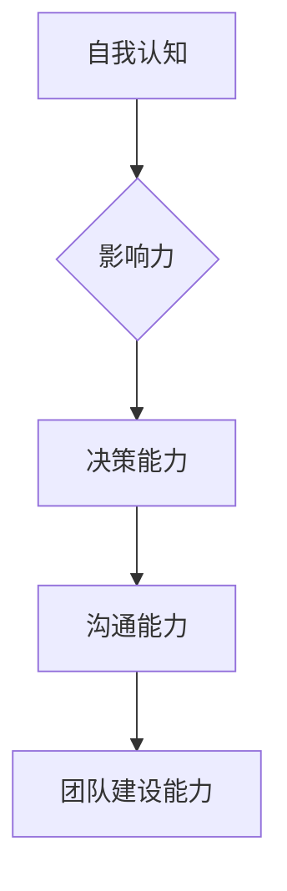

### 第2章 领导风格与团队文化

#### 2.1 领导风格的识别与适应

领导风格是领导者处理和管理团队的方式，不同的领导风格适用于不同的情境和团队。识别领导风格是提升领导力的第一步，领导者需要根据具体情境灵活调整自己的领导风格。

**识别领导风格的方法**：
- 自我评估问卷
- 360度反馈
- 同事和下属的观察

**适应领导风格的方法**：
- 了解团队成员的需求和期望
- 调整沟通方式和决策过程
- 增强团队凝聚力

#### 2.2 构建积极的团队文化

团队文化是团队共同价值观和行为模式的总和，对团队绩效和成员满意度有着深远的影响。构建积极的团队文化需要从以下几个方面入手：

- **价值观传播**：明确团队的核心价值观，并通过各种方式传播和强化。
- **激励与认可**：通过奖励和认可激发团队成员的积极性和创造力。
- **团队活动**：组织各种团队建设活动，增强团队凝聚力和合作精神。

**案例研究**：

一家科技公司通过以下措施成功构建了积极的团队文化：
- 设立“员工之星”奖项，每月评选一位表现出色的员工，并进行表彰。
- 定期举办团队建设活动，如团队聚餐、户外拓展等。
- 在公司内部建立开放、透明的沟通渠道，鼓励员工提出建议和反馈。

#### 2.3 团队沟通的重要性

沟通是领导力的核心要素之一，高效的沟通能够确保团队目标的一致性，提高决策效率，增强团队凝聚力。团队沟通的重要性体现在以下几个方面：

- **确保信息传递准确**：避免误解和误读，确保团队成员对任务和目标有清晰的认识。
- **促进团队协作**：通过有效的沟通，团队成员能够更好地协同工作，共同完成任务。
- **增强团队凝聚力**：积极的沟通能够增强团队成员之间的信任和合作精神。

**提高沟通效果的技巧**：

- **主动倾听**：不仅仅是听对方说什么，更重要的是理解对方的意图和感受。
- **清晰表达**：用简洁、明确的语言表达自己的观点和需求。
- **反馈与确认**：及时给予反馈，并确认对方是否理解自己的意思。

**Mermaid流程图**：

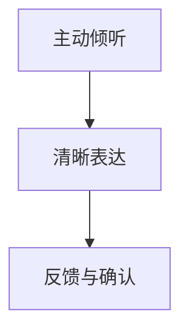

### 第二部分：核心领导技能

### 第3章 沟通技能

#### 3.1 有效沟通的要素

有效沟通是领导者必须掌握的核心技能之一。它包括以下几个关键要素：

- **明确的目标**：沟通前明确目的和目标，确保信息传递具有针对性。
- **倾听**：不仅仅是听对方说什么，更重要的是理解对方的意图和感受。
- **非语言沟通**：肢体语言、面部表情和语调等非语言因素在沟通中同样重要。
- **反馈与确认**：及时给予反馈，并确认对方是否理解自己的意思。

**核心概念**：
- **有效沟通**：清晰、准确、及时地传递和接收信息，以实现共同目标。

**Mermaid流程图**：

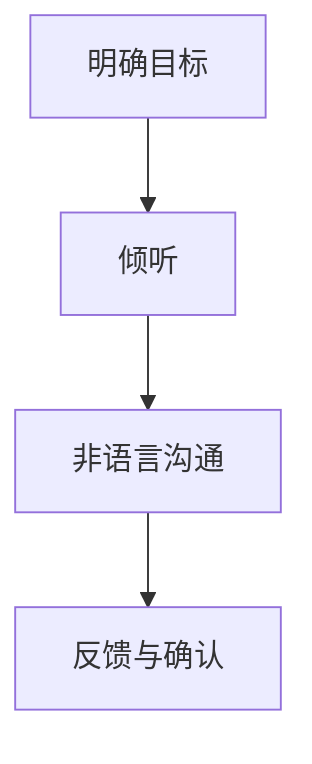

#### 3.2 提高沟通效果的技巧

为了提高沟通效果，领导者需要掌握一系列技巧：

- **积极倾听**：通过反馈和确认，确保理解对方的意图。
- **简明扼要**：用简洁、明确的语言表达观点，避免冗长和复杂的句子。
- **情境适应**：根据不同的沟通情境，调整沟通方式和内容。
- **使用故事和比喻**：用故事和比喻解释复杂的概念，使信息更加易于理解。

**案例研究**：

在一次团队会议上，项目经理小张面临一个复杂的决策。他决定使用故事法解释方案，通过一个简短的故事，团队成员很快就理解了决策的背景和重要性。

#### 3.3 情景模拟：沟通实战

为了更好地理解和应用沟通技能，我们可以通过以下情景模拟进行实战练习：

**情景**：项目团队面临一个紧急任务，需要在短时间内完成。项目经理需要召开紧急会议，传达任务要求并分配任务。

**步骤**：

1. **明确目标**：确认会议的目标是传达任务要求和分配任务。
2. **准备材料**：列出任务要求、目标和预期成果。
3. **开场白**：简要介绍会议目的和议程。
4. **倾听和反馈**：鼓励团队成员提问和表达意见，确保理解。
5. **分配任务**：根据团队成员的能力和经验，合理分配任务。
6. **总结和确认**：总结会议要点，确保团队成员理解任务要求。

通过这样的模拟练习，领导者可以更好地掌握沟通技能，提高沟通效果。

### 第4章 决策技能

#### 4.1 决策的原则与过程

决策是领导者日常工作中必不可少的一部分。有效的决策能力是衡量领导力的重要指标。决策过程通常包括以下几个原则和步骤：

**原则**：
- **信息充分**：在做出决策之前，确保拥有足够的信息和数据。
- **目标明确**：明确决策的目标和预期结果。
- **风险评估**：评估不同决策方案的潜在风险和收益。

**过程**：
1. **问题识别**：明确需要解决的问题或决策的情境。
2. **方案生成**：提出多种可能的解决方案。
3. **方案评估**：评估每个方案的优势和劣势。
4. **决策选择**：选择最优或最合适的方案。
5. **执行与监控**：执行决策方案，并对执行过程进行监控和调整。

**Mermaid流程图**：

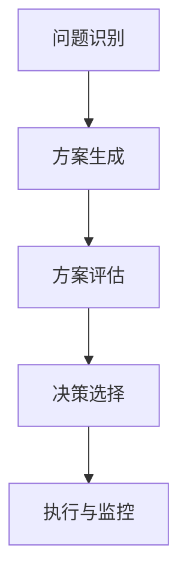

#### 4.2 决策模型与方法

在决策过程中，领导者可以借助多种决策模型和方法，以提高决策的准确性和效率。以下是一些常见的决策模型和方法：

- **成本效益分析**：评估不同方案的收益和成本，选择最具成本效益的方案。
- **SWOT分析**：分析项目的优势、劣势、机会和威胁，以制定相应的决策策略。
- **决策树**：通过树状图展示不同决策路径和结果，帮助选择最佳决策。

**案例研究**：

在一次市场扩张决策中，一家科技公司使用了SWOT分析来确定最佳市场进入策略。通过分析，他们发现该市场的机会在于新兴市场的增长潜力，而主要威胁则是竞争对手的强大。最终，他们选择了进入新兴市场的决策，并采取了相应的策略来应对劣势和抓住机会。

#### 4.3 决策案例分析

以下是一个关于领导力决策的实际案例：

**案例背景**：一家软件公司正面临一个关键决策，是否在某个新兴市场推出一款新的产品。市场部门认为该市场潜力巨大，但研发部门则担心资源不足。

**决策过程**：

1. **问题识别**：明确是否推出新产品的决策。
2. **方案生成**：
   - 方案一：立即推出新产品。
   - 方案二：推迟推出，增加研发投入。
3. **方案评估**：
   - 成本效益分析：方案一的短期收益较高，但长期风险较大；方案二虽然短期收益较低，但长期稳定。
   - SWOT分析：新兴市场机会大，但风险也高。
4. **决策选择**：最终决定采取方案二，推迟推出新产品，增加研发投入，以降低风险。
5. **执行与监控**：执行决策，并持续监控市场变化和项目进展。

通过这个案例，我们可以看到领导者如何通过决策模型和方法，在复杂情况下做出明智的决策。

### 第三部分：管理和领导项目与团队

### 第5章 项目管理基础

#### 5.1 项目生命周期

项目生命周期是项目管理的基础概念，通常包括以下几个阶段：

1. **启动阶段**：项目立项，明确项目目标和范围。
2. **计划阶段**：制定详细的项目计划，包括任务分配、时间表和预算。
3. **执行阶段**：按照计划执行项目任务，监控项目进度和质量。
4. **监控阶段**：监控项目执行情况，确保项目按计划进行。
5. **收尾阶段**：项目完成，进行总结和评估。

**核心概念**：
- **项目生命周期**：项目从启动到结束的整个过程。
- **阶段**：项目生命周期中的不同阶段，每个阶段都有特定的任务和目标。

**Mermaid流程图**：

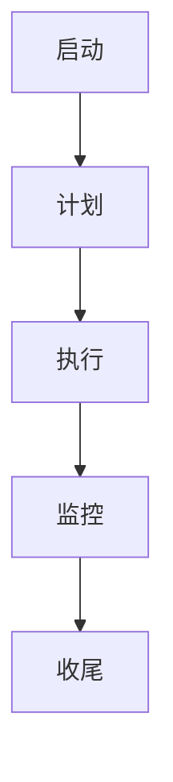

#### 5.2 项目规划与执行

项目规划是项目管理的关键环节，它包括以下步骤：

1. **需求分析**：明确项目需求和目标。
2. **资源分配**：确定所需的人力、物力和财力资源。
3. **时间表制定**：制定项目的时间计划和进度表。
4. **风险评估**：评估项目风险，并制定应对策略。

项目执行则是将项目规划付诸实践的过程，需要以下步骤：

1. **任务分配**：将任务分配给团队成员。
2. **进度监控**：监控任务执行进度，确保项目按计划进行。
3. **质量管理**：确保项目成果符合质量标准。
4. **沟通协调**：保持团队成员之间的有效沟通和协调。

**案例研究**：

一家建筑公司负责建造一座新的办公楼。在项目规划阶段，他们进行了详细的需求分析和资源分配，并制定了详细的时间表。在项目执行阶段，他们建立了项目管理团队，定期召开进度会议，确保项目按计划进行，并对遇到的问题进行及时解决。

#### 5.3 项目风险管理

项目风险管理是项目管理的重要组成部分，它包括以下步骤：

1. **风险识别**：识别项目中可能出现的风险。
2. **风险分析**：分析每个风险的可能性和影响。
3. **风险应对**：制定应对策略，降低风险的影响。
4. **风险监控**：持续监控项目风险，及时调整应对策略。

**核心概念**：
- **风险识别**：识别项目中的潜在风险。
- **风险分析**：分析风险的可能性和影响。
- **风险应对**：制定应对策略。

**Mermaid流程图**：

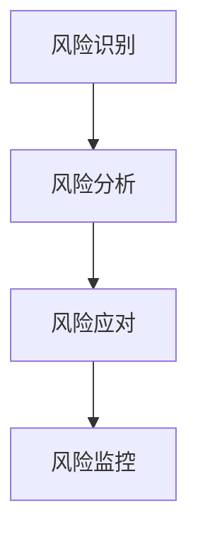

### 第6章 领导团队

#### 6.1 团队建设与成员激励

团队建设是领导团队的重要任务，它包括以下几个方面：

1. **建立团队目标**：明确团队的目标和使命，确保团队成员都朝着同一方向努力。
2. **加强团队协作**：鼓励团队成员之间的合作和交流，提高团队的整体效率。
3. **提升团队凝聚力**：通过团队活动和文化建设，增强团队成员之间的信任和凝聚力。

成员激励则是保持团队活力和动力的关键，它包括以下策略：

1. **认可与奖励**：对团队成员的成就和贡献给予认可和奖励，激发他们的积极性和创造力。
2. **职业发展**：提供职业发展和培训机会，帮助团队成员提升能力和实现个人目标。
3. **工作环境**：营造积极、健康的工作环境，提高团队成员的工作满意度和归属感。

**案例研究**：

一家科技公司通过以下措施成功建设了团队并激励成员：
- 每月举办团队建设活动，增强团队凝聚力。
- 设立“创新奖”，鼓励团队成员提出创新建议。
- 提供专业的培训和发展机会，帮助团队成员提升技能。

#### 6.2 领导力模型在团队管理中的应用

不同的领导力模型适用于不同的团队管理情境。以下是一些常见的领导力模型及其在团队管理中的应用：

- **情境领导模型**：根据团队成员的能力和需求，调整领导风格，以实现最佳效果。
- **变革领导模型**：在组织变革过程中，领导者需要具备引导和激励团队的能力。
- **变革领导模型**：在组织变革过程中，领导者需要具备引导和激励团队的能力。

**核心概念**：
- **情境领导模型**：根据团队成员的能力和需求调整领导风格。
- **变革领导模型**：在变革过程中，领导者需要具备引导和激励团队的能力。

**对比表格**：

| 领导力模型 | 适用场景 | 核心要素 |
| --- | --- | --- |
| 情境领导模型 | 不同能力和需求团队成员 | 领导风格调整 |
| 变革领导模型 | 组织变革期间 | 引导和激励团队 |

#### 6.3 团队冲突处理与解决

团队冲突是团队管理中的常见问题，处理不当可能导致团队效率低下和成员流失。以下是一些处理和解决团队冲突的策略：

1. **预防冲突**：通过明确的沟通和团队合作规则，减少冲突的发生。
2. **识别冲突**：及时发现和识别冲突，避免问题扩大。
3. **解决冲突**：通过对话和协商解决冲突，找到双方都能接受的解决方案。
4. **调解冲突**：在冲突无法自行解决时，由第三方进行调解。

**核心概念**：
- **预防冲突**：通过沟通和规则减少冲突。
- **识别冲突**：及时发现和识别冲突。
- **解决冲突**：通过对话和协商解决冲突。

**Mermaid流程图**：

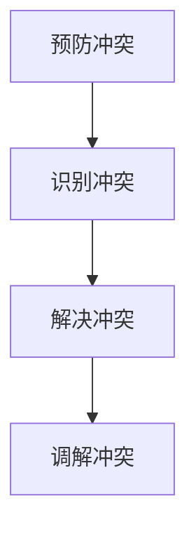

### 第四部分：应对组织动态

### 第7章 战略规划与执行

#### 7.1 组织战略概述

战略规划是组织长期发展的重要指南，它涉及组织的目标、愿景和实现这些目标的具体路径。战略规划通常包括以下几个步骤：

1. **环境分析**：分析外部环境和内部资源，确定组织面临的机遇和挑战。
2. **目标设定**：明确组织的长期和短期目标。
3. **战略选择**：根据环境分析和目标设定，选择合适的战略方案。
4. **实施与监控**：制定详细的实施计划，并持续监控和调整。

**核心概念**：
- **战略规划**：组织长期发展的重要指南。
- **环境分析**：分析外部环境和内部资源。
- **目标设定**：明确组织的长期和短期目标。

**Mermaid流程图**：

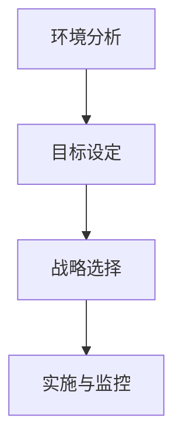

#### 7.2 战略规划的关键步骤

战略规划的关键步骤包括以下几个方面：

1. **愿景和使命**：明确组织的愿景和使命，为战略规划提供方向。
2. **SWOT分析**：分析组织的优势、劣势、机会和威胁，以制定有效的战略方案。
3. **目标设定**：根据组织愿景和SWOT分析，设定明确的长期和短期目标。
4. **战略方案**：选择合适的战略方案，并制定详细的实施计划。
5. **资源分配**：根据战略方案，合理分配资源，确保战略实施的可行性。

**案例研究**：

一家大型制造企业通过以下步骤成功制定了战略规划：
- 明确了组织的愿景和使命，强调了可持续发展。
- 进行了详细的SWOT分析，确定了竞争优势和市场机会。
- 设定了明确的长期和短期目标，如提高市场份额和提升产品质量。
- 根据目标选择了合适的战略方案，如市场扩张和产品创新。
- 合理分配资源，确保战略方案的实施。

#### 7.3 战略执行的有效方法

战略执行是将战略规划转化为实际行动的过程，它需要以下几个关键要素：

1. **领导力**：领导者需要具备坚定的信念和执行力，推动战略实施。
2. **团队协作**：建立高效的团队，确保各部门协同合作，共同推进战略目标。
3. **沟通与反馈**：确保信息的及时传递和反馈，确保战略执行中的问题能够得到及时解决。
4. **监控与调整**：持续监控战略执行情况，根据实际情况进行及时调整。

**核心概念**：
- **领导力**：推动战略实施的关键因素。
- **团队协作**：确保各部门协同合作。
- **沟通与反馈**：确保信息的及时传递和反馈。
- **监控与调整**：持续监控和调整战略执行。

**Mermaid流程图**：

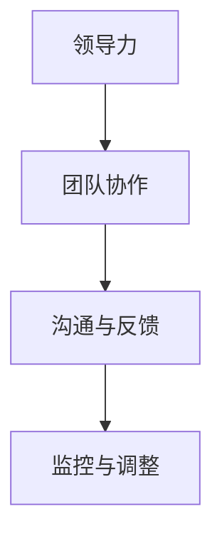

### 第8章 组织变革与领导力

#### 8.1 变革的驱动因素

组织变革是组织为了适应外部环境或内部需求而进行的重大调整。变革的驱动因素包括以下几个方面：

1. **市场变化**：市场环境的快速变化要求组织不断调整战略和结构。
2. **技术进步**：新技术的出现和应用推动组织进行技术更新和组织变革。
3. **竞争压力**：激烈的市场竞争迫使组织提升竞争力，进行变革。
4. **内部需求**：组织内部的效率提升、员工需求变化等也是推动变革的重要因素。

**核心概念**：
- **市场变化**：市场环境的快速变化。
- **技术进步**：新技术的出现和应用。
- **竞争压力**：激烈的市场竞争。
- **内部需求**：组织内部的效率提升和员工需求变化。

**对比表格**：

| 驱动因素 | 描述 | 影响因素 |
| --- | --- | --- |
| 市场变化 | 市场需求、竞争态势变化 | 竞争策略、客户需求 |
| 技术进步 | 新技术、新应用 | 研发能力、技术更新 |
| 竞争压力 | 市场竞争加剧 | 市场份额、盈利能力 |
| 内部需求 | 内部效率提升、员工需求 | 内部管理、员工满意度 |

#### 8.2 变革管理策略

成功的组织变革需要有效的管理策略，以下是一些关键的变革管理策略：

1. **明确变革目标**：明确变革的目标和愿景，确保团队成员对变革有清晰的认识。
2. **沟通与共识**：通过有效的沟通，确保团队成员理解变革的必要性和目标，形成共识。
3. **领导力**：领导者需要发挥关键作用，推动变革的实施，并激励团队成员积极参与。
4. **规划与实施**：制定详细的变革计划，确保变革的顺利实施。
5. **反馈与调整**：在变革过程中，持续收集反馈，根据实际情况进行及时调整。

**核心概念**：
- **明确变革目标**：确保团队成员对变革有清晰的认识。
- **沟通与共识**：形成团队成员的共识。
- **领导力**：领导者推动变革的实施。
- **规划与实施**：制定详细的变革计划。
- **反馈与调整**：持续收集反馈，进行调整。

**Mermaid流程图**：

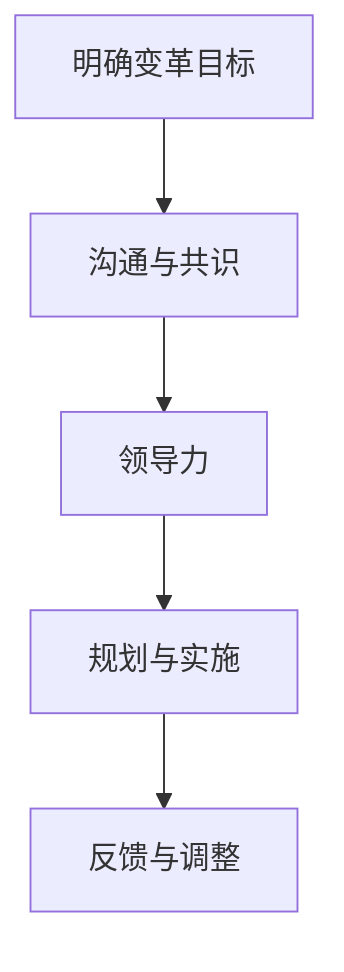

#### 8.3 变革中的领导力角色

在组织变革过程中，领导者的角色至关重要。领导者需要承担以下几个关键角色：

1. **变革推动者**：领导者需要积极推动变革，确保变革目标的实现。
2. **变革引导者**：领导者需要引导团队成员理解变革的必要性和目标，并激发他们的参与热情。
3. **变革监督者**：领导者需要监督变革的进程，确保变革计划的顺利实施。
4. **变革支持者**：领导者需要为团队成员提供支持和资源，帮助他们适应变革。

**核心概念**：
- **变革推动者**：推动变革目标的实现。
- **变革引导者**：引导团队成员理解变革。
- **变革监督者**：监督变革的进程。
- **变革支持者**：为团队成员提供支持。

**对比表格**：

| 领导力角色 | 描述 | 关键任务 |
| --- | --- | --- |
| 变革推动者 | 积极推动变革实施 | 确保目标实现 |
| 变革引导者 | 引导团队成员理解变革 | 激发参与热情 |
| 变革监督者 | 监督变革进程 | 确保计划实施 |
| 变革支持者 | 为团队成员提供支持 | 帮助适应变革 |

### 第五部分：领导实践

### 第9章 领导力实践案例

#### 9.1 案例研究：成功的领导实践

以下是一个关于成功的领导实践的案例研究：

**案例背景**：一家新兴科技公司面临激烈的市场竞争，需要在短时间内推出一款创新产品，以保持竞争优势。

**领导实践**：

1. **明确目标**：公司领导层明确了推出创新产品的目标，并制定了详细的时间表和计划。
2. **团队建设**：领导层通过选拔和培训，组建了一支高效的团队，确保团队成员具备必要的技能和经验。
3. **激励与认可**：领导层通过奖励和认可，激发了团队成员的积极性和创造力。
4. **沟通与协调**：领导层建立了高效的沟通机制，确保团队成员之间的信息传递和协作。
5. **持续监控与反馈**：领导层持续监控项目进展，并根据实际情况进行及时调整和反馈。

**成功原因**：

- 明确的目标和详细的计划确保了项目的有序推进。
- 高效的团队建设和激励机制提高了团队成员的积极性和创造力。
- 高效的沟通机制和持续的监控与反馈确保了项目按计划进行，并及时解决遇到的问题。

#### 9.2 案例分析：失败中的领导教训

以下是一个关于领导力失败的案例分析：

**案例背景**：一家传统制造企业在数字化转型的过程中遇到了严重的问题，导致项目失败。

**领导实践**：

1. **缺乏明确的目标和规划**：企业在数字化转型过程中缺乏明确的目标和详细的规划，导致项目实施过程中出现混乱和不确定性。
2. **团队建设不足**：企业未能有效选拔和培训适应数字化转型的团队成员，导致团队能力不足。
3. **沟通不畅**：企业内部沟通不畅，导致团队成员对项目目标和进展缺乏清晰的认识。
4. **缺乏持续监控与反馈**：企业在项目实施过程中缺乏持续的监控和反馈，导致问题未能及时发现和解决。

**失败原因**：

- 缺乏明确的目标和规划导致项目混乱和不确定性。
- 团队建设不足导致团队能力不足。
- 沟通不畅导致团队成员对项目缺乏清晰认识。
- 缺乏持续监控与反馈导致问题未能及时发现和解决。

**教训**：

- 明确目标和规划是项目成功的关键。
- 高效的团队建设和沟通机制是项目成功的基础。
- 持续监控与反馈是确保项目顺利进行的重要手段。

#### 9.3 领导实践反思

通过以上案例研究，我们可以看到成功的领导实践和失败的领导教训。成功的领导实践通常具备以下几个特点：

1. **明确的目标和详细的规划**：明确的目标和详细的规划有助于确保项目的有序推进。
2. **高效的团队建设和激励机制**：高效的团队建设和激励机制能够提高团队的积极性和创造力。
3. **良好的沟通机制**：良好的沟通机制能够确保团队成员之间的信息传递和协作。
4. **持续的监控与反馈**：持续的监控与反馈能够确保项目按计划进行，并及时解决遇到的问题。

失败的领导教训则提醒我们，缺乏明确的目标和规划、团队建设不足、沟通不畅和缺乏持续监控与反馈是导致项目失败的主要原因。因此，在领导实践中，领导者需要时刻反思和改进自己的领导方式，以提高领导力水平，确保项目的成功。

### 第10章 领导力自我提升

#### 10.1 自我评估与反馈

自我评估是领导力自我提升的重要步骤。通过自我评估，领导者可以识别自己的优势和不足，制定改进计划。以下是一些自我评估的方法：

1. **360度反馈**：收集来自同事、下属和上级的反馈，全面了解自己的表现。
2. **个人反思**：定期进行个人反思，回顾自己的行为和决策，识别需要改进的地方。
3. **评估工具**：使用专业的领导力评估工具，如MBTI、DISC等，了解自己的领导风格和特点。

**核心概念**：
- **自我评估**：识别自己的优势和不足。
- **反馈**：收集多方面的反馈，以更全面地了解自己。

**Mermaid流程图**：

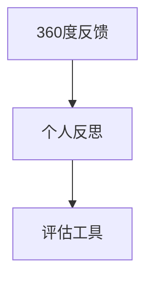

#### 10.2 个人成长计划

制定个人成长计划是领导力提升的关键步骤。以下是一个典型的个人成长计划：

1. **设定目标**：明确自己的长期和短期目标，如提升某个领域的专业知识或技能。
2. **制定策略**：制定实现目标的策略，如参加培训课程、阅读相关书籍或参加工作坊。
3. **行动步骤**：将策略分解为具体的行动步骤，并设定完成时间。
4. **评估与调整**：定期评估成长计划的执行情况，并根据实际情况进行调整。

**核心概念**：
- **个人成长计划**：设定目标、制定策略、行动步骤和评估调整。

**Mermaid流程图**：

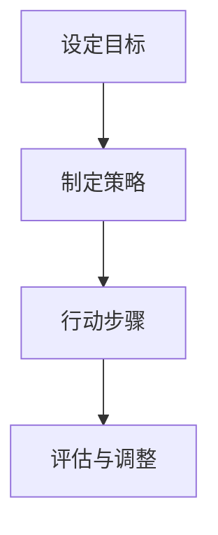

#### 10.3 领导力发展资源

为了提升领导力，领导者可以利用多种资源进行学习和实践。以下是一些常用的领导力发展资源：

1. **领导力书籍**：阅读经典的领导力书籍，如《领导力五要素》、《影响力》等，获取理论知识。
2. **培训课程**：参加专业的领导力培训课程，如领导力提升课程、项目管理课程等，提升实践能力。
3. **工作坊和研讨会**：参加领导力工作坊和研讨会，与其他领导者交流经验和心得。
4. **在线资源**：利用在线资源，如博客、视频课程、在线论坛等，获取最新的领导力资讯和技巧。

**核心概念**：
- **领导力书籍**：获取理论知识。
- **培训课程**：提升实践能力。
- **工作坊和研讨会**：交流经验和心得。
- **在线资源**：获取最新的领导力资讯和技巧。

**Mermaid流程图**：

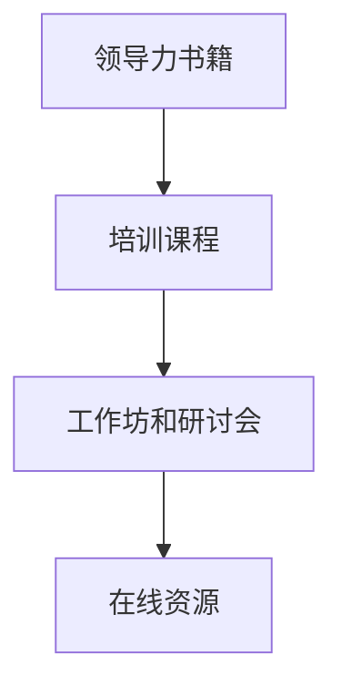

### 第六部分：持续改进与发展

#### 第11章 领导力持续发展

#### 11.1 持续学习的价值

在快速变化的商业环境中，领导力需要不断更新和发展。持续学习是领导者保持竞争力的关键。以下是一些持续学习的价值：

1. **知识更新**：通过持续学习，领导者可以掌握最新的行业趋势和前沿技术，保持知识的更新。
2. **技能提升**：持续学习有助于领导者提升沟通、决策、团队管理等核心技能。
3. **创新思维**：持续学习能够激发领导者的创新思维，推动组织创新和变革。
4. **适应能力**：持续学习帮助领导者更好地适应变化，应对各种挑战。

**核心概念**：
- **持续学习**：保持竞争力的关键。
- **知识更新**：掌握行业趋势和前沿技术。
- **技能提升**：提升核心技能。
- **创新思维**：激发创新思维。
- **适应能力**：应对各种挑战。

**Mermaid流程图**：

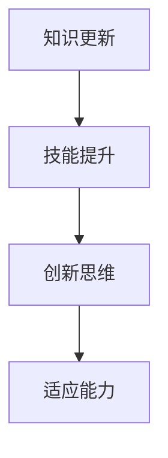

#### 11.2 培养领导力的人才发展策略

为了提升组织整体的领导力水平，组织需要制定有效的人才发展策略。以下是一些关键策略：

1. **领导力培训**：为领导者提供专业的领导力培训，帮助他们提升管理技能和领导能力。
2. **导师制度**：建立导师制度，让经验丰富的领导者指导新晋领导者，分享经验和教训。
3. **轮岗机会**：为领导者提供轮岗机会，让他们在不同部门和职位上锻炼和提升能力。
4. **反馈与评估**：定期收集领导者的反馈和评估，识别优势和不足，制定改进计划。

**核心概念**：
- **领导力培训**：提升管理技能和领导能力。
- **导师制度**：经验分享和指导。
- **轮岗机会**：不同部门和职位上的锻炼。
- **反馈与评估**：识别优势和不足。

**Mermaid流程图**：

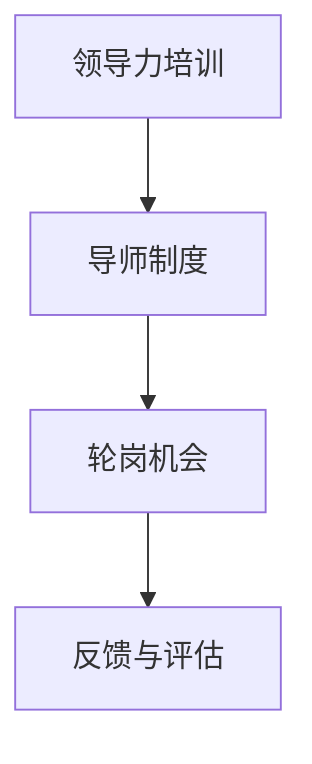

#### 11.3 领导力发展的最佳实践

以下是一些领导力发展的最佳实践，这些实践可以帮助领导者不断提升自己的领导能力：

1. **设定明确的目标**：领导者需要明确自己的职业目标和发展方向，并制定实现这些目标的策略。
2. **不断学习与反思**：领导者需要保持学习的热情，不断更新自己的知识和技能，并通过反思不断提升自我。
3. **积极寻求反馈**：领导者需要主动寻求反馈，了解自己的优点和不足，并根据反馈进行改进。
4. **建立良好的人际关系**：领导者需要建立和维护良好的人际关系，提升沟通和协调能力。
5. **勇于承担责任**：领导者需要勇于承担责任，面对挑战和困难，带领团队共同克服。

**核心概念**：
- **设定明确的目标**：明确职业目标和发展方向。
- **不断学习与反思**：更新知识和技能。
- **积极寻求反馈**：识别优势和不足。
- **建立良好的人际关系**：提升沟通和协调能力。
- **勇于承担责任**：面对挑战和困难。

**Mermaid流程图**：

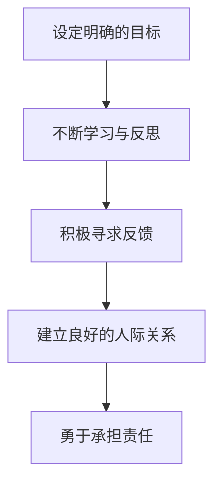

### 结论

领导力是项目总监向管理者转型的关键。通过理解领导力的核心概念和技能，掌握项目管理和团队领导的策略，领导者可以更有效地发挥领导力，提升团队绩效和组织效能。持续学习和实践是提升领导力的关键，领导者需要不断更新自己的知识和技能，积极寻求反馈，勇于承担责任，以应对快速变化的商业环境。

### 书籍总结与建议

本书系统地阐述了领导力的基础、核心技能、项目管理和团队领导策略，以及组织动态和领导实践。通过学习本书，读者可以：

1. **理解领导力的核心概念**：掌握领导力的定义、类型和要素。
2. **提升核心领导技能**：学会有效沟通、决策和团队管理。
3. **掌握项目管理技巧**：了解项目生命周期、规划和风险管理。
4. **应对组织动态**：学习战略规划、组织变革和领导实践。
5. **持续提升领导力**：通过自我评估、个人成长计划和领导力发展资源，不断提升自己的领导能力。

### 附录

#### 附录A：领导力发展工具

1. **领导力评估工具**：如360度反馈、MBTI、DISC等。
2. **领导力培训课程**：如领导力提升课程、项目管理课程等。
3. **在线资源**：如领导力博客、视频课程、在线论坛等。

#### 附录B：推荐阅读

1. **《领导力五要素》**：Stephen R. Covey
2. **《影响力》**：Robert B. Cialdini
3. **《创新者的窘境》**：Clayton M. Christensen
4. **《高效能人士的七个习惯》**：Stephen R. Covey

### 词汇表

1. **领导力**：影响和激励他人达成共同目标的能力。
2. **项目总监**：负责项目整体规划和执行的高级管理人员。
3. **管理者**：负责资源规划、任务分配和绩效评估的专业人员。
4. **团队建设**：通过一系列活动和方法，提高团队的协作能力和凝聚力。
5. **战略规划**：组织长期发展的重要指南，涉及目标设定和路径选择。
6. **变革管理**：在组织变革过程中，确保变革顺利实施的过程。

### 索引

1. 领导力
2. 项目总监
3. 管理者
4. 团队建设
5. 战略规划
6. 变革管理
7. 有效沟通
8. 决策技能
9. 项目管理
10. 持续学习
11. 领导实践
12. 领导力发展资源

### 作者

作者：AI天才研究院/AI Genius Institute & 禅与计算机程序设计艺术 /Zen And The Art of Computer Programming

### 结语

本文旨在为项目总监向管理者转型的过程中提供一本系统的领导力修炼手册。通过深入剖析领导力的核心概念和技能，解析项目管理和团队领导的策略，本书帮助读者掌握从项目总监到管理者转变所需的理论知识和实践技巧，助力其在职场中更有效地发挥领导力，提升团队绩效和组织效能。希望读者能够将所学应用于实际工作中，不断提升自己的领导力水平。

