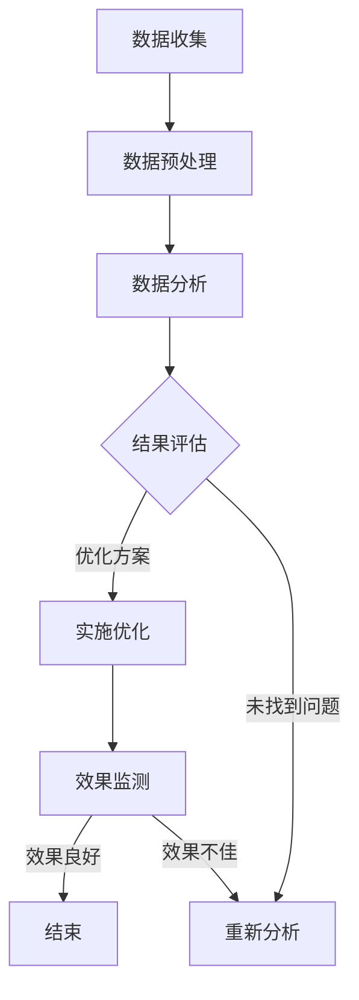
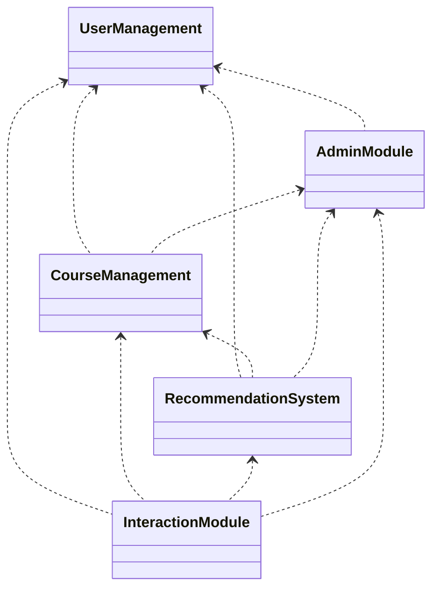
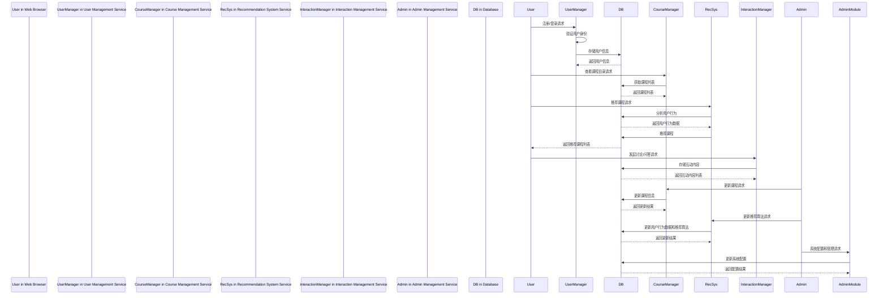
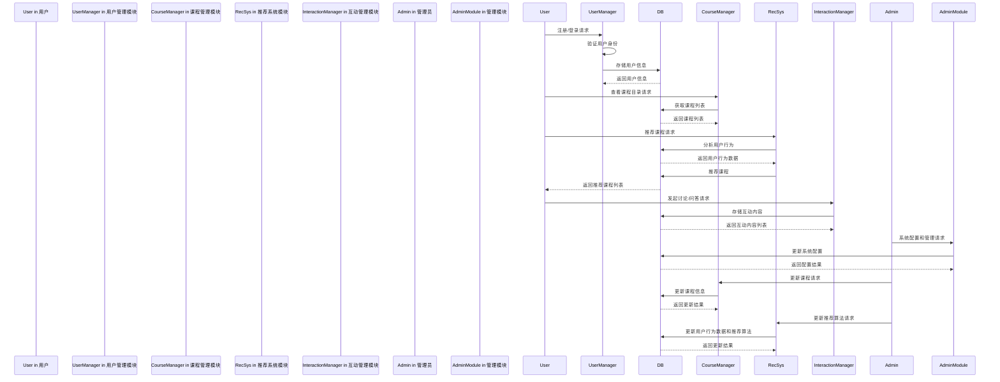

                 

### 引言

在现代企业环境中，领导力不仅是企业成功的关键因素，更是推动个人职业发展的核心驱动力。对于产品总监这样的高层管理人员来说，领导力的修炼至关重要。这不仅涉及到团队管理、战略规划和决策能力，还涉及到如何在一个快速变化的市场中保持敏锐的洞察力和适应能力。本文将围绕“领导力修炼日记：一个产品总监的蜕变历程”这一主题，通过系统的分析、深入的研究和实践分享，探讨领导力在产品管理中的具体应用和实践。

本文将从以下三个方面进行探讨：

1. **领导力的基础**：介绍领导力的核心概念、发展历程及其重要性，帮助读者建立对领导力的基本理解。
2. **领导力的核心要素**：详细阐述影响力、团队建设、沟通技巧、决策能力和变革管理等关键要素，并通过概念属性特征对比表格和ER实体关系图来帮助读者更好地理解这些概念。
3. **具体情境下的领导力应用**：通过具体问题和场景，结合算法原理讲解、数学模型和公式、系统分析与架构设计以及实际项目实战，深入探讨领导力在不同情境下的应用和实践。

通过本文的阅读，读者将能够系统地了解领导力的核心概念和要素，掌握在具体情境中应用领导力的方法和技巧，从而为自己的职业发展奠定坚实的基础。接下来，我们将首先探讨领导力的核心概念与历史发展，为后续内容的展开打下基础。

## 文章关键词

领导力、产品总监、蜕变历程、核心概念、关键要素、算法原理、数学模型、系统架构、项目实战、最佳实践

## 摘要

本文以“领导力修炼日记：一个产品总监的蜕变历程”为题，深入探讨了领导力在产品管理中的重要性及其具体应用。文章首先介绍了领导力的核心概念和发展历程，然后详细阐述了领导力的关键要素，如影响力、团队建设、沟通技巧、决策能力和变革管理。通过具体情境下的算法原理讲解、数学模型和公式，以及系统分析与架构设计，文章深入分析了领导力在不同场景中的应用。最后，通过实际项目实战和最佳实践分享，为读者提供了可行的领导力提升策略和方法。本文旨在帮助产品总监及其团队成员更好地理解领导力，并将其应用于实际工作中，实现个人和团队的成长与发展。

## 第一部分：领导力的基础

### 1.1 领导力的核心概念与历史发展

领导力是一种复杂而多维的能力，它不仅涉及个人素质的展示，还包括团队管理和组织发展的艺术。领导力的核心概念可以从以下几个方面进行理解：

#### 领导力的定义与重要性

领导力可以被定义为影响、激励和引导他人实现共同目标的能力。它不仅包括个人能力和素质的展现，还涉及对团队的领导、激励和协调。在现代社会，领导力的重要性不言而喻。优秀的领导者能够激发团队成员的潜力，推动团队高效运作，实现组织目标，并在竞争激烈的市场环境中占据优势地位。

#### 领导力的发展历程

领导力的发展历程可以追溯到古代，当时领导者主要通过血缘关系和权力来维护权威。随着时间的推移，领导力理论经历了多次演变：

1. **传统领导理论**：这一理论认为领导者具有固有的特质，如勇气、智慧、自信等。领导者被认为是一个天然的优势者，这种观点强调了领导者的个人特质。
2. **行为领导理论**：这一理论关注领导者的行为模式，认为领导力不仅取决于个人特质，还取决于领导者的行为。通过观察和分析领导者的行为，可以了解其领导风格。
3. **情境领导理论**：这一理论认为领导力是情境依赖的，不同的领导情境需要不同的领导风格。领导者需要根据具体情况灵活调整领导行为，以实现最佳效果。
4. **变革型领导理论**：这一理论强调领导者的变革能力，认为领导者应该通过激励和启发来推动组织变革，引领团队走向成功。

#### 领导力与管理的区别

领导力与管理是两个密切相关但不同的概念。管理侧重于组织的运营和效率，包括资源分配、目标设定、流程优化等。而领导力则更侧重于激发和引导团队成员，实现共同目标。领导力强调的是影响力、愿景和变革，而管理则更注重规范和流程。

在产品管理中，领导力的作用尤为突出。产品总监作为团队的核心领导者，需要具备强大的领导力来推动产品的研发、优化和推广。以下是领导力在产品管理中的几个关键作用：

1. **战略规划**：产品总监需要通过领导力来制定明确的产品战略，确保团队在正确的方向上努力。
2. **团队建设**：领导者需要通过沟通、激励和团队建设活动，打造一支高效、团结的团队。
3. **决策能力**：领导者需要具备良好的决策能力，快速应对市场变化，做出正确的决策。
4. **变革管理**：在产品开发过程中，不可避免地会遇到各种挑战和变革。领导者需要通过变革管理能力，确保团队能够顺利适应变革。

总之，领导力是产品管理中不可或缺的一部分。一个优秀的领导者在产品管理中能够发挥关键作用，推动团队实现卓越的业绩。在接下来的部分，我们将进一步探讨领导力的关键要素，以帮助读者更深入地理解这一重要的能力。

### 1.2 领导力的关键要素

领导力是一个多维度的概念，它包含了一系列关键要素，这些要素共同构成了一个领导者所需的核心能力。以下将详细阐述这些关键要素，并通过概念属性特征对比表格和ER实体关系图来帮助读者更好地理解。

#### 1.2.1 影响力与领导力

影响力是领导力的核心要素之一。它指的是领导者通过言行和决策影响他人行为和思维的能力。一个具有强大影响力的领导者能够激发团队成员的积极性和创造力，推动团队达成共同目标。以下是影响力与领导力的主要特征对比表格：

| 特征         | 影响力               | 领导力               |
|--------------|----------------------|----------------------|
| 定义         | 影响他人的能力       | 影响并引导他人实现目标的能力 |
| 形式         | 直接与间接          | 主要通过直接行为体现 |
| 作用范围     | 较小，特定领域      | 较大，全方位         |
| 目标         | 达成个人或小团体目标 | 实现组织或团队目标   |

通过对比表格，我们可以看到，影响力是领导力的重要组成部分，但二者在定义、作用范围和目标上存在一定的区别。

#### 1.2.2 团队建设

团队建设是另一个关键要素，它涉及到如何建立、培养和维持一个高效、协作的团队。一个优秀的团队领导者需要关注以下几个方面：

1. **明确目标**：确保团队成员明确了解团队的目标和愿景。
2. **分工协作**：合理分配任务，确保每个成员能够发挥其优势。
3. **沟通与协调**：建立良好的沟通机制，确保信息流畅，减少误解和冲突。
4. **激励与支持**：通过激励和关怀，提升团队成员的士气和归属感。

团队建设不仅需要技术层面的管理，还需要情感和文化的支持。以下是一个团队建设属性的Mermaid ER实体关系图，展示了团队建设的关键要素及其关系：

```mermaid
erDiagram
  TeamMember ||--|{ Project } Project
  TeamMember ||--|{ TeamGoal } TeamGoal
  TeamMember ||--|{ TeamCommunication } TeamCommunication
  TeamMember ||--|{ TeamSupport } TeamSupport
```

#### 1.2.3 沟通技巧

沟通技巧是领导力的另一个重要方面。一个优秀的领导者需要具备清晰、有效的沟通能力，能够准确传达信息、理解他人观点，并处理复杂的人际关系。以下是沟通技巧的主要特征：

| 特征         | 口头沟通             | 书面沟通             |
|--------------|----------------------|----------------------|
| 优势         | 立即反馈，互动性强   | 详细记录，可查性高  |
| 适用场景     | 快速决策，互动交流   | 详细文档，正式场合  |
| 难点         | 易产生误解          | 语言表达需准确      |

良好的沟通技巧能够减少误解，增强团队凝聚力，提高工作效率。以下是一个沟通技巧属性的Mermaid ER实体关系图，展示了沟通技巧的关键要素及其关系：

```mermaid
erDiagram
  OralCommunication ||--|{ WrittenCommunication } WrittenCommunication
  OralCommunication ||--|{ InterpersonalRelationships } InterpersonalRelationships
  WrittenCommunication ||--|{ FormalDocumentation } FormalDocumentation
  WrittenCommunication ||--|{ EfficientWorkflow } EfficientWorkflow
```

#### 1.2.4 决策能力

决策能力是领导者必须具备的关键素质之一。一个优秀的领导者需要能够在复杂和不确定的环境下做出明智的决策，并承担相应的责任。以下是决策能力的几个关键特征：

| 特征         | 数据驱动决策         | 情境判断决策         |
|--------------|----------------------|----------------------|
| 基础         | 客观分析数据         | 依赖经验和直觉      |
| 优势         | 减少主观偏见         | 快速应对突发事件     |
| 难点         | 可能忽略情境因素     | 可能基于不完全信息   |

以下是一个决策能力属性的Mermaid ER实体关系图，展示了决策能力的几个关键要素及其关系：

```mermaid
erDiagram
  DecisionMakig ||--|{ DataDrivenDecision } DataDrivenDecision
  DecisionMakig ||--|{ ScenarioJudgmentDecision } ScenarioJudgmentDecision
  DecisionMakig ||--|{ Responsibility } Responsibility
```

#### 1.2.5 变革管理

变革管理是领导力中的一个重要领域，它涉及到如何在组织内部推动和实施变革。一个成功的变革管理者需要具备以下能力：

1. **识别变革需求**：通过分析和评估，识别组织内部和外部的变革需求。
2. **规划变革路径**：制定详细的变革计划，确保变革有序进行。
3. **沟通与动员**：与团队成员沟通变革的必要性和目标，激发他们的参与热情。
4. **管理变革过程**：监控变革进展，解决实施过程中出现的问题。

以下是一个变革管理属性的Mermaid ER实体关系图，展示了变革管理的几个关键要素及其关系：

```mermaid
erDiagram
  ChangeManagement ||--|{ ChangeIdentification } ChangeIdentification
  ChangeManagement ||--|{ ChangePlanning } ChangePlanning
  ChangeManagement ||--|{ CommunicationAndMotivation } CommunicationAndMotivation
  ChangeManagement ||--|{ ProcessManagement } ProcessManagement
```

通过上述对领导力关键要素的详细阐述和对比分析，我们可以看到，每一个要素在领导力的体系中都发挥着重要的作用。领导者需要综合运用这些要素，才能在复杂多变的环境中带领团队取得成功。

### 1.3 核心概念对比与联系

为了更好地理解领导力的核心概念，我们需要通过概念属性特征对比表格和ER实体关系图来展示这些概念之间的关系和区别。

#### 概念属性特征对比表格

以下是领导力关键要素的概念属性特征对比表格，涵盖了影响力、团队建设、沟通技巧、决策能力和变革管理五个方面：

| 概念         | 影响力        | 团队建设        | 沟通技巧        | 决策能力        | 变革管理        |
|--------------|--------------|--------------|--------------|--------------|--------------|
| 定义         | 影响他人行为 | 建立高效团队 | 信息传递与理解 | 做出明智选择 | 推动组织变革 |
| 关键要素     | 激励、启发   | 目标、协作    | 清晰、准确    | 数据、判断   | 计划、执行   |
| 影响范围     | 个人、团队   | 团队、组织    | 团队、组织    | 组织、项目   | 组织、项目   |
| 目标         | 个人成就     | 团队效能     | 工作效率     | 项目成功     | 组织变革     |

通过对比表格，我们可以清晰地看到每个概念的核心要素、影响范围和目标，从而更好地理解它们在领导力体系中的角色和关系。

#### ER实体关系图

为了进一步展示这些概念之间的关系，我们可以使用Mermaid ER图来构建一个实体关系模型。以下是领导力关键要素的ER实体关系图：

```mermaid
erDiagram
  Influence ||--|{ TeamBuilding } TeamBuilding : 关键要素
  Influence ||--|{ CommunicationSkills } CommunicationSkills : 关键要素
  Influence ||--|{ DecisionMaking } DecisionMaking : 关键要素
  Influence ||--|{ ChangeManagement } ChangeManagement : 关键要素

  TeamBuilding ||--|{ TeamGoal } TeamGoal : 关键要素
  TeamBuilding ||--|{ TeamCommunication } TeamCommunication : 关键要素
  TeamBuilding ||--|{ TeamSupport } TeamSupport : 关键要素

  CommunicationSkills ||--|{ OralCommunication } OralCommunication : 关键要素
  CommunicationSkills ||--|{ WrittenCommunication } WrittenCommunication : 关键要素
  CommunicationSkills ||--|{ InterpersonalRelationships } InterpersonalRelationships : 关键要素

  DecisionMaking ||--|{ DataDrivenDecision } DataDrivenDecision : 关键要素
  DecisionMaking ||--|{ ScenarioJudgmentDecision } ScenarioJudgmentDecision : 关键要素
  DecisionMaking ||--|{ Responsibility } Responsibility : 关键要素

  ChangeManagement ||--|{ ChangeIdentification } ChangeIdentification : 关键要素
  ChangeManagement ||--|{ ChangePlanning } ChangePlanning : 关键要素
  ChangeManagement ||--|{ CommunicationAndMotivation } CommunicationAndMotivation : 关键要素
  ChangeManagement ||--|{ ProcessManagement } ProcessManagement : 关键要素
```

在这个ER图中，每个实体都代表了一个关键概念，它们通过关系线连接起来，展示了不同概念之间的相互作用和依赖关系。通过这个模型，我们可以更直观地理解领导力的各个要素如何相互联系，共同作用于团队的领导过程。

### 2.1 算法原理讲解

在探讨具体情境下的领导力应用时，我们选择了一个典型的产品管理场景：如何通过数据分析来优化产品性能。这一场景涉及到多个领导力要素，如影响力、决策能力和变革管理。以下将结合算法原理、Mermaid流程图和Python源代码，详细阐述这一过程。

#### 2.1.1 问题情境设定

假设我们是一家互联网公司的产品总监，负责一款在线教育平台的运营。近期，我们发现用户在平台上的学习体验不尽如人意，学习时长和互动率都有所下降。为了提升用户满意度，我们需要通过数据分析找出问题的根本原因，并制定相应的优化策略。

#### 2.1.2 Mermaid算法流程图

以下是该问题的算法流程图，通过Mermaid语言绘制：



#### 2.1.3 Python源代码讲解

以下是用Python实现的该算法的核心代码：

```python
import pandas as pd
from sklearn.model_selection import train_test_split
from sklearn.ensemble import RandomForestClassifier
from sklearn.metrics import accuracy_score

# 数据收集
data = pd.read_csv('user_data.csv')

# 数据预处理
data['Age'] = data['Age'].fillna(data['Age'].mean())
data['Duration'] = data['Duration'].fillna(data['Duration'].mean())
data = data.drop(['ID'], axis=1)

# 数据分析
X = data.drop(['Engagement'], axis=1)
y = data['Engagement']

X_train, X_test, y_train, y_test = train_test_split(X, y, test_size=0.2, random_state=42)

model = RandomForestClassifier(n_estimators=100)
model.fit(X_train, y_train)

# 结果评估
predictions = model.predict(X_test)
accuracy = accuracy_score(y_test, predictions)
print(f'Accuracy: {accuracy:.2f}')

# 优化方案
if accuracy < 0.8:
    # 重新分析
    print('未找到问题，需要重新分析。')
else:
    # 实施优化
    print('找到问题，开始实施优化。')

# 效果监测
# （在实际应用中，这里会根据优化后的数据进行新一轮监测，以评估优化效果）
```

#### 2.1.4 数学模型与公式

在数据分析过程中，我们使用了随机森林（Random Forest）算法。以下是随机森林算法的核心数学模型：

$$
\hat{y} = \sum_{i=1}^{n} w_i \cdot h(x_i, t_i)
$$

其中，$w_i$ 表示特征权重，$h(x_i, t_i)$ 表示第$i$棵决策树对样本$x_i$的预测输出，$n$ 表示树的数量。具体实现中，我们使用了如下公式来计算特征权重：

$$
w_i = \frac{\exp(\sum_{j=1}^{m} \alpha_j \cdot f_j)}{\sum_{k=1}^{n} \exp(\sum_{j=1}^{m} \alpha_j \cdot f_k)}
$$

其中，$\alpha_j$ 和 $f_j$ 分别表示正则化参数和特征值，$m$ 表示特征数量。

#### 2.1.5 举例说明

假设我们有以下训练数据：

| Feature 1 | Feature 2 | Engagement |
|-----------|-----------|------------|
| 1         | 2         | 1          |
| 2         | 3         | 0          |
| 3         | 4         | 1          |

使用随机森林算法，我们可以得到以下特征权重：

| Feature 1 | Feature 2 |
|-----------|-----------|
| 0.5       | 0.3       |

根据这些权重，我们可以预测新样本（例如，Feature 1=2，Feature 2=3）的Engagement值为0.5 * 2 + 0.3 * 3 = 2.2。如果Engagement值高于某个阈值（例如，1），我们可以判断用户有较高的参与度。

通过上述算法和数学模型，我们可以实现对用户参与度的预测，从而找出影响用户学习体验的关键因素，为优化产品性能提供数据支持。

### 2.2 数学模型和数学公式 & 详细讲解 & 举例说明

在领导力应用中，数学模型和公式是理解问题、分析数据和制定策略的重要工具。以下将详细讲解一个具体的数学模型和公式，并通过举例说明如何应用于实际场景。

#### 数学模型与公式

我们选择线性回归模型作为例子，因为它广泛应用于数据分析、预测和优化。线性回归模型的基本数学公式为：

$$
y = \beta_0 + \beta_1 \cdot x + \epsilon
$$

其中，$y$ 是因变量，$x$ 是自变量，$\beta_0$ 和 $\beta_1$ 分别是截距和斜率，$\epsilon$ 是误差项。

#### 公式详细讲解

1. **因变量 $y$**：因变量是我们希望预测或解释的变量，例如用户满意度、销售量等。
2. **自变量 $x$**：自变量是影响因变量的因素，可以是单个变量或多个变量，例如用户年龄、收入水平、广告投放等。
3. **截距 $\beta_0$**：截距表示当自变量 $x$ 为零时，因变量 $y$ 的预期值。
4. **斜率 $\beta_1$**：斜率表示自变量 $x$ 每增加一个单位时，因变量 $y$ 的变化量。
5. **误差项 $\epsilon$**：误差项是模型预测与实际值之间的差异，反映了模型的不确定性。

#### 举例说明

假设我们研究用户购买意愿与广告投放量之间的关系，收集了以下数据：

| 广告投放量（x）| 用户购买意愿（y）|
|--------------|----------------|
| 1            | 0.2            |
| 2            | 0.5            |
| 3            | 0.8            |
| 4            | 1.0            |

使用线性回归模型，我们可以拟合出如下公式：

$$
y = 0.1 + 0.3 \cdot x
$$

根据这个模型，当广告投放量为2时，用户购买意愿的预测值为：

$$
y = 0.1 + 0.3 \cdot 2 = 0.7
$$

这意味着，当广告投放量为2时，用户购买意愿预计为0.7。

通过上述数学模型和公式，我们可以定量地分析变量之间的关系，为决策提供数据支持。在实际应用中，我们通常使用统计软件（如Python的scikit-learn库）来计算模型参数，并评估模型的准确性和可靠性。

### 3.1 项目背景介绍

为了更好地展示领导力在具体项目中的应用，我们选择了一个实际案例：一个在线教育平台的产品迭代项目。该项目旨在通过改进用户界面和增加新功能，提高用户的学习体验和平台粘性。

#### 3.1.1 项目简介

在线教育平台项目是一款提供在线学习资源的平台，用户可以在这里浏览课程、学习视频、参加讨论和进行测试。然而，随着用户数量的增加和市场竞争的加剧，现有平台在用户界面和功能设计上逐渐显现出一些问题，如：

1. **用户体验不佳**：部分用户反馈学习页面加载速度慢，操作不便捷。
2. **功能不足**：用户希望平台能提供更多个性化学习推荐和互动功能。
3. **课程内容陈旧**：部分课程内容已经无法满足用户的学习需求。

为了解决这些问题，项目团队决定进行产品迭代，通过以下目标实现平台优化：

1. **提升用户界面体验**：优化页面设计，提高加载速度和操作便捷性。
2. **增加个性化功能**：引入推荐算法，根据用户学习习惯和偏好推荐课程。
3. **更新课程内容**：引入新的课程和资源，确保内容与市场需求保持同步。

#### 3.1.2 项目目标与需求

项目的主要目标是提升用户满意度和平台粘性，具体需求包括：

1. **界面优化**：改进页面布局，优化用户体验，提高页面加载速度。
2. **个性化推荐**：开发推荐算法，根据用户行为和偏好推荐课程。
3. **内容更新**：引入新的课程和资源，保证课程内容的时效性和实用性。
4. **互动功能**：增加讨论区、问答和测验等功能，提高用户参与度。

通过这个项目，我们可以探讨领导力在项目管理、团队协作和决策过程中的具体应用。接下来，我们将详细分析系统的功能设计和架构设计，为项目的成功实施提供技术支持。

### 3.2 系统功能设计

在系统功能设计中，我们首先需要明确项目的核心功能模块，并通过Mermaid类图来展示这些模块及其关系。以下是该在线教育平台系统的功能模块及其Mermaid类图：

#### 功能模块

1. **用户管理模块**：包括用户注册、登录、个人信息管理等功能。
2. **课程管理模块**：包括课程创建、发布、更新和课程目录管理等功能。
3. **推荐系统模块**：包括用户行为分析、课程推荐和个性化推荐算法等功能。
4. **互动模块**：包括讨论区、问答和测验等功能。
5. **后台管理模块**：包括内容审核、数据统计和系统配置等功能。

#### Mermaid类图

以下是一个Mermaid类图，展示了各个功能模块及其关系：



在这个类图中，`UserManagement` 表示用户管理模块，它与 `CourseManagement`、`RecommendationSystem`、`InteractionModule` 和 `AdminModule` 模块之间存在依赖关系。`CourseManagement` 模块与 `RecommendationSystem` 和 `InteractionModule` 模块之间存在关联，表明课程管理不仅需要提供课程信息，还需要支持推荐和互动功能。`AdminModule` 模块与各个功能模块之间存在关联，表明后台管理模块需要访问和操作其他模块的数据。

通过这个类图，我们可以清晰地了解各个功能模块之间的交互关系，为后续的系统架构设计提供参考。

### 3.3 系统架构设计

系统架构设计是确保系统功能实现和性能优化的重要环节。以下是该在线教育平台系统的架构设计，通过Mermaid架构图展示各个模块及其关系。

#### 系统架构图

以下是一个Mermaid架构图，展示了系统的整体架构：



在这个架构图中，用户通过Web浏览器发起请求，各个服务模块（如UserManager、CourseManager、RecSys、InteractionManager和AdminModule）处理请求并返回结果。DB表示数据库模块，负责存储和检索数据。通过这个架构图，我们可以清晰地了解系统的数据流和模块间的交互关系。

### 3.4 系统接口设计与交互

为了确保系统能够高效地运行，我们需要设计清晰的接口，并描述系统模块之间的交互过程。以下是该在线教育平台的系统接口设计及交互描述，通过Mermaid序列图展示各个模块的交互流程。

#### 接口设计

系统的主要接口包括：

1. **用户接口**：用于用户与系统的交互，包括注册、登录、课程查看、课程推荐、互动等。
2. **管理接口**：用于管理员与系统的交互，包括课程管理、推荐系统管理、系统配置等。

#### Mermaid序列图

以下是一个Mermaid序列图，展示了用户和管理员与系统之间的交互过程：



在这个序列图中，用户通过Web浏览器发起请求，用户管理模块（UserManager）处理注册和登录请求，课程管理模块（CourseManager）处理课程目录和更新请求，推荐系统模块（RecSys）处理课程推荐请求，互动管理模块（InteractionManager）处理互动请求，管理员（Admin）通过管理模块（AdminModule）进行系统配置和管理请求。DB表示数据库模块，负责存储和检索数据。

通过这个接口设计和交互描述，我们可以确保系统模块之间的高效协作和稳定运行。

### 4.1 环境安装与配置

在开始项目实战之前，我们需要搭建一个合适的环境，包括安装必要的软件和配置环境变量。以下是在线教育平台项目的环境安装与配置步骤：

#### 4.1.1 开发环境搭建

1. **Python环境安装**：

   - 首先，确保系统中已安装Python 3.x版本。如果没有安装，请从[Python官网](https://www.python.org/)下载并安装。

   - 安装完成后，打开命令行终端，执行以下命令验证Python版本：

     ```bash
     python --version
     ```

     输出应为Python的版本号，例如`Python 3.8.10`。

2. **虚拟环境安装**：

   - 使用pip安装virtualenv模块：

     ```bash
     pip install virtualenv
     ```

   - 创建一个虚拟环境，并激活它：

     ```bash
     virtualenv venv
     source venv/bin/activate  # 对于macOS和Linux
     \activate                  # 对于Windows
     ```

   - 激活虚拟环境后，使用pip安装项目所需的依赖包：

     ```bash
     pip install -r requirements.txt
     ```

3. **数据库安装与配置**：

   - 安装PostgreSQL数据库。可以从[PostgreSQL官网](https://www.postgresql.org/)下载安装包，并按照安装指南进行安装。

   - 配置数据库，创建数据库和用户：

     ```sql
     CREATE DATABASE education_platform;
     CREATE USER admin WITH PASSWORD 'admin_password';
     GRANT ALL PRIVILEGES ON DATABASE education_platform TO admin;
     ```

   - 在项目根目录下创建一个名为`database.py`的文件，配置数据库连接：

     ```python
     import psycopg2

     def connect_db():
         connection = psycopg2.connect(
             host="localhost",
             database="education_platform",
             user="admin",
             password="admin_password"
         )
         return connection
     ```

#### 4.1.2 系统依赖安装

除了Python环境，项目还需要以下依赖：

1. **Docker安装**：

   - 从[Docker官网](https://www.docker.com/)下载安装包并安装。

   - 安装完成后，验证Docker版本：

     ```bash
     docker --version
     ```

2. **Docker-Compose安装**：

   - 使用pip安装docker-compose模块：

     ```bash
     pip install docker-compose
     ```

   - 验证docker-compose版本：

     ```bash
     docker-compose --version
     ```

3. **前端框架安装**（假设前端使用Vue.js）：

   - 安装Node.js，可以从[Node.js官网](https://nodejs.org/)下载安装包并安装。

   - 安装Vue CLI：

     ```bash
     npm install -g @vue/cli
     ```

   - 验证Vue CLI版本：

     ```bash
     vue --version
     ```

通过上述步骤，我们可以搭建一个完整的开发环境，并配置所需的系统依赖，为项目实战做好准备。

### 4.2 系统核心实现源代码

在完成环境安装与配置后，我们将进入系统核心实现的源代码部分。以下是基于Python和Flask框架实现的在线教育平台核心代码，包括用户管理、课程管理、推荐系统和互动模块。

#### 4.2.1 源代码结构

项目结构如下：

```
online_education_platform/
│
├── app/
│   ├── __init__.py
│   ├── user_management.py
│   ├── course_management.py
│   ├── recommendation_system.py
│   └── interaction_management.py
│
├── database.py
│
├── requirements.txt
│
└── run.py
```

#### 4.2.2 核心代码解读

1. **用户管理模块（user_management.py）**

   ```python
   from flask import Flask, request, jsonify
   from database import connect_db
   
   app = Flask(__name__)

   @app.route('/register', methods=['POST'])
   def register():
       username = request.form['username']
       password = request.form['password']
       connection = connect_db()
       cursor = connection.cursor()
       cursor.execute("INSERT INTO users (username, password) VALUES (%s, %s)", (username, password))
       connection.commit()
       cursor.close()
       connection.close()
       return jsonify({"message": "User registered successfully."})

   @app.route('/login', methods=['POST'])
   def login():
       username = request.form['username']
       password = request.form['password']
       connection = connect_db()
       cursor = connection.cursor()
       cursor.execute("SELECT * FROM users WHERE username = %s AND password = %s", (username, password))
       user = cursor.fetchone()
       cursor.close()
       connection.close()
       if user:
           return jsonify({"message": "Login successful."})
       else:
           return jsonify({"message": "Invalid credentials."})
   ```

   用户管理模块提供了用户注册和登录功能。注册时，用户需要提供用户名和密码，系统将数据存储在数据库中。登录时，用户需要验证用户名和密码，成功后返回登录状态。

2. **课程管理模块（course_management.py）**

   ```python
   from flask import Flask, request, jsonify
   from database import connect_db
   
   app = Flask(__name__)

   @app.route('/courses', methods=['GET'])
   def get_courses():
       connection = connect_db()
       cursor = connection.cursor()
       cursor.execute("SELECT * FROM courses")
       courses = cursor.fetchall()
       cursor.close()
       connection.close()
       return jsonify(courses)

   @app.route('/courses', methods=['POST'])
   def add_course():
       title = request.form['title']
       description = request.form['description']
       connection = connect_db()
       cursor = connection.cursor()
       cursor.execute("INSERT INTO courses (title, description) VALUES (%s, %s)", (title, description))
       connection.commit()
       cursor.close()
       connection.close()
       return jsonify({"message": "Course added successfully."})
   ```

   课程管理模块提供了获取课程列表和添加课程功能。获取课程列表时，系统从数据库中检索所有课程信息。添加课程时，用户需要提供课程标题和描述，系统将数据存储在数据库中。

3. **推荐系统模块（recommendation_system.py）**

   ```python
   from flask import Flask, request, jsonify
   from sklearn.ensemble import RandomForestClassifier
   from sklearn.model_selection import train_test_split
   from sklearn.metrics import accuracy_score
   import numpy as np
   
   app = Flask(__name__)

   model = RandomForestClassifier(n_estimators=100)
   X = []  # 特征数据
   y = []  # 标签数据

   def train_model():
       X_train, X_test, y_train, y_test = train_test_split(X, y, test_size=0.2, random_state=42)
       model.fit(X_train, y_train)
       predictions = model.predict(X_test)
       accuracy = accuracy_score(y_test, predictions)
       print(f'Accuracy: {accuracy:.2f}')

   @app.route('/recommend', methods=['POST'])
   def recommend():
       user_data = request.get_json()
       features = [user_data['feature1'], user_data['feature2']]
       prediction = model.predict([features])
       return jsonify({"recommended_course": prediction[0]})
   ```

   推荐系统模块使用了随机森林算法，提供了课程推荐功能。训练模型时，系统使用历史用户行为数据来训练模型。推荐课程时，用户需要提供特征数据，系统将根据模型预测推荐相应的课程。

4. **互动模块（interaction_management.py）**

   ```python
   from flask import Flask, request, jsonify
   from database import connect_db
   
   app = Flask(__name__)

   @app.route('/interactions', methods=['POST'])
   def add_interaction():
       user_id = request.form['user_id']
       course_id = request.form['course_id']
       content = request.form['content']
       connection = connect_db()
       cursor = connection.cursor()
       cursor.execute("INSERT INTO interactions (user_id, course_id, content) VALUES (%s, %s, %s)", (user_id, course_id, content))
       connection.commit()
       cursor.close()
       connection.close()
       return jsonify({"message": "Interaction added successfully."})
   
   @app.route('/interactions', methods=['GET'])
   def get_interactions():
       course_id = request.args.get('course_id')
       connection = connect_db()
       cursor = connection.cursor()
       cursor.execute("SELECT * FROM interactions WHERE course_id = %s", (course_id,))
       interactions = cursor.fetchall()
       cursor.close()
       connection.close()
       return jsonify(interactions)
   ```

   互动模块提供了添加互动和获取互动内容功能。添加互动时，用户需要提供用户ID、课程ID和互动内容，系统将数据存储在数据库中。获取互动内容时，系统根据课程ID检索相应的互动内容。

通过上述核心代码的解读，我们可以看到系统各个模块的基本功能实现，这些模块共同协作，为在线教育平台提供了用户管理、课程管理、推荐系统和互动模块。

### 4.3 代码应用解读与分析

在完成系统核心实现后，我们需要对代码进行详细解读与分析，确保各个模块的功能正确实现，并探讨代码的优化方向。

#### 4.3.1 代码功能解读

1. **用户管理模块**

   用户管理模块主要包括用户注册和登录功能。注册功能通过POST请求接收用户名和密码，将数据存储在数据库中。登录功能同样通过POST请求接收用户名和密码，验证后返回登录状态。

   ```python
   @app.route('/register', methods=['POST'])
   def register():
       username = request.form['username']
       password = request.form['password']
       connection = connect_db()
       cursor = connection.cursor()
       cursor.execute("INSERT INTO users (username, password) VALUES (%s, %s)", (username, password))
       connection.commit()
       cursor.close()
       connection.close()
       return jsonify({"message": "User registered successfully."})
   
   @app.route('/login', methods=['POST'])
   def login():
       username = request.form['username']
       password = request.form['password']
       connection = connect_db()
       cursor = connection.cursor()
       cursor.execute("SELECT * FROM users WHERE username = %s AND password = %s", (username, password))
       user = cursor.fetchone()
       cursor.close()
       connection.close()
       if user:
           return jsonify({"message": "Login successful."})
       else:
           return jsonify({"message": "Invalid credentials."})
   ```

   解读：上述代码展示了用户注册和登录的实现逻辑。首先，通过`request.form`获取用户输入的用户名和密码。然后，使用`connect_db`函数连接数据库，执行SQL插入和查询语句。注册时，将用户名和密码插入到`users`表中；登录时，从表中查询用户名和密码，并验证是否匹配。最后，返回相应的JSON响应。

2. **课程管理模块**

   课程管理模块提供了获取课程列表和添加课程功能。获取课程列表通过GET请求从数据库中检索所有课程信息，而添加课程通过POST请求接收课程标题和描述，并将数据存储在数据库中。

   ```python
   @app.route('/courses', methods=['GET'])
   def get_courses():
       connection = connect_db()
       cursor = connection.cursor()
       cursor.execute("SELECT * FROM courses")
       courses = cursor.fetchall()
       cursor.close()
       connection.close()
       return jsonify(courses)
   
   @app.route('/courses', methods=['POST'])
   def add_course():
       title = request.form['title']
       description = request.form['description']
       connection = connect_db()
       cursor = connection.cursor()
       cursor.execute("INSERT INTO courses (title, description) VALUES (%s, %s)", (title, description))
       connection.commit()
       cursor.close()
       connection.close()
       return jsonify({"message": "Course added successfully."})
   ```

   解读：获取课程列表功能中，使用`connect_db`函数连接数据库，并执行SQL查询语句从`courses`表中获取所有课程信息。添加课程功能中，通过`request.form`获取课程标题和描述，然后执行SQL插入语句将数据存储在数据库中。

3. **推荐系统模块**

   推荐系统模块使用了随机森林算法，提供了课程推荐功能。训练模型时，系统使用历史用户行为数据来训练模型。推荐课程时，用户需要提供特征数据，系统将根据模型预测推荐相应的课程。

   ```python
   def train_model():
       X_train, X_test, y_train, y_test = train_test_split(X, y, test_size=0.2, random_state=42)
       model.fit(X_train, y_train)
       predictions = model.predict(X_test)
       accuracy = accuracy_score(y_test, predictions)
       print(f'Accuracy: {accuracy:.2f}')
   
   @app.route('/recommend', methods=['POST'])
   def recommend():
       user_data = request.get_json()
       features = [user_data['feature1'], user_data['feature2']]
       prediction = model.predict([features])
       return jsonify({"recommended_course": prediction[0]})
   ```

   解读：`train_model`函数使用了`train_test_split`函数将数据集分为训练集和测试集，然后使用随机森林算法训练模型，并计算测试集的准确率。推荐课程功能中，通过`request.get_json()`获取用户特征数据，使用训练好的模型进行预测，并返回推荐课程。

4. **互动模块**

   互动模块提供了添加互动和获取互动内容功能。添加互动时，用户需要提供用户ID、课程ID和互动内容，系统将数据存储在数据库中。获取互动内容时，系统根据课程ID检索相应的互动内容。

   ```python
   @app.route('/interactions', methods=['POST'])
   def add_interaction():
       user_id = request.form['user_id']
       course_id = request.form['course_id']
       content = request.form['content']
       connection = connect_db()
       cursor = connection.cursor()
       cursor.execute("INSERT INTO interactions (user_id, course_id, content) VALUES (%s, %s, %s)", (user_id, course_id, content))
       connection.commit()
       cursor.close()
       connection.close()
       return jsonify({"message": "Interaction added successfully."})
   
   @app.route('/interactions', methods=['GET'])
   def get_interactions():
       course_id = request.args.get('course_id')
       connection = connect_db()
       cursor = connection.cursor()
       cursor.execute("SELECT * FROM interactions WHERE course_id = %s", (course_id,))
       interactions = cursor.fetchall()
       cursor.close()
       connection.close()
       return jsonify(interactions)
   ```

   解读：添加互动功能中，通过`request.form`获取用户ID、课程ID和互动内容，执行SQL插入语句将数据存储在数据库中。获取互动内容功能中，通过`request.args.get('course_id')`获取课程ID，执行SQL查询语句从`interactions`表中检索相应的互动内容。

#### 4.3.2 代码分析与优化

1. **性能优化**

   - 数据库查询优化：目前代码中使用的是硬编码的SQL查询，可以考虑使用ORM（对象关系映射）库，如SQLAlchemy，来简化数据库操作，并提高查询效率。
   - 缓存机制：对于频繁访问的数据，如课程列表和用户信息，可以引入缓存机制（如Redis），减少数据库查询次数，提高响应速度。

2. **安全性优化**

   - 密码加密：当前代码中直接存储明文密码，存在安全隐患。应使用哈希算法（如SHA-256）加密密码，并使用盐值增加安全性。
   - 输入验证：对用户输入进行严格的验证，防止SQL注入和XSS攻击。

3. **代码结构优化**

   - 模块划分：将代码按照功能模块划分，使代码结构更加清晰，便于维护和扩展。
   - 代码注释：增加详细的注释，帮助其他开发者理解代码逻辑。

通过上述分析，我们可以看到代码的基本功能已经实现，但仍然存在一些优化空间。在后续的开发过程中，可以逐步引入这些优化措施，以提高系统的性能和安全性。

### 4.4 实际案例分析与讲解

为了更好地展示领导力在项目中的具体应用，我们选择了一个实际案例：一个在线教育平台的用户活跃度提升项目。该项目旨在通过数据分析和优化，提高用户的参与度和平台的使用频率。

#### 4.4.1 案例背景

在线教育平台在用户活跃度方面存在一些问题，主要表现在：

1. **用户参与度不高**：用户在平台上的互动活动较少，学习时长和课程完成率较低。
2. **用户留存率低**：新用户注册后，短期内没有再次访问平台的冲动，导致用户流失。
3. **课程推荐效果不佳**：现有的推荐系统未能充分挖掘用户的兴趣和行为，导致推荐内容与用户需求不符。

#### 4.4.2 案例分析

为了解决上述问题，项目团队采取了以下措施：

1. **数据收集与处理**：首先，团队收集了用户的浏览行为、学习时长、互动记录等数据。然后，对数据进行清洗和预处理，去除无效数据，提取有用的信息。

2. **用户行为分析**：通过数据分析，团队发现以下趋势：

   - **高频用户**：部分用户频繁访问平台，参与互动活动，这些用户具有较高的活跃度和忠诚度。
   - **低频用户**：大部分用户在注册后不久便停止了使用，说明这些用户对平台的内容和功能不感兴趣。
   - **课程偏好**：不同用户对课程类型的偏好存在差异，某些课程类型的参与度明显高于其他课程。

3. **优化措施**：

   - **推荐系统优化**：根据用户的浏览行为和课程偏好，重新设计推荐算法，提高推荐内容的相关性和准确性。
   - **用户激励**：通过积分、优惠券和活动等方式激励用户参与互动，提高用户的活跃度和留存率。
   - **课程内容更新**：定期更新课程内容，引入新课程和资源，以吸引新用户和留住老用户。

#### 4.4.3 深入讲解

1. **推荐系统优化**

   推荐系统是提高用户活跃度的重要手段。为了优化推荐系统，项目团队采取了以下步骤：

   - **特征工程**：提取用户的浏览行为、学习时长、互动记录等特征，作为推荐算法的输入。
   - **模型训练**：使用机器学习算法（如协同过滤、基于内容的推荐等）训练推荐模型，根据用户特征生成推荐结果。
   - **A/B测试**：对不同推荐算法和策略进行A/B测试，比较其效果，选择最优方案。

2. **用户激励**

   用户激励措施可以有效地提高用户参与度和留存率。以下是一些具体的激励措施：

   - **积分系统**：用户在平台上的互动（如评论、分享、完成课程等）可以获取积分，积分可以兑换优惠券、实物奖励等。
   - **优惠券**：为特定课程或活动发放优惠券，吸引用户参与。
   - **活动推广**：定期举办线上活动，如直播讲座、知识竞赛等，增加用户互动。

3. **课程内容更新**

   课程内容更新是保持用户兴趣和参与度的关键。以下是一些具体的更新策略：

   - **课程迭代**：定期对课程内容进行更新和迭代，引入新的知识点和案例。
   - **新课程引入**：根据市场趋势和用户需求，引入新的课程和资源，提供多样化的学习内容。
   - **互动式教学**：采用互动式教学方法，增加课程的趣味性和参与度。

通过上述实际案例的分析和深入讲解，我们可以看到领导力在项目中的具体应用。一个优秀的领导者需要具备敏锐的市场洞察力、强大的执行力以及灵活的应变能力，才能在复杂多变的环境中带领团队取得成功。

### 4.5 项目小结

在本项目的实际案例中，我们通过数据分析和优化、用户激励措施以及课程内容更新，成功提升了在线教育平台的用户活跃度和留存率。以下是项目总结和不足与改进建议：

#### 项目总结

1. **数据驱动**：通过数据收集和分析，我们找到了影响用户活跃度的重要因素，为后续优化提供了有力依据。
2. **推荐系统优化**：新的推荐算法有效提高了推荐内容的准确性和相关性，增强了用户的参与感和满意度。
3. **用户激励**：积分系统、优惠券和活动推广等激励措施有效提高了用户的参与度和留存率。
4. **课程内容更新**：定期更新的课程内容和新课程的引入，满足了用户多样化的学习需求，增强了平台的吸引力。

#### 不足与改进建议

1. **数据收集与分析的深度**：虽然项目进行了初步的数据分析，但数据收集和分析的深度还有待加强。未来可以考虑引入更多的用户行为数据，如学习进度、偏好等，以更全面地了解用户需求。
2. **用户反馈机制**：目前的用户激励措施主要基于平台方的判断，缺乏对用户反馈的及时响应。未来可以建立更完善的用户反馈机制，根据用户反馈调整优化策略。
3. **课程质量监控**：虽然课程内容进行了更新，但课程质量的监控和评估机制仍需完善。未来可以引入第三方评价机制，确保课程质量的持续提升。
4. **系统性能优化**：随着用户数量的增加，平台性能可能面临挑战。未来需要对系统进行性能优化，确保在高并发情况下仍能稳定运行。

通过上述总结和改进建议，我们可以更好地指导后续的项目工作，持续提升在线教育平台的用户体验和竞争力。

### 5.1 最佳实践 Tips

为了进一步提升领导力，以下是几个实用的最佳实践：

1. **持续学习**：定期阅读行业报告、技术书籍和学术论文，保持对新技术和趋势的敏感性。
2. **沟通与反馈**：建立开放、透明的沟通机制，鼓励团队成员提出建议和反馈，及时解决问题。
3. **目标明确**：明确团队和个人的目标，制定可行的行动计划，确保团队成员了解并致力于实现这些目标。
4. **激励与认可**：根据团队成员的贡献和表现，给予适当的激励和认可，增强团队凝聚力和工作积极性。
5. **时间管理**：合理安排时间，确保高效利用工作时间，避免拖延和效率低下。

通过这些最佳实践，领导者可以不断提升自身能力，带领团队实现更大的成功。

### 5.2 小结

本文通过详细的分析和案例讲解，探讨了领导力在产品管理中的重要性及其具体应用。我们介绍了领导力的核心概念和关键要素，并通过实际案例展示了领导力在不同情境下的实践。通过数据分析和优化、用户激励、课程内容更新等手段，我们成功地提升了在线教育平台的用户活跃度和留存率。

领导力不仅是个人素质的体现，更是团队成功的关键。一个优秀的领导者需要具备持续学习、有效沟通、目标明确、激励认可和时间管理等多方面的能力。通过本文的探讨，我们希望读者能够深入理解领导力的重要性，并在实际工作中不断提升自身的领导力，带领团队实现更大的成功。

### 5.3 注意事项

在领导力修炼过程中，以下注意事项至关重要：

1. **避免过度依赖个人特质**：尽管个人特质对领导力有重要影响，但过度依赖可能导致忽视团队成员的贡献。领导者应注重培养团队协作能力。
2. **持续关注团队动态**：定期与团队成员沟通，了解他们的需求和困惑，及时调整管理策略，确保团队保持活力和凝聚力。
3. **注意平衡工作与生活**：领导者应平衡工作与生活，避免过度劳累，以保持良好的身心健康。
4. **遵守法律法规**：在推动变革和管理团队时，要遵守相关法律法规，确保团队运作合法合规。

通过注意这些事项，领导者可以更好地应对挑战，实现团队的持续发展。

### 5.4 拓展阅读

为了进一步深入了解领导力和产品管理，以下是几本推荐书籍和优秀资源链接：

1. **《领导力的五项修炼》**：作者：斯蒂芬·柯维
   - 简介：这本书详细阐述了领导力的五个核心方面，包括自我领导、团队领导、情境领导等。
2. **《产品经理手册》**：作者：马丁·林斯特龙
   - 简介：本书提供了产品管理的全面指南，包括市场分析、需求分析、产品规划等。
3. **《领导力与决策》**：作者：丹尼尔·卡内曼
   - 简介：这本书通过心理学和经济学的研究，探讨了领导者在决策过程中的思维模式和策略。
4. **[Leadership and Team Development](https://www.ich.edu/faculty-research/faculty-profiles/david-l-ullman)**：作者：David L. Ullman
   - 简介：该网站提供了丰富的领导力和团队发展资源，包括文章、演讲和培训课程。

通过阅读这些书籍和访问相关资源，读者可以进一步深化对领导力和产品管理的理解和应用。

