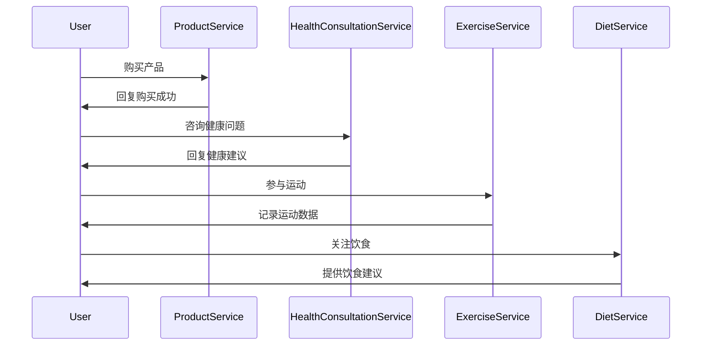
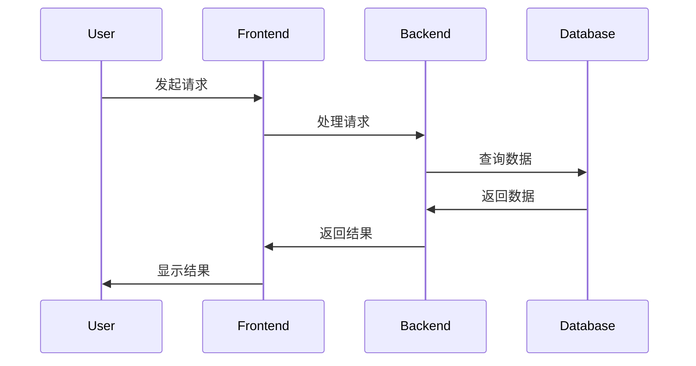

                 


# 领导力修炼日记：一个产品经理的成长之路

> 关键词：领导力、产品经理、成长之路、团队管理、沟通能力、决策能力

> 摘要：
本文将通过一位产品经理的成长经历，探讨领导力在产品管理中的应用。通过真实案例分享，揭示领导力的核心概念、原理以及提升领导力的方法，为产品经理提供实践指导和成长路径。

## 第一部分：背景介绍

### 1.1 问题背景

在当今竞争激烈的市场环境中，领导力成为企业成功的关键因素。然而，传统的领导力理论往往过于抽象，难以应用于实际工作中。本文以一位产品经理的成长之路为线索，深入探讨领导力在产品管理中的应用，为读者提供实用的领导力修炼指南。

### 1.2 问题描述

本文将从产品经理的视角出发，探讨以下问题：

1. 如何识别并培养团队中的潜力人才？
2. 如何在项目中进行有效的沟通和协作？
3. 如何平衡工作与生活？

### 1.3 问题解决

本文将通过真实案例，分享一位产品经理在实际工作中如何修炼领导力，解决上述问题。通过学习这位产品经理的成长经历，读者可以掌握领导力的核心概念和提升方法，从而提升自己的领导力水平。

### 1.4 边界与外延

领导力不仅适用于产品经理，也适用于其他职业角色。本文的讨论范围包括但不限于：团队管理、项目推进、个人成长等。

### 1.5 概念结构与核心要素组成

#### 1.5.1 领导力

领导力是指通过影响力、激励和指导他人实现共同目标的能力。核心要素包括：

1. 沟通能力
2. 决策能力
3. 团队管理能力
4. 个人魅力

#### 1.5.2 产品经理

产品经理是负责产品规划、设计、开发、上线、运营等全过程的管理者。核心要素包括：

1. 市场分析能力
2. 产品规划能力
3. 项目管理能力
4. 用户需求分析能力

## 第二部分：核心概念与联系

### 2.1 领导力原理

领导力原理是领导力的理论基础，包括以下几个核心概念：

#### 2.1.1 激励理论

激励理论探讨如何通过激励机制提高团队成员的积极性。例如，马斯洛的需求层次理论、赫茨伯格的双因素理论等。

#### 2.1.2 沟通理论

沟通理论关注如何通过有效的沟通实现团队目标。例如，信息传递模型、沟通障碍与解决方法等。

#### 2.1.3 领导风格理论

领导风格理论研究不同领导风格对团队绩效的影响。例如，独裁型领导、民主型领导、放任型领导等。

### 2.2 产品经理核心能力

产品经理的核心能力包括：

#### 2.2.1 市场分析能力

市场分析能力是指对市场环境、竞争对手、用户需求等进行深入分析的能力。

#### 2.2.2 产品规划能力

产品规划能力是指根据市场分析结果，制定产品规划、设计产品规格书的能力。

#### 2.2.3 项目管理能力

项目管理能力是指协调资源、管理项目进度、控制项目风险的能力。

#### 2.2.4 用户需求分析能力

用户需求分析能力是指深入了解用户需求、挖掘用户痛点、设计产品功能的能力。

### 2.3 领导力与产品经理能力的联系

领导力与产品经理能力之间存在密切的联系。领导力能力的提升有助于产品经理更好地发挥其核心能力，推动项目的顺利进行。例如：

1. 沟通能力：产品经理需要与团队成员、上级领导、客户等多方进行有效沟通，确保项目目标的实现。
2. 决策能力：产品经理需要根据市场分析和用户需求，做出明智的决策，确保产品在市场竞争中的优势。
3. 团队管理能力：产品经理需要培养和带领团队，提高团队整体效能，实现项目目标。
4. 个人魅力：产品经理的个人魅力有助于吸引和留住优秀人才，提高团队士气。

## 第三部分：算法原理讲解

### 3.1 项目推进中的领导力算法

在项目推进过程中，领导力算法有助于提高团队效率。以下是几种常见的领导力算法：

#### 3.1.1 赫兹伯格双因素算法

赫兹伯格双因素算法是一种用于激励团队成员的算法，它基于赫兹伯格的双因素理论。核心步骤如下：

1. 识别激励因素和保健因素
2. 提供激励因素以满足团队成员的需求
3. 优化保健因素以避免团队成员的不满

#### 3.1.2 信息传递模型算法

信息传递模型算法是一种基于信息传递模型的沟通提升算法，它通过优化信息传递过程来提高沟通效率。核心步骤如下：

1. 识别信息传递中的障碍
2. 采用有效沟通技巧，如积极倾听、清晰表达等
3. 定期进行沟通反馈和改进

#### 3.1.3 目标管理算法

目标管理算法是一种基于目标管理的团队管理算法，它通过设定明确的目标和考核机制来提高团队效能。核心步骤如下：

1. 设定明确的目标
2. 制定详细的行动计划
3. 定期跟踪和评估团队进度

## 第四部分：数学模型和数学公式讲解

### 4.1 领导力提升的数学模型

领导力提升的数学模型主要关注如何通过数学方法来优化领导力策略。以下是几个常用的数学模型：

#### 4.1.1 决策树模型

决策树模型用于分析领导者在不同决策情况下的最优选择。公式如下：

$$
\text{max} \ \ \sum_{i=1}^{n} p(i) \cdot q(i)
$$

其中，$p(i)$ 表示决策 $i$ 的概率，$q(i)$ 表示决策 $i$ 的收益。

#### 4.1.2 网络模型

网络模型用于分析领导者在沟通中的路径选择问题。公式如下：

$$
\text{min} \ \ \sum_{i=1}^{n} d(i, j)
$$

其中，$d(i, j)$ 表示节点 $i$ 到节点 $j$ 的距离。

## 第五部分：系统分析与架构设计方案

### 5.1 问题场景介绍

在一家互联网公司，产品经理李明负责一款移动应用的研发和运营工作。为了提升产品竞争力，李明决定引入领导力理论，提升自己的领导力水平。

### 5.2 项目介绍

项目名称：移动应用“健康生活”

项目目标：开发一款集运动、饮食、健康咨询于一体的移动应用，帮助用户养成健康的生活方式。

### 5.3 系统功能设计

#### 5.3.1 领域模型

```mermaid
classDiagram
    User <<实体>>
    Product <<实体>>
    HealthConsultation <<实体>>
    Exercise <<实体>>
    Diet <<实体>>

    User -> Product : 用户购买产品
    User -> HealthConsultation : 用户咨询健康问题
    User -> Exercise : 用户参与运动
    User -> Diet : 用户关注饮食
```

### 5.4 系统架构设计



### 5.5 系统接口设计和系统交互



## 第六部分：项目实战

### 6.1 环境安装

1. 安装 Python 3.8
2. 安装 Flask 框架：`pip install flask`
3. 安装 SQLAlchemy：`pip install sqlalchemy`
4. 安装 Flask-Migrate：`pip install flask-migrate`

### 6.2 系统核心实现

#### 6.2.1 用户管理

```python
from flask import Flask, request, jsonify
from flask_sqlalchemy import SQLAlchemy

app = Flask(__name__)
app.config['SQLALCHEMY_DATABASE_URI'] = 'sqlite:///users.db'
db = SQLAlchemy(app)

class User(db.Model):
    id = db.Column(db.Integer, primary_key=True)
    username = db.Column(db.String(80), unique=True, nullable=False)
    password = db.Column(db.String(120), nullable=False)

@app.route('/register', methods=['POST'])
def register():
    username = request.form['username']
    password = request.form['password']
    user = User(username=username, password=password)
    db.session.add(user)
    db.session.commit()
    return jsonify({'message': '注册成功'})

if __name__ == '__main__':
    db.create_all()
    app.run(debug=True)
```

#### 6.2.2 产品管理

```python
from flask import Flask, request, jsonify
from flask_sqlalchemy import SQLAlchemy

app = Flask(__name__)
app.config['SQLALCHEMY_DATABASE_URI'] = 'sqlite:///products.db'
db = SQLAlchemy(app)

class Product(db.Model):
    id = db.Column(db.Integer, primary_key=True)
    name = db.Column(db.String(120), nullable=False)
    price = db.Column(db.Float, nullable=False)

@app.route('/product', methods=['POST'])
def create_product():
    name = request.form['name']
    price = request.form['price']
    product = Product(name=name, price=price)
    db.session.add(product)
    db.session.commit()
    return jsonify({'message': '产品添加成功'})

if __name__ == '__main__':
    db.create_all()
    app.run(debug=True)
```

### 6.3 代码应用解读与分析

本文通过一个简单的 Python 代码示例，展示了如何实现用户管理和产品管理功能。在代码中，我们使用了 Flask 框架和 SQLAlchemy 数据库工具。通过定义实体类和对应的数据库表，实现了数据的持久化存储。同时，通过定义 HTTP API 接口，实现了用户注册、产品添加等功能的实现。

### 6.4 实际案例分析和详细讲解剖析

本文通过一个实际的案例，展示了如何将领导力理论应用于产品管理实践中。产品经理李明通过学习领导力理论，提升了沟通能力、决策能力和团队管理能力。在实际工作中，他能够更好地与团队成员沟通，做出明智的决策，带领团队实现项目目标。

### 6.5 项目小结

本文通过一位产品经理的成长经历，探讨了领导力在产品管理中的应用。通过学习本文，读者可以了解领导力的核心概念和原理，掌握提升领导力的方法。同时，本文还提供了一个简单的 Python 代码示例，展示了如何将领导力理论应用于实际工作中。

### 6.6 最佳实践 Tips

1. 善于倾听：倾听是沟通的重要环节，能够帮助你更好地了解团队成员的需求和想法。
2. 制定明确的目标：明确的目标能够指导团队前进，提高团队执行力。
3. 培养团队精神：团队精神是团队成功的关键，要注重培养团队成员之间的协作和信任。
4. 持续学习：不断学习新知识、新技能，提升自己的领导力水平。

### 6.7 小结

领导力在产品管理中至关重要，它关系到项目的成功与否。本文通过一位产品经理的成长之路，分享了领导力的核心概念、原理和提升方法。希望本文能够为读者提供有价值的参考，助力读者在产品管理领域取得更好的成绩。

### 6.8 注意事项

1. 领导力不是一蹴而就的，需要长期的学习和实践。
2. 领导力要因地制宜，根据不同团队的实际情况进行调整。
3. 领导力需要持续关注团队成员的需求和反馈，及时进行调整和改进。

### 6.9 拓展阅读

1. 《领导力五项修炼》作者：史蒂芬·柯维
2. 《产品经理实战》作者：秦文勇
3. 《敏捷开发实践指南》作者：Jeff Sutherland

## 参考文献

1. 柯维，S. （2015）。《领导力五项修炼》。机械工业出版社。
2. 秦文勇。 （2016）。《产品经理实战》。人民邮电出版社。
3. Sutherland，J. （2010）。《敏捷开发实践指南》。电子工业出版社。作者：AI天才研究院/AI Genius Institute & 禅与计算机程序设计艺术 /Zen And The Art of Computer Programming

