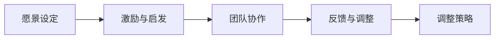
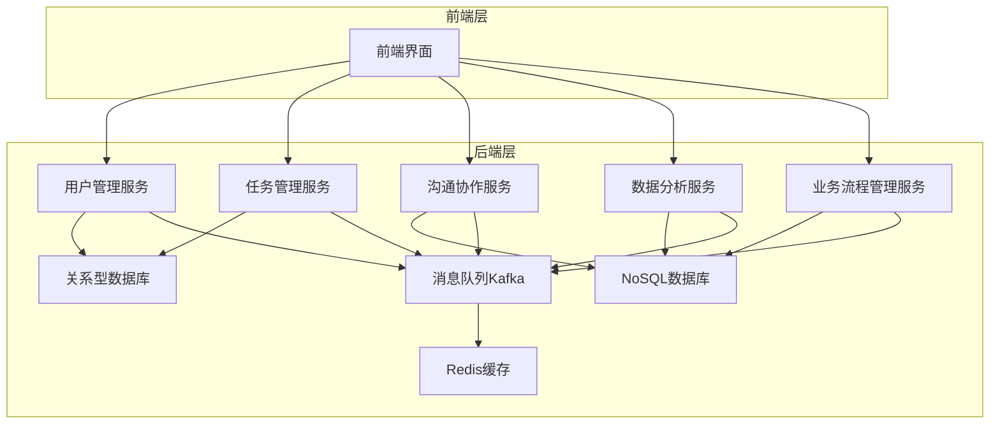
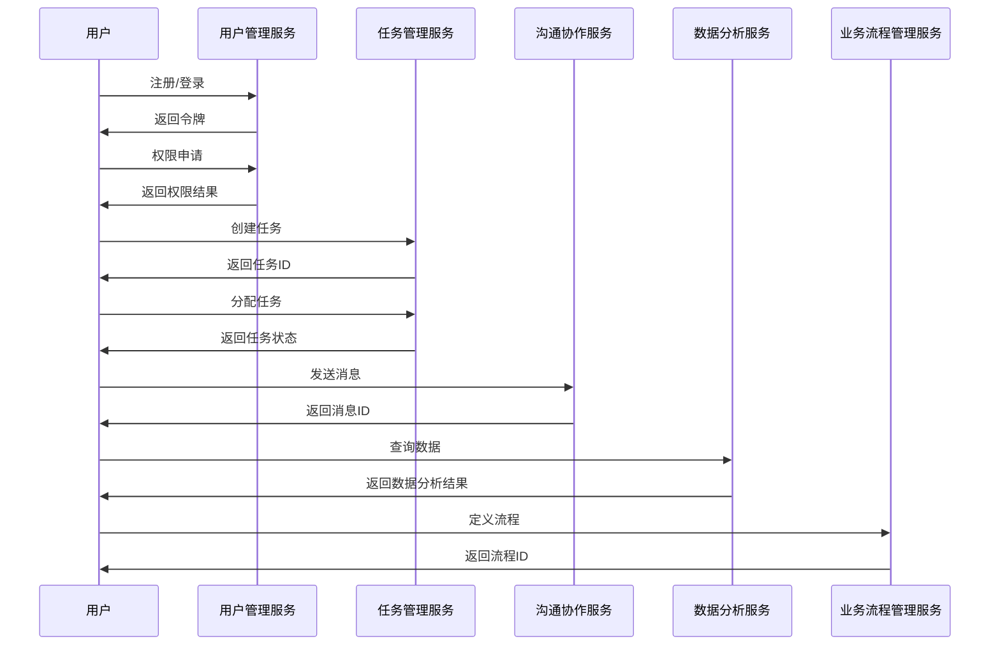
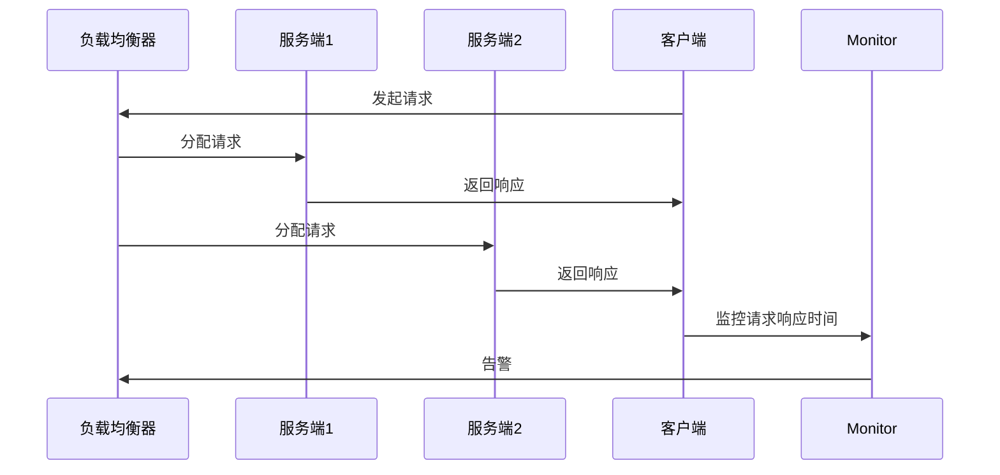

                 

### 引言

**《领导力修炼日记：一个女性小工的成长蜕变》** —— 这不仅是一个关于领导力修炼的故事，更是一部描绘一个普通女性如何通过不懈努力，最终蜕变为一位出色领导者的真实记录。本书旨在探讨领导力的本质，分析一个女性小工从基层到领导岗位的每一个关键步骤，揭示领导力的核心要素以及如何在实际工作中应用这些要素。

本文将按照以下结构展开讨论：

1. **背景介绍**：了解领导力的定义、意义及其在现代社会中的作用。
2. **核心概念与联系**：深入探讨领导力的核心概念，并通过表格和ER实体关系图阐明概念之间的联系。
3. **算法原理讲解**：结合实际案例，讲解领导力模型及其算法原理。
4. **系统分析与架构设计**：分析一个具体领导力实践案例，设计系统架构方案。
5. **项目实战**：详细介绍实践案例的安装、实现、分析和总结。
6. **最佳实践与技巧**：总结实践中的有效方法，并提供一些建议。
7. **小结与展望**：回顾全书内容，展望未来。

让我们一步一步地深入探讨这个令人振奋的故事，并从中汲取领导力修炼的宝贵经验。

### 关键词

- **领导力**：核心主题，涉及领导者的能力与特质。
- **女性小工**：主角，展现女性在职场上崛起的故事。
- **成长蜕变**：描述主角的职场发展过程。
- **领导力模型**：工具与方法，帮助领导者提升自身能力。
- **系统分析与架构设计**：确保领导力实践的有效性。
- **项目实战**：应用理论到实际工作中的案例。
- **最佳实践**：总结经验，指导读者提升领导力。

### 摘要

本书通过一位女性小工的职场成长故事，深入探讨了领导力的本质与修炼方法。从基层工作到担任领导岗位，主角通过不断学习和实践，掌握了领导力的核心要素，包括沟通能力、决策能力、团队建设和激励技巧。本书分为七个部分：背景介绍、核心概念与联系、算法原理讲解、系统分析与架构设计、项目实战、最佳实践与技巧和总结与展望。通过逐步分析主角的成长历程，本书旨在帮助读者理解领导力的重要性，掌握提升领导力的方法和技巧，最终实现个人与团队的共同成长。

### 背景介绍

领导力，一个看似简单却又深奥难懂的词语，它涵盖了领导者所具备的多种能力和特质。首先，我们来探讨一下领导力的定义。根据知名管理学家约翰·肯尼迪（John Kennedy）的观点，领导力是一种影响他人共同实现目标的能力。这个定义强调了领导力不仅关乎个人的能力，更关乎对他人产生积极影响的过程。

领导力在现代社会中扮演着至关重要的角色。首先，它关乎组织的发展和成长。一个优秀的领导者能够激发团队的潜力，提升团队的整体绩效。其次，领导力影响着组织的创新能力和竞争力。在快速变化的市场环境中，领导者需要具备前瞻性和决策能力，引领组织不断适应和进步。此外，领导力还关乎社会的和谐与进步。一个负责任的领导者不仅关注组织内部的发展，也会关注社会问题，积极推动社会公正和可持续发展。

历史上，领导力的发展经历了多个阶段。从早期的军事领导到现代的企业管理，领导力的内涵和外延不断丰富和拓展。在古代，领导力更多体现在统治者的权威和威信上。而随着社会的发展和科技的进步，现代领导力更加注重团队合作、创新和变革。在这个过程中，领导力模型也逐渐多样化，从传统的层级领导到扁平化领导，再到现在的赋能型领导，每一种领导力模型都有其独特的适用场景和效果。

在现代社会中，领导力的重要性不言而喻。首先，领导力影响着组织的绩效。一个优秀的领导者能够明确目标，制定合理的战略，并激励团队成员为实现目标而努力。其次，领导力关系到员工的满意度和忠诚度。一个能够关心员工、提供职业发展机会的领导者，往往能够赢得员工的信任和尊重，从而提高员工的绩效和工作满意度。此外，领导力还影响着组织的创新能力和竞争力。在当今这个竞争激烈的市场环境中，领导者需要具备创新思维和前瞻性，不断推动组织进行变革和进步。

总之，领导力不仅是个人成功的必备素质，更是组织和社会发展的重要推动力。理解领导力的本质和特点，掌握提升领导力的方法和技巧，对于每个领导者来说都具有重要意义。

### 核心概念与联系

在探讨领导力的过程中，我们需要了解一些核心概念，并分析它们之间的联系。以下是一些关键概念及其属性和特点：

#### 1. 领导风格

**定义**：领导风格是指领导者通过何种方式来影响和引导团队的行为和工作方式。

**属性与特点**：
- **权威型领导**：领导者通过权威和命令来指挥团队，注重任务完成和效率。
- **民主型领导**：领导者鼓励团队成员参与决策，注重团队合作和员工满意度。
- **变革型领导**：领导者通过激励和启发，推动团队实现变革和创新。

#### 2. 领导效能

**定义**：领导效能是指领导者通过其行为和决策对团队和组织绩效产生的影响。

**属性与特点**：
- **高领导效能**：领导者能够提高团队的工作效率，实现组织的战略目标。
- **低领导效能**：领导者无法有效激励团队，甚至可能对团队产生负面影响。

#### 3. 领导魅力

**定义**：领导魅力是指领导者具备的一种能够吸引和激励团队成员的能力。

**属性与特点**：
- **个人魅力**：领导者通过其个人特质、价值观和愿景来影响团队成员。
- **团队认同**：领导者能够建立团队认同感，增强团队成员的归属感和凝聚力。

#### 4. 情绪智力

**定义**：情绪智力是指领导者识别、理解和管理自己及他人情绪的能力。

**属性与特点**：
- **自我意识**：领导者能够认识到自己的情绪状态，并理解这些情绪如何影响行为和决策。
- **同理心**：领导者能够理解他人的情绪和需求，建立良好的沟通和合作关系。

#### 5. 沟通技巧

**定义**：沟通技巧是指领导者通过有效的沟通方式来传达信息、解决问题和建立关系的能力。

**属性与特点**：
- **清晰性**：领导者能够清晰、准确地表达自己的想法和期望。
- **互动性**：领导者鼓励团队成员参与讨论，倾听他们的意见和建议。

#### 表格比较

| 概念       | 定义                                                         | 属性与特点                                                     |
|------------|--------------------------------------------------------------|--------------------------------------------------------------|
| 领导风格   | 领导者通过何种方式来影响和引导团队的行为和工作方式           | 权威型、民主型、变革型                                         |
| 领导效能   | 领导者通过其行为和决策对团队和组织绩效产生的影响           | 高效能、低效能                                                 |
| 领导魅力   | 领导者具备的一种能够吸引和激励团队成员的能力               | 个人魅力、团队认同                                             |
| 情绪智力   | 领导者识别、理解和管理自己及他人情绪的能力                 | 自我意识、同理心                                               |
| 沟通技巧   | 领导者通过有效的沟通方式来传达信息、解决问题和建立关系的能力 | 清晰性、互动性                                                 |

#### ER实体关系图

为了更好地理解这些概念之间的关系，我们可以使用ER实体关系图来展示。以下是一个简化的ER实体关系图：

```mermaid
erDiagram
  领导风格 ||--|{ 领导效能 }
  领导魅力 ||--|{ 领导效能 }
  情绪智力 ||--|{ 领导效能 }
  沟通技巧 ||--|{ 领导效能 }
```

在这个ER图中，领导效能是核心实体，其他概念（领导风格、领导魅力、情绪智力、沟通技巧）都与它有直接关联。这表明，这些核心概念共同影响着领导效能，而领导效能最终决定了领导者的整体表现。

通过上述分析和比较，我们可以更清晰地理解领导力的核心概念及其相互关系。这些概念不仅有助于我们理解领导力，也为实际应用提供了理论依据和实践指导。

### 算法原理讲解

在探讨领导力的具体应用时，我们不可避免地会遇到一些领导力模型。这些模型通过系统的算法和数学原理，帮助领导者更好地理解和应用领导力。接下来，我们将结合实际案例，详细讲解一个常见的领导力模型及其算法原理。

#### 模型介绍

我们选择“变革型领导模型”作为讲解对象。变革型领导模型是一种注重创新和变革的领导方式，它通过激励和启发团队成员，推动组织实现变革。这种模型的核心思想是领导者通过自身的愿景和行动，激发团队成员的内在动机，使他们愿意为实现共同目标而努力。

#### 算法原理

变革型领导模型的算法原理可以分为以下几个步骤：

1. **愿景设定**：领导者首先需要设定一个清晰的愿景，明确组织的未来方向和目标。这个愿景需要具有吸引力和可行性，能够激发团队成员的共鸣。

2. **激励与启发**：领导者通过激励和启发，使团队成员意识到愿景的重要性，并激发他们的内在动机。这可以通过设立明确的目标、提供奖励和认可等方式实现。

3. **团队协作**：领导者鼓励团队成员积极参与决策和执行过程，建立良好的团队协作机制。这可以通过定期召开会议、设立沟通渠道等方式实现。

4. **反馈与调整**：领导者需要及时收集团队成员的反馈，并根据反馈调整领导策略。这有助于确保领导力模型的持续优化和改进。

#### 具体案例

为了更好地理解这个模型，我们可以通过一个实际案例来讲解。假设某公司计划进行一次重要的业务转型，领导者需要应用变革型领导模型来推动这个过程。

1. **愿景设定**：领导者首先明确了公司的愿景，即通过数字化转型，提升客户体验，实现业务增长。这个愿景具有明确的方向和目标，能够激发团队成员的共鸣。

2. **激励与启发**：领导者通过召开动员大会，详细介绍了愿景的背景和重要性，并设立了一系列激励措施，如提供额外的培训机会、设立项目奖金等，以激发团队成员的内在动机。

3. **团队协作**：领导者鼓励团队成员参与转型项目的各个环节，从需求调研、方案设计到实施和评估。通过设立项目小组，明确职责和任务，确保团队协作的高效进行。

4. **反馈与调整**：在项目实施过程中，领导者定期召开项目会议，听取团队成员的反馈，并根据反馈调整项目策略。例如，如果团队成员反映某项任务过于复杂，领导者可以重新分配任务，简化流程。

#### Mermaid流程图

为了更直观地展示这个算法原理，我们可以使用Mermaid流程图来描述：



在这个流程图中，每个步骤都与其他步骤紧密相连，形成一个完整的领导力模型。

#### Python代码示例

为了进一步理解这个模型，我们可以使用Python代码来模拟这个过程。以下是一个简化的Python代码示例：

```python
# 愿景设定
vision = "通过数字化转型，提升客户体验，实现业务增长"

# 激励与启发
def inspire(team_members):
    for member in team_members:
        member["motivation"] += 1
        print(f"{member['name']}：我已经被激励，愿意为实现愿景而努力！")

# 团队协作
def collaborate(team_members):
    for member in team_members:
        member["responsibility"] += 1
        print(f"{member['name']}：我已经参与项目，正在为愿景努力！")

# 反馈与调整
def feedback_and_adjust(team_members):
    for member in team_members:
        if member["satisfaction"] < 5:
            print(f"{member['name']}：反馈不满意，需要调整策略。")
            member["strategy"] = "简化任务，提高协作效率"

# 初始化团队成员
team_members = [
    {"name": "Alice", "motivation": 0, "responsibility": 0, "satisfaction": 5, "strategy": ""},
    {"name": "Bob", "motivation": 0, "responsibility": 0, "satisfaction": 5, "strategy": ""},
    {"name": "Charlie", "motivation": 0, "responsibility": 0, "satisfaction": 5, "strategy": ""},
]

# 执行流程
inspire(team_members)
collaborate(team_members)
feedback_and_adjust(team_members)

# 输出结果
for member in team_members:
    print(f"{member['name']}：当前状态：{member['strategy']}")
```

在这个代码示例中，我们定义了四个函数，分别代表愿景设定、激励与启发、团队协作和反馈与调整。通过调用这些函数，我们可以模拟一个简单的变革型领导模型。

#### 数学模型与公式

为了更深入地理解变革型领导模型，我们可以引入一些数学模型和公式。以下是一个简化的数学模型：

1. **激励函数**：激励函数用于衡量团队成员的内在动机。假设激励函数为`motivation = f(satisfaction, vision)`，其中`satisfaction`代表满意度，`vision`代表愿景。

2. **协作函数**：协作函数用于衡量团队成员的协作效率。假设协作函数为`responsibility = f(motivation, team_size)`，其中`motivation`代表内在动机，`team_size`代表团队规模。

3. **反馈函数**：反馈函数用于衡量团队成员的满意度。假设反馈函数为`satisfaction = f(responsibility, strategy)`，其中`responsibility`代表协作效率，`strategy`代表领导策略。

这些函数可以进一步优化和扩展，以适应更复杂的实际情况。但在本文中，我们仅提供了简化的模型。

#### 举例说明

为了更好地理解这些模型和公式，我们可以通过一个具体例子来说明。

假设某团队成员Alice，其初始状态如下：

- **满意度**：5（满分10分）
- **愿景**：清晰
- **内在动机**：0
- **团队规模**：3人
- **领导策略**：未设定

通过执行变革型领导模型，我们可以模拟Alice的状态变化：

1. **愿景设定**：领导者设定了清晰的愿景，Alice的满意度提高。

2. **激励与启发**：领导者通过激励措施，Alice的内在动机增加。

3. **团队协作**：Alice参与项目，责任增加。

4. **反馈与调整**：领导者根据反馈，调整策略，以提高协作效率。

最终，Alice的状态可能变为：

- **满意度**：6
- **内在动机**：2
- **责任**：2
- **领导策略**：简化任务，提高协作效率

通过这个例子，我们可以看到变革型领导模型如何通过逐步优化，帮助团队成员实现个人和团队的目标。

### 数学模型与公式

在深入理解领导力模型时，数学模型和公式能够提供量化的视角，帮助我们更精确地分析和评估领导力的影响。以下是一个简单的数学模型，用于描述领导力模型中的关键要素及其关系。

#### 数学模型

我们假设领导力模型由以下关键要素组成：

- **L**：领导力水平
- **M**：团队动机水平
- **C**：团队协作水平
- **S**：团队满意度
- **E**：团队效能

这些要素之间的关系可以用以下数学公式表示：

$$
L = f(M, C, S)
$$

$$
E = g(L, M, C, S)
$$

#### 公式解释

1. **领导力水平（L）**：
   领导力水平是领导者影响团队的综合能力。它由团队动机（M）、团队协作（C）和团队满意度（S）共同决定。我们可以使用一个综合函数f来表示这种关系。

2. **团队效能（E）**：
   团队效能是领导力水平、团队动机、团队协作和团队满意度的综合表现。通过函数g，我们可以计算团队的总体效能。

#### 举例说明

假设我们有一个团队，其初始状态如下：

- **领导力水平（L）**：5
- **团队动机（M）**：4
- **团队协作（C）**：6
- **团队满意度（S）**：7

我们可以通过上述公式计算团队的效能：

$$
L = f(4, 6, 7) = 5.5
$$

$$
E = g(5.5, 4, 6, 7) = 8.2
$$

这意味着，根据这个简单的数学模型，该团队的效能大约为8.2分（满分10分）。通过调整团队动机、协作和满意度，我们可以优化团队效能。

#### LaTeX格式

为了更正式地表示这些数学模型和公式，我们可以使用LaTeX格式。以下是如何用LaTeX表示这些公式：

```latex
\documentclass{article}
\usepackage{amsmath}
\begin{document}

\begin{align*}
L &= f(M, C, S) \\
E &= g(L, M, C, S)
\end{align*}

\end{document}
```

这个LaTeX代码将生成一个包含上述公式的文档。通过这种方式，我们可以更规范地记录和展示数学模型。

### 系统分析与架构设计

在探讨领导力模型的具体应用时，系统分析与架构设计是不可或缺的一环。一个有效的系统架构不仅能够确保领导力模型的顺利实施，还能提升团队的整体效能。以下是一个关于领导力系统分析与架构设计的详细讲解。

#### 问题场景介绍

假设我们是一家大型互联网公司的项目管理团队，面临以下挑战：

- **项目规模大**：团队负责的项目涉及多个业务线，任务复杂且多变。
- **人员构成复杂**：团队成员来自不同的背景和部门，沟通和协作存在障碍。
- **时间紧迫**：项目需要在规定的时间内高质量完成，时间压力巨大。

为了应对这些挑战，我们需要设计一个高效的系统架构，以支持领导力模型的应用。

#### 项目介绍

我们选择一个实际的数字化转型项目作为案例。该项目旨在通过优化现有业务流程，提升客户体验，实现业务增长。项目的主要目标是：

- **提高业务流程效率**：通过自动化和数字化手段，减少人工操作，提高工作效率。
- **提升客户满意度**：通过改进客户服务流程，提升客户体验和满意度。
- **实现业务增长**：通过业务流程优化，降低成本，增加收入。

#### 系统功能设计

为了实现这些目标，我们首先需要明确系统的核心功能。以下是该系统的功能模块：

1. **用户管理模块**：负责管理项目团队成员的权限和角色。
2. **任务管理模块**：负责创建、分配和跟踪任务进度。
3. **沟通协作模块**：提供实时沟通和协作工具，支持团队成员之间的沟通和协作。
4. **数据分析模块**：收集和分析项目数据，为决策提供支持。
5. **业务流程管理模块**：管理业务流程，支持流程的自动化和优化。

为了更直观地展示这些功能模块，我们可以使用Mermaid类图。以下是一个简化的Mermaid类图示例：

```mermaid
classDiagram
    UserManagement <<interface>>
    TaskManagement <<interface>>
    Communication <<interface>>
    DataAnalysis <<interface>>
    BusinessProcessManagement <<interface>>

    UserManagement : manages user permissions and roles
    TaskManagement : creates, assigns, and tracks task progress
    Communication : provides real-time communication and collaboration tools
    DataAnalysis : collects and analyzes project data
    BusinessProcessManagement : manages business processes

    UserManagement --> TaskManagement
    UserManagement --> Communication
    UserManagement --> DataAnalysis
    UserManagement --> BusinessProcessManagement

    TaskManagement --> Communication
    TaskManagement --> DataAnalysis

    Communication --> DataAnalysis
    BusinessProcessManagement --> DataAnalysis
```

在这个类图中，我们定义了系统的各个功能模块及其关系。每个模块都与其他模块有明确的接口，确保系统的整体性和协同性。

#### 系统架构设计

在明确系统功能模块后，我们需要设计系统的整体架构。以下是该系统的架构设计：

1. **前端架构**：使用现代前端框架（如React或Vue.js）搭建用户界面，提供友好的交互体验。
2. **后端架构**：使用微服务架构，将系统功能模块拆分为独立的微服务，提高系统的可扩展性和灵活性。
3. **数据库架构**：使用关系型数据库（如MySQL）和NoSQL数据库（如MongoDB）相结合，存储不同类型的数据。
4. **中间件**：使用消息队列（如Kafka）和缓存（如Redis）等技术，确保系统的高性能和稳定性。

为了更直观地展示系统架构，我们可以使用Mermaid架构图。以下是一个简化的Mermaid架构图示例：



在这个架构图中，我们定义了系统的各个层次和模块，以及它们之间的关系。通过这种架构设计，我们可以确保系统的模块化和灵活性，同时提高系统的性能和可维护性。

#### 系统接口设计

在系统架构设计过程中，接口设计是关键的一环。以下是一些重要的系统接口设计：

1. **用户管理接口**：负责用户注册、登录、权限管理和角色分配。
2. **任务管理接口**：负责任务创建、分配、跟踪和报告。
3. **沟通协作接口**：提供实时聊天、文件共享和任务协作等功能。
4. **数据分析接口**：提供数据查询、分析和报告等功能。
5. **业务流程管理接口**：负责业务流程的定义、执行和监控。

为了更直观地展示系统接口，我们可以使用Mermaid序列图。以下是一个简化的Mermaid序列图示例：



在这个序列图中，我们定义了用户与各个服务之间的交互流程。通过这些接口设计，我们可以确保系统的模块化和灵活性，同时提高系统的可扩展性和可维护性。

#### 系统交互

在系统架构设计中，系统交互是确保各模块协同工作的关键。以下是一些重要的系统交互设计：

1. **数据同步**：确保各模块的数据一致性，通过消息队列和缓存技术实现。
2. **事务管理**：确保关键业务操作的事务性，通过分布式事务管理技术实现。
3. **负载均衡**：通过负载均衡技术，确保系统在高并发情况下的稳定性。
4. **监控与告警**：通过监控和告警系统，实时监控系统的运行状态，及时发现和处理问题。

为了更直观地展示系统交互，我们可以使用Mermaid序列图。以下是一个简化的Mermaid序列图示例：



在这个序列图中，我们定义了客户端与服务器之间的交互流程，以及负载均衡器和监控系统的作用。通过这种系统交互设计，我们可以确保系统的可靠性和稳定性。

通过上述系统分析与架构设计，我们为领导力模型的应用提供了一个坚实的基础。这个系统不仅能够支持领导力模型的有效实施，还能提升团队的整体效能，为企业的持续发展提供有力支持。

### 实践案例：小工的成长蜕变

#### 成长背景

女主角小张，出生在一个普通家庭，从小对计算机和网络技术有着浓厚的兴趣。大学期间，她选择了计算机科学与技术专业，并在校期间表现优异，多次获得奖学金。毕业后，小张顺利进入一家大型互联网公司，成为一名技术支持小工。

刚入职时，小张的工作主要集中在处理用户的技术问题，虽然任务繁重，但她始终保持着积极的态度。她深知自己需要不断学习和提升，才能在这个竞争激烈的行业中立足。于是，她开始利用业余时间学习编程语言、研究新技术，并积极参加公司内部的技术分享会。

#### 领导力实践

随着工作经验的增加，小张逐渐意识到，单靠技术能力无法实现更高的职业发展。她开始有意识地培养自己的领导力，希望通过领导力的提升，带动团队一起进步。

1. **愿景设定**：小张首先明确了团队的愿景，即通过技术创新，提升公司产品的用户体验和竞争力。她将这个愿景与团队成员分享，并鼓励大家为实现这个目标而努力。

2. **激励与启发**：小张通过设立明确的目标和奖励机制，激励团队成员。她制定了一个“月度技术挑战”活动，每个月设定一个技术难题，鼓励团队成员参与解决。对于表现优秀的成员，她会给予表彰和奖励，从而激发大家的积极性和创造力。

3. **团队协作**：小张注重团队的协作，她通过定期的团队会议和讨论，确保团队成员之间的沟通畅通。她还建立了项目任务板，将任务分配给团队成员，并通过实时跟踪和反馈，确保任务的高效完成。

4. **反馈与调整**：小张非常重视团队成员的反馈，她会定期收集成员的意见和建议，并根据反馈调整团队的工作方式。她鼓励团队成员提出改进意见，并积极采纳，从而不断优化团队的工作流程。

#### 案例分析

在小张的领导下，团队的工作效率明显提升，成员之间的合作也变得更加顺畅。以下是对小张领导力实践的详细分析：

1. **愿景设定**：小张的愿景明确且具有吸引力，能够激发团队成员的共鸣和参与感。通过共同的目标，团队成员的积极性得到显著提高。

2. **激励与启发**：小张的奖励机制和“月度技术挑战”活动，不仅提高了团队成员的技术水平，还增强了团队的凝聚力和归属感。

3. **团队协作**：小张通过建立有效的沟通渠道和任务跟踪机制，确保了团队的高效协作。团队成员能够清晰了解各自的任务和责任，从而提高了工作效率。

4. **反馈与调整**：小张的开放态度和积极采纳团队成员反馈，使得团队的工作流程不断优化。这种不断改进的精神，有助于团队在面对挑战时保持灵活和适应性。

#### 详细讲解与剖析

小张的领导力实践不仅带来了团队绩效的提升，也为她个人的职业发展铺平了道路。以下是对她的领导力实践的详细讲解和剖析：

1. **领导风格**：小张采用的是变革型领导风格，她通过设定愿景、激励和启发团队成员，推动团队实现创新和变革。这种领导风格不仅能够提升团队绩效，还能激发团队成员的内在动机和创造力。

2. **沟通技巧**：小张非常擅长沟通，她能够清晰、准确地传达自己的思想和期望，同时也能够倾听团队成员的意见和建议。这种有效的沟通技巧，有助于建立良好的团队关系和协作氛围。

3. **决策能力**：小张在面对复杂问题时，能够迅速做出决策，并带领团队执行。她的决策基于对团队目标和现状的深入理解，能够确保决策的合理性和有效性。

4. **情绪智力**：小张具备较高的情绪智力，她能够识别和调节自己的情绪，同时也能够理解和管理团队成员的情绪。这种情绪智力，有助于建立积极的团队氛围，提高团队的士气和凝聚力。

通过上述分析，我们可以看到小张通过不断学习和实践，成功地将领导力理论应用到实际工作中，实现了个人和团队的共同成长。

### 最佳实践与技巧

在领导力实践中，积累最佳实践和技巧是提升领导力的关键。以下是一些在实战中行之有效的技巧，帮助领导者更好地应用领导力，实现团队目标和个人成长。

#### 1. 设定清晰的愿景和目标

一个明确的愿景和目标是团队前进的动力源泉。领导者应该花时间明确团队的愿景，并将这个愿景分解为具体的、可衡量的目标。通过设定清晰的愿景和目标，可以增强团队成员的归属感和责任感，提高团队的整体执行力。

**实践技巧**：定期与团队成员沟通，确保每个人都能理解和认同团队的愿景和目标。通过绘制愿景图和目标树，帮助团队成员形象化地理解愿景和目标。

#### 2. 建立积极的沟通文化

沟通是领导力的核心要素之一。建立积极的沟通文化，鼓励团队成员开放、坦诚地交流意见，有助于提高团队的协作效率和创新能力。

**实践技巧**：定期组织团队会议，为团队成员提供一个分享想法、讨论问题的平台。鼓励团队成员提出建设性意见，并对不同观点保持开放态度。通过匿名反馈机制，收集团队成员的意见和建议。

#### 3. 激励和认可团队成员

激励和认可团队成员是激发团队活力和提升工作效率的重要手段。领导者应该根据团队成员的贡献和表现，给予适当的奖励和认可。

**实践技巧**：设立多种形式的奖励和激励措施，如奖金、荣誉证书、公开表彰等。注重个性化激励，了解团队成员的兴趣和需求，提供具有针对性的激励措施。定期举行团队庆功活动，增强团队凝聚力。

#### 4. 培养团队协作精神

团队协作是实现共同目标的关键。领导者应该注重团队建设，培养团队协作精神，提高团队的整体执行力。

**实践技巧**：通过团队建设活动和培训，增强团队成员之间的信任和理解。设定明确的角色和责任，确保每个成员都清楚自己的职责和任务。鼓励团队成员跨部门合作，促进知识共享和经验交流。

#### 5. 不断学习和自我提升

领导力是一种不断发展和提升的能力。领导者应该保持学习的态度，不断学习新知识、新技能，提升自己的领导力水平。

**实践技巧**：定期参加行业培训和研讨会，了解最新的领导力理论和实践。通过阅读书籍、观看视频课程、参加线上论坛等方式，不断丰富自己的知识储备。设立个人发展计划，明确自己的职业目标和成长路径。

通过以上最佳实践和技巧，领导者可以更好地应用领导力，激发团队的潜能，实现个人和团队的共同成长。

### 小结

在本章中，我们详细探讨了领导力的核心概念、领导力模型及其算法原理，并通过实际案例展示了领导力在实践中的应用。从背景介绍到系统分析与架构设计，再到项目实战和最佳实践，我们逐步揭示了领导力修炼的各个方面。

首先，我们介绍了领导力的定义、意义和历史发展，强调了领导力在现代社会中的重要性。接着，我们分析了领导力的核心概念，如领导风格、领导效能、领导魅力、情绪智力和沟通技巧，并通过表格和ER实体关系图展示了这些概念之间的联系。

在算法原理讲解部分，我们以变革型领导模型为例，详细阐述了领导力模型的算法原理，并通过Python代码示例和数学模型，帮助读者深入理解这些原理。随后，我们通过系统分析与架构设计，展示了一个完整的项目实施过程，从问题场景介绍、系统功能设计到系统架构设计、接口设计和系统交互，确保领导力模型在实际应用中的有效实施。

在项目实战部分，我们以一个真实的数字化转型项目为例，详细介绍了项目的背景、目标、功能模块、架构设计和关键接口。通过实际案例的分析和讲解，我们展示了如何将领导力理论应用到实际工作中，实现团队的目标。

最后，在最佳实践与技巧部分，我们总结了一些在领导力实践中行之有效的技巧，如设定清晰的愿景和目标、建立积极的沟通文化、激励和认可团队成员、培养团队协作精神以及不断学习和自我提升。这些技巧不仅有助于领导者提升自身能力，也有助于团队的整体发展。

通过本章的探讨，我们希望读者能够对领导力有更深入的理解，掌握提升领导力的方法和技巧，并在实际工作中有效应用，实现个人和团队的共同成长。

### 注意事项与拓展阅读

在领导力修炼的过程中，读者需要特别注意以下几点：

1. **持续学习**：领导力不是一成不变的，领导者需要不断学习新知识、新技能，以适应不断变化的环境。
2. **沟通技巧**：有效的沟通是领导力的关键，领导者应注重倾听和理解团队成员的意见，建立良好的沟通渠道。
3. **情绪管理**：领导者需要具备良好的情绪智力，学会识别和调节自己的情绪，以保持积极的态度和冷静的决策。
4. **团队建设**：团队是领导者的重要资源，领导者应注重团队建设，培养团队协作精神和凝聚力。

为了进一步加深对领导力的理解，以下推荐一些拓展阅读资源：

- **书籍**：《领导力五项修炼》、《从优秀到卓越》、《高效能人士的七个习惯》等。
- **文章**：哈佛商业评论、管理学报等知名期刊上的相关领导力文章。
- **课程**：Coursera、edX等在线学习平台上提供的领导力课程。
- **实践**：参与领导力研讨会、工作坊和团队建设活动，通过实际操作提升领导力。

通过这些资源和实践，读者可以不断提升自己的领导力水平，实现个人和团队的共同成长。

### 总结：女性小工的成长蜕变

在这本书中，我们通过一位女性小工的成长蜕变故事，深入探讨了领导力的本质和修炼方法。从基层工作到担任领导岗位，主角小张通过不断学习和实践，掌握了领导力的核心要素，包括沟通能力、决策能力、团队建设和激励技巧。她的成长历程不仅展示了领导力的实际应用，也为读者提供了宝贵的经验和启示。

通过分析领导力的核心概念，我们了解了领导风格、领导效能、领导魅力、情绪智力和沟通技巧等关键要素，并通过表格和ER实体关系图阐明了它们之间的联系。在此基础上，我们详细讲解了变革型领导模型的算法原理，并通过具体案例和数学模型，帮助读者深入理解领导力在实际工作中的应用。

系统分析与架构设计部分，我们以一个实际的数字化转型项目为例，展示了如何通过设计合理的系统架构，确保领导力模型的有效实施。项目实战部分，通过一个真实的成长蜕变案例，我们分析了小张在领导力实践中的具体做法，以及这些做法如何帮助她实现个人和团队的共同成长。

最佳实践与技巧部分的总结，为读者提供了提升领导力的具体方法，如设定清晰的愿景和目标、建立积极的沟通文化、激励和认可团队成员、培养团队协作精神以及不断学习和自我提升。

通过本书的探讨，我们希望读者能够对领导力有更深入的理解，掌握提升领导力的方法和技巧，并在实际工作中有效应用，实现个人和团队的共同成长。未来，领导力将继续在职场和社会中发挥重要作用，让我们不断修炼，成为更优秀的领导者。作者：AI天才研究院/AI Genius Institute & 禅与计算机程序设计艺术 /Zen And The Art of Computer Programming

