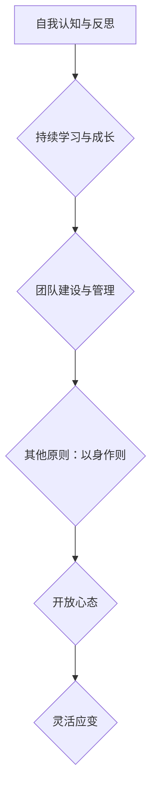
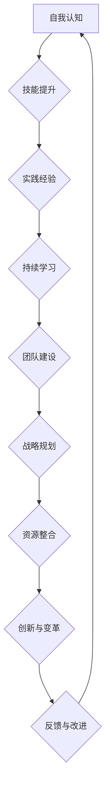

                 

### 引言

#### 1.1 领导力的重要性

**领导力在现代企业中的作用**

在快速变化的市场环境中，企业不仅需要高效的管理，更需要卓越的领导力。领导力不仅是推动企业发展的关键因素，也是激发员工潜能、提升团队协作效率的重要驱动力。在市场总监的职位上，领导力的作用尤为突出。一个出色的市场总监，不仅需要具备市场洞察力和战略规划能力，更需要具备强大的领导力，能够有效地带领团队应对各种挑战，实现市场目标。

**领导力在个人成长中的价值**

领导力不仅仅是一种职场技能，它更是个人成长的重要组成部分。一个拥有强大领导力的人，能够更好地应对生活中的各种挑战，拥有更高的自我认知和自我管理能力。在职业生涯中，领导力能够帮助个人提升职业竞争力，实现自我价值的最大化。此外，领导力还能够在个人生活中起到积极作用，帮助建立和谐的人际关系，提升沟通能力。

#### 1.2 市场总监的角色与挑战

**市场总监的职责**

市场总监在企业中承担着战略规划、市场调研、品牌建设、市场营销活动执行等多项职责。他们需要通过深入的市场分析，制定符合企业发展战略的市场策略，并领导团队实施这些策略。市场总监还需要具备卓越的沟通能力和团队管理能力，确保市场部门内部以及与其他部门的高效协作。

**市场总监面临的挑战**

市场环境的变化速度之快，给市场总监带来了巨大的挑战。全球化的市场竞争日益激烈，消费者需求多样化，新技术层出不穷，这些都要求市场总监具备前瞻性的视野和快速应对变化的能力。此外，市场总监还面临着如何激发团队创新、提升团队执行力等挑战。如何在复杂多变的市场环境中保持竞争力，是每个市场总监都需要思考的问题。

### 1.3 本书的结构安排

本书将围绕市场总监的领导力修炼展开，分为以下几个部分：

1. **核心概念与联系**：介绍领导力的定义、核心要素以及领导力在不同领域的应用。
2. **领导力修炼的实践方法**：详细阐述领导力修炼的基本原则和具体实践方法。
3. **领导力修炼的案例分析**：通过实际案例，分析领导力修炼的有效路径和挑战。
4. **领导力修炼的持续发展**：探讨领导力发展的路径和策略，以及持续发展的挑战与应对。
5. **结论与反思**：总结全书主要内容，提出对未来领导力发展的展望。

通过以上安排，本书旨在为市场总监以及其他职业人士提供一套系统、实用的领导力修炼指南，帮助他们在复杂多变的市场环境中脱颖而出，实现个人和团队的双重成长。### 核心概念与联系

#### 2.1 领导力的定义与核心要素

**领导力的定义**

领导力，是一种影响、激励和引导他人实现共同目标的能力。它不仅关乎个人权力的行使，更关乎如何在复杂多变的环境中带领团队达成目标。领导力不同于管理，管理主要关注任务的分配和执行，而领导力则更注重激发团队的潜力、塑造组织文化。

**领导力的核心要素**

领导力由多个核心要素构成，主要包括：

- **愿景与目标**：领导力首先需要有一个清晰的愿景和目标，这为团队提供了前进的方向和动力。
- **沟通能力**：有效的沟通是领导力的关键，它不仅包括传递信息的准确性，还涉及倾听和反馈。
- **激励与鼓舞**：领导者的任务之一是激励团队成员，帮助他们克服困难，保持积极的态度。
- **决策能力**：领导者需要具备在不确定的环境中做出明智决策的能力。
- **团队建设**：构建一个高效、和谐的团队是领导力的重要任务，这包括培养团队精神、解决团队冲突等。

**领导力与管理者职责的区别**

领导力与管理者职责虽然密切相关，但它们之间有明显的区别。管理者主要负责确保任务的完成，关注效率与控制；而领导者则更注重激励和引导，关注团队的长远发展和潜力挖掘。管理者可能更多地依赖于权威和制度，而领导者则更多地依赖于个人魅力和影响力。

#### 2.2 领导力在不同领域的应用

**企业管理中的应用**

在企业管理中，领导力是推动组织成功的关键因素。一个优秀的领导者能够帮助组织应对外部竞争和内部变革，确保组织目标的实现。领导力在企业管理中的应用包括：

- **战略规划**：领导者需要制定明确的战略规划，为组织提供清晰的愿景和方向。
- **团队建设**：通过激励和鼓舞，领导者能够建设一个高效、和谐的团队。
- **变革管理**：在面临组织变革时，领导者需要引导员工适应变化，克服变革带来的挑战。

**社会组织中的应用**

在非营利组织和社会组织中，领导力同样至关重要。这类组织往往面临资源有限、使命多样等挑战，领导者的作用不仅是确保组织目标的实现，还要动员资源、吸引志愿者和捐款者。领导力在社会组织中的应用包括：

- **使命驱动**：领导者需要明确组织的使命，并激励团队成员为实现这一使命而努力。
- **资源管理**：领导者需要有效地管理组织的资源，确保资源的高效利用。
- **社区关系**：领导者需要建立和维护良好的社区关系，提升组织的知名度和影响力。

**教育领域的应用**

在教育领域，领导力不仅体现在学校管理层，还体现在教师和学生的互动中。领导力在教育领域的应用包括：

- **课程设计**：教师需要具备领导力，能够设计出符合学生需求和发展目标的课程。
- **学生发展**：教师需要通过激励和引导，帮助学生实现个人发展。
- **校园文化**：学校领导需要建立和维护积极的校园文化，提升学生的整体素质。

#### 2.3 领导力的ER实体关系图

**ER实体关系图介绍**

实体关系图（Entity-Relationship Diagram，简称ER图）是用于描述系统中实体及其相互关系的一种图形化表示方法。在领导力领域，ER图可以帮助我们理解领导力中的关键实体和它们之间的关系。

**领导力实体关系图绘制**

以下是领导力实体关系图的一个简化版本：

```mermaid
erDiagram
  Leader ||--|{ Team } Team
  Leader ||--|{ Vision } Vision
  Leader ||--|{ Decision } Decision
  Leader ||--|{ Communication } Communication
  Leader ||--|{ Motivation } Motivation
  Vision ||--|{ Strategy } Strategy
  Decision ||--|{ Action } Action
  Communication ||--|{ Feedback } Feedback
  Motivation ||--|{ Engagement } Engagement
```

在这个ER图中：

- **Leader** 代表领导者本身。
- **Team** 代表团队，是领导者影响和激励的对象。
- **Vision** 代表愿景，是领导者的一个核心要素。
- **Decision** 代表决策能力，是领导者在不确定性环境中做出决策的能力。
- **Communication** 代表沟通能力，是领导者与团队成员以及外部利益相关者进行有效沟通的能力。
- **Motivation** 代表激励能力，是领导者激励和鼓舞团队成员的能力。
- **Strategy** 代表战略，是愿景的具体体现。
- **Action** 代表行动，是决策和战略的执行。
- **Feedback** 代表反馈，是领导力循环中不可或缺的一环。
- **Engagement** 代表参与度，是团队成员对领导者的激励和愿景的回应。

通过ER图的绘制，我们可以清晰地看到领导力中的各个实体及其相互关系，这有助于我们更好地理解领导力的本质和作用。

#### 2.3 领导力的ER实体关系图

**ER实体关系图介绍**

实体关系图（Entity-Relationship Diagram，简称ER图）是一种用于描述系统中实体及其相互关系的图形化表示方法。在领导力领域，ER图可以帮助我们理解领导力中的关键实体和它们之间的关系。

**领导力实体关系图绘制**

以下是领导力实体关系图的一个简化版本：

```mermaid
erDiagram
  Leader ||--|{ Team } Team
  Leader ||--|{ Vision } Vision
  Leader ||--|{ Decision } Decision
  Leader ||--|{ Communication } Communication
  Leader ||--|{ Motivation } Motivation
  Vision ||--|{ Strategy } Strategy
  Decision ||--|{ Action } Action
  Communication ||--|{ Feedback } Feedback
  Motivation ||--|{ Engagement } Engagement
```

在这个ER图中：

- **Leader** 代表领导者本身。
- **Team** 代表团队，是领导者影响和激励的对象。
- **Vision** 代表愿景，是领导者的一个核心要素。
- **Decision** 代表决策能力，是领导者在不确定性环境中做出决策的能力。
- **Communication** 代表沟通能力，是领导者与团队成员以及外部利益相关者进行有效沟通的能力。
- **Motivation** 代表激励能力，是领导者激励和鼓舞团队成员的能力。
- **Strategy** 代表战略，是愿景的具体体现。
- **Action** 代表行动，是决策和战略的执行。
- **Feedback** 代表反馈，是领导力循环中不可或缺的一环。
- **Engagement** 代表参与度，是团队成员对领导者的激励和愿景的回应。

通过ER图的绘制，我们可以清晰地看到领导力中的各个实体及其相互关系，这有助于我们更好地理解领导力的本质和作用。

### 领导力修炼的实践方法

#### 3.1 领导力修炼的基本原则

**自我认知与反思**

领导力修炼的第一步是自我认知。领导者需要清楚地了解自己的优势和不足，这样才能在修炼过程中有针对性地提升自己。反思是自我认知的重要手段，通过反思，领导者可以总结过去的经验和教训，找到改进的方法。具体方法包括定期进行自我评估、与同事和下属进行反馈交流等。

**持续学习与成长**

领导力不是一成不变的，而是需要持续学习和成长。领导者应该时刻关注行业动态和新技术的发展，不断提升自己的知识和技能。此外，领导者还需要学习管理知识，掌握团队建设、沟通技巧等关键能力。持续学习可以通过参加培训课程、阅读相关书籍、参与行业交流等方式实现。

**团队建设与管理**

团队建设是领导力的重要组成部分。一个高效的团队能够提高工作效率，实现组织目标。领导者需要通过以下方法进行团队建设：

1. **明确目标和职责**：为团队成员设定清晰的目标和职责，确保每个人都明白自己的工作内容和期望成果。
2. **建立信任**：通过沟通和合作，建立团队成员之间的信任，提升团队凝聚力。
3. **激励与鼓舞**：运用激励手段，如表扬、奖励等，激发团队成员的积极性和创造力。
4. **解决冲突**：及时解决团队内部的冲突，防止矛盾扩大，影响团队和谐。

**其他原则**

除了上述三个基本原则，领导力修炼还包括：

- **以身作则**：领导者应该以身作则，树立榜样，通过自己的言行影响和激励团队成员。
- **开放心态**：领导者应该保持开放心态，接受不同的意见和建议，勇于尝试新方法。
- **灵活应变**：面对复杂多变的环境，领导者需要具备灵活应变的能力，能够快速调整策略和行动。

#### 3.2 基于实际情境的领导力修炼案例

**案例一：领导力在市场营销中的应用**

**背景**：

某知名消费品公司面临市场竞争力下降的挑战，市场份额逐年下滑。公司高层决定进行战略调整，重新定位产品，并提升市场营销能力。

**领导力要素的应用**：

1. **愿景与目标**：公司CEO明确提出了“打造一流品牌，提升市场份额”的愿景，为全体员工指明了方向。
2. **沟通能力**：CEO通过内部会议、邮件和公告等形式，与全体员工沟通新的战略目标，确保每个人都明白公司的方向和期望。
3. **激励与鼓舞**：CEO通过激励措施，如增加奖金、举办庆功会等，激发市场营销团队的积极性和创造力。
4. **决策能力**：CEO在市场调研的基础上，做出了关于产品定位、广告投放等关键决策，确保战略调整的有效性。
5. **团队建设**：CEO通过组织培训、团队建设活动等方式，提升市场营销团队的专业能力和协作精神。

**结果**：

通过领导力的有效运用，公司在短短两年内实现了市场份额的提升，品牌影响力显著增强。

**案例二：领导力在危机管理中的应用**

**背景**：

某知名手机制造商的产品出现质量问题，导致大量用户投诉。公司面临严重的信誉危机和市场压力。

**领导力要素的应用**：

1. **愿景与目标**：公司CEO提出了“保护消费者权益，重塑品牌形象”的愿景，为全体员工指明了方向。
2. **沟通能力**：CEO通过新闻发布会、社交媒体等方式，与公众和媒体进行沟通，解释产品质量问题，并承诺采取补救措施。
3. **激励与鼓舞**：CEO通过激励措施，如提供额外的赔偿、举办感恩活动等，安抚受影响用户的情绪，增强品牌的亲和力。
4. **决策能力**：CEO迅速成立了危机管理小组，采取召回问题产品、公开道歉等措施，积极应对危机。
5. **团队建设**：CEO通过加强团队协作，确保危机管理小组的高效运作，并提升员工在面对危机时的应对能力。

**结果**：

通过领导力的有效运用，公司成功化解了危机，用户信任度得到恢复，品牌形象得到重塑。

**案例三：领导力在团队协作中的应用**

**背景**：

某科技公司正在开发一款新兴技术产品，项目周期紧，团队人员来自不同背景，沟通协调困难。

**领导力要素的应用**：

1. **愿景与目标**：公司CTO明确提出了“创新驱动，成功上市”的愿景，为团队指明了方向。
2. **沟通能力**：CTO通过定期团队会议、工作坊等方式，确保团队内部信息畅通，消除沟通障碍。
3. **激励与鼓舞**：CTO通过奖励机制，如颁发荣誉证书、发放奖金等，激励团队成员发挥潜力。
4. **决策能力**：CTO在关键决策时，充分听取团队成员的意见，确保决策的民主性和科学性。
5. **团队建设**：CTO组织团队建设活动，增强团队成员之间的信任和协作精神。

**结果**：

通过领导力的有效运用，团队克服了沟通和协作的困难，产品顺利上市，赢得了市场和用户的高度评价。

#### 3.3 领导力修炼的mermaid流程图

**领导力修炼流程图绘制**

以下是领导力修炼的mermaid流程图：



**流程图详细解析**

1. **自我认知与反思**：领导力修炼的第一步是自我认知，通过反思了解自己的优势和不足，为后续修炼奠定基础。
2. **持续学习与成长**：领导者需要不断学习新知识、新技能，以适应不断变化的环境和挑战。
3. **团队建设与管理**：领导者需要通过明确目标和职责、建立信任、激励与鼓舞等手段，提升团队协作效率。
4. **其他原则**：包括以身作则、开放心态、灵活应变等，这些原则帮助领导者更好地影响和激励团队。

通过这个mermaid流程图，领导者可以清晰地了解领导力修炼的步骤和要点，从而有针对性地提升自己的领导力水平。### 领导力修炼的案例分析

#### 4.1 案例分析一：成功领导力修炼的故事

**案例背景**

这是一家快速消费品公司，公司的市场总监李华（化名）在短短三年内，将一家地方品牌打造成全国知名品牌。李华的领导力修炼历程充满了挑战和机遇。

**领导力要素的应用**

1. **愿景与目标**：李华明确提出公司的愿景，即“成为消费者首选的快速消费品品牌”，并通过内部会议、邮件等方式与全体员工沟通，确保每个人都了解公司的目标。
2. **沟通能力**：李华建立了高效的沟通机制，定期与团队成员进行一对一沟通，了解他们的想法和建议，同时通过团队会议、培训等方式，确保信息流通无障碍。
3. **激励与鼓舞**：李华运用各种激励手段，如设立销售目标、提供奖金和晋升机会等，激发团队成员的积极性和创造力。
4. **决策能力**：李华在面临市场变化和竞争压力时，能够快速做出决策，并根据市场反馈调整策略。
5. **团队建设**：李华注重团队建设，通过组织团队建设活动、设立团队目标等方式，增强团队凝聚力和协作精神。

**案例解读与启示**

李华的成功在于他能够将领导力的各个要素有机结合，形成了一套有效的领导方法。他的愿景和目标清晰，沟通能力强大，激励与鼓舞有力，决策果断，团队建设得力。这些要素相辅相成，帮助他在复杂多变的市场环境中取得了成功。

**启示**：

1. **明确愿景和目标**：领导者需要有一个清晰的愿景和目标，为团队提供明确的方向。
2. **高效沟通**：领导者需要建立有效的沟通机制，确保信息流通无障碍。
3. **激励与鼓舞**：领导者需要运用各种激励手段，激发团队成员的积极性和创造力。
4. **果断决策**：领导者需要在面对变化和挑战时，能够快速做出决策。
5. **团队建设**：领导者需要注重团队建设，提升团队凝聚力和协作精神。

#### 4.2 案例分析二：领导力修炼的挑战与应对

**案例背景**

这是一家互联网公司，市场总监张明（化名）在公司发展过程中面临了诸多挑战。市场环境变化快，竞争激烈，团队内部也存在沟通不畅、执行力不足等问题。

**领导力挑战的识别**

1. **市场变化快，无法快速调整**：市场环境变化快，张明在制定市场策略时，往往滞后于市场变化，导致公司市场反应不及时。
2. **团队沟通不畅**：团队成员之间的沟通不畅，信息传递效率低，导致工作效率下降。
3. **执行力不足**：团队成员在执行市场策略时，缺乏足够的执行力，导致策略效果不理想。

**应对策略与结果分析**

1. **加强市场调研**：张明开始加强对市场变化的监测和调研，通过收集和分析数据，及时调整市场策略，提高市场反应速度。
2. **改进沟通机制**：张明建立了定期的团队沟通会议，并引入了沟通工具，如Slack和Zoom，提高沟通效率。
3. **提升执行力**：张明通过设定明确的绩效目标和考核机制，激发团队成员的执行力。同时，通过培训和激励，提升团队成员的专业能力和工作动力。

**案例解读与启示**

张明的挑战在于市场变化快、团队沟通不畅和执行力不足。通过加强市场调研、改进沟通机制和提升执行力，张明成功应对了这些挑战。

**启示**：

1. **加强市场调研**：领导者需要及时了解市场变化，调整策略以应对市场变化。
2. **改进沟通机制**：领导者需要建立高效的沟通机制，确保信息流通无障碍。
3. **提升执行力**：领导者需要设定明确的绩效目标和考核机制，激发团队成员的执行力。

#### 4.3 案例分析三：领导力修炼中的文化冲突

**案例背景**

这是一家跨国公司，市场总监王琳（化名）在中国市场拓展过程中，遇到了文化冲突的挑战。公司的国际团队和中国团队在思维方式、工作习惯和文化价值观上存在明显差异。

**领导力挑战的识别**

1. **文化冲突**：国际团队和中国团队在思维方式、工作习惯和文化价值观上存在差异，导致沟通不畅和合作困难。
2. **领导风格差异**：国际团队的领导风格更加开放和直接，而中国团队的领导风格更加含蓄和注重关系。

**应对策略与结果分析**

1. **建立跨文化培训**：王琳组织了跨文化培训，帮助团队成员了解不同文化的特点，提升跨文化沟通能力。
2. **促进团队融合**：王琳通过团队建设活动，如团建旅行和项目合作，促进团队成员之间的了解和信任。
3. **调整领导风格**：王琳在国际团队和中国团队之间调整领导风格，更注重双方的接受程度，确保团队合作的顺利进行。

**案例解读与启示**

王琳面临的挑战是文化冲突和领导风格差异。通过建立跨文化培训、促进团队融合和调整领导风格，王琳成功解决了这些问题。

**启示**：

1. **建立跨文化培训**：领导者需要帮助团队成员了解不同文化的特点，提升跨文化沟通能力。
2. **促进团队融合**：领导者需要通过团队建设活动，促进团队成员之间的了解和信任。
3. **调整领导风格**：领导者需要根据团队的文化背景和接受程度，调整领导风格，确保团队合作的顺利进行。

### 总结

通过以上案例分析，我们可以看到领导力修炼在不同情境下的应用和实践。成功的领导力修炼不仅需要清晰的愿景和目标、高效的沟通、有力的激励与鼓舞、果断的决策和强大的团队建设能力，还需要根据具体情境进行调整和应对。领导者需要不断学习和实践，才能在复杂多变的环境中脱颖而出，实现个人和团队的双重成长。### 领导力修炼的持续发展

#### 5.1 领导力发展的路径与策略

**个人发展的路径**

领导力的发展首先从个人成长开始。以下是一些关键步骤：

1. **自我认知**：通过反思和自我评估，了解自己的优势和不足，为后续发展提供方向。
2. **技能提升**：学习新知识和技能，特别是与领导力相关的沟通、决策、团队管理等。
3. **实践经验**：通过实际工作，积累领导经验，不断调整和优化自己的领导方法。
4. **持续学习**：保持学习的习惯，关注行业动态，掌握最新的管理理论和实践方法。

**团队发展的策略**

团队发展是领导力修炼的重要组成部分。以下是一些策略：

1. **目标一致性**：确保团队成员对团队目标和公司战略有清晰的理解和认同。
2. **团队建设**：通过团队活动、培训等方式，增强团队成员之间的信任和协作精神。
3. **能力提升**：为团队成员提供成长机会，提升他们的专业能力和领导力。
4. **反馈与改进**：建立有效的反馈机制，及时了解团队的工作状况和团队成员的需求，不断优化管理策略。

**组织发展的规划**

组织发展是领导力修炼的最终目标。以下是一些规划步骤：

1. **战略规划**：制定明确的战略目标，确保组织在市场中具有竞争力。
2. **文化建设**：塑造积极向上的企业文化，提升组织的凝聚力和向心力。
3. **资源整合**：合理配置资源，确保组织能够灵活应对外部变化。
4. **持续改进**：通过定期的评估和改进，提升组织的运营效率和创新能力。

#### 5.2 领导力发展的挑战与应对

**个人发展的挑战**

1. **时间管理**：领导力发展需要投入大量时间和精力，但个人时间和精力有限，如何合理安排是一个挑战。
2. **持续学习**：在快速变化的环境中，领导力需要不断更新和提升，但持续学习需要持续的动力和资源。
3. **心理压力**：领导者在面对压力和挑战时，如何保持冷静和理智，是一个重要的挑战。

**应对策略**：

1. **制定明确的目标和计划**：通过制定明确的个人发展目标和计划，合理安排时间和精力。
2. **建立学习网络**：通过加入专业社群、参加培训课程等方式，建立学习网络，获取最新的知识和资源。
3. **心理调适**：通过心理辅导、冥想等方式，提升自己的心理素质，应对工作压力。

**团队发展的挑战**

1. **团队协作**：在多元文化背景下，如何实现团队成员的高效协作是一个挑战。
2. **执行力**：团队成员在执行任务时，如何保持高效率是一个挑战。
3. **团队建设**：在快速变化的环境中，如何保持团队的稳定性和活力是一个挑战。

**应对策略**：

1. **建立协作机制**：通过明确分工、设立沟通渠道等方式，建立高效的团队协作机制。
2. **激励机制**：通过设立激励机制，提升团队成员的积极性和执行力。
3. **持续团队建设**：通过定期举办团队活动、培训等方式，保持团队的活力和凝聚力。

**组织发展的挑战**

1. **战略调整**：在快速变化的市场环境中，如何及时调整战略是一个挑战。
2. **资源整合**：如何合理配置资源，提升组织的运营效率是一个挑战。
3. **创新与变革**：如何在保持稳定运营的同时，推动组织的创新和变革是一个挑战。

**应对策略**：

1. **灵活的战略调整**：建立灵活的战略调整机制，及时响应市场变化。
2. **资源优化配置**：通过数据分析和优化管理，提升资源利用效率。
3. **创新文化**：建立鼓励创新和试错的组织文化，激发员工的创新潜力。

#### 5.3 持续发展的mermaid流程图

**持续发展流程图绘制**

以下是领导力持续发展的mermaid流程图：



**流程图详细解析**

1. **自我认知**：领导力修炼的起点是自我认知，通过反思和评估了解自己的优势和不足。
2. **技能提升**：在自我认知的基础上，通过学习新知识和技能，提升自己的能力。
3. **实践经验**：将所学应用到实际工作中，积累实践经验，不断调整和优化领导方法。
4. **持续学习**：保持学习的习惯，关注行业动态，掌握最新的管理理论和实践方法。
5. **团队建设**：通过团队活动和培训，增强团队成员之间的信任和协作精神。
6. **战略规划**：制定明确的战略目标，确保组织在市场中具有竞争力。
7. **资源整合**：合理配置资源，提升组织的运营效率。
8. **创新与变革**：在保持稳定运营的同时，推动组织的创新和变革。
9. **反馈与改进**：通过定期的评估和改进，优化领导力和组织管理。

通过这个mermaid流程图，领导者可以清晰地了解领导力持续发展的步骤和要点，从而有针对性地提升自己的领导力水平。### 结论与反思

#### 6.1 全书总结

本书围绕市场总监的领导力修炼进行了深入的探讨，从领导力的定义与核心要素，到领导力在不同领域的应用，再到领导力修炼的实践方法和案例分析，以及领导力修炼的持续发展，形成了一个完整的体系。通过这些内容，我们了解了领导力在现代企业中的重要性，以及在个人成长和团队协作中的价值。

**核心内容回顾：**

1. **领导力的定义与核心要素**：领导力是一种影响、激励和引导他人实现共同目标的能力。核心要素包括愿景与目标、沟通能力、激励与鼓舞、决策能力和团队建设。
2. **领导力在不同领域的应用**：在企业管理、社会组织和教育领域，领导力都发挥着关键作用。在企业管理中，领导力有助于推动组织战略的实施；在非营利组织和社会组织中，领导力能够动员资源，实现社会目标；在教育领域，领导力则能够促进学生的全面发展。
3. **领导力修炼的实践方法**：领导力修炼需要自我认知与反思、持续学习与成长、团队建设与管理等基本原则。通过实际案例，我们看到了领导力在不同情境下的应用和效果。
4. **领导力修炼的持续发展**：领导力不是一成不变的，而是一个持续发展的过程。通过明确愿景和目标、建立有效的沟通机制、提升执行力、促进团队融合和调整领导风格等策略，领导者可以不断提升自己的领导力水平。

#### 6.2 反思与启示

**个人的领导力修炼经验**

在个人领导力修炼过程中，我深刻体会到了自我认知和持续学习的重要性。通过反思和自我评估，我明确了自己的优势和不足，找到了提升的方向。同时，我通过阅读相关书籍、参加培训课程和与同行交流，不断更新自己的知识和技能。这些经历让我更加自信，也让我在处理复杂问题时更加从容。

**团队的领导力建设经验**

在团队领导力建设过程中，我注重团队目标的明确和沟通的效率。通过设立明确的团队目标和定期沟通，团队成员能够更好地理解公司的方向和期望，提高工作效率。我还通过组织团队建设活动和培训，增强团队成员之间的信任和协作精神，提升了团队的凝聚力。

**组织的领导力发展经验**

在组织领导力发展过程中，我认识到战略规划和资源整合的重要性。通过制定明确的战略目标，组织能够更好地应对市场变化和竞争压力。同时，通过合理配置资源，组织能够提高运营效率，为持续发展奠定基础。此外，我通过建立灵活的战略调整机制和反馈机制，确保组织能够不断优化管理策略，提升整体效能。

**反思与展望**

通过领导力修炼，我深刻认识到领导力不仅是一种能力，更是一种态度和习惯。未来，我将持续关注行业动态，不断提升自己的领导力和管理能力。同时，我也将关注团队的成长和发展，推动组织的持续创新和进步。在未来的发展中，我将不断反思和总结，以更加成熟和自信的姿态面对挑战。

#### 6.3 对未来领导力发展的展望

在未来，领导力发展将面临更多的挑战和机遇。随着科技的进步和社会的变革，领导者需要具备跨领域、跨文化的领导能力。以下是对未来领导力发展的展望：

1. **数字化领导力**：随着数字化技术的发展，领导者需要掌握数字化工具和技能，提升数字化时代的领导力。
2. **可持续发展领导力**：在环境和社会责任日益受到关注的背景下，领导者需要具备可持续发展思维，推动组织的绿色发展和社会责任履行。
3. **跨文化领导力**：全球化背景下，领导者需要具备跨文化沟通和协作能力，有效管理多元文化团队。
4. **创新能力**：领导者需要具备创新思维和创新能力，推动组织的持续创新和竞争优势。

通过不断提升自身的领导力水平，领导者将能够更好地应对未来的挑战，引领组织实现长期稳定的发展。### 拓展阅读

#### 7.1 推荐书籍

1. **《领导力的五个层次》**
   - 作者：史蒂芬·柯维（Stephen R. Covey）
   - 简介：本书提出了领导力的五个层次，通过实例和模型，详细阐述了每个层次的领导力特点和实践方法。

2. **《管理者的实践艺术》**
   - 作者：彼得·德鲁克（Peter F. Drucker）
   - 简介：本书系统地介绍了管理者的职责、技能和艺术，对于提升管理水平和领导力有很高的参考价值。

3. **《变革之舞》**
   - 作者：约翰·P. 柯伦（John P. Kotter）
   - 简介：本书通过案例研究和理论分析，探讨了组织变革的路径和策略，为领导者提供了宝贵的实践经验。

#### 7.2 推荐文章

1. **《如何成为优秀的领导者》**
   - 来源：哈佛商业评论
   - 简介：本文详细介绍了成为优秀领导者的关键要素和步骤，提供了实用的建议和案例分析。

2. **《团队管理的艺术》**
   - 来源：管理学报
   - 简介：本文从团队管理的角度出发，探讨了团队建设、沟通协调、激励措施等方面的艺术，为管理者提供了有益的参考。

3. **《组织变革的路径》**
   - 来源：管理学季刊
   - 简介：本文通过深入的理论分析和实际案例，探讨了组织变革的路径和策略，为领导者提供了理论指导和实践参考。

#### 7.3 推荐资源

1. **在线课程推荐**
   - Coursera上的《领导力与变革管理》：提供系统的领导力知识和实践方法，适合希望提升领导能力的专业人士。
   - Edx上的《领导力：策略与战术》：通过案例分析，探讨领导力的实际应用，帮助学员掌握领导力的核心要素。

2. **专业社群介绍**
   - LinkedIn上的领导力专业群组：汇集了全球的领导力专业人士，提供交流、学习和资源共享的平台。
   - 微信公众号“领导力研究”：关注领导力领域的最新研究成果和实战经验，提供实用的领导力知识和案例。

3. **领导力发展工具推荐**
   - **Luminary**：一款领导力评估工具，帮助领导者了解自己的领导风格和能力，并提供个性化的提升建议。
   - **360度反馈工具**：通过收集团队成员的反馈，帮助领导者全面了解自己在领导力方面的表现，并进行改进。
   - **绩效管理软件**：如**Trello**和**Asana**，通过设定明确的目标和任务，提升团队协作效率和执行力。

