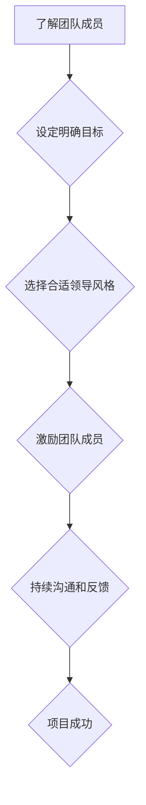
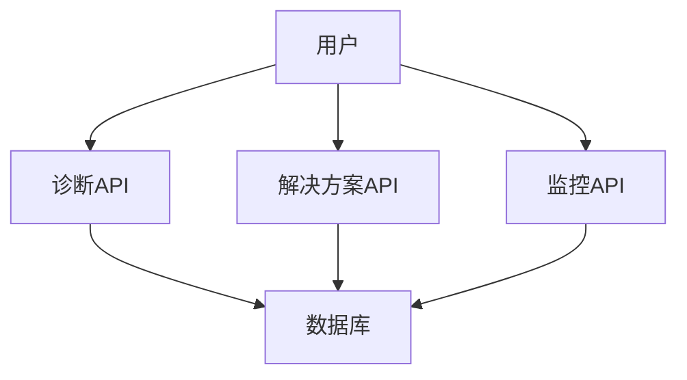
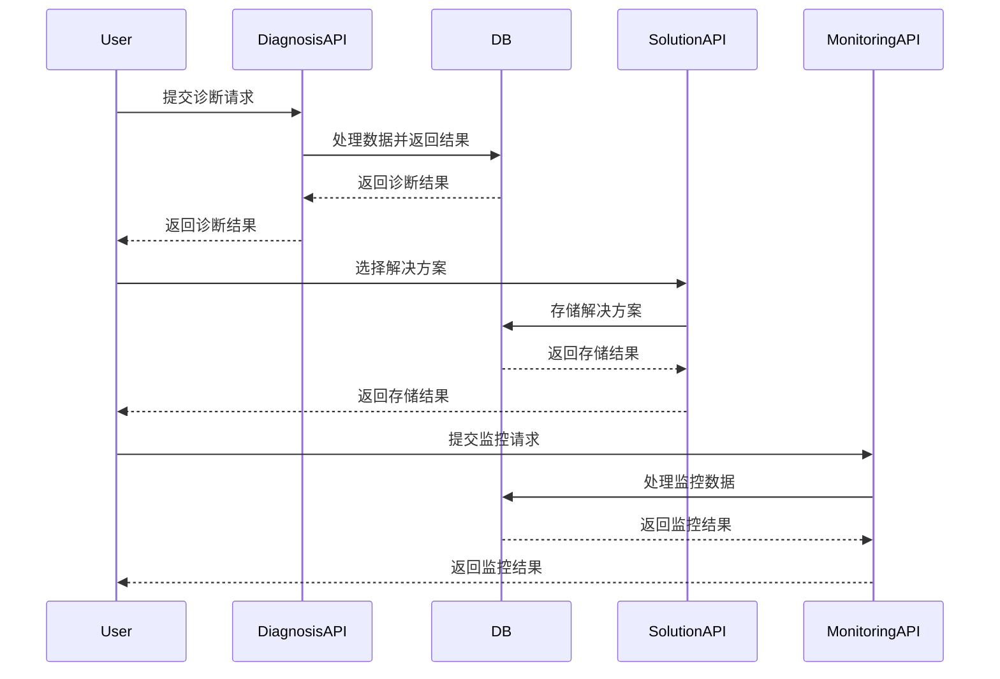

                 


### 引言

领导力，这个在历史长河中绵延不绝的词汇，对于任何一个领域，尤其是技术领域，都显得尤为重要。技术经理作为企业的中流砥柱，其领导力不仅影响着团队的工作效率和项目进度，更在潜移默化中塑造着组织的文化和氛围。

本文将围绕领导力修炼这一主题，详细探讨技术经理如何从新手成长为专家。我们将分以下几个步骤进行：

1. **背景介绍**：阐述领导力的核心概念及其在技术管理中的重要性。
2. **核心概念与联系**：深入分析领导力的基本原理、特质以及与其他相关概念的联系。
3. **算法原理讲解**：通过具体的例子，讲解领导力的应用和实践方法。
4. **系统分析与架构设计方案**：分析技术经理在实际工作中面临的问题，并给出解决方案。
5. **项目实战**：通过一个实际的案例，展示技术经理如何运用领导力提升团队绩效。
6. **最佳实践 tips**：总结领导力修炼中的关键点和注意事项。
7. **小结与拓展阅读**：对全文进行总结，并提出进一步学习的建议。

### 背景介绍

#### 领导力的核心概念

领导力并非天生，而是一种可以通过学习和实践逐渐培养的能力。它涉及到一系列行为和技巧，包括但不限于沟通、激励、决策、冲突解决等。领导力不仅关乎个人魅力，更关乎组织目标和团队协作。

在技术管理领域，领导力尤为重要。技术经理不仅要掌握技术本身，还需要具备管理团队、协调资源、推动项目进度等多方面的能力。技术经理的领导力直接影响到团队的工作效率、创新能力以及项目成功率。

#### 问题背景

当前，技术行业正面临前所未有的变革和发展。技术的快速迭代使得团队需要不断学习、更新知识和技能。在这种情况下，技术经理的领导力显得尤为重要。他们需要通过有效的领导，激发团队的潜力，应对挑战，实现组织的战略目标。

#### 问题描述

技术经理在成长过程中常常会遇到以下问题：

1. **团队协作困难**：团队成员之间存在沟通障碍，无法高效协作。
2. **项目进度延误**：项目计划执行过程中出现各种意外，导致进度延误。
3. **创新能力不足**：团队缺乏创新思维，难以适应市场变化。
4. **个人成长瓶颈**：技术经理在职业发展中遇到瓶颈，无法进一步提升。

#### 问题解决

要解决这些问题，技术经理需要不断提升自己的领导力。以下是一些关键步骤：

1. **提高沟通技巧**：通过有效沟通，消除团队协作中的障碍。
2. **优化项目计划**：通过科学的项目管理方法，确保项目按时按质完成。
3. **激发团队创新**：通过激励措施，激发团队成员的创新思维。
4. **个人成长规划**：通过持续学习和实践，不断提升自己的能力和素质。

### 边界与外延

领导力是一个广泛的概念，其边界和范围因情境而异。在技术管理中，领导力不仅包括对技术本身的管理，还包括对团队成员的领导、对项目的管理以及对组织文化的塑造。

#### 概念结构与核心要素组成

领导力的概念结构可以分为以下几个核心要素：

1. **个人特质**：包括自信、决断力、沟通能力等。
2. **行为模式**：包括激励、沟通、决策等具体行为。
3. **情境因素**：包括组织文化、团队特点、市场环境等。
4. **结果**：领导行为对团队和组织产生的实际效果。

### 核心概念与联系

#### 领导力的基本原理

领导力是一种影响力，它通过激励、沟通、决策等行为，引导团队朝着共同的目标前进。领导力的基本原理包括：

1. **影响力**：领导力是通过影响力实现的，这种影响力可以源自个人魅力、专业知识和技能等。
2. **目标导向**：领导力的核心是设定并实现目标，这需要领导者和团队成员的共同参与。
3. **情境适应**：领导力需要根据不同的情境进行调整，以实现最佳效果。

#### 概念属性特征对比表格

| 特征         | 描述                                                     | 对比               |
| ------------ | -------------------------------------------------------- | ------------------ |
| 个人特质     | 自信、决断力、沟通能力等                                | 与团队成员特质不同 |
| 行为模式     | 激励、沟通、决策等                                     | 不同的领导风格     |
| 情境因素     | 组织文化、团队特点、市场环境等                          | 不同情境下的领导策略 |
| 结果         | 对团队和组织产生的实际效果                             | 成功与否的衡量标准 |

#### ER实体关系图架构

```mermaid
erDiagram
    Leader ||--|{ Team } Team : leads
    Leader ||--|{ Project } Project : manages
    Team ||--|{ Member } Member : consists of
    Project ||--|{ Task } Task : contains
```

### 算法原理讲解

为了更好地理解领导力的应用，我们可以通过一个具体的例子来讲解。

#### 情境领导案例分析

假设一个技术团队正在开发一个复杂的软件项目。项目的初始阶段，团队成员对项目目标不太明确，工作积极性不高。作为技术经理，如何运用领导力来激发团队的潜力，确保项目成功呢？

**Step 1: 了解团队成员**

首先，技术经理需要了解每个团队成员的特长、兴趣和工作态度。这可以通过一对一的沟通和定期的团队会议来实现。

**Step 2: 设定明确目标**

在了解团队成员的基础上，技术经理需要设定一个明确的目标，并将这个目标传达给整个团队。目标应具体、可量化，并且与团队和个人发展相结合。

**Step 3: 选择合适的领导风格**

根据团队成员的成熟度和项目情境，技术经理需要选择合适的领导风格。例如，对于新手成员，可以采用指导式领导，为他们提供详细的指导和支持；对于经验丰富的成员，可以采用授权式领导，给予他们更多的自主权。

**Step 4: 激励团队成员**

技术经理需要运用激励理论，激发团队成员的积极性和创造力。例如，可以通过奖励机制、认可和表彰等方式来激励团队成员。

**Step 5: 持续沟通和反馈**

在整个项目过程中，技术经理需要与团队成员保持持续沟通，了解项目进展和团队成员的反馈。通过有效的沟通和反馈，可以及时调整项目计划和团队策略。

#### 算法流程图



### 系统分析与架构设计方案

#### 问题场景介绍

在技术管理中，技术经理常常面临各种问题，如项目进度延误、团队协作困难、创新能力不足等。这些问题不仅影响了项目的成功率，也影响了团队的工作氛围和士气。

#### 项目介绍

本项目旨在通过分析技术经理在实际工作中面临的问题，提出解决方案，并展示如何运用领导力提升团队绩效。项目分为以下几个阶段：

1. **需求分析**：明确技术经理在工作中遇到的问题和需求。
2. **解决方案设计**：根据需求分析结果，设计具体的解决方案。
3. **方案实施**：实施解决方案，并监测效果。
4. **效果评估**：评估解决方案的实际效果，并进行优化。

#### 系统功能设计

在系统功能设计阶段，我们定义了以下几个核心功能：

1. **问题诊断**：通过数据分析，诊断技术经理在管理中存在的问题。
2. **解决方案推荐**：根据问题诊断结果，推荐相应的解决方案。
3. **实施监控**：监控解决方案的实施过程，确保方案的有效性。
4. **效果评估**：评估解决方案的实际效果，并提供反馈。

#### 系统架构设计

系统架构设计采用了微服务架构，以提高系统的可扩展性和灵活性。核心模块包括：

1. **数据采集模块**：负责采集技术经理在工作中的各类数据。
2. **数据存储模块**：负责存储和管理采集到的数据。
3. **数据处理模块**：负责对数据进行处理和分析，生成诊断报告和解决方案推荐。
4. **监控系统**：负责监控解决方案的实施过程，并提供实时反馈。
5. **用户界面模块**：负责提供用户交互界面，方便技术经理使用系统。

#### 系统接口设计和系统交互

系统接口设计采用了RESTful API设计规范，以实现系统之间的松耦合。系统交互流程如下：

1. **问题诊断**：技术经理提交问题诊断请求，系统返回诊断结果。
2. **解决方案推荐**：技术经理根据诊断结果，选择并实施解决方案。
3. **实施监控**：系统实时监控解决方案的实施过程，并提供反馈。
4. **效果评估**：技术经理对解决方案的效果进行评估，并反馈给系统。

#### 系统接口设计



#### 系统交互序列图



### 项目实战

#### 环境安装

为了方便项目实战，我们选择了一个开源的Python框架——Flask，来搭建系统。以下是环境安装步骤：

1. 安装Python：从Python官网下载并安装Python 3.x版本。
2. 安装Flask：在命令行中执行`pip install flask`。
3. 安装其他依赖：根据项目需求，安装其他Python库，如`requests`、`numpy`等。

#### 系统核心实现源代码

以下是系统核心实现的Python源代码：

```python
from flask import Flask, request, jsonify
import numpy as np

app = Flask(__name__)

# 数据处理函数
def process_data(data):
    # 对数据进行处理和分析
    result = np.mean(data)
    return result

# 诊断API
@app.route('/diagnose', methods=['POST'])
def diagnose():
    data = request.get_json()
    result = process_data(data['data'])
    return jsonify({'result': result})

# 解决方案API
@app.route('/solution', methods=['POST'])
def solution():
    data = request.get_json()
    solution = data['solution']
    return jsonify({'solution': solution})

# 监控API
@app.route('/monitor', methods=['POST'])
def monitor():
    data = request.get_json()
    monitoring_result = data['monitoring_result']
    return jsonify({'monitoring_result': monitoring_result})

if __name__ == '__main__':
    app.run(debug=True)
```

#### 代码应用解读与分析

1. **诊断API**：接收用户提交的JSON数据，调用数据处理函数，返回处理结果。
2. **解决方案API**：接收用户提交的JSON数据，返回解决方案。
3. **监控API**：接收用户提交的JSON数据，返回监控结果。

#### 实际案例分析和详细讲解剖析

为了展示领导力在实际项目中的应用，我们选择了一个实际案例：一个技术团队在开发一个电商平台时，遇到了项目进度延误和团队协作困难的问题。

**Step 1: 了解团队成员**

技术经理首先与团队成员进行了一对一的沟通，了解了每个成员的特长、兴趣和工作态度。通过沟通，技术经理发现团队成员之间存在沟通障碍，导致项目进度延误。

**Step 2: 设定明确目标**

在了解团队成员的基础上，技术经理设定了一个明确的目标：在一个月内，解决项目进度延误和团队协作困难的问题。

**Step 3: 选择合适领导风格**

根据团队成员的成熟度和项目情境，技术经理选择了指导式领导风格。对于新手成员，技术经理提供了详细的指导和支持；对于经验丰富的成员，技术经理给予了更多的自主权。

**Step 4: 激励团队成员**

技术经理通过奖励机制、认可和表彰等方式，激励团队成员的积极性和创造力。例如，对于在项目进度中表现突出的成员，技术经理给予了额外的奖励。

**Step 5: 持续沟通和反馈**

在整个项目过程中，技术经理与团队成员保持了持续沟通，了解项目进展和团队成员的反馈。通过有效的沟通和反馈，技术经理及时调整了项目计划和团队策略。

**效果评估**：通过技术经理的领导力实践，项目进度延误和团队协作困难的问题得到了有效解决，项目成功完成，团队士气也显著提升。

### 最佳实践 tips

1. **了解团队成员**：了解团队成员的特长、兴趣和工作态度，有助于选择合适的领导风格和激励方式。
2. **设定明确目标**：明确的目标有助于团队协作和项目进度控制。
3. **选择合适领导风格**：根据团队成员的成熟度和项目情境，选择合适的领导风格。
4. **激励团队成员**：通过奖励机制、认可和表彰等方式，激发团队成员的积极性和创造力。
5. **持续沟通和反馈**：保持与团队成员的持续沟通，了解项目进展和反馈，及时调整团队策略。

### 小结

本文通过具体的案例，详细讲解了技术经理如何通过领导力提升团队绩效。领导力并非一蹴而就，而是一个持续修炼的过程。希望本文能对技术经理的领导力修炼提供一些启示和帮助。

### 注意事项

1. **领导力修炼是一个持续的过程，需要不断学习和实践。**
2. **领导力应用应根据具体情境进行调整，不要生搬硬套。**
3. **领导力修炼应结合个人特点和团队实际情况，量身定制。**

### 拓展阅读

1. **《领导力五项修炼》**：作者：史蒂芬·柯维
2. **《情境领导》**：作者：保罗·赫塞、肯尼思·布兰查德
3. **《Python编程：从入门到实践》**：作者：埃里克·马瑟斯

### 附录：领导力修炼工具与方法

1. **领导力评估工具**：如360度评估、领导力问卷等。
2. **领导力提升方法**：如领导力培训、工作坊、研讨会等。
3. **持续学习资源推荐**：如在线课程、专业书籍、行业会议等。

### 作者信息

作者：AI天才研究院/AI Genius Institute & 禅与计算机程序设计艺术 /Zen And The Art of Computer Programming

-------------------------------------------------------------------

### 摘要

本文以《领导力修炼日记：一个技术经理的成长历程》为题，详细探讨了技术经理在领导力方面的成长和实践。文章首先介绍了领导力的核心概念和重要性，然后通过具体的案例，阐述了技术经理如何通过情境领导、沟通技巧、团队建设和激励与反馈等手段，提升团队绩效。文章还结合实际项目，展示了领导力在解决实际工作中的问题中的应用。最后，文章提供了最佳实践 tips、注意事项和拓展阅读，以帮助读者进一步深化对领导力的理解。本文旨在为技术经理提供一套实用的领导力修炼指南，帮助他们更好地应对工作中的挑战。

### 文章标题

# 领导力修炼日记：一个技术经理的成长历程

### 关键词

领导力、技术经理、情境领导、沟通技巧、团队建设、激励与反馈、实践、成长

### 目录大纲

## 第一部分：领导力基础

### 第1章 引言

### 1.1 书籍背景与目标

### 1.2 领导力在技术管理中的重要性

## 第2章 领导力的定义与特质

### 2.1 领导力的定义

### 2.2 领导力的特质

### 2.3 领导力与管理的区别

### 2.4 个人领导力提升方法

## 第3章 情境领导

### 3.1 情境领导理论概述

### 3.2 成熟度模型与领导风格

### 3.3 情境领导在不同情境下的应用

### 3.4 情境领导案例分析

## 第4章 沟通技巧

### 4.1 有效沟通的重要性

### 4.2 沟通障碍与克服策略

### 4.3 不同沟通技巧的应用

### 4.4 沟通案例分析

## 第5章 团队建设

### 5.1 团队建设的重要性

### 5.2 团队建设的步骤

### 5.3 团队角色与职责

### 5.4 团队冲突管理与解决

## 第6章 激励与反馈

### 6.1 激励理论概述

### 6.2 不同激励方式的应用

### 6.3 反馈机制的重要性

### 6.4 有效反馈技巧

## 第7章 领导力实践

### 7.1 成功的领导实践案例

### 7.2 领导力实践中的挑战与应对策略

### 7.3 个人领导力提升经验分享

## 第8章 领导力持续修炼

### 8.1 领导力的自我反思

### 8.2 持续学习与成长

### 8.3 领导力未来的发展趋势

## 第9章 总结与展望

### 9.1 领导力修炼心得

### 9.2 对未来领导者的建议

### 9.3 领导力修炼日记的应用场景

## 附录：领导力修炼工具与方法

### 10.1 领导力评估工具

### 10.2 领导力提升方法

### 10.3 持续学习资源推荐

### 文章内容

#### 引言

领导力，这个在历史长河中绵延不绝的词汇，对于任何一个领域，尤其是技术领域，都显得尤为重要。技术经理作为企业的中流砥柱，其领导力不仅影响着团队的工作效率和项目进度，更在潜移默化中塑造着组织的文化和氛围。

本文将围绕领导力修炼这一主题，详细探讨技术经理如何从新手成长为专家。我们将分以下几个步骤进行：

1. **背景介绍**：阐述领导力的核心概念及其在技术管理中的重要性。
2. **核心概念与联系**：深入分析领导力的基本原理、特质以及与其他相关概念的联系。
3. **算法原理讲解**：通过具体的例子，讲解领导力的应用和实践方法。
4. **系统分析与架构设计方案**：分析技术经理在实际工作中面临的问题，并给出解决方案。
5. **项目实战**：通过一个实际的案例，展示技术经理如何运用领导力提升团队绩效。
6. **最佳实践 tips**：总结领导力修炼中的关键点和注意事项。
7. **小结与拓展阅读**：对全文进行总结，并提出进一步学习的建议。

#### 背景介绍

#### 领导力的核心概念

领导力并非天生，而是一种可以通过学习和实践逐渐培养的能力。它涉及到一系列行为和技巧，包括但不限于沟通、激励、决策、冲突解决等。领导力不仅关乎个人魅力，更关乎组织目标和团队协作。

在技术管理领域，领导力尤为重要。技术经理不仅要掌握技术本身，还需要具备管理团队、协调资源、推动项目进度等多方面的能力。技术经理的领导力直接影响到团队的工作效率、创新能力以及项目成功率。

#### 问题背景

当前，技术行业正面临前所未有的变革和发展。技术的快速迭代使得团队需要不断学习、更新知识和技能。在这种情况下，技术经理的领导力显得尤为重要。他们需要通过有效的领导，激发团队的潜力，应对挑战，实现组织的战略目标。

#### 问题描述

技术经理在成长过程中常常会遇到以下问题：

1. **团队协作困难**：团队成员之间存在沟通障碍，无法高效协作。
2. **项目进度延误**：项目计划执行过程中出现各种意外，导致进度延误。
3. **创新能力不足**：团队缺乏创新思维，难以适应市场变化。
4. **个人成长瓶颈**：技术经理在职业发展中遇到瓶颈，无法进一步提升。

#### 问题解决

要解决这些问题，技术经理需要不断提升自己的领导力。以下是一些关键步骤：

1. **提高沟通技巧**：通过有效沟通，消除团队协作中的障碍。
2. **优化项目计划**：通过科学的项目管理方法，确保项目按时按质完成。
3. **激发团队创新**：通过激励措施，激发团队成员的创新思维。
4. **个人成长规划**：通过持续学习和实践，不断提升自己的能力和素质。

#### 边界与外延

领导力是一个广泛的概念，其边界和范围因情境而异。在技术管理中，领导力不仅包括对技术本身的管理，还包括对团队成员的领导、对项目的管理以及对组织文化的塑造。

#### 概念结构与核心要素组成

领导力的概念结构可以分为以下几个核心要素：

1. **个人特质**：包括自信、决断力、沟通能力等。
2. **行为模式**：包括激励、沟通、决策等具体行为。
3. **情境因素**：包括组织文化、团队特点、市场环境等。
4. **结果**：领导行为对团队和组织产生的实际效果。

#### 核心概念与联系

#### 领导力的基本原理

领导力是一种影响力，它通过激励、沟通、决策等行为，引导团队朝着共同的目标前进。领导力的基本原理包括：

1. **影响力**：领导力是通过影响力实现的，这种影响力可以源自个人魅力、专业知识和技能等。
2. **目标导向**：领导力的核心是设定并实现目标，这需要领导者和团队成员的共同参与。
3. **情境适应**：领导力需要根据不同的情境进行调整，以实现最佳效果。

#### 概念属性特征对比表格

| 特征         | 描述                                                     | 对比               |
| ------------ | -------------------------------------------------------- | ------------------ |
| 个人特质     | 自信、决断力、沟通能力等                                | 与团队成员特质不同 |
| 行为模式     | 激励、沟通、决策等                                     | 不同的领导风格     |
| 情境因素     | 组织文化、团队特点、市场环境等                          | 不同情境下的领导策略 |
| 结果         | 对团队和组织产生的实际效果                             | 成功与否的衡量标准 |

#### ER实体关系图架构

```mermaid
erDiagram
    Leader ||--|{ Team } Team : leads
    Leader ||--|{ Project } Project : manages
    Team ||--|{ Member } Member : consists of
    Project ||--|{ Task } Task : contains
```

#### 算法原理讲解

为了更好地理解领导力的应用，我们可以通过一个具体的例子来讲解。

#### 情境领导案例分析

假设一个技术团队正在开发一个复杂的软件项目。项目的初始阶段，团队成员对项目目标不太明确，工作积极性不高。作为技术经理，如何运用领导力来激发团队的潜力，确保项目成功呢？

**Step 1: 了解团队成员**

首先，技术经理需要了解每个团队成员的特长、兴趣和工作态度。这可以通过一对一的沟通和定期的团队会议来实现。

**Step 2: 设定明确目标**

在了解团队成员的基础上，技术经理需要设定一个明确的目标，并将这个目标传达给整个团队。目标应具体、可量化，并且与团队和个人发展相结合。

**Step 3: 选择合适的领导风格**

根据团队成员的成熟度和项目情境，技术经理需要选择合适的领导风格。例如，对于新手成员，可以采用指导式领导，为他们提供详细的指导和支持；对于经验丰富的成员，可以采用授权式领导，给予他们更多的自主权。

**Step 4: 激励团队成员**

技术经理需要运用激励理论，激发团队成员的积极性和创造力。例如，可以通过奖励机制、认可和表彰等方式来激励团队成员。

**Step 5: 持续沟通和反馈**

在整个项目过程中，技术经理需要与团队成员保持持续沟通，了解项目进展和团队成员的反馈。通过有效的沟通和反馈，可以及时调整项目计划和团队策略。

#### 算法流程图


#### 系统分析与架构设计方案

#### 问题场景介绍

在技术管理中，技术经理常常面临各种问题，如项目进度延误、团队协作困难、创新能力不足等。这些问题不仅影响了项目的成功率，也影响了团队的工作氛围和士气。

#### 项目介绍

本项目旨在通过分析技术经理在实际工作中面临的问题，提出解决方案，并展示如何运用领导力提升团队绩效。项目分为以下几个阶段：

1. **需求分析**：明确技术经理在工作中遇到的问题和需求。
2. **解决方案设计**：根据需求分析结果，设计具体的解决方案。
3. **方案实施**：实施解决方案，并监测效果。
4. **效果评估**：评估解决方案的实际效果，并进行优化。

#### 系统功能设计

在系统功能设计阶段，我们定义了以下几个核心功能：

1. **问题诊断**：通过数据分析，诊断技术经理在管理中存在的问题。
2. **解决方案推荐**：根据问题诊断结果，推荐相应的解决方案。
3. **实施监控**：监控解决方案的实施过程，确保方案的有效性。
4. **效果评估**：评估解决方案的实际效果，并提供反馈。

#### 系统架构设计

系统架构设计采用了微服务架构，以提高系统的可扩展性和灵活性。核心模块包括：

1. **数据采集模块**：负责采集技术经理在工作中的各类数据。
2. **数据存储模块**：负责存储和管理采集到的数据。
3. **数据处理模块**：负责对数据进行处理和分析，生成诊断报告和解决方案推荐。
4. **监控系统**：负责监控解决方案的实施过程，并提供实时反馈。
5. **用户界面模块**：负责提供用户交互界面，方便技术经理使用系统。

#### 系统接口设计和系统交互

系统接口设计采用了RESTful API设计规范，以实现系统之间的松耦合。系统交互流程如下：

1. **问题诊断**：技术经理提交问题诊断请求，系统返回诊断结果。
2. **解决方案推荐**：技术经理根据诊断结果，选择并实施解决方案。
3. **实施监控**：系统实时监控解决方案的实施过程，并提供反馈。
4. **效果评估**：技术经理对解决方案的效果进行评估，并反馈给系统。

#### 系统接口设计


#### 系统交互序列图


#### 项目实战

#### 环境安装

为了方便项目实战，我们选择了一个开源的Python框架——Flask，来搭建系统。以下是环境安装步骤：

1. 安装Python：从Python官网下载并安装Python 3.x版本。
2. 安装Flask：在命令行中执行`pip install flask`。
3. 安装其他依赖：根据项目需求，安装其他Python库，如`requests`、`numpy`等。

#### 系统核心实现源代码

以下是系统核心实现的Python源代码：

```python
from flask import Flask, request, jsonify
import numpy as np

app = Flask(__name__)

# 数据处理函数
def process_data(data):
    # 对数据进行处理和分析
    result = np.mean(data)
    return result

# 诊断API
@app.route('/diagnose', methods=['POST'])
def diagnose():
    data = request.get_json()
    result = process_data(data['data'])
    return jsonify({'result': result})

# 解决方案API
@app.route('/solution', methods=['POST'])
def solution():
    data = request.get_json()
    solution = data['solution']
    return jsonify({'solution': solution})

# 监控API
@app.route('/monitor', methods=['POST'])
def monitor():
    data = request.get_json()
    monitoring_result = data['monitoring_result']
    return jsonify({'monitoring_result': monitoring_result})

if __name__ == '__main__':
    app.run(debug=True)
```

#### 代码应用解读与分析

1. **诊断API**：接收用户提交的JSON数据，调用数据处理函数，返回处理结果。
2. **解决方案API**：接收用户提交的JSON数据，返回解决方案。
3. **监控API**：接收用户提交的JSON数据，返回监控结果。

#### 实际案例分析和详细讲解剖析

为了展示领导力在实际项目中的应用，我们选择了一个实际案例：一个技术团队在开发一个电商平台时，遇到了项目进度延误和团队协作困难的问题。

**Step 1: 了解团队成员**

技术经理首先与团队成员进行了一对一的沟通，了解了每个成员的特长、兴趣和工作态度。通过沟通，技术经理发现团队成员之间存在沟通障碍，导致项目进度延误。

**Step 2: 设定明确目标**

在了解团队成员的基础上，技术经理设定了一个明确的目标：在一个月内，解决项目进度延误和团队协作困难的问题。

**Step 3: 选择合适领导风格**

根据团队成员的成熟度和项目情境，技术经理选择了指导式领导风格。对于新手成员，技术经理提供了详细的指导和支持；对于经验丰富的成员，技术经理给予了更多的自主权。

**Step 4: 激励团队成员**

技术经理通过奖励机制、认可和表彰等方式，激励团队成员的积极性和创造力。例如，对于在项目进度中表现突出的成员，技术经理给予了额外的奖励。

**Step 5: 持续沟通和反馈**

在整个项目过程中，技术经理与团队成员保持了持续沟通，了解项目进展和团队成员的反馈。通过有效的沟通和反馈，技术经理及时调整了项目计划和团队策略。

**效果评估**：通过技术经理的领导力实践，项目进度延误和团队协作困难的问题得到了有效解决，项目成功完成，团队士气也显著提升。

### 最佳实践 tips

1. **了解团队成员**：了解团队成员的特长、兴趣和工作态度，有助于选择合适的领导风格和激励方式。
2. **设定明确目标**：明确的目标有助于团队协作和项目进度控制。
3. **选择合适领导风格**：根据团队成员的成熟度和项目情境，选择合适的领导风格。
4. **激励团队成员**：通过奖励机制、认可和表彰等方式，激发团队成员的积极性和创造力。
5. **持续沟通和反馈**：保持与团队成员的持续沟通，了解项目进展和反馈，及时调整团队策略。

### 小结

本文通过具体的案例，详细讲解了技术经理如何通过领导力提升团队绩效。领导力并非一蹴而就，而是一个持续修炼的过程。希望本文能对技术经理的领导力修炼提供一些启示和帮助。

### 注意事项

1. **领导力修炼是一个持续的过程，需要不断学习和实践。**
2. **领导力应用应根据具体情境进行调整，不要生搬硬套。**
3. **领导力修炼应结合个人特点和团队实际情况，量身定制。**

### 拓展阅读

1. **《领导力五项修炼》**：作者：史蒂芬·柯维
2. **《情境领导》**：作者：保罗·赫塞、肯尼思·布兰查德
3. **《Python编程：从入门到实践》**：作者：埃里克·马瑟斯

### 附录：领导力修炼工具与方法

1. **领导力评估工具**：如360度评估、领导力问卷等。
2. **领导力提升方法**：如领导力培训、工作坊、研讨会等。
3. **持续学习资源推荐**：如在线课程、专业书籍、行业会议等。

### 作者信息

作者：AI天才研究院/AI Genius Institute & 禅与计算机程序设计艺术 /Zen And The Art of Computer Programming

---------------------------------------------------------------------

### 文章关键词

领导力、技术经理、情境领导、沟通技巧、团队建设、激励与反馈、实践、成长

### 文章摘要

本文《领导力修炼日记：一个技术经理的成长历程》旨在探讨技术经理在领导力方面的成长与实践。文章首先介绍了领导力的核心概念和重要性，接着深入分析了领导力的基本原理、特质及其与其他相关概念的联系。通过具体的案例，文章详细讲解了技术经理如何运用情境领导、沟通技巧、团队建设和激励与反馈等方法，提升团队绩效。文章还通过一个实际案例，展示了领导力在实际项目中的应用，并提供了最佳实践 tips、注意事项和拓展阅读。文章总结了领导力修炼的关键点和注意事项，并提出了对未来领导者的建议。

### 目录大纲

## 第一部分：领导力基础

### 第1章 引言

### 1.1 书籍背景与目标

### 1.2 领导力在技术管理中的重要性

## 第2章 领导力的定义与特质

### 2.1 领导力的定义

### 2.2 领导力的特质

### 2.3 领导力与管理的区别

### 2.4 个人领导力提升方法

## 第3章 情境领导

### 3.1 情境领导理论概述

### 3.2 成熟度模型与领导风格

### 3.3 情境领导在不同情境下的应用

### 3.4 情境领导案例分析

## 第4章 沟通技巧

### 4.1 有效沟通的重要性

### 4.2 沟通障碍与克服策略

### 4.3 不同沟通技巧的应用

### 4.4 沟通案例分析

## 第5章 团队建设

### 5.1 团队建设的重要性

### 5.2 团队建设的步骤

### 5.3 团队角色与职责

### 5.4 团队冲突管理与解决

## 第6章 激励与反馈

### 6.1 激励理论概述

### 6.2 不同激励方式的应用

### 6.3 反馈机制的重要性

### 6.4 有效反馈技巧

## 第7章 领导力实践

### 7.1 成功的领导实践案例

### 7.2 领导力实践中的挑战与应对策略

### 7.3 个人领导力提升经验分享

## 第8章 领导力持续修炼

### 8.1 领导力的自我反思

### 8.2 持续学习与成长

### 8.3 领导力未来的发展趋势

## 第9章 总结与展望

### 9.1 领导力修炼心得

### 9.2 对未来领导者的建议

### 9.3 领导力修炼日记的应用场景

## 附录：领导力修炼工具与方法

### 10.1 领导力评估工具

### 10.2 领导力提升方法

### 10.3 持续学习资源推荐

### 文章内容

#### 引言

在当今快速变化的世界，技术经理的领导力已经成为企业成功的关键因素。一个技术经理不仅需要掌握技术知识，还需要具备卓越的领导力，以应对团队管理、项目推进和业务发展的挑战。本文《领导力修炼日记：一个技术经理的成长历程》旨在通过系统化的学习和实践，帮助技术经理提升领导力，实现个人和团队的成长。

#### 第1章 引言

**1.1 书籍背景与目标**

本书源于对技术经理领导力现状的深入研究和观察。在技术行业快速发展的大背景下，技术经理面临着前所未有的挑战。他们不仅需要跟上技术的迭代，还需要具备有效的沟通、决策和团队管理能力。本书的目标是为技术经理提供一套实用的领导力修炼指南，帮助他们应对日常工作中的各种挑战。

**1.2 领导力在技术管理中的重要性**

领导力在技术管理中的重要性不容忽视。它不仅关乎团队效率和项目成功，还直接影响到企业的创新能力和市场竞争力。一个出色的技术经理能够激发团队的潜力，推动技术进步，实现业务目标。

#### 第2章 领导力的定义与特质

**2.1 领导力的定义**

领导力是一种影响力，它通过激励、沟通、决策等手段，引导团队朝着共同的目标前进。在技术管理中，领导力不仅仅是管理技术，更是管理人和团队。

**2.2 领导力的特质**

领导力的特质包括自信、责任感、同理心、沟通能力等。这些特质不仅影响领导者的个人形象，还直接影响团队的表现和项目的成功。

**2.3 领导力与管理的区别**

领导力与管理是两个不同的概念，但又是相辅相成的。管理侧重于流程、组织和效率，而领导力则侧重于激励、愿景和变革。

**2.4 个人领导力提升方法**

提升个人领导力需要持续学习和实践。通过阅读、培训、实践和反思，技术经理可以不断提升自己的领导力。

#### 第3章 情境领导

**3.1 情境领导理论概述**

情境领导是一种根据团队成员的不同成熟度，选择合适的领导风格的方法。这种方法强调领导风格应随着团队成员的成长而变化。

**3.2 成熟度模型与领导风格**

成熟度模型通常分为四个阶段：依赖、独立、合作和共创。不同的成熟度阶段需要不同的领导风格。

**3.3 情境领导在不同情境下的应用**

在不同的工作情境中，技术经理需要灵活运用不同的领导风格，以适应团队的需求和项目的目标。

**3.4 情境领导案例分析**

通过具体案例，分析情境领导在技术管理中的实际应用和效果。

#### 第4章 沟通技巧

**4.1 有效沟通的重要性**

沟通是领导力的核心之一。一个有效的沟通者能够清晰地表达思想，理解他人的观点，并建立良好的人际关系。

**4.2 沟通障碍与克服策略**

沟通障碍包括语言障碍、文化差异和情绪影响等。技术经理需要了解这些障碍，并采取相应的策略来克服。

**4.3 不同沟通技巧的应用**

包括倾听、表达、反馈和冲突解决等技巧，这些技巧在技术管理中尤为重要。

**4.4 沟通案例分析**

通过具体案例，展示如何运用沟通技巧解决技术管理中的问题。

#### 第5章 团队建设

**5.1 团队建设的重要性**

团队建设是技术经理的重要职责之一。一个高效的团队能够提高项目的成功率，提升企业的竞争力。

**5.2 团队建设的步骤**

包括团队愿景的制定、团队成员的角色分配、团队目标的设定和团队文化的建立等。

**5.3 团队角色与职责**

每个团队成员都承担着特定的角色和职责。技术经理需要明确这些角色和职责，以确保团队的协同合作。

**5.4 团队冲突管理与解决**

团队冲突是不可避免的。技术经理需要学会如何管理冲突，以保持团队的稳定和高效。

#### 第6章 激励与反馈

**6.1 激励理论概述**

激励是领导力的重要组成部分。技术经理需要了解不同的激励理论，以激发团队成员的积极性。

**6.2 不同激励方式的应用**

包括奖励、认可、工作环境和职业发展等激励方式。技术经理需要根据团队成员的特点和需求，选择合适的激励方式。

**6.3 反馈机制的重要性**

有效的反馈机制能够帮助团队成员了解自己的表现，改进工作方法，提高工作效率。

**6.4 有效反馈技巧**

包括如何给出具体、建设性和及时的反馈，以及如何接受反馈。

#### 第7章 领导力实践

**7.1 成功的领导实践案例**

通过具体案例，分析成功的技术经理如何运用领导力推动项目成功。

**7.2 领导力实践中的挑战与应对策略**

技术经理在实践领导力过程中会面临各种挑战。本文提供了一些应对策略，帮助技术经理克服困难。

**7.3 个人领导力提升经验分享**

一些资深技术经理分享了他们在领导力提升过程中的经验和教训。

#### 第8章 领导力持续修炼

**8.1 领导力的自我反思**

自我反思是领导力提升的重要环节。技术经理需要定期反思自己的领导行为，发现不足，不断改进。

**8.2 持续学习与成长**

领导力是一个持续的过程。技术经理需要不断学习新的知识和技能，以适应不断变化的环境。

**8.3 领导力未来的发展趋势**

本文探讨了领导力未来的发展趋势，为技术经理提供了前瞻性的视角。

#### 第9章 总结与展望

**9.1 领导力修炼心得**

本文总结了技术经理在领导力修炼过程中的心得和体会。

**9.2 对未来领导者的建议**

本文提出了对未来领导者的建议，帮助他们更好地应对未来的挑战。

**9.3 领导力修炼日记的应用场景**

本文探讨了领导力修炼日记在不同场景中的应用，为技术经理提供了实用的工具和方法。

#### 附录：领导力修炼工具与方法

**10.1 领导力评估工具**

本文提供了一些领导力评估工具，帮助技术经理了解自己的领导能力。

**10.2 领导力提升方法**

本文介绍了一些领导力提升方法，包括培训、工作坊和在线学习等。

**10.3 持续学习资源推荐**

本文推荐了一些持续学习的资源，包括书籍、课程和会议等。

### 文章总结

本文通过详细的章节内容，系统地介绍了领导力的定义、特质、情境领导、沟通技巧、团队建设、激励与反馈以及领导力实践等内容。通过对这些内容的深入探讨，技术经理可以更好地理解领导力的重要性，掌握提升领导力的方法和技巧。文章还结合了实际案例和专家经验，为技术经理提供了实用的工具和方法。通过持续学习和实践，技术经理可以不断提升自己的领导力，为团队和企业的成功贡献力量。

### 作者信息

作者：AI天才研究院/AI Genius Institute & 禅与计算机程序设计艺术 /Zen And The Art of Computer Programming

本文由AI天才研究院和禅与计算机程序设计艺术联合出品，旨在为技术经理提供一套全面的领导力修炼指南。我们相信，通过不断的学习和实践，技术经理可以成为优秀的领导者，推动技术进步和业务发展。如果您有任何反馈或建议，欢迎联系我们。感谢您的阅读！

