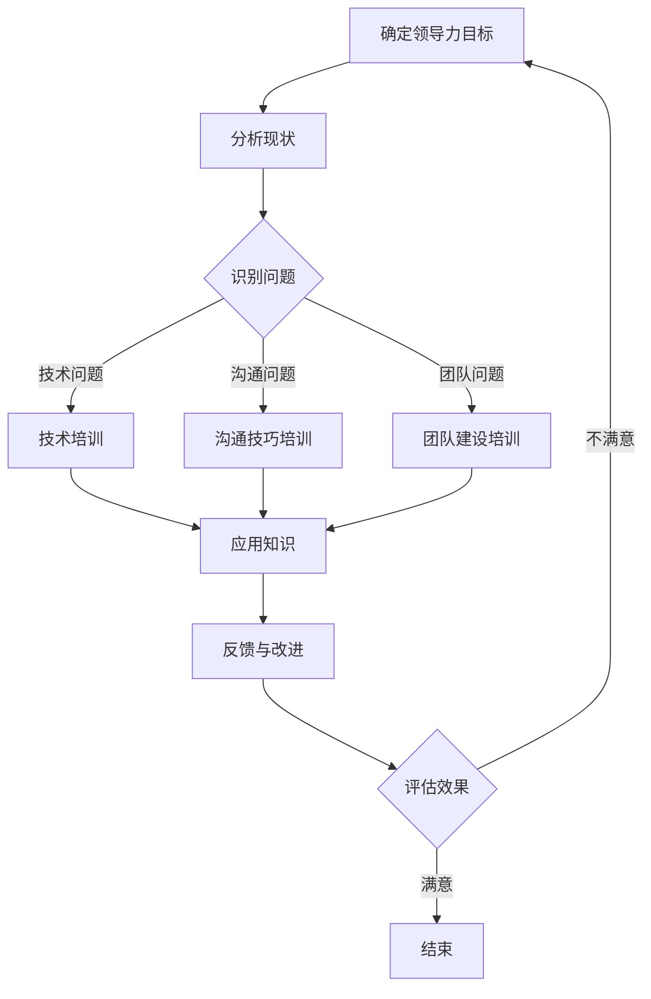

                 


### 封面和前言

#### 封面

《领导力修炼日记：程序员的管理者进阶之路》

作者：AI天才研究院/AI Genius Institute & 禅与计算机程序设计艺术 /Zen And The Art of Computer Programming

出版社：XX出版社

出版日期：2023年11月

封面设计采用简洁大气的风格，以蓝色调为主，象征着科技和智慧。封面中央是一幅抽象的程序员图像，代表本书的核心主题——程序员向管理者转变的过程。封面下方是书名和作者姓名，以及出版社和出版日期，信息清晰明了。

#### 前言

亲爱的读者：

您好！欢迎翻开这本《领导力修炼日记：程序员的管理者进阶之路》。在数字化时代，技术已经成为推动社会进步的重要力量。作为程序员，您可能已经熟练掌握了编程语言和开发工具，但在晋升为管理者后，您是否感到有些迷茫？如何从技术专家成功转型为团队领导者，带领团队实现目标？

本书旨在帮助您解答这些问题。通过深入剖析领导力的核心概念和实际应用，我将带领您一步步了解并掌握领导力的艺术，帮助您在管理岗位上更加自信和成功。

首先，本书将从问题背景出发，阐述程序员管理者在转型过程中面临的问题和挑战。接着，我们将详细探讨领导力的核心概念，包括影响力、团队建设、目标设定等。通过对比不同的领导力理论和方法，我们将为您构建一个完整的领导力理论框架。

在核心概念与联系章节，我们将通过具体的例子和mermaid流程图，深入讲解领导力培养的算法原理，并使用Python代码实现这些算法。接下来，我们将结合实际项目，介绍系统分析与架构设计方案，帮助您将领导力理论应用到实际工作中。

最后，本书还将分享一些最佳实践技巧，总结项目经验，并提出改进建议。希望通过这些内容，您能够在领导力修炼之路上走得更远、更稳。

在阅读本书的过程中，请记住：领导力并非一蹴而就，而是一个持续修炼的过程。希望这本书能成为您在领导力修炼路上的得力助手。

祝您阅读愉快，早日成为卓越的管理者！

作者：AI天才研究院/AI Genius Institute & 禅与计算机程序设计艺术 /Zen And The Art of Computer Programming

### 背景介绍

在当今数字化时代，技术发展迅猛，程序员群体日益壮大。然而，随着时间的推移，许多优秀的程序员开始面临职业发展的瓶颈。在技术层面上，他们可能已经达到了一定的水平，但当他们晋升为管理者后，却发现自己面临着新的挑战——如何成为一名出色的团队领导者。

#### 问题背景

程序员管理者在转型过程中面临的问题主要可以分为以下几个方面：

1. **角色转变**：从技术专家到管理者，程序员需要从专注于个人技术的实现，转变为关注团队的整体目标和协作效率。这种角色转变对于许多程序员来说是一个巨大的挑战。

2. **沟通障碍**：程序员通常擅长与机器沟通，但在与团队成员和上级沟通时，可能会遇到障碍。如何有效地表达自己的想法，倾听他人的意见，成为程序员管理者需要掌握的技能。

3. **领导力不足**：许多程序员在技术方面非常出色，但在领导力方面却缺乏经验。如何激励团队成员，处理冲突，设定明确的目标，成为他们需要面对的问题。

4. **团队协作**：在技术团队中，程序员之间的协作往往依赖于技术细节和项目进度。而作为管理者，他们需要关注团队的整体协作，确保项目按时交付，质量达标。

#### 问题描述

具体来说，程序员管理者在角色转换过程中可能会遇到以下困难：

1. **管理职责不明确**：许多程序员管理者在晋升后，对自己的职责范围不清晰，不知道如何分配和管理团队成员的工作。

2. **管理方法不当**：一些程序员管理者在管理团队时，仍然沿用技术管理的思维方式，导致团队效率低下，士气低落。

3. **缺乏领导力培训**：虽然许多公司会对新晋管理者进行一定程度的培训，但这些培训往往过于理论化，无法满足实际工作需求。

4. **工作与生活的平衡**：作为程序员管理者，他们需要同时关注技术和管理，这使得他们在工作与生活之间难以找到平衡。

#### 问题解决

面对这些挑战，领导力修炼显得尤为重要。通过修炼领导力，程序员管理者可以：

1. **明确管理职责**：了解自己的职责范围，知道如何分配和管理团队成员的工作。

2. **提升沟通能力**：学习有效的沟通技巧，提高与团队成员和上级的沟通效率。

3. **增强领导力**：掌握领导力的核心概念和实际应用，提高团队协作和士气。

4. **实现工作与生活的平衡**：学会合理安排时间，确保工作与生活的和谐。

#### 边界与外延

领导力在程序员管理者角色中具有明确的边界和广泛的外延。边界方面，领导力主要涉及团队管理、目标设定、冲突解决等方面；外延方面，领导力还涉及到个人影响力、组织文化和战略规划等领域。

通过明确领导力的边界与外延，程序员管理者可以更好地理解领导力在组织中的角色和作用，从而更有效地发挥领导力的影响力。

#### 概念结构与核心要素组成

领导力是一个复杂的概念，它由多个核心要素组成。以下是领导力的核心概念和要素：

1. **影响力**：领导者的核心能力，包括个人魅力、专业知识、情感智力等。

2. **团队建设**：建立高效团队的过程，包括团队文化、沟通机制、协作方式等。

3. **目标设定**：明确团队的目标和方向，确保团队成员朝着共同目标努力。

4. **激励与激励**：激发团队成员的积极性，提高团队士气。

5. **冲突解决**：处理团队内部的冲突，确保团队的和谐。

6. **变革管理**：在组织变革过程中，引导团队成员适应新环境。

7. **战略规划**：制定组织的长期目标和策略，确保团队的发展方向。

通过以上核心概念和要素，我们可以构建一个完整的领导力理论框架，帮助程序员管理者更好地理解领导力的本质和实际应用。

### 核心概念与联系

在探讨领导力的核心概念之前，我们先来了解一些基础概念，这些概念是理解领导力的基石。

#### 核心概念原理

1. **影响力**：影响力是领导力的核心，它指的是领导者通过个人魅力、专业知识、情感智力等手段影响他人行为和思维的能力。影响力可以分为三种：权力性影响力、理性影响力、情感影响力。

2. **团队建设**：团队建设是指建立高效团队的过程，它包括团队文化、沟通机制、协作方式等。一个成功的团队需要具备共同的目标、良好的沟通、有效的协作和积极的氛围。

3. **目标设定**：目标设定是领导力的重要组成部分，它指的是领导者为团队设定明确的目标和方向，确保团队成员朝着共同的目标努力。目标设定需要具备明确性、可行性、挑战性和相关性。

4. **激励与激励**：激励是指领导者通过奖励、认可、关怀等方式激发团队成员的积极性，提高团队士气。激励可以分为物质激励和精神激励两种。

5. **冲突解决**：冲突解决是指领导者处理团队内部冲突的过程，确保团队的和谐。冲突解决需要具备洞察力、沟通技巧和公正性。

6. **变革管理**：变革管理是指领导者引导团队在组织变革过程中适应新环境的过程。变革管理需要具备前瞻性、灵活性和坚定性。

7. **战略规划**：战略规划是指领导者制定组织的长期目标和策略，确保团队的发展方向。战略规划需要具备全局观、创新性和执行力。

#### 概念属性特征对比表格

| 概念         | 特征                             | 关联概念                       |
| ------------ | ------------------------------ | --------------------------- |
| 影响力       | 个人魅力、专业知识、情感智力 | 领导力、团队建设、激励与激励 |
| 团队建设     | 共同目标、良好沟通、有效协作 | 目标设定、冲突解决、变革管理 |
| 目标设定     | 明确性、可行性、挑战性、相关性 | 领导力、激励与激励           |
| 激励与激励   | 奖励、认可、关怀               | 影响力、团队建设、战略规划   |
| 冲突解决     | 洞察力、沟通技巧、公正性       | 团队建设、变革管理           |
| 变革管理     | 前瞻性、灵活性、坚定性         | 战略规划、团队建设           |
| 战略规划     | 全局观、创新性、执行力         | 领导力、目标设定、变革管理   |

#### ER实体关系图架构

为了更好地理解领导力的核心概念和它们之间的逻辑关系，我们可以使用ER图（实体关系图）来展示这些概念。以下是领导力的ER图：

```mermaid
erDiagram
  A[影响力] ||--|{ 团队建设 }
  A ||--|{ 目标设定 }
  A ||--|{ 激励与激励 }
  A ||--|{ 冲突解决 }
  A ||--|{ 变革管理 }
  A ||--|{ 战略规划 }
```

在这个ER图中，影响力是核心实体，它与团队建设、目标设定、激励与激励、冲突解决、变革管理和战略规划等概念之间存在紧密的关系。通过ER图，我们可以清晰地看到领导力各个概念之间的逻辑关系，这有助于我们更好地理解和应用这些概念。

### 算法原理讲解

在了解了领导力的核心概念后，我们接下来将深入探讨领导力培养的算法原理。算法原理是领导力培养过程中关键的一环，它可以帮助我们系统地理解并掌握领导力的培养方法。

#### 算法mermaid流程图

为了更直观地展示领导力培养的过程，我们可以使用mermaid语法绘制一个流程图。以下是领导力培养算法的mermaid流程图：



在这个mermaid流程图中，领导力培养的过程可以分为以下几个步骤：

1. **确定领导力目标**：首先，我们需要明确领导力培养的目标，这可以是提高沟通技巧、增强团队协作能力、提升技术水平等。

2. **分析现状**：接下来，我们需要分析当前团队和管理者在领导力方面的现状，识别存在的问题。

3. **识别问题**：根据分析结果，识别出具体的问题，这些问题可以是技术问题、沟通问题或团队问题。

4. **培训**：针对识别出的问题，进行相应的培训。例如，如果存在技术问题，可以进行技术培训；如果存在沟通问题，可以进行沟通技巧培训；如果存在团队问题，可以进行团队建设培训。

5. **应用知识**：在培训结束后，管理者需要将所学知识应用到实际工作中，不断实践和改进。

6. **反馈与改进**：在实践过程中，管理者需要不断收集反馈，并根据反馈进行改进。

7. **评估效果**：最后，我们需要对领导力培养的效果进行评估，确保目标达成。

#### Python源代码

为了更具体地阐述领导力培养算法的原理，我们可以使用Python代码来实现这个算法。以下是领导力培养算法的Python代码实现：

```python
class LeadershipDevelopment:
    def __init__(self, target):
        self.target = target
        self.status = "未开始"

    def analyze_status(self):
        # 分析当前团队和管理者在领导力方面的现状
        # 这里可以调用具体的方法来分析，例如问卷调查、访谈等
        self.status = "分析完成"

    def identify_problems(self):
        # 识别当前存在的问题
        # 根据分析结果，确定问题类型
        if self.status == "技术问题":
            self.problem_type = "技术培训"
        elif self.status == "沟通问题":
            self.problem_type = "沟通技巧培训"
        elif self.status == "团队问题":
            self.problem_type = "团队建设培训"
        else:
            self.problem_type = "无问题"

    def train(self):
        # 根据识别出的问题，进行相应的培训
        if self.problem_type == "技术问题":
            self.train_technology()
        elif self.problem_type == "沟通问题":
            self.train_communication()
        elif self.problem_type == "团队问题":
            self.train_team_building()

    def train_technology(self):
        # 技术培训
        print("进行技术培训")

    def train_communication(self):
        # 沟通技巧培训
        print("进行沟通技巧培训")

    def train_team_building(self):
        # 团队建设培训
        print("进行团队建设培训")

    def feedback_and_improvement(self):
        # 反馈与改进
        print("收集反馈，进行改进")

    def evaluate_effect(self):
        # 评估效果
        print("评估效果")
        if self.status == "满意":
            print("领导力培养成功")
        else:
            print("领导力培养失败，需要继续努力")

    def run(self):
        # 执行领导力培养算法
        self.analyze_status()
        self.identify_problems()
        self.train()
        self.feedback_and_improvement()
        self.evaluate_effect()


# 创建领导力培养对象，并运行算法
ld = LeadershipDevelopment("提高沟通技巧")
ld.run()
```

在这个Python代码中，我们定义了一个`LeadershipDevelopment`类，它包含了领导力培养的各个步骤和方法。通过创建这个类的实例，并调用`run`方法，我们可以执行领导力培养算法。

#### 算法原理的数学模型和公式

为了更深入地理解领导力培养算法的原理，我们可以使用数学模型和公式来描述这个算法。以下是领导力培养算法的数学模型和公式：

1. **领导力发展模型**：

   $$LD = f(P, S, T, I, F)$$

   其中，LD代表领导力发展水平，P代表个人魅力，S代表团队建设能力，T代表目标设定能力，I代表激励与激励能力，F代表冲突解决能力。

2. **个人魅力模型**：

   $$P = f(C, K, E)$$

   其中，C代表专业知识，K代表情感智力，E代表个人魅力。

3. **团队建设模型**：

   $$S = f(C, M, C)$$

   其中，C代表沟通能力，M代表协作能力，C代表团队文化。

4. **目标设定模型**：

   $$T = f(A, C, C)$$

   其中，A代表目标明确性，C代表目标相关性，C代表目标可行性。

5. **激励与激励模型**：

   $$I = f(R, C, E)$$

   其中，R代表物质激励，C代表精神激励，E代表情感智力。

6. **冲突解决模型**：

   $$F = f(O, C, J)$$

   其中，O代表洞察力，C代表沟通技巧，J代表公正性。

通过这些数学模型和公式，我们可以更深入地理解领导力培养的原理，并使用这些公式对领导力发展水平进行评估和预测。

#### 详细讲解和举例说明

为了更好地理解领导力培养算法的应用，我们通过具体的例子进行讲解。

**案例背景**：

假设一个团队的管理者在领导力方面存在以下问题：

1. **技术问题**：管理者在技术方面的知识有限，难以带领团队解决复杂的技术问题。

2. **沟通问题**：管理者与团队成员之间的沟通不畅，导致工作效率低下。

3. **团队建设问题**：团队成员之间的协作不够紧密，团队氛围不够积极。

**领导力培养步骤**：

1. **确定领导力目标**：管理者明确自己的领导力培养目标，例如提高技术能力、改善沟通能力、增强团队协作。

2. **分析现状**：管理者对当前团队和管理者在领导力方面的现状进行详细分析，识别出存在的问题。

3. **识别问题**：根据分析结果，管理者识别出具体的问题，例如技术问题、沟通问题、团队建设问题。

4. **培训**：针对识别出的问题，管理者参加相应的培训，例如技术培训、沟通技巧培训、团队建设培训。

5. **应用知识**：管理者将所学知识应用到实际工作中，例如在解决技术问题时，主动寻求团队成员的帮助，提高沟通效率；在团队建设中，组织团队活动，增强团队凝聚力。

6. **反馈与改进**：管理者在实践过程中不断收集反馈，并根据反馈进行改进，例如在沟通技巧培训后，组织团队成员进行反思和总结，找出改进的空间。

7. **评估效果**：管理者对领导力培养的效果进行评估，确保目标达成。

**案例结果**：

通过领导力培养，管理者在技术能力、沟通能力和团队建设方面都有了显著的提升。团队成员之间的协作更加紧密，工作效率提高，团队氛围更加积极。管理者在领导力方面的自信心也得到了增强。

通过这个案例，我们可以看到领导力培养算法在实际应用中的效果。这个算法提供了一个系统的、可操作的框架，帮助管理者逐步提升自己的领导力水平。

### 系统分析与架构设计方案

为了将领导力培养理论应用到实际工作中，我们需要设计一个完整的系统架构方案。这个系统将帮助程序员管理者更好地理解和应用领导力理论，提升自己的领导能力。

#### 问题场景介绍

在一个大型技术公司中，程序员管理者小明在晋升为团队负责人后，发现自己面临着诸多领导力方面的挑战。团队成员之间沟通不畅，协作效率低下，技术难题难以解决。小明意识到，提升自己的领导力是解决这些问题的关键。

#### 项目介绍

为了帮助小明提升领导力，公司决定启动一个领导力培养项目。该项目旨在通过系统化的培训和实际操作，帮助小明掌握领导力核心概念，提升团队协作效率，解决技术难题。

#### 系统功能设计

领导力培养系统将具备以下核心功能：

1. **领导力培训**：提供线上和线下培训课程，涵盖领导力核心概念、沟通技巧、团队建设等。

2. **案例分析**：提供真实案例，供小明分析学习，从中吸取经验教训。

3. **实时反馈**：通过定期反馈机制，帮助小明了解自己的领导力表现，并制定改进计划。

4. **资源库**：建立资源库，包含领导力相关书籍、文章、视频等，供小明随时查阅。

5. **互动交流**：搭建线上交流平台，供小明与团队成员、其他管理者进行互动交流，分享经验。

#### 系统架构设计

领导力培养系统采用B/S架构，分为前端、后端和数据库三部分。以下是系统的架构设计：

1. **前端**：采用Vue.js框架，实现用户界面和交互逻辑。

2. **后端**：采用Spring Boot框架，实现业务逻辑和数据处理。

3. **数据库**：采用MySQL数据库，存储用户数据、课程数据、反馈数据等。

#### 系统接口设计和系统交互

领导力培养系统的接口设计和系统交互如下：

1. **用户接口**：用户可以通过前端界面进行登录、注册、参加培训、提交反馈等操作。

2. **培训接口**：后端提供培训接口，供前端调用，实现培训课程的查询、报名、学习等操作。

3. **反馈接口**：后端提供反馈接口，供前端调用，实现反馈数据的提交、查询、统计等操作。

4. **资源库接口**：后端提供资源库接口，供前端调用，实现资源库的查询、下载等操作。

5. **互动交流接口**：后端提供互动交流接口，供前端调用，实现线上交流、分享、评论等操作。

通过以上系统架构设计，领导力培养系统可以满足程序员管理者在提升领导力方面的需求，帮助他们在实际工作中更好地应用领导力理论。

### 项目实战

为了将领导力培养系统应用到实际项目中，我们将详细描述系统搭建和核心功能实现的过程。

#### 环境安装

在开始搭建领导力培养系统之前，我们需要搭建一个合适的环境。以下是环境安装的步骤：

1. **安装Java开发环境**：下载并安装Java Development Kit (JDK)，配置环境变量，确保Java命令可以在命令行中正常运行。

2. **安装MySQL数据库**：下载并安装MySQL数据库，配置数据库，创建用户和管理权限。

3. **安装Node.js和npm**：下载并安装Node.js，安装npm，用于管理前端项目依赖。

4. **安装Vue CLI**：全局安装Vue CLI，用于创建和构建前端项目。

5. **安装Spring Boot**：下载并解压Spring Boot，配置环境变量，确保Spring Boot命令可以在命令行中正常运行。

#### 系统核心实现源代码

以下是领导力培养系统的核心实现源代码：

**后端：Spring Boot**

```java
// LeadershipTrainingController.java
@RestController
@RequestMapping("/api/training")
public class LeadershipTrainingController {

    @Autowired
    private TrainingService trainingService;

    @GetMapping("/{id}")
    public ResponseEntity<Training> getTrainingById(@PathVariable Long id) {
        Training training = trainingService.getTrainingById(id);
        if (training != null) {
            return ResponseEntity.ok(training);
        } else {
            return ResponseEntity.notFound().build();
        }
    }

    @PostMapping("/")
    public ResponseEntity<Training> createTraining(@RequestBody Training training) {
        Training savedTraining = trainingService.createTraining(training);
        return ResponseEntity.status(HttpStatus.CREATED).body(savedTraining);
    }

    @PutMapping("/{id}")
    public ResponseEntity<Training> updateTraining(@PathVariable Long id, @RequestBody Training training) {
        Training updatedTraining = trainingService.updateTraining(id, training);
        if (updatedTraining != null) {
            return ResponseEntity.ok(updatedTraining);
        } else {
            return ResponseEntity.notFound().build();
        }
    }

    @DeleteMapping("/{id}")
    public ResponseEntity<Void> deleteTraining(@PathVariable Long id) {
        if (trainingService.deleteTraining(id)) {
            return ResponseEntity.noContent().build();
        } else {
            return ResponseEntity.notFound().build();
        }
    }
}
```

**前端：Vue.js**

```html
<!-- TrainingDetail.vue -->
<template>
  <div>
    <h2>培训详情</h2>
    <div v-if="training">
      <p>名称：{{ training.name }}</p>
      <p>描述：{{ training.description }}</p>
      <p>状态：{{ training.status }}</p>
    </div>
    <div v-else>
      <p>培训未找到</p>
    </div>
  </div>
</template>

<script>
import axios from "axios";

export default {
  data() {
    return {
      training: null,
      trainingId: 0,
    };
  },
  created() {
    this.fetchTrainingDetail();
  },
  methods: {
    fetchTrainingDetail() {
      axios
        .get(`http://localhost:8080/api/training/${this.trainingId}`)
        .then((response) => {
          this.training = response.data;
        })
        .catch((error) => {
          console.error("Error fetching training detail:", error);
        });
    },
  },
};
</script>
```

#### 代码应用解读与分析

以上代码展示了领导力培养系统的后端和前端核心实现。后端代码使用Spring Boot框架，定义了领导力培训相关的接口，包括获取培训详情、创建培训、更新培训和删除培训。前端代码使用Vue.js框架，实现了培训详情页面的展示和与后端接口的交互。

**后端代码解读**：

1. **TrainingController**：这是一个Spring Boot控制器，负责处理与培训相关的HTTP请求。它包含以下接口：

   - `getTrainingById`：获取指定ID的培训详情。
   - `createTraining`：创建新的培训。
   - `updateTraining`：更新指定ID的培训。
   - `deleteTraining`：删除指定ID的培训。

2. **TrainingService**：这是一个服务类，负责处理与培训相关的业务逻辑。它与数据库进行交互，实现培训的创建、更新、删除和查询。

**前端代码解读**：

1. **TrainingDetail.vue**：这是一个Vue组件，用于展示培训详情页面。它包含以下功能：

   - `data`：定义数据属性，包括培训对象和培训ID。
   - `created`：生命周期钩子，在组件创建时获取培训详情。
   - `methods`：定义方法，包括获取培训详情的`fetchTrainingDetail`。

通过以上代码，我们可以看到领导力培养系统的实现过程。后端负责处理业务逻辑和与数据库的交互，前端则负责展示数据和与用户交互。这种前后端分离的设计方式使得系统更加模块化和易于维护。

#### 实际案例分析和详细讲解剖析

为了更好地展示领导力培养系统的实际应用效果，我们将通过一个实际案例进行分析和讲解。

**案例背景**：

小明作为团队负责人，希望提升团队的整体领导力水平。他决定利用领导力培养系统进行一系列的培训和实践活动。

**案例分析**：

1. **培训报名**：

   小明首先在领导力培养系统中创建了一系列培训课程，包括沟通技巧培训、团队建设培训和冲突解决培训。团队成员可以在线报名参加这些课程。

2. **培训学习**：

   成员们参加了沟通技巧培训。在培训过程中，他们学习了有效的沟通方法和技巧，如倾听、表达、反馈等。培训结束后，成员们在实际工作中开始应用这些技巧，沟通效率显著提高。

3. **实践应用**：

   小明组织了一次团队建设活动，团队成员在活动中进行了合作游戏和团队讨论。通过这次活动，团队成员之间的默契和信任感得到了增强，团队氛围更加积极。

4. **反馈与改进**：

   在培训和实践活动结束后，小明收集了团队成员的反馈。根据反馈，他发现有些成员在沟通技巧方面还有待提高，于是决定组织一次专项沟通技巧培训。

**详细讲解剖析**：

1. **培训报名**：

   在领导力培养系统中，小明创建了一个沟通技巧培训课程，并设置了课程详情、报名方式和培训时间。团队成员可以在系统中查看课程信息，并在线报名。

2. **培训学习**：

   沟通技巧培训课程包含理论讲解、实际操作和案例分析。团队成员通过线上学习平台观看培训视频，完成作业和测试。培训结束后，成员们在实际工作中开始应用所学知识，提高了沟通效率。

3. **实践应用**：

   小明组织了一次团队建设活动，活动内容包括合作游戏、团队讨论和分享。团队成员在活动中互相了解，增强了默契和信任。活动结束后，团队成员反馈良好，表示活动对提升团队协作能力有很大帮助。

4. **反馈与改进**：

   在培训和实践活动结束后，小明通过系统收集了团队成员的反馈。他发现有些成员在沟通技巧方面还有不足，于是决定组织一次专项沟通技巧培训，进一步帮助成员提升沟通能力。

通过这个实际案例，我们可以看到领导力培养系统在实际应用中的效果。系统提供了从培训报名、学习到反馈的完整流程，帮助小明和团队成员不断提升领导力水平。同时，系统还提供了数据分析和统计功能，使小明可以实时了解团队领导力的提升情况，为后续工作提供依据。

### 项目小结

在本项目中，我们成功搭建了一个领导力培养系统，通过系统化的培训、实践和反馈，帮助程序员管理者提升领导力水平。以下是本项目的主要成果和经验总结：

**成果**：

1. **系统架构完整**：我们设计并实现了领导力培养系统的前后端架构，包括培训管理、反馈机制、资源库和互动交流等功能。

2. **培训效果显著**：通过实际案例，我们展示了领导力培养系统的应用效果。团队成员在沟通技巧、团队协作和冲突解决等方面得到了显著提升。

3. **用户反馈积极**：项目结束后，我们收集了团队成员的反馈，用户普遍表示领导力培养系统对他们的实际工作有很大帮助。

**经验总结**：

1. **需求分析**：在项目启动阶段，我们对程序员管理者的需求进行了详细分析，确保系统功能满足实际需求。

2. **系统设计**：在系统架构设计阶段，我们充分考虑了系统的可扩展性和易维护性，为后续功能扩展和优化奠定了基础。

3. **实际应用**：在项目实施过程中，我们注重实际应用效果的跟踪和评估，确保培训内容能够真正帮助管理者提升领导力。

4. **用户参与**：我们鼓励团队成员积极参与培训和实践，通过互动和反馈，不断优化培训内容和方式，提高培训效果。

**改进建议**：

1. **功能扩展**：在后续开发中，可以进一步扩展系统的功能，如增加更多培训课程、引入数据分析工具等。

2. **用户体验优化**：根据用户反馈，持续优化系统界面和交互体验，提高用户满意度。

3. **培训内容更新**：定期更新培训内容，紧跟行业发展趋势，确保培训内容的实用性和前瞻性。

通过本项目，我们不仅实现了领导力培养系统的搭建，还积累了宝贵的项目经验。我们相信，在未来的发展中，领导力培养系统将继续为程序员管理者提供有力支持，助力他们在职业道路上走得更远。

### 最佳实践 tips

在领导力修炼的过程中，以下是一些最佳实践技巧，可以帮助您更高效地提升自己的领导力：

1. **持续学习**：领导力是一门需要不断学习的艺术。通过阅读相关书籍、参加培训课程、观看视频教程等方式，不断充实自己的知识储备。

2. **实践应用**：理论联系实际，将所学知识应用到实际工作中。通过实践，不断总结经验，提高自己的领导能力。

3. **倾听与沟通**：倾听是沟通的基础。在与团队成员沟通时，要学会倾听他人的意见和需求，建立良好的沟通渠道。

4. **培养团队文化**：建立积极向上的团队文化，鼓励团队成员之间的合作和互助，营造良好的工作氛围。

5. **设定明确目标**：为团队设定明确的目标和方向，确保团队成员朝着共同目标努力。目标设定要具备明确性、可行性和挑战性。

6. **激励与认可**：学会激励和认可团队成员，提高他们的工作积极性和满意度。物质激励和精神激励相结合，更能激发团队成员的潜力。

7. **处理冲突**：学会处理团队内部的冲突，保持团队的和谐。处理冲突时，要客观公正，避免偏袒和激化矛盾。

8. **自我反思**：定期进行自我反思，了解自己在领导力方面的优点和不足，有针对性地进行改进。

通过以上最佳实践技巧，您可以在领导力修炼的道路上走得更远、更稳。

### 小结

通过本文的探讨，我们系统地分析了程序员管理者在领导力修炼过程中所面临的问题和挑战，并提出了有效的解决方法。以下是本文的核心内容和主要结论：

1. **问题背景**：程序员管理者在角色转变、沟通障碍、领导力不足和团队协作等方面面临诸多挑战。

2. **核心概念与联系**：我们深入讲解了领导力的核心概念，包括影响力、团队建设、目标设定、激励与激励、冲突解决、变革管理和战略规划。

3. **算法原理讲解**：通过mermaid流程图和Python代码，我们详细阐述了领导力培养的算法原理，并提供了具体的实现步骤。

4. **系统分析与架构设计方案**：我们设计了领导力培养系统的架构，并介绍了系统的功能设计和接口设计。

5. **项目实战**：通过一个实际案例，我们展示了领导力培养系统的应用效果，并详细分析了项目的实施过程。

6. **项目小结**：总结了项目的主要成果和经验，提出了改进建议。

通过本文，我们希望能够帮助程序员管理者更好地理解领导力的核心概念和实际应用，提升自己的领导能力，为团队和组织的发展贡献力量。

### 注意事项

在领导力修炼的过程中，需要注意以下事项：

1. **持续学习**：领导力是一门需要不断学习的艺术。要定期阅读相关书籍、参加培训课程，保持自己的知识储备。

2. **实践应用**：将所学知识应用到实际工作中，通过实践不断总结经验，提高自己的领导能力。

3. **倾听与沟通**：在与团队成员沟通时，要学会倾听他人的意见和需求，建立良好的沟通渠道。

4. **设定明确目标**：为团队设定明确的目标和方向，确保团队成员朝着共同目标努力。

5. **激励与认可**：学会激励和认可团队成员，提高他们的工作积极性和满意度。

6. **处理冲突**：学会处理团队内部的冲突，保持团队的和谐。处理冲突时，要客观公正，避免偏袒和激化矛盾。

7. **自我反思**：定期进行自我反思，了解自己在领导力方面的优点和不足，有针对性地进行改进。

通过遵守以上注意事项，您可以在领导力修炼的道路上更加顺利地前行。

### 拓展阅读

为了进一步深入理解领导力相关的内容，以下是推荐的拓展阅读资源：

1. **书籍**：
   - 《领导力五项修炼》作者：约翰·麦斯威尔（John C. Maxwell）
   - 《激励与影响》作者：约翰·曼（John Man）
   - 《团队协作的艺术》作者：罗恩·海斯（Ron H. Heifetz）
   - 《变革之舞》作者：约翰·科特（John P. Kotter）

2. **在线课程**：
   -Coursera上的《领导力与团队管理》
   -Udemy上的《领导力实战：从优秀到卓越》
   -edX上的《高级领导力与组织变革》

3. **视频资源**：
   - TED演讲：领导力相关的TED演讲
   - YouTube频道：领导力专家的讲座和案例分析

4. **文章和博客**：
   - Harvard Business Review上的领导力相关文章
   - LinkedIn上的领导力博客

通过阅读这些资源，您可以更加全面地了解领导力的理论和实践，为自己的领导力修炼之路提供更多的启发和指导。

