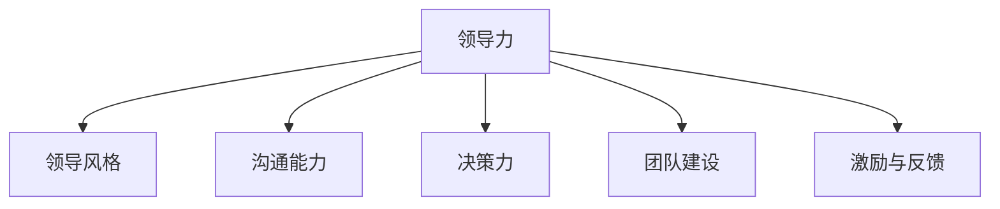
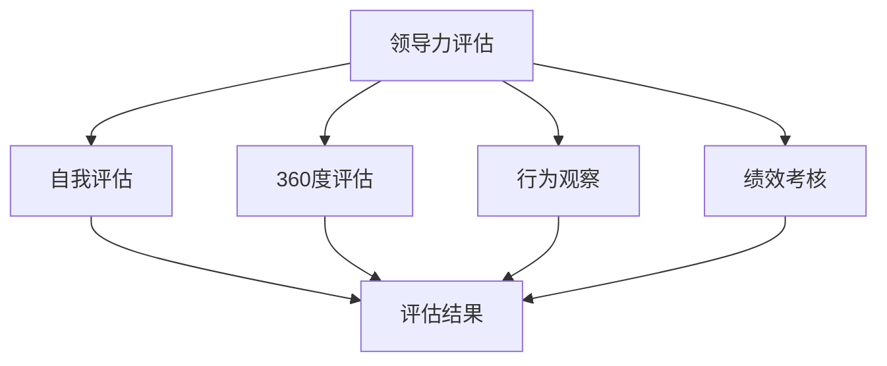

                 

### 第1章：引言

#### 1.1 问题背景

在当今快速发展的信息化时代，企业管理层对于领导力的需求越来越高。特别是在85后这一代，他们在社会中占据了越来越重要的位置。他们不仅是企业的中坚力量，也是管理岗位的新生代。然而，随着时代的变化，管理岗位的职责和挑战也在不断演进，85后管理新星面临着前所未有的挑战。

首先，从社会背景来看，85后出生在一个信息爆炸、全球化的时代，他们的成长环境与父辈有很大不同。互联网的普及使他们拥有了更多的知识获取渠道，但同时也面临着信息过载的挑战。此外，85后在职场中往往更加注重个人价值和职业发展，他们渴望在追求物质回报的同时，获得精神满足和成就感。

其次，从职业背景来看，85后管理新星大多具备较高的学历和专业技能，他们在技术领域有着深厚的积累。这使得他们在管理岗位上具备了一定的优势，但同时，他们也面临着与传统领导力观念相冲突的问题。传统领导力观念强调权威和命令式管理，而85后则更倾向于扁平化管理和团队协作。

#### 1.2 问题描述

85后管理新星面临的困境与问题主要体现在以下几个方面：

1. **角色转变困惑**：从技术专家到管理者，角色的转变让许多85后感到困惑。他们需要重新定位自己的角色，学会如何领导和管理团队。

2. **领导力认知不足**：尽管85后具备较高的技术能力，但在领导力方面却存在认知不足。他们往往更注重技术细节，而忽视了领导力的核心要素，如沟通能力、决策力、团队建设等。

3. **管理经验欠缺**：大多数85后管理新星在担任管理岗位之前，并没有接受过系统的管理培训。这使得他们在实际管理工作中缺乏经验，容易出现决策失误。

4. **团队冲突与协作难题**：85后管理新星面临的另一个问题是团队冲突与协作难题。由于他们成长的环境和文化背景与前辈不同，导致在团队管理中容易产生分歧和冲突。

#### 1.3 问题解决

要解决85后管理新星面临的困境，需要从以下几个方面入手：

1. **领导力认知提升**：85后管理新星需要加强领导力的认知，明确领导力的核心要素，如沟通能力、决策力、团队建设等。通过学习领导力理论，提升自己的领导力水平。

2. **管理经验积累**：通过实际管理工作的积累，85后管理新星可以逐步提高自己的管理能力。他们可以参加管理培训课程，学习管理知识和技巧，同时也要勇于实践，不断总结经验。

3. **团队建设与冲突管理**：85后管理新星需要注重团队建设，培养团队成员的协作精神和团队意识。在团队管理中，要善于发现和处理团队冲突，确保团队和谐稳定。

4. **持续个人成长**：85后管理新星要在职业发展的道路上不断前行，需要持续个人成长。他们可以通过阅读专业书籍、参加行业研讨会、结交同行等方式，不断提升自己的专业素养和领导力。

#### 1.4 边界与外延

领导力修炼的范围与边界非常广泛，它不仅包括个人的领导能力提升，还涉及到团队管理、组织文化、行业动态等多个方面。在不同的行业和企业中，领导力修炼的方法和路径也有所差异。例如，在高科技企业中，领导力更多地体现在技术创新和团队协作上；而在传统行业中，领导力则更多地体现在如何带领团队应对市场变化和挑战。

此外，个人特质与领导力发展也存在密切关系。不同的个人特质会影响领导力的风格和实践。例如，内向型领导可能更擅长倾听和理解团队成员的需求，而外向型领导则可能更擅长激励和带动团队士气。

#### 1.5 概念结构与核心要素组成

领导力是一个复杂的概念，它由多个核心要素组成。以下是领导力的定义与概念结构，以及核心要素的详细解析：

1. **领导力的定义**：领导力是指一个人在团队中引导、激励和影响他人，实现共同目标的能力。

2. **领导风格的定义**：领导风格是指领导者在管理过程中所采用的方式和手段。常见的领导风格有民主式、权威式、参与式等。

3. **沟通能力的定义**：沟通能力是指领导者与团队成员之间进行有效沟通的能力。包括口头沟通、书面沟通和肢体语言等。

4. **决策力的定义**：决策力是指领导者在面临问题时，能够迅速做出正确决策的能力。

5. **团队建设的定义**：团队建设是指领导者通过一系列措施，提高团队成员的凝聚力和协作能力。

6. **激励与反馈的定义**：激励是指领导者通过奖励和激励措施，激发团队成员的积极性和创造力。反馈是指领导者对团队成员的工作进行评价和指导。

为了更好地理解这些概念，我们可以使用一个ER实体关系图架构的Mermaid流程图进行说明：

#### 1.6 本章小结

本章首先介绍了85后管理新星的社会与职业背景，分析了他们面临的管理挑战和领导力需求。接着，我们详细探讨了领导力的核心要素，如领导风格、沟通能力、决策力、团队建设和激励与反馈。最后，我们提出了领导力修炼的方法与路径，以及个人成长与职业发展的平衡。通过本章的介绍，我们为后续章节的内容奠定了基础。

---

### 1.7 总结

本章我们深入探讨了85后管理新星在现代社会中所面临的领导力挑战。通过对问题背景的深入分析，我们明确了领导力在管理岗位中的重要性。接着，我们详细介绍了领导力的核心要素，并提出了领导力修炼的方法与路径。通过本章的讨论，我们不仅为后续章节的内容奠定了基础，也为读者提供了深入了解领导力的重要视角。

在下一章中，我们将进一步探讨领导力的核心概念与联系，分析领导力原理、领导风格、沟通能力、决策力、团队建设和激励与反馈等要素，帮助读者建立更加完整的领导力认知体系。让我们继续深入探索，发现领导力的奥秘。敬请期待下一章的内容。

---

## 第2章：核心概念与联系

#### 2.1 领导力原理

##### 2.1.1 领导力的定义

领导力，是一种在团队或组织中通过影响、激励和引导他人来实现共同目标的能力。它不仅仅是简单的指挥和管理，而是一种更为复杂的互动过程，涉及个人魅力、战略思维、沟通技巧、团队建设等多方面要素。

领导力的定义可以从以下几个角度进行理解：

1. **个人层面**：领导力是个人特质和能力的体现，包括自信、决断力、同理心等。一个优秀的领导者首先需要具备良好的个人素质。

2. **团队层面**：领导力是团队中产生领导行为的过程，强调领导者与团队成员之间的互动和协作。一个成功的团队离不开一个优秀的领导者。

3. **组织层面**：领导力是组织内部推动变革、创新和发展的核心力量。领导者通过影响和激励员工，推动组织实现战略目标。

##### 2.1.2 领导力的属性特征对比表格

| 特征        | 传统领导力 | 现代领导力 |
| ----------- | ----------- | ----------- |
| 权威性      | 强调领导者的权威地位和命令式管理 | 强调服务型领导和民主参与式管理 |
| 专注成果    | 注重短期成果和效率 | 注重长期发展、创新和可持续性 |
| 独立决策    | 单一领导者做出决策 | 集体决策、团队合作 |
| 领导者为中心 | 领导者主导一切 | 服务团队成员、关注团队整体发展 |

通过上述对比表格，我们可以看到传统领导力和现代领导力在属性特征上的显著差异。现代领导力更加注重团队合作、服务型和创新导向，这与当今社会和企业环境的变化密切相关。

##### 2.1.3 领导力与管理的联系与区别

领导力和管理是两个紧密相关的概念，但它们也存在一些区别：

1. **联系**：
   - **共同目标**：领导力和管理都是为了实现组织或团队的共同目标。
   - **互补性**：领导力侧重于激发和引导团队成员，而管理则侧重于组织和协调资源，确保目标的实现。

2. **区别**：
   - **性质**：领导力是一种能力，强调影响力和个人魅力；管理是一种过程，强调组织资源和流程控制。
   - **范围**：领导力更关注人的因素，如激励、沟通和团队建设；管理则更关注事和物的因素，如资源分配、计划执行等。
   - **时间维度**：领导力更注重长期发展，如战略规划和持续创新；管理则更关注短期目标的实现和当前任务的完成。

#### 2.2 领导风格

##### 2.2.1 领导风格的定义

领导风格是指领导者在管理过程中所采用的具体方式和方法，它反映了领导者的个性、价值观和对待团队的态度。不同的领导风格会影响团队氛围、员工满意度和组织绩效。

##### 2.2.2 领导风格的分类

常见的领导风格分类有几种，以下列出其中几种主要类型：

1. **民主式领导**：领导者鼓励团队成员参与决策，尊重员工的意见和权利，强调团队合作和共同决策。

2. **权威式领导**：领导者具有高度的权威和决策权，倾向于独断专行，注重任务的完成和效率。

3. **参与式领导**：领导者鼓励团队成员积极参与决策过程，提供支持和资源，以促进员工的自我管理和自我实现。

4. **变革型领导**：领导者通过激发团队成员的内在动机和潜力，推动团队实现变革和创新。

5. **交易型领导**：领导者通过奖励和惩罚机制来激励团队成员，强调绩效和回报。

##### 2.2.3 领导风格的影响因素与适应场景

领导风格的影响因素主要包括领导者的个性、价值观、经验和组织文化。不同的领导风格适用于不同的场景和团队环境：

- **民主式领导**：适用于团队需要创新和变革的情境，如创业团队、研发部门等。
- **权威式领导**：适用于需要迅速决策和执行的任务，如危机管理、军事组织等。
- **参与式领导**：适用于团队需要高度协作和共同目标的情境，如跨部门项目、团队合作等。
- **变革型领导**：适用于组织需要重大变革和创新发展的时期，如转型期企业、科技初创公司等。
- **交易型领导**：适用于组织需要稳定和高效运作的时期，如成熟企业、常规业务部门等。

#### 2.3 沟通能力

##### 2.3.1 沟通能力的定义

沟通能力是指个体在与他人交流过程中，有效传达信息、理解对方意图和建立良好关系的能力。沟通能力对领导力至关重要，因为领导力的核心之一就是与团队成员进行有效的沟通。

##### 2.3.2 有效沟通的要素

有效沟通应具备以下要素：

1. **清晰性**：信息传达要明确、简洁，避免产生误解和混淆。
2. **反馈性**：及时给予反馈，确认信息已被正确理解和接受。
3. **情感共鸣**：理解对方的情感和需求，建立信任和尊重的关系。
4. **主动性**：主动沟通，积极解决问题，避免消极等待。

##### 2.3.3 沟通技巧与实践

提高沟通能力的关键在于不断实践和反思。以下是一些实用的沟通技巧：

1. **倾听**：主动倾听，关注对方的需求和意见。
2. **表达**：清晰、准确地表达自己的想法和意见。
3. **非语言沟通**：运用肢体语言、面部表情和语调，增强沟通效果。
4. **情景适应**：根据不同的沟通场景和对象，调整沟通策略。

#### 2.4 决策力

##### 2.4.1 决策力的定义

决策力是指领导者在面对复杂问题和不确定因素时，能够迅速做出合理、有效的决策的能力。决策力是领导者能力的重要体现，直接影响组织的绩效和未来发展。

##### 2.4.2 决策过程与模型

决策过程通常包括以下几个步骤：

1. **问题识别**：识别需要解决的问题或面临的挑战。
2. **信息收集**：收集与问题相关的信息，包括数据、事实和意见。
3. **方案评估**：评估不同方案的优缺点，选择最佳方案。
4. **执行决策**：实施决策方案，并进行监控和调整。

常见的决策模型包括：

1. **理性决策模型**：基于逻辑和数据分析，选择最优方案。
2. **有限理性决策模型**：在时间和资源有限的情况下，选择满意而非最优的方案。
3. **直觉决策模型**：基于经验和直觉，快速做出决策。

##### 2.4.3 决策力的提升方法

提升决策力的方法包括：

1. **积累经验**：通过实际决策和实践，积累经验，提高判断力。
2. **学习和培训**：参加决策力培训，学习决策理论和技巧。
3. **借助工具**：利用数据分析工具和决策支持系统，提高决策的科学性和准确性。

#### 2.5 团队建设

##### 2.5.1 团队建设的定义

团队建设是指通过一系列措施，提高团队成员的凝聚力、协作能力和整体绩效，实现团队目标的过程。团队建设不仅仅是组织活动，更是一种管理理念，强调个体与团队之间的和谐关系。

##### 2.5.2 团队建设的重要性

团队建设的重要性体现在以下几个方面：

1. **提高团队绩效**：通过团队建设，增强团队成员之间的协作和沟通，提高工作效率和绩效。
2. **增强团队凝聚力**：建立良好的团队文化，增强团队成员的归属感和忠诚度。
3. **提升员工满意度**：通过团队建设，营造积极的工作氛围，提高员工的满意度和幸福感。
4. **促进个人成长**：团队建设有助于团队成员个人技能的提升和职业发展。

##### 2.5.3 团队建设的策略与实践

团队建设的策略和实践包括以下几个方面：

1. **共同目标**：明确团队的目标和愿景，确保团队成员对团队目标有共同的理解和认同。
2. **团队协作**：鼓励团队成员之间的合作和互助，建立信任和尊重的氛围。
3. **领导支持**：领导者要积极参与团队建设，提供必要的资源和支持。
4. **团队活动**：组织团队建设活动，如团队建设培训、团队拓展训练等，增强团队凝聚力。
5. **绩效评估**：建立科学的团队绩效评估体系，激励团队成员为团队目标努力。

#### 2.6 激励与反馈

##### 2.6.1 激励的定义

激励是指通过外部刺激和内部动机，激发个体的积极性和创造力的过程。激励的目的是提高工作效率、提升工作质量和实现个人与组织的共同目标。

##### 2.6.2 激励理论

激励理论主要包括以下几种：

1. **X理论**：认为员工天生懒惰，需要外部压力和惩罚来激发工作积极性。
2. **Y理论**：认为员工具有内在的工作动机，能够自我激励，追求成就感。
3. **双因素理论**：认为激励因素（如成就、认可）和保健因素（如工作条件、薪酬）共同影响员工的工作满意度。
4. **目标设置理论**：认为设定具体、可实现的个人目标，能够有效激励员工。

##### 2.6.3 反馈机制与反馈技巧

反馈机制是指对员工的工作绩效进行评价和反馈的过程。有效的反馈机制能够帮助员工了解自己的工作表现，改进不足，提升绩效。

反馈技巧包括以下几个方面：

1. **明确性**：明确表达反馈内容，避免模糊和混淆。
2. **及时性**：及时给予反馈，帮助员工迅速发现问题并采取措施。
3. **建设性**：反馈应具有建设性，提供具体的改进建议和资源支持。
4. **个性化**：根据员工的特点和需求，提供个性化的反馈和建议。

#### 2.7 领导力发展路径

##### 2.7.1 领导力发展的阶段

领导力发展可以分为以下几个阶段：

1. **启蒙阶段**：意识到领导力的重要性，开始关注和提升自己的领导能力。
2. **实践阶段**：在实际工作中积累经验，逐步掌握领导技巧和策略。
3. **反思阶段**：通过自我反思和他人反馈，总结经验教训，持续提升领导能力。
4. **成熟阶段**：具备较高的领导能力，能够应对复杂挑战，实现组织目标。

##### 2.7.2 领导力发展的模型

常见的领导力发展模型包括：

1. **情境领导模型**：根据不同的情境和团队成员的特点，采用不同的领导风格。
2. **领导生命周期模型**：根据团队成员的发展阶段，调整领导方式和策略。
3. **领导能力冰山模型**：区分领导力的表层能力和深层能力，注重持续提升。

##### 2.7.3 领导力发展的实践策略

领导力发展的实践策略包括：

1. **学习与培训**：参加领导力培训课程，学习领导理论和实践技巧。
2. **实践与反思**：在实际工作中实践所学知识，通过反思和总结不断提升。
3. **寻求反馈**：积极寻求他人的反馈和建议，了解自己的优点和不足。
4. **持续成长**：不断学习新知识，适应不断变化的环境和挑战。

#### 2.8 领导力评估体系

##### 2.8.1 领导力评估的定义

领导力评估是指对领导者的领导能力和绩效进行评价和测量的过程。通过领导力评估，可以帮助组织了解领导者的优势和不足，制定改进计划，提升整体领导力水平。

##### 2.8.2 领导力评估的方法

领导力评估的方法包括：

1. **自我评估**：领导者自我评估，了解自己的领导能力和发展需求。
2. **360度评估**：通过同事、下属、上级等多方位的评估，全面了解领导者的领导绩效。
3. **行为观察**：观察领导者的实际工作表现，评估其领导能力。
4. **绩效考核**：结合领导者的工作绩效，评估其领导效果。

##### 2.8.3 领导力评估的应用场景

领导力评估可以应用于以下场景：

1. **领导力发展**：通过评估了解领导者的优势和不足，制定个性化的领导力发展计划。
2. **人才选拔**：评估潜在领导者的领导潜力，为组织选拔合适的人才。
3. **组织发展**：评估领导者的领导能力对组织绩效的影响，制定组织发展策略。

#### 2.9 ER实体关系图架构的Mermaid流程图

以下是一个ER实体关系图架构的Mermaid流程图示例，用于展示领导力评估体系中的各个实体和它们之间的关系：

#### 2.10 本章小结

本章详细介绍了领导力的核心概念与联系，包括领导力原理、领导风格、沟通能力、决策力、团队建设、激励与反馈等。通过本章的学习，读者可以建立对领导力的全面认知，理解不同领导风格和沟通技巧的适用场景，掌握提升决策力和团队建设的策略。同时，本章还介绍了领导力发展路径和领导力评估体系，为读者提供了实践和评估领导力的方法和工具。

在下一章中，我们将进一步探讨算法原理与实战，结合具体案例，深入解析领导力评估算法的原理和应用。敬请期待下一章的内容。

