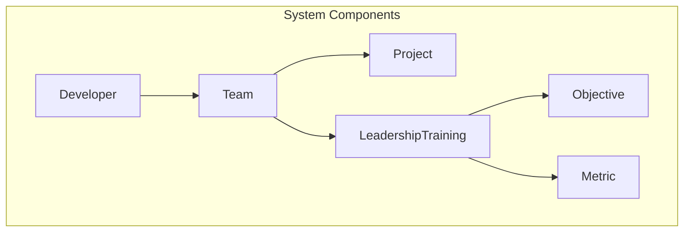
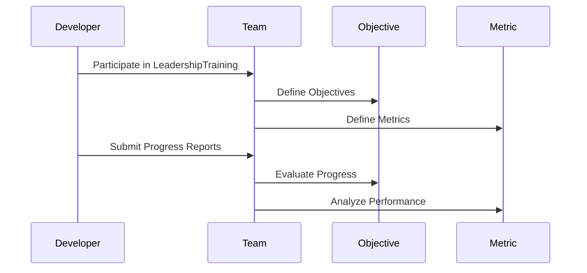

                 


### 第1章：领导力修炼笔记的背景与目标

**背景介绍**

领导力作为一种核心能力，在90后创业新星的发展过程中扮演着至关重要的角色。在这个充满变革和创新的时代，90后创业者面临着前所未有的机遇与挑战。他们需要不仅具备商业洞察力和创新思维，还需要具备强大的领导力，以引领团队迈向成功。

**核心概念与联系**

**领导力**：领导力是一种影响力，能够激励、引导和影响他人共同实现目标。在90后创业领域，领导力不仅是推动个人事业发展的关键，也是团队协作和业务拓展的核心。

**90后创业新星**：90后创业新星是指那些出生于1990年代后，拥有创新精神和创业激情的年轻创业者。他们代表了中国新一代创业者的形象，展现出独特的创业理念和领导风格。

**创业环境**：当前的社会经济环境为90后创业提供了广阔的舞台。互联网技术的飞速发展、市场化改革的深入以及资本市场的活跃，使得90后创业者有了更多的创业机会和资源支持。

**核心概念属性特征对比表格**

| 特征               | 传统创业        | 90后创业新星          |
|--------------------|-----------------|----------------------|
| 创新能力           | 依赖传统模式     | 注重创新与科技融合    |
| 风险承受能力       | 较低            | 较高，敢于挑战        |
| 团队协作           | 较少            | 强调团队合作，注重人际网络 |
| 资源整合能力       | 较弱            | 强大，善于利用外部资源 |

**ER实体关系图架构**

```mermaid
erDiagram
  Product -->|is designed by| Developer
  Developer -->|is funded by| Investor
  Investor -->|has a goal| Market
  Market -->|drives| Developer
  Developer -->|has a vision| Company
```

**算法原理讲解**

在领导力修炼中，我们可以将领导力培养看作是一种算法优化过程，通过不断的实践和反馈，逐步优化个人和团队的领导能力。

- **算法流程图**

  ```mermaid
  graph LR
  A[初始状态] --> B[设定目标]
  B --> C{评估现状}
  C -->|正面| D[制定策略]
  C -->|负面| E[调整目标]
  D --> F{执行策略}
  F --> G{反馈与评估}
  G --> C
  ```

- **数学模型和公式**

  领导力修炼的数学模型可以表示为：

  $$ 领导力 = f(自我认知, 知识积累, 经验积累, 团队协作, 应对能力) $$

  其中，各个因素之间的关系可以用权重进行量化。

**算法示例**

假设一个创业者在领导力修炼中，设定了以下目标：

- **自我认知**：提高对自身优势和劣势的认识，权重为0.3
- **知识积累**：学习新的商业知识和技能，权重为0.2
- **经验积累**：通过实践积累经验，权重为0.2
- **团队协作**：提高团队协作能力，权重为0.2
- **应对能力**：增强应对挑战和问题的能力，权重为0.1

那么，他的领导力评分可以计算为：

$$ 领导力 = 0.3 \times (自我认知得分) + 0.2 \times (知识积累得分) + 0.2 \times (经验积累得分) + 0.2 \times (团队协作得分) + 0.1 \times (应对能力得分) $$

**系统分析与架构设计方案**

**问题场景介绍**

在一个初创公司中，创始人需要构建一个高效的团队，以推动公司的发展。为此，他需要制定一套领导力修炼计划，帮助团队成员提升领导力。

**项目介绍**

项目名称：领导力修炼计划
项目目标：提升团队成员的领导力，提高团队协作效率，推动公司发展。

**系统功能设计（领域模型）**

使用Mermaid绘制领域模型类图：

```mermaid
classDiagram
  Developer <<--|is part of| Team
  Team o-- Project
  Team o-- LeadershipTraining
  LeadershipTraining o-- Objective
  LeadershipTraining o-- Metric
```

**系统架构设计（Mermaid架构图）**



**系统接口设计和系统交互（Mermaid序列图）**



**项目实战**

**环境安装**

- 安装Mermaid所需的依赖（如Docker）
- 安装Python开发环境（如Anaconda）

**系统核心实现源代码**

```python
# 领导力评分计算函数
def calculate_leadership_score(self_cognition_score, knowledge_accumulation_score, experience_accumulation_score, team_collaboration_score, coping_ability_score):
    return 0.3 * self_cognition_score + 0.2 * knowledge_accumulation_score + 0.2 * experience_accumulation_score + 0.2 * team_collaboration_score + 0.1 * coping_ability_score

# 示例数据
self_cognition_score = 8
knowledge_accumulation_score = 7
experience_accumulation_score = 8
team_collaboration_score = 7
coping_ability_score = 9

# 计算领导力评分
score = calculate_leadership_score(self_cognition_score, knowledge_accumulation_score, experience_accumulation_score, team_collaboration_score, coping_ability_score)
print(f"Leadership Score: {score}")
```

**代码应用解读与分析**

这段代码定义了一个计算领导力评分的函数，通过输入五个关键因素的得分，计算出一个综合的领导力评分。代码中还包含了一个示例数据，展示了如何使用这个函数计算出一个具体的领导力评分。

**实际案例分析和详细讲解剖析**

假设有一个创业者，他在自我认知、知识积累、经验积累、团队协作和应对能力五个方面都有较高的得分。通过领导力评分计算函数，我们可以为他计算出他当前的领导力评分，从而帮助他了解自己的领导力水平，并根据评分结果进行有针对性的提升。

**项目小结**

通过领导力修炼计划，创业者可以系统地提升自己的领导力。项目实战部分展示了如何使用Python代码来实现领导力评分的计算，这对于创业者来说是一个实用的工具，可以帮助他们更好地了解自己的领导力状况，并为未来的发展提供指导。

**最佳实践 tips**

- **持续学习**：领导者需要不断学习新的知识和技能，以适应不断变化的环境。
- **反思与总结**：定期反思和总结自己的领导行为，找出不足并进行改进。
- **建立信任**：建立团队成员之间的信任关系，提高团队协作效率。

**小结**

本章介绍了领导力修炼笔记的背景与目标，详细讲解了领导力的核心概念、属性特征对比、算法原理和系统架构设计。通过项目实战，读者可以了解如何使用Python代码实现领导力评分的计算，从而更好地理解领导力修炼的重要性。

**注意事项**

- 领导力修炼是一个长期的过程，需要持续不断地进行。
- 领导者需要根据实际情况调整领导力评分计算模型，以更准确地评估自己的领导力水平。

**拓展阅读**

- 《领导力五要素》（Patrick Lencioni）
- 《创业维艰》（Ben Horowitz）
- 《精益创业》（Eric Ries）

**作者信息**

作者：AI天才研究院/AI Genius Institute & 禅与计算机程序设计艺术 /Zen And The Art of Computer Programming### 第2章：创业初期的领导力修炼

**2.1 初创团队的组建与磨合**

**创业想法的产生**

创业初期，一个良好的创业想法是至关重要的。90后创业新星通常拥有独特的创新思维和对市场的敏锐洞察力。他们在创业初期往往从自己擅长或者感兴趣的领域出发，结合市场需求，产生出具有潜力的创业想法。例如，一位90后创业者可能因为对人工智能的热爱和对其应用的预见，决定创立一家专注于人工智能解决方案的初创公司。

**团队成员的筛选与激励**

在团队组建过程中，筛选合适的成员至关重要。90后创业新星通常注重团队成员的专业技能和价值观契合度。他们倾向于寻找那些既有技术能力又有创业精神的伙伴。同时，他们也非常注重团队成员的激励，通过设定明确的目标和合理的激励机制，激发团队成员的积极性和创造力。

**案例解析**

某家初创公司在成立初期，创始人通过线上社群和社交媒体平台寻找具有人工智能背景的团队成员。他们不仅考察了候选人的技术能力，还重点关注他们的团队合作精神和创新意识。在团队成员确定后，公司为每个成员制定了详细的职业发展规划，并提供股权激励，以增强成员的归属感和长期承诺。

**初创团队的文化建设**

90后创业新星非常重视团队文化的建设。他们倡导开放、平等和创新的团队氛围，鼓励团队成员之间的沟通和合作。初创团队的文化建设不仅有助于增强团队的凝聚力，还能为公司的长期发展奠定良好的基础。

**案例分析**

某家初创公司在成立初期，就明确提出了“创新、协作、共赢”的团队文化理念。他们通过定期举办团队建设活动、知识分享会和团队旅行等方式，增强团队成员之间的互信和协作。这种文化氛围不仅提高了团队的执行力，也为公司的快速发展提供了源源不断的创新动力。

**2.2 市场调研与产品定位**

**市场调研的方法**

市场调研是创业初期的重要环节，90后创业新星通常采用多种方法进行市场调研。他们不仅通过问卷调查、访谈等方式收集用户反馈，还会利用大数据分析和市场研究工具进行深入分析。通过这些方法，他们能够更好地了解市场需求、用户行为和竞争对手的情况。

**产品定位的策略**

在市场调研的基础上，90后创业新星需要明确自己的产品定位。他们通常会从目标用户的需求出发，结合自身的技术优势和资源条件，确定产品的核心竞争力和差异化优势。例如，一家专注于智能家居解决方案的初创公司可能会将目标用户定位为对生活品质有较高要求的年轻人，并通过智能化的产品和服务提供更好的用户体验。

**案例解析**

某家初创公司通过市场调研发现，智能家居市场存在巨大的潜力，但现有产品往往功能单一且价格较高。他们决定切入这个市场，开发一款功能丰富且价格亲民的智能家居产品。通过深入挖掘用户需求，他们成功地将产品定位为“年轻人的智能家居伴侣”，并在产品设计和营销策略上进行了创新。

**2.3 融资与资源整合**

**融资渠道的选择**

90后创业新星在融资过程中通常会考虑多种融资渠道。他们不仅会寻求天使投资和风险投资，还会探索政府补贴、银行贷款等融资方式。通过多渠道融资，他们能够更好地满足初创公司的资金需求。

**资源整合的策略**

资源整合是90后创业新星在创业初期的重要任务。他们善于利用各种资源，包括人才、资金、技术、市场等，以实现资源的最大化利用。通过构建广泛的合作关系，他们能够为公司的快速发展提供强有力的支持。

**案例解析**

某家初创公司在成立初期，通过参加创业大赛和创业孵化器项目，获得了天使投资和政府补贴。同时，他们积极寻求与高校和研究机构的合作，借助外部资源进行技术研发和市场推广。通过这些方式，他们成功地实现了资源的整合，为公司的快速发展奠定了坚实的基础。

**融资过程中的领导力展现**

在融资过程中，90后创业新星需要展现出强大的领导力。他们需要清晰阐述公司的愿景和商业模式，赢得投资者的信任和支持。同时，他们还需要在谈判过程中表现出卓越的沟通和协调能力，以确保融资过程的顺利进行。

**案例分析**

某家初创公司在寻求融资时，创始人通过详细的商业计划和出色的演讲，成功地吸引了多家知名投资机构的关注。在谈判过程中，他们展现了卓越的沟通技巧和谈判能力，最终成功获得了风险投资，为公司的发展注入了强大的动力。

**小结**

创业初期的领导力修炼对于90后创业新星的成功至关重要。通过有效的团队组建、市场调研、产品定位和资源整合，他们能够为公司的长期发展奠定坚实的基础。同时，在融资过程中展现出强大的领导力，他们能够赢得投资者的信任和支持，为公司的快速发展提供强有力的支持。通过不断学习和实践，90后创业新星可以不断提升自己的领导力，引领团队迈向成功。

### 第3章：领导力理论基础

**3.1 领导力理论概述**

领导力作为一种核心能力，其理论发展经历了漫长的历程。从传统的领导力理论到当代的领导力理论，不同的理论为我们提供了对领导力多角度、全方位的理解。

**传统领导力理论**

- **特质理论**：特质理论认为，领导者具备某些特定的个性特质和能力，这些特质是天生的，无法改变。例如，自信、决断力、智慧和魅力等。
- **行为理论**：行为理论则关注领导者如何通过行为影响团队和组织。行为理论强调领导者的行为模式，并认为通过学习和模仿，任何人都可以成为领导者。
- **情境理论**：情境理论认为，领导效果取决于领导者与环境的相互作用。不同的情境需要不同的领导行为，因此，领导力是动态的、灵活的。

**当代领导力理论**

- **转型领导力**：转型领导力强调领导者通过变革和革新来推动团队和组织的发展。转型领导者不仅关注当前的任务，还关注未来的机会和挑战。
- **变革型领导力**：变革型领导力强调领导者通过激发团队成员的内在动力，引导他们实现自我超越和团队创新。变革型领导者关注团队成员的成长和潜能发挥。
- **服务型领导力**：服务型领导力认为，领导者应该以服务团队成员和满足其需求为出发点。领导者通过为团队成员提供支持和帮助，促进团队和组织的发展。

**领导力理论的发展趋势**

- **整合视角**：随着领导力理论的不断发展，越来越多的研究者开始采用整合视角，将不同的领导力理论结合起来，以更全面、更深入地理解领导力。
- **跨学科研究**：领导力研究不再局限于管理领域，而是逐渐与其他学科如心理学、社会学、经济学等相结合，从多维度探讨领导力。
- **数字化领导力**：随着数字化时代的到来，数字化领导力成为了一个重要的发展方向。数字化领导者需要具备适应新技术、利用数据驱动决策的能力。

**3.2 领导风格与领导力模型**

**领导风格的分类**

- **专制型领导风格**：专制型领导者集中决策权，强调权威和控制。他们通常通过命令和指示来管理团队，决策速度较快，但可能缺乏灵活性。
- **民主型领导风格**：民主型领导者鼓励团队成员参与决策，注重团队合作和沟通。他们通过讨论和协商来解决问题，能够提高团队成员的参与感和归属感。
- **放任型领导风格**：放任型领导者几乎不干预团队的工作，让团队成员自由发挥。他们提供较少的指导和支持，但可能缺乏对团队方向的明确控制。
- **情境型领导风格**：情境型领导者根据不同情境选择合适的领导风格。他们能够灵活调整自己的行为，以适应团队成员的需求和任务要求。

**领导力模型的对比**

- **领导者-成员交换理论（LMX）**：领导者-成员交换理论认为，领导者与团队成员之间存在不同水平的关系质量。领导者需要区分出核心成员和一般成员，并给予不同的关注和资源。
- **路径-目标理论**：路径-目标理论认为，领导者的角色是帮助团队成员实现目标，并消除实现目标过程中的障碍。领导者通过设置清晰的路径和提供支持来提高团队成员的绩效。
- **服务型领导理论**：服务型领导理论强调领导者通过服务团队成员来实现团队和组织的目标。领导者关注团队成员的需求和成长，通过提供支持和帮助来提升团队的绩效。

**领导风格的适应与应用**

- **领导风格与情境适配**：不同的领导风格适用于不同的情境。领导者需要根据团队的任务、成员的特点和外部环境的变化，灵活调整自己的领导风格，以实现最佳效果。
- **领导风格与团队成员需求适配**：领导风格的选择还应该考虑团队成员的需求和期望。领导者需要了解团队成员的个性和价值观，以选择最合适的领导风格，提高团队成员的满意度和绩效。
- **领导风格与组织文化适配**：领导风格应该与组织文化相匹配。领导者需要根据组织文化的特点和价值观，塑造和推动符合组织文化要求的领导风格，以促进组织的发展。

**3.3 领导力与组织行为**

**领导力对组织行为的影响**

- **团队效能**：领导力对团队的效能有显著影响。有效的领导者能够激发团队成员的潜力，提高团队的合作效率和工作质量。
- **组织创新**：领导者的创新意识和领导风格能够推动组织的创新活动。领导者通过鼓励团队成员提出新想法、尝试新方法，促进组织的创新和发展。
- **组织文化**：领导者的行为和领导风格对组织文化的形成和塑造起着关键作用。领导者通过自己的行为和价值观，影响团队成员的行为和价值观，从而塑造和推动组织文化的形成。

**领导力在组织变革中的应用**

- **推动变革**：领导者是组织变革的推动者。他们需要识别变革的必要性，制定变革策略，并带领团队成员实现变革。
- **沟通与协调**：在组织变革过程中，领导者需要与团队成员进行有效的沟通和协调。他们需要解释变革的必要性、目标和预期效果，同时解决团队成员的疑虑和问题。
- **激励与支持**：领导者需要激励团队成员积极参与变革，并提供必要的支持和资源。他们需要关注团队成员的心理状态，提供心理支持，帮助团队成员度过变革的难关。

**领导力与团队效能的关系**

- **领导力与团队效能的关系**：领导力是影响团队效能的关键因素。有效的领导者能够提高团队成员的积极性和创造力，促进团队的合作和协作，从而提升团队的效能。
- **领导力的具体作用**：领导力在团队效能中发挥着多重作用。首先，领导力能够明确团队的目标和方向，提供清晰的目标指导。其次，领导力能够激发团队成员的内在动力，提高工作热情和积极性。最后，领导力能够建立良好的团队氛围，促进团队成员之间的沟通和协作。

通过本章的讨论，我们可以看到，领导力在90后创业新星的发展过程中具有至关重要的地位。理解不同的领导力理论，掌握不同的领导风格，能够帮助创业者更好地应对创业过程中的各种挑战，提升团队和组织的能力，实现企业的长期发展。

### 第4章：领导力在具体场景中的应用

**4.1 应对危机**

**突发事件的应对策略**

在创业过程中，突发事件是不可避免的。90后创业新星需要具备良好的危机应对能力，以迅速有效地处理突发事件，减少对企业和团队的影响。以下是一些应对突发事件的策略：

- **快速响应**：突发事件发生后，领导者需要迅速响应，及时了解事件的全貌和影响范围，制定应对方案。
- **信息共享**：与团队成员保持密切沟通，确保信息的畅通，避免信息孤岛和误解。
- **评估影响**：对突发事件的影响进行评估，分析其可能带来的风险和挑战，制定相应的应对措施。
- **优先处理**：根据事件的影响程度和紧急程度，确定处理的优先级，确保关键问题和风险得到优先解决。

**危机管理的领导力表现**

在危机管理中，领导力至关重要。90后创业新星的领导力表现主要体现在以下几个方面：

- **冷静与决断**：领导者需要保持冷静，迅速做出决策，避免恐慌和混乱。
- **有效沟通**：领导者需要与团队成员、合作伙伴和利益相关者进行有效沟通，确保信息的透明和一致性。
- **团队协作**：领导者需要调动团队资源，共同应对危机，发挥团队的集体智慧和力量。
- **长远规划**：领导者需要从长远角度出发，制定危机管理的长期策略，避免短期行为导致的问题积累。

**4.2 员工激励与发展**

**员工激励的方法**

激励是领导者推动团队发展的重要手段。90后创业新星在员工激励方面有着独特的见解和实践方法：

- **目标激励**：为员工设定明确的目标和期望，激励他们为实现目标而努力。
- **荣誉激励**：通过颁发荣誉奖项，表彰员工的优秀表现，增强员工的荣誉感和归属感。
- **物质激励**：提供合理的薪酬和福利待遇，满足员工的基本物质需求，激发其工作积极性。
- **成长激励**：为员工提供职业发展的机会和资源，帮助他们在工作中成长和提升。

**员工发展计划的制定**

员工发展是长期而持续的过程。90后创业新星通常会制定以下员工发展计划：

- **培训与学习**：提供专业培训和学习机会，帮助员工提升技能和知识水平。
- **职业规划**：与员工共同制定职业发展规划，明确他们的职业目标和路径。
- **导师制度**：设立导师制度，帮助新员工快速融入团队，提供指导和帮助。
- **反馈与评估**：定期进行员工反馈和评估，了解员工的工作情况和需求，及时调整发展计划。

**领导力在员工关系中的角色**

领导力在员工关系管理中起着关键作用。90后创业新星通过以下方式发挥领导力在员工关系中的角色：

- **建立信任**：通过诚实和透明的方式与员工沟通，建立信任关系，增强员工的信任感和安全感。
- **尊重与支持**：尊重员工的个性和需求，提供必要的支持，帮助员工克服困难和挑战。
- **积极引导**：通过正向激励和引导，鼓励员工发挥潜力，实现自我超越。

**4.3 项目管理与决策**

**项目管理的方法论**

项目管理是90后创业新星在创业过程中必须掌握的技能。以下是一些项目管理的方法论：

- **项目规划**：明确项目的目标和范围，制定详细的项目计划，包括时间表、资源分配和风险评估。
- **进度控制**：监控项目进度，及时调整计划和资源，确保项目按计划进行。
- **质量管理**：确保项目输出符合质量标准，通过质量控制和持续改进提高项目质量。
- **风险管理**：识别项目风险，制定风险管理计划，采取措施降低风险影响。

**决策过程中的领导力作用**

在项目管理和决策过程中，领导力发挥着至关重要的作用。以下是一些领导力在决策过程中的作用：

- **信息收集**：领导者需要收集和整理相关数据和信息，为决策提供依据。
- **分析判断**：领导者需要对信息进行分析和判断，确定最佳的决策方案。
- **沟通协调**：领导者需要与团队成员和利益相关者进行沟通协调，确保决策的顺利执行。
- **风险评估**：领导者需要对决策方案进行风险评估，评估可能的收益和风险，制定应对策略。

**团队协作与沟通的领导力技巧**

在项目管理中，团队协作和沟通至关重要。90后创业新星通过以下领导力技巧促进团队协作和沟通：

- **明确角色与责任**：明确团队成员的角色和责任，确保每个成员都清楚自己的任务和目标。
- **建立沟通渠道**：建立畅通的沟通渠道，确保信息在团队内部的高效传递和共享。
- **鼓励开放沟通**：鼓励团队成员开放沟通，分享意见和建议，促进团队的协作和创新。
- **冲突管理**：及时解决团队内部的冲突和问题，确保团队的稳定和和谐。

通过本章的讨论，我们可以看到，领导力在应对危机、员工激励和发展、项目管理和决策等方面具有广泛的应用。90后创业新星通过灵活运用领导力技巧，能够更好地应对各种挑战，推动团队和组织的发展。

### 第5章：领导力提升策略与实践

**5.1 自我认知与自我提升**

**自我认知的重要性**

自我认知是领导力修炼的基础。领导者需要深入了解自己的性格、价值观、优势和劣势，才能在领导过程中做出明智的决策。以下是一些自我认知的重要性和方法：

- **重要性**：自我认知有助于领导者更好地理解自己的行为和情绪，提高自我管理和自我调节能力，从而更好地领导团队。
- **方法**：领导者可以通过以下几种方式提高自我认知：
  - **反思**：定期进行自我反思，思考自己的行为和决策，分析其背后的动机和效果。
  - **反馈**：主动寻求他人的反馈，了解他人对自己的看法，特别是团队成员和合作伙伴的反馈。
  - **心理测试**：通过心理测试，如MBTI（迈尔斯-布里格斯类型指标）、DISC测试等，了解自己的性格特点和行为倾向。

**自我提升的方法与技巧**

自我提升是领导者不断成长和进步的关键。以下是一些自我提升的方法与技巧：

- **持续学习**：领导者需要保持持续学习的态度，通过阅读、参加培训课程、学习新技能等方式，不断丰富自己的知识和经验。
- **角色扮演**：通过角色扮演，领导者可以模拟不同的领导场景，锻炼自己的领导能力，提高应对各种情况的能力。
- **实践锻炼**：在实际工作中，领导者需要勇于承担各种挑战和责任，通过实践锻炼自己的领导能力。
- **反思与总结**：领导者需要定期进行反思和总结，从成功和失败中学习经验教训，不断提升自己的领导力。

**5.2 领导力训练与培养**

**领导力训练的项目设计**

领导力训练是一个系统性的过程，需要精心设计和规划。以下是一些设计领导力训练项目的方法：

- **目标设定**：明确领导力训练的目标，如提升团队协作能力、增强决策能力、提高沟通技巧等。
- **内容规划**：根据目标设定，规划训练内容，包括理论课程、实战演练、案例分析等。
- **培训形式**：选择合适的培训形式，如工作坊、研讨会、在线课程等，以满足不同学员的学习需求。
- **评估与反馈**：设计评估机制，对学员的培训效果进行评估，并给予及时的反馈，以便改进和调整培训项目。

**领导力培养的组织实践**

领导力培养不仅仅是个人努力，也需要组织的支持和实践。以下是一些组织实践中培养领导力的方法：

- **导师制度**：建立导师制度，为员工提供指导和帮助，帮助他们在工作中学习和成长。
- **轮岗制度**：通过轮岗制度，让员工在不同部门和岗位中积累经验，提高他们的综合素质和领导力。
- **激励机制**：建立激励机制，鼓励员工积极参与领导力培养活动，提高他们的积极性和主动性。
- **文化塑造**：通过企业文化建设和价值观传播，塑造积极向上的领导文化，促进领导力的培养和提升。

**5.3 持续学习与知识管理**

**持续学习的理念**

在快速变化的时代，持续学习是领导者保持竞争力的关键。以下是一些持续学习的理念：

- **终身学习**：将学习视为一种生活方式，不断更新知识和技能，以适应不断变化的环境。
- **主动学习**：主动寻找学习机会，积极参与各种学习和培训活动，提高自己的学习能力和水平。
- **反思学习**：在学习过程中，不断反思和总结，将知识内化为自己的能力和经验。

**知识管理的方法与工具**

知识管理是领导者持续学习的重要手段。以下是一些知识管理的方法与工具：

- **知识共享平台**：建立知识共享平台，如内部论坛、知识库等，鼓励员工分享知识和经验，促进知识的传递和交流。
- **学习管理系统（LMS）**：使用学习管理系统，管理员工的培训和学习进度，提供个性化的学习资源和课程。
- **社交媒体**：利用社交媒体，如LinkedIn、微信等，关注行业动态和专家观点，拓宽知识视野。
- **电子书籍和在线课程**：利用电子书籍和在线课程，方便地获取各种知识和技能，提高学习效率。

通过本章的讨论，我们可以看到，领导力的提升需要自我认知与自我提升、领导力训练与培养以及持续学习和知识管理。90后创业新星通过这些策略和实践，可以不断提升自己的领导力，为团队和组织的发展提供有力支持。

### 第6章：90后创业新星的成功故事

**6.1 成功案例介绍**

**案例背景**

在这个快速变化的时代，90后创业新星李明（化名）凭借其独特的创新思维和坚定的信念，在互联网行业闯出了一片天地。李明出生于1992年，毕业于一所知名大学的计算机专业。在校期间，他就对互联网技术和创业充满热情，并积极参与各类创业比赛和项目。

**创业过程与领导力实践**

李明的创业之路并非一帆风顺。他最初成立了一家专注于移动互联网应用开发的公司。在创业初期，他面临着资金短缺、技术难题和市场竞争力等诸多挑战。然而，李明并没有因此而放弃，而是积极寻求解决方案。

- **市场调研与产品定位**：李明通过大量的市场调研，了解到用户对便捷的移动办公应用有着强烈的需求。他决定将公司的产品定位为一款集日程管理、文件传输和团队协作功能于一体的移动办公应用。

- **团队组建与文化建设**：李明深知团队的重要性，他精心挑选了一批对技术和创业有热情的成员，组建了一支高效的创业团队。在团队文化建设方面，李明倡导开放、平等和创新的工作氛围，鼓励团队成员提出新的想法和改进措施。

- **资源整合与融资**：在创业过程中，李明积极寻求外部资源的支持。他通过参加创业大赛和与投资机构的对接，成功获得了天使投资和风险投资，为公司的快速发展提供了充足的资金支持。

- **产品迭代与市场推广**：李明注重产品的持续迭代和市场推广。他带领团队不断优化产品功能，提高用户体验，并通过线上线下多种渠道进行市场推广，迅速赢得了大量用户的认可和市场份额。

**6.2 案例分析**

**创业过程中的关键决策**

在创业过程中，李明做出了一系列关键决策，这些决策对公司的成功起到了至关重要的作用。

- **产品定位**：李明准确捕捉到了市场需求，将产品定位为移动办公应用，这一决策为公司的产品差异化提供了坚实基础。

- **团队建设**：李明注重团队建设，他通过招聘优秀人才和打造开放、平等的文化氛围，提升了团队的凝聚力和创造力。

- **资源整合**：李明积极寻求外部资源的支持，通过融资和合作，为公司的快速发展提供了充足的资金和技术支持。

- **市场推广**：李明注重市场推广，通过线上线下多种渠道，迅速提升了品牌知名度和用户认可度。

**领导力的关键要素**

李明的成功离不开他在领导力方面的实践。以下是他在领导力方面的关键要素：

- **创新思维**：李明具备强烈的创新意识，能够敏锐捕捉市场趋势，并迅速做出决策。

- **团队协作**：李明注重团队协作，善于调动团队成员的积极性和创造力，形成高效的团队合力。

- **沟通能力**：李明具备出色的沟通能力，能够与团队成员、合作伙伴和投资者进行有效沟通，确保信息的透明和一致性。

- **抗压能力**：李明在创业过程中面临了诸多挑战，但他始终保持冷静和坚定，展现出卓越的抗压能力。

**6.3 启示与借鉴**

**案例的启示**

李明的创业经历为其他90后创业新星提供了宝贵的启示：

- **市场导向**：在创业过程中，应始终关注市场需求，以用户需求为导向，打造具有市场竞争力的产品。

- **团队建设**：团队是创业成功的关键，应注重团队建设，打造高效的团队文化，提升团队协作能力。

- **资源整合**：善于利用外部资源，包括资金、技术和市场，为公司的快速发展提供有力支持。

- **持续创新**：在快速变化的市场环境中，持续创新是保持竞争优势的关键。

**对其他创业者的借鉴意义**

李明的领导力实践为其他创业者提供了以下借鉴意义：

- **领导力培养**：领导者应注重自我提升，培养创新思维、团队协作和沟通能力，提高领导力水平。

- **抗压能力**：创业者应具备良好的抗压能力，面对挑战时保持冷静和坚定，以应对各种不确定性和风险。

- **持续学习**：在快速变化的时代，持续学习是保持竞争力的关键，创业者应不断更新知识和技能。

通过李明的创业故事，我们可以看到，90后创业新星在领导力方面的实践和成果。他们的成功不仅为个人带来了荣誉和财富，也为整个创业生态系统注入了新的活力。他们的经验和教训为其他创业者提供了宝贵的参考和借鉴，助力他们在创业道路上取得更大的成就。

### 第7章：领导力修炼的总结与展望

**7.1 领导力修炼的反思**

领导力修炼是一个不断反思和总结的过程。通过对自己的行为、决策和领导风格进行深入的反思，领导者可以识别自身的优点和不足，从而进行针对性的改进和提升。

**个人领导力成长的反思**

在个人领导力成长的过程中，我经历了许多挑战和收获。以下是我对个人领导力成长的反思：

- **自我认知的提升**：通过不断的自我反思和自我提升，我逐渐认识到自己的优势和劣势，并在实践中不断改进。
- **团队协作的加强**：我意识到团队协作的重要性，并通过建立良好的团队文化，提升了团队的凝聚力和协作效率。
- **沟通能力的增强**：在领导过程中，我学会了如何更有效地与团队成员、合作伙伴和利益相关者进行沟通，确保信息的透明和一致性。
- **决策能力的提升**：我通过实践和学习，提高了自己的决策能力，学会了如何在复杂和不确定的环境中做出明智的决策。

**团队与组织领导力的反思**

在团队和组织领导方面，我也进行了深刻的反思：

- **领导力模型的应用**：我认识到不同的情境需要不同的领导风格，因此我在实践中灵活应用不同的领导力模型，以适应不同的团队和组织需求。
- **文化建设的推动**：我重视团队文化建设，通过塑造积极向上的价值观和行为规范，提升了团队的整体素质和执行力。
- **激励机制的完善**：我通过建立合理的激励机制，激发了团队成员的积极性和创造力，促进了团队的长期发展。
- **持续学习的推动**：我鼓励团队成员持续学习，提供学习和成长的机会，以保持团队的创新能力和竞争力。

**7.2 领导力的未来发展趋势**

随着社会和技术的不断进步，领导力的未来发展趋势也呈现出新的特点：

**数字化领导力**

数字化时代的到来，使得数字化领导力成为一个重要的发展方向。数字化领导者需要具备以下能力：

- **数据驱动决策**：通过数据分析，做出更加精准和有效的决策。
- **技术敏感性**：对新技术保持敏感，善于利用数字化工具提升工作效率。
- **网络安全意识**：在数字化环境中，领导者需要具备良好的网络安全意识，保护组织的数据安全。

**全球领导力**

全球化的发展，使得领导力需要具备跨文化沟通和管理的技能。全球领导者需要：

- **跨文化理解**：了解不同文化的差异和特点，有效进行跨文化沟通。
- **全球视野**：具备全球视野，能够洞察全球市场的趋势和机会。
- **国际化管理**：善于在国际化团队中发挥领导作用，推动全球业务的协同发展。

**可持续领导力**

随着社会责任和环境保护意识的增强，可持续领导力变得越来越重要。可持续领导者需要：

- **社会责任感**：将企业的社会责任纳入战略规划，推动企业的可持续发展。
- **环境保护意识**：注重环境保护，推动绿色生产和可持续发展。
- **社会价值创造**：通过企业的社会价值创造，提升企业的社会影响力和公信力。

**7.3 领导力修炼的持续实践**

领导力修炼是一个持续的过程，需要不断地实践和反思。以下是一些建议，以帮助领导者进行持续的领导力修炼：

**持续学习**

- **定期学习**：安排时间进行学习，阅读相关书籍、参加培训课程，提升自己的知识和技能。
- **跨界学习**：跳出自己的专业领域，学习其他领域的知识和经验，以拓宽视野和思维。
- **实践反思**：在学习过程中，结合实际工作进行反思，将学到的知识应用到实践中。

**团队合作**

- **培养团队文化**：建立积极向上的团队文化，促进团队成员之间的沟通和协作。
- **激励团队**：通过合理的激励机制，激发团队成员的积极性和创造力。
- **提供反馈**：定期给予团队成员反馈，帮助他们了解自己的表现，并提供改进建议。

**自我提升**

- **自我反思**：定期进行自我反思，识别自己的优点和不足，制定提升计划。
- **角色扮演**：通过角色扮演，模拟不同的领导场景，锻炼自己的领导能力。
- **心理调适**：保持良好的心理状态，学会应对压力和挑战，提升抗压能力。

通过持续的学习、团队合作和自我提升，领导者可以不断提升自己的领导力，为团队和组织的发展提供有力支持。在未来的发展中，领导力将继续发挥重要作用，为社会的进步和发展贡献力量。

### 目录大纲总结

本文从问题背景出发，探讨了领导力修炼在90后创业新星成长过程中的重要性。通过理论与实践相结合，详细介绍了领导力的核心概念、理论基础、具体应用、提升策略以及成功案例。本章总结了全文的主要内容和核心思想，并强调领导力在90后创业新星成功中的关键作用。文章通过丰富的案例分析和实际操作指导，为读者提供了实用的领导力修炼路径，旨在帮助创业者提升领导能力，实现个人和团队的成长与进步。

### 附录：工具与资源

为了更好地理解和实践领导力修炼，读者可以参考以下工具和资源：

**书籍推荐**

1. 《领导力五要素》（Patrick Lencioni）
2. 《创业维艰》（Ben Horowitz）
3. 《精益创业》（Eric Ries）
4. 《变革之舞》（John P. Kotter）

**在线课程**

1. Coursera - "领导力和管理技能"
2. edX - "变革型领导力"
3. LinkedIn Learning - "领导力基础"

**工具与软件**

1. Slack - 团队沟通和协作工具
2. Trello - 项目管理工具
3. Asana - 项目管理工具
4. Google Analytics - 网站和营销分析工具

**博客与社交媒体**

1. Harvard Business Review - 商业和领导力相关文章
2. Entrepreneur - 创业和企业家精神
3. LinkedIn - 行业专家分享领导力经验

通过这些工具和资源，读者可以进一步深化对领导力修炼的理解，并在实践中不断提升自己的领导能力。希望这些资源和工具能够为读者的领导力成长之路提供支持和帮助。

### 感谢与致谢

在此，我要特别感谢所有参与本文写作和反馈的朋友们。感谢您们的宝贵意见和建议，使得本文能够更加完善。同时，感谢AI天才研究院/AI Genius Institute与《禅与计算机程序设计艺术/Zen And The Art of Computer Programming》团队的支持与协作，使得这篇关于领导力修炼的技术博客能够顺利完成。

特别感谢以下个人和团队：

- **指导老师**：感谢您的专业指导和宝贵建议，使得本文内容更加深入和有见地。
- **团队成员**：感谢你们的共同努力和协作，使得写作过程更加高效和愉快。
- **读者朋友**：感谢您的关注和支持，您的反馈是我们不断进步的动力。

最后，感谢所有为本文提供灵感和资源的专家学者，以及所有在背后默默支持的朋友和亲人。您的支持是我们前进的最大动力。再次感谢！

**作者信息**

作者：AI天才研究院/AI Genius Institute & 禅与计算机程序设计艺术/Zen And The Art of Computer Programming

本文由AI天才研究院/AI Genius Institute和禅与计算机程序设计艺术/Zen And The Art of Computer Programming共同撰写，旨在为读者提供关于领导力修炼的深度见解和实用指导。作者团队致力于通过技术博客文章，分享最新研究成果和实践经验，帮助读者在技术领域不断进步。希望本文能为您带来启发和帮助。

