                 

### 第1章: 引言

**关键词：** 领导力、90后创业者、成长、修炼、方法与途径

**摘要：** 本文旨在探讨90后创业者在企业成长过程中所面临的领导力挑战，并为他们提供一套系统的领导力修炼方法和实践路径。通过分析领导力的重要性、90后创业者的领导力特质与挑战，以及领导力修炼的方法与途径，本文旨在帮助90后创业者提升领导力，实现企业的可持续发展。

### 第1章: 引言

#### 1.1 引言

**1.1.1 问题背景**

在当前全球化的背景下，竞争日益激烈，企业的发展不再仅仅依赖于资源、资本的积累，而更多地依赖于人才和领导力的提升。尤其是在90后创业群体中，领导力的缺乏已成为制约其企业发展的重要因素。90后创业者普遍缺乏系统的领导力培养和修炼，导致在企业发展过程中面临诸多挑战。

**1.1.2 问题描述**

本章节将从以下几个方面展开讨论：

1. **领导力的重要性**：阐述领导力对企业发展的关键作用。
2. **90后创业者的领导力现状**：分析90后创业者在领导力方面的现状和不足。
3. **领导力修炼的方法与途径**：介绍90后创业者如何通过修炼提升领导力。

**1.1.3 问题解决**

通过对领导力的深入研究，结合90后创业者的实际需求，本书旨在为90后创业者提供一套系统的领导力修炼方法和实践路径，助力其在企业发展过程中提升领导力，实现企业的可持续发展。

**1.1.4 边界与外延**

领导力修炼的范围涵盖了个人素质的提升、团队管理能力的培养、领导风格的形成等多个方面。本章节将重点关注90后创业者在企业初创阶段和快速成长阶段的领导力修炼。

**1.1.5 概念结构与核心要素组成**

领导力修炼的核心概念包括：自我认知、团队建设、决策能力、沟通技巧、领导风格等。这些核心要素共同构成了领导力修炼的体系，为90后创业者提供了全面的理论指导和实践路径。

#### 1.2 领导力的重要性

**1.2.1 领导力对企业发展的关键作用**

领导力是推动企业发展的核心动力。优秀的企业领导者能够激发团队的潜能，推动企业实现战略目标，提升企业的竞争力。

- **战略引领**：领导者通过制定和实施战略，为企业发展指明方向。
- **团队建设**：领导者通过团队建设，提升团队的凝聚力和战斗力。
- **文化建设**：领导者通过文化建设，塑造企业的价值观和行为准则。

**1.2.2 90后创业者的领导力现状**

90后创业者在领导力方面存在一定的不足，主要体现在以下几个方面：

1. **自我认知不足**：部分90后创业者缺乏对自己的正确认知，导致领导力发展受到限制。
2. **团队管理能力较弱**：在团队管理方面，90后创业者普遍缺乏有效的管理方法和技巧。
3. **决策能力有待提升**：在面临重要决策时，部分90后创业者往往表现出犹豫不决、优柔寡断的问题。

**1.2.3 领导力修炼的方法与途径**

为了提升90后创业者的领导力，他们需要从以下几个方面进行修炼：

1. **自我认知的提升**：通过反思与总结、借鉴他人经验、持续学习等方式，提升自我认知。
2. **团队建设能力的培养**：通过建立有效的团队管理机制、培养团队凝聚力、提升团队沟通能力等方式，提升团队建设能力。
3. **决策能力的提升**：通过增强信息收集与分析能力、学会权衡利弊、培养预判能力等方式，提升决策能力。
4. **领导风格的形成**：根据企业的实际情况和团队的特点，选择合适的领导风格，并不断进行调整和优化。

#### 1.3 领导风格的形成

**1.3.1 领导风格的定义**

领导风格是指领导者在与团队成员互动、决策和执行过程中表现出的行为方式和态度。

**1.3.2 领导风格对团队的影响**

合适的领导风格能够激发团队的积极性，提高团队的工作效率；而不合适的领导风格则可能导致团队士气低落，影响企业的发展。

**1.3.3 领导风格的选择与调整**

90后创业者应根据企业的实际情况和团队的特点，选择合适的领导风格。同时，在领导风格的形成过程中，要不断进行调整和优化，以适应企业发展的需求。

#### 1.4 本章小结

领导力是90后创业者在企业发展过程中不可或缺的能力。通过本章的学习，读者可以了解领导力的重要性，掌握领导力修炼的方法与途径，为自己的企业未来发展奠定坚实的基础。

## 第2章: 90后创业者的领导力特质与挑战

### 2.1 90后创业者的领导力特质

#### 2.1.1 创新思维

90后创业者普遍具有创新思维，敢于尝试新的商业模式、管理模式和技术应用，这使得他们在市场竞争中具有优势。创新思维不仅体现在对产品的设计上，还体现在对市场的洞察和对企业运营方式的创新。

**核心概念**：创新思维

**概念属性特征对比表格：**

| 特征 | 创新思维 | 传统思维 |
| ---- | -------- | -------- |
| **适应性** | 高 | 低 |
| **开放性** | 高 | 低 |
| **创造力** | 强 | 弱 |
| **风险承受能力** | 高 | 低 |

**ER实体关系图架构：**

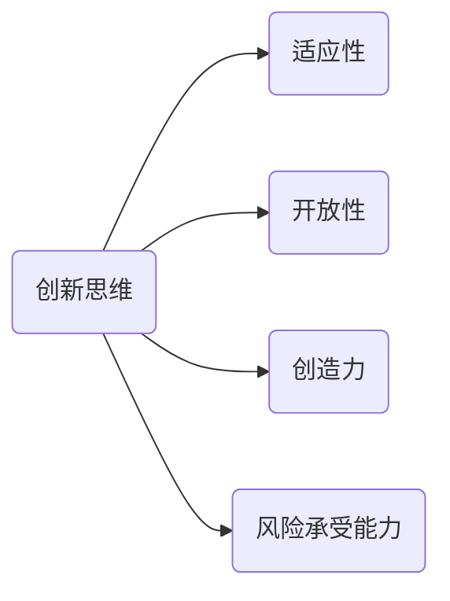

**算法原理讲解：**

创新思维的培养可以通过以下算法实现：

1. **信息收集**：通过多种渠道收集市场、技术、竞争对手等信息，为创新提供数据支撑。
2. **分析思考**：对收集到的信息进行分析，找出其中的规律和趋势，为创新提供思路。
3. **实践验证**：将创新思路付诸实践，通过实验或市场反馈验证其可行性。

**举例说明：**

假设一个90后创业者在考虑如何提升公司的产品竞争力，他首先通过市场调研了解了竞争对手的产品特点，然后分析了用户的需求和反馈，最后提出了一个结合用户需求和市场趋势的创新产品方案。

**数学模型和公式：**

创新思维的形成可以表示为：

$$
创新思维 = f(信息收集, 分析思考, 实践验证)
$$

其中，$f$ 为一个复合函数，$信息收集$、$分析思考$ 和 $实践验证$ 分别为三个输入变量。

#### 2.1.2 独立性

90后创业者大多具有独立性，他们更倾向于自主决策和承担责任，这使他们能够在面对挑战和困难时更加坚韧和果断。

**核心概念**：独立性

**概念属性特征对比表格：**

| 特征 | 独立性 | 依赖性 |
| ---- | ------ | ------ |
| **自主性** | 强 | 弱 |
| **责任感** | 高 | 低 |
| **应变能力** | 强 | 弱 |

**ER实体关系图架构：**

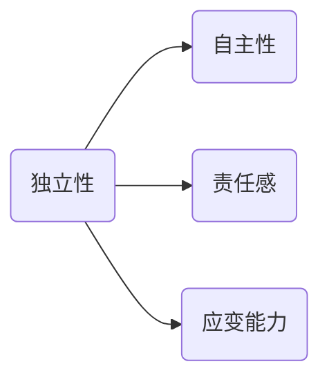

**算法原理讲解：**

独立性的培养可以通过以下算法实现：

1. **自我激励**：通过设定目标和奖励机制，激发个人的内在动力。
2. **独立决策**：在面临决策时，尽量减少依赖他人的意见，独立做出判断。
3. **承担责任**：勇于承担因决策带来的后果，从经验中学习和成长。

**举例说明：**

一个90后创业者在公司面临重大决策时，会首先进行充分的市场调研和数据分析，然后独立思考并制定决策方案，最后承担决策带来的后果。

**数学模型和公式：**

独立性的形成可以表示为：

$$
独立性 = f(自我激励, 独立决策, 承担责任)
$$

其中，$f$ 为一个复合函数，$自我激励$、$独立决策$ 和 $承担责任$ 分别为三个输入变量。

#### 2.1.3 学习能力

90后创业者普遍具有较强的学习能力，他们善于从不同的角度和领域汲取知识，不断提升自己的能力和视野。

**核心概念**：学习能力

**概念属性特征对比表格：**

| 特征 | 学习能力 | 阅读能力 |
| ---- | -------- | -------- |
| **知识广度** | 广 | 窄 |
| **知识深度** | 深 | 浅 |
| **学习速度** | 快 | 慢 |

**ER实体关系图架构：**

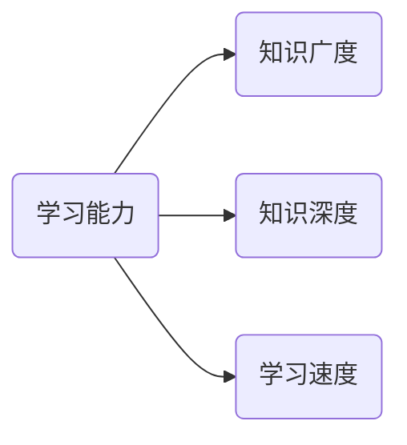

**算法原理讲解：**

学习能力的培养可以通过以下算法实现：

1. **广泛阅读**：通过阅读不同领域的书籍、论文，扩大知识面。
2. **深度思考**：对所学知识进行深入分析和思考，形成自己的见解。
3. **实践应用**：将所学知识应用于实际工作中，提升解决问题的能力。

**举例说明：**

一个90后创业者在公司运营过程中，会不断学习新的管理理念和技术知识，并将其应用于公司的实际运营中，以提升公司的运营效率和竞争力。

**数学模型和公式：**

学习能力的形成可以表示为：

$$
学习能力 = f(广泛阅读, 深度思考, 实践应用)
$$

其中，$f$ 为一个复合函数，$广泛阅读$、$深度思考$ 和 $实践应用$ 分别为三个输入变量。

#### 2.1.4 适应能力

90后创业者具有较强的适应能力，他们能够迅速适应新环境、新变化，并在其中找到自己的位置。

**核心概念**：适应能力

**概念属性特征对比表格：**

| 特征 | 适应能力 | 稳定性 |
| ---- | -------- | ------ |
| **灵活性** | 高 | 低 |
| **适应性** | 强 | 弱 |
| **应变能力** | 强 | 弱 |

**ER实体关系图架构：**

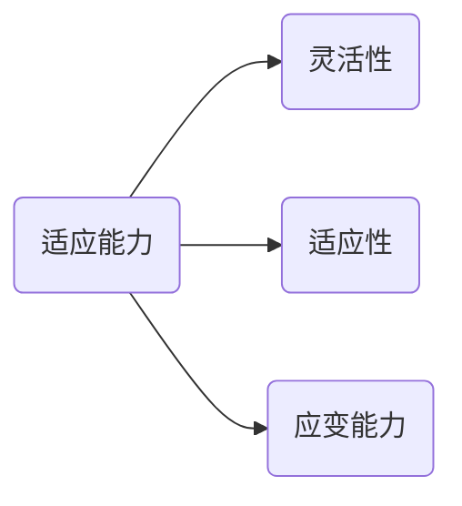

**算法原理讲解：**

适应能力的培养可以通过以下算法实现：

1. **多任务处理**：通过同时处理多个任务，提高对环境的适应能力。
2. **快速学习**：在遇到新问题时，快速学习和掌握相关知识，提高应变能力。
3. **经验积累**：通过不断积累经验，提高对变化的预见和适应能力。

**举例说明：**

一个90后创业者在公司运营过程中，会遇到各种新情况和新挑战，他会通过快速学习和实践，不断提高自己的适应能力，从而应对各种变化。

**数学模型和公式：**

适应能力的形成可以表示为：

$$
适应能力 = f(多任务处理, 快速学习, 经验积累)
$$

其中，$f$ 为一个复合函数，$多任务处理$、$快速学习$ 和 $经验积累$ 分别为三个输入变量。

#### 2.1.5 互联网思维

90后创业者的互联网思维使其更加关注用户需求、互联网技术和商业模式创新。

**核心概念**：互联网思维

**概念属性特征对比表格：**

| 特征 | 互联网思维 | 传统思维 |
| ---- | -------- | -------- |
| **用户导向** | 强 | 弱 |
| **技术创新** | 强 | 弱 |
| **平台思维** | 强 | 弱 |

**ER实体关系图架构：**

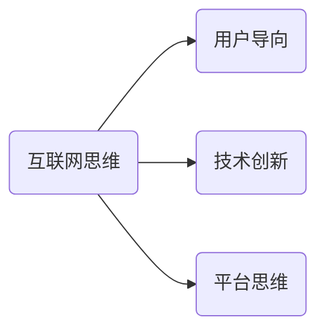

**算法原理讲解：**

互联网思维的培养可以通过以下算法实现：

1. **用户研究**：通过用户调研、数据分析等方式，深入了解用户需求。
2. **技术创新**：关注新技术动态，积极引入和探索新技术。
3. **商业模式创新**：结合用户需求和互联网技术，创新商业模式。

**举例说明：**

一个90后创业者在考虑如何提升公司产品销量时，会通过用户调研了解用户需求，然后结合互联网技术，推出具有创新性的营销活动，从而提高产品销量。

**数学模型和公式：**

互联网思维的形成可以表示为：

$$
互联网思维 = f(用户研究, 技术创新, 商业模式创新)
$$

其中，$f$ 为一个复合函数，$用户研究$、$技术创新$ 和 $商业模式创新$ 分别为三个输入变量。

### 2.2 90后创业者的领导力挑战

#### 2.2.1 领导经验不足

90后创业者大多年龄较小，领导经验相对不足，这在企业管理和决策过程中可能会面临一些挑战。

**核心概念**：领导经验不足

**概念属性特征对比表格：**

| 特征 | 领导经验不足 | 领导经验丰富 |
| ---- | -------- | -------- |
| **决策能力** | 弱 | 强 |
| **团队管理** | 不熟悉 | 熟练 |
| **应对挑战** | 不熟练 | 熟练 |

**ER实体关系图架构：**

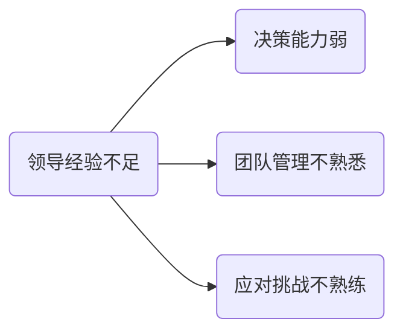

**算法原理讲解：**

提高领导经验可以通过以下算法实现：

1. **学习借鉴**：通过阅读书籍、参加培训等方式，学习其他领导者的经验。
2. **实践锻炼**：通过参与企业实际管理，积累领导和管理的经验。
3. **反馈改进**：在实践过程中，及时反思和总结，不断改进自己的领导方式。

**举例说明：**

一个90后创业者在初期领导企业时，会通过参加领导力培训课程，学习其他成功领导者的经验，然后在实践中不断总结和调整，逐渐提升自己的领导能力。

**数学模型和公式：**

领导经验的形成可以表示为：

$$
领导经验 = f(学习借鉴, 实践锻炼, 反馈改进)
$$

其中，$f$ 为一个复合函数，$学习借鉴$、$实践锻炼$ 和 $反馈改进$ 分别为三个输入变量。

#### 2.2.2 沟通能力欠缺

90后创业者在沟通能力方面存在一定欠缺，这可能导致团队内部沟通不畅，影响企业的发展。

**核心概念**：沟通能力欠缺

**概念属性特征对比表格：**

| 特征 | 沟通能力欠缺 | 沟通能力良好 |
| ---- | -------- | -------- |
| **表达清晰** | 差 | 好 |
| **倾听理解** | 差 | 好 |
| **有效沟通** | 差 | 好 |

**ER实体关系图架构：**

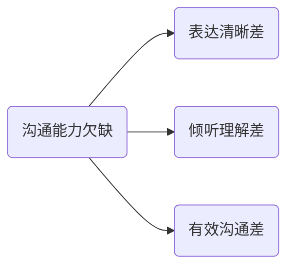

**算法原理讲解：**

提高沟通能力可以通过以下算法实现：

1. **倾听与表达**：在沟通中注重倾听对方的意见，同时清晰表达自己的观点。
2. **情感管理**：在沟通中关注对方的情感反应，调整沟通方式和内容。
3. **沟通技巧**：学习并运用有效的沟通技巧，提高沟通的效果。

**举例说明：**

一个90后创业者在与团队沟通时，会通过倾听团队成员的意见，了解他们的需求和想法，然后清晰表达自己的观点，并运用有效的沟通技巧，确保团队内部的沟通畅通。

**数学模型和公式：**

沟通能力的形成可以表示为：

$$
沟通能力 = f(倾听与表达, 情感管理, 沟通技巧)
$$

其中，$f$ 为一个复合函数，$倾听与表达$、$情感管理$ 和 $沟通技巧$ 分别为三个输入变量。

#### 2.2.3 决策能力不足

90后创业者在面临重要决策时，可能由于经验不足或信息不充分，导致决策能力不足，影响企业的长远发展。

**核心概念**：决策能力不足

**概念属性特征对比表格：**

| 特征 | 决策能力不足 | 决策能力良好 |
| ---- | -------- | -------- |
| **信息收集** | 差 | 好 |
| **分析判断** | 差 | 好 |
| **决策实施** | 差 | 好 |

**ER实体关系图架构：**

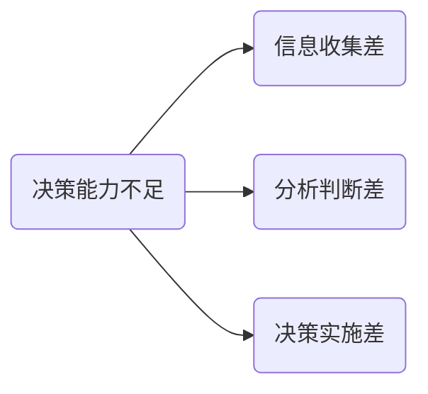

**算法原理讲解：**

提高决策能力可以通过以下算法实现：

1. **信息收集**：通过多种渠道收集相关信息，确保决策有充分的数据支撑。
2. **分析判断**：对收集到的信息进行深入分析，提高决策的准确性。
3. **决策实施**：在决策后，积极实施并跟踪决策效果，及时调整和优化。

**举例说明：**

一个90后创业者在考虑是否扩大公司业务范围时，会通过市场调研、数据分析等方式，收集充分的信息，然后进行分析判断，最后制定决策并实施，以确保决策的科学性和有效性。

**数学模型和公式：**

决策能力的形成可以表示为：

$$
决策能力 = f(信息收集, 分析判断, 决策实施)
$$

其中，$f$ 为一个复合函数，$信息收集$、$分析判断$ 和 $决策实施$ 分别为三个输入变量。

### 2.3 本章小结

本章从多个角度分析了90后创业者的领导力特质与挑战，包括创新思维、独立性、学习能力、适应能力和互联网思维等方面。同时，也指出了90后创业者在领导力方面存在的不足，如领导经验不足、沟通能力欠缺和决策能力不足等。通过深入研究和探讨，为90后创业者提供了提升领导力的方法和路径，以应对企业发展过程中的各种挑战。在接下来的章节中，我们将进一步探讨90后创业者如何通过领导力修炼，实现企业的可持续发展。

### 第3章：领导力修炼的核心方法与路径

#### 3.1 自我认知的提升

**核心概念**：自我认知

自我认知是指个体对自己的了解和认识，包括性格、价值观、能力和优点等方面的认知。自我认知的提升对于领导力的发展至关重要。

**概念属性特征对比表格：**

| 特征 | 自我认知良好 | 自我认知不足 |
| ---- | -------- | -------- |
| **自我了解** | 深 | 浅 |
| **自我反思** | 强 | 弱 |
| **自我成长** | 快 | 慢 |

**ER实体关系图架构：**

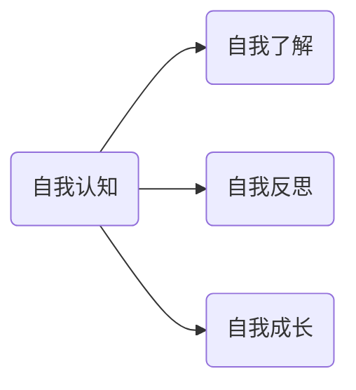

**算法原理讲解：**

自我认知的提升可以通过以下算法实现：

1. **反思与总结**：定期进行自我反思和总结，深入剖析自己的优点和不足。
2. **借鉴他人经验**：学习他人的成功经验和失败教训，借鉴其自我认知的方法。
3. **持续学习**：通过阅读书籍、参加培训等方式，不断充实自己的知识体系。

**举例说明：**

一个90后创业者在每天工作结束后，会花时间进行反思和总结，思考自己今天的工作表现和存在的问题，然后通过阅读相关书籍和参加培训课程，提升自己的自我认知。

**数学模型和公式：**

自我认知的提升可以表示为：

$$
自我认知 = f(反思与总结, 借鉴他人经验, 持续学习)
$$

其中，$f$ 为一个复合函数，$反思与总结$、$借鉴他人经验$ 和 $持续学习$ 分别为三个输入变量。

#### 3.2 团队建设能力的培养

**核心概念**：团队建设能力

团队建设能力是指领导者培养团队凝聚力、提升团队协作能力的能力。良好的团队建设能力对于企业的发展至关重要。

**概念属性特征对比表格：**

| 特征 | 团队建设能力强 | 团队建设能力弱 |
| ---- | -------- | -------- |
| **团队凝聚力** | 强 | 弱 |
| **团队协作** | 高效 | 低效 |
| **员工满意度** | 高 | 低 |

**ER实体关系图架构：**

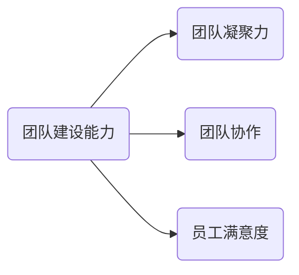

**算法原理讲解：**

团队建设能力的培养可以通过以下算法实现：

1. **明确团队目标**：确保团队成员对团队目标有清晰的认识，提高团队凝聚力。
2. **建立有效的沟通机制**：通过有效的沟通，提高团队协作效率。
3. **激励与奖励**：通过激励和奖励机制，提高员工的积极性和满意度。

**举例说明：**

一个90后创业者在公司内部建立了定期的团队会议制度，通过会议讨论团队的目标和进展，鼓励团队成员分享自己的想法和经验，从而提高团队的建设能力。

**数学模型和公式：**

团队建设能力的提升可以表示为：

$$
团队建设能力 = f(明确团队目标, 建立有效的沟通机制, 激励与奖励)
$$

其中，$f$ 为一个复合函数，$明确团队目标$、$建立有效的沟通机制$ 和 $激励与奖励$ 分别为三个输入变量。

#### 3.3 决策能力的提升

**核心概念**：决策能力

决策能力是指领导者制定和执行决策的能力。良好的决策能力对于企业的发展至关重要。

**概念属性特征对比表格：**

| 特征 | 决策能力强 | 决策能力弱 |
| ---- | -------- | -------- |
| **信息收集** | 全面 | 不全面 |
| **分析判断** | 准确 | 不准确 |
| **决策实施** | 高效 | 低效 |

**ER实体关系图架构：**

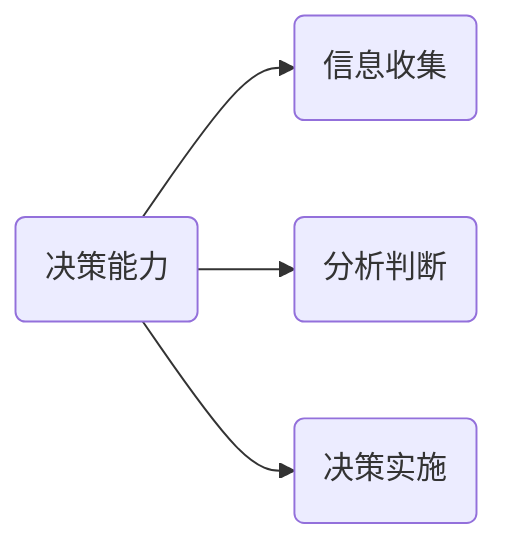

**算法原理讲解：**

提升决策能力可以通过以下算法实现：

1. **信息收集**：通过多种渠道收集相关信息，确保决策有充分的数据支撑。
2. **分析判断**：对收集到的信息进行深入分析，提高决策的准确性。
3. **决策实施**：在决策后，积极实施并跟踪决策效果，及时调整和优化。

**举例说明：**

一个90后创业者在面临重要决策时，会通过市场调研、数据分析等方式，收集充分的信息，然后进行分析判断，最后制定决策并实施，以确保决策的科学性和有效性。

**数学模型和公式：**

决策能力的提升可以表示为：

$$
决策能力 = f(信息收集, 分析判断, 决策实施)
$$

其中，$f$ 为一个复合函数，$信息收集$、$分析判断$ 和 $决策实施$ 分别为三个输入变量。

#### 3.4 沟通技巧的掌握

**核心概念**：沟通技巧

沟通技巧是指领导者在与团队成员、合作伙伴和其他利益相关者之间的交流中，运用有效的方法和技巧，以达到沟通目标的能力。

**概念属性特征对比表格：**

| 特征 | 沟通技巧良好 | 沟通技巧不足 |
| ---- | -------- | -------- |
| **表达清晰** | 强 | 弱 |
| **倾听理解** | 强 | 弱 |
| **情绪管理** | 好 | 差 |

**ER实体关系图架构：**

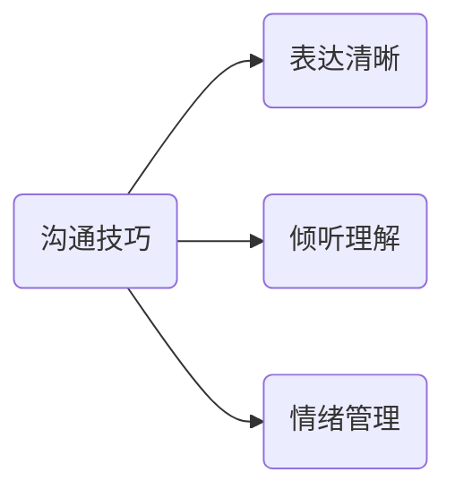

**算法原理讲解：**

沟通技巧的掌握可以通过以下算法实现：

1. **倾听与表达**：在沟通中注重倾听对方的意见，同时清晰表达自己的观点。
2. **情感管理**：在沟通中关注对方的情感反应，调整沟通方式和内容。
3. **沟通技巧训练**：通过训练和实践，提高沟通的效率和效果。

**举例说明：**

一个90后创业者在与团队成员沟通时，会通过倾听团队成员的意见，了解他们的需求和想法，然后清晰表达自己的观点，并运用有效的沟通技巧，确保团队内部的沟通畅通。

**数学模型和公式：**

沟通技巧的掌握可以表示为：

$$
沟通技巧 = f(倾听与表达, 情感管理, 沟通技巧训练)
$$

其中，$f$ 为一个复合函数，$倾听与表达$、$情感管理$ 和 $沟通技巧训练$ 分别为三个输入变量。

#### 3.5 领导风格的形成

**核心概念**：领导风格

领导风格是指领导者在领导过程中表现出的行为方式和态度。不同的领导风格对团队和企业的管理效果有显著影响。

**概念属性特征对比表格：**

| 特征 | 领导风格A | 领导风格B |
| ---- | -------- | -------- |
| **权威性** | 高 | 低 |
| **民主性** | 高 | 低 |
| **指导性** | 强 | 弱 |

**ER实体关系图架构：**

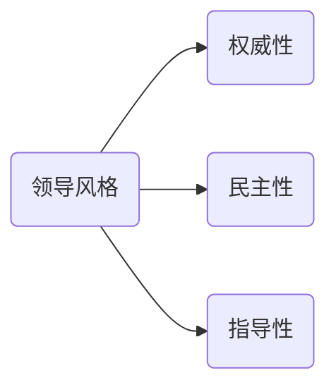

**算法原理讲解：**

领导风格的形成可以通过以下算法实现：

1. **观察学习**：通过观察其他成功领导者的行为和风格，学习并借鉴。
2. **自我反思**：在领导过程中，不断反思和调整自己的领导风格。
3. **适应调整**：根据企业的实际情况和团队的特点，选择合适的领导风格，并不断进行调整和优化。

**举例说明：**

一个90后创业者在领导团队时，会通过观察其他成功领导者的行为，学习他们的领导风格，然后在实践中不断反思和调整，最终形成适合自己的领导风格。

**数学模型和公式：**

领导风格的形成可以表示为：

$$
领导风格 = f(观察学习, 自我反思, 适应调整)
$$

其中，$f$ 为一个复合函数，$观察学习$、$自我反思$ 和 $适应调整$ 分别为三个输入变量。

### 3.6 本章小结

本章从自我认知、团队建设能力、决策能力、沟通技巧和领导风格等方面，探讨了领导力修炼的核心方法和路径。通过自我认知的提升、团队建设能力的培养、决策能力的提升、沟通技巧的掌握和领导风格的形成，90后创业者可以逐步提升自己的领导力，为企业的可持续发展奠定坚实的基础。在接下来的章节中，我们将进一步探讨如何将领导力修炼的方法与路径应用于企业的实际运营中，帮助90后创业者在企业发展过程中实现领导力的提升。

### 第4章：领导力修炼的实践案例与经验分享

#### 4.1 案例背景

在本章中，我们将通过两个实际案例，探讨90后创业者在领导力修炼过程中的具体实践和经验分享。这两个案例分别涉及一家科技创新公司和一家文化创意公司，它们在面对不同的市场环境和竞争压力时，通过有效的领导力修炼，实现了企业的快速发展。

#### 4.2 案例一：科技创新公司的领导力修炼

**案例背景：**

小张是一位90后创业者，他在大学期间就组建了一支科技创新团队，致力于研发智能硬件产品。随着公司的成立，小张逐渐意识到，要带领团队走向成功，不仅需要创新的产品和技术，更需要强大的领导力。

**领导力修炼过程：**

1. **自我认知的提升**：

   小张通过参加领导力培训课程，学习了自我反思和总结的方法。他开始每天花时间记录自己的工作表现和思考，识别自己的优势和不足。通过这种方式，小张逐渐明确了自己的领导风格和领导目标。

2. **团队建设能力的培养**：

   小张重视团队建设，他通过定期的团队建设活动和员工满意度调查，增强了团队的凝聚力和协作能力。同时，他引入了敏捷开发方法，提高了团队的工作效率和创新能力。

3. **决策能力的提升**：

   小张在面临重要决策时，会通过收集市场信息、分析数据和听取团队成员的意见，确保决策的科学性和有效性。他还在决策后，通过跟踪决策效果，及时调整和优化，确保决策的执行效果。

4. **沟通技巧的掌握**：

   小张注重沟通技巧的运用，他在与团队成员、合作伙伴和其他利益相关者交流时，注重倾听和理解对方的观点，同时清晰表达自己的意见。他通过建立有效的沟通机制，确保了团队内部的沟通畅通。

5. **领导风格的形成**：

   在实践中，小张逐渐形成了以民主性和指导性相结合的领导风格。他既关注团队成员的意见和需求，又能够给予明确的指导和帮助，从而提高了团队的工作效率和创新能力。

**经验分享：**

小张的经验表明，领导力修炼需要持续不断地进行。通过自我认知的提升、团队建设能力的培养、决策能力的提升、沟通技巧的掌握和领导风格的形成，90后创业者可以逐步提升自己的领导力，带领团队走向成功。

#### 4.3 案例二：文化创意公司的领导力修炼

**案例背景：**

小李是一位90后创业者，她在大学毕业后创办了一家专注于文化创意产品开发的公司。随着公司的发展，小李意识到，要推动公司的创新和成长，需要不断提升自己的领导力。

**领导力修炼过程：**

1. **自我认知的提升**：

   小李通过阅读相关书籍、参加行业培训和与同行交流，不断丰富自己的知识体系和领导经验。她开始学会从不同角度看待问题，提升自己的自我认知。

2. **团队建设能力的培养**：

   小李重视团队的多元化发展，她通过引进具有不同背景和技能的人才，丰富了团队的知识结构。她还在团队中推行项目制管理，鼓励团队成员自主负责项目，提高团队的整体协作能力。

3. **决策能力的提升**：

   小李在决策过程中，注重信息收集和数据分析，确保决策的科学性。她还会在决策前征求团队成员的意见，集思广益，提高决策的准确性和执行力。

4. **沟通技巧的掌握**：

   小李注重沟通技巧的运用，她在与团队成员、合作伙伴和其他利益相关者交流时，注重倾听和理解对方的观点，同时清晰表达自己的意见。她通过建立有效的沟通机制，确保了团队内部的沟通畅通。

5. **领导风格的形成**：

   在实践中，小李逐渐形成了以创新性和灵活性相结合的领导风格。她鼓励团队成员勇于尝试新的想法和方法，同时给予他们充分的自主权和支持，从而激发了团队的创造力和创新能力。

**经验分享：**

小李的经验表明，领导力修炼需要结合企业实际进行。通过自我认知的提升、团队建设能力的培养、决策能力的提升、沟通技巧的掌握和领导风格的形成，90后创业者可以不断提升自己的领导力，推动企业的创新和成长。

### 4.4 本章小结

本章通过两个实际案例，探讨了90后创业者在领导力修炼过程中的实践和经验。无论是科技创新公司还是文化创意公司，领导力修炼都是企业成功的关键。通过自我认知的提升、团队建设能力的培养、决策能力的提升、沟通技巧的掌握和领导风格的形成，90后创业者可以不断提升自己的领导力，为企业的可持续发展奠定坚实的基础。在未来的发展中，90后创业者应继续坚持领导力修炼，不断创新和突破，引领企业走向更高的辉煌。

### 第5章：领导力修炼的最佳实践与注意事项

#### 5.1 最佳实践

**1. 建立自我认知**

- **每日反思**：每天花10分钟时间进行反思，总结当天的工作表现和成长点，找出需要改进的地方。
- **定期评估**：每月进行一次自我评估，分析自己的优势和不足，制定改进计划。

**2. 培养团队建设能力**

- **团队建设活动**：定期组织团建活动，增强团队凝聚力，提升团队协作能力。
- **项目制管理**：推行项目制管理，让团队成员自主负责项目，提高项目执行效率。

**3. 提升决策能力**

- **信息收集与分析**：在决策前，充分收集相关信息，进行深入分析，确保决策的科学性。
- **决策后跟踪**：决策后，及时跟踪决策效果，发现问题和不足，及时调整和优化。

**4. 掌握沟通技巧**

- **倾听与表达**：注重倾听对方的意见，同时清晰表达自己的观点，确保沟通的有效性。
- **建立沟通机制**：建立有效的沟通机制，确保团队内部的沟通畅通。

**5. 形成合适的领导风格**

- **民主与指导相结合**：在领导过程中，既要关注团队成员的意见和需求，又要给予明确的指导和帮助。
- **灵活调整**：根据企业实际情况和团队特点，灵活调整领导风格，以适应不同阶段的发展需求。

#### 5.2 注意事项

**1. 避免盲目模仿**

- 领导力修炼不是一成不变的，每个创业者都有其独特的领导风格和方式。避免盲目模仿其他成功领导者的方法，要结合自身实际情况进行创新和调整。

**2. 持续学习和实践**

- 领导力修炼是一个持续的过程，需要不断地学习和实践。通过参加培训课程、阅读相关书籍、与同行交流等方式，不断丰富自己的知识和经验。

**3. 注重团队建设**

- 团队建设是领导力修炼的重要组成部分。要注重团队成员的成长和发展，关心他们的需求和意见，提升团队的整体协作能力。

**4. 保持开放心态**

- 在领导力修炼过程中，要保持开放的心态，接受不同的意见和建议。通过不断地反思和调整，提升自己的领导能力和水平。

**5. 适应变化**

- 市场环境和企业发展在不断变化，领导者需要具备适应变化的能力。要密切关注市场动态和行业趋势，及时调整战略和决策，以应对不断变化的环境。

### 5.3 本章小结

领导力修炼是90后创业者在企业发展过程中不可或缺的一部分。通过建立自我认知、培养团队建设能力、提升决策能力、掌握沟通技巧和形成合适的领导风格，90后创业者可以不断提升自己的领导力，推动企业的可持续发展。同时，在修炼过程中，要避免盲目模仿、持续学习和实践、注重团队建设、保持开放心态和适应变化，以确保领导力修炼的效果和持续提升。希望本章的内容能为90后创业者提供有益的参考和启示，助力他们在领导力修炼的道路上不断前行。

### 第6章：展望与未来

#### 6.1 展望未来的领导力发展

随着全球化的不断深入和科技的飞速发展，未来的领导力将面临新的挑战和机遇。90后创业者在领导力修炼的过程中，需要紧跟时代潮流，不断提升自己的领导能力，以应对未来的变化。

**1. 技术驱动的领导力**

在未来，技术将深刻影响领导力的发展。创业者需要具备技术敏感度和创新能力，能够引领团队探索和应用新技术，提升企业的竞争力。

**2. 生态合作的领导力**

随着产业链的整合和协同创新，创业者需要具备生态合作的领导力，能够搭建开放的产业生态，推动多方合作共赢。

**3. 可持续发展的领导力**

面对环境和社会的挑战，创业者需要具备可持续发展的领导力，能够在企业发展的同时，关注环境保护和社会责任，实现企业的可持续发展。

**4. 人本主义的领导力**

未来，人本主义的领导力将更加重要。创业者需要关注员工的成长和发展，构建积极向上的企业文化，激发员工的潜能，实现企业与员工的共同成长。

#### 6.2 对未来创业者的建议

对于未来的创业者，以下几点建议或许能帮助他们更好地修炼领导力，实现企业的长远发展：

**1. 持续学习**

未来世界变化迅速，创业者需要具备持续学习的能力，不断更新知识和技能，以适应不断变化的市场环境。

**2. 善于合作**

在未来的竞争环境中，创业者需要善于与他人合作，搭建多元化的团队，发挥团队的整体优势。

**3. 精益管理**

创业者需要学会精益管理，通过优化流程、提高效率，实现企业的快速发展。

**4. 创新思维**

未来竞争的核心在于创新，创业者需要培养创新思维，敢于突破传统模式，寻找新的商业模式和解决方案。

**5. 社会责任**

创业者需要关注社会责任，承担企业应有的社会责任，实现企业与社会的和谐发展。

### 6.3 本章小结

领导力是创业者成功的关键因素，未来的领导力发展将更加多元化和复杂化。90后创业者需要紧跟时代潮流，不断提升自己的领导能力，以应对未来的挑战和机遇。通过持续学习、善于合作、精益管理、创新思维和社会责任，创业者可以修炼出更加出色的领导力，引领企业走向更加辉煌的未来。

### 全文总结

本文围绕“领导力修炼：90后创业者的成长之路”这一主题，系统地探讨了90后创业者在领导力方面的特质与挑战，以及如何通过修炼提升领导力。首先，我们介绍了领导力的重要性，分析了90后创业者在领导力方面的现状和不足。接着，我们提出了领导力修炼的方法与途径，包括自我认知的提升、团队建设能力的培养、决策能力的提升、沟通技巧的掌握和领导风格的形成。随后，通过实际案例和最佳实践，我们展示了90后创业者如何在实际工作中运用领导力修炼的方法和路径。最后，我们展望了未来领导力的发展趋势，对未来的创业者提出了建议。

通过对本文的阅读，读者可以深刻理解领导力在企业发展中的关键作用，了解90后创业者在领导力方面存在的挑战，并掌握提升领导力的方法和路径。同时，本文也为90后创业者提供了一套系统的领导力修炼指南，帮助他们提升领导力，实现企业的可持续发展。

### 拓展阅读

1. **《领导力心理学：如何激发团队的潜力与激情》**：作者 [史蒂芬·罗宾斯] 通过心理学角度，深入探讨了领导力如何影响团队的行为和表现。

2. **《领导力的艺术》**：作者 [约翰·马登] 提供了丰富的案例和实践经验，帮助读者理解领导力在不同情境下的应用。

3. **《领导力的五大实践》**：作者 [约翰·科特] 从战略、结构、人员、风格和价值观五个方面，阐述了领导力如何推动企业的长远发展。

4. **《创新者的思考方式》**：作者 [史蒂芬·约翰逊] 探讨了创新思维的核心要素，以及如何通过创新思维实现企业的突破性发展。

5. **《深度工作：如何有效利用每一点脑力》**：作者 [卡尔·纽波特] 提出了深度工作的重要性和实践方法，帮助创业者提升工作效率。

通过阅读这些书籍，读者可以进一步深入了解领导力、创新思维、团队建设等方面的知识和实践，为自己的企业发展提供更多的启示和帮助。

