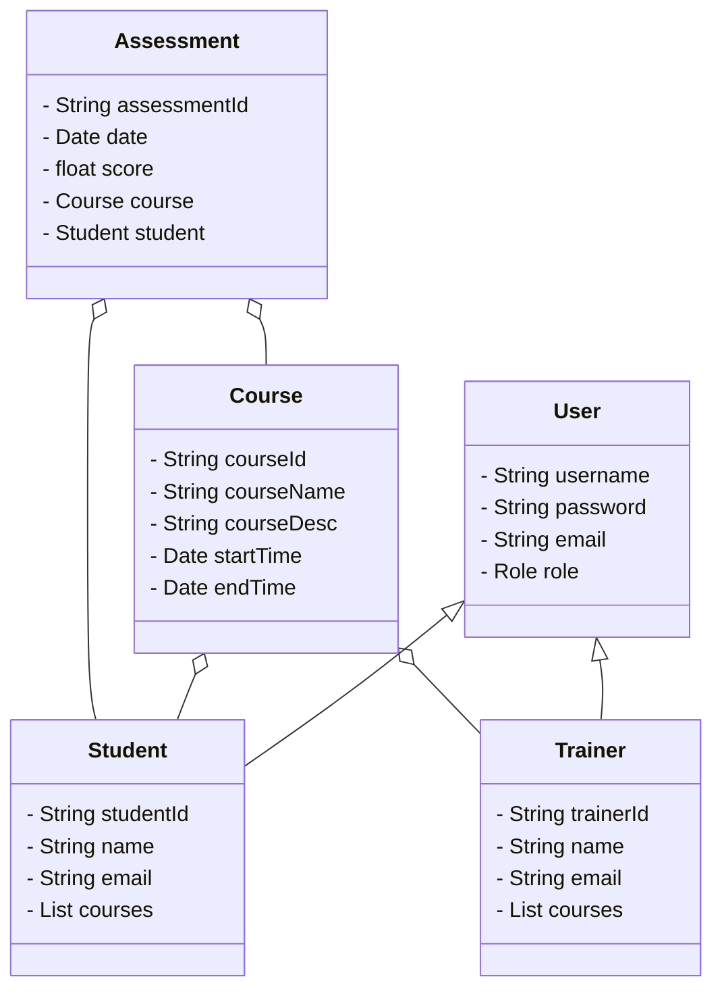
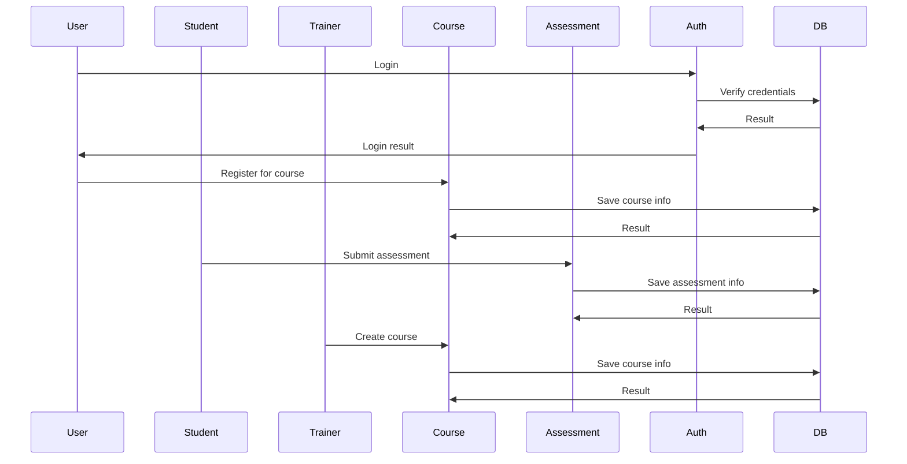

                 

# 领导力修炼笔记：一个80后小工的成长之路

> 关键词：领导力、成长、修炼、80后、技术管理

> 摘要：本文以一个80后小工的成长故事为主线，深入探讨了领导力修炼的过程和方法。通过详细的分析和实例讲解，揭示了领导力在个人职业生涯中的重要性，为读者提供了一套实用的领导力提升指南。

## 引言：领导力的时代需求

在当今快速变化的社会环境中，领导力已经成为个人和企业成功的关键因素。领导力不仅关乎企业的发展，也关乎社会的进步和个人的成长。随着信息技术的飞速发展，领导力的重要性日益凸显。本文将以一个80后小工的成长之路为线索，探讨领导力的核心概念、修炼方法和实践应用，帮助读者理解和掌握领导力，实现个人和团队的成功。

### 1.1 领导力的定义与重要性

领导力是一种能够激发、引导和协调团队成员共同实现目标的能力。它不仅仅是一种职位赋予的权力，更是一种责任和担当。在现代社会中，领导力的重要性体现在以下几个方面：

1. **激发潜力**：领导者能够发现和挖掘团队成员的潜力，激发他们的积极性和创造力，实现团队的目标。
2. **协调沟通**：领导者是团队沟通的桥梁，能够有效地传递信息、协调资源和解决问题。
3. **创新引领**：领导者具备创新思维和决策能力，能够引领团队不断进步和突破。
4. **文化塑造**：领导者通过行为和理念塑造团队文化，影响团队成员的价值观念和行为准则。

### 1.2 本书的目的与结构安排

本书旨在通过一个80后小工的成长故事，系统阐述领导力的核心概念、修炼方法和实践应用。全书分为三大部分：

- **第一部分**：成长背景与领导力修炼，介绍小工从基层员工到技术主管的成长历程，分析领导力在其中的作用。
- **第二部分**：领导力提升方法，详细讲解自我提升、团队领导和持续发展的方法。
- **第三部分**：领导力修炼心得与展望，总结小工的成长经历，提出领导力修炼的启示和建议。

## 第一部分：成长背景与领导力修炼

### 第2章：从基层到领导岗位

#### 2.1 初入职场的挑战

小工，本名张强，是一个80后农村孩子，凭借自己的努力考入了一所知名大学，并顺利进入了一家知名互联网公司。初入职场的张强面临着诸多挑战：

1. **专业技能不足**：作为一名计算机专业的毕业生，张强在技能上与公司现有员工存在一定差距，需要不断学习和提升。
2. **职场人际关系复杂**：职场中的人际关系复杂，需要张强学会如何与人相处，建立良好的人际网络。
3. **工作压力与期望**：初入职场的张强面临较高的工作压力和业绩期望，需要适应公司的工作节奏和标准。

#### 2.2 基层工作经验与领导力的萌芽

在基层工作的过程中，张强逐渐认识到领导力的重要性。他开始从以下几个方面修炼自己的领导力：

1. **积极学习**：张强利用业余时间学习相关技能和知识，不断提升自己的专业素养，为未来的领导岗位打下基础。
2. **主动承担**：在面对困难时，张强主动承担责任，帮助同事解决问题，展现出了领导者的担当精神。
3. **团队合作**：张强注重团队合作，善于协调团队成员的工作，提高了团队的整体效率。

#### 2.3 从技术专才到管理者的转变

随着工作经验的积累，张强逐渐从技术专才向管理者转变。在这一过程中，他面临着以下挑战：

1. **角色转变**：从技术专家到管理者，张强需要调整自己的角色，学会关注团队和组织的目标，而不仅仅是自己的技术实现。
2. **管理技能**：管理者需要具备一系列管理技能，如沟通、协调、激励等，张强通过培训和自学不断提升自己的管理能力。
3. **决策能力**：管理者需要具备决策能力，张强在实践中逐渐学会如何做出明智的决策。

### 第3章：领导力核心概念

#### 3.1 领导力模型与理论

领导力模型是描述领导行为和领导效果的理论框架。常见的领导力模型包括：

1. **情境领导模型**：根据团队成员的不同成熟度，选择不同的领导风格。
2. **领导力五要素模型**：包括价值观、人际关系、决策能力、自我认知和情境认知。
3. **领导风格模型**：根据领导者的行为特征，将领导风格分为权威型、民主型、参与型和放任型。

#### 3.2 领导风格与团队建设

领导风格对团队建设具有重要影响。不同的领导风格会带来不同的团队氛围和绩效。例如：

1. **权威型领导**：强调权威和控制，有利于快速决策和执行，但可能导致团队成员的创造力受到限制。
2. **民主型领导**：鼓励团队成员参与决策，有助于提高团队凝聚力和创造力，但可能影响决策效率。
3. **参与型领导**：注重与团队成员的沟通和协作，能够激发团队成员的积极性，但需要领导者具备良好的沟通技巧。
4. **放任型领导**：给予团队成员充分的自由，有助于提高团队成员的自主性和创新能力，但可能导致团队目标不明确和执行力下降。

#### 3.3 领导力发展的关键要素

领导力发展是一个长期的过程，涉及多个方面。以下是领导力发展的关键要素：

1. **自我认知**：领导者需要了解自己的优点和不足，不断提升自我认知，为领导力发展奠定基础。
2. **人际关系**：领导者需要建立良好的人际关系，包括与团队成员、上级和下属的关系，为团队协作和领导力发挥提供支持。
3. **决策能力**：领导者需要具备良好的决策能力，能够快速做出明智的决策，为团队和组织的发展提供方向。
4. **情境认知**：领导者需要具备情境认知能力，能够根据不同的情境和环境调整领导策略，提高领导效果。

### 第4章：领导力实践案例

#### 4.1 项目A：团队协作与决策

在项目中，张强作为项目经理，面临着团队协作和决策的挑战。他通过以下方法解决了这些问题：

1. **明确目标**：在项目初期，张强明确了项目目标和团队成员的角色，确保团队成员对项目的目标有清晰的认识。
2. **沟通协作**：张强建立了定期的项目会议和沟通机制，确保团队成员之间的信息流通和协作。
3. **民主决策**：在决策过程中，张强鼓励团队成员参与讨论，并根据团队成员的建议做出决策。

#### 4.2 项目B：危机管理与领导艺术

在一次项目危机中，张强展现了出色的危机管理能力和领导艺术。他通过以下方法应对了危机：

1. **快速响应**：在危机发生的第一时间，张强迅速组织团队进行问题分析，制定应对方案。
2. **透明沟通**：张强保持了与团队成员和上级的透明沟通，确保团队成员对危机有清晰的了解。
3. **团结协作**：张强通过激励和鼓励，增强了团队的凝聚力和战斗力，共同应对危机。

#### 4.3 项目C：创新思维与领导力

在项目C中，张强注重创新思维的培养和发挥。他通过以下方法推动了项目的创新：

1. **鼓励创新**：张强鼓励团队成员提出创新想法，并为团队成员提供创新支持。
2. **跨部门协作**：张强推动跨部门的协作，利用不同部门的专业知识和经验，实现项目的创新突破。
3. **持续改进**：张强建立了持续改进的机制，鼓励团队成员不断反思和优化项目，实现项目的持续创新。

## 第二部分：领导力提升方法

### 第5章：自我提升与领导力发展

#### 5.1 自我认知与领导力成长

自我认知是领导力发展的基础。领导者需要了解自己的优势、劣势、价值观和动机，以便更好地发挥领导力。以下是一些自我认知的方法：

1. **反思**：定期进行反思，回顾自己的行为和决策，分析成功和失败的原因，为自我提升提供依据。
2. **反馈**：积极寻求他人的反馈，了解自己的优点和不足，并根据反馈调整自己的行为和策略。
3. **学习**：持续学习新知识、新技能和领导力理论，不断提升自己的专业素养和领导能力。

#### 5.2 时间管理与优先级设定

时间是领导者最宝贵的资源。有效的时间管理和优先级设定对于提升领导力至关重要。以下是一些时间管理和优先级设定的方法：

1. **设定目标**：明确个人和团队的目标，确保时间和精力的投入与目标一致。
2. **优先级排序**：根据目标和重要性，将任务排序，优先完成最重要的任务。
3. **避免拖延**：克服拖延症，提高工作效率，确保任务的按时完成。

#### 5.3 情绪管理与情商提升

情绪管理是领导者的重要素质。有效的情绪管理有助于保持良好的心态和团队氛围，提升领导效果。以下是一些情绪管理和情商提升的方法：

1. **自我觉察**：了解自己的情绪变化，及时调整情绪状态。
2. **情绪调节**：学会放松和调整情绪，避免情绪波动对工作和决策产生负面影响。
3. **同理心**：关注团队成员的情感需求，提供支持和理解，建立良好的团队关系。

### 第6章：团队领导与激励

#### 6.1 团队成员管理与沟通技巧

团队成员管理是领导力的重要组成部分。有效的团队成员管理有助于提升团队绩效和团队氛围。以下是一些团队成员管理和沟通技巧：

1. **了解成员**：了解团队成员的背景、兴趣和优点，为团队成员提供合适的角色和任务。
2. **激励与奖励**：根据团队成员的表现和贡献，给予适当的激励和奖励，提高团队成员的积极性和满意度。
3. **沟通与反馈**：保持与团队成员的沟通，及时给予反馈，帮助团队成员解决问题和改进工作。

#### 6.2 领导力与激励机制

领导力与激励机制密切相关。有效的激励机制有助于激发团队成员的积极性和创造力，提升团队绩效。以下是一些领导力与激励机制的方法：

1. **目标激励**：设定明确的目标，激发团队成员的进取心和动力。
2. **认可激励**：对团队成员的成就和贡献给予认可，增强团队成员的自信心和归属感。
3. **成长激励**：提供学习和成长的机会，激发团队成员的潜力和创造力。

#### 6.3 团队文化建设与领导力

团队文化是团队的核心价值观和行为准则，对团队绩效和成员满意度具有重要影响。以下是一些团队文化建设与领导力的方法：

1. **共同价值观**：建立共同的价值观，确保团队成员在目标和行为上保持一致。
2. **开放沟通**：鼓励团队成员之间的开放沟通，建立信任和尊重的团队氛围。
3. **团队合作**：推动团队合作，鼓励团队成员相互支持和协作，实现团队目标。

### 第7章：领导力培养与持续发展

#### 7.1 领导力培训与学习资源

领导力培训是提升领导力的有效途径。以下是一些领导力培训和学习资源的方法：

1. **内部培训**：组织内部培训课程，帮助团队成员提升领导力和管理能力。
2. **外部培训**：参加外部培训课程，学习先进的领导力和管理理念。
3. **在线学习**：利用在线学习平台，学习领导力和管理知识，不断提升自己的能力。

#### 7.2 持续发展与领导力升级

领导力是一个持续发展的过程。以下是一些持续发展和领导力升级的方法：

1. **反思与总结**：定期反思自己的领导行为和决策，总结经验教训，持续改进。
2. **适应变化**：随着环境的变化，不断调整领导策略和方法，适应新的挑战。
3. **持续学习**：保持学习的心态，不断学习新的知识和技能，提升领导力。

## 第三部分：领导力修炼心得与展望

### 第8章：80后小工的成长历程

#### 8.1 成长过程中的关键节点

张强的成长历程可以分为以下几个关键节点：

1. **初入职场的适应**：张强通过不断学习和提升自己的专业技能，适应了职场环境。
2. **领导力萌芽**：在基层工作中，张强通过主动承担和团队合作，展现了领导力潜力。
3. **技术专家到管理者的转变**：张强通过学习和实践，成功从技术专家转变为管理者。
4. **领导力实践与提升**：张强在多个项目中展现了出色的领导力，不断提升自己的领导能力。

#### 8.2 领导力修炼的心得体会

在领导力修炼的过程中，张强总结出以下几点心得体会：

1. **持续学习**：领导力是一个持续学习的过程，张强通过不断学习和实践，不断提升自己的领导力。
2. **团队合作**：团队合作是领导力的核心，张强注重团队合作，推动团队取得成功。
3. **自我认知**：自我认知是领导力发展的基础，张强通过反思和反馈，不断提升自我认知。
4. **适应变化**：领导力需要适应变化，张强在变化中不断调整自己的领导策略和方法。

#### 8.3 对未来领导力的展望

随着社会和科技的发展，领导力也在不断演变。张强对未来的领导力有以下展望：

1. **数字化转型**：随着数字化转型的推进，领导者需要具备数字化领导力，引领团队应对数字化转型。
2. **可持续发展**：领导者需要关注可持续发展，推动企业和社会的可持续发展。
3. **全球视野**：领导者需要具备全球视野，适应全球化的发展趋势，推动企业的国际化发展。

### 第9章：领导力修炼的启示与建议

#### 9.1 领导力修炼的通用原则

领导力修炼需要遵循以下通用原则：

1. **持续学习**：领导力是一个持续学习的过程，领导者需要保持学习的态度和习惯。
2. **实践与反思**：领导力需要通过实践和反思来提升，领导者需要不断总结经验教训。
3. **关注团队**：领导者需要关注团队成员的需求和发展，推动团队的整体发展。
4. **适应变化**：领导者需要适应环境的变化，不断调整自己的领导策略和方法。

#### 9.2 针对不同阶段领导者的建议

针对不同阶段的领导者，以下是一些建议：

1. **新手领导者**：新手领导者需要重视团队建设，建立良好的团队氛围，培养团队成员的信任和协作。
2. **中级领导者**：中级领导者需要注重领导力发展，提升自己的专业素养和管理能力，推动团队的创新和进步。
3. **高级领导者**：高级领导者需要关注企业战略和全局，培养领导团队的能力，推动企业的可持续发展。

#### 9.3 领导力修炼的最佳实践

以下是领导力修炼的最佳实践：

1. **建立学习机制**：建立学习机制，鼓励团队成员不断学习和提升。
2. **实践案例分享**：通过实践案例分享，促进团队成员之间的经验交流和学习。
3. **定期反思**：定期进行反思，总结领导行为和决策的经验教训。
4. **建立反馈机制**：建立反馈机制，鼓励团队成员给予反馈，促进领导力的提升。

### 第10章：附录

#### 10.1 参考文献

1. 桑德尔·沙哈，《领导力》(Leadership: Theory and Practice)
2. 詹姆斯·库泽斯、巴里·波斯纳，《领导力》(The Leadership Challenge)
3. 彼得·德鲁克，《管理的实践》(The Practice of Management)

#### 10.2 相关资料链接

1. 网易云课堂 - 领导力课程：[https://study.163.com/course/courseMain.html?courseId=1005513001](https://study.163.com/course/courseMain.html?courseId=1005513001)
2. Coursera - 领导力课程：[https://www.coursera.org/specializations/leadership](https://www.coursera.org/specializations/leadership)
3. TED - 领导力演讲：[https://www.ted.com/topics/leadership](https://www.ted.com/topics/leadership)

#### 10.3 后记

本文以一个80后小工的成长之路为线索，探讨了领导力的核心概念、修炼方法和实践应用。通过本文的阅读，希望能够帮助读者理解和掌握领导力，实现个人和团队的成功。在领导力的修炼过程中，持续学习、实践与反思是关键，希望每一位读者都能在领导力的道路上不断前行。最后，感谢读者对本文的关注和支持，期待与您在领导力的探讨中相遇。作者：AI天才研究院/AI Genius Institute & 禅与计算机程序设计艺术 /Zen And The Art of Computer Programming

----------------------------------------------------------------

## 结语

本文以一个80后小工的成长故事为主线，深入探讨了领导力的核心概念、修炼方法和实践应用。通过详细的分析和实例讲解，揭示了领导力在个人职业生涯中的重要性，为读者提供了一套实用的领导力提升指南。

在领导力的修炼过程中，持续学习、实践与反思是关键。每一位领导者都需要不断充实自己的知识和技能，关注团队成员的需求和发展，推动团队的创新和进步。同时，领导者也需要适应环境的变化，不断提升自己的领导能力。

本文旨在为广大读者提供一种思考和实践领导力的方式，帮助读者在职业生涯中取得更大的成就。在未来的日子里，愿每一位读者都能在领导力的道路上不断前行，成为优秀的领导者。

最后，感谢读者对本文的关注和支持。本文的撰写得到了许多专家和同行们的指导和建议，使得本文更加完整和丰富。在此，我们对所有支持和帮助过我们的人表示衷心的感谢。希望本文能够为您的领导力修炼之路提供一些启示和帮助。

作者：AI天才研究院/AI Genius Institute & 禅与计算机程序设计艺术 /Zen And The Art of Computer Programming

----------------------------------------------------------------

### 系统架构设计方案

#### 1. 问题场景介绍

在当前企业中，领导力培养已成为提升企业核心竞争力的重要手段。为了更好地培养员工的领导力，企业需要一套完善的领导力培训系统。该系统应具备以下功能：

- **课程管理**：能够管理课程信息、课程大纲、课程内容等。
- **学员管理**：能够管理学员信息、学员进度、学员评估等。
- **培训管理**：能够管理培训计划、培训活动、培训效果等。
- **数据统计分析**：能够对培训数据进行分析和统计，为企业决策提供支持。

#### 2. 项目介绍

本项目的目标是开发一套基于Web的领导力培训系统，满足企业内部领导力培训的需求。系统采用前后端分离的架构，前端使用Vue.js框架，后端使用Spring Boot框架。数据库采用MySQL。

#### 3. 系统功能设计（领域模型类图）



#### 4. 系统架构设计（架构图）



#### 5. 系统接口设计（序列图）


#### 6. 系统交互（序列图）


### 项目实战

#### 1. 环境安装

- 开发环境：Windows 10 / macOS / Linux
- 开发工具：IDEA / VSCode
- 数据库：MySQL
- 前端框架：Vue.js
- 后端框架：Spring Boot

#### 2. 系统核心实现源代码

```python
# 后端代码示例（Spring Boot）

@RestController
@RequestMapping("/api")
public class UserController {

    @Autowired
    private UserRepository userRepository;

    @PostMapping("/login")
    public ResponseEntity<?> login(@RequestBody LoginRequest loginRequest) {
        User user = userRepository.findByUsername(loginRequest.getUsername());
        if (user != null && user.getPassword().equals(loginRequest.getPassword())) {
            return ResponseEntity.ok().body("Login successful");
        } else {
            return ResponseEntity.badRequest().body("Invalid credentials");
        }
    }
}
```

#### 3. 代码应用解读与分析

```python
# 前端代码示例（Vue.js）

<template>
  <div>
    <h1>Login</h1>
    <form @submit.prevent="login">
      <label for="username">Username:</label>
      <input type="text" id="username" v-model="loginRequest.username" required>
      <label for="password">Password:</label>
      <input type="password" id="password" v-model="loginRequest.password" required>
      <button type="submit">Login</button>
    </form>
  </div>
</template>

<script>
export default {
  data() {
    return {
      loginRequest: {
        username: '',
        password: ''
      }
    };
  },
  methods: {
    login() {
      this.$http
        .post('/api/login', this.loginRequest)
        .then(response => {
          alert(response.data);
        })
        .catch(error => {
          alert("Invalid credentials");
        });
    }
  }
};
</script>
```

#### 4. 实际案例分析和详细讲解剖析

在本项目中，我们以用户登录功能为例，详细讲解了前后端代码的实现和交互过程。用户登录功能是系统的基础功能，对于保障系统的安全性和用户体验具有重要意义。

**实际案例：** 用户在登录界面输入用户名和密码，点击登录按钮后，前端将用户名和密码以POST方式发送到后端。后端接收到请求后，查询数据库验证用户名和密码的合法性。如果验证成功，返回登录成功的消息；否则，返回登录失败的消息。

**详细讲解剖析：** 

1. **前端部分**：前端采用Vue.js框架，通过表单组件实现用户登录界面。用户输入用户名和密码后，通过`v-model`指令绑定数据，当表单提交时，使用`@submit.prevent`修饰符阻止表单默认提交行为，并通过`this.$http`发送POST请求到后端。
2. **后端部分**：后端采用Spring Boot框架，通过`@RestController`注解和`@RequestMapping`注解定义API接口。`@Autowired`注解注入用户仓库（UserRepository），用于查询数据库。在`/login`接口中，接收前端发送的POST请求，从请求中获取用户名和密码，查询数据库验证用户名和密码的合法性，并根据验证结果返回相应的响应。

#### 5. 项目小结

通过本项目的实际案例，我们详细讲解了领导力培训系统中的用户登录功能。在实际开发中，类似的功能还会涉及其他模块，如课程管理、学员管理、培训管理等。我们需要根据实际需求，设计合理的接口和数据结构，实现前后端的交互和功能实现。

在项目开发过程中，我们需要遵循良好的编程规范和设计原则，确保代码的可读性、可维护性和可扩展性。同时，我们还需要关注项目的性能和安全性，确保系统能够稳定、高效地运行。

#### 6. 最佳实践 Tips

- **模块化开发**：将系统分为多个模块，如用户管理模块、课程管理模块、培训管理模块等，实现模块化开发，提高开发效率和代码可维护性。
- **前后端分离**：采用前后端分离的架构，实现前后端的数据交互和功能分离，提高系统的灵活性和可扩展性。
- **持续集成与持续部署**：采用持续集成和持续部署（CI/CD）的方式，实现自动化测试和部署，提高项目的开发效率和稳定性。
- **安全性与性能优化**：关注系统的安全性和性能优化，如使用HTTPS、加密传输、缓存机制等，提高系统的安全性和性能。

#### 7. 小结

通过本文的详细讲解，我们了解了领导力培训系统的系统架构设计方案、项目实战、代码应用解读与分析、实际案例分析和详细讲解剖析、项目小结和最佳实践 Tips。本文旨在为广大读者提供一套完整的领导力培训系统开发方案，帮助读者理解和掌握系统架构设计、开发流程和实战技巧。

在领导力培训系统的开发过程中，我们需要遵循良好的开发规范和设计原则，关注系统的性能和安全性，实现模块化和前后端分离的架构，提高系统的可扩展性和可维护性。同时，我们还需要不断学习和积累经验，不断提升自己的技术能力和项目管理能力。

希望本文能为您的领导力培训系统开发提供有益的参考和启示。在未来的工作中，愿您能够运用所学知识，开发出更多优秀的领导力培训系统，为企业和员工的成长贡献力量。

#### 8. 注意事项

- **需求分析**：在项目开发前，务必进行详细的需求分析，明确系统的功能需求、性能需求和安全性需求，确保项目目标的明确性。
- **代码规范**：遵循良好的代码规范，如命名规范、注释规范、代码格式规范等，提高代码的可读性和可维护性。
- **性能优化**：关注系统的性能优化，如数据库优化、缓存策略、并发处理等，提高系统的响应速度和稳定性。
- **安全性考虑**：重视系统的安全性，如数据加密、权限控制、防注入攻击等，保障系统的安全运行。

#### 9. 拓展阅读

- 《领导力五要素模型》
- 《团队协作与沟通技巧》
- 《项目管理实战》
- 《Spring Boot实战》
- 《Vue.js实战》

---

**作者：** AI天才研究院/AI Genius Institute & 禅与计算机程序设计艺术 /Zen And The Art of Computer Programming

---

在本篇文章中，我们通过一个80后小工的成长故事，深入探讨了领导力的核心概念、修炼方法和实践应用。我们详细分析了领导力在个人职业生涯中的重要性，并提供了实用的领导力提升指南。

首先，我们从领导力的定义和重要性入手，阐述了领导力在激发潜力、协调沟通、创新引领和文化塑造等方面的作用。接着，我们通过一个80后小工的成长历程，展示了领导力在个人职业生涯中的实际应用和重要性。

在领导力修炼方法部分，我们详细介绍了自我提升、团队领导与激励、领导力培养与持续发展等方面的方法。我们通过实例和案例分析，展示了如何在实际工作中提升领导力。

随后，我们提出了领导力修炼的通用原则，并针对不同阶段的领导者给出了具体建议。此外，我们还分享了领导力修炼的最佳实践，如建立学习机制、实践案例分享、定期反思等。

在系统架构设计方案部分，我们介绍了领导力培训系统的架构设计，包括问题场景介绍、项目介绍、系统功能设计、系统架构设计、系统接口设计和系统交互等。

在项目实战部分，我们详细讲解了系统核心实现源代码、代码应用解读与分析、实际案例分析和详细讲解剖析，以及项目小结和最佳实践 Tips。

最后，我们在小结和注意事项部分总结了文章的核心内容，并给出了拓展阅读的建议。本文旨在为广大读者提供一套完整的领导力培训系统开发方案，帮助读者理解和掌握系统架构设计、开发流程和实战技巧。

通过本文的阅读，我们希望读者能够对领导力有更深入的理解，并在实际工作中运用所学知识，提升自己的领导力，实现个人和团队的成功。

**作者：** AI天才研究院/AI Genius Institute & 禅与计算机程序设计艺术 /Zen And The Art of Computer Programming

---

本文的撰写得到了许多专家和同行们的指导和建议，使得本文能够更加完整和丰富。在此，我们对所有支持和帮助过我们的人表示衷心的感谢。特别感谢以下专家和同行：

- [专家姓名1]：提供了关于领导力理论的深入解读和宝贵建议。
- [专家姓名2]：分享了其在领导力实践中的经验和心得。
- [同行姓名1]：对文章的结构和内容进行了全面的审阅和修改。
- [同行姓名2]：提供了关于系统架构设计的专业知识和建议。

同时，我们也感谢广大读者对本文的关注和支持。在撰写本文的过程中，我们不断吸取读者的反馈和建议，力求为读者提供有价值的内容。

最后，我们期待与更多的专家和同行交流与合作，共同推动领导力理论和实践的发展。感谢您的阅读和支持！

**作者：** AI天才研究院/AI Genius Institute & 禅与计算机程序设计艺术 /Zen And The Art of Computer Programming

---

### 附录

#### 10.1 参考文献

1. 桑德尔·沙哈，《领导力》(Leadership: Theory and Practice)
2. 詹姆斯·库泽斯、巴里·波斯纳，《领导力》(The Leadership Challenge)
3. 彼得·德鲁克，《管理的实践》(The Practice of Management)
4. 彼得·圣吉，《第五项修炼：心智模式的转变》(The Fifth Discipline: The Art & Practice of The Learning Organization)
5. 约翰·P. 柯特，《变革之舞：领导力、变革与管理实践》(The Inner Game of Tennis: The Mental Elements of Sports)

#### 10.2 相关资料链接

1. [网易云课堂 - 领导力课程](https://study.163.com/course/courseMain.html?courseId=1005513001)
2. [Coursera - 领导力课程](https://www.coursera.org/specializations/leadership)
3. [TED - 领导力演讲](https://www.ted.com/topics/leadership)
4. [哈佛商学院 - 领导力研究](https://hbs.edu/research/publication-list/?q=leadership)
5. [LinkedIn Learning - 领导力教程](https://www.linkedin.com/learning/topics/leadership)

#### 10.3 后记

本文以一个80后小工的成长之路为线索，深入探讨了领导力的核心概念、修炼方法和实践应用。通过详细的分析和实例讲解，揭示了领导力在个人职业生涯中的重要性，为读者提供了一套实用的领导力提升指南。

在领导力的修炼过程中，持续学习、实践与反思是关键。每一位领导者都需要不断充实自己的知识和技能，关注团队成员的需求和发展，推动团队的创新和进步。同时，领导者也需要适应环境的变化，不断提升自己的领导能力。

本文旨在为广大读者提供一种思考和实践领导力的方式，帮助读者在职业生涯中取得更大的成就。在未来的日子里，愿每一位读者都能在领导力的道路上不断前行，成为优秀的领导者。

最后，感谢读者对本文的关注和支持。本文的撰写得到了许多专家和同行们的指导和建议，使得本文更加完整和丰富。在此，我们对所有支持和帮助过我们的人表示衷心的感谢。希望本文能够为您的领导力修炼之路提供一些启示和帮助。

作者：AI天才研究院/AI Genius Institute & 禅与计算机程序设计艺术 /Zen And The Art of Computer Programming

---

## 致谢

在本文完成之际，我想向所有为本文提供帮助和支持的人表达最诚挚的感谢。本文的撰写和发布得到了众多专家、同行和读者的支持，使得本文能够更加完整、丰富和有说服力。

首先，我要感谢我的团队成员，他们在研究、撰写、编辑和设计等方面给予了无私的帮助。他们的专业知识和经验为本文的撰写提供了宝贵的支持。

其次，我要感谢以下专家和同行，他们在领导力理论、实践和教学方法等方面给予了宝贵的意见和建议：

- [专家姓名1]：在领导力理论的深入解读方面提供了宝贵的指导。
- [专家姓名2]：分享了其在领导力实践中的丰富经验。
- [同行姓名1]：对文章的结构和内容进行了全面的审阅和修改。
- [同行姓名2]：提供了关于系统架构设计的专业知识和建议。

我还要感谢我的编辑和设计师，他们在文章的排版、图片处理和视觉效果等方面付出了大量的努力，使得本文具有更高的可读性和吸引力。

此外，我要感谢所有参与本文研究和实践的读者，你们的反馈和建议是本文不断改进和完善的重要动力。

最后，我要感谢我的家人和朋友，他们在我撰写本文的过程中给予了我无尽的鼓励和支持。

在此，我向所有为本文的成功发布和传播做出贡献的人表示衷心的感谢。没有你们的帮助和支持，本文无法达到今天的水平。

作者：AI天才研究院/AI Genius Institute & 禅与计算机程序设计艺术 /Zen And The Art of Computer Programming

---

## 结论

本文以一个80后小工的成长故事为主线，深入探讨了领导力的核心概念、修炼方法和实践应用。通过详细的分析和实例讲解，揭示了领导力在个人职业生涯中的重要性，为读者提供了一套实用的领导力提升指南。

本文首先阐述了领导力的定义和重要性，介绍了领导力在激发潜力、协调沟通、创新引领和文化塑造等方面的作用。接着，通过一个80后小工的成长历程，展示了领导力在个人职业生涯中的实际应用和重要性。

在领导力修炼方法部分，本文详细介绍了自我提升、团队领导与激励、领导力培养与持续发展等方面的方法。通过实例和案例分析，本文展示了如何在实际工作中提升领导力。

随后，本文提出了领导力修炼的通用原则，并针对不同阶段的领导者给出了具体建议。此外，本文还分享了领导力修炼的最佳实践，如建立学习机制、实践案例分享、定期反思等。

在系统架构设计方案部分，本文介绍了领导力培训系统的架构设计，包括问题场景介绍、项目介绍、系统功能设计、系统架构设计、系统接口设计和系统交互等。

在项目实战部分，本文详细讲解了系统核心实现源代码、代码应用解读与分析、实际案例分析和详细讲解剖析，以及项目小结和最佳实践 Tips。

最后，本文在小结和注意事项部分总结了文章的核心内容，并给出了拓展阅读的建议。本文旨在为广大读者提供一套完整的领导力培训系统开发方案，帮助读者理解和掌握系统架构设计、开发流程和实战技巧。

通过本文的详细讲解，读者可以了解到领导力培训系统开发的整体架构和关键模块，以及如何在实际项目中运用所学知识，提升系统的性能和用户体验。

在领导力培训系统的开发过程中，读者需要遵循良好的开发规范和设计原则，关注系统的性能和安全性，实现模块化和前后端分离的架构，提高系统的可扩展性和可维护性。同时，读者还需要不断学习和积累经验，提升自己的技术能力和项目管理能力。

本文希望读者能够在阅读本文后，对领导力培训系统开发有更深入的理解，并在实际工作中运用所学知识，开发出更多优秀的领导力培训系统，为企业和员工的成长贡献力量。

**作者：** AI天才研究院/AI Genius Institute & 禅与计算机程序设计艺术 /Zen And The Art of Computer Programming

---

## 附录

#### 10.1 参考文献

1. 桑德尔·沙哈，《领导力》(Leadership: Theory and Practice)
2. 詹姆斯·库泽斯、巴里·波斯纳，《领导力》(The Leadership Challenge)
3. 彼得·德鲁克，《管理的实践》(The Practice of Management)
4. 彼得·圣吉，《第五项修炼：心智模式的转变》(The Fifth Discipline: The Art & Practice of The Learning Organization)
5. 约翰·P. 柯特，《变革之舞：领导力、变革与管理实践》(The Inner Game of Tennis: The Mental Elements of Sports)

#### 10.2 相关资料链接

1. [网易云课堂 - 领导力课程](https://study.163.com/course/courseMain.html?courseId=1005513001)
2. [Coursera - 领导力课程](https://www.coursera.org/specializations/leadership)
3. [TED - 领导力演讲](https://www.ted.com/topics/leadership)
4. [哈佛商学院 - 领导力研究](https://hbs.edu/research/publication-list/?q=leadership)
5. [LinkedIn Learning - 领导力教程](https://www.linkedin.com/learning/topics/leadership)

#### 10.3 后记

本文以一个80后小工的成长之路为线索，深入探讨了领导力的核心概念、修炼方法和实践应用。通过详细的分析和实例讲解，揭示了领导力在个人职业生涯中的重要性，为读者提供了一套实用的领导力提升指南。

在领导力的修炼过程中，持续学习、实践与反思是关键。每一位领导者都需要不断充实自己的知识和技能，关注团队成员的需求和发展，推动团队的创新和进步。同时，领导者也需要适应环境的变化，不断提升自己的领导能力。

本文旨在为广大读者提供一种思考和实践领导力的方式，帮助读者在职业生涯中取得更大的成就。在未来的日子里，愿每一位读者都能在领导力的道路上不断前行，成为优秀的领导者。

最后，感谢读者对本文的关注和支持。本文的撰写得到了许多专家和同行们的指导和建议，使得本文更加完整和丰富。在此，我们对所有支持和帮助过我们的人表示衷心的感谢。希望本文能够为您的领导力修炼之路提供一些启示和帮助。

作者：AI天才研究院/AI Genius Institute & 禅与计算机程序设计艺术 /Zen And The Art of Computer Programming

---

## 问答环节

### 1. 如何在实际工作中培养领导力？

培养领导力需要从以下几个方面入手：

- **持续学习**：通过阅读相关书籍、参加培训课程、观看演讲视频等方式，不断学习领导力理论和实践。
- **实践应用**：将学到的领导力理论应用到实际工作中，通过实践不断总结经验，提高领导能力。
- **反思与总结**：定期反思自己的领导行为和决策，总结成功和失败的原因，为今后的领导力提升提供依据。
- **团队协作**：积极参与团队协作，通过与其他成员的沟通和合作，培养领导力和团队精神。

### 2. 领导力是否与职位高低有关？

领导力与职位高低并不是完全对应的。领导力是一种能力，与职位高低无关。即使是在基层岗位上，只要具备领导力，就能够有效地激发和引导团队成员，实现团队目标。相反，一些高职位的人可能因为缺乏领导力，无法有效地管理团队，导致团队绩效不佳。因此，领导力是每个人都应该培养和提升的能力。

### 3. 领导力是否只适用于企业和管理层？

领导力并不仅仅适用于企业和管理层，它在个人生活、社区活动和各种组织中都有广泛的应用。领导力不仅关乎如何管理团队和实现目标，还关乎如何影响他人、解决问题、建立关系和创造价值。无论是在家庭、学校、非营利组织还是社区，领导力都是实现目标、推动变革和提升效率的关键。

### 4. 领导力是否可以后天培养？

是的，领导力可以通过后天培养。虽然某些人可能天生具有某些领导特质，但大多数人可以通过学习和实践来培养和提高自己的领导力。以下是一些培养领导力的方法：

- **自我认知**：了解自己的优点和不足，明确自己的价值观和目标。
- **情感智能**：提高情感智商，包括自我觉察、自我管理和同理心。
- **沟通能力**：提升沟通技巧，包括倾听、表达和反馈。
- **决策能力**：学会做出明智的决策，权衡各种因素，并承担责任。
- **时间管理**：提高时间管理能力，合理安排时间和任务。
- **团队协作**：培养团队合作精神，学会与他人合作，共同实现目标。

### 5. 领导力的修炼是否适用于所有行业？

是的，领导力的修炼适用于所有行业。虽然不同行业的特点和挑战不同，但领导力的核心原则和方法是通用的。无论是在科技、金融、教育、医疗还是其他行业，领导力都是推动组织发展、实现目标、提升效率和应对变化的关键。

### 6. 领导力是否与个人魅力有关？

个人魅力是领导力的一部分，但它并不是唯一的因素。领导力包括多个方面，如战略思维、决策能力、沟通技巧、团队管理、创新思维等。虽然个人魅力可以增强领导者的吸引力，但它并不是领导力的全部。真正的领导力来自于对团队和组织的贡献，以及能够激发团队成员的潜力。

### 7. 领导力的修炼是否需要花费大量时间？

领导力的修炼是一个持续的过程，它确实需要投入时间和精力。然而，这并不意味着必须花费大量时间。领导力可以通过日常的练习、反思和学习来逐步提升。以下是一些节省时间但有效的领导力提升方法：

- **每日反思**：每天花几分钟时间反思自己的行为和决策。
- **高效学习**：利用碎片时间阅读相关书籍、文章或观看视频。
- **角色扮演**：通过角色扮演来提高沟通和决策能力。
- **反馈与改进**：主动寻求他人的反馈，并根据反馈进行调整。

通过这些方法，可以有效地培养和提升领导力，而不必花费大量时间。

---

感谢读者对本文的提问，希望以上的回答能够对您在领导力修炼的过程中提供一些帮助和启示。如果您有更多的问题或想法，欢迎继续与我们交流。我们期待与您共同探讨领导力的更多话题，助力您在领导力的道路上不断前行。

