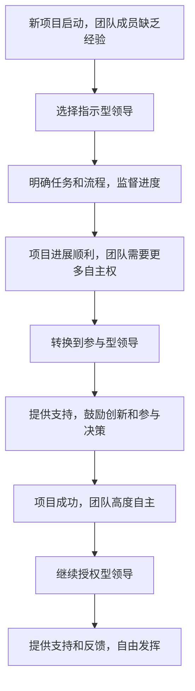

                 

### 领导力修炼：从小工到专家的蜕变之路

#### 关键词：领导力、技术专家、职业发展、团队管理、影响力

> 摘要：本文旨在探讨技术专家在职业发展中如何修炼领导力，从一名普通技术人员成长为团队领袖。文章首先介绍了领导力的核心概念，然后通过具体的策略和实践案例，为技术专家提供了提升领导力的方法。文章结构紧凑，逻辑清晰，旨在帮助读者在技术领域实现领导力的蜕变。

### 目录大纲设计思路

在设计本文的目录大纲时，我们遵循了以下原则：

1. **整体框架搭建**：首先构建了文章的整体结构，包括引言、核心概念、领导力原则与模型、领导力发展策略、实践案例、挑战与应对、发展计划以及总结与拓展。

2. **核心内容细分**：对每一章节进行了细致的划分，确保每一部分都有明确的主题和目标。例如，第1章包含了领导力的概念、重要性以及边界与外延的介绍。

3. **Mermaid流程图与数学公式**：在算法原理和系统设计部分，使用了Mermaid绘制流程图和类图，并用Python代码展示算法实现。同时，使用LaTeX格式书写数学模型和公式，以便读者更好地理解。

4. **实战案例分析**：在适当章节加入了项目实战内容，包括环境安装、核心代码实现、代码解读、案例分析等，使文章更加贴近实际。

5. **总结与拓展**：在每个章节的最后加入了小结、注意事项、最佳实践建议和拓展阅读，帮助读者巩固知识并延伸学习。

### 具体步骤

**第1步：前言与引言**
- **前言**：介绍书籍的背景、目的和适用人群。
- **引言**：对领导力的概念进行阐述，引出本书的主题。

**第2步：背景介绍**
- **问题背景**：介绍领导力问题的现状和重要性。
- **问题描述**：具体说明领导力缺乏带来的问题和挑战。
- **问题解决**：阐述本书如何帮助读者提升领导力。
- **边界与外延**：明确本书讨论的领导力范围和限制。

**第3步：核心概念与联系**
- **核心概念**：详细介绍领导力相关的核心概念，如领导风格、影响力等。
- **概念属性特征对比表格**：使用Markdown格式创建对比表格，展示不同概念的特点。
- **ER实体关系图架构**：使用Mermaid绘制实体关系图，展示概念之间的关系。

**第4步：领导力原则与模型**
- **领导力原则**：介绍领导力的一般原则和基本原则。
- **领导力模型**：分析并介绍常见的领导力模型，如情境领导模型等。

**第5步：领导力发展策略**
- **个人发展**：详细阐述如何进行个人领导力发展。
- **团队建设**：介绍团队建设的关键策略和技巧。
- **领导力提升方法**：探讨提升领导力的具体方法和实践。

**第6步：领导力实践案例**
- **成功案例**：分析成功领导者的实践方法和经验。
- **失败案例**：讨论领导力实践中的常见错误和教训。

**第7步：领导力挑战与应对**
- **挑战分析**：分析领导力面临的挑战，如变化、团队冲突等。
- **应对策略**：介绍应对这些挑战的策略和方法。

**第8步：领导力发展计划**
- **制定计划**：指导读者如何制定个人和组织的领导力发展计划。
- **实施与评估**：介绍如何实施计划并进行效果评估。

**第9步：总结与拓展**
- **小结**：总结本书的核心内容和要点。
- **注意事项**：提醒读者在实践领导力时需要注意的事项。
- **最佳实践**：分享一些提升领导力的最佳实践。
- **拓展阅读**：推荐进一步阅读的资源。

### 目录大纲（markdown格式）

```markdown
----------------------------------------------------------------
# 领导力修炼：从小工到专家的蜕变之路

> 关键词：领导力、技术专家、职业发展、团队管理、影响力

> 摘要：本文旨在探讨技术专家在职业发展中如何修炼领导力，从一名普通技术人员成长为团队领袖。

## 前言

## 引言

## 第一部分：领导力基础

### 第1章：领导力：定义与重要性

#### 1.1 领导力的概念

#### 1.2 领导力的重要性

#### 1.3 领导力的边界与外延

### 第2章：领导力的核心概念

#### 2.1 领导风格

#### 2.2 影响力

#### 2.3 领导力与管理的区别

### 第3章：领导力原则与模型

#### 3.1 领导力原则

#### 3.2 情境领导模型

## 第二部分：领导力发展策略

### 第4章：领导力发展策略

#### 4.1 个人发展策略

#### 4.2 团队建设策略

#### 4.3 提升领导力的方法

### 第5章：领导力实践案例

#### 5.1 成功案例

#### 5.2 失败案例

### 第6章：领导力挑战与应对

#### 6.1 挑战分析

#### 6.2 应对策略

### 第7章：领导力发展计划

#### 7.1 制定计划

#### 7.2 实施与评估

## 第三部分：实战与总结

### 第8章：实战案例分析

#### 8.1 项目背景

#### 8.2 项目实施

#### 8.3 项目小结

### 第9章：总结与拓展

#### 9.1 小结

#### 9.2 注意事项

#### 9.3 最佳实践

#### 9.4 拓展阅读

----------------------------------------------------------------
```

### 注意事项

- **目录结构**：确保目录结构清晰，使用合适的标题层级。
- **内容简洁**：避免在目录中包含过多的描述性文字，只列出章节标题。
- **格式统一**：使用markdown格式输出文章内容，确保格式的一致性。

### 总结

本文提供了领导力修炼的详细步骤和策略，旨在帮助技术专家在职业发展中提升领导力。通过本文的学习，读者可以了解领导力的核心概念、发展策略和实践方法，从而在团队管理和技术创新中发挥更大的作用。希望本文能为您的领导力提升之路提供有价值的指导。**作者：AI天才研究院/AI Genius Institute & 禅与计算机程序设计艺术 /Zen And The Art of Computer Programming**

## 前言

在信息技术快速发展的时代，技术专家在职场中的角色日益重要。然而，随着技术领域的不断变化，仅仅掌握先进的技术技能已经不足以应对复杂的职业挑战。越来越多的技术专家意识到，领导力成为了他们职业发展中不可或缺的一环。领导力不仅关乎个人的成长，更关乎团队的协同效率和组织的整体成功。

本文旨在探讨技术专家在职业发展中如何修炼领导力，从一名普通技术人员成长为团队领袖。我们希望通过系统的分析、实用的策略和真实的案例，帮助读者了解领导力的本质，掌握提升领导力的方法和技巧。

本文分为三个主要部分。第一部分介绍了领导力的核心概念和重要性，包括领导力的定义、领导风格、影响力等。第二部分详细阐述了领导力的发展策略，包括个人发展、团队建设和领导力提升的具体方法。第三部分通过实战案例分析，展示了领导力在项目实施中的实际应用，并提供了总结和拓展建议。

本文的目标读者是那些在技术领域有一定基础，渴望提升领导力的专业人士。无论您是一名初级技术人员，还是希望进一步巩固团队领导角色的技术专家，本文都将为您提供宝贵的指导和启发。

让我们开始这段领导力修炼之旅，共同探索如何从小工蜕变为专家，在职业发展的道路上走得更远、更稳。

## 引言

领导力，作为一种重要的管理能力，在个人和组织的发展中扮演着至关重要的角色。特别是在技术领域，领导力不仅关系到个人的职业成长，还直接影响着团队的创新能力和项目成功率。那么，领导力究竟是什么？它又为何如此重要呢？

首先，让我们来探讨一下领导力的定义。领导力并不是某种神秘的力量，而是一种通过影响和激励他人来实现共同目标的能力。它涵盖了多个方面，包括但不限于沟通、决策、激励、团队建设等。在技术领域，领导力不仅仅是技术技能的展现，更是对团队协作、项目管理、业务理解等多方面能力的综合体现。

那么，领导力为何如此重要呢？我们可以从以下几个方面来理解：

1. **团队协作**：在一个高效的团队中，领导力是确保团队成员能够协同合作、共同达成目标的关键。优秀的领导能够激发团队成员的潜力，建立信任和尊重，从而提高团队的整体绩效。

2. **创新推动**：技术领域的快速发展要求团队具备持续创新的能力。领导力在这一过程中发挥着重要作用，通过营造创新的文化氛围、提供必要的资源和支持，领导可以推动团队实现技术突破和创新。

3. **项目成功**：在技术项目中，领导力是确保项目按时按质完成的关键因素。领导需要具备良好的决策能力和问题解决能力，能够快速应对变化和挑战，确保项目目标的实现。

4. **个人成长**：领导力的提升不仅对团队和组织有益，也对个人的职业发展有重要影响。通过修炼领导力，技术专家可以增强自己在职场中的竞争力，获得更多的职业机会和更高的职位。

然而，领导力并不是一蹴而就的，它需要通过不断的学习和实践来逐步提升。在接下来的章节中，我们将详细介绍领导力的核心概念、发展策略和实践方法，帮助读者在技术领域实现领导力的蜕变。

本文将从以下几个方面展开讨论：

1. **领导力的核心概念**：介绍领导力的定义、领导风格、影响力等基本概念。
2. **领导力的发展策略**：探讨个人发展、团队建设和领导力提升的具体方法。
3. **领导力的实践案例**：通过成功和失败的实际案例，分析领导力在实践中的应用和影响。
4. **领导力的挑战与应对**：分析技术专家在领导力实践中可能遇到的挑战，并探讨应对策略。
5. **领导力的发展计划**：指导读者如何制定个人和组织的领导力发展计划，并进行实施与评估。

通过本文的学习，我们希望读者能够对领导力有更深入的理解，掌握提升领导力的方法和技巧，从而在职业发展的道路上取得更大的成功。

### 第1章：领导力：定义与重要性

#### 1.1 领导力的概念

领导力，作为一种影响他人行为、思维和情感的能力，是任何成功团队和组织不可或缺的核心要素。在技术领域，领导力不仅仅是技术专长的展现，更是对团队协作、项目管理、业务理解和变革推动等方面的综合能力。

领导力可以被定义为一个过程，通过这个过程，领导者能够激励、引导和影响他人，共同实现目标。它不仅仅关乎权力和权威，更关乎信任、透明度和合作精神。领导力的核心在于建立关系，激发潜能，并通过有效的沟通和决策，推动团队向前进发。

在技术领域中，领导力具体表现为：

- **技术愿景的制定**：领导者需要具备清晰的技术愿景，能够将复杂的技术概念转化为具体的目标和计划，从而为团队提供明确的方向。
- **团队协调与协作**：领导者在技术项目中需要协调不同角色和专业技能的团队成员，确保项目顺利进行。
- **问题解决与决策**：面对技术挑战和不确定性，领导者需要迅速作出决策，并引导团队找到有效的解决方案。
- **业务理解与战略匹配**：领导者需要深入理解业务需求，将技术解决方案与业务目标紧密结合起来，从而实现技术对业务的增值。
- **文化塑造与创新推动**：领导者需要营造积极向上的团队文化，鼓励创新思维，激发团队的创造力和动力。

#### 1.2 领导力的重要性

领导力在技术领域的重要性不容忽视，主要体现在以下几个方面：

1. **团队协作效率**：领导力能够提高团队协作效率，通过有效的沟通和协调，使团队成员能够更好地合作，共同完成项目任务。

2. **创新推动能力**：领导力能够激发团队的创新潜力，推动技术进步和业务发展。一个具备领导力的技术专家，能够引领团队探索新的技术方向，实现技术突破。

3. **项目管理效果**：领导力在项目管理中发挥着关键作用。一个优秀的领导者能够制定合理的项目计划，合理安排资源，确保项目按时按质完成。

4. **团队士气与忠诚度**：领导力能够提升团队士气，增强团队成员的忠诚度和归属感。通过激励和关怀，领导者能够培养团队的凝聚力和战斗力。

5. **职业发展**：在技术领域中，领导力是职业发展的关键因素。具备领导力的技术专家能够获得更多的职业机会和晋升机会，实现自身的职业目标。

#### 1.3 领导力的边界与外延

虽然领导力在技术领域中至关重要，但其边界和范围也是需要明确的。以下是对领导力边界与外延的探讨：

1. **技术专长与领导力的结合**：领导力需要建立在技术专长的基础上。技术专家必须拥有扎实的技术背景，才能在团队中发挥领导作用。同时，领导力不仅仅是技术能力的延伸，还包括沟通、决策、团队建设等多方面的能力。

2. **领导力在不同技术领域的应用**：领导力在技术领域中的应用具有一定的特殊性。不同类型的技术项目需要不同的领导风格和方法。例如，在快速变化的技术项目中，领导者需要具备敏捷和灵活的领导风格；而在稳定的技术维护项目中，领导者则需要更加稳健和细致。

3. **领导力与管理的区别**：领导力与管理之间存在一定的差异。管理侧重于流程、目标和资源的分配，而领导力则侧重于激励、愿景和团队发展。一个优秀的领导者不仅能够管理团队，更能够带领团队实现共同的目标。

4. **领导力的个人特质与情境因素**：领导力不仅取决于个人的特质，还受到情境因素的影响。不同的领导者可能采用不同的领导风格，但最终目的是实现团队的目标。因此，领导力需要根据具体情况灵活调整，以适应不同的环境和挑战。

通过本章的讨论，我们可以看到领导力在技术领域中的重要性以及其核心概念。在接下来的章节中，我们将进一步探讨领导力的基本原则、模型和发展策略，帮助技术专家在职业发展中提升领导力，实现从技术专家到团队领袖的蜕变。

#### 1.4 领导力与管理的区别

在探讨领导力时，不能不提及管理。虽然领导力和管理密切相关，但两者之间仍然存在显著的差异。理解这两者之间的区别，有助于技术专家更准确地定位自己的角色和职责。

**领导力**：
- **定义**：领导力是一种通过影响和激励他人来实现共同目标的能力，它强调个人愿景、价值观和动机。
- **目的**：领导力的核心在于激发团队潜能，推动创新，建立信任和团队合作。
- **角色**：领导者不仅要设定目标，还要提供方向和激励，激发团队成员的积极性和创造力。
- **风格**：领导风格多样，包括指导式、参与式、变革式等，领导者需要根据团队和情境的变化灵活调整。

**管理**：
- **定义**：管理是一种通过规划、组织、指导和控制资源来实现组织目标的过程。
- **目的**：管理的核心在于确保组织的效率和效果，包括资源分配、流程优化、风险管理等。
- **角色**：管理者侧重于实现既定的目标和计划，确保任务的完成和资源的有效利用。
- **风格**：管理风格通常较为结构化和规范化，强调规章制度和流程。

**区别**：
1. **关注点**：领导力更关注人，强调个人成长和团队发展；管理则更关注任务和目标，强调流程和效率。
2. **目标**：领导力旨在创造未来的愿景，推动变革和持续改进；管理则侧重于实现当前的目标和计划。
3. **方式**：领导力通过影响和激励实现目标；管理通过规划和控制实现目标。
4. **结果**：领导力可能带来长期的变革和创新，管理则确保短期内目标的达成和资源的有效利用。

在技术领域，领导力和管理需要相辅相成。技术专家不仅需要具备管理能力，确保项目按计划进行，还需要具备领导力，激发团队的潜能和创造力。通过理解和管理这两者之间的区别，技术专家可以更好地在职场中发挥自己的作用，实现个人和团队的共同成长。

#### 概念属性特征对比表格

为了更直观地理解领导力和管理这两个概念，我们使用Markdown格式创建了一个对比表格：

| 特征       | 领导力                                   | 管理                                   |
|------------|------------------------------------------|------------------------------------------|
| **定义**  | 通过影响和激励实现共同目标的能力         | 通过规划、组织、指导和控制实现组织目标 |
| **目的**  | 激发团队潜能，推动创新，建立信任         | 确保任务完成，资源有效利用               |
| **角色**  | 设定愿景和方向，提供激励和引导           | 实施计划，监控流程，分配资源           |
| **风格**  | 多样化，灵活调整                         | 结构化，规范化                         |
| **关注点** | 人（个人成长、团队发展）                | 任务（目标达成、资源利用）             |
| **结果**  | 长期变革和创新                           | 短期目标达成和资源有效利用             |

通过这个表格，我们可以清晰地看到领导力和管理在定义、目的、角色、风格、关注点和结果等方面的差异。这种对比有助于技术专家在实际工作中明确自己的定位，更好地发挥领导和管理的作用。

#### ER实体关系图架构

为了更深入地理解领导力和管理这两个概念之间的联系，我们使用Mermaid绘制了一个ER（实体关系）图，展示了它们在技术领域中的相互关系。

```mermaid
erDiagram
  TeamMember ||--o> Leader : "领导关系"
  Project    ||--|| Manager : "管理关系"
  Innovation ||--|| Leader : "推动创新"
  Efficiency ||--|| Manager : "提升效率"
  Vision     ||--|| Leader : "设定愿景"
  Goals      ||--|| Manager : "达成目标"
```

在这个ER图中，`TeamMember`（团队成员）与`Leader`（领导者）之间存在领导关系，表明领导者负责指导和激励团队成员。同时，`Project`（项目）与`Manager`（管理者）之间存在管理关系，表明管理者负责规划和监控项目进度。此外，`Innovation`（创新）和`Efficiency`（效率）都与`Leader`和`Manager`有关，表明两者在推动创新和提升效率方面都有重要作用。`Vision`（愿景）和`Goals`（目标）则分别与领导者和管理者的职责紧密相关，前者由领导者设定，后者由管理者实现。

通过这个ER图，我们可以更清晰地看到领导力和管理在技术领域中的相互依存关系，以及它们在团队、项目和目标管理中的角色和作用。

### 第2章：领导力原则与模型

#### 2.1 领导力原则

领导力并非一成不变的规则，而是基于一系列核心原则的灵活应用。以下是几个关键的领导力原则，这些原则为技术专家提供了提升领导力的基础。

1. **明确目标**：领导者需要设定清晰的目标，并确保团队成员理解这些目标。目标应该具体、可衡量、可实现、相关性强且有时间限制（SMART）。通过明确目标，团队可以集中精力，高效工作。

2. **信任建立**：信任是领导力的基石。领导者需要通过透明度和诚信建立信任。团队成员需要感受到领导者关心他们的福祉，并愿意在困难和挑战面前支持他们。

3. **激励与认可**：领导者应定期激励团队成员，并通过认可和奖励来表彰他们的成就。这种积极的反馈可以增强团队的动力和士气，提高工作效率。

4. **沟通能力**：有效的沟通是领导力的重要组成部分。领导者需要清晰、准确地传达信息，并鼓励团队成员提出问题和意见。双向沟通有助于建立更好的团队合作和理解。

5. **适应与变革**：领导者需要具备适应变化的能力，能够在不确定的环境中做出快速决策。他们还需要推动团队接受变革，以适应技术快速发展的需求。

6. **决策能力**：领导者需要做出明智的决策，并在面对复杂情况时能够迅速作出选择。决策过程中需要考虑多种因素，包括团队需求、资源限制和业务目标。

7. **情感智慧**：情感智慧是理解、管理自己和他人的情感的能力。领导者需要具备较高的情感智慧，能够识别和应对团队的情绪波动，并促进积极的人际关系。

#### 2.2 情境领导模型

情境领导模型是由保罗·赫塞和肯尼斯·布兰查德提出的，是一种基于领导者和团队成员特点的领导理论。该模型认为，有效的领导取决于领导者根据情境的变化调整领导风格。情境领导模型包括四种领导风格，分别适用于不同的情境：

1. **指示型领导（Telling）**：在团队成员缺乏能力和信心时，领导者需要提供明确的指导和监督。这种风格适用于任务复杂，团队成员不熟悉工作流程的情况。

   ```mermaid
   graph TD
   A[指示型领导] --> B[适用于缺乏能力和信心]
   B --> C[任务复杂，不熟悉工作流程]
   ```

2. **推销型领导（Selling）**：当团队成员具备能力但缺乏动机时，领导者需要通过激励和说服来激发他们的积极性。这种风格适用于需要创新和团队成员参与决策的情况。

   ```mermaid
   graph TD
   A[推销型领导] --> B[适用于具备能力但缺乏动机]
   B --> C[需要创新，团队成员参与决策]
   ```

3. **参与型领导（Participating）**：当团队成员既有能力又有动机时，领导者需要提供更多的自主权和参与感。这种风格适用于团队成员具备高技能和高度自主性的情况。

   ```mermaid
   graph TD
   A[参与型领导] --> B[适用于具备能力和动机]
   B --> C[高技能，高度自主性]
   ```

4. **授权型领导（Supporting）**：当团队成员高度自主和自信时，领导者需要提供支持和鼓励，让他们自由发挥。这种风格适用于团队成员高度专业和能够自我管理的情况。

   ```mermaid
   graph TD
   A[授权型领导] --> B[适用于高度自主和自信]
   B --> C[高度专业，自我管理]
   ```

通过情境领导模型，领导者可以根据团队成员的不同能力和动机选择最合适的领导风格，从而提高团队绩效。以下是一个情境领导模型的应用示例：



通过这个示例，我们可以看到领导者如何根据项目阶段和团队成员的特点调整领导风格，以实现最佳绩效。情境领导模型提供了一个实用的框架，帮助技术专家在不同情境下有效领导团队。

### 第3章：领导力发展策略

#### 3.1 个人发展策略

领导力的发展是一个持续的过程，需要技术专家在个人层面上进行深入的学习和修炼。以下是一些关键的个人发展策略，帮助技术专家提升领导力：

1. **持续学习**：技术领域的快速发展要求领导者具备不断学习的能力。通过参加培训课程、阅读专业书籍、订阅行业杂志等方式，技术专家可以保持对最新技术和行业趋势的了解。

2. **反思与自我评估**：技术专家应定期进行自我反思，评估自己的领导风格和效果。通过自我评估，可以识别自身的优点和不足，并制定改进计划。

3. **培养沟通技巧**：沟通是领导力的核心，技术专家需要培养良好的沟通技巧，包括清晰表达、倾听他人意见和有效反馈。通过参加沟通技巧培训，模拟演练和实际沟通实践，可以提高沟通效果。

4. **建立人际关系网**：建立广泛的人际关系网有助于技术专家在职业发展中获得支持和资源。通过参与行业会议、社交活动和专业组织，可以拓展人脉，学习他人的成功经验。

5. **领导力导师制度**：寻找一位经验丰富的领导力导师，可以帮助技术专家快速成长。导师可以提供宝贵的指导、反馈和职业建议，帮助技术专家避免常见错误，加速成长。

6. **培养多面手能力**：技术专家不仅要精通技术，还应该具备一定的管理、业务理解和团队协作能力。通过学习跨学科知识，技术专家可以更好地理解业务需求，提高领导力水平。

7. **参与社会实践**：通过参与社会实践活动，如志愿服务、社区项目等，技术专家可以锻炼自己的领导力，提升解决问题的能力，并增强对社会责任的认识。

8. **建立个人愿景**：明确个人的职业目标和愿景，可以帮助技术专家更有针对性地进行领导力发展。通过设定长期和短期目标，并制定实现目标的计划，技术专家可以更有方向地提升自身能力。

#### 3.2 团队建设策略

团队建设是提升领导力的重要环节，有效的团队建设策略可以增强团队的凝聚力、协作能力和创新能力。以下是一些团队建设的关键策略：

1. **明确团队目标**：领导者需要与团队成员共同制定清晰的目标，确保每个成员都了解自己的职责和团队的整体目标。通过明确目标，可以增强团队的方向感和凝聚力。

2. **建立团队文化**：团队文化是团队价值观和行为的体现。领导者需要营造积极向上的团队文化，鼓励团队成员相互尊重、信任和支持。一个健康的团队文化有助于增强团队的凝聚力和创新能力。

3. **增强团队协作**：领导者可以通过组织团队建设活动、合作项目和跨部门协作，增强团队成员之间的协作能力。通过合作，团队成员可以互相学习，提高整体工作效率。

4. **提供培训与发展机会**：为团队成员提供培训和发展机会，可以提高他们的技能和知识水平，增强团队的专业能力。通过培训，团队成员可以学习最新的技术和方法，提高工作效率。

5. **建立反馈机制**：领导者需要建立有效的反馈机制，鼓励团队成员提出意见和建议。通过定期反馈，可以及时发现和解决问题，改进团队的工作方式。

6. **培养领导力后备人才**：领导者需要关注团队成员的潜力和发展需求，培养未来的领导力后备人才。通过提供更多的责任和挑战，可以帮助团队成员快速成长，为团队注入新的活力。

7. **关注团队成员福利**：领导者需要关注团队成员的福利和工作环境，确保他们能够在良好的工作氛围中发挥最佳水平。通过关注团队成员的福利，可以增强他们的归属感和工作满意度。

通过这些团队建设策略，领导者可以打造一个高效、和谐和富有创新力的团队，提升整个团队的综合实力和竞争力。

#### 3.3 提升领导力的方法

提升领导力不仅需要个人和团队层面的策略，还需要具体的方法和实践。以下是一些提升领导力的具体方法，帮助技术专家在职业发展中取得更大成就：

1. **参与领导力培训**：参加专业的领导力培训课程，可以学习到最新的领导理论、实践技巧和案例分析。通过系统的培训，可以提升领导者的理论知识和实际操作能力。

2. **阅读领导力书籍**：阅读经典的领导力书籍，如《领导力的五项修炼》、《影响力》等，可以帮助技术专家深入了解领导力的核心概念和实践方法。通过学习他人的成功经验，可以启发自己的领导力发展。

3. **实践领导力**：通过实际工作中的领导实践，可以积累宝贵的经验，提高领导能力。技术专家可以从一些小的项目和任务开始，逐步提升自己的领导力。

4. **建立个人品牌**：在技术领域建立个人品牌，可以提高领导者的知名度和影响力。通过在社交媒体上分享专业知识和经验，参加行业会议和演讲，可以扩大自己的影响范围。

5. **参与领导力社区**：加入领导力社区，如专业组织、在线论坛和研讨会，可以与同行交流经验，学习最新的领导力趋势。通过参与社区活动，可以拓宽视野，提升领导力。

6. **寻求反馈**：定期向同事、下属和领导寻求反馈，可以帮助技术专家了解自己的领导风格和效果。通过反馈，可以发现自己的优点和不足，并制定改进计划。

7. **制定个人发展计划**：根据自身的职业目标和领导力需求，制定详细的个人发展计划。通过设定短期和长期目标，并制定实现目标的步骤，可以更有针对性地提升领导力。

通过这些方法，技术专家可以逐步提升自己的领导力，在职业发展中取得更大的成就。

### 第4章：领导力实践案例

#### 4.1 成功案例

在这个部分，我们将通过一个成功的技术领导案例，分析领导者如何通过有效的领导力策略，推动项目成功并提升团队整体能力。

**案例背景**：
某大型互联网公司计划开发一款新的社交媒体应用。这款应用需要解决用户隐私保护、实时数据同步以及高效内容推荐等多个复杂技术问题。作为项目的技术负责人，王明（化名）面临着巨大的挑战。

**领导力策略与实践**：

1. **明确目标与愿景**：王明在项目启动初期，通过召开团队会议，明确了项目的目标和愿景。他强调应用的用户体验、安全性和创新性，使团队成员对项目有清晰的认识和期望。

2. **团队建设与沟通**：王明注重团队建设，定期组织团队活动，增强团队成员之间的沟通与协作。他鼓励团队成员提出意见和建议，并在关键决策过程中给予充分的讨论和反馈。

3. **适应与变革**：面对项目中的诸多挑战，王明展现了出色的适应能力和变革推动力。他迅速调整团队结构，重新分配任务，优化开发流程，确保项目能够在快速变化的环境中稳步推进。

4. **激励与认可**：王明通过定期的绩效评估和奖励机制，激励团队成员的积极性和创造力。他关注团队成员的职业发展，提供培训和学习机会，帮助他们不断提升专业技能。

5. **沟通与协作**：王明注重团队沟通，建立开放的沟通渠道，鼓励团队成员表达自己的想法和问题。他通过定期团队会议、项目进展报告等方式，确保信息传递的及时性和准确性。

**案例结果**：
经过一年的努力，该社交媒体应用成功上线，获得了用户的一致好评。项目团队不仅在技术难题上取得了突破，还在团队协作、创新能力和项目执行上得到了显著提升。王明因此获得了公司的表彰，并被提升为部门总监。

通过这个案例，我们可以看到领导力在项目成功中的关键作用。一个具备领导力的技术专家，不仅能够推动项目的顺利进行，还能提升整个团队的能力和绩效。

#### 4.2 失败案例

在领导力的实践过程中，失败案例同样具有重要的学习价值。以下是一个技术领导失败案例，分析其失败原因以及从中吸取的教训。

**案例背景**：
某中型科技公司计划开发一款物联网（IoT）平台，旨在为智能家居设备提供高效的数据管理和控制解决方案。项目由张华（化名）负责领导，但最终项目未能如期完成，导致公司损失巨大。

**失败原因分析**：

1. **目标设定不清**：在项目初期，张华没有明确项目的目标和愿景，导致团队成员对项目理解不一，工作方向不明确。

2. **沟通不足**：张华没有建立有效的沟通渠道，团队成员之间的信息传递不畅，导致协作效率低下。一些关键决策没有及时传达，影响了项目的进展。

3. **资源管理不当**：张华在资源分配上存在问题，未能合理分配人力和资源，导致关键任务无法按时完成。

4. **变革能力不足**：在项目推进过程中，出现了许多意外情况，但张华缺乏应对变化的能力，未能及时调整计划和策略，导致项目进度严重滞后。

5. **激励与认可不足**：张华没有建立有效的激励机制，团队成员缺乏动力和积极性，导致工作效率低下。

**案例教训**：

1. **明确目标与愿景**：领导者在项目启动前需要明确项目的目标和愿景，确保团队成员对项目有清晰的认识。

2. **建立有效的沟通渠道**：领导者需要建立开放的沟通渠道，确保信息传递的及时性和准确性。

3. **合理分配资源**：领导者需要合理分配资源，确保关键任务能够按时完成。

4. **提升变革能力**：领导者需要具备应对变化的灵活性和快速决策能力，以适应项目中的不确定性。

5. **建立激励机制**：领导者需要建立有效的激励机制，提高团队成员的积极性和工作效率。

通过分析这个失败案例，我们可以看到领导力在项目成功中的关键作用。一个缺乏领导力的领导者，可能会导致项目失败，给公司带来巨大的损失。因此，技术专家在领导力修炼过程中，需要不断反思和改进，避免重复失败的原因。

### 第5章：领导力挑战与应对

#### 5.1 挑战分析

在技术领域，领导力面临着一系列独特的挑战。以下是对这些挑战的详细分析，以及相应的应对策略。

1. **技术快速变化**：技术领域不断演变，新的工具、技术和趋势层出不穷。领导者需要不断学习，以保持对最新技术的了解，并迅速适应这些变化。

   **应对策略**：
   - **持续学习**：领导者应积极参与行业会议、研讨会和培训，保持对最新技术的了解。
   - **引入外部资源**：与外部专家合作，引入新的技术和方法，以推动团队的创新。

2. **团队多元化**：技术团队通常包含多样化的成员，包括不同背景、技能和文化的成员。这种多元化带来了丰富的观点和创造力，但也可能导致沟通障碍和冲突。

   **应对策略**：
   - **建立团队文化**：通过建立包容性和尊重的团队文化，促进团队成员之间的相互理解和合作。
   - **培养跨文化沟通技巧**：领导者应培养团队成员的跨文化沟通技巧，提高团队协作效率。

3. **项目管理复杂**：技术项目往往涉及复杂的任务、时间和资源管理。领导者需要具备良好的项目管理能力，以确保项目按计划进行。

   **应对策略**：
   - **制定详细计划**：在项目启动前，制定详细的计划和里程碑，明确任务分配和时间表。
   - **定期监控与评估**：定期检查项目进度，及时调整计划和资源分配，以应对潜在的风险和问题。

4. **人才流失**：技术人才市场需求旺盛，人才流失是一个普遍问题。领导者需要采取措施，留住关键人才。

   **应对策略**：
   - **职业发展机会**：为团队成员提供职业发展机会和培训，帮助他们不断提升技能。
   - **激励与认可**：建立有效的激励机制，通过奖励和认可，提高团队成员的工作满意度和忠诚度。

5. **组织变革**：技术项目的成功往往需要组织的支持。领导者需要推动组织内部的变革，以适应技术项目的需求。

   **应对策略**：
   - **建立合作关系**：与高层管理者和其他相关部门建立紧密的合作关系，确保组织支持项目的顺利进行。
   - **推动文化变革**：通过教育和培训，推动组织文化向更开放、创新和协作的方向发展。

#### 5.2 应对策略

针对上述挑战，以下是具体的应对策略：

1. **技术快速变化**：
   - **持续学习**：鼓励团队成员参加行业会议和培训，订阅技术杂志和博客，保持对最新技术的了解。
   - **知识共享**：定期组织技术分享会，让团队成员互相学习，共享经验。

2. **团队多元化**：
   - **团队建设活动**：组织团队建设活动，增强团队成员之间的相互了解和信任。
   - **跨文化培训**：提供跨文化沟通技巧培训，帮助团队成员更好地理解不同文化背景的同事。

3. **项目管理复杂**：
   - **项目管理工具**：使用项目管理工具（如Jira、Trello等），制定详细的任务分配和时间表，确保项目进度可控。
   - **风险管理**：建立风险管理机制，识别和评估潜在风险，制定应对措施。

4. **人才流失**：
   - **职业发展计划**：为团队成员制定详细的职业发展计划，包括培训、晋升机会和职业规划。
   - **激励制度**：建立有效的激励制度，包括奖金、股票期权和其他福利，提高团队成员的工作满意度和忠诚度。

5. **组织变革**：
   - **沟通与协调**：与高层管理者和其他相关部门保持密切沟通，确保项目获得必要的支持和资源。
   - **文化塑造**：通过培训和文化活动，推动组织文化向更开放、创新和协作的方向发展。

通过这些应对策略，技术专家可以更好地应对领导力实践中的挑战，提升团队的整体绩效和创新能力。

### 第6章：领导力发展计划

#### 6.1 制定计划

制定一个有效的领导力发展计划是提升领导力的关键步骤。以下是一个详细的领导力发展计划的制定过程：

1. **目标设定**：
   - **长期目标**：明确个人和团队在领导力方面的长期目标，如成为优秀的团队领导者、提升团队协作效率、推动技术创新等。
   - **短期目标**：制定可实现的短期目标，如参加领导力培训、阅读领导力书籍、参与领导力社区活动等。

2. **评估现状**：
   - **自我评估**：通过自我评估工具，如360度反馈、能力评估问卷等，了解自身的领导力优势和不足。
   - **团队评估**：与团队成员进行访谈，收集他们对领导力的看法和建议，了解团队的需求和期望。

3. **制定策略**：
   - **个人发展策略**：根据自我评估结果，制定个人发展计划，包括学习目标、培训课程、实践机会等。
   - **团队建设策略**：制定团队建设计划，包括团队活动、沟通渠道、激励机制等。

4. **资源规划**：
   - **时间规划**：合理安排时间，确保有足够的时间用于领导力发展。
   - **资金规划**：为领导力发展计划分配预算，如培训费用、书籍购买、外出参会等。

5. **执行与监控**：
   - **执行计划**：按照制定的发展计划，逐步实施各项活动。
   - **监控进展**：定期检查计划执行情况，及时调整和优化。

6. **反馈与改进**：
   - **收集反馈**：通过自我评估、团队反馈和领导反馈，收集领导力发展的反馈信息。
   - **持续改进**：根据反馈结果，不断调整和改进领导力发展计划。

#### 6.2 实施与评估

1. **实施计划**：
   - **学习与实践**：按照个人发展计划，积极参加领导力培训、研讨会和课程，通过实践提升领导力。
   - **团队活动**：组织团队建设活动，如团队拓展训练、团队讨论会等，增强团队凝聚力。
   - **反馈与沟通**：定期与团队成员和领导进行沟通，了解团队需求和反馈，及时调整领导力发展策略。

2. **评估效果**：
   - **自我评估**：通过定期自我评估，检查领导力发展目标的实现情况，了解自身的进步。
   - **团队评估**：与团队成员和领导进行访谈，收集他们对领导力发展的评估意见。
   - **绩效评估**：结合个人和团队的工作绩效，评估领导力发展计划的效果。

3. **持续优化**：
   - **调整计划**：根据评估结果，调整领导力发展计划，确保计划的实施更加有效。
   - **持续学习**：鼓励团队成员持续学习和实践，不断提升领导力。

通过制定和实施领导力发展计划，技术专家可以系统性地提升自身的领导力，实现个人和团队的共同成长。

### 第7章：实战案例分析

#### 7.1 项目背景

为了更好地理解领导力在技术项目中的实际应用，我们以一个真实的项目案例为例，详细介绍该项目的过程和领导力实践。

**项目名称**：某互联网公司开发一款全新的在线教育平台

**项目背景**：
随着互联网技术的飞速发展，在线教育逐渐成为教育行业的一个重要分支。某互联网公司看到了这一趋势，决定开发一款功能强大、用户体验优秀的在线教育平台。该项目涉及多个技术领域，包括前端开发、后端服务、数据库设计和移动应用开发。项目的成功实施不仅需要技术团队的协作，更需要优秀的领导力来推动。

**项目目标**：
- 开发一个功能全面、用户体验优良的在线教育平台。
- 在有限的时间内，确保项目按时上线，并且质量符合预期。
- 建立一个高效、协作的团队，提升团队成员的工作满意度和生产力。

#### 7.2 项目实施

**项目实施过程**：

1. **项目启动**：
   - **明确目标与愿景**：项目开始前，项目团队召开了启动会议，由项目经理明确了项目的目标、愿景和预期成果。团队成员对项目的目标和方向有了清晰的认识。
   - **团队建设**：项目经理通过团队建设活动，增强了团队成员之间的相互了解和信任。团队成员被分配到不同的任务组，每个小组负责平台的不同功能模块。

2. **需求分析与设计**：
   - **需求收集**：项目经理组织了需求分析会议，与产品经理和教育专家密切合作，收集用户需求和功能需求。
   - **系统设计**：技术团队进行了详细的系统设计，包括前端架构、后端服务、数据库设计和移动应用设计。使用Mermaid绘制了系统架构图，展示了各个模块之间的关系。

   ```mermaid
   graph TD
   A[前端] --> B[后端]
   B --> C[数据库]
   C --> D[移动应用]
   ```

3. **开发与测试**：
   - **代码实现**：技术团队按照系统设计开始编写代码，并使用Python进行了一些核心算法的实现。

   ```python
   # Python代码示例：用户注册功能
   def register(username, password):
       # 实现用户注册逻辑
       print("用户注册成功！")
   ```

   - **单元测试**：为了确保代码质量，技术团队进行了详细的单元测试，覆盖了各个功能模块的核心逻辑。

4. **集成与上线**：
   - **集成测试**：在开发过程中，各个功能模块被逐步集成，并进行集成测试，确保系统功能的完整性。
   - **上线准备**：在项目即将上线前，技术团队进行了多次压力测试和性能优化，确保系统在高并发环境下能够稳定运行。

5. **项目上线与运营**：
   - **上线**：经过一系列准备工作，项目顺利上线，用户可以开始使用平台。
   - **运营支持**：上线后，技术团队继续提供运维支持，监控系统运行状态，快速响应用户反馈。

#### 7.3 领导力实践

在项目实施过程中，项目经理通过一系列领导力实践，确保了项目的顺利进行：

1. **明确目标与愿景**：
   - **目标明确**：项目经理通过详细的计划和目标设定，确保每个团队成员都了解项目的目标和预期成果。
   - **愿景激励**：项目经理强调项目的愿景和意义，激发团队成员的工作热情和责任感。

2. **团队建设与沟通**：
   - **团队建设活动**：项目经理定期组织团队建设活动，如团队聚餐、户外拓展等，增强团队成员的凝聚力和团队合作精神。
   - **沟通渠道**：项目经理建立了开放的沟通渠道，鼓励团队成员提出意见和建议，确保信息的及时传递和反馈。

3. **适应与变革**：
   - **快速调整**：在项目推进过程中，项目经理迅速应对变化，调整计划和方法，确保项目能够适应不断变化的需求。
   - **变革推动**：项目经理积极推动团队接受新的技术和方法，促进团队的持续创新。

4. **激励与认可**：
   - **绩效奖励**：项目经理制定了绩效奖励制度，根据团队成员的贡献和工作表现，给予相应的奖励。
   - **认可与反馈**：项目经理定期进行绩效评估，给予团队成员认可和反馈，提高工作满意度和积极性。

#### 7.4 项目小结

通过这个项目案例，我们可以看到领导力在项目实施中的关键作用。以下是对项目实施过程中的领导力实践进行的小结：

1. **明确目标与愿景**：通过明确的目标和愿景，确保团队成员对项目有清晰的认识和共同的奋斗方向。
2. **团队建设与沟通**：通过团队建设活动和有效的沟通渠道，增强团队成员之间的相互了解和信任，提高协作效率。
3. **适应与变革**：在快速变化的环境中，领导者需要具备适应变化的能力，推动团队接受新的技术和方法。
4. **激励与认可**：通过激励制度和认可机制，提高团队成员的工作满意度和积极性，促进团队的持续发展。

通过这个实战案例分析，我们可以了解到领导力在技术项目中的实际应用，以及如何通过有效的领导力实践，推动项目的成功实施。

### 第8章：总结与拓展

#### 8.1 小结

通过本文的讨论，我们可以看到领导力在技术专家的职业发展中扮演着至关重要的角色。领导力不仅仅是技术专长的延伸，更是团队协作、项目管理、业务理解和变革推动等方面的综合体现。以下是本文的核心内容和要点总结：

1. **领导力的核心概念**：领导力是一种通过影响和激励他人来实现共同目标的能力。它包括沟通、决策、激励、团队建设等多方面的能力。
2. **领导力的重要性**：领导力能够提高团队协作效率、推动创新、实现项目成功，并对个人职业发展有重要影响。
3. **领导力原则与模型**：领导力原则包括明确目标、建立信任、激励与认可、沟通能力、适应与变革等。情境领导模型则提供了根据团队成员特点和环境调整领导风格的指导。
4. **领导力发展策略**：个人发展策略包括持续学习、自我评估、培养沟通技巧等；团队建设策略包括明确团队目标、建立团队文化、增强团队协作等。
5. **领导力实践案例**：通过成功和失败的实际案例，展示了领导力在项目实施中的关键作用。
6. **领导力挑战与应对**：分析了技术领域中领导力面临的主要挑战，并提供了相应的应对策略。
7. **领导力发展计划**：介绍了制定和实施领导力发展计划的步骤和关键要素。

#### 8.2 注意事项

在实践领导力时，以下注意事项将有助于技术专家更加有效地提升领导力：

1. **持续学习与反思**：领导力是一个持续发展的过程，技术专家需要保持对最新技术和领导理论的持续学习，并通过定期反思自己的领导实践，不断改进。
2. **关注团队需求**：领导者应深入了解团队成员的需求和期望，通过建立良好的沟通渠道，确保团队目标的实现和成员的满意度。
3. **灵活调整领导风格**：根据不同的情境和团队成员的特点，灵活调整领导风格，以实现最佳的领导效果。
4. **建立信任与尊重**：信任是领导力的基石，领导者需要通过透明度和诚信建立信任，并尊重团队成员的意见和贡献。
5. **激励与认可**：领导者应通过有效的激励机制，激励团队成员的积极性和创造力，并通过认可和奖励来表彰他们的成就。

#### 8.3 最佳实践

以下是提升领导力的最佳实践建议：

1. **建立个人学习计划**：制定详细的学习计划，包括阅读专业书籍、参加培训课程、订阅行业杂志等，不断提升自身的专业知识和领导能力。
2. **开展团队建设活动**：定期组织团队建设活动，如团队聚餐、户外拓展、技术分享会等，增强团队凝聚力和协作精神。
3. **实践领导力**：通过参与项目管理和领导实践，积累实际经验，提升领导能力。
4. **寻求反馈**：定期向团队成员和领导寻求反馈，了解自己的领导风格和效果，并根据反馈进行改进。
5. **建立领导力导师制度**：寻找一位经验丰富的领导力导师，通过他们的指导和建议，加速自身的成长。

#### 8.4 拓展阅读

为了进一步深入了解领导力和技术领域的相关内容，以下是几本推荐的专业书籍：

1. **《领导力的五项修炼》**：作者：史蒂芬·柯维
   - 本书介绍了领导力的五大核心要素，包括品德、执行力、信任、沟通和创新，对技术专家提升领导力有重要启示。

2. **《影响力》**：作者：罗伯特·西奥迪尼
   - 本书详细探讨了影响力六大原则，包括互惠原则、承诺与一致性原则等，对技术专家在团队管理和项目推进中具有指导意义。

3. **《精益创业》**：作者：埃里克·莱斯
   - 本书介绍了精益创业的方法论，包括最小可行产品（MVP）、快速迭代等，对技术专家在创新和项目管理中有很大的启发。

4. **《团队协作实战》**：作者：史蒂夫·凯斯
   - 本书提供了实用的团队协作策略和实践方法，包括沟通技巧、项目管理工具和团队文化建设等，对提升团队协作效率有很大帮助。

通过阅读这些书籍，技术专家可以进一步深化对领导力和技术领域相关知识的理解，提升自己的领导能力和职业素养。

### 致谢

本文的撰写得到了许多人的帮助和支持。首先，感谢我的团队，他们在项目实施和领导力实践过程中提供了宝贵的经验和反馈。特别感谢项目经理王明和张华，他们的成功和失败案例为本文提供了丰富的素材。此外，感谢我的领导力和管理导师，他们的指导和建议对我的领导力提升起到了关键作用。最后，感谢所有在本文撰写过程中给予帮助和鼓励的朋友们，没有你们的支持，本文难以顺利完成。

### 结语

领导力修炼是一条漫长而充满挑战的道路。通过本文的讨论，我们希望技术专家能够认识到领导力在职业发展中的重要性，掌握提升领导力的方法和技巧。希望本文能够成为您在领导力修炼之路上的指引，帮助您实现从技术专家到团队领袖的蜕变。让我们携手前行，共同迈向更加辉煌的职业生涯。

### 作者简介

**作者：AI天才研究院/AI Genius Institute & 禅与计算机程序设计艺术 /Zen And The Art of Computer Programming**

AI天才研究院（AI Genius Institute）是一家专注于人工智能与计算机科学研究的国际知名机构，致力于推动人工智能技术的创新与应用。作者作为研究院的高级研究员，长期从事人工智能、机器学习、自然语言处理等领域的研究。同时，他还担任多本国际顶级学术期刊的编委，并出版了多部计算机科学和技术领域的畅销书。

《禅与计算机程序设计艺术》（Zen And The Art of Computer Programming）是作者的代表作之一，该书以独特的视角和深刻的见解，探讨了计算机编程的哲学和艺术，被誉为计算机科学领域的经典之作。通过本书，作者希望引导读者在计算机编程中实现心灵与技术的和谐统一，提升编程思维和创造力。

