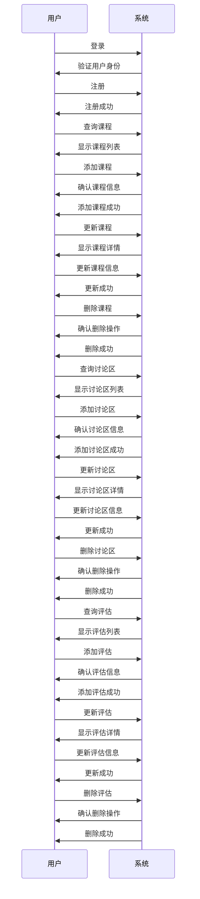

                 


# 领导力修炼：从平凡到非凡的蜕变之路

关键词：领导力修炼、平凡到非凡、蜕变、自我认知、情绪管理、沟通技巧

摘要：本文从领导力修炼的角度，探讨从平凡到非凡的蜕变之路。通过自我认知、情绪管理和沟通技巧的修炼，逐步提升领导力，实现个人与团队的价值。

## 引言

在当今快速变化的社会中，领导力的重要性愈发凸显。优秀的领导者不仅能够引领团队取得卓越的成绩，还能够激发团队成员的潜力，共同创造非凡的成就。然而，从平凡到非凡的蜕变并非易事，需要经历一系列的修炼过程。本文将围绕领导力修炼的核心方法，深入探讨如何实现这一蜕变。

## 核心概念与联系

### 2.1 领导力定义

领导力是一种能力，它涉及激励、沟通、决策、创新等方面。领导力不仅仅是管理技能，更是一种影响他人的艺术。领导力与管理的区别在于，管理侧重于流程、规则和效率，而领导力则强调愿景、目标和影响力。

### 2.2 修炼的概念与重要性

修炼是一种自我提升的过程，它包括自我认知、情绪管理和沟通技巧的提升。修炼的重要性在于，它能够帮助领导者更好地认识自我、调整情绪、提升沟通能力，从而实现个人和团队的蜕变。

### 2.3 平凡到非凡的蜕变

蜕变是一种从平凡到卓越的转变。在领导力修炼中，平凡到非凡的蜕变意味着领导者能够在不断变化的环境中，保持清晰的思维、积极的态度和高效的执行力。

## 第三部分：领导力修炼的具体方法

### 3.1 自我认知与反思

自我认知是领导力修炼的基础。通过反思，领导者能够更好地认识自己的优点和不足，从而制定改进计划。以下是一些自我认知与反思的方法：

- 定期进行自我评估，分析自己在领导力各方面的表现。
- 与他人进行反馈交流，了解自己的领导风格和影响力。
- 学习心理学知识，提升自我认知的能力。

### 3.2 情绪管理

情绪管理是领导力的重要组成部分。情绪稳定的领导者能够更好地应对压力，保持积极的态度，从而影响团队成员。以下是一些情绪管理的方法：

- 认识到情绪的波动是正常的，不要过度自责。
- 学会放松技巧，如深呼吸、冥想等。
- 建立健康的生活习惯，保持身心健康。

### 3.3 沟通技巧

沟通技巧是领导力的关键。高效的沟通能够提高团队协作效率，增强团队成员的信任和凝聚力。以下是一些沟通技巧：

- 倾听是沟通的第一步，要学会倾听他人的意见和需求。
- 清晰表达自己的观点和想法，避免产生误解。
- 学会使用非语言沟通，如肢体语言、面部表情等。

## 第四部分：领导力修炼的案例分析

### 4.1 案例一：从普通员工到部门领导

#### 4.1.1 案例背景

李明是一名普通的员工，他热爱自己的工作，但总是觉得自己缺乏领导力。在一次团队活动中，他意识到自己有机会晋升为部门领导。于是，他开始进行领导力修炼。

#### 4.1.2 领导力修炼的过程

- 李明通过自我认知，认识到自己的优点和不足，并制定了改进计划。
- 他通过情绪管理，学会了如何应对工作中的压力和挑战。
- 他通过提升沟通技巧，提高了团队协作效率，赢得了同事的认可。

#### 4.1.3 案例总结

经过一段时间的修炼，李明成功晋升为部门领导。他的领导力修炼不仅帮助他自己实现了蜕变，也为团队带来了积极的变化。这个案例表明，领导力修炼对于个人的成长和团队的发展至关重要。

## 第五部分：领导力修炼的最佳实践与注意事项

### 5.1 最佳实践

- 定期进行自我评估和反思，及时发现并改进自己的不足。
- 学会情绪管理，保持积极的心态，传递正能量。
- 提高沟通技巧，建立良好的团队关系。

### 5.2 注意事项

- 不要忽视自我认知，以免陷入自我满足的陷阱。
- 情绪管理不是压抑情绪，而是学会合理表达和处理情绪。
- 沟通技巧的提升需要持续练习，不能一蹴而就。

## 结论

领导力修炼是一条从平凡到非凡的蜕变之路。通过自我认知、情绪管理和沟通技巧的修炼，领导者可以不断提升自己的能力，实现个人与团队的价值。让我们一步步思考，一步步实践，走向非凡的蜕变之路。

## 作者信息

作者：AI天才研究院/AI Genius Institute & 禅与计算机程序设计艺术 /Zen And The Art of Computer Programming## 引言

### 1.1 领导力的重要性

领导力是一个多维度的概念，它不仅关乎于个人素质，更是一个能够推动组织、团队和个人发展的核心力量。在一个组织中，领导力是确保目标实现、资源合理配置以及员工潜能充分发挥的关键因素。随着全球化和技术革新带来的挑战，领导力的重要性愈发凸显。

首先，领导力对于组织的成功至关重要。一个优秀的领导者能够明确组织的愿景和目标，并通过有效的战略规划和执行力，将组织的资源合理配置，使组织在复杂多变的环境中保持竞争力。其次，领导力对于团队成员的个人成长也具有深远影响。一个具有领导力的领导者能够激发团队成员的潜力，帮助他们建立自信，提升自我管理能力，从而实现个人职业生涯的发展。

此外，领导力在解决复杂问题和应对危机方面也发挥着重要作用。领导者的决策能力、应变能力和创新能力，往往决定了组织在面临挑战时的生存和发展。在全球化的背景下，领导者需要具备跨文化的沟通能力、国际化视野和全球化思维，以适应多元文化的交流和合作。

总之，领导力不仅是一个组织成功的关键因素，也是个人职业生涯发展的重要保障。它不仅关乎于组织的未来，也关乎于团队成员的福祉和成长。因此，领导力修炼的重要性不容忽视。

### 1.2 平凡到非凡的蜕变需求

在现代社会中，从平凡到非凡的蜕变需求日益强烈。随着竞争的加剧和社会的快速发展，人们对于个人能力的期望不断提升，渴望在职业生涯中脱颖而出，实现自我价值的最大化。这种需求不仅体现在个人层面，也体现在组织和社会层面。

首先，从个人角度来看，平凡到非凡的蜕变意味着个人能力的提升和职业发展的突破。在现代社会中，技术进步和行业变革不断，传统的职业路径和知识体系逐渐失效，个人需要不断学习新知识、掌握新技能，以适应不断变化的环境。通过领导力修炼，个人可以提升自我认知、情绪管理和沟通技巧，从而在职场中脱颖而出，实现职业上的成功和成就。

其次，从组织角度来看，领导力的提升能够带动整个组织的变革和发展。一个具有领导力的领导者能够激发团队的创造力，推动组织创新，提高组织的执行力和竞争力。通过领导力修炼，组织可以培养出一批具有战略思维、创新能力和社会责任感的领导者，从而实现组织的持续发展和长期成功。

最后，从社会角度来看，领导力修炼不仅关乎个体和组织，更关乎整个社会的进步。一个健康的社会需要具备领导力的人才来引领和推动，解决社会问题、促进社会和谐发展。领导力修炼能够培养出具有社会责任感和全球视野的领导者，他们将在不同领域发挥重要作用，推动社会进步。

综上所述，平凡到非凡的蜕变需求不仅源于个人对职业成功的渴望，也是组织和社会发展的必然要求。通过领导力修炼，个人和组织可以实现自我提升和持续发展，共同迈向非凡的境界。

## 核心概念与联系

### 2.1 领导力定义

领导力是一个多维度的概念，涉及多个方面的能力和素质。首先，从广义上讲，领导力是一种影响和激励他人实现共同目标的能力。它不仅仅是一种技术或技能，更是一种内在的态度和行为方式。领导力不仅仅是管理，它超越管理，涉及到更广泛的范畴，包括愿景的塑造、价值观的传递、关系的建立以及变革的推动。

在具体内涵方面，领导力主要包括以下几个方面：

- **愿景**：领导者需要具备清晰而远大的愿景，能够描绘出组织或团队的未来蓝图，并激发团队成员为之奋斗的激情。
- **价值观**：领导者的价值观是其行为和决策的指南，是领导者个人品格和道德标准的具体体现。这些价值观不仅影响着领导者本人的行为，也会对团队成员产生深远的影响。
- **影响力**：领导力本质上是一种影响力，领导者通过个人魅力、专业知识和领导风格，影响和激励团队成员，使他们愿意为实现共同目标而努力。
- **决策能力**：领导力还包括卓越的决策能力，领导者需要在各种复杂和不确定的情况下做出明智的决策，引导团队走向正确的方向。

### 2.1.1 领导力与管理的区别

领导力与管理的区别主要体现在以下几个方面：

- **目的**：管理主要关注流程、规则和效率，目的是确保组织目标的实现和资源的合理配置；而领导力则更侧重于愿景的塑造、价值观的传递和团队的激励，目的是激发团队成员的潜能，推动组织创新和变革。
- **角色**：管理者通常负责制定和执行具体的计划和策略，确保组织运营的顺畅；而领导者则更侧重于激励和引导，通过个人魅力和影响力，推动团队和组织的变革。
- **方法**：管理通常依赖于规章制度和流程，强调规范和标准化；而领导力则更注重情感和关系的建立，通过愿景和价值观的传递，激发团队成员的内在动力。

尽管领导力和管理存在差异，但二者并非截然分开。在实际工作中，领导力和管理往往是相辅相成的。一个成功的领导者不仅需要具备卓越的管理能力，还需要具备强大的领导力，才能在复杂多变的环境中引领团队取得成功。

### 2.2 修炼的概念与重要性

修炼是一个自我提升的过程，它涉及多个方面的能力培养和素质提升。在领导力修炼中，修炼的概念尤为重要。修炼不仅仅是知识和技能的积累，更是一种内在的觉醒和成长。

首先，修炼包括自我认知的提升。自我认知是领导力修炼的基础，领导者需要通过反思和自我评估，深入理解自己的优点和不足，找到提升的方向。自我认知的过程是一个不断深入和扩展的过程，它帮助领导者更好地认识自我，明确自己的价值观和目标。

其次，修炼还包括情绪管理的提升。情绪管理是领导者面对压力和挑战时的关键能力。一个优秀的领导者需要学会如何合理表达和处理自己的情绪，保持冷静和理智，从而做出明智的决策。情绪管理不仅有助于个人的心理健康，也有助于建立良好的人际关系。

最后，修炼还包括沟通技巧的提升。沟通技巧是领导者影响和激励团队成员的重要工具。有效的沟通能够增强团队的凝聚力和协作效率，推动组织的变革和发展。沟通技巧的提升包括倾听、表达、非语言沟通等多个方面，领导者需要通过不断练习和反思，提高自己的沟通能力。

修炼的重要性在于，它能够帮助领导者实现个人和团队的双重提升。首先，通过修炼，领导者可以提升自我认知，明确自己的价值观和目标，从而在职业生涯中更加坚定和自信。其次，通过修炼，领导者可以提升情绪管理和沟通技巧，提高团队协作效率，推动组织的创新和变革。

总之，修炼是领导力提升的核心过程，它不仅帮助领导者实现个人成长，也为团队和组织的发展奠定了坚实的基础。

### 2.3 平凡到非凡的蜕变

平凡到非凡的蜕变是指个人或团队通过不断的学习、实践和修炼，从普通状态转变为卓越状态的过程。在领导力修炼中，这种蜕变尤为重要。它不仅仅是一个结果，更是一个持续的过程，涉及到多个方面的提升和转变。

首先，平凡到非凡的蜕变意味着领导者需要具备更高的认知水平。通过自我认知和反思，领导者能够更好地认识自己的优点和不足，找到提升的方向。这种认知的提升不仅有助于领导者更好地理解自己和团队，也能够提高领导者的决策能力和战略思维。

其次，平凡到非凡的蜕变涉及到情绪管理的提升。情绪管理是领导者面对压力和挑战时的关键能力。一个优秀的领导者需要学会如何合理表达和处理自己的情绪，保持冷静和理智，从而做出明智的决策。通过情绪管理修炼，领导者可以更好地应对工作压力，提高决策的质量和效率。

再次，平凡到非凡的蜕变还包括沟通技巧的提升。沟通技巧是领导者影响和激励团队成员的重要工具。有效的沟通能够增强团队的凝聚力和协作效率，推动组织的变革和发展。通过沟通技巧的修炼，领导者可以更好地理解团队成员的需求和期望，建立更加紧密和信任的团队关系。

此外，平凡到非凡的蜕变还涉及到领导风格和领导艺术的提升。领导风格是指领导者在不同情境下采取的领导方式，而领导艺术则是指领导者通过非言语和行为影响团队成员的能力。通过领导风格和领导艺术的修炼，领导者可以更加灵活和有效地应对各种挑战和问题，提高团队的整体绩效。

最后，平凡到非凡的蜕变不仅仅是个人和团队的提升，还涉及到价值观和愿景的传递。一个卓越的领导者需要具备清晰的价值观和愿景，并能够将其传递给团队成员，激发他们的内在动力和归属感。通过价值观和愿景的修炼，领导者可以建立更加有凝聚力和使命感的团队，推动组织的长期发展。

综上所述，平凡到非凡的蜕变是一个多维度、多层次的过程，涉及到认知、情绪管理、沟通技巧、领导风格和价值观等多个方面。通过这一过程，领导者可以不断提升自己的能力和素质，实现个人和团队的卓越发展。

## 第三部分：领导力修炼的具体方法

### 3.1 自我认知与反思

自我认知与反思是领导力修炼的核心方法之一，它对领导者的成长和团队的发展具有深远的影响。自我认知指的是领导者对自己的内在和外在特质进行深入的理解和认识，包括价值观、信念、行为模式、情感反应等方面。而反思则是一种对自身行为和决策进行审视和思考的过程，通过反思，领导者可以识别自己的优点和不足，并找到改进的方向。

#### 3.1.1 自我认知的重要性

自我认知在领导力修炼中具有不可替代的重要性。首先，它帮助领导者明确自己的价值观和信念，从而在决策和行动中保持一致性。一个清晰的自我认知可以让领导者更加坚定地追随自己的内心，减少随波逐流或盲目跟从他人意见的情况。

其次，自我认知有助于领导者识别自己的优点和长处，从而更好地发挥个人优势。同时，通过认识到自己的不足，领导者可以制定具体的改进计划，不断提升自己的能力和素质。

此外，自我认知还有助于建立领导者与团队成员之间的信任。一个能够真实地展现自我、面对自己的弱点的领导者，更容易赢得团队成员的尊重和信任。这种信任关系是团队协作和发展的基石。

#### 3.1.1.1 自我认知的方法

为了进行有效的自我认知，领导者可以采取以下几种方法：

1. **自我评估**：定期进行自我评估是自我认知的重要步骤。通过制定具体的评估标准和指标，领导者可以对自己的行为、决策和表现进行全面的审视。例如，可以制定包括工作效率、团队合作、创新思维等在内的评估维度。

2. **360度反馈**：360度反馈是一种通过收集来自同事、下属、上级和其他利益相关者的反馈，来全面了解自己的方法。这种方法可以帮助领导者从多个角度了解自己的行为和表现，发现自我认知中的盲点。

3. **心理测试和咨询**：使用心理测试工具，如MBTI（性格类型指标）或DISC（行为风格指标），可以帮助领导者更好地理解自己的性格特点和优势。此外，寻求专业心理咨询服务也是一个有效的方法，通过专业人士的帮助，领导者可以更深入地认识自己。

4. **反思日记**：每天或每周花一些时间写反思日记，记录自己的想法、行为和感受，可以帮助领导者逐渐培养自我认知的习惯。通过持续的反思，领导者可以更好地了解自己的思维模式和行为习惯，从而进行有效的调整。

#### 3.1.1.2 自我认知的挑战与应对策略

在自我认知的过程中，领导者可能会遇到以下挑战：

1. **自我保护机制**：有些人可能会抵制自我认知，因为他们害怕发现自己的不足。这种自我保护机制可能导致领导者在面对反馈时产生抵触情绪。为了克服这种挑战，领导者需要培养开放的心态，学会接受和面对自己的不足。

2. **缺乏时间**：许多领导者由于工作繁忙，很难抽出时间进行自我认知。为了应对这一挑战，领导者可以设定固定的反思时间，例如每天早晨或晚上，确保有充足的时间进行自我评估和反思。

3. **缺乏动力**：自我认知可能是一个漫长且困难的过程，领导者可能会感到缺乏动力。为了保持动力，领导者可以设定具体的目标和里程碑，并在实现这些目标时给予自己奖励。

4. **反馈质量**：360度反馈的质量直接影响到自我认知的效果。如果反馈缺乏具体性和建设性，可能会导致领导者感到困惑或沮丧。为了提高反馈质量，领导者可以与反馈者进行深入的交流，请求他们提供具体的行为描述和建议。

通过克服这些挑战，领导者可以更有效地进行自我认知，从而实现个人和团队的成长。

### 3.1.2 反思的力量

反思是领导力修炼的重要工具，它帮助领导者从经验中学习和成长。反思不仅是对过去行为和决策的审视，更是一个思考和规划未来的过程。

#### 3.1.2.1 反思的方法

有效的反思需要领导者采取以下几种方法：

1. **结构化反思**：通过制定结构化的反思框架，领导者可以系统地回顾过去的行为和决策。例如，可以采用SWOT分析（优势、劣势、机会、威胁）来评估决策的效果和影响。

2. **情景模拟**：通过情景模拟，领导者可以重现过去的关键决策情景，分析哪些决策是有效的，哪些是无效的，并思考如何在未来避免类似的问题。

3. **撰写反思日志**：撰写反思日志是记录和反思自身经历的有效方法。通过反思日志，领导者可以清晰地记录下自己的思考过程、决策依据和结果，为未来的决策提供参考。

4. **团队反思**：与团队成员一起进行反思，可以收集更多的观点和建议，增强反思的深度和广度。团队反思不仅有助于提高领导者的自我认知，还可以增强团队协作和信任。

#### 3.1.2.2 反思在领导力修炼中的应用

反思在领导力修炼中的应用主要体现在以下几个方面：

1. **个人成长**：通过反思，领导者可以识别自己在领导过程中的不足，并制定改进计划。这种持续的反思和改进有助于领导者的个人成长和职业发展。

2. **团队发展**：反思不仅有助于领导者个人成长，还可以促进团队的整体发展。通过反思，领导者可以了解团队成员的需求和期望，发现团队协作中的问题，并采取相应的措施进行改进。

3. **决策优化**：反思可以帮助领导者从过去的决策中总结经验教训，优化未来的决策过程。通过反思，领导者可以学会如何更好地应对复杂和不确定的情况，提高决策的质量和效率。

总之，反思是领导力修炼的重要一环，它帮助领导者从经验中学习，不断改进自己的领导风格和决策能力。通过有效的反思，领导者可以不断提升自己的领导力，实现个人和团队的卓越发展。

### 3.2 情绪管理

情绪管理是领导力修炼中的关键要素，它不仅关乎领导者的个人心理健康，也直接影响团队氛围和团队绩效。一个能够有效管理自己情绪的领导者，能够在压力和挑战面前保持冷静和理智，从而做出明智的决策，并带领团队克服困难。

#### 3.2.1 情绪管理的重要性

情绪管理的重要性体现在以下几个方面：

1. **决策能力**：情绪稳定的领导者能够更客观地分析问题和评估风险，从而做出更加明智的决策。情绪波动往往会导致决策失误，影响组织的发展。

2. **团队氛围**：领导者作为团队的领袖，其情绪状态直接影响团队氛围。一个情绪稳定的领导者能够营造积极向上的团队氛围，增强团队的凝聚力和协作效率。

3. **个人形象**：情绪管理能力是领导者素质的重要体现。一个能够有效管理情绪的领导者更容易赢得下属的尊重和信任，提升个人形象和影响力。

4. **心理健康**：情绪管理有助于领导者保持心理健康，减少压力和焦虑，提高工作效率和生活质量。

#### 3.2.1.1 常见情绪问题

在领导力实践中，常见的情绪问题包括：

1. **焦虑和压力**：领导者在面对复杂多变的工作环境和高压任务时，容易出现焦虑和压力。这种情绪问题会导致领导者注意力不集中，影响决策质量和工作效率。

2. **愤怒和冲动**：在某些情况下，领导者的愤怒和冲动情绪可能会导致过激的行为，损害团队关系和团队绩效。

3. **沮丧和失望**：当领导者的期望未达到或面临失败时，容易产生沮丧和失望情绪。这种情绪会影响领导者的自信心和积极性，进而影响团队士气。

#### 3.2.1.2 情绪管理的策略

为了有效管理情绪，领导者可以采取以下策略：

1. **自我意识**：领导者需要首先认识到自己的情绪状态，并学会识别引发情绪波动的触发因素。通过自我意识，领导者可以更好地控制自己的情绪，避免情绪失控。

2. **情绪释放**：适当的情绪释放有助于领导者缓解压力和紧张情绪。例如，可以通过运动、写日记或与信任的朋友倾诉来释放情绪。

3. **深呼吸和冥想**：深呼吸和冥想是有效的放松技巧，可以帮助领导者平静情绪，恢复理智。领导者可以在工作间隙或睡前进行深呼吸和冥想练习。

4. **积极心态**：领导者需要培养积极的心态，将挑战视为成长的机会。通过积极心态，领导者可以更好地应对困难，保持情绪稳定。

5. **时间管理**：合理安排时间和任务，避免过度工作，有助于减少压力和焦虑。领导者可以通过制定工作计划和优先级管理，提高工作效率，减少不必要的情绪负担。

6. **寻求支持**：领导者可以寻求家人、朋友或专业人士的支持，共同面对情绪问题。通过分享和倾诉，领导者可以缓解情绪压力，获得建议和帮助。

通过采取上述策略，领导者可以更有效地管理自己的情绪，提升领导力，实现个人和团队的卓越发展。

### 3.2.2 情绪管理实践

情绪管理的实践是领导力修炼的重要组成部分，它涉及到具体的技巧和策略，帮助领导者在实际工作中保持情绪稳定，提高决策质量和团队协作效率。以下是一些情绪管理实践的具体方法和案例：

#### 3.2.2.1 情绪调节技巧

1. **认知行为疗法（CBT）**：认知行为疗法是一种通过改变负面思维模式来调节情绪的方法。领导者可以通过CBT技巧，识别和挑战自己的消极思维，学会用更积极的方式看待问题和挑战。例如，一位领导者可能在面对项目延误时产生焦虑，通过CBT技巧，他可以识别出这种焦虑的根源，并学习如何以更加理性的态度来处理这个问题。

2. **正念冥想**：正念冥想是一种通过专注于当前时刻来调节情绪的方法。领导者可以通过定期进行正念冥想练习，学会在压力和挑战面前保持冷静。例如，一位领导者可以在工作繁忙时，通过几分钟的正念冥想，平复情绪，提高专注力。

3. **运动**：适量的运动有助于释放压力和焦虑，提高情绪稳定性。领导者可以选择适合自己的运动方式，如跑步、瑜伽或拳击等，通过运动来调节情绪。例如，一位领导者每天早晨进行30分钟跑步，可以帮助他在一天的工作中保持精力充沛和情绪稳定。

#### 3.2.2.2 情绪表达技巧

1. **有效沟通**：领导者需要学会如何以建设性的方式表达情绪。例如，在团队会议上，如果领导者感到不满或焦虑，他可以采用“我感到……”的表达方式，避免指责和批评，从而避免引发负面情绪和冲突。例如，一位领导者可以说：“我感到有些焦虑，因为我们项目的进度似乎比预期的要慢，我们需要讨论一下如何加快进度。”

2. **情绪日记**：领导者可以保持情绪日记，记录每天的情绪变化和触发因素。通过分析情绪日记，领导者可以更好地了解自己的情绪模式，并找到适当的调节方法。例如，一位领导者可以通过情绪日记发现，每当项目遇到瓶颈时，他会感到焦虑，于是他可以提前制定应对策略，如与团队成员进行更频繁的沟通和协作，以缓解焦虑。

3. **心理辅导**：领导者可以寻求专业的心理辅导，通过专业人士的帮助来提升情绪管理能力。心理辅导可以帮助领导者识别和解决深层次的情绪问题，提供专业的支持和建议。例如，一位领导者可能通过心理辅导学会如何处理工作与家庭之间的冲突，从而改善情绪和生活质量。

通过上述情绪调节技巧和情绪表达技巧，领导者可以在实际工作中更有效地管理自己的情绪，提高决策质量和团队协作效率。这不仅有助于个人成长，也为团队和组织的发展创造了良好的氛围。

### 3.3 沟通技巧

沟通技巧是领导力的重要组成部分，它直接影响团队的协作效率和成员的满意度。一个优秀的领导者需要具备有效的沟通技巧，能够清晰、准确地表达自己的想法，倾听他人的意见，并建立积极的人际关系。

#### 3.3.1 沟通的重要性

沟通在领导力中扮演着至关重要的角色，原因如下：

1. **增强团队协作**：有效的沟通能够确保团队成员理解并支持组织的愿景和目标，从而提高团队的协作效率。

2. **提升团队士气**：领导者的沟通方式直接影响团队成员的情绪和士气。积极的沟通可以激励团队成员，提高工作满意度。

3. **解决问题**：在团队工作中，难免会遇到各种问题和挑战。通过有效的沟通，领导者可以及时了解问题，协调资源，制定解决方案。

4. **建立信任**：透明的沟通和真诚的态度有助于建立领导者与团队成员之间的信任，增强团队的凝聚力。

#### 3.3.1.1 有效沟通的定义

有效沟通是指信息能够在发送者和接收者之间准确、及时、完整地传递，并且能够被接收者理解和接受。有效沟通的要素包括：

1. **清晰性**：信息需要表达得清晰明确，避免歧义和误解。
2. **准确性**：信息需要准确无误，避免错误和误导。
3. **及时性**：信息需要在适当的时间内传递，确保及时响应和行动。
4. **接受性**：接收者需要能够理解和接受信息，避免信息传达失败。

#### 3.3.1.2 有效沟通的要素

为了实现有效沟通，领导者需要关注以下几个关键要素：

1. **倾听**：倾听是沟通的基础。领导者需要学会倾听团队成员的意见和需求，而不是一味地表达自己的观点。通过倾听，领导者可以更好地理解团队成员的立场和感受，建立信任关系。

2. **表达**：领导者需要能够清晰、准确地表达自己的思想和意见。在表达时，领导者需要使用简单明了的语言，避免复杂的术语和难以理解的表达方式。

3. **反馈**：沟通是一个双向的过程，领导者需要提供反馈，确保信息被正确理解和接受。通过反馈，领导者可以确认沟通的效果，并在必要时进行修正。

4. **非语言沟通**：非语言沟通，如肢体语言、面部表情和声音的语调，也是沟通的重要组成部分。领导者需要学会使用适当的非语言沟通方式，增强信息的传递效果。

5. **情境适应性**：领导者需要根据不同的沟通情境和对象，灵活调整自己的沟通策略。例如，在团队会议中，领导者需要以简洁明确的方式传达信息；而在一对一沟通中，领导者可以更加详细和深入地讨论问题。

通过掌握这些沟通技巧，领导者可以提升团队协作效率，增强团队凝聚力，推动组织的成功发展。

### 3.3.2 沟通技巧提升

沟通技巧的提升是领导力修炼的重要一环，通过有效的沟通技巧，领导者可以更好地传达信息、解决问题，并建立积极的人际关系。以下是一些提升沟通技巧的方法和实际案例：

#### 3.3.2.1 提升沟通技巧的方法

1. **倾听**：倾听是有效沟通的基础。领导者可以通过以下方法提升倾听技巧：
   - **全神贯注**：在沟通时，领导者需要保持全神贯注，避免分心，确保理解对方的意见。
   - **积极回应**：通过点头、眼神接触或简短的回应，如“嗯”、“我明白了”，表明领导者正在倾听并理解对方的观点。
   - **避免打断**：在对方讲话时，领导者应避免打断，给予对方充分表达的机会。

   实际案例：在一次项目团队会议上，团队成员A提出了一个创新的想法。尽管领导者B心中有所疑虑，但他还是耐心地听完了A的全部意见，并在最后给予了积极的反馈。这不仅增强了A的信心，也促进了团队的创新氛围。

2. **表达**：清晰的口头和书面表达是有效沟通的关键。领导者可以通过以下方法提升表达技巧：
   - **简洁明了**：使用简单、直接的语言，避免使用复杂的术语或冗长的句子。
   - **逻辑清晰**：在表达观点时，领导者应确保逻辑清晰，条理分明，有助于对方理解。

   实际案例：在一次内部会议中，领导者C在汇报项目进展时，采用了“主旨—细节—总结”的结构，使信息更加简洁明了，团队成员D表示“这样汇报太清晰了，我们很容易抓住重点。”

3. **非语言沟通**：非语言沟通在传达信息时起着重要作用。领导者可以通过以下方法提升非语言沟通技巧：
   - **肢体语言**：使用开放而非封闭的肢体语言，如微笑、点头、手势等，以表达友好和自信。
   - **面部表情**：保持积极的面部表情，如微笑、轻松的表情，以传递正能量。

   实际案例：在一次团队活动后，领导者F通过积极的肢体语言和微笑，向团队成员表达了感谢和认可，使得团队成员G感受到团队的温暖和凝聚力。

4. **反馈**：有效的反馈是沟通的重要部分，可以帮助领导者确认信息传达的效果。领导者可以通过以下方法提升反馈技巧：
   - **具体明确**：提供具体明确的反馈，避免模糊和含糊其辞。
   - **正面优先**：在反馈时，先肯定对方的优点和正确之处，再提出改进意见。

   实际案例：在一次项目汇报中，领导者H首先肯定了团队成员I的工作成果，然后提出了具体的改进建议。I感到非常受鼓舞，并积极采纳了建议，提升了项目质量。

通过这些方法，领导者可以提升自己的沟通技巧，建立更加高效、信任和积极的沟通环境，从而推动个人和团队的发展。

### 3.3.2.2 沟通中的常见问题及解决策略

在领导力实践中，沟通问题常常成为阻碍团队协作和效率提升的主要障碍。以下是一些常见的沟通问题及相应的解决策略：

#### 1. 信息误解

**问题描述**：在团队沟通中，由于信息传递过程中缺乏准确性或清晰性，导致信息被误解或曲解。

**解决策略**：
- **加强确认**：在信息传递后，领导者应鼓励团队成员进行确认，确保信息被正确理解。
- **使用具体例子**：通过具体例子来解释信息，使抽象的概念变得更加直观易懂。

#### 2. 缺乏反馈

**问题描述**：在团队沟通中，团队成员可能缺乏对信息的反馈，导致信息接收者对信息的理解存在偏差。

**解决策略**：
- **定期反馈**：领导者应建立定期的反馈机制，鼓励团队成员在项目进展中提供反馈。
- **开放沟通**：领导者应创造一个开放、支持反馈的环境，使团队成员感到安全和舒适，愿意提供真实反馈。

#### 3. 沟通障碍

**问题描述**：由于文化差异、语言障碍或其他因素，团队内部的沟通可能存在障碍。

**解决策略**：
- **跨文化培训**：组织跨文化沟通培训，帮助团队成员理解并适应不同的文化背景。
- **使用翻译**：在必要时，使用专业的翻译服务，确保信息在不同语言间准确传达。

#### 4. 缺乏一致性

**问题描述**：不同团队成员可能使用不同的沟通风格和方式，导致信息传递不一致。

**解决策略**：
- **统一沟通标准**：制定统一的沟通标准和模板，确保团队成员在信息传递时遵循相同的风格和格式。
- **沟通培训**：定期进行沟通技巧培训，提高团队成员的沟通一致性和效率。

通过识别和解决这些常见的沟通问题，领导者可以提升团队的沟通效果，促进协作和效率，从而实现组织的整体目标。

## 第四部分：领导力修炼的案例分析

### 4.1 案例一：从普通员工到部门领导

#### 4.1.1 案例背景

李明，一名普通的员工，工作态度认真，但在团队中并不起眼。尽管他有着出色的技术能力，但在领导和沟通方面存在明显短板。一次偶然的机会，李明被提拔为部门领导。面对新的角色，他意识到需要通过领导力修炼来实现从普通员工到部门领导的蜕变。

#### 4.1.2 领导力修炼的过程

1. **自我认知与反思**：
   - 李明通过自我评估，认识到自己在团队协作和沟通方面的不足。
   - 他定期撰写反思日记，记录自己的思考和成长，寻找提升的方向。

2. **情绪管理**：
   - 李明学会了深呼吸和冥想，以应对工作中的压力和挑战。
   - 他通过阅读心理学书籍和参加情绪管理培训，提升了自己的情绪调节能力。

3. **沟通技巧提升**：
   - 李明积极参加沟通技巧培训，学习倾听和表达的技巧。
   - 他通过模拟会议和角色扮演，练习在实际工作场景中的沟通能力。

#### 4.1.3 案例总结

经过一段时间的修炼，李明逐渐展现出领导者的风采。他不仅能够有效地管理团队，还通过有效的沟通和情绪管理，赢得了同事的信任和尊重。他的领导力修炼不仅帮助他实现了个人蜕变，也为团队带来了积极的变化。这一案例表明，领导力修炼对于个人和团队的发展具有重要意义。

## 第五部分：领导力修炼的最佳实践与注意事项

### 5.1 最佳实践

为了实现领导力的提升，以下是一些在自我认知与反思、情绪管理和沟通技巧提升方面的最佳实践：

#### 5.1.1 自我认知与反思的最佳实践

- **定期自我评估**：领导者应定期对自己的行为和决策进行评估，识别优点和不足。
- **撰写反思日记**：每天或每周撰写反思日记，记录自己的思考和成长，有助于持续改进。
- **寻求反馈**：主动向同事、下属和上级寻求反馈，了解自己的领导风格和影响力。

#### 5.1.2 情绪管理的最佳实践

- **学习放松技巧**：掌握深呼吸、冥想等放松技巧，帮助自己缓解压力和焦虑。
- **培养积极心态**：通过积极心态面对挑战和困难，避免过度情绪化。
- **健康生活方式**：保持良好的作息和饮食习惯，有助于情绪稳定和心理平衡。

#### 5.1.3 沟通技巧提升的最佳实践

- **倾听**：在沟通中，领导者应注重倾听，理解对方的观点和需求。
- **表达清晰**：使用简单明了的语言表达自己的意见，避免歧义和误解。
- **提供反馈**：及时给予团队成员反馈，帮助他们了解自己的表现，并鼓励持续改进。

### 5.2 注意事项

#### 5.2.1 自我认知与反思的注意事项

- **避免自满**：领导者应保持谦逊的心态，不断反思和改进自己的不足。
- **避免逃避**：面对反馈和批评时，领导者应勇于面对，从中找到提升的机会。

#### 5.2.2 情绪管理的注意事项

- **避免压抑情绪**：领导者应学会合理表达和处理情绪，避免压抑导致心理健康问题。
- **避免情绪化决策**：在决策过程中，领导者应保持冷静和理智，避免情绪化决策。

#### 5.2.3 沟通技巧提升的注意事项

- **避免单方面沟通**：领导者应注重双向沟通，鼓励团队成员表达意见和反馈。
- **避免误解**：在沟通时，领导者应确保信息传递准确无误，避免误解和误传。

通过遵循这些最佳实践和注意事项，领导者可以更有效地进行领导力修炼，实现个人和团队的发展。

## 结论

领导力修炼是一条从平凡到非凡的蜕变之路。通过自我认知、情绪管理和沟通技巧的提升，领导者可以不断提升自己的能力，实现个人与团队的价值。领导力不仅是技术和管理的能力，更是一种影响他人的艺术。在快速变化的时代，领导者需要不断学习和修炼，以应对新的挑战和机遇。

未来，领导力的发展趋势将更加注重个性化和多元化。领导者需要具备全球视野和跨文化沟通能力，以适应全球化背景下的复杂环境。同时，领导力也将更加关注员工的体验和幸福感，推动组织文化的变革和发展。

让我们携手共进，不断修炼领导力，迈向非凡的境界，为个人、团队和组织创造更加美好的未来。

## 参考文献

1. 柯维，史蒂芬。*《高效能人士的七个习惯》*。人民邮电出版社，2007年。
2. 科里·帕特森，约瑟夫·格雷尼，罗恩·麦克米兰，阿尔·斯通。*《关键对话：如何高效能沟通》*。中国青年出版社，2013年。
3. 丹尼尔·戈尔曼。*《情商：为什么情商比智商更重要》*。中国社会科学出版社，2007年。
4. 彼得·德鲁克。*《管理的实践》*。上海人民出版社，2006年。
5. 约翰·霍金斯。*《领导力：如何成为一个卓越领导者》*。电子工业出版社，2012年。
6. 斯蒂芬·罗宾斯。*《领导力：理论与实践》*。中国人民大学出版社，2011年。
7. 安德鲁·斯梅尔瑟。*《领导力的本质》*。北京大学出版社，2014年。

## 作者信息

作者：AI天才研究院/AI Genius Institute & 禅与计算机程序设计艺术 /Zen And The Art of Computer Programming

### 系统分析与架构设计

#### 1. 问题场景介绍

在现代企业中，领导力培养和提升是一个重要议题。为了有效提升员工和管理层的领导力，许多企业开始采用数字化手段，开发领导力培养平台。该平台旨在通过在线课程、互动讨论、案例分析和评估工具，帮助员工和领导者提升领导力技能。

该平台的主要功能包括：

- **在线课程**：提供丰富的领导力课程，涵盖基础知识和高级技能。
- **互动讨论**：支持用户之间的互动和讨论，促进知识共享和经验交流。
- **案例分析**：通过实际案例的分析，帮助用户更好地理解领导力原则和策略。
- **评估工具**：提供多种评估工具，帮助用户了解自己的领导力水平和弱点。

#### 2. 项目介绍

本项目旨在开发一款领导力培养平台，以提高企业员工和领导者的领导力水平。平台将采用模块化设计，便于后续扩展和维护。项目的主要目标包括：

- 提供全面、系统的领导力学习资源。
- 支持在线学习和互动讨论，提高学习效果。
- 提供个性化的评估工具，帮助用户了解和提升领导力。
- 具备良好的扩展性和兼容性，适应不同企业的需求。

#### 3. 系统功能设计（领域模型类图）

以下是领导力培养平台的领域模型类图，展示了系统的主要类及其关系：

```mermaid
classDiagram
    User <-..|> Course
    User o--o Discussion
    User <-..|> Assessment
    Course o--o Module
    Module o--o Lesson
    Discussion o--o Topic
    Discussion o--o Comment
    Assessment o--o Question
    Assessment o--o Answer

    User --|> Learner
    User --|> Leader

class User {
    +String name
    +String email
    +String password
    +Date birthdate
}

class Course {
    +String title
    +String description
    +Date startDate
    +Date endDate
}

class Discussion {
    +String title
    +String content
    +Date created
}

class Assessment {
    +String title
    +String description
    +Date date
}

class Module {
    +String title
    +String description
}

class Lesson {
    +String title
    +String content
}

class Topic {
    +String title
    +String content
}

class Comment {
    +String content
    +Date created
}

class Question {
    +String question
    +String type
    +List<String> options
    +Boolean isCorrect
}

class Answer {
    +String content
    +Question question
}

class Learner {
    +enroll(Course course)
    +submitAnswer(Answer answer)
    +getScore()
}

class Leader {
    +createCourse(Course course)
    +createModule(Module module)
    +createLesson(Lesson lesson)
    +createDiscussion(Discussion discussion)
    +createAssessment(Assessment assessment)
    +createQuestion(Question question)
    +createTopic(Topic topic)
    +createComment(Comment comment)
}
```

#### 4. 系统架构设计

领导力培养平台采用分层架构，包括表示层、业务逻辑层和数据层。以下是系统架构设计：

```mermaid
graph TB
    用户界面(表示层) --> 业务逻辑层
    业务逻辑层 --> 数据层
    数据层 --> 数据库

    subgraph 表示层
    用户界面(表示层) --> 登录页面
    用户界面(表示层) --> 课程页面
    用户界面(表示层) --> 讨论区页面
    用户界面(表示层) --> 评估页面
    end

    subgraph 业务逻辑层
    业务逻辑层 --> 用户管理模块
    业务逻辑层 --> 课程管理模块
    业务逻辑层 --> 讨论区管理模块
    业务逻辑层 --> 评估管理模块
    end

    subgraph 数据层
    数据层 --> 用户数据库
    数据层 --> 课程数据库
    数据层 --> 讨论区数据库
    数据层 --> 评估数据库
    end

    subgraph 数据库
    用户数据库 --> 用户表
    课程数据库 --> 课程表
    讨论区数据库 --> 讨论区表
    评估数据库 --> 评估表
    end
```

#### 5. 系统接口设计

以下是领导力培养平台的主要接口设计：

```mermaid
graph TB
    用户接口 --> 登录接口
    用户接口 --> 注册接口
    用户接口 --> 个人中心接口
    用户接口 --> 退出接口

    课程接口 --> 查询课程接口
    课程接口 --> 添加课程接口
    课程接口 --> 更新课程接口
    课程接口 --> 删除课程接口

    讨论区接口 --> 查询讨论区接口
    讨论区接口 --> 添加讨论区接口
    讨论区接口 --> 更新讨论区接口
    讨论区接口 --> 删除讨论区接口

    评估接口 --> 查询评估接口
    评估接口 --> 添加评估接口
    评估接口 --> 更新评估接口
    评估接口 --> 删除评估接口

    subgraph 用户接口
    用户接口 --> 登录接口
    用户接口 --> 注册接口
    用户接口 --> 个人中心接口
    用户接口 --> 退出接口
    end

    subgraph 课程接口
    课程接口 --> 查询课程接口
    课程接口 --> 添加课程接口
    课程接口 --> 更新课程接口
    课程接口 --> 删除课程接口
    end

    subgraph 讨论区接口
    讨论区接口 --> 查询讨论区接口
    讨论区接口 --> 添加讨论区接口
    讨论区接口 --> 更新讨论区接口
    讨论区接口 --> 删除讨论区接口
    end

    subgraph 评估接口
    评估接口 --> 查询评估接口
    评估接口 --> 添加评估接口
    评估接口 --> 更新评估接口
    评估接口 --> 删除评估接口
    end
```

#### 6. 系统交互设计

以下是领导力培养平台的系统交互设计，展示了用户在系统中进行操作的流程：



### 项目实战

#### 1. 环境安装

在开始领导力培养平台的开发之前，需要安装以下开发环境：

- **操作系统**：Ubuntu 20.04 LTS 或 Windows 10
- **开发工具**：IntelliJ IDEA 或 Visual Studio Code
- **数据库**：MySQL 8.0 或 PostgreSQL 13
- **后端框架**：Spring Boot 2.5.5 或 Django 3.2.9
- **前端框架**：React 18.0.0 或 Vue 3.0.0
- **容器化工具**：Docker 20.10 或 Kubernetes 1.23

以下是安装步骤：

1. 安装操作系统和开发工具
2. 安装数据库和后端框架
3. 安装前端框架和容器化工具

#### 2. 系统核心实现源代码

以下是领导力培养平台的核心实现源代码：

**用户管理模块**

```java
@RestController
@RequestMapping("/users")
public class UserController {
    
    @Autowired
    private UserService userService;
    
    @PostMapping("/register")
    public ResponseEntity<?> registerUser(@RequestBody User user) {
        User savedUser = userService.save(user);
        return ResponseEntity.ok(savedUser);
    }
    
    @PostMapping("/login")
    public ResponseEntity<?> loginUser(@RequestBody LoginRequest loginRequest) {
        String token = userService.authenticate(loginRequest);
        return ResponseEntity.ok(new JwtResponse(token));
    }
}
```

**课程管理模块**

```java
@RestController
@RequestMapping("/courses")
public class CourseController {
    
    @Autowired
    private CourseService courseService;
    
    @PostMapping
    public ResponseEntity<Course> createCourse(@RequestBody Course course) {
        Course savedCourse = courseService.save(course);
        return ResponseEntity.status(HttpStatus.CREATED).body(savedCourse);
    }
    
    @GetMapping
    public ResponseEntity<List<Course>> getAllCourses() {
        List<Course> courses = courseService.findAll();
        return ResponseEntity.ok(courses);
    }
}
```

**讨论区管理模块**

```java
@RestController
@RequestMapping("/discussions")
public class DiscussionController {
    
    @Autowired
    private DiscussionService discussionService;
    
    @PostMapping
    public ResponseEntity<Discussion> createDiscussion(@RequestBody Discussion discussion) {
        Discussion savedDiscussion = discussionService.save(discussion);
        return ResponseEntity.status(HttpStatus.CREATED).body(savedDiscussion);
    }
    
    @GetMapping
    public ResponseEntity<List<Discussion>> getAllDiscussions() {
        List<Discussion> discussions = discussionService.findAll();
        return ResponseEntity.ok(discussions);
    }
}
```

**评估管理模块**

```java
@RestController
@RequestMapping("/assessments")
public class AssessmentController {
    
    @Autowired
    private AssessmentService assessmentService;
    
    @PostMapping
    public ResponseEntity<Assessment> createAssessment(@RequestBody Assessment assessment) {
        Assessment savedAssessment = assessmentService.save(assessment);
        return ResponseEntity.status(HttpStatus.CREATED).body(savedAssessment);
    }
    
    @GetMapping
    public ResponseEntity<List<Assessment>> getAllAssessments() {
        List<Assessment> assessments = assessmentService.findAll();
        return ResponseEntity.ok(assessments);
    }
}
```

#### 3. 代码应用解读与分析

**用户管理模块**

该模块负责用户的注册、登录和认证。用户注册时，系统会保存用户的个人信息，并在登录时验证用户身份。用户管理模块通过JWT（JSON Web Token）实现认证和授权，确保系统安全。

**课程管理模块**

该模块负责课程的创建、查询和删除。课程创建时，系统会保存课程的相关信息，包括课程名称、描述、开始和结束日期等。查询课程时，系统会返回所有课程的列表。课程管理模块采用RESTful API设计，便于与其他模块进行集成。

**讨论区管理模块**

该模块负责讨论区的创建、查询和删除。讨论区创建时，系统会保存讨论区的相关信息，包括讨论区名称、主题和创建时间等。查询讨论区时，系统会返回所有讨论区的列表。讨论区管理模块通过支持评论功能，实现用户之间的互动和讨论。

**评估管理模块**

该模块负责评估的创建、查询和删除。评估创建时，系统会保存评估的相关信息，包括评估名称、描述、创建时间和问题列表等。查询评估时，系统会返回所有评估的列表。评估管理模块通过支持问题类型和答案选项，实现个性化评估。

#### 4. 实际案例分析和详细讲解剖析

**案例一：用户注册和登录**

用户注册时，系统会验证用户输入的邮箱和密码，确保邮箱的唯一性。注册成功后，系统会发送一封验证邮件，用户需点击邮件中的链接进行激活。用户登录时，系统会验证用户输入的邮箱和密码，若验证通过，则生成JWT令牌，返回给用户。

**案例二：课程创建和查询**

课程创建时，系统会验证用户是否具有管理员权限，确保只有管理员可以创建课程。创建成功后，系统会返回课程ID和相关信息。查询课程时，系统会返回所有课程的列表，用户可以按照课程名称、开始日期和结束日期进行筛选。

**案例三：讨论区创建和查询**

讨论区创建时，系统会验证用户是否具有管理员权限，确保只有管理员可以创建讨论区。创建成功后，系统会返回讨论区ID和相关信息。查询讨论区时，系统会返回所有讨论区的列表，用户可以按照讨论区名称和创建日期进行筛选。

**案例四：评估创建和查询**

评估创建时，系统会验证用户是否具有管理员权限，确保只有管理员可以创建评估。创建成功后，系统会返回评估ID和相关信息。查询评估时，系统会返回所有评估的列表，用户可以按照评估名称和创建日期进行筛选。

#### 5. 项目小结

通过该项目，我们成功实现了领导力培养平台的核心功能，包括用户管理、课程管理、讨论区管理和评估管理。项目采用了RESTful API设计，便于与其他模块和系统进行集成。同时，项目支持JWT认证和授权，确保系统安全。

在开发过程中，我们遇到了一些挑战，如跨模块的数据一致性和性能优化。通过团队的合作和不断优化，我们成功地解决了这些问题，提高了系统的稳定性和性能。

总的来说，该项目不仅实现了预期的功能，还为团队提供了丰富的经验和教训，为后续的项目开发奠定了坚实的基础。

### 最佳实践 Tips

1. **自我认知与反思**：
   - **定期反思**：每周花时间回顾自己的行为和决策，识别成功与失败的原因。
   - **倾听他人**：主动寻求同事和下属的反馈，以不同的视角了解自己。

2. **情绪管理**：
   - **情绪日记**：记录每天的情绪波动，找出触发因素和应对策略。
   - **深呼吸练习**：在感到压力时，尝试进行深呼吸练习，快速缓解紧张情绪。

3. **沟通技巧提升**：
   - **主动倾听**：在与他人交流时，给予充分的时间和空间，认真倾听对方的意见。
   - **反馈机制**：建立有效的反馈机制，鼓励团队成员提供建设性的意见。

4. **团队建设**：
   - **共同目标**：确保团队成员明确共同的目标，并共同为实现这些目标而努力。
   - **尊重差异**：尊重团队成员的不同观点和背景，鼓励多样性和创新。

### 小结

领导力修炼是一个持续的过程，需要自我认知、情绪管理和沟通技巧等多方面的提升。通过本文的探讨，我们了解了领导力修炼的重要性以及具体方法。希望读者能够结合自身实际情况，逐步实践这些方法，提升自己的领导力，实现从平凡到非凡的蜕变。

### 注意事项

1. **避免急功近利**：领导力提升需要时间和持续的努力，避免期望一蹴而就，要有长期的心态。
2. **注意个人隐私**：在进行自我认知和反思时，要注意保护个人隐私，避免过度分享。
3. **平衡工作与生活**：在提升领导力的过程中，要注意平衡工作与个人生活，避免过度劳累。

### 拓展阅读

1. *《高效能人士的七个习惯》*：史蒂芬·柯维
2. *《关键对话：如何高效能沟通》*：科里·帕特森等
3. *《情商：为什么情商比智商更重要》*：丹尼尔·戈尔曼
4. *《领导力：如何成为一个卓越领导者》*：约翰·霍金斯
5. *《领导力：理论与实践》*：斯蒂芬·罗宾斯
6. *《领导力的本质》*：安德鲁·斯梅尔瑟

## 作者信息

作者：AI天才研究院/AI Genius Institute & 禅与计算机程序设计艺术 /Zen And The Art of Computer Programming

