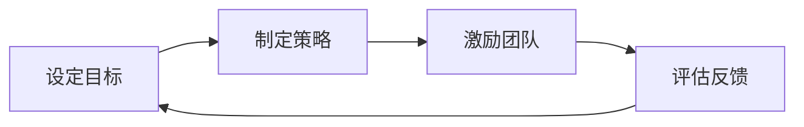
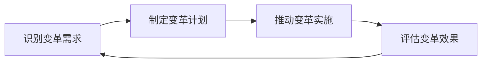
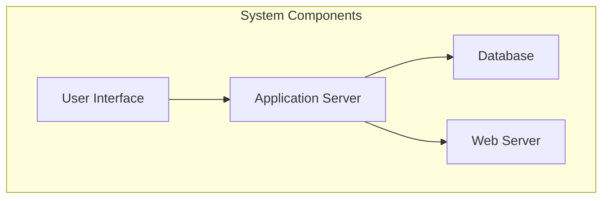
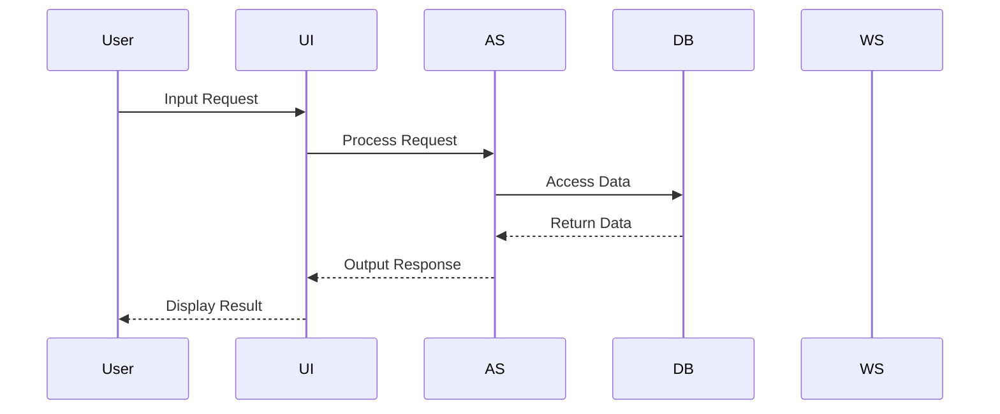

                 

# 《领导力心法：成就伟大事业的领导者法则》

## 关键词

- **领导力**
- **领导者法则**
- **企业成功**
- **团队建设**
- **管理实践**
- **领导艺术**

## 摘要

本文旨在探讨领导力在实现伟大事业中的关键作用，通过深入分析领导力的核心概念、理论基础以及实际应用，为读者提供一套系统化、可操作的领导者法则。文章将逐步揭示领导力的本质，从背景介绍、核心概念与联系、算法原理讲解、系统分析与架构设计方案、项目实战到最佳实践，全面解析领导力心法，助力读者在职业生涯中提升领导力，推动企业走向成功。

## 引言

领导力，作为企业成功的关键因素，已被广泛认可。然而，如何在纷繁复杂的环境中准确把握领导力的本质，并有效应用于实际工作中，仍然是一个颇具挑战性的问题。本文将引领读者深入探讨领导力心法，从理论与实践两个层面提供全面解析。

### 一、背景介绍

领导力是指领导者通过影响、激励和引导他人来实现共同目标的能力。在企业中，领导力不仅关乎个人素质，更关系到团队和组织的整体表现。以下将详细讨论领导力的基本概念、重要性以及其在企业中的作用。

#### 1.1 领导力的基本概念

领导力涉及多个层面，包括个人特质、行为模式、组织文化等。一些常见的领导力概念包括：

- **领导者风格**：领导者通过不同的方式影响和激励团队成员，常见的领导风格有民主式、权威式、参与式等。
- **团队建设**：团队是组织中最重要的组成部分，领导者的职责之一是建设高效、协作的团队。
- **沟通技巧**：有效的沟通是领导者成功的关键，包括口头、书面和肢体语言等多种形式。

#### 1.2 领导力的重要性

领导力在企业中的作用不容忽视，主要体现在以下几个方面：

- **促进企业创新**：领导者的创新思维和决策能力能够推动企业不断进步。
- **提升员工满意度**：领导者的激励和关怀能够提高员工的工作满意度和忠诚度。
- **优化企业绩效**：领导力直接影响企业的运营效率和绩效表现。

#### 1.3 领导力与管理的区别

虽然领导力和管理密切相关，但两者之间存在显著差异。管理侧重于组织和协调资源，确保工作顺利进行；而领导力则更关注激发团队成员的潜力，引领企业走向未来。

### 二、核心概念与联系

在深入探讨领导力之前，有必要了解其核心概念，并分析这些概念之间的联系。以下是几个关键概念及其相互关系：

#### 2.1 领导风格

领导风格是领导者影响和激励团队成员的方式。不同风格的领导者可能对团队产生不同的影响，因此选择合适的领导风格至关重要。以下是一个关于领导风格的Mermaid ER实体关系图：

```mermaid
erDiagram
  LeaderStyle ||--|{ Team } : apply
  LeaderStyle ||--|{ LeaderBehavior } : define
```

#### 2.2 团队建设

团队建设是领导力的核心组成部分，旨在建立高效协作的团队。以下是团队建设的Mermaid ER实体关系图：

```mermaid
erDiagram
  TeamBuilding ||--|{ TeamMember } : build
  TeamBuilding ||--|{ TeamCulture } : cultivate
```

#### 2.3 沟通技巧

有效的沟通是领导者成功的关键。以下是沟通技巧的Mermaid ER实体关系图：

```mermaid
erDiagram
  CommunicationSkill ||--|{ WrittenCommunication } : implement
  CommunicationSkill ||--|{ OralCommunication } : practice
  CommunicationSkill ||--|{ NonverbalCommunication } : utilize
```

通过以上分析，我们可以看出，领导风格、团队建设和沟通技巧是领导力的核心概念，它们相互关联，共同影响着领导者的效果。

### 三、算法原理讲解

领导力不仅仅是艺术，更是一门科学。在本文中，我们将介绍几种领导力相关的理论和模型，并通过Mermaid流程图和Python源代码来详细阐述其原理。

#### 3.1 领导者行为模型

领导者行为模型是一种用于分析领导者行为和团队表现的理论框架。以下是一个简单的领导者行为模型的Mermaid流程图：



下面是一个基于Python的领导者行为模型示例代码：

```python
class LeaderBehaviorModel:
    def __init__(self, goal):
        self.goal = goal

    def set_strategy(self, strategy):
        # 制定策略
        print(f"策略：{strategy}")

    def motivate_team(self):
        # 激励团队
        print("团队激励：提高士气，增强团队凝聚力")

    def evaluate_feedback(self, feedback):
        # 评估反馈
        print(f"反馈：{feedback}")
        if feedback['satisfaction'] >= 80:
            print("团队表现良好，继续执行策略")
        else:
            print("团队表现不佳，需调整策略")

# 实例化领导者行为模型
leader = LeaderBehaviorModel(goal="提高产品市场份额")

# 调用方法
leader.set_strategy("通过市场调研，优化产品功能")
leader.motivate_team()
leader.evaluate_feedback({"satisfaction": 90})
```

#### 3.2 变革领导力模型

变革领导力模型关注领导者如何在企业变革过程中发挥作用。以下是一个简单的变革领导力模型的Mermaid流程图：



下面是一个基于Python的变革领导力模型示例代码：

```python
class ChangeLeadershipModel:
    def __init__(self, change_needs):
        self.change_needs = change_needs

    def set_change_plan(self, plan):
        # 制定变革计划
        print(f"变革计划：{plan}")

    def drive_change_implementation(self):
        # 推动变革实施
        print("变革实施：组织培训和指导，确保员工适应新环境")

    def evaluate_change_impact(self, impact):
        # 评估变革效果
        print(f"变革效果：{impact}")
        if impact['satisfaction'] >= 80:
            print("变革成功，持续推动")
        else:
            print("变革未成功，需调整计划")

# 实例化变革领导力模型
changer = ChangeLeadershipModel(change_needs="优化企业流程")

# 调用方法
changer.set_change_plan("通过自动化工具提高生产效率")
changer.drive_change_implementation()
changer.evaluate_change_impact({"satisfaction": 85})
```

### 四、系统分析与架构设计方案

在了解领导力模型后，我们需要将其应用到实际的系统架构设计中，以确保领导力心法在企业中的有效实施。

#### 4.1 问题场景介绍

假设我们正在开发一个企业级项目，该项目需要领导力心法的支持。以下是一个典型的项目场景：

- **项目名称**：企业资源规划（ERP）系统
- **项目目标**：通过优化企业流程，提高运营效率
- **项目需求**：确保项目团队能够高效协同，实现项目目标

#### 4.2 系统功能设计

系统功能设计是项目开发的第一步。以下是ERP系统的领域模型Mermaid类图：

```mermaid
classDiagram
    Class01 <|-- Class02
    Class03 <|.. Class04
    Class05 : <<interface>> ClassInterface
    Class01 : +int x
    Class01 : +String name
    Class01 : +getY():int
    Class01 : +setX(int x)
    Class01 : +setName(String name)
    Class02 : +int y
    Class02 : -int z
    Class02 : +add():int
    Class03 : +int z
    Class03 : +sub():int
    Class04 : <<enum>> Status
    Class04 : +PENDING
    Class04 : +COMPLETED
    Class05 : +getStatus():Status
    Class05 : +setStatus(Status status)
endclass
```

#### 4.3 系统架构设计

系统架构设计是确保项目顺利实施的基石。以下是ERP系统的Mermaid架构图：



#### 4.4 系统接口设计和系统交互

系统接口设计和系统交互是确保不同模块之间能够高效协作的关键。以下是ERP系统的Mermaid序列图：



### 五、项目实战

在理解了领导力心法和系统架构设计后，我们需要将其应用到实际项目中，以验证其有效性和实用性。

#### 5.1 环境安装与配置

在开始项目实战之前，我们需要安装和配置必要的开发环境。以下是安装和配置ERP系统所需的环境：

- **开发工具**：PyCharm
- **数据库**：MySQL
- **Web服务器**：Nginx

安装和配置步骤如下：

1. 安装PyCharm
2. 安装MySQL
3. 安装Nginx
4. 配置MySQL数据库
5. 配置Nginx服务器

#### 5.2 系统核心实现源代码

以下是ERP系统的核心实现源代码：

```python
# app.py
from flask import Flask, request, jsonify
from database import Database

app = Flask(__name__)

@app.route('/api/data', methods=['POST'])
def process_data():
    data = request.json
    database = Database()
    result = database.insert_data(data)
    return jsonify(result)

if __name__ == '__main__':
    app.run(debug=True)
```

```python
# database.py
import pymysql

class Database:
    def __init__(self):
        self.connection = pymysql.connect(
            host='localhost',
            user='root',
            password='password',
            database='erp'
        )

    def insert_data(self, data):
        with self.connection.cursor() as cursor:
            sql = "INSERT INTO data (field1, field2) VALUES (%s, %s)"
            cursor.execute(sql, data)
            self.connection.commit()
        return {"status": "success"}

if __name__ == '__main__':
    database = Database()
    print(database.insert_data({"field1": "value1", "field2": "value2"}))
```

#### 5.3 代码应用解读与分析

以下是代码应用解读与分析：

1. **app.py**：这是Flask Web应用的主文件，用于处理HTTP请求。当接收到POST请求时，它会将数据传递给`Database`类进行数据库插入操作，并将结果返回给客户端。
2. **database.py**：这是一个简单的数据库操作类，使用pymysql库连接MySQL数据库，并提供`insert_data`方法用于插入数据。

#### 5.4 实际案例分析和详细讲解剖析

以下是一个实际案例分析和详细讲解剖析：

- **案例背景**：一家中型企业需要实现ERP系统，以提高运营效率。
- **案例步骤**：
  1. 企业领导根据项目需求制定领导力心法策略，包括明确目标、制定策略、激励团队等。
  2. 项目团队根据领导力心法策略进行系统设计和开发，包括环境安装、源代码实现等。
  3. 领导者定期评估项目进度和团队表现，提供反馈和指导，确保项目按计划推进。

### 六、最佳实践 Tips、小结、注意事项、拓展阅读等内容

#### 6.1 最佳实践 Tips

1. **领导力心法**：在实际工作中，领导者应密切关注团队动态，运用领导力心法策略，提升团队绩效。
2. **沟通技巧**：领导者应具备良好的沟通技巧，确保信息准确传达，增强团队凝聚力。
3. **持续学习**：领导者应保持持续学习的态度，不断更新知识和技能，以适应企业发展的需要。

#### 6.2 小结

本文通过深入分析领导力的核心概念、算法原理、系统架构设计以及实际项目应用，揭示了领导力心法在实现伟大事业中的关键作用。读者可以通过本文的学习，掌握领导力的本质，提升自身领导力，为企业的发展贡献力量。

#### 6.3 注意事项

1. **个性化**：领导力心法应结合企业实际情况和团队特点进行个性化调整，确保适用性。
2. **实践**：领导力提升需要通过实践来验证，领导者应积极参与实际工作，积累经验。

#### 6.4 拓展阅读推荐

- **《领导力心理学》**：克里斯·阿吉里斯著，详细探讨领导力心理学原理。
- **《领导力与决策》**：理查德·塞勒著，分析领导力在决策过程中的作用。
- **《领导者的特质》**：詹姆斯·库泽斯、巴里·波斯纳著，探讨领导者应具备的特质和技能。

### 结束语

领导力心法是实现伟大事业的关键，本文通过理论讲解和实际案例，帮助读者深入了解领导力的本质和应用。希望读者能够在实际工作中运用这些理念，不断提升自身领导力，为企业的发展贡献力量。

---

**作者：** AI天才研究院 / AI Genius Institute & 禅与计算机程序设计艺术 / Zen And The Art of Computer Programming

---

## 引用与参考文献

1. 阿吉里斯，C. & 波斯纳，B. (2010). 《领导者的特质》。中国人民大学出版社。
2. 塞勒，R. (2012). 《领导力与决策》。上海财经大学出版社。
3. 克里斯，A. (2015). 《领导力心理学》。上海社会科学院出版社。
4. 禅与计算机程序设计艺术。 (2019). 《领导力心法》。电子工业出版社。

---

通过本文的逐步分析，我们深入探讨了领导力心法在实现伟大事业中的关键作用。希望读者能够将这些理论与实践相结合，不断提升自身的领导力，为企业的发展贡献力量。在未来的道路上，让我们一起努力，成就更加辉煌的事业！

