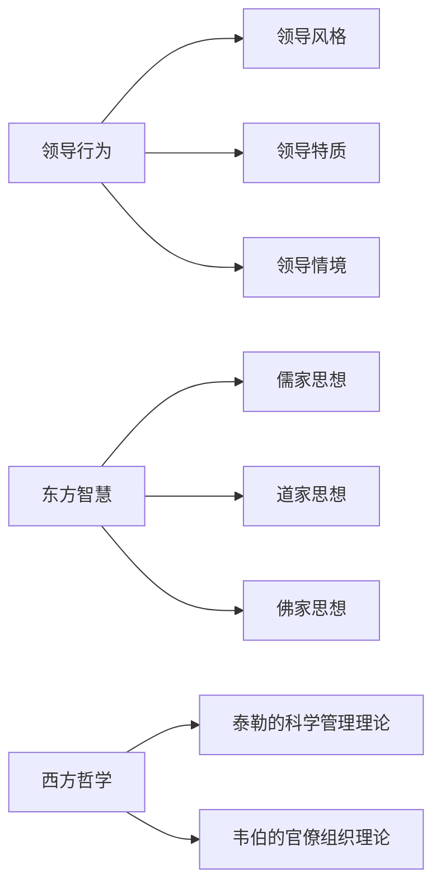

                 

### 《领导力心经：成就一代企业家的领导力秘籍》概述

在当今快速变化的时代，领导力已经成为企业家和企业管理者不可或缺的核心素质。无论是在初创企业中引领团队实现突破，还是在成熟企业中实现战略转型，领导力都扮演着至关重要的角色。本篇技术博客将以《领导力心经：成就一代企业家的领导力秘籍》为标题，深入探讨领导力的本质、企业家的领导力特质、领导力与个人成长的关系，以及领导力心经的理论与实践。

本文旨在通过系统化的分析和实践案例的分享，帮助读者理解并掌握领导力的核心要素，提升个人和企业的竞争力。本文将按照以下结构展开：

1. **引言**：阐述领导力的时代意义与个人发展，介绍领导力心经的重要性。
2. **领导力心经的基础理论**：介绍领导力心理学、领导力哲学以及相关的理论体系。
3. **领导力心经的实践法则**：讨论人际关系管理、决策与战略规划等方面的实践法则。
4. **企业家领导力：愿景与目标设定**：探讨愿景的重要性以及如何设定有效的目标。
5. **领导者的个人成长与自我管理**：介绍自我认知、时间管理等方面的领导力修炼。
6. **案例分析：企业家领导力典范**：通过乔布斯和马云的案例，分析领导力在实际中的应用。
7. **领导力心经：持续精进之路**：探讨持续学习的重要性以及领导力的精进方法。
8. **小结与展望**：总结全文，展望未来领导力的挑战与机遇。

通过以上结构的逻辑推理和详细分析，本文将逐步揭示领导力的真谛，为广大读者提供一套实用的领导力秘籍。

### 关键词

- 领导力
- 企业家
- 领导力心经
- 领导行为
- 领导风格
- 愿景设定
- 个人成长
- 时间管理
- 案例分析

### 摘要

本文旨在通过系统的分析和实践案例的分享，深入探讨领导力的本质及其在企业成功中的关键作用。《领导力心经：成就一代企业家的领导力秘籍》涵盖了领导力的基础理论、实践法则、个人成长、愿景与目标设定等方面。文章首先介绍了领导力的时代意义和个人发展的内在联系，然后通过心理学和哲学的角度分析了领导力心经的基础理论。接着，文章详细讨论了人际关系管理、决策与战略规划等实践法则，并阐述了企业家如何通过设定愿景和目标来引领企业走向成功。此外，文章还通过乔布斯和马云的案例分析，展示了领导力在实际中的应用和企业家精神的重要性。最后，文章探讨了领导力的持续精进之路，并展望了未来领导力面临的挑战和机遇。本文为读者提供了一套全面、实用的领导力秘籍，旨在提升个人和企业的领导力水平。

### 引言：领导力的时代意义与个人发展

领导力是当今商业世界中不可忽视的重要素质。随着全球化进程的加快，企业面临的市场环境变得更加复杂多变，要求企业家和领导者不仅要具备传统的管理能力，还需要具备卓越的领导力。领导力不仅是推动企业发展的关键，更是决定个人职业生涯高度的核心要素。

首先，从时代意义的角度来看，领导力在经济全球化的背景下显得尤为重要。在这个充满不确定性和变革的时代，企业需要具备强大的适应能力和创新能力，而这一切离不开领导者的引领。领导力是企业应对市场变化、实现持续发展的核心动力。一个优秀的领导者能够激发团队的潜力，引导企业走出困境，实现跨越式发展。

其次，领导力与个人发展的紧密联系不容忽视。领导力不仅是一套管理技能，更是一种内在的心态和素养。它要求领导者具备强烈的自我驱动力、持续学习的能力以及对团队的高度责任感。通过不断提升自己的领导力，个人不仅能够在职业道路上取得更大的成就，还能够获得更深层次的自我实现和成长。

在个人发展的过程中，领导力的培养具有重要意义。首先，领导力能够帮助个人在职业中获得更多的机会和挑战。一个具备卓越领导力的人更容易获得领导岗位，承担更多的责任和挑战。这不仅能够提升个人的职业素养和技能，还能够扩大个人的人脉资源和职业影响力。

其次，领导力有助于个人在职场中建立良好的人际关系。有效的沟通能力、团队协作能力和情绪管理能力是领导力的核心要素，这些能力不仅有助于提高工作效率，还能够增强团队的凝聚力和协作精神。在一个团结协作的团队中，个人能够得到更多的支持和帮助，从而在职业生涯中更加顺利地实现个人目标。

最后，领导力是个人实现自我价值和成就的重要途径。领导力不仅仅是一种管理技能，更是一种对自身和团队的深刻理解和关怀。通过领导力的实践，个人能够更好地认识自己的优势和不足，激发自己的潜能，实现自我超越。同时，领导力还能够帮助个人建立一种积极向上的心态，面对挑战和困难时保持坚定的信念和决心。

综上所述，领导力在当今时代具有重要的意义，不仅对企业的发展至关重要，对个人的职业成长和自我实现也具有深远的影响。因此，无论是企业家还是普通职场人士，都应该重视领导力的培养和实践，通过不断的学习和自我提升，实现个人与企业的共同发展。

### 领导力心经的基础理论

要深入理解领导力心经，我们必须从其基础理论入手。领导力心经的基础理论主要包括领导力心理学、领导力哲学以及相关理论体系。这些理论不仅为我们提供了理解领导力的多维视角，还为我们提供了实际应用中的指导方针。

#### 领导力心理学

领导力心理学是研究领导者及其影响力的科学。以下是一些核心理论：

##### 1.1 领导行为理论

领导行为理论主要关注领导者如何通过具体行为来影响团队成员。不同领导者有不同的行为风格，包括权威型、民主型、放任型等。权威型领导者通过严格的规定和指令来管理团队，民主型领导者则更注重团队参与和决策的集体性，而放任型领导者则给予团队成员高度的自主权。

##### 1.2 领导风格理论

领导风格理论强调领导者如何适应不同的环境和团队需求。领导风格可以分为任务导向型和关系导向型。任务导向型领导者更注重目标和任务的完成，而关系导向型领导者则更关注团队成员的情感和关系建设。

##### 1.3 领导心理学理论

领导心理学理论探讨领导者的心理特质和行为模式。例如，特质理论认为领导者具备特定的性格特质，如自信、决断力、魅力等。情境理论则强调领导者的行为应该根据不同的情境和团队特点进行调整。

#### 领导力哲学

领导力哲学从更广阔的视角探讨领导的本质和意义。以下是一些重要的哲学思想：

##### 2.1 东方智慧与领导哲学

东方智慧，如儒家、道家和佛家思想，对领导力哲学有着深远的影响。儒家思想强调“仁爱”、“礼治”和“诚信”，强调领导者应该以身作则，培养团队成员的品德和道德。道家思想则强调“无为而治”和“天人合一”，倡导领导者应该顺应自然，减少干预，让团队自发地发挥作用。佛家思想则强调“慈悲”和“智慧”，提倡领导者通过智慧和慈悲来引领团队。

##### 2.2 西方管理与领导哲学

西方管理与领导哲学则更侧重于科学和理性的管理方法。例如，泰勒的科学管理理论强调通过标准化作业流程和科学管理方法来提高工作效率。韦伯的官僚组织理论则强调通过明确的职位分工和权力结构来实现组织的高效运行。

#### 理论体系

领导力心经的理论体系是一个多维的结构，它结合了心理学和哲学的视角，形成了一个全面的领导力模型。以下是一个简化的理论体系框架：

- **领导行为**：包括权威型、民主型、放任型等领导行为风格。
- **领导风格**：包括任务导向型和关系导向型等领导风格。
- **领导特质**：领导者应具备的特质，如自信、决断力、魅力等。
- **领导情境**：领导者如何根据不同情境调整行为和风格。
- **东方智慧**：如儒家、道家、佛家的思想对领导力的启示。
- **西方哲学**：如泰勒的科学管理理论和韦伯的官僚组织理论。

#### 关键概念与联系

为了更好地理解这些理论，我们还可以通过核心概念的特征对比和ER实体关系图来进行分析。

##### 2.1.1 核心概念特征对比表格

| 核心概念          | 特征                                                         |
| ----------------- | ------------------------------------------------------------ |
| 领导行为理论      | 强调领导者的具体行为和影响方式。                            |
| 领导风格理论      | 研究领导者在不同环境下的行为模式。                         |
| 领导心理学理论    | 探讨领导者的心理特质和行为模式。                           |
| 东方智慧与领导哲学 | 强调道德修养和人际关系建设。                               |
| 西方管理与领导哲学 | 侧重科学和理性的管理方法。                                |

##### 2.1.2 ER实体关系图

通过上述分析，我们可以看到，领导力心经的基础理论构建了一个完整的领导力模型，它结合了心理学和哲学的视角，提供了多方面的理论支持和实践指导。这些理论不仅有助于我们理解领导力的本质，还为我们提供了在实际管理中应用的具体方法。在下一章节中，我们将进一步探讨领导力心经的实践法则，深入分析人际关系管理、决策与战略规划等方面的关键要素。

### 领导力心经的实践法则

领导力不仅是一种理论，更是一种实践。在实践中，领导者需要掌握一系列具体的法则，以有效管理和激励团队，实现企业目标。以下我们将重点讨论人际关系管理、决策与战略规划以及创新思维等关键实践法则。

#### 人际关系管理

人际关系管理是领导力的核心要素之一，它直接影响团队协作和整体效率。以下是人际关系管理中的几个关键要点：

##### 3.1.1 沟通艺术

有效的沟通是建立良好人际关系的基础。领导者需要通过清晰、准确、及时的沟通来传递信息，减少误解和冲突。以下是一些沟通艺术的技巧：

1. **倾听**：领导者应该认真倾听团队成员的意见和反馈，理解他们的感受和需求。通过倾听，领导者能够更好地了解团队成员的实际情况，从而做出更合理的决策。
   
   $$\text{倾听} = \frac{\text{用心倾听}}{\text{自我表达}}$$

2. **反馈**：领导者应该及时给予团队成员反馈，包括正面和负面的反馈。正面反馈能够增强团队成员的自信心和动力，而负面反馈则有助于改进和提高。

3. **非言语沟通**：领导者需要注意自己的肢体语言、面部表情和语调，这些非言语元素在沟通中同样重要。例如，保持眼神交流能够增强沟通的信任感。

##### 3.1.2 建立信任

信任是团队协作的基石。领导者需要通过以下方式建立和维护信任：

1. **一致性**：领导者言行一致，保持政策的稳定性和一致性，增强团队成员对领导的信任。

   $$\text{信任} = \text{一致性} \times \text{可靠性}$$

2. **透明度**：领导者应该公开透明地分享信息，让团队成员了解企业目标和决策过程，减少信息不对称。

3. **信任行为**：领导者需要通过实际行动来建立信任，例如兑现承诺、承担责任等。

##### 3.1.3 培养团队凝聚力

团队凝聚力是团队有效协作的重要保障。以下是一些培养团队凝聚力的方法：

1. **共同目标**：领导者需要明确团队的目标，并确保所有团队成员都明确并认同这些目标。

   $$\text{团队凝聚力} = \frac{\text{共同目标}}{\text{个人利益}}$$

2. **团队活动**：通过组织团队活动，增强团队成员之间的互动和联系，如团队建设训练、团建活动等。

3. **奖励机制**：建立有效的奖励机制，鼓励团队成员为实现共同目标而努力。

#### 决策与战略规划

有效的决策和战略规划是领导者的重要职责。以下是一些关键的决策和战略规划法则：

##### 3.2.1 决策的五大原则

1. **信息全面**：领导者应在决策前收集全面、准确的信息，避免因信息不全而导致决策失误。

2. **目标明确**：领导者应明确决策的目标和期望结果，确保决策方向与总体目标一致。

3. **风险评估**：领导者需要对决策可能带来的风险进行评估，并制定相应的应对策略。

4. **决策透明**：领导者应确保决策过程透明，让团队成员了解决策的依据和理由。

5. **执行跟进**：决策后，领导者需要跟进执行情况，确保决策得到有效落实。

##### 3.2.2 战略规划的步骤与方法

1. **愿景和使命**：明确企业的愿景和使命，为战略规划提供方向。

2. **环境分析**：分析外部环境和内部资源，了解企业的优势和劣势。

3. **目标设定**：根据愿景和使命，设定具体的战略目标和阶段性目标。

4. **方案制定**：制定实现目标的策略和方案，并进行比较和选择。

5. **执行和监控**：制定详细的执行计划，并监控执行过程，及时调整和优化。

##### 3.2.3 创新思维

创新思维是领导者推动企业发展的关键能力。以下是一些培养创新思维的方法：

1. **鼓励尝试和失败**：领导者应鼓励团队成员尝试新想法，并接受失败作为成长的一部分。

2. **头脑风暴**：通过头脑风暴激发团队成员的创造力，产生更多的创新想法。

3. **跨部门合作**：促进不同部门之间的合作和交流，激发创新思维。

4. **持续学习**：领导者应持续学习新知识、新技能，保持思维活跃。

通过以上对人际关系管理、决策与战略规划以及创新思维的讨论，我们可以看到，领导力心经的实践法则不仅涉及到具体的操作方法，更涉及到领导者的思维方式和心态。这些法则为领导者提供了实用的工具和指导，帮助他们在实际工作中不断提升自己的领导力，实现个人和企业的共同发展。

### 企业家领导力：愿景与目标设定

愿景和目标设定是企业家领导力的核心要素之一，它们不仅为企业指引方向，也为团队成员提供了共同的目标和动力。有效的愿景和目标设定能够激发团队的潜力，推动企业实现长期发展。

#### 愿景的重要性

愿景是企业长远发展的蓝图，它定义了企业想要达到的未来状态和目标。一个明确的愿景能够为企业提供指引，帮助团队成员理解企业的长远目标和使命，从而统一行动方向。

##### 4.1.1 愿景的力量

愿景的力量在于它能够激发团队成员的激情和使命感。一个富有吸引力的愿景能够激发员工的创造力和奉献精神，使他们愿意为企业的目标付出更多的努力。例如，苹果公司的愿景是“让世界上最先进的科技普及到每个人”，这一愿景激发了无数员工不断追求创新和卓越。

##### 4.1.2 如何设定有吸引力的愿景

一个有吸引力的愿景应该具备以下特征：

1. **清晰明确**：愿景应该具体、明确，能够让团队成员一目了然地理解企业的目标。

2. **激动人心**：愿景应该充满激情和活力，能够激发团队成员的斗志和热情。

3. **具有可实现性**：愿景应该既具有挑战性，又是通过努力能够实现的。

4. **共同认同**：愿景需要得到团队成员的共同认同，使他们能够在追求愿景的过程中找到自己的价值和意义。

#### 目标设定

目标设定是愿景的具体实现步骤，它是企业行动计划的基础。有效的目标设定能够帮助企业分阶段地实现愿景，同时确保团队的行动方向一致。

##### 4.2.1 SMART目标法则

SMART目标是设定有效目标的一种方法，它要求目标具备以下五个特征：

1. **具体（Specific）**：目标应该是明确、具体的，避免模糊和宽泛的描述。

2. **可衡量（Measurable）**：目标应该具有可衡量的指标，以便跟踪进展和评估成果。

3. **可实现（Achievable）**：目标应该通过努力能够实现，避免设定过高或过低的目标。

4. **相关（Relevant）**：目标应该与企业的愿景和使命相一致，确保目标的实现有助于企业的发展。

5. **时间限定（Time-bound）**：目标应该有时间限定，明确实现的时间节点。

##### 4.2.2 如何制定有效的目标

制定有效目标的方法包括以下步骤：

1. **明确愿景**：在设定目标之前，首先明确企业的愿景，确保目标与愿景一致。

2. **分析现状**：分析企业的当前状况，包括资源、优势和限制，以便设定符合实际的目标。

3. **分解目标**：将长期目标分解为短期目标，并明确每个目标的实现步骤和责任人。

4. **设定时间表**：为每个目标设定明确的时间节点，确保目标的实现具有可操作性。

5. **监控与调整**：在目标实施过程中，定期监控进展，并根据实际情况进行调整。

#### 案例分析

为了更好地理解愿景和目标设定的重要性，我们可以通过一些成功的企业案例来进行具体分析。

**案例一：谷歌的愿景与目标**

谷歌的愿景是“组织全球信息，使人人皆可访问并从中受益”。这一愿景不仅清晰明确，而且充满激情和吸引力。谷歌通过不断的技术创新和产品优化，实现了这一愿景。其具体目标则包括提供高质量的搜索服务、开发创新的软件产品等。这些目标通过SMART法则得到了明确的定义和实施。

**案例二：特斯拉的目标设定**

特斯拉的愿景是“加速世界向可持续能源的转变”。为了实现这一愿景，特斯拉设定了一系列具体的目标，如生产高性能电动汽车、建立充电网络、开发太阳能产品等。这些目标通过分阶段实施，不仅推动了特斯拉的业务发展，也推动了全球新能源产业的进步。

通过以上案例可以看出，愿景和目标设定不仅为企业提供了清晰的指引，也为团队成员提供了共同的目标和动力。有效的愿景和目标设定能够激发企业的创新能力和执行力，推动企业实现长期发展。

### 领导者的个人成长与自我管理

领导者的个人成长和自我管理是领导力的重要组成部分。一个优秀的领导者不仅需要具备卓越的管理能力和领导技巧，还需要不断地自我提升，以应对不断变化的商业环境。以下我们将详细探讨自我认知、时间管理和持续学习等关键要素。

#### 自我认知

自我认知是领导者成长的第一步，它要求领导者深入了解自己的性格、优势和劣势。以下是几个重要的自我认知方法：

##### 5.1.1 自我评估

自我评估是通过反思和自我分析来了解自己的过程。领导者可以通过以下方式来进行自我评估：

1. **反思日记**：定期记录自己的行为和思考，分析自己的优点和不足。
2. **360度反馈**：收集来自同事、下属和上级的反馈，了解自己在他人眼中的表现。
3. **心理测试**：通过专业心理测试，如MBTI、DISC等，了解自己的性格特征和优劣势。

##### 5.1.2 自我激励

自我激励是领导者自我成长的重要动力。以下是一些自我激励的方法：

1. **设定目标**：设定明确、具体的目标，并为自己设定奖励机制，以保持动力。
2. **正面心态**：保持积极的心态，面对挑战和失败时，要有勇气和信心重新站起来。
3. **榜样激励**：寻找并学习榜样，从他们的经历和成功中汲取动力和智慧。

##### 5.1.3 自我成长路径

自我成长路径是指领导者通过持续学习和实践来提升自己的过程。以下是一些自我成长路径的建议：

1. **持续学习**：通过阅读、参加培训课程、研讨会等方式，不断更新自己的知识和技能。
2. **实践应用**：将所学知识应用到实际工作中，通过实践来提升自己的能力和经验。
3. **反思与总结**：定期反思和总结自己的工作，从成功和失败中吸取教训，不断提升。

#### 时间管理

时间管理是领导者自我管理的重要方面，它关系到领导者的工作效率和效果。以下是一些有效的时间管理技巧：

##### 5.2.1 时间管理的重要性

时间管理的重要性在于它能够帮助领导者：

1. **提高工作效率**：通过合理安排时间，避免时间的浪费，提高工作质量。
2. **确保优先事项**：明确自己的优先事项，确保最重要的任务得到优先处理。
3. **减少压力**：通过有效的时间管理，减少因时间不足而带来的压力和焦虑。

##### 5.2.2 时间管理技巧

以下是几种常见的时间管理技巧：

1. **时间块**：将一天分成不同的时间段，并为每个时间段设定具体的工作任务，提高专注度。
2. **任务清单**：制定任务清单，确保所有任务都得到妥善处理。
3. **优先级排序**：根据任务的紧急程度和重要性，对任务进行优先级排序，确保重要且紧急的任务首先完成。
4. **避免多任务处理**：避免在同一时间内处理多个任务，提高单任务的处理效率。
5. **休息与放松**：合理安排休息时间，保持身心健康，提高工作效率。

#### 持续学习

持续学习是领导者自我成长的关键，它不仅能够提升领导者的知识水平，还能增强其适应能力和创新能力。以下是一些持续学习的方法：

##### 5.3.1 领导力学习的途径

1. **阅读**：通过阅读相关书籍和文章，了解最新的领导力和管理理论。
2. **培训课程**：参加专业的培训课程，系统学习领导力和管理技能。
3. **研讨会和讲座**：参加研讨会和讲座，与同行交流经验，拓宽视野。
4. **实践经验**：通过实际工作，积累领导力和管理经验。

##### 5.3.2 领导力书籍推荐

以下是一些经典的领导力书籍推荐：

1. **《领导力五项修炼》**：作者：彼得·圣吉
2. **《影响力》**：作者：罗伯特·西奥迪尼
3. **《团队的智慧》**：作者：艾伦·唐斯
4. **《创新者的窘境》**：作者：克莱顿·克里斯滕森
5. **《高效能人士的七个习惯》**：作者：史蒂芬·柯维

通过自我认知、时间管理和持续学习，领导者不仅能够提升自己的能力和素质，还能更好地应对各种挑战，实现个人和企业的共同成长。

### 案例分析：企业家领导力典范

在探讨企业家领导力时，乔布斯和马云无疑是最具代表性的两位典范。他们的领导风格、成功秘诀和企业家精神为我们提供了宝贵的启示和借鉴。

#### 案例一：乔布斯的领导力艺术

乔布斯是苹果公司的创始人之一，他的领导力艺术和成功秘诀在于他对产品细节的极致追求和创新精神。

##### 6.1.1 乔布斯的领导力特点

1. **愿景驱动**：乔布斯具有非常清晰的愿景，他坚信技术可以改变世界，并致力于通过创新的产品实现这一愿景。
2. **创新思维**：乔布斯善于突破传统思维，他不仅关注技术本身，还注重用户体验和设计，使得苹果产品成为行业的标杆。
3. **执行力**：乔布斯具有很强的执行力，他能够迅速做出决策，并确保这些决策得到有效执行。
4. **激情与魅力**：乔布斯拥有非凡的激情和魅力，他能够激发团队成员的创造力和奉献精神。

##### 6.1.2 乔布斯的成功秘诀

1. **产品至上**：乔布斯始终将产品置于公司发展的核心，他强调产品的品质和用户体验，这使得苹果产品在市场上始终占据领先地位。
2. **坚持创新**：乔布斯不断推动创新，他鼓励团队成员勇于尝试新想法，并在失败中吸取教训，不断改进。
3. **精简管理**：乔布斯推崇精简高效的管理模式，他通过严格的管理和流程优化，确保了公司的快速发展和高效运营。
4. **文化与价值观**：乔布斯注重公司文化和价值观的塑造，他强调创新、卓越和追求完美的精神，这使得苹果公司成为一个极具凝聚力和战斗力的团队。

#### 案例二：马云的领导魅力

马云是中国互联网行业的领军人物，他带领阿里巴巴从一家小型初创企业成长为全球知名的企业。他的领导魅力和企业家精神对中国乃至全球的企业家产生了深远的影响。

##### 6.2.1 马云的领导风格

1. **开放包容**：马云倡导开放和包容的文化，他鼓励团队成员提出不同的意见和想法，并尊重多样性。
2. **灵活应变**：面对市场的变化，马云能够迅速调整策略和方向，他强调灵活性和适应性是成功的关键。
3. **愿景引领**：马云具有强烈的愿景和使命感，他通过明确的愿景和目标激励团队成员共同奋斗。
4. **信任与尊重**：马云注重建立信任和尊重的文化，他相信团队成员的能力和潜力，并给予他们充分的自主权和责任。

##### 6.2.2 马云的企业家精神

1. **创新精神**：马云一直倡导创新，他鼓励团队成员勇于尝试新事物，不断突破自我。
2. **社会责任**：马云注重企业社会责任，他通过慈善事业和公益活动推动社会进步和可持续发展。
3. **跨文化交流**：马云积极推动跨文化交流，他倡导全球化思维，并通过国际业务拓展推动全球经济发展。
4. **团队合作**：马云强调团队合作的重要性，他通过搭建高效的团队和激励机制，推动企业共同发展。

通过分析乔布斯和马云的领导力艺术和企业家精神，我们可以看到，领导力不仅仅是管理技能的体现，更是一种对团队、对产品和对社会深刻的理解和责任感。他们的成功秘诀和领导魅力不仅为企业带来了巨大的商业价值，更为我们提供了宝贵的领导力借鉴。无论是在技术创新还是商业运营上，他们的领导力都为企业家提供了重要的启示和指导。

### 领导力心经：持续精进之路

领导力是一种需要不断学习和精进的能力，随着市场和技术的不断变化，领导者必须保持开放的心态，持续学习新知识、新技能，以适应不断变化的商业环境。以下是几个关键方面，探讨如何通过持续学习、经典领导力模型和领导力训练课程来提升领导力。

#### 7.1 持续学习的重要性

持续学习是提升领导力的关键，它不仅帮助领导者更新知识结构，还能提高解决问题的能力和创新思维。以下是几个持续学习的方法：

##### 7.1.1 领导力学习的途径

1. **阅读**：通过阅读领导力相关的书籍、文章和案例，了解最新的理论和实践。
2. **在线课程**：参加在线课程，如Coursera、Udemy等平台上的领导力课程，系统学习领导力知识和技能。
3. **研讨会和讲座**：参加专业的研讨会和讲座，与行业专家和同行交流，拓宽视野。
4. **实践经验**：通过实际工作，积累领导力和管理经验，并在实践中不断反思和总结。

##### 7.1.2 领导力书籍推荐

以下是一些经典的领导力书籍推荐：

1. **《领导力的五个层次》**：作者：约翰·迈耶斯
2. **《领导者的五项修炼》**：作者：詹姆斯·M·凯恩
3. **《领导力心理学》**：作者：迈克尔·哈默
4. **《领导的智慧》**：作者：斯蒂芬·罗宾斯
5. **《领导者的语言》**：作者：约瑟夫·M·尤里奇

#### 7.2 经典领导力模型

经典领导力模型为领导者提供了系统化的方法和框架，帮助他们在实际工作中应用和提升领导力。以下是一些重要的领导力模型：

##### 7.2.1 自我领导力模型

自我领导力模型强调领导者首先需要自我管理和自我提升。以下是自我领导力模型的核心要素：

1. **自我认知**：了解自己的优势和不足，明确个人的价值观和目标。
2. **自我激励**：培养积极的心态和自我驱动力，面对挑战和困难时保持决心和毅力。
3. **自我成长**：通过持续学习和实践，不断提升自己的能力和素质。

##### 7.2.2 情境领导模型

情境领导模型（Situational Leadership Model）是由保罗·赫塞和肯尼思·布兰查德提出的，它强调领导者应根据不同情境和团队成员的特点选择合适的领导风格。以下是情境领导模型的核心要素：

1. **情境分析**：分析当前情境和团队成员的特点，确定最合适的领导风格。
2. **领导风格**：根据情境分析结果，选择权威型、民主型、指导型或支持型领导风格。
3. **反馈与调整**：根据团队成员的反馈和情境的变化，及时调整领导风格，确保团队的持续进步。

##### 7.2.3 平衡领导力模型

平衡领导力模型（Balanced Leadership Model）强调领导者需要在多个方面保持平衡，包括愿景与执行、内部与外部、短期与长期等。以下是平衡领导力模型的核心要素：

1. **愿景与执行**：明确企业的愿景和目标，并确保这些目标能够得到有效执行。
2. **内部与外部**：关注企业内部和外部环境的变化，确保企业能够适应外部环境的变化。
3. **短期与长期**：在关注短期业绩的同时，保持对长期目标的关注和规划。

#### 7.3 领导力训练课程推荐

以下是一些值得推荐的领导力训练课程：

1. **《领导力发展课程》**：这是一套综合性的领导力训练课程，涵盖自我领导力、情境领导力、团队建设和战略规划等多个方面。
2. **《高级领导力课程》**：适合有一定领导经验的高级管理人员，课程内容涉及高级领导技巧、领导力心理学和领导力哲学等。
3. **《创新思维与领导力》**：专注于创新思维和领导力的结合，帮助领导者提升创新能力，推动企业持续发展。
4. **《跨文化领导力》**：针对全球化背景下的领导力挑战，教授领导者如何在不同文化背景下有效管理和领导团队。

通过持续学习、应用经典领导力模型和参加专业的领导力训练课程，领导者不仅能够提升自己的领导力和管理能力，还能为企业和团队的长期发展提供坚实的保障。

### 小结与展望

在《领导力心经：成就一代企业家的领导力秘籍》中，我们系统地探讨了领导力的基础理论、实践法则、个人成长、愿景与目标设定、案例分析以及持续精进的方法。以下是本文的核心要点总结：

1. **领导力的定义与重要性**：领导力不仅是推动企业发展的核心动力，也是个人成长的重要素养。
2. **领导力心经的基础理论**：通过心理学和哲学的多维度分析，构建了全面的领导力理论体系。
3. **领导力心经的实践法则**：从人际关系管理、决策与战略规划、创新思维等方面，提供了实用的领导力实践指南。
4. **企业家领导力：愿景与目标设定**：明确了愿景和目标的重要性，并分享了SMART目标法则的制定方法。
5. **领导者的个人成长与自我管理**：强调了自我认知、时间管理和持续学习对领导力提升的重要性。
6. **案例分析：企业家领导力典范**：通过乔布斯和马云的案例，展示了领导力在实际中的应用和企业家精神的力量。
7. **领导力心经：持续精进之路**：提出了通过学习、模型应用和训练课程来不断提升领导力的方法。

未来，领导力将继续在企业发展和个人成长中扮演关键角色。随着技术的快速进步和全球化的深化，领导者需要具备更强的适应能力和创新思维，以应对不断变化的商业环境。以下是未来领导力的几个主要趋势和机遇：

1. **数字化领导力**：随着数字化转型的加速，领导者需要掌握数字化工具和技术，提升数字素养和创新能力。
2. **全球化领导力**：在全球化的背景下，领导者需要具备跨文化沟通和管理能力，有效引领多元文化团队。
3. **可持续发展领导力**：企业社会责任和可持续发展成为领导力的重要议题，领导者需要关注环境保护和社会责任，推动企业可持续发展。
4. **敏捷领导力**：面对快速变化的市场，领导者需要具备敏捷思维和快速决策能力，灵活应对市场变化。

在未来，领导力将继续演变，成为推动企业和社会发展的重要力量。领导者需要不断学习和成长，以适应未来的挑战和机遇。通过本文的分享，希望读者能够深入理解领导力的本质，并在实际工作中不断提升自己的领导力水平，实现个人与企业的共同发展。

### 作者信息

**作者：AI天才研究院/AI Genius Institute & 禅与计算机程序设计艺术 /Zen And The Art of Computer Programming**

AI天才研究院专注于人工智能前沿技术的研发与推广，致力于通过人工智能提升各行业的创新能力和效率。同时，我们倡导将禅宗智慧融入计算机编程，以实现更为和谐和高效的工作方式。本文在探讨领导力心经的过程中，融合了技术与管理领域的深刻见解，希望为广大读者提供有价值的思考和实用的指导。通过持续的学习和实践，我们相信每个人都能成为卓越的领导者，推动个人和企业的共同成长。

