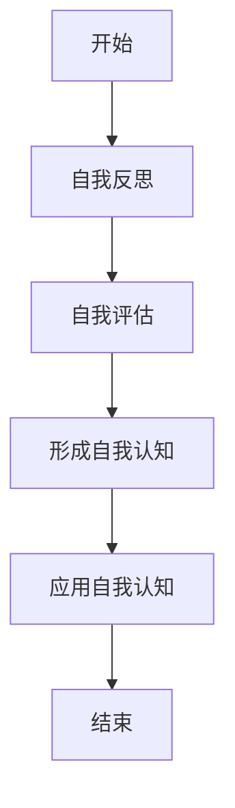
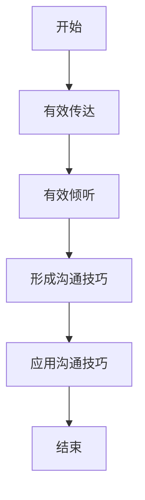
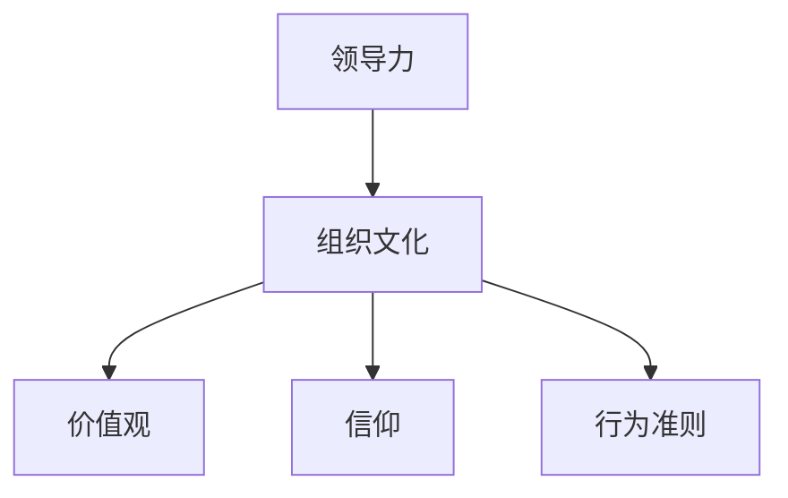
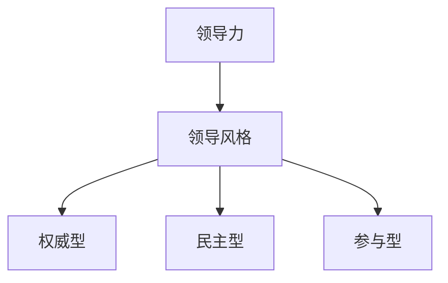
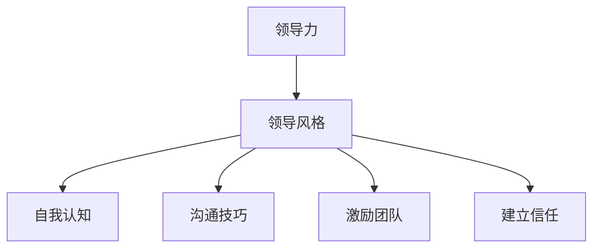

                 

### 引言

#### 1.1 背景介绍

在当今快速变化的商业环境中，领导力已成为企业成功的关键因素。全球化、技术变革和市场动态的变化不断对企业领导者提出新的挑战。然而，尽管有许多关于领导力的书籍和理论，但大多数内容过于理论化，难以应用到实际工作中。领导力缺乏实战性和操作性，导致企业领导者难以有效地应对实际问题。这种理论与实践的脱节现象，使得领导力培训和实践的需求日益迫切。

针对这一问题，本书旨在填补这一空白，通过提供实用的领导力法则和案例分析，帮助读者将理论转化为实践，提升领导力水平。书中将深入探讨领导力的核心概念、原理和实践方法，旨在为读者提供一套系统的、可操作的领导力心经。

#### 1.2 核心概念

**领导力**：领导力是一种能够激励、引导和影响他人以实现共同目标的能力。它不仅仅是一种管理技能，更是一种影响力和个人魅力的体现。领导力不仅关乎个人的行为和决策，还涉及人际关系、团队建设和组织文化等多个方面。

**领导力法则**：领导力法则是指一系列在特定情境下有效的领导行为和策略。这些法则基于实践经验和心理学原理，旨在帮助领导者更好地理解和应用领导力，以实现组织的目标和个人的职业发展。

#### 1.3 边界与外延

**边界**：本书主要关注企业领导者的领导力，不包括政治、军事等领域的领导力。虽然不同领域的领导力有其独特的特点和需求，但本书的核心内容仍然具有广泛的适用性。

**外延**：领导力不仅涉及个人品质，还涉及团队建设、组织文化和领导风格等方面。一个成功的领导者不仅需要具备个人品质，还需要能够有效地管理和激励团队，构建积极的组织文化，并采用合适的领导风格来应对不同的情境和挑战。

#### 1.4 概念结构与核心要素组成

**概念结构**：领导力包含多个维度，如个人品质、人际关系、组织文化和领导风格。这些维度相互关联，共同构成了领导力的整体结构。

**核心要素**：个人品质（诚信、自信、决策能力）、人际关系（沟通、协作、激励）、组织文化（共同价值观、文化氛围）和领导风格（权威型、民主型、参与型）是领导力的核心要素。这些要素相互作用，共同影响领导者的行为和团队的表现。

### 第1章：领导力心经

#### 2.1 核心概念原理

领导力心经是一套领导力的核心原则和法则，帮助领导者更好地理解和应用领导力。这些原则和法则是基于实践经验、心理学原理和组织行为学的研究，旨在提升领导者的效能和团队的绩效。

**自我认知**：自我认知是领导力的基础。它涉及领导者对自己的能力、价值观和动机的深入理解。自我认知的过程包括自我反思和自我评估。自我反思是指领导者通过思考自己的行为、决策和反应，深入探索自己的内在动机和信念。自我评估则是通过观察和反思自己的行为结果，评估自己的优势和不足。

**沟通技巧**：沟通技巧是领导力的关键要素。有效的沟通不仅能够传达信息，还能建立信任和促进协作。沟通技巧包括有效传达和有效倾听。有效传达是指领导者能够清晰、准确、有逻辑地表达自己的想法和意见。有效倾听则是领导者能够真正理解他人的观点和感受，以便更好地进行沟通和合作。

**激励团队**：激励团队是领导力的核心任务之一。领导者需要了解团队成员的需求和动机，并采用合适的方法来激发他们的积极性和创造力。激励团队的方法包括设置明确的目标、提供反馈和认可、以及创造一个支持性和激励性的工作环境。

**建立信任**：建立信任是领导力的关键。信任是团队合作和成功的基础。领导者需要通过诚实、透明和一致性来建立和维护与团队成员之间的信任关系。建立信任的方法包括保持承诺、公开沟通、以及积极参与团队的决策过程。

#### 2.2 概念属性特征对比表格

| 概念        | 属性特征                            |
|-------------|------------------------------------|
| 领导力      | 激励、引导、影响他人                 |
| 自我认知    | 了解自身能力、价值观和动机             |
| 沟通技巧    | 有效传达信息、倾听和理解他人             |
| 激励团队    | 激发团队成员的积极性和创造力           |
| 建立信任    | 增强团队成员之间的互信和协作           |

通过上述表格，我们可以清晰地看到每个概念的核心属性特征，以及它们之间的区别和联系。

### 第2章：领导力法则解析

#### 3.1 法则一：自我认知

**原理与公式**：
$$ \text{自我认知} = \text{自我反思} + \text{自我评估} $$

**自我反思**：自我反思是领导者深入思考自己的行为、决策和反应的过程。它有助于领导者了解自己的内在动机、信念和价值观。自我反思的方法包括记录日记、进行深度冥想、寻求反馈等。

**自我评估**：自我评估是领导者通过观察和反思自己的行为结果，评估自己的优势和不足的过程。自我评估的方法包括定期回顾自己的工作表现、与他人交流、以及接受专业评估。

**mermaid 流程图**：

**流程图说明**：

1. **自我反思**：领导者通过思考和记录自己的行为、决策和反应，深入了解自己的内在动机和信念。
2. **自我评估**：领导者通过观察和反思自己的行为结果，评估自己的优势和不足。
3. **形成自我认知**：基于自我反思和自我评估的结果，领导者形成对自己更深入的认识和理解。
4. **应用自我认知**：领导者将自己的自我认知应用于实际工作中，如决策、沟通和团队合作等。
5. **结束**：领导力不断提升，进入下一个自我反思和评估的循环。

#### 3.2 法则二：沟通技巧

**原理与公式**：
$$ \text{沟通技巧} = \text{有效传达} + \text{有效倾听} $$

**有效传达**：有效传达是领导者清晰、准确、有逻辑地表达自己的想法和意见的能力。它包括使用恰当的语言、表达方式和沟通渠道，以确保信息的准确传递。

**有效倾听**：有效倾听是领导者真正理解他人的观点和感受的能力。它包括全神贯注地倾听、积极回应、以及展示同理心。

**mermaid 流程图**：

**流程图说明**：

1. **有效传达**：领导者使用恰当的语言和表达方式，确保信息的准确传递。
2. **有效倾听**：领导者全神贯注地倾听，积极回应，展示同理心。
3. **形成沟通技巧**：通过实践和反思，领导者不断提升自己的沟通技巧。
4. **应用沟通技巧**：领导者将自己的沟通技巧应用于实际工作中，如团队会议、项目讨论和客户交流等。
5. **结束**：领导力不断提升，进入下一个沟通技巧提升的循环。

### 第3章：领导力与组织文化

#### 4.1 组织文化的重要性

组织文化是企业内部共同价值观、信仰和行为准则的集合，对领导力有重要影响。一个强大的组织文化能够为领导者提供明确的指导和支持，帮助他们更好地应对挑战和实现组织的目标。

**原理描述**：组织文化通过以下方面影响领导力：

1. **共同价值观**：共同价值观是组织文化的核心，它为领导者提供指导和支持，帮助他们做出符合组织目标的决策。
2. **信仰**：信仰是组织文化的精神支柱，它能够激发领导者的激情和动力，使他们更加坚定地追求组织的愿景和使命。
3. **行为准则**：行为准则是组织文化的具体体现，它规范领导者的行为和决策，确保他们能够在日常工作中遵循组织的价值观和信仰。

**mermaid ER实体关系图架构**：

**实体关系图说明**：

1. **领导力**：领导力是组织文化的重要组成部分，它受到组织文化的直接影响。
2. **组织文化**：组织文化由共同价值观、信仰和行为准则构成，它们共同影响领导力的表现和发展。
3. **价值观**：价值观是组织文化的核心，为领导者提供明确的指导和支持。
4. **信仰**：信仰是组织文化的精神支柱，激发领导者的激情和动力。
5. **行为准则**：行为准则是组织文化的具体体现，规范领导者的行为和决策。

通过上述分析，我们可以看到组织文化在领导力中的作用和重要性。一个强大的组织文化能够为领导者提供明确的指导和支持，帮助他们更好地应对挑战和实现组织的目标。因此，领导者需要重视组织文化的建设和发展，将其作为提升领导力的关键要素之一。

### 第4章：领导风格与团队建设

#### 5.1 领导风格

领导风格是指领导者通过行为和决策来影响和引导团队的方式。不同的领导风格适用于不同的情境和团队，但都需要领导者具备一定的领导力和沟通技巧。

**原理描述**：领导风格对团队建设和绩效有着重要的影响。以下是几种常见的领导风格：

1. **权威型领导**：权威型领导者拥有决策权，并对团队成员进行直接的指导和监督。这种领导风格适用于需要迅速做出决策和实施计划的紧急情况。
2. **民主型领导**：民主型领导者鼓励团队成员参与决策过程，并尊重他们的意见和反馈。这种领导风格适用于需要创新和团队合作的情境。
3. **参与型领导**：参与型领导者与团队成员建立紧密的合作关系，共同制定目标和计划。这种领导风格适用于需要高度协作和团队自主性的项目。

**mermaid ER实体关系图架构**：

**实体关系图说明**：

1. **领导力**：领导力是领导风格的基础，它决定了领导者的行为和决策方式。
2. **领导风格**：领导风格包括权威型、民主型和参与型，每种风格都有其适用的情境和特点。
3. **权威型**：权威型领导者拥有决策权，适用于紧急情况。
4. **民主型**：民主型领导者鼓励团队合作，适用于创新项目。
5. **参与型**：参与型领导者与团队成员建立合作关系，适用于需要高度协作的项目。

通过了解不同的领导风格，领导者可以根据实际情况选择合适的风格，以提升团队建设和绩效。同时，领导者也需要不断反思和调整自己的领导风格，以适应不断变化的环境和团队需求。

### 第5章：领导力与领导风格

#### 5.2 领导力与领导风格的关系

领导力与领导风格是密不可分的，它们共同影响着领导者的行为和团队的表现。领导力是领导者内在的素质和能力，而领导风格则是领导者将这些素质和能力应用于实践的具体表现。

**原理描述**：领导力与领导风格的关系可以从以下几个方面来理解：

1. **领导力是基础**：领导力是领导者具备的内在素质和能力，包括自我认知、沟通技巧、激励团队和建立信任等。这些素质和能力是领导风格形成的基础。
2. **领导风格是应用**：领导风格是领导者将这些内在素质和能力应用于实际工作中的具体表现。不同的领导风格适用于不同的情境和团队，但都需要建立在坚实的领导力基础上。
3. **领导力与领导风格的互动**：领导力和领导风格相互影响，领导力的提升可以促进领导风格的优化，而领导风格的优化也可以反过来提升领导力。

**mermaid ER实体关系图架构**：

**实体关系图说明**：

1. **领导力**：领导力是领导者具备的内在素质和能力。
2. **领导风格**：领导风格是领导力的具体应用，包括自我认知、沟通技巧、激励团队和建立信任等方面。
3. **自我认知**：自我认知是领导力的核心，它帮助领导者了解自己的优点和不足，从而更好地应用领导风格。
4. **沟通技巧**：沟通技巧是领导力的重要组成部分，它帮助领导者与团队成员建立有效的沟通和协作。
5. **激励团队**：激励团队是领导力的关键，它帮助领导者激发团队成员的积极性和创造力。
6. **建立信任**：建立信任是领导力的基础，它帮助领导者建立与团队成员之间的信任关系。

通过上述分析，我们可以看到领导力和领导风格之间的紧密关系。一个成功的领导者不仅需要具备强大的领导力，还需要能够灵活运用不同的领导风格，以适应不同的情境和团队需求。

### 结论

通过本文的分析，我们可以得出以下结论：

1. **领导力的重要性**：领导力是企业在快速变化的商业环境中取得成功的关键因素。有效的领导力能够激发团队的积极性，提升组织的绩效，并确保企业在面对挑战时能够灵活应对。

2. **领导力心经的核心概念**：领导力心经包括自我认知、沟通技巧、激励团队和建立信任等核心概念。这些概念构成了领导力的基础，帮助领导者更好地理解和应用领导力。

3. **领导力法则的实践**：领导力法则如自我认知和沟通技巧，通过具体的原理和公式，提供了一套实用的操作方法。领导者可以通过实践这些法则，提升自己的领导力水平。

4. **组织文化和领导风格的影响**：组织文化和领导风格对领导力有重要影响。一个强大的组织文化能够为领导者提供明确的指导和支持，而不同的领导风格则适用于不同的情境和团队。

5. **领导力与团队建设的互动**：领导力与团队建设密切相关，领导者需要通过灵活运用不同的领导风格，提升团队建设和绩效。

最后，我们鼓励读者在实践中不断探索和应用领导力心经，将理论知识转化为实际能力，成为更出色的领导者。

### 最佳实践 Tips

为了更好地应用领导力心经，以下是一些最佳实践建议：

1. **定期自我反思**：领导者应养成定期自我反思的习惯，通过记录日记或与他人交流，深入探索自己的内在动机和信念。

2. **提升沟通技巧**：领导者可以通过参加沟通技巧培训或阅读相关书籍，提升自己的沟通能力。在实践中，主动倾听和积极回应他人是关键。

3. **建立信任关系**：领导者应通过诚实、透明和一致性来建立和维护与团队成员之间的信任关系。主动参与团队的决策过程，展示对团队成员的信任。

4. **适应不同领导风格**：领导者应根据不同的情境和团队需求，灵活运用不同的领导风格。在紧急情况下，权威型领导可能更为有效，而在需要创新和协作的项目中，民主型或参与型领导则更为合适。

5. **持续学习和成长**：领导者应保持持续学习和成长的意识，通过阅读相关书籍、参加培训和研讨会，不断提升自己的领导力和管理能力。

通过这些最佳实践，领导者可以更好地应用领导力心经，提升自己的领导力水平，为企业和团队创造更大的价值。

### 小结

本文通过详细的章节内容和实例，深入探讨了领导力心经的核心概念、原理和实践方法。我们介绍了自我认知、沟通技巧、激励团队、建立信任等关键概念，并通过具体的领导力法则和案例分析，展示了如何将这些理论应用到实际工作中。

通过自我认知，领导者可以更好地了解自己的能力和价值观，从而做出更明智的决策。沟通技巧则是领导力的关键，它帮助领导者与团队成员建立有效的沟通和协作。激励团队和建立信任则分别是领导力的核心任务，它们能够激发团队成员的积极性和创造力，并建立强大的团队凝聚力。

我们还探讨了领导力与组织文化和领导风格的关系，强调了组织文化在领导力中的重要性，以及不同领导风格在特定情境下的适用性。

总之，领导力心经为领导者提供了一套系统的、可操作的指南，帮助他们提升领导力，实现组织的目标。我们鼓励读者在实践中不断探索和应用这些原则和法则，成为更出色的领导者。

### 注意事项

在应用领导力心经时，领导者需要特别注意以下几点：

1. **个性与情境的结合**：不同的领导者有不同的个性和风格，因此在应用领导力心经时，需要结合自己的特点，找到最适合的领导方式。

2. **持续实践与反思**：领导力提升是一个持续的过程，领导者需要不断地实践和反思自己的行为，以不断提升自己的领导能力。

3. **培养团队参与感**：在激励团队和建立信任的过程中，领导者应积极培养团队成员的参与感，让他们在决策和目标设定中发挥重要作用。

4. **适应变化**：商业环境和技术不断变化，领导者需要具备灵活性和适应性，及时调整自己的领导策略。

通过注意这些事项，领导者可以更好地应用领导力心经，提升自己的领导力，为企业和团队创造更大的价值。

### 拓展阅读

为了进一步深入理解领导力心经，读者可以参考以下经典书籍和文章：

1. **《领导力的五个层次》（The Five Levels of Leadership）**：作者：John C. Maxwell。本书详细阐述了领导力的五个层次，为领导者提供了提升领导能力的实用指南。

2. **《影响力》（Influence: The Psychology of Persuasion）**：作者：Robert B. Cialdini。本书探讨了影响他人的六个原则，为领导者提供了提升沟通技巧和建立信任的方法。

3. **《团队合作的力量》（The Power of Teams: Creating the High-Performance Team）**：作者：Jim Highsmith。本书介绍了团队合作的关键要素和建设高效团队的方法。

4. **《领导者的新路径》（The New Path to Leadership: The Journey into the Transformational Leadership Culture）**：作者：Warren Bennis。本书探讨了领导者如何通过变革实现组织的目标。

这些书籍和文章为读者提供了丰富的理论指导和实践经验，有助于更好地理解和应用领导力心经。建议读者结合本文的内容，深入阅读这些拓展材料，以全面提升自己的领导力。

