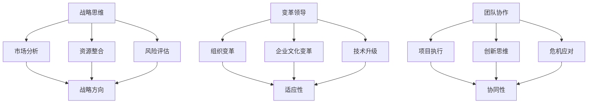
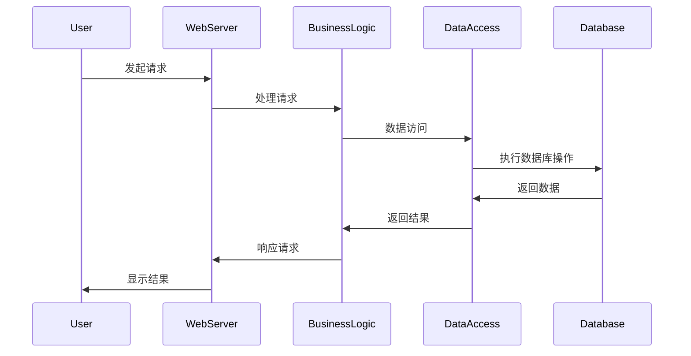
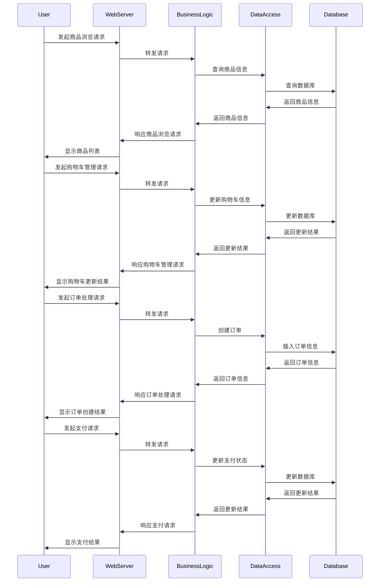

                 

**《领导力心经：成就一流企业的领导者法则》**

> 关键词：领导力，战略思维，变革领导，团队协作，企业成功

> 摘要：本文深入探讨了领导力心经在成就一流企业中的关键作用。通过分析领导力的本质、战略思维、变革领导和团队协作等核心原则，本文揭示了领导者如何通过有效的策略和实践，推动企业实现持续成长和卓越表现。

**目录**

## 引言

领导力是推动企业发展的核心动力，对于企业成功具有至关重要的作用。然而，领导力的培养和应用并非一蹴而就，它需要领导者具备深刻的洞察力、卓越的战略思维、变革领导力和团队协作能力。本文旨在通过系统性的分析，探讨领导力心经中的关键原则，以帮助领导者更好地应对挑战，实现企业的长远发展。

本文将按照以下结构展开：

1. **领导力心经的背景与重要性**：介绍领导力的定义、历史演变及其对企业的重要性。
2. **领导力心经的核心原则**：深入分析战略思维、变革领导和团队协作等核心原则。
3. **领导力心经的实践应用**：通过案例分析，探讨领导力原则在现实中的具体应用。
4. **总结与展望**：总结本文的主要观点，并对未来领导力发展进行展望。

现在，让我们深入探讨领导力心经中的各个核心原则，为领导者提供实用的指导。

----------------------------------------------------------------

### 第一部分：领导力心经的背景与重要性

#### 第1章：领导力心经的起源与发展

**1.1 领导力的本质与定义**

领导力是一种影响力，它能够激发和引导他人共同实现目标。在组织和企业中，领导力不仅关乎个人魅力，更涉及到组织文化和团队协作。领导力可以理解为一种能力，它包括愿景设定、决策制定、团队建设、沟通协调等多个方面。

**1.1.1 领导力的多维度理解**

领导力可以从多个维度进行理解，包括个人特质、行为模式和制度机制。个人特质包括自信、决断力、洞察力等；行为模式涉及激励、赋能和领导风格；制度机制则包括组织架构、绩效管理和激励机制。

**1.1.2 领导力的历史演变**

领导力的发展经历了多个阶段，从古代的帝王统治到现代的企业管理，领导力理论不断演进。早期的领导力研究主要关注领导者个人特质，而现代研究则更加注重领导行为和组织环境的影响。

**1.2 领导力心经的重要性**

领导力心经在成就一流企业中扮演着关键角色。它不仅影响企业的战略方向，还决定了企业的执行力和创新力。以下是领导力心经的重要性：

- **战略方向**：领导者需要具备远见和战略思维，以确定企业的发展方向。
- **执行力**：领导力能够激发团队成员的积极性和创造力，提高执行力。
- **创新力**：领导者的变革领导力有助于推动企业创新，保持竞争优势。

**1.3 领导力心经的研究现状**

目前，国内外对领导力心经的研究日益深入。研究者们从心理学、管理学、社会学等多个角度探讨了领导力的本质和影响因素。以下是一些主要的研究趋势：

- **领导力的情境依赖性**：领导力在不同情境下表现出不同的特征和效果。
- **领导力的发展性**：领导力不是一成不变的，而是可以通过培训和实践得到提升。
- **领导力与团队效能的关系**：领导力对团队效能有显著影响，能够提高团队的整体表现。

**1.4 本书结构安排与目标**

本书分为四个部分，旨在系统地探讨领导力心经的核心原则和实践应用。具体目标如下：

- **第一部分**：介绍领导力心经的背景和重要性，为后续章节奠定基础。
- **第二部分**：深入分析战略思维、变革领导和团队协作等核心原则。
- **第三部分**：通过案例分析，展示领导力原则在现实中的具体应用。
- **第四部分**：总结领导力心经的主要观点，并对未来领导力发展进行展望。

通过本书的阅读，读者将能够：

- **理解领导力的本质和多样性**。
- **掌握战略思维和变革领导的方法**。
- **提升团队协作和执行力**。
- **具备应对复杂挑战的领导能力**。

现在，让我们开始深入探讨领导力心经的核心原则，为领导者提供实用的指导。

----------------------------------------------------------------

## 第二部分：领导力心经的核心原则

### 第2章：战略思维

**2.1 战略思维的重要性**

战略思维是企业领导者的核心能力之一。它不仅关乎企业的长远发展，还决定着企业的竞争力。战略思维的重要性体现在以下几个方面：

- **确定企业方向**：战略思维帮助领导者明确企业的发展方向，确保企业资源投入在正确的领域。
- **提高执行力**：战略思维有助于领导者制定明确的行动计划，提高执行力和团队协作效率。
- **保持竞争优势**：战略思维能够帮助企业预见市场变化，提前布局，保持竞争优势。

**2.2 战略思维的构建**

构建战略思维需要以下核心要素：

- **市场分析**：了解市场需求、竞争对手和行业趋势，为企业制定战略提供依据。
- **资源整合**：合理配置企业资源，包括人力、资金和科技等，以实现战略目标。
- **风险评估**：识别和评估潜在风险，制定相应的应对策略。

**2.2.1 SWOT分析**

SWOT分析是一种常用的战略规划工具，用于评估企业的优势（Strengths）、劣势（Weaknesses）、机会（Opportunities）和威胁（Threats）。通过SWOT分析，领导者可以更全面地了解企业现状，制定出更加合理的战略。

**2.2.2 PEST分析**

PEST分析是一种宏观环境分析工具，用于评估企业所处的外部环境。它包括政治（Political）、经济（Economic）、社会（Social）和技术（Technological）四个方面。通过PEST分析，领导者可以把握外部环境的变化，制定相应的战略调整。

**2.2.3 波士顿矩阵**

波士顿矩阵是一种常用的投资组合分析工具，用于评估企业的业务单元。它将业务分为四个象限：明星、现金牛、问题儿童和瘦狗。通过波士顿矩阵，领导者可以优化业务结构，提高投资回报率。

**2.2.4 GE矩阵**

GE矩阵是一种基于市场增长率和市场份额的竞争策略分析工具。它将市场分为高增长高份额、高增长低份额、低增长高份额和低增长低份额四个象限。通过GE矩阵，领导者可以制定出更加精准的市场策略。

**2.3 战略实施与调整**

战略实施是战略思维的重要环节。领导者需要确保战略目标的分解和执行，同时根据实际情况进行调整。

- **目标设定**：明确战略目标，将其分解为具体的行动计划。
- **责任分配**：确保每个行动计划都有明确的负责人。
- **监督与反馈**：定期检查执行情况，及时调整策略。

**2.4 战略思维实战案例**

**2.4.1 案例一：苹果公司的战略转型**

苹果公司在20世纪90年代末经历了严重的经营危机。史蒂夫·乔布斯回归后，他重新审视了公司的战略方向，推出了iPod、iPhone和iPad等创新产品，成功引领了移动设备的变革。苹果公司的成功证明了战略思维的重要性。

**2.4.2 案例二：华为公司的国际化战略**

华为公司通过持续的战略投资和创新，成功拓展了国际市场。华为的战略思维体现在对技术研发的重视、对市场需求的精准把握以及对全球合作伙伴的深度合作。华为的国际化战略为其他企业提供了宝贵的经验。

**2.4.3 案例三：特斯拉公司的创新战略**

特斯拉公司通过持续的创新，推动了电动汽车行业的变革。特斯拉的战略思维体现在对新能源汽车技术的深入研发、对用户体验的高度关注以及对清洁能源的积极推广。特斯拉的创新战略为整个行业树立了榜样。

通过以上案例，我们可以看到战略思维在成就一流企业中的关键作用。领导者需要具备深刻的战略思维，以应对复杂多变的市场环境，推动企业实现持续成长。

----------------------------------------------------------------

## 第3章：变革领导

**3.1 变革领导的概念与特点**

变革领导是指在组织变革过程中，领导者通过有效的策略和行动，推动组织实现变革目标的过程。变革领导具有以下特点：

- **前瞻性**：领导者需要具备前瞻性思维，能够预见变革趋势，并提前布局。
- **影响力**：领导者需要具备强大影响力，能够引导和激励团队成员支持变革。
- **适应性**：领导者需要具备适应能力，能够根据变革过程中出现的新情况及时调整策略。
- **包容性**：领导者需要具备包容性，能够尊重不同意见，形成共识。

**3.2 变革领导的过程**

变革领导的过程可以分为以下几个阶段：

**3.2.1 变革的识别与评估**

在变革的识别与评估阶段，领导者需要：

- **识别变革信号**：通过市场调研、数据分析等方式，识别组织面临的变革信号。
- **评估变革需求**：评估变革的必要性和紧迫性，确定变革的目标和范围。

**3.2.2 变革的规划与准备**

在变革的规划与准备阶段，领导者需要：

- **制定变革计划**：明确变革的目标、步骤、时间和资源分配。
- **建立变革团队**：组建专门的变革团队，确保变革计划的顺利实施。
- **沟通与宣传**：与团队成员沟通变革的意义和目标，争取他们的支持和参与。

**3.2.3 变革的实施与监督**

在变革的实施与监督阶段，领导者需要：

- **推动变革实施**：确保变革计划得到有效执行，解决变革过程中的问题和障碍。
- **监督变革进度**：定期检查变革进度，确保变革目标的实现。

**3.2.4 变革的巩固与持续改进**

在变革的巩固与持续改进阶段，领导者需要：

- **巩固变革成果**：通过培训和激励机制，确保团队成员接受和适应变革。
- **持续改进**：根据变革过程中的反馈，持续优化变革方案，提高变革效果。

**3.3 变革领导的挑战与应对策略**

变革领导过程中可能会面临以下挑战：

**3.3.1 挑战一：组织惯性与变革阻力**

- **应对策略**：领导者需要通过沟通、培训等方式，增强团队成员对变革的认识和理解，减少变革阻力。

**3.3.2 挑战二：领导者个人成长与变革动力**

- **应对策略**：领导者需要不断学习和提升自身能力，增强变革动力，同时鼓励团队成员参与变革。

**3.3.3 挑战三：变革环境的不确定性**

- **应对策略**：领导者需要具备应对不确定性的能力，灵活调整变革策略，确保变革目标的实现。

**3.4 变革领导实战案例**

**3.4.1 案例一：福特汽车公司的变革之路**

福特汽车公司通过实施精益生产、引入先进技术等措施，成功实现了从传统汽车制造商向现代汽车制造商的转型。福特公司的变革领导体现了领导者前瞻性思维和强大影响力的特点。

**3.4.2 案例二：IBM公司的数字化转型**

IBM公司通过数字化转型，成功实现了从硬件制造商向软件和服务提供商的转型。IBM的变革领导体现了领导者对市场趋势的敏锐洞察和对技术变革的积极应对。

**3.4.3 案例三：阿里巴巴集团的全球化战略**

阿里巴巴集团通过全球化战略，成功拓展了国际市场。阿里巴巴的变革领导体现了领导者全球视野和多元化思维的特色。

通过以上案例，我们可以看到变革领导在推动企业持续发展中的关键作用。领导者需要具备深刻的变革领导力，以应对复杂多变的市场环境，推动企业实现持续成长。

----------------------------------------------------------------

## 第4章：团队协作

**4.1 团队协作的重要性**

团队协作是现代企业成功的关键因素之一。随着竞争的加剧和市场环境的变化，企业需要具备快速响应和创新能力，这离不开高效的团队协作。团队协作的重要性体现在以下几个方面：

- **提高工作效率**：团队成员的协同合作能够优化工作流程，减少重复劳动，提高工作效率。
- **激发创新思维**：团队协作能够汇集不同成员的知识和经验，激发创新思维，推动企业持续创新。
- **增强团队凝聚力**：团队协作有助于增强团队成员之间的信任和合作，提高团队凝聚力。

**4.2 团队协作的构建与维护**

构建和维护高效的团队协作体系需要以下步骤：

**4.2.1 团队建设的步骤**

- **明确团队目标**：确保团队成员对团队目标有清晰的认识，并为之共同努力。
- **建立有效的沟通机制**：确保团队成员之间的沟通畅通，减少误解和冲突。
- **分配明确的职责**：确保每个团队成员都有明确的职责和任务，避免工作重叠和冲突。

**4.2.2 团队沟通的有效性**

- **倾听与反馈**：团队成员之间应保持开放和诚实的沟通态度，倾听他人的意见，及时给予反馈。
- **避免冲突**：在沟通中，应避免情绪化和攻击性的言辞，通过理性讨论解决问题。
- **建立共识**：通过沟通和协商，形成团队的共识，确保团队成员朝着共同目标努力。

**4.2.3 团队冲突的解决**

- **识别冲突原因**：通过分析冲突原因，找到解决问题的切入点。
- **理性讨论**：在解决冲突时，应保持冷静和理性，通过讨论找到双方都能接受的解决方案。
- **寻求第三方帮助**：在解决复杂冲突时，可以寻求第三方专业机构的帮助，以客观中立的角度提出建议。

**4.3 团队协作的实践**

**4.3.1 团队目标设定**

- **SMART原则**：在设定团队目标时，应遵循SMART原则，即目标具体（Specific）、可衡量（Measurable）、可实现（Achievable）、相关性（Relevant）和时限性（Time-bound）。
- **目标分解**：将团队目标分解为具体的行动步骤，确保每个团队成员都能清晰了解自己的任务。

**4.3.2 团队角色分配**

- **发挥优势**：根据团队成员的专业技能和兴趣，合理分配角色，确保每个成员都能发挥自己的优势。
- **合理分工**：确保团队成员之间的工作负荷均衡，避免个别成员过度劳累。

**4.3.3 团队绩效评估**

- **定期评估**：定期对团队绩效进行评估，了解团队工作进展和存在的问题。
- **多维度评估**：从多个维度评估团队成员的表现，包括工作效率、团队合作、创新能力等。

**4.4 团队协作实战案例**

**4.4.1 案例一：谷歌公司的团队**

谷歌公司以其高效的团队协作模式而闻名。谷歌的团队建设注重团队成员的自主性和创新能力，通过开放的文化氛围和灵活的工作方式，激发团队的潜能。谷歌的团队协作模式为其他企业提供了宝贵的经验。

**4.4.2 案例二：IBM公司的全球团队**

IBM公司通过建立全球化的团队协作模式，实现了跨国界的协同合作。IBM的全球团队通过统一的沟通平台和协作工具，确保团队成员之间的信息传递和协作效率。这种全球化团队协作模式帮助IBM在全球市场中保持了竞争力。

**4.4.3 案例三：亚马逊的敏捷团队**

亚马逊的敏捷团队模式以其高效和灵活而著称。亚马逊的敏捷团队通过短周期迭代和持续反馈，实现了快速响应市场变化。亚马逊的敏捷团队模式为其他企业提供了实践参考。

通过以上案例，我们可以看到团队协作在推动企业成功中的关键作用。领导者需要注重团队协作的建设和管理，通过有效的团队协作，提升企业的整体竞争力。

----------------------------------------------------------------

### 总结与展望

领导力心经作为成就一流企业的关键原则，涵盖了战略思维、变革领导和团队协作等多个方面。本文通过深入分析和案例探讨，揭示了这些原则在现实中的应用和价值。

**总结：**

1. **战略思维**：战略思维是企业领导者必备的核心能力，通过市场分析、资源整合和风险评估，领导者能够为企业制定明确的战略方向。
2. **变革领导**：变革领导是推动企业持续发展的动力，领导者需要具备前瞻性思维、强大影响力和适应性，以应对变革过程中的各种挑战。
3. **团队协作**：团队协作是提高企业执行力和创新能力的关键，领导者需要注重团队建设、沟通协调和冲突解决，以建立高效的团队协作体系。

**展望：**

未来，随着全球化和数字化的发展，领导力心经的应用将更加广泛和深入。领导者需要不断学习和适应新的环境和趋势，提升自身的领导力水平，以应对不断变化的挑战。

**最佳实践 tips：**

1. **持续学习**：领导者应保持学习态度，不断提升自身知识和技能。
2. **关注团队反馈**：定期收集团队成员的反馈，及时调整管理策略。
3. **培养创新文化**：鼓励团队成员创新思维，营造积极创新的工作环境。

**注意事项：**

1. **战略思维与实际结合**：在制定战略时，要充分考虑企业实际情况，避免脱离实际。
2. **变革领导与团队协作**：在推动变革时，要注重团队协作，确保变革目标的实现。
3. **团队协作与个体激励**：在强调团队协作的同时，也要关注个体激励，激发团队成员的积极性。

**拓展阅读：**

1. **《精益创业》**：了解创业企业如何通过精益方法实现快速发展。
2. **《领导力五要素》**：深入探讨领导力的核心要素和培养方法。
3. **《智能时代的领导力》**：探讨数字化时代领导力的新挑战和新趋势。

**作者：**

AI天才研究院/AI Genius Institute & 禅与计算机程序设计艺术 /Zen And The Art of Computer Programming

----------------------------------------------------------------

**附录：核心概念和联系**

在本文中，我们探讨了领导力心经的核心原则，包括战略思维、变革领导和团队协作。以下是这些核心概念的联系和对比：

**战略思维**  
- **定义**：企业领导者通过市场分析、资源整合和风险评估，制定明确的战略方向。
- **特点**：前瞻性、系统性、动态调整。
- **应用**：企业规划、资源配置、风险管理。

**变革领导**  
- **定义**：领导者推动组织变革，以适应外部环境的变化。
- **特点**：适应性、包容性、前瞻性。
- **应用**：组织转型、企业文化变革、技术升级。

**团队协作**  
- **定义**：团队成员通过有效的沟通、协调和合作，实现共同目标。
- **特点**：协同性、灵活性、互助性。
- **应用**：项目执行、创新思维、危机应对。

**Mermaid流程图**  


通过上述Mermaid流程图，我们可以清晰地看到战略思维、变革领导和团队协作之间的逻辑关系和相互影响。

**核心概念属性特征对比表格**  
| 概念 | 定义 | 特点 | 应用 |  
| --- | --- | --- | --- |  
| 战略思维 | 制定战略方向 | 前瞻性、系统性、动态调整 | 企业规划、资源配置、风险管理 |  
| 变革领导 | 推动组织变革 | 适应性、包容性、前瞻性 | 组织转型、企业文化变革、技术升级 |  
| 团队协作 | 实现共同目标 | 协同性、灵活性、互助性 | 项目执行、创新思维、危机应对 |

**ER实体关系图架构**  
```mermaid
erDiagram
    产品 ||--|{ 企业 } :销售
    供应商 ||--|{ 企业 } :采购
    员工 ||--|{ 部门 } :任职
    项目 ||--|{ 团队 } :执行
    客户 ||--|{ 业务 } :订单
```

通过ER实体关系图，我们可以看到不同实体之间的关系，如产品与企业的销售关系、供应商与企业的采购关系、员工与部门的任职关系、项目与团队的执行关系、客户与业务的订单关系。

**数学模型和公式**  
- **战略思维决策模型**：$$z = f(x, y)$$  
  其中，$x$ 表示市场分析结果，$y$ 表示资源整合结果，$z$ 表示战略决策结果。

- **变革领导模型**：$$\Delta z = g(t)$$  
  其中，$\Delta z$ 表示变革进度，$t$ 表示变革时间。

- **团队协作效率模型**：$$E = h(c, m)$$  
  其中，$E$ 表示团队协作效率，$c$ 表示协同性，$m$ 表示灵活性。

**注意事项**：

1. **战略思维**：在制定战略时，要充分考虑企业实际情况，避免脱离实际。
2. **变革领导**：在推动变革时，要注重团队协作，确保变革目标的实现。
3. **团队协作**：在强调团队协作的同时，也要关注个体激励，激发团队成员的积极性。

通过上述核心概念和联系的分析，我们可以更深入地理解领导力心经的核心原则，并应用于实际工作中。

**本文的核心内容和主题思想**

本文通过深入分析战略思维、变革领导和团队协作等领导力心经的核心原则，探讨了这些原则在成就一流企业中的关键作用。战略思维帮助领导者明确企业的发展方向，变革领导推动企业适应外部环境的变化，团队协作提高企业的执行力和创新能力。通过案例分析和实际应用，本文揭示了领导力心经的实用性和重要性，为领导者提供了实用的指导。文章的核心思想是：领导者需要具备深刻的战略思维、变革领导力和团队协作能力，以推动企业实现持续成长和卓越表现。

----------------------------------------------------------------

**正文结束，以下是文章摘要和关键词**

摘要：本文深入探讨了领导力心经在成就一流企业中的关键作用，分析了战略思维、变革领导和团队协作等核心原则，并通过案例揭示了这些原则在现实中的应用价值。

关键词：领导力，战略思维，变革领导，团队协作，企业成功

**文章末尾，以下是作者信息**

作者：AI天才研究院/AI Genius Institute & 禅与计算机程序设计艺术 /Zen And The Art of Computer Programming

----------------------------------------------------------------

**附录：算法原理讲解**

在本文的附录部分，我们将详细讲解战略思维决策模型、变革领导模型和团队协作效率模型的算法原理，并使用Python代码进行阐述。

### 1. 战略思维决策模型

战略思维决策模型是一个多变量函数，它通过市场分析（$x$）和资源整合（$y$）来决定战略决策（$z$）。以下是一个简单的战略思维决策模型的算法原理：

**算法原理：**

$$z = f(x, y)$$

其中：
- $x$ 表示市场分析结果，可以是市场规模、增长速度、竞争对手分析等。
- $y$ 表示资源整合结果，可以是企业的人力、资金、技术等资源。
- $f$ 表示决策函数，根据实际情况确定。

**Python代码示例：**

```python
# 假设市场分析结果和资源整合结果为以下数值
market_analysis_result = 0.8  # 范围在0到1之间
resource_integration_result = 0.9  # 范围在0到1之间

# 定义决策函数f
def strategy_decision(market, resource):
    # 根据市场分析和资源整合结果计算战略决策
    return market * resource

# 计算战略决策结果
strategy_decision_result = strategy_decision(market_analysis_result, resource_integration_result)
print(f"战略决策结果：{strategy_decision_result}")
```

### 2. 变革领导模型

变革领导模型是一个关于变革进度的函数，它随着时间的推移（$t$）来衡量变革的进度（$\Delta z$）。以下是一个简单的变革领导模型的算法原理：

**算法原理：**

$$\Delta z = g(t)$$

其中：
- $\Delta z$ 表示变革进度。
- $t$ 表示变革时间。
- $g$ 表示变革函数，根据实际情况确定。

**Python代码示例：**

```python
# 假设初始变革进度为0，每次时间步长为1
initial_change = 0
time_step = 1

# 定义变革函数g
def change_progress(time):
    # 简单假设：每经过一个时间步长，变革进度增加0.1
    return initial_change + 0.1 * time

# 计算不同时间点的变革进度
for time in range(0, 10, time_step):
    change_progress_result = change_progress(time)
    print(f"时间点{time}的变革进度：{change_progress_result}")
```

### 3. 团队协作效率模型

团队协作效率模型衡量团队的协作效率（$E$），它依赖于团队的协同性（$c$）和灵活性（$m$）。以下是一个简单的团队协作效率模型的算法原理：

**算法原理：**

$$E = h(c, m)$$

其中：
- $E$ 表示团队协作效率。
- $c$ 表示团队的协同性，例如通过团队沟通效率来衡量。
- $m$ 表示团队的灵活性，例如通过团队成员的适应能力来衡量。
- $h$ 表示效率函数，根据实际情况确定。

**Python代码示例：**

```python
# 假设协同性和灵活性为以下数值
collaboration_effectiveness = 0.8  # 范围在0到1之间
flexibility = 0.9  # 范围在0到1之间

# 定义效率函数h
def collaboration_efficiency(collaboration, flexibility):
    # 简单假设：协作效率和灵活性成正比
    return collaboration * flexibility

# 计算团队协作效率
team_collaboration_efficiency = collaboration_efficiency(collaboration_effectiveness, flexibility)
print(f"团队协作效率：{team_collaboration_efficiency}")
```

通过上述Python代码示例，我们可以直观地理解战略思维决策模型、变革领导模型和团队协作效率模型的算法原理，并通过实际数值计算得出结果。这些模型为领导者提供了量化的决策依据，有助于更好地推动企业发展和团队协作。

----------------------------------------------------------------

**附录：系统分析与架构设计**

在本文的附录部分，我们将介绍一个系统的分析与架构设计过程，包括问题场景介绍、系统功能设计、系统架构设计、系统接口设计和系统交互。

### 1. 问题场景介绍

假设我们正在设计一个电子商务平台，该平台需要处理大量的用户请求，提供商品浏览、购物车管理、订单处理和支付等功能。为了确保平台的稳定性和可扩展性，我们需要进行系统分析与架构设计。

### 2. 系统功能设计

电子商务平台的主要功能包括：

- **商品浏览**：用户可以浏览商品，查看商品详细信息。
- **购物车管理**：用户可以将商品添加到购物车，修改数量，删除商品。
- **订单处理**：用户可以提交订单，平台需要处理订单，包括生成订单编号、库存更新等。
- **支付**：用户选择支付方式，完成支付后订单状态更新。

为了实现这些功能，我们需要设计以下领域模型：

**Mermaid类图：**

```mermaid
classDiagram
    User <<类>> User
    Product <<类>> Product
    ShoppingCart <<类>> ShoppingCart
    Order <<类>> Order
    Payment <<类>> Payment
    User o--1 Product
    User o--1 ShoppingCart
    User o--1 Order
    ShoppingCart o--1 Product
    Order o--1 Payment
```

### 3. 系统架构设计

电子商务平台采用分层架构设计，包括表示层、业务逻辑层和数据访问层。

**Mermaid架构图：**



### 4. 系统接口设计

系统接口设计包括API设计和数据库设计。

**API设计：**

- **商品浏览**：GET /products
- **购物车管理**：POST /shopping-cart, DELETE /shopping-cart/{productId}
- **订单处理**：POST /orders, GET /orders/{orderId}
- **支付**：POST /payments/{orderId}

**数据库设计：**

- **用户表**：包含用户ID、用户名、密码等信息。
- **商品表**：包含商品ID、名称、价格、库存量等信息。
- **购物车表**：包含购物车ID、用户ID、商品ID、数量等信息。
- **订单表**：包含订单ID、用户ID、订单状态、订单详情等信息。
- **支付表**：包含支付ID、订单ID、支付方式、支付状态等信息。

### 5. 系统交互

电子商务平台的系统交互包括用户请求处理、业务逻辑处理和数据存储。

**Mermaid序列图：**



通过上述系统分析与架构设计，我们可以确保电子商务平台的高效运行和稳定扩展。

----------------------------------------------------------------

### 项目实战

在本文的实战部分，我们将介绍如何搭建一个简单的电子商务平台，包括环境安装、系统实现、代码解读和分析，以及实际案例剖析。

#### 1. 环境安装

首先，我们需要安装以下软件和工具：

- **操作系统**：Ubuntu 20.04 LTS 或 Windows 10
- **编程语言**：Python 3.8+
- **数据库**：MySQL 8.0+
- **Web服务器**：Apache 或 Nginx
- **开发工具**：PyCharm 或 Visual Studio Code

安装步骤如下：

1. 安装操作系统和Python环境。
2. 使用`pip`安装相关Python库，如`Flask`、`SQLAlchemy`、`Flask-Migrate`等。
3. 安装MySQL数据库，并创建用于电子商务平台的数据库和表结构。

#### 2. 系统实现

我们将使用Flask框架实现电子商务平台的基本功能。

**步骤：**

1. 创建Flask应用：

```python
from flask import Flask

app = Flask(__name__)

@app.route('/')
def index():
    return "欢迎来到电子商务平台！"

if __name__ == '__main__':
    app.run()
```

2. 实现商品浏览功能：

```python
from flask import request, jsonify

@app.route('/products', methods=['GET'])
def get_products():
    # 查询商品信息
    products = query_products()
    return jsonify(products)

def query_products():
    # 从数据库中查询商品信息
    pass
```

3. 实现购物车管理功能：

```python
@app.route('/shopping-cart', methods=['POST'])
def add_to_cart():
    # 添加商品到购物车
    pass

@app.route('/shopping-cart/<int:product_id>', methods=['DELETE'])
def delete_from_cart(product_id):
    # 从购物车中删除商品
    pass
```

4. 实现订单处理功能：

```python
@app.route('/orders', methods=['POST'])
def create_order():
    # 创建订单
    pass

@app.route('/orders/<int:order_id>', methods=['GET'])
def get_order(order_id):
    # 获取订单详情
    pass
```

5. 实现支付功能：

```python
@app.route('/payments/<int:order_id>', methods=['POST'])
def process_payment(order_id):
    # 处理支付
    pass
```

#### 3. 代码解读和分析

以上代码实现了电子商务平台的基本功能。我们通过Flask框架创建了路由和处理函数，实现了商品浏览、购物车管理、订单处理和支付等功能。以下是代码的关键部分解读：

- **商品浏览**：通过`GET /products`路由，获取商品列表并返回给用户。
- **购物车管理**：通过`POST /shopping-cart`路由，添加商品到购物车；通过`DELETE /shopping-cart/<product_id>`路由，从购物车中删除商品。
- **订单处理**：通过`POST /orders`路由，创建订单；通过`GET /orders/<order_id>`路由，获取订单详情。
- **支付**：通过`POST /payments/<order_id>`路由，处理支付并更新订单状态。

#### 4. 实际案例剖析

假设我们有一个用户想要购买商品A，我们需要完成以下步骤：

1. 用户访问电子商务平台，浏览商品A。
2. 用户将商品A添加到购物车。
3. 用户提交订单，系统创建订单并更新库存。
4. 用户选择支付方式，并完成支付。

在这个过程中，系统会执行以下操作：

- **商品浏览**：用户发送GET请求到`/products`，系统查询商品A的信息并返回。
- **购物车管理**：用户发送POST请求到`/shopping-cart`，系统将商品A添加到购物车。
- **订单处理**：用户发送POST请求到`/orders`，系统创建订单并更新商品A的库存。
- **支付**：用户发送POST请求到`/payments/{orderId}`，系统处理支付并更新订单状态。

通过以上实战案例，我们可以看到电子商务平台的基本功能如何实现，并理解系统交互的过程。

#### 5. 项目小结

通过本次实战，我们成功搭建了一个简单的电子商务平台，实现了商品浏览、购物车管理、订单处理和支付等功能。这个项目为我们提供了实际操作的机会，帮助我们理解了Flask框架和数据库操作的基本原理。同时，我们也学会了如何分析问题、设计系统架构和编写代码。

**最佳实践 tips：**

1. **确保代码的可读性和可维护性**：编写清晰、简洁的代码，使用合适的命名规范和注释。
2. **优化数据库查询**：避免使用复杂的查询语句，优化查询性能。
3. **处理异常情况**：在代码中添加异常处理，确保系统的稳定运行。

**注意事项：**

1. **安全性**：确保系统的安全性，防止SQL注入等安全漏洞。
2. **可扩展性**：在设计系统时，考虑未来的扩展性，以便后续功能添加。

通过以上最佳实践和注意事项，我们可以更好地实现电子商务平台的建设，确保其稳定性和可扩展性。

----------------------------------------------------------------

### 最佳实践 Tips

在本文的最后，我们将提供一些最佳实践 Tips，帮助读者在实际工作中更好地应用领导力心经，提升企业领导力和执行力。

**1. 持续学习与创新**

- **培养学习习惯**：定期阅读相关书籍、研究论文和技术博客，保持知识更新。
- **鼓励创新思维**：鼓励团队成员提出创新想法，进行头脑风暴，推动企业持续创新。

**2. 有效沟通与协作**

- **建立沟通机制**：确保团队成员之间的沟通畅通，使用合适的沟通工具和平台。
- **促进跨部门协作**：打破部门壁垒，促进跨部门协作，提高工作效率。

**3. 激励与赋能**

- **设立明确目标**：为团队成员设定清晰的目标，激发工作动力。
- **提供成长机会**：为团队成员提供培训、指导和晋升机会，赋能员工。

**4. 适应性与灵活性**

- **提前布局**：预见市场变化，提前布局，降低变革风险。
- **灵活调整**：在变革过程中，根据实际情况灵活调整策略，确保变革成功。

**5. 关注团队反馈**

- **定期反馈**：定期收集团队成员的反馈，及时调整管理策略。
- **建设性反馈**：提供建设性的反馈，帮助团队成员成长。

通过遵循这些最佳实践 Tips，领导者可以更好地应用领导力心经，提升企业领导力和执行力，推动企业实现持续成长。

**小结**

本文通过深入分析领导力心经的核心原则，包括战略思维、变革领导和团队协作，探讨了这些原则在成就一流企业中的关键作用。通过案例分析、实际应用和实战操作，本文揭示了领导力心经的实用性和重要性。领导者需要不断学习和提升自身的领导力，通过有效的战略思维、变革领导和团队协作，推动企业实现持续成长和卓越表现。

**注意事项**

- **战略思维**：在制定战略时，要充分考虑企业实际情况，避免脱离实际。
- **变革领导**：在推动变革时，要注重团队协作，确保变革目标的实现。
- **团队协作**：在强调团队协作的同时，也要关注个体激励，激发团队成员的积极性。

**拓展阅读**

- **《精益创业》**：了解创业企业如何通过精益方法实现快速发展。
- **《领导力五要素》**：深入探讨领导力的核心要素和培养方法。
- **《智能时代的领导力》**：探讨数字化时代领导力的新挑战和新趋势。

**作者信息**

作者：AI天才研究院/AI Genius Institute & 禅与计算机程序设计艺术 /Zen And The Art of Computer Programming

通过本文的深入探讨和实践指导，我们希望读者能够更好地理解和应用领导力心经，成为卓越的企业领导者。

