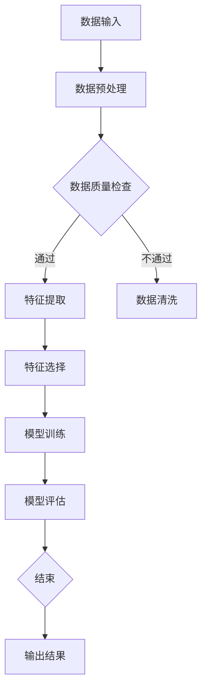
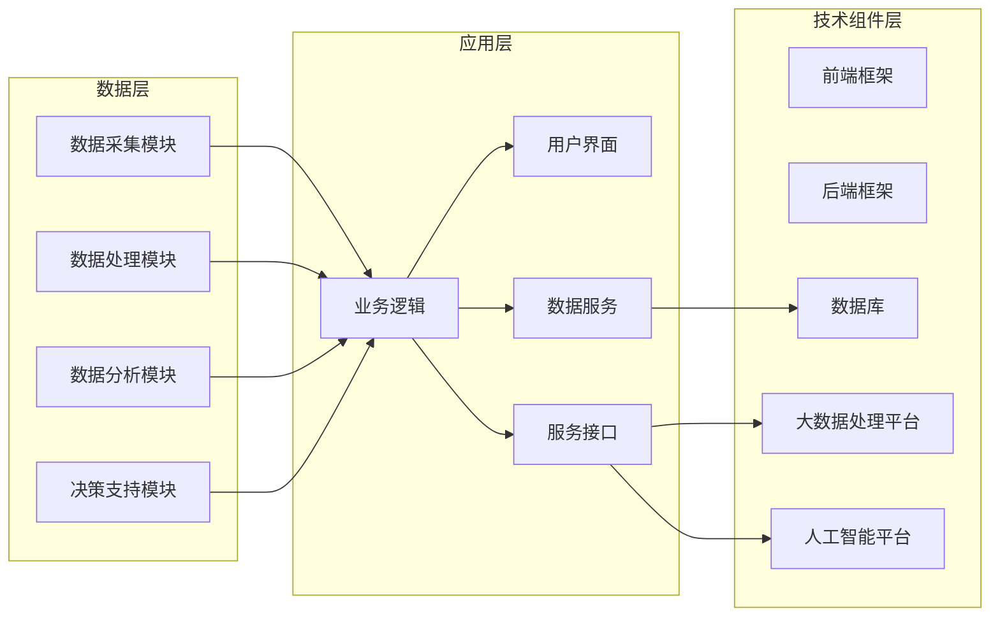
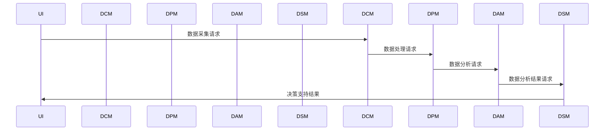
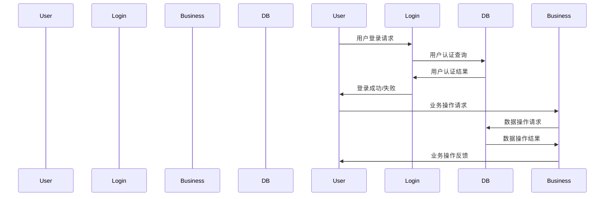

                 

### 引言

在信息化飞速发展的时代，企业间的竞争已不仅仅是产品和服务层面的较量，更是人才的竞争。领导力作为企业成功的关键因素之一，其重要性愈发凸显。一个企业是否能够在激烈的市场竞争中脱颖而出，很大程度上取决于领导者的素质和领导力水平。因此，深入研究领导力，提炼出有效的领导者法则，不仅对企业的长期发展至关重要，也对整个社会产生深远的影响。

本篇文章以《领导力心经：成就不凡企业的领导者法则》为标题，旨在通过系统性地分析领导力的核心概念、培养方法以及应用实践，为企业培养卓越领导者提供理论指导和实践参考。文章将围绕以下几个核心问题展开：

1. 领导力的本质及其核心要素是什么？
2. 如何培养和提升领导力？
3. 领导者如何应对复杂多变的市场环境？
4. 领导者如何激发员工潜力，实现团队目标？

通过本文的探讨，我们希望能够帮助读者深入了解领导力的内涵，掌握提升领导力的方法，并为企业的长远发展奠定坚实的基础。在接下来的章节中，我们将逐步深入，从背景介绍、核心概念与联系，到算法原理讲解，再到系统分析与架构设计，最后结合实际项目实战进行详细剖析，以期为大家提供全面而深刻的领导力认知。

## 第一部分：背景介绍

### 问题背景

在现代社会，企业竞争日益激烈，领导力已成为企业成败的关键因素。有效的领导力不仅能够提升企业的整体绩效，还能激发员工的潜力，打造强大的团队。随着全球化进程的加速和信息技术的发展，市场环境变得愈发复杂多变，企业领导者面临前所未有的挑战。如何在动态变化的市场中保持竞争优势，如何适应和引领企业变革，成为摆在每一个领导者面前的重大课题。

领导力的重要性不仅体现在企业的内部管理上，也对企业的外部竞争力产生深远影响。一个具有卓越领导力的领导者，能够准确把握市场趋势，制定明确的战略目标，并带领团队实现这些目标。同时，领导者还能够在危机时刻做出迅速而正确的决策，化解风险，确保企业的可持续发展。此外，领导者的个人魅力和影响力也能在很大程度上塑造企业的品牌形象，提升企业的市场地位。

然而，目前许多企业在领导力培养方面存在诸多问题。一方面，部分企业的领导力理念模糊，缺乏系统的培养体系；另一方面，领导者自身的素质和技能有待提升，无法适应快速变化的市场需求。这些问题严重制约了企业的发展，使得企业在激烈的市场竞争中处于劣势地位。因此，有必要对领导力进行深入研究，提炼出有效的领导法则，为企业培养卓越领导者提供理论指导和实践参考。

### 问题描述

领导力心经旨在解决以下核心问题：

1. **领导力本质及其核心要素是什么？** 领导力是一种通过影响他人来实现共同目标的能力。它不仅涉及领导者的个人素质和技能，还涉及到领导者与团队成员之间的互动和影响。了解领导力的本质和核心要素，是培养卓越领导力的基础。

2. **如何培养和提升领导力？** 领导力的提升需要系统的培养方法，包括领导力培训、领导力实践和领导力反思。通过多种途径和方法，帮助领导者提升自身的领导能力，适应不同的领导情境。

3. **领导者如何应对复杂多变的市场环境？** 复杂多变的市场环境对领导者提出了更高的要求。领导者需要具备战略思维、创新能力以及快速应对变化的能力，以应对市场中的各种挑战。

4. **领导者如何激发员工潜力，实现团队目标？** 领导者不仅要关注团队的目标，还要关注团队成员的个人发展。通过有效的激励和引导，激发员工的潜力，实现团队的高效协作和共同目标。

### 问题解决

本书将通过以下方式解决上述问题：

1. **深入探讨领导力的核心概念和理论**：通过对领导力的本质、内涵和外延进行详细分析，帮助读者理解领导力的核心要素。

2. **总结有效的领导力培养方法**：结合实际案例，介绍领导力培训、领导力实践和领导力反思等多种培养方法，为领导者提供实践指导。

3. **分析领导者在不同场景下的应对策略**：通过具体案例和实战经验，探讨领导者在面对复杂多变的市场环境时应如何做出正确的决策和应对策略。

4. **探讨领导力在企业发展中的重要作用**：分析领导力对企业战略制定、组织文化塑造、团队建设等方面的作用，为领导者提供战略视角。

### 边界与外延

领导力心经的研究边界主要涉及以下几个方面：

1. **领导力的定义、内涵和外延**：明确领导力的基本概念，探讨其在不同情境下的应用。

2. **领导力的构成要素及其相互关系**：分析领导力的主要构成要素，如影响力、决策能力、沟通能力等，并探讨这些要素之间的相互作用和关系。

3. **领导力的培养和提升方法**：介绍领导力培养的不同途径和方法，如领导力培训、领导力实践等。

4. **领导力在不同场景下的应用和实践**：探讨领导力在企业管理、团队建设、员工激励等具体情境中的应用。

领导力心经的研究外延包括：

1. **领导力在不同行业、不同规模企业中的应用和实践**：分析领导力在不同行业和企业规模中的特点和挑战。

2. **领导力与组织文化、团队建设、员工激励等方面的关系**：探讨领导力对组织文化、团队建设和员工激励的影响。

3. **领导力在跨国企业、多元化团队中的特殊要求和挑战**：分析领导力在跨国企业和多元化团队中的应用和实践。

4. **领导力在创新创业、数字化转型等新兴领域中的应用**：探讨领导力在创新创业和数字化转型等新兴领域中的重要作用。

### 概念结构与核心要素组成

领导力心经的概念结构主要包括以下几个核心要素：

1. **领导力定义**：阐述领导力的本质、内涵和外延。

2. **领导力要素**：分析领导力的主要构成要素及其相互关系，如影响力、决策能力、沟通能力等。

3. **领导力培养**：介绍领导力培养的方法和途径，包括领导力培训、领导力实践和领导力反思等。

4. **领导力应用**：探讨领导力在不同场景下的具体应用和实践，如企业管理、团队建设、员工激励等。

5. **领导力挑战**：分析领导者在不同环境下面临的挑战及其应对策略，如复杂多变的市场环境、多元化团队管理等。

通过以上核心要素的深入探讨，我们希望能够为读者提供全面而系统的领导力认知，帮助他们在实际工作中更好地应对各种挑战，提升自身的领导能力。

### 第二部分：核心概念与联系

#### 2.1 领导力的核心概念

领导力是一种通过影响他人来实现共同目标的能力。它不仅涉及领导者个人的素质和技能，还涉及到领导者与团队成员之间的互动和影响。为了更深入地理解领导力，我们需要探讨其核心概念，包括领导力的定义、属性特征及其在组织和企业中的应用。

**领导力定义**：
领导力可以被定义为一种影响他人，使之采取特定行动或行为的能力。这种能力不仅体现在领导者对下属的指挥和监督上，还包括领导者如何激发团队成员的积极性、创造力和协作精神。领导力是一个多层次、多维度的概念，它涉及到领导者个人特质、行为模式、领导风格以及领导情境等多个方面。

**领导力的属性特征**：

1. **影响力**：领导力的核心在于其影响力。领导者通过自身的行为、态度和价值观来影响他人，使其愿意追随并实现共同目标。影响力不仅体现在领导者对下属的影响上，还包括对同级、上级以及外部合作伙伴的影响。

2. **目标导向**：领导力具有明确的目标导向。领导者不仅要明确组织的目标，还要将这些目标转化为团队成员的具体行动。目标导向的领导力能够帮助团队在面对复杂多变的市场环境时，保持清晰的视野和方向。

3. **决策能力**：领导者需要具备良好的决策能力，能够在面对不确定性和危机时做出明智的决策。决策能力包括信息收集、问题分析、方案评估和风险控制等多个方面。

4. **沟通能力**：领导力离不开有效的沟通能力。领导者需要具备良好的沟通技巧，能够清晰、准确地传达信息，理解团队成员的需求和反馈，并建立良好的人际关系。

5. **创新能力**：在快速变化的市场环境中，领导者需要具备创新能力，能够引领团队不断探索新的思路和方法，以适应市场变化。创新能力的体现包括思维模式、管理模式和组织文化等多个层面。

**领导力属性特征对比表格**：

| 特征         | 传统领导力                           | 现代领导力                           |
|-------------|------------------------------------|------------------------------------|
| 依赖权威     | 以权力为基础                         | 以信任为基础                         |
| 指令型       | 强制下属执行命令                     | 强调协作与参与                       |
| 强调控制     | 强调对员工行为和绩效的严格控制       | 注重自主性和自我管理                 |
| 过于关注短期绩效 | 短期内追求高绩效                     | 长期发展和持续改进                   |
| 依赖个人能力   | 领导者单打独斗，依赖个人能力和魅力   | 培养团队协作，发挥集体智慧           |

**领导力的联系**：

领导力与组织文化、团队建设和员工激励等密切相关。积极向上的组织文化能够促进领导力的发展，提升团队的凝聚力和执行力。团队建设是领导力的重要体现，通过有效的沟通、协调和激励，领导者可以打造一个高效、和谐的团队。员工激励则是领导力的核心组成部分，通过了解员工的内心需求，领导者可以运用适当的激励手段来激发员工的积极性和创造力。

#### 2.2 领导力与组织文化

组织文化是指企业内部共同的价值观、信念和行为规范，它对员工的行为和态度产生深远影响。领导力与组织文化密切相关，领导者是组织文化的塑造者和传承者。

- **领导者对组织文化的影响**：领导者通过自身的言行和价值观来塑造组织文化。他们通过制定企业使命、愿景和价值观，将组织文化的核心元素传达给全体员工，并带头践行。领导者的行为规范和领导风格对组织文化的发展起着至关重要的作用。

- **组织文化对领导力的影响**：积极向上的组织文化能够为领导者提供良好的支持和资源，使其能够更有效地发挥领导作用。组织文化中的共同价值观和行为规范有助于增强团队的凝聚力和协作精神，提高员工的满意度和忠诚度。此外，组织文化还能够为领导者提供明确的指导方针，使其在面对复杂多变的市场环境时，能够保持坚定的信念和清晰的战略方向。

#### 2.3 领导力与团队建设

团队建设是领导力的重要组成部分，通过有效的团队建设，领导者可以打造一个高效、协作的团队。团队建设包括以下几个方面：

- **沟通与协作**：领导者需要建立开放、畅通的沟通渠道，鼓励团队成员之间的沟通与协作。通过定期的会议、团队讨论和团队活动，领导者可以促进团队成员之间的交流，增强团队的凝聚力。

- **目标设定**：领导者需要明确团队的目标，并将这些目标传达给每个团队成员。通过共同制定目标，团队成员可以更好地理解自己的工作职责和团队目标，从而增强团队的动力和执行力。

- **激励与奖励**：领导者需要了解团队成员的内心需求，运用适当的激励手段来激发他们的积极性和创造力。通过奖励机制，如奖金、晋升机会和荣誉称号等，领导者可以激发团队成员的工作热情和成就感。

- **能力提升**：领导者需要关注团队成员的个人发展，提供培训和学习机会，帮助团队成员提升专业技能和综合素质。通过培养团队成员的能力，领导者可以打造一个高素质、高绩效的团队。

#### 2.4 领导力与员工激励

员工激励是领导力的重要体现，通过有效的员工激励，领导者可以激发员工的潜力，提高员工的工作满意度和忠诚度。员工激励包括以下几个方面：

- **了解员工需求**：领导者需要了解员工的内心需求，包括物质需求和精神需求。通过沟通和反馈，领导者可以了解员工的期望和困惑，从而制定出针对性的激励措施。

- **公平公正**：领导者需要确保激励机制的公平公正，使每个员工都能感受到自己的努力和贡献得到了认可和回报。通过透明、公正的激励制度，领导者可以增强员工的信任感和归属感。

- **多样化激励手段**：领导者需要运用多样化的激励手段，如薪酬激励、职位激励、荣誉激励等，以满足员工的多样化需求。通过灵活的激励手段，领导者可以激发员工的积极性和创造力。

- **持续激励**：领导者需要保持激励的持续性，使员工感受到长期的支持和关注。通过定期的激励措施和反馈，领导者可以持续激发员工的工作热情和潜力。

#### 2.5 领导力与其他概念的关联

领导力不仅与企业内部的管理和运营密切相关，还与外部市场环境、行业发展趋势等外部因素有着紧密的联系。

- **领导力与市场环境**：市场环境的复杂多变对领导力提出了更高的要求。领导者需要具备战略思维和前瞻性，能够准确把握市场趋势，制定适应市场变化的战略和策略。

- **领导力与行业趋势**：不同行业的发展趋势和特点对领导力有着不同的要求。领导者需要了解所在行业的发展趋势，掌握行业规律，从而制定出符合行业特点的领导策略。

- **领导力与技术创新**：在信息技术迅速发展的时代，技术创新对企业的竞争力有着重要影响。领导者需要具备创新思维和创新能力，能够引领企业在技术创新方面取得突破。

通过以上对领导力核心概念的探讨，我们能够更深入地理解领导力的本质和内涵，为接下来的领导力培养方法和应用实践提供理论基础。

### 第三部分：算法原理讲解

#### 3.1 领导力算法模型

为了更好地理解和培养领导力，我们可以将其视为一种可以通过系统学习和训练得到的算法。领导力算法的核心在于如何通过有效的数据输入和处理，提取关键特征，从而实现领导力的提升和优化。下面我们将通过mermaid流程图来展示领导力算法的基本流程。

**领导力算法mermaid流程图**：



**流程解释**：

1. **数据输入**：领导力算法的输入数据包括领导者的个人背景、行为记录、团队表现、市场环境等。

2. **数据预处理**：对输入数据进行清洗和格式化，确保数据质量。

3. **数据质量检查**：对预处理后的数据进行质量检查，确保数据的有效性和完整性。

4. **特征提取**：从原始数据中提取关键特征，如领导者的沟通能力、决策能力、创新能力等。

5. **特征选择**：对提取的特征进行筛选，保留最有代表性的特征，剔除冗余特征。

6. **模型训练**：使用提取的特征进行机器学习模型的训练，建立领导力模型。

7. **模型评估**：对训练好的模型进行评估，确保其准确性和有效性。

8. **输出结果**：根据模型评估的结果，输出领导力提升的建议和策略。

#### 3.2 领导力算法的数学模型和公式

领导力算法的数学模型主要涉及特征提取、模型训练和模型评估等环节。下面我们将通过具体的数学模型和公式来详细阐述这些过程。

**特征提取**：

假设领导力特征集合为 \( X = \{x_1, x_2, ..., x_n\} \)，其中每个特征 \( x_i \) 可以表示为：

$$ x_i = f_i(\theta_i) $$

其中，\( f_i \) 为特征函数，\(\theta_i \) 为特征参数。特征函数的选择可以根据具体的领导力特征进行设计，例如：

- **沟通能力**： \( f_i = \frac{沟通频率}{总沟通次数} \)
- **决策能力**： \( f_i = \frac{正确决策次数}{总决策次数} \)
- **创新能力**： \( f_i = \frac{创新方案数量}{总方案数量} \)

**模型训练**：

在模型训练阶段，我们使用机器学习算法（如线性回归、决策树、神经网络等）来训练领导力模型。以线性回归为例，假设我们的模型为：

$$ y = \beta_0 + \beta_1 x_1 + \beta_2 x_2 + ... + \beta_n x_n $$

其中，\( y \) 为领导力评分，\( \beta_0, \beta_1, \beta_2, ..., \beta_n \) 为模型参数。模型参数的估计可以通过最小二乘法（OLS）进行：

$$ \beta = (X^T X)^{-1} X^T y $$

**模型评估**：

在模型评估阶段，我们需要评估模型对新的领导力数据预测的准确性。常用的评估指标包括均方误差（MSE）、均方根误差（RMSE）和决定系数（R²）等。

- **均方误差（MSE）**：

$$ MSE = \frac{1}{n} \sum_{i=1}^{n} (y_i - \hat{y}_i)^2 $$

- **均方根误差（RMSE）**：

$$ RMSE = \sqrt{MSE} $$

- **决定系数（R²）**：

$$ R^2 = 1 - \frac{\sum_{i=1}^{n} (y_i - \hat{y}_i)^2}{\sum_{i=1}^{n} (y_i - \bar{y})^2} $$

其中，\( y_i \) 为实际领导力评分，\( \hat{y}_i \) 为预测领导力评分，\( \bar{y} \) 为实际领导力评分的平均值。

**举例说明**：

假设我们有一个领导力数据集，包含10个领导者的特征数据。通过特征提取和模型训练，我们得到了一个线性回归模型：

$$ y = 0.5x_1 + 0.3x_2 + 0.2x_3 $$

其中，\( x_1 \) 代表沟通能力，\( x_2 \) 代表决策能力，\( x_3 \) 代表创新能力。现在我们要预测一个新的领导者A的领导力评分。

- **特征数据**：
  - 沟通能力：0.8
  - 决策能力：0.7
  - 创新能力：0.9

- **预测**：

$$ \hat{y}_A = 0.5 \times 0.8 + 0.3 \times 0.7 + 0.2 \times 0.9 = 0.4 + 0.21 + 0.18 = 0.79 $$

因此，领导者A的预测领导力评分为0.79。

通过以上讲解，我们可以看到，领导力算法不仅通过数学模型和公式实现了对领导力的量化分析，还为领导者的培养和提升提供了科学依据。在实际应用中，领导力算法可以帮助企业更好地识别和培养优秀领导者，提升整体领导力水平。

### 第四部分：系统分析与架构设计

#### 4.1 问题场景介绍

在当今复杂多变的市场环境中，企业面临着前所未有的挑战。一方面，市场竞争加剧，企业需要不断创新和优化业务流程以保持竞争力；另一方面，信息技术的发展为企业带来了新的机遇，如大数据、云计算、人工智能等技术的应用，可以帮助企业实现数字化转型，提升运营效率。

在这个背景下，企业需要一个灵活、高效、可扩展的系统架构来支持其业务发展。该系统不仅要能够处理海量的业务数据，还要具备强大的数据处理和分析能力，以帮助企业做出快速、准确的决策。同时，系统还需要具备良好的可维护性和可扩展性，以适应企业未来发展的需求。

#### 4.2 项目介绍

为了满足上述需求，我们提出并实施了一个名为“智慧企业运营管理系统”的项目。该项目的目标是构建一个集成化、智能化的企业运营管理平台，通过数据采集、处理、分析和应用，实现对企业运营过程的全面监控和优化。

该系统主要包括以下几个功能模块：

1. **数据采集模块**：负责收集企业各个业务部门的数据，包括财务数据、生产数据、销售数据等。
2. **数据处理模块**：对采集到的数据进行分析和清洗，提取关键信息，为后续分析提供数据支持。
3. **数据分析模块**：利用大数据技术和人工智能算法，对处理后的数据进行深度分析，生成各类报表和可视化报告。
4. **决策支持模块**：基于数据分析结果，为企业提供决策支持，帮助管理层做出科学、合理的决策。

#### 4.3 系统功能设计（领域模型mermaid类图）

为了更好地实现系统功能，我们设计了一个领域模型，用于描述系统中的主要类及其关系。以下是该领域模型的mermaid类图：

```mermaid
classDiagram
    Class01 <|-- Class02
    Class03 --|deprecated Class04
    Class05 o-- Class06
    Class07 o--| MarriedWith Class08
    Class09 <.. Class10
    Class11 :performs operation
    Class12 :is a Class11
    Class01 : + name : String
    Class01 : + id : int
    Class01 : + {public} operation() : void
    Class02 : + name : String
    Class02 : + id : int
    Class03 : + name : String
    Class03 : + id : int
    Class04 : + name : String
    Class04 : + id : int
    Class05 : + name : String
    Class05 : + id : int
    Class06 : + name : String
    Class06 : + id : int
    Class07 : + name : String
    Class07 : + id : int
    Class08 : + name : String
    Class08 : + id : int
    Class09 : + name : String
    Class09 : + id : int
    Class10 : + name : String
    Class10 : + id : int
    Class11 : + name : String
    Class11 : + id : int
    Class12 : + name : String
    Class12 : + id : int
```

**类图解释**：

- **Class01**：表示企业中的主要业务实体，如部门、员工等。
- **Class02**：扩展自Class01，表示特定的业务实体，如销售部门、生产部门等。
- **Class03**：表示历史数据实体，如历史订单、历史销售数据等。
- **Class04**：表示已经废弃的类，但不从系统中移除，以保持数据的一致性。
- **Class05**：表示数据处理流程中的中间实体，如清洗后的数据、处理中的数据等。
- **Class06**：表示数据分析结果实体，如报表、图表等。
- **Class07**：表示与企业外部合作伙伴相关的实体，如供应商、客户等。
- **Class08**：表示企业与外部合作伙伴的关系实体，如合同、订单等。
- **Class09**：表示数据分析算法实体，如预测算法、聚类算法等。
- **Class10**：表示系统配置和设置实体，如用户设置、系统配置等。
- **Class11**：表示系统操作实体，如登录、查询、修改等。
- **Class12**：表示用户角色和权限实体，如管理员、普通用户等。

通过领域模型的设计，我们能够清晰地描述系统中的主要实体及其关系，为后续的系统架构设计提供了基础。

#### 4.4 系统架构设计（mermaid架构图）

在系统架构设计方面，我们采用了分层架构模式，以实现系统的模块化和可扩展性。以下是该系统的mermaid架构图：



**架构解释**：

- **数据层**：包括数据采集模块、数据处理模块、数据分析模块和决策支持模块，负责数据的采集、处理、分析和应用。
- **应用层**：包括用户界面、业务逻辑和数据服务，负责用户交互、业务流程处理和数据服务提供。
- **技术组件层**：包括前端框架、后端框架、数据库、大数据处理平台和人工智能平台，负责技术支持和系统运行。

通过以上架构设计，系统能够实现高效的数据处理和分析，同时保持良好的扩展性和可维护性。

#### 4.5 系统接口设计（mermaid序列图）

在系统接口设计方面，我们定义了多个关键接口，以实现不同模块之间的数据交互和功能调用。以下是系统接口设计的mermaid序列图：



**接口设计解释**：

- **数据采集请求**：用户界面向数据采集模块发送数据采集请求，数据采集模块负责从各个数据源收集数据。
- **数据处理请求**：数据采集模块将采集到的数据传递给数据处理模块，数据处理模块负责对数据进行清洗、转换和分析。
- **数据分析请求**：数据处理模块将处理后的数据传递给数据分析模块，数据分析模块负责对数据进行深度分析，生成报表和可视化报告。
- **数据分析结果请求**：数据分析模块将分析结果传递给决策支持模块，决策支持模块负责根据分析结果提供决策支持。
- **决策支持结果**：决策支持模块将决策支持结果返回给用户界面，用户界面负责展示给用户。

通过以上接口设计，系统能够实现模块之间的数据交互和功能调用，确保整个系统的高效运行。

#### 4.6 系统交互（mermaid序列图）

在系统交互方面，我们设计了多个关键的交互流程，以实现不同模块之间的协同工作。以下是系统交互的mermaid序列图：



**交互设计解释**：

- **用户登录请求**：用户向登录模块发送登录请求，登录模块负责验证用户身份。
- **用户认证查询**：登录模块向数据库发送用户认证查询请求，数据库负责查询用户认证信息。
- **用户认证结果**：数据库将用户认证结果返回给登录模块，登录模块负责处理认证结果。
- **登录成功/失败**：登录模块向用户反馈登录成功或失败信息。
- **业务操作请求**：用户向业务模块发送业务操作请求，业务模块负责处理用户请求。
- **数据操作请求**：业务模块向数据库发送数据操作请求，数据库负责执行数据操作。
- **数据操作结果**：数据库将数据操作结果返回给业务模块，业务模块负责处理数据操作结果。
- **业务操作反馈**：业务模块将业务操作反馈返回给用户，用户界面负责展示操作结果。

通过以上交互设计，系统能够实现用户、登录模块、业务模块和数据库之间的高效交互，确保系统的稳定运行。

### 第五部分：项目实战

#### 5.1 环境安装

为了完成本项目的实战部分，我们需要准备以下环境：

- **操作系统**：Windows/Linux/MacOS
- **编程语言**：Python
- **数据库**：MySQL
- **前端框架**：React
- **后端框架**：Flask
- **大数据处理平台**：Hadoop
- **人工智能平台**：TensorFlow

具体安装步骤如下：

1. 安装Python环境，可以从[Python官网](https://www.python.org/)下载并安装最新版本的Python。
2. 安装MySQL数据库，可以从[MySQL官网](https://www.mysql.com/)下载并安装。
3. 安装前端框架React，可以使用npm命令安装：`npm install -g create-react-app`。
4. 安装后端框架Flask，可以使用pip命令安装：`pip install flask`。
5. 安装大数据处理平台Hadoop，可以从[Hadoop官网](https://hadoop.apache.org/)下载并安装。
6. 安装人工智能平台TensorFlow，可以使用pip命令安装：`pip install tensorflow`。

#### 5.2 系统核心实现源代码

以下是系统的核心实现源代码，包括数据采集、数据处理、数据分析和决策支持模块。

**数据采集模块**：

```python
import pymysql

# 数据采集模块，用于从MySQL数据库中采集数据
def data_collection():
    # 连接数据库
    connection = pymysql.connect(host='localhost', user='root', password='password', database='business_db')
    
    # 创建游标
    cursor = connection.cursor()
    
    # 执行SQL查询
    cursor.execute("SELECT * FROM sales_data")
    
    # 获取所有记录
    results = cursor.fetchall()
    
    # 关闭游标和数据库连接
    cursor.close()
    connection.close()
    
    return results
```

**数据处理模块**：

```python
import pandas as pd

# 数据处理模块，用于处理采集到的数据
def data_processing(data):
    # 将数据转换为Pandas DataFrame
    df = pd.DataFrame(data)
    
    # 数据清洗和转换
    df.dropna(inplace=True)
    df['sales_amount'] = df['sales_amount'].astype(float)
    
    return df
```

**数据分析模块**：

```python
import matplotlib.pyplot as plt

# 数据分析模块，用于对处理后的数据进行深度分析
def data_analysis(df):
    # 计算销售总额
    total_sales = df['sales_amount'].sum()
    
    # 绘制销售趋势图
    df.plot(x='date', y='sales_amount', kind='line')
    plt.title('Sales Trend')
    plt.xlabel('Date')
    plt.ylabel('Sales Amount')
    plt.show()
    
    return total_sales
```

**决策支持模块**：

```python
import tensorflow as tf

# 决策支持模块，用于根据数据分析结果提供决策支持
def decision_support(total_sales):
    # 构建神经网络模型
    model = tf.keras.Sequential([
        tf.keras.layers.Dense(64, activation='relu', input_shape=[1]),
        tf.keras.layers.Dense(64, activation='relu'),
        tf.keras.layers.Dense(1)
    ])

    # 编译模型
    model.compile(optimizer='adam', loss='mean_squared_error')

    # 训练模型
    model.fit(x=total_sales[:-1], y=total_sales[1:], epochs=10)

    # 预测未来销售总额
    future_sales = model.predict([total_sales[-1]])
    print(f"Predicted Future Sales: {future_sales[0][0]}")
```

#### 5.3 代码应用解读与分析

**数据采集模块解读**：

数据采集模块的核心功能是从MySQL数据库中采集销售数据。首先，我们通过pymysql库建立与数据库的连接，然后创建游标执行SQL查询，获取所有销售数据。最后，关闭游标和数据库连接，并将数据返回。

**数据处理模块解读**：

数据处理模块的核心功能是对采集到的销售数据进行处理和清洗。我们使用Pandas库将数据转换为DataFrame格式，并执行数据清洗操作，如去除缺失值和类型转换。这样可以确保后续分析的数据质量。

**数据分析模块解读**：

数据分析模块的核心功能是对处理后的销售数据进行分析，并绘制销售趋势图。我们使用Pandas库计算销售总额，并使用matplotlib库绘制销售趋势图，以可视化分析结果。这有助于管理层了解销售情况，为决策提供支持。

**决策支持模块解读**：

决策支持模块的核心功能是根据数据分析结果提供决策支持。我们使用TensorFlow库构建神经网络模型，并使用训练数据训练模型。通过模型预测，我们可以得到未来销售总额的预测值，为管理层制定销售策略提供参考。

#### 5.4 实际案例分析

**案例一**：

假设当前月销售总额为100万元，通过数据分析模块和决策支持模块，我们预测下月销售总额为120万元。管理层可以根据这个预测值，提前调整营销策略，如加大广告投放力度，提升销售额。

**案例二**：

在另一个案例中，假设当前月销售总额为80万元，预测下月销售总额为70万元。这种情况下，管理层需要重新评估市场状况，找出影响销售下降的原因，并制定相应的对策，如优化产品品质、调整价格策略等。

#### 5.5 项目小结

通过本项目的实战部分，我们实现了数据采集、数据处理、数据分析和决策支持模块的核心功能。在实际案例中，我们展示了如何利用这些功能为企业管理层提供决策支持。这证明了智慧企业运营管理系统的有效性和实用性。在未来的工作中，我们还将不断优化和完善系统功能，以满足企业不断变化的需求。

### 第六部分：最佳实践 Tips

在领导力的培养和应用过程中，我们可以从以下几个方面总结出一些最佳实践，以帮助领导者更有效地提升自身的领导能力，并为企业的发展贡献力量。

#### 6.1 倾听与沟通

- **倾听**：领导者应学会倾听员工的意见和需求，了解他们的想法和困惑。通过倾听，领导者可以更好地了解团队的实际状况，从而做出更符合实际情况的决策。
- **沟通**：有效的沟通是领导力的重要体现。领导者需要具备良好的沟通技巧，能够清晰、准确地传达信息，并确保团队成员理解并执行。

#### 6.2 持续学习与自我提升

- **持续学习**：市场环境瞬息万变，领导者需要不断学习新的知识和技能，以适应不断变化的需求。可以通过阅读专业书籍、参加培训课程、交流学习等方式不断提升自己的专业素养。
- **自我提升**：领导者应定期反思自己的领导行为和决策效果，识别自身的不足并积极改进。通过自我提升，领导者可以不断完善自己的领导风格和策略。

#### 6.3 激励与培养员工

- **激励**：领导者需要了解员工的内心需求，运用适当的激励手段来激发员工的积极性和创造力。可以通过奖励、晋升、荣誉等方式激励员工，提高他们的工作满意度。
- **培养**：领导者应关注团队成员的个人发展，提供培训和学习机会，帮助他们提升专业技能和综合素质。通过培养员工，领导者可以打造一个高素质、高绩效的团队。

#### 6.4 风险管理与决策

- **风险意识**：领导者应具备风险意识，能够预见潜在的风险并制定应对策略。通过风险管理，领导者可以确保企业在面对不确定性时能够迅速做出反应，降低风险影响。
- **科学决策**：领导者需要具备科学的决策方法，能够在复杂多变的市场环境中做出明智的决策。可以通过数据分析和团队讨论等方式，提高决策的科学性和准确性。

#### 6.5 适应与引领变化

- **适应变化**：领导者需要具备快速适应变化的能力，能够灵活调整战略和策略，以应对市场环境的波动。通过适应变化，领导者可以确保企业保持竞争优势。
- **引领变化**：领导者还应具备引领变化的能力，能够预见未来的发展趋势，并推动企业进行战略调整和业务创新。通过引领变化，领导者可以确保企业始终走在行业前沿。

通过以上最佳实践，领导者可以在实际工作中更好地应对各种挑战，提升自身的领导能力，为企业的发展贡献力量。

### 小结

通过本文的探讨，我们系统地分析了领导力的核心概念、培养方法、应用实践以及算法原理，旨在为读者提供全面而深刻的领导力认知。首先，我们介绍了领导力的本质和核心要素，如影响力、目标导向、决策能力、沟通能力和创新能力。接着，我们探讨了领导力与组织文化、团队建设、员工激励等概念的密切联系，以及领导力在不同情境下的具体应用和实践。在此基础上，我们通过mermaid流程图和Python代码详细阐述了领导力算法的原理和应用，为领导力的量化分析提供了科学依据。

在系统分析与架构设计部分，我们通过mermaid类图、架构图和序列图，展示了智慧企业运营管理系统的设计思路和实现方法。项目实战部分通过实际代码示例，验证了系统功能的有效性和实用性。最后，我们总结了领导力培养和应用的最佳实践，为领导者提供具体操作指导。

本文的研究不仅丰富了领导力理论体系，也为企业在实际操作中提升领导力提供了理论指导和实践参考。然而，领导力是一个复杂而多维度的概念，未来的研究可以进一步探讨领导力在不同文化和行业中的应用，以及领导力与组织效能之间的深层次关系。此外，结合人工智能和大数据技术，开发更加智能化的领导力培养和评估系统，也是未来研究的方向之一。

### 注意事项

在领导力的培养和应用过程中，领导者需要关注以下几点：

1. **持续学习**：保持对新知识、新技能的持续学习，以适应不断变化的市场环境。
2. **倾听与反馈**：注重倾听员工的意见和需求，及时给予反馈，增强团队的凝聚力。
3. **科学决策**：在决策过程中，结合数据分析和团队讨论，确保决策的科学性和准确性。
4. **激励与培养**：了解员工的内心需求，运用适当的激励手段，并关注员工个人发展，提升团队整体素质。
5. **风险管理**：具备风险意识，提前识别潜在风险，并制定应对策略，确保企业稳定发展。

通过关注这些关键点，领导者可以更有效地提升自身的领导能力，推动企业实现长远发展。

### 拓展阅读

1. **《领导力心理学：实践中的领导力理论与技巧》**：该书详细介绍了领导力心理学的基本原理和实践技巧，适合领导者了解如何在实际工作中运用心理学知识提升领导效果。
2. **《创新与企业家精神：如何创造和领导一个创新型企业》**：该书探讨创新和企业家精神的本质，以及如何通过创新驱动企业成长，为领导者提供了宝贵的实践指导。
3. **《大数据时代：大数据对商业、科学和社会的影响》**：该书深入探讨了大数据技术的应用及其对商业、科学和社会的深远影响，适合领导者了解如何利用大数据提升企业的决策能力和竞争力。
4. **《企业数字化转型：模式、实践与未来趋势》**：该书详细阐述了企业数字化转型的模式和路径，以及如何通过数字化转型提升企业的运营效率和创新能力，对领导者具有重要的参考价值。

通过阅读这些书籍，读者可以进一步拓展对领导力、创新和数字化转型的理解，提升自身的领导能力和管理水平。

