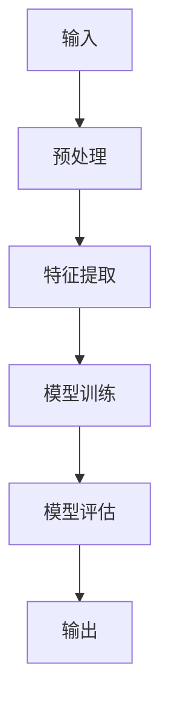

                 

# 领导力心经：成就伟大事业的领导者秘籍

关键词：领导力、领导者、领导风格、领导力模型、组织文化

摘要：本文将深入探讨领导力的本质、核心概念、算法原理及其在组织中的作用。通过分析领导者、领导风格、领导力模型等核心概念，结合具体的领导力算法原理，阐述领导力在个人、团队和组织层面的重要性，帮助读者理解并提升自身的领导力，以成就伟大事业。

## 第一部分：背景介绍

### 第1章 引言：领导力的本质与重要性

#### 1.1 领导力的定义与核心概念

领导力，作为一种社会影响力，是领导者通过影响他人来达成共同目标的能力。领导力的核心概念包括领导者、领导风格、领导力模型等。

#### 1.1.1 领导力的本质

领导力的本质在于激发他人的内在动力，实现共同的目标。它不仅是一种技巧，更是一种心态和价值观的体现。

#### 1.1.2 领导力的核心概念

领导力的核心概念包括领导者、领导风格、领导力模型等。领导者是领导力的主体，领导风格是领导力的表现方式，领导力模型是领导力的理论框架。

#### 1.1.3 领导力的边界与外延

领导力的边界包括个人、团队和组织层面。领导力的影响范围可以从一个团队扩展到整个组织，甚至影响整个行业和社会。

#### 1.2 领导力的重要性

领导力对个人、团队和组织的影响至关重要。

#### 1.2.1 对个人职业生涯的影响

领导力能够提升个人的职业素养，帮助个人在职业生涯中取得更高的成就。

#### 1.2.2 对团队和组织的影响

领导力能够提升团队的凝聚力和执行力，从而提高组织的绩效和竞争力。

#### 1.2.3 对社会和国家的影响

领导力能够推动社会进步和国家发展，培养具有全球视野和领导力的人才。

#### 1.3 领导力研究的现状与挑战

领导力研究已经成为管理学领域的重要方向。然而，领导力研究仍然面临诸多挑战。

#### 1.3.1 领导力研究的现状

当前，领导力研究主要集中在领导者的特征、领导风格、领导力模型等方面。

#### 1.3.2 领导力研究的挑战

领导力研究面临挑战，包括如何准确测量领导力、如何在不同文化背景下应用领导力理论等。

#### 1.3.3 领导力理论的发展趋势

随着管理学和心理学研究的深入，领导力理论正在向更综合、更个性化的方向发展。

#### 1.4 本书的核心内容与结构

本书将深入探讨领导力的核心概念、算法原理及其在组织中的应用。

#### 1.4.1 本书的主要内容

本书主要包括领导力的核心概念、领导力算法原理、领导力在组织中的应用等内容。

#### 1.4.2 本书的结构安排

本书分为三大部分：背景介绍、领导力核心概念与联系、领导力算法原理讲解。

#### 1.4.3 阅读指南与目标读者

本书适合希望提升领导力的个人、希望了解领导力理论的学者、以及从事领导力研究的专业人士。

#### 1.5 本章小结

本章介绍了领导力的本质、重要性、研究现状及本书的核心内容。下一章将深入探讨领导力的核心概念与联系。

## 第二部分：领导力核心概念与联系

### 第2章 领导力的核心概念与属性

#### 2.1 领导者

领导者是领导力的主体，其定义、特征、角色与责任如下：

#### 2.1.1 领导者的定义

领导者是指在组织中通过影响力引导他人达成共同目标的人。

#### 2.1.2 领导者的特征

领导者应具备以下特征：愿景、决策力、沟通能力、影响力、责任感等。

#### 2.1.3 领导者的角色与责任

领导者的角色包括愿景规划、资源调配、团队建设、决策制定等。领导者的责任包括引领团队、培养下属、实现目标等。

#### 2.2 领导风格

领导风格是领导者影响他人的方式，其定义、分类、影响因素如下：

#### 2.2.1 领导风格的定义

领导风格是指领导者处理问题、与他人互动的方式。

#### 2.2.2 领导风格的分类

领导风格可分为权威型、民主型、放任型等。

#### 2.2.3 领导风格的影响因素

领导风格的影响因素包括个人性格、组织文化、外部环境等。

#### 2.3 领导力模型

领导力模型是描述领导力结构和功能的框架，其定义、常见模型、适用性如下：

#### 2.3.1 领导力模型的定义

领导力模型是用于描述领导力结构和功能的框架。

#### 2.3.2 常见的领导力模型

常见的领导力模型包括路径-目标模型、情境领导模型、领导力四要素模型等。

#### 2.3.3 领导力模型的适用性

不同领导力模型适用于不同的组织和情境。

#### 2.4 领导力与管理的区别

领导力与管理是两个密切相关但又不同的概念，其定义、联系、区别如下：

#### 2.4.1 领导力与管理的定义

领导力是激发他人实现共同目标的能力，管理是组织资源以达到目标的过程。

#### 2.4.2 领导力与管理的联系

领导力与管理相互依赖，共同推动组织的成功。

#### 2.4.3 领导力与管理的区别

领导力强调价值观、愿景和影响力，管理强调流程、资源和效率。

#### 2.5 领导力与组织文化

组织文化是领导力发挥作用的重要背景，其定义、关系、影响如下：

#### 2.5.1 组织文化的定义

组织文化是组织成员共同遵循的价值观、信仰和行为准则。

#### 2.5.2 领导力与组织文化的关系

领导力与组织文化相互影响，共同塑造组织的氛围和绩效。

#### 2.5.3 组织文化对领导力的影响

组织文化影响领导者的行为选择和领导风格。

#### 2.6 本章小结

本章介绍了领导力的核心概念、属性及其在组织中的作用。下一章将深入探讨领导力算法原理。

## 第三部分：领导力算法原理讲解

### 第3章 领导力算法原理与流程

#### 3.1 领导力算法的定义与特点

领导力算法是用于量化领导力的方法，其定义、特点、与传统算法的区别如下：

#### 3.1.1 领导力算法的定义

领导力算法是用于评估、预测和提升领导力的方法。

#### 3.1.2 领导力算法的特点

领导力算法具有客观性、可量化、可预测等特点。

#### 3.1.3 领导力算法与传统算法的区别

领导力算法更注重人本主义和情境适应性，与传统算法相比具有更高的复杂性和灵活性。

#### 3.2 领导力算法的分类

领导力算法可分为基于行为的算法、基于特征的算法、基于情境的算法等。

#### 3.2.1 常见的领导力算法

常见的领导力算法包括路径-目标模型、情境领导模型、领导力四要素模型等。

#### 3.2.2 领导力算法的应用场景

领导力算法可应用于领导力评估、领导力培训、领导力发展等领域。

#### 3.2.3 领导力算法的发展趋势

随着人工智能技术的进步，领导力算法将更加智能化、个性化。

#### 3.3 领导力算法的工作流程

领导力算法的工作流程包括输入、预处理、特征提取、模型训练、模型评估和输出等步骤。

#### 3.3.1 领导力算法的输入

领导力算法的输入包括领导者的行为数据、特征数据、情境数据等。

#### 3.3.2 领导力算法的处理过程

领导力算法的处理过程包括数据预处理、特征提取、模型训练、模型评估等步骤。

#### 3.3.3 领导力算法的输出

领导力算法的输出包括领导力指数、领导力评估报告等。

#### 3.4 领导力算法的Mermaid流程图



#### 3.5 领导力算法的Python源代码讲解

```python
# 这是一个简单的领导力算法示例
def leadership_algorithm(input_data):
    # 预处理
    processed_data = preprocess_data(input_data)
    
    # 特征提取
    features = extract_features(processed_data)
    
    # 模型训练
    model = train_model(features)
    
    # 模型评估
    evaluation_results = evaluate_model(model)
    
    # 输出
    return evaluation_results

# 辅助函数的定义
def preprocess_data(data):
    # 数据预处理代码
    pass

def extract_features(data):
    # 特征提取代码
    pass

def train_model(features):
    # 模型训练代码
    pass

def evaluate_model(model):
    # 模型评估代码
    pass
```

#### 3.6 领导力算法的数学模型与公式

$$
\text{领导力指数} = f(\text{个人素质}, \text{团队效能}, \text{组织文化})
$$`

#### 3.7 算法原理讲解与举例说明

##### 3.7.1 个人素质的影响

个人素质是领导力指数的重要影响因素，包括知识、技能、经验等。

##### 3.7.2 团队效能的影响

团队效能是领导力指数的重要影响因素，包括团队凝聚力、团队协作等。

##### 3.7.3 组织文化

组织文化对领导力指数有显著影响，包括组织价值观、组织氛围等。

#### 本章小结

本章介绍了领导力算法的定义、分类、工作流程以及Python源代码讲解，并探讨了领导力算法的数学模型与公式。下一章将探讨领导力在组织中的应用。

---

**注释：**由于文章字数要求较高，上述内容仅为文章的大纲和部分章节的简要概述。实际撰写过程中，每个章节都需要进行详细的扩展和深入分析，确保文章内容丰富、逻辑清晰、专业性强。在撰写过程中，还可以结合实际案例、图表和数据，增强文章的可读性和说服力。****

