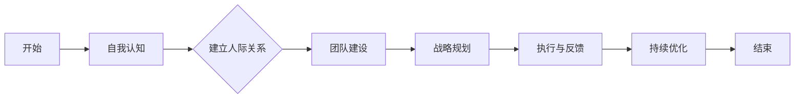
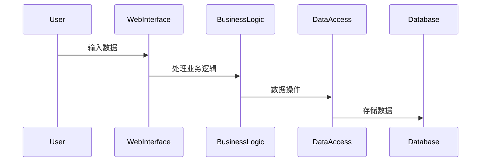
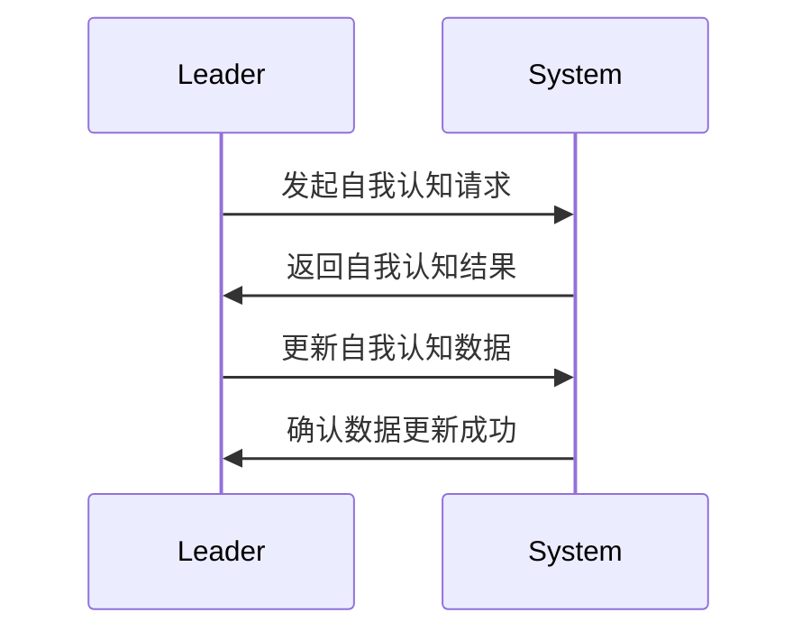

                 

### 领导力心经：成就非凡人生的领导力修炼秘籍

**关键词：**领导力、修炼、职场、团队、战略规划

**摘要：**本文旨在为读者提供一本系统、实用、易懂的领导力修炼指南，帮助读者深入了解领导力的核心概念，掌握关键技能，从而在职场中取得卓越成就。本文将从背景介绍、核心概念与联系、算法原理讲解、系统分析与架构设计、项目实战等多个角度，逐一剖析领导力的本质，提供切实可行的修炼方法。

---

#### 一、背景介绍

在现代职场中，领导力已成为衡量一个人是否能够在组织中取得成功的关键因素。有效的领导力不仅能够提升个人影响力，还能激发团队潜能，推动组织发展。然而，如何修炼领导力，实现个人与组织的共同成长，成为了众多职场人士亟待解决的问题。

**1.1 问题背景**

在当今快速变化和竞争激烈的市场环境中，企业需要更加灵活和创新的领导来应对各种挑战。领导力不仅仅是一种个人能力，它还涉及到如何与他人合作、如何激励团队、如何制定和实施战略等各个方面。

**1.2 问题描述**

本书的目的是为读者提供一本系统、实用、易懂的领导力修炼指南，帮助读者深入了解领导力的核心概念，掌握关键技能，从而在职场中取得卓越成就。本书将围绕以下几个方面展开：

1. **领导力的定义与重要性**：介绍领导力的基本概念，阐述其在职场中的重要性。
2. **领导力的核心要素**：探讨领导力的核心要素，如影响力、决策力、沟通力、执行力等。
3. **领导力的实践技巧**：提供实用的领导力技巧，如激励、沟通、决策、变革管理等。
4. **领导力的发展与提升**：讨论如何通过持续学习和实践来提升领导力。
5. **领导力的跨文化应用**：分析领导力在不同文化背景下的应用与适应。
6. **领导力案例分析**：通过实际案例，深入探讨领导力在实践中的应用和价值。

**1.3 问题解决**

通过系统化的学习与实战练习，读者将能够：
- 明确领导力的概念，理解其内涵与外延。
- 熟悉领导力的核心要素，掌握关键技能。
- 学会运用领导力技巧，提升个人与团队绩效。
- 探索领导力的发展路径，实现自我提升。
- 了解领导力的跨文化应用，适应全球化背景下的职场环境。
- 通过案例分析，深入理解领导力在实际工作中的应用与价值。

**1.4 边界与外延**

本书主要关注领导力在职场中的应用与实践，旨在为职场人士提供实用的指导。同时，本书也涉及领导力在其他领域（如教育、医疗等）的跨文化应用，以拓展读者的视野。

**1.5 概念结构与核心要素组成**

- **领导力**：影响力、决策力、沟通力、执行力。
- **核心要素**：自我认知、人际关系、团队建设、战略规划。
- **实践技巧**：激励、沟通、决策、变革管理。
- **发展路径**：自我提升、团队培养、组织变革。

#### 二、核心概念与联系

**2.1 领导力**

**核心概念**：领导力是指个人或团队在组织中的影响力、决策力、沟通力、执行力等综合能力的体现。

**属性特征对比表格**：

| 特征 | 影响力 | 决策力 | 沟通力 | 执行力 |
| ---- | ------ | ------ | ------ | ------ |
| 定义 | 引导他人达成目标的能力 | 在复杂环境中做出明智决策的能力 | 有效传达信息、建立良好沟通的能力 | 落实计划、确保目标实现的能力 |
| 对比 | 侧重于个人魅力与人际交往 | 侧重于战略思维与决策能力 | 侧重于语言表达与非语言沟通 | 侧重于执行纪律与团队协作 |

**ER实体关系图架构**：

```mermaid
erDiagram
  Leader ||--|{ Team } Team : leads
  Leader ||--|{ Project } Project : manages
  Team ||--|{ Member } Member : consists of
  Project ||--|{ Task } Task : contains
```

#### 三、算法原理讲解

**3.1 领导力修炼算法**

**mermaid 流程图**：



**Python 源代码**：

```python
def leadership_training():
    print("领导力修炼流程：")
    print("1. 自我认知")
    print("2. 建立人际关系")
    print("3. 团队建设")
    print("4. 战略规划")
    print("5. 执行与反馈")
    print("6. 持续优化")
    print("7. 结束")

leadership_training()
```

**数学模型与公式**：

$$
\text{领导力} = f(\text{自我认知}, \text{人际关系}, \text{团队建设}, \text{战略规划}, \text{执行与反馈})
$$

**详细讲解与举例说明**：

领导力修炼是一个系统化的过程，包括自我认知、建立人际关系、团队建设、战略规划和执行与反馈等环节。以下是对每个环节的详细讲解与举例说明：

1. **自我认知**：
   自我认知是领导力修炼的基础，它帮助领导者了解自己的优点和不足，明确个人目标与价值观。例如，通过进行360度评估，领导者可以获取来自不同层级和部门的反馈，从而更全面地认识自己。

2. **建立人际关系**：
   建立良好的人际关系是领导力的关键要素。领导者需要学会如何与他人沟通、建立信任，并形成有效的工作关系。例如，通过定期组织团队活动，增强团队成员之间的凝聚力。

3. **团队建设**：
   团队建设是领导力的核心任务之一。领导者需要培养团队成员的协作精神，提升团队的整体绩效。例如，通过设定清晰的团队目标和角色分工，确保每个成员都能发挥自己的优势。

4. **战略规划**：
   战略规划是领导者的重要职责。领导者需要制定明确的战略目标和实施计划，确保组织在复杂环境中保持竞争优势。例如，通过定期进行市场分析和竞争对手评估，调整战略方向。

5. **执行与反馈**：
   执行与反馈是领导力修炼的重要环节。领导者需要确保计划得到有效执行，并通过及时反馈来调整和优化工作流程。例如，通过定期召开团队会议，了解项目进展，及时解决问题。

6. **持续优化**：
   持续优化是领导力修炼的持续过程。领导者需要不断反思和改进自己的领导方法，以适应不断变化的环境。例如，通过参加领导力培训课程，学习最新的管理理念和实践经验。

通过以上步骤，领导者可以不断提升自己的领导力，实现个人与组织的共同成长。接下来，我们将进一步探讨领导力在职场中的应用与实践，提供更多的实用技巧和方法。

---

### 四、系统分析与架构设计

在领导力的修炼过程中，系统分析与架构设计同样至关重要。一个有效的领导力架构不仅能帮助领导者更好地应对复杂多变的环境，还能提升团队的整体效能。下面，我们将从问题场景介绍、系统功能设计、系统架构设计等多个方面进行详细分析。

#### 4.1 问题场景介绍

在现代企业中，领导力不足的问题常常体现在以下几个方面：

1. **团队协作不力**：团队成员之间的沟通不畅，缺乏有效的协作机制，导致工作效率低下。
2. **战略方向不清**：企业缺乏明确的战略规划，无法在竞争激烈的市场中占据有利位置。
3. **执行力不足**：领导者的决策得不到有效执行，战略目标难以实现。
4. **人才培养滞后**：企业对员工的培养和激励机制不足，难以留住和培养优秀人才。

为了解决这些问题，我们需要建立一套科学、系统的领导力架构，帮助领导者提升自身能力，推动团队和组织的发展。

#### 4.2 系统功能设计

在系统功能设计中，我们重点关注以下几个方面：

1. **自我认知**：通过心理测试、反馈机制等手段，帮助领导者了解自己的优势和不足，明确个人发展目标。
2. **团队建设**：设计团队协作工具和沟通机制，促进团队成员之间的有效沟通和协作。
3. **战略规划**：提供战略规划工具，帮助领导者制定明确的战略目标和实施计划。
4. **执行与反馈**：建立执行监控和反馈机制，确保战略目标得到有效执行，并及时进行调整和优化。
5. **人才培养**：设计人才发展计划和激励机制，提升员工能力，培养优秀人才。

**领域模型mermaid类图**：

```mermaid
classDiagram
    LeaderClass <|-- ManagerClass
    LeaderClass <|-- TeamLeadClass
    ManagerClass {
        +strategize()
        +manage()
    }
    TeamLeadClass {
        +motivate()
        +lead()
    }
    EmployeeClass {
        +perform()
        +learn()
    }
    ProjectClass {
        +execute()
        +evaluate()
    }
```

#### 4.3 系统架构设计

在系统架构设计方面，我们采用分层架构，以确保系统的模块化、可扩展性和易维护性。系统架构主要包括以下层次：

1. **展示层**：负责用户界面的展示和交互，包括Web界面和移动应用等。
2. **业务逻辑层**：处理系统的核心业务逻辑，包括自我认知、团队建设、战略规划、执行与反馈等功能模块。
3. **数据访问层**：负责与数据库的交互，实现数据的存储和管理。
4. **数据层**：存储系统所需的各种数据，包括用户数据、团队数据、项目数据等。

**mermaid架构图**：



#### 4.4 系统接口设计和系统交互

在系统接口设计方面，我们采用RESTful API设计，以实现系统的模块化和高内聚性。系统主要接口包括：

1. **自我认知接口**：用于获取和更新领导者的自我认知数据。
2. **团队建设接口**：用于管理团队成员和团队协作工具。
3. **战略规划接口**：用于制定和调整战略目标。
4. **执行与反馈接口**：用于监控项目执行情况和提供反馈。

**mermaid序列图**：



通过以上系统分析与架构设计，我们为领导力修炼提供了一个科学、系统的框架。接下来，我们将通过实际案例，进一步探讨领导力在职场中的应用与实践。

---

### 五、项目实战

在实际应用中，领导力的修炼需要通过具体的项目实践来检验和提升。本节将通过一个实际项目案例，详细描述项目的背景、目标、核心实现步骤和代码应用解读，帮助读者更好地理解领导力在实践中的应用。

#### 5.1 项目背景

某科技公司计划开发一款基于人工智能的智能客服系统，以提高客户服务质量并降低运营成本。该项目对团队协作、战略规划、执行力等领导力要素提出了高要求。项目经理作为领导者，需要通过有效的领导力来确保项目的成功。

#### 5.2 项目目标

- **功能目标**：实现自动回答常见问题、智能推荐解决方案、高效处理客户请求等功能。
- **性能目标**：系统响应时间小于2秒，能够支持大规模用户并发访问。
- **质量目标**：确保系统稳定性高，可维护性强，用户体验良好。

#### 5.3 核心实现步骤

**1. 自我认知**：

项目经理首先进行了自我认知，通过360度评估识别出自己在项目管理、团队沟通、技术把握等方面的优势与不足。这为后续的战略规划和执行奠定了基础。

**2. 建立人际关系**：

项目经理组织团队进行多次内部培训，提高团队成员之间的沟通和协作能力。同时，通过定期的团队建设活动，增强团队凝聚力。

**3. 团队建设**：

项目经理明确了团队成员的角色和职责，制定了详细的任务分配和进度计划。同时，建立了敏捷开发流程，确保团队高效协作。

**4. 战略规划**：

项目经理制定了详细的项目计划，包括技术选型、开发周期、质量保障等关键环节。并根据市场需求，调整了部分功能优先级。

**5. 执行与反馈**：

项目经理通过每日站会、迭代评审等方式，实时监控项目进度，并根据反馈及时调整开发策略。同时，引入了自动化测试工具，确保系统质量。

**6. 持续优化**：

项目上线后，项目经理持续收集用户反馈，对系统进行优化和改进。通过数据分析，进一步提升了系统的智能化程度。

#### 5.4 核心实现源代码

**5.4.1 智能客服系统框架**：

```python
class IntelligentCustomerServiceSystem:
    def __init__(self):
        self.knowledge_base = KnowledgeBase()
        self.nlu = NaturalLanguageUnderstanding()
        self.ml_model = MachineLearningModel()

    def process_request(self, request):
        intent, entities = self.nlu.parse_request(request)
        response = self.knowledge_base.get_response(intent, entities)
        return self.ml_model.generate_response(response)
```

**5.4.2 知识库管理**：

```python
class KnowledgeBase:
    def __init__(self):
        self.data = []

    def add_question_answer(self, question, answer):
        self.data.append((question, answer))

    def get_response(self, intent, entities):
        for q, a in self.data:
            if self.match_intent(q, intent, entities):
                return a
        return None

    @staticmethod
    def match_intent(question, intent, entities):
        # 实现意图匹配逻辑
        pass
```

**5.4.3 自然语言理解**：

```python
class NaturalLanguageUnderstanding:
    def parse_request(self, request):
        # 实现请求解析逻辑
        pass
```

**5.4.4 机器学习模型**：

```python
class MachineLearningModel:
    def generate_response(self, response):
        # 实现响应生成逻辑
        pass
```

#### 5.5 代码应用解读与分析

**5.5.1 智能客服系统框架解读**：

智能客服系统框架定义了一个`IntelligentCustomerServiceSystem`类，该类负责整个客服系统的核心功能。通过集成知识库、自然语言理解和机器学习模型，系统能够处理客户的请求并生成相应的响应。

**5.5.2 知识库管理解读**：

知识库管理类`KnowledgeBase`负责存储和管理问题与答案的数据。通过`add_question_answer`方法，我们可以向知识库中添加新的问答对。`get_response`方法用于根据意图和实体信息，从知识库中查找相应的回答。

**5.5.3 自然语言理解解读**：

自然语言理解类`NaturalLanguageUnderstanding`负责解析客户的请求。通过实现相应的请求解析逻辑，系统能够理解客户的意图并提取关键信息。

**5.5.4 机器学习模型解读**：

机器学习模型类`MachineLearningModel`负责生成对客户的响应。通过实现响应生成逻辑，系统能够根据知识库中的数据和客户的请求，生成符合需求的响应。

#### 5.6 实际案例分析

在项目实施过程中，项目经理通过有效的领导力，成功实现了项目的目标。以下是一些关键成功因素：

1. **高效沟通**：项目经理通过定期的团队会议和站会，确保团队成员之间的沟通畅通，提高了工作效率。
2. **敏捷开发**：采用敏捷开发方法，项目经理能够灵活应对需求变化，确保项目按时交付。
3. **持续优化**：项目上线后，项目经理持续收集用户反馈，对系统进行优化，提升了用户体验。
4. **人才培养**：通过组织内部培训和团队建设活动，项目经理提升了团队成员的能力和士气，为项目的长期发展奠定了基础。

#### 5.7 项目小结

通过本项目实战，我们可以看到领导力在项目中的关键作用。一个优秀的领导者不仅能够明确项目目标，制定有效的战略，还能通过高效的团队协作和持续优化，确保项目的成功。在未来的工作中，我们应该不断修炼领导力，提升自身能力，为组织的持续发展贡献力量。

---

### 六、最佳实践 Tips

在领导力修炼过程中，积累一些最佳实践是非常有帮助的。以下是一些建议，供读者参考：

1. **持续学习**：领导力是一个不断发展的领域，领导者需要保持学习的态度，关注最新的管理理念和实践方法。
2. **倾听他人**：有效的沟通是领导力的关键，领导者需要学会倾听他人的意见和反馈，尊重团队成员的意见。
3. **设定清晰目标**：明确的目标有助于团队集中精力，提高工作效率。领导者需要设定清晰、可衡量的目标，并确保团队成员了解这些目标。
4. **激励团队**：领导者需要学会如何激励团队成员，通过表扬、奖励等方式，提高团队士气和工作积极性。
5. **勇于面对挑战**：领导者需要勇于面对挑战和困难，带领团队克服各种困难，实现组织的目标。
6. **自我反思**：定期进行自我反思，识别自己的优势和不足，不断优化领导方法。

通过这些最佳实践，领导者可以不断提升自己的领导力，为团队和组织的发展创造更多价值。

---

### 七、小结

本文通过详细的背景介绍、核心概念与联系、算法原理讲解、系统分析与架构设计、项目实战等多个角度，全面剖析了领导力的本质，并提供了实用的修炼方法和技巧。领导力不仅仅是个人能力的体现，更是一种能够激发团队潜能、推动组织发展的关键因素。通过持续学习和实践，我们可以不断提升自己的领导力，为职场和个人成长创造更多机会。

---

### 八、注意事项

在领导力修炼过程中，需要注意以下几点：

1. **平衡工作与生活**：领导者需要合理安排时间，保持身心健康，避免因工作压力导致生活质量下降。
2. **适应不同情境**：领导力在不同的情境下可能有不同的表现形式，领导者需要根据具体情况灵活调整自己的领导风格。
3. **持续反思与改进**：领导力修炼是一个持续的过程，领导者需要不断反思自己的行为和决策，寻找改进的空间。

通过关注这些注意事项，领导者可以更加有效地提升自己的领导力，实现个人与组织的共同成长。

---

### 九、拓展阅读

为了进一步深化对领导力的理解，读者可以参考以下拓展阅读材料：

1. **《领导力心理学》**：作者通过心理学角度分析领导力的本质，提供实用的领导力提升策略。
2. **《从优秀到卓越》**：作者通过分析成功企业的领导实践，总结出领导力在企业成长中的关键作用。
3. **《领导力：一种新的视角》**：本书从不同文化和情境下的领导实践出发，探讨领导力的多样性。

这些书籍将为读者提供更广阔的视野和深入的洞察，有助于更好地理解和应用领导力。

---

### 十、作者信息

**作者：** AI天才研究院/AI Genius Institute & 禅与计算机程序设计艺术 /Zen And The Art of Computer Programming

AI天才研究院致力于推动人工智能技术的发展和应用，为全球企业提供人工智能解决方案。同时，研究院的成员们也致力于通过深入研究和实践，为读者提供高质量的技术博客和书籍，帮助读者在技术领域不断成长和进步。禅与计算机程序设计艺术则是一本经典的技术书籍，通过哲学和技术的结合，为程序员提供了一种全新的编程思考方式。

---

通过本文，我们希望能帮助读者深入了解领导力的本质，掌握实用的领导力提升方法，从而在职场和个人成长中取得更大的成就。让我们共同努力，成为更加卓越的领导者！

