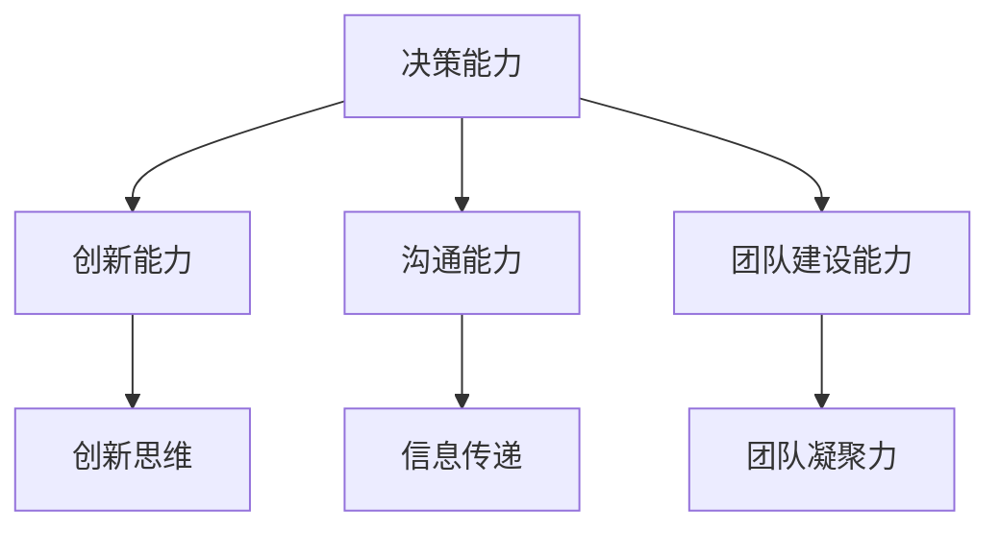

                 

# 领导力思维：改变世界的领导力修炼法则

## 关键词：领导力、商业成功、个人成长、团队建设、跨文化管理

> 摘要：本文旨在探讨领导力的核心概念、培养方法及其在不同文化和市场环境下的应用。通过深入分析领导力的定义、核心要素、培养方法以及实践案例，本文为读者提供了一套实用的领导力修炼法则，帮助读者提升领导力，实现个人和组织的成功。

## 第一部分：背景介绍

### 问题背景

在当今快速发展的商业环境中，领导力已经成为组织成功的关键因素之一。无论是大企业还是初创公司，领导力不仅影响企业的运营效率和创新能力，更是决定企业能否在激烈的市场竞争中脱颖而出的关键。

### 问题描述

然而，许多企业在领导力方面面临诸多挑战。例如，一些企业的领导者在面对复杂问题和变化的市场环境时，往往缺乏有效的决策能力和创新能力。此外，随着全球化的发展和市场竞争的加剧，企业的领导力需要更加多元化、国际化，以适应不同文化背景和市场环境的需求。

### 问题解决

为了解决这些问题，本书旨在通过深入分析和探讨领导力思维的原理和方法，帮助读者理解领导力的本质，提升领导力水平。书中不仅涵盖传统领导力理论，还将结合现代领导力的实践和案例，为读者提供全面的领导力修炼法则。

### 边界与外延

本书的核心内容将围绕领导力思维展开，包括领导力的定义、核心要素、培养方法以及在实际应用中的挑战和解决方案。同时，书中还会探讨领导力在不同文化和市场环境下的表现和适应策略。

### 概念结构与核心要素组成

- **领导力的定义**：对领导力的基本概念进行阐述，包括领导力与管理的区别。
- **领导力的核心要素**：详细解析领导力的关键要素，如决策能力、创新能力、沟通能力、团队建设能力等。
- **领导力的培养方法**：介绍培养领导力的有效方法，包括自我反思、学习与实践等。
- **领导力的应用**：分析领导力在不同企业和行业中的应用场景，提供具体的实践案例。
- **跨文化领导力**：探讨领导力在不同文化背景下的挑战和适应策略。

## 第二部分：领导力的核心概念与联系

### 第2章：领导力的定义与核心要素

#### 2.1 领导力的定义

领导力是一种影响力，它能够激发和引导他人达成共同目标的能力。与管理的区别在于，管理侧重于协调资源、制定目标和执行计划，而领导力则更多地关注激励和启发他人。

#### 2.2 领导力的核心要素

领导力的核心要素包括以下几个方面：

##### 决策能力

领导者需要具备快速做出明智决策的能力。这包括分析问题的能力、权衡利弊的能力以及在不确定情况下做出决策的能力。

##### 创新能力

在快速变化的市场环境中，领导者需要具备创新能力，能够引领企业进行变革和创新，保持竞争优势。

##### 沟通能力

有效的沟通能力是领导力的关键要素之一。领导者需要能够清晰、准确地传达信息，同时也要倾听和理解他人的意见和需求。

##### 团队建设能力

领导者需要能够建立高效的团队，激发团队成员的潜力，并促进团队合作。

#### 2.3 核心要素对比表格

| 核心要素 | 描述 | 对领导力的影响 |
| --- | --- | --- |
| 决策能力 | 快速做出明智决策的能力 | 决策能力直接影响企业的运营效率和竞争力 |
| 创新能力 | 引领企业变革和创新的能力 | 创新能力决定企业能否在竞争激烈的市场中保持领先地位 |
| 沟通能力 | 清晰、准确地传达信息并倾听他人 | 沟通能力决定团队的协作效率和领导者的影响力 |
| 团队建设能力 | 建立高效团队并激发成员潜力 | 团队建设能力决定团队的士气和团队绩效 |

#### 2.4 领导力要素的ER实体关系图

### 第3章：领导力的培养方法

#### 3.1 自我反思

自我反思是培养领导力的关键方法之一。通过定期进行自我反思，领导者可以认识到自己的优点和不足，从而有针对性地进行改进。

#### 3.2 学习与实践

学习是提升领导力的必经之路。领导者需要不断学习新的知识和技能，以适应不断变化的市场环境。同时，实践是检验学习成果的关键，只有将所学应用到实际工作中，才能真正提升领导力水平。

#### 3.3 挑战与成长

领导力是在面对挑战和困难中不断成长和提升的。通过挑战自我、克服困难，领导者可以不断提升自己的领导力水平。

### 第4章：领导力在不同文化和市场环境下的表现

#### 4.1 跨文化领导力

跨文化领导力是领导者在不同文化背景下有效领导的能力。这包括理解不同文化的价值观、行为模式和工作习惯，并能够灵活应对文化差异带来的挑战。

#### 4.2 全球市场环境下的领导力

全球市场环境下的领导力要求领导者具备国际视野和跨文化沟通能力，能够适应全球化背景下的市场竞争和合作需求。

### 第5章：领导力的应用与实践

#### 5.1 领导力在企业中的应用

在企业中，领导力不仅影响企业的运营效率和创新能力，更是决定企业能否在激烈的市场竞争中脱颖而出的关键。通过有效的领导力实践，企业可以提升团队凝聚力、激发员工潜力，从而实现企业的长远发展。

#### 5.2 领导力在团队建设中的应用

在团队建设中，领导力发挥着至关重要的作用。领导者需要通过有效的沟通、团队建设和激励，激发团队成员的潜力，实现团队的高效协作。

#### 5.3 领导力在跨文化管理中的应用

在全球化背景下，跨文化管理成为企业面临的重要挑战。领导者需要具备跨文化领导力，理解不同文化的价值观和行为模式，实现跨文化团队的协同合作。

## 总结与展望

通过本文的探讨，我们可以看到领导力在商业成功和个人成长中的重要性。领导力不仅是企业成功的关键因素，也是个人实现自我突破和职业发展的必备能力。在未来的发展中，领导者需要不断学习和实践，提升自己的领导力水平，以应对不断变化的市场环境和文化背景。

让我们再次回顾本文的核心内容：

1. 领导力是一种影响力，它能够激发和引导他人达成共同目标。
2. 领导力的核心要素包括决策能力、创新能力、沟通能力和团队建设能力。
3. 自我反思、学习和实践是培养领导力的关键方法。
4. 跨文化领导力和全球市场环境下的领导力是未来领导者需要重点关注的方向。

最后，让我们以一句名言作为结尾：“领导力不是天生的，而是通过不断的学习和实践培养出来的。”希望本文能对您在领导力修炼的道路上有所启发和帮助。

## 作者信息

作者：AI天才研究院/AI Genius Institute & 禅与计算机程序设计艺术 /Zen And The Art of Computer Programming

### 参考资料

1. 汉姆布里克，拉尔夫. 《领导力》：中国财政经济出版社，2017.
2. 卡耐基，戴尔. 《领导力的艺术》：机械工业出版社，2015.
3. 德鲁克，彼得. 《管理的实践》：机械工业出版社，2014.
4. 波斯纳，理查德. 《跨文化沟通》：中国人民大学出版社，2016.

