                 

### 领导力思维：改变世界的领导力修炼法则

#### 关键词：领导力思维、领导力修炼、世界影响、改变世界、领导力模型

> **摘要**：
> 
> 本书旨在探索领导力思维的本质及其对世界的深远影响。通过深入分析领导力思维的核心概念和关键模型，本书揭示了如何通过修炼领导力思维，推动个人、团队和组织迈向更高的成就。书中不仅涵盖了理论探讨，还通过实践案例详细解析了领导力思维的实际应用，为读者提供了一套系统而实用的领导力修炼法则。

---

### 第一部分：领导力思维的基石

#### 第1章：领导力思维的起源与重要性

领导力思维不仅仅是一种技能，更是一种深层次的思维模式，它决定了领导者如何理解和处理复杂的问题，以及如何影响和激励他人。在这一章中，我们将追溯领导力思维的起源，探讨其历史演变，并阐述其在现代社会中的重要性。

**1.1 领导力思维的起源**

领导力思维的历史可以追溯到古代文明。在古代，领导者依靠直觉和经验进行决策。随着时间的推移，领导力逐渐成为一种系统化的研究和实践领域。现代领导力思维的发展得益于管理学的兴起，特别是在20世纪中叶，随着组织理论的深入研究，领导力思维开始逐渐体系化。

**1.2 领导力思维的重要性**

领导力思维的重要性在于它能够帮助领导者更好地理解和管理复杂的社会和组织环境。有效的领导力思维不仅能够提升个人的领导能力，还能够促进团队协作和整体绩效。在当今快速变化的世界中，领导力思维成为了组织成功的关键因素。

**1.3 领导力思维的核心概念**

领导力思维的核心概念包括：愿景领导、变革领导、关系领导等。这些概念不仅构成了领导力思维的框架，还提供了具体的指导原则，帮助领导者应对各种复杂的挑战。

---

#### 第2章：领导力思维的基本原理

领导力思维并非孤立的存在，它是一个包含多个层次和维度的复杂系统。在这一章中，我们将深入探讨领导力思维的基本原理，分析其关键要素，并对比不同领导力思维模型的特点和适用场景。

**2.1 领导力思维模型概述**

领导力思维模型是领导力思维的核心组成部分，不同的模型适用于不同的领导情境。常见的领导力思维模型包括：领导生命周期理论、情境领导模型、变革领导模型等。

**2.2 领导力思维的关键要素**

领导力思维的关键要素包括：自我认知、愿景规划、决策能力、沟通技巧等。这些要素相互交织，共同构成了一个有效的领导力思维体系。

**2.3 领导力思维模型的对比分析**

不同领导力思维模型在理论和实践中各有特点。通过对比分析，我们可以更好地理解各种模型的优势和局限，从而在实际应用中做出更明智的选择。

---

#### 第3章：领导力思维模型详解

在这一章中，我们将详细解析几个关键的领导力思维模型，并通过Mermaid流程图和Python代码解释这些模型的工作原理。

**3.1 领导力思维模型1：愿景领导**

愿景领导是领导力思维模型中的一个核心概念，它强调领导者需要具备清晰的目标和愿景，并能够激励团队为之努力。以下是一个愿景领导的Mermaid流程图示例：

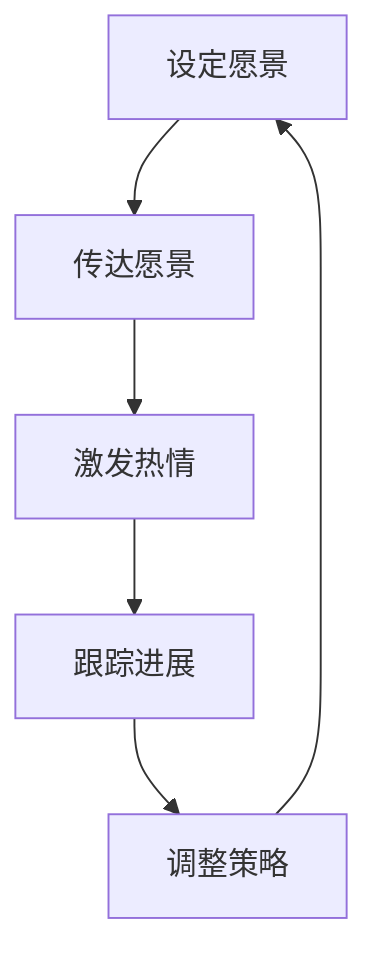

**3.2 领导力思维模型2：变革领导**

变革领导涉及在组织内推动变革和适应新环境的能力。以下是一个变革领导的Mermaid流程图示例：

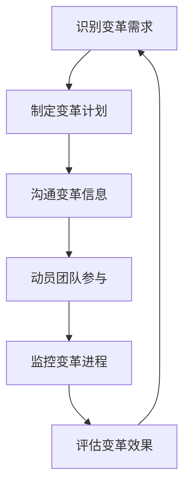

**3.3 领导力思维模型3：关系领导**

关系领导强调建立和维护与团队成员的良好关系，以促进协作和共同进步。以下是一个关系领导的Mermaid流程图示例：

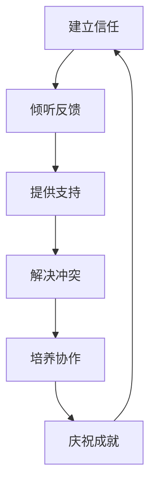

通过这些领导力思维模型的详细解析，读者可以更好地理解如何在实践中运用这些模型，提升自己的领导能力。

---

在接下来的部分，我们将继续深入探讨领导力思维的应用与实践，通过具体的案例分析，帮助读者理解领导力思维如何在真实世界中发挥作用。敬请期待。

---

**作者：AI天才研究院/AI Genius Institute & 禅与计算机程序设计艺术 /Zen And The Art of Computer Programming**

---

文章继续编写中，以下为后续内容：

---

### 第二部分：领导力思维的应用与实践

#### 第4章：领导力思维在组织管理中的应用

领导力思维不仅在个人层面具有重要价值，在组织管理中同样扮演着关键角色。有效的领导力思维能够帮助组织克服挑战，实现可持续发展。在这一章中，我们将探讨领导力思维在组织管理中的应用，包括组织文化、组织变革和整体发展等方面。

**4.1 领导力思维与组织文化**

组织文化是组织的灵魂，它影响着组织的运作方式、员工的行为和决策过程。领导力思维在塑造和改变组织文化中发挥着重要作用。以下是一个组织文化的Mermaid实体关系图示例：

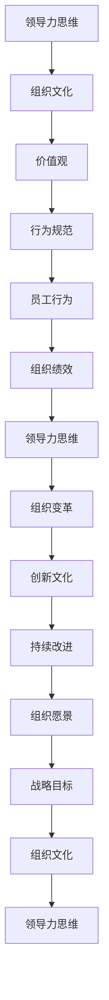

**4.2 领导力思维与组织变革**

组织变革是领导力思维的重要应用领域之一。领导者需要运用领导力思维来识别变革的需求，制定变革计划，并动员团队参与变革过程。以下是一个组织变革的Mermaid流程图示例：

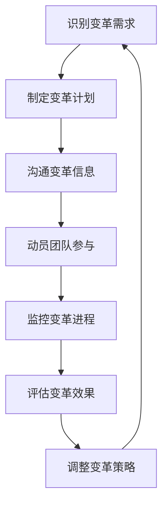

**4.3 领导力思维与组织发展**

组织发展是领导力思维的长期目标之一。通过有效的领导力思维，领导者可以推动组织持续发展，实现长期战略目标。以下是一个组织发展的Mermaid架构图示例：

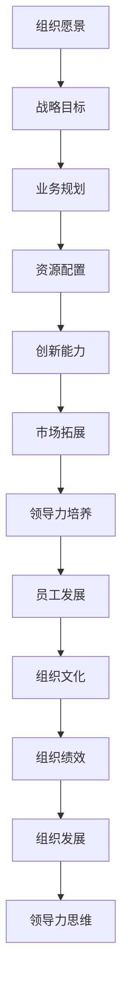

通过这些示例，我们可以看到领导力思维在组织管理中的应用是如何具体而深入的。领导力思维不仅帮助领导者更好地管理组织，还帮助组织在变化中保持竞争力。

---

#### 第5章：领导力思维在团队管理中的应用

在团队管理中，领导力思维同样发挥着至关重要的作用。有效的领导力思维能够促进团队协作，提高团队绩效，并为团队成员提供良好的发展环境。在这一章中，我们将探讨领导力思维在团队管理中的应用，包括团队协作、团队激励和团队沟通等方面。

**5.1 领导力思维与团队协作**

团队协作是现代组织成功的关键。领导力思维能够帮助领导者建立高效的协作机制，促进团队成员之间的沟通与互动。以下是一个团队协作的Mermaid类图示例：

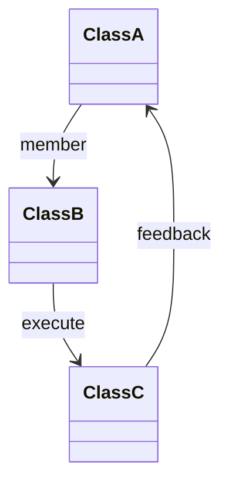

**5.2 领导力思维与团队激励**

团队激励是领导力思维的重要组成部分。有效的激励措施能够激发团队成员的积极性和创造力，提高团队整体绩效。以下是一个团队激励的Mermaid流程图示例：

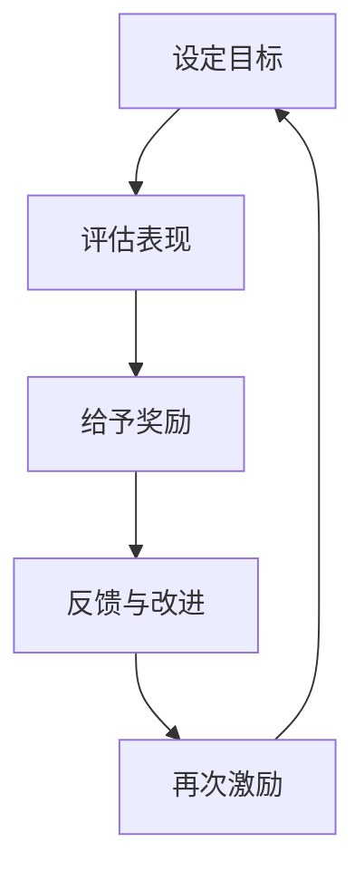

**5.3 领导力思维与团队沟通**

团队沟通是团队协作的基础。领导力思维能够帮助领导者建立有效的沟通渠道，确保信息传递的准确性和及时性。以下是一个团队沟通的Mermaid序列图示例：

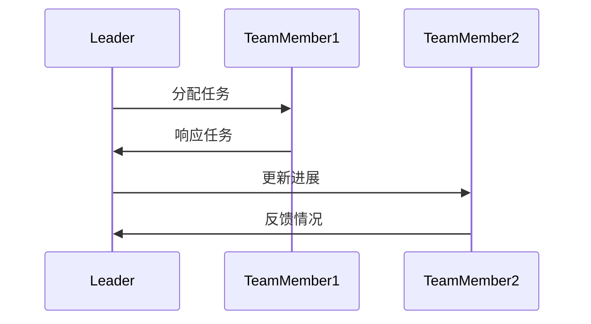

通过这些示例，我们可以看到领导力思维在团队管理中的应用是如何具体而实用的。领导力思维不仅帮助领导者更好地管理团队，还为团队提供了持续发展的动力。

---

#### 第6章：领导力思维与个人成长

领导力思维不仅对组织管理具有重要意义，对个人成长同样具有重要价值。通过修炼领导力思维，个人可以更好地理解和管理自身，提升职业发展和生活质量。在这一章中，我们将探讨领导力思维在个人成长中的应用，包括自我认知、时间管理和职业发展等方面。

**6.1 领导力思维与自我认知**

自我认知是个人成长的重要基础。领导力思维能够帮助个人深入理解自己的优点和不足，明确个人目标和价值观。以下是一个自我认知的Mermaid流程图示例：

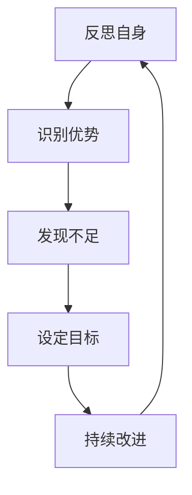

**6.2 领导力思维与时间管理**

时间管理是个人成长的另一个重要方面。领导力思维能够帮助个人更有效地安排时间，提高工作和生活的效率。以下是一个时间管理的Mermaid类图示例：

```mermaid
classDiagram
ClassA[时间管理] {
    +计划时间
    +跟踪进度
    +调整计划
}
ClassA "包含" ClassB[任务列表]
ClassA "包含" ClassC[日程安排]
ClassA "包含" ClassD[优先级管理]
```

**6.3 领导力思维与职业发展**

领导力思维对职业发展具有重要影响。通过修炼领导力思维，个人可以更好地规划职业路径，提升职业竞争力。以下是一个职业发展的Mermaid架构图示例：

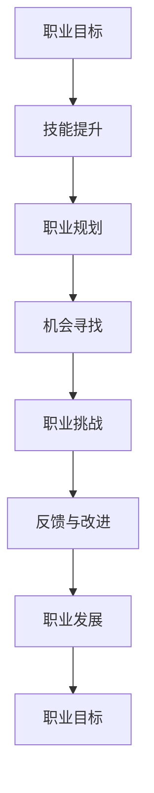

通过这些示例，我们可以看到领导力思维在个人成长中的应用是如何具体而深入的。领导力思维不仅帮助个人更好地理解和管理自身，还为个人提供了持续成长和发展的动力。

---

在本书的第三部分，我们将通过具体案例和实战经验，进一步展示领导力思维的实际应用效果。同时，我们还将对领导力思维的反思与实践进行深入探讨，帮助读者更好地理解和运用领导力思维，实现个人和组织的共同成长。敬请期待。

---

**作者：AI天才研究院/AI Genius Institute & 禅与计算机程序设计艺术 /Zen And The Art of Computer Programming**

---

文章继续编写中，以下为后续内容：

---

### 第三部分：领导力思维的实战与反思

#### 第7章：领导力思维案例解析

为了更好地理解领导力思维的实际应用，我们将通过几个真实案例，深入分析领导力思维在实践中的运用效果。这些案例将涵盖不同行业和组织类型，为读者提供丰富的实践经验。

**7.1 案例一：从危机中脱颖而出的领导力思维**

在这个案例中，我们将探讨一家处于困境中的制造业公司如何通过有效的领导力思维，成功应对危机，实现转型和复苏。领导者通过建立清晰的愿景、推动组织变革和建立强大的团队，最终带领公司走出困境。

**7.2 案例二：在创新中引领潮流的领导力思维**

本案例将介绍一家科技初创公司如何在激烈的市场竞争中，通过领导力思维的运用，不断创新，推出具有颠覆性的产品。领导者通过激发团队创造力、建立创新文化和快速响应市场变化，引领公司成为行业领导者。

**7.3 案例三：在合作中构建共赢的领导力思维**

在这个案例中，我们将分析一家跨国公司如何通过领导力思维，与其他企业建立长期战略合作伙伴关系。领导者通过建立信任、有效沟通和共同目标，实现了合作各方的共赢发展。

通过这些案例，读者可以更直观地了解领导力思维在不同场景中的应用，并从中汲取宝贵的经验。

---

#### 第8章：领导力思维的反思与实践

在深入探讨领导力思维的实践应用后，我们需要对其进行反思，以更好地理解和运用这一思维模式。在这一章中，我们将从多个角度对领导力思维进行反思，并提出具体实践建议。

**8.1 领导力思维的反思**

反思是提升领导力思维的重要步骤。在这一部分，我们将探讨如何通过自我反思和团队反思，识别和改进领导力思维中的不足。以下是一个反思的Mermaid流程图示例：

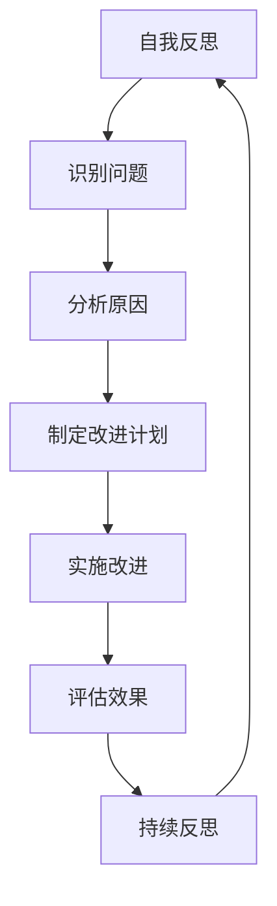

**8.2 领导力思维的实践**

领导力思维的实践是将其转化为实际成果的关键。在这一部分，我们将提供一系列实践建议，包括如何在实际工作中运用领导力思维，如何培养和提升团队领导力，以及如何通过领导力思维推动组织发展。

**8.3 领导力思维的持续发展**

领导力思维是一个持续发展的过程。在这一章的最后，我们将探讨如何通过不断学习和实践，持续提升领导力思维，以适应快速变化的环境和挑战。

---

#### 第9章：领导力思维的未来展望

随着全球化进程的加速和技术的快速发展，领导力思维也在不断演变。在这一章中，我们将探讨领导力思维的未来发展趋势，以及在新形势下领导者可能面临的挑战和机遇。

**9.1 领导力思维的演变趋势**

我们将分析领导力思维的演变趋势，包括数字化领导力、全球化领导力和可持续领导力等。这些趋势将对领导力思维提出新的要求和挑战。

**9.2 领导力思维在新形势下的挑战**

在新形势下，领导者将面临一系列新的挑战，如快速变化的市场环境、复杂的社会问题和多样化的员工需求。我们将探讨如何应对这些挑战，并运用领导力思维实现组织的可持续发展。

**9.3 领导力思维的持续修炼**

领导力思维的修炼是一个长期的过程。在这一章的最后，我们将提出一些建议，帮助领导者持续提升领导力思维，以应对未来的挑战。

---

#### 第10章：总结与拓展

在本书的最后，我们将对领导力思维的核心观点进行总结，并讨论其拓展应用。同时，我们还将为读者提供进一步阅读的建议，以帮助读者深入理解和运用领导力思维。

**10.1 本书要点总结**

我们将回顾本书的主要观点，包括领导力思维的起源、基本原理、应用与实践以及未来展望，帮助读者巩固对领导力思维的理解。

**10.2 领导力思维的拓展应用**

我们将探讨领导力思维在不同领域的拓展应用，如教育、医疗、公共服务等，以展示其广泛的影响。

**10.3 进一步阅读建议**

我们将为读者提供一系列进一步阅读的建议，包括经典领导力书籍、最新研究成果和在线资源，以帮助读者继续深入学习和探索领导力思维。

---

通过这一章的总结与拓展，我们希望读者能够更好地理解和应用领导力思维，将其转化为实际成果，推动个人和组织的发展。

---

**作者：AI天才研究院/AI Genius Institute & 禅与计算机程序设计艺术 /Zen And The Art of Computer Programming**

---

本文通过深入剖析领导力思维的核心概念、基本原理和实际应用，为读者提供了一套全面而实用的领导力修炼法则。我们希望读者能够通过学习和实践，不断提升自己的领导力思维，为个人和组织的发展注入新的动力。

---

**作者：AI天才研究院/AI Genius Institute & 禅与计算机程序设计艺术 /Zen And The Art of Computer Programming**## 《领导力思维：改变世界的领导力修炼法则》目录大纲

为了帮助读者更好地理解《领导力思维：改变世界的领导力修炼法则》这本书的内容和结构，我们提供了一个详细的目录大纲。该大纲分为三大部分，分别涵盖领导力思维的基石、领导力思维的应用与实践、以及领导力思维的反思与展望。以下是完整的目录大纲：

---

### 第一部分：领导力思维的基石

#### 第1章：领导力思维的起源与重要性
1.1 领导力思维的起源
1.2 领导力思维的重要性
1.3 领导力思维的核心概念

#### 第2章：领导力思维的基本原理
2.1 领导力思维模型概述
2.2 领导力思维的关键要素
2.3 领导力思维模型的对比分析

#### 第3章：领导力思维模型详解
3.1 愿景领导
3.1.1 愿景领导的概念
3.1.2 愿景领导的应用
3.2 变革领导
3.2.1 变革领导的概念
3.2.2 变革领导的应用
3.3 关系领导
3.3.1 关系领导的概念
3.3.2 关系领导的应用

### 第二部分：领导力思维的应用与实践

#### 第4章：领导力思维在组织管理中的应用
4.1 领导力思维与组织文化
4.2 领导力思维与组织变革
4.3 领导力思维与组织发展

#### 第5章：领导力思维在团队管理中的应用
5.1 领导力思维与团队协作
5.2 领导力思维与团队激励
5.3 领导力思维与团队沟通

#### 第6章：领导力思维与个人成长
6.1 领导力思维与自我认知
6.2 领导力思维与时间管理
6.3 领导力思维与职业发展

### 第三部分：领导力思维的实战与反思

#### 第7章：领导力思维案例解析
7.1 从危机中脱颖而出的领导力思维
7.2 在创新中引领潮流的领导力思维
7.3 在合作中构建共赢的领导力思维

#### 第8章：领导力思维的反思与实践
8.1 领导力思维的反思
8.2 领导力思维的实践
8.3 领导力思维的持续发展

#### 第9章：领导力思维的未来展望
9.1 领导力思维的演变趋势
9.2 领导力思维在新形势下的挑战
9.3 领导力思维的持续修炼

#### 第10章：总结与拓展
10.1 本书要点总结
10.2 领导力思维的拓展应用
10.3 进一步阅读建议

---

通过这个详细的目录大纲，读者可以清晰地了解本书的结构和内容分布，有助于更好地把握全书的核心观点和重点章节。每个章节都设计有具体的小节，确保内容详尽、逻辑清晰，便于读者深入学习和实践。希望这个目录大纲能够为读者提供有益的参考。

