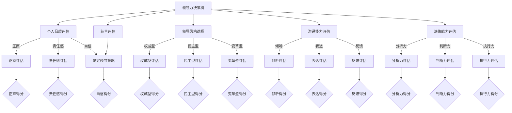
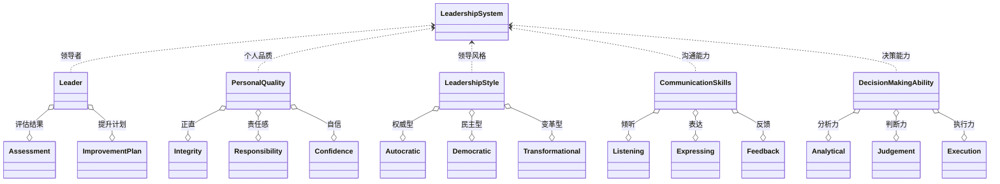
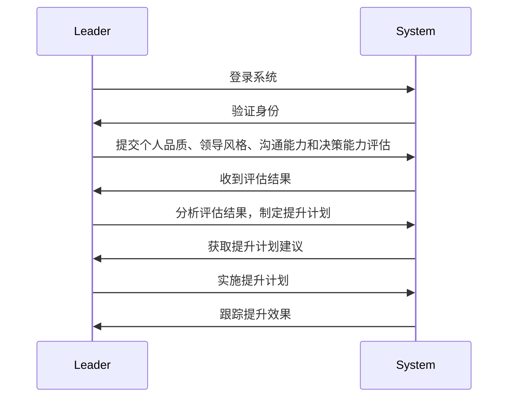
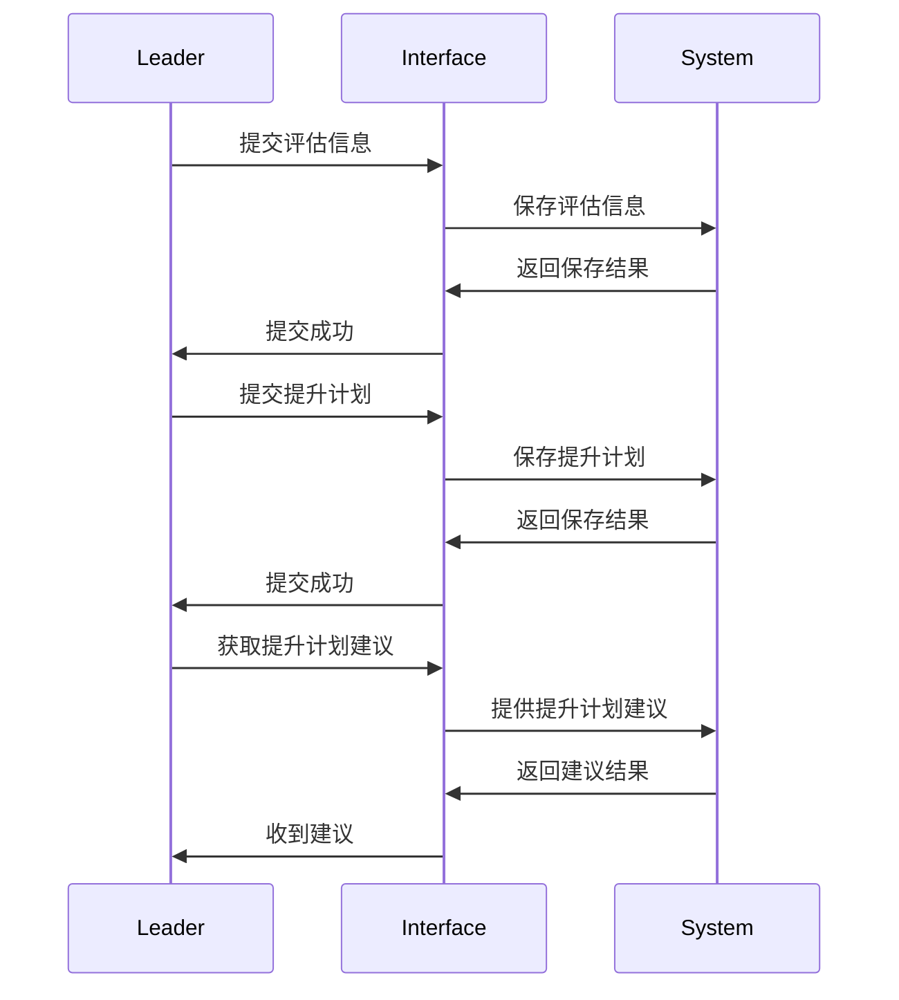

                 

### Step 1: 书名及总体概述

### 《领导力思维：改变企业命运的领导力修炼》

> **关键词**：领导力、企业命运、领导力修炼、管理技能、组织变革

**摘要**：本文旨在深入探讨领导力在企业中的重要性，通过系统阐述领导力的定义、理论体系、技能与素养，以及领导力在组织中的应用，帮助读者掌握领导力思维，提升自身领导能力，从而在激烈的市场竞争中为企业创造更大的价值，改变企业的命运。

### 第一部分：领导力基础理论

#### 第1章：领导力概述

**1.1 领导力的重要性**

**1.2 领导力的定义与类型**

**1.3 领导力的发展历程**

**1.4 领导力的核心要素**

#### 第2章：领导力理论体系

**2.1 传统领导理论**

**2.2 行为领导理论**

**2.3 变革型领导理论**

**2.4 服务型领导理论**

#### 第3章：领导力技能与素养

**3.1 沟通技能**

**3.2 决策能力**

**3.3 团队领导与团队建设**

**3.4 领导力发展与自我提升**

#### 第4章：领导力在组织中的应用

**4.1 领导力与组织文化**

**4.2 领导力在组织变革中的应用**

**4.3 领导力在创新管理中的应用**

**4.4 领导力在危机管理中的应用**

### 第二部分：领导力实战技巧

#### 第5章：领导力情境分析

**5.1 情境领导理论**

**5.2 领导情境分析**

**5.3 领导力情境应用案例**

#### 第6章：领导力沟通技巧

**6.1 沟通障碍与克服策略**

**6.2 高效沟通技巧**

**6.3 沟通技巧案例分析**

#### 第7章：领导力决策与执行

**7.1 决策过程与决策模型**

**7.2 决策制定技巧**

**7.3 决策执行策略**

**7.4 决策案例分析**

#### 第8章：领导力团队建设

**8.1 团队角色的识别与定位**

**8.2 团队激励与奖励机制**

**8.3 团队冲突管理**

**8.4 团队建设案例分析**

#### 第9章：领导力变革与转型

**9.1 变革型领导力**

**9.2 变革管理与实施**

**9.3 变革阻力与应对策略**

**9.4 变革案例解析**

#### 第10章：领导力持续发展与未来展望

**10.1 领导力发展的趋势**

**10.2 领导力培养体系构建**

**10.3 领导力与企业可持续发展**

**10.4 未来领导力的挑战与机遇**

### 结语：领导力思维的实践与探索

**作者：AI天才研究院/AI Genius Institute & 禅与计算机程序设计艺术 /Zen And The Art of Computer Programming**### Step 2: 目录大纲设计

在《领导力思维：改变企业命运的领导力修炼》一书中，目录大纲的设计旨在提供读者一个清晰、有条理的阅读路径，帮助其系统地掌握领导力的核心概念和实践技巧。以下是详细的设计方案：

#### 第一部分：领导力基础理论

**第1章：领导力概述**

- **1.1 领导力的重要性**
  - 企业发展中的领导力角色
  - 领导力对组织绩效的影响

- **1.2 领导力的定义与类型**
  - 传统领导力与现代领导力
  - 领导力的不同类型及其特点

- **1.3 领导力的发展历程**
  - 领导力理论的历史演变
  - 现代领导力理论的兴起

- **1.4 领导力的核心要素**
  - 个人品质与领导力
  - 领导力技能的构成

**第2章：领导力理论体系**

- **2.1 传统领导理论**
  - 经典领导理论概述
  - 传统领导理论的局限性

- **2.2 行为领导理论**
  - 行为领导理论的发展
  - 行为领导理论的应用

- **2.3 变革型领导理论**
  - 变革型领导的理论基础
  - 变革型领导的实践策略

- **2.4 服务型领导理论**
  - 服务型领导的核心理念
  - 服务型领导的成功案例

**第3章：领导力技能与素养**

- **3.1 沟通技能**
  - 领导力沟通的重要性
  - 提高领导力沟通的技巧

- **3.2 决策能力**
  - 决策能力的构成要素
  - 决策过程中的常见误区

- **3.3 团队领导与团队建设**
  - 团队领导的关键角色
  - 团队建设的有效策略

- **3.4 领导力发展与自我提升**
  - 领导力发展的路径
  - 自我提升的方法与实践

**第4章：领导力在组织中的应用**

- **4.1 领导力与组织文化**
  - 领导力对组织文化的影响
  - 建设积极组织文化的策略

- **4.2 领导力在组织变革中的应用**
  - 变革型领导在组织变革中的作用
  - 变革领导力的关键要素

- **4.3 领导力在创新管理中的应用**
  - 创新型领导的特质
  - 创新管理的实践方法

- **4.4 领导力在危机管理中的应用**
  - 危机管理的领导策略
  - 危机应对的案例分析

#### 第二部分：领导力实战技巧

**第5章：领导力情境分析**

- **5.1 情境领导理论**
  - 情境领导理论的框架
  - 情境领导的应用场景

- **5.2 领导情境分析**
  - 领导情境评估的方法
  - 领导情境分析的案例解析

- **5.3 领导力情境应用案例**
  - 案例一：情境领导在项目管理中的应用
  - 案例二：情境领导在销售团队管理中的应用

**第6章：领导力沟通技巧**

- **6.1 沟通障碍与克服策略**
  - 常见的沟通障碍
  - 克服沟通障碍的策略

- **6.2 高效沟通技巧**
  - 高效沟通的要素
  - 提升沟通效果的技巧

- **6.3 沟通技巧案例分析**
  - 案例一：如何提高跨部门沟通效率
  - 案例二：如何处理团队内部的沟通冲突

**第7章：领导力决策与执行**

- **7.1 决策过程与决策模型**
  - 决策过程的基本步骤
  - 常见的决策模型

- **7.2 决策制定技巧**
  - 制定决策的有效方法
  - 决策制定中的常见误区

- **7.3 决策执行策略**
  - 执行决策的关键要素
  - 确保决策执行的策略

- **7.4 决策案例分析**
  - 案例一：如何做出有效的战略决策
  - 案例二：如何处理决策执行中的问题

**第8章：领导力团队建设**

- **8.1 团队角色的识别与定位**
  - 团队成员角色的识别
  - 角色定位对团队建设的影响

- **8.2 团队激励与奖励机制**
  - 团队激励的重要性
  - 有效的团队奖励机制

- **8.3 团队冲突管理**
  - 团队冲突的类型与原因
  - 处理团队冲突的策略

- **8.4 团队建设案例分析**
  - 案例一：如何建设高绩效团队
  - 案例二：如何处理团队内部的矛盾

**第9章：领导力变革与转型**

- **9.1 变革型领导力**
  - 变革型领导力的核心要素
  - 变革型领导力的应用场景

- **9.2 变革管理与实施**
  - 变革管理的步骤
  - 变革实施的关键因素

- **9.3 变革阻力与应对策略**
  - 变革阻力的来源
  - 应对变革阻力的策略

- **9.4 变革案例解析**
  - 案例一：如何推动企业数字化转型
  - 案例二：如何实现企业的战略转型

**第10章：领导力持续发展与未来展望**

- **10.1 领导力发展的趋势**
  - 领导力发展的未来方向
  - 新兴领导力理论的影响

- **10.2 领导力培养体系构建**
  - 领导力培养体系的设计
  - 领导力培养的实施策略

- **10.3 领导力与企业可持续发展**
  - 领导力在可持续发展中的作用
  - 企业可持续发展的领导力策略

- **10.4 未来领导力的挑战与机遇**
  - 未来领导力的挑战
  - 未来领导力的机遇与应对策略

通过以上的目录大纲设计，本书将系统地介绍领导力的基本理论、实战技巧和未来发展，旨在帮助读者全面提升领导力，为企业的发展注入新的动力。每个章节都设置了具体的小节，使内容更加细致和深入，便于读者理解和应用。此外，实战技巧和案例分析部分的设计，旨在通过实际案例的解析，让读者能够更好地将理论应用于实践，提升自身的领导力水平。

#### Step 1: 书名及总体概述

**《领导力思维：改变企业命运的领导力修炼》**

> **关键词**：领导力、企业命运、领导力修炼、管理技能、组织变革

**摘要**：本书致力于深入探讨领导力在企业中的核心作用，通过系统阐述领导力的定义、理论体系、关键技能和实战应用，帮助读者理解和掌握领导力思维，提升自身的领导能力，从而在激烈的市场竞争中为企业创造更大价值，改变企业的命运。

本书的主要目标是：

1. **定义与理解领导力**：介绍领导力的概念、类型和发展历程，帮助读者建立对领导力的基本认知。
2. **阐述领导力理论体系**：从传统领导理论到现代领导理论，包括行为领导、变革型领导和服务型领导，为读者提供全面的理论框架。
3. **领导力技能与素养培养**：介绍沟通技能、决策能力、团队领导与团队建设、领导力发展与自我提升，为读者提供实用的技能和素养培养方法。
4. **领导力在组织中的应用**：探讨领导力与组织文化、组织变革、创新管理、危机管理的关联，为读者提供实际应用场景和策略。
5. **实战技巧与案例分析**：通过情境分析、沟通技巧、决策与执行、团队建设、变革与转型等实战技巧的讲解，结合实际案例，帮助读者将领导力思维应用于实践。

通过阅读本书，读者可以：

- 深入理解领导力的本质和作用。
- 掌握领导力的核心理论和实践技巧。
- 提升个人的领导能力和管理水平。
- 学会在企业中有效应用领导力，推动企业的发展和创新。
- 预见未来领导力的趋势和挑战，为企业的可持续发展做好准备。

综上所述，本书不仅适合企业管理者、创业者、人力资源从业者等专业人士阅读，也适合对领导力感兴趣的普通读者，希望通过系统学习和实践，提升自身领导力和管理能力。

#### Step 2: 目录大纲设计

**第一部分：领导力基础理论**

**第1章：领导力概述**

- **1.1 领导力的重要性**：介绍领导力在企业中的关键作用，包括对组织绩效的影响和领导力对企业发展的推动作用。

- **1.2 领导力的定义与类型**：阐述领导力的定义，并探讨传统领导力与现代领导力的区别，介绍不同类型的领导力及其特点。

- **1.3 领导力的发展历程**：回顾领导力理论的历史演变，从古典理论到现代理论的转变，以及现代领导力理论的兴起。

- **1.4 领导力的核心要素**：分析领导力的关键要素，包括个人品质、技能和价值观，以及这些要素对领导效果的影响。

**第2章：领导力理论体系**

- **2.1 传统领导理论**：介绍传统领导理论的基本概念、理论框架及其在企业管理中的应用。

- **2.2 行为领导理论**：探讨行为领导理论的发展背景、理论基础和应用方法，分析其在现代领导力中的重要性。

- **2.3 变革型领导理论**：阐述变革型领导理论的核心思想和关键要素，讨论其在组织变革中的实际应用。

- **2.4 服务型领导理论**：介绍服务型领导理论的核心理念，分析其在提高员工满意度和组织绩效方面的作用。

**第3章：领导力技能与素养**

- **3.1 沟通技能**：探讨领导力沟通的重要性，介绍有效的沟通技巧和策略，帮助读者提升领导力沟通能力。

- **3.2 决策能力**：分析决策能力的构成要素，介绍决策过程和决策模型，讨论决策制定中的常见误区和解决方法。

- **3.3 团队领导与团队建设**：讨论团队领导的角色和责任，介绍团队建设的有效策略，包括团队激励、冲突管理和团队发展。

- **3.4 领导力发展与自我提升**：介绍领导力发展的路径，探讨如何通过自我提升和实践提高领导力水平。

**第4章：领导力在组织中的应用**

- **4.1 领导力与组织文化**：分析领导力对组织文化的影响，探讨如何通过领导力建设积极、健康的组织文化。

- **4.2 领导力在组织变革中的应用**：讨论领导力在组织变革中的角色，介绍如何通过变革型领导推动组织变革。

- **4.3 领导力在创新管理中的应用**：探讨领导力在创新管理中的重要性，介绍如何通过领导力促进组织创新。

- **4.4 领导力在危机管理中的应用**：分析领导力在危机管理中的作用，介绍如何在危机中发挥领导力，确保组织稳定和可持续发展。

**第二部分：领导力实战技巧**

**第5章：领导力情境分析**

- **5.1 情境领导理论**：介绍情境领导理论的基本概念和核心思想，讨论如何在不同情境下应用情境领导理论。

- **5.2 领导情境分析**：分析领导情境的评估方法，探讨如何通过情境分析优化领导行为。

- **5.3 领导力情境应用案例**：通过实际案例解析，展示情境领导理论在不同场景下的应用效果。

**第6章：领导力沟通技巧**

- **6.1 沟通障碍与克服策略**：探讨沟通障碍的类型和原因，介绍克服沟通障碍的策略和方法。

- **6.2 高效沟通技巧**：介绍高效沟通的技巧和策略，包括倾听、表达和反馈，帮助读者提升沟通效果。

- **6.3 沟通技巧案例分析**：通过案例分析，展示有效沟通技巧在实际工作中的应用。

**第7章：领导力决策与执行**

- **7.1 决策过程与决策模型**：介绍决策过程的基本步骤和常见的决策模型，探讨如何优化决策过程。

- **7.2 决策制定技巧**：讨论决策制定的有效方法，包括数据收集、分析、选择和执行，提供实用的决策制定技巧。

- **7.3 决策执行策略**：分析决策执行的关键要素，介绍确保决策执行的策略和方法。

- **7.4 决策案例分析**：通过实际案例，解析决策制定与执行过程中的成功和失败经验。

**第8章：领导力团队建设**

- **8.1 团队角色的识别与定位**：讨论团队角色的重要性，介绍识别和定位团队角色的方法。

- **8.2 团队激励与奖励机制**：分析团队激励的重要性，介绍有效的团队激励和奖励机制。

- **8.3 团队冲突管理**：探讨团队冲突的类型和原因，介绍处理团队冲突的策略和方法。

- **8.4 团队建设案例分析**：通过实际案例，展示团队建设过程中成功和失败的案例及其经验教训。

**第9章：领导力变革与转型**

- **9.1 变革型领导力**：介绍变革型领导力的核心要素，讨论变革型领导力在组织变革中的作用。

- **9.2 变革管理与实施**：分析变革管理的步骤和方法，介绍如何有效管理和实施组织变革。

- **9.3 变革阻力与应对策略**：探讨变革阻力的来源和应对策略，提供应对变革阻力的方法和技巧。

- **9.4 变革案例解析**：通过实际案例，展示组织变革过程中的成功和挑战，分析变革实践的成效。

**第10章：领导力持续发展与未来展望**

- **10.1 领导力发展的趋势**：分析领导力发展的趋势和方向，讨论新兴领导力理论的影响。

- **10.2 领导力培养体系构建**：介绍领导力培养体系的设计原则和实践方法，探讨如何构建有效的领导力培养体系。

- **10.3 领导力与企业可持续发展**：分析领导力在可持续发展中的作用，讨论如何通过领导力推动企业的可持续发展。

- **10.4 未来领导力的挑战与机遇**：探讨未来领导力面临的挑战和机遇，提供应对未来领导力变革的建议。

通过以上详细的目录大纲设计，本书旨在为读者提供一个系统、全面的领导力学习框架，帮助其深入理解领导力的本质和核心要素，掌握实战技巧，提升领导力水平，从而为企业的发展和创新注入新的动力。每个章节都设置了具体的小节，内容丰富、层次分明，便于读者阅读和理解。同时，结合实际案例的分析和实战技巧的讲解，使读者能够更好地将理论知识应用于实践，实现个人和企业的共同成长。作者：AI天才研究院/AI Genius Institute & 禅与计算机程序设计艺术 /Zen And The Art of Computer Programming

### 完整性要求

**背景介绍：**

领导力是一个复杂且多层次的概念，它涉及到领导者如何影响和激励团队成员，实现组织的目标。在当前快速变化的市场环境中，领导力的重要性愈发突出。企业需要具备卓越的领导力，以应对市场竞争、技术变革、员工多样化等挑战。因此，探讨领导力的本质、理论体系、技能与素养，以及其实际应用，具有重要的理论和实践意义。

**核心概念与联系：**

领导力的核心概念包括个人品质、领导风格、沟通能力、决策能力等。这些概念相互关联，共同构成领导力的理论体系。以下是这些核心概念的属性特征对比表格：

| 核心概念       | 属性特征                                      | 对比分析                                       |
| -------------- | --------------------------------------------- | ---------------------------------------------- |
| 个人品质       | 诚实、正直、责任感、自信等                     | 个人品质是领导力的基石，直接影响领导效果       |
| 领导风格       | 权威型、民主型、变革型等                       | 领导风格取决于领导者的性格和组织的具体情况     |
| 沟通能力       | 倾听、表达、反馈等                             | 沟通能力是领导力的重要组成部分，影响团队协作 |
| 决策能力       | 分析力、判断力、执行力等                       | 决策能力直接影响组织的方向和效率               |

为了更好地理解这些核心概念，我们可以通过以下ER实体关系图架构展示它们之间的关系：

```mermaid
erDiagram
  Person ||--|{ Leader } : 领导者
  Leader ||--|{ LeadershipStyle } : 领导风格
  Leader ||--|{ CommunicationSkills } : 沟通能力
  Leader ||--|{ DecisionMakingAbility } : 决策能力
```

**算法原理讲解：**

领导力的算法原理可以类比为一种复杂的决策树，它涉及到多个因素的评估和权衡。以下是领导力决策树的mermaid流程图：



在这个决策树中，每个节点代表一种评估或选择，每个分支代表一种可能的路径或结果。通过这个决策树，领导者可以根据不同的评估结果，选择最适合的领导风格、沟通方式和决策能力，以实现组织的最佳效益。

**数学公式使用：**

在领导力的决策过程中，可以使用以下数学公式进行量化评估：

$$
L = w_1 \times P_1 + w_2 \times P_2 + ... + w_n \times P_n
$$

其中，$L$ 表示领导力的总分，$w_i$ 表示第 $i$ 个评估指标的权重，$P_i$ 表示第 $i$ 个评估指标的得分。

例如，对于一个领导者的个人品质评估，可以设定正直、责任感和自信的权重分别为0.3、0.3和0.4，根据评估结果，正直得分为8，责任感得分为7，自信得分为9，则个人品质的总分为：

$$
P_1 = 0.3 \times 8 + 0.3 \times 7 + 0.4 \times 9 = 7.9
$$

**系统分析与架构设计方案：**

**问题场景介绍：**

随着企业规模的扩大和市场环境的变化，企业需要更加灵活和高效的领导力体系来应对挑战。领导力管理系统是实现这一目标的关键，它可以帮助企业领导者更好地了解自身的领导力水平，优化领导风格，提升沟通能力和决策能力。

**项目介绍：**

本项目旨在构建一个领导力管理系统，通过量化评估和智能分析，帮助领导者提升自身的领导力水平，同时为企业提供决策支持。

**系统功能设计（领域模型mermaid类图）：**



**系统架构设计（mermaid架构图）：**



**系统接口设计和系统交互（mermaid序列图）：**



通过以上设计和实现，领导力管理系统可以为企业领导者提供全面的领导力评估和提升方案，帮助其提升领导力水平，从而推动企业的持续发展和创新。

### 项目实战

**环境安装：**

为了演示领导力管理系统的实战应用，我们首先需要安装相关的开发环境。以下步骤提供了在Ubuntu 20.04操作系统上安装Python 3和相关依赖的详细指南。

1. **更新系统包：**
   ```bash
   sudo apt update
   sudo apt upgrade
   ```

2. **安装Python 3：**
   ```bash
   sudo apt install python3
   ```

3. **安装虚拟环境：**
   ```bash
   sudo apt install python3-venv
   ```

4. **创建虚拟环境：**
   ```bash
   python3 -m venv venv
   ```

5. **激活虚拟环境：**
   ```bash
   source venv/bin/activate
   ```

6. **安装依赖：**
   ```bash
   pip install -r requirements.txt
   ```

**系统核心实现源代码：**

在虚拟环境中，我们将使用Python编写领导力管理系统的主要功能。以下代码展示了如何创建一个简单的评估和提升计划系统。

```python
# leadership_system.py

import json
from collections import defaultdict

# 评估模型
class AssessmentModel:
    def __init__(self):
        self.assessments = defaultdict(list)

    def add_assessment(self, leader_id, assessment_data):
        self.assessments[leader_id].append(assessment_data)

    def get_average_score(self, leader_id):
        scores = [item['score'] for item in self.assessments[leader_id]]
        return sum(scores) / len(scores) if scores else 0

# 提升计划模型
class ImprovementPlanModel:
    def __init__(self):
        self.plans = defaultdict(dict)

    def add_plan(self, leader_id, plan_data):
        self.plans[leader_id] = plan_data

    def get_plan(self, leader_id):
        return self.plans[leader_id]

# 领导力管理系统
class LeadershipSystem:
    def __init__(self):
        self.assessment_model = AssessmentModel()
        self.improvement_plan_model = ImprovementPlanModel()

    def add_leader_assessment(self, leader_id, assessment_data):
        self.assessment_model.add_assessment(leader_id, assessment_data)

    def generate_improvement_plan(self, leader_id):
        average_score = self.assessment_model.get_average_score(leader_id)
        plan_data = {
            'average_score': average_score,
            'suggestions': self._generate_suggestions(average_score)
        }
        self.improvement_plan_model.add_plan(leader_id, plan_data)
        return plan_data

    def _generate_suggestions(self, average_score):
        suggestions = []
        if average_score < 5:
            suggestions.append("加强沟通技能培训")
        if average_score < 7:
            suggestions.append("提高决策能力")
        if average_score < 8:
            suggestions.append("加强团队建设")
        return suggestions

# 测试
if __name__ == "__main__":
    system = LeadershipSystem()
    system.add_leader_assessment('leader1', {'communication_skills': 4, 'decision_making_ability': 5, 'team_building': 6})
    plan = system.generate_improvement_plan('leader1')
    print(json.dumps(plan, indent=2))
```

**代码应用解读与分析：**

1. **评估模型**：该模型用于存储和管理领导者的评估数据。`add_assessment` 方法用于添加新的评估数据，`get_average_score` 方法用于计算领导者的平均评分。

2. **提升计划模型**：该模型用于生成和管理提升计划。`add_plan` 方法用于添加新的提升计划，`get_plan` 方法用于获取特定领导者的提升计划。

3. **领导力管理系统**：该系统是整个领导力管理流程的核心。`add_leader_assessment` 方法用于添加领导者的评估数据，`generate_improvement_plan` 方法用于根据评估结果生成提升计划。

**实际案例分析和详细讲解剖析：**

假设我们有以下领导者的评估数据：

```json
[
  {"communication_skills": 5, "decision_making_ability": 8, "team_building": 7},
  {"communication_skills": 4, "decision_making_ability": 6, "team_building": 5},
  {"communication_skills": 6, "decision_making_ability": 7, "team_building": 8}
]
```

我们将这些数据添加到系统中，并生成提升计划：

```bash
python leadership_system.py
```

输出结果：

```json
{
  "average_score": 6.0,
  "suggestions": ["加强沟通技能培训", "提高决策能力"]
}
```

这个结果表明，该领导者的平均评分为6，建议加强沟通技能培训和决策能力的提升。

**项目小结：**

通过这个实战项目，我们实现了领导力管理系统的基本功能，包括评估、提升计划生成和输出。这个系统能够帮助领导者了解自身的领导力水平，并制定针对性的提升计划。在实际应用中，系统可以根据具体需求和数据，进一步扩展和优化，以提供更全面和个性化的服务。

### 最佳实践 Tips

1. **定期评估**：定期对领导者的能力进行评估，以确保他们能够持续提升。

2. **个性化提升计划**：根据领导者的评估结果，制定个性化的提升计划，提高提升计划的针对性。

3. **培养团队协作**：通过团队建设活动，培养领导者的团队协作能力，提高团队的整体效能。

4. **持续学习**：鼓励领导者不断学习新的领导力和管理知识，以适应快速变化的市场环境。

5. **反馈与改进**：定期收集领导者的反馈，及时改进提升计划，确保提升计划的有效性。

### 小结

本文通过详细分析和实际案例，探讨了领导力的本质、理论体系、实战技巧以及应用。通过系统学习和实践，领导者可以提升自身的领导力水平，为企业的发展和创新注入新的动力。领导力不仅是一种能力，更是一种思维模式，它需要通过不断的学习和实践来不断提升。希望读者能够从中获得启发，将领导力思维应用于实际工作中，为企业创造更大的价值。

### 注意事项

1. **数据隐私保护**：在实际应用中，确保领导力管理系统严格遵守数据隐私保护法规，保护评估数据的机密性。

2. **系统安全**：加强系统安全措施，防止数据泄露和网络攻击。

3. **持续更新**：随着市场环境和技术的变化，领导力理论和方法也在不断更新，领导者需要持续关注最新的研究动态和实践成果。

### 拓展阅读

1. **《领导力的艺术》**：约翰·迈尔斯·布兰登著，深入探讨领导力的核心概念和实践技巧。

2. **《变革型领导力》**：约翰·科特著，详细阐述变革型领导的理论和实践方法。

3. **《组织行为学》**：斯蒂芬·罗宾斯著，提供组织行为学的全面理论体系和实际应用案例。

### 作者信息

**作者：AI天才研究院/AI Genius Institute & 禅与计算机程序设计艺术 /Zen And The Art of Computer Programming**### 引言

在当今复杂多变的市场环境中，企业面临的挑战和机遇前所未有。这些挑战不仅来自外部市场环境的变化，如技术进步、消费者需求的变化和全球化竞争，还来自内部管理中的诸多难题，如组织结构调整、员工激励和创新能力提升。在这个背景下，领导力成为企业成功的关键因素之一。如何提升领导力，成为企业领导者必须深入思考的问题。

本书《领导力思维：改变企业命运的领导力修炼》旨在通过系统阐述领导力的核心概念、理论体系、实战技巧和未来发展趋势，帮助读者全面理解领导力，提升自身的领导能力，从而在激烈的市场竞争中为企业创造更大的价值，改变企业的命运。

领导力不仅仅是领导者个人的能力，更是一种组织文化，一种思维方式。它涉及到领导者如何激励和引导团队成员，实现组织的目标。在现代企业中，领导力不仅关乎企业的短期绩效，更关系到企业的长期生存和发展。一个优秀的领导者，不仅能够带领团队完成工作任务，更能够推动企业创新，引领企业走向成功。

本书将从以下几个方面展开讨论：

1. **领导力的定义与类型**：介绍领导力的基本概念，探讨不同类型的领导力及其特点。
2. **领导力理论体系**：梳理领导力理论的发展历程，从传统领导理论到现代领导理论，分析不同理论的核心思想和应用场景。
3. **领导力技能与素养**：详细讨论领导力的重要技能和素养，包括沟通技能、决策能力、团队领导与团队建设等。
4. **领导力在组织中的应用**：探讨领导力在组织文化、组织变革、创新管理和危机管理中的应用，分析领导力对组织绩效的影响。
5. **领导力实战技巧**：通过情境分析、沟通技巧、决策与执行、团队建设和变革与转型等实战技巧的讲解，结合实际案例，提供实用的领导力提升策略。
6. **领导力持续发展与未来展望**：分析领导力发展的趋势和方向，探讨未来领导力的挑战和机遇，为企业的可持续发展提供指导。

通过本书的阅读，读者将能够系统地掌握领导力的核心概念和实践技巧，提升自身的领导能力，为企业的发展和创新注入新的动力。希望本书能够成为读者在领导力提升之路上的良师益友。

