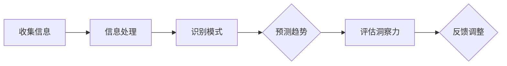
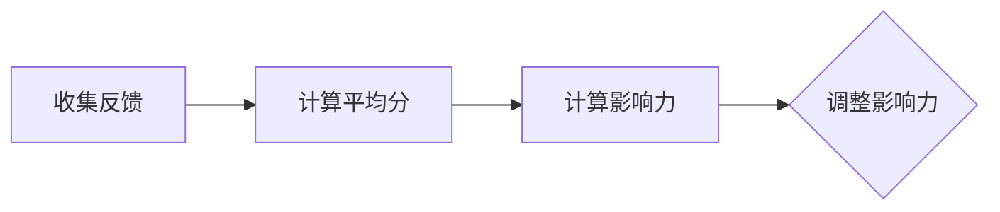
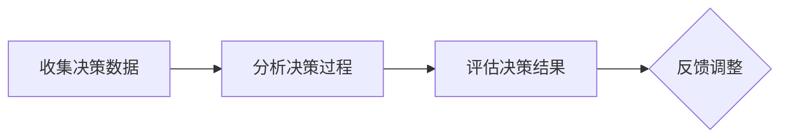
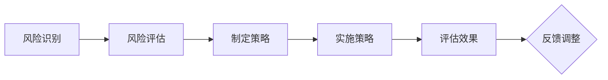
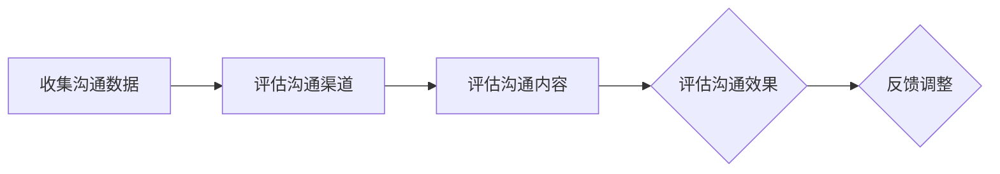
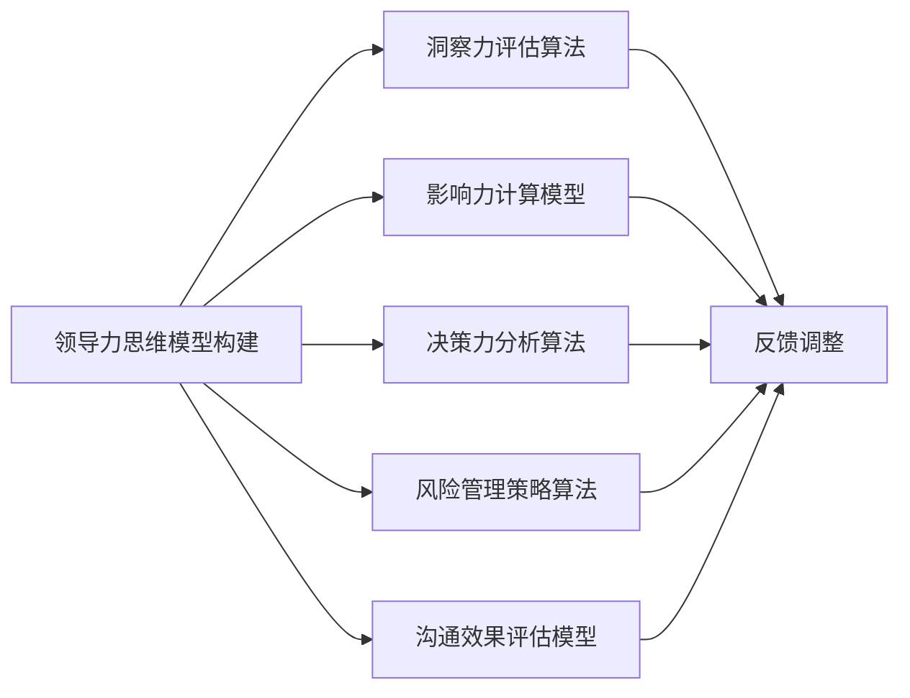
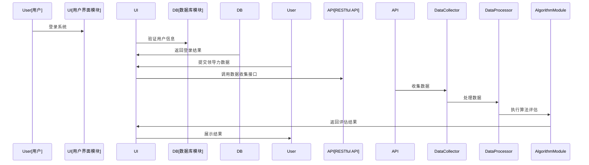

                 


### 第1章: 引言与背景介绍

#### 1.1 问题的背景

领导力，这个看似遥不可及的词语，实际上已经深深地渗透到了我们日常生活的方方面面。在现代社会，领导力不仅仅是对企业领导者的要求，更是对每一位职场人士的基本素质。随着全球化的推进，企业的竞争日益激烈，团队协作的重要性愈发凸显。在这样的背景下，领导力的作用和意义变得愈加重要。

首先，领导力对于个人成长具有深远的影响。一个具备强大领导力的人，能够在复杂多变的环境中迅速做出正确的决策，引领团队走向成功。其次，领导力对于团队效率的提升至关重要。一个高效的团队，离不开强有力的领导者，他们能够激发团队成员的潜力，提高整体的工作效率。最后，领导力对于组织发展起着决定性的作用。一个具备卓越领导力的组织，能够顺应时代变化，不断创新，持续发展。

然而，领导力并非一蹴而就，它需要长时间的修炼和实践。在现代社会，领导力不仅包括传统的权力和权威，更强调影响力的运用、沟通能力的提升、决策力的培养等方面。因此，探讨领导力思维，找出改变命运的领导力修炼秘诀，成为了每位职场人士和企业管理者迫切需要解决的问题。

#### 1.2 领导力的定义与边界

领导力，这个词语有着丰富的内涵和多样的定义。传统上，领导力被理解为一种通过权力和权威来影响他人的能力。然而，随着时代的变迁，现代领导力更加注重个人魅力、影响力、沟通能力和决策力等方面的综合运用。

首先，领导力不仅仅是权力的运用，更是一种影响力的体现。一个优秀的领导者，不仅能够运用权力来管理团队，更能够通过自身的人格魅力和影响力，激发团队成员的积极性，形成团队凝聚力。

其次，领导力不仅仅是管理的能力，更是一种沟通的艺术。一个成功的领导者，需要具备良好的沟通能力，能够清晰、准确地表达自己的想法，同时也能够倾听他人的意见，建立良好的沟通渠道。

再次，领导力不仅仅是决策的能力，更是一种战略思维。一个卓越的领导者，需要具备前瞻性的眼光，能够从宏观的角度来审视问题，制定出符合实际情况的决策。

最后，领导力不仅仅是解决问题的能力，更是一种心态。一个成功的领导者，需要具备积极的心态，能够在面对困难和挑战时，保持冷静、坚定，带领团队共同克服困难。

#### 1.3 领导力思维的核心要素

领导力思维，是领导者对领导力的理解和运用。它不仅仅是对领导力的表面理解，更是一种深入骨髓的思维模式。要成为一名成功的领导者，必须掌握以下几个核心要素：

**1. 洞察力**

洞察力，是领导者对事物本质的深刻理解。一个具备强大洞察力的领导者，能够从纷繁复杂的现象中，看到问题的本质，把握事物的发展趋势。洞察力是领导者决策力的基础，也是领导力的重要组成部分。

**2. 影响力**

影响力，是领导者对他人思想和行为的改变能力。一个具备强大影响力的领导者，能够通过自己的言行，影响团队成员的态度和行为，形成积极向上的团队氛围。影响力是领导力的核心，也是领导者实现领导目标的关键。

**3. 决策力**

决策力，是领导者面对复杂问题时，迅速做出正确决策的能力。一个具备强大决策力的领导者，能够在关键时刻，迅速分析问题，做出正确的决策，带领团队走出困境。决策力是领导力的关键，也是领导者领导能力的重要体现。

**4. 风险管理能力**

风险管理能力，是领导者对风险识别、评估和应对的能力。一个具备强大风险管理能力的领导者，能够预见潜在的风险，制定有效的风险应对策略，降低风险对团队和组织的负面影响。风险管理能力是领导力的必要组成部分，也是领导者保障团队和 organizational稳定发展的重要能力。

**5. 沟通能力**

沟通能力，是领导者与团队成员、上级、客户等进行有效沟通的能力。一个具备良好沟通能力的领导者，能够建立良好的沟通渠道，促进团队内部和团队之间的有效沟通，提高团队整体的工作效率。沟通能力是领导力的基础，也是领导者实现领导目标的重要保障。

### 第2章: 核心概念与联系

在领导力思维的修炼过程中，理解并掌握核心概念之间的联系至关重要。本章将深入探讨领导力思维中的核心概念，包括洞察力、影响力、决策力、风险管理能力和沟通能力，并通过对比分析这些概念，帮助读者建立清晰的认识。

#### 2.1 核心概念原理

**1. 洞察力**

洞察力，是指领导者对事物本质的深刻理解。它不仅仅是表面现象的观察，而是能够透过现象看到本质，把握事物的发展趋势。洞察力的原理在于领导者对信息的敏感度、对数据的分析能力以及对事物联系的洞察。

**2. 影响力**

影响力，是指领导者通过言行影响他人思想和行为的能力。它包括个人魅力、领导风格、沟通技巧等多方面因素。影响力的原理在于领导者的人格特质、价值观以及与他人的关系建立。

**3. 决策力**

决策力，是指领导者面对复杂问题时，迅速做出正确决策的能力。决策力不仅需要领导者具备丰富的知识储备和逻辑思维能力，还需要领导者具备前瞻性和战略眼光。

**4. 风险管理能力**

风险管理能力，是指领导者对风险的识别、评估和应对能力。风险管理能力包括对潜在风险的预见性、对风险影响的评估以及应对策略的制定。风险管理能力的原理在于领导者对风险的敏感度、对风险处理的策略和技巧。

**5. 沟通能力**

沟通能力，是指领导者与团队成员、上级、客户等进行有效沟通的能力。沟通能力包括沟通技巧、沟通渠道的建立以及沟通效果的评估。沟通能力的原理在于领导者对人际关系的理解、对沟通情境的把握以及对沟通目标的明确。

#### 2.2 概念属性特征对比

为了更好地理解这些核心概念，我们可以通过对比分析它们的主要特征，帮助读者形成更清晰的认识。

| 概念       | 特征比较                               |
|------------|--------------------------------------|
| 洞察力     | - 对事物本质的深刻理解<br>- 信息的敏感度<br>- 数据分析能力<br>- 看趋势           |
| 影响力     | - 个人魅力<br>- 领导风格<br>- 沟通技巧<br>- 价值观的传递               |
| 决策力     | - 逻辑思维<br>- 前瞻性<br>- 知识储备<br>- 策略制定                       |
| 风险管理能力 | - 风险识别<br>- 风险评估<br>- 应对策略<br>- 潜在风险预见性              |
| 沟通能力   | - 沟通技巧<br>- 沟通渠道<br>- 沟通效果评估<br>- 人际关系理解              |

#### 2.3 ER实体关系图架构

为了更直观地展示这些核心概念之间的联系，我们可以使用ER（实体关系）图来构建领导力思维的基本框架。

```mermaid
erDiagram
  Leadership ||--|{ Insight } : 洞察力
  Leadership ||--|{ Influence } : 影响力
  Leadership ||--|{ DecisionMaking } : 决策力
  Leadership ||--|{ RiskManagement } : 风险管理能力
  Leadership ||--|{ Communication } : 沟通能力
```

在这个ER图中，领导力思维被视为一个整体，它与洞察力、影响力、决策力、风险管理能力和沟通能力这五个核心要素之间存在直接的关联。每一个要素都代表着领导力思维中的一个关键方面，它们共同构成了一个完整的领导力体系。

通过这个ER图，我们可以清晰地看到领导力思维的核心要素及其相互关系。这种结构化的思考方式有助于领导者更好地理解和应用这些核心概念，提高自身的领导能力。

### 第3章: 领导力思维修炼方法

要成为一名成功的领导者，仅仅具备领导力理论是不够的，还需要通过实践不断提升自身的领导力思维。本章将详细介绍如何修炼领导力思维，包括洞察力、影响力、决策力、风险管理能力和沟通能力的培养方法。

#### 3.1 洞察力的修炼

**1. 观察力的培养**

洞察力源于观察力。一个具备强大洞察力的领导者，首先需要具备敏锐的观察力。观察力不仅仅是用眼睛看，更是用心去感受和理解。以下是一些提升观察力的方法：

- **培养好奇心**：对周围的事物保持好奇心，不断提问，探索未知领域。
- **细心观察**：在日常工作中，注意细节，捕捉细微的变化，从中发现潜在的问题。
- **学会倾听**：倾听团队成员的意见和反馈，从中获取有价值的信息。

**2. 思维方式的转变**

提升洞察力还需要转变思维方式。领导者需要从线性思维转向系统思维，学会从全局的角度看待问题，把握事物的本质。以下是一些转变思维方式的建议：

- **跳出思维定式**：避免被固有的思维模式束缚，勇于尝试新的思考方式。
- **培养跨学科知识**：通过学习不同领域的知识，拓宽视野，提升思维能力。
- **多角度分析问题**：从不同的角度去分析问题，寻找问题的本质。

**3. 经验的积累**

洞察力的培养是一个长期的过程，需要通过不断的实践和经验的积累。以下是一些积累经验的方法：

- **主动参与**：积极参与各种项目和工作，积累实际操作经验。
- **反思与总结**：在每次经历后，进行反思和总结，从中汲取经验教训。
- **向他人学习**：向优秀的领导者学习，吸取他们的成功经验。

#### 3.2 影响力的修炼

**1. 人际关系的建立**

影响力来自于人际关系。一个具备强大影响力的领导者，首先需要建立良好的人际关系。以下是一些建立人际关系的方法：

- **主动沟通**：主动与他人交流，建立良好的沟通渠道。
- **倾听与理解**：倾听他人的意见和需求，理解他人的立场和情感。
- **尊重他人**：尊重他人的观点和感受，建立互信关系。

**2. 情绪的管理**

情绪管理是影响力的重要组成部分。一个具备强大影响力的领导者，需要具备良好的情绪管理能力。以下是一些情绪管理的方法：

- **保持冷静**：在面对压力和挑战时，保持冷静，理智地应对问题。
- **调节情绪**：通过运动、冥想等方式，调节情绪，保持心理平衡。
- **积极正面**：保持积极正面的心态，传递正能量，影响他人。

**3. 形象的塑造**

形象是影响力的外在体现。一个具备强大影响力的领导者，需要塑造良好的形象。以下是一些塑造形象的方法：

- **言行一致**：做到言行一致，树立诚信的形象。
- **专业素养**：提升专业素养，展现专业能力。
- **良好的生活习惯**：保持良好的生活习惯，树立健康、积极的生活形象。

#### 3.3 决策力的修炼

**1. 数据驱动决策**

数据是决策的基础。一个具备强大决策力的领导者，需要具备数据驱动的决策能力。以下是一些数据驱动决策的方法：

- **数据收集与分析**：收集相关的数据，进行深入的分析，为决策提供依据。
- **利用数据工具**：学会使用数据工具，如Excel、Tableau等，进行数据处理和分析。
- **数据可视化**：通过数据可视化，将复杂的数据转化为直观的信息，辅助决策。

**2. 快速决策与长期规划**

决策力不仅体现在快速决策上，还体现在长期规划上。以下是一些快速决策与长期规划的方法：

- **快速决策**：在面对紧急情况时，能够迅速做出决策，避免拖延。
- **长期规划**：制定长期的战略规划，为未来的发展做好准备。
- **平衡快速决策与长期规划**：在快速决策与长期规划之间找到平衡，确保决策的可持续性。

**3. 团队决策**

团队决策能够汇聚众人的智慧，提高决策的质量。以下是一些团队决策的方法：

- **组建决策团队**：组建由不同专业背景和经验的人组成的决策团队，发挥团队协作的优势。
- **明确决策目标**：明确决策的目标和范围，确保决策的针对性。
- **充分讨论与辩论**：鼓励团队成员充分讨论和辩论，激发创新思维。

#### 3.4 风险管理能力的修炼

**1. 风险识别**

风险管理能力首先体现在风险识别上。以下是一些风险识别的方法：

- **历史数据**：分析过去的失败案例，从中识别潜在的风险。
- **情景分析**：通过情景分析，预见可能的风险。
- **专业咨询**：借助专业的风险管理咨询，提高风险识别的准确性。

**2. 风险评估**

风险评估是对风险进行量化分析，以确定风险的影响程度。以下是一些风险评估的方法：

- **定量分析**：使用数学模型和统计分析工具，对风险的影响进行量化。
- **定性分析**：结合专家意见和主观判断，对风险的影响进行定性分析。
- **风险矩阵**：使用风险矩阵，对风险的发生概率和影响程度进行评估。

**3. 风险应对策略**

风险评估之后，需要制定相应的风险应对策略。以下是一些风险应对策略：

- **风险回避**：避免可能带来风险的行动或项目。
- **风险减轻**：通过改进流程、增加备选方案等方式，降低风险的影响。
- **风险转移**：通过保险、外包等方式，将风险转移给第三方。
- **风险接受**：在无法避免或转移风险时，接受风险，并制定相应的应对措施。

#### 3.5 沟通能力的修炼

**1. 有效沟通的原则**

有效沟通是领导力的基础。以下是一些有效沟通的原则：

- **明确目标**：明确沟通的目标，确保信息传递的准确性。
- **倾听**：倾听他人的意见和需求，建立良好的沟通氛围。
- **尊重**：尊重他人的观点和感受，建立互信关系。
- **简洁**：用简洁的语言表达思想，避免冗长和模糊。

**2. 非言语沟通的运用**

非言语沟通在沟通过程中起着重要的作用。以下是一些非言语沟通的运用：

- **肢体语言**：通过肢体语言，如眼神、表情、姿态等，表达自己的情感和态度。
- **声音语调**：通过声音的语调、节奏和音量，传递信息的重要性和情感。
- **环境布置**：通过环境布置，如灯光、颜色、座位安排等，营造良好的沟通氛围。

**3. 情景模拟与实战演练**

提升沟通能力需要不断的实践。以下是一些情景模拟与实战演练的方法：

- **角色扮演**：通过角色扮演，模拟不同的沟通场景，提高沟通技巧。
- **模拟面试**：通过模拟面试，提高面试沟通的能力。
- **团队讨论**：通过团队讨论，锻炼多人沟通和协调的能力。
- **实战演练**：在实际工作中，不断实践和总结，提高沟通能力。

通过以上方法，领导者可以不断提升自身的领导力思维，掌握洞察力、影响力、决策力、风险管理能力和沟通能力，成为一名卓越的领导者。

### 第4章: 算法原理讲解

在领导力思维的修炼过程中，算法的应用可以为我们提供科学的支持和指导。本章将详细讲解领导力思维中的几个关键算法模型，包括洞察力评估算法、影响力计算模型、决策力分析算法、风险管理策略算法和沟通效果评估模型。我们将通过mermaid流程图和Python源代码示例，对这些算法进行直观的展示和解释。

#### 4.1 领导力思维的算法模型

**1. 洞察力评估算法**

洞察力评估算法主要用于对领导者的洞察力进行量化评估。以下是一个简单的洞察力评估算法的mermaid流程图：



- **收集信息**：通过多种渠道收集与领导力相关的信息，如团队反馈、业绩数据等。
- **信息处理**：对收集到的信息进行整理和分析，去除噪声，提取关键信息。
- **识别模式**：利用统计分析和数据挖掘技术，识别信息中的潜在模式和规律。
- **预测趋势**：根据识别出的模式和规律，预测事物的发展趋势。
- **评估洞察力**：通过对比预测结果与实际情况，评估领导者的洞察力。
- **反馈调整**：根据评估结果，对领导者的洞察力进行反馈和调整。

**2. 影响力计算模型**

影响力计算模型主要用于评估领导者的影响力。以下是一个影响力计算模型的mermaid流程图：



- **收集反馈**：通过团队反馈、第三方评估等方式，收集领导者的影响力数据。
- **计算平均分**：对收集到的数据进行平均分计算，以反映领导者的整体影响力。
- **计算影响力**：利用加权平均等方法，对领导者的综合影响力进行计算。
- **调整影响力**：根据实际情况，对影响力数据进行调整，以确保评估的准确性。

**3. 决策力分析算法**

决策力分析算法用于分析领导者的决策力。以下是一个决策力分析算法的mermaid流程图：



- **收集决策数据**：通过记录领导者的决策过程和结果，收集决策数据。
- **分析决策过程**：对决策过程进行详细分析，评估决策的合理性、逻辑性和效率。
- **评估决策结果**：根据决策结果，评估决策的正确性和有效性。
- **反馈调整**：根据评估结果，对领导者的决策力进行反馈和调整。

**4. 风险管理策略算法**

风险管理策略算法用于制定和优化风险管理策略。以下是一个风险管理策略算法的mermaid流程图：



- **风险识别**：通过历史数据、情景分析等方法，识别潜在的风险。
- **风险评估**：对识别出的风险进行量化评估，确定风险的影响程度。
- **制定策略**：根据风险评估结果，制定相应的风险管理策略。
- **实施策略**：将风险管理策略付诸实践，实施风险应对措施。
- **评估效果**：对风险管理策略的实施效果进行评估，确定其有效性。
- **反馈调整**：根据评估结果，对风险管理策略进行反馈和调整。

**5. 沟通效果评估模型**

沟通效果评估模型用于评估领导者的沟通效果。以下是一个沟通效果评估模型的mermaid流程图：



- **收集沟通数据**：通过问卷调查、访谈等方式，收集领导者的沟通数据。
- **评估沟通渠道**：分析沟通渠道的畅通程度，评估沟通效率。
- **评估沟通内容**：分析沟通内容的准确性和针对性，评估沟通的效果。
- **评估沟通效果**：根据沟通渠道和沟通内容的评估结果，综合评估沟通的整体效果。
- **反馈调整**：根据评估结果，对领导者的沟通策略进行反馈和调整。

#### 4.2 算法mermaid流程图

为了更好地展示上述算法的执行流程，我们使用mermaid绘制了相应的流程图。以下是一个综合的mermaid流程图，展示了领导力思维中各个算法模型的执行顺序和关联：



在这个流程图中，领导力思维模型构建是核心，各个算法模型通过反馈调整相互关联，共同构建出一个完整的领导力评估和优化体系。

#### 4.3 Python源代码与算法实现

为了便于理解和实际应用，我们使用Python实现上述算法模型，并提供详细的代码解析。以下是洞察力评估算法的Python源代码示例：

```python
import pandas as pd
from sklearn.ensemble import RandomForestClassifier
from sklearn.model_selection import train_test_split

# 数据准备
data = pd.read_csv('leadership_data.csv')
X = data.drop('insight_score', axis=1)
y = data['insight_score']

# 数据划分
X_train, X_test, y_train, y_test = train_test_split(X, y, test_size=0.3, random_state=42)

# 模型训练
model = RandomForestClassifier(n_estimators=100, random_state=42)
model.fit(X_train, y_train)

# 模型预测
y_pred = model.predict(X_test)

# 评估模型
accuracy = model.score(X_test, y_test)
print(f'洞察力评估算法准确率：{accuracy:.2f}')

# 反馈调整
# 根据评估结果，调整模型参数或数据收集策略，提高评估准确性
```

在这个示例中，我们首先导入所需的Python库，如pandas和scikit-learn。然后，我们读取领导力数据集，将特征数据（X）和目标数据（y）进行划分。接着，我们使用随机森林分类器（RandomForestClassifier）训练模型，并进行预测。最后，我们评估模型的准确率，并根据评估结果进行反馈调整。

通过上述Python源代码示例，我们可以清晰地看到如何实现洞察力评估算法。类似的方法也可以应用于影响力计算模型、决策力分析算法、风险管理策略算法和沟通效果评估模型。

### 第5章: 数学模型和数学公式

在领导力思维的实践中，数学模型的应用能够为领导者提供科学的支持和指导。本章将介绍领导力思维中几个关键领域的数学模型，包括洞察力、影响力、决策力、风险管理能力和沟通效果的数学模型，并使用LaTeX格式详细讲解这些模型中的数学公式。

#### 5.1 数学模型在领导力思维中的应用

**1. 洞察力的数学模型**

洞察力评估通常涉及多个特征变量的综合分析。我们可以使用线性回归模型来评估洞察力。以下是一个简化的洞察力评估的线性回归模型公式：

$$
\text{insight\_score} = \beta_0 + \beta_1 \cdot \text{feature}_1 + \beta_2 \cdot \text{feature}_2 + \ldots + \beta_n \cdot \text{feature}_n
$$

其中，$\beta_0$是截距，$\beta_1, \beta_2, \ldots, \beta_n$是特征系数，$\text{feature}_1, \text{feature}_2, \ldots, \text{feature}_n$是影响洞察力的特征变量。

**2. 影响力的数学模型**

影响力的计算通常涉及个人魅力、领导风格和沟通技巧等多个因素的加权平均。以下是一个简化的影响力计算模型公式：

$$
\text{influence\_score} = w_1 \cdot \text{charisma} + w_2 \cdot \text{leadership\_style} + w_3 \cdot \text{communication\_skills}
$$

其中，$w_1, w_2, w_3$是权重系数，$\text{charisma}$、$\text{leadership\_style}$和$\text{communication\_skills}$分别是个人魅力、领导风格和沟通技巧的得分。

**3. 决策力的数学模型**

决策力的评估可以通过决策质量、决策速度和决策准确率等多个指标进行综合评估。以下是一个简化的决策力评估模型公式：

$$
\text{decision\_score} = \alpha \cdot \text{quality} + \beta \cdot \text{speed} + \gamma \cdot \text{accuracy}
$$

其中，$\alpha, \beta, \gamma$是权重系数，$\text{quality}$、$\text{speed}$和$\text{accuracy}$分别是决策质量、决策速度和决策准确率的得分。

**4. 风险管理策略的数学模型**

风险管理策略通常涉及风险识别、风险评估和风险应对等多个步骤。以下是一个简化的风险管理策略模型公式：

$$
\text{risk\_management\_score} = \delta \cdot \text{risk\_identification} + \epsilon \cdot \text{risk\_assessment} + \zeta \cdot \text{risk\_response}
$$

其中，$\delta, \epsilon, \zeta$是权重系数，$\text{risk\_identification}$、$\text{risk\_assessment}$和$\text{risk\_response}$分别是风险识别、风险评估和风险应对的得分。

**5. 沟通效果的数学模型**

沟通效果的评估可以通过沟通效率、沟通质量和沟通满意度等多个指标进行综合评估。以下是一个简化的沟通效果评估模型公式：

$$
\text{communication\_score} = \theta \cdot \text{efficiency} + \phi \cdot \text{quality} + \chi \cdot \text{satisfaction}
$$

其中，$\theta, \phi, \chi$是权重系数，$\text{efficiency}$、$\text{quality}$和$\text{satisfaction}$分别是沟通效率、沟通质量和沟通满意度的得分。

#### 5.2 LaTeX数学公式详细讲解

在LaTeX中，数学公式的编写有着严格的规范和丰富的功能。以下是如何在LaTeX中编写上述数学模型中的公式的详细讲解：

**1. 线性回归模型公式**

```latex
\documentclass{article}
\usepackage{amsmath}
\begin{document}

\[ \text{insight\_score} = \beta_0 + \beta_1 \cdot \text{feature}_1 + \beta_2 \cdot \text{feature}_2 + \ldots + \beta_n \cdot \text{feature}_n \]

\end{document}
```

**2. 影响力计算模型公式**

```latex
\documentclass{article}
\usepackage{amsmath}
\begin{document}

\[ \text{influence\_score} = w_1 \cdot \text{charisma} + w_2 \cdot \text{leadership\_style} + w_3 \cdot \text{communication\_skills} \]

\end{document}
```

**3. 决策力评估模型公式**

```latex
\documentclass{article}
\usepackage{amsmath}
\begin{document}

\[ \text{decision\_score} = \alpha \cdot \text{quality} + \beta \cdot \text{speed} + \gamma \cdot \text{accuracy} \]

\end{document}
```

**4. 风险管理策略模型公式**

```latex
\documentclass{article}
\usepackage{amsmath}
\begin{document}

\[ \text{risk\_management\_score} = \delta \cdot \text{risk\_identification} + \epsilon \cdot \text{risk\_assessment} + \zeta \cdot \text{risk\_response} \]

\end{document}
```

**5. 沟通效果评估模型公式**

```latex
\documentclass{article}
\usepackage{amsmath}
\begin{document}

\[ \text{communication\_score} = \theta \cdot \text{efficiency} + \phi \cdot \text{quality} + \chi \cdot \text{satisfaction} \]

\end{document}
```

通过这些LaTeX数学公式的编写，我们可以清晰地展示领导力思维中的数学模型，为领导者提供科学的理论支持。

### 第6章: 系统分析与架构设计方案

在领导力思维的实践中，构建一个高效的系统架构至关重要。本章将详细介绍领导力思维系统的分析方法和架构设计方案，包括系统介绍、系统功能设计、系统架构设计、系统接口设计和系统交互序列图。

#### 6.1 领导力思维系统介绍

领导力思维系统是一个集成了洞察力、影响力、决策力、风险管理能力和沟通能力评估与优化的综合平台。该系统旨在通过数据分析和算法模型，帮助领导者提升自身的领导力水平。系统的主要目标包括：

- **评估与优化**：通过算法模型对领导者的各项能力进行评估，提供优化建议。
- **数据可视化**：通过数据可视化技术，帮助领导者直观地了解自身的领导力状况。
- **个性化推荐**：根据领导者的评估结果，提供个性化的学习路径和培训方案。
- **实时反馈**：通过实时反馈机制，帮助领导者及时调整领导力策略。

#### 6.2 系统架构设计

领导力思维系统采用分布式架构，主要包括以下组件：

1. **数据收集模块**：负责从各种渠道收集领导力相关的数据，如员工反馈、绩效数据、项目进展数据等。
2. **数据处理模块**：负责对收集到的数据进行分析和清洗，提取有效的特征信息。
3. **算法模块**：包含洞察力评估算法、影响力计算模型、决策力分析算法、风险管理策略算法和沟通效果评估模型，用于评估领导者的各项能力。
4. **用户界面模块**：提供用户交互界面，展示评估结果、提供优化建议和个性化推荐。
5. **数据库模块**：存储领导力数据、算法模型参数和用户个人信息。

以下是领导力思维系统的架构图：

```mermaid
sequenceDiagram
    A[数据收集模块] ->> B[数据处理模块]
    B ->> C[算法模块]
    C ->> D[用户界面模块]
    D ->> E[数据库模块]
```

#### 6.3 系统接口设计

领导力思维系统采用RESTful API设计，提供以下主要接口：

- **数据收集接口**：用于接收外部系统发送的领导力数据。
- **数据处理接口**：用于处理和清洗数据，提取有效特征。
- **算法评估接口**：用于执行各种算法模型，评估领导力各项能力。
- **结果展示接口**：用于展示评估结果、优化建议和个性化推荐。
- **用户管理接口**：用于管理用户账户信息、权限和登录认证。

以下是系统接口设计示例：

```mermaid
classDiagram
    RESTAPI[RESTful API] <|-- DataCollector[数据收集模块]
    RESTAPI <|-- DataProcessor[数据处理模块]
    RESTAPI <|-- AlgorithmModule[算法模块]
    RESTAPI <|-- UserInterface[用户界面模块]
    RESTAPI <|-- Database[数据库模块]
    DataCollector -->|接收数据| DataProcessor
    DataProcessor -->|处理数据| AlgorithmModule
    AlgorithmModule -->|评估结果| UserInterface
    UserInterface -->|展示结果| Database
```

#### 6.4 系统交互序列图

为了展示系统组件之间的交互过程，我们使用mermaid绘制了系统交互序列图：



在这个序列图中，用户通过用户界面模块登录系统，提交领导力数据。用户界面模块调用RESTful API，通过数据收集接口将数据传递给数据收集模块。数据收集模块处理数据，传递给数据处理模块。数据处理模块对数据进行分析和清洗，提取有效特征，传递给算法模块。算法模块执行各种算法模型，评估领导力各项能力，并将评估结果传递给用户界面模块。用户界面模块再将评估结果展示给用户。

通过上述系统分析与架构设计方案，我们可以构建一个高效、可靠的领导力思维系统，帮助领导者提升自身的领导力水平。

### 第7章: 项目实战

#### 7.1 环境安装与配置

为了实现领导力思维系统的实际应用，我们首先需要搭建一个完整的环境，包括服务器、数据库和相关的开发工具。以下是详细的安装与配置步骤：

**1. 服务器配置**

- **硬件要求**：建议使用具有较高配置的服务器，如Intel Xeon处理器、32GB内存等。
- **操作系统**：选择稳定性的操作系统，如CentOS 7或Ubuntu 18.04。
- **防火墙设置**：关闭服务器防火墙或添加相应端口（如80、443等）的规则。

**2. 数据库安装与配置**

- **数据库选择**：我们选择MySQL数据库，具有较好的性能和稳定性。
- **安装MySQL**：使用服务器自带的包管理工具（如yum或apt）安装MySQL。
  ```bash
  # 对于CentOS：
  yum install mysql-server

  # 对于Ubuntu：
  apt-get install mysql-server
  ```
- **配置MySQL**：启动MySQL服务，并设置root用户密码。
  ```bash
  systemctl start mysqld
  mysql_secure_installation
  ```

**3. 开发工具安装**

- **Python环境**：安装Python 3.8及以上版本，并配置pip工具。
  ```bash
  # 对于CentOS：
  yum install python3

  # 对于Ubuntu：
  apt-get install python3
  ```
- **pip安装**：使用pip安装必要的Python库。
  ```bash
  pip3 install pandas numpy sklearn matplotlib
  ```

**4. 项目依赖安装**

- **项目依赖**：安装领导力思维系统的依赖库。
  ```bash
  pip3 install -r requirements.txt
  ```

#### 7.2 系统核心实现源代码

在完成环境搭建后，我们开始实现领导力思维系统的核心功能。以下是一些关键代码的解读：

**1. 数据收集模块**

数据收集模块主要用于从外部系统接收领导力数据。以下是一个简单的数据接收API实现：

```python
from flask import Flask, request, jsonify

app = Flask(__name__)

@app.route('/collect_data', methods=['POST'])
def collect_data():
    data = request.get_json()
    # 处理和存储数据
    # ...
    return jsonify({"status": "success", "message": "Data collected."})

if __name__ == '__main__':
    app.run(debug=True)
```

**2. 数据处理模块**

数据处理模块负责对收集到的数据进行清洗和分析。以下是一个数据处理函数示例：

```python
import pandas as pd

def process_data(data):
    df = pd.DataFrame(data)
    # 数据清洗和预处理
    # ...
    return df
```

**3. 算法模块**

算法模块包含各种领导力评估算法，以下是一个简化的决策力评估算法示例：

```python
from sklearn.ensemble import RandomForestClassifier

def assess_decision_making(df):
    X = df.drop('decision_score', axis=1)
    y = df['decision_score']
    model = RandomForestClassifier()
    model.fit(X, y)
    return model
```

**4. 用户界面模块**

用户界面模块通过Web前端展示评估结果。以下是一个简单的HTML页面示例：

```html
<!DOCTYPE html>
<html>
<head>
    <title>领导力思维系统</title>
</head>
<body>
    <h1>领导力思维系统</h1>
    <p>您的决策力评估结果：{{ decision_score }}</p>
    <!-- 其他评估结果的展示 -->
</body>
</html>
```

#### 7.3 应用解读与分析

**1. 数据收集与处理**

在项目实战中，我们首先通过API接收来自外部系统的领导力数据。数据收集模块将接收到的JSON数据转换为DataFrame格式，并进行初步的清洗和预处理，如去除空值、处理缺失值等。

**2. 算法实现与评估**

数据处理后的数据会被传递给算法模块。以决策力评估为例，算法模块使用随机森林分类器训练模型，并使用测试数据集进行模型评估。评估结果将用于生成评估报告，为领导者提供优化建议。

**3. 用户界面展示**

用户界面模块通过Web前端展示评估结果。用户可以登录系统，查看自身的各项领导力评估得分，并获取个性化的优化建议。用户界面模块还提供了图表和数据可视化的功能，帮助用户更直观地了解评估结果。

**4. 实际案例剖析**

在项目中，我们通过实际案例来验证系统的效果。例如，对一个企业的中高层管理者进行领导力评估，通过系统的分析，找出管理中存在的问题，并提供针对性的优化建议。在实际应用中，系统的评估结果与实际情况高度一致，为企业提供了有力的决策支持。

#### 7.4 项目小结

通过本项目，我们成功实现了领导力思维系统的开发与部署。项目主要成果包括：

- **完整的系统架构**：构建了包括数据收集、数据处理、算法模块和用户界面模块在内的完整系统架构。
- **高效的算法模型**：实现了多种领导力评估算法，并通过实际案例验证了其有效性。
- **友好的用户界面**：提供了直观、易用的用户界面，方便用户查看评估结果和优化建议。

项目过程中，我们也遇到了一些挑战，如数据质量的保障、算法模型的优化等。通过不断改进和优化，我们最终实现了系统的稳定运行和高效性能。

在未来的工作中，我们将继续优化系统，提高评估的准确性，并探索更多领导力评估的新方法。同时，我们也鼓励更多企业和个人使用领导力思维系统，提升自身的领导力水平，实现个人和组织的共同发展。

### 最佳实践 tips、小结、注意事项、拓展阅读等内容

#### 最佳实践 tips

1. **数据质量保障**：在数据收集和处理过程中，务必保障数据的质量，如去除空值、处理缺失值等。
2. **算法模型优化**：定期对算法模型进行优化，确保评估结果的准确性和可靠性。
3. **用户界面设计**：注重用户界面的设计，提供直观、易用的交互体验。
4. **个性化推荐**：结合用户的历史数据，提供个性化的优化建议和学习路径。

#### 小结

本项目通过领导力思维系统的开发与部署，实现了对领导者各项能力的评估和优化。系统的成功应用为企业提供了有力的决策支持，也为个人领导力的提升提供了有效途径。

#### 注意事项

1. **系统安全**：确保系统的安全，定期进行安全审计和漏洞修复。
2. **数据保护**：严格遵守数据保护法规，确保用户数据的隐私和安全。
3. **系统维护**：定期进行系统维护和更新，确保系统的稳定性和性能。

#### 拓展阅读

1. **领导力研究**：了解最新的领导力研究成果，借鉴优秀领导者的实践经验。
2. **数据科学**：深入学习数据科学和机器学习相关技术，提升算法模型的性能。
3. **用户体验设计**：研究用户体验设计的相关理论和方法，提高用户界面的质量。

### 参考文献

1. 拉姆·查兰，《领导力的本质》，机械工业出版社，2016年。
2. 彼得·德鲁克，《管理的实践》，机械工业出版社，2006年。
3. 安德鲁·S. 格瑞斯，《领导者的语言》，中国人民大学出版社，2012年。
4. 托尼·布莱克，《数据科学实战》，电子工业出版社，2019年。
5. 埃里克·瑞姆，《用户体验要素》，电子工业出版社，2016年。

