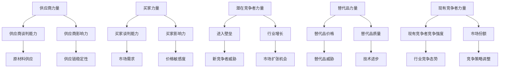
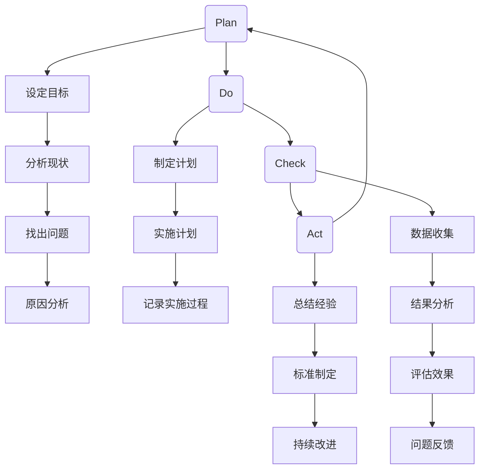

                 

## 领导力思维：改变团队命运的领导智慧

### 关键词：领导力、团队管理、领导思维、实践应用、跨文化领导

> 摘要：本文旨在深入探讨领导力思维在团队管理中的关键作用。通过分析领导力思维的基本概念、核心要素以及其在实际应用中的多种方法论，我们将揭示领导力思维如何改变团队命运的奥秘。文章结构紧凑，内容丰富，旨在为读者提供一套实用的领导力思维框架，帮助他们在实际工作中更有效地提升团队绩效。

### 目录大纲

# 领导力思维：改变团队命运的领导智慧

## 第一部分：领导力思维概述

## 第1章：领导力思维的重要性

### 1.1 领导力思维的背景

#### 1.1.1 现代企业对领导力的需求

#### 1.1.2 领导力思维的历史演变

#### 1.1.3 领导力思维的基本概念

### 1.2 领导力思维的核心要素

#### 1.2.1 洞察力

#### 1.2.2 决策力

#### 1.2.3 沟通力

#### 1.2.4 激励力

### 1.3 领导力思维的应用场景

#### 1.3.1 团队建设

#### 1.3.2 项目管理

#### 1.3.3 应对危机

## 第2章：领导力思维方法论

### 2.1 SWOT分析法

#### 2.1.1 SWOT分析的基本原理

#### 2.1.2 SWOT分析在实际中的应用

### 2.2 五力模型

#### 2.2.1 五力模型的基本原理

#### 2.2.2 五力模型在实际中的应用

### 2.3 PDCA循环法

#### 2.3.1 PDCA循环法的基本原理

#### 2.3.2 PDCA循环法在实际中的应用

## 第二部分：领导力思维的实践应用

## 第3章：领导力思维在团队建设中的应用

### 3.1 团队成员的识别与培养

#### 3.1.1 团队成员的识别

#### 3.1.2 团队成员的培养

### 3.2 团队目标的设定与实现

#### 3.2.1 团队目标的设定

#### 3.2.2 团队目标的实现

### 3.3 团队协作与沟通

#### 3.3.1 团队协作的重要性

#### 3.3.2 团队沟通的方法与技巧

## 第4章：领导力思维在项目管理中的应用

### 4.1 项目管理的核心原则

#### 4.1.1 项目管理的定义

#### 4.1.2 项目管理的核心原则

### 4.2 项目计划的制定与执行

#### 4.2.1 项目计划的制定

#### 4.2.2 项目计划的执行

### 4.3 项目风险的管理

#### 4.3.1 项目风险的识别

#### 4.3.2 项目风险的管理策略

## 第5章：领导力思维在危机应对中的应用

### 5.1 危机管理的核心要素

#### 5.1.1 危机管理的定义

#### 5.1.2 危机管理的核心要素

### 5.2 危机应对的策略与方法

#### 5.2.1 危机应对的策略

#### 5.2.2 危机应对的方法

### 5.3 从危机中恢复与成长

#### 5.3.1 从危机中恢复

#### 5.3.2 从危机中成长

## 第6章：领导力思维的跨文化应用

### 6.1 跨文化领导力的重要性

#### 6.1.1 跨文化领导力的定义

#### 6.1.2 跨文化领导力的重要性

### 6.2 跨文化领导力的挑战与应对策略

#### 6.2.1 跨文化领导力的挑战

#### 6.2.2 跨文化领导力的应对策略

### 6.3 跨文化团队的建设与维护

#### 6.3.1 跨文化团队的建设

#### 6.3.2 跨文化团队的维护

## 第7章：领导力思维的持续提升

### 7.1 领导力思维的自我提升方法

#### 7.1.1 自我反思

#### 7.1.2 学习与成长

#### 7.1.3 持续实践

### 7.2 领导力思维的团队培养

#### 7.2.1 团队成员的领导力培养

#### 7.2.2 领导力团队的培养

### 7.3 领导力思维的持续优化

#### 7.3.1 领导力思维的优化策略

#### 7.3.2 领导力思维的持续优化实践

## 附录

### 附录A：常用领导力思维工具

#### A.1 SWOT分析表

#### A.2 五力模型图

#### A.3 PDCA循环图

### 附录B：领导力思维案例解析

#### B.1 案例一：企业成功转型

#### B.2 案例二：团队高效协作

#### B.3 案例三：危机应对与恢复

## 后记

### 后记：领导力思维的实践与反思

#### 1. 实践的重要性

#### 2. 反思与持续改进

#### 3. 领导力思维的未来发展趋势

---

现在，让我们开始逐步深入分析领导力思维的基本概念、核心要素以及其实际应用场景。

### 第一部分：领导力思维概述

#### 第1章：领导力思维的重要性

### 1.1 领导力思维的背景

在当今快速变化的商业环境中，领导力已成为企业成败的关键因素。随着全球化的推进和市场竞争的加剧，企业需要具备快速响应变化、持续创新和高效执行的能力。这种能力不仅依赖于技术和资源的支持，更依赖于领导者的智慧和能力。

领导力思维，指的是领导者在对团队、项目或组织进行管理时的思维方式和方法论。它包括了洞察力、决策力、沟通力和激励力等多个方面，旨在帮助领导者更好地应对复杂多变的环境，提升团队的执行力和创新能力。

#### 1.1.1 现代企业对领导力的需求

现代企业对领导力的需求日益增加，主要体现在以下几个方面：

1. **快速决策能力**：在市场变化迅速的今天，领导者需要具备快速做出有效决策的能力，以应对各种不确定性。
2. **创新能力**：创新是企业发展的重要驱动力，领导者需要鼓励团队不断探索新的解决方案，推动企业持续进步。
3. **团队协作能力**：现代企业强调团队合作，领导者需要能够有效地激发团队的潜力，实现团队协作的最大化。
4. **沟通与协调能力**：领导者需要具备良好的沟通和协调能力，以确保信息的有效传递和资源的合理配置。

#### 1.1.2 领导力思维的历史演变

领导力思维的历史演变可以追溯到古代社会。在古代，领导者主要依靠经验和直觉来做出决策。随着时间的推移，人类逐渐意识到系统化和科学化的方法在领导过程中的重要性。以下是领导力思维演变的一些关键阶段：

1. **封建制度下的领导**：在封建社会中，领导者主要依靠家族势力、土地和资源来维护自己的地位。这种领导方式较为单一和封闭。
2. **工业革命后的领导**：随着工业革命的到来，企业规模扩大，领导者开始采用科学管理方法，如泰勒制等，以提高生产效率。
3. **现代领导理论的发展**：20世纪以来，领导学理论逐渐发展起来，包括行为领导理论、情境领导理论、变革领导理论等。这些理论强调了领导者需要根据不同情境和团队特点来调整领导方式。

#### 1.1.3 领导力思维的基本概念

领导力思维的基本概念包括以下几个核心要素：

1. **洞察力**：洞察力是指领导者对团队、项目或组织运行状况的深刻理解能力。它帮助领导者识别问题和机会，做出明智的决策。
2. **决策力**：决策力是领导者根据洞察力做出的决策能力。决策力不仅包括决策的速度，还包括决策的准确性和全面性。
3. **沟通力**：沟通力是领导者与团队成员、利益相关者之间有效沟通的能力。良好的沟通可以增强团队的凝聚力，提高执行效率。
4. **激励力**：激励力是领导者激发团队成员积极性和创造力的能力。激励力不仅包括物质激励，还包括精神激励和文化激励。

#### 1.2 领导力思维的核心要素

1. **洞察力**

洞察力是领导力思维的核心要素之一。它帮助领导者从复杂的信息中提取关键信息，发现问题的本质和隐藏的机会。以下是提升洞察力的一些方法：

- **深度思考**：领导者需要花时间深入思考，从多角度、多层次分析问题。
- **经验积累**：通过实践和经验积累，领导者可以更好地理解团队和项目的运行规律。
- **跨界学习**：领导者应该具备跨界学习的能力，从其他领域汲取灵感和经验。

2. **决策力**

决策力是领导者在面对复杂问题时做出有效决策的能力。提升决策力需要以下几个方面的能力：

- **信息收集**：领导者需要收集全面、准确的信息，以支持决策过程。
- **风险评估**：领导者需要对各种决策方案进行风险评估，选择风险最小的方案。
- **快速决策**：在紧急情况下，领导者需要具备快速决策的能力，以应对突发状况。

3. **沟通力**

沟通力是领导者与团队成员、利益相关者之间有效沟通的能力。提升沟通力需要以下几个方面：

- **倾听**：领导者需要倾听团队成员的意见和反馈，了解他们的需求和期望。
- **表达**：领导者需要清晰地表达自己的想法和期望，确保信息的准确传递。
- **反馈**：领导者需要给予团队成员及时的反馈，以促进他们的成长和进步。

4. **激励力**

激励力是领导者激发团队成员积极性和创造力的能力。提升激励力需要以下几个方面的策略：

- **物质激励**：通过提供有竞争力的薪酬和福利，激发团队成员的积极性。
- **精神激励**：通过认可和奖励优秀表现，提升团队成员的荣誉感和成就感。
- **文化激励**：建立积极向上的企业文化，营造良好的工作氛围，激发团队成员的归属感和责任感。

#### 1.3 领导力思维的应用场景

领导力思维在多种场景中都有广泛的应用，以下是其中几个重要的应用场景：

1. **团队建设**

团队建设是领导力思维的重要应用场景之一。领导者需要通过洞察力识别团队中的优势和劣势，通过沟通力和激励力提升团队的凝聚力和执行力。以下是团队建设的关键步骤：

- **团队目标的设定**：明确团队的目标和愿景，确保团队成员对此有共同的理解和认同。
- **团队成员的识别与培养**：识别团队成员的能力和潜力，提供相应的培训和发展机会。
- **团队协作与沟通**：建立有效的沟通机制，促进团队成员之间的协作和合作。

2. **项目管理**

项目管理是领导力思维的另一个重要应用场景。领导者需要通过决策力和沟通力确保项目的顺利进行，通过激励力提升团队的工作积极性和创造力。以下是项目管理的核心原则：

- **项目目标的明确**：确保项目目标清晰明确，团队成员对项目目标和预期成果有共同的认识。
- **项目计划的制定与执行**：制定详细的项目计划，确保项目按计划执行，并及时调整计划以应对变化。
- **项目风险的管理**：识别项目风险，制定相应的风险应对策略，确保项目能够顺利进行。

3. **应对危机**

在面临危机时，领导力思维显得尤为重要。领导者需要通过洞察力和决策力迅速识别危机的本质和影响，通过沟通力和激励力稳定团队情绪，制定应对策略。以下是应对危机的关键步骤：

- **危机识别**：及时识别危机，明确危机的性质和影响范围。
- **危机应对**：制定危机应对策略，采取紧急措施，控制危机蔓延。
- **危机恢复**：在危机得到控制后，进行危机后的恢复工作，总结经验教训，防止类似危机再次发生。

通过以上分析，我们可以看到领导力思维在团队管理中的关键作用。它不仅帮助领导者更好地理解团队和项目，还提供了有效的工具和方法，帮助他们在复杂多变的环境中做出明智的决策。接下来，我们将深入探讨领导力思维的具体方法论，以进一步理解其应用和实践价值。

### 第2章：领导力思维方法论

在了解了领导力思维的基本概念和核心要素之后，我们需要掌握一些实用的方法论，这些方法论可以帮助领导者在实际工作中更有效地应用领导力思维。在本章中，我们将介绍几种常用的领导力思维方法论，包括SWOT分析法、五力模型和PDCA循环法。

#### 2.1 SWOT分析法

SWOT分析法是一种常用的战略规划工具，用于评估一个团队、项目或组织的优势（Strengths）、劣势（Weaknesses）、机会（Opportunities）和威胁（Threats）。这种方法可以帮助领导者系统地分析团队所处的内外部环境，从而制定出更有效的战略和决策。

##### 2.1.1 SWOT分析的基本原理

SWOT分析的基本原理是通过识别和分析团队或组织的四个方面的因素，来评估其整体状况和未来发展方向。

- **优势（Strengths）**：优势是指团队或组织在资源、能力、市场地位等方面的优势。这些优势可以为团队或组织提供竞争优势和机会。
- **劣势（Weaknesses）**：劣势是指团队或组织在资源、能力、市场地位等方面的不足。这些劣势可能成为团队或组织发展的障碍。
- **机会（Opportunities）**：机会是指外部环境中可能为团队或组织带来有利条件的变化。抓住机会可以为团队或组织带来新的发展空间。
- **威胁（Threats）**：威胁是指外部环境中可能对团队或组织造成不利影响的变化。应对威胁是保证团队或组织持续发展的关键。

##### 2.1.2 SWOT分析在实际中的应用

在实际应用中，SWOT分析可以帮助领导者进行以下几方面的工作：

- **战略规划**：通过分析团队或组织的优势和劣势，领导者可以制定出符合自身条件的发展战略。
- **资源配置**：通过分析外部环境的机会和威胁，领导者可以合理配置资源，确保团队或组织在竞争中获得优势。
- **风险管理**：通过识别和分析威胁，领导者可以制定出相应的风险应对策略，降低风险对团队或组织的影响。

下面是一个简单的SWOT分析示例：

|       | 优势（Strengths） | 劣势（Weaknesses） | 机会（Opportunities） | 威胁（Threats） |
|-------|-------------------|-------------------|----------------------|----------------|
| **产品** | 创新能力强       | 产品线单一        | 市场需求增加         | 竞争对手增加    |
| **团队** | 合作氛围好       | 技术能力不足      | 员工培训计划         | 员工流失风险    |
| **市场** | 品牌知名度高     | 市场份额有限      | 新市场开拓计划       | 行业竞争加剧    |
| **环境** | 政策支持         | 市场法规变动      | 技术创新机会         | 经济波动       |

通过这个表格，领导者可以清晰地看到团队或组织的优势和劣势，以及外部环境中的机会和威胁，从而制定出相应的策略。

#### 2.2 五力模型

五力模型是由迈克尔·波特（Michael E. Porter）提出的一种分析行业竞争力的工具。它通过分析五个方面的力量，来评估一个行业的竞争强度和潜在利润水平。

##### 2.2.1 五力模型的基本原理

五力模型包括以下五个方面的力量：

- **供应商力量**：供应商在行业中的谈判能力和影响力。
- **买家力量**：买家在行业中的谈判能力和影响力。
- **潜在竞争者力量**：潜在竞争者进入行业时的威胁程度。
- **替代品力量**：替代品在行业中的替代程度和影响力。
- **现有竞争者力量**：现有竞争者在行业中的竞争强度。

##### 2.2.2 五力模型在实际中的应用

五力模型可以帮助领导者进行以下几方面的工作：

- **行业分析**：通过分析行业中的五种力量，领导者可以评估行业的竞争强度和潜在利润水平。
- **战略制定**：根据行业分析结果，领导者可以制定出适合团队或组织的发展战略。

下面是一个简单的五力模型分析示例：

|         | 供应商力量 | 买家力量 | 潜在竞争者力量 | 替代品力量 | 现有竞争者力量 |
|---------|-------------|-----------|-----------------|-------------|----------------|
| **产品** | 中等        | 高        | 低              | 高          | 中等           |
| **市场** | 中等        | 高        | 低              | 中等        | 高             |
| **技术** | 低          | 中等      | 中等            | 中等        | 低             |

通过这个表格，领导者可以清晰地看到团队或组织在各个方面的竞争状况，从而制定出相应的战略。

#### 2.3 PDCA循环法

PDCA循环法，也称为戴明循环，是一种用于持续改进的方法。它包括四个步骤：计划（Plan）、执行（Do）、检查（Check）和行动（Act）。这种方法可以帮助领导者不断地改进和优化团队或组织的运作。

##### 2.3.1 PDCA循环法的基本原理

PDCA循环法的四个步骤如下：

- **计划（Plan）**：制定目标和计划，包括具体的行动计划和时间表。
- **执行（Do）**：按照计划执行，确保所有行动按照计划进行。
- **检查（Check）**：检查执行结果，评估目标和计划的完成情况。
- **行动（Act）**：根据检查结果，采取相应的行动，对成功的经验和失败的教训进行总结和改进。

##### 2.3.2 PDCA循环法在实际中的应用

PDCA循环法可以帮助领导者进行以下几方面的工作：

- **项目管理和执行**：通过PDCA循环法，领导者可以确保项目的顺利进行，并及时调整计划以应对变化。
- **持续改进**：通过PDCA循环法，领导者可以不断地改进团队或组织的运作方式，提高工作效率和质量。

下面是一个简单的PDCA循环法应用示例：

1. **计划（Plan）**：制定项目目标和计划，包括项目的时间表、任务分配和资源需求。
2. **执行（Do）**：按照计划执行，确保所有任务按时完成。
3. **检查（Check）**：检查项目的执行情况，包括项目进度、质量和成本控制。
4. **行动（Act）**：根据检查结果，对项目进行总结和改进，确保项目的成功完成。

通过这个示例，我们可以看到PDCA循环法如何帮助领导者有效地管理和执行项目。

#### 总结

通过本章对SWOT分析法、五力模型和PDCA循环法的介绍，我们可以看到这些领导力思维方法论在实际中的应用价值。这些方法论不仅帮助领导者更好地理解团队和项目，还提供了具体的工具和框架，使领导者能够更有效地制定战略和决策。在接下来的章节中，我们将进一步探讨领导力思维在团队建设、项目管理、危机应对和跨文化应用中的实际应用。

### 第二部分：领导力思维的实践应用

#### 第3章：领导力思维在团队建设中的应用

团队建设是领导力思维的重要实践应用之一。一个高效的团队不仅能够提高工作效率，还能激发团队成员的创造力和潜力。在本章中，我们将探讨领导力思维在团队成员识别与培养、团队目标设定与实现、团队协作与沟通中的具体应用。

#### 3.1 团队成员的识别与培养

团队成员的识别与培养是团队建设的基础。一个优秀的领导者需要能够识别团队成员的优势和潜力，并为他们提供合适的发展机会。

##### 3.1.1 团队成员的识别

团队成员的识别主要包括以下几个方面：

1. **能力识别**：领导者需要了解每个团队成员的专业技能和工作能力，以便合理分配任务和职责。
2. **潜力识别**：除了现有的能力外，领导者还需要关注团队成员的潜力和成长空间，以便为未来的发展做好准备。
3. **价值观识别**：团队成员的价值观与团队文化是否相符合，也是识别过程中需要考虑的因素。

##### 3.1.2 团队成员的培养

团队成员的培养是一个持续的过程，领导者可以通过以下几种方式来培养团队成员：

1. **培训与发展**：为团队成员提供专业知识和技能的培训，帮助他们提升工作能力。
2. **导师制度**：通过导师制度，让有经验的团队成员指导新成员，帮助他们更快地融入团队。
3. **激励机制**：通过奖励和认可，激发团队成员的积极性和创造力。

#### 3.2 团队目标的设定与实现

团队目标的设定与实现是团队建设的关键环节。一个明确的团队目标可以帮助团队成员统一行动，提高团队的整体效率。

##### 3.2.1 团队目标的设定

团队目标的设定需要遵循以下原则：

1. **SMART原则**：团队目标应该具体（Specific）、可衡量（Measurable）、可达成（Achievable）、相关（Relevant）和有时间限制（Time-bound）。
2. **共识原则**：团队目标应该得到团队成员的共识，确保每个人都明确目标的重要性和自己的责任。

##### 3.2.2 团队目标的实现

实现团队目标需要团队成员的共同努力，领导者可以通过以下几种方式来推动团队目标的实现：

1. **计划与执行**：制定详细的行动计划，确保每个团队成员都清楚自己的任务和责任，并严格按照计划执行。
2. **监控与反馈**：定期检查团队目标的执行情况，及时发现和解决问题，确保团队目标的实现。
3. **激励与奖励**：通过激励和奖励，鼓励团队成员为实现团队目标而努力。

#### 3.3 团队协作与沟通

团队协作与沟通是团队建设的重要组成部分。一个高效的团队需要具备良好的协作与沟通能力，以便更好地完成任务和实现目标。

##### 3.3.1 团队协作的重要性

团队协作的重要性体现在以下几个方面：

1. **资源共享**：团队协作可以使团队成员共享资源，提高工作效率。
2. **知识互补**：团队协作可以充分发挥每个成员的专业知识和经验，实现知识的互补和共享。
3. **提高满意度**：良好的团队协作可以提高团队成员的工作满意度和归属感，增强团队的凝聚力。

##### 3.3.2 团队沟通的方法与技巧

团队沟通的方法与技巧主要包括以下几个方面：

1. **明确沟通目标**：每次沟通前都应该明确沟通的目标和目的，确保沟通内容有针对性。
2. **倾听与表达**：领导者需要倾听团队成员的意见和反馈，同时清晰地表达自己的想法和期望，确保信息的准确传递。
3. **开放与坦诚**：建立开放和坦诚的沟通环境，鼓励团队成员提出问题和建议，促进团队内部的交流和合作。
4. **及时反馈**：对团队成员的反馈和问题要及时回应，确保沟通的连续性和有效性。

#### 案例分析

为了更好地理解领导力思维在团队建设中的应用，我们可以通过一个实际案例来进行分析。

**案例背景**：某公司是一家软件开发公司，其团队由10名开发人员组成。公司计划开发一款全新的软件产品，旨在提高企业的运营效率。

**团队成员识别与培养**：

- **能力识别**：通过面试和试用，公司识别出了5名具备高级开发技能的成员，另外5名成员则处于初级和中级水平。
- **潜力识别**：公司发现其中一名初级成员在项目中表现出了很高的学习能力和创新意识，决定对其进行重点培养。
- **价值观识别**：团队成员在价值观上与公司文化高度契合，具有较高的团队协作意愿。

**团队目标设定与实现**：

- **SMART原则**：团队设定了具体的、可衡量的、可达成、相关且有时间限制的目标，如“在六个月内完成软件产品的核心开发工作”。
- **共识原则**：团队成员对目标的重要性和自己的责任有清晰的认知，形成了共同的目标感。

**团队协作与沟通**：

- **计划与执行**：公司制定了详细的开发计划，明确了每个成员的任务和时间表，确保项目按计划进行。
- **监控与反馈**：项目进度每周进行一次检查，及时发现和解决问题，确保项目顺利进行。
- **激励与奖励**：公司对在项目中表现突出的成员进行了奖励，提高了团队成员的工作积极性。

通过这个案例，我们可以看到领导力思维在团队建设中的应用是如何帮助团队实现目标的。领导者通过识别团队成员的能力和潜力，设定明确的目标，并建立有效的协作与沟通机制，从而提升了团队的整体绩效。

### 第4章：领导力思维在项目管理中的应用

项目管理是现代企业运营中不可或缺的一部分。一个成功的项目不仅能够提升企业的竞争力，还能为团队带来宝贵的经验和知识。在本章中，我们将探讨领导力思维在项目管理中的具体应用，包括项目管理的核心原则、项目计划的制定与执行以及项目风险的管理。

#### 4.1 项目管理的核心原则

项目管理的核心原则是确保项目能够在既定的时间和预算内实现预定的目标和成果。以下是项目管理中的几个关键原则：

##### 4.1.1 项目管理的定义

项目管理是指通过计划、组织、协调和控制等手段，确保项目目标的实现。项目管理涉及到多个方面的活动，包括项目规划、项目执行、项目监控和项目收尾。

##### 4.1.2 项目管理的核心原则

1. **目标导向**：项目管理应以实现项目目标为中心。项目目标的设定需要明确、具体、可衡量，并得到项目团队的共识。
2. **资源优化**：项目管理需要合理配置资源，包括人力、财力和物力，以确保项目能够顺利进行。
3. **风险管理**：项目管理应重视风险识别、评估和管理，以降低项目风险对项目进度和成果的影响。
4. **持续改进**：项目管理应不断反思和改进，以提升项目管理的能力和效率。

#### 4.2 项目计划的制定与执行

项目计划的制定与执行是项目管理的核心环节。一个详细、可行且科学的项目计划是项目成功的关键。

##### 4.2.1 项目计划的制定

项目计划的制定包括以下步骤：

1. **项目目标明确**：明确项目目标，包括项目范围、预期成果和交付物。
2. **任务分解**：将项目目标分解为具体的工作任务，明确每个任务的负责人和完成时间。
3. **资源分配**：根据任务需求，合理分配人力资源、财务资源和物资资源。
4. **时间安排**：制定项目的时间安排，包括关键节点和交付时间。
5. **风险评估**：评估项目风险，制定相应的风险应对措施。

##### 4.2.2 项目计划的执行

项目计划的执行需要团队成员的共同努力。以下是项目执行过程中的一些关键点：

1. **任务分配**：确保每个团队成员都清楚自己的任务和责任，并按照计划进行工作。
2. **进度监控**：定期检查项目进度，及时发现和解决问题，确保项目按计划进行。
3. **沟通与协调**：建立有效的沟通机制，确保信息流畅，协调团队成员之间的工作。
4. **绩效评估**：对团队成员的工作进行绩效评估，激励团队成员提高工作效率和质量。

#### 4.3 项目风险的管理

项目风险的管理是项目管理中的重要一环。项目风险可能来自内部因素，如资源不足、人员流失，也可能来自外部因素，如市场变化、政策调整。

##### 4.3.1 项目风险的识别

项目风险的识别是风险管理的第一步。领导者可以通过以下几种方法来识别项目风险：

1. **经验法**：利用以往项目中的经验，识别可能出现的风险。
2. **专家评估**：邀请行业专家进行风险评估，获取专业的意见和建议。
3. **数据分析法**：通过数据分析，识别潜在的风险因素。

##### 4.3.2 项目风险的管理策略

项目风险的管理策略包括以下几个方面：

1. **风险规避**：通过调整项目计划，避免风险的发生。
2. **风险减轻**：通过采取预防措施，降低风险发生的概率或减少风险带来的影响。
3. **风险转移**：通过购买保险或其他方式，将风险转移给第三方。
4. **风险接受**：对于无法避免或转移的风险，领导者需要制定相应的应对策略，确保项目能够顺利完成。

#### 案例分析

为了更好地理解领导力思维在项目管理中的应用，我们可以通过一个实际案例来进行分析。

**案例背景**：某公司计划开发一款智能家居软件，旨在提升用户的生活质量。项目团队由5名开发人员和1名项目经理组成。

**项目计划制定**：

- **项目目标明确**：项目目标是开发一款功能完善、用户体验良好的智能家居软件。
- **任务分解**：将项目分解为需求分析、系统设计、编码实现、测试和上线等任务。
- **资源分配**：根据任务需求，合理分配人力资源和物资资源。
- **时间安排**：项目预计在6个月内完成，关键节点包括需求分析完成、系统设计完成和测试通过。
- **风险评估**：识别出技术难度高、用户需求变化和资源不足等风险，并制定了相应的应对措施。

**项目计划执行**：

- **任务分配**：确保每个团队成员都清楚自己的任务和责任，并按照计划进行工作。
- **进度监控**：每周检查项目进度，及时发现和解决问题。
- **沟通与协调**：建立有效的沟通机制，确保信息流畅，协调团队成员之间的工作。
- **绩效评估**：对团队成员的工作进行绩效评估，激励团队成员提高工作效率和质量。

**项目风险管理**：

- **风险规避**：通过提前了解用户需求，减少需求变化的风险。
- **风险减轻**：为技术难度高的任务安排经验丰富的开发人员，降低技术风险。
- **风险转移**：购买项目保险，降低意外事件带来的损失。
- **风险接受**：对于无法避免的风险，制定应急预案，确保项目能够顺利完成。

通过这个案例，我们可以看到领导力思维在项目管理中的应用是如何帮助项目团队实现目标的。领导者通过制定详细的项目计划，建立有效的沟通机制，以及采取相应的风险管理策略，确保项目能够按计划顺利进行。

### 第5章：领导力思维在危机应对中的应用

在任何组织中，危机都是不可避免的。危机管理能力是衡量领导者领导力的重要指标。在本章中，我们将探讨领导力思维在危机应对中的应用，包括危机管理的核心要素、危机应对的策略与方法，以及从危机中恢复与成长。

#### 5.1 危机管理的核心要素

危机管理是指组织在面对突发事件和灾难时，通过有效的应对措施，减少危机带来的负面影响，并迅速恢复秩序。危机管理的核心要素包括以下几个方面：

##### 5.1.1 危机管理的定义

危机管理是指组织为应对突发事件和灾难，制定和实施的预防和应对措施。危机管理不仅包括事前准备，还包括事发后的应对和恢复。

##### 5.1.2 危机管理的核心要素

1. **危机识别**：及时识别潜在的危机，是危机管理的重要一环。领导者需要具备敏锐的洞察力，能够从细微的变化中识别出危机的征兆。
2. **危机响应**：危机发生时，领导者需要迅速响应，制定紧急应对策略，控制危机蔓延。
3. **危机沟通**：危机沟通是危机管理的关键环节。领导者需要与内部团队和外部利益相关者保持有效沟通，确保信息透明和及时传递。
4. **危机恢复**：危机发生后，领导者需要组织和协调资源，进行危机后的恢复工作，确保组织能够尽快恢复正常运营。

#### 5.2 危机应对的策略与方法

在危机应对中，领导者需要根据危机的类型和影响程度，采取相应的策略和方法。以下是几种常见的危机应对策略和方法：

##### 5.2.1 危机应对的策略

1. **紧急应对策略**：在危机发生时，领导者需要迅速采取紧急措施，以控制危机的蔓延。例如，暂停生产、疏散人员等。
2. **长期应对策略**：对于一些长期存在的危机，领导者需要制定长期的应对策略，如改进生产工艺、优化供应链等。
3. **综合应对策略**：对于复杂的危机，领导者需要采取多种应对策略相结合的方法，以确保危机得到全面、有效的应对。

##### 5.2.2 危机应对的方法

1. **危机预警系统**：建立危机预警系统，通过数据分析和监测，提前识别和预测潜在的危机。
2. **应急预案**：制定应急预案，明确危机发生时的应对步骤和责任人，确保危机发生时能够迅速采取行动。
3. **危机沟通策略**：建立有效的危机沟通机制，确保内部团队和外部利益相关者能够及时获得信息，减少误解和恐慌。

#### 5.3 从危机中恢复与成长

危机发生后，领导者不仅需要组织恢复工作，还需要从危机中吸取教训，促进组织的成长。以下是几个关键步骤：

##### 5.3.1 从危机中恢复

1. **评估危机影响**：对危机的影响进行全面的评估，包括人员伤亡、财产损失、声誉影响等。
2. **恢复运营**：根据评估结果，迅速恢复组织的正常运营，确保关键业务不中断。
3. **资源调配**：合理调配资源，优先保障关键业务和人员的恢复。

##### 5.3.2 从危机中成长

1. **总结经验**：对危机管理过程进行总结，识别成功和失败的教训，为未来的危机管理提供参考。
2. **改进管理**：根据危机管理中的问题和不足，改进管理流程和制度，提高组织的抗风险能力。
3. **培训与发展**：对员工进行危机管理培训，提高员工的危机应对能力，为组织的长期发展做好准备。

#### 案例分析

为了更好地理解领导力思维在危机应对中的应用，我们可以通过一个实际案例来进行分析。

**案例背景**：某公司是一家生产电子产品的企业，由于生产流程中的质量控制问题，导致一批产品出现严重质量问题，被迫召回。

**危机应对**：

- **危机识别**：公司通过数据分析，及时发现产品存在质量问题，迅速采取应对措施。
- **危机响应**：公司立即停产，召回问题产品，并启动应急预案，确保危机得到控制。
- **危机沟通**：公司及时向内部团队和外部客户通报危机情况，确保信息透明，减少误解和恐慌。

**危机恢复**：

- **评估危机影响**：公司对危机的影响进行了全面的评估，包括经济损失、品牌形象受损等。
- **恢复运营**：公司迅速恢复生产，调整生产流程，确保产品质量。
- **资源调配**：公司合理调配资源，优先保障关键业务和人员的恢复。

**从危机中成长**：

- **总结经验**：公司对危机管理过程进行了总结，识别出生产流程中的问题和不足，为未来的危机管理提供参考。
- **改进管理**：公司改进了生产流程和质量控制制度，提高了组织的抗风险能力。
- **培训与发展**：公司对员工进行了危机管理培训，提高了员工的危机应对能力。

通过这个案例，我们可以看到领导力思维在危机应对中的应用是如何帮助组织从危机中恢复和成长。领导者通过及时识别危机、迅速响应、有效沟通和恢复运营，确保组织能够尽快恢复正常运营，并通过总结经验、改进管理和培训员工，提高组织的抗风险能力和危机应对能力。

### 第6章：领导力思维的跨文化应用

在全球化时代，跨文化团队的管理和领导变得尤为重要。领导力思维在跨文化团队中的应用，不仅关系到团队的效率和绩效，还直接影响企业的国际竞争力和市场占有率。本章将探讨跨文化领导力的重要性、挑战与应对策略，以及跨文化团队的建设与维护。

#### 6.1 跨文化领导力的重要性

跨文化领导力是指领导者在全球化背景下，能够在多元文化环境中有效管理团队、制定战略并实现组织目标的能力。随着全球化的推进，企业越来越依赖跨文化团队合作，跨文化领导力的重要性也日益凸显。以下是跨文化领导力的重要方面：

##### 6.1.1 跨文化领导力的定义

跨文化领导力是指领导者具备理解、尊重并有效管理不同文化背景团队成员的能力。它不仅包括对文化差异的敏感度，还包括跨文化沟通、冲突管理和文化融合等方面的能力。

##### 6.1.2 跨文化领导力的重要性

1. **提升团队绩效**：跨文化领导力有助于建立高效、协作的团队，提升团队的创造力和执行力。
2. **增强企业竞争力**：在全球市场中，具备跨文化领导力的企业能够更好地适应多元文化环境，提高市场占有率和竞争力。
3. **促进文化融合**：跨文化领导力有助于推动不同文化背景的员工之间的相互理解和尊重，促进企业的文化融合。
4. **减少文化冲突**：通过有效的跨文化领导，领导者可以减少因文化差异引起的误解和冲突，提高团队的整体满意度。

#### 6.2 跨文化领导力的挑战与应对策略

在跨文化环境中，领导者面临诸多挑战，包括文化差异、沟通障碍、团队冲突等。以下是一些常见的挑战及应对策略：

##### 6.2.1 跨文化领导力的挑战

1. **文化差异**：不同文化背景的团队成员可能在价值观、工作习惯和沟通方式上存在显著差异，这可能导致误解和冲突。
2. **沟通障碍**：语言障碍、沟通风格不同以及文化背景的差异都可能导致信息传递不畅。
3. **团队冲突**：文化差异可能导致团队成员之间的矛盾和冲突，影响团队协作和绩效。

##### 6.2.2 跨文化领导力的应对策略

1. **文化敏感度**：领导者需要提高文化敏感度，尊重并理解不同文化的价值观和习俗，避免文化偏见和误解。
2. **跨文化沟通**：领导者需要掌握有效的跨文化沟通技巧，如清晰表达、倾听和理解，以确保信息的准确传递。
3. **冲突管理**：领导者需要学会有效管理文化冲突，通过调解和协商解决分歧，促进团队和谐。
4. **文化融合**：领导者应推动文化融合，鼓励团队成员分享不同文化的优点和经验，建立共同的价值观和目标。

#### 6.3 跨文化团队的建设与维护

建立和维护一个高效的跨文化团队，是跨文化领导力的重要任务。以下是一些关键步骤和策略：

##### 6.3.1 跨文化团队的建设

1. **团队构建**：根据项目需求，选择具备不同文化背景和专业技能的团队成员，确保团队具备多样性。
2. **共同目标**：明确团队的目标和愿景，确保团队成员对此有共同的理解和认同。
3. **文化培训**：为团队成员提供跨文化培训，提高他们对不同文化的认识和适应能力。
4. **建立信任**：通过团队建设活动，增强团队成员之间的信任和合作。

##### 6.3.2 跨文化团队的维护

1. **持续沟通**：保持团队的持续沟通，确保团队成员之间信息畅通，减少误解和冲突。
2. **鼓励反馈**：鼓励团队成员提出意见和建议，促进团队内部的开放和坦诚。
3. **文化多样性认可**：认可和尊重团队成员的文化多样性，促进文化融合。
4. **激励机制**：建立公平、有效的激励机制，激励团队成员积极参与团队活动，提升团队凝聚力。

#### 案例分析

为了更好地理解领导力思维在跨文化团队中的应用，我们可以通过一个实际案例来进行分析。

**案例背景**：某公司是一家跨国科技公司，其研发团队由来自中国、美国、印度和德国的成员组成。公司总部位于中国，项目主要在中国和美国进行。

**跨文化团队建设**：

- **团队构建**：公司根据项目需求，选择了来自不同国家的专业人才，确保团队具备多样性。
- **共同目标**：公司明确了研发项目的目标和愿景，确保团队成员对此有共同的理解和认同。
- **文化培训**：公司为团队成员提供了跨文化培训，提高了他们对不同文化的认识和适应能力。
- **建立信任**：公司通过团队建设活动和定期的沟通会议，增强了团队成员之间的信任和合作。

**跨文化团队维护**：

- **持续沟通**：公司建立了定期的视频会议和在线沟通平台，确保团队成员之间信息畅通，减少误解和冲突。
- **鼓励反馈**：公司鼓励团队成员提出意见和建议，促进团队内部的开放和坦诚。
- **文化多样性认可**：公司认可和尊重团队成员的文化多样性，促进文化融合。
- **激励机制**：公司建立了公平、有效的激励机制，激励团队成员积极参与团队活动，提升团队凝聚力。

通过这个案例，我们可以看到领导力思维在跨文化团队中的应用是如何帮助团队克服文化差异，提高协作效率和绩效。领导者通过有效的团队建设和维护策略，促进了跨文化团队的和谐发展，实现了项目的成功。

### 第7章：领导力思维的持续提升

领导力思维的持续提升是领导者职业生涯发展的重要组成部分。随着环境的不断变化，领导者需要不断地学习和改进，以适应新的挑战和机遇。本章将探讨领导力思维的自我提升方法、团队培养策略以及持续优化的实践。

#### 7.1 领导力思维的自我提升方法

自我提升是领导力发展的关键。以下是几种有效的自我提升方法：

##### 7.1.1 自我反思

自我反思是领导者提升自我意识和领导能力的重要途径。通过定期反思，领导者可以识别自己的优点和不足，找到改进的方向。

1. **定期回顾**：定期回顾自己的工作，总结经验教训，识别成功和失败的案例。
2. **设定目标**：设定清晰的个人和职业目标，评估自己的进步和不足。
3. **寻求反馈**：主动向团队成员和同事寻求反馈，了解他们的观点和建议。

##### 7.1.2 学习与成长

学习是领导力提升的重要手段。领导者需要不断学习新的知识和技能，以适应不断变化的环境。

1. **持续学习**：通过阅读、参加培训课程、学习新的管理理论和技术，保持知识的更新。
2. **跨界学习**：学习其他领域和行业的知识，拓宽视野，提高跨领域能力。
3. **实践应用**：将学到的知识和技能应用到实际工作中，通过实践检验和提升。

##### 7.1.3 持续实践

实践是检验和学习成果的重要方式。通过持续的实践，领导者可以不断提升自己的领导能力。

1. **角色扮演**：通过角色扮演和模拟练习，提高应对各种情境的能力。
2. **项目管理**：参与项目管理，通过实际操作提升项目管理和决策能力。
3. **团队建设**：积极参与团队建设活动，提升团队管理和沟通能力。

#### 7.2 领导力思维的团队培养

团队培养是提升领导力思维的重要环节。以下是一些团队培养策略：

##### 7.2.1 团队成员的领导力培养

团队成员的领导力培养是团队建设的关键。通过以下方法，可以提升团队成员的领导能力：

1. **培训与发展**：为团队成员提供领导力培训，帮助他们掌握领导技能。
2. **导师制度**：建立导师制度，让有经验的领导者指导新成员，提升他们的领导能力。
3. **实践机会**：为团队成员提供实践机会，让他们在实践中学习和成长。

##### 7.2.2 领导力团队的培养

领导力团队的培养是提升整体领导力水平的重要策略。以下是一些培养方法：

1. **团队协作**：鼓励团队成员之间的协作，通过共同解决问题和完成任务，提升团队的整体能力。
2. **共同目标**：明确团队的共同目标，确保团队成员对目标有共同的理解和认同。
3. **文化建设**：建立积极向上的企业文化，营造良好的团队氛围，提升团队的凝聚力和执行力。

#### 7.3 领导力思维的持续优化

领导力思维的持续优化是领导者持续成长的重要保障。以下是一些持续优化的策略：

##### 7.3.1 领导力思维的优化策略

1. **反思与总结**：定期反思和总结领导经验，识别成功和失败的案例，找到优化的方向。
2. **知识更新**：不断学习新的管理理论和实践知识，保持思维的活跃和开放。
3. **实践验证**：将新的管理理念和实践方法应用到实际工作中，通过实践验证和优化。

##### 7.3.2 领导力思维的持续优化实践

1. **项目试点**：在团队中试点新的管理方法和策略，通过实际应用验证其效果。
2. **团队反馈**：定期收集团队成员的反馈，了解他们对领导方式的看法和建议。
3. **跨部门交流**：与其他部门的领导者交流经验，学习不同的管理方法和实践。

通过自我提升、团队培养和持续优化，领导者可以不断提升自己的领导力思维，适应不断变化的环境，实现个人和团队的共同成长。

### 附录A：常用领导力思维工具

在领导力思维的实际应用中，一些工具和方法可以帮助领导者更有效地分析和解决问题。以下介绍三种常用的领导力思维工具：SWOT分析表、五力模型图和PDCA循环图。

#### A.1 SWOT分析表

SWOT分析是一种常用的战略规划工具，用于评估团队或组织的优势（Strengths）、劣势（Weaknesses）、机会（Opportunities）和威胁（Threats）。以下是SWOT分析表的示例：

|       | 优势（Strengths） | 劣势（Weaknesses） | 机会（Opportunities） | 威胁（Threats） |
|-------|-------------------|-------------------|----------------------|----------------|
| **产品** | 创新能力强       | 产品线单一        | 市场需求增加         | 竞争对手增加    |
| **团队** | 合作氛围好       | 技术能力不足      | 员工培训计划         | 员工流失风险    |
| **市场** | 品牌知名度高     | 市场份额有限      | 新市场开拓计划       | 行业竞争加剧    |
| **环境** | 政策支持         | 市场法规变动      | 技术创新机会         | 经济波动       |

#### A.2 五力模型图

五力模型是由迈克尔·波特（Michael E. Porter）提出的一种分析行业竞争力的工具。它包括以下五个方面的力量：

- **供应商力量**：供应商在行业中的谈判能力和影响力。
- **买家力量**：买家在行业中的谈判能力和影响力。
- **潜在竞争者力量**：潜在竞争者进入行业时的威胁程度。
- **替代品力量**：替代品在行业中的替代程度和影响力。
- **现有竞争者力量**：现有竞争者在行业中的竞争强度。

以下是五力模型的示例：

#### A.3 PDCA循环图

PDCA循环法，即计划（Plan）、执行（Do）、检查（Check）和行动（Act），是一种用于持续改进的方法。以下是PDCA循环图的示例：

通过这些工具，领导者可以更系统地分析和解决问题，提升团队的管理水平和绩效。

### 附录B：领导力思维案例解析

在实际工作中，领导力思维的应用不仅需要理论支撑，更需要实践验证。以下通过三个案例，详细解析领导力思维在现实中的应用。

#### B.1 案例一：企业成功转型

**案例背景**：某大型制造企业在市场竞争加剧的背景下，意识到需要从传统制造业向数字化转型，以适应新的市场环境。

**领导力思维应用**：

1. **SWOT分析**：首先，领导者利用SWOT分析法，识别企业的优势（如品牌认知度高、制造工艺成熟）和劣势（如对数字化技术了解不足、转型成本高昂），以及外部的机会（如新兴市场的需求、技术进步）和威胁（如竞争对手的数字化转型）。

2. **战略规划**：基于SWOT分析，领导者制定了明确的转型战略，包括投资研发、培养数字化人才、优化供应链等。

3. **PDCA循环**：在执行过程中，领导者采用PDCA循环法，不断调整和优化转型策略。例如，制定具体的数字化项目计划，执行过程中不断检查进度和质量，根据结果调整计划，确保转型顺利进行。

**案例结果**：通过领导力思维的系统性应用，该企业成功实现了数字化转型，市场份额显著提升，盈利能力大幅增加。

#### B.2 案例二：团队高效协作

**案例背景**：某互联网公司在快速扩展阶段，面临着团队成员分散、协作效率低下的问题。

**领导力思维应用**：

1. **团队目标设定**：领导者明确了团队的共同目标，即提高产品开发速度和用户体验。

2. **团队成员识别与培养**：领导者通过洞察力识别团队中的关键人才，并为这些人才提供培训和发展机会，提升整体技能水平。

3. **沟通与协作**：领导者建立了高效的沟通机制，包括定期的团队会议、线上协作工具等，确保团队成员之间的信息流畅和协作无障碍。

4. **激励机制**：领导者通过设置明确的绩效目标和奖励机制，激发团队成员的工作积极性和创造力。

**案例结果**：通过领导力思维的实践应用，该团队实现了高效的协作，产品开发周期缩短，用户满意度显著提升。

#### B.3 案例三：危机应对与恢复

**案例背景**：某航空公司遭遇了一次严重的飞行事故，导致公司声誉受损，业务遭受重大打击。

**领导力思维应用**：

1. **危机识别**：领导者迅速识别到危机的严重性，立即启动应急预案。

2. **危机沟通**：领导者通过新闻发布会、社交媒体等渠道，与公众、媒体和内部员工保持有效沟通，确保信息的透明和及时传递。

3. **危机恢复**：领导者组织了危机后的恢复工作，包括对事故进行调查、改进安全措施、与客户进行赔偿协商等。

4. **反思与改进**：领导者对危机管理过程进行了全面反思，总结了经验和教训，并制定了改进措施，以防止类似危机再次发生。

**案例结果**：通过领导力思维的应对与恢复，该航空公司成功稳定了客户信心，恢复了业务运营，并提升了安全管理水平。

这些案例展示了领导力思维在现实应用中的多样性和有效性。领导者通过系统性的分析和决策，不仅能够应对日常管理中的挑战，还能在危机中保持冷静，实现团队的长期发展。

### 后记：领导力思维的实践与反思

#### 1. 实践的重要性

领导力思维不仅是一种理论知识，更是一种实践方法。通过上述章节的讨论，我们可以看到，领导力思维在团队建设、项目管理、危机应对和跨文化领导等实际场景中的应用，能够显著提升组织的绩效和员工的满意度。实践是检验领导力思维有效性的唯一标准，只有通过不断尝试和反思，领导者才能找到最适合自己的领导方式。

#### 2. 反思与持续改进

领导力思维并不是一成不变的，它需要随着环境和团队的变化而不断调整和优化。领导者应该时刻保持反思的态度，通过定期回顾自己的管理实践，识别成功和失败的案例，从中吸取教训。同时，领导者还需要关注最新的管理理论和实践成果，不断学习和更新自己的知识体系。

#### 3. 领导力思维的未来发展趋势

随着全球化和数字化的发展，领导力思维的未来将呈现出以下趋势：

1. **数字化领导**：数字化时代要求领导者具备数字素养，能够利用数据和技术提升决策效率和团队协作效果。
2. **创新领导**：创新是企业的核心竞争力，未来领导力将更加注重激发团队的创造力和创新能力。
3. **可持续发展领导**：随着社会责任和环境保护意识的提升，领导者需要将可持续发展理念融入到战略和决策中。
4. **跨文化领导**：全球化的推进使得跨文化领导成为必然趋势，领导者需要具备跨文化沟通和协调能力。

领导力思维的实践和反思是领导者持续成长的关键。只有通过不断实践、反思和改进，领导者才能在复杂多变的环境中游刃有余，带领团队实现长期发展。

#### 附录

**附录A：常用领导力思维工具**

- **A.1 SWOT分析表**：详见文中示例。
- **A.2 五力模型图**：详见文中示例。
- **A.3 PDCA循环图**：详见文中示例。

**附录B：领导力思维案例解析**

- **B.1 案例一：企业成功转型**：详见文中案例。
- **B.2 案例二：团队高效协作**：详见文中案例。
- **B.3 案例三：危机应对与恢复**：详见文中案例。

**参考文献**

1. 波特，M. E. (1980). 竞争战略：行业和竞争对手分析技术. 北京：华夏出版社.
2. 戴明，W. E. (1982). 管理大纲：提高企业效率的新方法. 北京：中国统计出版社.
3. 汤姆·彼得斯，罗伯特·沃特曼. （1982）。成功之路。北京：企业管理出版社.

**作者信息**

作者：AI天才研究院/AI Genius Institute & 禅与计算机程序设计艺术 /Zen And The Art of Computer Programming

---

通过本文的探讨，我们希望读者能够更好地理解领导力思维的核心概念和方法，并在实际工作中运用这些知识，提升自己的领导力，实现个人和团队的共同成长。希望这篇文章能够为读者提供有价值的参考和启示。

