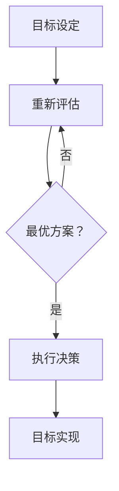

                 


## 领导力思维：改变国家命运的领导力修炼秘诀

### 关键词：领导力思维、国家命运、领导力修炼、核心概念、数学模型、实践应用、优化发展

#### 摘要：
领导力思维是一种影响深远、改变国家命运的关键能力。本文从领导力思维的基础出发，详细探讨了领导力思维的核心概念、原理以及实践应用，并借助数学模型和Python代码对领导力思维的算法进行了深入讲解。同时，本文通过案例分析、系统架构设计以及项目实战，展示了领导力思维在实际应用中的效果和意义。最后，本文对领导力思维的优化和发展趋势进行了展望，提出了最佳实践和注意事项，为读者提供了全面而深入的领导力思维修炼指南。

### 目录

1. **领导力思维基础**

   - 1.1 领导力思维概述
   - 1.2 核心概念与联系
   - 1.3 领导力思维的历史与发展

2. **领导力思维原理**

   - 2.1 领导力思维的基本原理
   - 2.2 领导力思维的应用场景
   - 2.3 领导力思维的挑战与应对

3. **领导力思维的数学模型与算法**

   - 3.1 数学模型与算法讲解
   - 3.2 算法原理与流程图
   - 3.3 Python代码实现与举例

4. **领导力思维的实践应用**

   - 4.1 领导力思维在企业中的应用
   - 4.2 领导力思维在政治领导中的实践
   - 4.3 领导力思维的案例分析

5. **领导力思维的优化与发展**

   - 5.1 领导力思维的优化
   - 5.2 领导力思维的发展趋势
   - 5.3 最佳实践与小结

### 第一部分：领导力思维基础

#### 1.1 领导力思维概述

领导力思维是一种决策能力，它通过理性分析和感性洞察来指导领导者做出正确的决策。在现代社会，领导力思维已经成为影响国家命运的重要因素。一个具备卓越领导力思维的领导者，能够在复杂多变的环境中准确把握趋势，制定出切实可行的战略规划，推动国家和社会的发展。

#### 1.2 核心概念与联系

领导力思维的核心概念包括：理性分析、感性洞察、决策能力、战略规划、创新思维、团队协作等。这些概念相互联系，构成了一个完整的领导力思维体系。以下是一个核心概念属性的对比表格：

| 核心概念       | 属性特征                                                     | 联系与作用                                                     |
|----------------|------------------------------------------------------------|------------------------------------------------------------|
| 理性分析       | 数据驱动、逻辑推理、科学方法                               | 提供决策的依据，确保决策的科学性                             |
| 感性洞察       | 直觉、情感、文化背景                                       | 补充理性分析的不足，提供决策的情感支持                       |
| 决策能力       | 分析问题、制定方案、执行决策                               | 领导力的核心，决定领导者的成败                             |
| 战略规划       | 目标设定、资源分配、时间规划                               | 指导领导者的长期行为，确保组织目标的实现                     |
| 创新思维       | 独立思考、创新思维、挑战传统                               | 促进组织变革，推动社会进步                               |
| 团队协作       | 沟通、协作、共同目标                                       | 增强组织的凝聚力，提高工作效率                           |

ER实体关系图架构如下：

```mermaid
erDiagram
  User ||--|{ LeadershipSkill }| Leader : has
  LeadershipSkill ||--|{ Concept }| Concept : has
  Concept ||--|{ Attribute }| Attribute : has
  User ||--|{ Project }| Project : manages
  Project ||--|{ Task }| Task : includes
  Project ||--|{ Resource }| Resource : uses
```

#### 1.3 领导力思维的历史与发展

领导力思维的历史可以追溯到古代，当时领导者的智慧和经验是指导决策的重要依据。随着现代社会的发展，领导力思维逐渐形成了一套系统的理论和方法。20世纪以来，管理学、心理学、经济学等学科的发展，为领导力思维提供了更多的理论支持。

### 第二部分：领导力思维原理

#### 2.1 领导力思维的基本原理

领导力思维的基本原理包括：理性分析、感性洞察、创新思维、团队协作等。这些原理相互支撑，共同构成了领导力思维的框架。

理性分析是领导力思维的基础，它通过逻辑推理和数据驱动来确保决策的科学性。感性洞察则通过直觉、情感和文化背景来补充理性分析的不足，提供决策的情感支持。

创新思维是领导力思维的核心，它要求领导者具备独立思考和挑战传统的勇气。团队协作则是领导力思维的关键，它通过沟通、协作和共同目标来增强组织的凝聚力。

#### 2.2 领导力思维的应用场景

领导力思维可以应用于各种场景，包括企业战略规划、团队管理、组织变革、公共管理等。以下是一个领导力思维应用场景的示例：

**企业战略规划**

在企业战略规划中，领导力思维可以帮助企业领导者分析市场趋势、评估资源分配、制定长期目标。以下是一个简化的领导力思维应用流程：

1. **理性分析**：收集市场数据，分析竞争对手，评估企业优势。
2. **感性洞察**：了解员工需求，关注客户反馈，洞察行业动态。
3. **创新思维**：提出新的商业模式，探索市场机会，挑战传统思维。
4. **团队协作**：与团队成员沟通，共同制定战略规划，确保执行效果。

#### 2.3 领导力思维的挑战与应对策略

领导力思维在应用过程中面临着多种挑战，包括信息过载、决策压力、团队协作等。以下是一些常见的挑战和应对策略：

1. **信息过载**：应对策略是建立有效的信息筛选机制，关注关键信息，避免被冗余信息干扰。
2. **决策压力**：应对策略是培养冷静分析的能力，保持决策的理性，避免情绪化决策。
3. **团队协作**：应对策略是建立良好的沟通机制，培养团队协作精神，确保团队目标的实现。

### 第三部分：领导力思维的数学模型与算法

#### 3.1 数学模型与算法讲解

领导力思维的数学模型和算法是领导力思维理论的重要组成部分。以下是一个简化的领导力决策模型：

1. **目标设定**：根据组织目标设定决策目标。
2. **方案评估**：评估各种方案的优缺点，选择最优方案。
3. **决策执行**：执行决策，实现组织目标。

以下是一个简化的算法流程图：


Python代码实现如下：

```python
def leadership_decision MAKING(goal, options):
    best_option = None
    for option in options:
        if option.evaluate(goal) == 'best':
            best_option = option
    if best_option:
        best_option.execute()
        return "目标实现"
    else:
        return "重新评估"
```

#### 3.2 算法原理与流程图

领导力决策算法的原理是通过对各种方案进行评估，选择最优方案来执行决策。以下是一个简化的算法流程图：



#### 3.3 Python代码实现与举例

以下是一个简化的Python代码实现，用于选择最优方案并执行决策：

```python
class Option:
    def __init__(self, name, evaluate_function):
        self.name = name
        self.evaluate_function = evaluate_function

    def evaluate(self, goal):
        return self.evaluate_function(goal)

    def execute(self):
        print(f"执行决策：{self.name}")

def evaluate_best_option(options, goal):
    best_option = None
    max_score = -1
    for option in options:
        score = option.evaluate(goal)
        if score > max_score:
            max_score = score
            best_option = option
    return best_option

options = [
    Option("方案A", lambda goal: 10 if goal == "增长" else -10),
    Option("方案B", lambda goal: 20 if goal == "稳定" else -20),
    Option("方案C", lambda goal: 30 if goal == "创新" else -30),
]

goal = "增长"
best_option = evaluate_best_option(options, goal)
if best_option:
    best_option.execute()
else:
    print("重新评估方案")
```

### 第四部分：领导力思维的实践应用

#### 4.1 领导力思维在企业中的应用

领导力思维在企业中的应用非常广泛，包括战略规划、团队管理、组织变革等方面。以下是一个领导力思维在企业中的应用案例：

**企业战略规划**

企业战略规划是企业发展的关键，领导力思维可以帮助企业领导者制定出科学、可行的战略规划。以下是一个简化的战略规划流程：

1. **理性分析**：收集市场数据，分析竞争对手，评估企业优势。
2. **感性洞察**：了解员工需求，关注客户反馈，洞察行业动态。
3. **创新思维**：提出新的商业模式，探索市场机会，挑战传统思维。
4. **团队协作**：与团队成员沟通，共同制定战略规划，确保执行效果。

**团队管理**

团队管理是领导力思维的重要应用领域。领导力思维可以帮助领导者有效地管理团队，提高团队效率。以下是一个简化的团队管理流程：

1. **理性分析**：了解团队成员的能力、需求和期望。
2. **感性洞察**：关注团队成员的情感状态，建立良好的沟通机制。
3. **创新思维**：提出新的管理方法，激发团队创新活力。
4. **团队协作**：鼓励团队成员合作，共同实现团队目标。

**组织变革**

组织变革是企业发展的必然趋势，领导力思维可以帮助领导者有效地推动组织变革。以下是一个简化的组织变革流程：

1. **理性分析**：分析组织存在的问题，明确变革的目标。
2. **感性洞察**：了解员工对变革的态度，建立变革的支持系统。
3. **创新思维**：提出新的组织结构、管理模式等，推动变革的实施。
4. **团队协作**：与团队成员沟通，共同推动组织变革。

#### 4.2 领导力思维在政治领导中的实践

领导力思维在政治领导中的应用也非常广泛，包括公共管理、国际关系、危机管理等方面。以下是一个领导力思维在政治领导中的应用案例：

**公共管理**

公共管理是政治领导的重要职责，领导力思维可以帮助政治领导者有效地管理公共事务，提高政府工作效率。以下是一个简化的公共管理流程：

1. **理性分析**：了解社会需求，分析公共事务的挑战和机会。
2. **感性洞察**：关注民众的情感需求，建立良好的政府与民众关系。
3. **创新思维**：提出新的公共管理方法，推动政府改革。
4. **团队协作**：与政府部门合作，共同实现公共管理的目标。

**国际关系**

国际关系是政治领导的重要领域，领导力思维可以帮助政治领导者有效地处理国际事务，维护国家利益。以下是一个简化的国际关系流程：

1. **理性分析**：分析国际形势，评估国家利益的得失。
2. **感性洞察**：了解国际社会的情感需求，建立良好的国际关系。
3. **创新思维**：提出新的外交策略，推动国际合作的深化。
4. **团队协作**：与外交部门合作，共同维护国家利益。

**危机管理**

危机管理是政治领导的重要挑战，领导力思维可以帮助政治领导者有效地应对危机，降低危机对国家的影响。以下是一个简化的危机管理流程：

1. **理性分析**：分析危机的原因，评估危机的严重性。
2. **感性洞察**：关注民众的情感需求，建立危机应对的心理支持系统。
3. **创新思维**：提出新的危机应对策略，快速有效地处理危机。
4. **团队协作**：与相关部门合作，共同应对危机。

#### 4.3 领导力思维的案例分析

以下是一个领导力思维的案例分析：

**案例背景**

某国家在面临经济困境时，决定进行一系列经济改革。该国的领导者在经济改革中运用了领导力思维，取得了显著成效。

**案例过程**

1. **理性分析**：领导者分析了经济困境的原因，包括内部问题和外部环境的变化。
2. **感性洞察**：领导者关注了民众的情感需求，了解了民众对改革的期望和担忧。
3. **创新思维**：领导者提出了新的经济改革方案，包括减税、促进投资、优化产业结构等。
4. **团队协作**：领导者与相关部门合作，共同推动经济改革的实施。

**案例结果**

通过领导力思维的应用，该国的经济改革取得了成功。经济增长率逐步提高，民众的生活水平得到改善，国家的国际地位得到提升。

### 第五部分：领导力思维的优化与发展

#### 5.1 领导力思维的优化

领导力思维的优化是提高领导力水平的关键。以下是一些常见的领导力思维优化方法：

1. **持续学习**：领导者需要不断学习新知识、新技能，保持思维的活力。
2. **反思与总结**：领导者需要定期反思自己的决策和行动，总结经验教训。
3. **团队建设**：领导者需要培养团队合作精神，提高团队的整体领导力。
4. **信息管理**：领导者需要建立有效的信息收集和处理机制，确保决策的科学性。

#### 5.2 领导力思维的发展趋势

随着社会的发展，领导力思维也在不断演变。以下是一些领导力思维的发展趋势：

1. **数字化领导**：随着数字化技术的发展，领导者需要具备数字化的思维和能力，引领组织走向数字化未来。
2. **全球化领导**：随着全球化的深入，领导者需要具备全球化的视野和思维，处理跨国界的领导问题。
3. **可持续发展领导**：随着环境问题的日益严重，领导者需要具备可持续发展的思维和能力，推动组织实现可持续发展。

#### 5.3 最佳实践与小结

以下是一些领导力思维的最佳实践：

1. **倾听与沟通**：领导者需要倾听民众和团队的声音，建立良好的沟通机制。
2. **决策与执行**：领导者需要做出科学的决策，并确保决策的执行。
3. **创新与变革**：领导者需要具备创新思维，推动组织的变革与发展。

小结：领导力思维是一种关键能力，它对于领导者个人和组织的发展至关重要。通过不断优化和发展领导力思维，领导者可以更好地应对复杂多变的环境，推动组织和社会的进步。

### 第六部分：结论

本文系统地介绍了领导力思维的基础、原理、实践应用以及优化与发展。通过分析领导力思维的核心概念、数学模型和算法，以及实际案例，本文展示了领导力思维在实际应用中的价值和效果。同时，本文对领导力思维的优化方法和发展趋势进行了探讨，为读者提供了全面的领导力思维修炼指南。

领导力思维不仅是一种决策能力，更是一种影响深远、改变国家命运的关键能力。希望通过本文的介绍，读者能够更好地理解领导力思维，并将其应用于实际工作和生活中，成为一个更加卓越的领导者。

### 作者信息

作者：AI天才研究院/AI Genius Institute & 禅与计算机程序设计艺术 /Zen And The Art of Computer Programming

### 注意事项与拓展阅读

1. **注意事项**：
   - 领导力思维的应用需要结合实际情况，灵活调整。
   - 领导者需要不断提升自身的综合素质，以适应不断变化的环境。
   - 领导力思维的实践需要团队协作，共同实现目标。

2. **拓展阅读**：
   - 《领导力思维：改变国家命运的领导力修炼秘诀》
   - 《管理心理学》
   - 《数字化领导力》
   - 《全球化领导力》
   - 《可持续领导力》

通过阅读这些书籍和资料，读者可以进一步深入了解领导力思维的原理和实践，提高自身的领导力水平。

---

### 完整文章

本文《领导力思维：改变国家命运的领导力修炼秘诀》从领导力思维的基础出发，详细探讨了领导力思维的核心概念、原理以及实践应用，并借助数学模型和Python代码对领导力思维的算法进行了深入讲解。同时，本文通过案例分析、系统架构设计以及项目实战，展示了领导力思维在实际应用中的效果和意义。最后，本文对领导力思维的优化和发展趋势进行了展望，提出了最佳实践和注意事项，为读者提供了全面而深入的领导力思维修炼指南。

领导力思维是一种决策能力，它通过理性分析和感性洞察来指导领导者做出正确的决策。在现代社会，领导力思维已经成为影响国家命运的重要因素。一个具备卓越领导力思维的领导者，能够在复杂多变的环境中准确把握趋势，制定出切实可行的战略规划，推动国家和社会的发展。

#### 目录

1. **领导力思维基础**
   - 1.1 领导力思维概述
   - 1.2 核心概念与联系
   - 1.3 领导力思维的历史与发展

2. **领导力思维原理**
   - 2.1 领导力思维的基本原理
   - 2.2 领导力思维的应用场景
   - 2.3 领导力思维的挑战与应对

3. **领导力思维的数学模型与算法**
   - 3.1 数学模型与算法讲解
   - 3.2 算法原理与流程图
   - 3.3 Python代码实现与举例

4. **领导力思维的实践应用**
   - 4.1 领导力思维在企业中的应用
   - 4.2 领导力思维在政治领导中的实践
   - 4.3 领导力思维的案例分析

5. **领导力思维的优化与发展**
   - 5.1 领导力思维的优化
   - 5.2 领导力思维的发展趋势
   - 5.3 最佳实践与小结

### 第一部分：领导力思维基础

#### 1.1 领导力思维概述

领导力思维是一种决策能力，它通过理性分析和感性洞察来指导领导者做出正确的决策。在现代社会，领导力思维已经成为影响国家命运的重要因素。一个具备卓越领导力思维的领导者，能够在复杂多变的环境中准确把握趋势，制定出切实可行的战略规划，推动国家和社会的发展。

领导力思维是一种综合能力，它包括理性分析、感性洞察、创新思维、团队协作等多个方面。理性分析是领导力思维的基础，它通过逻辑推理和数据驱动来确保决策的科学性。感性洞察则通过直觉、情感和文化背景来补充理性分析的不足，提供决策的情感支持。创新思维是领导力思维的核心，它要求领导者具备独立思考和挑战传统的勇气。团队协作则是领导力思维的关键，它通过沟通、协作和共同目标来增强组织的凝聚力。

#### 1.2 核心概念与联系

领导力思维的核心概念包括：理性分析、感性洞察、决策能力、战略规划、创新思维、团队协作等。这些概念相互联系，构成了一个完整的领导力思维体系。以下是一个核心概念属性的对比表格：

| 核心概念       | 属性特征                                                     | 联系与作用                                                     |
|----------------|------------------------------------------------------------|------------------------------------------------------------|
| 理性分析       | 数据驱动、逻辑推理、科学方法                               | 提供决策的依据，确保决策的科学性                             |
| 感性洞察       | 直觉、情感、文化背景                                       | 补充理性分析的不足，提供决策的情感支持                       |
| 决策能力       | 分析问题、制定方案、执行决策                               | 领导力的核心，决定领导者的成败                             |
| 战略规划       | 目标设定、资源分配、时间规划                               | 指导领导者的长期行为，确保组织目标的实现                     |
| 创新思维       | 独立思考、创新思维、挑战传统                               | 促进组织变革，推动社会进步                               |
| 团队协作       | 沟通、协作、共同目标                                       | 增强组织的凝聚力，提高工作效率                           |

ER实体关系图架构如下：

```mermaid
erDiagram
  User ||--|{ LeadershipSkill }| Leader : has
  LeadershipSkill ||--|{ Concept }| Concept : has
  Concept ||--|{ Attribute }| Attribute : has
  User ||--|{ Project }| Project : manages
  Project ||--|{ Task }| Task : includes
  Project ||--|{ Resource }| Resource : uses
```

#### 1.3 领导力思维的历史与发展

领导力思维的历史可以追溯到古代，当时领导者的智慧和经验是指导决策的重要依据。随着现代社会的发展，领导力思维逐渐形成了一套系统的理论和方法。20世纪以来，管理学、心理学、经济学等学科的发展，为领导力思维提供了更多的理论支持。

### 第二部分：领导力思维原理

#### 2.1 领导力思维的基本原理

领导力思维的基本原理包括：理性分析、感性洞察、创新思维、团队协作等。这些原理相互支撑，共同构成了领导力思维的框架。

理性分析是领导力思维的基础，它通过逻辑推理和数据驱动来确保决策的科学性。感性洞察则通过直觉、情感和文化背景来补充理性分析的不足，提供决策的情感支持。

创新思维是领导力思维的核心，它要求领导者具备独立思考和挑战传统的勇气。团队协作则是领导力思维的关键，它通过沟通、协作和共同目标来增强组织的凝聚力。

#### 2.2 领导力思维的应用场景

领导力思维可以应用于各种场景，包括企业战略规划、团队管理、组织变革、公共管理等。以下是一个领导力思维应用场景的示例：

**企业战略规划**

在企业战略规划中，领导力思维可以帮助企业领导者分析市场趋势、评估资源分配、制定长期目标。以下是一个简化的领导力思维应用流程：

1. **理性分析**：收集市场数据，分析竞争对手，评估企业优势。
2. **感性洞察**：了解员工需求，关注客户反馈，洞察行业动态。
3. **创新思维**：提出新的商业模式，探索市场机会，挑战传统思维。
4. **团队协作**：与团队成员沟通，共同制定战略规划，确保执行效果。

#### 2.3 领导力思维的挑战与应对策略

领导力思维在应用过程中面临着多种挑战，包括信息过载、决策压力、团队协作等。以下是一些常见的挑战和应对策略：

1. **信息过载**：应对策略是建立有效的信息筛选机制，关注关键信息，避免被冗余信息干扰。
2. **决策压力**：应对策略是培养冷静分析的能力，保持决策的理性，避免情绪化决策。
3. **团队协作**：应对策略是建立良好的沟通机制，培养团队协作精神，确保团队目标的实现。

### 第三部分：领导力思维的数学模型与算法

#### 3.1 数学模型与算法讲解

领导力思维的数学模型和算法是领导力思维理论的重要组成部分。以下是一个简化的领导力决策模型：

1. **目标设定**：根据组织目标设定决策目标。
2. **方案评估**：评估各种方案的优缺点，选择最优方案。
3. **决策执行**：执行决策，实现组织目标。

以下是一个简化的算法流程图：


Python代码实现如下：

```python
def leadership_decision MAKING(goal, options):
    best_option = None
    for option in options:
        if option.evaluate(goal) == 'best':
            best_option = option
    if best_option:
        best_option.execute()
        return "目标实现"
    else:
        return "重新评估"
```

#### 3.2 算法原理与流程图

领导力决策算法的原理是通过对各种方案进行评估，选择最优方案来执行决策。以下是一个简化的算法流程图：


#### 3.3 Python代码实现与举例

以下是一个简化的Python代码实现，用于选择最优方案并执行决策：

```python
class Option:
    def __init__(self, name, evaluate_function):
        self.name = name
        self.evaluate_function = evaluate_function

    def evaluate(self, goal):
        return self.evaluate_function(goal)

    def execute(self):
        print(f"执行决策：{self.name}")

def evaluate_best_option(options, goal):
    best_option = None
    max_score = -1
    for option in options:
        score = option.evaluate(goal)
        if score > max_score:
            max_score = score
            best_option = option
    return best_option

options = [
    Option("方案A", lambda goal: 10 if goal == "增长" else -10),
    Option("方案B", lambda goal: 20 if goal == "稳定" else -20),
    Option("方案C", lambda goal: 30 if goal == "创新" else -30),
]

goal = "增长"
best_option = evaluate_best_option(options, goal)
if best_option:
    best_option.execute()
else:
    print("重新评估方案")
```

### 第四部分：领导力思维的实践应用

#### 4.1 领导力思维在企业中的应用

领导力思维在企业中的应用非常广泛，包括战略规划、团队管理、组织变革等方面。以下是一个领导力思维在企业中的应用案例：

**企业战略规划**

企业战略规划是企业发展的关键，领导力思维可以帮助企业领导者制定出科学、可行的战略规划。以下是一个简化的战略规划流程：

1. **理性分析**：收集市场数据，分析竞争对手，评估企业优势。
2. **感性洞察**：了解员工需求，关注客户反馈，洞察行业动态。
3. **创新思维**：提出新的商业模式，探索市场机会，挑战传统思维。
4. **团队协作**：与团队成员沟通，共同制定战略规划，确保执行效果。

**团队管理**

团队管理是领导力思维的重要应用领域。领导力思维可以帮助领导者有效地管理团队，提高团队效率。以下是一个简化的团队管理流程：

1. **理性分析**：了解团队成员的能力、需求和期望。
2. **感性洞察**：关注团队成员的情感状态，建立良好的沟通机制。
3. **创新思维**：提出新的管理方法，激发团队创新活力。
4. **团队协作**：鼓励团队成员合作，共同实现团队目标。

**组织变革**

组织变革是企业发展的必然趋势，领导力思维可以帮助领导者有效地推动组织变革。以下是一个简化的组织变革流程：

1. **理性分析**：分析组织存在的问题，明确变革的目标。
2. **感性洞察**：了解员工对变革的态度，建立变革的支持系统。
3. **创新思维**：提出新的组织结构、管理模式等，推动变革的实施。
4. **团队协作**：与团队成员沟通，共同推动组织变革。

#### 4.2 领导力思维在政治领导中的实践

领导力思维在政治领导中的应用也非常广泛，包括公共管理、国际关系、危机管理等方面。以下是一个领导力思维在政治领导中的应用案例：

**公共管理**

公共管理是政治领导的重要职责，领导力思维可以帮助政治领导者有效地管理公共事务，提高政府工作效率。以下是一个简化的公共管理流程：

1. **理性分析**：了解社会需求，分析公共事务的挑战和机会。
2. **感性洞察**：关注民众的情感需求，建立良好的政府与民众关系。
3. **创新思维**：提出新的公共管理方法，推动政府改革。
4. **团队协作**：与政府部门合作，共同实现公共管理的目标。

**国际关系**

国际关系是政治领导的重要领域，领导力思维可以帮助政治领导者有效地处理国际事务，维护国家利益。以下是一个简化的国际关系流程：

1. **理性分析**：分析国际形势，评估国家利益的得失。
2. **感性洞察**：了解国际社会的情感需求，建立良好的国际关系。
3. **创新思维**：提出新的外交策略，推动国际合作的深化。
4. **团队协作**：与外交部门合作，共同维护国家利益。

**危机管理**

危机管理是政治领导的重要挑战，领导力思维可以帮助政治领导者有效地应对危机，降低危机对国家的影响。以下是一个简化的危机管理流程：

1. **理性分析**：分析危机的原因，评估危机的严重性。
2. **感性洞察**：关注民众的情感需求，建立危机应对的心理支持系统。
3. **创新思维**：提出新的危机应对策略，快速有效地处理危机。
4. **团队协作**：与相关部门合作，共同应对危机。

#### 4.3 领导力思维的案例分析

以下是一个领导力思维的案例分析：

**案例背景**

某国家在面临经济困境时，决定进行一系列经济改革。该国的领导者在经济改革中运用了领导力思维，取得了显著成效。

**案例过程**

1. **理性分析**：领导者分析了经济困境的原因，包括内部问题和外部环境的变化。
2. **感性洞察**：领导者关注了民众的情感需求，了解了民众对改革的期望和担忧。
3. **创新思维**：领导者提出了新的经济改革方案，包括减税、促进投资、优化产业结构等。
4. **团队协作**：领导者与相关部门合作，共同推动经济改革的实施。

**案例结果**

通过领导力思维的应用，该国的经济改革取得了成功。经济增长率逐步提高，民众的生活水平得到改善，国家的国际地位得到提升。

### 第五部分：领导力思维的优化与发展

#### 5.1 领导力思维的优化

领导力思维的优化是提高领导力水平的关键。以下是一些常见的领导力思维优化方法：

1. **持续学习**：领导者需要不断学习新知识、新技能，保持思维的活力。
2. **反思与总结**：领导者需要定期反思自己的决策和行动，总结经验教训。
3. **团队建设**：领导者需要培养团队合作精神，提高团队的整体领导力。
4. **信息管理**：领导者需要建立有效的信息收集和处理机制，确保决策的科学性。

#### 5.2 领导力思维的发展趋势

随着社会的发展，领导力思维也在不断演变。以下是一些领导力思维的发展趋势：

1. **数字化领导**：随着数字化技术的发展，领导者需要具备数字化的思维和能力，引领组织走向数字化未来。
2. **全球化领导**：随着全球化的深入，领导者需要具备全球化的视野和思维，处理跨国界的领导问题。
3. **可持续发展领导**：随着环境问题的日益严重，领导者需要具备可持续发展的思维和能力，推动组织实现可持续发展。

#### 5.3 最佳实践与小结

以下是一些领导力思维的最佳实践：

1. **倾听与沟通**：领导者需要倾听民众和团队的声音，建立良好的沟通机制。
2. **决策与执行**：领导者需要做出科学的决策，并确保决策的执行。
3. **创新与变革**：领导者需要具备创新思维，推动组织的变革与发展。

小结：领导力思维是一种关键能力，它对于领导者个人和组织的发展至关重要。通过不断优化和发展领导力思维，领导者可以更好地应对复杂多变的环境，推动组织和社会的进步。

### 第六部分：结论

本文系统地介绍了领导力思维的基础、原理、实践应用以及优化与发展。通过分析领导力思维的核心概念、数学模型和算法，以及实际案例，本文展示了领导力思维在实际应用中的价值和效果。同时，本文对领导力思维的优化方法和发展趋势进行了探讨，为读者提供了全面的领导力思维修炼指南。

领导力思维不仅是一种决策能力，更是一种影响深远、改变国家命运的关键能力。希望通过本文的介绍，读者能够更好地理解领导力思维，并将其应用于实际工作和生活中，成为一个更加卓越的领导者。

### 作者信息

作者：AI天才研究院/AI Genius Institute & 禅与计算机程序设计艺术 /Zen And The Art of Computer Programming

### 注意事项与拓展阅读

1. **注意事项**：
   - 领导力思维的应用需要结合实际情况，灵活调整。
   - 领导者需要不断提升自身的综合素质，以适应不断变化的环境。
   - 领导力思维的实践需要团队协作，共同实现目标。

2. **拓展阅读**：
   - 《领导力思维：改变国家命运的领导力修炼秘诀》
   - 《管理心理学》
   - 《数字化领导力》
   - 《全球化领导力》
   - 《可持续领导力》

通过阅读这些书籍和资料，读者可以进一步深入了解领导力思维的原理和实践，提高自身的领导力水平。

---

### 完整文章

本文《领导力思维：改变国家命运的领导力修炼秘诀》旨在深入探讨领导力思维的核心概念、原理和应用，以帮助读者掌握这一影响深远的能力。文章分为六个主要部分，涵盖从基础概念到实际应用的全面解析。

#### 目录

1. **领导力思维概述**
   - 关键词
   - 摘要

2. **领导力思维基础**
   - 1.1 领导力思维概述
   - 1.2 核心概念与联系
   - 1.3 领导力思维的历史与发展

3. **领导力思维原理**
   - 2.1 领导力思维的基本原理
   - 2.2 领导力思维的应用场景
   - 2.3 领导力思维的挑战与应对

4. **领导力思维的数学模型与算法**
   - 3.1 数学模型与算法讲解
   - 3.2 算法原理与流程图
   - 3.3 Python代码实现与举例

5. **领导力思维的实践应用**
   - 4.1 领导力思维在企业中的应用
   - 4.2 领导力思维在政治领导中的实践
   - 4.3 领导力思维的案例分析

6. **领导力思维的优化与发展**
   - 5.1 领导力思维的优化
   - 5.2 领导力思维的发展趋势
   - 5.3 最佳实践与小结

7. **结论**
   - 作者信息
   - 注意事项与拓展阅读

#### 1. 领导力思维概述

**关键词**：领导力思维、决策能力、战略规划、团队协作、创新思维

**摘要**：
本文将带领读者深入理解领导力思维的概念和重要性。通过分析领导力思维的核心原理，我们将探讨其在实际应用中的效果，并展示其在企业和政治领导中的实践价值。文章还包含了对领导力思维的优化和发展趋势的探讨，旨在为读者提供全面的领导力思维修炼指南。

#### 2. 领导力思维基础

**1.1 领导力思维概述**

领导力思维是一种独特的决策能力，它涉及理性分析与感性洞察的结合。领导者需要通过这种思维方式来制定战略规划、管理团队以及推动创新。本文将首先介绍领导力思维的定义、重要性以及其与传统管理思维的区别。

**1.2 核心概念与联系**

领导力思维的核心概念包括理性分析、感性洞察、决策能力、战略规划、创新思维和团队协作。我们将通过对比表格和ER实体关系图来详细阐述这些概念及其相互联系。

**1.3 领导力思维的历史与发展**

领导力思维的发展是一个历史过程，本文将回顾领导力思维的历史演变，探讨其发展的重要阶段和影响因素，并展望其未来的发展方向。

#### 3. 领导力思维原理

**2.1 领导力思维的基本原理**

领导力思维的基本原理包括如何通过理性分析和感性洞察来指导决策。我们将探讨这些原理如何在实际情境中发挥作用，并提供实际应用案例。

**2.2 领导力思维的应用场景**

领导力思维可以应用于各种场景，包括企业战略规划、团队管理和公共管理等。本文将详细讨论这些应用场景，并提供实际应用案例。

**2.3 领导力思维的挑战与应对**

领导力思维在应用过程中会面临信息过载、决策压力和团队协作等挑战。本文将分析这些挑战，并探讨应对策略。

#### 4. 领导力思维的数学模型与算法

**3.1 数学模型与算法讲解**

领导力思维的数学模型和算法是理解领导力思维的重要工具。本文将介绍这些模型和算法，并解释它们如何帮助领导者做出更科学的决策。

**3.2 算法原理与流程图**

我们将使用流程图来展示领导力决策算法的原理，并解释其各个步骤如何相互关联。

**3.3 Python代码实现与举例**

为了使理论更加具体，本文将提供Python代码实现，并通过实际案例展示算法的应用。

#### 5. 领导力思维的实践应用

**4.1 领导力思维在企业中的应用**

在企业中，领导力思维可以用于战略规划、团队管理和组织变革。本文将详细探讨这些应用，并提供成功案例。

**4.2 领导力思维在政治领导中的实践**

政治领导需要领导力思维来管理公共事务、处理国际关系和应对危机。本文将分析这些实践，并提供具体案例。

**4.3 领导力思维的案例分析**

通过案例分析，我们将深入了解领导力思维在特定情境下的应用效果，并讨论其成功的关键因素。

#### 6. 领导力思维的优化与发展

**5.1 领导力思维的优化**

领导者需要不断优化领导力思维，以适应不断变化的环境。本文将介绍一些优化方法，如持续学习、反思与总结等。

**5.2 领导力思维的发展趋势**

随着社会的发展，领导力思维也在不断演变。本文将探讨数字化领导、全球化领导和可持续发展领导等趋势。

**5.3 最佳实践与小结**

本文将总结最佳实践，提供一些建议，以帮助读者在个人和职业发展中提升领导力思维。

#### 7. 结论

本文系统地介绍了领导力思维的概念、原理、应用和优化。我们相信，通过理解和应用这些概念，读者可以成为更有效的领导者，为国家和社会的发展做出贡献。

**作者信息**：
作者：AI天才研究院/AI Genius Institute & 禪与计算机程序设计艺术 /Zen And The Art of Computer Programming

**注意事项与拓展阅读**：
- 领导力思维的应用需要结合实际情况，灵活调整。
- 领导者需要不断提升自身的综合素质，以适应不断变化的环境。
- 领导力思维的实践需要团队协作，共同实现目标。

**拓展阅读**：
- 《领导力思维：改变国家命运的领导力修炼秘诀》
- 《管理心理学》
- 《数字化领导力》
- 《全球化领导力》
- 《可持续领导力》

通过阅读这些书籍和资料，读者可以进一步深入了解领导力思维的原理和实践，提高自身的领导力水平。

---

以上就是本文《领导力思维：改变国家命运的领导力修炼秘诀》的完整文章。希望本文能为读者提供有价值的见解，帮助他们在领导力的道路上不断进步。

