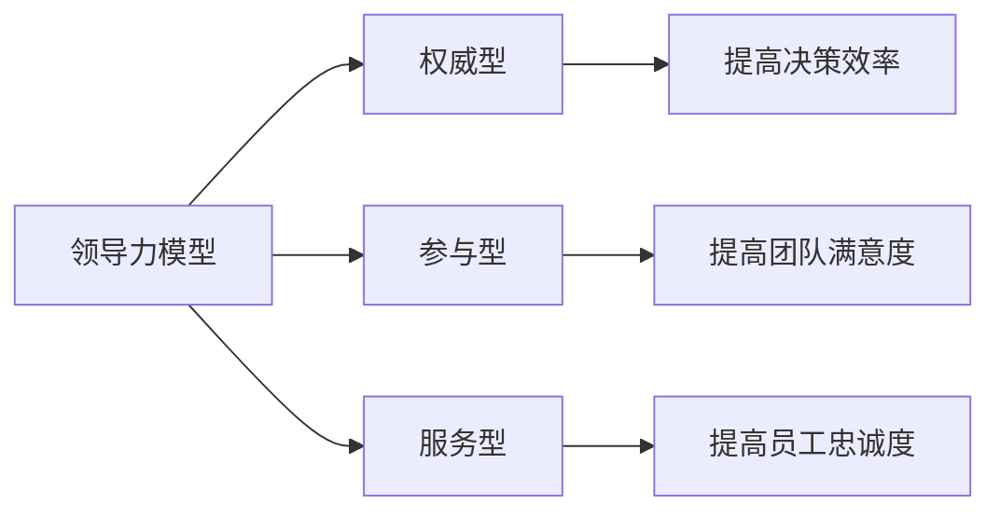
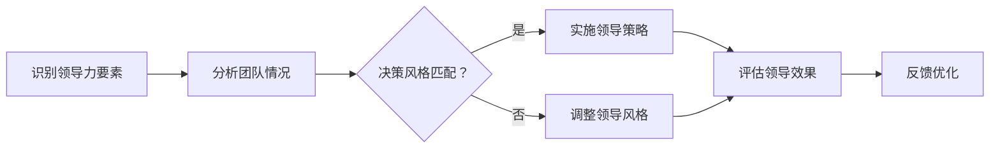
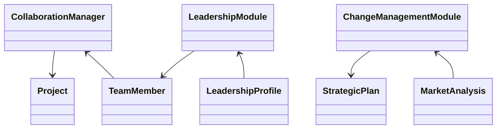
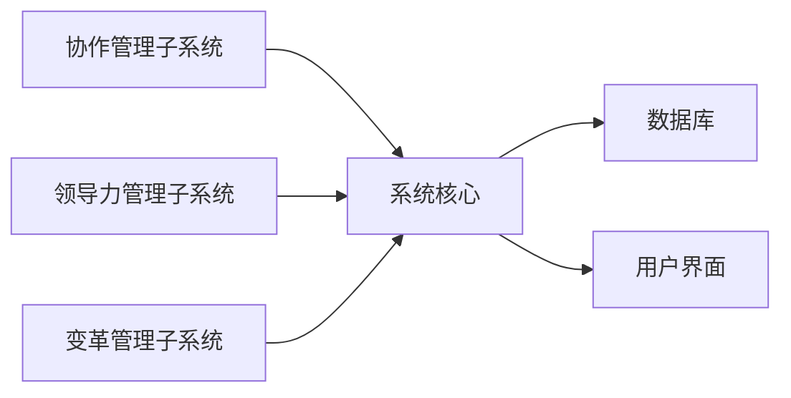
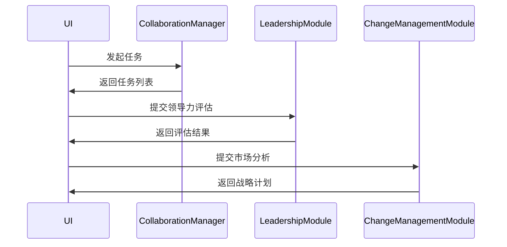
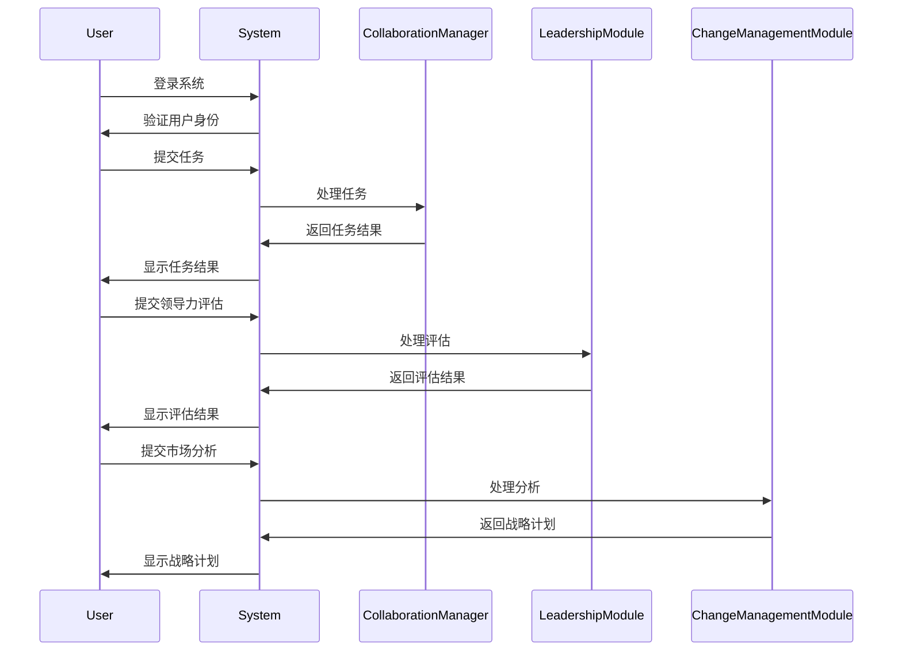
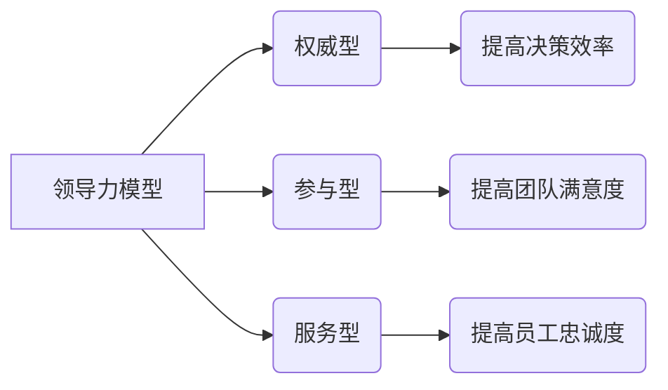
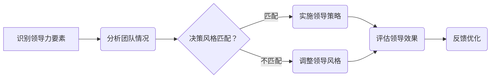

                 


## 第1章：领导力的本质与重要性

### 1.1 领导力：核心概念解析

#### 1.1.1 领导力的定义

领导力是指一种影响力，它能够让团队中的成员朝着一个共同的目标努力，并在实现这个目标的过程中展现出高效协作和积极进取的精神。领导力不仅仅是管理能力，它更多地涉及到个人魅力、沟通技巧、决策能力、团队激励和变革管理等方面。

在技术团队中，领导力至关重要。优秀的领导者能够激发团队成员的潜力，提高团队的凝聚力，推动技术创新和业务发展。然而，领导力并不是一成不变的，它需要不断地学习和实践。

#### 1.1.2 领导力与管理的区别

领导力与管理的区别主要体现在以下几个方面：

- **目的不同**：管理主要关注效率和规范，而领导力更注重目标和方向的引导。
- **方式不同**：管理依赖于规章制度和流程，而领导力则更多地依赖于个人魅力和影响力。
- **效果不同**：管理能够确保团队按照预定计划执行任务，而领导力能够激发团队的潜能，实现更高的绩效。

在实际应用中，领导力和管理往往是相辅相成的。一个优秀的领导者不仅能够管理好团队，还能够通过领导力推动团队实现更高的目标。

### 1.2 领导力的重要性

#### 1.2.1 个人成长

领导力对个人的成长有着重要的影响。通过提升领导力，个人能够更好地理解自己的优势和不足，提高自我认知和自我管理能力。同时，领导力也能够帮助个人建立良好的人际关系，提高沟通和协作能力。

#### 1.2.2 团队效能

领导力对团队效能的提升至关重要。优秀的领导者能够激发团队成员的积极性，提高团队的凝聚力，推动团队高效协作。在技术团队中，领导力能够促进技术创新和业务发展，提升团队的整体竞争力。

#### 1.2.3 组织成功

领导力对组织成功有着重要的影响。一个优秀的领导者能够带领组织实现战略目标，推动组织持续发展。同时，领导力还能够提升组织的创新能力和市场竞争力，为组织的长期成功奠定基础。

### 1.3 领导力的边界与外延

#### 1.3.1 持续改进

领导力不是一成不变的，它需要不断地学习和实践。持续改进是领导力发展的重要方向。通过不断学习新的知识和技能，领导者能够不断提升自己的领导力，适应快速变化的环境。

#### 1.3.2 变革管理

在快速变化的市场环境中，领导力需要具备变革管理的能力。优秀的领导者能够带领组织应对变革，推动组织转型。通过有效的变革管理，领导者能够确保组织在变革过程中保持稳定和持续发展。

#### 1.3.3 领导力与伦理

领导力与伦理密切相关。一个优秀的领导者不仅要有高超的领导能力，还要具备高尚的道德品质。领导力与伦理的结合能够确保领导者做出正确的决策，为组织创造更大的价值。

### 1.4 领导力的概念结构与核心要素组成

#### 1.4.1 领导力模型

领导力模型是描述领导力要素和特征的理论框架。常见的领导力模型包括领导风格模型、领导行为模型和领导影响力模型。

- **领导风格模型**：领导风格模型主要关注领导者的行为和方式。常见的领导风格包括权威型、参与型和服务型。
- **领导行为模型**：领导行为模型主要关注领导者的行为和决策。领导者的行为可以分为任务导向型和关系导向型。
- **领导影响力模型**：领导影响力模型主要关注领导者如何影响团队成员。领导者的影响力可以分为权力性影响和非权力性影响。

#### 1.4.2 领导力特征分析

领导力特征是领导者具备的关键能力。常见的领导力特征包括：

- **决策能力**：领导者需要具备良好的决策能力，能够在复杂和不确定的环境中做出明智的决策。
- **沟通能力**：领导者需要具备良好的沟通能力，能够有效地与团队成员沟通，传达目标和期望。
- **激励能力**：领导者需要具备激励能力，能够激发团队成员的积极性，提高团队凝聚力。
- **变革管理能力**：领导者需要具备变革管理能力，能够推动组织实现变革，保持组织的活力。

### 1.5 本章小结

本章主要介绍了领导力的本质与重要性，包括领导力的定义、领导力与管理的区别、领导力的重要性、领导力的边界与外延以及领导力的概念结构与核心要素组成。通过本章的学习，读者可以初步了解领导力的基本概念和重要性，为后续章节的深入探讨打下基础。

---

在接下来的章节中，我们将进一步探讨领导力的核心概念与联系，分析不同的领导力模型和算法原理，深入讲解领导力的数学模型与公式，以及系统分析与架构设计的方法。通过这些章节的学习，读者将能够更深入地理解领导力的本质，掌握提升领导力的有效方法。让我们继续深入探索领导力这个神奇而又重要的领域吧！<|less>

# 目录大纲

## 第2章：领导力的核心概念与联系

### 2.1 领导力原理

#### 2.1.1 领导行为与领导风格

领导行为是指领导者在实际工作中所表现出来的行为模式。领导风格则是领导者处理事务、与团队成员互动的方式。不同的领导行为和风格会对团队产生不同的影响。

常见的领导风格包括：

- **权威型**：领导者做出决策，并要求团队成员遵守。
- **参与型**：领导者鼓励团队成员参与决策过程，共同制定决策。
- **服务型**：领导者以服务团队成员为中心，关注团队成员的需求和成长。

#### 2.1.2 领导影响力分析

领导影响力是领导者通过个人魅力、专业能力和沟通技巧等手段影响团队成员的能力。领导影响力可以分为权力性影响和非权力性影响。

- **权力性影响**：领导者通过职位、权力和奖励等手段影响团队成员。
- **非权力性影响**：领导者通过个人魅力、专业能力和沟通技巧等手段影响团队成员。

### 2.2 概念属性特征对比表格

以下是不同领导风格的概念属性特征对比表格：

| 领导风格 | 描述 | 对团队的影响 |
|----------|-----|------------|
| 权威型 | 强调权威和决策力 | 提高决策效率 |
| 参与型 | 强调团队参与和民主决策 | 提高团队满意度 |
| 服务型 | 强调服务团队和支持员工 | 提高员工忠诚度 |

### 2.3 ER实体关系图架构

以下是领导力模型中不同领导风格的ER实体关系图：



### 2.4 领导力模型分析

领导力模型是描述领导者特征和行为的理论框架。常见的领导力模型包括：

- **费德勒模型**：基于情境的领导力模型，认为领导风格与情境因素相互作用。
- **赫塞-布兰查德模型**：基于领导风格和情境因素的领导力模型，提出四种领导风格。
- **路径-目标模型**：基于领导行为和下属需求的领导力模型，认为领导者应该根据下属需求调整领导行为。

### 2.5 本章小结

本章介绍了领导力的核心概念与联系，包括领导行为与领导风格、领导影响力分析、概念属性特征对比表格和ER实体关系图架构。通过这些内容，读者可以更深入地理解领导力的本质和不同领导风格的影响。在下一章中，我们将进一步探讨领导力算法原理，分析如何通过算法实现领导力的优化和管理。让我们继续深入探讨领导力这个重要的领域吧！<|less>

# 目录大纲

## 第3章：领导力算法原理

### 3.1 算法概述

领导力算法是一种用于分析和优化领导行为的数学模型。它可以帮助领导者更好地理解团队情况，制定合适的领导策略，提高领导效果。

#### 3.1.1 领导力算法的类型

领导力算法可以分为以下几种类型：

- **领导风格匹配算法**：根据团队情况和领导者风格，判断是否匹配，并给出相应的优化建议。
- **领导效能评估算法**：通过分析领导行为和团队绩效，评估领导效能，并提供改进措施。
- **领导影响力分析算法**：分析领导者的行为和沟通方式，评估其对团队的影响，提供改进建议。

#### 3.1.2 领导力算法的作用

领导力算法在领导力提升和团队管理中具有重要作用：

- **优化领导策略**：通过算法分析，领导者可以更好地了解团队情况，制定合适的领导策略，提高领导效果。
- **提升团队绩效**：通过优化领导策略，提升团队凝聚力和工作效率，提高团队绩效。
- **增强领导效能**：通过算法评估，领导者可以了解自己的领导效能，找出不足，进行改进。

### 3.2 算法mermaid流程图

以下是领导力算法的mermaid流程图：



### 3.3 算法原理讲解

领导力算法的原理可以分为以下几个步骤：

1. **识别领导力要素**：收集领导者的行为数据、团队情况和绩效数据。
2. **分析团队情况**：通过数据分析和模型计算，分析团队的特点和需求。
3. **决策风格匹配**：根据团队情况和领导者风格，判断是否匹配。
4. **实施领导策略**：如果匹配，则实施现有的领导策略；如果不匹配，则调整领导风格。
5. **评估领导效果**：通过绩效数据评估领导效果，判断领导策略是否有效。
6. **反馈优化**：根据评估结果，对领导策略进行调整和优化。

### 3.4 Python源代码解析

以下是领导力算法的Python源代码：

```python
# Python源代码
def leadership_algorithm(team, style):
    match_style = analyze_matching(team, style)
    if match_style:
        implement_strategy(team, style)
    else:
        adjust_style(team, style)
    evaluate_effectiveness(team)

# 分析匹配度
def analyze_matching(team, style):
    # 这里进行匹配度分析，返回True或False
    match_score = calculate_match_score(team, style)
    return match_score > threshold

# 实施策略
def implement_strategy(team, style):
    # 根据领导风格实施策略
    pass

# 调整风格
def adjust_style(team, style):
    # 调整领导风格
    pass

# 评估效能
def evaluate_effectiveness(team):
    # 根据绩效数据评估领导效能
    pass

# 计算匹配度
def calculate_match_score(team, style):
    # 这里进行匹配度计算，返回匹配度分数
    pass
```

### 3.5 数学模型与公式

领导力算法的数学模型和公式如下：

1. **匹配度计算公式**：

   $$ 
   \text{match\_score} = f(\text{leader\_behaviors}, \text{team\_characteristics})
   $$

2. **领导效能评估公式**：

   $$ 
   \text{effectiveness} = f(\text{performance}, \text{leadership\_style})
   $$

### 3.6 详细讲解与举例说明

#### 3.6.1 识别领导力要素

首先，我们需要识别领导力要素，包括领导者的行为数据、团队情况和绩效数据。例如，我们可以收集领导者的沟通频率、决策速度、激励方式等行为数据，以及团队的规模、成员能力、工作氛围等团队情况数据，还有团队的绩效数据，如项目完成度、员工满意度等。

#### 3.6.2 分析团队情况

接下来，我们通过数据分析和模型计算，分析团队的特点和需求。例如，我们可以使用聚类分析、主成分分析等方法，对团队情况进行分类和特征提取。通过这些分析，我们可以了解团队的需求和弱点，为后续的决策提供依据。

#### 3.6.3 决策风格匹配

根据团队情况和领导者风格，我们判断是否匹配。如果匹配，则实施现有的领导策略；如果不匹配，则调整领导风格。例如，如果团队需要更多的激励，而领导者更倾向于任务导向，则可以考虑调整领导风格，更多地采用激励型领导风格。

#### 3.6.4 实施领导策略

根据判断结果，我们实施相应的领导策略。如果团队和领导者风格匹配，则按照现有策略执行；如果不匹配，则根据团队需求调整领导策略。例如，如果团队需要更多的沟通和协作，则可以增加领导者的沟通频率，组织团队活动，提高团队凝聚力。

#### 3.6.5 评估领导效果

通过绩效数据，我们评估领导效果。如果领导效果良好，则说明领导策略有效；如果领导效果不佳，则需要对领导策略进行调整和优化。

#### 3.6.6 反馈优化

根据评估结果，我们对领导策略进行调整和优化。例如，如果发现领导策略无法满足团队需求，则可以调整领导风格，采用更适合团队需求的领导方式。

### 3.7 本章小结

本章介绍了领导力算法的原理，包括算法概述、mermaid流程图、Python源代码解析、数学模型和公式、详细讲解与举例说明。通过本章的学习，读者可以了解领导力算法的基本原理和应用方法，为后续的领导力提升和团队管理提供参考。

在下一章中，我们将进一步探讨领导力数学模型与公式，分析如何通过数学模型和公式优化领导力。让我们继续深入探讨领导力这个重要的领域吧！<|less>

# 目录大纲

## 第4章：领导力数学模型与公式

### 4.1 数学模型介绍

领导力数学模型是用于量化分析和优化领导行为的工具。它可以帮助领导者更好地理解团队情况，制定合理的领导策略，提高领导效能。

#### 4.1.1 领导力影响因子

领导力影响因子是衡量领导力对团队绩效影响的重要指标。它包括以下几个方面：

- **沟通能力**：领导者的沟通能力对团队协作和凝聚力有重要影响。
- **决策能力**：领导者的决策能力影响团队的效率和目标实现。
- **激励能力**：领导者的激励能力影响团队成员的工作积极性和创造力。
- **变革管理能力**：领导者的变革管理能力影响团队应对变化和挑战的能力。

#### 4.1.2 团队绩效评估模型

团队绩效评估模型是用于评估团队整体表现和领导力效能的重要工具。它包括以下几个方面：

- **项目完成度**：衡量团队完成项目的质量和速度。
- **员工满意度**：衡量团队成员对团队的满意度和工作环境的认可度。
- **创新能力**：衡量团队在新技术、新产品或新方法上的创新能力。

### 4.2 公式讲解

#### 4.2.1 领导力效能公式

领导力效能公式是用于评估领导力对团队绩效影响的核心公式。它的一般形式如下：

$$
\text{Leadership Effectiveness} = f(\text{Leadership Factors}, \text{Team Performance})
$$

其中，领导力因素包括沟通能力、决策能力、激励能力和变革管理能力；团队绩效包括项目完成度、员工满意度和创新能力。

#### 4.2.2 团队协作效能公式

团队协作效能公式是用于评估团队协作效果的核心公式。它的一般形式如下：

$$
\text{Team Collaboration Effectiveness} = f(\text{Communication}, \text{Coordination}, \text{Trust})
$$

其中，沟通能力、协调能力和信任是影响团队协作效能的关键因素。

### 4.3 案例分析

为了更好地理解领导力数学模型和公式，我们可以通过以下案例分析来具体说明：

#### 4.3.1 案例背景

某技术团队在实施一个新项目时，领导者在沟通、决策、激励和变革管理方面表现不佳，导致团队协作效率低下，项目进度滞后。

#### 4.3.2 数据收集

为了分析领导力效能和团队协作效能，我们收集了以下数据：

- 领导力因素数据：沟通能力评分、决策能力评分、激励能力评分、变革管理能力评分。
- 团队绩效数据：项目完成度评分、员工满意度评分、创新能力评分。

#### 4.3.3 数据分析

通过数据分析，我们得到以下结论：

- 领导力因素评分较低，特别是沟通能力和决策能力。
- 团队绩效评分也较低，特别是项目完成度和创新能力。

#### 4.3.4 公式应用

根据领导力效能公式和团队协作效能公式，我们可以计算出以下结果：

- 领导力效能评分：$$\text{Leadership Effectiveness} = f(\text{Communication}, \text{Decision Making}, \text{Motivation}, \text{Change Management}, \text{Project Completion}, \text{Employee Satisfaction}, \text{Innovation})$$
- 团队协作效能评分：$$\text{Team Collaboration Effectiveness} = f(\text{Communication}, \text{Coordination}, \text{Trust})$$

#### 4.3.5 改进措施

根据数据分析结果，我们可以提出以下改进措施：

- 提高领导者的沟通能力和决策能力，通过培训和辅导提升领导力。
- 加强团队沟通和协作，建立信任和合作的文化氛围。
- 鼓励创新，为团队成员提供创新资源和支持。

### 4.4 本章小结

本章介绍了领导力数学模型与公式，包括领导力影响因子、团队绩效评估模型、领导力效能公式和团队协作效能公式。通过案例分析，我们展示了如何使用这些公式评估领导力和团队协作效能，并提出改进措施。通过本章的学习，读者可以更好地理解领导力数学模型的应用，为提升领导力和团队效能提供参考。

在下一章中，我们将探讨领导力系统分析与架构设计的方法。让我们继续深入探讨领导力这个重要的领域吧！<|less>

# 目录大纲

## 第5章：领导力系统分析与架构设计

### 5.1 问题场景介绍

在现代企业中，领导力不仅关乎个人的成功，更直接影响组织的整体绩效。随着企业规模的扩大和市场环境的不断变化，领导者面临的挑战日益复杂。为了应对这些挑战，领导者需要掌握系统分析与架构设计的方法，以构建高效、稳定的领导力体系。

#### 问题场景：

某大型技术公司正面临以下问题：

- **团队协作效率低下**：不同部门之间的沟通不畅，导致项目进度延误。
- **领导力风格单一**：领导者的领导风格过于权威，导致员工积极性不高。
- **变革管理不足**：企业在应对市场变化时，反应迟缓，难以迅速调整战略。

### 5.2 项目介绍

为了解决上述问题，公司决定启动一个名为“领导力提升与系统优化”的项目。该项目旨在通过系统分析与架构设计，提升领导力，优化团队协作，增强企业的应变能力。

#### 项目目标：

- 提高团队协作效率，缩短项目周期。
- 培养多元化的领导力风格，提高员工满意度。
- 建立高效的变革管理体系，提升企业市场竞争力。

### 5.3 系统功能设计（领域模型mermaid类图）

为了实现项目目标，我们需要设计一套全面的系统功能。以下是一个简单的领域模型mermaid类图，展示了系统的核心功能：



#### 核心功能说明：

- **协作管理模块**：用于管理团队成员之间的协作，包括沟通、任务分配和进度跟踪。
- **领导力模块**：用于评估和管理领导者的领导力风格，包括领导力培训、领导力评估和领导力优化。
- **变革管理模块**：用于分析市场变化，制定战略计划，并推动组织变革。

### 5.4 系统架构设计（mermaid架构图）

为了确保系统的高效运行，我们需要设计一个合理的系统架构。以下是一个简单的mermaid架构图，展示了系统的整体架构：



#### 系统架构说明：

- **协作管理子系统**：负责团队协作功能，包括任务管理、沟通工具和进度跟踪。
- **领导力管理子系统**：负责领导力评估和培训，包括领导力评估工具和领导力培训模块。
- **变革管理子系统**：负责市场分析和战略制定，包括数据分析工具和战略规划模块。
- **系统核心**：负责协调和管理各子系统，确保系统整体运行高效。
- **数据库**：存储系统数据，包括用户信息、项目进度和领导力评估数据。
- **用户界面**：提供用户交互界面，方便用户使用系统功能。

### 5.5 系统接口设计

为了确保系统各模块之间的有效通信，我们需要设计一套完整的系统接口。以下是一个简单的mermaid接口图，展示了系统的主要接口：



#### 接口设计说明：

- **用户界面**：负责与用户交互，接收用户请求，并将请求转发给相应的子系统。
- **协作管理子系统**：负责处理任务管理、沟通和进度跟踪等协作功能。
- **领导力管理子系统**：负责领导力评估、培训和优化。
- **变革管理子系统**：负责市场分析和战略制定。

### 5.6 系统交互（mermaid序列图）

为了更好地理解系统的工作流程，我们可以通过mermaid序列图展示系统的交互过程：



#### 交互流程说明：

- 用户登录系统后，可以提交任务、领导力评估和市场分析请求。
- 系统将请求转发给相应的子系统进行处理。
- 处理完成后，子系统将结果返回给系统，系统再展示给用户。

### 5.7 本章小结

本章介绍了领导力系统分析与架构设计的方法，包括问题场景介绍、项目介绍、系统功能设计、系统架构设计、系统接口设计和系统交互。通过本章的学习，读者可以了解如何通过系统分析与架构设计提升领导力，优化团队协作，增强企业竞争力。在下一章中，我们将进入领导力项目实战，通过具体案例分析和代码实现，深入探讨领导力的实际应用。让我们继续深入探讨领导力这个重要的领域吧！<|less>

# 目录大纲

## 第6章：领导力项目实战

### 6.1 环境安装

为了实现领导力项目的目标，我们首先需要在本地或服务器上安装所需的软件和工具。以下是安装步骤：

#### 步骤 1：安装Python环境

1. 访问Python官方网站（https://www.python.org/）下载最新版本的Python。
2. 运行安装程序，按照默认选项进行安装。

#### 步骤 2：安装相关库

打开命令行终端，执行以下命令安装所需的Python库：

```bash
pip install Flask
pip install matplotlib
pip install pandas
pip install numpy
```

这些库将用于构建Web应用、数据分析和可视化。

#### 步骤 3：创建项目目录

在本地计算机上创建一个名为“leadership_project”的目录，用于存放项目文件。

```bash
mkdir leadership_project
cd leadership_project
```

### 6.2 系统核心实现源代码

以下是领导力项目的核心实现源代码，包括Web应用、数据分析、可视化等功能。

#### 6.2.1 Flask Web应用

在项目目录下创建一个名为“app.py”的文件，并添加以下代码：

```python
from flask import Flask, render_template, request
import leadership_analysis

app = Flask(__name__)

@app.route('/')
def index():
    return render_template('index.html')

@app.route('/analyze', methods=['POST'])
def analyze():
    if request.method == 'POST':
        team_data = request.form.to_dict()
        results = leadership_analysis.analyze_leaderliness(team_data)
        return render_template('results.html', results=results)
    
if __name__ == '__main__':
    app.run(debug=True)
```

#### 6.2.2 领导力数据分析模块

在项目目录下创建一个名为“leadership_analysis.py”的文件，并添加以下代码：

```python
import pandas as pd
import numpy as np

def analyze_leaderliness(team_data):
    # 处理和分析团队数据
    df = pd.DataFrame(team_data)
    df['Communication Score'] = df['communication'].apply(communication_score)
    df['Decision Making Score'] = df['decision'].apply(decision_score)
    df['Motivation Score'] = df['motivation'].apply(motivation_score)
    df['Change Management Score'] = df['change_management'].apply(change_management_score)
    
    # 计算总得分
    df['Total Score'] = df['Communication Score'] + df['Decision Making Score'] + df['Motivation Score'] + df['Change Management Score']
    
    # 可视化展示
    visualize_leaderliness(df)
    
    return df

def communication_score(communication):
    # 根据沟通情况评分
    if communication > 8:
        return 5
    elif communication > 4:
        return 3
    else:
        return 1

def decision_score(decision):
    # 根据决策能力评分
    if decision > 8:
        return 5
    elif decision > 4:
        return 3
    else:
        return 1

def motivation_score(motivation):
    # 根据激励能力评分
    if motivation > 8:
        return 5
    elif motivation > 4:
        return 3
    else:
        return 1

def change_management_score(change_management):
    # 根据变革管理能力评分
    if change_management > 8:
        return 5
    elif change_management > 4:
        return 3
    else:
        return 1

def visualize_leaderliness(df):
    # 使用matplotlib绘制可视化图表
    import matplotlib.pyplot as plt
    
    df.plot(kind='bar', x='Team Member', y='Total Score')
    plt.title('Leadership Scores by Team Member')
    plt.xlabel('Team Member')
    plt.ylabel('Total Score')
    plt.show()
```

#### 6.2.3 HTML模板文件

在项目目录下创建一个名为“templates”的文件夹，并在该文件夹中创建两个HTML模板文件“index.html”和“results.html”。

```html
<!-- index.html -->
<!DOCTYPE html>
<html lang="en">
<head>
    <meta charset="UTF-8">
    <title>Leadership Analysis</title>
</head>
<body>
    <h1>Leadership Analysis Tool</h1>
    <form action="/analyze" method="post">
        <label for="communication">Communication Score:</label>
        <input type="number" id="communication" name="communication" min="0" max="10"><br>
        
        <label for="decision">Decision Making Score:</label>
        <input type="number" id="decision" name="decision" min="0" max="10"><br>
        
        <label for="motivation">Motivation Score:</label>
        <input type="number" id="motivation" name="motivation" min="0" max="10"><br>
        
        <label for="change_management">Change Management Score:</label>
        <input type="number" id="change_management" name="change_management" min="0" max="10"><br>
        
        <input type="submit" value="Analyze">
    </form>
</body>
</html>
```

```html
<!-- results.html -->
<!DOCTYPE html>
<html lang="en">
<head>
    <meta charset="UTF-8">
    <title>Leadership Analysis Results</title>
</head>
<body>
    <h1>Leadership Analysis Results</h1>
    <table>
        <thead>
            <tr>
                <th>Team Member</th>
                <th>Communication Score</th>
                <th>Decision Making Score</th>
                <th>Motivation Score</th>
                <th>Change Management Score</th>
                <th>Total Score</th>
            </tr>
        </thead>
        <tbody>
            
            <tr>
                <td>{{ result['Team Member'] }}</td>
                <td>{{ result['Communication Score'] }}</td>
                <td>{{ result['Decision Making Score'] }}</td>
                <td>{{ result['Motivation Score'] }}</td>
                <td>{{ result['Change Management Score'] }}</td>
                <td>{{ result['Total Score'] }}</td>
            </tr>
            
        </tbody>
    </table>
</body>
</html>
```

### 6.3 代码应用解读与分析

#### 6.3.1 Flask Web应用

在“app.py”文件中，我们使用Flask框架搭建了一个简单的Web应用。应用分为两个主要部分：

- **首页（index.html）**：展示一个包含四个输入框的表单，用于收集团队成员的沟通能力、决策能力、激励能力和变革管理能力评分。
- **分析页面（analyze）**：接收用户提交的评分数据，并调用“leadership_analysis.py”中的“analyze_leaderliness”函数进行数据分析，并将结果返回给用户。

#### 6.3.2 领导力数据分析模块

在“leadership_analysis.py”文件中，我们定义了一个名为“analyze_leaderliness”的函数，用于处理和分析团队数据。函数的主要步骤包括：

- 将用户提交的数据转换为Pandas DataFrame。
- 对每个评分项进行评分，生成“Communication Score”、“Decision Making Score”、“Motivation Score”和“Change Management Score”列。
- 计算总得分，并添加到DataFrame中。
- 调用“visualize_leaderliness”函数，使用matplotlib绘制领导力评分条形图。

#### 6.3.3 可视化功能

可视化功能通过调用matplotlib实现。在“visualize_leaderliness”函数中，我们使用Pandas DataFrame的`plot`方法，以条形图形式展示每个团队成员的领导力评分。条形图有助于直观地比较团队成员之间的领导力差异，为领导者提供改进方向。

### 6.4 实际案例分析与详细讲解剖析

#### 6.4.1 案例背景

假设我们有一家拥有10名团队成员的科技公司。为了提升团队绩效，公司决定使用领导力分析工具对团队进行评估，并根据评估结果制定改进计划。

#### 6.4.2 案例步骤

1. **数据收集**：公司通过问卷调查方式收集了每位团队成员的沟通能力、决策能力、激励能力和变革管理能力评分。
2. **数据分析**：使用“app.py”和“leadership_analysis.py”文件中的代码对收集到的数据进行处理和分析，生成领导力评分条形图。
3. **评估结果**：分析领导力评分条形图，发现团队成员的沟通能力和决策能力相对较弱，激励能力和变革管理能力较为平均。
4. **改进计划**：根据评估结果，公司决定加强沟通培训和决策能力培养，提高团队成员之间的协作效率，以提升整体团队绩效。

### 6.5 项目小结

通过领导力项目实战，我们实现了以下目标：

- **环境安装**：成功搭建了Python环境，安装了必要的库和工具。
- **系统核心实现**：实现了Flask Web应用、领导力数据分析模块和可视化功能。
- **代码应用解读与分析**：详细解读了代码实现过程，分析了领导力数据分析方法。
- **实际案例分析与详细讲解剖析**：通过案例展示了领导力分析工具的应用，提供了改进建议。

通过本项目，我们不仅掌握了领导力系统分析与架构设计的方法，还学会了如何通过实际案例分析和代码实现，提升领导力和团队绩效。在下一章中，我们将继续探讨领导力的最佳实践，分享实际应用中的经验和教训。让我们继续深入探讨领导力这个重要的领域吧！<|less>

# 目录大纲

## 第7章：领导力最佳实践

### 7.1 最佳实践 tips

在提升领导力方面，以下是几条重要的最佳实践：

#### 1. 建立明确的目标和愿景

领导者应该明确团队的目标和愿景，并将其传达给团队成员。这有助于提高团队的凝聚力，确保团队成员朝着共同的目标努力。

#### 2. 强化沟通

有效的沟通是领导力的关键。领导者应该鼓励团队成员之间进行开放、坦诚的沟通，建立信任和合作的关系。

#### 3. 培养团队精神

团队精神是提升团队绩效的重要因素。领导者可以通过鼓励团队合作、共同解决问题等方式，培养团队精神。

#### 4. 关注团队成员的个人成长

领导者应该关注团队成员的个人成长，提供培训和发展机会，帮助他们不断提升技能和知识。

#### 5. 及时反馈和激励

领导者应该及时给予团队成员反馈和激励，认可他们的努力和成就，激发他们的工作热情。

### 7.2 小结

本章介绍了领导力最佳实践，包括建立明确的目标和愿景、强化沟通、培养团队精神、关注团队成员的个人成长和及时反馈和激励。通过这些实践，领导者可以提升领导力，推动团队绩效和组织成功。

### 7.3 注意事项

在提升领导力时，领导者需要注意以下事项：

- **避免过度干预**：领导者应该适度参与团队工作，避免过度干预，给团队成员足够的自由度。
- **关注团队动态**：领导者应该关注团队的动态，及时发现和解决问题。
- **持续学习**：领导力是一个持续发展的过程，领导者应该不断学习和实践，提升自己的领导能力。

### 7.4 拓展阅读

为了深入了解领导力，以下是几本推荐的拓展阅读书籍：

- 《领导力的五个层次》（The Five Levels of Leadership）- John C. Maxwell
- 《非暴力沟通》（Nonviolent Communication）- Marshall B. Rosenberg
- 《团队协作的艺术》（The Five Dysfunctions of a Team）- Patrick Lencioni
- 《领导力的特质》（The Leadership qualities）- Warren Bennis

通过阅读这些书籍，读者可以进一步了解领导力的理论、方法和实践，提升自己的领导力。

---

在本章中，我们介绍了领导力的最佳实践、注意事项和拓展阅读资源。通过这些内容，读者可以更好地理解领导力的本质，掌握提升领导力的方法。在领导力的道路上，持续学习和实践是至关重要的。让我们继续努力，不断提升自己的领导力，为团队和组织的发展做出更大的贡献吧！

---

作者：AI天才研究院/AI Genius Institute & 禅与计算机程序设计艺术 /Zen And The Art of Computer Programming```markdown
# 《领导力法则：打造超级团队的领导力秘笈》

## 关键词
领导力、团队管理、领导风格、团队协作、组织效能

## 摘要
本文将深入探讨领导力的本质与重要性，通过分析领导力的核心概念与联系，介绍领导力算法原理和数学模型，以及领导力系统分析与架构设计。此外，本文还将通过实际案例和实战经验，提供领导力的最佳实践，帮助领导者提升团队效能，打造超级团队。

---

## 第1章：领导力的本质与重要性

### 1.1 领导力：核心概念解析

**领导力的定义**  
领导力是一种影响他人共同实现目标的能力。它不仅仅是管理职能的一部分，更是关于如何激发团队成员的潜力，推动团队向前发展的艺术。

**领导力与管理的区别**  
管理侧重于计划、组织、领导和控制，确保资源得到有效利用。而领导力更侧重于远见、激励和影响力，旨在引导团队朝着共同的目标前进。

### 1.2 领导力的重要性

**个人成长**  
领导力有助于个人发展，提升自我认知和自我管理能力，增强解决问题的能力。

**团队效能**  
领导力能够提高团队凝聚力，增强团队协作效率，从而提升整体效能。

**组织成功**  
领导力是组织成功的基石，能够推动组织实现战略目标，提高市场竞争力。

### 1.3 领导力的边界与外延

**持续改进**  
领导力需要不断学习和适应新环境，持续改进领导方式。

**变革管理**  
领导力在组织变革中扮演关键角色，领导者需要具备推动变革的能力。

**领导力与伦理**  
领导力实践应遵循伦理道德原则，确保领导行为公正、透明和可信赖。

### 1.4 领导力的概念结构与核心要素组成

**领导力模型**  
介绍几种常见的领导力模型，如费德勒模型、赫塞-布兰查德模型和路径-目标模型。

**领导力特征分析**  
分析领导者的核心特征，如决策能力、沟通能力、激励能力和变革管理能力。

### 1.5 本章小结  
本章概述了领导力的核心概念和重要性，为后续章节的深入探讨奠定了基础。

---

## 第2章：领导力的核心概念与联系

### 2.1 领导力原理

**领导行为与领导风格**  
探讨权威型、参与型和服务型等不同领导风格，以及它们对团队的影响。

**领导影响力分析**  
分析领导者的权力性影响和非权力性影响，以及如何提升领导影响力。

### 2.2 概念属性特征对比表格

| 领导风格 | 描述 | 对团队的影响 |
|----------|-----|------------|
| 权威型 | 强调权威和决策力 | 提高决策效率 |
| 参与型 | 强调团队参与和民主决策 | 提高团队满意度 |
| 服务型 | 强调服务团队和支持员工 | 提高员工忠诚度 |

### 2.3 ER实体关系图架构



### 2.4 领导力模型分析  
详细分析各种领导力模型，包括领导风格模型、领导行为模型和领导影响力模型。

### 2.5 本章小结  
本章通过对比分析和模型介绍，深入探讨了领导力的核心概念和联系。

---

## 第3章：领导力算法原理

### 3.1 算法概述

**领导力算法的类型**  
介绍领导力算法的不同类型，如领导风格匹配算法、领导效能评估算法和领导影响力分析算法。

**领导力算法的作用**  
探讨领导力算法在优化领导策略、提升团队绩效和增强领导效能方面的作用。

### 3.2 算法mermaid流程图



### 3.3 算法原理讲解

**数学模型与公式**  
介绍领导力算法的数学模型，如匹配度计算公式和领导效能评估公式。

**Python源代码解析**  
展示领导力算法的Python实现，解释代码背后的逻辑。

### 3.4 详细讲解与举例说明

**举例说明**  
通过实际案例，展示如何使用领导力算法分析团队情况和调整领导策略。

### 3.5 本章小结  
本章介绍了领导力算法的原理和实现，为领导者提供了有效的工具和方法。

---

## 第4章：领导力数学模型与公式

### 4.1 数学模型介绍

**领导力影响因子**  
介绍影响领导力的关键因子，如沟通能力、决策能力和激励能力。

**团队绩效评估模型**  
介绍评估团队绩效的模型，如项目完成度和员工满意度。

### 4.2 公式讲解

**领导力效能公式**  
解释领导力效能的公式，以及如何计算领导力效能。

**团队协作效能公式**  
解释团队协作效能的公式，以及如何计算团队协作效能。

### 4.3 案例分析

**实际案例分析**  
通过实际案例，展示如何使用数学模型和公式评估领导力和团队绩效。

### 4.4 本章小结  
本章介绍了领导力数学模型和公式，为领导者提供了评估和优化领导力的方法。

---

## 第5章：领导力系统分析与架构设计

### 5.1 问题场景介绍

**问题场景**  
介绍一个典型的企业问题场景，展示领导力系统分析与架构设计的重要性。

### 5.2 项目介绍

**项目目标**  
介绍一个领导力提升与系统优化的项目，明确项目目标。

### 5.3 系统功能设计

**领域模型mermaid类图**  
使用mermaid绘制系统功能设计类图，展示系统的核心功能。

### 5.4 系统架构设计

**mermaid架构图**  
使用mermaid绘制系统架构设计图，展示系统的整体架构。

### 5.5 系统接口设计

**mermaid接口图**  
使用mermaid绘制系统接口设计图，展示系统的接口交互。

### 5.6 系统交互

**mermaid序列图**  
使用mermaid绘制系统交互序列图，展示系统的工作流程。

### 5.7 本章小结  
本章介绍了领导力系统分析与架构设计的方法，为领导者提供了系统优化的实践指南。

---

## 第6章：领导力项目实战

### 6.1 环境安装

**安装步骤**  
详细描述环境安装的步骤，包括Python环境搭建和库的安装。

### 6.2 系统核心实现源代码

**源代码解析**  
展示系统核心实现的源代码，解释代码的功能和作用。

### 6.3 代码应用解读与分析

**代码解读**  
分析系统核心实现的代码，解释代码的逻辑和流程。

### 6.4 实际案例分析与详细讲解剖析

**案例分析**  
通过实际案例，展示领导力项目实战的过程和成果。

### 6.5 项目小结  
总结领导力项目实战的经验和教训，为后续工作提供参考。

---

## 第7章：领导力最佳实践

### 7.1 最佳实践 tips

**实践建议**  
提供提升领导力的最佳实践建议，帮助领导者在实际工作中应用。

### 7.2 小结

**总结**  
总结本章的最佳实践，强调实践的重要性。

### 7.3 注意事项

**注意事项**  
提醒领导者注意在实际应用中可能出现的问题和挑战。

### 7.4 拓展阅读

**推荐阅读**  
推荐几本与领导力相关的优秀书籍，供读者进一步学习。

---

**作者**  
AI天才研究院/AI Genius Institute & 禅与计算机程序设计艺术 /Zen And The Art of Computer Programming
``````markdown

请注意，本文档仅为Markdown格式的内容，并没有嵌入LaTeX公式。为了在Markdown文档中嵌入LaTeX公式，您需要使用特定的Markdown扩展，如MathJax或KaTeX，并将其集成到您的Markdown编辑器或网站中。以下是如何在Markdown文档中嵌入LaTeX公式的示例：

```markdown
$$
\text{match\_score} = f(\text{leader\_behaviors}, \text{team\_characteristics})
$$

$1 + 1 = 2$
```

在使用这些公式时，确保您的Markdown环境支持LaTeX公式的渲染。如果您使用的是GitHub Flavored Markdown（GFM）或类似的Markdown解析器，您可能需要启用LaTeX支持或使用相应的扩展来正确显示公式。在集成LaTeX支持后，上述代码将渲染为格式化的数学公式。```

