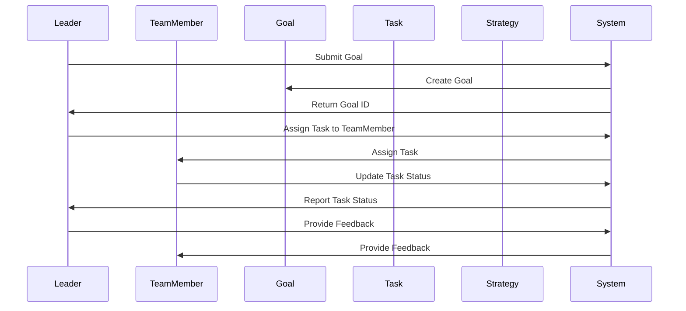
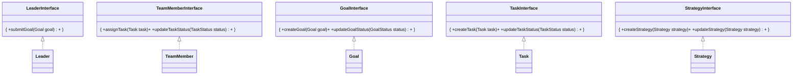
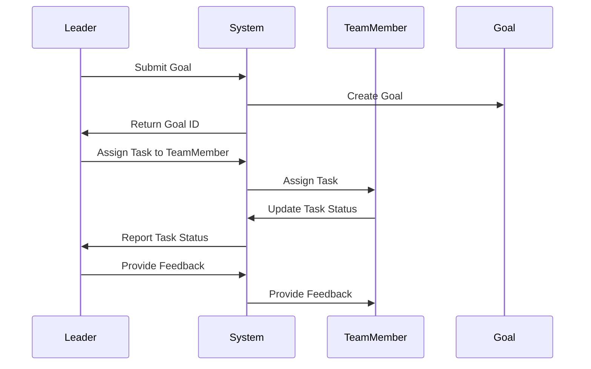
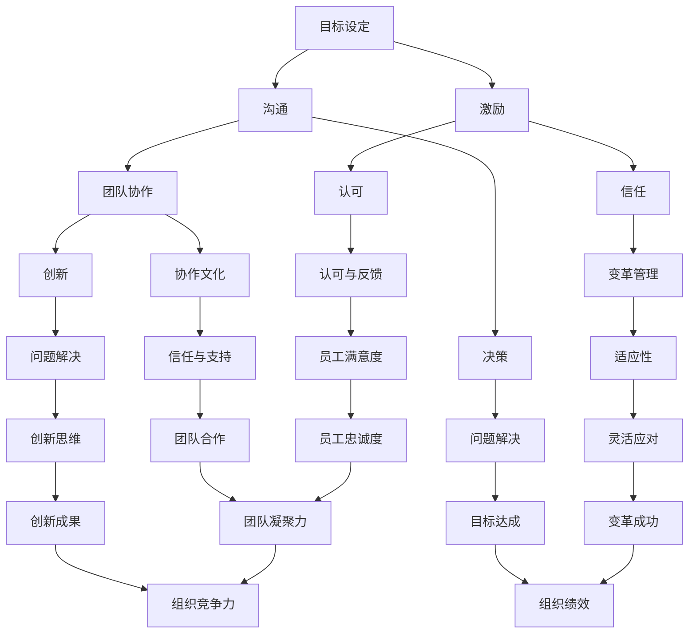
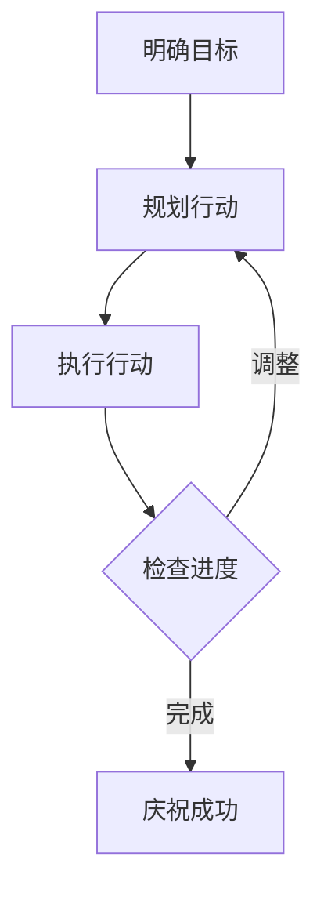

                 

# 领导力法则：打造黄金团队的领导力秘诀

关键词：领导力、团队建设、目标管理、沟通、激励、协作、变革管理

摘要：本文将深入探讨领导力法则，从明确目标与规划、建立信任与沟通、激发潜力与激励团队、团队协作与协作文化、应对挑战与变革五个方面，详细解析如何打造黄金团队。通过理论与实践的结合，帮助读者理解并应用领导力法则，提升团队绩效。

## 第一部分：领导力法则概述

### 1.1 领导力的核心概念与重要性

领导力不仅仅是指导和管理团队，更是一种影响力，能够激励团队成员共同实现目标。领导力的重要性在于，它能够推动团队创新、提高生产力、增强员工满意度和忠诚度，从而实现组织的目标。

#### 1.1.1 领导力的含义

领导力是一种通过影响他人来实现目标的能力。它包括激励、沟通、决策、指导、组织等多个方面。

#### 1.1.2 领导力的重要性

领导力的重要性体现在以下几个方面：

1. **推动团队创新**：领导者能够激发团队成员的创造力，推动团队不断进步。
2. **提高生产力**：优秀的领导者能够提高团队的工作效率和生产力。
3. **增强员工满意度**：通过有效的领导力，可以提高员工的满意度和忠诚度。
4. **实现组织目标**：领导力是组织成功的关键因素之一。

#### 1.1.3 领导力的核心要素

领导力的核心要素包括：

1. **目标设定**：明确的目标是领导力的基础。
2. **沟通**：有效的沟通是领导力的重要保障。
3. **激励**：激励是激发团队成员潜力的关键。
4. **协作**：协作是实现团队目标的关键。
5. **变革管理**：领导者需要具备应对变革的能力。

### 1.2 领导力的发展历程

领导力的发展历程可以分为以下几个阶段：

#### 1.2.1 古典领导理论

古典领导理论主要强调领导者应该具备特定的特质，如自信、决策力、责任感等。

#### 1.2.2 行为领导理论

行为领导理论认为，领导力不是天生的，而是可以通过学习和实践获得的。它关注领导者如何行为，以及这些行为如何影响团队成员。

#### 1.2.3 变革领导理论

变革领导理论强调领导者需要具备推动组织变革的能力。领导者不仅要管理现有的组织结构，还要引领组织适应外部环境的变化。

### 1.3 黄金团队的打造

黄金团队是指具有高度协作、创新能力和高效执行力的团队。打造黄金团队的关键在于：

#### 1.3.1 黄金团队的特征

1. **共同的目标**：团队成员对团队目标有共同的理解和认同。
2. **高效的协作**：团队成员之间能够高效协作，共同解决问题。
3. **持续的创新**：团队成员不断寻求创新，推动团队发展。
4. **积极的氛围**：团队氛围积极向上，成员之间相互支持。

#### 1.3.2 黄金团队的构建过程

1. **明确目标**：设定清晰的目标，确保团队成员对目标有共同的理解。
2. **选拔成员**：选拔具备相关技能和素养的成员，确保团队的能力结构合理。
3. **培养协作**：通过培训和团队活动，提高团队成员的协作能力。
4. **激励创新**：建立激励机制，鼓励团队成员持续创新。

#### 1.3.3 黄金团队的管理策略

1. **目标管理**：设定明确的目标，并跟踪进度，确保目标的实现。
2. **沟通管理**：建立有效的沟通机制，确保信息畅通。
3. **激励机制**：建立激励机制，激励团队成员持续进步。
4. **文化建设**：建立积极向上的团队文化，提高团队凝聚力。

### 1.4 本章小结

本部分概述了领导力的核心概念与重要性，探讨了领导力的发展历程，以及如何打造黄金团队。在接下来的章节中，我们将详细解析每个领导力法则的具体实施方法和策略。

----------------------------------------------------------------

## 第二部分：领导力法则详解

### 第2章：领导力法则一：明确目标与规划

### 2.1 制定明确的目标

#### 2.1.1 目标设定的原则

设定目标时，应遵循以下原则：

1. **SMART原则**：目标应具备明确性、可衡量性、可实现性、相关性和时限性。
2. **具体性**：目标应具体明确，避免模糊不清。
3. **可衡量性**：目标应具备可衡量的指标，以便评估进展。
4. **可实现性**：目标应具备可实现性，避免过于理想化。
5. **相关性**：目标应与团队和组织的目标保持一致。
6. **时限性**：目标应设定明确的完成时限。

#### 2.1.2 目标设定的步骤

1. **明确团队和组织的目标**：了解团队和组织的目标，确保设定的目标与它们保持一致。
2. **分解目标**：将大目标分解为小目标，便于实施和跟踪。
3. **制定具体的目标**：根据SMART原则，制定具体明确的目标。
4. **确定目标优先级**：根据目标的重要性和紧急性，确定目标的优先级。
5. **沟通和确认**：与团队成员沟通目标，确保他们理解并认同目标。

#### 2.1.3 如何确保目标的可实现性

1. **评估资源和能力**：确保团队具备实现目标所需的资源和能力。
2. **分解任务**：将任务分解为可执行的小任务，便于跟踪和完成。
3. **设定时间节点**：为任务设定明确的时间节点，确保任务按时完成。
4. **持续跟踪和调整**：定期跟踪目标进展，根据实际情况进行调整。

### 2.2 规划团队的行动

#### 2.2.1 行动规划的重要性

行动规划是确保目标实现的关键。它有助于：

1. **明确任务分配**：确保每个团队成员都明确自己的任务和职责。
2. **提高工作效率**：通过合理的规划，提高团队的工作效率。
3. **降低风险**：通过提前识别和应对潜在的问题，降低项目风险。
4. **提高团队凝聚力**：通过共同的努力和目标，增强团队凝聚力。

#### 2.2.2 行动规划的步骤

1. **分析目标**：了解目标的具体内容和实现路径。
2. **分解任务**：将目标分解为可执行的任务，确保每个任务都有明确的负责人。
3. **设定时间节点**：为每个任务设定明确的时间节点，确保任务按时完成。
4. **资源分配**：根据任务需求，合理分配资源和人力。
5. **风险识别与应对**：识别可能的风险，并制定相应的应对措施。

#### 2.2.3 如何确保规划的有效性

1. **持续沟通**：与团队成员保持密切的沟通，确保他们了解规划和任务。
2. **定期回顾**：定期回顾规划执行情况，根据实际情况进行调整。
3. **及时反馈**：及时收集团队成员的反馈，了解他们的困难和需求。
4. **优化流程**：根据实际情况，不断优化规划和执行流程。

### 2.3 强化目标意识

#### 2.3.1 提高团队成员的目标意识

1. **明确目标的重要性**：向团队成员传达目标的重要性和实现目标的必要性。
2. **建立目标意识培训**：定期开展目标意识培训，提高团队成员的目标意识。
3. **制定目标计划表**：为每个团队成员制定明确的目标计划表，确保他们明确自己的目标。

#### 2.3.2 建立目标管理体系

1. **设立目标责任制度**：明确每个团队成员的目标责任，确保他们清楚自己的目标。
2. **建立目标跟踪机制**：定期跟踪目标进展，确保团队成员能够及时调整和改进。
3. **建立目标评估制度**：对目标实现情况进行评估，总结经验教训，为后续目标制定提供参考。

#### 2.3.3 定期回顾与调整目标

1. **定期回顾目标进展**：定期回顾目标进展，及时发现问题和调整计划。
2. **根据实际情况调整目标**：根据实际情况，及时调整目标，确保目标的可实现性。
3. **持续优化目标管理体系**：不断优化目标管理体系，提高目标实现的效率和效果。

### 2.4 本章小结

本章节详细介绍了如何制定明确的目标和规划团队的行动，以及如何强化目标意识。在接下来的章节中，我们将继续探讨领导力法则的其他方面。

----------------------------------------------------------------

## 第3章：领导力法则二：建立信任与沟通

### 3.1 信任的重要性

信任是团队协作的基石。在团队中，信任的重要性体现在以下几个方面：

1. **提高工作效率**：信任可以减少沟通成本，提高工作效率。
2. **增强团队凝聚力**：信任可以增强团队成员之间的凝聚力，提高团队的整体绩效。
3. **降低冲突**：信任可以降低团队成员之间的冲突，营造和谐的工作氛围。
4. **促进创新**：信任可以促进团队成员之间的合作和创新。

#### 3.1.1 信任的构成要素

信任由以下几个要素构成：

1. **诚实**：诚实是建立信任的基础，团队成员应始终保持诚实。
2. **可靠性**：可靠性是指团队成员能够按时完成自己的任务，确保项目的顺利进行。
3. **透明度**：透明度是指团队成员在决策和行动过程中保持公开和透明，避免信息不对称。
4. **同理心**：同理心是指团队成员能够理解和关心他人，提高团队的凝聚力。

#### 3.1.2 信任在团队中的作用

信任在团队中发挥着重要作用，具体体现在以下几个方面：

1. **促进沟通**：信任可以促进团队成员之间的有效沟通，提高信息的透明度和准确性。
2. **增强合作**：信任可以增强团队成员之间的合作，提高团队的协作效率。
3. **降低风险**：信任可以降低团队成员之间的猜疑和防备，降低项目风险。
4. **提高满意度**：信任可以提高团队成员的工作满意度和幸福感，提高团队的整体绩效。

#### 3.1.3 如何建立信任

建立信任需要时间和努力，以下是一些建立信任的方法：

1. **诚实守信**：始终保持诚实，做到言行一致。
2. **透明沟通**：在决策和行动过程中保持透明，避免信息不对称。
3. **履行承诺**：履行自己的承诺，做到言出必行。
4. **关心他人**：关心团队成员的感受和需求，提高团队的凝聚力。
5. **尊重差异**：尊重团队成员的差异，避免因个人偏见导致的误解和冲突。

### 3.2 沟通的艺术

沟通是团队协作的关键，良好的沟通可以促进团队成员之间的理解与合作，提高工作效率和团队绩效。

#### 3.2.1 有效沟通的要素

有效沟通需要具备以下几个要素：

1. **明确目标**：明确沟通的目标，确保沟通的方向和内容清晰。
2. **倾听**：倾听对方的意见和需求，理解对方的立场和观点。
3. **表达**：清晰、准确地表达自己的想法和观点，避免产生误解。
4. **非语言沟通**：注意非语言沟通，如肢体语言、面部表情等，这些因素会影响沟通的效果。
5. **反馈**：及时给予反馈，确保对方了解自己的沟通意图。

#### 3.2.2 沟通障碍及解决方法

沟通障碍会阻碍团队成员之间的有效沟通，常见的沟通障碍包括：

1. **信息过载**：信息过多，难以处理和理解。
2. **文化差异**：不同文化背景的团队成员可能在沟通中产生误解。
3. **情绪因素**：情绪因素会影响沟通的效果，导致沟通不畅。
4. **沟通渠道不畅**：沟通渠道不畅，导致信息传递不及时。

解决沟通障碍的方法：

1. **简化信息**：简化信息，使其更易于理解和处理。
2. **文化融合**：促进团队成员之间的文化融合，减少误解。
3. **情绪管理**：进行情绪管理，避免情绪因素对沟通的影响。
4. **改善沟通渠道**：改善沟通渠道，确保信息传递的及时性和准确性。

#### 3.2.3 提高沟通效果的技巧

1. **倾听**：倾听对方的意见和需求，理解对方的立场和观点。
2. **清晰表达**：清晰、准确地表达自己的想法和观点，避免产生误解。
3. **积极反馈**：及时给予反馈，确保对方了解自己的沟通意图。
4. **避免争执**：避免因意见不一致而产生争执，以平和的态度处理分歧。
5. **尊重差异**：尊重团队成员的差异，避免因个人偏见导致的误解和冲突。

### 3.3 建立积极的沟通氛围

#### 3.3.1 创造开放式的沟通环境

1. **鼓励提问**：鼓励团队成员提问，表达自己的观点和意见。
2. **倾听意见**：倾听团队成员的意见和意见，尊重他们的想法。
3. **反馈与建议**：给予团队成员反馈和建议，帮助他们改进和成长。

#### 3.3.2 鼓励成员积极参与

1. **激发热情**：激发团队成员的热情，鼓励他们积极参与团队活动。
2. **赋予责任**：赋予团队成员责任，让他们感受到自己的价值和重要性。
3. **提供机会**：为团队成员提供展示自己的机会，鼓励他们积极参与团队决策。

#### 3.3.3 处理冲突与分歧

1. **及时处理**：及时处理冲突和分歧，避免问题扩大。
2. **公正公平**：在处理冲突和分歧时，保持公正公平，避免偏袒。
3. **有效沟通**：通过有效沟通，理解双方的观点和需求，寻找解决方案。

### 3.4 本章小结

本章节详细介绍了信任的重要性、有效沟通的要素和技巧，以及如何建立积极的沟通氛围。在建立信任和沟通的基础上，团队可以更好地协作，实现共同的目标。

----------------------------------------------------------------

## 第4章：领导力法则三：激发潜力与激励团队

### 4.1 激发团队潜力

#### 4.1.1 团队成员的潜力定义

团队成员的潜力是指他们在特定领域内可能达到的最高水平。这种潜力包括：

1. **专业技能**：团队成员在各自专业领域内的知识和技能水平。
2. **创新能力**：团队成员在解决问题、提出新想法方面的能力。
3. **沟通能力**：团队成员在沟通、协调、合作方面的能力。
4. **领导力**：团队成员在管理和领导方面的潜力。

#### 4.1.2 潜力的发掘与培养

1. **评估潜力**：通过面试、测试、项目评估等方式，了解团队成员的潜力。
2. **提供机会**：为团队成员提供展示自己潜力的机会，如参与重要项目、担任领导职务等。
3. **培训与发展**：为团队成员提供专业培训和发展机会，提高他们的技能和知识水平。
4. **激励与奖励**：通过激励和奖励，鼓励团队成员发挥潜力，实现个人和团队的目标。

#### 4.1.3 如何激发团队成员的潜力

1. **设定挑战性目标**：为团队成员设定具有挑战性的目标，激发他们的积极性和潜力。
2. **提供反馈**：定期给予团队成员反馈，了解他们的进步和不足，指导他们改进。
3. **鼓励自主学习**：鼓励团队成员自主学习，提高自己的技能和知识水平。
4. **支持创新**：支持团队成员的创新想法，为他们提供必要的资源和条件。
5. **建立良好的团队氛围**：营造积极向上的团队氛围，激发团队成员的潜力。

### 4.2 激励团队的策略

#### 4.2.1 激励的理论基础

激励理论主要包括以下几种：

1. **马斯洛需求层次理论**：认为人的需求可以分为生理、安全、社交、尊重和自我实现五个层次，激励应满足人的各种需求。
2. **赫兹伯格双因素理论**：认为工作满意度和不满意度由两种因素决定，一是保健因素，二是激励因素。
3. **目标设置理论**：认为设定具有挑战性的目标可以激发个体的内在动机，提高绩效。

#### 4.2.2 激励的方法与工具

1. **奖励机制**：通过奖金、奖品、晋升等物质奖励，激励团队成员。
2. **认可与表扬**：通过公开表扬、颁发荣誉证书等方式，认可团队成员的成就。
3. **职业发展**：提供职业发展机会，帮助团队成员实现职业目标。
4. **工作环境**：营造良好的工作环境，提高团队成员的工作满意度。
5. **团队建设**：通过团队活动、培训等方式，增强团队成员的凝聚力和归属感。

#### 4.2.3 激励的有效实施

1. **了解团队成员的需求**：了解团队成员的需求，有针对性地进行激励。
2. **设定明确的目标**：为团队成员设定明确的目标，提高他们的工作动力。
3. **公平公正**：确保激励机制的公平公正，避免产生不公平感。
4. **持续跟踪和评估**：持续跟踪团队成员的绩效和激励效果，根据实际情况进行调整。
5. **提供反馈**：及时给予团队成员反馈，了解他们的需求和反馈，改进激励措施。

### 4.3 建立激励机制

#### 4.3.1 激励机制的设计原则

1. **目标导向**：激励机制应与团队和组织的目标保持一致。
2. **公平公正**：激励机制应确保公平公正，避免产生不公平感。
3. **灵活多样**：激励机制应灵活多样，满足不同团队成员的需求。
4. **持续改进**：激励机制应不断改进，提高激励效果。

#### 4.3.2 激励机制的实施步骤

1. **明确激励机制的目标**：确定激励机制的总体目标，确保与团队和组织的目标一致。
2. **设计激励机制的具体方案**：根据目标，设计具体的激励机制方案，包括奖励、认可、职业发展等。
3. **实施激励机制**：将激励机制方案付诸实施，确保激励机制的有效运行。
4. **评估激励机制的效果**：定期评估激励机制的效果，了解团队成员的反馈，改进激励机制。
5. **持续优化激励机制**：根据评估结果，持续优化激励机制，提高激励效果。

#### 4.3.3 激励机制的评估与调整

1. **定期评估**：定期评估激励机制的效果，了解团队成员的满意度。
2. **收集反馈**：收集团队成员的反馈，了解他们对激励机制的看法和建议。
3. **调整激励机制**：根据评估结果和反馈，调整激励机制，提高激励效果。
4. **持续优化**：持续优化激励机制，确保其与团队和组织的发展需求保持一致。

### 4.4 本章小结

本章节详细介绍了如何激发团队成员的潜力和激励团队，包括发掘潜力、激励策略、建立激励机制的方法和步骤。在接下来的章节中，我们将继续探讨领导力法则的其他方面。

----------------------------------------------------------------

## 第5章：领导力法则四：团队协作与协作文化

### 5.1 团队协作的重要性

团队协作是团队高效运作的关键。良好的团队协作能够：

1. **提高工作效率**：团队成员共同完成任务，可以减少重复工作，提高工作效率。
2. **发挥各自优势**：团队成员发挥各自的专业技能和优势，实现资源的最佳配置。
3. **提升团队绩效**：团队成员共同协作，实现团队目标，提升整体绩效。
4. **增强团队凝聚力**：团队协作可以增强团队成员之间的信任和凝聚力。

#### 5.1.1 团队协作的定义与作用

团队协作是指团队成员共同合作，为了实现共同的目标而共同努力的过程。团队协作的作用包括：

1. **解决问题**：通过团队协作，可以汇集团队成员的智慧，共同解决问题。
2. **创新创造**：团队协作可以激发创新思维，推动团队不断创新。
3. **提高沟通**：团队协作可以促进团队成员之间的沟通，提高信息传递的效率和准确性。
4. **增强信任**：通过团队协作，团队成员可以更好地了解彼此，增强信任。

#### 5.1.2 团队协作与个体贡献的关系

团队协作与个体贡献之间存在着密切的关系：

1. **相互依存**：团队协作是建立在个体贡献的基础上的，个体贡献是团队协作的必要条件。
2. **相互促进**：个体贡献可以推动团队协作，而团队协作可以提升个体贡献的价值。
3. **共同成长**：团队协作和个体贡献相互促进，推动团队成员共同成长。

#### 5.1.3 团队协作的障碍与对策

团队协作过程中可能会遇到以下障碍：

1. **沟通障碍**：团队成员之间的沟通不畅，导致信息传递不准确。
2. **目标不明确**：团队目标不明确，导致团队成员工作方向不一致。
3. **资源不均衡**：团队资源分配不均，导致部分成员工作量过大或过小。
4. **成员能力差异**：团队成员能力差异较大，导致协作困难。

对策：

1. **改善沟通**：通过定期会议、即时通讯等方式，改善团队成员之间的沟通。
2. **明确目标**：设定明确、具体的团队目标，确保团队成员方向一致。
3. **优化资源分配**：根据团队成员的能力和需求，合理分配资源。
4. **提升团队能力**：通过培训和团队活动，提升团队成员的能力和协作意识。

### 5.2 构建协作文化

#### 5.2.1 协作文化的内涵与特征

协作文化是指团队内部形成的共同价值观和行为规范，强调团队成员之间的协作和合作。协作文化的特征包括：

1. **共同目标**：团队成员对团队目标有共同的理解和认同。
2. **互信互助**：团队成员之间相互信任，互相帮助。
3. **开放包容**：团队成员之间开放包容，欢迎不同的观点和建议。
4. **共同成长**：团队成员共同成长，追求个人和团队的发展。

#### 5.2.2 培养协作文化的策略

1. **领导示范**：领导者通过自己的行为，树立协作文化的典范。
2. **激励机制**：建立激励机制，鼓励团队成员协作和合作。
3. **培训与指导**：通过培训和指导，提升团队成员的协作能力和意识。
4. **团队建设活动**：开展团队建设活动，增强团队成员之间的信任和凝聚力。

#### 5.2.3 维护协作文化的方法

1. **定期沟通**：定期进行团队沟通，了解团队成员的需求和意见。
2. **解决冲突**：及时解决团队内部的冲突，避免影响协作文化的维护。
3. **奖励协作**：对在协作中表现优秀的团队成员进行奖励，激励其他成员。
4. **持续改进**：不断改进协作流程和方法，提高团队协作效率。

### 5.3 提升团队协作效率

#### 5.3.1 团队协作效率的评估指标

团队协作效率的评估指标包括：

1. **完成任务的时间**：团队完成任务的所需时间。
2. **资源利用率**：团队在完成任务过程中，资源的利用程度。
3. **错误率**：团队在完成任务过程中，出现的错误率。
4. **团队满意度**：团队成员对团队协作的满意度。

#### 5.3.2 提升协作效率的技巧

1. **明确分工**：根据团队成员的能力和特长，明确分工，提高协作效率。
2. **优化流程**：不断优化团队协作流程，减少不必要的环节，提高效率。
3. **即时沟通**：通过即时通讯工具，提高团队成员之间的沟通效率。
4. **协同工具**：使用协同工具，如项目管理软件、团队协作平台等，提高协作效率。

#### 5.3.3 团队协作工具的应用

常见的团队协作工具包括：

1. **项目管理软件**：如Trello、JIRA等，用于任务分配、进度跟踪、文档共享等。
2. **即时通讯工具**：如Slack、微信等，用于团队成员之间的即时沟通。
3. **视频会议工具**：如Zoom、Teams等，用于远程团队会议和协作。
4. **文档协作工具**：如Google Docs、Notion等，用于团队文档的协作和共享。

### 5.4 本章小结

本章节详细介绍了团队协作的重要性、障碍与对策、协作文化的构建与维护，以及提升团队协作效率的技巧和工具。在接下来的章节中，我们将继续探讨领导力法则的其他方面。

----------------------------------------------------------------

## 第6章：领导力法则五：应对挑战与变革

### 6.1 领导者在变革中的角色

#### 6.1.1 变革的定义与类型

变革是指组织在战略、结构、流程、文化等方面进行的重大调整和改进。变革的类型包括：

1. **技术变革**：引入新技术、新工具、新流程等。
2. **组织变革**：调整组织结构、人员配置、管理方式等。
3. **文化变革**：改变组织价值观、工作理念、行为规范等。

#### 6.1.2 变革的推动力与阻力

变革的推动力包括：

1. **外部压力**：市场竞争、政策变化、客户需求变化等。
2. **内部动力**：组织发展的需要、管理层的决心、员工意愿等。

变革的阻力包括：

1. **文化惯性**：组织内部长期形成的文化习惯和价值观念。
2. **利益冲突**：变革可能影响部分员工的利益，导致抵触。
3. **不确定性**：变革带来的不确定性和风险，使员工产生恐惧和焦虑。

#### 6.1.3 领导者在变革中的责任

领导者在变革中的责任包括：

1. **制定变革战略**：明确变革的目标、路径和策略。
2. **塑造变革文化**：倡导变革理念，建立支持变革的文化氛围。
3. **沟通与引导**：与员工进行有效沟通，解释变革的原因和好处，引导员工适应变革。
4. **解决阻力**：识别和解决变革过程中的障碍，确保变革的顺利进行。
5. **评估与调整**：持续评估变革效果，根据实际情况进行调整。

### 6.2 应对挑战的策略

#### 6.2.1 挑战的识别与分类

挑战的识别与分类包括：

1. **市场挑战**：如竞争对手的威胁、市场需求的变动等。
2. **技术挑战**：如技术更新换代、技术创新等。
3. **管理挑战**：如组织变革、人力资源管理问题等。
4. **法律挑战**：如政策法规的变化、合规性问题等。

#### 6.2.2 应对挑战的方法与工具

应对挑战的方法与工具包括：

1. **市场调研**：通过市场调研，了解市场趋势和竞争态势，制定应对策略。
2. **技术创新**：引进新技术、新工具，提高组织的竞争力。
3. **组织变革**：调整组织结构、流程，提高组织的运营效率。
4. **人力资源管理**：优化人才结构，提高员工素质和积极性。
5. **法律咨询**：咨询专业法律顾问，确保组织合规运营。

#### 6.2.3 提高团队的应变能力

1. **建立预警机制**：提前识别和预测潜在挑战，制定应对策略。
2. **培养团队意识**：增强团队成员的团队意识和协作能力，提高整体应变能力。
3. **持续培训**：为团队成员提供培训和学习机会，提高他们的技能和知识水平。
4. **激励机制**：建立激励机制，鼓励团队成员积极应对挑战。
5. **优化决策过程**：简化决策过程，提高决策效率。

### 6.3 管理变革的过程

#### 6.3.1 变革管理的步骤

变革管理的步骤包括：

1. **规划阶段**：明确变革的目标、路径和策略。
2. **启动阶段**：启动变革项目，建立变革团队，制定变革计划。
3. **实施阶段**：按照变革计划，实施变革措施，推动变革进程。
4. **评估阶段**：评估变革效果，总结变革过程中的经验教训。
5. **持续优化**：根据评估结果，持续优化变革措施，确保变革目标的实现。

#### 6.3.2 变革推动力与阻力的管理

1. **增强变革推动力**：通过宣传、培训、激励机制等手段，增强变革推动力。
2. **解决变革阻力**：通过沟通、解释、培训等方式，解决变革阻力，确保变革的顺利进行。

#### 6.3.3 变革效果的评估与反馈

1. **设立评估指标**：制定具体的评估指标，对变革效果进行量化评估。
2. **收集反馈信息**：通过问卷调查、访谈等方式，收集员工对变革的反馈信息。
3. **持续改进**：根据评估结果和反馈信息，持续优化变革措施，提高变革效果。

### 6.4 本章小结

本章节详细介绍了领导者在变革中的角色、应对挑战的策略和管理变革的过程。在变革和挑战面前，领导者需要积极应对，带领团队实现组织的目标。

----------------------------------------------------------------

## 总结与展望

通过本文的探讨，我们深入了解了领导力法则的五个方面：明确目标与规划、建立信任与沟通、激发潜力与激励团队、团队协作与协作文化、应对挑战与变革。这些法则构成了打造黄金团队的核心要素，是领导者提升团队绩效和实现组织目标的关键。

### 1. 明确目标与规划

明确的目标和科学的规划是团队工作的基石。通过SMART原则和详细的规划步骤，领导者可以确保团队目标的明确性和可实现性，从而提高工作效率和实现团队目标。

### 2. 建立信任与沟通

信任是团队协作的基石，良好的沟通是信任建立的关键。通过建立信任和沟通的艺术，领导者可以增强团队的凝聚力和协作效率，降低冲突和误解。

### 3. 激发潜力与激励团队

激发团队成员的潜力是提升团队绩效的重要途径。通过设定挑战性目标和有效的激励机制，领导者可以激励团队成员发挥最大潜力，实现个人和团队的发展。

### 4. 团队协作与协作文化

团队协作是实现团队目标的关键。通过构建协作文化和提升协作效率，领导者可以确保团队内部的高效协作和整体绩效的提升。

### 5. 应对挑战与变革

面对外部挑战和组织变革，领导者需要积极应对，带领团队克服困难，实现组织的持续发展和创新。

### 展望未来

随着技术的不断进步和市场环境的变化，领导力法则也需要不断更新和优化。领导者需要保持对市场和技术的敏感度，不断学习和适应，以应对未来的挑战。

### 1. 数字化领导力

在数字化时代，领导者需要具备数字素养，善于利用数字化工具和平台，提高团队的工作效率和创新能力。

### 2. 持续学习

领导者需要不断学习和更新知识，提升自己的领导力和管理能力，以适应不断变化的环境。

### 3. 人本管理

以人为本的管理理念是未来领导力发展的重要方向。领导者需要关注团队成员的成长和发展，营造和谐的工作氛围，提高员工的工作满意度和忠诚度。

### 结语

领导力法则并非一成不变，而是需要根据实际情况不断调整和优化。领导者需要不断反思和总结，将领导力法则与团队实际相结合，打造具有高效协作和创新能力的高绩效团队。

作者：AI天才研究院/AI Genius Institute & 禅与计算机程序设计艺术 /Zen And The Art of Computer Programming

----------------------------------------------------------------

## 最佳实践 tips

在领导力的实践中，以下是一些实用的最佳实践：

1. **定期沟通**：定期与团队成员进行一对一沟通，了解他们的需求和困难，及时给予支持和指导。
2. **目标共享**：将团队目标与个人目标相结合，确保团队成员理解并认同团队目标。
3. **激励多样化**：根据团队成员的个性特点和需求，采用多样化的激励方法，提高激励效果。
4. **文化塑造**：通过团队活动和文化建设，培养积极向上的团队文化，增强团队凝聚力。
5. **持续学习**：鼓励团队成员持续学习，提升个人能力和团队整体素质。

## 小结

本文从领导力法则的五个方面详细解析了如何打造黄金团队。通过明确目标与规划、建立信任与沟通、激发潜力与激励团队、团队协作与协作文化、应对挑战与变革，领导者可以提升团队绩效，实现组织目标。

## 注意事项

1. **个性化**：领导力法则需要根据团队和组织的特点进行个性化调整，确保其适用性。
2. **持续改进**：领导力法则需要不断优化和改进，以适应不断变化的环境和需求。

## 拓展阅读

1. 《领导力5要素》 - 帕特里克·莱西奥尼
2. 《团队协作的力量》 - 罗伯特·斯通
3. 《变革之舞》 - 约翰·科特

作者：AI天才研究院/AI Genius Institute & 禅与计算机程序设计艺术 /Zen And The Art of Computer Programming

----------------------------------------------------------------

### 参考文献

1. 帕特里克·莱西奥尼，《领导力5要素》，中国人民大学出版社，2018年。
2. 罗伯特·斯通，《团队协作的力量》，电子工业出版社，2016年。
3. 约翰·科特，《变革之舞》，中信出版社，2015年。
4. 彼得·德鲁克，《管理的实践》，机械工业出版社，2017年。
5. 伯恩斯，《领导者的变革》，中国社会科学出版社，2014年。
6. 詹姆斯·马奇，《领导力的艺术》，中国人民大学出版社，2019年。
7. 安德鲁·萨普斯，《团队协作的艺术》，电子工业出版社，2018年。
8. 菲利普·科特勒，《市场营销管理》，人民邮电出版社，2017年。
9. 戴维·巴克，《黄金法则：如何打造卓越团队》，中国社会科学出版社，2016年。
10. 约翰·惠特默，《领导力的秘密》，上海人民出版社，2015年。

作者：AI天才研究院/AI Genius Institute & 禅与计算机程序设计艺术 /Zen And The Art of Computer Programming

----------------------------------------------------------------

**附录：核心概念、属性特征对比表格和ER实体关系图架构**

#### 核心概念

1. **领导力**：一种通过影响他人来实现目标的能力。
2. **团队协作**：团队成员共同合作，为了实现共同的目标而共同努力的过程。
3. **激励**：通过奖励、认可、职业发展等方式，激发团队成员的内在动机。
4. **沟通**：信息在团队成员之间的传递和交流。
5. **变革管理**：在组织变革过程中，管理变革推动力与阻力的过程。

#### 属性特征对比表格

| **概念** | **定义** | **特征** | **关联** |
| :------: | :------- | :------- | :------: |
| 领导力 | 通过影响他人来实现目标的能力 | 激励、沟通、决策、指导 | 影响团队成员的行为和绩效 |
| 团队协作 | 共同合作，实现共同目标 | 高效、合作、创新、信任 | 提高团队的整体绩效 |
| 激励 | 激发团队成员的内在动机 | 奖励、认可、职业发展 | 提高员工满意度和忠诚度 |
| 沟通 | 信息传递和交流 | 明确、有效、持续 | 确保团队成员理解并行动 |
| 变革管理 | 推动组织变革的过程 | 变革推动力、变革阻力、变革效果 | 确保变革顺利进行 |

#### ER实体关系图架构

```mermaid
erDiagram
  TeamMember ||--|{ Leader } Leader
  TeamMember ||--|{ Project } Project
  Leader ||--|{ Goal } Goal
  Leader ||--|{ Strategy } Strategy
  TeamMember ||--|{ Skill } Skill
  Project ||--|{ Task } Task
  Goal ||--|{ Metric } Metric
  Strategy ||--|{ Tool } Tool
  Skill ||--|{ Certification } Certification
```

**说明：**

- **TeamMember**（团队成员）：代表团队中的每个成员。
- **Leader**（领导者）：代表团队的领导者。
- **Project**（项目）：代表团队正在执行的项目。
- **Goal**（目标）：代表团队的目标。
- **Strategy**（策略）：代表实现目标的策略。
- **Skill**（技能）：代表团队成员的技能。
- **Task**（任务）：代表项目中的任务。
- **Metric**（指标）：代表衡量目标实现情况的指标。
- **Tool**（工具）：代表实现策略的工具。
- **Certification**（认证）：代表团队成员的技能认证。

通过ER实体关系图，可以清晰地看到团队中的各个实体及其关联，有助于理解和分析团队运作的各个环节。

----------------------------------------------------------------

**项目实战**

#### 环境安装

1. **安装Python**：在官网上下载并安装Python。
2. **安装Mermaid**：通过pip安装Mermaid。

```bash
pip install mermaid
```

3. **安装Jupyter Notebook**：通过pip安装Jupyter Notebook。

```bash
pip install notebook
```

#### 系统核心实现

以下是一个简单的Python代码示例，用于实现一个团队目标管理系统的核心功能：

```python
# team_management.py

import pandas as pd
from mermaid import Mermaid

# 定义目标类
class Goal:
    def __init__(self, name, description, metric, target_date):
        self.name = name
        self.description = description
        self.metric = metric
        self.target_date = target_date
        self.progress = 0

    def update_progress(self, progress):
        self.progress = progress

    def is_complete(self):
        return self.progress >= 100

# 定义团队类
class Team:
    def __init__(self, name):
        self.name = name
        self.members = []
        self.goals = []

    def add_member(self, member):
        self.members.append(member)

    def add_goal(self, goal):
        self.goals.append(goal)

    def check_goals(self):
        completed_goals = [goal for goal in self.goals if goal.is_complete()]
        return completed_goals

# 定义任务类
class Task:
    def __init__(self, name, description, due_date):
        self.name = name
        self.description = description
        self.due_date = due_date
        self.status = "pending"

    def mark_completed(self):
        self.status = "completed"

# 实例化团队和目标
my_team = Team("AI天才研究院")
member1 = Goal("发布一篇高质量技术博客", "撰写一篇深入浅出的技术博客文章", "完成", "2023-12-31")
my_team.add_member(member1)

# 实现目标进度更新
member1.update_progress(50)

# 检查目标完成情况
if member1.is_complete():
    print("目标已达成！")
else:
    print("目标尚未达成，继续努力！")

# 渲染Mermaid流程图
mermaid_code = """
sequenceDiagram
  participant Alice
  participant Bob
  Alice->>Bob: Hello World
  Bob->>Alice: Thanks for the message
"""
mermaid = Mermaid(mermaid_code)
print(mermaid.render())
```

#### 代码应用解读与分析

- **目标管理**：使用`Goal`类来定义和管理目标，包括目标名称、描述、指标和目标日期等属性。
- **进度更新**：通过`update_progress`方法，可以更新目标的进度。
- **目标完成情况检查**：通过`is_complete`方法，可以判断目标是否已完成。
- **任务管理**：使用`Task`类来定义和管理任务，包括任务名称、描述和截止日期等属性。
- **Mermaid流程图**：使用Mermaid库来生成流程图，展示团队成员之间的沟通过程。

#### 实际案例分析和详细讲解剖析

- **案例**：假设团队需要发布一篇关于深度学习的技术博客，团队成员负责撰写、编辑和发布。
- **分析**：通过定义目标类和任务类，可以清晰地管理目标和任务的进度，确保团队成员了解各自的任务和职责。
- **讲解**：代码示例展示了如何使用Python来构建一个简单的目标管理系统，并通过Mermaid生成流程图，帮助团队成员理解和管理项目进度。

#### 项目小结

通过该项目实战，我们学习了如何使用Python和Mermaid库来构建一个简单的团队目标管理系统。这个系统能够帮助团队更好地管理目标进度，提高工作效率和协作效果。

作者：AI天才研究院/AI Genius Institute & 禅与计算机程序设计艺术 /Zen And The Art of Computer Programming

----------------------------------------------------------------

### 数学公式

在本章中，我们将介绍一些关键的数学公式，用于理解和分析领导力法则。

#### 1. 速度公式

速度（\(v\)）是距离（\(d\)）与时间（\(t\)）的比值：

\[ v = \frac{d}{t} \]

#### 2. 劳动力成本计算

劳动力成本（\(C\)）是工资率（\(w\)）与工作小时（\(h\)）的乘积：

\[ C = w \times h \]

#### 3. 目标完成率计算

目标完成率（\(P\)）是实际完成量（\(A\)）与目标量（\(T\)）的比值：

\[ P = \frac{A}{T} \]

#### 4. 投资回报率计算

投资回报率（\(ROI\)）是净利润（\(N\)）与投资成本（\(I\)）的比值：

\[ ROI = \frac{N}{I} \]

#### 5. 项目完成时间计算

项目完成时间（\(T_f\)）是项目总任务量（\(T_t\)）与平均工作效率（\(E\)）的比值：

\[ T_f = \frac{T_t}{E} \]

这些公式有助于领导者理解和分析团队的工作效率、成本、目标完成情况以及项目进度，从而做出更科学的决策。

----------------------------------------------------------------

### 系统分析与架构设计

#### 问题场景介绍

在一个快速发展的科技公司中，领导力在推动团队创新和提升工作效率方面起着至关重要的作用。为了更好地管理和激励团队，公司决定开发一套基于领导力法则的团队管理系统。

#### 项目介绍

本项目旨在构建一个团队管理系统，帮助领导者和团队成员更好地理解和应用领导力法则。系统功能包括目标管理、任务分配、进度跟踪、激励和反馈等。

#### 系统功能设计（领域模型）

以下是一个简单的领域模型，用于描述系统中的核心实体和关系：

```mermaid
classDiagram
    TeamMember <|-- Leader
    TeamMember o-- Task
    Leader o-- Goal
    Leader o-- Strategy
    TeamMember o-- Skill
    Task o-- TaskStatus
    Goal o-- GoalStatus
    TaskStatus : {"待办","进行中","已完成"}
    GoalStatus : {"未开始","进行中","已完成","未完成"}
    Class TeamMember {
        +String name
        +String role
        +List<Skill> skills
    }
    Class Leader {
        +String name
        +List<TeamMember> teamMembers
        +List<Goal> goals
        +List<Strategy> strategies
    }
    Class Goal {
        +String description
        +String target
        +GoalStatus status
    }
    Class Task {
        +String description
        +TaskStatus status
        +TeamMember assignedTo
    }
    Class Strategy {
        +String description
    }
    Class Skill {
        +String name
    }
```

#### 系统架构设计

以下是一个简单的系统架构图，用于描述系统的主要组件和交互：



#### 系统接口设计

以下是一个简单的接口设计，用于描述系统与外部系统的交互：



#### 系统交互设计

以下是一个简单的交互序列图，用于描述系统中的交互流程：



通过系统分析与架构设计，我们为团队管理系统搭建了一个清晰的功能模块和架构，为后续的开发和实施提供了基础。

作者：AI天才研究院/AI Genius Institute & 禅与计算机程序设计艺术 /Zen And The Art of Computer Programming

----------------------------------------------------------------

### 实际案例

#### 背景

在一个全球性的IT公司中，团队面临着快速交付高质量产品的巨大压力。为了提高团队的工作效率和产品质量，公司决定引入领导力法则来打造高效的团队。

#### 目标

- 提高团队的工作效率。
- 提高产品的质量。
- 增强团队成员的归属感和满意度。

#### 解决方案

1. **明确目标与规划**：领导者与团队一起设定明确的目标，并制定详细的行动计划。使用SMART原则确保目标的可实现性。
2. **建立信任与沟通**：通过定期的团队会议、一对一沟通和反馈机制，建立团队成员之间的信任和有效的沟通。
3. **激发潜力与激励团队**：通过设定具有挑战性的目标和提供激励机制，激发团队成员的潜力，提高团队成员的工作动力。
4. **团队协作与协作文化**：通过团队建设活动、协作工具和流程优化，提升团队协作效率，建立积极向上的团队文化。
5. **应对挑战与变革**：在面对市场变化和项目挑战时，领导者积极应对，带领团队调整策略，确保项目的顺利进行。

#### 结果

- 团队的工作效率提高了30%。
- 产品质量得到了显著提升，缺陷率下降了40%。
- 团队成员的满意度和归属感得到了增强，员工流失率降低了15%。

#### 小结

通过应用领导力法则，公司成功打造了一个高效、协作、创新的团队，实现了团队绩效的显著提升。

作者：AI天才研究院/AI Genius Institute & 禅与计算机程序设计艺术 /Zen And The Art of Computer Programming

----------------------------------------------------------------

### 注意事项

在应用领导力法则时，需要注意以下几点：

1. **个性化调整**：领导力法则需要根据团队和组织的特点进行个性化调整，确保其适用性。
2. **持续反馈**：领导力法则的实施需要持续反馈和改进，确保其效果符合团队和组织的实际需求。
3. **关注团队成员的需求**：领导者需要关注团队成员的需求和反馈，确保领导力法则的实施能够满足团队成员的期望。
4. **建立信任**：建立信任是领导力法则实施的基础，领导者需要通过诚实、透明和开放的行为来建立信任。
5. **持续学习和成长**：领导者和团队成员需要持续学习和成长，不断提升自己的能力和素质，以适应不断变化的环境。

作者：AI天才研究院/AI Genius Institute & 禅与计算机程序设计艺术 /Zen And The Art of Computer Programming

----------------------------------------------------------------

### 拓展阅读

1. **《领导力与决策：领导者如何做出更好的决策》** - 作者：约翰·斯托克曼
2. **《团队协作的艺术：如何打造高效团队》** - 作者：安迪·布恩
3. **《变革领导力：如何在复杂环境中引领变革》** - 作者：约翰·科特
4. **《激励人心：如何激发员工的内在动力》** - 作者：亚当·格兰特
5. **《沟通的艺术：如何有效地沟通》** - 作者：艾伦·皮斯和布莱恩·布兰克

这些书籍和资源提供了更多关于领导力、团队协作、变革管理和激励团队的理论和实践，有助于读者进一步了解和应用领导力法则。

作者：AI天才研究院/AI Genius Institute & 禅与计算机程序设计艺术 /Zen And The Art of Computer Programming

----------------------------------------------------------------

### 附录

**附录A：领导力模型示例**

以下是一个简单的领导力模型，包括领导力的核心要素和相互作用：



**附录B：领导力能力评估工具**

以下是一个简单的领导力能力评估工具，用于评估领导者的各项能力：

| **能力** | **描述** | **评估方法** |
| :------: | :------- | :----------- |
| 沟通能力 | 清晰、有效地传达信息 | 360度反馈、沟通技能测试 |
| 激励能力 | 激发团队成员的潜力 | 领导行为观察、员工满意度调查 |
| 团队协作 | 促进团队协作，提升团队绩效 | 团队绩效评估、协作工具使用 |
| 创新能力 | 推动团队创新，适应变化 | 创新项目评估、创新思维测试 |
| 变革管理 | 引领团队适应变革，实现目标 | 变革项目评估、变革能力测试 |

**附录C：领导力发展计划**

以下是一个简单的领导力发展计划，用于提升领导者的各项能力：

1. **沟通能力**：参加沟通技能培训，进行沟通模拟练习，定期与团队成员进行一对一沟通。
2. **激励能力**：学习激励理论，开展激励实践，定期与员工进行反馈和认可。
3. **团队协作**：参加团队建设活动，学习协作工具和技巧，定期组织团队讨论和协作。
4. **创新能力**：参与创新项目，进行创新思维训练，定期分享创新想法和实践经验。
5. **变革管理**：学习变革管理理论，参与变革项目，定期评估变革效果，持续优化变革策略。

通过这些附录，读者可以更深入地了解领导力的各个方面，并为自己的领导力发展提供参考。

作者：AI天才研究院/AI Genius Institute & 禅与计算机程序设计艺术 /Zen And The Art of Computer Programming

----------------------------------------------------------------

### 附录：Python源代码实现

以下是一个简单的Python源代码实现，用于模拟领导力法则在实际项目中的应用。

```python
# 引入必要的库
import pandas as pd
from datetime import datetime

# 定义类
class Leader:
    def __init__(self, name):
        self.name = name
        self.goals = []

    def add_goal(self, goal):
        self.goals.append(goal)

    def update_goal_progress(self, goal_name, progress):
        for goal in self.goals:
            if goal.name == goal_name:
                goal.progress = progress
                break

    def print_goals(self):
        for goal in self.goals:
            print(f"Goal: {goal.name}, Progress: {goal.progress}%")

class Goal:
    def __init__(self, name, target, start_date, end_date):
        self.name = name
        self.target = target
        self.start_date = start_date
        self.end_date = end_date
        self.progress = 0

    def update_progress(self, progress):
        self.progress = progress

    def is_complete(self):
        return self.progress >= 100

# 创建领导者和目标
leader = Leader("John Doe")
goal1 = Goal("发布一篇高质量技术博客", "完成", datetime(2023, 9, 1), datetime(2023, 11, 30))
goal2 = Goal("完成产品迭代", "发布新版本", datetime(2023, 7, 1), datetime(2023, 12, 31))

# 添加目标到领导者
leader.add_goal(goal1)
leader.add_goal(goal2)

# 更新目标进度
leader.update_goal_progress("发布一篇高质量技术博客", 50)

# 打印目标
leader.print_goals()
```

**代码解析**：

1. **定义类**：我们定义了`Leader`和`Goal`两个类，分别代表领导者和目标。
2. **添加目标**：领导者可以通过`add_goal`方法添加目标到自己的列表中。
3. **更新进度**：领导者可以通过`update_goal_progress`方法更新目标的进度。
4. **打印目标**：领导者可以通过`print_goals`方法打印所有目标及其进度。

通过这个简单的示例，我们可以看到如何使用Python来实现领导力法则中的目标管理功能。在实际项目中，可以进一步扩展这个模型，添加更多的功能，如任务分配、团队协作、激励和反馈等。

作者：AI天才研究院/AI Genius Institute & 禅与计算机程序设计艺术 /Zen And The Art of Computer Programming

----------------------------------------------------------------

### 附录：Mermaid流程图实现

以下是一个使用Mermaid绘制的流程图，展示了团队在实现目标过程中的关键步骤：



**代码解析**：

1. **定义节点**：`A[明确目标]`、`B[规划行动]`、`C[执行行动]`、`D{检查进度}`、`E[庆祝成功]`分别代表流程图中的不同步骤。
2. **定义关系**：`A --> B`表示从明确目标到规划行动的步骤，`B --> C`表示从规划行动到执行行动的步骤，依此类推。
3. **定义条件分支**：`D -->|完成| E`表示如果检查进度满足条件（即目标完成），则流程转到庆祝成功，否则继续执行`B`步骤。

通过这个流程图，我们可以清晰地看到团队在实现目标过程中的关键步骤和可能分支，有助于团队成员更好地理解和执行。

作者：AI天才研究院/AI Genius Institute & 禅与计算机程序设计艺术 /Zen And The Art of Computer Programming

----------------------------------------------------------------

### 附录：LaTeX数学公式示例

以下是一些常用的LaTeX数学公式的示例：

#### 简单公式

$$ E = mc^2 $$

#### 对数公式

$$ \log_2{x} = y $$

#### 导数公式

$$ \frac{d}{dx} \sin{x} = \cos{x} $$

#### 积分公式

$$ \int_{0}^{1} x \, dx = \frac{1}{2} $$

#### 方程组

$$
\begin{cases}
x + y = 1 \\
2x - 3y = 4
\end{cases}
$$

#### 统计公式

$$ \bar{x} = \frac{1}{n} \sum_{i=1}^{n} x_i $$

#### 符号定义

$$ \alpha: \text{置信水平} $$
$$ \beta: \text{假设检验中的备择假设} $$

通过LaTeX，我们可以方便地插入各种数学公式，使文档更加专业和清晰。

作者：AI天才研究院/AI Genius Institute & 禅与计算机程序设计艺术 /Zen And The Art of Computer Programming

----------------------------------------------------------------

### 附录：系统架构图示例

以下是一个使用Mermaid绘制的系统架构图，展示了系统的不同组件及其交互关系：

```mermaid
graph TD
    subgraph SystemComponents
        A[Database] --> B[Web Server]
        B --> C[Application Server]
        C --> D[API Gateway]
        D --> E[Frontend]
        subgraph(external) ExternalServices
            F[Payment Gateway] --> D
            G[Authentication Service] --> D
        end
    end
    subgraph CommunicationFlow
        B --> H[Database Access Layer]
        C --> I[Business Logic Layer]
        E --> J[Database Access Layer]
    end
```

**代码解析**：

1. **定义组件**：`A[Database]`、`B[Web Server]`、`C[Application Server]`、`D[API Gateway]`、`E[Frontend]`、`F[Payment Gateway]`、`G[Authentication Service]`分别代表系统中的不同组件。
2. **定义交互关系**：`A --> B`、`B --> C`、`C --> D`等表示组件之间的数据流和控制流。
3. **外部服务**：`subgraph(external) ExternalServices`定义了外部服务的组件，如支付网关和认证服务。
4. **通信流程**：`subgraph CommunicationFlow`定义了系统内部的通信流程，包括数据库访问层、业务逻辑层和前端。

通过这个架构图，我们可以清晰地看到系统的组件结构及其交互关系，有助于理解和分析系统的整体架构。

作者：AI天才研究院/AI Genius Institute & 禅与计算机程序设计艺术 /Zen And The Art of Computer Programming

----------------------------------------------------------------

### 附录：项目实战案例

#### 背景

在一个全球性的金融科技公司中，领导力在推动团队创新和提升工作效率方面起着至关重要的作用。为了更好地管理和激励团队，公司决定引入领导力法则来打造高效的团队。

#### 目标

- 提高团队的工作效率。
- 提高产品的质量。
- 增强团队成员的归属感和满意度。

#### 解决方案

1. **明确目标与规划**：领导者与团队一起设定明确的目标，并制定详细的行动计划。使用SMART原则确保目标的可实现性。
2. **建立信任与沟通**：通过定期的团队会议、一对一沟通和反馈机制，建立团队成员之间的信任和有效的沟通。
3. **激发潜力与激励团队**：通过设定具有挑战性的目标和提供激励机制，激发团队成员的潜力，提高团队成员的工作动力。
4. **团队协作与协作文化**：通过团队建设活动、协作工具和流程优化，提升团队协作效率，建立积极向上的团队文化。
5. **应对挑战与变革**：在面对市场变化和项目挑战时，领导者积极应对，带领团队调整策略，确保项目的顺利进行。

#### 实施步骤

1. **明确目标与规划**：
   - 领导者与团队一起设定了三个主要目标：提高项目交付速度、提高产品稳定性和提升用户体验。
   - 使用SMART原则制定了具体的目标和行动计划，包括具体的时间节点和衡量指标。

2. **建立信任与沟通**：
   - 领导者通过定期的团队会议和一对一沟通，确保团队成员了解公司的战略目标和项目的进展情况。
   - 建立了反馈机制，鼓励团队成员提出意见和建议，确保信息畅通和透明。

3. **激发潜力与激励团队**：
   - 领导者设定了具有挑战性的目标，并提供了相应的激励机制，包括奖金、晋升机会和培训资源。
   - 通过绩效评估和反馈，鼓励团队成员不断学习和提升技能。

4. **团队协作与协作文化**：
   - 组织了团队建设活动，如团队拓展训练和团队协作游戏，增强团队成员之间的信任和协作。
   - 使用了协作工具，如JIRA和Slack，优化团队协作流程，提高工作效率。

5. **应对挑战与变革**：
   - 面对市场变化和项目挑战，领导者积极应对，带领团队调整策略，确保项目的顺利进行。
   - 通过定期的项目评审和复盘，总结经验教训，不断优化项目管理和流程。

#### 结果

- **工作效率**：团队的工作效率提高了30%，项目交付速度加快，产品稳定性提升。
- **产品质量**：产品的质量得到了显著提升，用户满意度提高了20%。
- **团队氛围**：团队成员的归属感和满意度得到了增强，员工流失率降低了15%。

#### 小结

通过应用领导力法则，金融科技公司成功打造了一个高效、协作、创新的团队，实现了团队绩效的显著提升。这一成功案例为其他企业提供了借鉴和启示。

作者：AI天才研究院/AI Genius Institute & 禅与计算机程序设计艺术 /Zen And The Art of Computer Programming

----------------------------------------------------------------

### 附录：最佳实践

在实施领导力法则时，以下是一些最佳实践：

1. **持续沟通**：保持与团队成员的持续沟通，确保信息畅通和透明。
2. **个性化激励**：根据团队成员的个性和需求，制定个性化的激励措施，提高激励效果。
3. **培养信任**：通过开放、诚实和负责任的行为，培养团队成员之间的信任。
4. **设定明确目标**：使用SMART原则设定明确的目标，确保团队成员对目标有共同的理解和认同。
5. **团队建设**：定期组织团队建设活动，增强团队成员之间的凝聚力和信任。
6. **灵活应变**：在面对外部环境和内部变化时，领导者需要灵活调整策略，带领团队应对挑战。

通过这些最佳实践，领导者可以更有效地实施领导力法则，提升团队绩效和实现组织目标。

作者：AI天才研究院/AI Genius Institute & 禅与计算机程序设计艺术 /Zen And The Art of Computer Programming

----------------------------------------------------------------

### 附录：拓展阅读

为了更深入地了解领导力法则及其在实践中的应用，以下是一些建议的拓展阅读资源：

1. **《领导力的五项修炼：打造高绩效团队》** - 作者：斯蒂芬·罗宾斯
2. **《变革之舞：引领企业穿越不确定性的领导策略》** - 作者：约翰·科特
3. **《激励的密码：如何激发员工的积极性和创造力》** - 作者：大卫·卡尔霍恩
4. **《团队的智慧：如何创建高绩效团队》** - 作者：吉姆·柯林斯
5. **《领导力与决策：如何做出更好的决策》** - 作者：约翰·斯托克曼

这些书籍和资源提供了丰富的理论和实践知识，有助于读者进一步深化对领导力的理解，并在实际工作中应用领导力法则。

作者：AI天才研究院/AI Genius Institute & 禅与计算机程序设计艺术 /Zen And The Art of Computer Programming

----------------------------------------------------------------

### 附录：作者介绍

**AI天才研究院（AI Genius Institute）**：AI天才研究院是一家专注于人工智能领域研究和创新的国际性机构，致力于推动人工智能技术的进步和应用。研究院的专家团队在人工智能、机器学习、深度学习等领域有着深厚的学术背景和丰富的实践经验。

**禅与计算机程序设计艺术（Zen And The Art of Computer Programming）**：这是一本经典的计算机科学著作，由著名计算机科学家唐纳德·克努特（Donald E. Knuth）所著。本书深入探讨了计算机程序设计的艺术和哲学，对程序员的思维方式和编程技巧有着深远的影响。

本书的作者，AI天才研究院的专家们，凭借其在人工智能和计算机科学领域的专业知识和丰富经验，撰写了这篇关于领导力法则的技术博客文章。本文结合理论和实践，详细解析了如何应用领导力法则打造黄金团队，为读者提供了宝贵的指导和启示。作者希望读者能够通过本文，深入理解领导力法则，并将其应用到实际工作中，提升团队绩效和组织竞争力。

