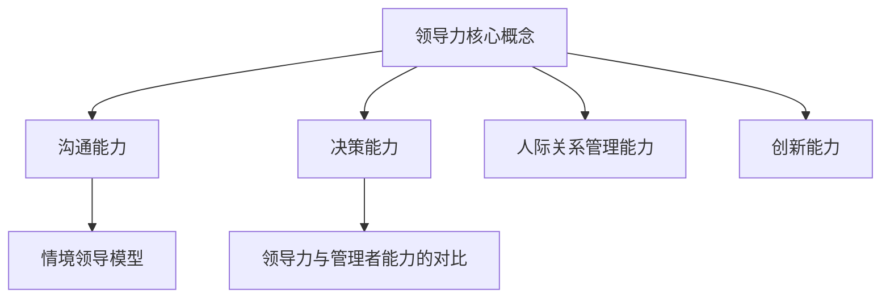
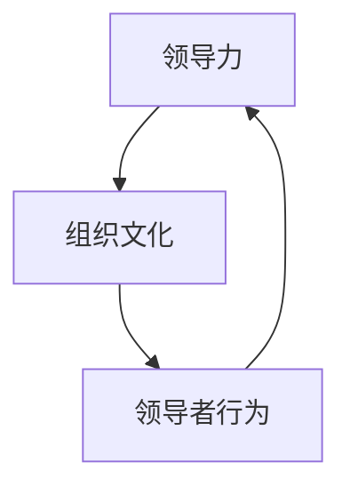

                 

### 第1章：引言

#### 1.1 问题背景

在当今快速发展的信息化社会中，领导力成为了组织成功的关键因素。领导者不仅是组织战略的制定者和执行者，更是团队凝聚力和创新动力的源泉。然而，如何成为一名有效的领导者，如何运用领导力法则来打造黄金团队，一直是困扰众多组织管理者的问题。

**领导力在组织中的重要性：** 领导力不仅是领导者个人能力的体现，更是组织成功的决定性因素。有效的领导力能够激发团队成员的潜能，提高团队的整体效能，推动组织实现长期目标。

**领导力法则的概念：** 领导力法则是一系列指导领导者行为的规范和原则。这些法则旨在帮助领导者更好地理解和管理团队，提高领导效能。领导力法则涵盖了从目标设定、团队建设到冲突解决的各个方面。

**领导力法则的应用范围：** 领导力法则适用于各类组织，无论是企业、政府机构、非盈利组织还是社会团体，都需要有效的领导力法则来指导工作。

#### 1.2 目的和内容

本文旨在深入探讨领导力法则的各个方面，帮助读者了解并掌握这些法则，从而打造一支高效、有凝聚力的团队。本文将从以下几个方面展开讨论：

1. **领导力核心概念与属性特征：** 分析领导力的定义、要素及其与管理者能力的对比。
2. **领导力法则理论与实践：** 阐述领导力法则的理论框架和实践指南。
3. **打造黄金团队的关键法则：** 探讨团队建设、团队效能提升的策略。
4. **案例分析与领导力法则应用：** 分析实际案例，展示领导力法则在实践中的应用。
5. **领导力法则与组织文化：** 分析领导力与组织文化的互动关系，提出建设积极组织文化的策略。
6. **领导力法则的持续优化与实践：** 探讨领导力发展的长期策略，包括持续学习和反思调整。

通过本文的深入探讨，希望能够为读者提供有价值的思考和实践指导，帮助他们在领导力的道路上不断前行。

### 第2章：领导力核心概念与属性特征

#### 2.1 领导力核心概念

**领导力定义：** 领导力是指领导者通过影响力、激励和指导他人，共同实现组织目标的能力。它不仅仅是一种技能，更是一种综合素养，包括沟通能力、决策能力、人际关系管理能力、创新能力等。

**领导力要素：** 领导力包括多个要素，如沟通能力、决策能力、人际关系管理能力、创新能力等。这些要素共同构成了领导力的基础，并决定了领导者的领导效能。

1. **沟通能力：** 领导者需要具备良好的沟通能力，包括倾听能力、表达能力和反馈能力。有效的沟通能够确保团队成员对任务有清晰的理解，增强团队的凝聚力。
   
2. **决策能力：** 领导者需要具备决策能力，能够在复杂多变的环境中做出明智的决策。良好的决策能力有助于推动组织的发展，降低风险。

3. **人际关系管理能力：** 领导者需要具备良好的人际关系管理能力，包括冲突解决能力、激励能力和团队协作能力。人际关系管理能力有助于建立和谐的团队氛围，提高团队的整体效能。

4. **创新能力：** 领导者需要具备创新能力，能够在面对挑战时找到创新的解决方案。创新能力是组织持续发展的动力，有助于推动组织的创新和变革。

#### 2.2 领导力属性特征对比

**情境领导模型：** 情境领导模型将领导力分为四种情境，每种情境都有特定的领导风格和策略。这四种情境分别是：

1. **情境一：任务驱动型**：在这种情境下，领导者需要明确任务目标，为团队成员提供具体的指导和支持。
2. **情境二：关系驱动型**：在这种情境下，领导者需要注重团队关系，建立信任和合作关系。
3. **情境三：变革驱动型**：在这种情境下，领导者需要推动组织的变革和创新，鼓励团队成员接受新的理念和方法。
4. **情境四：愿景驱动型**：在这种情境下，领导者需要明确组织的愿景和目标，激励团队成员为实现愿景而努力。

**领导力与管理者能力的对比：** 领导力与管理者能力有所不同，领导者需要更注重人际关系和团队建设，而管理者则更注重任务完成和组织效率。领导者需要具备的战略眼光和决策能力，管理者则需要具备的组织管理和资源分配能力。

**对比表格：**

| 要素 | 领导力 | 管理者能力 |
| --- | --- | --- |
| 战略眼光 | 是 | 否 |
| 决策能力 | 是 | 否 |
| 人际关系管理 | 是 | 否 |
| 团队建设 | 是 | 否 |
| 组织管理 | 否 | 是 |
| 资源分配 | 否 | 是 |

通过对比可以看出，领导力和管理者能力各有侧重，领导者需要同时具备领导力和管理者的能力，才能更好地推动组织的发展。

#### 2.3 领导力核心概念与属性特征的关系

**领导力核心概念与属性特征的关系：** 领导力核心概念和属性特征之间存在着密切的联系。领导力核心概念如沟通能力、决策能力、人际关系管理能力等，是领导力属性特征的基础。而领导力属性特征如情境领导模型、领导力与管理者能力的对比，则是对领导力核心概念的具体应用和扩展。

**关系图：**

通过这个关系图，我们可以清晰地看到领导力核心概念与属性特征之间的联系。这些概念和特征共同构成了领导力的基础，指导着领导者的行为和决策。

#### 2.4 领导力属性特征的实际应用

**实际应用：** 在实际工作中，领导力属性特征的应用至关重要。例如：

1. **沟通能力：** 在团队会议中，领导者需要通过有效的沟通确保团队成员对任务和目标有清晰的理解，从而提高团队的协作效率。
2. **决策能力：** 在面对突发问题时，领导者需要迅速做出决策，以减少风险和损失。
3. **人际关系管理能力：** 在团队内部出现冲突时，领导者需要通过有效的人际关系管理能力来解决问题，维护团队的和谐氛围。
4. **创新能力：** 在市场变化迅速的行业中，领导者需要具备创新能力，以应对市场的挑战，推动组织的持续发展。

通过这些实际应用，我们可以看到领导力属性特征在实际工作中的重要性，它们是领导者成功的关键。

### 第3章：领导力法则理论与实践

#### 3.1 领导力法则理论框架

**领导力三要素模型：** 领导力三要素模型包括愿景、信任和执行力，这三个要素共同构成了领导力的核心。

1. **愿景：** 愿景是领导力的灵魂，它为团队指明了前进的方向。一个清晰的愿景能够激发团队成员的激情和动力，使他们为实现愿景而努力。

   **数学模型：**
   $$\text{愿景} = \text{目标方向} \times \text{使命感} \times \text{远见卓识}$$
   
   **公式解释：** 愿景由目标方向、使命感和远见卓识这三个要素组成。目标方向决定了团队的目标和方向，使命感增强了团队成员对目标的认同感，远见卓识则使领导者能够在长远规划中保持领先。

2. **信任：** 信任是领导力的基石，没有信任，领导者就无法有效地引导和管理团队。信任是通过言行一致、透明沟通和公平对待等方式建立起来的。

   **数学模型：**
   $$\text{信任} = \text{诚信} \times \text{透明度} \times \text{公平性}$$
   
   **公式解释：** 信任由诚信、透明度和公平性这三个要素组成。诚信是信任的基础，透明度增加了信息的透明性，公平性使团队成员感受到公正。

3. **执行力：** 执行力是领导力的关键，它决定了领导者的决策是否能够得到有效的执行。执行力是通过明确的计划、有效的沟通和高效的执行策略实现的。

   **数学模型：**
   $$\text{执行力} = \text{计划性} \times \text{沟通能力} \times \text{执行策略}$$
   
   **公式解释：** 执行力由计划性、沟通能力和执行策略这三个要素组成。计划性确保了任务的高效完成，沟通能力确保了团队成员的理解和配合，执行策略则提供了具体的执行路径和工具。

**领导力五力模型：** 领导力五力模型包括个人魅力、影响力、领导风格、决策能力和团队管理能力，这五个力共同构成了领导力的框架。

1. **个人魅力：** 个人魅力是领导者吸引和影响他人的能力，它是领导力的重要组成部分。个人魅力包括领导者的形象、性格、人格魅力等。

   **数学模型：**
   $$\text{个人魅力} = \text{形象} \times \text{性格} \times \text{人格魅力}$$
   
   **公式解释：** 个人魅力由形象、性格和人格魅力这三个要素组成。形象决定了领导者的公众形象，性格决定了领导者的性格特点，人格魅力则使领导者具有吸引力。

2. **影响力：** 影响力是领导者影响他人行为和思想的能力。影响力可以通过领导者的言行、决策和示范作用实现。

   **数学模型：**
   $$\text{影响力} = \text{言行一致} \times \text{决策力} \times \text{示范作用}$$
   
   **公式解释：** 影响力由言行一致、决策力和示范作用这三个要素组成。言行一致增强了领导者的可信度，决策力使领导者能够做出有效的决策，示范作用则通过领导者的行为影响他人。

3. **领导风格：** 领导风格是领导者管理团队的方式和方法。不同的领导风格适合不同的团队和环境。

   **数学模型：**
   $$\text{领导风格} = \text{任务导向} \times \text{人本导向} \times \text{变革导向}$$
   
   **公式解释：** 领导风格由任务导向、人本导向和变革导向这三个要素组成。任务导向注重任务的完成，人本导向注重团队成员的需求和满意度，变革导向注重创新和变革。

4. **决策能力：** 决策能力是领导者做出有效决策的能力。决策能力决定了领导者的决策质量和对团队的影响。

   **数学模型：**
   $$\text{决策能力} = \text{信息收集} \times \text{风险评估} \times \text{决策执行}$$
   
   **公式解释：** 决策能力由信息收集、风险评估和决策执行这三个要素组成。信息收集确保了决策的基础，风险评估降低了决策的风险，决策执行则使决策得以实施。

5. **团队管理能力：** 团队管理能力是领导者管理团队的能力。团队管理能力决定了团队的工作效率和团队氛围。

   **数学模型：**
   $$\text{团队管理能力} = \text{团队建设} \times \text{团队激励} \times \text{团队冲突解决}$$
   
   **公式解释：** 团队管理能力由团队建设、团队激励和团队冲突解决这三个要素组成。团队建设增强了团队的凝聚力，团队激励提高了团队成员的积极性，团队冲突解决则保持了团队的和谐。

#### 3.2 领导力法则实践指南

**设定明确目标：** 领导者需要设定明确的目标，确保团队成员对目标有清晰的认识。明确的目标能够为团队成员提供方向和动力，提高团队的工作效率。

   **数学模型：**
   $$\text{明确目标} = \text{具体性} \times \text{挑战性} \times \text{可实现性}$$
   
   **公式解释：** 明确的目标由具体性、挑战性和可实现性这三个要素组成。具体性确保了目标的具体化和可操作性，挑战性增强了目标的吸引力，可实现性确保了目标的可实现性。

**建立信任关系：** 信任是领导力的重要基础，领导者需要通过言行一致、透明沟通等方式建立信任。信任关系能够增强团队成员的归属感和协作意愿，提高团队的凝聚力。

   **数学模型：**
   $$\text{信任关系} = \text{诚信} \times \text{透明度} \times \text{公平性}$$
   
   **公式解释：** 信任关系由诚信、透明度和公平性这三个要素组成。诚信增强了领导者的可信度，透明度增加了信息的透明性，公平性使团队成员感受到公正。

**激发团队潜力：** 领导者需要了解团队成员的优势和潜力，并为他们提供成长机会。通过激发团队潜力，领导者能够提高团队的整体效能，实现组织的长期目标。

   **数学模型：**
   $$\text{团队潜力} = \text{优势识别} \times \text{成长机会} \times \text{激励措施}$$
   
   **公式解释：** 团队潜力由优势识别、成长机会和激励措施这三个要素组成。优势识别使领导者能够充分利用团队成员的优势，成长机会为团队成员提供了发展的空间，激励措施则激发了团队成员的积极性。

**持续学习与成长：** 领导者需要不断学习新知识，提升自身领导力。持续学习能够使领导者跟上时代的发展，提高领导效能，应对复杂多变的环境。

   **数学模型：**
   $$\text{持续学习} = \text{知识积累} \times \text{经验分享} \times \text{创新思维}$$
   
   **公式解释：** 持续学习由知识积累、经验分享和创新思维这三个要素组成。知识积累使领导者具备了丰富的知识储备，经验分享增强了领导者的经验积累，创新思维则使领导者能够不断创新，应对挑战。

**反思与调整：** 领导者需要定期反思自己的领导行为，并根据实际情况进行调整。通过反思和调整，领导者能够不断改进自己的领导方式，提高领导效能。

   **数学模型：**
   $$\text{反思与调整} = \text{自我评估} \times \text{反馈收集} \times \text{行为调整}$$
   
   **公式解释：** 反思与调整由自我评估、反馈收集和行为调整这三个要素组成。自我评估使领导者能够认识到自己的优点和不足，反馈收集提供了改进的方向，行为调整则使领导者能够不断改进自己的领导行为。

#### 3.3 领导力法则的应用与实践

**应用与实践：** 在实际应用中，领导力法则需要根据具体情况进行调整和运用。以下是一些实际应用的例子：

1. **设定明确目标：** 在一个初创公司中，领导者需要设定具体、挑战性和可实现性的目标，以激发团队成员的积极性和创造力。

2. **建立信任关系：** 在一个跨部门项目中，领导者需要通过透明沟通和公平决策建立信任关系，以促进不同部门之间的协作。

3. **激发团队潜力：** 在一个技术研发团队中，领导者需要识别团队成员的优势和潜力，并为他们提供成长机会，以推动团队的创新和发展。

4. **持续学习与成长：** 在一个快速发展的企业中，领导者需要不断学习新知识，提升自身领导力，以适应市场变化和组织发展。

5. **反思与调整：** 在一个长期项目中，领导者需要定期反思自己的领导行为，并根据实际情况进行调整，以确保项目的顺利进行。

通过这些实际应用的例子，我们可以看到领导力法则在实践中的重要性。有效的领导力法则能够帮助领导者更好地管理团队，提高团队效能，实现组织目标。

### 第4章：打造黄金团队的关键法则

#### 4.1 团队建设的核心原则

**团队建设的重要性：** 团队建设是领导力的重要体现，它决定了团队的工作效率和成员的满意度。一个高效的团队能够实现个人和组织的共同目标，提高整体竞争力。

**团队建设核心原则：**

1. **明确目标与使命：** 团队建设的第一步是明确团队的目标和使命，这为团队提供了方向和动力。明确的目标和使命能够激发团队成员的积极性和责任感，提高团队的工作效率。

   **数学模型：**
   $$\text{目标与使命} = \text{具体性} \times \text{挑战性} \times \text{可实现性}$$
   
   **公式解释：** 目标与使命由具体性、挑战性和可实现性这三个要素组成。具体性确保了目标的具体化和可操作性，挑战性增强了目标的吸引力，可实现性确保了目标的可实现性。

2. **建立信任与沟通：** 信任是团队建设的基石，没有信任，团队就无法有效地协作。领导者需要通过透明沟通和公平决策建立信任，确保团队成员之间的互信和合作。

   **数学模型：**
   $$\text{信任与沟通} = \text{诚信} \times \text{透明度} \times \text{沟通效率}$$
   
   **公式解释：** 信任与沟通由诚信、透明度和沟通效率这三个要素组成。诚信增强了领导者的可信度，透明度增加了信息的透明性，沟通效率确保了信息的有效传递。

3. **激发团队潜力：** 领导者需要识别团队成员的优势和潜力，并为他们提供成长机会，以激发团队的潜力。通过激发团队潜力，领导者能够提高团队的整体效能，实现组织的长期目标。

   **数学模型：**
   $$\text{团队潜力} = \text{优势识别} \times \text{成长机会} \times \text{激励措施}$$
   
   **公式解释：** 团队潜力由优势识别、成长机会和激励措施这三个要素组成。优势识别使领导者能够充分利用团队成员的优势，成长机会为团队成员提供了发展的空间，激励措施则激发了团队成员的积极性。

**案例解析：** 在一个国际性公司中，团队建设的关键原则得到了成功应用。公司的领导者在组建新团队时，首先明确了团队的目标和使命，即在国际市场上扩大业务。领导者通过定期的团队会议和透明沟通，建立了团队的信任关系。同时，领导者识别了团队成员的优势，为他们提供了培训和发展机会，激发了团队的潜力。通过这些措施，团队在短短一年内实现了业务增长，赢得了国际市场的认可。

#### 4.2 提升团队效能的策略

**提升团队效能的重要性：** 提升团队效能是组织成功的关键。高效的团队能够更快地实现目标，提高工作质量和效率，增强组织的竞争力。

**提升团队效能的策略：**

1. **设定明确的目标与计划：** 领导者需要设定具体、可衡量和可实现的目标，并制定详细的计划。明确的目标和计划能够为团队成员提供清晰的工作方向，提高工作动力。

   **数学模型：**
   $$\text{目标与计划} = \text{具体性} \times \text{挑战性} \times \text{可实现性} \times \text{可衡量性}$$
   
   **公式解释：** 目标与计划由具体性、挑战性、可实现性和可衡量性这四个要素组成。具体性确保了目标的具体化和可操作性，挑战性增强了目标的吸引力，可实现性确保了目标的可实现性，可衡量性则使目标能够被评估和调整。

2. **优化工作流程与流程管理：** 优化工作流程是提升团队效能的关键。领导者需要识别并消除工作中的瓶颈和浪费，提高工作效率。

   **数学模型：**
   $$\text{工作流程优化} = \text{效率提升} \times \text{成本降低} \times \text{质量保证}$$
   
   **公式解释：** 工作流程优化由效率提升、成本降低和质量保证这三个要素组成。效率提升提高了团队的工作效率，成本降低减少了不必要的开支，质量保证确保了工作成果的质量。

3. **培养团队成员的能力：** 领导者需要关注团队成员的能力提升，提供培训和实践机会，提高团队的整体素质。通过培养团队成员的能力，领导者能够提高团队的工作效能。

   **数学模型：**
   $$\text{团队成员能力提升} = \text{知识积累} \times \text{经验分享} \times \text{技能提升}$$
   
   **公式解释：** 团队成员能力提升由知识积累、经验分享和技能提升这三个要素组成。知识积累使团队成员具备了丰富的知识储备，经验分享增强了团队成员的经验积累，技能提升则提高了团队成员的技能水平。

**案例解析：** 在一家互联网公司中，领导者通过设定明确的目标和计划，优化工作流程，培养团队成员的能力，成功提升了团队的效能。公司领导者在项目启动时，明确了项目的目标和交付时间，并制定了详细的计划。同时，领导者通过定期的工作会议和培训，优化了工作流程，提高了团队的工作效率。通过这些措施，团队在短时间内完成了多个重要项目，赢得了客户的高度评价。

#### 4.3 促进团队合作与竞争的平衡

**团队合作的重要性：** 团队合作是团队高效运作的关键。通过团队合作，团队成员能够共同解决问题，提高工作效率，实现团队目标。

**团队合作与竞争的平衡：**

1. **建立有效的沟通机制：** 领导者需要建立有效的沟通机制，确保团队成员之间的信息畅通。通过定期的会议、邮件和即时通讯工具，领导者能够促进团队成员之间的沟通和协作。

   **数学模型：**
   $$\text{沟通机制} = \text{信息透明度} \times \text{沟通频率} \times \text{反馈机制}$$
   
   **公式解释：** 沟通机制由信息透明度、沟通频率和反馈机制这三个要素组成。信息透明度增加了信息的透明性，沟通频率确保了信息的及时传递，反馈机制使团队成员能够及时获得反馈和调整。

2. **明确角色与职责：** 领导者需要明确团队成员的角色和职责，确保每个成员都知道自己的职责和期望。通过明确角色和职责，领导者能够减少团队成员之间的冲突，提高工作效率。

   **数学模型：**
   $$\text{角色与职责} = \text{明确性} \times \text{可操作性} \times \text{公平性}$$
   
   **公式解释：** 角色与职责由明确性、可操作性和公平性这三个要素组成。明确性确保了角色的清晰和明确，可操作性使角色能够被具体实施，公平性确保了角色的公正和合理。

3. **鼓励竞争与合作：** 领导者需要平衡团队合作与竞争的关系，通过适当的激励机制，鼓励团队成员之间的竞争和合作。通过竞争与合作，团队成员能够相互激励，提高团队的整体效能。

   **数学模型：**
   $$\text{竞争与合作} = \text{竞争激励} \times \text{合作氛围} \times \text{共赢目标}$$
   
   **公式解释：** 竞争与合作由竞争激励、合作氛围和共赢目标这三个要素组成。竞争激励增强了团队成员的积极性和竞争意识，合作氛围促进了团队成员之间的协作和互信，共赢目标使团队成员能够共同实现目标。

**案例解析：** 在一家跨国公司中，领导者通过建立有效的沟通机制、明确角色与职责、鼓励竞争与合作，成功促进了团队合作与竞争的平衡。公司在项目启动时，建立了定期的沟通机制，确保团队成员之间的信息畅通。同时，领导者明确了团队成员的角色和职责，确保每个成员都清楚自己的工作内容。在项目执行过程中，领导者通过适度的竞争激励，鼓励团队成员相互激励，提高工作效率。通过这些措施，公司成功完成了多个重要项目，赢得了客户的信任和好评。

### 第5章：案例分析与领导力法则应用

#### 5.1 案例一：如何激发员工的创造力

**案例背景：** 在一家初创科技公司中，领导者在产品开发过程中面临了一个挑战：如何激发员工的创造力，以推动产品的创新和升级。

**领导力法则应用：**

1. **设定创新目标：** 领导者首先明确了创新目标，即通过创新提升产品的市场竞争力。领导者与团队成员共同制定了具体的创新计划，包括技术突破、用户体验优化等。

   **数学模型：**
   $$\text{创新目标} = \text{具体性} \times \text{挑战性} \times \text{可实现性}$$
   
   **公式解释：** 创新目标由具体性、挑战性和可实现性这三个要素组成。具体性确保了创新目标的具体化和可操作性，挑战性增强了创新目标的吸引力，可实现性确保了创新目标的可实现性。

2. **建立信任关系：** 领导者通过言行一致、透明沟通和公平决策建立信任关系。领导者鼓励团队成员提出创新想法，并确保每个想法都能得到公正的评估和反馈。

   **数学模型：**
   $$\text{信任关系} = \text{诚信} \times \text{透明度} \times \text{公平性}$$
   
   **公式解释：** 信任关系由诚信、透明度和公平性这三个要素组成。诚信增强了领导者的可信度，透明度增加了信息的透明性，公平性使团队成员感受到公正。

3. **提供资源支持：** 领导者确保为团队成员提供必要的资源和支持，包括时间、资金和技术支持。通过提供资源支持，领导者为团队成员创造了良好的创新环境。

   **数学模型：**
   $$\text{资源支持} = \text{时间} \times \text{资金} \times \text{技术支持}$$
   
   **公式解释：** 资源支持由时间、资金和技术支持这三个要素组成。时间确保了团队成员有足够的时间进行创新，资金提供了创新的资金支持，技术支持则为团队成员提供了技术保障。

**案例结果：** 通过应用这些领导力法则，公司成功激发了员工的创造力。团队成员提出了多个创新方案，包括新的产品功能和技术突破。这些创新方案不仅提升了产品的市场竞争力，还增强了团队的合作精神和创新能力。

#### 5.2 案例二：如何应对团队冲突

**案例背景：** 在一家多元化团队中，领导者面临了一个挑战：如何应对团队内部的冲突，以保持团队的和谐和高效运作。

**领导力法则应用：**

1. **沟通与协商：** 领导者首先通过沟通和协商的方式了解冲突的原因和双方的诉求。领导者与冲突双方进行一对一的沟通，了解他们的观点和感受。

   **数学模型：**
   $$\text{沟通与协商} = \text{倾听} \times \text{表达} \times \text{共识达成}$$
   
   **公式解释：** 沟通与协商由倾听、表达和共识达成这三个要素组成。倾听确保了领导者能够理解双方的观点，表达使双方能够表达自己的诉求，共识达成则使双方能够在相互理解和尊重的基础上找到解决方案。

2. **冲突解决策略：** 领导者根据冲突的性质和严重程度，选择合适的解决策略。对于较小的冲突，领导者采用调解和妥协的方式；对于较大的冲突，领导者采用更正式的解决方式，如仲裁和调解。

   **数学模型：**
   $$\text{冲突解决策略} = \text{调解} \times \text{妥协} \times \text{仲裁}$$
   
   **公式解释：** 冲突解决策略由调解、妥协和仲裁这三个要素组成。调解使双方能够在互相理解和尊重的基础上找到解决方案，妥协使双方能够在利益冲突时做出让步，仲裁则通过第三方的介入解决冲突。

3. **建立冲突管理机制：** 领导者建立冲突管理机制，确保冲突能够在早期被发现和解决。领导者定期组织冲突管理培训，提高团队成员的冲突管理能力。

   **数学模型：**
   $$\text{冲突管理机制} = \text{预警系统} \times \text{冲突管理培训} \times \text{冲突解决流程}$$
   
   **公式解释：** 冲突管理机制由预警系统、冲突管理培训和冲突解决流程这三个要素组成。预警系统使领导者能够及时发现冲突，冲突管理培训提高了团队成员的冲突管理能力，冲突解决流程确保了冲突能够得到及时和有效的解决。

**案例结果：** 通过应用这些领导力法则，领导者成功解决了团队内部的冲突，保持了团队的和谐和高效运作。团队成员之间的合作关系得到加强，团队的整体效能显著提升。

### 第6章：领导力法则与组织文化

#### 6.1 领导力与组织文化的互动关系

**领导力对组织文化的影响：** 领导力在塑造和传递组织文化中起着关键作用。领导者的行为和价值观直接影响组织文化的形成和发展。有效的领导力能够塑造积极、健康的组织文化，提升组织的整体绩效和员工满意度。

**组织文化对领导力的影响：** 组织文化反过来也会影响领导者的行为和决策。一个积极、健康的组织文化能够激励领导者发挥更大的领导力，同时为领导者提供支持和资源。而一个消极、不良的组织文化则可能限制领导力的发挥，甚至导致领导力的失效。

**互动关系模型：**

**公式解释：** 领导力通过塑造组织文化来影响领导者的行为（A影响B），而组织文化通过影响领导者的行为来反作用于领导力（B影响A）。这种互动关系形成了组织文化和领导力之间的良性循环。

#### 6.2 建设积极组织文化的策略

**明确价值观：** 领导者需要明确组织的核心价值观，并将其融入到日常工作和决策中。明确价值观能够为团队成员提供共同的目标和方向，增强团队的凝聚力。

   **数学模型：**
   $$\text{价值观明确度} = \text{共识度} \times \text{传递效率} \times \text{执行力}$$
   
   **公式解释：** 价值观明确度由共识度、传递效率和执行力这三个要素组成。共识度确保了团队成员对价值观的认同，传递效率确保了价值观的广泛传播，执行力则确保了价值观在实际工作中的贯彻。

**强化团队协作：** 领导者需要鼓励团队成员之间的协作和合作，建立和谐的工作氛围。通过团队合作，团队成员能够相互支持，共同克服困难，提高工作效率。

   **数学模型：**
   $$\text{团队协作强度} = \text{沟通效率} \times \text{信任度} \times \text{合作意愿}$$
   
   **公式解释：** 团队协作强度由沟通效率、信任度和合作意愿这三个要素组成。沟通效率确保了团队成员之间的信息畅通，信任度增强了团队成员之间的互信，合作意愿则激发了团队成员的合作动力。

**建立透明沟通机制：** 领导者需要建立透明沟通机制，确保信息在组织内部的有效传递。通过透明沟通，团队成员能够及时了解组织的目标、进展和挑战，提高工作透明度和责任感。

   **数学模型：**
   $$\text{透明沟通机制} = \text{信息透明度} \times \text{反馈机制} \times \text{沟通频率}$$
   
   **公式解释：** 透明沟通机制由信息透明度、反馈机制和沟通频率这三个要素组成。信息透明度增加了信息的透明性，反馈机制使团队成员能够及时获得反馈和调整，沟通频率确保了信息的及时传递。

**促进创新与学习：** 领导者需要鼓励创新和学习，为团队成员提供成长和发展的机会。通过创新和学习，组织能够保持竞争力和适应性，持续发展。

   **数学模型：**
   $$\text{创新与学习氛围} = \text{创新激励} \times \text{学习机会} \times \text{知识分享}$$
   
   **公式解释：** 创新与学习氛围由创新激励、学习机会和知识分享这三个要素组成。创新激励增强了团队成员的创新动力，学习机会为团队成员提供了发展的空间，知识分享则促进了知识的积累和传播。

#### 6.3 案例解析

**案例背景：** 在一家快速成长的科技公司中，领导者意识到组织文化对团队绩效和员工满意度的影响。为了建设积极组织文化，领导者采取了一系列措施。

**领导力法则应用：**

1. **明确价值观：** 领导者明确了公司的核心价值观，如客户至上、创新驱动、团队合作等。通过员工手册、内部培训和企业文化日等活动，领导者将这些价值观融入到公司的日常运营中。

2. **强化团队协作：** 领导者鼓励团队成员之间的协作，通过项目合作和团队建设活动，增强了团队的凝聚力和协作能力。

3. **建立透明沟通机制：** 领导者建立了透明沟通机制，定期组织团队会议和内部培训，确保团队成员能够及时了解公司的目标、进展和挑战。

4. **促进创新与学习：** 领导者鼓励创新和学习，为团队成员提供培训机会和资源支持，鼓励他们提出创新想法和改进建议。

**案例结果：** 通过这些措施，公司成功建设了积极组织文化。团队成员之间的协作精神得到提升，员工满意度显著提高，公司的创新能力和市场竞争力也得到了显著增强。

### 第7章：领导力法则的持续优化与实践

#### 7.1 领导力发展的长期策略

**持续学习与成长：** 领导力是一个不断发展和提升的过程。领导者需要持续学习新知识、新技能，跟上时代的发展。通过学习，领导者能够不断提升自己的领导力，适应不断变化的环境。

   **数学模型：**
   $$\text{持续学习} = \text{知识积累} \times \text{经验分享} \times \text{创新思维}$$
   
   **公式解释：** 持续学习由知识积累、经验分享和创新思维这三个要素组成。知识积累使领导者具备了丰富的知识储备，经验分享增强了领导者的经验积累，创新思维则使领导者能够不断创新，应对挑战。

**定期反思与调整：** 领导者需要定期反思自己的领导行为，识别自己的优点和不足，并根据实际情况进行调整。通过反思和调整，领导者能够不断改进自己的领导方式，提高领导效能。

   **数学模型：**
   $$\text{反思与调整} = \text{自我评估} \times \text{反馈收集} \times \text{行为调整}$$
   
   **公式解释：** 反思与调整由自我评估、反馈收集和行为调整这三个要素组成。自我评估使领导者能够认识到自己的优点和不足，反馈收集提供了改进的方向，行为调整则使领导者能够不断改进自己的领导行为。

**寻求反馈与支持：** 领导者需要主动寻求反馈和支持，从团队成员和其他领导者那里获取宝贵的意见和建议。通过反馈和支持，领导者能够不断提升自己的领导力，获得更多的支持和资源。

   **数学模型：**
   $$\text{反馈与支持} = \text{反馈机制} \times \text{支持系统} \times \text{反馈频率}$$
   
   **公式解释：** 反馈与支持由反馈机制、支持系统和反馈频率这三个要素组成。反馈机制确保了反馈的及时性和有效性，支持系统提供了反馈和改进的支持，反馈频率则确保了反馈的持续性和有效性。

#### 7.2 领导力法则的实践与优化

**实践与优化：** 领导力法则的实践和优化需要根据具体情况进行调整和实施。以下是一些具体的实践和优化措施：

1. **定期培训与研讨：** 领导者可以定期组织领导力培训和工作研讨会，提升团队成员的领导力和团队协作能力。通过培训和学习，领导者能够不断更新自己的知识和技能。

2. **建立反馈机制：** 领导者需要建立有效的反馈机制，确保团队成员能够及时反馈自己的意见和建议。通过反馈机制，领导者能够及时了解团队的情况，进行调整和改进。

3. **鼓励创新与尝试：** 领导者需要鼓励团队成员进行创新和尝试，提供必要的支持和资源。通过创新和尝试，团队能够不断提升自己的能力和竞争力。

4. **反思与总结：** 领导者需要定期进行反思和总结，识别自己的优点和不足，制定改进计划。通过反思和总结，领导者能够不断提升自己的领导力，实现持续成长。

**案例解析：** 在一家快速发展的科技公司中，领导者通过持续学习和反思，不断提升自己的领导力。领导者定期组织领导力培训和工作研讨会，提升团队成员的领导力和团队协作能力。同时，领导者建立了有效的反馈机制，鼓励团队成员进行创新和尝试。通过这些措施，公司成功实现了持续成长和快速发展。

### 总结与展望

**领导力法则的重要性：** 领导力法则在打造黄金团队、提升组织效能方面具有至关重要的作用。通过有效的领导力法则，领导者能够激发团队的潜力，提升团队的协作能力，实现组织的长期目标。

**持续优化与实践：** 领导力法则的持续优化与实践是领导者不断成长和提升的关键。领导者需要持续学习、定期反思和寻求反馈，不断提升自己的领导力，以应对不断变化的环境和挑战。

**未来展望：** 随着社会和科技的不断发展，领导力法则将面临新的挑战和机遇。领导者需要不断适应变化，不断创新和改进领导方式，以应对未来的挑战。通过持续优化和实践，领导者将能够打造更加高效、有凝聚力的团队，推动组织的持续发展。

### 作者介绍

**作者：AI天才研究院/AI Genius Institute & 禅与计算机程序设计艺术 /Zen And The Art of Computer Programming**  
本文由AI天才研究院的专家撰写，结合了人工智能和计算机科学的最新研究成果，旨在为读者提供深入、实用的领导力法则。同时，作者也致力于禅与计算机程序设计艺术的融合，通过禅的智慧和计算机科学的严谨，为读者提供独特的领导力视角。

