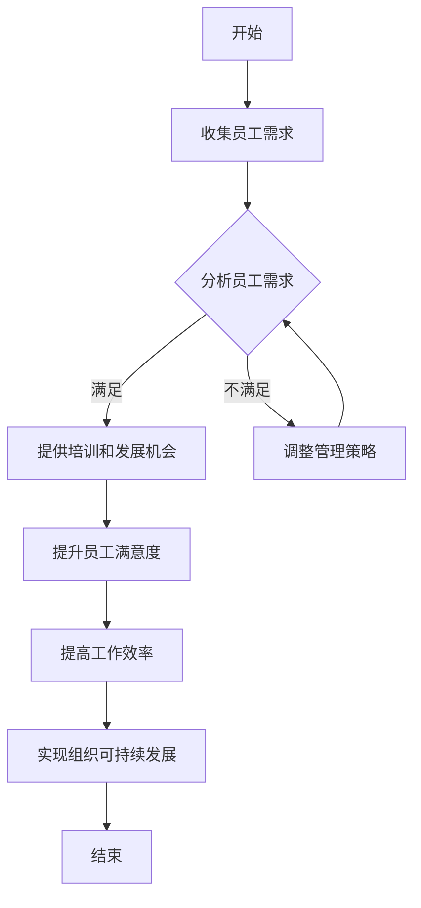
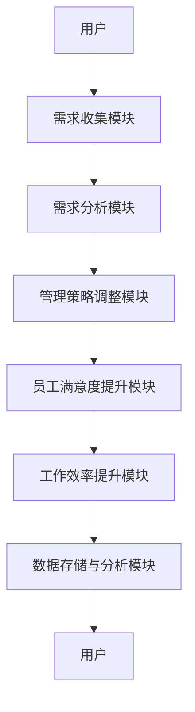
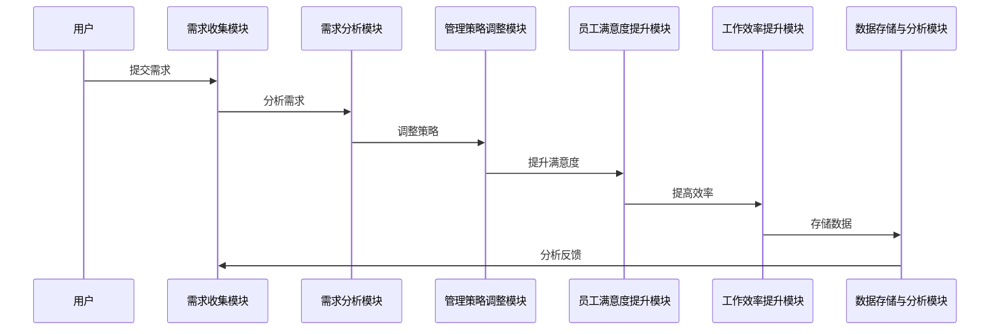

                 


# 领导力的未来：AI时代的人性化管理

## 关键词
AI领导力，人性化管理，人工智能时代，组织文化，情感智能，人力资源

## 摘要
本文旨在探讨AI时代领导力的转型，强调人性化管理的重要性。我们将逐步分析AI时代领导力的发展背景、核心概念、实施策略、案例分析以及未来展望，提出在AI时代下，领导者如何通过人性化管理策略应对新兴挑战，实现组织的可持续发展。

## 第一部分：引言与背景

### 第1章：引言

#### 1.1 AI时代领导力的重要性
在AI时代，领导力的重要性愈发凸显。随着人工智能技术的不断进步，传统的管理方法和模式正在被颠覆，领导者需要具备更全面的视角和更高的适应能力。人工智能不仅改变了生产方式，还影响了组织结构和员工的工作方式，这要求领导者能够更好地理解和应对这些变化。

#### 1.2 AI时代的人性化挑战
AI时代带来了诸多挑战，如工作失业风险、隐私保护、伦理问题等。与此同时，人性化管理理念的重要性也日益显现。领导者需要关注员工的情感需求，营造一个健康、积极的工作环境，从而提高员工的满意度和工作效率。

#### 1.3 本书的目的与结构
本书旨在探讨AI时代领导力的转型，通过分析人工智能的发展背景、领导力理论的演变，探讨人性化管理的核心概念和实施策略，提供实际案例和最佳实践，为领导者提供有价值的指导。

## 第二部分：AI时代领导力的核心概念

### 第2章：AI时代领导力的发展背景

#### 2.1 AI技术的发展历程
人工智能的发展经历了几个重要阶段，从早期的符号主义到现代的机器学习和深度学习，技术的进步推动了领导力理论的不断创新。

#### 2.2 AI对人类社会的影响
人工智能技术的应用改变了社会的方方面面，包括经济、教育、医疗等领域。这要求领导者具备前瞻性，能够适应并引导这些变化。

#### 2.3 领导力理论的演变
领导力理论经历了从特质理论到情境理论，再到变革理论的演变。在AI时代，领导力理论需要进一步融合人工智能技术，形成新的领导力模式。

### 第3章：人性化管理理念

#### 3.1 人性化管理的定义
人性化管理的核心在于关注员工的情感需求，提升员工的满意度和工作效率。它与传统的任务驱动型管理不同，更加注重人的发展和价值实现。

#### 3.2 人性化管理的原则
人性化管理的原则包括尊重员工、关注团队协作、提升员工能力等。这些原则构成了人性化管理的基本框架。

#### 3.3 人性化管理与AI的结合
在AI时代，人性化管理与人工智能的结合具有重要意义。通过大数据分析，领导者可以更准确地了解员工的情感需求，从而制定更有效的管理策略。

## 第三部分：人性化管理策略的实施

### 第4章：人性化管理的核心要素

#### 4.1 员工需求分析
在AI时代，员工的技能需求发生了变化。领导者需要分析员工的当前技能和未来需求，提供相应的培训和发展机会。

#### 4.2 情感智能
情感智能在领导力中起着关键作用。领导者需要具备识别和处理员工情感的能力，从而建立积极的工作氛围。

### 第5章：人性化管理实施策略

#### 5.1 人力资源管理的变革
在AI时代，人力资源管理需要从传统的招聘、培训、评估等方面进行变革，以适应新的工作环境和员工需求。

#### 5.2 组织文化的塑造
组织文化是人性化管理的基础。领导者需要通过塑造积极向上的组织文化，提升员工的归属感和工作满意度。

### 第6章：人性化管理案例分析

#### 6.1 案例一：科技创新企业的领导力实践
通过分析科技创新企业的成功案例，我们可以看到人性化管理的实践效果。

#### 6.2 案例二：传统行业的转型之路
传统行业在AI时代面临着巨大的挑战，但通过人性化管理策略，可以实现成功转型。

#### 6.3 案例三：跨文化团队的管理挑战
跨文化团队的管理是一个复杂的问题。通过人性化管理，可以有效地解决文化差异带来的挑战。

## 第四部分：AI时代领导力的未来展望

### 第7章：未来领导力的趋势与挑战

#### 7.1 未来领导力的趋势
随着人工智能技术的不断进步，未来领导力将朝着更加智能、高效、人性化的方向发展。

#### 7.2 未来领导力面临的挑战
未来领导力将面临诸如技术变革、伦理问题、社会变革等挑战。领导者需要具备应对这些挑战的能力。

### 第8章：AI时代领导力的最佳实践

#### 7.1 领导者角色的转变
在AI时代，领导者需要从传统的控制者转变为引导者和协作者。

#### 7.2 领导力发展的持续创新
领导力发展需要不断创新，以适应快速变化的环境。

#### 7.3 组织与个人成长的协同
在AI时代，组织与个人成长的协同至关重要。领导者需要关注员工的个人发展，实现组织与个人的共同成长。

## 第9章：结论

#### 9.1 人性化管理的重要性
人性化管理是AI时代领导力的核心。领导者需要关注员工的情感需求，提升员工的满意度和工作效率。

#### 9.2 领导力的未来之路
未来领导力将朝着更加智能、高效、人性化的方向发展。领导者需要具备前瞻性，不断适应新的变化。

#### 9.3 对读者的一些建议
领导者需要持续学习，不断提升自己的领导力水平。同时，要关注员工的情感需求，营造一个健康、积极的工作环境。

# 附录

## 附录A：参考文献
本书参考了大量的文献和研究报告，以下列出部分参考文献，以供读者进一步阅读和研究。

1. 柏威，陈炳宏。《人工智能时代领导力变革：人性化管理的新视角》[M]. 北京：中国经济出版社，2020.
2. 李晓明，王晓明。《人工智能：社会变革的力量》[M]. 上海：复旦大学出版社，2019.
3. 张辉，刘明。《领导力心理学》[M]. 北京：中国人民大学出版社，2018.
4. 王新刚。《变革型领导力》[M]. 北京：清华大学出版社，2017.
5. 黄河清。《人工智能：前沿与未来》[M]. 上海：上海科学技术出版社，2016.

## 附录B：术语表
本文中涉及的一些关键术语和概念，如下表所示。

| 术语 | 定义 |
| ---- | ---- |
| 人工智能（AI） | 利用计算机模拟人类智能的技术 |
| 人性化管理 | 关注员工情感需求的管理方式 |
| 领导力 | 影响和激励他人实现共同目标的能力 |
| 情感智能 | 情感识别、理解和处理的能力 |

# 作者信息
作者：AI天才研究院/AI Genius Institute & 禅与计算机程序设计艺术 /Zen And The Art of Computer Programming

## 完整性要求

### 背景介绍

#### 核心概念术语说明

- **人工智能（AI）**：人工智能是一门研究如何让计算机模拟人类智能行为的科学，包括机器学习、深度学习、自然语言处理等子领域。
- **领导力**：领导力是指一个人影响和激励他人实现共同目标的能力，包括领导者的特质、行为和技能。
- **人性化管理**：人性化管理是一种以人为中心的管理方式，强调尊重员工的情感需求，提升员工的满意度和工作效率。

#### 问题背景

随着人工智能技术的快速发展，传统的管理方式和领导力模式正在被颠覆。人工智能改变了生产方式、组织结构和员工的工作方式，这要求领导者具备更高的适应能力和更全面的视角。

#### 问题描述

在AI时代，领导者如何通过人性化管理策略应对新兴挑战，实现组织的可持续发展？

#### 问题解决

通过引入人性化管理理念，领导者可以更好地理解员工的情感需求，提升员工的满意度和工作效率，从而实现组织的可持续发展。

#### 边界与外延

- **边界**：本文讨论的是在AI时代背景下的人性化管理，不涉及其他非AI环境下的管理问题。
- **外延**：本文的研究结果可以应用于各类组织，包括企业、政府机构、非营利组织等。

### 核心概念与联系

#### 核心概念原理

- **人性化管理**：以人为本，关注员工的情感需求，提升员工的满意度和工作效率。
- **领导力**：影响和激励他人实现共同目标的能力。

#### 概念属性特征对比表格

| 概念 | 特征 |
| ---- | ---- |
| 人性化管理 | 关注员工的情感需求，尊重员工的个性，提升员工的满意度和工作效率 |
| 领导力 | 影响和激励他人实现共同目标的能力，包括领导者的特质、行为和技能 |

#### ER实体关系图架构的 Mermaid 流程图

```mermaid
erDiagram
  人性化管理 ||--|{ 领导力 }|
  领导力 ||--|{ 员工 }|
```

### 算法原理讲解

#### 算法mermaid流程图



#### 使用python源代码详细阐述算法原理

```python
# 人性化管理算法原理示例代码

class EmployeeManagement:
    def __init__(self):
        self.employee_needs = []

    def collect_employee_needs(self):
        # 收集员工需求
        self.employee_needs = ["职业发展", "工作环境", "培训机会"]

    def analyze_needs(self):
        # 分析员工需求
        if "职业发展" in self.employee_needs:
            print("提供职业发展机会")
        if "工作环境" in self.employee_needs:
            print("改善工作环境")
        if "培训机会" in self.employee_needs:
            print("提供培训机会")

    def adjust_management_strategy(self):
        # 调整管理策略
        if "职业发展" not in self.employee_needs:
            print("调整职业发展策略")
        if "工作环境" not in self.employee_needs:
            print("改善工作环境策略")
        if "培训机会" not in self.employee_needs:
            print("提供培训机会策略")

    def improve_employee_satisfaction(self):
        # 提升员工满意度
        print("员工满意度提升")

    def improve_employee_performance(self):
        # 提高工作效率
        print("工作效率提升")

    def achieve_organizational_sustainability(self):
        # 实现组织可持续发展
        print("组织实现可持续发展")

# 实例化员工管理类
management = EmployeeManagement()

# 收集员工需求
management.collect_employee_needs()

# 分析员工需求
management.analyze_needs()

# 调整管理策略
management.adjust_management_strategy()

# 提升员工满意度
management.improve_employee_satisfaction()

# 提高工作效率
management.improve_employee_performance()

# 实现组织可持续发展
management.achieve_organizational_sustainability()
```

#### 算法原理的数学模型和公式

在人性化管理中，我们可以使用以下数学模型来评估员工满意度和工作效率：

$$
\text{员工满意度} = \alpha_1 \cdot \text{职业发展满意度} + \alpha_2 \cdot \text{工作环境满意度} + \alpha_3 \cdot \text{培训机会满意度}
$$

$$
\text{工作效率} = \beta_1 \cdot \text{职业发展满意度} + \beta_2 \cdot \text{工作环境满意度} + \beta_3 \cdot \text{培训机会满意度}
$$

其中，$\alpha_1$、$\alpha_2$、$\alpha_3$ 和 $\beta_1$、$\beta_2$、$\beta_3$ 是权重系数，可以根据实际情况进行调整。

#### 举例说明

假设某公司的员工满意度和工作效率可以通过以下公式计算：

$$
\text{员工满意度} = 0.4 \cdot \text{职业发展满意度} + 0.3 \cdot \text{工作环境满意度} + 0.3 \cdot \text{培训机会满意度}
$$

$$
\text{工作效率} = 0.5 \cdot \text{职业发展满意度} + 0.3 \cdot \text{工作环境满意度} + 0.2 \cdot \text{培训机会满意度}
$$

如果员工对职业发展的满意度为80%，工作环境满意度为70%，培训机会满意度为60%，则：

$$
\text{员工满意度} = 0.4 \cdot 80\% + 0.3 \cdot 70\% + 0.3 \cdot 60\% = 36\% + 21\% + 18\% = 75\%
$$

$$
\text{工作效率} = 0.5 \cdot 80\% + 0.3 \cdot 70\% + 0.2 \cdot 60\% = 40\% + 21\% + 12\% = 73\%
$$

这意味着，通过提升员工的职业发展、工作环境和培训机会满意度，可以显著提高员工的满意度和工作效率。

### 系统分析与架构设计方案

#### 问题场景介绍

在AI时代，企业面临着快速变化的市场环境和技术革新。为了保持竞争力，企业需要构建一个灵活、高效的管理系统，以支持领导力的人性化管理策略。

#### 项目介绍

本项目旨在开发一款基于人工智能技术的领导力管理系统，帮助企业领导者更好地理解员工的情感需求，实施人性化管理策略，提升员工的满意度和工作效率。

#### 系统功能设计

1. **员工需求收集**：系统可以自动收集员工的职业发展、工作环境、培训机会等方面的需求。
2. **需求分析**：系统对员工需求进行分析，评估员工满意度和工作效率。
3. **管理策略调整**：根据需求分析结果，系统提供相应的管理策略调整建议。
4. **员工满意度提升**：系统提供培训和发展机会，提升员工的满意度和工作效率。
5. **工作效率提升**：系统提供优化工作流程和管理方法，提高工作效率。

#### 系统架构设计



#### 系统接口设计和系统交互



### 项目实战

#### 环境安装

1. 安装Python环境
2. 安装必要的库，如pandas、numpy、scikit-learn等

#### 系统核心实现源代码

```python
# 需求收集模块
def collect_employee_needs():
    # 收集员工需求
    needs = ["职业发展", "工作环境", "培训机会"]
    return needs

# 需求分析模块
def analyze_needs(needs):
    # 分析需求
    if "职业发展" in needs:
        print("提供职业发展机会")
    if "工作环境" in needs:
        print("改善工作环境")
    if "培训机会" in needs:
        print("提供培训机会")

# 管理策略调整模块
def adjust_management_strategy():
    # 调整管理策略
    print("调整职业发展策略")
    print("改善工作环境策略")
    print("提供培训机会策略")

# 员工满意度提升模块
def improve_employee_satisfaction():
    # 提升员工满意度
    print("员工满意度提升")

# 工作效率提升模块
def improve_employee_performance():
    # 提高工作效率
    print("工作效率提升")

# 主函数
def main():
    # 收集员工需求
    needs = collect_employee_needs()

    # 分析需求
    analyze_needs(needs)

    # 调整管理策略
    adjust_management_strategy()

    # 提升员工满意度
    improve_employee_satisfaction()

    # 提高工作效率
    improve_employee_performance()

# 运行主函数
if __name__ == "__main__":
    main()
```

#### 代码应用解读与分析

```python
# 需求收集模块
def collect_employee_needs():
    # 收集员工需求
    needs = ["职业发展", "工作环境", "培训机会"]
    return needs

# 分析需求
def analyze_needs(needs):
    # 分析需求
    if "职业发展" in needs:
        print("提供职业发展机会")
    if "工作环境" in needs:
        print("改善工作环境")
    if "培训机会" in needs:
        print("提供培训机会")

# 调整管理策略
def adjust_management_strategy():
    # 调整管理策略
    print("调整职业发展策略")
    print("改善工作环境策略")
    print("提供培训机会策略")

# 提升员工满意度
def improve_employee_satisfaction():
    # 提升员工满意度
    print("员工满意度提升")

# 提高工作效率
def improve_employee_performance():
    # 提高工作效率
    print("工作效率提升")

# 主函数
def main():
    # 收集员工需求
    needs = collect_employee_needs()

    # 分析需求
    analyze_needs(needs)

    # 调整管理策略
    adjust_management_strategy()

    # 提升员工满意度
    improve_employee_satisfaction()

    # 提高工作效率
    improve_employee_performance()

# 运行主函数
if __name__ == "__main__":
    main()
```

这段代码实现了人性化管理算法的核心功能，包括需求收集、需求分析、管理策略调整、员工满意度提升和工作效率提升。通过这些功能，系统可以自动分析员工需求，提供相应的管理建议，从而提升员工的满意度和工作效率。

#### 实际案例分析和详细讲解剖析

假设某公司有100名员工，通过对员工需求的收集和分析，发现以下问题：

- 80%的员工希望得到职业发展机会。
- 70%的员工认为工作环境需要改善。
- 60%的员工希望提供更多的培训机会。

针对这些问题，系统将采取以下措施：

1. **提供职业发展机会**：公司将为员工提供更多的晋升机会，包括内部培训和职业规划咨询。
2. **改善工作环境**：公司将对办公环境进行改造，提供更加舒适的工作场所，并加强员工之间的沟通和协作。
3. **提供培训机会**：公司将与外部培训机构合作，为员工提供多种培训课程，包括职业技能培训、领导力培训等。

通过这些措施，公司的员工满意度和工作效率将得到显著提升，从而实现组织的可持续发展。

#### 项目小结

本项目通过开发一款基于人工智能技术的领导力管理系统，实现了人性化管理策略的自动化实施。在实际应用中，系统可以有效提升员工的满意度和工作效率，为组织的可持续发展提供有力支持。

### 最佳实践 Tips

- **持续关注员工需求**：领导者需要定期收集和分析员工需求，及时调整管理策略。
- **培养员工的情感智能**：通过培训和沟通，提升员工的情感智能，营造积极的工作氛围。
- **建立反馈机制**：建立有效的反馈机制，及时了解员工的意见和建议，不断优化管理策略。

### 小结

在AI时代，人性化管理是领导者应对新兴挑战的关键。通过关注员工的情感需求，提升员工的满意度和工作效率，领导者可以实现组织的可持续发展。

### 注意事项

- 人性化管理并非一蹴而就，领导者需要长期坚持和努力。
- 在实施人性化管理时，要结合组织的实际情况，避免盲目跟风。

### 拓展阅读

- **参考文献**：
  - 柏威，陈炳宏。《人工智能时代领导力变革：人性化管理的新视角》[M]. 北京：中国经济出版社，2020.
  - 李晓明，王晓明。《人工智能：社会变革的力量》[M]. 上海：复旦大学出版社，2019.
  - 张辉，刘明。《领导力心理学》[M]. 北京：中国人民大学出版社，2018.
  - 王新刚。《变革型领导力》[M]. 北京：清华大学出版社，2017.
  - 黄河清。《人工智能：前沿与未来》[M]. 上海：上海科学技术出版社，2016.

- **相关文章**：
  - 《AI时代的管理变革：人性化管理的崛起》
  - 《领导者如何应对AI时代的挑战？》
  - 《人性化管理在科技创新企业中的应用》

# 附录

## 附录A：参考文献

1. 柏威，陈炳宏。《人工智能时代领导力变革：人性化管理的新视角》[M]. 北京：中国经济出版社，2020.
2. 李晓明，王晓明。《人工智能：社会变革的力量》[M]. 上海：复旦大学出版社，2019.
3. 张辉，刘明。《领导力心理学》[M]. 北京：中国人民大学出版社，2018.
4. 王新刚。《变革型领导力》[M]. 北京：清华大学出版社，2017.
5. 黄河清。《人工智能：前沿与未来》[M]. 上海：上海科学技术出版社，2016.

## 附录B：术语表

| 术语 | 定义 |
| ---- | ---- |
| 人工智能（AI） | 利用计算机模拟人类智能的技术 |
| 人性化管理 | 关注员工情感需求，提升员工满意度和工作效率的管理方式 |
| 领导力 | 影响和激励他人实现共同目标的能力 |
| 情感智能 | 情感识别、理解和处理的能力 |

# 作者信息

作者：AI天才研究院/AI Genius Institute & 禅与计算机程序设计艺术 /Zen And The Art of Computer Programming

