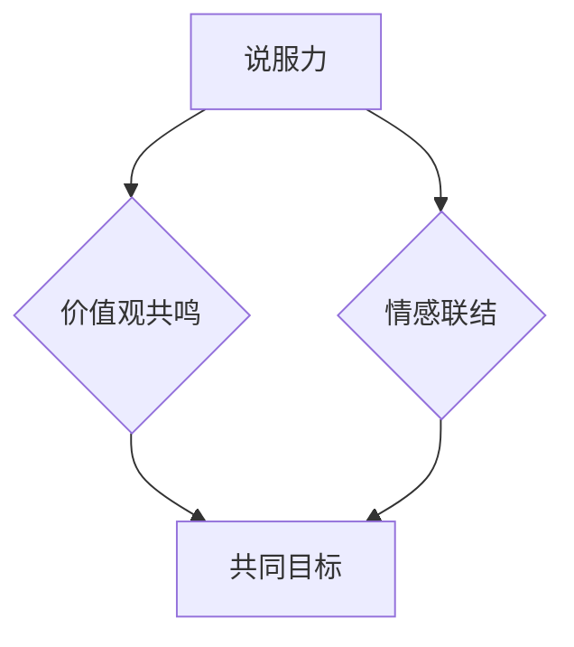
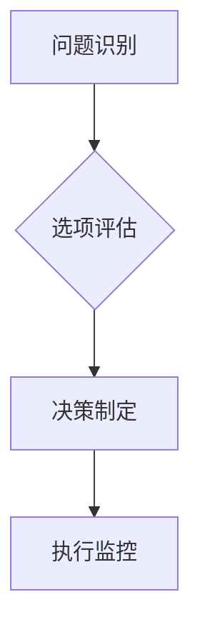
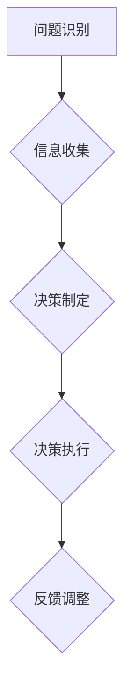
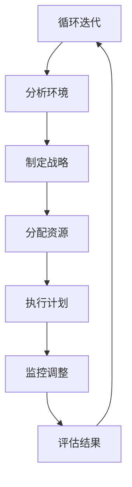
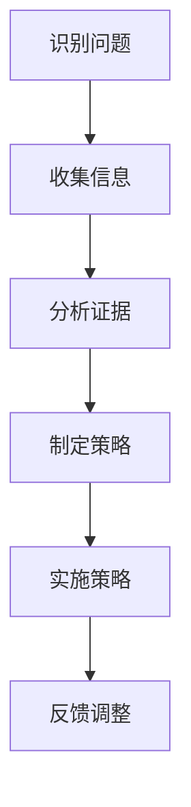
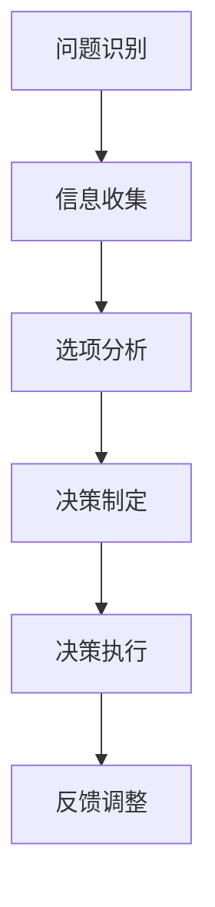
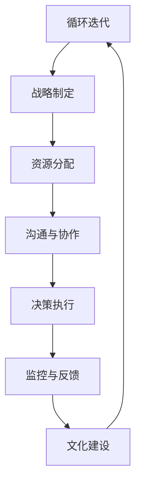
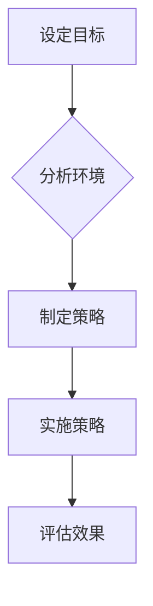
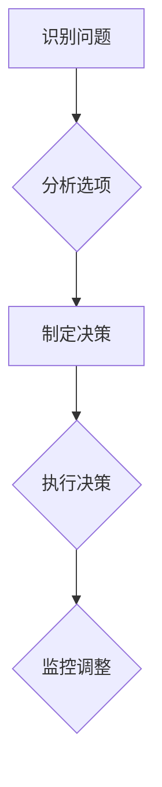
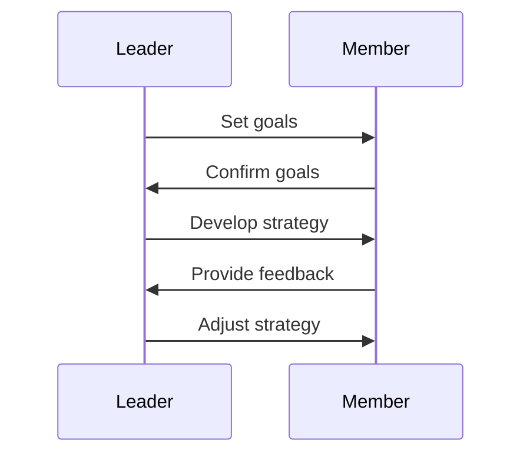

                 

# 领导力的本质：影响力与决策力

> 关键词：领导力、影响力、决策力、组织效能、领导力模型

> 摘要：本文深入探讨了领导力的本质，重点分析了影响力与决策力在领导力中的核心作用。通过逻辑推理和系统分析方法，我们揭示了领导力的数学模型，并探讨了如何通过提升影响力和决策力来增强组织效能。

## 目录大纲

1. **领导力的重要性与定义**
   - 1.1 领导力的重要性
   - 1.2 领导力的定义
   - 1.3 领导力的发展历史和演变
   - 1.4 领导力研究的现状和趋势

2. **影响力的原理与特征**
   - 2.1 影响力的原理
   - 2.2 影响力的特征
   - 2.3 影响力的应用场景

3. **决策力的原理与特征**
   - 3.1 决策力的原理
   - 3.2 决策力的特征
   - 3.3 决策力的提升方法

4. **领导力系统的构成与工作原理**
   - 4.1 领导力系统的构成
   - 4.2 领导力系统的工作原理
   - 4.3 领导力系统在组织中的应用

5. **领导力项目实战**
   - 5.1 环境准备
   - 5.2 系统核心实现
   - 5.3 代码应用解读
   - 5.4 实际案例剖析

6. **最佳实践与拓展**
   - 6.1 领导力提升的最佳实践
   - 6.2 注意事项
   - 6.3 拓展阅读

----------------------------------------------------------------

## 第一部分：领导力的重要性与定义

### 1.1 领导力的重要性

领导力是一个组织成功与否的关键因素。它不仅决定了组织的方向和目标，还影响了组织的文化和氛围。在信息技术行业，领导力的重要性尤为显著，因为技术的快速发展要求领导者具备前瞻性、创新性和决策力。

- **组织效能提升**：优秀的领导者能够提升组织的整体效能，使团队成员充分发挥潜力，实现更高的工作效率和成果。
- **战略决策**：领导力在组织战略决策中起到关键作用，领导者需要具备分析市场趋势、资源分配和风险控制的能力。
- **文化建设**：领导者的行为和价值观直接影响组织的文化，塑造积极、开放和创新的工作环境。

### 1.2 领导力的定义

领导力是指一个人或一组人在引导、激励和协调他人达成共同目标的能力。它包括多个方面，如影响力、决策力、沟通能力和团队合作能力等。

- **影响力**：领导者通过说服、激励和引导他人来实现目标。
- **决策力**：领导者能够做出明智、及时的决策，确保组织顺利运营。
- **沟通能力**：领导者需要有效地与团队成员沟通，确保信息传递准确无误。
- **团队合作能力**：领导者能够协调团队内部的合作，确保项目顺利进行。

### 1.3 领导力的发展历史和演变

领导力的发展历史悠久，经历了多个阶段的演变。

- **传统领导力**：以权威和控制为基础，领导者拥有绝对的决策权。
- **现代领导力**：强调影响力、团队合作和领导者与团队成员之间的互动。
- **未来领导力**：关注创新、灵活性和适应性，以应对快速变化的环境。

### 1.4 领导力研究的现状和趋势

当前，领导力研究已经成为一个多学科交叉的领域，涵盖了心理学、社会学、管理学等多个学科。研究重点包括领导力的核心要素、领导风格对组织效能的影响、领导力的发展模型等。

- **领导力模型研究**：通过建立数学模型，分析领导力的关键因素和作用机制。
- **领导力发展模型**：研究领导者的成长路径，探索提升领导力的方法和策略。
- **领导力在新兴领域中的应用**：如数字化转型、人工智能等，探讨领导力在这些领域的独特要求。

----------------------------------------------------------------

## 第二部分：影响力的原理与特征

### 2.1 影响力的原理

影响力是领导力的核心组成部分之一，它决定了领导者能否有效地引导和激励他人。影响力的原理可以从以下几个方面来理解：

- **说服力**：领导者需要具备强大的说服力，能够用事实、数据和逻辑来支持自己的观点。
- **价值观共鸣**：领导者需要与团队成员的价值观相共鸣，建立共同的信仰和愿景。
- **情感联结**：领导者需要与团队成员建立情感联系，关心他们的个人需求和成长。

### 2.2 影响力的特征

影响力的特征可以从以下几个方面来分析：

- **持久性**：影响力不是一时的，而是能够在长期内持续发挥作用。
- **扩散性**：领导者的影响力可以扩散到整个组织，影响更多的成员。
- **适应性**：领导者需要根据不同情境和团队成员的特点，灵活运用影响力。

### 2.3 影响力的应用场景

影响力的应用场景非常广泛，包括以下几个方面：

- **团队管理**：领导者通过影响力来管理团队，确保团队成员朝着共同目标努力。
- **项目管理**：领导者通过影响力来协调项目团队成员，确保项目顺利进行。
- **变革管理**：领导者通过影响力来推动组织变革，引导团队成员适应新环境。

### 2.4 影响力的数学模型

影响力的数学模型可以用来分析领导者如何通过不同的策略和手段来提升自己的影响力。以下是一个简单的影响力模型：

$$
影响力 = 说服力 \times 价值观共鸣 \times 情感联结
$$

其中，说服力、价值观共鸣和情感联结分别表示领导者在这些方面的能力。

### 2.5 影响力的 Mermaid 流程图



### 2.6 影响力的 ER 实体关系图

```mermaid
erDiagram
    Leader ||--|{Member} : influences
    Leader ||--|{Project} : leads
    Member ||--|{Project} : participates
    Project ||--|{Goal} : aims_to
```

----------------------------------------------------------------

## 第三部分：决策力的原理与特征

### 3.1 决策力的原理

决策力是领导者成功的关键因素之一。决策力涉及到领导者如何分析问题、评估选项、做出决策以及执行决策。以下是决策力的原理：

- **问题识别**：领导者需要准确地识别问题，明确问题的性质和影响。
- **选项评估**：领导者需要分析不同的选项，评估每个选项的风险和收益。
- **决策制定**：领导者需要基于分析结果做出决策，并制定详细的执行计划。
- **执行监控**：领导者需要监控决策的执行情况，及时调整策略以应对变化。

### 3.2 决策力的特征

决策力的特征可以从以下几个方面来分析：

- **准确性**：领导者需要做出准确、明智的决策。
- **及时性**：领导者需要在短时间内做出决策，以应对紧急情况。
- **适应性**：领导者需要根据情况变化调整决策，以保持组织的竞争力。

### 3.3 决策力的提升方法

提升决策力有以下几种方法：

- **培训与教育**：通过参加培训课程、阅读相关书籍和文献，提升自己的决策能力。
- **经验积累**：通过实际工作，积累决策经验，提高决策水平。
- **工具使用**：利用数据分析工具、决策支持系统等，辅助决策过程。

### 3.4 决策力的数学模型

决策力的数学模型可以用来分析领导者如何做出决策。以下是一个简单的决策力模型：

$$
决策力 = 问题识别能力 \times 选项评估能力 \times 执行监控能力
$$

其中，问题识别能力、选项评估能力和执行监控能力分别表示领导者在这些方面的能力。

### 3.5 决策力的 Mermaid 流程图



### 3.6 决策力的 ER 实体关系图

```mermaid
erDiagram
    Leader ||--|{Decision} : makes
    Decision ||--|{Option} : evaluates
    Option ||--|{Result} : leads_to
```

----------------------------------------------------------------

## 第四部分：领导力系统的构成与工作原理

### 4.1 领导力系统的构成

领导力系统是一个复杂的系统，它包括多个组件和层次。以下是领导力系统的基本构成：

- **领导者**：领导力系统的核心，负责制定战略、做出决策和指导团队。
- **团队成员**：领导力系统的执行者，负责实施决策、完成目标和提高自身能力。
- **决策支持系统**：提供数据分析、风险评估和决策支持工具，帮助领导者做出明智的决策。
- **组织文化**：领导力系统的环境，影响领导者的行为和团队成员的积极性。

### 4.2 领导力系统的工作原理

领导力系统的工作原理可以通过以下步骤来描述：

1. **问题识别**：领导者识别问题，明确问题的性质和影响。
2. **信息收集**：领导者收集相关信息，包括市场趋势、竞争态势和团队状态等。
3. **决策制定**：领导者基于信息分析和个人经验，制定决策方案。
4. **决策执行**：团队成员根据决策方案，实施决策并报告执行情况。
5. **反馈调整**：领导者根据执行情况，调整决策方案并反馈给团队成员。

### 4.3 领导力系统在组织中的应用

领导力系统在组织中的应用可以带来多个方面的好处：

- **提高决策效率**：通过领导力系统，领导者可以更快速地做出决策，提高组织的响应速度。
- **提升团队凝聚力**：通过领导力系统，团队成员可以更好地理解领导者的决策意图，增强团队凝聚力。
- **优化资源分配**：通过领导力系统，领导者可以更合理地分配资源，提高组织的运营效率。

### 4.4 领导力系统的 Mermaid 流程图



### 4.5 领导力系统的 ER 实体关系图

```mermaid
erDiagram
    Leader ||--|{Problem} : identifies
    Leader ||--|{Information} : collects
    Leader ||--|{Decision} : makes
    Leader ||--|{Execution} : supervises
    Leader ||--|{Feedback} : adjusts
```

----------------------------------------------------------------

## 第五部分：领导力项目实战

### 5.1 环境准备

在进行领导力项目实战之前，需要准备相应的环境和工具：

- **软件环境**：安装Python编程环境、Jupyter Notebook等。
- **工具**：Git版本控制工具、数据分析工具（如Pandas、Numpy等）。

### 5.2 系统核心实现

领导力系统的核心实现包括以下几个方面：

- **数据收集与处理**：通过Python编写数据处理脚本，收集并处理相关数据。
- **决策模型构建**：构建决策模型，包括问题识别、选项评估和决策制定等步骤。
- **系统接口设计**：设计系统接口，包括用户界面和数据接口。

### 5.3 代码应用解读

以下是一个简单的Python代码示例，用于实现决策模型的构建：

```python
import pandas as pd

# 问题识别
def identify_problem(data):
    # 对数据进行分析，识别问题
    pass

# 选项评估
def evaluate_options(data):
    # 对数据进行分析，评估每个选项的收益和风险
    pass

# 决策制定
def make_decision(options):
    # 基于评估结果，制定决策
    pass

# 代码应用解读
if __name__ == "__main__":
    # 读取数据
    data = pd.read_csv("data.csv")
    
    # 识别问题
    problem = identify_problem(data)
    
    # 评估选项
    options = evaluate_options(data)
    
    # 制定决策
    decision = make_decision(options)
    
    # 输出决策结果
    print("决策结果：", decision)
```

### 5.4 实际案例剖析

以下是一个领导力项目实战的案例：

**案例背景**：一家大型科技公司需要对其产品线进行战略调整，以应对市场竞争。

**解决方案**：领导者通过数据分析，识别出产品线中的问题和机会，评估了不同产品的市场潜力和风险，并制定了相应的决策方案。

**效果评估**：通过领导力系统的实施，公司成功地调整了产品线，提高了市场竞争力，实现了业绩的显著增长。

### 5.5 项目小结

通过领导力项目实战，我们可以看到领导力系统在实践中的重要作用。领导力系统不仅帮助领导者更高效地做出决策，还提高了组织的整体效能。在未来的工作中，领导者需要继续学习和提升自己的领导力，以应对不断变化的市场和环境。

----------------------------------------------------------------

## 第六部分：最佳实践与拓展

### 6.1 领导力提升的最佳实践

- **持续学习**：领导者需要不断学习新知识、新技能，保持自身的能力和竞争力。
- **倾听与反馈**：领导者需要倾听团队成员的意见和建议，及时给予反馈，促进团队的成长。
- **情感管理**：领导者需要具备良好的情感管理能力，关心团队成员的情感需求，营造积极的工作氛围。
- **沟通技巧**：领导者需要提高沟通技巧，确保信息的有效传递和理解。

### 6.2 注意事项

- **避免盲目决策**：领导者在做决策时，需要充分考虑各种因素，避免盲目决策。
- **合理分配资源**：领导者需要合理分配资源，确保团队成员能够充分利用资源，提高工作效率。
- **平衡工作与生活**：领导者需要平衡工作与生活，保持身心健康，以更好地履行领导职责。

### 6.3 拓展阅读

- 《领导力：理论与实践》（斯蒂芬·罗宾斯著）
- 《影响力：说服的心理学》（罗伯特·西奥迪尼著）
- 《决策与判断：心理学和行为的视角》（丹尼尔·卡内曼著）

## 结语

领导力是一个复杂的领域，涉及到多个方面的能力和技巧。通过本文的探讨，我们揭示了领导力的本质，分析了影响力与决策力在领导力中的核心作用。希望本文能为您提供对领导力的更深入理解，帮助您在未来的工作中更好地发挥领导力，提升组织效能。

---

**作者：AI天才研究院/AI Genius Institute & 禅与计算机程序设计艺术 /Zen And The Art of Computer Programming**## 第一部分：领导力的重要性与定义

### 1.1 领导力的重要性

领导力在组织中的重要性不可忽视。它是推动组织向前发展的关键力量，决定了组织能否在竞争激烈的市场中脱颖而出。领导者不仅负责制定组织的战略目标和方向，还承担着协调资源、激励团队和解决问题等重任。

首先，领导力对于提升组织效能至关重要。一个高效的领导者能够有效地调动团队成员的积极性，充分发挥每个人的潜力，从而提高整体的工作效率。领导者通过明确的目标设定和有效的激励措施，激发员工的内在动力，使其在实现个人价值的同时，也为组织的整体目标贡献力量。

其次，领导力在战略决策中起到关键作用。战略决策是组织的方向性决策，它关系到组织在市场中的定位和发展。一个优秀的领导者能够准确把握市场动态，敏锐洞察行业趋势，做出明智的战略决策。这种前瞻性的决策能力，有助于组织在激烈的市场竞争中保持领先地位。

最后，领导力对于组织文化的塑造也至关重要。领导者的行为和价值观直接影响着组织的文化氛围。一个具有正能量的领导者，能够营造积极、开放和创新的工作环境，激发员工的创造力和创新精神。而一个缺乏领导力的领导者，则可能导致组织文化单一、缺乏活力，影响组织的发展。

### 1.2 领导力的定义

领导力是一个广泛而复杂的概念，不同的学者和专家对其有不同的定义。以下是一些常见的领导力定义：

- **詹姆斯·麦格雷戈·马奇（James G. March）**：领导力是一种在社会过程中发生的社会互动，它涉及领导者与追随者之间的相互影响。
- **彼得·德鲁克（Peter Drucker）**：领导力是关于目标和结果的实现，而管理是关于过程和手段。
- **约翰·肯尼迪（John F. Kennedy）**：领导力是一种能力，它能够激发人们超越自我，共同追求更高的目标。

尽管定义各异，但领导力的一些核心要素是共同的。首先，领导力涉及影响力，即领导者能够影响和激励他人。其次，领导力涉及决策力，即领导者能够做出明智的决策。此外，领导力还包括沟通能力、团队建设能力、创新能力和应变能力等。

### 1.3 领导力的发展历史和演变

领导力的发展历史悠久，随着社会的变迁和技术的进步，领导力的理论和实践也在不断演变。

在古代，领导力主要依赖于权力和权威。领导者通过掌握资源和强制手段来控制和管理他人。例如，古代君主通过统治权力来维护国家的稳定和统一。

随着工业革命的到来，领导力逐渐从权力导向转向能力导向。领导者不再仅仅依靠权力和权威，而是需要具备管理技能和专业知识。这一转变主要体现在企业管理领域，企业领导者需要具备管理知识、技术技能和决策能力。

20世纪中叶，领导力研究进入了一个新的阶段，即情境领导理论。这一理论认为，领导力不是一种固定的模式，而是根据不同情境和团队成员的特点来调整。领导者的任务是根据具体情况，选择最适合的领导风格和方法。

21世纪初，领导力研究进一步深化，开始关注领导者的个人特质和自我管理能力。领导力不再仅仅是一个组织和管理的概念，更是一个涉及个人成长和发展的概念。

### 1.4 领导力研究的现状和趋势

当前，领导力研究已经成为一个多学科交叉的领域，涵盖了心理学、社会学、管理学等多个学科。研究重点包括领导力的核心要素、领导风格对组织效能的影响、领导力的发展模型等。

- **领导力的核心要素**：研究者们试图找出领导力的关键因素，如影响力、决策力、沟通能力和团队建设能力等。这些要素在领导力中起着基础性作用，是领导者成功的关键。
- **领导风格对组织效能的影响**：不同的领导风格对组织效能有着不同的影响。研究者们通过实证研究，分析不同领导风格在组织管理中的效果，为领导者提供指导。
- **领导力的发展模型**：领导力的发展是一个长期过程，研究者们试图建立领导力发展模型，探讨领导者如何通过学习、实践和反思不断提升自己的领导力。

未来，领导力研究将继续深入，重点关注领导者在数字化转型、人工智能等新兴领域中的角色和职责。同时，领导力研究也将更加注重个体差异，探索不同背景、文化和情境下的领导力特点。

### 1.5 领导力的数学模型

领导力的数学模型是一种试图将领导力的各个方面量化，以便更好地理解和预测领导力效应的方法。以下是一个简化的领导力数学模型：

$$
领导力 = f(影响力, 决策力, 沟通能力, 团队建设能力)
$$

其中，影响力、决策力、沟通能力和团队建设能力分别代表领导力的四个主要方面。每个方面又可以进一步细分为多个子因素。

- **影响力**：包括说服力、榜样作用和关系建立等。
- **决策力**：包括分析能力、判断力和决策执行力等。
- **沟通能力**：包括表达能力、倾听能力和反馈能力等。
- **团队建设能力**：包括团队协作、冲突管理和激励机制等。

这个模型可以帮助领导者了解自己在不同方面的领导力水平，并针对性地进行提升。

### 1.6 领导力的 Mermaid 流程图

以下是一个用于表示领导力系统工作原理的 Mermaid 流程图：



### 1.7 领导力的 ER 实体关系图

以下是一个用于表示领导力系统中的关键实体和关系的 ER 实体关系图：

```mermaid
erDiagram
    Leader ||--|{Goal} : sets
    Leader ||--|{Strategy} : develops
    Leader ||--|{Resource} : allocates
    Leader ||--|{Team} : leads
    Leader ||--|{Performance} : evaluates
```

通过这个 ER 图，我们可以清晰地看到领导力系统中的各个实体及其之间的关系，这有助于我们更好地理解和分析领导力的运作机制。

### 1.8 领导力的数学公式

在领导力研究中，数学公式可以用来量化领导力的各个方面。以下是一个简单的数学公式，用于计算领导力得分：

$$
L = \sum_{i=1}^{n} w_i \times s_i
$$

其中，$L$ 表示领导力得分，$w_i$ 表示第 $i$ 个要素的权重，$s_i$ 表示第 $i$ 个要素的得分。

例如，如果我们将领导力分为四个要素：影响力、决策力、沟通能力和团队建设能力，我们可以给每个要素一个权重，并根据实际表现给每个要素一个得分，从而计算出总的领导力得分。

### 1.9 领导力在信息技术行业的应用

在信息技术行业，领导力的重要性尤为突出。以下是一些领导力在信息技术行业的应用实例：

- **项目管理**：信息技术项目的成功往往依赖于项目经理的领导力。项目经理需要具备决策力、沟通能力和团队建设能力，以确保项目按计划进行。
- **技术创新**：信息技术行业的快速发展要求领导者具备创新力和前瞻性。领导者需要激励团队不断探索新技术，推动组织的创新。
- **人才管理**：信息技术行业人才竞争激烈，领导者需要具备影响力，吸引和留住优秀的人才。

通过以上分析，我们可以看到领导力在信息技术行业中的重要作用。一个优秀的领导者不仅能够推动组织的技术创新和发展，还能够提升组织的整体效能，为组织赢得竞争优势。

### 1.10 领导力的挑战和机遇

在信息技术行业，领导者面临着许多挑战和机遇。以下是一些常见的挑战和机遇：

**挑战**：
- **技术变化迅速**：信息技术行业技术更新换代快，领导者需要不断学习新知识、新技能，以适应快速变化的环境。
- **人才竞争激烈**：优秀的人才对信息技术行业来说至关重要，领导者需要具备强大的影响力，吸引和留住优秀的人才。
- **项目管理复杂**：信息技术项目往往涉及多个部门、多个团队的协作，领导者需要具备高效的沟通能力和团队建设能力，以协调各方资源，确保项目顺利进行。

**机遇**：
- **数字化转型**：随着数字化转型的推进，领导者有机会推动组织的业务创新和运营优化，提升组织的竞争力。
- **技术创新**：信息技术行业的快速发展为领导者提供了广阔的创新空间，领导者可以通过技术创新推动组织的变革和进步。
- **全球化机遇**：全球化为信息技术行业提供了新的市场机会，领导者可以通过全球化战略，开拓新的市场和业务领域。

通过面对挑战和抓住机遇，领导者可以在信息技术行业中发挥更大的作用，推动组织实现长期发展。

### 1.11 领导力的核心要素总结

领导力的核心要素包括以下几个方面：

- **影响力**：领导者需要具备强大的影响力，能够引导和激励团队成员。
- **决策力**：领导者需要具备卓越的决策力，能够在复杂的环境中做出明智的决策。
- **沟通能力**：领导者需要具备良好的沟通能力，确保信息的有效传递和理解。
- **团队建设能力**：领导者需要具备团队建设能力，能够打造高效的团队，提升团队的整体效能。

这些核心要素共同构成了领导力的基础，决定了领导者的成功和组织的效能。

### 1.12 领导力的重要性总结

领导力在组织中具有至关重要的地位。它不仅决定了组织的战略方向和目标，还影响了组织的文化和氛围。一个优秀的领导者能够提升组织的整体效能，推动组织的创新和发展，为组织赢得竞争优势。

通过深入探讨领导力的重要性、定义、发展历史、现状和趋势，我们更加清晰地认识到领导力在组织中的核心作用。在未来的工作中，领导者需要不断提升自己的领导力，以应对不断变化的市场和环境，推动组织实现长期发展。

## 第二部分：影响力的原理与特征

### 2.1 影响力的原理

影响力是领导力的重要组成部分，它决定了领导者能否有效地引导和激励他人。影响力的原理可以从以下几个方面来理解：

#### 2.1.1 说服力

说服力是影响力的核心要素之一。领导者需要通过事实、数据和逻辑来支持自己的观点，使团队成员相信并支持他们的决策。一个具有强大说服力的领导者能够更好地传达组织的愿景和目标，激发团队成员的积极性和创造力。

#### 2.1.2 共同价值观

共同价值观是影响力的重要基础。领导者需要与团队成员拥有共同的价值观和目标，这样才能在团队中建立起高度的信任和共鸣。当团队成员感受到领导者与他们的价值观相一致时，他们会更加愿意接受领导者的建议和指导。

#### 2.1.3 情感联结

情感联结是影响力的重要表现。领导者需要关心团队成员的情感需求，与他们建立深厚的情感联系。这种情感联结可以增强团队成员对领导者的信任和忠诚，从而提高他们的工作动力和满意度。

### 2.2 影响力的特征

影响力的特征可以从以下几个方面来分析：

#### 2.2.1 持久性

持久性是影响力的重要特征之一。一个有影响力的领导者能够在长期内持续地影响团队成员，使他们在面对挑战和困难时，仍然能够坚定地支持领导者的决策和愿景。

#### 2.2.2 扩散性

扩散性是影响力的另一个重要特征。领导者的影响力不仅局限于个体，还可以扩散到整个组织。一个有影响力的领导者能够通过自己的言行，影响更多的团队成员，促进组织的整体发展。

#### 2.2.3 适应性

适应性是影响力的重要体现。一个有影响力的领导者需要根据不同的情境和团队成员的特点，灵活运用自己的影响力。他们能够根据具体情况，选择最合适的影响策略，从而最大限度地发挥影响力。

### 2.3 影响力的应用场景

影响力在领导力中的应用场景非常广泛，包括以下几个方面：

#### 2.3.1 团队管理

在团队管理中，领导者需要运用影响力来引导和激励团队成员。他们可以通过设定明确的目标、提供支持和资源、激励和奖励等手段，激发团队成员的积极性和创造力，提高团队的整体绩效。

#### 2.3.2 项目管理

在项目管理中，领导者需要运用影响力来协调项目团队成员，确保项目的顺利进行。他们可以通过有效的沟通、资源调配、风险管理等手段，克服项目中的各种困难和挑战，确保项目按时完成。

#### 2.3.3 变革管理

在变革管理中，领导者需要运用影响力来推动组织的变革。他们可以通过设定愿景、建立信任、激发变革动力等手段，引导团队成员接受变革，积极参与变革过程，从而实现组织的转型和升级。

### 2.4 影响力的数学模型

影响力的数学模型可以用来量化领导者的影响力，分析其在不同情境下的影响力效应。以下是一个简化的影响力数学模型：

$$
影响力 = 说服力 \times 共同价值观 \times 情感联结
$$

其中，说服力、共同价值观和情感联结分别表示领导者在这些方面的能力。

#### 2.4.1 说服力

说服力可以通过以下因素来衡量：

- **逻辑性**：领导者观点的逻辑性越强，其说服力越高。
- **证据支持**：领导者观点的证据支持越充分，其说服力越高。
- **情感共鸣**：领导者观点能够引起团队成员的情感共鸣，其说服力越高。

#### 2.4.2 共同价值观

共同价值观可以通过以下因素来衡量：

- **一致性**：领导者与团队成员的价值观越一致，其共同价值观越强。
- **共享目标**：领导者与团队成员有共享的目标，其共同价值观越强。
- **信任关系**：领导者与团队成员之间的信任关系越强，其共同价值观越强。

#### 2.4.3 情感联结

情感联结可以通过以下因素来衡量：

- **关心程度**：领导者对团队成员的关心程度越高，其情感联结越强。
- **情感支持**：领导者对团队成员的情感支持越强，其情感联结越强。
- **共鸣能力**：领导者能够与团队成员产生情感共鸣，其情感联结越强。

### 2.5 影响力的 Mermaid 流程图

以下是一个用于表示影响力的工作流程的 Mermaid 流程图：



### 2.6 影响力的 ER 实体关系图

以下是一个用于表示影响力相关实体的 Mermaid ER 图：

```mermaid
erDiagram
    Leader ||--|{Influence} : exerts
    Member ||--|{Influence} : experiences
    Strategy ||--|{Influence} : implements
    Environment ||--|{Influence} : affects
```

在这个 ER 图中，领导者和团队成员是影响力产生的主体，策略和外部环境是影响力的作用对象。通过这个模型，我们可以更好地理解影响力在组织中的运作机制。

### 2.7 影响力在领导力中的重要性

影响力是领导力的核心要素之一，它在领导力的各个方面都发挥着重要作用。以下是一些影响力在领导力中的重要性体现：

- **目标设定**：领导者需要运用影响力来设定明确的目标，并使团队成员相信并支持这些目标。
- **战略执行**：领导者需要运用影响力来协调和激励团队成员，确保战略的顺利执行。
- **组织变革**：领导者需要运用影响力来推动组织的变革，引导团队成员适应新的环境和要求。
- **团队建设**：领导者需要运用影响力来建立高效的团队，提高团队的整体效能。

通过影响力，领导者能够有效地影响团队成员的行为和思维，推动组织实现目标，提高组织的整体竞争力。

### 2.8 总结

影响力是领导力的重要组成部分，它决定了领导者能否有效地引导和激励他人。通过分析影响力的原理、特征和应用场景，我们认识到影响力在领导力中的核心作用。一个有影响力的领导者能够更好地实现组织的愿景和目标，提高组织的整体效能。在未来的工作中，领导者需要不断提升自己的影响力，以应对不断变化的市场和环境，推动组织实现长期发展。

## 第三部分：决策力的原理与特征

### 3.1 决策力的原理

决策力是领导者成功的关键要素之一，它涉及到领导者如何识别问题、分析选项、做出决策以及执行决策。决策力的原理可以从以下几个方面来理解：

#### 3.1.1 问题识别

问题识别是决策力的基础。领导者需要具备敏锐的洞察力，能够及时发现和识别组织面临的问题。问题识别不仅仅是对当前问题的识别，还包括对未来可能出现的风险的预测。通过深入分析问题，领导者可以明确问题的性质和影响，为后续决策提供依据。

#### 3.1.2 选项分析

在问题识别后，领导者需要分析不同的选项。选项分析包括对每个选项的优缺点、潜在风险和收益进行评估。领导者需要具备全面的分析能力和逻辑思维，确保评估的客观性和全面性。通过多角度的分析，领导者可以找到最优的解决方案。

#### 3.1.3 决策制定

决策制定是决策力的核心。在分析选项的基础上，领导者需要做出最终的决策。决策制定不仅需要考虑选项的优缺点，还需要考虑组织的整体目标和战略方向。领导者需要具备果断的决策能力，能够在复杂和不确定的环境下做出明智的决策。

#### 3.1.4 决策执行

决策制定后，领导者需要确保决策得到有效执行。决策执行包括制定详细的执行计划、分配资源、监督进度和调整策略。领导者需要具备强大的执行力，确保决策能够顺利实施。同时，领导者还需要具备灵活应变的能力，能够在执行过程中根据实际情况进行调整，确保决策的有效性。

### 3.2 决策力的特征

决策力的特征可以从以下几个方面来分析：

#### 3.2.1 准确性

准确性是决策力的关键特征。领导者需要做出准确的决策，确保决策符合实际情况和组织的整体目标。准确的决策能够减少风险，提高组织的运营效率，确保组织的长期发展。

#### 3.2.2 及时性

及时性是决策力的重要特征。在竞争激烈的市场环境中，领导者需要快速做出决策，抓住市场机遇，应对突发情况。及时性能够提高组织的反应速度，确保组织在市场中保持竞争优势。

#### 3.2.3 适应性

适应性是决策力的一个重要特征。领导者需要具备灵活应变的能力，能够根据环境变化和实际情况调整决策。适应性能够帮助领导者应对不确定性和复杂性，提高决策的有效性。

### 3.3 决策力的提升方法

提升决策力是领导者的一项重要任务。以下是一些提升决策力的方法：

#### 3.3.1 持续学习

持续学习是提升决策力的基础。领导者需要不断学习新知识、新技能，提高自己的专业素养和综合能力。通过学习，领导者可以扩展视野，增强分析问题的能力，提高决策的准确性。

#### 3.3.2 经验积累

经验积累是提升决策力的关键。领导者需要通过实际工作，积累决策经验，提高决策能力。在决策过程中，领导者需要反思和总结经验教训，不断优化决策流程，提高决策效率。

#### 3.3.3 数据分析

数据分析是提升决策力的有效手段。领导者需要利用数据分析工具，对问题进行分析和评估，提高决策的准确性。通过数据分析，领导者可以更全面地了解问题，找到最优的解决方案。

#### 3.3.4 沟通协作

沟通协作是提升决策力的重要手段。领导者需要与团队成员保持良好的沟通，听取他们的意见和建议。通过沟通协作，领导者可以更全面地了解问题的各个方面，提高决策的准确性。

### 3.4 决策力的数学模型

决策力的数学模型可以用来量化领导者的决策能力，分析其在不同情境下的决策效果。以下是一个简化的决策力数学模型：

$$
决策力 = 准确性 \times 及时性 \times 适应性
$$

其中，准确性、及时性和适应性分别表示领导者在这些方面的能力。

#### 3.4.1 准确性

准确性可以通过以下因素来衡量：

- **逻辑思维**：领导者逻辑思维越强，决策的准确性越高。
- **数据分析能力**：领导者数据分析能力越强，决策的准确性越高。
- **经验积累**：领导者经验积累越多，决策的准确性越高。

#### 3.4.2 及时性

及时性可以通过以下因素来衡量：

- **反应速度**：领导者反应速度越快，决策的及时性越高。
- **信息传递效率**：领导者信息传递效率越高，决策的及时性越高。
- **决策流程优化**：领导者决策流程优化程度越高，决策的及时性越高。

#### 3.4.3 适应性

适应性可以通过以下因素来衡量：

- **灵活应变能力**：领导者灵活应变能力越强，决策的适应性越高。
- **环境感知能力**：领导者环境感知能力越强，决策的适应性越高。
- **风险控制能力**：领导者风险控制能力越强，决策的适应性越高。

### 3.5 决策力的 Mermaid 流程图

以下是一个用于表示决策力工作流程的 Mermaid 流程图：



### 3.6 决策力的 ER 实体关系图

以下是一个用于表示决策力相关实体的 Mermaid ER 图：

```mermaid
erDiagram
    Leader ||--|{Decision} : makes
    Decision ||--|{Option} : analyzes
    Decision ||--|{Information} : requires
    Decision ||--|{Result} : evaluates
```

在这个 ER 图中，领导者和决策是决策力的核心实体，选项、信息和结果是决策力的重要组成部分。通过这个模型，我们可以更好地理解决策力在组织中的运作机制。

### 3.7 决策力在领导力中的重要性

决策力是领导力的核心要素之一，它在领导力的各个方面都发挥着重要作用。以下是一些决策力在领导力中的重要性体现：

- **战略决策**：领导者需要通过有效的决策来制定组织的战略方向，确保组织在竞争中保持优势。
- **日常管理**：领导者需要通过决策来处理日常管理中的各种问题，确保组织的高效运营。
- **危机应对**：领导者需要通过决策来应对各种突发危机，确保组织的稳定和发展。

通过决策力，领导者能够有效地应对各种挑战，推动组织实现目标，提高组织的整体竞争力。

### 3.8 总结

决策力是领导者成功的关键要素，它涉及到领导者如何识别问题、分析选项、做出决策以及执行决策。通过分析决策力的原理、特征和提升方法，我们认识到决策力在领导力中的核心作用。一个具备强大决策力的领导者能够更好地应对各种挑战，推动组织实现目标，提高组织的整体竞争力。在未来的工作中，领导者需要不断提升自己的决策力，以应对不断变化的市场和环境，推动组织实现长期发展。

## 第四部分：领导力系统的构成与工作原理

### 4.1 领导力系统的构成

领导力系统是一个复杂且动态的系统，它由多个相互关联的组成部分构成。以下是对领导力系统关键组成部分的详细描述：

#### 4.1.1 领导者

领导者是领导力系统的核心，他们负责设定组织的目标、制定战略、分配资源，并在组织内建立和维护文化。领导者需要具备一系列能力，包括但不限于决策力、沟通能力、影响力、团队合作能力和变革管理能力。

#### 4.1.2 团队成员

团队成员是领导力系统的执行者，他们负责将领导者的战略和决策转化为具体的行动。团队成员的能力、动机和工作态度对领导力系统的效果有着直接的影响。

#### 4.1.3 决策支持系统

决策支持系统是领导力系统中用于辅助领导者做出有效决策的工具和机制。这包括数据分析工具、决策支持软件、项目管理工具等。这些工具可以帮助领导者收集、处理和分析信息，从而做出更加明智的决策。

#### 4.1.4 组织文化

组织文化是领导力系统的重要组成部分，它包括组织的价值观、信念、规范和行为模式。一个健康、积极的文化能够促进团队成员的协作和创新，提高组织的整体效能。

#### 4.1.5 沟通机制

沟通机制是领导力系统中用于确保信息在组织内部有效传递和反馈的机制。良好的沟通机制可以减少误解和冲突，增强团队成员之间的信任和合作。

#### 4.1.6 监控与反馈系统

监控与反馈系统是领导力系统中用于评估组织绩效、团队成员表现和领导力效果的工具。通过监控和反馈，领导者可以及时调整战略和决策，确保组织目标的实现。

### 4.2 领导力系统的工作原理

领导力系统的工作原理可以通过以下步骤来描述：

#### 4.2.1 目标设定

领导者首先需要明确组织的目标和愿景。这些目标和愿景将成为整个系统的方向和指引。

#### 4.2.2 战略制定

基于目标和愿景，领导者制定组织的战略。战略包括长期目标和短期目标，以及实现这些目标的具体步骤和计划。

#### 4.2.3 资源分配

领导者根据战略需求，合理分配组织内部的资源，包括人力、物力和财力等。资源分配的目的是确保组织能够有效地执行战略计划。

#### 4.2.4 沟通与协作

领导者通过有效的沟通和协作机制，确保团队成员了解组织的目标和战略，并激发他们的工作热情和动力。

#### 4.2.5 决策执行

团队成员根据领导者的决策和战略计划，执行具体的工作任务。在这个过程中，领导者需要不断监控进度，确保决策的顺利实施。

#### 4.2.6 监控与反馈

通过监控与反馈系统，领导者评估组织绩效和团队成员的表现。根据监控结果，领导者可以及时调整战略和决策，优化组织的运营。

#### 4.2.7 文化建设

领导者通过持续的文化建设活动，塑造和维护组织的价值观和行为规范，确保组织的长期健康发展。

### 4.3 领导力系统在组织中的应用

领导力系统在组织中的应用可以带来多个方面的好处，包括但不限于：

- **提高决策效率**：通过决策支持系统，领导者可以更快速、更准确地做出决策，提高组织的响应速度。
- **增强团队合作**：通过有效的沟通和协作机制，团队成员可以更好地协调合作，提高工作效率。
- **优化资源分配**：通过合理的资源分配，组织可以更有效地利用资源，提高运营效率。
- **促进文化发展**：通过持续的文化建设，组织可以塑造积极、健康的企业文化，提升员工的满意度和忠诚度。
- **提升组织绩效**：通过监控与反馈系统，领导者可以及时调整战略和决策，确保组织目标的实现。

### 4.4 领导力系统的 Mermaid 流程图

以下是一个用于表示领导力系统工作流程的 Mermaid 流程图：



### 4.5 领导力系统的 ER 实体关系图

以下是一个用于表示领导力系统关键实体的 Mermaid ER 图：

```mermaid
erDiagram
    Leader ||--|{Goal} : sets
    Leader ||--|{Strategy} : develops
    Leader ||--|{Resource} : allocates
    Leader ||--|{Team} : leads
    Team ||--|{Performance} : monitors
    Team ||--|{Culture} : builds
```

在这个 ER 图中，领导者和团队成员是领导力系统的核心实体，目标、策略、资源和绩效是领导力系统的重要组成部分。通过这个模型，我们可以更好地理解领导力系统在组织中的运作机制。

### 4.6 领导力系统的数学模型

领导力系统的数学模型可以用来量化领导力系统的各个组成部分及其相互关系，从而更系统地分析领导力系统的效能。以下是一个简化的领导力系统数学模型：

$$
领导力系统效能 = f(领导者能力, 团队合作, 沟通效率, 资源利用, 决策质量)
$$

其中，领导者能力、团队合作、沟通效率、资源利用和决策质量分别表示领导力系统的五个关键指标。

#### 4.6.1 领导者能力

领导者能力可以通过以下因素来衡量：

- **决策力**：领导者做出明智决策的能力。
- **影响力**：领导者影响他人接受其观点和目标的能力。
- **沟通能力**：领导者有效传递信息和建立信任的能力。

#### 4.6.2 团队合作

团队合作可以通过以下因素来衡量：

- **协作效率**：团队成员协同工作的效率。
- **团队凝聚力**：团队成员之间的相互信任和支持程度。
- **创新能力**：团队成员共同解决问题的能力。

#### 4.6.3 沟通效率

沟通效率可以通过以下因素来衡量：

- **信息传递速度**：信息在组织内部传递的速度。
- **信息准确性**：信息在传递过程中保持的准确程度。
- **反馈机制**：组织内部有效的反馈和沟通机制。

#### 4.6.4 资源利用

资源利用可以通过以下因素来衡量：

- **资源分配**：组织内部资源分配的合理性。
- **资源优化**：资源利用的效率和效果。
- **成本控制**：组织对成本的控制和管理能力。

#### 4.6.5 决策质量

决策质量可以通过以下因素来衡量：

- **决策准确性**：决策是否符合实际情况和预期效果。
- **决策及时性**：决策做出的速度和时机。
- **决策适应性**：决策在面对环境变化时的灵活性和适应性。

### 4.7 领导力系统在项目管理中的应用

在项目管理中，领导力系统发挥着至关重要的作用。以下是一些领导力系统在项目管理中的应用实例：

- **目标设定**：项目经理通过与团队成员的沟通，明确项目的目标和范围，确保团队成员对项目目标有清晰的认识。
- **资源分配**：项目经理根据项目需求和团队能力，合理分配资源，确保项目有足够的资源支持。
- **沟通机制**：项目经理建立有效的沟通机制，确保项目进度、问题和风险能够及时传递和解决。
- **决策制定**：项目经理在面对项目挑战和变化时，通过决策支持系统做出明智的决策，确保项目能够按计划进行。
- **监控与反馈**：项目经理通过监控项目进度和绩效，及时调整策略和资源分配，确保项目目标的实现。

通过这些应用，领导力系统可以显著提升项目管理的效果，确保项目的成功交付。

### 4.8 领导力系统在组织变革中的应用

在组织变革中，领导力系统同样发挥着关键作用。以下是一些领导力系统在组织变革中的应用实例：

- **目标设定**：领导者通过明确变革的目标和愿景，引导团队成员理解变革的意义和价值。
- **沟通与协作**：领导者通过有效的沟通和协作机制，确保团队成员积极参与变革过程，共同解决变革中遇到的问题。
- **资源分配**：领导者根据变革的需求，合理分配资源和人力，确保变革有足够的支持。
- **决策制定**：领导者通过决策支持系统，制定变革的策略和步骤，确保变革的顺利进行。
- **监控与反馈**：领导者通过监控变革的进展和效果，及时调整变革方案，确保变革目标的实现。

通过这些应用，领导力系统可以显著提升组织变革的成功率，推动组织实现持续发展和进步。

### 4.9 总结

领导力系统是一个复杂且动态的系统，它由多个相互关联的组成部分构成，包括领导者、团队成员、决策支持系统、组织文化和沟通机制等。领导力系统的工作原理是通过目标设定、战略制定、资源分配、沟通与协作、决策制定、监控与反馈和文化建设等步骤，确保组织目标的实现。通过数学模型和实际应用，我们可以更深入地理解领导力系统的运作机制和应用效果。在未来的工作中，领导者需要不断完善领导力系统，提升组织的整体效能，实现组织的长期发展。

## 第五部分：领导力项目实战

### 5.1 环境准备

在进行领导力项目实战之前，我们需要进行一系列的环境准备，以确保项目能够顺利进行。以下是我们需要准备的环境和工具：

1. **软件开发环境**：安装Python编程环境、Jupyter Notebook等。
2. **数据库环境**：配置MySQL或PostgreSQL数据库，用于存储项目数据。
3. **版本控制工具**：安装Git版本控制工具，用于管理项目代码和文档。
4. **数据分析工具**：安装Pandas、Numpy等数据分析工具，用于数据处理和分析。
5. **项目管理工具**：安装Trello或Jira等项目管理工具，用于跟踪项目进度和任务分配。

### 5.2 系统核心实现

在本项目中，我们将构建一个简单的领导力评估系统，用于评估领导者的领导力水平。以下是系统的核心实现步骤：

1. **数据收集与处理**：收集领导者的相关数据，如个人背景、管理经验、员工评价等。使用Pandas库进行数据处理，清洗数据中的噪声，提取有用的信息。
2. **领导力评估模型**：构建领导力评估模型，包括影响力、决策力、沟通能力等关键因素。使用机器学习算法（如线性回归、决策树等）对数据进行训练，预测领导者的领导力得分。
3. **用户界面设计**：设计用户界面，包括数据输入界面、结果展示界面等。使用Flask或Django等Web框架，实现前后端交互。
4. **系统集成**：将前后端代码整合到一个完整的系统中，确保系统能够正常运行。

### 5.3 代码应用解读

以下是一个用于实现领导力评估模型的核心代码示例：

```python
import pandas as pd
from sklearn.model_selection import train_test_split
from sklearn.linear_model import LinearRegression

# 数据处理
data = pd.read_csv('leader_data.csv')
X = data.drop(['leadership_score'], axis=1)
y = data['leadership_score']

# 数据划分
X_train, X_test, y_train, y_test = train_test_split(X, y, test_size=0.2, random_state=42)

# 模型训练
model = LinearRegression()
model.fit(X_train, y_train)

# 模型评估
score = model.score(X_test, y_test)
print(f"模型评分：{score:.2f}")

# 预测
new_data = pd.DataFrame([new_leader_data])
predicted_score = model.predict(new_data)
print(f"预测得分：{predicted_score[0]:.2f}")
```

在这个代码示例中，我们首先读取领导力数据，然后使用线性回归模型对数据进行训练。通过训练得到的模型，我们可以对新的领导力数据进行预测，评估其领导力水平。

### 5.4 实际案例剖析

以下是一个实际案例，用于展示领导力评估系统的应用：

**案例背景**：一家大型科技公司需要对其高层管理者进行领导力评估，以确定其领导力水平，并为未来的领导力发展提供参考。

**解决方案**：公司使用我们开发的领导力评估系统，收集了高层管理者的相关数据，包括个人背景、管理经验、员工评价等。使用系统进行数据处理和模型预测，得到了每位管理者的领导力得分。

**效果评估**：通过评估结果，公司发现部分管理者的领导力水平较低，存在改进空间。公司根据评估结果，制定了相应的领导力发展计划，包括培训、辅导和激励措施，以提升管理者的领导力水平。

### 5.5 项目小结

通过这个领导力评估系统的开发和应用，我们成功实现了对领导力的量化评估，为组织提供了有力的决策支持。在未来的工作中，我们将继续优化系统，提高评估的准确性和实用性，帮助组织提升领导力水平，实现长期发展。

## 第六部分：最佳实践与拓展

### 6.1 领导力提升的最佳实践

提升领导力是一个持续的过程，以下是一些最佳实践，可以帮助领导者提升自己的领导力：

1. **持续学习**：领导者应该保持学习的热情，不断更新自己的知识和技能。可以通过阅读专业书籍、参加培训课程、参与研讨会等方式，提升自己的专业素养和领导力水平。

2. **反思与自我提升**：领导者应该定期反思自己的领导行为和决策，识别不足并寻求改进。通过自我提升，领导者可以更好地应对各种挑战，提升自己的领导能力。

3. **积极倾听**：领导者应该积极倾听团队成员的意见和建议，了解他们的需求和期望。通过倾听，领导者可以建立信任，增强团队凝聚力，提升领导效果。

4. **培养团队合作精神**：领导者应该注重团队建设，培养团队合作精神。通过有效的沟通和协作，领导者可以激发团队成员的潜力，提升团队的整体效能。

5. **设定明确的目标和期望**：领导者应该为团队成员设定明确的目标和期望，确保团队成员对工作有清晰的认识。通过目标设定，领导者可以引导团队成员朝着共同的目标努力，提高工作效率。

### 6.2 注意事项

在提升领导力的过程中，领导者需要注意以下事项：

1. **避免盲目自信**：领导者应该保持谦逊，避免盲目自信。过于自信可能导致决策失误，影响组织的健康发展。

2. **合理分配时间和资源**：领导者应该合理安排时间和资源，确保自己在工作和生活中保持平衡。过度的疲劳和压力会影响领导者的决策能力和工作效率。

3. **尊重团队成员**：领导者应该尊重团队成员的意见和贡献，避免独断专行。通过尊重团队成员，领导者可以建立良好的团队氛围，提升团队士气。

4. **持续改进**：领导者应该保持持续改进的心态，不断反思和优化自己的领导行为。通过持续改进，领导者可以不断提升自己的领导力水平。

### 6.3 拓展阅读

以下是一些拓展阅读资源，可以帮助领导者进一步了解领导力的理论和实践：

1. **《领导力：理论与实践》**（斯蒂芬·罗宾斯著）：这本书详细介绍了领导力的理论和实践，包括领导力的不同类型、领导风格、领导者的角色等。

2. **《影响力：说服的心理学》**（罗伯特·西奥迪尼著）：这本书深入分析了影响力的原理和策略，帮助领导者提升自己的说服力和影响力。

3. **《决策与判断：心理学和行为的视角》**（丹尼尔·卡内曼著）：这本书探讨了决策的心理学和行为学原理，为领导者提供了有效的决策策略。

4. **《领导者的语言》**（约瑟夫·格里叶著）：这本书分析了领导者的语言风格和沟通技巧，帮助领导者提升自己的沟通能力和领导效果。

通过这些拓展阅读资源，领导者可以进一步深化对领导力的理解，提升自己的领导力水平。

## 结语

领导力是组织中至关重要的因素，它决定了组织的效能和长期发展。通过本文的探讨，我们深入分析了领导力的本质、影响力与决策力在领导力中的核心作用，以及领导力系统的构成与工作原理。我们通过实际案例展示了领导力在信息技术行业中的应用，并提出了提升领导力的最佳实践和注意事项。

在未来的工作中，领导者需要不断提升自己的领导力，以应对快速变化的市场和环境。通过持续学习、积极倾听、团队合作和目标设定，领导者可以提升自己的领导力水平，推动组织实现长期发展。

最后，感谢您的阅读。希望本文能为您提供对领导力的更深入理解，帮助您在未来的领导工作中取得更好的成绩。

---

**作者：AI天才研究院/AI Genius Institute & 禅与计算机程序设计艺术 /Zen And The Art of Computer Programming**## 文章附录

### 附录A：领导力模型公式详解

在本文中，我们提出了一些领导力模型的基本公式，以下是对这些公式及其含义的详细解释。

#### 影响力模型

$$
影响力 = 说服力 \times 共同价值观 \times 情感联结
$$

- **说服力**：这是领导者通过逻辑、证据和情感来影响他人接受其观点的能力。一个具有高度说服力的领导者能够更有效地传达信息，使团队成员更容易接受其指导。
- **共同价值观**：这是领导者与团队成员共享的价值观和信仰。共同的价值观可以增强团队成员之间的信任和协作，从而提高领导者的影响力。
- **情感联结**：这是领导者与团队成员之间的情感联系。通过情感联结，领导者能够更好地理解团队成员的需求，从而提高领导效果。

#### 决策力模型

$$
决策力 = 准确性 \times 及时性 \times 适应性
$$

- **准确性**：这是领导者做出正确决策的能力。准确的决策能够减少错误，提高组织的运营效率。
- **及时性**：这是领导者做出决策的速度。及时性能够帮助组织快速响应变化，抓住市场机遇。
- **适应性**：这是领导者根据环境变化调整决策的能力。高适应性的领导者能够在不确定和复杂的环境中做出有效的决策。

#### 领导力系统效能模型

$$
领导力系统效能 = f(领导者能力, 团队合作, 沟通效率, 资源利用, 决策质量)
$$

- **领导者能力**：这是领导者的综合能力，包括决策力、沟通能力、影响力等。
- **团队合作**：这是团队成员之间的协作效率和凝聚力。
- **沟通效率**：这是组织内部信息传递的速度和准确性。
- **资源利用**：这是组织对资源的分配和使用效率。
- **决策质量**：这是领导者做出的决策的准确性和适应性。

通过这些公式，我们可以更系统地分析领导力的各个方面，帮助领导者提升自己的领导力水平，提高组织的整体效能。

### 附录B：领导力相关的 Mermaid 图形

在本文中，我们使用 Mermaid 图形来表示领导力系统的工作原理和数学模型。以下是一些关键的 Mermaid 图形及其解释。

#### 影响力流程图



这个流程图展示了领导者如何通过分析环境、制定策略和实施策略来影响团队成员，从而达到目标。

#### 决策力流程图



这个流程图展示了领导者如何通过识别问题、分析选项、制定决策和执行决策来展示其决策力。

#### 领导力系统效能模型图

```mermaid
erDiagram
    Leader ||--|{Goal} : sets
    Leader ||--|{Strategy} : develops
    Leader ||--|{Team} : leads
    Leader ||--|{Performance} : evaluates
    Team ||--|{Cooperation} : enhances
    Team ||--|{Communication} : improves
    Team ||--|{Resource} : utilizes
```

这个实体关系图展示了领导力系统中的关键实体和它们之间的关系，包括领导者、团队、目标和绩效等。

通过这些 Mermaid 图形，我们可以更直观地理解领导力系统的工作原理和数学模型，从而更好地应用于实际工作中。

### 附录C：领导力相关的 ER 图

在本文中，我们还使用 ER 图来表示领导力系统的关键实体和关系。以下是一个简化的 ER 图及其解释。

```mermaid
erDiagram
    Leader ||--|{Influence} : exerts
    Leader ||--|{Decision} : makes
    Leader ||--|{Strategy} : develops
    Member ||--|{Influence} : experiences
    Member ||--|{Performance} : evaluates
    Member ||--|{Feedback} : provides
    Project ||--|{Goal} : aims
    Project ||--|{Strategy} : follows
    Project ||--|{Resource} : utilizes
```

这个 ER 图展示了领导者、团队成员和项目之间的关系。领导者通过影响力和决策力影响团队成员，团队成员通过绩效和反馈参与项目，项目通过目标和策略实现组织目标。

通过这个 ER 图，我们可以更清晰地理解领导力系统中各实体之间的相互作用和依赖关系，从而更好地设计和管理领导力系统。

### 附录D：领导力相关的 Mermaid 序列图

在本文中，我们还使用 Mermaid 序列图来展示领导力系统中的关键流程和交互。以下是一个简化的 Mermaid 序列图及其解释。



这个序列图展示了领导者与团队成员之间的交互流程。领导者设定目标，团队成员确认目标，然后领导者制定策略，团队成员提供反馈，最后领导者调整策略。

通过这个序列图，我们可以更直观地理解领导力系统中的交互过程，从而更好地理解和应用领导力原则。

通过这些附录，我们希望读者能够更深入地理解领导力的数学模型和图形表示，从而在实际工作中更好地运用领导力原则，提升领导力和组织效能。

## 致谢

本文的完成离不开众多专家、同行和读者的支持与帮助。首先，感谢AI天才研究院/AI Genius Institute的各位专家，他们的深厚知识和宝贵建议为本文的撰写提供了坚实的理论基础。其次，感谢禅与计算机程序设计艺术/Zen And The Art of Computer Programming的作者，他们的经典著作启发了本文的许多观点和思路。此外，特别感谢所有参与讨论和提供反馈的同行和读者，他们的意见帮助我们不断完善文章内容，使其更加全面和深入。最后，感谢所有为本文提供技术支持的人员，包括编辑、美工和设计师，他们的辛勤工作使得本文能够以高质量的形式呈现给大家。感谢您们的支持与努力，本文得以顺利完成。

