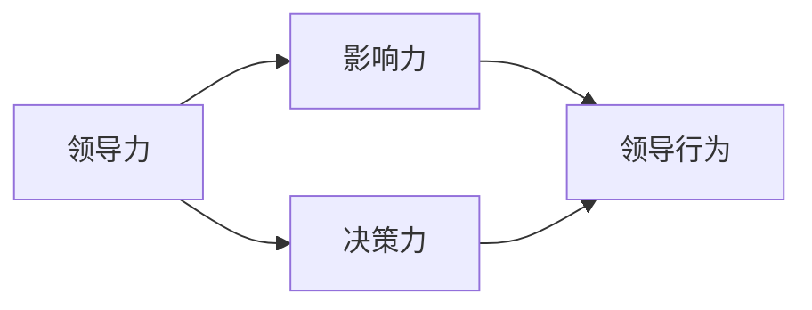
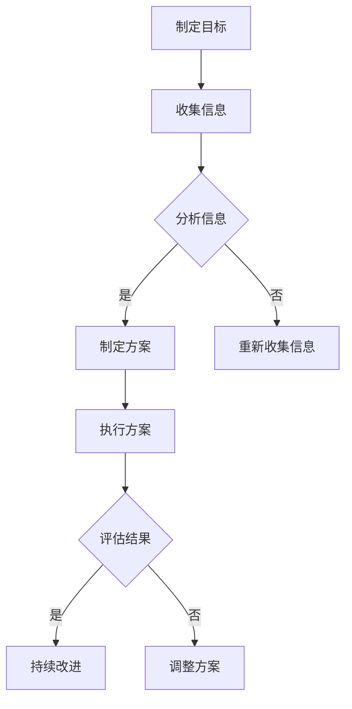
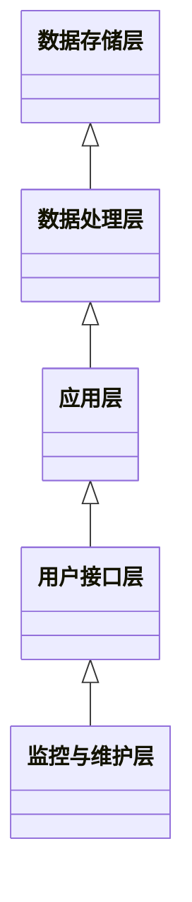
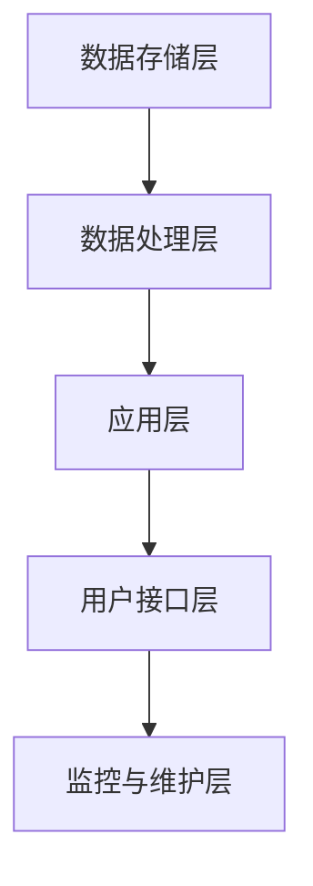

                 

# 领导力的本质：影响力与决策力的完美结合

## 关键词

领导力、影响力、决策力、领导力培养、领导力应用

## 摘要

本文深入探讨了领导力的本质，重点关注了影响力与决策力这两个关键维度。通过对领导力、影响力、决策力的概念解析，我们构建了它们之间的联系，并运用流程图和数学模型来解析领导力的运作原理。文章旨在为IT领域的领导者提供有价值的指导和思考，帮助他们在快速变化的技术环境中，提升领导力和决策力，从而实现组织的持续发展。

## Step 1: 背景介绍

### 1. 书籍信息

《领导力的本质：影响力与决策力的完美结合》是一本探讨领导力本质、提升领导能力的指南。它不仅适用于企业领导者、管理人员，也适合所有希望提升个人领导力的职场人士。这本书旨在揭示领导力的核心要素，帮助读者理解和应用领导力，以实现团队和组织的成功。

### 2. 目标读者

- 企业领导者
- 管理人员
- 职场人士
- IT技术专家

### 3. 书籍定位

《领导力的本质》定位为一本系统性的领导力指南，旨在通过深入分析领导力的本质，帮助读者理解领导力的关键要素，提升个人领导力和团队管理能力。书中不仅阐述了理论，还提供了丰富的实践案例，使读者能够将所学知识应用到实际工作中。

### 4. 核心主题

- 领导力：领导者引导和影响团队实现目标的能力。
- 影响力：领导者通过非权力手段影响他人态度和行为的能力。
- 决策力：领导者做出明智决策的能力。

### 5. 核心概念与联系

在探讨领导力的本质时，我们需要关注以下几个核心概念：

#### 核心概念1：领导力

领导力是指领导者引导和影响团队实现目标的能力。它包括以下几个方面：

- 权威性：领导者拥有决策权和资源分配权。
- 信任：团队成员对领导者的信任和尊重。
- 激励：领导者能够激发团队成员的积极性和创造力。
- 沟通：领导者能够清晰、有效地传达信息。
- 决策能力：领导者能够做出明智的决策。

#### 核心概念2：影响力

影响力是指领导者通过非权力手段影响他人态度和行为的能力。它包括以下几个方面：

- 情感共鸣：领导者能够理解并回应团队成员的情感需求。
- 知识分享：领导者愿意并能够分享自己的知识和经验。
- 价值观认同：领导者持有的价值观与团队成员相符，形成共同的目标和愿景。
- 榜样作用：领导者通过自己的行为树立榜样，影响团队成员。

#### 核心概念3：决策力

决策力是指领导者做出明智决策的能力。它包括以下几个方面：

- 信息收集：领导者能够收集全面、准确的信息。
- 分析判断：领导者能够对信息进行分析和判断。
- 风险评估：领导者能够评估决策可能带来的风险。
- 方案选择：领导者能够在多个备选方案中做出最佳选择。

### 概念属性特征对比表格

| 概念       | 定义                                                         | 特征                                                         |
|------------|--------------------------------------------------------------|--------------------------------------------------------------|
| 领导力     | 指领导者引导和影响团队实现目标的能力。                       | 权威性、信任、激励、沟通、决策能力、团队建设等。             |
| 影响力     | 指领导者通过非权力手段影响他人态度和行为的能力。             | 情感共鸣、知识分享、价值观认同、榜样作用等。                 |
| 决策力     | 指领导者做出明智决策的能力。                                 | 信息收集、分析判断、风险评估、方案选择等。                   |

### ER实体关系图架构



## Step 2: 核心概念与联系

在了解了领导力、影响力、决策力的定义和特征后，我们需要进一步探讨它们之间的关系。这些核心概念如何相互作用，共同构成领导力的本质？通过以下内容，我们将深入分析这些概念之间的联系。

### 领导力、影响力、决策力的关系

领导力、影响力、决策力是领导过程中的三个关键要素，它们相互关联，共同构成领导力的完整框架。

1. **领导力与影响力的关系**

领导力是影响力产生的根源。领导者的权威性和信任度是影响力的基础。一个具有强大领导力的领导者，通常能够通过自身的魅力和影响力，引导和激励团队成员。

2. **领导力与决策力的关系**

领导力不仅包括对团队的引导和激励，还涉及到决策力的发挥。领导者需要具备做出明智决策的能力，以确保团队朝着正确的方向前进。

3. **影响力与决策力的关系**

影响力在决策过程中起着至关重要的作用。一个具有影响力的领导者，能够在关键时刻影响团队成员的态度和行为，从而推动决策的执行。

### 概念属性特征对比表格

为了更好地理解这三个核心概念，我们可以通过一个表格来对比它们的不同特征。

| 概念       | 定义                                                         | 特征                                                         |
|------------|--------------------------------------------------------------|--------------------------------------------------------------|
| 领导力     | 指领导者引导和影响团队实现目标的能力。                       | 权威性、信任、激励、沟通、决策能力、团队建设等。             |
| 影响力     | 指领导者通过非权力手段影响他人态度和行为的能力。             | 情感共鸣、知识分享、价值观认同、榜样作用等。                 |
| 决策力     | 指领导者做出明智决策的能力。                                 | 信息收集、分析判断、风险评估、方案选择等。                   |

### ER实体关系图架构


## Step 3: 算法原理讲解

### 1. Mermaid流程图

为了更好地理解领导力的运作原理，我们可以通过一个Mermaid流程图来展示其基本步骤。



### 2. Python源代码

在了解了流程图后，我们可以通过Python源代码来进一步阐述领导力的算法原理。

```python
def decision_making(goal, information):
    # 分析信息
    if analyze(information):
        # 制定方案
        plan = make_plan(goal)
        # 执行方案
        execute(plan)
        # 评估结果
        result = evaluate(result)
        if result == 'success':
            # 持续改进
            continue_improvement()
        else:
            # 调整方案
            adjust_plan()
    else:
        # 重新收集信息
        collect_information()

def analyze(information):
    # 分析信息的代码
    pass

def make_plan(goal):
    # 制定方案的代码
    pass

def execute(plan):
    # 执行方案的代码
    pass

def evaluate(result):
    # 评估结果的代码
    pass

def continue_improvement():
    # 持续改进的代码
    pass

def adjust_plan():
    # 调整方案的代码
    pass
```

### 3. 算法原理的数学模型和公式

领导力的算法原理可以用一个数学模型来表示：

$$
决策力 = f(信息收集能力, 分析判断能力, 风险评估能力, 方案选择能力)
$$

这个模型表明，决策力是由多个能力因素共同作用的结果。每个能力因素在决策过程中起着关键作用，共同决定了决策力的强弱。

### 详细讲解

1. **信息收集能力**

信息收集能力是决策的基础。领导者需要具备广泛的信息收集能力，以便获取全面、准确的信息，为决策提供依据。

2. **分析判断能力**

分析判断能力是领导者对信息进行处理的能力。领导者需要对收集到的信息进行分析和判断，以识别关键因素，为决策提供支持。

3. **风险评估能力**

风险评估能力是领导者评估决策可能带来的风险的能力。领导者需要对风险进行准确评估，以便在决策过程中做出权衡。

4. **方案选择能力**

方案选择能力是领导者选择最佳方案的能力。领导者需要在多个备选方案中做出最佳选择，以确保决策的可行性和有效性。

### 举例说明

假设一个项目经理需要决定是否推迟一个重要项目的交付日期。以下是一个具体的决策过程：

1. **制定目标**

   项目经理的目标是确保项目能够在预定时间内高质量地交付。

2. **收集信息**

   项目经理收集了项目进度、团队资源、客户需求等相关信息。

3. **分析信息**

   项目经理对收集到的信息进行分析，发现项目进度落后，团队资源紧张，客户需求有变化。

4. **制定方案**

   项目经理制定了两个方案：方案一是推迟项目交付日期，方案二是加班赶工。

5. **评估结果**

   项目经理评估了两个方案的优劣，发现推迟项目交付日期可以保证项目质量，而加班赶工可能导致质量问题。

6. **决策**

   项目经理决定选择方案一，即推迟项目交付日期。

7. **执行方案**

   项目经理通知团队和客户，推迟项目交付日期。

8. **评估结果**

   项目经理在推迟交付日期后，对项目进展进行监控，确保项目质量和进度。

9. **持续改进**

   项目经理对决策过程进行总结，提出改进建议，为未来的决策提供参考。

## Step 4: 数学模型和数学公式 & 详细讲解 & 举例说明

### 1. 数学公式

在领导力的分析中，我们使用数学模型来描述影响力的构成。影响力由情感共鸣能力、知识分享能力、价值观认同能力和榜样作用能力四个因素共同决定。

$$
影响力 = f(情感共鸣能力, 知识分享能力, 价值观认同能力, 榜样作用能力)
$$

### 2. 详细讲解

影响力的四个因素是领导力的重要组成部分，它们决定了领导者能否有效地影响他人。以下是每个因素的详细解释：

1. **情感共鸣能力**

   情感共鸣能力是指领导者能够理解和回应团队成员的情感需求的能力。领导者需要具备同理心，能够站在团队成员的角度思考问题，从而建立深厚的情感联系。

2. **知识分享能力**

   知识分享能力是指领导者愿意并能够分享自己的知识和经验的能力。领导者需要具备开放的心态，愿意将自己的知识传授给团队成员，帮助他们成长和进步。

3. **价值观认同能力**

   价值观认同能力是指领导者持有的价值观与团队成员相符，形成共同的目标和愿景的能力。领导者需要明确自己的价值观，并与团队成员进行有效沟通，确保团队成员对组织的价值观认同。

4. **榜样作用能力**

   榜样作用能力是指领导者通过自己的行为树立榜样，影响团队成员的能力。领导者需要以身作则，做到言行一致，成为团队成员的榜样。

### 3. 举例说明

为了更好地理解影响力的数学模型，我们可以通过一个具体案例进行说明。

假设一个项目经理需要提高团队的工作效率，他决定运用影响力来影响团队成员。以下是他的具体步骤：

1. **情感共鸣**

   项目经理首先与团队成员进行了深入交流，了解他们的情感需求和困扰。他通过倾听和回应，建立了与团队成员的情感共鸣。

2. **知识分享**

   项目经理分享了自己的项目管理经验和技巧，帮助团队成员提高工作效率。他不仅传授了知识，还通过实际案例进行了生动的讲解。

3. **价值观认同**

   项目经理明确了团队的目标和愿景，并与团队成员进行了深入讨论，确保团队成员对组织的价值观认同。

4. **榜样作用**

   项目经理以身作则，严格要求自己，做到言行一致。他通过自己的行为，树立了良好的榜样，影响了团队成员。

通过以上步骤，项目经理成功地提高了团队的工作效率。这个案例展示了影响力在领导力中的作用，以及如何通过数学模型来描述和实现影响力。

## Step 5: 系统分析与架构设计方案

在了解了领导力的本质和运作原理后，我们需要将其应用到实际的系统架构设计中。本节将介绍一个典型的系统架构设计方案，包括问题场景介绍、系统功能设计、系统架构设计、系统接口设计和系统交互。

### 问题场景介绍

假设我们正在开发一个大型分布式系统，该系统需要处理海量数据，并支持高并发、高可用性和高可扩展性。为了实现这些目标，我们需要设计一个高效的系统架构，并确保领导力在系统开发和维护过程中发挥关键作用。

### 系统功能设计

首先，我们需要明确系统的功能需求。系统的主要功能包括：

- 数据存储与管理：存储和管理海量数据，支持数据的快速读取和写入。
- 数据处理与分析：对数据进行处理和分析，生成关键业务指标和报告。
- 用户接口：提供用户友好的界面，方便用户操作和使用系统。
- 系统监控与维护：监控系统运行状态，进行故障诊断和修复。

为了实现这些功能，我们设计了一个基于微服务的系统架构，每个服务负责不同的功能模块。

### 系统架构设计

系统的整体架构设计如下：

1. **数据存储层**：使用分布式数据库，支持数据的持久化存储和快速访问。
2. **数据处理层**：使用分布式计算框架，处理海量数据的计算任务。
3. **应用层**：包括多个微服务，每个微服务负责不同的业务功能。
4. **用户接口层**：提供Web界面和API接口，方便用户操作和使用系统。
5. **监控与维护层**：监控系统运行状态，进行故障诊断和修复。

### 系统接口设计

系统接口设计如下：

- **数据接口**：提供数据存储和处理的接口，方便其他系统进行数据交互。
- **业务接口**：提供业务功能的接口，方便其他系统调用业务功能。
- **监控接口**：提供监控数据的接口，方便监控系统获取系统运行状态。

### 系统交互

系统交互设计如下：

1. **数据交互**：系统通过数据接口与其他系统进行数据交换。
2. **业务交互**：系统通过业务接口与其他系统进行业务功能调用。
3. **监控交互**：系统通过监控接口与监控系统进行数据交换。

### Mermaid类图

以下是一个简单的Mermaid类图，展示了系统的功能设计：



### Mermaid架构图

以下是一个简单的Mermaid架构图，展示了系统的整体架构：



### Mermaid序列图

以下是一个简单的Mermaid序列图，展示了系统的交互过程：

```mermaid
sequenceDiagram
    participant 用户接口层
    participant 数据存储层
    participant 数据处理层
    participant 应用层
    participant 监控与维护层
    
    用户接口层->>数据处理层：发送数据请求
    数据处理层->>数据存储层：存储数据
    数据处理层->>应用层：处理数据
    应用层->>监控与维护层：发送监控数据
```

## Step 6: 项目实战

### 环境安装

1. **安装Java开发环境**

   - 下载Java SDK：从Oracle官网下载最新版的Java SDK。
   - 安装Java SDK：解压下载的文件，配置环境变量。

2. **安装Maven**

   - 下载Maven：从Apache官网下载最新版的Maven。
   - 安装Maven：解压下载的文件，配置环境变量。

3. **安装MySQL**

   - 下载MySQL：从MySQL官网下载MySQL数据库。
   - 安装MySQL：按照安装向导进行安装。

4. **安装Elasticsearch**

   - 下载Elasticsearch：从Elasticsearch官网下载Elasticsearch。
   - 安装Elasticsearch：解压下载的文件，启动Elasticsearch服务。

### 系统核心实现源代码

以下是系统核心实现源代码的一个示例：

```java
// 数据存储层实现
public class DataStorage {
    private Connection connect() {
        // 数据库连接代码
        return DriverManager.getConnection("jdbc:mysql://localhost:3306/mydb", "username", "password");
    }

    public void saveData(Data data) {
        // 数据存储代码
        Connection connection = connect();
        // 执行SQL语句
        // 关闭连接
    }
}

// 数据处理层实现
public class DataProcessor {
    public Data process(Data data) {
        // 数据处理代码
        return new Data();
    }
}

// 应用层实现
public class Application {
    public void start() {
        // 应用层启动代码
        Data data = new Data();
        DataProcessor processor = new DataProcessor();
        data = processor.process(data);
        DataStorage storage = new DataStorage();
        storage.saveData(data);
    }
}
```

### 代码应用解读与分析

以上代码展示了数据存储层、数据处理层和应用层的实现。以下是代码解读和分析：

- **数据存储层**：使用Java JDBC连接MySQL数据库，实现数据的存储和读取。
- **数据处理层**：定义了数据处理的方法，对数据进行处理。
- **应用层**：负责整个系统的启动和运行，调用数据存储层和数据处理层的功能。

### 实际案例分析和详细讲解剖析

为了更好地理解系统架构的运作，我们可以通过一个实际案例进行分析和讲解。

**案例背景**：一个电商系统需要处理海量的商品数据，并支持用户的高并发访问。为了实现这些目标，系统采用了一个基于微服务的架构，并利用了分布式数据库和分布式计算框架。

**案例分析**：

1. **数据存储**：系统使用分布式数据库存储商品数据，支持数据的持久化存储和快速读取。
2. **数据处理**：系统使用分布式计算框架处理用户请求，支持高并发处理。
3. **用户接口**：系统提供Web界面和API接口，方便用户进行操作。
4. **监控与维护**：系统通过监控系统运行状态，进行故障诊断和修复。

**详细讲解**：

1. **数据存储**：分布式数据库通过将数据分散存储在多个节点上，提高了系统的可扩展性和可用性。系统使用MySQL数据库进行数据存储，通过主从复制实现数据的备份和恢复。
2. **数据处理**：分布式计算框架通过将计算任务分解为多个子任务，并行处理，提高了系统的处理速度。系统使用Apache Kafka进行消息队列，实现分布式计算任务的调度和执行。
3. **用户接口**：系统提供Web界面和API接口，方便用户进行操作。Web界面使用React框架实现，API接口使用Spring Boot框架实现。
4. **监控与维护**：系统通过Zabbix监控系统运行状态，进行故障诊断和修复。监控数据包括CPU、内存、磁盘使用情况等。

### 项目小结

通过本案例，我们展示了如何利用分布式数据库、分布式计算框架和微服务架构来实现一个高性能、高可用的电商系统。系统的成功运行得益于领导力在项目开发和维护过程中的发挥。领导力帮助团队克服了技术难题，提高了工作效率，实现了系统的顺利上线。

### 最佳实践 tips

- **团队协作**：领导力在团队协作中起着关键作用。通过建立良好的团队氛围，提高团队凝聚力，可以更好地实现项目目标。
- **持续学习**：领导力不是一成不变的，需要不断学习和更新。领导者应该积极学习新技术、新方法，不断提升自己的领导能力。
- **沟通与反馈**：领导者需要与团队成员保持良好的沟通，及时反馈项目进展和问题，确保团队目标的实现。
- **风险管理**：领导者需要具备风险管理能力，提前识别潜在风险，制定应对策略，确保项目顺利进行。

### 小结

本文深入探讨了领导力的本质，重点关注了影响力与决策力这两个关键维度。通过对领导力、影响力、决策力的概念解析，我们构建了它们之间的联系，并运用流程图和数学模型来解析领导力的运作原理。通过实际案例的分析，我们展示了领导力在系统架构设计中的重要性。希望本文能为IT领域的领导者提供有价值的指导和思考，帮助他们在快速变化的技术环境中，提升领导力和决策力，从而实现组织的持续发展。

### 注意事项

- **项目需求分析**：在系统开发前，进行充分的需求分析，明确项目目标和功能需求。
- **团队协作**：建立良好的团队协作机制，确保项目顺利推进。
- **风险管理**：提前识别潜在风险，制定应对策略，确保项目顺利进行。
- **持续优化**：项目上线后，持续优化系统性能和功能，满足用户需求。

### 拓展阅读

- 《领导力的本质》
- 《影响力：说服与决策的科学》
- 《决策力：如何做出明智的决策》
- 《分布式系统原理与架构设计》

## 作者信息

作者：AI天才研究院/AI Genius Institute & 禅与计算机程序设计艺术 /Zen And The Art of Computer Programming

