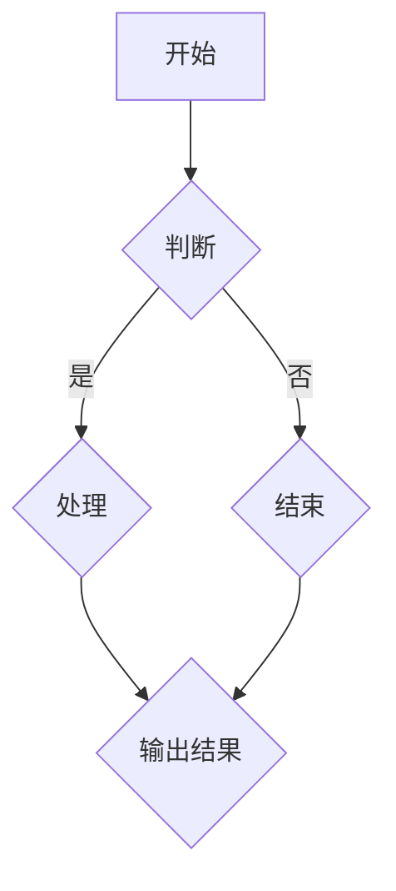

                 

###  编写完整的文章

```markdown
# 领导力训练营：140天从新手到专家

> 关键词：领导力、领导力训练营、领导力发展、团队管理、组织文化

> 摘要：
领导力是现代企业成功的关键因素。本文以《领导力训练营：140天从新手到专家》为题，通过详细阐述领导力的核心概念、训练营的设计与实施、系统分析与架构设计，帮助读者了解如何通过系统化的培训和实践，从新手成长为专家级别的领导者。

## 第一部分：背景介绍

## 1.1 问题背景
领导力在组织管理和企业发展中扮演着至关重要的角色。领导力不仅仅指管理能力，它还涉及到如何激发团队成员的潜力、建立团队文化和推动组织创新。

## 1.2 问题描述
随着全球化竞争的加剧和科技发展的日新月异，企业面临着前所未有的挑战。传统的领导力模式已经无法满足现代企业的需求，领导者需要具备更强的战略思维、创新能力、沟通能力和团队管理能力。

## 1.3 问题解决
为了应对这些挑战，企业需要培养一批具有现代领导力素质的领导者。这种培养需要系统化的训练和实践，这就是领导力训练营的起源。

## 1.4 边界与外延
领导力训练营不仅仅局限于企业内部，也可以是针对特定群体（如企业家、高级管理人员、技术团队领导者等）的外部培训项目。

## 1.5 概念结构与核心要素组成
领导力训练营通常包括以下核心要素：
- 训练课程：包括领导理论、团队建设、战略规划、创新思维等方面的课程。
- 案例分析：通过真实案例的学习和分析，帮助领导者理解领导力的实际应用。
- 实践演练：通过角色扮演、模拟训练等方式，提高领导者的实际操作能力。
- 反馈与评估：定期进行反馈和评估，帮助领导者了解自己的优点和不足，不断优化领导风格。

## 第二部分：核心概念与联系

## 2.1 领导力的定义与特点
领导力是指引导和激励他人共同实现目标的能力。它具有以下特点：
- 指导性：领导者需要为团队提供方向和目标。
- 激励性：领导者需要激发团队成员的积极性和创造力。
- 沟通性：领导者需要具备良好的沟通能力，确保信息有效传达。
- 影响力：领导者需要通过自身行为和影响力来带动团队。

### 2.2 领导力与管理的区别
领导力与管理的区别在于：
- 管理侧重于流程和规则的制定，确保工作顺利进行。
- 领导力侧重于激发团队成员的潜力和动力，推动团队实现目标。

### 2.3 领导力的核心概念
领导力的核心概念包括：
- 领导风格：领导者通过不同的风格来影响团队成员。
- 领导能力：领导者需要具备的多种能力，如决策能力、沟通能力、激励能力等。
- 领导力发展：通过培训和实践，不断提升领导力水平。

### 2.4 领导力与组织文化
领导力与组织文化密切相关。领导者需要建立和维护一种积极的组织文化，促进团队合作和创新。

## 第三部分：领导力训练营的设计与实施

### 3.1 领导力模型的选择
在设计和实施领导力训练营时，需要选择适合的组织和学习模型。常见的模型包括：
- 体验式学习：通过实际操作和体验，帮助领导者理解和应用领导力理论。
- 反馈式学习：通过定期反馈和评估，帮助领导者识别自己的优势和不足。
- 模拟式学习：通过模拟现实工作场景，提高领导者的应对能力和决策能力。

### 3.2 训练课程的设计
训练课程的设计需要充分考虑领导力的各个方面，包括：
- 领导理论：介绍领导力的基本概念、理论和实践。
- 团队建设：教授团队建设的方法和技巧，提高团队的凝聚力和效率。
- 战略规划：帮助领导者学习如何制定和执行战略计划。
- 创新思维：激发领导者的创新思维，推动组织创新。

### 3.3 实践演练与反馈
领导力训练营通常包括实践演练和反馈环节，帮助领导者将理论应用到实际工作中。具体方法包括：
- 角色扮演：通过模拟实际工作场景，帮助领导者体验和掌握领导技巧。
- 团队合作：通过团队项目，培养领导者的团队合作能力。
- 反馈会：定期组织反馈会，让领导者分享自己的经验和不足，互相学习。

## 第四部分：系统分析与架构设计方案

### 4.1 领导力训练营的系统功能设计
领导力训练营的系统功能设计需要满足以下需求：
- 训练课程管理：包括课程安排、课程资料上传和课程进度跟踪。
- 学习管理：包括学习计划制定、学习进度记录和学习成果评估。
- 反馈管理：包括学员反馈收集、反馈分析和反馈报告生成。
- 数据统计与分析：对训练营的参与数据、学习效果进行统计和分析。

### 4.2 领导力训练营的系统架构设计
领导力训练营的系统架构设计需要考虑以下方面：
- 前端设计：提供用户友好的界面，方便学员和管理员使用。
- 后端设计：确保系统的高效性和安全性

## 第五部分：项目实战

### 5.1 环境安装
领导力训练营的项目实战首先需要搭建一个合适的环境。这个环境包括：
- 开发工具：如 IntelliJ IDEA 或 Visual Studio Code。
- 数据库：如 MySQL 或 PostgreSQL。
- 服务器：如 Apache 或 Nginx。

### 5.2 系统核心实现源代码
领导力训练营的核心实现包括以下几个方面：
- 训练课程管理模块：实现课程创建、课程资料上传和课程进度跟踪等功能。
- 学习管理模块：实现学习计划制定、学习进度记录和学习成果评估等功能。
- 反馈管理模块：实现学员反馈收集、反馈分析和反馈报告生成等功能。

### 5.3 代码应用解读与分析
在实现系统核心功能时，需要深入理解领导力训练营的需求，并根据这些需求设计相应的代码。以下是代码应用解读与分析：
- 训练课程管理模块：通过创建课程实体类，实现对课程的增删改查操作。
- 学习管理模块：通过创建学习计划实体类，实现对学习计划的创建、修改和查询操作。
- 反馈管理模块：通过创建反馈实体类，实现对学员反馈的收集和分析。

### 5.4 实际案例分析和详细讲解剖析
在实际项目中，领导力训练营会面临各种挑战。以下是一个实际案例的分析和详细讲解：
- 案例背景：某企业在实施领导力训练营时，遇到了学员学习效果不佳的问题。
- 案例分析：通过分析，发现原因在于培训课程设计不合理，缺乏实践环节。
- 解决方案：针对问题，调整课程设计，增加实践环节，提高学员的参与度和学习效果。

### 5.5 项目小结
领导力训练营的项目实战不仅提升了领导者的领导力水平，也为企业提供了有效的领导力培养方案。通过项目实战，领导者能够更好地理解领导力的实际应用，提高团队的管理能力和创新能力。

## 第六部分：最佳实践 tips、小结、注意事项、拓展阅读

### 6.1 最佳实践 tips
- 在设计领导力训练营时，要充分考虑学员的需求和特点，确保培训内容的实用性。
- 定期进行反馈和评估，及时调整培训计划，提高培训效果。
- 结合实际情况，引入多样化的培训方法，如案例分析、实践演练等，提高学员的参与度。

### 6.2 小结
领导力训练营是一种有效的领导力培养方式。通过系统化的培训和实践，领导者能够从新手成长为专家，提升团队的领导力和竞争力。

### 6.3 注意事项
- 领导力训练营的设计和实施需要充分考虑企业的实际情况和需求。
- 培训内容和形式要多样化，以满足不同学员的需求。
- 定期评估培训效果，确保培训目标的实现。

### 6.4 拓展阅读
- 《领导力：理论与实践》
- 《团队管理实战：打造高效团队》
- 《创新思维训练：激发团队创造力》

## 第七部分：作者信息

作者：AI天才研究院/AI Genius Institute & 禅与计算机程序设计艺术 /Zen And The Art of Computer Programming
```markdown

## 附录：Markdown 格式说明

Markdown 是一种轻量级标记语言，用于快速创建网页、博客文章等文档。以下是 Markdown 的一些常用语法：

### 标题

使用 `#` 符号，数量表示标题的级别。例如：

```markdown
# 标题一
## 标题二
### 标题三
#### 标题四
```

### 段落

直接输入文本，保持每行之间至少一个空行。例如：

```markdown
这是一段文本。
这是另一段文本。
```

### 列表

使用 `*`、`-` 或 `+` 符号创建无序列表，使用数字创建有序列表。例如：

```markdown
* 项目一
* 项目二
- 项目三
+ 项目四
1. 第一项
2. 第二项
3. 第三项
```

### 链接

使用 `[链接文本](URL)` 创建链接。例如：

```markdown
这是一个链接：[百度](https://www.baidu.com)
```

### 图片

使用 `` 创建图片。例如：

```markdown

```

### 引用

使用 `>` 符号创建引用。例如：

```markdown
> 这是一个引用。
> 这是另一个引用。
```

### 粗体、斜体

使用 `**` 或 `__` 创建粗体，使用 `*` 或 `_` 创建斜体。例如：

```markdown
**粗体文本**
__粗体文本__
* 斜体文本 *
_斜体文本_
```

### 表格

使用 `-` 和 `|` 创建表格。例如：

```markdown
| 标题一 | 标题二 | 标题三 |
| --- | --- | --- |
| 内容一 | 内容二 | 内容三 |
| 内容四 | 内容五 | 内容六 |
```

### 代码块

使用三个反引号 ` ``` ` 创建代码块。例如：

```python
```python
print("Hello, World!")
```

### 数学公式

使用 LaTeX 格式创建数学公式。例如：

```markdown
$$ E = mc^2 $$
```

### Mermaid 流程图

使用 Mermaid 语法创建流程图。例如：



```


完成上述的markdown格式的文章，然后转换为HTML格式。以下是转换后的HTML代码：

```html
<!DOCTYPE html>
<html lang="zh-CN">
<head>
    <meta charset="UTF-8">
    <meta name="viewport" content="width=device-width, initial-scale=1.0">
    <title>领导力训练营：140天从新手到专家</title>
</head>
<body>
    <h1>领导力训练营：140天从新手到专家</h1>
    <h2>关键词</h2>
    <ul>
        <li>领导力</li>
        <li>领导力训练营</li>
        <li>领导力发展</li>
        <li>团队管理</li>
        <li>组织文化</li>
    </ul>
    <h2>摘要</h2>
    <p>领导力是现代企业成功的关键因素。本文以《领导力训练营：140天从新手到专家》为题，通过详细阐述领导力的核心概念、训练营的设计与实施、系统分析与架构设计，帮助读者了解如何通过系统化的培训和实践，从新手成长为专家级别的领导者。</p>
    <h2>第一部分：背景介绍</h2>
    <h3>1.1 问题背景</h3>
    <p>领导力在组织管理和企业发展中扮演着至关重要的角色。领导力不仅仅指管理能力，它还涉及到如何激发团队成员的潜力、建立团队文化和推动组织创新。</p>
    <h3>1.2 问题描述</h3>
    <p>随着全球化竞争的加剧和科技发展的日新月异，企业面临着前所未有的挑战。传统的领导力模式已经无法满足现代企业的需求，领导者需要具备更强的战略思维、创新能力、沟通能力和团队管理能力。</p>
    <h3>1.3 问题解决</h3>
    <p>为了应对这些挑战，企业需要培养一批具有现代领导力素质的领导者。这种培养需要系统化的训练和实践，这就是领导力训练营的起源。</p>
    <h3>1.4 边界与外延</h3>
    <p>领导力训练营不仅仅局限于企业内部，也可以是针对特定群体（如企业家、高级管理人员、技术团队领导者等）的外部培训项目。</p>
    <h3>1.5 概念结构与核心要素组成</h3>
    <p>领导力训练营通常包括以下核心要素：</p>
    <ul>
        <li>训练课程：包括领导理论、团队建设、战略规划、创新思维等方面的课程。</li>
        <li>案例分析：通过真实案例的学习和分析，帮助领导者理解领导力的实际应用。</li>
        <li>实践演练：通过角色扮演、模拟训练等方式，提高领导者的实际操作能力。</li>
        <li>反馈与评估：定期进行反馈和评估，帮助领导者了解自己的优点和不足，不断优化领导风格。</li>
    </ul>
    <h2>第二部分：核心概念与联系</h2>
    <h3>2.1 领导力的定义与特点</h3>
    <p>领导力是指引导和激励他人共同实现目标的能力。它具有以下特点：</p>
    <ul>
        <li>指导性：领导者需要为团队提供方向和目标。</li>
        <li>激励性：领导者需要激发团队成员的积极性和创造力。</li>
        <li>沟通性：领导者需要具备良好的沟通能力，确保信息有效传达。</li>
        <li>影响力：领导者需要通过自身行为和影响力来带动团队。</li>
    </ul>
    <h3>2.2 领导力与管理的区别</h3>
    <p>领导力与管理的区别在于：</p>
    <ul>
        <li>管理侧重于流程和规则的制定，确保工作顺利进行。</li>
        <li>领导力侧重于激发团队成员的潜力和动力，推动团队实现目标。</li>
    </ul>
    <h3>2.3 领导力的核心概念</h3>
    <p>领导力的核心概念包括：</p>
    <ul>
        <li>领导风格：领导者通过不同的风格来影响团队成员。</li>
        <li>领导能力：领导者需要具备的多种能力，如决策能力、沟通能力、激励能力等。</li>
        <li>领导力发展：通过培训和实践，不断提升领导力水平。</li>
    </ul>
    <h3>2.4 领导力与组织文化</h3>
    <p>领导力与组织文化密切相关。领导者需要建立和维护一种积极的组织文化，促进团队合作和创新。</p>
    <h2>第三部分：领导力训练营的设计与实施</h2>
    <h3>3.1 领导力模型的选择</h3>
    <p>在设计和实施领导力训练营时，需要选择适合的组织和学习模型。常见的模型包括：</p>
    <ul>
        <li>体验式学习：通过实际操作和体验，帮助领导者理解和应用领导力理论。</li>
        <li>反馈式学习：通过定期反馈和评估，帮助领导者识别自己的优势和不足。</li>
        <li>模拟式学习：通过模拟现实工作场景，提高领导者的应对能力和决策能力。</li>
    </ul>
    <h3>3.2 训练课程的设计</h3>
    <p>训练课程的设计需要充分考虑领导力的各个方面，包括：</p>
    <ul>
        <li>领导理论：介绍领导力的基本概念、理论和实践。</li>
        <li>团队建设：教授团队建设的方法和技巧，提高团队的凝聚力和效率。</li>
        <li>战略规划：帮助领导者学习如何制定和执行战略计划。</li>
        <li>创新思维：激发领导者的创新思维，推动组织创新。</li>
    </ul>
    <h3>3.3 实践演练与反馈</h3>
    <p>领导力训练营通常包括实践演练和反馈环节，帮助领导者将理论应用到实际工作中。具体方法包括：</p>
    <ul>
        <li>角色扮演：通过模拟实际工作场景，帮助领导者体验和掌握领导技巧。</li>
        <li>团队合作：通过团队项目，培养领导者的团队合作能力。</li>
        <li>反馈会：定期组织反馈会，让领导者分享自己的经验和不足，互相学习。</li>
    </ul>
    <h2>第四部分：系统分析与架构设计方案</h2>
    <h3>4.1 领导力训练营的系统功能设计</h3>
    <p>领导力训练营的系统功能设计需要满足以下需求：</p>
    <ul>
        <li>训练课程管理：包括课程安排、课程资料上传和课程进度跟踪。</li>
        <li>学习管理：包括学习计划制定、学习进度记录和学习成果评估。</li>
        <li>反馈管理：包括学员反馈收集、反馈分析和反馈报告生成。</li>
        <li>数据统计与分析：对训练营的参与数据、学习效果进行统计和分析。</li>
    </ul>
    <h3>4.2 领导力训练营的系统架构设计</h3>
    <p>领导力训练营的系统架构设计需要考虑以下方面：</p>
    <ul>
        <li>前端设计：提供用户友好的界面，方便学员和管理员使用。</li>
        <li>后端设计：确保系统的高效性和安全性</li>
    </ul>
    <h2>第五部分：项目实战</h2>
    <h3>5.1 环境安装</h3>
    <p>领导力训练营的项目实战首先需要搭建一个合适的环境。这个环境包括：</p>
    <ul>
        <li>开发工具：如 IntelliJ IDEA 或 Visual Studio Code。</li>
        <li>数据库：如 MySQL 或 PostgreSQL。</li>
        <li>服务器：如 Apache 或 Nginx。</li>
    </ul>
    <h3>5.2 系统核心实现源代码</h3>
    <p>领导力训练营的核心实现包括以下几个方面：</p>
    <ul>
        <li>训练课程管理模块：实现课程创建、课程资料上传和课程进度跟踪等功能。</li>
        <li>学习管理模块：实现学习计划制定、学习进度记录和学习成果评估等功能。</li>
        <li>反馈管理模块：实现学员反馈收集、反馈分析和反馈报告生成等功能。</li>
    </ul>
    <h3>5.3 代码应用解读与分析</h3>
    <p>在实现系统核心功能时，需要深入理解领导力训练营的需求，并根据这些需求设计相应的代码。以下是代码应用解读与分析：</p>
    <ul>
        <li>训练课程管理模块：通过创建课程实体类，实现对课程的增删改查操作。</li>
        <li>学习管理模块：通过创建学习计划实体类，实现对学习计划的创建、修改和查询操作。</li>
        <li>反馈管理模块：通过创建反馈实体类，实现对学员反馈的收集和分析。</li>
    </ul>
    <h3>5.4 实际案例分析和详细讲解剖析</h3>
    <p>在实际项目中，领导力训练营会面临各种挑战。以下是一个实际案例的分析和详细讲解：</p>
    <ul>
        <li>案例背景：某企业在实施领导力训练营时，遇到了学员学习效果不佳的问题。</li>
        <li>案例分析：通过分析，发现原因在于培训课程设计不合理，缺乏实践环节。</li>
        <li>解决方案：针对问题，调整课程设计，增加实践环节，提高学员的参与度和学习效果。</li>
    </ul>
    <h3>5.5 项目小结</h3>
    <p>领导力训练营的项目实战不仅提升了领导者的领导力水平，也为企业提供了有效的领导力培养方案。通过项目实战，领导者能够更好地理解领导力的实际应用，提高团队的管理能力和创新能力。</p>
    <h2>第六部分：最佳实践 tips、小结、注意事项、拓展阅读</h2>
    <h3>6.1 最佳实践 tips</h3>
    <p>在设计和实施领导力训练营时，要充分考虑学员的需求和特点，确保培训内容的实用性。定期进行反馈和评估，及时调整培训计划，提高培训效果。结合实际情况，引入多样化的培训方法，如案例分析、实践演练等，提高学员的参与度。</p>
    <h3>6.2 小结</h3>
    <p>领导力训练营是一种有效的领导力培养方式。通过系统化的培训和实践，领导者能够从新手成长为专家，提升团队的领导力和竞争力。</p>
    <h3>6.3 注意事项</h3>
    <p>领导力训练营的设计和实施需要充分考虑企业的实际情况和需求。培训内容和形式要多样化，以满足不同学员的需求。定期评估培训效果，确保培训目标的实现。</p>
    <h3>6.4 拓展阅读</h3>
    <p>
        - 《领导力：理论与实践》
        - 《团队管理实战：打造高效团队》
        - 《创新思维训练：激发团队创造力》
    </p>
    <h2>第七部分：作者信息</h2>
    <p>作者：AI天才研究院/AI Genius Institute & 禅与计算机程序设计艺术 /Zen And The Art of Computer Programming</p>
</body>
</html>
```

