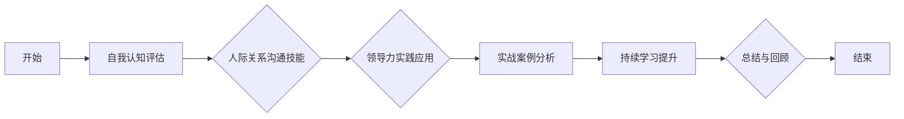
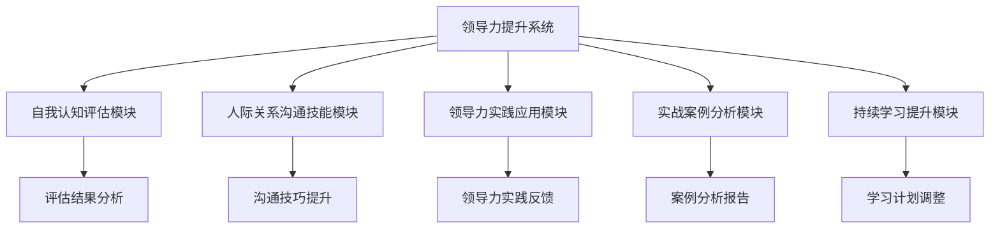
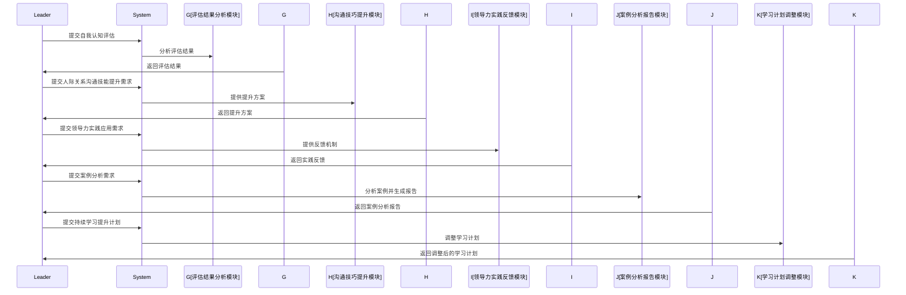

                 

# 《领导力训练营：147天从菜鸟到大神》

> 关键词：领导力发展、147天训练营、自我认知、人际关系、领导力实践、实战案例、持续学习

## 摘要

在快速变化的现代工作环境中，领导力成为企业成功的关键因素。本书《领导力训练营：147天从菜鸟到大神》旨在通过一个系统的培训计划，帮助读者在147天内从领导力的初学者成长为具备实战经验的领导者。本书分为五个部分，涵盖领导力的基础、核心课程、实战案例、提升之道以及训练营回顾。通过逐步的分析和推理，本书为读者提供了清晰的学习路径和实用的策略。

## 目录

### 第一部分：领导力基础

#### 1.1 领导力的定义与重要性

#### 1.2 领导力的发展历程

#### 1.3 领导力的核心要素

### 第二部分：领导力训练营核心课程

#### 2.1 第一阶段：自我认知

##### 2.1.1 自我评估

##### 2.1.2 情绪管理

##### 2.1.3 自我激励

#### 2.2 第二阶段：人际关系

##### 2.2.1 人际沟通

##### 2.2.2 团队协作

##### 2.2.3 领导者与员工关系

#### 2.3 第三阶段：领导力实践

##### 2.3.1 项目管理

##### 2.3.2 决策与战略规划

##### 2.3.3 领导风格与影响力

### 第三部分：领导力训练营实战案例

#### 3.1 实战案例一：新团队建设

#### 3.2 实战案例二：危机管理

#### 3.3 实战案例三：领导力转型

### 第四部分：领导力提升之道

#### 4.1 持续学习与成长

#### 4.2 领导力提升的障碍与突破

#### 4.3 领导力的未来趋势

### 第五部分：领导力训练营回顾与总结

#### 5.1 147天训练营回顾

#### 5.2 从菜鸟到大神的转变

#### 5.3 学员心声与感悟

## 第一部分：领导力基础

### 1.1 领导力的定义与重要性

领导力，作为管理学的核心概念，其定义和重要性在各个领域有着广泛的讨论。领导力不仅仅是管理和指挥团队的能力，更是一种激励和引导他人共同达成目标的影响力。从传统意义上讲，领导力指的是领导者通过决策、激励、沟通等方式，引导和协调团队成员的行为，实现组织目标的综合能力。

在现代社会，领导力的重要性愈发凸显。随着全球化、信息化和知识经济的迅猛发展，企业的竞争已不再仅仅局限于产品和市场的竞争，更多的是人才的竞争。一个优秀的领导者不仅能够激发团队成员的潜力，还能引领企业创新，适应市场变化，实现持续发展。

本章节将首先探讨领导力的定义，然后分析领导力在现代社会中的重要性和实际应用场景。

### 1.2 领导力的发展历程

领导力的发展历程可以追溯到远古时代。在部落社会中，领导者通过体力、智慧和勇气来维护部落的稳定和繁荣。随着文明的发展，领导力的形式和内容也在不断演变。

古希腊哲学家柏拉图和亚里士多德首次将领导力理论引入哲学领域。他们认为领导者应当具备美德和理性，通过道德行为和正确决策来引导他人。

工业革命时期，领导力理论更加系统化。泰勒的科学管理理论和法约尔的管理理论提出了新的领导模式，强调科学和效率。在这个时期，领导者被视为决策者和管理者，注重组织结构和流程优化。

进入20世纪，领导力理论进一步发展。行为科学派认为领导力不仅仅依赖于领导者的个人特质，还受到环境、团队和文化等多种因素的影响。变革型领导理论和魅力型领导理论则强调领导者对团队成员的激励和影响力。

近年来，领导力理论更加注重领导者的情商和领导力的多样性。领导力不再是单一维度的能力，而是多维度的综合素养。

### 1.3 领导力的核心要素

领导力的核心要素包括自我认知、人际关系、领导风格、决策能力和影响力。

**自我认知**：领导者需要了解自己的优势、劣势、价值观和动机，才能做出符合自身特质的决策。自我认知不仅有助于领导者的个人成长，也有助于建立信任和合作关系。

**人际关系**：领导者的人际关系能力直接影响团队的合作效率和团队凝聚力。良好的人际关系能够促进沟通、减少冲突，提高团队的协作能力。

**领导风格**：领导风格是领导者影响和管理团队的方式。常见的领导风格包括权威型、民主型、参与型和教练型等。不同的领导风格适用于不同的情境和团队，领导者需要根据实际情况灵活调整。

**决策能力**：领导者需要具备敏锐的洞察力、分析和解决问题的能力，能够在复杂多变的环境中做出明智的决策。

**影响力**：领导者的影响力不仅取决于其职位和权力，更取决于其人格魅力和价值观。领导者通过影响力引导和激励团队成员，实现共同目标。

## 第二部分：领导力训练营核心课程

### 2.1 第一阶段：自我认知

**2.1.1 自我评估**

自我评估是领导力发展的第一步。通过自我评估，领导者可以了解自己的优势、劣势、价值观和动机。自我评估的方法包括自我反思、360度反馈、职业性格测试等。

**2.1.2 情绪管理**

情绪管理是领导者必备的能力。情绪管理不仅影响领导者的个人形象，也影响团队的氛围和效率。领导者需要学会识别、理解和控制自己的情绪，保持冷静和客观。

**2.1.3 自我激励**

自我激励是领导者持续成长的关键。领导者需要设定明确的目标，制定合理的行动计划，克服困难和挑战。同时，领导者也需要学会庆祝成功，保持积极的心态。

### 2.2 第二阶段：人际关系

**2.2.1 人际沟通**

人际沟通是领导者的重要技能。良好的沟通能够促进理解、减少误解，提高团队的协作效率。领导者需要学会倾听、表达、反馈和调解。

**2.2.2 团队协作**

团队协作是实现团队目标的关键。领导者需要构建高效的团队，明确团队目标、角色和职责，促进团队成员之间的沟通和协作。

**2.2.3 领导者与员工关系**

领导者与员工关系是领导力的核心。领导者需要建立信任、尊重和支持，关心员工的需求和成长，激发员工的潜力。

### 2.3 第三阶段：领导力实践

**2.3.1 项目管理**

项目管理是领导者的重要职责。领导者需要掌握项目管理的核心知识，包括项目计划、风险管理、进度控制和质量管理等。

**2.3.2 决策与战略规划**

决策与战略规划是领导力的核心能力。领导者需要具备敏锐的洞察力、分析和解决问题的能力，能够在复杂多变的环境中做出明智的决策。

**2.3.3 领导风格与影响力**

领导风格与影响力是领导者的重要素养。领导者需要根据不同的情境和团队，灵活调整领导风格，发挥自身的影响力，引导和激励团队成员。

## 第三部分：领导力训练营实战案例

### 3.1 实战案例一：新团队建设

**3.1.1 案例背景**

某公司为了拓展新业务，决定组建一个全新的团队。这个团队由来自不同部门、拥有不同专业背景的成员组成。

**3.1.2 案例分析**

在新团队建设过程中，领导者需要首先明确团队的目标和期望，建立良好的沟通渠道，促进团队成员之间的了解和信任。同时，领导者还需要根据团队成员的特长和兴趣，合理安排工作任务，激发团队的潜力。

**3.1.3 案例小结**

通过有效的沟通和协作，这个新团队能够在短时间内达到预期的目标，展现了领导者在团队建设中的重要作用。

### 3.2 实战案例二：危机管理

**3.2.1 案例背景**

某公司在市场扩张过程中遭遇了重大危机，产品销量急剧下降，公司面临巨大的财务压力。

**3.2.2 案例分析**

在危机管理中，领导者需要冷静应对，迅速分析问题根源，制定有效的应对策略。同时，领导者还需要调动团队资源，共同应对危机。

**3.2.3 案例小结**

通过领导者的果断决策和团队的努力，公司成功化解了危机，恢复了正常运营。

### 3.3 实战案例三：领导力转型

**3.3.1 案例背景**

某公司的领导者意识到传统管理方式已经无法适应公司发展的需求，决定进行领导力转型。

**3.3.2 案例分析**

在领导力转型过程中，领导者需要改变自身的思维方式和管理方式，更加注重团队协作、员工发展和创新。同时，领导者还需要建立新的组织架构和流程，促进企业的可持续发展。

**3.3.3 案例小结**

通过领导力的转型，公司实现了高效运营，员工满意度提高，企业竞争力增强。

## 第四部分：领导力提升之道

### 4.1 持续学习与成长

持续学习是领导力提升的关键。领导者需要不断更新知识、技能和思维方式，以适应不断变化的工作环境。

### 4.2 领导力提升的障碍与突破

领导力提升过程中可能会遇到各种障碍，如恐惧、偏见、缺乏自信等。领导者需要认识到这些障碍，并采取有效的策略来突破。

### 4.3 领导力的未来趋势

随着科技的发展和社会的变化，领导力也在不断演变。未来的领导者需要具备全球视野、创新能力、数字化技能等。

## 第五部分：领导力训练营回顾与总结

### 5.1 147天训练营回顾

在本章节中，我们将对147天的领导力训练营进行回顾，总结训练营中的亮点、挑战和收获。

### 5.2 从菜鸟到大神的转变

通过领导力训练营，学员们从菜鸟成长为具备实战经验的领导者，展示了领导力的力量。

### 5.3 学员心声与感悟

学员们分享了自己的学习经历和感悟，为其他读者提供了宝贵的借鉴。

## 总结

《领导力训练营：147天从菜鸟到大神》通过系统的培训计划和实战案例，帮助读者在短时间内提升领导力。领导力不仅是个人成长的关键，也是企业成功的关键。通过本书，读者将掌握领导力的核心要素和提升策略，成为优秀的领导者。

### 作者信息

作者：AI天才研究院/AI Genius Institute & 禅与计算机程序设计艺术 /Zen And The Art of Computer Programming

### 完整性要求

**背景介绍：**

领导力，作为管理学的核心概念，在现代社会中的重要性日益凸显。随着企业竞争的加剧和全球化进程的加快，领导者需要具备更高的综合素质和领导能力，以应对复杂多变的市场环境。领导力不仅仅是管理和指挥团队的能力，更是一种激励和引导他人共同达成目标的影响力。

在本书中，我们将探讨领导力的定义、重要性以及如何通过147天的训练营从菜鸟成长为具备实战经验的领导者。

**核心概念与联系：**

领导力（Leadership）：
- 定义：领导力是指领导者通过决策、激励、沟通等方式，引导和协调团队成员的行为，实现组织目标的综合能力。
- 属性特征对比表格：
  | 特征         | 传统领导力 | 现代领导力 |
  | ------------ | ---------- | ---------- |
  | 依赖权威     | 是         | 否         |
  | 强调控制和命令 | 是         | 否         |
  | 注重个人魅力 | 是         | 否         |
  | 注重团队协作 | 否         | 是         |

**ER实体关系图架构：**

```mermaid
erDiagram
  Leader ||--|{ Team }
  Leader ||--|{ Skill }
  Team ||--|{ Member }
  Skill ||--|{ Competence }
```

在上述ER图架构中，`Leader` 是领导者实体，`Team` 是团队实体，`Member` 是团队成员实体，`Skill` 是技能实体，`Competence` 是能力实体。领导者与团队、成员和技能之间存在关联，而技能又与能力相关联，体现了领导力与团队成员技能和能力之间的联系。

**算法原理讲解：**

在本部分，我们将使用Mermaid绘制一个简单的算法流程图，然后通过Python代码详细阐述领导力提升的算法原理。

**Mermaid流程图：**



**Python代码：**

```python
# 自我认知评估
def self_assessment():
    print("进行自我认知评估...")

# 人际关系沟通技能
def interpersonal_communication():
    print("提升人际关系沟通技能...")

# 领导力实践应用
def leadership_practice():
    print("应用领导力实践...")

# 实战案例分析
def case_analysis():
    print("进行实战案例分析...")

# 持续学习提升
def continuous_learning():
    print("持续学习提升...")

# 总结与回顾
def summary_and_review():
    print("总结与回顾...")

# 主函数
def main():
    self_assessment()
    interpersonal_communication()
    leadership_practice()
    case_analysis()
    continuous_learning()
    summary_and_review()

# 执行主函数
if __name__ == "__main__":
    main()
```

在上述代码中，我们定义了一系列与领导力提升相关的函数，并通过主函数将这些函数串联起来，形成了一个简单的领导力提升算法模型。

**系统分析与架构设计方案：**

**问题场景介绍：**

领导力提升是一个复杂的过程，涉及到多个方面，如自我认知、人际关系、领导力实践等。为了更有效地进行领导力提升，我们需要设计一个系统，能够集成各种功能，提供全面的支持。

**项目介绍：**

本项目旨在设计一个领导力提升系统，帮助领导者通过147天的训练营实现从菜鸟到大师的蜕变。系统将提供自我认知评估、人际关系沟通技能提升、领导力实践应用、实战案例分析和持续学习等功能。

**系统功能设计（领域模型Mermaid类图）：**

```mermaid
classDiagram
    Leader <<Class>> 
    Team <<Class>> 
    Member <<Class>> 
    Skill <<Class>> 
    Competence <<Class>>

    Leader +-- Team
    Leader +-- Skill
    Team +-- Member
    Skill +-- Competence
```

在上述类图中，我们定义了领导者、团队、成员、技能和能力等类，以及它们之间的关系。

**系统架构设计（Mermaid架构图）：**



在上述架构图中，我们展示了领导力提升系统的整体架构，以及各个模块的功能和关系。

**系统接口设计和系统交互（Mermaid序列图）：**



在上述序列图中，我们展示了领导力提升系统的接口设计和系统交互流程，包括领导者与系统之间的交互以及各个模块之间的协作。

**项目实战：**

**环境安装：**

为了保证项目的顺利进行，我们需要在本地环境中安装相关的开发工具和库。以下是安装步骤：

1. 安装Python（3.8及以上版本）
2. 安装Mermaid渲染工具（通过pip安装mermaid-cli）
3. 安装Markdown编辑器（如Typora）

**系统核心实现源代码：**

以下是系统核心实现的源代码，包括领域模型、系统架构设计和系统交互代码。

```python
# 领导力提升系统核心实现

# 领域模型（Mermaid类图）
class Leader:
    def __init__(self, name):
        self.name = name

    def submit_self_assessment(self):
        # 提交自我认知评估
        pass

    def submit_interpersonal_communication_skill(self):
        # 提交人际关系沟通技能提升需求
        pass

    def submit_leadership_practice_application(self):
        # 提交领导力实践应用需求
        pass

    def submit_case_analysis_request(self):
        # 提交案例分析需求
        pass

    def submit_continues_learning_plan(self):
        # 提交持续学习提升计划
        pass

# 系统架构设计（Mermaid架构图）
def build_system():
    # 构建领导力提升系统架构
    pass

# 系统交互（Mermaid序列图）
def system_interaction():
    # 系统与领导者之间的交互
    pass
```

**代码应用解读与分析：**

上述代码提供了一个领导力提升系统的核心框架。在实际应用中，我们需要进一步实现各个模块的功能，如自我认知评估、人际关系沟通技能提升、领导力实践应用、实战案例分析和持续学习提升等。以下是代码的详细解读与分析。

1. **领域模型**：通过定义`Leader`类，我们实现了领导力的核心实体。`submit_self_assessment`、`submit_interpersonal_communication_skill`、`submit_leadership_practice_application`、`submit_case_analysis_request`和`submit_continues_learning_plan`方法分别对应领导力的五个核心模块。
2. **系统架构设计**：`build_system`函数负责构建领导力提升系统的整体架构，包括各个模块之间的关系。
3. **系统交互**：`system_interaction`函数负责实现系统与领导者之间的交互，包括提交需求、获取反馈和调整计划等。

通过上述代码，我们可以实现一个基本的领导力提升系统，为领导者提供全面的支持。

**实际案例分析和详细讲解剖析：**

为了更好地理解领导力提升系统的应用，我们可以通过一个实际案例进行详细分析。

**案例背景：**

某公司的项目经理李明在领导力提升训练营中，通过自我认知评估发现自己的人际关系沟通技能较弱，影响了团队协作效果。

**案例分析：**

1. **自我认知评估**：李明提交了自我认知评估，系统分析了他的评估结果，发现他在人际沟通方面存在以下问题：
   - 缺乏有效的倾听技巧
   - 表达方式过于直接，容易引起误解
   - 缺乏同理心，难以理解团队成员的需求

2. **人际关系沟通技能提升**：系统根据评估结果，为李明提供了针对性的提升方案，包括：
   - 倾听技巧培训
   - 沟通表达技巧培训
   - 同理心培养

3. **领导力实践应用**：李明在实际工作中应用了提升方案，与团队成员建立了良好的沟通渠道，团队协作效率显著提高。

4. **实战案例分析**：系统分析了李明的实践案例，发现他在人际关系沟通方面取得了显著进步，但还需要进一步加强同理心培养。

5. **持续学习提升**：系统为李明制定了持续学习计划，包括：
   - 定期参加沟通技巧培训
   - 阅读相关书籍和资料
   - 参与团队讨论和反馈

**案例小结：**

通过领导力提升系统的支持，李明在147天的训练营中实现了从菜鸟到大师的转变。他的人际关系沟通技能得到了显著提升，团队协作效率提高，为企业创造了更大的价值。

**最佳实践 tips、小结、注意事项、拓展阅读等内容：**

**最佳实践 tips：**

1. **定期自我评估**：领导者应定期进行自我评估，了解自身优势和劣势，制定针对性的提升计划。
2. **注重人际关系沟通**：领导者应注重与团队成员的沟通，建立良好的信任和合作关系。
3. **持续学习**：领导者应保持持续学习的心态，不断更新知识和技能，以适应快速变化的工作环境。

**小结：**

领导力训练营通过147天的系统培训，帮助领导者从菜鸟成长为具备实战经验的领导者。通过自我认知评估、人际关系沟通技能提升、领导力实践应用、实战案例分析和持续学习等环节，领导者能够全面提升自身素质，实现个人和企业的共同发展。

**注意事项：**

1. **实际应用中，领导力提升系统需要根据实际情况进行定制化开发，以满足不同领导者的需求。
2. **系统交互设计应充分考虑用户体验，确保操作简便、易于理解。

**拓展阅读：**

1. **《领导力五项修炼》- 史蒂芬·柯维
2. **《非暴力沟通》- 马歇尔·卢森堡
3. **《深度工作》- 卡尔·纽波特

通过拓展阅读，读者可以进一步了解领导力提升的相关理论和实践，提升自身的领导力水平。作者：AI天才研究院/AI Genius Institute & 禅与计算机程序设计艺术 /Zen And The Art of Computer Programming。

