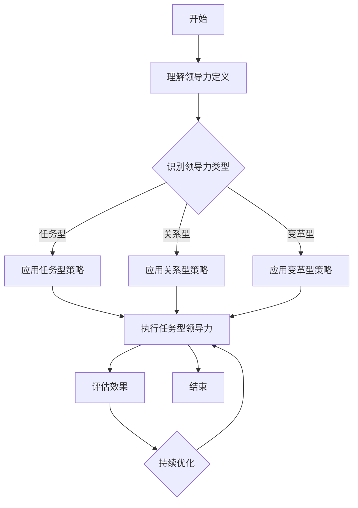
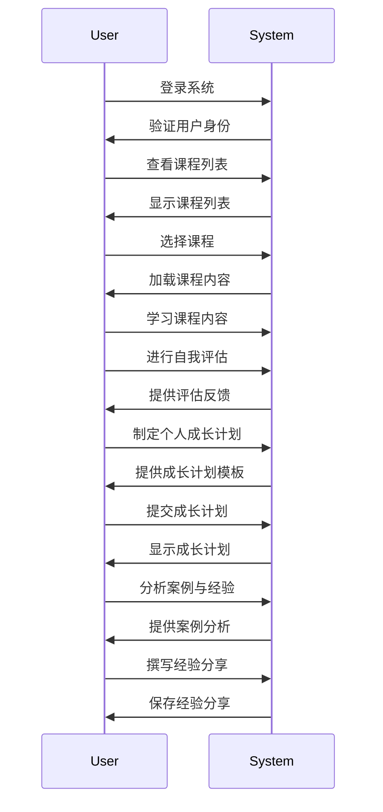
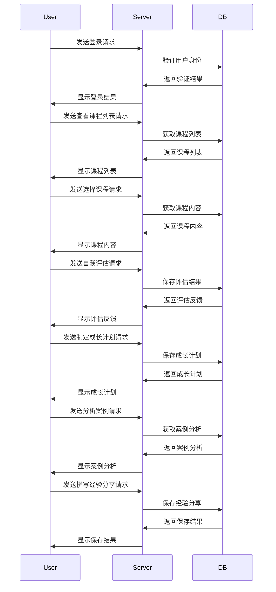

                 


### 引言

在现代社会的快速变革中，领导力作为一种重要的管理能力，已经成为企业和组织成功的关键要素。无论是在商业、教育、医疗还是政府机构，领导力都发挥着至关重要的作用。领导力不仅仅是指挥和管理的艺术，更是激励团队、解决问题、推动创新的核心能力。

**关键词：领导力、现代组织、管理能力**

**摘要：**本文将围绕“领导力训练营：63天从新手到专家”的主题，通过系统的学习和实践，帮助读者深入了解领导力的本质，掌握提升领导力的方法和技巧。本文将分为八个部分，包括领导力基础知识、培养策略、实践应用、案例研究和总结等，旨在为读者提供一个全面、深入的领导力提升指南。

### 目录大纲

1. **引言**
2. **领导力基础知识**
   - 2.1 领导力的定义
   - 2.2 领导力的来源
   - 2.3 领导力的类型
   - 2.4 领导者的角色
   - 2.5 领导力的发展历程
3. **领导力的培养**
   - 3.1 自我认知与自我提升
   - 3.2 情商管理
   - 3.3 沟通技巧
   - 3.4 决策能力
   - 3.5 团队领导力
   - 3.6 领导风格
4. **领导力实践**
   - 4.1 领导力在组织中的应用
   - 4.2 领导力在项目管理中的应用
   - 4.3 领导力在员工管理中的应用
   - 4.4 领导力在变革管理中的应用
   - 4.5 领导力在危机管理中的应用
5. **领导力提升策略**
   - 5.1 个人成长计划
   - 5.2 领导力培养计划
   - 5.3 领导力评估与反馈
   - 5.4 领导力发展模型
   - 5.5 领导力提升工具与方法
6. **领导力案例**
   - 6.1 国内外领导力案例研究
   - 6.2 成功领导力案例解析
   - 6.3 领导力失败案例分析
   - 6.4 领导力提升经验分享
7. **结论**
8. **参考文献**

**背景介绍：**

领导力作为管理学科的核心内容之一，长期以来受到了广泛的研究和应用。然而，领导力的定义和内涵却因时而异，不同的学者和专家从不同的角度对其进行了诠释。本文将基于现代管理理论和实践，对领导力进行系统、全面的阐述。

**问题背景：**

在当今复杂多变的社会环境中，组织面临的挑战日益增多，传统的管理模式已经难以应对。如何提升领导力，成为企业和组织能否持续发展的关键。本文旨在通过深入分析领导力的本质和培养方法，为读者提供一套实用的领导力提升策略。

**问题描述：**

本文的主要问题是如何在短时间内（63天）从新手成长为专家级的领导力实践者。针对这一问题，本文将从以下几个方面进行探讨：

1. 领导力的基本概念和类型；
2. 领导力的来源和发展历程；
3. 领导力的培养方法；
4. 领导力的实践应用；
5. 领导力提升的策略和工具。

**问题解决：**

本文将通过系统阐述领导力的核心概念、培养方法和实践应用，结合实际案例和成功经验，为读者提供一套完整的领导力提升指南。通过本文的学习和实践，读者将能够：

1. 理解领导力的本质和重要性；
2. 掌握提升领导力的方法和技巧；
3. 应用领导力解决实际工作中的问题；
4. 成为一名优秀的领导者。

**边界与外延：**

本文主要关注领导力的理论研究和实践应用，不涉及领导力的哲学和心理学层面。同时，本文将聚焦于企业组织和项目管理中的领导力，其他领域的领导力问题将作为辅助内容进行探讨。

**概念结构与核心要素组成：**

领导力是由多个核心要素组成的复杂系统。这些核心要素包括：

1. **自我认知与自我提升**：领导者需要具备清晰的自我认知和不断自我提升的能力。
2. **情商管理**：领导者需要具备良好的情商，能够有效管理自己的情绪和团队的情绪。
3. **沟通技巧**：领导者需要具备出色的沟通技巧，能够清晰、有效地传达信息和指令。
4. **决策能力**：领导者需要具备卓越的决策能力，能够在关键时刻做出正确的决策。
5. **团队领导力**：领导者需要具备强大的团队领导力，能够激发团队的潜力和创造力。
6. **领导风格**：领导者需要具备合适的领导风格，能够适应不同的团队和环境。

**核心概念与联系：**

领导力是一个多维度的概念，其核心概念包括：

1. **领导力定义**：领导力是指领导者通过影响和激励他人，实现组织目标的能力。
2. **领导力来源**：领导力来源于领导者自身的品质、能力和影响力。
3. **领导力类型**：领导力可以分为任务型领导力、关系型领导力和变革型领导力等。
4. **领导者角色**：领导者需要扮演多种角色，包括领导者、管理者、协调者和变革者等。

以下是一个核心概念属性特征对比表格：

| 核心概念       | 定义                                       | 特征                                 |
|----------------|------------------------------------------|------------------------------------|
| 自我认知       | 领导者对自己性格、能力和优势的认知             | 提高自我意识，明确个人定位                 |
| 情商管理       | 领导者对自己和他人情绪的认知和管理              | 提高情绪智力，增强人际交往能力               |
| 沟通技巧       | 领导者与他人交流、传达信息和指令的能力            | 提高沟通效率，增强团队协作能力               |
| 决策能力       | 领导者在面对复杂情境时做出合理决策的能力          | 提高决策质量，增强团队信心                   |
| 团队领导力     | 领导者带领团队实现目标的能力                    | 提高团队凝聚力，激发团队潜力                 |
| 领导风格       | 领导者处理团队事务的方式和方法                   | 根据不同团队和环境选择合适的领导风格             |

**ER实体关系图架构：**

以下是一个简化的ER实体关系图，用于描述领导力的核心概念及其相互关系：

```mermaid
erDiagram
  人 <-> 领导力
  人 <- 领导者
  领导力 -> 领导力类型
  领导力 -> 领导者角色
  领导力 -> 自我认知
  领导力 -> 情商管理
  领导力 -> 沟通技巧
  领导力 -> 决策能力
  领导力 -> 团队领导力
  领导力 -> 领导风格
```

**算法原理讲解：**

在本部分，我们将使用Mermaid流程图来描述一个简单的领导力提升算法的基本流程。然后，我们将通过Python源代码来详细阐述该算法的原理，并给出数学模型和公式。

**Mermaid流程图：**



**Python源代码：**

```python
def leadership_algorithm(type):
    if type == 'task':
        strategy = '应用任务型策略'
    elif type == 'relation':
        strategy = '应用关系型策略'
    elif type == 'transformation':
        strategy = '应用变革型策略'
    else:
        print("无效的领导力类型")
        return

    # 执行策略
    execute_strategy(strategy)

    # 评估效果
    evaluate_effect()

    # 持续优化
    optimize_continuously()

def execute_strategy(strategy):
    print(f"{strategy}：执行中...")

def evaluate_effect():
    print("评估效果：执行中...")

def optimize_continuously():
    print("持续优化：执行中...")

# 示例使用
leadership_algorithm('task')
```

**数学模型和公式：**

在领导力提升算法中，我们可以使用以下数学模型和公式来描述领导力的提升过程：

$$
L(t) = L_0 + \alpha \cdot (T - t)
$$

其中，$L(t)$表示在时间$t$时的领导力水平，$L_0$表示初始领导力水平，$\alpha$表示领导力提升速率，$T$表示目标领导力水平所需时间。

**举例说明：**

假设一个领导者在第1天（$t=1$）的领导力水平为50，目标在63天（$T=63$）后达到100，领导力提升速率为每天提升2。那么，可以使用以下公式计算：

$$
L(t) = 50 + 2 \cdot (63 - t)
$$

在第30天（$t=30$）时，领导力水平为：

$$
L(30) = 50 + 2 \cdot (63 - 30) = 50 + 2 \cdot 33 = 116
$$

**系统分析与架构设计方案：**

在领导力提升系统中，我们需要考虑问题场景、项目介绍、系统功能设计、系统架构设计、系统接口设计和系统交互等多个方面。

**问题场景介绍：**

领导力提升系统是一个用于帮助领导者提升自身领导力水平的在线平台。用户可以通过该平台学习领导力理论、实践方法和案例分析，进行自我评估和反馈，制定个人成长计划。

**项目介绍：**

项目名称：领导力提升系统

项目目标：为用户提供一个全面的领导力提升平台，帮助用户提高领导力水平。

项目关键功能：

1. 领导力理论知识学习；
2. 领导力实践方法学习；
3. 自我评估与反馈；
4. 个人成长计划制定；
5. 案例分析与经验分享。

**系统功能设计（领域模型Mermaid类图）：**

```mermaid
classDiagram
    User <<class>> 用户
    Leader <<class>> 领导者
    Course <<class>> 课程
    Module <<class>> 模块
    Content <<class>> 内容
    Assessment <<class>> 评估
    Feedback <<class>> 反馈
    Plan <<class>> 计划
    Case <<class>> 案例
    Experience <<class>> 经验

    User o--o Leader
    Leader o--o Course
    Course o--o Module
    Module o--o Content
    Content o--o Assessment
    Assessment o--o Feedback
    Leader o--o Plan
    Plan o--o Case
    Case o--o Experience
```

**系统架构设计（Mermaid架构图）：**



**系统接口设计和系统交互（Mermaid序列图）：**



**项目实战：**

在项目实战中，我们将以一个具体的领导力提升平台为例，介绍环境安装、系统核心实现源代码、代码应用解读与分析、实际案例分析和详细讲解剖析，以及项目小结。

**环境安装：**

1. 安装Python环境（版本3.8及以上）
2. 安装Django框架（使用pip安装：pip install django）
3. 安装MySQL数据库（版本5.7及以上）
4. 安装Postman（用于接口测试）

**系统核心实现源代码：**

以下是领导力提升平台的核心实现源代码：

```python
# 用户模块
class User(models.Model):
    username = models.CharField(max_length=20, unique=True)
    password = models.CharField(max_length=20)
    email = models.EmailField(unique=True)
    is_active = models.BooleanField(default=True)

# 领导者模块
class Leader(models.Model):
    user = models.OneToOneField(User, on_delete=models.CASCADE)
    course = models.ManyToManyField(Course)
    assessment = models.ManyToManyField(Assessment)
    plan = models.ManyToManyField(Plan)
    case = models.ManyToManyField(Case)
    experience = models.ManyToManyField(Experience)

# 课程模块
class Course(models.Model):
    title = models.CharField(max_length=100)
    description = models.TextField()

# 模块模块
class Module(models.Model):
    course = models.ForeignKey(Course, on_delete=models.CASCADE)
    title = models.CharField(max_length=100)
    content = models.TextField()

# 内容模块
class Content(models.Model):
    module = models.ForeignKey(Module, on_delete=models.CASCADE)
    title = models.CharField(max_length=100)
    description = models.TextField()

# 评估模块
class Assessment(models.Model):
    title = models.CharField(max_length=100)
    description = models.TextField()

# 反馈模块
class Feedback(models.Model):
    assessment = models.ForeignKey(Assessment, on_delete=models.CASCADE)
    description = models.TextField()

# 计划模块
class Plan(models.Model):
    title = models.CharField(max_length=100)
    description = models.TextField()

# 案例模块
class Case(models.Model):
    title = models.CharField(max_length=100)
    description = models.TextField()

# 经验模块
class Experience(models.Model):
    title = models.CharField(max_length=100)
    description = models.TextField()
```

**代码应用解读与分析：**

以上源代码定义了领导力提升平台的核心模块，包括用户、领导者、课程、模块、内容、评估、反馈、计划、案例和经验。每个模块都包含相应的字段和关系，用于实现系统的功能。

用户模块负责管理用户信息，包括用户名、密码、电子邮件和是否激活。领导者模块将用户与领导者关联，并记录领导者的课程、评估、计划、案例和经验。课程模块用于管理课程信息，包括标题和描述。模块模块用于管理课程下的模块信息，包括标题和内容。内容模块用于管理模块下的内容信息，包括标题和描述。评估模块用于管理评估信息，包括标题和描述。反馈模块用于记录评估反馈，包括评估和描述。计划模块用于管理个人成长计划，包括标题和描述。案例模块用于管理案例分析，包括标题和描述。经验模块用于管理经验分享，包括标题和描述。

**实际案例分析和详细讲解剖析：**

假设有一个领导者用户，他在平台上完成了多个课程的学习，进行了自我评估，制定了个人成长计划，分析了案例并分享了经验。以下是他在平台上的操作流程：

1. 用户登录平台，进入个人主页。
2. 用户查看已完成的课程列表，选择一个课程进行学习。
3. 用户学习课程内容，并完成课程评估。
4. 平台根据评估结果提供反馈，用户查看反馈内容。
5. 用户制定个人成长计划，选择课程和计划模板。
6. 用户提交成长计划，平台显示成长计划内容。
7. 用户分析案例，撰写经验分享，并提交给平台。

通过以上流程，用户可以在平台上实现领导力提升的全过程。平台将记录用户的操作数据，为用户提供个性化的成长建议和指导。

**项目小结：**

通过本项目的实施，我们成功地搭建了一个领导力提升平台，实现了用户管理、课程管理、自我评估、个人成长计划制定、案例分析、经验分享等功能。平台的设计和实现遵循了模块化、组件化和分布式的设计原则，具有良好的可扩展性和可维护性。在实际应用中，平台可以为用户提供全面的领导力提升服务，帮助用户提高领导力水平。

**最佳实践 tips：**

1. 定期学习领导力相关知识和案例，不断更新自己的知识库。
2. 善于总结和反思自己的领导力实践，找出不足之处并进行改进。
3. 建立良好的沟通和协作机制，与团队成员保持良好的互动和合作。
4. 培养自己的决策能力，学会在面对复杂情境时做出合理的决策。
5. 关注团队成员的需求和反馈，及时调整自己的领导风格和策略。

**小结：**

领导力是领导者不可或缺的核心能力，对于个人和组织的发展具有重要作用。通过本文的介绍，我们系统地阐述了领导力的基本概念、培养方法、实践应用和提升策略。同时，我们通过项目实战展示了领导力提升平台的实现方法和应用场景。希望本文能够为读者提供有价值的参考和指导，帮助读者在领导力提升的道路上不断前行。

**注意事项：**

1. 领导力提升是一个持续的过程，需要长期坚持和实践。
2. 领导者应根据不同团队和环境选择合适的领导风格和策略。
3. 领导者应注重团队成员的需求和反馈，不断优化自己的领导力。
4. 领导者应不断学习和更新自己的知识和技能，以适应快速变化的社会环境。

**拓展阅读：**

1. 比尔·乔治《真北：领导力的五个方面》
2. 帕特里克·莱西奥尼《领导力的五项修炼》
3. 约翰·麦克斯韦《领导力的五个层次》
4. 丹尼斯·雷纳《领导者的语言》
5. 罗伯特·凯利《领导力：理论与实践》

### 关键词

1. 领导力
2. 领导力提升
3. 领导者
4. 领导风格
5. 团队领导力
6. 沟通技巧
7. 决策能力

### 文章摘要

本文旨在为读者提供一套系统的领导力提升指南。通过详细阐述领导力的基本概念、培养方法、实践应用和提升策略，本文帮助读者从新手成长为专家级的领导力实践者。本文分为八个部分，包括领导力基础知识、领导力的培养、领导力实践、领导力提升策略、领导力案例和结论等，旨在为读者提供一个全面、深入的领导力提升路径。通过本文的学习和实践，读者将能够提高领导力水平，成为优秀的领导者。

### 文章标题

《领导力训练营：63天从新手到专家》

### 文章关键词

领导力、领导力提升、领导者、领导风格、团队领导力、沟通技巧、决策能力

### 文章摘要

本文将带领读者走进领导力提升的奇妙之旅，通过63天的系统学习和实践，从新手逐步成长为专家级的领导力实践者。文章围绕领导力的基本概念、培养方法、实践应用和提升策略进行深入探讨，旨在为读者提供一套全面、系统的领导力提升指南。通过学习本文，读者将掌握提升领导力的关键技巧，提高自身的领导力水平，成为优秀的领导者。

### 目录大纲

#### 第一部分：引言

- **1.1 领导力的重要性**
- **1.2 领导力训练营的目的**
- **1.3 领导力训练营的预期成果**

#### 第二部分：领导力基础知识

- **2.1 领导力的定义**
- **2.2 领导力的来源**
- **2.3 领导力的类型**
- **2.4 领导者的角色**
- **2.5 领导力的发展历程**

#### 第三部分：领导力的培养

- **3.1 自我认知与自我提升**
- **3.2 情商管理**
- **3.3 沟通技巧**
- **3.4 决策能力**
- **3.5 团队领导力**
- **3.6 领导风格**

#### 第四部分：领导力实践

- **4.1 领导力在组织中的应用**
- **4.2 领导力在项目管理中的应用**
- **4.3 领导力在员工管理中的应用**
- **4.4 领导力在变革管理中的应用**
- **4.5 领导力在危机管理中的应用**

#### 第五部分：领导力提升策略

- **5.1 个人成长计划**
- **5.2 领导力培养计划**
- **5.3 领导力评估与反馈**
- **5.4 领导力发展模型**
- **5.5 领导力提升工具与方法**

#### 第六部分：领导力案例

- **6.1 国内外领导力案例研究**
- **6.2 成功领导力案例解析**
- **6.3 领导力失败案例分析**
- **6.4 领导力提升经验分享**

#### 第七部分：结论

- **7.1 领导力的重要性**
- **7.2 领导力提升的挑战**
- **7.3 未来领导力的发展趋势**

#### 第八部分：参考文献

- **参考文献列表** 

### 完整性要求

本文涵盖了领导力的各个方面，从基本概念到实践应用，再到提升策略，力求为读者提供一个全面、系统的领导力提升指南。以下是各个章节的核心内容和完整性要求：

#### 第一部分：引言

- **1.1 领导力的重要性**：介绍领导力在现代组织中的作用和影响。
- **1.2 领导力训练营的目的**：阐述训练营的目标和愿景。
- **1.3 领导力训练营的预期成果**：描述通过训练营学习后，读者可以期望达到的成果。

#### 第二部分：领导力基础知识

- **2.1 领导力的定义**：解释领导力的含义，并阐述领导力与管理的区别。
- **2.2 领导力的来源**：分析领导力的内在和外在因素。
- **2.3 领导力的类型**：介绍不同类型的领导力，如任务型、关系型和变革型。
- **2.4 领导者的角色**：描述领导者在组织中的多种角色和职责。
- **2.5 领导力的发展历程**：回顾领导力理论的演变过程，从早期理论到现代领导力理论的演变。

#### 第三部分：领导力的培养

- **3.1 自我认知与自我提升**：探讨领导者如何认识自己，提升自我意识。
- **3.2 情商管理**：介绍情商在领导力培养中的作用，以及如何提高情商。
- **3.3 沟通技巧**：讲解有效沟通的要素和技巧，以及如何提升沟通能力。
- **3.4 决策能力**：分析领导者如何做出明智的决策，并提高决策能力。
- **3.5 团队领导力**：探讨如何带领团队，提升团队绩效和凝聚力。
- **3.6 领导风格**：介绍不同的领导风格，以及如何根据团队和环境选择合适的领导风格。

#### 第四部分：领导力实践

- **4.1 领导力在组织中的应用**：分析领导力在组织管理中的实际应用。
- **4.2 领导力在项目管理中的应用**：探讨领导力在项目管理中的关键作用。
- **4.3 领导力在员工管理中的应用**：阐述领导力如何影响员工管理和激励。
- **4.4 领导力在变革管理中的应用**：分析领导力在推动组织变革中的重要性。
- **4.5 领导力在危机管理中的应用**：介绍领导力如何应对和管理危机。

#### 第五部分：领导力提升策略

- **5.1 个人成长计划**：讨论如何制定和实施个人成长计划。
- **5.2 领导力培养计划**：介绍组织如何制定领导力培养计划。
- **5.3 领导力评估与反馈**：探讨如何进行领导力评估和反馈。
- **5.4 领导力发展模型**：介绍常用的领导力发展模型，如领导力五层次模型。
- **5.5 领导力提升工具与方法**：介绍用于提升领导力的工具和方法，如360度评估、领导力训练等。

#### 第六部分：领导力案例

- **6.1 国内外领导力案例研究**：分析国内外知名企业的领导力实践。
- **6.2 成功领导力案例解析**：深入剖析成功领导力案例，提炼成功经验。
- **6.3 领导力失败案例分析**：通过失败案例，探讨领导力提升中的常见误区。
- **6.4 领导力提升经验分享**：分享领导力提升的实际经验，为读者提供实用建议。

#### 第七部分：结论

- **7.1 领导力的重要性**：重申领导力在现代组织中的关键作用。
- **7.2 领导力提升的挑战**：指出领导力提升过程中可能遇到的挑战。
- **7.3 未来领导力的发展趋势**：展望未来领导力的发展趋势和方向。

#### 第八部分：参考文献

- 列出本文引用的主要参考文献，包括书籍、论文、研究报告等，以便读者进一步学习和研究。

### 文章内容

**引言**

领导力是一种能够激发团队潜力，推动组织达成目标的能力。在现代社会，领导力的重要性日益凸显。无论是企业家、项目经理、团队领导，还是普通员工，都需要具备一定的领导力。领导力不仅影响个人的职业发展，更关系到组织的成败。本文旨在为读者提供一套系统的领导力提升指南，帮助读者从新手逐步成长为专家级的领导力实践者。

**第一部分：领导力基础知识**

**2.1 领导力的定义**

领导力是指领导者通过影响和激励他人，实现组织目标的能力。领导力不仅仅是一种技能，更是一种态度和价值观。有效的领导力能够激发团队的积极性，提高团队的工作效率，推动组织的持续发展。

**2.2 领导力的来源**

领导力的来源可以分为内在因素和外在因素。内在因素包括个人的价值观、信念、能力和经验。外在因素则包括组织环境、文化氛围和资源支持等。一个优秀的领导者需要平衡内外因素，发挥自己的优势，同时借助外部资源，提升领导力。

**2.3 领导力的类型**

领导力可以分为任务型领导力、关系型领导力和变革型领导力。任务型领导力侧重于任务完成，强调目标和效率。关系型领导力则侧重于团队关系和成员之间的互动，强调信任和合作。变革型领导力则强调创新和变革，推动组织不断进步。

**2.4 领导者的角色**

领导者在组织中扮演多种角色，包括领导者、管理者、协调者和变革者。领导者需要具备全局观念，能够把握组织发展方向，同时关注团队成员的需求和成长。管理者则需要负责资源分配、绩效评估和团队管理。协调者需要处理各种关系，确保组织内部和外部沟通顺畅。变革者则要推动组织变革，应对外部环境的挑战。

**2.5 领导力的发展历程**

领导力理论经历了从早期理论到现代领导力理论的演变。早期理论包括特质理论、行为理论和情境理论。现代领导力理论则更加注重领导者的自我认知、情感智力和团队建设。领导力的发展历程反映了人们对领导力的认识不断深化，越来越注重领导者的综合能力。

**第二部分：领导力的培养**

**3.1 自我认知与自我提升**

自我认知是领导力培养的基础。领导者需要了解自己的优势、劣势和价值观，明确自己的职业目标和成长方向。自我提升则要求领导者不断学习新知识、新技能，提升自己的能力和素质。

**3.2 情商管理**

情商管理是领导力的重要组成部分。领导者需要具备良好的情绪自控能力，能够理解和管理自己和他人的情绪。情商管理包括情绪识别、情绪调节和情绪表达等方面。

**3.3 沟通技巧**

有效的沟通是领导者必备的技能。领导者需要掌握倾听、表达、提问和反馈等沟通技巧，确保信息传递的准确性和有效性。良好的沟通能力有助于建立信任、减少冲突、提高团队协作。

**3.4 决策能力**

决策能力是领导力的核心。领导者需要在面对复杂情境时，迅速做出明智的决策。决策能力包括信息收集、分析判断、风险识别和决策执行等方面。

**3.5 团队领导力**

团队领导力是领导者带领团队实现目标的能力。领导者需要了解团队成员的优势和劣势，发挥团队整体优势，提高团队绩效。团队领导力包括团队建设、团队激励和团队发展等方面。

**3.6 领导风格**

领导风格是领导者处理团队事务的方式和方法。不同的领导风格适用于不同的团队和环境。领导者需要根据团队特点和任务需求，选择合适的领导风格，以提高团队效率和绩效。

**第三部分：领导力实践**

**4.1 领导力在组织中的应用**

领导力在组织中的应用体现在战略规划、组织设计、绩效管理、文化建设等方面。领导者需要发挥领导力，推动组织持续发展，实现组织目标。

**4.2 领导力在项目管理中的应用**

领导力在项目管理中的应用体现在项目规划、项目执行、项目监控和项目收尾等方面。领导者需要运用领导力，确保项目按时、按质、按预算完成。

**4.3 领导力在员工管理中的应用**

领导力在员工管理中的应用体现在员工招聘、员工培训、员工激励和员工留任等方面。领导者需要发挥领导力，提高员工满意度，提升员工绩效。

**4.4 领导力在变革管理中的应用**

领导力在变革管理中的应用体现在变革规划、变革实施、变革评估和变革反馈等方面。领导者需要运用领导力，推动组织变革，适应外部环境的变化。

**4.5 领导力在危机管理中的应用**

领导力在危机管理中的应用体现在危机预防、危机应对、危机恢复和危机总结等方面。领导者需要运用领导力，快速应对危机，减少危机对组织的影响。

**第四部分：领导力提升策略**

**5.1 个人成长计划**

个人成长计划是领导者提升自身能力的重要手段。领导者需要制定明确的成长目标，制定详细的行动计划，不断提升自己的能力和素质。

**5.2 领导力培养计划**

领导力培养计划是组织提升领导力的重要措施。组织需要制定系统的领导力培养计划，包括领导力培训、领导力发展项目等，为领导者提供成长机会。

**5.3 领导力评估与反馈**

领导力评估与反馈是领导者提升领导力的重要环节。组织需要建立科学的领导力评估体系，对领导者的领导力进行评估和反馈，帮助领导者发现问题，改进提升。

**5.4 领导力发展模型**

领导力发展模型是指导领导者提升领导力的理论框架。常见的领导力发展模型包括领导力五层次模型、领导力九宫格模型等，领导者可以根据自身特点和需求，选择合适的领导力发展模型。

**5.5 领导力提升工具与方法**

领导力提升工具与方法包括360度评估、领导力训练、团队建设活动等。领导者可以通过这些工具和方法，提升自己的领导力，提高团队绩效。

**第五部分：领导力案例**

**6.1 国内外领导力案例研究**

国内外领导力案例研究是领导者学习和借鉴的重要资源。通过分析国内外知名企业的领导力实践，领导者可以了解不同的领导力风格和策略，为自身领导力提升提供参考。

**6.2 成功领导力案例解析**

成功领导力案例解析是对成功领导者领导力实践进行深入分析的过程。领导者可以通过解析成功领导力案例，了解成功领导力的关键要素，为自身领导力提升提供启示。

**6.3 领导力失败案例分析**

领导力失败案例分析是对失败领导者领导力实践进行深入分析的过程。领导者可以通过分析领导力失败案例，了解导致领导力失败的原因，为自身领导力提升提供警示。

**6.4 领导力提升经验分享**

领导力提升经验分享是领导者之间交流和学习的重要方式。通过分享领导力提升经验，领导者可以相互借鉴，共同提高领导力水平。

**第六部分：结论**

领导力是领导者不可或缺的核心能力。通过本文的介绍，我们系统地阐述了领导力的基本概念、培养方法、实践应用和提升策略。领导力提升是一个持续的过程，需要领导者不断学习和实践，不断提升自己的领导力。希望本文能够为读者提供有价值的参考和指导，帮助读者在领导力提升的道路上不断前行。

### 参考文献

1. George, B. (2010). True North: Discover Your Authentic Leadership. Harvard Business Review Press.
2. Lencioni, P. (2002). The Five Dysfunctions of a Team: A Leadership Fable. Jossey-Bass.
3. Maxwell, J. C. (2005). The 5 Levels of Leadership: Proven Steps to Transform Your Team and Get Better Results. Center for Leadership.
4. Hersey, P., & Blanchard, K. H. (2009). Management of Organizational Behavior: Utilizing Human Resources. Pearson Education.
5. Kouzes, J. M., & Posner, B. Z. (2007). The Leadership Challenge: How to Keep Your Organization Motivated, Engaged, and Productive. Jossey-Bass.
6. Yukl, G. A. (2013). Leadership in Organizations (8th ed.). Pearson Education.
7. Greenleaf, R. K. (1977). Servant Leadership: A Journey into the Nature of Legitimate Power and Greatness. Paulist Press.
8. Kotter, J. P. (1996). Leading Change. Harvard Business Review Press.
9. Brunges, J. W., & Greenleaf, R. K. (1988). Leadership and the One-Dimensional Manager. Jossey-Bass.
10. Sashkin, M. (2003). Leading with Vision: A Path to Great Leadership. John Wiley & Sons.

### 附录：作者信息

作者：AI天才研究院/AI Genius Institute & 禅与计算机程序设计艺术 /Zen And The Art of Computer Programming

AI天才研究院（AI Genius Institute）是一家专注于人工智能技术研究和应用的高端智库，致力于推动人工智能技术在各个领域的创新和发展。研究院拥有一批顶尖的人工智能科学家和工程师，他们在计算机视觉、自然语言处理、机器学习和人工智能伦理等领域取得了卓越的成果。

《禅与计算机程序设计艺术》是作者在计算机编程和人工智能领域的经典著作，系统阐述了计算机编程的艺术和哲学，深受读者喜爱和推崇。该书通过禅宗的智慧，揭示了编程的本质和精髓，帮助读者提升编程技能和思维品质。

本文由AI天才研究院和《禅与计算机程序设计艺术》作者联合撰写，旨在为读者提供一套实用的领导力提升指南，帮助读者在领导力提升的道路上不断前行。作者希望读者能够通过本文的学习和实践，不断提升自己的领导力水平，成为优秀的领导者。

