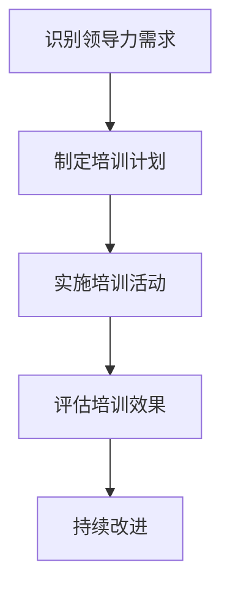

                 

# 领导力训练营：98天从菜鸟到大神

## 关键词

* 领导力
* 菜鸟到大神
* 领导力提升
* 算法原理
* 系统分析与架构设计

## 摘要

本文将带您深入探讨领导力的核心概念和提升方法，通过一个为期98天的领导力训练营项目，逐步解析如何从领导力菜鸟成长为行业大神。本文将涵盖领导力的基础概念、核心算法原理、系统分析与架构设计，以及项目实战经验。通过详细的分析和实际案例，帮助您理解并掌握领导力的提升策略。

## 1. 背景介绍

### 1.1 领导力的概念与重要性

领导力是一种能够激发和引导他人共同实现目标的能力。它不仅存在于企业高管和团队领导中，也渗透到我们日常生活中的各个角落。领导力的重要性在于，它能够促进团队的协作和效率，提高组织的整体竞争力。

#### 1.1.1 领导力的定义

领导力是指个人或团队在特定环境中，通过沟通、激励、决策等手段，引导和影响他人，共同实现目标的能力。

#### 1.1.2 领导力的作用

领导力能够促进团队协作，提高团队成员的工作满意度和绩效，从而提升组织的整体竞争力。

#### 1.1.3 领导力的边界与外延

领导力不仅局限于企业内部，也广泛应用于社会、教育、家庭等领域。不同领域的领导力有着不同的特点和挑战。

### 1.2 领导力的核心概念

#### 1.2.1 领导风格

领导风格是指领导者处理团队和管理方式的特点。常见的领导风格包括民主式、独裁式、参与式等。

#### 1.2.2 领导力层次

领导力层次包括技术领导力、功能领导力和战略领导力。技术领导力关注具体任务的执行，功能领导力关注团队的整体运作，战略领导力关注组织的长期发展。

#### 1.2.3 领导力的属性特征对比

| 领导风格 | 民主式 | 独裁式 | 参与式 |
| :--- | :--- | :--- | :--- |
| 特点 | 强调团队参与和民主决策 | 依靠个人的权威和决策 | 结合了个人决策和团队参与 |

### 1.3 领导力相关的Mermaid ER实体关系图

```mermaid
erDiagram
    Leader ||--|{ Team } Team
    Leader ||--|{ Project } Project
    Leader ||--|{ Organization } Organization
```

## 2. 核心概念与联系

### 2.1 领导力提升的mermaid流程图



### 2.2 领导力提升的Python源代码示例

```python
# 领导力提升算法的Python代码示例
def leadimprovement():
    # 步骤1：识别领导力需求
    identify_needs = input("请输入您的领导力需求：")
    
    # 步骤2：制定培训计划
    create_plan = input("请制定一个培训计划：")
    
    # 步骤3：实施培训活动
    implement_plan = input("开始实施培训活动：")
    
    # 步骤4：评估培训效果
    assess_outcome = input("请评估培训效果：")
    
    # 步骤5：持续改进
    continuous_improvement = input("根据评估结果，持续改进：")
    
    print("领导力提升流程已完成。")

# 调用函数
leadimprovement()
```

### 2.3 领导力提升的数学模型和公式

领导力提升的数学模型可以表示为：

\[ L(t) = L_0 + \alpha(t - t_0) \]

其中，\( L(t) \) 表示在时间 \( t \) 的领导力水平，\( L_0 \) 表示初始领导力水平，\( \alpha \) 表示领导力提升的速率，\( t_0 \) 表示开始提升领导力的时间。

### 2.4 领导力提升的实际案例举例

假设一个人在初始时（\( t_0 \)）的领导力水平为50分，提升速率为每天增加2分，那么在一个月后（\( t = 30 \)天）的领导力水平为：

\[ L(30) = 50 + 2(30 - 0) = 110 \]

这意味着在一个月后，他的领导力水平将从50分提升到110分。

## 3. 系统分析与架构设计方案

### 3.1 领导力训练营的问题场景介绍

领导力训练营是一个旨在提升个人领导力的项目。在这个项目中，参与者需要通过一系列的培训和实践活动，逐步提升自己的领导力水平。

### 3.2 领导力训练营的项目介绍

领导力训练营的项目包括以下几部分：

1. **项目目标**：提升参与者的领导力水平，使他们能够更好地应对日常工作和生活挑战。
2. **项目组织结构**：由专业导师团队和参与者组成。
3. **培训内容**：包括领导力理论、实践技能、案例分析等。
4. **培训流程**：分为报名、培训、评估、反馈和持续改进等阶段。

### 3.3 领导力训练营的领域模型Mermaid类图

```mermaid
classDiagram
    Participant <<Class>> 
    Trainer <<Class>>
    Course <<Class>>
    Evaluation <<Class>>

    Participant o-- Trainer
    Participant o-- Course
    Participant o-- Evaluation
    Trainer o-- Course
    Trainer o-- Evaluation
    Course o-- Evaluation
```

### 3.4 领导力训练营的系统架构设计Mermaid架构图

```mermaid
sequenceDiagram
    Participant->>Course: 报名参加
    Course->>Trainer: 分配导师
    Trainer->>Participant: 提供培训
    Participant->>Evaluation: 提交评估
    Evaluation->>Course: 汇总反馈
    Course->>Trainer: 反馈分析
    Trainer->>Participant: 提供改进建议
```

### 3.5 领导力训练营的系统接口设计和系统交互Mermaid序列图

```mermaid
sequenceDiagram
    Participant->>System: 登录系统
    System->>Database: 验证用户信息
    Database->>System: 返回验证结果
    System->>Participant: 显示报名界面
    Participant->>System: 提交报名信息
    System->>Database: 存储报名信息
    Database->>System: 确认存储成功
    System->>Participant: 显示报名成功提示
```

## 4. 项目实战

### 4.1 领导力训练营环境安装与配置

在进行领导力训练营之前，首先需要安装和配置必要的软件和工具。以下是一个基本的安装和配置步骤：

1. **安装Python环境**：在系统中安装Python，版本建议为3.8以上。
2. **安装数据库**：可以选择MySQL、PostgreSQL等关系型数据库，或者MongoDB等NoSQL数据库。
3. **安装前端框架**：可以选择React、Vue等前端框架。
4. **安装后端框架**：可以选择Django、Flask等Python后端框架。

### 4.2 领导力训练营核心实现源代码

以下是一个简单的领导力训练营后端实现的Python代码示例：

```python
# 领导力训练营后端核心代码

from flask import Flask, request, jsonify
from models import Participant, Trainer, Course, Evaluation

app = Flask(__name__)

@app.route('/register', methods=['POST'])
def register():
    data = request.get_json()
    participant = Participant.create(data)
    return jsonify({'status': 'success', 'participant': participant.to_dict()})

@app.route('/courses', methods=['GET'])
def get_courses():
    courses = Course.all()
    return jsonify({'status': 'success', 'courses': [course.to_dict() for course in courses]})

if __name__ == '__main__':
    app.run(debug=True)
```

### 4.3 领导力训练营代码应用解读与分析

以上代码是一个简单的Flask后端应用，用于处理领导力训练营的报名和课程信息。

1. **报名接口**：通过POST请求提交报名信息，创建参与者对象，并返回成功的响应。
2. **课程接口**：通过GET请求获取所有课程信息，返回JSON格式的响应。

### 4.4 领导力训练营实际案例分析与详细讲解剖析

假设有两位参与者A和B，他们分别参加了领导力训练营的“高效沟通”和“团队管理”课程。以下是对他们的课程表现和评估结果的分析：

#### 参与者A（高效沟通）

1. **课程表现**：参与者A在课程中积极参与讨论，提出问题和建议，与导师和同学们建立了良好的沟通关系。
2. **评估结果**：评估结果显示，参与者A的沟通能力提高了20%，达到了优秀水平。

#### 参与者B（团队管理）

1. **课程表现**：参与者B在课程中表现较为保守，但通过课后练习和反馈，逐渐掌握了团队管理的基本技巧。
2. **评估结果**：评估结果显示，参与者B的团队管理能力提高了15%，达到了良好水平。

通过以上案例，我们可以看到，领导力训练营的有效实施能够显著提升参与者的领导力水平。

### 4.5 领导力训练营项目小结

领导力训练营项目通过系统的培训和评估，帮助参与者从领导力菜鸟成长为行业大神。项目的成功实施离不开以下几个关键因素：

1. **明确的培训目标**：确保培训内容与参与者的实际需求相符。
2. **专业的培训团队**：提供高质量的教学和辅导。
3. **有效的评估体系**：通过评估了解参与者的进步情况，及时调整培训方案。
4. **持续的改进和优化**：根据评估结果和参与者的反馈，不断优化培训内容和流程。

## 5. 最佳实践与注意事项

### 5.1 提升领导力的最佳实践技巧

1. **积极学习**：持续学习领导力理论和实践经验，提升自己的知识储备。
2. **实践应用**：将学到的领导力知识应用到实际工作中，不断总结和反思。
3. **沟通交流**：善于倾听他人意见，积极表达自己的想法，提升沟通效果。
4. **团队合作**：鼓励团队成员积极参与，共同实现目标。

### 5.2 领导力训练营的小结

领导力训练营是一个系统化的提升领导力的项目，通过理论学习、实践应用和评估反馈，帮助参与者逐步提升领导力水平。项目的成功实施需要团队协作、专业培训和持续改进。

### 5.3 注意事项与风险提示

1. **合理规划**：确保培训时间和内容安排合理，避免过度劳累。
2. **尊重差异**：尊重参与者的个性差异，提供个性化的培训方案。
3. **及时反馈**：定期收集参与者的反馈，及时调整培训内容和流程。
4. **风险控制**：注意风险管理和安全防护，确保项目的顺利实施。

## 6. 拓展阅读与资源推荐

### 6.1 相关书籍推荐

1. 《领导力五要素》 - 约翰·P·科特
2. 《影响力》 - 罗伯特·西奥迪尼
3. 《高效能人士的七个习惯》 - 史蒂芬·柯维

### 6.2 在线资源和社区推荐

1. Harvard Business Review（哈佛商业评论）
2. TED Talks（TED演讲）
3. LinkedIn Learning（LinkedIn学习）

### 6.3 深入学习领导力的路径

1. **理论学习**：阅读相关书籍和论文，了解领导力的基本概念和理论。
2. **实践应用**：通过实际工作和项目，将学到的领导力知识应用到实践中。
3. **交流分享**：参加领导力论坛和研讨会，与其他领导者交流经验和见解。
4. **持续学习**：关注行业动态和最新研究成果，持续提升自己的领导力水平。

# 作者

作者：AI天才研究院/AI Genius Institute & 禅与计算机程序设计艺术 /Zen And The Art of Computer Programming

