                 

### 《领导力训练：让你的团队如虎添翼》

#### 关键词：领导力、团队管理、沟通技巧、激励策略、领导力发展

> 摘要：在当今快速变化的技术环境中，有效的领导力对于团队的成功至关重要。本文将探讨领导力的重要性，深入分析领导者的素质与能力，并详细讲解沟通技巧、激励策略和决策与问题解决技巧。通过案例分析，我们旨在提供实用的领导力发展路径，帮助领导者提升团队绩效，实现共同目标。

#### 第一部分：领导力基础知识

##### 第1章：领导力概述

###### **1.1 领导力的重要性**

领导力是影响团队绩效的关键因素。在快速变化的技术环境中，领导者需要具备适应能力和创新能力，以应对不断变化的市场需求和竞争环境。有效的领导力能够激发团队成员的潜力，提高工作效率，实现组织目标。

###### **1.2 领导力的定义与类型**

领导力可以被定义为影响他人实现目标的能力。根据领导者的行为和风格，领导力可以分为多种类型，如变革型领导、授权型领导和事务型领导。每种领导力类型都有其独特的优势和适用场景。

###### **1.3 领导力的发展趋势**

随着科技的发展和组织结构的演变，领导力也在不断演变。现代领导者需要具备跨文化沟通能力、创新思维和领导数字化转型的能力。未来的领导力发展将更加注重个性化、灵活性和可持续性。

##### 第2章：领导者的素质与能力

###### **2.1 领导者的核心素质**

领导者的核心素质包括诚实、自信、勇气、同理心和决心。这些素质是领导者建立信任、激发团队成员潜力和应对挑战的基础。

###### **2.2 领导者的能力模型**

领导者的能力模型包括技术技能、人际技能和概念技能。技术技能涉及专业知识，人际技能涉及沟通和团队管理，概念技能涉及战略规划和决策能力。

###### **2.3 领导力的自我评估**

领导者可以通过自我评估工具，如360度反馈和领导力评估问卷，来了解自己的领导风格和能力，从而有针对性地进行改进和发展。

#### 第二部分：领导力技巧与实践

##### 第3章：沟通技巧

###### **3.1 沟通的重要性**

有效的沟通是领导力的核心要素。良好的沟通能够确保信息传递准确无误，促进团队合作，提高工作效率。

###### **3.2 有效沟通的要素**

有效沟通的要素包括清晰表达、积极倾听、反馈和开放式问题。通过这些要素，领导者可以建立有效的沟通渠道，提高团队的沟通效率。

###### **3.3 沟通障碍与解决策略**

沟通障碍可能来自语言障碍、文化差异、信息过载等。领导者可以通过提高自我意识、建立共同语言和使用技术工具来解决沟通障碍。

##### 第4章：激励与团队管理

###### **4.1 激励理论**

激励理论包括马斯洛的需求层次理论、赫茨伯格的双因素理论和目标设置理论。这些理论为领导者提供了激励员工的框架。

###### **4.2 激励策略**

激励策略包括认可和奖励、提供发展机会和建立公平的工作环境。通过这些策略，领导者可以激发员工的潜力，提高团队绩效。

###### **4.3 团队建设与管理**

团队建设和管理涉及建立团队愿景、明确团队目标、促进团队成员之间的合作和解决团队冲突。有效的团队管理能够提高团队凝聚力和工作效率。

##### 第5章：决策与问题解决

###### **5.1 决策模型**

决策模型包括理性决策模型和模糊决策模型。这些模型为领导者提供了制定决策的框架。

###### **5.2 决策制定过程**

决策制定过程包括问题识别、信息收集、方案评估和决策执行。通过这些步骤，领导者可以制定有效的决策。

###### **5.3 问题解决的策略**

问题解决的策略包括分析问题、寻找解决方案、评估解决方案和实施解决方案。有效的问题解决策略能够帮助领导者应对复杂挑战。

#### 第三部分：领导力发展

##### 第6章：领导力培养与成长

###### **6.1 领导力发展路径**

领导力发展路径包括自我认知、技能提升、实践经验和反思学习。通过这些路径，领导者可以不断提高自己的领导能力。

###### **6.2 领导力发展实践**

领导力发展实践包括参与领导力培训、阅读相关书籍、参加研讨会和网络课程等。这些实践可以帮助领导者获取新的知识和技能。

###### **6.3 持续学习的价值**

持续学习是领导力发展的重要一环。通过不断学习，领导者可以保持敏锐的洞察力，适应不断变化的环境。

##### 第7章：领导力案例分析

###### **7.1 成功的领导力案例**

通过分析成功的领导力案例，领导者可以学习到有效的领导策略和实践方法。

###### **7.2 失败的领导力案例**

通过分析失败的领导力案例，领导者可以了解常见的领导错误，避免重蹈覆辙。

###### **7.3 从案例中学习领导力**

从案例中学习领导力可以帮助领导者更好地理解领导力的本质和实践。

#### 结语

领导力是团队成功的关键。通过本文的讨论，我们认识到领导力的重要性，了解了领导者的素质与能力，掌握了沟通技巧、激励策略和决策与问题解决技巧。通过不断学习和实践，领导者可以不断提升自己的领导能力，为团队的成长和发展做出贡献。

#### 作者信息：

作者：AI天才研究院/AI Genius Institute & 禅与计算机程序设计艺术 /Zen And The Art of Computer Programming

---

**完整文章正文**

### 《领导力训练：让你的团队如虎添翼》

#### 关键词：领导力、团队管理、沟通技巧、激励策略、领导力发展

> 摘要：在当今快速变化的技术环境中，有效的领导力对于团队的成功至关重要。本文将探讨领导力的重要性，深入分析领导者的素质与能力，并详细讲解沟通技巧、激励策略和决策与问题解决技巧。通过案例分析，我们旨在提供实用的领导力发展路径，帮助领导者提升团队绩效，实现共同目标。

---

#### **第一部分：领导力基础知识**

##### **第1章：领导力概述**

###### **1.1 领导力的重要性**

在快速变化的技术环境中，领导力成为团队成功的关键因素。有效的领导力不仅能够激发团队成员的潜力，提高工作效率，还能确保团队在应对市场变化和竞争时具备灵活性和适应性。

**问题背景**：随着技术的发展，市场需求不断变化，团队需要具备快速适应和创新能力。这要求领导者不仅要有远见，还要有能够影响和激励团队成员的能力。

**问题描述**：如何在一个充满不确定性和变化的环境中，通过领导力来确保团队的稳定性和创新能力？

**问题解决**：领导者需要通过有效的领导力来建立团队的核心价值观，明确目标，并激发团队成员的潜力。

**边界与外延**：领导力不仅涉及技术和业务方面的能力，还包括人际沟通、决策制定和团队管理等多个方面。

**概念结构与核心要素组成**：

- **领导力核心概念**：领导力是一种影响他人实现共同目标的能力。
- **领导力类型**：包括变革型领导、授权型领导和事务型领导等。
- **领导力发展趋势**：未来的领导力将更加注重个性化、灵活性和可持续性。

###### **1.2 领导力的定义与类型**

**核心概念原理**：领导力是一种影响力，领导者通过这种影响力来引导和激励团队成员。

**概念属性特征对比表格**：

| 类型         | 特征                     | 适用场景                          |
| ------------ | ------------------------ | -------------------------------- |
| 变革型领导   | 鼓励创新、挑战现状      | 处于变革时期或需要创新的团队     |
| 授权型领导   | 授权团队成员决策和行动  | 需要团队成员主动性和自主性的团队 |
| 事务型领导   | 强调细节和任务完成      | 需要高效执行和控制的团队         |

**ER实体关系图架构的 Mermaid 流程图**：

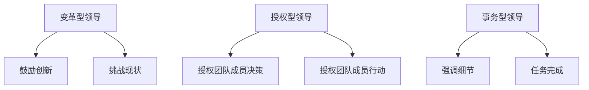

###### **1.3 领导力的发展趋势**

**核心概念原理**：领导力的发展趋势反映了社会和技术环境的变化。

**概念属性特征对比表格**：

| 发展趋势     | 特征                         | 影响因素                     |
| ------------ | --------------------------- | --------------------------- |
| 个性化       | 注重个人成长和自我实现     | 数字化时代                   |
| 灵活性       | 能够快速适应变化的需求     | 快速变化的市场环境           |
| 可持续性     | 关注长期发展和环境责任     | 全球化和社会责任             |

**ER实体关系图架构的 Mermaid 流�程图**：

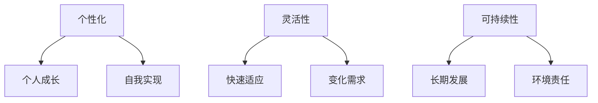

##### **第2章：领导者的素质与能力**

###### **2.1 领导者的核心素质**

**核心概念原理**：领导者的核心素质是他们影响力的基础。

**概念属性特征对比表格**：

| 素质       | 特征                     | 影响                 |
| ---------- | ------------------------ | -------------------- |
| 诚实       | 说话做事一致              | 建立信任               |
| 自信       | 相信自己和团队的能力      | 激发团队潜力           |
| 勇气       | 面对挑战和不确定          | 领导者需要有勇气面对失败 |
| 同理心     | 理解和关心团队成员的感受   | 提高团队凝聚力           |
| 决心       | 坚持目标，不畏困难        | 实现目标               |

**Mermaid 流程图**：

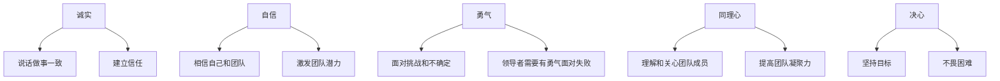

###### **2.2 领导者的能力模型**

**核心概念原理**：领导者的能力模型决定了他们如何有效地管理团队和实现目标。

**概念属性特征对比表格**：

| 能力类型     | 特征                     | 影响                 |
| ------------ | ------------------------ | -------------------- |
| 技术技能     | 专业知识和实践经验       | 实现技术目标           |
| 人际技能     | 沟通、团队建设和人际关系 | 建立团队凝聚力           |
| 概念技能     | 战略规划和决策能力       | 实现组织目标           |

**Mermaid 流程图**：

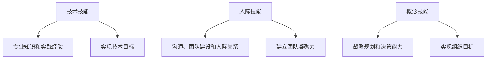

###### **2.3 领导力的自我评估**

**核心概念原理**：自我评估是领导者了解自身优势和劣势的重要工具。

**概念属性特征对比表格**：

| 自我评估方法   | 特征                     | 影响                 |
| -------------- | ------------------------ | -------------------- |
| 360度反馈      | 收集来自团队成员的反馈   | 提高自我认知           |
| 领导力评估问卷 | 量化评估领导力各项指标   | 提供改进方向           |
| 自我反思日志   | 记录和反思自己的行为和决策 | 促进个人成长           |

**Mermaid 流程图**：

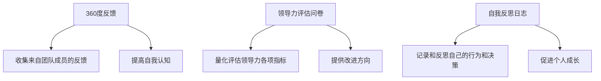

#### **第二部分：领导力技巧与实践**

##### **第3章：沟通技巧**

###### **3.1 沟通的重要性**

**核心概念原理**：沟通是领导者影响和激励团队成员的关键。

**概念属性特征对比表格**：

| 沟通要素   | 特征                     | 影响                 |
| ---------- | ------------------------ | -------------------- |
| 清晰表达   | 表达准确、简洁明了       | 避免误解和信息失真     |
| 积极倾听   | 关注对方、理解意图       | 建立信任和共识         |
| 反馈       | 及时回应和反馈           | 促进沟通的有效性       |
| 开放式问题 | 引导对话、激发思考       | 拓展沟通深度           |

**Mermaid 流程图**：

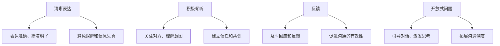

###### **3.2 有效沟通的要素**

**核心概念原理**：有效沟通需要综合考虑语言、行为和环境等多个因素。

**概念属性特征对比表格**：

| 有效沟通要素 | 特征                     | 影响                 |
| ------------ | ------------------------ | -------------------- |
| 语言表达     | 使用清晰、恰当的语言     | 避免误解和冲突       |
| 非语言沟通   | 通过肢体语言和表情传达信息 | 强化语言表达的效果   |
| 环境适应     | 考虑沟通场景和背景       | 提高沟通的有效性     |

**Mermaid 流程图**：

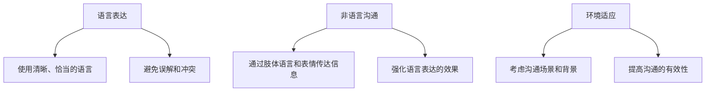

###### **3.3 沟通障碍与解决策略**

**核心概念原理**：沟通障碍可能导致误解和冲突，影响团队绩效。

**概念属性特征对比表格**：

| 沟通障碍     | 特征                     | 解决策略             |
| ------------ | ------------------------ | -------------------- |
| 语言障碍     | 语言表达不准确或不清晰   | 使用简单明了的语言   |
| 文化差异     | 来自不同文化的团队成员   | 建立文化理解与尊重   |
| 信息过载     | 信息过多或过于复杂       | 提高信息过滤能力     |
| 缺乏反馈     | 缺少有效的反馈机制       | 建立反馈和确认机制   |

**Mermaid 流程图**：

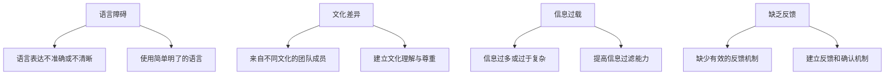

##### **第4章：激励与团队管理**

###### **4.1 激励理论**

**核心概念原理**：激励理论提供了理解员工行为和动机的基础。

**概念属性特征对比表格**：

| 激励理论   | 特征                     | 影响                 |
| ---------- | ------------------------ | -------------------- |
| 马斯洛需求层次理论 | 关注人的需求层次      | 提供激励框架         |
| 赫茨伯格双因素理论 | 关注工作环境和动机因素 | 提高工作满意度       |
| 目标设置理论 | 关注目标设定和任务分配 | 提高工作绩效         |

**Mermaid 流程图**：

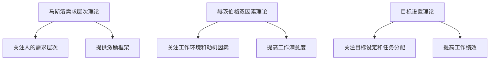

###### **4.2 激励策略**

**核心概念原理**：激励策略是领导者运用激励理论来提高员工动力和工作效率的方法。

**概念属性特征对比表格**：

| 激励策略   | 特征                     | 影响                 |
| ---------- | ------------------------ | -------------------- |
| 认可和奖励 | 表扬和奖励员工的成就     | 提高员工自信心和动力 |
| 提供发展机会 | 提供培训和学习机会       | 提升员工技能和潜力   |
| 建立公平的工作环境 | 确保公平的绩效评估和晋升机会 | 提高员工满意度和忠诚度 |

**Mermaid 流程图**：

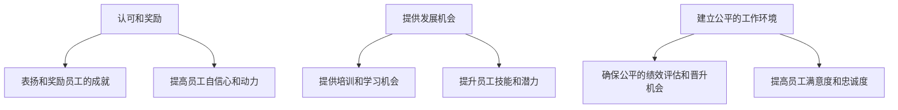

###### **4.3 团队建设与管理**

**核心概念原理**：团队建设与管理是领导者确保团队高效运作的关键。

**概念属性特征对比表格**：

| 团队建设与管理要素 | 特征                     | 影响                 |
| ------------------ | ------------------------ | -------------------- |
| 明确团队愿景      | 确定团队目标和使命      | 提供方向和动力       |
| 促进团队成员合作   | 建立相互信任和尊重的团队文化 | 提高团队凝聚力       |
| 解决团队冲突      | 处理团队成员间的矛盾和分歧 | 保证团队稳定和谐     |

**Mermaid 流程图**：

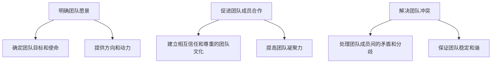

##### **第5章：决策与问题解决**

###### **5.1 决策模型**

**核心概念原理**：决策模型是领导者制定决策的理论基础。

**概念属性特征对比表格**：

| 决策模型     | 特征                     | 影响                 |
| ------------ | ------------------------ | -------------------- |
| 理性决策模型 | 依据数据和逻辑进行决策  | 提高决策的科学性     |
| 模糊决策模型 | 在不确定情况下进行决策  | 提高决策的灵活性     |

**Mermaid 流程图**：

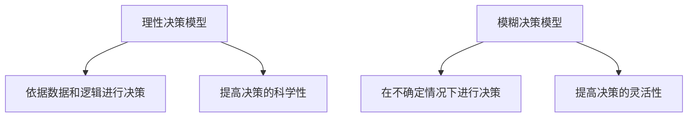

###### **5.2 决策制定过程**

**核心概念原理**：决策制定过程是领导者从问题识别到决策执行的一系列步骤。

**概念属性特征对比表格**：

| 决策制定过程要素 | 特征                     | 影响                 |
| ---------------- | ------------------------ | -------------------- |
| 问题识别        | 明确决策所需解决的问题 | 提供决策方向         |
| 信息收集        | 收集与决策相关的信息    | 提高决策的准确性     |
| 方案评估        | 分析和评估不同方案      | 提供最佳决策选择     |
| 决策执行        | 实施决策并监控效果      | 确保决策有效实施     |

**Mermaid 流程图**：

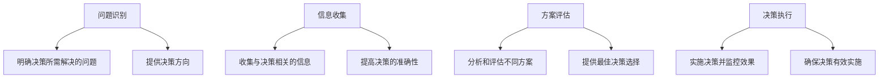

###### **5.3 问题解决的策略**

**核心概念原理**：问题解决策略是领导者应对挑战和困难的有效方法。

**概念属性特征对比表格**：

| 问题解决策略 | 特征                     | 影响                 |
| ------------ | ------------------------ | -------------------- |
| 分析问题     | 确定问题的本质和原因    | 提高问题解决的效率   |
| 寻找解决方案 | 提出和评估不同解决方案  | 提供多种解决方案选择 |
| 评估解决方案 | 选择最佳的解决方案      | 确保问题得到有效解决 |
| 实施解决方案 | 实施并监控解决方案的效果 | 保证解决方案的有效性 |

**Mermaid 流程图**：

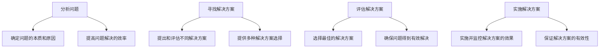

#### **第三部分：领导力发展**

##### **第6章：领导力培养与成长**

###### **6.1 领导力发展路径**

**核心概念原理**：领导力发展路径是领导者从新手到专家的成长过程。

**概念属性特征对比表格**：

| 发展路径要素 | 特征                     | 影响                 |
| ------------ | ------------------------ | -------------------- |
| 自我认知     | 理解自己的优点和不足    | 提供成长方向         |
| 技能提升     | 通过学习和实践提升技能  | 提高领导能力         |
| 实践经验     | 通过实际工作积累经验    | 增强解决问题的能力   |
| 反思学习     | 从经验和失败中学习     | 提高自我认知和领导力 |

**Mermaid 流程图**：

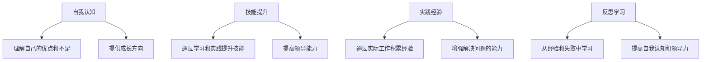

###### **6.2 领导力发展实践**

**核心概念原理**：领导力发展实践是领导者通过具体行动来提升自身领导能力的途径。

**概念属性特征对比表格**：

| 发展实践方法 | 特征                     | 影响                 |
| ------------ | ------------------------ | -------------------- |
| 参与领导力培训 | 接受专业的领导力培训    | 提升理论知识和技能   |
| 阅读相关书籍   | 学习领导力领域的经典著作 | 拓宽视野和思维方式   |
| 参加研讨会和网络课程 | 与其他领导者交流经验    | 学习最新的领导力理念 |

**Mermaid 流程图**：

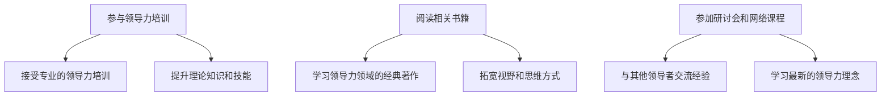

###### **6.3 持续学习的价值**

**核心概念原理**：持续学习是领导者保持竞争力和发展潜力的关键。

**概念属性特征对比表格**：

| 学习价值要素 | 特征                     | 影响                 |
| ------------ | ------------------------ | -------------------- |
| 持续更新知识 | 掌握最新的行业动态和技术 | 提高领导能力         |
| 拓展视野     | 了解不同领域的知识和经验 | 增强决策能力         |
| 保持敏锐的洞察力 | 能够快速识别问题和机遇 | 提高应变能力         |

**Mermaid 流程图**：

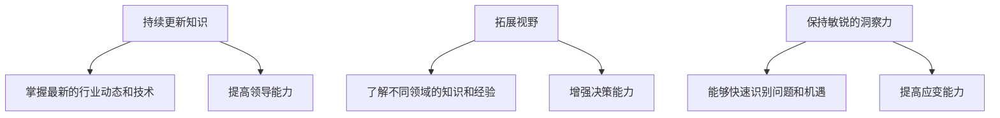

##### **第7章：领导力案例分析**

###### **7.1 成功的领导力案例**

**核心概念原理**：成功的领导力案例可以提供宝贵的实践经验和启示。

**概念属性特征对比表格**：

| 成功案例要素 | 特征                     | 影响                 |
| ------------ | ------------------------ | -------------------- |
| 领导者特质   | 领导者的素质与能力      | 提供成功的关键因素   |
| 团队氛围     | 团队的合作与信任        | 提高团队绩效         |
| 成功策略     | 领导者运用的策略和措施  | 提供可借鉴的方法     |

**Mermaid 流程图**：

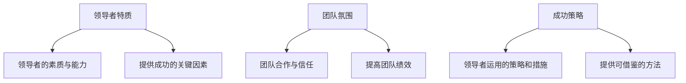

###### **7.2 失败的领导力案例**

**核心概念原理**：失败的领导力案例可以提供宝贵的教训和反思。

**概念属性特征对比表格**：

| 失败案例要素 | 特征                     | 影响                 |
| ------------ | ------------------------ | -------------------- |
| 领导者失误   | 领导者在决策和执行中的错误 | 提供失败的原因       |
| 团队问题     | 团队成员之间的矛盾和冲突 | 提供团队管理的不足   |
| 成本和损失   | 失败带来的成本和损失      | 提供反思的契机       |

**Mermaid 流程图**：

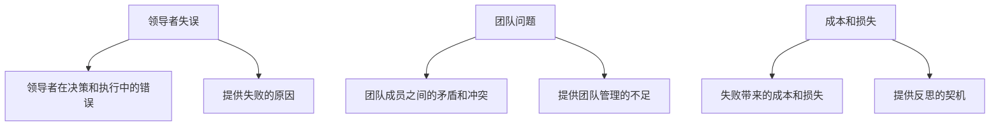

###### **7.3 从案例中学习领导力**

**核心概念原理**：通过案例分析，领导者可以学到成功的经验并避免失败的教训。

**概念属性特征对比表格**：

| 学习方法   | 特征                     | 影响                 |
| ---------- | ------------------------ | -------------------- |
| 分析成功案例 | 研究成功的要素和策略    | 提供可借鉴的经验     |
| 反思失败案例 | 思考失败的原因和教训    | 提高领导力和决策能力 |
| 应用到实际中 | 将所学知识应用到实际工作中 | 提高团队绩效和执行力 |

**Mermaid 流程图**：

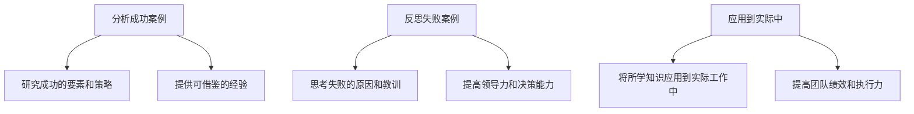

#### **结语**

领导力是团队成功的关键。通过本文的讨论，我们认识到领导力的重要性，了解了领导者的素质与能力，掌握了沟通技巧、激励策略和决策与问题解决技巧。通过不断学习和实践，领导者可以不断提升自己的领导能力，为团队的成长和发展做出贡献。

**最佳实践 tips**：

1. **建立清晰的沟通渠道**：确保团队成员了解组织的目标和期望，通过定期会议和反馈机制来促进沟通。
2. **激励员工**：了解员工的需求，提供有吸引力的奖励和发展机会，以激发他们的工作动力。
3. **持续学习**：不断更新知识和技能，保持敏锐的洞察力，以适应快速变化的环境。

**小结**：

本文详细探讨了领导力的各个方面，从基础知识到实践技巧，再到发展路径和案例分析。有效的领导力不仅能提高团队绩效，还能为组织的长期发展奠定坚实基础。

**注意事项**：

1. **避免过度依赖技术**：领导力不仅仅是技术技能，更重要的是人际技能和概念技能。
2. **尊重团队成员**：建立相互尊重的团队文化，关注团队成员的感受和需求。

**拓展阅读**：

- 《领导力的五项修炼》
- 《高效能人士的七个习惯》
- 《团队协作的五个层次》

---

**作者信息**：

作者：AI天才研究院/AI Genius Institute & 禅与计算机程序设计艺术 /Zen And The Art of Computer Programming

