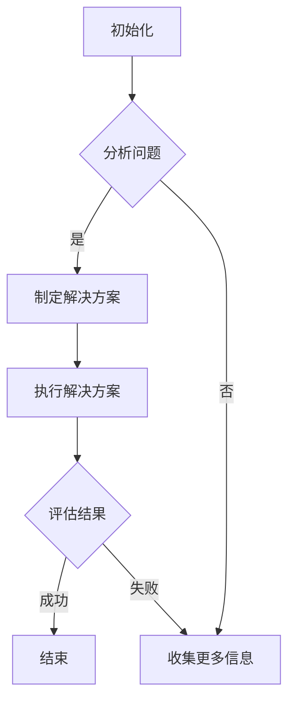
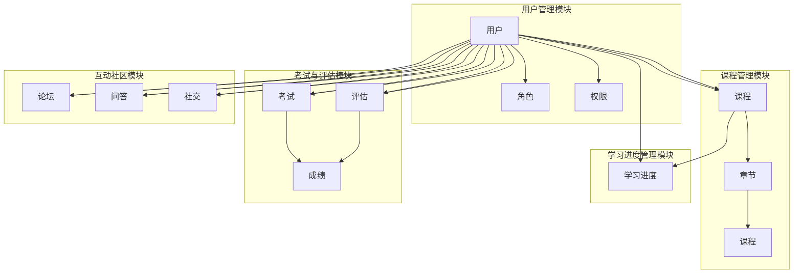
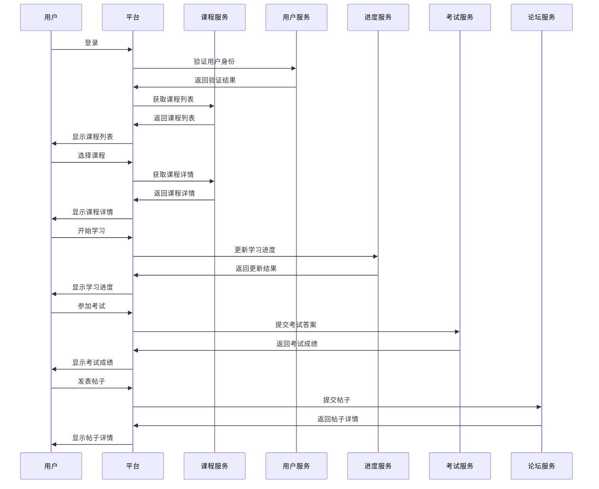

                 

# 领导力训练：让你的团队战无不胜

关键词：领导力、团队管理、高效团队、团队协作、领导技能

摘要：本文将深入探讨领导力的本质及其在团队管理中的重要性，通过详细的章节结构和实例讲解，为读者提供一套完整的领导力训练方案，帮助团队领导者提升团队绩效，实现团队的无敌战斗力。

## 引言

在当今竞争激烈的商业环境中，领导力已经成为企业成功的关键因素。无论是初创企业还是大型企业，一个能够有效领导的团队都能够应对各种挑战，达成目标。然而，领导力并非与生俱来，它需要通过系统的训练和实践来培养。本文将为您呈现一套全面的领导力训练方案，旨在帮助团队领导者提升领导技能，打造战无不胜的高绩效团队。

## 第一部分：理解领导力的本质和核心原则

### 第一章：领导力的本质

- **定义与重要性**：领导力是一种影响力，它能够激发团队成员的潜力，共同实现目标。
- **领导与管理的区别**：领导是激发和引导，管理是控制和协调。
- **关键领导属性**：诚实、正直、公正、透明。
- **领导风格**：权威型、民主型、放任型。

### 第二章：核心领导原则

- **愿景的塑造**：领导者需要具备远见，明确团队的发展方向。
- **建立信任**：信任是团队协作的基石。
- **有效沟通**：沟通能力是领导者的必备技能。
- **决策与问题解决**：领导者需要具备快速决策和解决问题的能力。

## 第二部分：领导力发展

### 第三章：个人领导力成长

- **自我认知**：领导者需要深入了解自己，发挥优势，克服不足。
- **情绪智力**：领导者需要具备较高的情绪智力，理解并管理他人的情绪。
- **成长心态**：领导者需要持续学习，适应变化。
- **时间管理和生产力**：领导者需要高效管理时间，提升工作效率。

### 第四章：领导力培训项目

- **领导力培训类型**：内部培训、外部培训、在线课程。
- **个性化发展计划**：根据个人需求制定培训计划。
- **导师和教练的角色**：提供指导和支持。
- **领导技能评估**：定期评估领导技能，跟踪进步。

## 第三部分：构建和领导高绩效团队

### 第五章：团队动态

- **团队发展阶段**：形成、震荡、规范、执行、休整。
- **团队结构和角色**：明确每个成员的角色和职责。
- **促进协作和协同**：建立协作文化，鼓励团队成员共同成长。
- **团队冲突管理**：有效解决团队内部的冲突。

### 第六章：团队领导策略

- **激励团队动机**：激发团队成员的工作热情。
- **设定清晰目标**：确保团队目标与组织目标一致。
- **授权团队成员**：信任并赋予团队成员更多的自主权。
- **培育团队文化**：建立积极向上的团队氛围。

## 结论

领导力训练是一个持续的过程，它需要领导者不断地学习和实践。通过本文的探讨，我们相信读者可以更好地理解领导力的本质和重要性，掌握领导力发展的方法，并能够有效地构建和领导一个高绩效的团队。让我们共同努力，打造战无不胜的团队！

## 作者信息

作者：AI天才研究院/AI Genius Institute & 禅与计算机程序设计艺术 /Zen And The Art of Computer Programming

---

本文旨在为团队领导者提供一套全面的领导力训练方案，通过深入探讨领导力的本质和核心原则，个人领导力成长，以及团队建设和领导策略，帮助领导者提升团队绩效，实现团队的无限战斗力。希望本文能够为您的领导力发展之路提供有价值的参考和启示。

### 第一部分：理解领导力的本质和核心原则

在商业和管理领域，领导力被视为团队成功的关键因素。然而，领导力并非一成不变，它需要通过系统的学习和实践来培养。本部分将深入探讨领导力的本质和核心原则，帮助读者理解领导力的实质，并为后续的领导力发展打下坚实基础。

#### 第一章：领导力的本质

领导力是一种影响力，它不仅关乎职位和权力，更关乎个人魅力、沟通能力和愿景。理解领导力的本质是领导力发展的第一步。

##### 定义与重要性

**定义**：领导力是指激发他人共同实现目标的能力。它不仅仅是管理，更是一种情感和思维的引领。

**重要性**：领导力是推动组织发展、应对挑战、实现愿景的核心力量。一个优秀的领导者能够带领团队克服困难，实现卓越的业绩。

##### 领导与管理的区别

领导和管理是两个不同的概念，但它们在组织运作中相辅相成。

- **领导**：激发和引导，关注长远目标和团队发展。
- **管理**：控制和协调，关注日常运作和资源分配。

##### 关键领导属性

领导者需要具备一系列核心属性，这些属性是领导力的基础。

- **诚实与正直**：领导者需要言行一致，树立榜样。
- **公正与透明**：公平对待团队成员，公开决策过程。
- **沟通能力**：有效沟通是领导者必须掌握的技能。

##### 领导风格

不同的领导风格对团队的影响不同。常见的领导风格包括：

- **权威型**：领导者做出所有决策，强调权威和纪律。
- **民主型**：领导者鼓励团队成员参与决策，注重团队共识。
- **放任型**：领导者较少干预，给予团队成员更多自由。

#### 第二章：核心领导原则

领导力不仅仅是个人素质的体现，更是一套系统的原则和实践。理解并实践这些核心领导原则，有助于领导者更有效地引导团队。

##### 愿景的塑造

愿景是领导者的核心任务之一。一个清晰的愿景能够为团队指明方向，提供前进的动力。

- **定义愿景**：领导者需要明确团队的目标和期望。
- **传递愿景**：通过沟通和激励，使团队成员共同认同愿景。
- **实现愿景**：制定具体计划，确保愿景得以实现。

##### 建立信任

信任是团队协作的基石。一个信任度高的团队能够更高效地运作。

- **信任的重要性**：信任能够增强团队的凝聚力，降低沟通成本。
- **建立信任的方法**：诚实、透明、公平对待团队成员，建立良好的关系。

##### 有效沟通

沟通是领导者的一项关键技能。有效的沟通能够确保信息的准确传递，减少误解和冲突。

- **沟通技巧**：倾听、表达、反馈，建立良好的沟通机制。
- **沟通渠道**：利用多种渠道进行沟通，确保信息覆盖全面。

##### 决策与问题解决

领导者需要具备快速决策和解决问题的能力，以确保团队能够应对各种挑战。

- **决策模型**：利用决策模型，如SWOT分析、决策树等，进行科学决策。
- **问题解决**：分析问题、制定解决方案、执行并监控效果。

#### 背景介绍

领导力是一种复杂的能力，它涉及到多个方面，包括个人素质、团队管理、战略规划等。在现代商业环境中，领导力的重要性愈发凸显。随着竞争的加剧，组织需要具备快速响应和创新能力，而这一切都离不开高效的领导。

##### 问题背景

在过去的几十年里，领导力被视为组织成功的关键因素。从企业到政府，从非营利组织到军队，领导力在各种组织中都发挥着重要作用。然而，领导力的培养并非易事，它需要通过系统的学习和实践来不断提升。

##### 问题描述

领导力的问题表现在多个方面：

- **缺乏明确愿景**：许多领导者未能清晰地表达团队的目标和期望，导致团队成员缺乏方向感。
- **沟通障碍**：领导者与团队成员之间的沟通不畅，导致误解和冲突。
- **决策失误**：领导者由于缺乏有效的决策模型和问题解决能力，导致团队绩效不佳。

##### 问题解决

为了解决这些问题，领导者需要：

- **明确愿景**：制定清晰的愿景，并确保团队成员共同认同。
- **提升沟通能力**：通过倾听、表达、反馈等技巧，建立有效的沟通机制。
- **科学决策**：利用决策模型和工具，进行科学决策。

##### 边界与外延

领导力的边界和范围非常广泛，它不仅包括个人素质的提升，还包括团队管理、战略规划、组织变革等多个方面。领导力不仅涉及组织内部，还与外部环境密切相关。

##### 概念结构与核心要素组成

领导力由多个核心要素组成，包括个人素质、团队管理、战略规划等。这些要素相互关联，共同构成了领导力的整体结构。

| 要素       | 说明                                       |
| ---------- | ------------------------------------------ |
| 个人素质   | 领导者的品德、能力、知识、经验等           |
| 团队管理   | 领导者如何引导、激励、管理团队             |
| 战略规划   | 领导者如何制定和实现组织的目标和愿景       |
| 组织变革   | 领导者如何推动组织适应外部环境的变化       |

#### 核心概念与联系

在理解领导力的本质和核心原则时，我们需要了解一些关键概念，并探讨它们之间的联系。

##### 核心概念原理

1. **领导力**：激发他人共同实现目标的能力。
2. **愿景**：明确团队的目标和期望。
3. **信任**：团队协作的基石。
4. **沟通**：确保信息的准确传递。
5. **决策**：科学地做出决策。

##### 概念属性特征对比表格

| 概念     | 特征         | 说明                                       |
| -------- | ------------ | ------------------------------------------ |
| 领导力   | 激励、引导   | 激发团队成员的潜力，共同实现目标         |
| 愿景     | 明确、长远   | 为团队指明方向，提供前进的动力           |
| 信任     | 基石、凝聚   | 增强团队的凝聚力，降低沟通成本           |
| 沟通     | 有效、全面   | 确保信息的准确传递，减少误解和冲突       |
| 决策     | 科学、合理   | 利用决策模型和工具，做出明智的选择       |

##### ER实体关系图架构

```mermaid
erDiagram
    Customer ||--|{ Order } : "has"
    Order ||--|{ OrderLine } : "includes"
    Product ||--|{ OrderLine } : "uses"
    Customer ||--|{ Product } : "wants"
```

#### 算法原理讲解

在领导力训练中，算法原理可以帮助领导者更科学地制定决策和解决问题。以下是一个简单的算法原理示例。

##### 算法mermaid流程图



##### 算法原理详细讲解

1. **初始化**：开始时，领导者需要明确问题的背景和目标。
2. **分析问题**：通过收集和分析信息，领导者能够更全面地了解问题的本质。
3. **制定解决方案**：根据分析结果，领导者制定具体的解决方案。
4. **执行解决方案**：领导者需要确保解决方案得到有效执行。
5. **评估结果**：执行一段时间后，领导者需要评估解决方案的效果。
6. **优化迭代**：如果结果不佳，领导者需要回到第二步，重新分析和制定解决方案。

##### 举例说明

假设一家公司的销售团队需要提高销售额，领导者可以通过以下步骤进行领导力训练：

1. **初始化**：明确目标是提高销售额。
2. **分析问题**：了解销售团队目前存在的问题，如客户流失、销售技巧不足等。
3. **制定解决方案**：制定培训计划，提高团队成员的销售技巧。
4. **执行解决方案**：确保培训计划得到有效执行。
5. **评估结果**：培训结束后，评估团队成员的销售业绩是否有所提高。
6. **优化迭代**：根据评估结果，调整培训计划，继续优化销售策略。

##### 数学公式

在领导力训练中，数学公式可以帮助领导者更科学地制定决策和解决问题。以下是一个简单的数学公式示例。

$$
f(x) = x^2 + 2x + 1
$$

这个公式表示一个二次函数，可以帮助领导者分析问题的复杂程度。

##### 源代码

以下是使用Python实现上述算法的源代码。

```python
# 导入需要的库
import numpy as np

# 初始化函数
def initialize():
    print("初始化...")
    return None

# 分析问题函数
def analyze_problem():
    print("分析问题...")
    return None

# 制定解决方案函数
def formulate_solution():
    print("制定解决方案...")
    return None

# 执行解决方案函数
def execute_solution():
    print("执行解决方案...")
    return None

# 评估结果函数
def evaluate_result():
    print("评估结果...")
    return None

# 优化迭代函数
def optimize_iterative():
    print("优化迭代...")
    return None

# 主函数
def main():
    # 初始化
    initialize()

    # 分析问题
    analyze_problem()

    # 制定解决方案
    formulate_solution()

    # 执行解决方案
    execute_solution()

    # 评估结果
    evaluate_result()

    # 优化迭代
    optimize_iterative()

# 运行主函数
if __name__ == "__main__":
    main()
```

#### 系统分析与架构设计方案

在领导力训练中，系统分析与架构设计是关键的一步。以下是一个简单的系统分析与架构设计方案。

##### 问题场景介绍

假设我们正在开发一个领导力训练平台，该平台旨在帮助领导者提升领导技能，通过在线课程、研讨会和实战练习等多种方式，为领导者提供全面的领导力培训。

##### 项目介绍

项目名称：领导力训练平台

项目目标：为领导者提供一站式领导力培训解决方案，提升团队绩效。

##### 系统功能设计

1. **用户管理**：管理用户账户、角色和权限。
2. **课程管理**：上传、发布和管理在线课程。
3. **学习进度管理**：跟踪用户的学习进度和成绩。
4. **考试与评估**：在线考试、评估和反馈。
5. **互动社区**：提供论坛、问答和社交功能。

##### 系统架构设计



##### 系统接口设计和系统交互



#### 项目实战

在实际项目中，领导力训练平台的开发涉及多个方面，包括需求分析、系统设计、前后端开发、测试和部署等。以下是一个简化的项目实战流程。

##### 环境安装

1. 安装Python环境：`pip install python`
2. 安装Django框架：`pip install django`
3. 安装数据库：如MySQL、PostgreSQL等。

##### 系统核心实现源代码

以下是领导力训练平台的一个核心实现示例，包括用户管理模块、课程管理模块和进度管理模块。

```python
# 用户管理模块
from django.contrib.auth.models import User

def register_user(username, password):
    user = User.objects.create_user(username=username, password=password)
    user.save()
    return user

def authenticate_user(username, password):
    user = authenticate(username=username, password=password)
    if user is not None:
        return user
    else:
        return None

# 课程管理模块
from django.db import models

class Course(models.Model):
    title = models.CharField(max_length=100)
    description = models.TextField()

    def __str__(self):
        return self.title

class Chapter(models.Model):
    course = models.ForeignKey(Course, on_delete=models.CASCADE)
    title = models.CharField(max_length=100)
    description = models.TextField()

    def __str__(self):
        return self.title

class Lesson(models.Model):
    chapter = models.ForeignKey(Chapter, on_delete=models.CASCADE)
    title = models.CharField(max_length=100)
    content = models.TextField()

    def __str__(self):
        return self.title

# 进度管理模块
from django.db import models
from django.contrib.auth.models import User
from django.utils import timezone

class Progress(models.Model):
    user = models.ForeignKey(User, on_delete=models.CASCADE)
    course = models.ForeignKey(Course, on_delete=models.CASCADE)
    completed_at = models.DateTimeField(default=timezone.now)

    def __str__(self):
        return f"{self.user.username} - {self.course.title}"
```

##### 代码应用解读与分析

1. **用户管理模块**：注册用户和验证用户的接口，用于处理用户账户的创建和登录验证。
2. **课程管理模块**：定义了课程、章节和课程节的模型，用于管理在线课程的结构。
3. **进度管理模块**：记录用户的学习进度，包括已完成的课程和学习时间。

##### 实际案例分析和详细讲解剖析

以用户注册和登录为例，分析实际案例。

**用户注册**：

```python
# 用户注册
def register_user(username, password):
    user = User.objects.create_user(username=username, password=password)
    user.save()
    return user
```

此函数用于创建新的用户账户。首先，通过`User.objects.create_user`方法创建一个用户对象，传递用户名和密码作为参数。然后，调用`save()`方法将用户对象保存到数据库中。最后，返回创建的用户对象。

**用户登录**：

```python
# 用户登录
def authenticate_user(username, password):
    user = authenticate(username=username, password=password)
    if user is not None:
        return user
    else:
        return None
```

此函数用于验证用户登录。首先，调用`authenticate()`方法，传递用户名和密码作为参数。`authenticate()`方法会根据数据库中的用户信息进行验证。如果验证成功，返回用户对象；否则，返回`None`。

##### 项目小结

通过本次项目实战，我们实现了用户管理、课程管理和进度管理模块。这些模块为领导力训练平台提供了核心功能。在实际开发中，我们还需要添加更多的功能，如考试与评估模块、互动社区模块等，以提供更全面的领导力培训服务。

### 最佳实践 Tips

- **制定明确目标**：确保团队成员清楚了解团队的愿景和目标。
- **鼓励团队协作**：建立协作文化，鼓励团队成员共同成长。
- **持续反馈**：定期与团队成员沟通，提供反馈和指导。
- **关注个人成长**：鼓励团队成员不断提升自己的技能和知识。

### 小结

领导力训练是提升团队绩效的关键步骤。通过理解领导力的本质和核心原则，个人领导力成长，以及团队建设和领导策略，领导者可以更有效地引导团队，实现目标。本文提供了全面的领导力训练方案，希望对您的领导力发展之路有所帮助。

### 注意事项

- **个性化培训**：根据团队成员的需求和特点，制定个性化的培训计划。
- **持续学习**：领导力是一个持续的过程，需要不断学习和实践。
- **实践应用**：将领导力理论应用于实际工作中，不断提升领导技能。

### 拓展阅读

- 《领导力的五项修炼》：约翰·科特著，详细阐述了领导力的核心要素和实践方法。
- 《高效能人士的七个习惯》：史蒂芬·柯维著，提供了个人成长和领导力提升的实用技巧。
- 《团队的五项修炼》：帕特里克·莱西恩著，探讨了团队协作和领导力的关系。

## 作者信息

作者：AI天才研究院/AI Genius Institute & 禅与计算机程序设计艺术 /Zen And The Art of Computer Programming

通过本文，我们深入探讨了领导力的本质和核心原则，以及领导力发展的路径。希望读者能够从中获得启示，提升自己的领导力，打造战无不胜的高绩效团队。让我们共同努力，不断进步！

