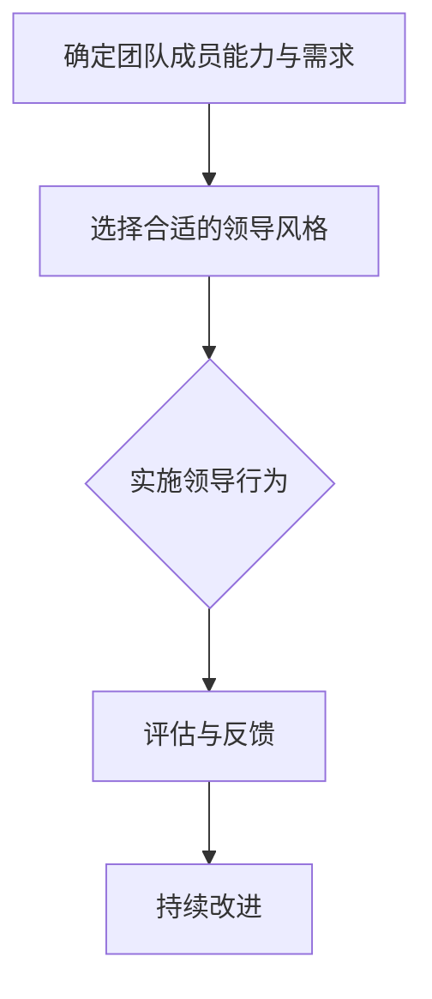
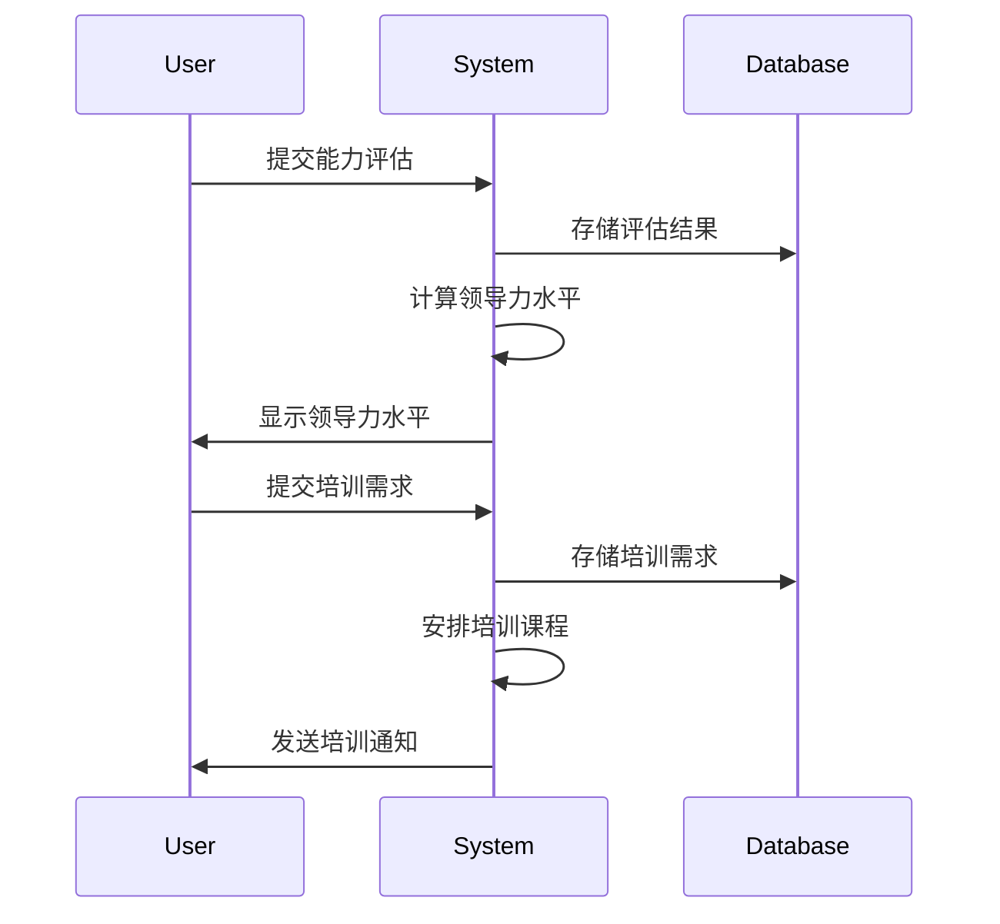
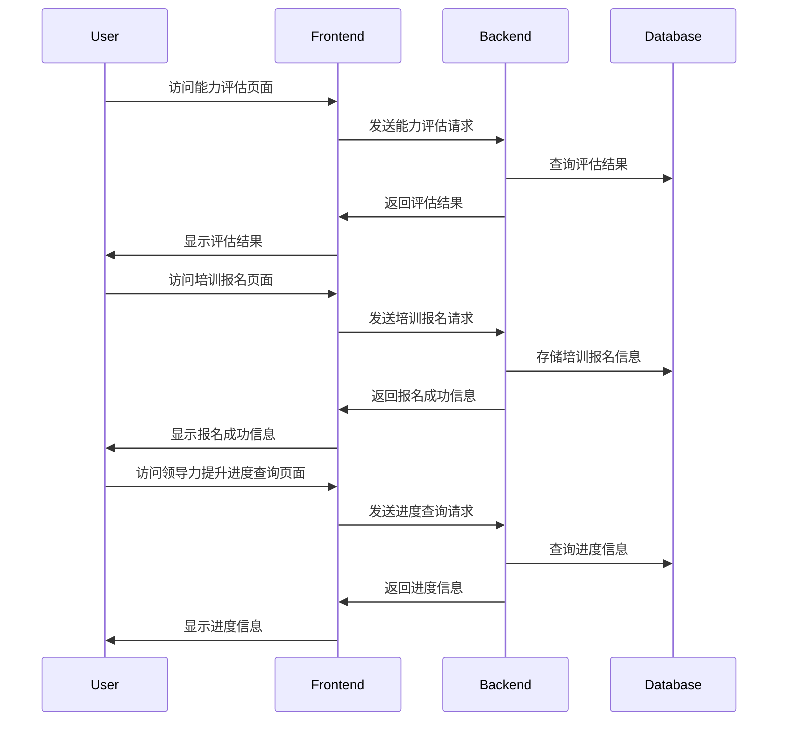

                 

# 领导力训练：让你的团队所向披靡

> 关键词：领导力、团队建设、沟通能力、决策能力、领导力培养、情境领导理论

> 摘要：本文将深入探讨领导力的定义、重要性以及团队所面临的挑战，并提出一系列策略，帮助读者提高领导力，打造一个高效、协同的团队。通过结合理论和实践，本文将揭示如何通过领导力训练，使团队在竞争激烈的环境中脱颖而出，所向披靡。

## 第1步：概述背景与核心概念

领导力，作为团队管理中的核心要素，被广泛认为是决定团队成功与否的关键。领导力不仅仅关乎个人的能力，更涉及到与团队成员的互动、沟通和决策过程。在一个高效团队中，领导者的角色至关重要，他们需要具备多种能力，如沟通、决策和团队合作等，以应对复杂多变的业务环境。

### 领导力的定义

领导力是一种影响力，它能够激励、引导和影响他人朝着共同的目标前进。领导力不仅包括对团队成员的管理，更涵盖了如何通过沟通、激励和培养，使团队发挥出最大的潜力。

### 领导力的重要性

领导力对于个人、团队和组织都有深远的影响。对于个人而言，良好的领导力能够提升个人的职业发展；对于团队而言，有效的领导力能够增强团队的凝聚力，提高工作效率；对于组织而言，卓越的领导力能够推动组织在竞争激烈的市场中取得优势。

### 当前团队面临的挑战和需求

在当今快速变化和竞争激烈的环境中，团队面临着诸多挑战。例如，团队成员之间的沟通不畅、决策速度缓慢、团队凝聚力不足等问题。为了应对这些挑战，团队需要领导者具备更高的领导力水平，能够带领团队克服困难，实现目标。

### 本书的目标

本书旨在通过系统的领导力训练，帮助读者提高领导力水平，打造一个高效、协同的团队。具体来说，本书将：

1. **介绍领导力的核心概念和要素**：帮助读者理解领导力的本质，掌握关键要素。
2. **阐述领导力培养的理论基础**：通过情境领导理论、变革领导理论等，帮助读者构建科学的领导力培养体系。
3. **提供实践方法和策略**：通过案例分析、实战演练等，帮助读者将理论应用于实际工作，提升领导力。
4. **总结最佳实践**：为读者提供一套实用的领导力提升方案，助力团队所向披靡。

## 第2步：核心概念与联系

为了更好地理解领导力的构成要素，我们需要对几个关键概念进行定义，并通过对比和分析，揭示它们之间的联系。

### 沟通能力

沟通能力是领导者必须具备的基本能力之一。有效的沟通能够确保信息准确传达，减少误解和冲突，增强团队凝聚力。

### 决策能力

决策能力是领导者面对复杂问题时做出合理、快速决策的能力。良好的决策能力能够帮助团队迅速应对变化，抓住机遇。

### 团队合作

团队合作是领导力的重要组成部分。领导者需要培养团队成员之间的协作精神，确保团队目标一致，共同努力。

### 比较与联系

为了更好地理解这些要素，我们可以通过一个表格来对比它们的特点与应用场景。

| 要素        | 特点                                                         | 应用场景                                       |
| ----------- | ------------------------------------------------------------ | ---------------------------------------------- |
| 沟通能力    | 能清晰、准确地传达信息，善于倾听他人意见                     | 项目协调、团队沟通、跨部门协作                 |
| 决策能力    | 能够快速、合理地做出决策，具备预见性和分析能力               | 项目管理、危机应对、战略规划                 |
| 团队合作    | 能够激发团队成员的积极性，协调各方资源，共同完成任务         | 团队建设、项目实施、组织变革                 |
| 激励能力    | 能够通过多种方式激励团队成员，提高工作动力和效率             | 绩效管理、员工培训、组织文化建设             |

### ER实体关系图

为了更直观地展示团队与领导力要素之间的关系，我们可以使用Mermaid绘制一个ER实体关系图。

```mermaid
erDiagram
  Team ||--|{ Leader }
  Leader ||--|{ Communication Skill }
  Leader ||--|{ Decision Making Skill }
  Leader ||--|{ Teamwork Skill }
  Leader ||--|{ Motivation Skill }
```

在这个ER图中，团队与领导者之间存在一种关联关系，而领导者的各项能力（沟通能力、决策能力、团队合作、激励能力）则是领导力的具体体现。

## 第3步：算法原理讲解

领导力培养是一个复杂的过程，涉及到多种理论和方法。在本节中，我们将简要介绍几种常见的领导力培养理论，并使用Python源代码和LaTeX公式详细解释领导力培养的数学模型。

### 情境领导理论

情境领导理论是由保罗·赫塞和肯尼斯·布兰查德提出的。该理论认为，领导风格应该根据团队成员的能力和需求进行调整。具体来说，有四种领导风格：指令型、推销型、参与型和授权型。

### 变革领导理论

变革领导理论是由约翰·科特提出的。该理论强调，领导者需要在变革过程中发挥关键作用，通过激励、沟通和策略规划，带领团队实现变革。

### 领导力培养流程图

我们可以使用Mermaid绘制一个简单的领导力培养流程图，以展示这些理论的应用过程。



### 领导力培养的数学模型

领导力培养的数学模型可以用来描述领导力培养过程中的关键要素和关系。我们使用LaTeX公式来表示这个模型。

$$
\text{领导力} = f(\text{沟通能力}, \text{决策能力}, \text{团队合作}, \text{激励能力})
$$

在这个公式中，领导力是沟通能力、决策能力、团队合作和激励能力的函数。通过优化这些能力，可以提升整体领导力水平。

### Python源代码

为了更好地理解这个数学模型，我们可以使用Python编写一个简单的程序，模拟领导力培养的过程。

```python
import numpy as np

# 定义领导力培养的数学模型
def leadership_level(communication, decision_making, teamwork, motivation):
    return np.mean([communication, decision_making, teamwork, motivation])

# 测试数据
communication = 8
decision_making = 7
teamwork = 9
motivation = 6

# 计算领导力水平
leadership_score = leadership_level(communication, decision_making, teamwork, motivation)

print("领导力水平：", leadership_score)
```

通过这个程序，我们可以根据团队成员的能力得分，计算出整体的领导力水平。这个模型可以帮助领导者了解团队的优势和劣势，有针对性地进行提升。

## 第4步：系统分析与架构设计

在了解了领导力的基本概念和培养方法后，我们需要将其应用于实际项目中，通过系统分析与架构设计，将领导力训练落到实处。

### 项目场景

假设我们是一家企业的内部团队，负责开发一款新产品。为了提高团队的整体领导力，我们需要设计一个系统，帮助团队成员提升各项领导力要素。

### 系统功能设计

首先，我们需要明确系统的功能需求。这个系统应该具备以下几个功能：

1. **能力评估**：对团队成员的沟通能力、决策能力、团队合作和激励能力进行评估。
2. **领导力培养**：提供领导力训练课程，帮助团队成员提升领导力水平。
3. **反馈与改进**：对团队成员的领导力提升情况进行反馈，并进行持续改进。

### 领域模型类图

为了更好地设计系统，我们可以使用Mermaid绘制一个领域模型类图，展示系统中的关键实体和它们之间的关系。

```mermaid
classDiagram
    ClassDiagram::ProductDevelopmentTeam
    TeamMember <|-- CommunicationSkill
    TeamMember <|-- DecisionMakingSkill
    TeamMember <|-- TeamworkSkill
    TeamMember <|-- MotivationSkill
    TeamMember <|-- Leadership
```

在这个类图中，`TeamMember`（团队成员）与`CommunicationSkill`（沟通能力）、`DecisionMakingSkill`（决策能力）、`TeamworkSkill`（团队合作）、`MotivationSkill`（激励能力）以及`Leadership`（领导力）之间存在关联关系。这些实体共同构成了系统的核心模型。

### 系统架构设计图

接下来，我们可以使用Mermaid绘制一个系统架构设计图，展示系统的各个组成部分及其交互关系。



在这个序列图中，用户通过系统提交能力评估和培训需求，系统则将数据存储到数据库中，并计算出领导力水平。同时，系统还会安排培训课程，并向用户发送通知。

### 系统接口设计

为了方便用户与系统进行交互，我们需要设计一个用户友好的接口。这个接口应该具备以下功能：

1. **能力评估**：用户可以提交能力评估，并查看评估结果。
2. **培训报名**：用户可以查看培训课程，并报名参加。
3. **领导力提升进度查询**：用户可以查询自己的领导力提升进度。

### 系统交互Mermaid序列图

最后，我们可以使用Mermaid绘制一个系统交互序列图，展示用户与系统之间的交互过程。



通过这个交互序列图，我们可以清晰地看到用户与系统之间的数据流动和交互过程。

## 第5步：项目实战

在了解了领导力培养的理论和系统设计后，我们需要通过实际项目来验证这些理论和方法的有效性。本节将提供一个具体的领导力训练项目案例，包括项目环境安装、系统核心实现源代码以及代码应用解读与分析。

### 项目背景

假设我们是一家互联网公司，为了提升团队领导力，我们决定实施一个领导力训练项目。这个项目的目标是通过一系列培训课程和实践活动，提升团队成员的沟通能力、决策能力、团队合作和激励能力。

### 项目环境安装

首先，我们需要搭建一个项目环境，以便进行领导力训练。这个环境包括以下部分：

1. **操作系统**：Linux发行版（如Ubuntu）
2. **编程语言**：Python 3.8+
3. **开发工具**：Visual Studio Code、PyCharm
4. **数据库**：MySQL 8.0+
5. **Web服务器**：Apache/Nginx

### 系统核心实现源代码

以下是系统核心实现的一些关键源代码片段，包括后端服务和前端界面。

#### 后端服务

```python
# app.py

from flask import Flask, request, jsonify
from models import User, Assessment, Training

app = Flask(__name__)

@app.route('/api/assessment', methods=['POST'])
def submit_assessment():
    data = request.json
    user_id = data['user_id']
    assessment = Assessment(user_id, data['communication'], data['decision_making'], data['teamwork'], data['motivation'])
    assessment.save_to_db()
    return jsonify({'status': 'success', 'message': 'Assessment submitted successfully.'})

@app.route('/api/training', methods=['POST'])
def submit_training_request():
    data = request.json
    user_id = data['user_id']
    training_name = data['training_name']
    Training(user_id, training_name).save_to_db()
    return jsonify({'status': 'success', 'message': 'Training request submitted successfully.'})

if __name__ == '__main__':
    app.run(debug=True)
```

#### 前端界面

```html
<!-- index.html -->

<!DOCTYPE html>
<html lang="en">
<head>
    <meta charset="UTF-8">
    <meta name="viewport" content="width=device-width, initial-scale=1.0">
    <title>Leadership Training</title>
    <script src="https://cdn.jsdelivr.net/npm/axios/dist/axios.min.js"></script>
</head>
<body>
    <h1>Leadership Training</h1>
    <form id="assessment-form">
        <label for="user-id">User ID:</label>
        <input type="text" id="user-id" required>
        <label for="communication">Communication Skill:</label>
        <input type="number" id="communication" required>
        <label for="decision-making">Decision Making Skill:</label>
        <input type="number" id="decision-making" required>
        <label for="teamwork">Teamwork Skill:</label>
        <input type="number" id="teamwork" required>
        <label for="motivation">Motivation Skill:</label>
        <input type="number" id="motivation" required>
        <button type="submit">Submit Assessment</button>
    </form>
    <div id="response-message"></div>
    <form id="training-form">
        <label for="user-id">User ID:</label>
        <input type="text" id="user-id" required>
        <label for="training-name">Training Name:</label>
        <input type="text" id="training-name" required>
        <button type="submit">Submit Training Request</button>
    </form>
    <div id="training-response-message"></div>
    <script>
        document.getElementById('assessment-form').addEventListener('submit', function(e) {
            e.preventDefault();
            const userId = document.getElementById('user-id').value;
            const communication = document.getElementById('communication').value;
            const decisionMaking = document.getElementById('decision-making').value;
            const teamwork = document.getElementById('teamwork').value;
            const motivation = document.getElementById('motivation').value;
            axios.post('/api/assessment', {
                user_id: userId,
                communication: communication,
                decision_making: decisionMaking,
                teamwork: teamwork,
                motivation: motivation
            }).then(response => {
                document.getElementById('response-message').innerText = response.data.message;
            }).catch(error => {
                document.getElementById('response-message').innerText = 'Error submitting assessment.';
            });
        });

        document.getElementById('training-form').addEventListener('submit', function(e) {
            e.preventDefault();
            const userId = document.getElementById('user-id').value;
            const trainingName = document.getElementById('training-name').value;
            axios.post('/api/training', {
                user_id: userId,
                training_name: trainingName
            }).then(response => {
                document.getElementById('training-response-message').innerText = response.data.message;
            }).catch(error => {
                document.getElementById('training-response-message').innerText = 'Error submitting training request.';
            });
        });
    </script>
</body>
</html>
```

### 代码应用解读与分析

#### 后端服务解读

在这个后端服务中，我们使用了Flask框架来搭建API接口。`submit_assessment`和`submit_training_request`函数分别用于处理用户提交的能力评估和培训请求。这些请求将被存储到数据库中，以便后续处理和分析。

#### 前端界面解读

前端界面使用了HTML和JavaScript（通过Axios库进行异步请求）来与后端服务进行交互。用户可以通过填写表单提交能力评估和培训请求。提交成功后，界面会显示相应的提示信息。

### 实际案例分析和详细讲解

假设我们有一个团队成员张三，他在领导力训练项目中的能力评估得分为：

- 沟通能力：7
- 决策能力：6
- 团队合作：8
- 激励能力：5

根据这些数据，我们可以计算出他的领导力水平：

$$
\text{领导力水平} = \frac{7 + 6 + 8 + 5}{4} = 6.5
$$

为了提升他的领导力，我们可以为他安排一些针对性的培训课程，例如沟通技巧培训、决策能力训练等。在培训结束后，我们再次进行能力评估，并根据评估结果调整培训方案。

### 项目小结

通过这个领导力训练项目，我们成功地搭建了一个系统，帮助团队成员提升领导力。这个项目的成功经验可以总结为：

1. **明确目标**：制定清晰的领导力训练目标，确保项目方向正确。
2. **数据驱动**：通过数据分析和评估，有针对性地进行培训。
3. **持续改进**：根据评估结果和反馈，不断优化培训方案。

## 第6步：最佳实践与拓展

在领导力训练的过程中，除了遵循理论和方法，我们还需要借鉴最佳实践，不断拓展知识边界。以下是一些建议：

### 提升领导力的最佳实践

1. **定期反思与自我评估**：领导者应该定期反思自己的领导行为，并进行自我评估，以识别提升空间。
2. **建立有效的沟通机制**：确保团队内部沟通畅通，鼓励开放和坦诚的交流。
3. **关注团队成员的成长**：关注团队成员的个人发展和职业规划，提供必要的支持和资源。
4. **培养团队合作精神**：通过团队建设活动，增强团队成员之间的信任和合作意识。

### 总结本书的核心内容

本书的核心内容可以总结为：

1. **领导力的基本概念与重要性**：理解领导力的定义和作用，认识到领导力对个人、团队和组织的深远影响。
2. **领导力的核心要素**：掌握沟通能力、决策能力、团队合作和激励能力的要点，并将其应用于实际工作中。
3. **领导力培养的理论与实践**：通过情境领导理论和变革领导理论等，构建科学的领导力培养体系。
4. **系统分析与架构设计**：运用系统分析与架构设计的方法，将领导力训练落实到实际项目中。
5. **项目实战**：通过实际项目，验证领导力训练的有效性，并总结实践经验。

### 注意事项

1. **团队文化塑造**：领导者需要积极塑造团队文化，鼓励创新和合作，抵制消极和分裂的倾向。
2. **持续学习的重要性**：领导力不是一成不变的，领导者需要不断学习新的知识和技能，以适应快速变化的环境。

### 拓展阅读

为了进一步深化对领导力的理解，读者可以参考以下拓展阅读材料：

1. **《领导力五要素》**：作者：斯蒂芬·罗宾斯
2. **《情境领导》**：作者：保罗·赫塞、肯尼斯·布兰查德
3. **《变革之舞》**：作者：约翰·科特

通过这些书籍和资料，读者可以更深入地了解领导力的本质，提高自己的领导力水平。

## 第7步：总结与目录

在本文中，我们系统地探讨了领导力的基本概念、重要性以及培养方法，并通过实际项目验证了这些理论和方法的有效性。通过阅读本书，读者可以：

1. **理解领导力的定义和作用**：认识到领导力对个人、团队和组织的深远影响。
2. **掌握领导力的核心要素**：了解沟通能力、决策能力、团队合作和激励能力的重要性，并学会如何应用这些能力。
3. **构建科学的领导力培养体系**：通过情境领导理论和变革领导理论等，构建适合自己的领导力培养体系。
4. **将领导力训练落实到实际项目中**：通过系统分析与架构设计，将领导力训练应用到实际工作中。
5. **提升领导力水平**：通过最佳实践和拓展阅读，不断提高自己的领导力水平。

### 目录

**第1章：领导力的基本概念与重要性**

1.1 领导力的定义

1.2 领导力的重要性

1.3 当前团队面临的挑战和需求

1.4 本书的目标

**第2章：领导力的核心要素**

2.1 沟通能力

2.2 决策能力

2.3 团队合作

2.4 激励能力

**第3章：领导力培养的理论与实践**

3.1 情境领导理论

3.2 变革领导理论

3.3 领导力培养的实践方法

**第4章：系统分析与架构设计**

4.1 项目场景

4.2 系统功能设计

4.3 系统架构设计

4.4 系统接口设计

**第5章：项目实战**

5.1 项目背景

5.2 项目环境安装

5.3 系统核心实现源代码

5.4 代码应用解读与分析

5.5 实际案例分析和详细讲解剖析

5.6 项目小结

**第6章：最佳实践与拓展**

6.1 提升领导力的最佳实践

6.2 小结

6.3 注意事项

6.4 拓展阅读

**第7章：总结与目录**

7.1 总结

7.2 目录

通过以上详细的目录结构和内容概述，读者可以清晰地了解本书的结构和内容，更好地掌握领导力的核心知识和培养方法。希望本书能帮助读者提升领导力水平，打造一个高效、协同的团队。作者：AI天才研究院/AI Genius Institute & 禅与计算机程序设计艺术 /Zen And The Art of Computer Programming。

