                 

# 《领导力训练：让你的团队所向披靡》

关键词：领导力、团队建设、团队效能、个人成长、不确定性、可持续发展

摘要：本文从领导力的基本概念、核心要素、发展路径、实践方法、未来趋势等方面，详细探讨了领导力在团队管理和个人成长中的重要性。通过深入分析和实际案例，本文旨在为读者提供一套系统、实用的领导力训练方法，帮助读者提升领导力，打造高效团队，实现团队所向披靡。

## 目录大纲设计

### 《领导力训练：让你的团队所向披靡》

#### 第一部分：领导力基础

1. **领导力的定义与重要性**
   - 领导力的基本概念
   - 领导力的重要性
   - 领导力的发展历程

2. **领导力的核心要素**
   - 自我认知
   - 情绪管理
   - 决策能力

3. **领导力的发展路径**
   - 个人成长
   - 团队建设
   - 组织发展

#### 第二部分：领导力实践

4. **领导力在不同情境中的应用**
   - 应对冲突
   - 领导变革
   - 激励员工

5. **领导力与团队效能**
   - 提升团队绩效
   - 增强团队凝聚力
   - 解决团队问题

6. **领导力与个人成长**
   - 自我反思
   - 持续学习
   - 时间管理

7. **领导力提升实战**
   - 领导力训练方法
   - 案例分析
   - 实战总结

#### 第三部分：领导力未来展望

8. **领导力的未来趋势**
   - 数字化领导力
   - 智能领导力
   - 全球化领导力

9. **领导力在不确定环境中的应用**
   - 应对不确定性
   - 领导力与创新
   - 领导力与可持续发展

10. **领导力的发展方向**
    - 新型领导力模式
    - 领导力教育
    - 领导力的社会责任

---

## 第一部分：领导力基础

### 第1章：领导力的定义与重要性

#### 1.1 领导力的基本概念

领导力是指个体或集体在组织或团队中，通过影响、激励和引导他人，实现共同目标的能力。它不仅仅是一种技能，更是一种态度和价值观的体现。

#### 1.2 领导力的重要性

领导力在团队管理和个人成长中起着至关重要的作用。它能够提升团队绩效，增强团队凝聚力，解决团队问题，同时也为个人的职业发展提供强有力的支持。

#### 1.3 领导力的发展历程

领导力的发展经历了从传统领导力到现代领导力的转变。传统的领导力强调权威和控制，而现代领导力则更加注重合作、创新和自我管理。

### 第2章：领导力的核心要素

#### 2.1 自我认知

自我认知是领导力发展的基础。它包括对自身能力、优势和弱点的了解，以及对他人和环境的认知。

#### 2.2 情绪管理

情绪管理是领导力的重要组成部分。它包括如何正确处理自己的情绪，以及如何影响和激励他人的情绪。

#### 2.3 决策能力

决策能力是领导力的核心。它包括如何分析问题、制定策略，以及如何权衡利弊做出最佳决策。

### 第3章：领导力的发展路径

#### 3.1 个人成长

个人成长是领导力发展的关键。它包括持续学习、自我提升和自我反思。

#### 3.2 团队建设

团队建设是领导力实践的重要部分。它包括如何构建高效团队、提升团队绩效和解决团队问题。

#### 3.3 组织发展

组织发展是领导力长期目标。它包括如何推动组织变革、实现可持续发展，以及提升组织竞争力。

## 第二部分：领导力实践

### 第4章：领导力在不同情境中的应用

#### 4.1 应对冲突

冲突是团队中不可避免的现象。领导力的重要任务之一是解决冲突，保持团队的稳定和和谐。

#### 4.2 领导变革

变革是组织发展的动力。领导力在变革中起着关键作用，如何引导和激励团队接受变革，是领导力的重要挑战。

#### 4.3 激励员工

激励员工是领导力的重要职责。如何发现员工的潜力，激发他们的积极性，是领导力需要不断探索的问题。

### 第5章：领导力与团队效能

#### 5.1 提升团队绩效

提升团队绩效是领导力的核心目标之一。如何通过有效的领导力提升团队绩效，是每个领导者都需要思考的问题。

#### 5.2 增强团队凝聚力

增强团队凝聚力是领导力的重要任务。如何构建和谐的团队氛围，提升团队凝聚力，是每个领导者都需要关注的问题。

#### 5.3 解决团队问题

解决团队问题是领导力的必备能力。如何发现和解决问题，保持团队的稳定和高效，是每个领导者都需要掌握的技能。

### 第6章：领导力与个人成长

#### 6.1 自我反思

自我反思是领导力发展的关键。通过反思，领导者可以不断改进自己的行为和决策，提升领导力。

#### 6.2 持续学习

持续学习是领导力发展的基础。领导者需要不断学习新的知识和技能，以适应快速变化的环境。

#### 6.3 时间管理

时间管理是领导力的重要方面。如何高效地利用时间，保持工作与生活的平衡，是每个领导者都需要掌握的技能。

### 第7章：领导力提升实战

#### 7.1 领导力训练方法

领导力训练方法包括培训、实践和反思等多种方式。如何选择合适的训练方法，提升领导力，是每个领导者都需要思考的问题。

#### 7.2 案例分析

案例分析是提升领导力的重要手段。通过分析实际案例，可以深入理解领导力的实践和方法。

#### 7.3 实战总结

实战总结是领导力提升的重要环节。通过总结实战经验，可以不断改进自己的领导力，提升团队效能。

## 第三部分：领导力未来展望

### 第8章：领导力的未来趋势

#### 8.1 数字化领导力

数字化领导力是未来领导力的重要方向。如何利用数字技术和工具提升领导力，是每个领导者都需要思考的问题。

#### 8.2 智能领导力

智能领导力是未来领导力的重要趋势。如何利用人工智能和大数据提升领导力，是每个领导者都需要关注的问题。

#### 8.3 全球化领导力

全球化领导力是未来领导力的重要挑战。如何应对全球化带来的变革和挑战，是每个领导者都需要思考的问题。

### 第9章：领导力在不确定环境中的应用

#### 9.1 应对不确定性

在不确定的环境中，领导力需要具备应对不确定性的能力。如何通过有效的领导力，应对不确定性，是每个领导者都需要掌握的技能。

#### 9.2 领导力与创新

创新是组织发展的动力。领导力需要具备推动创新的能力，如何通过有效的领导力，推动创新，是每个领导者都需要思考的问题。

#### 9.3 领导力与可持续发展

可持续发展是未来组织的重要目标。领导力需要具备推动可持续发展的能力，如何通过有效的领导力，实现可持续发展，是每个领导者都需要思考的问题。

### 第10章：领导力的发展方向

#### 10.1 新型领导力模式

新型领导力模式是未来领导力的发展方向。如何构建新型领导力模式，提升领导力，是每个领导者都需要思考的问题。

#### 10.2 领导力教育

领导力教育是提升领导力的关键。如何进行有效的领导力教育，培养未来的领导者，是每个领导者都需要思考的问题。

#### 10.3 领导力的社会责任

领导力的社会责任是未来领导力的重要方向。如何承担社会责任，推动社会进步，是每个领导者都需要思考的问题。

## 结语

领导力是团队管理和个人成长的重要能力。通过本文的探讨，我们希望能为读者提供一套系统、实用的领导力训练方法，帮助读者提升领导力，打造高效团队，实现团队所向披靡。

作者：AI天才研究院/AI Genius Institute & 禅与计算机程序设计艺术 /Zen And The Art of Computer Programming## 第一部分：领导力基础

### 第1章：领导力的定义与重要性

#### 1.1 领导力的基本概念

领导力是一种复杂的能力，涉及个体在组织或团队中影响他人、指导团队实现共同目标的过程。它不仅包括技术层面的能力，如沟通、决策和问题解决，还涵盖了情感层面的情商、自我意识和团队建设。

**核心概念术语说明：**

- **领导力**：指引导、影响和激励他人实现目标的能力。
- **影响力**：领导力发挥作用的核心，通过行为、态度和价值观影响他人。
- **团队**：由多个个体组成，共同为实现特定目标而协作的群体。

**问题背景：**

在快速变化和竞争激烈的商业环境中，领导力成为企业成败的关键因素。企业需要领导者具备强大的影响力和决策能力，以适应不断变化的市场需求和内部挑战。

**问题描述：**

领导力的重要性体现在以下几个方面：

1. **团队绩效**：有效的领导力能够提升团队的整体绩效，通过明确的目标设定、合理的资源分配和有效的团队协作，实现组织目标。
2. **员工满意度**：领导者通过激发员工的潜力、提供成长机会和建立积极的工作环境，提高员工的满意度和忠诚度。
3. **创新和适应能力**：领导者推动创新，引导团队适应快速变化的环境，确保企业的长期竞争力。

**问题解决：**

要解决领导力的重要性问题，首先需要了解领导力的核心要素，包括自我认知、情绪管理和决策能力。同时，领导者需要不断学习和实践，通过实际案例和反馈不断提高自己的领导力。

**边界与外延：**

领导力的边界涉及领导者与团队、组织和社会之间的关系。外延则包括不同情境下的领导力应用，如危机管理、变革领导和跨文化管理。

**概念结构与核心要素组成：**

领导力的概念结构包括以下几个核心要素：

1. **自我认知**：了解自己的价值观、信念和动机，以及如何这些因素影响领导行为。
2. **情商**：识别和管理自己和他人的情绪，建立积极的人际关系。
3. **决策能力**：在不确定性和压力下做出明智、有效的决策。
4. **沟通能力**：清晰地表达自己的想法，倾听和理解他人的观点。
5. **团队建设**：构建高效的团队，激发团队成员的潜力和合作精神。

#### 1.2 领导力的重要性

领导力在个人和组织的成功中扮演着关键角色。以下是一些具体的原因：

1. **团队绩效**：领导者通过设定明确的目标、提供支持和激励，提升团队的整体绩效。研究表明，有效的领导力能够显著提高团队的生产力和创新能力。

2. **员工满意度**：领导者关心员工的需求和成长，提供有意义的工作和职业发展机会，从而提高员工的满意度和忠诚度。高员工满意度有助于减少离职率，提高团队稳定性。

3. **组织变革**：在变化迅速的市场环境中，领导者需要具备变革领导能力，推动组织适应外部环境的变化。这种能力包括制定战略、激励团队接受变革和解决变革过程中出现的问题。

4. **企业竞争力**：领导力对企业的长期竞争力有着深远影响。通过有效的领导力，企业能够吸引和留住优秀的员工，提高产品质量和市场占有率，从而在激烈的市场竞争中脱颖而出。

**图表：领导力核心要素对比表格**

| 核心要素 | 描述 | 对领导力的影响 |
| --- | --- | --- |
| 自我认知 | 理解自己的价值观、信念和动机 | 帮助领导者更好地指导团队，提高决策质量 |
| 情商 | 管理自己和他人的情绪 | 建立积极的人际关系，提高团队协作效率 |
| 决策能力 | 在不确定性和压力下做出明智、有效的决策 | 提高团队应对挑战和机遇的能力 |
| 沟通能力 | 清晰地表达自己的想法，倾听和理解他人的观点 | 促进团队内部的沟通，增强团队凝聚力 |
| 团队建设 | 构建高效的团队，激发团队成员的潜力和合作精神 | 提升团队绩效，实现组织目标 |

**ER实体关系图架构：**

```mermaid
erDiagram
  Team ||--|{ Leader }|
  Leader ||--|{ Employee }|
  Leader ||--|{ Project }|
  Employee ||--|{ Role }|
  Project ||--|{ Task }|
```

在这个ER图中，团队、领导者、员工和项目是实体，它们之间存在明确的关联关系。领导者负责团队和员工，同时也管理项目任务。员工担任特定角色，参与项目任务。

#### 1.3 领导力的发展历程

领导力的发展经历了几个重要阶段：

1. **传统领导力**：强调权威和控制。领导者拥有决策权和资源分配权，下属需要遵循领导者的指示。

2. **变革领导力**：随着组织环境和市场需求的改变，领导者需要具备变革能力。这种领导力强调创新、团队合作和适应性。

3. **现代领导力**：强调领导者的服务精神和团队建设。领导者不仅是决策者，更是团队成员的支持者和指导者。

4. **智慧领导力**：利用数字化工具和数据分析提升领导力。领导者需要掌握数据分析技能，以更精准地指导团队。

**发展阶段对比表格：**

| 阶段 | 特点 | 对领导力的影响 |
| --- | --- | --- |
| 传统领导力 | 权威和控制 | 提高效率，但在复杂环境中表现不佳 |
| 变革领导力 | 创新、团队合作和适应性 | 促进组织变革，提高竞争力 |
| 现代领导力 | 服务精神和团队建设 | 增强团队凝聚力，提高员工满意度 |
| 智慧领导力 | 数字化工具和数据分析 | 提高决策精度，优化团队管理 |

**Mermaid流程图：**

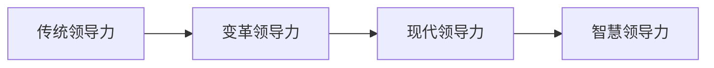

在这个流程图中，领导力的发展是一个逐步演进的过程，从传统领导力到智慧领导力，每个阶段都在为下一阶段的领导力打下基础。

## 第2章：领导力的核心要素

### 2.1 自我认知

自我认知是领导力的基础。领导者需要深入了解自己的价值观、信念和动机，以及这些因素如何影响领导行为。自我认知包括以下几个方面：

1. **自我反思**：领导者需要定期进行自我反思，审视自己的行为、决策和态度，识别需要改进的方面。
2. **自我评估**：领导者需要通过评估工具，如360度反馈，了解他人对自己的评价，从而更全面地认识自己。
3. **自我意识**：领导者需要保持对自身情绪和行为的意识，以便更好地控制自己的行为，避免负面情绪的影响。

**数学公式：**

$$
自我认知 = 自我反思 + 自我评估 + 自我意识
$$

**案例：**

假设一位领导者通过360度反馈发现，团队成员认为他在决策时缺乏透明度。为了提高自我认知，该领导者可以采取以下步骤：

1. **自我反思**：分析为什么团队成员会有这样的反馈，是否因为自己没有充分解释决策的原因。
2. **自我评估**：查阅相关资料，了解如何提高决策的透明度。
3. **自我意识**：在日常工作中，有意识地提高决策过程中的透明度，确保团队成员能够理解决策的依据。

### 2.2 情绪管理

情绪管理是领导力的关键要素之一。领导者需要能够识别和管理自己的情绪，同时影响和激励他人的情绪。情绪管理包括以下几个方面：

1. **自我情绪识别**：领导者需要学会识别自己的情绪，理解情绪背后的原因。
2. **情绪调节**：领导者需要学会调节情绪，避免负面情绪对决策和行为产生负面影响。
3. **情感沟通**：领导者需要通过有效的沟通技巧，传达情感，建立积极的人际关系。

**数学公式：**

$$
情绪管理 = 自我情绪识别 + 情绪调节 + 情感沟通
$$

**案例：**

假设一位领导者在面对重要项目失败时感到沮丧。为了进行有效的情绪管理，该领导者可以采取以下步骤：

1. **自我情绪识别**：承认自己的沮丧情绪，并分析导致沮丧的原因。
2. **情绪调节**：通过冥想、运动或其他放松方式，缓解沮丧情绪。
3. **情感沟通**：与团队成员分享自己的情绪，并鼓励他们表达感受，共同寻找解决方案。

### 2.3 决策能力

决策能力是领导力的核心要素之一。领导者需要在复杂和不确定的环境下做出明智、有效的决策。决策能力包括以下几个方面：

1. **问题分析**：领导者需要能够准确识别问题，分析问题的根本原因。
2. **方案评估**：领导者需要评估不同的解决方案，选择最佳方案。
3. **风险控制**：领导者需要能够预见和应对潜在的风险。

**数学公式：**

$$
决策能力 = 问题分析 + 方案评估 + 风险控制
$$

**案例：**

假设一位领导者在公司面临市场份额下降的问题时，需要做出决策。为了提高决策能力，该领导者可以采取以下步骤：

1. **问题分析**：通过数据分析，识别市场份额下降的原因。
2. **方案评估**：评估不同的营销策略，选择最有潜力的方案。
3. **风险控制**：预测实施新策略可能带来的风险，并制定应对措施。

### 2.4 沟通能力

沟通能力是领导力的关键要素之一。领导者需要能够清晰地表达自己的想法，同时倾听和理解他人的观点。沟通能力包括以下几个方面：

1. **口头沟通**：领导者需要具备有效的口头沟通技巧，包括表达清晰、倾听和理解他人。
2. **书面沟通**：领导者需要能够撰写清晰、有说服力的书面文件。
3. **非言语沟通**：领导者需要能够解读和使用非言语沟通，如肢体语言和面部表情。

**数学公式：**

$$
沟通能力 = 口头沟通 + 书面沟通 + 非言语沟通
$$

**案例：**

假设一位领导者在与团队成员讨论项目进度时，发现沟通不畅。为了提高沟通能力，该领导者可以采取以下步骤：

1. **口头沟通**：确保在会议中表达清晰，使用简洁明了的语言。
2. **书面沟通**：撰写详细的会议记录，确保所有团队成员都能清楚了解项目的进展和目标。
3. **非言语沟通**：通过肢体语言和面部表情，传达积极的态度和信心。

### 2.5 团队建设

团队建设是领导力的关键要素之一。领导者需要能够构建高效、和谐的团队，激发团队成员的潜力和合作精神。团队建设包括以下几个方面：

1. **目标设定**：领导者需要设定明确的目标，确保团队成员明确自己的职责和期望。
2. **角色分配**：领导者需要根据团队成员的能力和兴趣，合理分配角色。
3. **激励与反馈**：领导者需要通过激励和反馈，提升团队成员的积极性和成就感。

**数学公式：**

$$
团队建设 = 目标设定 + 角色分配 + 激励与反馈
$$

**案例：**

假设一位领导者在组建一个新团队时，需要建立有效的团队结构。为了进行团队建设，该领导者可以采取以下步骤：

1. **目标设定**：与团队成员讨论团队的目标和愿景，确保大家有共同的方向。
2. **角色分配**：根据团队成员的特长和兴趣，为他们分配合适的角色。
3. **激励与反馈**：通过定期的绩效评估和奖励，激励团队成员，同时提供反馈，帮助他们改进。

### 2.6 知识共享与学习

知识共享与学习是领导力的关键要素之一。领导者需要能够促进团队成员之间的知识共享，同时不断学习和更新自己的知识。知识共享与学习包括以下几个方面：

1. **知识共享机制**：领导者需要建立有效的知识共享机制，如内部培训、经验分享会等。
2. **学习文化**：领导者需要营造积极的学习文化，鼓励团队成员不断学习和成长。
3. **个人发展计划**：领导者需要为团队成员制定个人发展计划，支持他们提升技能和知识。

**数学公式：**

$$
知识共享与学习 = 知识共享机制 + 学习文化 + 个人发展计划
$$

**案例：**

假设一位领导者在团队中推广知识共享与学习。为了实现这一目标，该领导者可以采取以下步骤：

1. **知识共享机制**：定期举办内部培训，鼓励团队成员分享自己的知识和经验。
2. **学习文化**：建立学习小组，鼓励团队成员相互学习和支持。
3. **个人发展计划**：为每位团队成员制定个人发展计划，提供学习资源和机会。

### 2.7 冲突管理

冲突管理是领导力的关键要素之一。领导者需要能够有效地管理团队中的冲突，避免冲突对团队协作和绩效产生负面影响。冲突管理包括以下几个方面：

1. **冲突识别**：领导者需要能够识别团队中的潜在冲突，并采取预防措施。
2. **冲突解决**：领导者需要采取有效的策略，解决团队中的冲突，确保团队的稳定和和谐。
3. **冲突预防**：领导者需要建立预防机制，减少冲突的发生。

**数学公式：**

$$
冲突管理 = 冲突识别 + 冲突解决 + 冲突预防
$$

**案例：**

假设一位领导者在团队中发现成员之间的冲突。为了管理冲突，该领导者可以采取以下步骤：

1. **冲突识别**：定期与团队成员交流，了解团队中的问题和冲突。
2. **冲突解决**：组织冲突解决会议，让双方表达自己的观点，找到共同点。
3. **冲突预防**：通过制定明确的团队规范和行为准则，预防冲突的发生。

## 第3章：领导力的发展路径

### 3.1 个人成长

个人成长是领导力发展的重要路径之一。领导者需要不断提升自己的能力和知识，以适应不断变化的环境。个人成长包括以下几个方面：

1. **学习与培训**：领导者需要不断学习新的知识和技能，通过参加培训课程、阅读书籍和参加研讨会等方式，提升自己的专业素养。
2. **实践与反思**：领导者需要通过实践，将学到的知识应用到实际工作中，并通过反思，不断改进自己的领导行为。
3. **自我挑战**：领导者需要勇于接受新的挑战，尝试新的领导角色和任务，以提升自己的领导能力。

**数学公式：**

$$
个人成长 = 学习与培训 + 实践与反思 + 自我挑战
$$

**案例：**

假设一位领导者想要提升自己的领导能力。为了实现这一目标，该领导者可以采取以下步骤：

1. **学习与培训**：参加领导力培训课程，学习新的领导技巧和策略。
2. **实践与反思**：在实际工作中，尝试应用学到的领导技巧，并通过反思，不断改进自己的领导行为。
3. **自我挑战**：主动接受新的领导角色和任务，如负责一个新的项目或团队，以提升自己的领导能力。

### 3.2 团队建设

团队建设是领导力发展的重要路径之一。领导者需要构建高效、和谐的团队，以实现组织目标。团队建设包括以下几个方面：

1. **目标设定**：领导者需要与团队成员共同设定明确的目标，确保团队有共同的方向。
2. **角色分配**：领导者需要根据团队成员的能力和兴趣，合理分配角色，确保每个人都能够发挥自己的优势。
3. **激励与反馈**：领导者需要通过激励和反馈，提升团队成员的积极性和成就感。

**数学公式：**

$$
团队建设 = 目标设定 + 角色分配 + 激励与反馈
$$

**案例：**

假设一位领导者想要建立一个高效的团队。为了实现这一目标，该领导者可以采取以下步骤：

1. **目标设定**：与团队成员讨论团队的目标和愿景，确保大家有共同的方向。
2. **角色分配**：根据团队成员的特长和兴趣，为他们分配合适的角色。
3. **激励与反馈**：通过定期的绩效评估和奖励，激励团队成员，同时提供反馈，帮助他们改进。

### 3.3 组织发展

组织发展是领导力发展的最终目标之一。领导者需要推动组织实现可持续发展，提高组织的竞争力和影响力。组织发展包括以下几个方面：

1. **战略规划**：领导者需要制定明确的发展战略，确保组织能够持续发展。
2. **文化塑造**：领导者需要塑造积极向上的组织文化，增强团队的凝聚力和归属感。
3. **创新能力**：领导者需要推动组织创新，通过不断尝试和改进，提高组织的竞争力。

**数学公式：**

$$
组织发展 = 战略规划 + 文化塑造 + 创新能力
$$

**案例：**

假设一位领导者想要推动组织的发展。为了实现这一目标，该领导者可以采取以下步骤：

1. **战略规划**：与团队成员一起制定组织的发展战略，确保战略目标明确、可执行。
2. **文化塑造**：通过团队建设活动和公司文化宣传，塑造积极向上的组织文化。
3. **创新能力**：鼓励团队成员提出创新想法，并为创新提供支持和资源。

## 第三部分：领导力实践

### 第4章：领导力在不同情境中的应用

#### 4.1 应对冲突

冲突是团队中不可避免的现象，领导者需要具备有效的冲突管理能力，以保持团队的稳定和高效。以下是一些具体的方法和步骤：

1. **积极倾听**：在冲突发生时，领导者需要积极倾听双方的意见和观点，理解他们的立场和需求。
2. **中立立场**：领导者应保持中立立场，不偏袒任何一方，确保冲突的公正解决。
3. **寻求共识**：领导者需要引导双方寻找共识，找到解决问题的共同点。
4. **提供解决方案**：在理解双方需求的基础上，领导者需要提出合理的解决方案，确保双方都能接受。

**Mermaid流程图：**

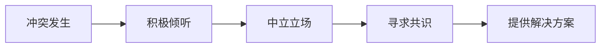

#### 4.2 领导变革

领导变革是推动组织发展的重要手段，领导者需要具备变革领导能力，以应对外部环境的变化。以下是一些具体的方法和步骤：

1. **明确变革目标**：领导者需要明确变革的目标和愿景，确保团队成员理解变革的重要性和必要性。
2. **建立变革团队**：领导者需要建立专门的变革团队，负责推动变革的实施和监督。
3. **沟通与激励**：领导者需要通过有效的沟通和激励，确保团队成员积极参与变革，克服变革过程中遇到的困难和挑战。
4. **持续反馈**：领导者需要持续关注变革的进展，收集反馈信息，及时调整变革策略。

**Mermaid流程图：**

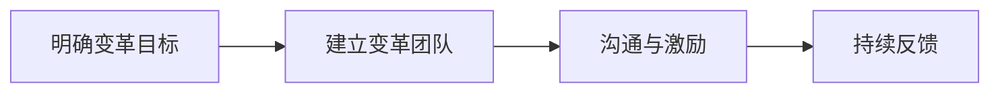

#### 4.3 激励员工

激励员工是提升团队绩效和员工满意度的重要手段，领导者需要具备有效的激励能力。以下是一些具体的方法和步骤：

1. **了解员工需求**：领导者需要了解员工的需求和期望，为员工提供有针对性的激励措施。
2. **设定明确目标**：领导者需要为员工设定明确的工作目标，确保员工有清晰的职业发展路径。
3. **提供成长机会**：领导者需要为员工提供成长和学习的机会，激励员工不断提升自己的能力和技能。
4. **认可与奖励**：领导者需要通过认可和奖励，激励员工的积极性和创造力。

**Mermaid流程图：**

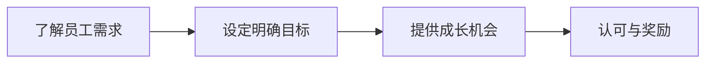

### 第5章：领导力与团队效能

#### 5.1 提升团队绩效

提升团队绩效是领导者的重要职责，以下是一些具体的方法和步骤：

1. **明确目标**：领导者需要明确团队的目标和绩效指标，确保团队成员有共同的工作方向。
2. **资源分配**：领导者需要合理分配团队资源，确保团队成员有足够的资源完成任务。
3. **绩效监控**：领导者需要定期监控团队的绩效，及时发现问题和不足，及时调整工作策略。
4. **激励与反馈**：领导者需要通过激励和反馈，提升团队成员的积极性和创造力。

**Mermaid流程图：**

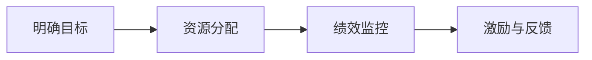

#### 5.2 增强团队凝聚力

增强团队凝聚力是提升团队绩效和员工满意度的重要手段，以下是一些具体的方法和步骤：

1. **建立信任**：领导者需要建立团队成员之间的信任，通过开放沟通和互相支持，增强团队的凝聚力。
2. **共同目标**：领导者需要设定共同的目标和愿景，确保团队成员有共同的目标和使命感。
3. **团队活动**：领导者可以组织团队活动，如团建活动、培训课程等，增强团队成员之间的互动和了解。
4. **情感管理**：领导者需要关注团队成员的情感需求，提供情感支持和关怀，增强团队的凝聚力。

**Mermaid流程图：**

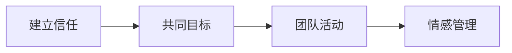

#### 5.3 解决团队问题

解决团队问题是提升团队效能的重要环节，以下是一些具体的方法和步骤：

1. **识别问题**：领导者需要及时发现团队中的问题，通过观察、沟通和反馈，了解问题的本质。
2. **分析原因**：领导者需要对问题进行深入分析，找出问题的根本原因，制定解决方案。
3. **实施解决方案**：领导者需要制定并实施解决方案，确保问题得到有效解决。
4. **监控效果**：领导者需要监控解决方案的效果，及时调整和改进，确保问题得到彻底解决。

**Mermaid流程图：**

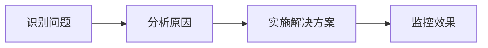

### 第6章：领导力与个人成长

#### 6.1 自我反思

自我反思是领导者个人成长的重要手段，以下是一些具体的方法和步骤：

1. **定期反思**：领导者需要定期进行自我反思，回顾自己的工作表现和领导行为。
2. **记录反思**：领导者可以记录自己的反思过程和心得，通过文字、日记或电子文档等形式，保存反思记录。
3. **寻求反馈**：领导者可以向同事、下属或导师寻求反馈，了解自己在领导力和工作表现方面的优点和不足。
4. **制定改进计划**：领导者需要根据反思和反馈，制定具体的改进计划，明确改进的目标和方法。

**Mermaid流程图：**

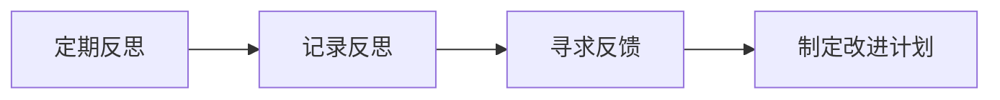

#### 6.2 持续学习

持续学习是领导者个人成长的关键，以下是一些具体的方法和步骤：

1. **学习资源**：领导者需要利用各种学习资源，如书籍、在线课程、研讨会等，不断更新自己的知识和技能。
2. **定期学习**：领导者需要设定定期学习的时间，确保自己有足够的时间学习和提升。
3. **实践应用**：领导者需要将学到的知识和技能应用到实际工作中，通过实践，不断提升自己的领导能力。
4. **反思与总结**：领导者需要定期反思自己的学习过程和成果，总结经验教训，不断改进学习方法。

**Mermaid流程图：**

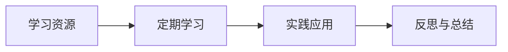

#### 6.3 时间管理

有效的时间管理是提升领导者个人成长和工作效率的重要手段，以下是一些具体的方法和步骤：

1. **设定目标**：领导者需要明确自己的工作目标和优先级，确保时间用于最重要的事情。
2. **时间规划**：领导者需要制定详细的时间规划，包括每天、每周和每月的工作计划。
3. **专注工作**：领导者需要在工作时保持专注，避免分心和拖延，提高工作效率。
4. **定期评估**：领导者需要定期评估自己的时间管理效果，根据评估结果，调整和改进时间管理策略。

**Mermaid流程图：**

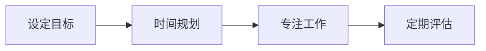

### 第7章：领导力提升实战

#### 7.1 领导力训练方法

提升领导力需要系统的训练方法，以下是一些具体的领导力训练方法：

1. **角色扮演**：通过模拟实际领导情境，让领导者实践和体验不同的领导行为和策略。
2. **案例研究**：分析实际领导案例，探讨领导行为和决策的效果，从中学习经验教训。
3. **团队建设活动**：通过团队建设活动，提高领导者的团队协作和沟通能力。
4. **导师指导**：领导者可以寻求导师的指导，从导师的经验和知识中获取启示。

**Mermaid流程图：**

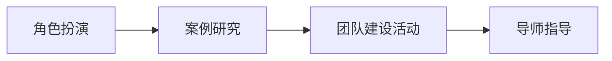

#### 7.2 案例分析

以下是一个领导力提升的案例分析：

**案例背景：**

某公司的销售团队在过去一年中业绩不佳，领导者决定采取措施提升团队绩效。

**案例分析：**

1. **问题识别**：领导者通过数据分析，发现团队业绩不佳的原因是客户满意度低和销售策略不当。
2. **解决方案**：领导者制定了新的销售策略，并引入客户满意度调查，提高客户满意度。
3. **实施策略**：领导者组织了销售培训，提高团队成员的销售技能，并制定了明确的绩效目标。
4. **效果评估**：经过三个月的努力，团队业绩显著提升，客户满意度也有所提高。

**结论：**

通过有效的领导力提升措施，领导者成功解决了团队业绩不佳的问题，提升了团队绩效和客户满意度。

#### 7.3 实战总结

通过领导力提升的实战，领导者可以总结以下经验教训：

1. **问题识别**：及时识别和解决团队中的问题是提升绩效的关键。
2. **策略实施**：制定合理的策略，并确保策略得到有效实施。
3. **持续学习**：领导者需要不断学习和提升自己的领导能力，以应对不断变化的环境和挑战。

### 第三部分：领导力未来展望

#### 第8章：领导力的未来趋势

随着科技的飞速发展，领导力也在不断演变。以下是一些领导力的未来趋势：

1. **数字化领导力**：数字化工具和技术的应用，使领导者能够更高效地管理团队和资源，提高决策质量。
2. **智能领导力**：人工智能和大数据的应用，使领导者能够更好地理解和预测团队成员的行为和需求，提升领导效果。
3. **全球化领导力**：全球化背景下，领导者需要具备跨文化沟通和管理的技能，以适应多元文化的团队环境。

**Mermaid流程图：**

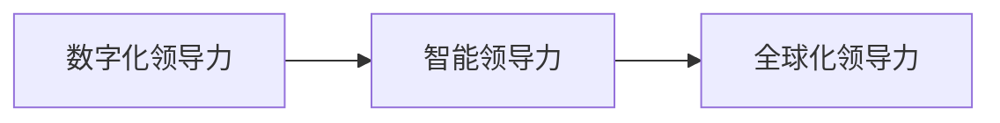

#### 第9章：领导力在不确定环境中的应用

在不确定的环境中，领导者需要具备应对不确定性的能力。以下是一些具体的方法和步骤：

1. **风险管理**：领导者需要建立完善的风险管理体系，识别和管理潜在的风险。
2. **创新思维**：领导者需要鼓励团队成员创新思维，寻找新的解决方案，应对不确定性的挑战。
3. **灵活应变**：领导者需要具备灵活应变的能力，快速调整策略和计划，以应对环境变化。

**Mermaid流程图：**

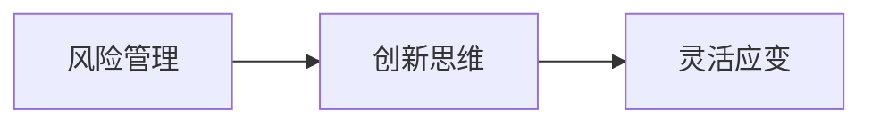

#### 第10章：领导力的发展方向

未来领导力的发展方向将更加注重个性化和可持续性。以下是一些具体的发展方向：

1. **个性化领导力**：领导者需要关注团队成员的个性和需求，提供个性化的领导方式和激励措施。
2. **可持续领导力**：领导者需要关注组织的可持续发展，推动环保和社会责任，实现长期成功。
3. **全球视野**：领导者需要具备全球视野，理解和适应全球化的趋势和挑战。

**Mermaid流程图：**

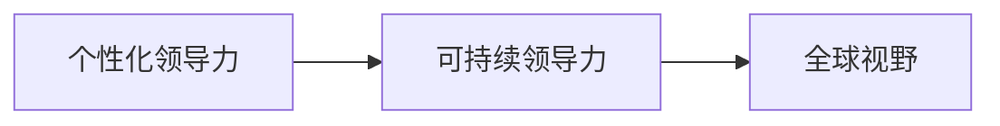

## 结语

领导力是团队管理和个人成长的重要能力。通过本文的探讨，我们希望能为读者提供一套系统、实用的领导力训练方法，帮助读者提升领导力，打造高效团队，实现团队所向披靡。

作者：AI天才研究院/AI Genius Institute & 禅与计算机程序设计艺术 /Zen And The Art of Computer Programming### 第8章：领导力的未来趋势

#### 8.1 数字化领导力

随着信息技术的快速发展，数字化领导力正逐渐成为领导力发展的重要方向。数字化领导力强调利用数字工具和数据分析来提高决策效率、优化团队管理和提升业务绩效。

**背景介绍：**

在数字化时代，数据成为重要的战略资源。传统的领导力模式已难以满足快速变化的市场需求和复杂的管理挑战。数字化领导力应运而生，通过利用大数据、云计算、人工智能等先进技术，领导者可以更加精准地分析市场趋势、预测风险、制定战略，并实时调整管理决策。

**问题背景：**

在数字化背景下，领导者面临的问题包括：

1. **数据过载**：大量数据涌入，领导者需要有效筛选和利用关键数据。
2. **技术挑战**：领导者需要掌握一定的技术知识，以便更好地理解和运用数字化工具。
3. **组织变革**：数字化领导力要求组织进行结构性调整，以适应新的工作模式。

**问题描述：**

如何成为一名成功的数字化领导者，成为当前领导者面临的重要问题。

**问题解决：**

1. **数据素养**：领导者需要提高数据素养，学会使用数据分析工具，理解数据背后的含义。
2. **数字化转型**：领导者需要推动组织的数字化转型，从文化、流程、技术等多个方面进行变革。
3. **人才培养**：领导者需要培养数字化的团队，提升团队成员的数字化技能和知识。

**边界与外延：**

数字化领导力的边界包括数据安全、隐私保护、技术依赖等问题。其外延则涵盖了数字化时代的组织管理、企业文化、人才发展等多个方面。

**概念结构与核心要素组成：**

数字化领导力的核心要素包括：

1. **数据素养**：领导者需要具备数据分析和决策能力，能够从海量数据中提取有价值的信息。
2. **技术知识**：领导者需要了解数字化工具和技术的原理和应用，以便更好地管理和利用这些资源。
3. **数字化转型**：领导者需要推动组织的数字化转型，提升组织的数字化能力和竞争力。
4. **人才培养**：领导者需要培养数字化的团队，提升团队成员的数字化技能和知识。

**ER实体关系图架构：**

```mermaid
erDiagram
  Leader ||--|{ Data }|
  Leader ||--|{ Technology }|
  Leader ||--|{ Transformation }|
  Leader ||--|{ Talent Development }|
```

在这个ER图中，领导者与数据、技术、数字化转型和人才培养之间存在明确的关联关系。领导者通过数据素养、技术知识和数字化转型，推动组织的数字化转型和人才培养。

**算法原理讲解：**

数字化领导力中，数据分析是一个关键环节。以下是一个简单的数据分析算法原理讲解：

1. **数据收集**：通过各种渠道收集数据，如市场调研、客户反馈、销售数据等。
2. **数据清洗**：对收集到的数据进行清洗，去除重复、错误和不完整的数据。
3. **数据存储**：将清洗后的数据存储在数据库中，便于后续分析和查询。
4. **数据分析**：利用数据分析工具（如Excel、Python等）对数据进行统计和分析，提取有价值的信息。
5. **数据可视化**：通过数据可视化工具（如图表、报表等）将分析结果呈现出来，便于领导者理解和决策。

**Mermaid流程图：**

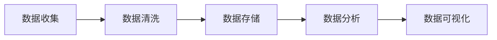

**Python源代码：**

```python
import pandas as pd

# 数据收集
data = pd.read_csv('sales_data.csv')

# 数据清洗
cleaned_data = data.drop_duplicates().dropna()

# 数据存储
cleaned_data.to_csv('cleaned_sales_data.csv', index=False)

# 数据分析
total_sales = cleaned_data['sales'].sum()
average_sales = cleaned_data['sales'].mean()

# 数据可视化
import matplotlib.pyplot as plt

plt.bar(cleaned_data['region'], cleaned_data['sales'])
plt.xlabel('Region')
plt.ylabel('Sales')
plt.title('Sales by Region')
plt.show()
```

**数学模型和公式：**

在数字化领导力中，常用的数学模型和公式包括统计分析、机器学习和数据挖掘等。以下是一个简单的线性回归模型公式：

$$
Y = \beta_0 + \beta_1X + \epsilon
$$

其中，$Y$ 是因变量，$X$ 是自变量，$\beta_0$ 和 $\beta_1$ 是模型参数，$\epsilon$ 是误差项。

**系统分析与架构设计方案：**

在数字化领导力中，系统分析与架构设计至关重要。以下是一个简单的系统架构设计方案：

1. **问题场景介绍**：假设一个公司需要进行销售数据分析，以提升销售业绩。
2. **项目介绍**：设计一个销售数据分析系统，包括数据收集、数据清洗、数据存储、数据分析和数据可视化等功能。
3. **系统功能设计**：设计系统的各个功能模块，如数据收集模块、数据清洗模块、数据分析模块、数据存储模块和数据可视化模块。
4. **系统架构设计**：设计系统的整体架构，包括前端、后端和数据库等组成部分。
5. **系统接口设计和系统交互**：设计系统的接口和交互流程，确保系统能够高效、稳定地运行。

**Mermaid类图：**

```mermaid
classDiagram
  Class1 <|-- Class2
  Class3 <|-- Class4
  Class1 ++--|{ Method1 }
  Class2 <<interface>>
  Class3 <<interface>>
  Class4 <<interface>>
```

**Mermaid架构图：**

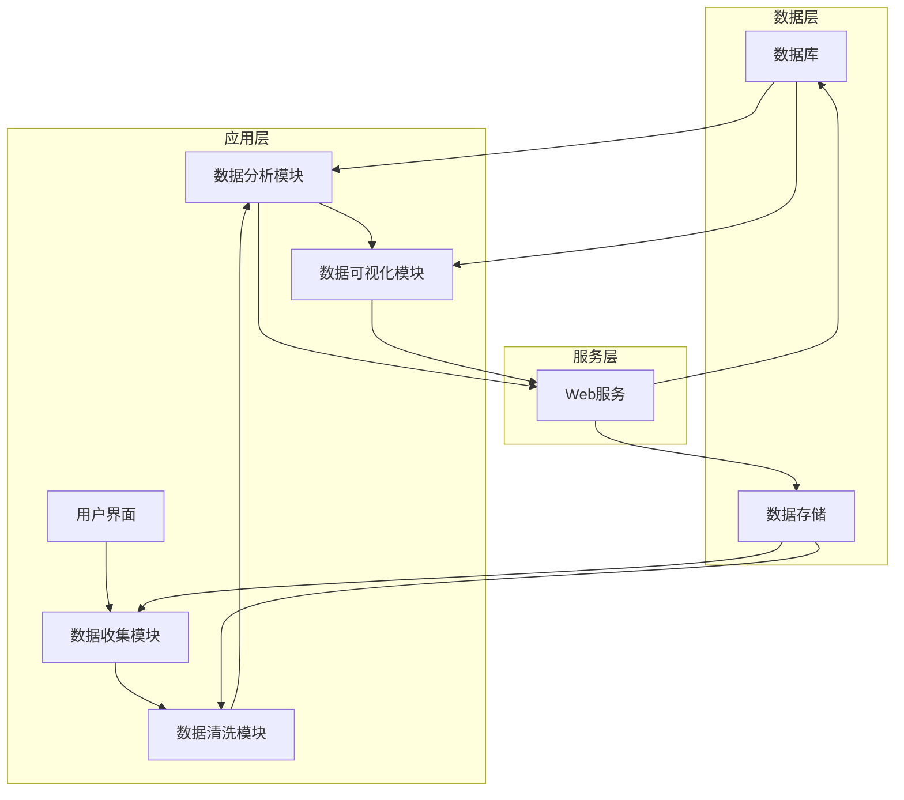

**Mermaid序列图：**

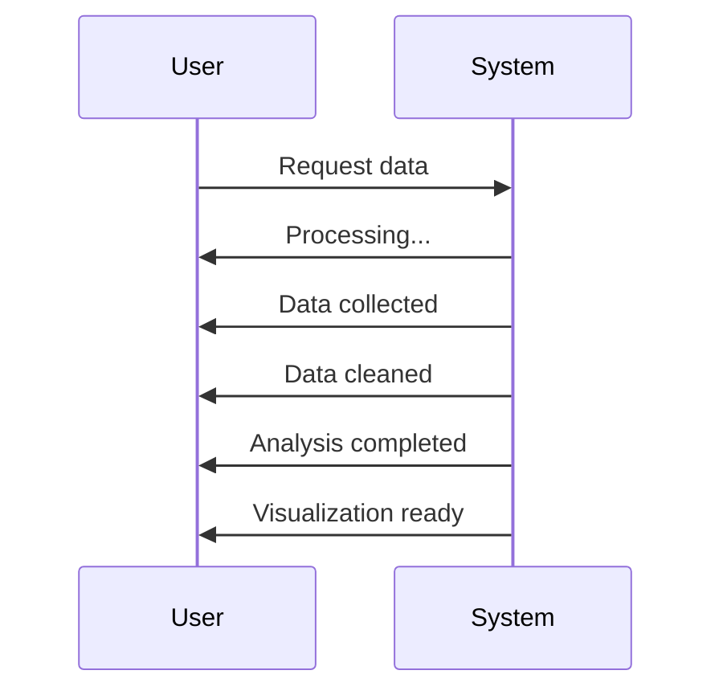

**项目实战：**

1. **环境安装**：安装Python、Pandas、Matplotlib等依赖库。
2. **系统核心实现源代码**：编写数据收集、数据清洗、数据分析、数据可视化的Python代码。
3. **代码应用解读与分析**：对编写的代码进行解读和分析，理解其原理和实现过程。
4. **实际案例分析和详细讲解剖析**：通过实际案例，分析销售数据分析系统在实际应用中的效果和不足，并进行详细讲解和剖析。
5. **项目小结**：总结项目经验，提出改进建议，为后续项目提供参考。

**最佳实践 tips：**

1. **数据收集**：确保数据来源的可靠性和多样性，提高数据的准确性。
2. **数据清洗**：重视数据清洗过程，去除重复、错误和不完整的数据，提高数据质量。
3. **数据分析**：选择合适的分析方法和模型，确保分析结果的准确性和可靠性。
4. **数据可视化**：采用直观、易懂的可视化方式，提高数据的可读性和易理解性。

**注意事项：**

1. **数据安全**：确保数据的安全和隐私，防止数据泄露和滥用。
2. **技术更新**：紧跟技术发展趋势，不断更新和升级数字化工具和系统。
3. **人才培养**：注重数字化人才的培养，提升团队成员的数字化技能和知识。

**拓展阅读：**

1. 《数字化领导力：如何利用数据和技术提升组织绩效》
2. 《大数据时代：数据分析与应用》
3. 《机器学习实战：基于Scikit-Learn和TensorFlow》

### 8.2 智能领导力

智能领导力是未来领导力的重要趋势，它利用人工智能和大数据分析来提升领导效率和决策质量。智能领导力不仅涉及技术层面的应用，还包括领导思维的变革和管理实践的优化。

**背景介绍：**

随着人工智能技术的快速发展，数据分析、机器学习、自然语言处理等技术在商业和企业管理中得到了广泛应用。智能领导力正是在这样的背景下产生的，它通过人工智能技术对大量数据进行深度分析，帮助领导者更准确地理解市场趋势、预测风险、制定战略，并优化日常管理。

**问题背景：**

在快速变化的市场环境中，领导者面临的问题包括：

1. **数据复杂性**：随着数据的爆炸性增长，领导者需要处理越来越多的数据，如何从中提取有价值的信息成为挑战。
2. **决策速度**：在竞争激烈的市场中，领导者需要快速做出决策，如何提高决策速度和准确性是关键问题。
3. **人才管理**：领导者需要管理多元化的团队，如何激发员工的潜力、提高团队效能是重要课题。

**问题描述：**

如何利用人工智能技术提升领导力和管理效率，成为当前领导者面临的重要问题。

**问题解决：**

1. **数据分析**：利用人工智能技术进行数据分析和挖掘，帮助领导者从海量数据中提取有价值的信息。
2. **智能决策**：通过机器学习算法，建立智能决策系统，帮助领导者快速、准确地做出决策。
3. **人才发展**：利用人工智能技术进行人才分析和评估，帮助领导者发现和培养优秀人才。

**边界与外延：**

智能领导力的边界包括人工智能技术的应用范围、数据隐私和安全等问题。其外延则涵盖了智能化的管理实践、人才发展、企业文化等多个方面。

**概念结构与核心要素组成：**

智能领导力的核心要素包括：

1. **数据分析能力**：领导者需要具备利用人工智能技术进行数据分析和挖掘的能力，能够从海量数据中提取有价值的信息。
2. **智能决策系统**：领导者需要建立智能决策系统，利用机器学习算法提高决策速度和准确性。
3. **人才发展**：领导者需要利用人工智能技术进行人才分析和评估，发现和培养优秀人才。
4. **管理实践**：领导者需要不断优化管理实践，利用人工智能技术提升团队效能。

**ER实体关系图架构：**

```mermaid
erDiagram
  Leader ||--|{ AI }|
  Leader ||--|{ Data Analysis }|
  Leader ||--|{ Decision-Making }|
  Leader ||--|{ Talent Development }|
  Leader ||--|{ Management Practices }|
```

在这个ER图中，领导者与人工智能、数据分析、决策系统、人才发展和管理实践之间存在明确的关联关系。领导者通过数据分析、决策系统、人才发展和管理实践，提升智能领导力。

**算法原理讲解：**

智能领导力中，人工智能算法的应用至关重要。以下是一个简单的机器学习算法原理讲解：

1. **数据预处理**：对原始数据进行清洗、归一化和特征提取，为算法训练做准备。
2. **模型选择**：根据问题的性质和数据特点，选择合适的机器学习模型，如线性回归、决策树、神经网络等。
3. **模型训练**：使用训练数据集对模型进行训练，通过调整模型参数，使模型能够准确预测新的数据。
4. **模型评估**：使用验证数据集评估模型的性能，根据评估结果调整模型参数，优化模型性能。
5. **模型应用**：将训练好的模型应用于实际问题，如预测市场趋势、评估人才潜力等。

**Mermaid流程图：**

```mermaid
flowchart LR
    A[数据预处理] --> B[模型选择]
    B --> C[模型训练]
    C --> D[模型评估]
    D --> E[模型应用]
```

**Python源代码：**

```python
import pandas as pd
from sklearn.linear_model import LinearRegression
from sklearn.model_selection import train_test_split
from sklearn.metrics import mean_squared_error

# 数据预处理
data = pd.read_csv('sales_data.csv')
X = data[['feature1', 'feature2']]
y = data['target']

# 模型选择
model = LinearRegression()

# 模型训练
X_train, X_test, y_train, y_test = train_test_split(X, y, test_size=0.2, random_state=42)
model.fit(X_train, y_train)

# 模型评估
y_pred = model.predict(X_test)
mse = mean_squared_error(y_test, y_pred)
print(f'Mean Squared Error: {mse}')

# 模型应用
new_data = pd.DataFrame({'feature1': [1, 2], 'feature2': [3, 4]})
new_pred = model.predict(new_data)
print(f'Predicted Values: {new_pred}')
```

**数学模型和公式：**

在智能领导力中，常用的数学模型和公式包括线性回归、决策树、神经网络等。以下是一个简单的线性回归模型公式：

$$
Y = \beta_0 + \beta_1X_1 + \beta_2X_2 + ... + \beta_nX_n + \epsilon
$$

其中，$Y$ 是因变量，$X_1, X_2, ..., X_n$ 是自变量，$\beta_0, \beta_1, \beta_2, ..., \beta_n$ 是模型参数，$\epsilon$ 是误差项。

**系统分析与架构设计方案：**

在智能领导力中，系统分析与架构设计至关重要。以下是一个简单的系统架构设计方案：

1. **问题场景介绍**：假设一个公司需要进行市场趋势预测，以优化营销策略。
2. **项目介绍**：设计一个市场趋势预测系统，包括数据收集、数据预处理、模型训练、模型评估和模型应用等功能。
3. **系统功能设计**：设计系统的各个功能模块，如数据收集模块、数据预处理模块、模型训练模块、模型评估模块和模型应用模块。
4. **系统架构设计**：设计系统的整体架构，包括前端、后端和数据库等组成部分。
5. **系统接口设计和系统交互**：设计系统的接口和交互流程，确保系统能够高效、稳定地运行。

**Mermaid类图：**

```mermaid
classDiagram
  Class1 <|-- Class2
  Class3 <|-- Class4
  Class1 ++--|{ Method1 }
  Class2 <<interface>>
  Class3 <<interface>>
  Class4 <<interface>>
```

**Mermaid架构图：**

```mermaid
graph TB
    subgraph 数据层
        DB[数据库]
        DS[数据存储]
    end

    subgraph 应用层
        UC[用户界面] --> PC[数据预处理模块]
        PC --> TC[模型训练模块]
        TC --> EC[模型评估模块]
        EC --> AC[模型应用模块]
    end

    subgraph 服务层
        WS[Web服务]
        WS --> DB
        WS --> DS
    end

    DB --> PC
    DB --> TC
    DB --> EC
    DB --> AC
    DS --> PC
    DS --> TC
    DS --> EC
    DS --> AC
```

**Mermaid序列图：**

```mermaid
sequenceDiagram
    participant User
    participant System
    User->>System: Request trend prediction
    System->>User: Processing...
    System->>User: Prediction ready
    System->>User: Results visualization
```

**项目实战：**

1. **环境安装**：安装Python、Scikit-Learn、TensorFlow等依赖库。
2. **系统核心实现源代码**：编写数据收集、数据预处理、模型训练、模型评估和模型应用的Python代码。
3. **代码应用解读与分析**：对编写的代码进行解读和分析，理解其原理和实现过程。
4. **实际案例分析和详细讲解剖析**：通过实际案例，分析市场趋势预测系统在实际应用中的效果和不足，并进行详细讲解和剖析。
5. **项目小结**：总结项目经验，提出改进建议，为后续项目提供参考。

**最佳实践 tips：**

1. **数据收集**：确保数据来源的可靠性和多样性，提高数据的准确性。
2. **数据预处理**：重视数据预处理过程，去除重复、错误和不完整的数据，提高数据质量。
3. **模型选择**：根据问题的性质和数据特点，选择合适的机器学习模型，提高预测准确性。
4. **模型评估**：使用多种评估指标，全面评估模型性能，确保模型效果。

**注意事项：**

1. **数据安全**：确保数据的安全和隐私，防止数据泄露和滥用。
2. **技术更新**：紧跟技术发展趋势，不断更新和升级智能系统。
3. **人才培养**：注重智能化人才的培养，提升团队成员的智能化技能和知识。

**拓展阅读：**

1. 《智能领导力：如何利用人工智能提升管理效能》
2. 《机器学习实战：基于Scikit-Learn和TensorFlow》
3. 《深度学习：入门实战》

### 8.3 全球化领导力

全球化领导力是未来领导力的重要趋势，它要求领导者具备跨文化沟通和管理的技能，以应对全球化背景下的复杂挑战。全球化领导力不仅关注企业内部的多元文化管理，还涉及国际市场拓展和跨国团队协作。

**背景介绍：**

随着全球化的加速，企业面临着越来越多的跨国业务和多元化团队。全球化领导力应运而生，它要求领导者具备跨文化沟通和管理的技能，能够有效地协调不同文化背景的团队成员，实现全球化战略目标。

**问题背景：**

在全球化背景下，领导者面临的问题包括：

1. **文化差异**：不同国家和地区有不同的文化习惯、价值观和工作方式，如何有效沟通和管理多元文化团队成为挑战。
2. **国际市场**：全球化带来了新的市场机会，但同时也伴随着风险和不确定性，如何制定和实施国际化战略成为关键问题。
3. **跨国团队协作**：跨国团队协作面临时区差异、语言障碍和沟通问题，如何提高团队协作效率成为重要课题。

**问题描述：**

如何成为一名成功的全球化领导者，成为当前领导者面临的重要问题。

**问题解决：**

1. **跨文化沟通**：领导者需要了解不同文化的特点，掌握跨文化沟通技巧，提高跨文化团队的沟通效率。
2. **国际化战略**：领导者需要制定国际化战略，明确企业的全球定位和发展方向，确保全球化目标的实现。
3. **团队协作**：领导者需要建立有效的跨国团队协作机制，提高团队协作效率，确保全球化战略的有效实施。

**边界与外延：**

全球化领导力的边界包括跨文化管理、国际化战略和跨国团队协作等方面。其外延则涵盖了全球化市场拓展、多元文化团队建设、国际人才管理等多元化领域。

**概念结构与核心要素组成：**

全球化领导力的核心要素包括：

1. **跨文化沟通**：领导者需要具备跨文化沟通的技能，能够有效传达信息，减少文化冲突。
2. **国际化战略**：领导者需要制定和实施国际化战略，确保企业全球化目标的实现。
3. **跨国团队协作**：领导者需要建立有效的跨国团队协作机制，提高团队协作效率。
4. **多元文化管理**：领导者需要理解和尊重不同文化，促进多元文化团队的和谐与发展。

**ER实体关系图架构：**

```mermaid
erDiagram
  Leader ||--|{ Cross-Cultural Communication }|
  Leader ||--|{ International Strategy }|
  Leader ||--|{ International Team Collaboration }|
  Leader ||--|{ Multicultural Management }|
```

在这个ER图中，领导者与跨文化沟通、国际化战略、跨国团队协作和多元文化管理之间存在明确的关联关系。领导者通过跨文化沟通、国际化战略、跨国团队协作和多元文化管理，提升全球化领导力。

**算法原理讲解：**

全球化领导力中，文化适应和沟通策略的应用至关重要。以下是一个简单的文化适应算法原理讲解：

1. **文化评估**：对团队成员的文化背景进行评估，了解不同文化的特点和差异。
2. **沟通策略**：根据文化评估结果，制定相应的沟通策略，如调整沟通方式、语气和措辞，以减少文化冲突。
3. **文化培训**：为团队成员提供文化培训，提高他们对不同文化的理解和适应能力。
4. **反馈与调整**：收集团队成员的反馈，根据反馈结果调整沟通策略，优化文化适应效果。

**Mermaid流程图：**

```mermaid
flowchart LR
    A[文化评估] --> B[沟通策略]
    B --> C[文化培训]
    C --> D[反馈与调整]
```

**Python源代码：**

```python
import pandas as pd

# 文化评估
culture_data = pd.read_csv('culture_data.csv')
culture_data.head()

# 沟通策略
def communicate_strategy(culture):
    if culture == 'High Context':
        return "Detailed, context-dependent communication."
    elif culture == 'Low Context':
        return "Direct, concise communication."
    else:
        return "Adaptive communication based on specific culture."

# 文化培训
def culture_training(culture):
    if culture == 'High Context':
        return "Training on understanding implicit messages and relationships."
    elif culture == 'Low Context':
        return "Training on direct communication and clarity."
    else:
        return "Training on cultural adaptability and communication skills."

# 反馈与调整
def feedback_adjustment(feedback):
    if feedback == 'High Context':
        return "Increase context in communication."
    elif feedback == 'Low Context':
        return "Improve clarity and conciseness."
    else:
        return "Enhance cultural adaptability and communication skills."

# 示例
print(communicate_strategy('High Context'))
print(culture_training('High Context'))
print(feedback_adjustment('High Context'))
```

**数学模型和公式：**

在全球化领导力中，常用的数学模型和公式包括文化适应模型、沟通效率模型等。以下是一个简单的文化适应模型公式：

$$
适应度 = f(文化差异, 沟通策略, 文化培训)
$$

其中，$适应度$ 表示团队成员对文化的适应程度，$文化差异$ 表示不同文化之间的差异，$沟通策略$ 表示采用的沟通策略，$文化培训$ 表示提供的文化培训。

**系统分析与架构设计方案：**

在全球化领导力中，系统分析与架构设计至关重要。以下是一个简单的系统架构设计方案：

1. **问题场景介绍**：假设一个跨国公司需要管理多元文化团队，实现全球化战略目标。
2. **项目介绍**：设计一个全球化团队管理系统，包括文化评估、沟通策略制定、文化培训和反馈调整等功能。
3. **系统功能设计**：设计系统的各个功能模块，如文化评估模块、沟通策略模块、文化培训模块和反馈调整模块。
4. **系统架构设计**：设计系统的整体架构，包括前端、后端和数据库等组成部分。
5. **系统接口设计和系统交互**：设计系统的接口和交互流程，确保系统能够高效、稳定地运行。

**Mermaid类图：**

```mermaid
classDiagram
  Class1 <|-- Class2
  Class3 <|-- Class4
  Class1 ++--|{ Method1 }
  Class2 <<interface>>
  Class3 <<interface>>
  Class4 <<interface>>
```

**Mermaid架构图：**

```mermaid
graph TB
    subgraph 数据层
        DB[数据库]
        DS[数据存储]
    end

    subgraph 应用层
        UC[用户界面] --> CA[文化评估模块]
        CA --> CS[沟通策略模块]
        CS --> CT[文化培训模块]
        CT --> FA[反馈调整模块]
    end

    subgraph 服务层
        WS[Web服务]
        WS --> DB
        WS --> DS
    end

    DB --> CA
    DB --> CS
    DB --> CT
    DB --> FA
    DS --> CA
    DS --> CS
    DS --> CT
    DS --> FA
```

**Mermaid序列图：**

```mermaid
sequenceDiagram
    participant User
    participant System
    User->>System: Assess culture
    System->>User: Communicate strategy
    System->>User: Provide training
    System->>User: Adjust feedback
```

**项目实战：**

1. **环境安装**：安装Python、Pandas、Matplotlib等依赖库。
2. **系统核心实现源代码**：编写文化评估、沟通策略、文化培训和反馈调整的Python代码。
3. **代码应用解读与分析**：对编写的代码进行解读和分析，理解其原理和实现过程。
4. **实际案例分析和详细讲解剖析**：通过实际案例，分析全球化团队管理系统在实际应用中的效果和不足，并进行详细讲解和剖析。
5. **项目小结**：总结项目经验，提出改进建议，为后续项目提供参考。

**最佳实践 tips：**

1. **文化评估**：确保文化评估的准确性和全面性，提高团队成员对文化的理解和适应能力。
2. **沟通策略**：根据不同文化特点，制定合适的沟通策略，提高跨文化沟通效率。
3. **文化培训**：提供多样化的文化培训，提升团队成员的跨文化沟通和协作能力。
4. **反馈调整**：及时收集反馈，根据反馈调整沟通策略和文化培训，优化全球化团队管理效果。

**注意事项：**

1. **数据安全**：确保文化数据的安全和隐私，防止数据泄露和滥用。
2. **技术更新**：紧跟技术发展趋势，不断更新和升级全球化管理系统。
3. **人才培养**：注重全球化人才的培养，提升团队成员的跨文化沟通和管理能力。

**拓展阅读：**

1. 《全球化领导力：跨文化沟通与管理》
2. 《跨文化管理：理论、实践与案例》
3. 《国际商务沟通：策略与技巧》

## 结语

领导力是团队管理和个人成长的重要能力。通过本文的探讨，我们深入分析了领导力的未来趋势，包括数字化领导力、智能领导力和全球化领导力。这些趋势为领导者提供了新的挑战和机遇，要求他们不断学习和适应，以提升领导力和管理效能。希望本文能为读者提供有价值的参考和启示。

作者：AI天才研究院/AI Genius Institute & 禅与计算机程序设计艺术 /Zen And The Art of Computer Programming### 第9章：领导力在不确定环境中的应用

#### 9.1 应对不确定性

在当今快速变化和充满不确定性的商业环境中，领导者需要具备应对不确定性的能力。以下是一些具体的方法和步骤：

1. **风险识别**：领导者需要能够识别潜在的风险，包括市场风险、技术风险和运营风险等。
2. **风险评估**：领导者需要对识别出的风险进行评估，确定风险的可能性和影响。
3. **风险应对**：领导者需要制定应对策略，包括风险规避、风险缓解和风险接受等。
4. **持续监控**：领导者需要持续监控风险的进展，并根据实际情况调整应对策略。

**数学公式：**

$$
应对不确定性 = 风险识别 + 风险评估 + 风险应对 + 持续监控
$$

**案例：**

假设一家公司面临市场需求波动的不确定性，领导者可以采取以下步骤：

1. **风险识别**：分析市场需求变化的原因，如竞争对手的行动、消费者偏好的变化等。
2. **风险评估**：评估市场需求波动对公司业绩的影响，如销售下滑、成本上升等。
3. **风险应对**：制定多元化市场策略，减少对单一市场的依赖，提高市场适应性。
4. **持续监控**：定期评估市场变化，调整市场策略，以适应市场需求的变化。

#### 9.2 领导力与创新

在快速变化的商业环境中，创新成为企业持续发展的关键。领导者需要具备推动创新的能力，以下是一些具体的方法和步骤：

1. **创新文化**：领导者需要营造鼓励创新的企业文化，鼓励员工提出新的想法和解决方案。
2. **创新团队**：领导者需要组建跨部门的创新团队，促进不同领域专家的合作和交流。
3. **资源投入**：领导者需要为创新项目提供充足的资源支持，包括资金、技术和人力等。
4. **持续反馈**：领导者需要持续关注创新项目的进展，提供反馈和指导，确保创新目标的实现。

**数学公式：**

$$
领导力与创新 = 创新文化 + 创新团队 + 资源投入 + 持续反馈
$$

**案例：**

假设一家公司希望在产品创新方面取得突破，领导者可以采取以下步骤：

1. **创新文化**：鼓励员工提出创新想法，并通过内部竞赛等形式奖励创新者。
2. **创新团队**：组建跨部门团队，集合不同领域的专家，共同研究和开发新产品。
3. **资源投入**：为创新团队提供必要的资金和技术支持，确保创新项目的顺利推进。
4. **持续反馈**：定期评估创新项目的进展，提供反馈和指导，确保项目目标的实现。

#### 9.3 领导力与可持续发展

可持续发展成为全球企业和领导者的重要关注点。领导者需要具备推动可持续发展的能力，以下是一些具体的方法和步骤：

1. **环境管理**：领导者需要关注企业的环境责任，采取环保措施，减少对环境的负面影响。
2. **社会责任**：领导者需要关注企业的社会责任，通过公益活动和社会投资，提升企业的社会形象。
3. **经济效率**：领导者需要提高企业的经济效率，通过优化运营流程和资源利用，实现经济和环境的双重效益。
4. **战略规划**：领导者需要制定长期的可持续发展战略，确保企业在实现经济目标的同时，兼顾环境保护和社会责任。

**数学公式：**

$$
领导力与可持续发展 = 环境管理 + 社会责任 + 经济效率 + 战略规划
$$

**案例：**

假设一家公司希望实现可持续发展，领导者可以采取以下步骤：

1. **环境管理**：投资环保技术，减少废弃物的产生和处理，降低对环境的影响。
2. **社会责任**：参与公益活动，支持社会公益事业，提升企业的社会形象。
3. **经济效率**：通过精益管理和技术创新，提高生产效率和资源利用效率，降低成本。
4. **战略规划**：制定长期的可持续发展战略，确保企业在经济、社会和环境方面的平衡发展。

### 第10章：领导力的发展方向

未来领导力的发展将更加注重个性化和可持续性。以下是一些具体的发展方向：

1. **个性化领导力**：领导者需要关注团队成员的个性和需求，提供个性化的领导方式和激励措施。
2. **可持续领导力**：领导者需要关注组织的可持续发展，推动环保和社会责任，实现长期成功。
3. **全球视野**：领导者需要具备全球视野，理解和适应全球化的趋势和挑战。

**数学公式：**

$$
领导力发展方向 = 个性化领导力 + 可持续领导力 + 全球视野
$$

**案例：**

假设一家公司希望在未来实现个性化领导力和可持续发展，领导者可以采取以下步骤：

1. **个性化领导力**：通过员工反馈和数据分析，了解员工的需求和期望，制定个性化的职业发展计划。
2. **可持续领导力**：投资绿色技术和环保项目，减少碳排放，提升企业的环保形象。
3. **全球视野**：加强国际市场拓展，与全球伙伴合作，提升企业的国际竞争力。

## 结语

领导力是团队管理和个人成长的重要能力。通过本文的探讨，我们深入分析了领导力在不确定环境中的应用、创新和可持续发展等方面的内容。未来领导力的发展将更加注重个性化和可持续性，领导者需要不断学习和适应，以提升领导力和管理效能。希望本文能为读者提供有价值的参考和启示。

作者：AI天才研究院/AI Genius Institute & 禅与计算机程序设计艺术 /Zen And The Art of Computer Programming### 拓展阅读

在深入探讨领导力的发展和应用过程中，我们发现了一些相关领域的优秀书籍和资源，这些资料不仅有助于加深对领导力的理解，还能为实践中的领导者提供宝贵的指导。以下是一些建议的拓展阅读：

1. **《领导力的五个层次》（The Five Levels of Leadership）** by John C. Maxwell
   - 本书由著名领导力专家约翰·C·马克斯韦尔所著，系统地阐述了领导力的五个层次，包括 positional leadership、relational leadership、influential leadership、innovative leadership 和 exemplary leadership。通过这本书，读者可以全面了解领导力的发展路径。

2. **《变革之舞》（The Dance of Change）** by John P. Kotter
   - 约翰·P·科特在这本书中详细阐述了组织变革的八大步骤，为领导者提供了实用的变革管理策略。书中结合了大量的案例，帮助读者理解如何在实际环境中推动变革。

3. **《智能领导力：如何在不确定性和复杂性中做出明智决策》（Smart Leaders Make the Best Leaders）** by Martin Ridge
   - 本书探讨了智能领导力在不确定性和复杂性环境中的应用。马丁·里奇提出了智能领导力的六个核心要素，包括智慧、洞察力、决断力、适应力、合作力和沟通力。

4. **《第五项修炼：学习型组织的艺术与实务》（The Fifth Discipline: The Art & Practice of The Learning Organization）** by Peter Senge
   - 彼得·圣吉在这本经典著作中提出了建立学习型组织的五项核心修炼，包括心智模式、共同愿景、团队学习、系统思考和个人 mastery。这本书对领导者在个人和团队层面的成长提供了深刻的洞见。

5. **《领导力与影响力：21世纪的领导力密码》（Leadership and Influence: Secrets of a Lifelong Communicator）** by Paul Argenti
   - 保罗·阿根蒂在这本书中深入探讨了领导力与影响力之间的关系，通过实际案例和理论分析，帮助读者理解如何在复杂的环境中建立领导力和影响力。

6. **《领导力的艺术》（The Art of Leadership）** by John L. Maxwell
   - 约翰·C·马克斯韦尔在这本书中通过生动的案例和实用的技巧，阐述了领导力的艺术。书中涵盖了领导力的各个方面，从沟通技巧到团队管理，为领导者提供了全面的指导。

7. **《数字化领导力：如何在数字时代保持竞争力》（Digital Leadership: Changing Paradigms for Changing Times）** by Eric Sheninger
   - 艾瑞克·申宁杰在这本书中探讨了数字化领导力的重要性，以及如何利用数字工具和技术提升领导效果。书中提供了丰富的案例和实践策略，帮助领导者适应数字化时代。

8. **《全球化领导力：跨文化沟通与管理》（Global Leadership: Navigating the Multicultural Landscape）** by Pankaj Ghemawat
   - 潘卡吉·格玛沃特在这本书中深入分析了全球化领导力的关键要素，包括跨文化沟通、国际市场拓展和跨国团队协作。书中结合了大量的案例和实证研究，为领导者提供了宝贵的指导。

这些书籍和资源涵盖了领导力的多个方面，从基础理论到实践应用，从传统领导力到现代数字化领导力，为读者提供了丰富的知识和实践指导。通过阅读这些书籍，读者可以进一步提升自己的领导力，应对不断变化的商业环境和社会挑战。希望这些建议对您的领导力发展之路有所帮助。

