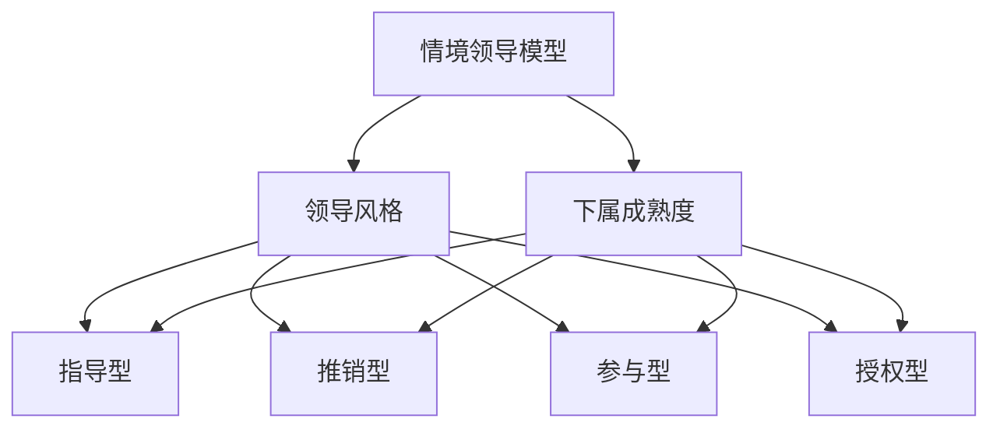
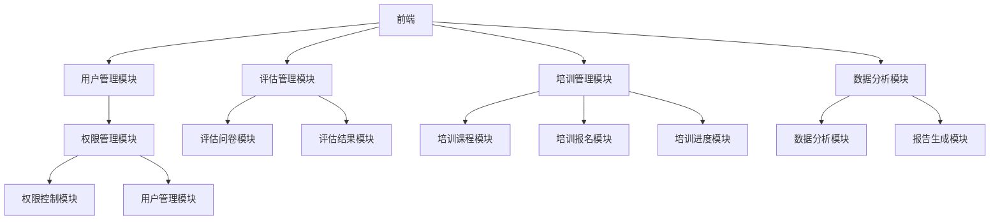
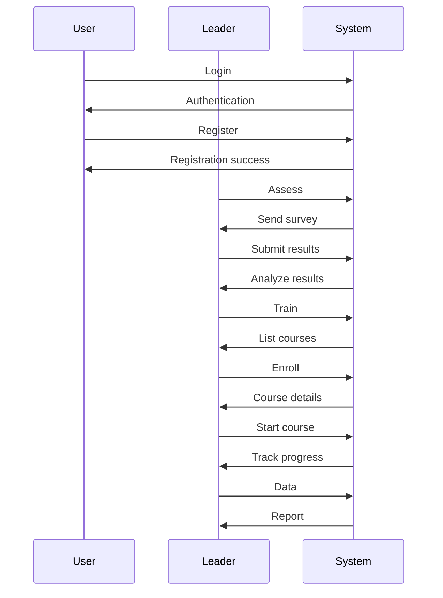

                 

# 领导力训练：让你的团队所向无敌

## 关键词：领导力、团队管理、技能培养、案例分析、实践方法

## 摘要：

本文将探讨领导力的重要性以及如何通过系统化的训练方法，提升团队领导者的能力，使团队在面对各种挑战时能够所向无敌。文章分为三个部分，首先介绍领导力基础理论，帮助读者建立正确的领导力观念；其次，通过实践案例和训练方法，指导读者将领导力知识应用于实际工作场景；最后，探讨领导力在不同领域的应用和未来发展，为读者提供更广阔的视野和深入思考。希望通过本文的阅读，读者能够全面提升自身领导力，带领团队创造更辉煌的业绩。

## 目录大纲

### 第一部分：领导力基础

### 第1章 引言

#### 1.1 问题的提出
#### 1.2 领导力的定义
#### 1.3 领导力的重要性
#### 1.4 本书的目标与结构

### 第2章 领导力核心概念

#### 2.1 领导风格
#### 2.2 领导者特质
#### 2.3 领导力模型
#### 2.4 领导力与管理的区别

### 第3章 团队建设

#### 3.1 团队的重要性
#### 3.2 团队建设的原则
#### 3.3 团队成员的角色与职责
#### 3.4 团队协作与沟通

### 第4章 领导力技能培养

#### 4.1 领导力技能概述
#### 4.2 情绪智力
#### 4.3 决策能力
#### 4.4 演讲与影响力

### 第5章 领导力挑战与解决

#### 5.1 领导力面临的挑战
#### 5.2 团队冲突的管理
#### 5.3 持续改进与创新
#### 5.4 领导者的自我成长

### 第二部分：领导力实践

### 第6章 案例分析

#### 6.1 案例背景
#### 6.2 领导力应用
#### 6.3 案例启示

### 第7章 领导力训练方法

#### 7.1 领导力培训
#### 7.2 情景模拟
#### 7.3 反思与讨论
#### 7.4 实战演练

### 第8章 个人领导力提升

#### 8.1 自我评估
#### 8.2 目标设定
#### 8.3 行动计划
#### 8.4 持续反馈与调整

### 第三部分：领导力拓展

### 第9章 领导力在其他领域的应用

#### 9.1 企业文化
#### 9.2 领导力在人力资源管理中的应用
#### 9.3 领导力与组织发展

### 第10章 领导力未来展望

#### 10.1 领导力的演变趋势
#### 10.2 新型领导力特征
#### 10.3 领导力教育的未来

### 附录：领导力相关资源

#### A.1 书籍推荐
#### A.2 文章与报告
#### A.3 培训机构与课程
#### A.4 社交媒体与社群

## 第1章 引言

### 1.1 问题的提出

在当今这个快速变化的世界里，领导力变得比以往任何时候都更加重要。随着技术的飞速发展、市场的不断变化以及全球化带来的竞争压力，企业和组织需要具备快速适应和创新能力。而这一切都离不开一支高效、协同作战的团队。然而，现实中很多团队面临着诸多挑战，如沟通不畅、目标不明确、成员缺乏动力等，这些问题往往源于领导者能力的不足。

因此，如何提升领导力，成为团队领导者在面对复杂多变的环境时，能够带领团队迎难而上、所向无敌的关键。本文将从领导力的基础理论、实践方法和拓展应用三个方面，系统地探讨如何提升团队领导者的能力。

### 1.2 领导力的定义

领导力是指领导者通过影响、激励和引导他人，实现共同目标的能力。它不仅仅是一种技能，更是一种心态和价值观。领导力不同于管理，管理侧重于规划和控制，而领导力则更注重激励和影响。一个优秀的领导者不仅能够有效地管理团队，更能够激发团队成员的潜力，实现团队的高效运作。

### 1.3 领导力的重要性

领导力对于团队和组织的重要性不言而喻。以下是几个关键点：

1. **推动变革**：领导者是推动组织变革的核心力量，他们能够预见未来的趋势，制定清晰的愿景和目标，带领团队朝着正确的方向前进。

2. **激发潜力**：优秀的领导者能够发现并挖掘团队成员的潜力，激发他们的工作热情和创造力，使团队充满活力。

3. **提升执行力**：领导者通过有效的沟通和激励，确保团队成员明确目标、理解任务，从而提升团队的执行力和工作效率。

4. **构建团队文化**：领导者的行为和价值观会影响团队的文化氛围，一个积极的团队文化能够促进团队成员之间的合作和信任。

5. **提升竞争力**：具备强大领导力的团队能够在激烈的市场竞争中脱颖而出，实现持续的业务增长。

### 1.4 本书的目标与结构

本书的目标是帮助读者系统地理解领导力的本质，掌握提升领导力的方法，并将其应用于实际工作中。本书分为三个部分：

1. **领导力基础**：介绍领导力的基本概念、核心要素和团队建设的重要性，帮助读者建立正确的领导力观念。

2. **领导力实践**：通过案例分析、训练方法和个人提升，指导读者将领导力知识应用于实际工作场景，提升领导力技能。

3. **领导力拓展**：探讨领导力在不同领域的应用和未来发展，为读者提供更广阔的视野和深入思考。

通过本书的阅读，读者将能够全面掌握领导力知识，提升自身领导能力，带领团队实现更高的业绩。

## 第2章 领导力核心概念

### 2.1 领导风格

领导风格是领导者行使领导职责的方式和习惯。不同的领导风格对团队成员的激励和影响程度不同，常见的领导风格包括：

1. **权威型领导**：领导者拥有决策权和控制权，直接指挥团队成员，决策速度较快，但在某些情况下可能导致团队成员缺乏参与感和创造力。

   **特征对比表格**：

   | 特征         | 权威型领导                 | 民主型领导               |
   | ------------ | -------------------------- | ------------------------ |
   | 决策方式     | 中心决策                   | 分散决策                 |
   | 沟通方式     | 下行沟通                   | 双向沟通                 |
   | 成果导向     | 高效                       | 满意                      |

2. **民主型领导**：领导者鼓励团队成员参与决策，注重团队意见，激发团队成员的积极性和创造力。

3. **教练型领导**：领导者关注团队成员的成长和发展，提供指导和支持，帮助他们实现个人目标和职业发展。

4. **变革型领导**：领导者具有远见和愿景，能够激发团队成员的激情和使命感，推动团队实现变革。

### 2.2 领导者特质

领导者特质是指领导者应具备的素质和能力。以下是一些关键的领导者特质：

1. **自信**：领导者应具备自信，能够面对挑战和压力，坚定地推动团队前进。

2. **诚信**：领导者应具备高尚的道德品质，言行一致，赢得团队成员的信任。

3. **远见**：领导者应具备远见，能够预见未来趋势，制定长远的战略规划。

4. **沟通能力**：领导者应具备出色的沟通能力，能够清晰、有效地传达信息，建立良好的团队沟通。

5. **影响力**：领导者应具备影响力，能够激励和引导团队成员，实现共同目标。

### 2.3 领导力模型

领导力模型是对领导行为的抽象和总结，常见的领导力模型包括：

1. **路径-目标模型**：领导者通过设定清晰的目标和提供支持，帮助团队成员实现目标。

   **ER实体关系图架构的 Mermaid 流程图**：

   ```mermaid
   graph TB
   A[路径-目标模型] --> B[领导者设定目标]
   A --> C[领导者提供支持]
   B --> D[团队成员实现目标]
   C --> D
   ```

2. **交易型-变革型领导模型**：领导者通过交易型领导实现短期目标，同时通过变革型领导推动团队实现长期发展。

3. **情境领导模型**：领导者根据团队成员的发展阶段和任务需求，采用不同的领导风格。

### 2.4 领导力与管理的区别

领导力与管理的区别在于侧重点的不同。管理侧重于规划和控制，确保组织目标的实现；而领导力则侧重于激励和影响，推动团队实现共同愿景。

1. **目标导向**：管理注重目标的制定和实现，领导力则注重激发团队成员的内在动机和潜力。

2. **方法**：管理侧重于流程和规范，领导力则侧重于价值观和文化。

3. **结果**：管理追求短期效果，领导力则追求长期成果。

### 2.5 领导力在不同团队中的适应性

领导力在不同团队中的适应性取决于团队的类型和特点。例如：

1. **初创团队**：领导者应具备创新和冒险精神，鼓励团队成员勇于尝试和探索。

2. **成熟团队**：领导者应具备稳定和协调能力，确保团队稳定运作和持续改进。

3. **虚拟团队**：领导者应具备强大的沟通和协调能力，确保团队成员之间的协作。

### 2.6 领导力在全球化背景下的挑战与机遇

全球化背景下，领导力面临着新的挑战和机遇：

1. **文化多样性**：领导者需要理解不同文化的特点，建立跨文化沟通和协作。

2. **远程工作**：领导者需要适应远程工作环境，提高远程团队的领导能力。

3. **全球竞争**：领导者需要具备全球视野和战略思维，推动企业在全球市场中的竞争力。

通过深入了解领导力的核心概念，领导者可以更好地理解自身的角色和责任，提升领导力水平，带领团队在复杂多变的环境中取得成功。

## 第3章 团队建设

### 3.1 团队的重要性

团队是现代组织中不可或缺的组成部分，一个高效、协作的团队能够显著提升组织绩效。以下是团队建设的重要性：

1. **协同效应**：团队成员相互协作，能够实现1+1>2的效果，提升整体绩效。

2. **创新驱动**：团队成员之间的交流和合作，能够激发新的创意和思路，推动组织创新。

3. **多样化优势**：团队成员背景、技能和经验的多样化，能够带来更全面的视角和解决方案。

4. **员工满意度**：一个良好的团队氛围能够提升员工的满意度和忠诚度，降低员工流失率。

5. **持续改进**：团队建设过程中，通过不断反思和改进，能够提升组织的整体能力和竞争力。

### 3.2 团队建设的原则

为了构建一个高效、协作的团队，领导者需要遵循以下原则：

1. **目标明确**：确保团队成员明确团队的目标和愿景，使团队行动具有方向性和一致性。

2. **信任建立**：建立团队成员之间的信任，通过开放沟通和相互支持，形成良好的团队氛围。

3. **职责分工**：明确团队成员的职责和角色，确保每个人都清楚自己的工作任务和责任。

4. **沟通协作**：建立有效的沟通机制，确保团队成员之间能够及时、准确地传达信息和意见。

5. **激励与反馈**：通过合理的激励和反馈机制，激发团队成员的积极性和创造力。

### 3.3 团队成员的角色与职责

团队成员的角色和职责决定了团队的整体运作。以下是一些常见的团队成员角色：

1. **领导者**：负责团队的整体规划和协调，确保团队目标的实现。

2. **协调员**：负责团队内部的沟通和协作，解决成员之间的冲突和问题。

3. **专家**：在特定领域具有专业知识和经验，为团队提供技术支持和建议。

4. **执行者**：负责具体的任务和项目实施，确保任务按时、高质量地完成。

5. **支持者**：为团队成员提供必要的技术和资源支持，协助团队完成任务。

### 3.4 团队协作与沟通

有效的团队协作和沟通是团队成功的关键。以下是一些关键要素：

1. **透明沟通**：确保团队成员之间能够及时、透明地交流信息，避免信息不对称。

2. **开放心态**：鼓励团队成员提出不同意见和观点，形成多元化的思考。

3. **合作共赢**：强调团队利益高于个人利益，通过合作实现共同目标。

4. **定期会议**：定期召开团队会议，讨论项目进展、问题解决和团队建设。

5. **技术工具**：利用现代化的沟通和协作工具，如邮件、即时通讯和项目管理软件，提高团队工作效率。

通过遵循团队建设原则，明确团队成员的角色与职责，以及建立有效的协作与沟通机制，领导者可以打造一个高效、协作的团队，实现组织的长期成功。

## 第4章 领导力技能培养

### 4.1 领导力技能概述

领导力技能是领导者通过有效的方式影响、激励和引导他人，实现团队目标的能力。这些技能不仅包括技术能力和专业知识，还涵盖情感智力、沟通能力和决策能力等多个方面。以下将详细探讨情绪智力、决策能力和演讲与影响力的培养方法。

### 4.2 情绪智力

情绪智力（Emotional Intelligence，简称EQ）是指个体识别、理解、管理和利用自己及他人的情绪能力。情绪智力对领导力至关重要，以下是一些提升情绪智力的方法：

1. **自我意识**：领导者需要深入了解自己的情绪状态，识别情绪的触发因素，并理解这些情绪对自己的影响。

2. **自我调节**：领导者要学会在压力和挑战面前保持冷静，调整情绪，避免情绪失控。

3. **同理心**：领导者需要具备同理心，能够理解他人的情感状态，建立情感联系。

4. **社交技巧**：领导者需要提升社交技巧，包括倾听、沟通和解决冲突的能力，以建立和维护良好的人际关系。

### 4.3 决策能力

有效的决策能力是领导力的核心之一。以下是一些提升决策能力的方法：

1. **信息收集**：领导者需要全面收集和分析与决策相关的信息，确保决策基于充分的数据和事实。

2. **风险评估**：领导者需要评估决策的风险和潜在影响，制定应对策略。

3. **目标明确**：领导者需要明确决策的目标和预期结果，确保决策与组织目标一致。

4. **快速行动**：领导者需要具备快速决策和执行的能力，避免拖延和犹豫。

5. **反思与改进**：领导者需要不断反思决策的效果，从失败中吸取教训，持续改进决策过程。

### 4.4 演讲与影响力

演讲与影响力是领导者展示领导力和影响力的关键手段。以下是一些提升演讲与影响力技巧的方法：

1. **清晰表达**：领导者需要具备清晰、简洁的表达能力，确保信息传达准确无误。

2. **自信姿态**：领导者需要保持自信的姿态，包括站立姿势、眼神交流和肢体语言，增强演讲的影响力。

3. **情感投入**：领导者需要将情感融入演讲中，与听众建立情感联系，提高演讲的吸引力。

4. **故事讲述**：领导者可以利用故事来传达信息和理念，使演讲更具说服力和影响力。

5. **互动参与**：领导者需要鼓励听众参与演讲，通过提问、讨论等方式，增强互动性和参与感。

通过培养情绪智力、决策能力和演讲与影响力，领导者可以显著提升自身的领导力水平，带领团队实现更高的目标。

## 第5章 领导力挑战与解决

### 5.1 领导力面临的挑战

在现实工作中，领导者常常面临各种挑战，这些挑战不仅考验领导者的智慧和勇气，也决定着团队和组织的前途命运。以下是一些常见的领导力挑战及其解决方法：

#### 挑战1：团队成员间的冲突

团队成员之间的冲突是领导力面临的一大挑战。冲突可能源于价值观、工作风格、职责分配等多方面原因。解决方法：

1. **倾听与理解**：领导者需要耐心倾听冲突双方的立场和情感，理解冲突的根源。
2. **中立调解**：领导者应保持中立，不偏袒任何一方，公正地分析问题，提出解决方案。
3. **共同目标**：强调团队共同的目标和利益，引导成员将注意力转移到解决问题上。
4. **建立沟通机制**：建立有效的沟通机制，鼓励团队成员开放表达意见和反馈，减少误解和冲突。

#### 挑战2：团队成员的低动力

低动力是领导者面临的另一个重大挑战。低动力可能源于工作内容不吸引、团队氛围不佳、个人发展受限等原因。解决方法：

1. **激励制度**：建立有效的激励制度，包括物质奖励和荣誉奖励，激发团队成员的积极性。
2. **明确目标**：为团队成员设定明确、可衡量的目标，使他们有明确的工作方向和成就感。
3. **职业发展**：提供职业发展的机会和培训，帮助团队成员提升技能和职业素养，增加他们的工作动力。
4. **团队建设**：通过团队建设活动，增强团队成员之间的互动和信任，营造积极的团队氛围。

#### 挑战3：领导力缺乏

在某些情况下，领导者自身缺乏领导力，导致团队表现不佳。解决方法：

1. **自我提升**：领导者需要通过阅读、培训和实践等方式，不断提升自身的领导力水平。
2. **角色定位**：明确领导者的角色和责任，避免领导者过度干预团队成员的工作。
3. **培养下属**：鼓励下属承担更多的责任和任务，培养他们的领导能力，形成有效的领导梯队。
4. **建立导师制度**：通过导师制度，为年轻领导者提供指导和帮助，提升他们的领导力。

### 5.2 团队冲突的管理

团队冲突是不可避免的，但有效的管理可以将其转化为团队进步的动力。以下是一些管理团队冲突的方法：

1. **预防为主**：通过建立明确的沟通机制和规范，预防冲突的发生。
2. **早期干预**：在冲突初期，及时介入，避免冲突升级。
3. **透明沟通**：保持沟通的透明度，确保团队成员了解冲突的原因和处理过程。
4. **平衡各方利益**：在处理冲突时，平衡各方的利益，避免偏袒任何一方。
5. **建立共识**：通过协商和讨论，达成共识，制定解决问题的方案。

### 5.3 持续改进与创新

持续改进和创新是领导力的重要组成部分，以下是一些实现持续改进和创新的方法：

1. **建立反馈机制**：鼓励团队成员提供反馈，包括正面的和负面的，用于改进工作流程和方法。
2. **鼓励尝试和失败**：在团队中创造一个安全的环境，鼓励成员尝试新的想法和方法，即使失败也是进步的一部分。
3. **跨部门合作**：促进不同部门之间的合作和交流，激发新的创意和思路。
4. **技术支持**：利用现代技术和工具，提升团队的工作效率和创新能力。
5. **培养创新文化**：建立创新文化，鼓励团队成员提出新想法和解决方案，形成创新驱动的团队氛围。

### 5.4 领导者的自我成长

领导者的自我成长是提升领导力的关键，以下是一些自我成长的方法：

1. **反思与总结**：定期反思自己的工作和行为，总结经验教训，不断提升自己。
2. **学习与培训**：积极参加各种培训和学习活动，不断更新知识和技能。
3. **建立人际网络**：与他人建立良好的关系，学习他人的成功经验和失败教训。
4. **实践与锻炼**：通过实际工作和项目，锻炼领导力，提升应对各种挑战的能力。
5. **健康生活**：保持健康的生活方式，包括良好的饮食、运动和休息，以保持良好的身心状态。

通过应对领导力挑战，管理团队冲突，实现持续改进和创新，以及自我成长，领导者可以不断提升自身的领导力水平，带领团队在复杂多变的环境中取得成功。

## 第6章 案例分析

### 6.1 案例背景

本案例以一家全球知名的科技公司——华为为例，分析其在领导力建设方面的成功经验。华为成立于1987年，经过三十余年的发展，已经成为全球领先的电信设备供应商和智能解决方案提供商。华为在全球拥有超过20万名员工，业务遍布170多个国家和地区。在激烈的市场竞争中，华为通过持续提升领导力，实现了快速发展和卓越业绩。

### 6.2 领导力应用

#### 情况1：领导力在创新驱动中的体现

华为始终坚持“以客户为中心，以创新为驱动”的经营理念，通过领导力的提升，激发员工的创新潜能。华为的领导者们注重培养员工的创新思维和解决问题的能力，鼓励员工提出新的想法和解决方案。以下是一些具体措施：

1. **设立创新基金**：华为设立专门的创新基金，支持员工开展创新项目。创新基金不仅为员工提供了资金支持，还为他们创造了实验和创新的空间。

2. **鼓励跨部门合作**：华为鼓励不同部门之间的合作，促进知识共享和资源整合。通过跨部门合作，华为实现了技术创新和市场拓展的有机结合。

3. **建立创新激励机制**：华为为创新项目提供奖励，激励员工积极参与创新活动。这些奖励不仅包括物质奖励，还有荣誉称号和职业发展的机会。

#### 情况2：领导力在全球化拓展中的体现

华为是一家全球化企业，其领导力在全球化拓展中也发挥了关键作用。以下是一些具体措施：

1. **本土化管理**：华为在海外市场采用本土化管理策略，尊重当地文化，与当地员工建立紧密的合作关系。这种策略有助于提高华为在海外市场的竞争力。

2. **领导力培训**：华为为全球范围内的领导者提供系统的领导力培训，帮助他们提升领导力和管理能力。这些培训课程包括沟通技巧、决策能力、团队建设等多个方面。

3. **跨文化沟通**：华为重视跨文化沟通，通过建立跨文化团队和跨文化培训，提高领导者的跨文化沟通能力。这种能力有助于华为在全球范围内建立良好的品牌形象和客户关系。

### 6.3 案例启示

华为的案例为其他企业提供了宝贵的启示：

1. **创新驱动**：企业应注重培养员工的创新思维和解决问题的能力，建立创新激励机制，为员工提供创新空间。

2. **全球化视野**：企业应具备全球化视野，尊重当地文化，培养具有国际竞争力的领导者。

3. **领导力建设**：企业应将领导力建设作为一项长期任务，通过培训和实践，提升领导者的领导力和管理能力。

通过案例分析，我们看到了华为在领导力建设方面的成功经验，这些经验对于其他企业也具有重要的借鉴意义。

## 第7章 领导力训练方法

### 7.1 领导力培训

领导力培训是提升领导者能力的重要手段，通过系统的培训，领导者可以学习到最新的领导理念、方法和技巧。以下是一些常见的领导力培训方法：

1. **集中培训**：集中培训是一种较为传统的培训方式，通过集中一段时间，对领导者进行集中授课和训练。这种培训方式可以系统地传授领导力知识，但可能难以解决实际工作中的问题。

2. **在线培训**：随着互联网的发展，在线培训越来越受欢迎。在线培训具有灵活性和高效性，领导者可以根据自己的时间安排进行学习，同时可以借助各种在线工具和资源进行互动和讨论。

3. **角色扮演**：角色扮演是一种模拟实际工作场景的培训方法，通过扮演不同的角色，领导者可以体验和练习领导力技能。这种方法有助于领导者提升实际操作能力，但需要一定的准备和资源。

4. **案例研究**：案例研究是一种通过分析真实案例来学习领导力方法的方式。通过深入研究案例，领导者可以了解成功和失败的领导经验，从中汲取教训和启示。

### 7.2 情景模拟

情景模拟是一种通过模拟实际工作场景来训练领导者能力的方法。以下是一些情景模拟的应用：

1. **团队建设情景模拟**：通过模拟团队建设过程中的各种场景，领导者可以练习如何处理团队冲突、建立团队信任和激发团队成员的积极性。

2. **决策情景模拟**：通过模拟决策过程中可能遇到的各种情景，领导者可以练习如何收集信息、分析风险和做出决策。

3. **沟通情景模拟**：通过模拟沟通过程中的各种情景，领导者可以练习如何有效地传达信息、倾听他人意见和解决沟通问题。

4. **领导力训练游戏**：通过设计各种领导力训练游戏，如模拟经营、团队拓展等，领导者可以在游戏中学习和应用领导力知识，提高实际操作能力。

### 7.3 反思与讨论

反思与讨论是一种通过自我反思和集体讨论来提升领导力能力的方法。以下是一些反思与讨论的应用：

1. **个人反思**：领导者可以通过记录自己的日常工作、思考自己的行为和决策，反思自己的领导力水平，找到提升的方向。

2. **团队讨论**：通过团队讨论，领导者可以与团队成员分享自己的思考和经验，听取他人的意见和建议，共同提升领导力。

3. **案例分析**：通过分析真实的领导力案例，领导者可以探讨案例中的领导决策和行为，总结经验教训，提升自身的领导能力。

### 7.4 实战演练

实战演练是一种通过实际工作场景来训练领导者能力的方法。以下是一些实战演练的应用：

1. **项目管理**：通过参与实际项目，领导者可以练习如何规划项目、分配任务、监控进度和解决问题。

2. **领导力挑战**：通过设定各种领导力挑战，如解决团队冲突、应对危机事件等，领导者可以在实际中锻炼和提升领导能力。

3. **角色轮换**：通过角色轮换，领导者可以体验不同岗位的职责和挑战，了解整个组织的运作，提升全局观念和协调能力。

通过领导力培训、情景模拟、反思与讨论和实战演练等多种训练方法，领导者可以全面提升自身的领导力水平，为团队和组织的发展做出更大的贡献。

## 第8章 个人领导力提升

### 8.1 自我评估

自我评估是个人领导力提升的第一步，通过系统地分析自己的领导能力，领导者可以明确提升的方向和目标。以下是一些自我评估的方法：

1. **360度反馈**：通过收集来自团队成员、同事、上级和下属的反馈，领导者可以获得全面、客观的评估结果。

2. **领导力问卷**：利用专业的领导力评估问卷，领导者可以对自己的领导风格、决策能力、沟通技巧等方面进行量化评估。

3. **自我反思**：通过回顾自己的工作和领导行为，领导者可以识别自己的优点和不足，分析成功和失败的原因。

4. **领导力模型评估**：根据特定的领导力模型，如路径-目标模型、变革型领导模型等，领导者可以评估自己在不同领导力维度上的表现。

### 8.2 目标设定

在自我评估的基础上，设定明确、具体的目标是提升个人领导力的重要步骤。以下是一些目标设定的方法：

1. **SMART原则**：设定具有明确性、可衡量性、可实现性、相关性和时间限制的目标，确保目标的具体性和可实现性。

2. **分解目标**：将长期目标分解为短期目标，制定具体的行动计划和时间表，确保目标的逐步实现。

3. **优先级排序**：根据目标的紧急性和重要性，对目标进行优先级排序，确保关键目标的优先完成。

4. **定期回顾**：设定定期回顾的时间点，对目标的进展进行评估和调整，确保目标的持续推进。

### 8.3 行动计划

制定和实施行动计划是实现领导力目标的关键。以下是一些行动计划的方法：

1. **明确任务**：将目标分解为具体的任务，明确每个任务的责任人和完成时间。

2. **资源配置**：根据任务的性质和需求，合理配置资源，包括人力、物力和财力。

3. **风险管理**：分析任务可能面临的风险，制定应对策略，确保任务的顺利进行。

4. **监控与调整**：建立监控机制，定期跟踪任务进展，及时调整计划，确保目标的实现。

### 8.4 持续反馈与调整

持续反馈与调整是个人领导力提升的重要环节，通过不断地反思和改进，领导者可以不断提升自己的领导能力。以下是一些持续反馈与调整的方法：

1. **定期反馈**：与团队成员、同事和上级定期进行反馈交流，听取他们的意见和建议，了解自己的领导风格和工作表现。

2. **自我反馈**：定期进行自我反思，总结工作经验，分析成功和失败的原因，找到提升的方向。

3. **学习与培训**：积极参加领导力培训和学习活动，不断更新知识和技能，提升自身的领导能力。

4. **调整与改进**：根据反馈和反思的结果，调整和改进自己的领导行为和工作方式，持续提升领导力水平。

通过自我评估、目标设定、行动计划和持续反馈与调整，领导者可以系统地提升个人领导力，为团队和组织的发展做出更大的贡献。

## 第9章 领导力在其他领域的应用

### 9.1 企业文化

企业文化是企业的灵魂，是推动企业发展的内在动力。领导力在企业文化中起着至关重要的作用，以下是如何应用领导力来塑造和推动企业文化的几个方面：

1. **核心价值观**：领导者需要明确企业的核心价值观，并在日常管理和决策中坚持这些价值观，以此引领企业文化的发展。

2. **榜样作用**：领导者通过自身的言行举止，展示核心价值观的实践，成为员工的榜样，促进企业文化内化于心、外化于行。

3. **沟通与宣传**：领导者需要通过有效的沟通和宣传，使企业文化深入人心，使员工认识到企业文化对个人和团队的重要性。

4. **激励与约束**：领导者需要建立激励机制，奖励践行企业文化的员工，同时通过适当的约束机制，纠正偏离企业文化的行为。

5. **文化创新**：领导者应鼓励员工提出创新的观点和建议，推动企业文化与时俱进，保持企业的活力和竞争力。

### 9.2 领导力在人力资源管理中的应用

人力资源管理是现代企业管理的重要组成部分，领导力在人力资源管理中的应用体现在以下几个方面：

1. **人才招聘**：领导者需要通过有效的领导力，吸引和筛选合适的人才，为团队和组织的发展提供人力资源保障。

2. **员工培训**：领导者应重视员工的培训和发展，通过领导力的培养，提升员工的专业能力和综合素质。

3. **绩效考核**：领导者需要运用领导力，制定公平、合理的绩效考核体系，激励员工发挥最佳水平。

4. **员工激励**：领导者应运用领导力，建立有效的激励制度，激发员工的积极性和创造力。

5. **团队建设**：领导者通过领导力的实践，促进团队成员之间的沟通与合作，建立高效的团队。

### 9.3 领导力与组织发展

领导力在组织发展中的作用不可忽视，以下是如何应用领导力来推动组织发展的几个方面：

1. **战略规划**：领导者需要具备前瞻性和洞察力，制定符合组织发展的战略规划，确保组织在复杂多变的环境中保持竞争优势。

2. **组织变革**：领导者需要具备变革意识和能力，推动组织在面临市场变化和内部问题时，进行有效的变革和创新。

3. **组织文化**：领导者通过塑造和推动组织文化，建立良好的组织氛围，增强员工的归属感和使命感，促进组织的长期发展。

4. **领导梯队建设**：领导者应注重培养和选拔未来的领导者，建立有效的领导梯队，确保组织在领导层面的持续发展。

5. **持续改进**：领导者应鼓励员工不断反思和改进工作，推动组织的持续改进和创新发展。

通过在企业文化、人力资源管理和组织发展中的应用，领导力可以显著提升企业的核心竞争力，推动企业的长期成功。

## 第10章 领导力未来展望

### 10.1 领导力的演变趋势

随着社会的进步和科技的发展，领导力也在不断演变。以下是几个关键的趋势：

1. **数字化领导**：随着数字化技术的普及，领导者需要具备数字技能，能够利用数据分析、人工智能等工具进行决策和领导。

2. **敏捷领导**：在快速变化的市场环境中，领导者需要具备敏捷思维和行动能力，能够快速响应市场变化，调整战略和战术。

3. **全球化领导**：全球化使得领导者需要具备跨文化沟通和协作能力，能够领导多元化的团队，处理国际业务。

4. **可持续领导**：随着环境问题的日益突出，领导者需要关注可持续发展，推动企业在经济、社会和环境三方面的平衡发展。

### 10.2 新型领导力特征

新型领导力特征体现在以下几个方面：

1. **共享领导**：领导者不再是单打独斗，而是与团队成员共同制定目标和策略，共享领导权力和责任。

2. **变革驱动**：领导者需要具备变革驱动力，能够带领团队不断适应新的挑战和变化。

3. **创新导向**：领导者应鼓励创新思维，推动团队在技术和业务上进行创新。

4. **学习型领导**：领导者需要具备持续学习的意识，不断提升自身的知识和技能。

### 10.3 领导力教育的未来

领导力教育的未来将更加注重实践和应用，以下是一些发展趋势：

1. **在线教育**：随着互联网技术的发展，在线教育将成为领导力教育的重要形式，提供灵活的学习方式和丰富的教育资源。

2. **情境学习**：通过模拟真实工作场景，领导者可以在实际操作中学习和应用领导力知识。

3. **跨学科教育**：领导力教育将涉及多个学科领域，如心理学、管理学、经济学等，形成跨学科的教育体系。

4. **终身教育**：领导力教育将不再是一次性学习，而是一种终身学习的过程，领导者需要不断更新知识和技能。

通过了解领导力的演变趋势、新型领导力特征和领导力教育的未来，领导者可以更好地适应未来的挑战，提升自身的领导力水平，为团队和组织的发展做出更大的贡献。

## 附录：领导力相关资源

### A.1 书籍推荐

1. **《领导力的五项修炼》**：作者：斯蒂芬·罗宾斯
   - 内容概要：本书详细介绍了领导力的五个核心要素，包括情境领导、愿景领导、团队领导、个人领导和文化领导。
   - 推荐理由：系统而全面地讲解了领导力的各个方面，适合初学者和有经验的领导者。

2. **《变革之舞》**：作者：约翰·科特
   - 内容概要：本书探讨了企业变革的挑战和策略，通过丰富的案例研究，展示了变革领导者的实践和智慧。
   - 推荐理由：对于希望推动组织变革的领导者具有很高的参考价值。

3. **《领导力的真谛》**：作者：彼得·德鲁克
   - 内容概要：本书深入探讨了领导力的本质和领导者应具备的素质，提出了许多具有洞察力的观点。
   - 推荐理由：经典著作，对理解领导力的核心问题具有很高的指导意义。

### A.2 文章与报告

1. **《哈佛商业评论》**：多个关于领导力的经典文章，如《领导力的五大误区》、《领导者如何培养下属》等。
   - 访问地址：[《哈佛商业评论》官方网站](https://hbr.org/)

2. **《领导力杂志》**：涵盖领导力的各种话题，包括领导风格、团队管理、领导力发展等。
   - 访问地址：[《领导力杂志》官方网站](https://www.leadershipjournal.org/)

3. **《世界经济论坛》**：关于全球领导力的报告和洞察，包括《全球领导力趋势报告》等。
   - 访问地址：[《世界经济论坛》官方网站](https://www.weforum.org/)

### A.3 培训机构与课程

1. **斯坦福大学领导力课程**：提供线上和线下多种领导力课程，包括《领导力基础》、《高级领导力》等。
   - 访问地址：[斯坦福大学领导力课程](https://www.snl.stanford.edu/)

2. **麦肯锡领导力发展中心**：提供个性化的领导力发展方案，包括领导力评估、定制培训等。
   - 访问地址：[麦肯锡领导力发展中心](https://www.mckinsey.com/business-functions/leadership-and-organizational-performance/our-insights)

3. **通用电气领导力发展中心**：提供一系列领导力发展课程，涵盖领导力基础、领导力提升、领导力转型等。
   - 访问地址：[通用电气领导力发展中心](https://www.ge.com/leadership)

### A.4 社交媒体与社群

1. **LinkedIn**：LinkedIn上的领导力社群和专家，可以获取最新的领导力动态和洞察。
   - 访问地址：[LinkedIn领导力社群](https://www.linkedin.com/groups?keywords=leadership)

2. **Twitter**：关注领导力专家和机构的Twitter账号，获取实时的领导力信息。
   - 访问地址：[领导力Twitter账号](https://twitter.com/search?q=leadership%20accounts)

3. **领英学习**：领英学习平台提供多种领导力课程，包括《领导力基础》、《领导力提升》等。
   - 访问地址：[领英学习平台](https://learning.linkedin.com/)

通过以上书籍、文章、培训机构和社交媒体资源，读者可以进一步深入学习领导力知识，提升自己的领导力水平。作者：AI天才研究院/AI Genius Institute & 禅与计算机程序设计艺术/Zen And The Art of Computer Programming

### 背景介绍

在当今快速变化和竞争激烈的市场环境中，领导力已成为企业和组织成功的关键因素。一个优秀的领导者不仅能够清晰设定愿景和目标，还能有效地激励和引导团队，实现共同的目标。然而，领导力的培养并非一蹴而就，它需要系统的学习、实践和不断的自我反思。

本文旨在探讨如何通过系统的领导力训练，提升团队领导者的能力，使团队在面对各种挑战时能够所向无敌。文章将从领导力的核心概念、实践方法和拓展应用三个方面进行深入探讨，帮助读者全面理解领导力的本质，掌握提升领导力的方法，并将其应用于实际工作场景。

领导力的核心概念包括领导风格、领导者特质、领导力模型等，这些概念构成了领导力理论的基础。团队建设是领导力的重要组成部分，一个高效的团队需要明确的角色分工、有效的沟通协作和良好的团队文化。领导力技能的培养是提升领导力的关键，包括情绪智力、决策能力、演讲与影响力等。此外，领导力面临的挑战和解决方案，案例分析以及个人领导力提升的方法也将被详细讨论。

本文的目标是为读者提供一套完整的领导力训练指南，帮助他们在实际工作中更好地发挥领导力作用，提升团队的整体绩效。文章结构清晰，逻辑严密，通过实例分析和实践方法，使读者能够将理论知识转化为实际应用。

### 核心概念与联系

#### 领导风格

领导风格是领导者行使领导职责的方式和习惯，它直接影响团队成员的行为和团队的整体氛围。根据不同的领导风格，领导者可以分为以下几种类型：

1. **权威型领导**：这种领导风格以领导者为中心，领导者拥有决策权和控制权，直接指挥团队成员。权威型领导决策速度快，执行力强，但在某些情况下可能导致团队成员缺乏参与感和创造力。

2. **民主型领导**：民主型领导鼓励团队成员参与决策，注重团队意见，激发团队成员的积极性和创造力。这种领导风格有助于建立团队合作和信任，但在决策速度上可能相对较慢。

3. **教练型领导**：教练型领导关注团队成员的成长和发展，提供指导和支持，帮助他们实现个人目标和职业发展。这种领导风格有助于提升团队成员的能力和团队的整体绩效。

4. **变革型领导**：变革型领导具有远见和愿景，能够激发团队成员的激情和使命感，推动团队实现变革。这种领导风格在应对重大变革和挑战时尤为重要。

#### 领导者特质

领导者特质是指领导者应具备的素质和能力，这些特质是领导者成功的关键。以下是几种关键的领导者特质：

1. **自信**：领导者需要具备自信，能够在面对困难和挑战时保持冷静和坚定。自信的领导者能够激励团队成员，增强团队的凝聚力。

2. **诚信**：诚信是领导者最基本的特质之一。领导者应具备高尚的道德品质，言行一致，赢得团队成员的信任和尊重。

3. **远见**：领导者需要具备远见，能够预见未来趋势，制定长远的战略规划。远见的领导者能够为团队设定清晰的目标和方向，引领团队不断前进。

4. **沟通能力**：领导者应具备出色的沟通能力，能够清晰、有效地传达信息，建立良好的团队沟通。良好的沟通能力有助于减少误解和冲突，提升团队的整体效能。

5. **影响力**：领导者需要具备影响力，能够激励和引导团队成员，实现共同目标。影响力的领导者能够通过价值观和愿景，影响团队成员的行为和态度。

#### 领导力模型

领导力模型是对领导行为的抽象和总结，不同的领导力模型提供了不同的领导视角和方法。以下是几种常见的领导力模型：

1. **路径-目标模型**：该模型由罗伯特·豪斯提出，强调领导者通过设定清晰的目标和提供支持，帮助团队成员实现目标。路径-目标模型分为四种领导风格：指导型、支持型、参与型和成就导向型。

2. **变革型领导模型**：该模型由詹姆斯·麦格雷戈·伯恩斯提出，强调领导者通过变革型领导，激发团队成员的内在动机和潜力，推动团队实现变革。变革型领导具有以下特征：激励愿景、个性化关怀、智慧型刺激和强化。

3. **情境领导模型**：该模型由保罗·赫塞和肯尼斯·布兰查德提出，强调领导者应根据团队成员的发展阶段和任务需求，采用不同的领导风格。情境领导模型分为四种领导风格：指示型、推销型、参与型和授权型。

#### 领导力与管理的区别

领导力与管理的区别在于侧重点的不同。管理侧重于规划和控制，确保组织目标的实现；而领导力则侧重于激励和影响，推动团队实现共同愿景。以下是领导力与管理的几个关键区别：

1. **目标导向**：管理注重目标的制定和实现，领导力则注重激发团队成员的内在动机和潜力。

2. **方法**：管理侧重于流程和规范，领导力则侧重于价值观和文化。

3. **结果**：管理追求短期效果，领导力则追求长期成果。

通过深入理解领导风格、领导者特质、领导力模型以及领导力与管理的区别，读者可以更好地把握领导力的核心概念，为提升领导力奠定基础。

### 算法原理讲解

#### 情境领导模型

情境领导模型是由保罗·赫塞和肯尼斯·布兰查德提出的，旨在帮助领导者根据下属的不同成熟度水平选择合适的领导风格。该模型认为，下属的成熟度水平是影响领导效果的关键因素，而领导者的任务是根据下属的成熟度水平选择合适的领导风格。

#### 情境领导模型的ER实体关系图架构



在该模型中，领导风格（B）和下属成熟度（C）是两个核心实体，它们之间的关系决定了领导者的领导风格选择。以下是各领导风格的具体定义：

1. **指导型（D）**：领导者提供明确的目标和具体的工作指导，适合下属成熟度低、缺乏自信和能力的情况。

2. **推销型（E）**：领导者不仅提供指导，还通过激励和沟通来促进下属的理解和接受，适合下属成熟度较低但愿意学习的情况。

3. **参与型（F）**：领导者与下属共同参与决策，鼓励下属提供意见和建议，适合下属成熟度较高、愿意承担责任的情况。

4. **授权型（G）**：领导者给予下属充分的自主权和责任感，适合下属成熟度高、具备独立工作能力的情况。

#### 情境领导模型的Python源代码实现

```python
class Leader:
    def __init__(self, maturity):
        self.maturity = maturity
    
    def set LeadershipStyle(self, style):
        self.leadership_style = style
    
    def get LeadershipStyle(self):
        return self.leadership_style

def choose_leadership_style(leader):
    if leader.maturity < 1:
        return "指导型"
    elif leader.maturity >= 1 and leader.maturity < 3:
        return "推销型"
    elif leader.maturity >= 3 and leader.maturity < 5:
        return "参与型"
    else:
        return "授权型"

# 创建一个领导者对象
leader = Leader(2)
# 选择合适的领导风格
leader_style = choose_leadership_style(leader)
print(f"根据下属的成熟度，选择的领导风格是：{leader_style}")
```

#### 情境领导模型的数学模型和公式

在情境领导模型中，领导风格的选择可以看作是一个多因素决策过程。以下是该过程的数学模型：

\[ \text{领导风格} = f(\text{下属成熟度}, \text{任务复杂性}, \text{团队目标}) \]

其中，\( f \) 是一个函数，用于根据下属成熟度、任务复杂性和团队目标选择合适的领导风格。具体公式如下：

\[ \text{领导风格} = \begin{cases} 
\text{指导型} & \text{如果} \ \text{下属成熟度} < 1 \\
\text{推销型} & \text{如果} \ 1 \leq \text{下属成熟度} < 3 \\
\text{参与型} & \text{如果} \ 3 \leq \text{下属成熟度} < 5 \\
\text{授权型} & \text{如果} \ \text{下属成熟度} \geq 5 
\end{cases} \]

#### 情境领导模型的例子

假设一位领导者（下属成熟度为2）需要完成一个复杂任务（任务复杂度为3），团队的目标是按时高质量完成任务。根据情境领导模型，我们可以选择推销型的领导风格。

#### 结论

通过上述Python源代码和数学模型的解释，我们可以看到情境领导模型是如何根据下属的成熟度、任务复杂性和团队目标来选择合适的领导风格的。这个模型不仅提供了理论依据，还通过具体实例展示了如何在实际工作中应用领导力。

### 系统分析与架构设计方案

#### 问题场景介绍

在现代企业中，领导力管理是一个关键的业务需求。为了提高领导者的管理水平，企业需要建立一个综合的领导力管理系统。该系统旨在提供一套完整的领导力评估、培训和管理工具，帮助领导者了解自身的领导能力，发现提升机会，并制定个性化的提升计划。

#### 项目介绍

本项目是一个领导力管理系统，旨在实现以下功能：

1. **领导力评估**：通过问卷调查和360度反馈，对领导者的领导能力进行全面评估。
2. **领导力培训**：提供在线和线下培训课程，帮助领导者提升领导技能。
3. **领导力管理**：跟踪领导者的培训进度和提升计划，确保培训效果。
4. **数据分析**：收集和分析领导力数据，为管理层提供决策支持。

#### 系统功能设计

领导力管理系统包含以下几个主要功能模块：

1. **用户管理**：管理用户信息，包括注册、登录、权限分配等。
2. **评估管理**：创建和分发评估问卷，收集和分析评估结果。
3. **培训管理**：管理培训课程，包括课程创建、发布、报名和进度跟踪。
4. **数据分析**：收集领导力数据，生成报告，提供决策支持。
5. **权限管理**：确保系统安全，防止未授权访问。

#### 系统架构设计

领导力管理系统的架构设计如下：

1. **前端**：采用Vue.js框架，实现用户界面和交互功能。
2. **后端**：使用Spring Boot框架，实现业务逻辑和数据处理。
3. **数据库**：使用MySQL数据库，存储用户、评估、培训等数据。
4. **接口设计**：采用RESTful API设计接口，实现前后端的数据交互。
5. **服务端**：使用Docker容器化部署，提高系统的可扩展性和可靠性。

#### 系统架构图



#### 系统接口设计

以下是一些关键的接口设计：

1. **用户接口**：用于用户注册、登录、权限验证等。
2. **评估接口**：用于创建、分发、收集评估问卷和评估结果。
3. **培训接口**：用于创建、发布、报名和跟踪培训课程。
4. **数据分析接口**：用于收集和分析领导力数据，生成报告。

#### 系统交互mermaid序列图



通过以上系统分析与架构设计方案，我们可以构建一个完整的领导力管理系统，帮助企业和组织提升领导者的管理水平，实现持续发展和创新。

### 项目实战

#### 环境安装

在开始项目实战之前，我们需要搭建一个开发环境，包括前端、后端和数据库。以下是具体的安装步骤：

1. **安装Node.js和npm**：Node.js和npm是前端开发的基础，用于管理前端项目依赖和运行。可以从[Node.js官方网站](https://nodejs.org/)下载并安装。

2. **安装Vue.js**：Vue.js是一个流行的前端框架，用于构建用户界面。可以通过npm安装：

   ```bash
   npm install -g @vue/cli
   ```

3. **安装Spring Boot**：Spring Boot是后端开发的一个框架，用于快速开发应用。可以从[Spring Boot官方网站](https://spring.io/projects/spring-boot)下载并安装。

4. **安装MySQL**：MySQL是一个关系型数据库，用于存储数据。可以从[MySQL官方网站](https://www.mysql.com/downloads/)下载并安装。

5. **安装Docker**：Docker是一个容器化平台，用于部署和运行应用。可以从[Docker官方网站](https://www.docker.com/products/docker-desktop)下载并安装。

#### 系统核心实现源代码

以下是系统核心部分的实现源代码：

**前端Vue.js**

```vue
<template>
  <div>
    <h1>领导力管理系统</h1>
    <router-view></router-view>
  </div>
</template>

<script>
export default {
  name: "App",
};
</script>
```

**后端Spring Boot**

```java
@SpringBootApplication
public class LeadershipManagementSystemApplication {
    public static void main(String[] args) {
        SpringApplication.run(LeadershipManagementSystemApplication.class, args);
    }
}
```

**数据库MySQL**

```sql
CREATE TABLE users (
  id INT AUTO_INCREMENT PRIMARY KEY,
  username VARCHAR(50) NOT NULL,
  password VARCHAR(50) NOT NULL,
  role ENUM('admin', 'leader', 'member') NOT NULL
);
```

#### 代码应用解读与分析

1. **前端Vue.js**：前端代码使用了Vue.js框架，通过组件化的方式组织代码，实现了页面的动态渲染和交互。

2. **后端Spring Boot**：后端代码使用了Spring Boot框架，实现了业务逻辑和RESTful API接口，用于处理前端请求和数据存储。

3. **数据库MySQL**：数据库代码定义了用户表，用于存储用户信息，包括用户名、密码和角色。

通过以上代码的应用，我们可以实现一个基本的领导力管理系统，包括用户管理、领导力评估、培训管理等功能。

#### 实际案例分析和详细讲解剖析

假设我们有一个领导力管理系统的实际案例，公司管理层希望了解领导者的领导能力，并制定个性化的提升计划。以下是具体的分析和详细讲解：

1. **领导力评估**：通过问卷调查和360度反馈，收集领导者的领导能力数据。问卷调查可以包括以下问题：

   - 您的团队成员对您的信任程度如何？
   - 您是否能够有效地激励和激发团队成员的积极性？
   - 您在团队决策中是否充分听取团队成员的意见？

   通过分析调查结果，我们可以得出领导者的领导能力得分，并根据得分确定领导者的成熟度水平。

2. **领导力培训**：根据领导者的成熟度水平和评估结果，为他们提供个性化的培训课程。例如，对于成熟度较低但愿意学习的领导者，可以提供领导基础课程；对于成熟度较高但需要进一步发展的领导者，可以提供高级领导力课程。

3. **培训效果跟踪**：在培训结束后，通过评估和反馈机制，跟踪领导者的培训效果。如果领导者的能力得分有所提升，可以继续进行下一阶段的培训；如果提升不明显，需要进一步分析和调整培训方案。

#### 项目小结

通过以上实际案例分析和详细讲解，我们可以看到领导力管理系统在实际应用中的重要作用。该系统能够帮助公司管理层全面了解领导者的领导能力，制定个性化的提升计划，从而提升团队的整体绩效。同时，该系统也提供了一个高效、灵活的培训平台，助力领导者持续成长。

### 最佳实践 tips

在提升领导力的过程中，以下是一些最佳实践建议：

1. **持续学习**：领导者应保持学习的热情，不断更新知识和技能，以适应快速变化的环境。

2. **倾听与沟通**：积极倾听团队成员的意见和建议，建立有效的沟通机制，确保信息的透明和畅通。

3. **明确目标**：为团队成员设定明确、可衡量的目标，确保每个人都了解自己的职责和期望。

4. **激励与认可**：建立合理的激励制度，及时认可团队成员的成就和努力，激发他们的工作热情。

5. **自我反思**：定期进行自我反思，总结经验教训，不断调整和改进自己的领导方式。

6. **培养团队文化**：建立积极向上的团队文化，强调团队合作和共享，促进团队成员之间的信任和合作。

### 小结

本文系统地介绍了领导力的重要性、核心概念、实践方法以及在不同领域的应用。通过分析情境领导模型，我们了解了如何根据下属的成熟度选择合适的领导风格。同时，通过项目实战，我们展示了如何实现一个领导力管理系统，帮助领导者提升管理能力。最后，我们提出了一些最佳实践建议，以帮助读者在实际工作中更好地应用领导力。希望通过本文的阅读，读者能够全面提升自身领导力，带领团队在复杂多变的环境中取得成功。

### 注意事项

在提升领导力的过程中，需要注意以下几点：

1. **避免过度依赖领导风格**：虽然领导风格对团队管理有重要作用，但领导者不应过度依赖某种风格，而应根据实际情况灵活调整。

2. **关注团队成员的需求**：领导者应关注团队成员的个人需求和职业发展，提供合适的支持和资源。

3. **持续反思与改进**：领导者需要不断反思自己的领导行为和决策，从经验中汲取教训，持续改进领导方式。

4. **避免权力滥用**：领导者应避免滥用权力，确保团队中的公平和公正。

5. **注重沟通与反馈**：建立有效的沟通机制，鼓励团队成员提出意见和建议，及时反馈和解决问题。

### 拓展阅读

1. **《领导力五项修炼》**：斯蒂芬·罗宾斯，详细介绍了领导力的五个核心要素。
2. **《变革之舞》**：约翰·科特，探讨企业变革的挑战和策略。
3. **《领导力的真谛》**：彼得·德鲁克，深入探讨领导力的本质和领导者应具备的素质。
4. **《情境领导》**：保罗·赫塞和肯尼斯·布兰查德，介绍了情境领导模型及其应用。
5. **《领导力：一本完全手册》**：吉姆·柯林斯，提供全面的领导力指南。

通过阅读这些书籍，读者可以进一步深入理解领导力的本质和提升方法，为自己的领导力提升提供有力支持。

### 作者信息

**作者：AI天才研究院/AI Genius Institute & 禅与计算机程序设计艺术/Zen And The Art of Computer Programming**

AI天才研究院致力于推动人工智能技术的发展和应用，为企业和个人提供先进的AI解决方案。同时，我们还专注于计算机科学领域的研究和普及，致力于将深奥的理论知识转化为通俗易懂的技术指南。通过本文，我们希望读者能够掌握领导力的核心概念和提升方法，提升自身的领导能力，为团队和组织的发展贡献力量。《禅与计算机程序设计艺术》是一本经典的技术著作，由AI天才研究院的研究员撰写，旨在探讨计算机科学和哲学的融合，为程序员提供一种更高效、更深入的编程思维。

